# 81. The phonology of Slavic

1.Introduction

2.From Proto-Indo-European to Proto-Slavic

3.Early Common Slavic (ECSl) changes

4.Middle Common Slavic (MCSl) changes

5.Late Common Slavic (LCSl) changes

6.Suprasegmental phonology

7.Sectional references

8.References

## 1. Introduction

The Slavic (Sl) branch of Indo-European (IE) has three sub-branches − South (SSl), West (WSl), and East (ESl). SSl has eastern and western divisions. E-SSl comprises Bulgarian (Bg), Macedonian (Mc), and the Sl dialects of northern Greece; Old Church Slavonic (OCS, 10th−11th cc.) was E-SSl in its basis. W-SSl comprises Slovenian (Sln) and pluricentric Bosnian/Croatian/Serbian (BCS; separately Bo, Cr, Sb), also known as <i>Serbo-Croatian</i>. BCS has three markedly different dialects, each with an old written tradition: Štokavian (Što), the basis of standard Bo, Cr, and Sb; Kajkavian (Kaj) in Croatia, historically affiliated with ESln; and Čakavian (Čak) along the Adriatic coast and in the islands, in a continuum with WSln.

WSl is divided into three zones: southern or Czecho-Slovak (CzSlk); southwestern or Sorbian (Sorb); and northern or Lechitic (Lech). CzSlk comprises the dialect continuum of Cz and Slk. Sorb, bridging CzSlk and Lech, survives in Lusatia (eastern Germany) − hence the alternative name <i>Lusatian</i>; Upper Sorbian (US) is spoken on the upper reaches of the Spree River, to the south of Lower (LS). Lech comprises Polish (Po); the Silesian ethnolect, which converges on Cz; the Pomeranian languages of the Baltic coast; and Polabian (Pb), spoken west of the Elbe in Hanoverian Wendland until the 18th c. Within Pomeranian, only Kashubian (Kb, also <i>Cassubian</i>) survives; spoken west of Gdańsk; it is sometimes presented as a dialect of Po − a tradition spurred by the political needs of interwar Poland. Slovincian (Slc), in a continuum with Kb, extended west to the Parsęta River; it died out in the early 20th c. Central Pomeranian dialects, spoken as far east as the Elbe, succumbed to germanization in the Middle Ages.

The ESl languages are Rusyn, Ukrainian (Uk), Belarusian (BR), and Russian (Ru). Rusyn (<i>Carpatho-Rusyn</i> or <i>Ruthenian</i>) is spoken in eastern Slovakia and western Ukraine, and in enclaves in Romania, Serbia, and Croatia, where the dialects show heavy influence from SSl; in Uk scholarship, as in Soviet-era studies, it is usually presented as a WUk dialect.

### 1.1. Common Slavic and its speakers

The reconstructed Sl protolanguage is called <i>Common Slavic</i> (CSl), or sometimes <i>Proto-Slavic</i> (PSl). The latter term will be reserved here for the starting-point for the CSl changes (see 2). There is a hoary tradition of presenting CSl as a single coherent, impermeable “language”. It is better approached as a permeable dialect continuum in which a set of shared changes took place. The time frame of the changes can be called the <i>CSl period</i>, but it should be kept in mind that its limits are relative and floating; the CSl changes did not come to a simultaneous end, and some overlapped with changes that belong to the histories of the individual languages.

For brevity, the term <i>Slavophone</i> will be used to denote ‘speaker of CSl’. This carries no ethnic implications. In two centuries of debates about the ethnogenesis of the <i>Urheimat</i> of the Slavs, CSl has usually been envisioned as a distinct language from the beginning of the CSl changes; its speakers have usually been essentialized as “Proto-Slavs.” The discussions have been muddled by nationalism and essentialist notions of ethnic identity. Scholars have dated the emergence of CSl language, and thus the ethnogenesis of the Slavs, as early as ca. 1000 BCE and as late as ca. 400 CE. They have placed the Slavic <i>Urheimat</i> in regions from the Vistula below the Danube, and from the Bohemian Forest to southwestern Russia − often in their own homelands. Advocates of early emergence have projected “Proto-Slavs” into the Bronze-Age Lusatian culture (before ca. 500 BCE) and laid claim to opaque tribal names in Herodotus (ca. 440 BCE) and an obscure word in Aristophanes (422 BCE). Proponents of late emergence have assumed that there was no pre-migration CSl identity because none could be proven; they have even asserted that, in the 6th c., the Slavs were “a nascent ethnos with a newly consolidated language” (Lunt 2001: 182). It is not explained how the consolidation took place when the “nascent ethnos” was already diffused from the Baltic to the Danube and from the Elbe to the Don.

The autonym *<i>slau̯ɛ:n(isk)-</i> ‘Slav(ic)’ is undoubtedly PSl. In the 6th−7th centuries, peoples calling themselves *<i>slau̯ɛ:nɛ</i> were settling in quite far-flung regions − Greece, the eastern Alps, the Carpathian Basin, the Elbe, northwestern Russia. As the various settlers could not have had direct contacts, their self-designation must have been coined before the Migration Period. The same is true of their shared exonym for ‘foreigner; Teuton’ (*<i>nɛ:mika₂s</i>); the fact that this was derived from the adjective *<i>nɛ:m</i>- ‘mute; jabbering’ shows that the various Slavophone groups distinguished themselves from others on linguistic grounds − the use of intelligible language. The autonym *<i>slau̯(ɛn)</i>-continued to be used among the Sl peoples who experienced the most intense language contacts − the Slavs of Aegean Macedonia (with Greek), the Slovenians (with Italian and German), the Slovaks (with Hungarian), the Slovincians (with German), and the early medieval Slovenes of northwestern Russian (with Baltic Finnic [BFi]).

There are clear historical references to Slavophones starting in 6th-c. Byzantine texts, when the <i>Sclaveni</i> (Σκλαβηνοί, from *<i>slau̯ɛ:nɛ</i>) began raiding, and later settling, in the imperial territories south of the Danube. Byzantine authors linked the Sclaveni with tribes called <i>Veneti</i> and <i>Antae</i>, who may also have been Slavophones. There were also Slavophone Veneti in central Europe, mentioned in 7th−8th-c. Frankish texts: OHG <i>Winida</i> ‘Slavs’; older German <i>windisch</i> ‘Slovenian’, <i>Wenden</i> ‘Sorbs’; cf. Finnish <i>Venäjä</i> ‘Russia’. In the <i>Urheimat</i> debates, the Veneti have been identified with the <i>Venedi</i> of the Vistula, mentioned by Roman authors in the 1st−4th centuries. Some scholars have gone further and have identified the Vistula region as the Slavic <i>Urheimat</i>. While Slavophones may have lived on the Vistula in the 1st c., there is no certainty that the Venedi were ancestors of the later Veneti. Elsewhere in Iron Age Europe, a related ethnonym was used for clearly non-Slavophone peoples, including those who gave their name to Venice; cf. also Celtic *<i>windo</i>- ‘white’. There are no grounds for concluding that the Vistulan Venedi had lived there from time immemorial (see 1.1.1), or even that they were a homogeneous ethnicity. Ethnonyms are often reassigned based on proximity or alliances rather than ethnolinguistic relatedness: Gmc <i>gut-</i> ‘Goth’ became <i>gùdas</i> ‘Belarusian’ in Lithuanian (Li); the Turkic ethnonym <i>Bulgar</i> came to denote the East Balkan Slavs by an elite transfer.

#### 1.1.1. Localization of pre-migration CSl

Judging from shared vocabulary relating to the natural world, pre-migration Slavophones lived primarily in inland, non-mountainous regions. They did not live close enough to a sea to develop maritime vocabulary; their word for ‘island’ presupposed currents rather than tides: *<i>ab</i>- ‘around’ + *<i>srau̯a</i>- ‘flow’. They had shared terms for the aspen, birch, hornbeam, linden, and maple, all native to the parkland (forested-steppe) zone of Eastern Europe, but not for the beech, bird-cherry, sorb, sycamore, or larch of central and south-eastern Europe. Likewise, there was a shared word for the spotted grouse of parkland environments, but not for the partridge of the steppes. Their alpine vocabulary was meager. For example, they had no shared term for ‘chamois’; in the attested languages, the animal is denoted by older ‘roe deer’, by the compound ‘wild goat’, or by Gmc loanwords.

For negative evidence, pre-migration Slavophones evidently had little or no contact with Celtic, Italic, or Greek (Gk); there are virtually no CSl loanwords from those languages, nor are there identifiably Sl names or words in Gk and Latin (La) sources prior to the 6th c. This rules out pre-migration settlements in the Balkans or the Romanized zones west of the Black Sea.

For positive evidence, the pre-migration Slavophones had significant contacts with speakers of Iranian (Irn) languages, as shown, <i>inter alia</i>, by shared semantic innovations: PIE *<i>nebhos</i> ‘cloud’ → ‘heaven’; *<i>bhag</i>- ‘good lot’ → ‘god’. The Irn ethnonym <i>Spali (Spalaei)</i> may be the source of a CSl word for ‘giant’ − OCS, OESl <i>spolъ</i>, OESl <i>ispolinъ</i>, OPo <i>stolin</i> (with the individuative suffix <i>-in</i>-). The Sl ethnonym *<i>xuru̯a:t</i>- ‘Croat’ is of Irn origin, and *<i>sirb</i>- ‘Serb, Sorb’ may be as well. While the Irn dialects occupied a vast domain, the Sl-Irn contact zone can be narrowed to the “Scythia” of antiquity (7th c. BCE−2nd c. CE), given the absence of CSl borrowings from Finno-Ugrian and the paucity of CSl loanwords from Turkic.

The pre-migration Slavophones also had significant contacts with Germanic (Gmc). Among the numerous loanwords are *<i>xu:z</i>- ‘house’ and *<i>kuning</i>- ‘ruler’. Gmc speakers were the prototypical foreigners; CSl *<i>ti̯udi̯</i>- ‘foreign, alien’ is borrowed from the Gmc autonym (Go <i>þiuda</i> ‘nation’); cf. also *<i>nɛ:mika₂s</i> ‘jabberer; German’ (1.1). The zone of contact was probably the eastern part of the Northern European Plain and, from the 1st c. CE, the plains east of the Carpathians. (In those regions, the Przeworsk [3rd c. BCE− 5th c. CE] and Wielbark [1st−4th centuries] cultures are thought to have included Gmc speakers.) Slavophones also borrowed many words of specifically EGmc provenience, e.g. *<i>kau̯p</i>- ‘buy’ and *<i>xandag</i>- ‘skillful’. The probable zone of contact was north of the Pontic steppes, where the Cherniakhovo culture (2nd−5th centuries) developed after southward migrations by EGmc speakers, including the Goths (Go) documented in Roman and Byzantine sources. (Slavophones probably also had extensive contact with Baltic [Ba] speakers in the mixed-forested zone of northeastern Europe, but early Ba loan-words are difficult to identify because of the structural similarities between PSl and PBa [see 2].)

The reconstructed vocabulary relating to the natural world and the evidence from early loanwords both suggest that the pre-migration Slavophones inhabited the parklands (forested steppe) in present-day central and northern Ukraine and southern Belarus, perhaps extending in the west to the outer foothills of the Carpathians (now Ukraine and Romania) and to the plains of eastern Poland. This localization triangulates with evidence from reconstructed river names. In the middle Dnieper region, south of the tributary Pripiat’, the old hydronyms are predominantly CSl in origin, e.g. <i>Berezina</i> (PSl *<i>bɛrz</i>- ‘birch’), <i>Desna</i> (PSl *<i>dɛsn</i>- ‘right’). To the north, in the forested belt, most of the major river names have etymologies that are transparent in Ba but not in Sl, e.g. <i>Neman</i> and <i>Polota</i>. To the northwest, in Poland, many of the hydronyms originated in other IE dialects, e.g. <i>Wisła (Vistula)</i>, <i>Narew</i>, and <i>San</i>. In the south and east, in the steppes, the major rivers have etymologies that are transparent in Irn but not in Sl − e.g. Dniester, Dnieper, Donets, and Don, all formed from Irn *<i>danu</i>- ‘river’.

#### 1.1.2. CSl during the Migration Period

Slavophones spread to the outer foothills of the Carpathians in incremental waves of advance, probably along right tributaries of the Dnieper. By the late 5th c., the CSl linguistic domain ranged to the Danube in the south and to the Vistula, if not further, in the northwest. The expansion of the Slavophone zone was certainly due in large part to migrations; however, it may have also been promoted by acculturations, with CSl adopted as a lingua franca by peoples from other ethnolinguistic traditions. The migration of Slavophones seems to have proceeded hand in hand with the spread of the Korchak archaeological culture (first attested ca. mid-6th c. in present-day central Ukraine), which Heather (2011: 448−449) has interpreted as “a pared-down” material culture suitable for migration.

<!-- source-file: content/07_chapter01_2.xhtml -->

In the 5th−6th centuries, Slavophones advanced westward into southeastern Europe along the Danube and its tributaries. The <i>Sclaveni</i> first appear in 6th-c. Byzantine sources, which record their raids south of the Danube beginning in the reign of Justin I (518− 526). In the 530s−550s, they were migrating along the Sava and Drava rivers into the Byzantine provinces of Pannonia and Dalmatia, as far as the Adriatic coast. By 600, they had moved northwest into the Eastern Alps, where they threatened the Lombards in northeastern Italy, and northward into the southern Pannonian Plain. It was in these regions that the W-SSl dialect zone crystallized.

By the mid-6th c., <i>Sclaveni</i> migrating from the north overwhelmed the Byzantine frontier on the Danube and began settling in the central and eastern Balkans; as of 581, they were established in peninsular Greece as far south as the Peloponnesus. These were the regions where the E-SSl dialect zone crystallized, converging with W-SSl in the central Balkans. Only coastal regions and some inland garrisons remained under Byzantine control. Some of the Slavs became imperial federates. There was no exodus of the Gk- and Rom-speakers of the region; undoubtedly, there was extensive language contact, and probably language shifts from Gk or Rom to Sl and vice versa. To this day, there are still many speakers of E-SSl dialects in continental Greece (Aegean Macedonia). In peninsular Greece, the Slavophones were gradually hellenized after the empire regained control of the region (ca. 800); unassimilated Slavophones (<i>Milingoi and Ezeritai</i>) still lived in the southern Peloponnesus in the 14th c.

In 679, the Turkic-speaking Bulgars invaded the eastern Balkans. In the late 7th−early 9th centuries, they established control over much of the region, including a large Slavophone population. By the mid-9th c., the Bulgars had become slavicized in language and culture, while the Slavophones in their domains had become identified as <i>Bulgar(ian)s</i>.

The Sl movements into East Central Europe are not as well documented. According to Procopius (died ca. 560), when the Gmc Herulians migrated from the western Danube to Denmark (508−514), the territories that they crossed were all in the hands of the <i>Sclaveni</i>. If true, this indicates that Slavophones had settled in the basins of the Vltava (Moldau) and the Elbe during the 5th c., if not earlier. There they came into contact with residual Gmc groups, who over time acculturated to the new residents. Some Slavophone migrations into the Carpathian Basin had proceeded westward through passes; others came north from the Danube and the southern foothills of the Carpathians. (These migrations have been linked with the westward spread of Korchak-type cultures.) P-CzSlk crystallized in the inner foothills of the Western Carpathians; in the Pannonian Plain, it converged with P-W-SSl to form a continuum that endured until the early 10th-c. entry of the Magyars into the <i>Puszta</i> (LCSl¹ *<i>pust</i>- ‘empty’).

In the 560s, the Avars, nomads with roots in Central Asia, established themselves north of the Danube. Their ferocity made such an impression on the Slavophones of the region that their ethnonym *<i>abr</i>- came to mean ‘giant’: Sln <i>ober</i>, Slk <i>obor</i>, OCz <i>ober</i>, US <i>hob(je)r</i>, OPo <i>obrzym</i>. The Avar migration occasioned population shifts in the Carpathian Basin; some Slavophone groups migrated as federates, and others as refugees. Evidently, P-Sorb crystallized as a result of westward migrations; judging from lexical evidence, it originally had stronger affiliations with P-SSl and P-ESl than with P-WSl. Indeed, the ethnonyms ‘Sorb’ and ‘Serb’ have the same origin. Byzantine sources of the 8th−10th centuries mention “White Croats” in the northern reaches of the Carpathian Basin; Constantine VII (ca. 940) relates a tradition that the Croats and Serbs emigrated from “White Croatia” and the otherwise undocumented “White Serbia” to Dalmatia, where they were granted lands by Heraclius (reigned 610−641). This suggests an elite transfer rather than a mass migration: the incomers adapted to the P-SSl dialects already established in the region, whose speakers adopted the ethnonyms of the newcomers.

Other Slavophones migrated in waves of advance across the Northern European Plain, probably in the wake of the Gmc westward migrations (4th−6th centuries). The Prezeworsk archaeological culture, thought to be predominantly Gmc in language, disappeared by the early 5th c.; thereafter, the Korchak-like Mogiła (early 6th c.) and Prague (later 6th c.) cultures began to spread to the west, while a somewhat distinct culture, termed Sukow-Dziedzice, emerged in the plains (later 6th c.); the latter may reflect interactions between new settlers and residual peoples. Some of the Slavophone migrants passed into the Carpathian Basin (see above); others moved along the outer foothills of the Carpathians and northward along river systems as far west as the Elbe (north of the confluence with the Havel). This was the region in which the P-Lech dialects crystallized. The presence of Slavic dialects between the Elbe and the Oder is well documented in medieval sources; while they eventually succumbed to the <i>Ostsiedlung</i>, they left numerous traces in the surnames and toponyms of eastern Germany, e. g. <i>Lübeck</i> (‘lovely’), <i>Rostock</i> (‘outward-flow’), <i>Ribnitz</i> (‘fishery’), <i>Dresden</i> (‘riverside forest’), and <i>Leipzig</i> (‘linden’). There was a convergent wave of P-Sorb settlement from the south, which reached the Elbe and Saale.

There is no early documentation for the migrations of P-ESl speakers, but there is archaeological evidence that shows population movements eastward and northward from the Dnieper Basin in the 6th−8th centuries. It can be assumed that Slavophones moved gradually into Belarus and southwestern European Russia along the northern Dnieper and its tributaries. To the south, the Penkovka culture, similar to the Korchak, formed by the mid-6th c. and spread to the mid-Don basin in the 7th c. This has been connected with Slavophone migrations into eastern Ukraine and southwestern Russia. Successor cultures reached the mid-Volga in the 8th−9th centuries. There were undoubtedly Slavophones among the settlers; this is indicated by the fact that the northeastern OESl dialects, concentrated in the Oka River basin and adjacent parts of the northern Volga (the Rostov-Suzdal’ region), had more in common with Kievan OESl than with the Novgorodian (Novg) dialect to their northwest. The latter developed as Slavophones migrated along the northern Dnieper and the Lovat’ (ca. 7th−8th centuries). The territories that they settled were inhabited by Ba and BFi speakers, with whom they had intense language contact. By the 9th c., P-Novg crystallized on Lake Il’men’, the northern limit of the Lovat’, near the headwaters of the Volga. Later, there were additional waves of migration into northern Russia and down the Volga, which ultimately converged with the post-Penkovka settlements.

### 1.2. Early Slavic writing

Slavophone writing began with Cyril and Methodius’ translations into OCS. Based on the E-SSl dialect spoken near Thessaloniki, OCS was first used in areas of CzSlk and Sln settlements (860s−885); fragments of OCS with Moravian (Cz) features, the Kiev Folia, have survived from the 10th c. By the 890s, OCS was established as the written language of the Bulgarian Kingdom (central and eastern Balkans); the main manuscripts date from the 10th−11th centuries. Later, the Cyrillo-Methodian tradition spread to other Eastern-rite lands, where it evolved into the regional varieties (“recensions”) of <i>Church Slavonic</i> (ChSl). Sb-ChSl inscriptions are known from the late 10th−11th c., and ESl-ChSl texts from the early 11th c. The Cyrillo-Methodian written language spread separately to Western-rite Croatia in the late 9th c.; the oldest attested Cr-ChSl texts date from the 10th−early 11th c. (During the Renaissance, a new tradition of vernacular writing developed in Croatia under Italian influence.)

In Western-rite regions, vernacular literacy was slower to take root because of the use of La. Apart from the OSln Freising Fragments (later 10th-c.), vernacular Sl writing in the La alphabet is first attested in autonomous states − Bohemia (OCz, from the 13th c.) and Poland (OPo, from the 14th c.). For the stateless languages, enduring traditions of writing began with the Reformation, in the late 16th c. (Sln, Sorb, Kb, and Slc) or 17th c. (Slk). Pb never had a written tradition; its dying breaths were recorded by antiquarians in the 18th c.

### 1.3. Citation conventions

#### 1.3.1. Correspondence sets

When possible, the sets include data from SSl, ESl, CzSlk, and Lech, preferably from the languages of oldest attestation − OCS, OESl, OCz, and OPo. Cyrillic and Glagolitic are romanized according to the ISO 1995 standards for Cyrillic, except for the following. (a) Cyrillic «х» → <i>h</i> for Mc and Sb; <i>x</i> for Bg and ESl. (b) 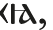є/ѥ, ю» → <i>a</i>, <i>e</i>, <i>u</i> after «C», but <i>ja</i>, <i>je</i>, <i>ju</i> initially and after «V». (c) «ѧ/ѩ» → OCS <i>ę</i>, OESl <i>ʲa</i> after «C», but OCS <i>ję</i>, OESl <i>ja</i> initially and after «V». (d) «ѭ» → OCS <i>ǫ</i>, OESl <i>u</i> after «C», but OCS <i>jǫ</i>, OESl <i>ju</i> initially and after «V». (e) «ѣ» = OCS, OESl <i>ě</i>, <i>jě</i> after «C»; OCS <i>ja</i>, OESl <i>jě</i> initially and after «V» (see also 5.2.1). (f) OCS and OESl palatalized sonorants → <i>rʲ</i>, <i>nʲ</i>, <i>lʲ</i> (not <i>rj</i>, <i>nj</i>, <i>lj</i>).

#### 1.3.2. Reconstructed Sl forms

Sl etymological dictionaries use an anachronistic transcription for vowels, based on OCS: <i>i</i>, <i>ь</i>, <i>y</i>, <i>ъ</i>, <i>ě</i>, <i>e</i>, <i>a</i>, <i>o</i> for *i:, *i, *u:, *u, *e:, *e, *a:, *a (see 5.1). They transcribe consonants at various stages of development; hence many of the reconstructed lemmas are chimerical, with vocalism and consonantism that never coexisted. To avoid this problem, the present work uses IPA transcription, with the caveat that the phonetic values are approximative. The Slavistic transcription conventions are mentioned when they differ from the IPA. The symbols <i>c</i> and <i>y</i>, which in IPA transcribe the voiceless palatal stop and close front rounded vowel, represent the voiceless dental affricate <i>ts</i> and close central vowel <i>ɨ</i> in the Slavistic tradition<i></i>. To avoid confusion, <i>c̟</i> is used for IPA <i>c</i> and <i>ü</i> for IPA <i>y</i>. Intonations are only reconstructed when suprasegmental phonology is discussed specifically (2.2, 4.9, and 6−6.4.4).

#### 1.3.3. Glosses

Words are not grammatically glossed if cited in their lemma forms − INF for verbs; NOM.SG for nouns; M.NOM.SG for adjectival pronouns; and M.NOM.SG.INDEF for adjectives in SSl and ESl, but DEF for WSl, where short-forms are rare. Non-lemma forms are glossed by the Leipzig rules; singular number is not glossed. The participles are abbreviated: PRAP = present active; PRPP = present passive; PAP = past active; PPP = past passive; and RES = resultative.

#### 1.3.4. Slavic verbal classes

Slavic verbal classes are labeled by the Leskien ([1871] 1962) system. Roman numerals refer to the PreSl themes: I = *<i>e</i>/<i>o</i>, II = *<i>ne</i>/<i>no</i>; III = *<i>i̯e</i>/<i>i̯o</i> (IIIa = Ø, IIIb = *<i>a</i>:); IV = *<i>ei̯</i> (IVa = *<i>i</i>:, IVb <i>= *e</i>:, IVc = *<i>a</i>:); V = athematic. Lower-case letters refer to the infinitive classifiers: <i>a</i> = Ø (I and III) or *<i>i</i>: (IV); <i>b = *a</i>: (I, III) or *<i>e</i>: (IV); <i>c = *a</i>: (IV).

### 1.4. Symbols and Abbreviations

<table>
<tr><td>></td><td>precedes</td></tr>
<tr><td><</td><td>follows</td></tr>
<tr><td>→</td><td>actualized as</td></tr>
<tr><td>⥬</td><td>borrowed as</td></tr>
<tr><td>⇒</td><td>reanalyzed as</td></tr>
<tr><td>†</td><td>dialect</td></tr>
<tr><td>!</td><td>irregular outcome</td></tr>
<tr><td>¶</td><td>different ending</td></tr>
<tr><td>÷</td><td>normalized</td></tr>
<tr><td>«X»</td><td>grapheme <i>X</i></td></tr>
<tr><td><i>AP</i></td><td>accent paradigm</td></tr>
<tr><td><i>Ba</i></td><td>Baltic</td></tr>
<tr><td><i>BCS</i></td><td>Bo-Cr-Sb (see fllg.)</td></tr>
<tr><td><i>BFi</i></td><td>Baltic Finnic</td></tr>
<tr><td><i>Bg</i></td><td>Bulgarian</td></tr>
<tr><td><i>Bo</i></td><td>Bosnian</td></tr>
<tr><td><i>BR</i></td><td>Belarusian</td></tr>
<tr><td><i>C-</i></td><td>Common</td></tr>
<tr><td><i>Čak</i></td><td>Čakavian BCS</td></tr>
<tr><td><i>Cen</i></td><td>Central</td></tr>
<tr><td><i>ChSl</i></td><td>Church Slavonic</td></tr>
<tr><td><i>Cr</i></td><td>Croatian</td></tr>
<tr><td><i>Cz</i></td><td>Czech</td></tr>
<tr><td><i>DIM</i></td><td>diminutive</td></tr>
<tr><td><i>E-</i></td><td>Early; East(ern)</td></tr>
<tr><td><i>Ek</i></td><td>Ekavian BCS</td></tr>
<tr><td><i>Gmc</i></td><td>Germanic</td></tr>
<tr><td><i>Go</i></td><td>Gothic</td></tr>
<tr><td><i>IE</i></td><td>Indo-European</td></tr>
<tr><td><i>Ik</i></td><td>Ikavian BCS</td></tr>
<tr><td><i>In</i></td><td>Indic</td></tr>
<tr><td><i>I-Irn</i></td><td>Indo-Iranian</td></tr>
<tr><td><i>Irn</i></td><td>Iranian</td></tr>
<tr><td><i>Jek</i></td><td>Jekavian BCS</td></tr>
<tr><td><i>Kaj</i></td><td>Kajkavian BCS</td></tr>
<tr><td><i>Kb</i></td><td>Kashubian</td></tr>
<tr><td><i>L-</i></td><td>Late</td></tr>
<tr><td><i>La</i></td><td>Latin</td></tr>
<tr><td><i>Lech</i></td><td>Lechitic</td></tr>
<tr><td><i>Li</i></td><td>Lithuanian</td></tr>
<tr><td><i>LS</i></td><td>Lower Sorbian</td></tr>
<tr><td><i>Ltv</i></td><td>Latvian</td></tr>
<tr><td><i>M-</i></td><td>Middle</td></tr>
<tr><td><i>Mc</i></td><td>Macedonian</td></tr>
<tr><td><i>N-</i></td><td>North(ern)</td></tr>
<tr><td><i>Novg</i></td><td>Novgorodian</td></tr>
<tr><td><i>O-</i></td><td>Old</td></tr>
<tr><td><i>OCS</i></td><td>Old Church Slavonic</td></tr>
<tr><td><i>OHG</i></td><td>Old High German</td></tr>
<tr><td><i>OI</i></td><td>Old Indic</td></tr>
<tr><td><i>OPr</i></td><td>Old Prussian</td></tr>
<tr><td><i>P-</i></td><td>Proto-</td></tr>
<tr><td><i>Pb</i></td><td>Polabian</td></tr>
<tr><td><i>Po</i></td><td>Polish</td></tr>
<tr><td><i>QD</i></td><td>see 5.1</td></tr>
<tr><td><i>Rom</i></td><td>Romance</td></tr>
<tr><td><i>Ru</i></td><td>Russian</td></tr>
<tr><td><i>S-</i></td><td>South(ern)</td></tr>
<tr><td><i>Sb</i></td><td>Serbian</td></tr>
<tr><td><i>Sl</i></td><td>Slavic</td></tr>
<tr><td><i>Slc</i></td><td>Slovincian</td></tr>
<tr><td><i>SLG</i></td><td>Slavic Lengthened Grade</td></tr>
<tr><td><i>Slk</i></td><td>Slovak</td></tr>
<tr><td><i>Sln</i></td><td>Slovene</td></tr>
<tr><td><i>Sorb</i></td><td>Sorbian</td></tr>
<tr><td><i>Što</i></td><td>Štokavian BCS</td></tr>
<tr><td><i>Uk</i></td><td>Ukrainian</td></tr>
<tr><td><i>US</i></td><td>Upper Sorbian</td></tr>
<tr><td><i>VG</i></td><td>Vocalized Grade</td></tr>
<tr><td><i>W-</i></td><td>West(ern)</td></tr>
</table>

## 2. From Proto-Indo-European to Proto-Slavic

The term <i>Proto-Slavic</i> (PSl) refers to the starting-point for the CSl changes not shared by other IE dialects − the deepest linguistic system that can be established by comparative and internal reconstruction using exclusively Sl data. The individual items thus reconstructed may have various depths in real time. Using correspondences between Sl and other IE languages, an earlier layer of <i>Pre-Slavic</i> (PreSl) changes can be established. These were shared with neighboring PIE dialects, and especially with Baltic (Ba). Ba and Sl are linked by major phonological, morphological, prosodic (see 6), and lexical innovations; indeed, many scholars posit a common <i>Balto-Slavic</i> (BaSl) branch or clade. However, it is unclear that Ba and Sl had severed their ties to other PIE dialects during the period of their common developments; the changes that they share may have happened in a zone of convergence rather than a “branch” or “clade” that had conclusively diverged from the neighboring dialects.

### 2.1. Reflexes of the PIE vowels and glides

The 2 x 2 x 1 vowel system of PIE evolved into a 2 x 2 system in PSl, with close *i(:), *u(:) and open *ɛ(:), *a(:)<i></i>. (For the LCSl¹ values, see 5.1) There were also up to 36 falling diphthongs composed of vowels plus tautosyllabic glides and sonorants. Two features of this system differentiated PSl from the neighboring IE dialects. First, *o(:) and *a(:) had merged as open unrounded *a(:) (1). Second, (near-)open front *ɛ(:) remained distinct from *a(:) (2)<i></i>.

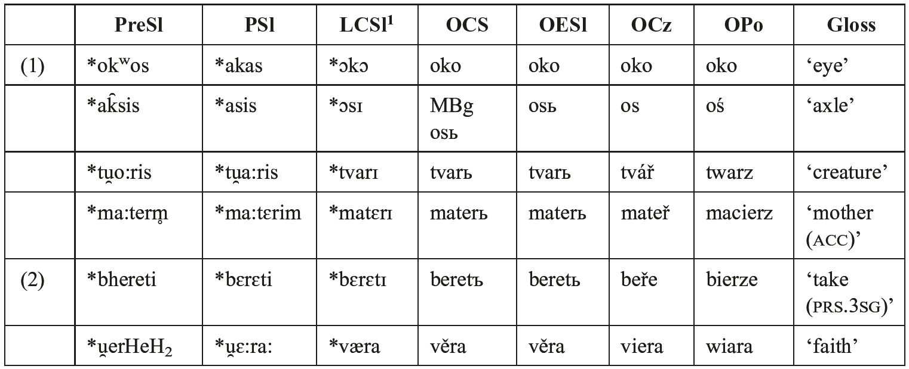

In Ba, by contrast, PIE *o and *a merged as *a rather than *o, and *o: and *a: remained distinct; in Indo-Iranian (I-Irn), *o(:), *e(:), and *a(:) merged as *a(:)<i></i>. The PSl vowel system can thus be viewed as transitional between Ba and I-Irn. It has been argued influentially (Ivanov and Toporov 1958) that the PSl vowel system originated in the Ba model of four short and five long vowels (*a:, *e|*e:, *o|*o:, *i|*i:, *u|*u:). This is mere conjecture in the absence of evidence that the merger of *o and *a preceded that of *o: and *a:.

The PIE glides *i̯ and *u̯ (or *y and *w) persisted in PSl both as consonants and as part of falling diphthongs. In CSl, they were lost after consonants (3.2, 3.6, 3.7) and in codas (4.1). Where they have persisted (3), they are transcribed <i>j</i> (3) and <i>v</i> (4) in the attested languages.

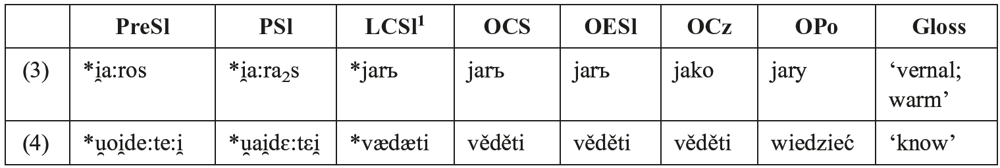

#### 2.1.1. Irregular outcomes

In some twenty lexemes, PIE initial *e is reflected as PSl *a, sometimes with *ɛ doublets (1). A parallel variation occurs in Ba dialects. According to Andersen (1996), the back reflexes arose not by sound change but by contact with an unattested IE dialect, then spread by cross-migrations − hence their sporadic distribution. There are more *a outcomes in ESl because P-ESl dialects had more intensive contacts with the donor language. (In earlier studies, the change was treated as a LCSl¹ change of *ɛ > *o in ESl only. This failed to account for the *a variants in SSl and WSl and for the *ɛ variants in ESl.)

Other instances of *a for PreSl *e (2) are due to a posited change of *ɛ > *a/__u̯V[+back]. If this was a regular sound change, its regularity has been much obscured by leveling (3).

The PreSl sequence *ei̯e was reflected as PSl *ii̯ɛ (4). PreSl *e:i̯e developed as expected to PSl *ɛ:i̯ɛ.

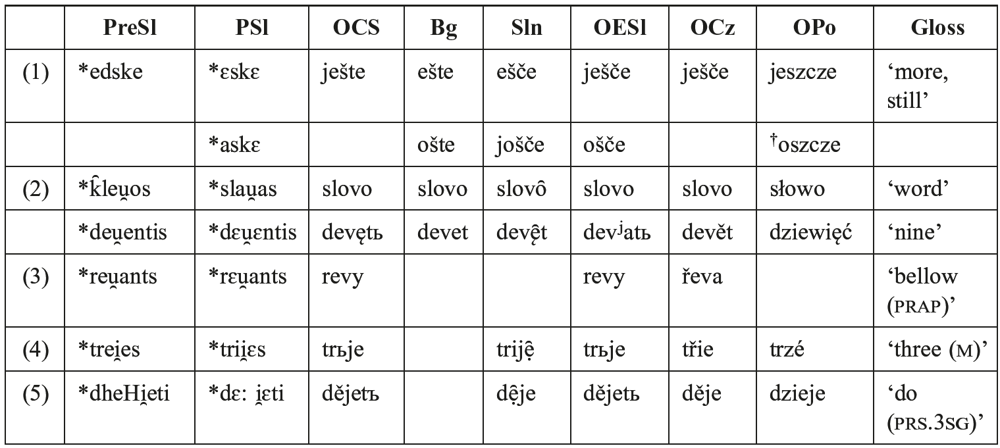

### 2.2. Reflexes of the PIE laryngeals

In PreSl, the PIE laryngeals became *a between consonants in initial syllables (1). They were lost in other positions (2), but they left their traces on the neighboring syllabic segments. Vowels, syllabic sonorants, and diphthongs were lengthened before laryngeals ˶(3) and developed a phonological property /+acute/ (̲), which eventually became a CSl tone (see 6.1, 6.3.1). In addition, the laryngeals “colored” (affected the quality of) adjacent vowels in PreSl, as in other IE dialects: PIE *e was centralized to *a (4) before or after *H₂, and backed and rounded to *o before or after *H₃ (5). In the first instance in each case the vowel was lengthened, appearing as PSl *a:; in the second instance both short reflexes merged as *a in PSl (see 2.1).

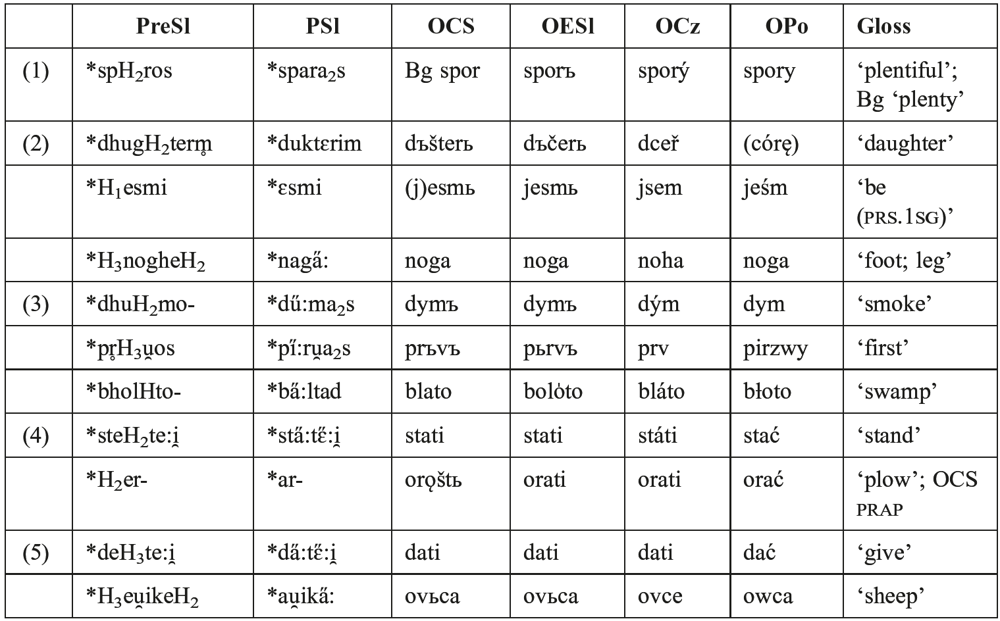

The PSl column in the table includes acuted trimoraic glide and sonorant diphthongs. It has been hypothesized that the vocalic nuclei in such diphthongs were shortened at an early stage, perhaps as a shared BaSl development. While there is certainly no way to distinguish internal V:R, V:I̯ from VR, VI̯, apart from the acute, in final syllables V:R and VR had different outcomes (see 3.1.3−3.1.4). For present purposes, I will assume that trimoraic diphthongs shortened, but I will indicate long vowels in the final syllables that had distinct outcomes. (Orr [2000: 36] argues that trimoraic shortening was blocked in final syllables to maintain morphological distinctions. Feldstein [2003: 256−257] claims that the sonorants or glides were not moraic, i.e. parts of diphthongs, until after the vowels shortened. Jasanoff [2004a: 250] posits that non-laryngeal long vowels in final syllables became trimoraic.)

### 2.3. Reflexes of the PIE sonorants

In PIE, the sonorants *r, *l, *m, and *n were non-syllabic next to a vowel, and syllabic elsewhere. In PSl, the non-syllabic sonorants were preserved without change (1). By contrast, the PIE syllabic sonorants were replaced by vowel-sonorant sequences in PSl, as in PBa. The standard account of this development posits anaptyxis: close vowels were inserted, so that the sonorants ceased to be the syllable nuclei. The anaptyctic vowel could be *i (2−4) or *u (*5−7); the same root can be attested with either vowel (8). (On the LCSl reflexes, see 5.6)

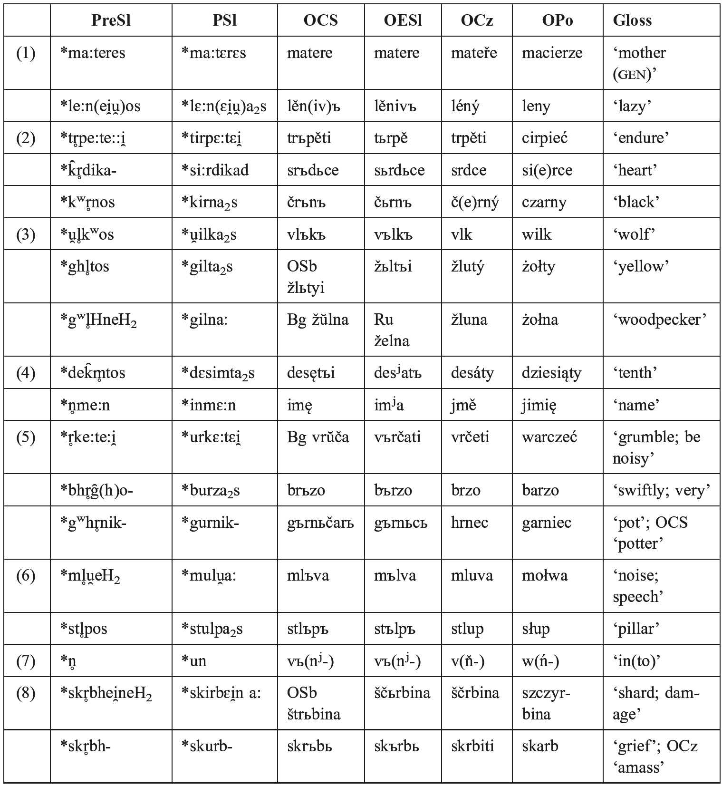

As shown in the table, the *iR and *uR reflexes could appear in the same environments. Overall, roots with *iR are much more common than those with *uR. In Shevelov’s (1965: 87−90) sample of 86 Sl roots, the only environment where *uR outnumbered *iR was after velars (19 out of 33 roots); after labials, *uR occurred in 10 out of 34 roots, and after dentals in only 3 out of 15. In Andersen’s (2003: 60) sample of 215 lexemes shared by Ba and Sl, *iR is the outcome in 73 %, and *uR in 17 %. Of the remaining 10 %, some show *iR reflexes in Sl but *uR in Ba or vice versa; others have outcomes of both kinds in Sl and/or in Ba.

#### 2.3.1. Phonological explanations

There have been many attempts to explain the twofold outcomes by regular sound change. It has been argued that the *uR outcomes were regular after velars or in low-tonality environments (K__, P__K). These claims fail to account for doublets from the same root or for exceptions like *<i>u̯l̥kʷos</i>, <i>*ghl̥tos</i> (3). Alternatively, it has been posited that *uR was regular only after labiovelars (see 2.4.2), which remained distinct from velars until “Late BaSl.” This is dubious; the fact that labiovelars and velars merged in all <i>satem</i> dialects points to an earlier stage of PIE. Again, there are exceptions, e.g. *<i>kʷr̥nos</i> (2), *<i>gʷl̥HneH₂</i> (3).

Matasović (2004) argues that the BaSl syllable sonorants did not have a single uniform reflex; the outcomes differed according to manner of articulation and their position in the word. In initial syllables, the regular reflexes were *ir; *ul after velars and *il elsewhere; and *un and *um. In non-initial syllables, the only regular reflex was *iR. Matasović explains the numerous exceptions either as affective formations or as analogical extensions of *i based on ablaut patterns (ibid.: 351). However, as Kortlandt (2007) observes, some of the supposed extensions of *i occur in roots without known ablaut variation.

Some scholars posit that *iR was the only regular reflex. They plausibly explain some of the *uR outcomes as phonaesthetic in origin, e.g., *<i>r̥ke:te:i̯</i> (5), *<i>ml̥u̯eH₂</i> (6), and several other evidently onomatopoetic words, where *u conveyed low-frequency noises. Other instances of *uR arose by analogy to the <i>o</i>-grade, e.g. <i>gʷhr̥nik</i>- (5) under the influence of *<i>gʷor</i>-, *<i>gʷo:r</i>. Still others entered in borrowings, typically from Gmc. Some of the lexemes with *uR were undoubtedly borrowed: Gmc *<i>fulka</i>- ⥬ *<i>pulka₂s</i> ‘armed troop’ (with sound substitution), OESl <i>pъlkъ</i>, OPo <i>pułk</i>; Gmc *<i>hulma</i>- (with the Grimm’s Law reflex of PIE *k) ⥬ *<i>xulma₂s</i> ‘hill’, OESl xъlmъ, OPo <i>Chełm</i>. The fact that there are no instances of *uR after palatovelars, which cannot have been borrowed from Gmc, has also been cited as evidence, but the eligible roots are too few to permit any generalizations. PSl *<i>suta</i>- ‘hundred’ (OCS, OESl <i>sъto</i>, OCz, OPo <i>sto</i>) would be a counterexample if it directly reflects PIE *<i>dk̑m̥ to</i>-; the loss of the nasal would also be irregular. For this reason, the word has sometimes been treated as a borrowing from Irn; cf. Avestan <i>satǝm</i>. It has also been proposed that it goes back to *<i>dk̑uto</i>-, reflecting the zero grade of a putative PIE *<i>dek̑u</i>- ‘ten’.

#### 2.3.2. Language contact

Andersen (1996: 107; idem 2003: 60−62) argues that the *uR outcomes arose by contact with IE dialects where it was the regular outcome; this explains why it did not occur after assibilated palatovelar reflexes, in grammatical morphemes, or in “productive ablaut alternations” (Anderson 2003: 60, following Stang 1966: 79). Once the borrowings were assimilated, *uR became available to replace *iR in expressiva and in onomatopoeia denoting low-pitched or indistinct sounds (Anderson 2003: 61−62). This explanation is more cogent than the attempts to define the *iR/*uR split by regular sound change. However, it may not explain all of the *uR outcomes − notably, the preposition *<i>un</i> ‘in(to)’. Moreover, the claim that *uR did not occur in grammatical morphemes is open to question: OCS sigmatic AOR.1SG <i>-sъ, -xъ</i> can be reconstructed as *<i>s-um</i> < *<i>-s-m̥</i>, the ending reflected in Gk <i>-sa</i>; there is no evidence that it was ever *<i>s-im</i>, <i>pace</i> Andersen (2013: 26−27). Also debatable is the notion that *um did not participate in productive ablaut. For PSl *<i>gurn</i>- (5) from PIE *<i>gʷhr̥</i>- (10), all of the other grades are attested: *<i>gr</i>-, OESl <i>grěti</i> ‘to warm’); *<i>ger</i>-, OESl <i>žeravъ</i> ‘heated’; *<i>ge:r</i>-, OESl <i>žarъ</i> ‘heat’; *<i>gor</i>-, OESl <i>gorěti</i> ‘be burning’; and *<i>go:r</i>-, OESl <i>razgarati sʲa</i> ‘be burning hotter [IPFV]’.

#### 2.3.3. Perceptual ambiguity of syllabic sonorants

A more flexible approach would be to emphasize perceptual innovations rather than sound change proper. Cross-linguistically, syllabic sonorant phonemes are often realized with ultrashort vowels in their opening or closing phases: /R̥/ → [R̥]~[ǝR̥]~[R̥ǝ]. Assuming that this kind of variation occurred in PreSl, the resulting ambiguity would have permitted innovative language learners to reanalyze the sonorant phase as the coda of a diphthong: [ǝR̥] ⇒ /VR/ → [ǝR]~[R̥]. The mechanism of the change would thus be phonemic reanalysis rather than actual anaptyxis (vowel-insertion). While the innovative learners could, in principle, have intuited that the vowel before the sonorant was a distinct phoneme /ǝ/, there was no supporting evidence for such a phoneme in other contexts. Thus they would be more likely to assign it to the adjacent vowels − to /i/, to /u/, or to both, on a lexeme-by-lexeme basis. Neither /i/ nor /u/ had occurred before sonorantconsonant sequences prior to the innovation, so there were no counterexamples to hinder the innovative learners from abducing that one or both had centralized allophones.

This scenario explains how *iR and *uR outcomes could both develop in the same speech community, and even in the same idiolect. It also salvages the distributional patterns noted by previous scholars: whether the innovative speakers perceived [ǝ] as /i/ or /u/ could indeed be influenced by the adjacent consonants, but without the consistency of results expected in blind sound change. The innovative learners could also have been motivated by other factors suggested by previous scholars, including phonaesthetic associations; other ablaut grades of the same roots; semantic connections, e.g. sigmatic AOR.1SG *<i>sm̥</i> ⇒ *<i>-sum</i> under the influence of the back vowels in the root AOR.1SG <i>*-om</i> and PRS.1SG *<i>-o:m</i>; and substratum or adstratum input.

Given that the innovative speakers had internalized /V[+high]R/ rather than /R̥/, they would be likely to implement [V[+high]R] more frequently than other possible realizations: /iR/ → [iR] (~ [ǝR]~[R̥]); /uR/ → [uR] (~ [ǝR]~[R̥]). (The phonetic symbols are purely relational here; the output of /iR/ could have been [ɪR], [ïR], etc., without altering the essential point.) The innovations would have mostly passed unnoticed by conservative speakers because of phonetic proximity; their own schwas probably varied, under the influence of the adjacent sounds, in the continua from near-back to near-front and from near-close to mid, if the realization of syllabic sonorants in living languages is any guide. Moreover, because their grammars lacked underlying /V[+high]R/, the conservative speakers would tend not to perceive forms with [V[+high]R] as grammatical mistakes. New learners would have been more likely to acquire /V[+high]R/ instead of /R̥ / because of the increased frequency of [V[+high]R] input from the innovative speakers. Over time, the variations within the speech community would have been sorted out by normal processes of social accommodation. This need not have had homogeneous results; it could have led to the relatively random distribution of *iR and *uR reflexes that we actually see.

### 2.4. Reflexes of the PIE stops

In PIE, stops came in voiceless, voiced, and voiced aspirate phonations and in labial, dental, palatovelar, velar, and labiovelar articulations. The PSl inventory was much smaller, with voiceless and voiced phonations and labial, dental, and velar articulations. Three changes transformed the PIE 3 x 5 system into the PSl 2 x 3: loss of aspiration (2.4.1); delabialization of labiovelars (2.4.2); and assibilation of the palatovelars (2.4.3).

Some scholars posit a radically different reconstruction of the PIE stops, with ejective or glottalized stops for the voiced unaspirated series traditionally reconstructed. This “Glottalic Theory” is a lynchpin of some approaches to BaSl accentology (see 6.3.3). The present account assumes the traditional reconstruction as the one best in accord with the Comparative Method. If PIE had ejectives, it could only have been at a very early stage, given the uniformly voiced, pulmonic reflexes in Sl, Ba, Indo-Iranian, Albanian, Gk, Italic, and Celtic.

#### 2.4.1. Loss of aspiration

In PSl, as in Irn, PBa, and Albanian, the voiced aspirate stops lost their distinctive phonation feature and merged with the voiced series: Dh > D (1). The non-aspirated voiceless (2) and voiced stops (3) remained stable.

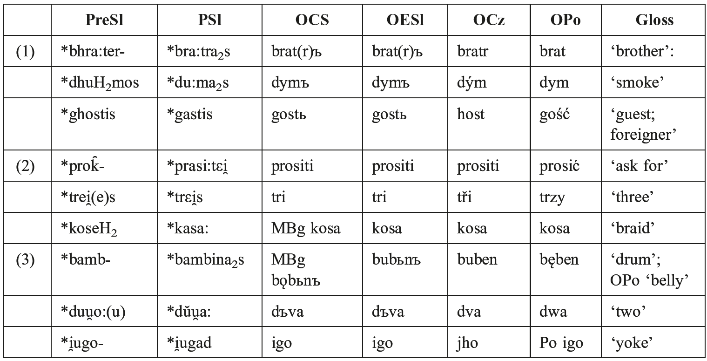

#### 2.4.2. Delabialization of the labiovelars

Like neighboring Indo-Iranian and PBa, PSl was a <i>satem</i> dialect, in which the PIE labiovelars merged with the plain velars: Kʷ > K (1).

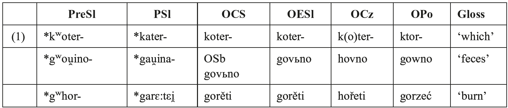

#### 2.4.3. Assibilation of the palatovelars

In the <i>satem</i> division of PIE, the reflexes of the palatovelars remained distinct from those of the velars. In PreSl, *k̑ > *s, and *g̑(h) > *z. Thus the reflex of *ḱ merged with the non-dorsal (non-RUKI) allophones of *s (1) (see 2.5). In PIE, *z had only existed as an allophone of *s before voiced obstruents; in PSl, it became a distinct and widespread phoneme due to the assibilation of *g̑(h) (2).

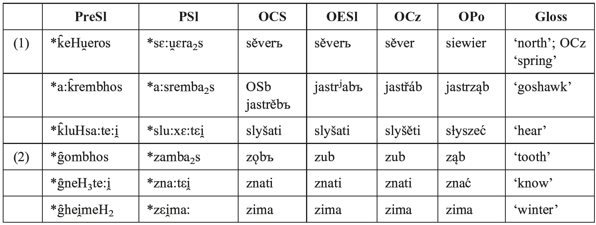

Presumably, in the <i>satem</i> dialects, the palatovelars developed into affricates with dorsal frication; then they lost their closure to become hushers: *k̑ > *tʃ > ʃ<i></i>. The husher stage is attested in OI and non-sigmatic EBa: *dk̑́m̥to- > OI <i>śatám</i>, Li <i>šim̑tas</i> ‘hundred’. Subsequently, in the more central zone, the hushers became sibilants: *k̑ > *tʃ > *ʃ > *s: Avestan <i>satǝm</i>, Ltv <i>sìmts</i> ‘hundred’, OPr <i>tu:simtons</i> ‘thousands (ACC.PL)’, OCS <i>sъto</i> (*<i>dk̑uto</i>-)<i></i>. (Lunt [2001: 193] posits a different process: *> *ts > *s, *g̑ > *dz >* z.)

In Sl, at least 40 roots have plain velars for the PIE palatovelars instead of expected *s, *z (3). In some cases, the same roots show both sibilant and velar outcomes (4−5). This phenomenon, termed <i>Gutturalwechsel</i>, also occurs in Ba, often in the same roots as in Sl: OLtv <i>sirna</i>, OPr <i>sirvis</i> ‘deer’, but Li <i>kárvė</i> ‘cow’ (4); Ltv <i>zelts</i> ‘gold’, but Li <i>ge[image-glyph: l with tilde] tas</i> ‘yellow’ (5). Li <i>žąsìs</i> ‘goose’ has the expected palatovelar development where Sl shows <i>Gutturalwechsel</i> (3).

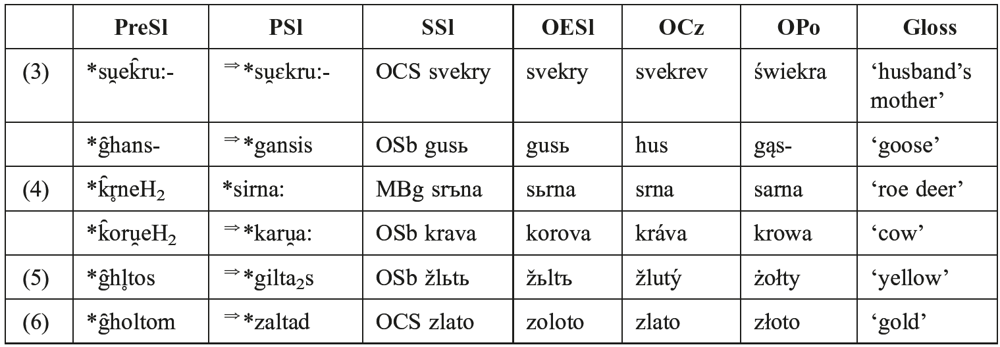

Efforts to explain the velar outcomes by regular sound change have not been convincing. For example, it has been argued that palatovelars regularly depalatalized before *r, *l, *m, *n, and *u̯ in BaSl. Even allowing for analogy to other ablaut grades, this claim has too many counterexamples to be cogent; cf. *<i>a:<b>r</b>embho-</i>, <i>*pi<b>k̑r</b>o-s</i>, <i>*<b>k̑l</b>uHsa:te:i̯</i>, and *<b><i>g̑n</i></b><i>eH3te:i̯</i> (2.4.3). Given the doublets, the most likely explanation is borrowing and/or substratum influence from <i>centum</i> or, as proposed by Andersen (2003), pre-<i>satem</i> speakers. It is phonetically plausible that *k̑, *g̑h would have been perceived as *k, *g by speakers of dialects in which the palatovelars had already been assibilated; cf. Anglo-phone perceptions of Cz <i>t’</i> [c̟] as /k/ and <i>d’</i> [ɟ] as /g/.

### 2.5. Reflexes of IE *s

PIE *s had two regular reflexes in PSl. In most environments, it remained a sibilant (1). After *i, *u, *r, *k, (the “RUKI” environment), it developed back allophones (RUKI¹) (2); these later became the voiceless velar fricative *x (RUKI²). (In CSl, the velar became *ʃ before front vowels; see 3.2) The triggers for RUKI included both syllabic and non-syllabic *i, *u, and *r; the velar subsumed the reflexes of *k, *kʷ (see 2.4.2), and, by devoicing (see 2.7.1), *g(h), and *gʷ(h).

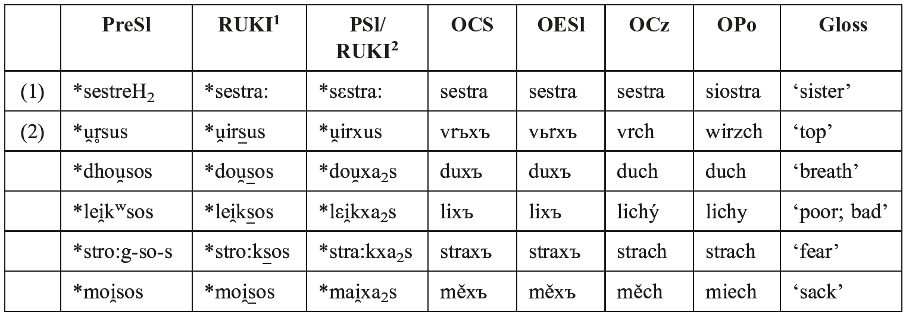

RUKI also occurred in In, Irn, and Li, in the last two of which the reflex was *ʃ. It has been argued that the *s in OPr, Ltv, and some Li dialects also developed from an earlier *ʃ (Andersen 2003). As RUKI only occurred in <i>satem</i> dialects, it may have followed the delabialization of labiovelars (see 2.4.2). Pre-Li and PreSl have different relative chronologies for the change. In PreSl, as shown in (3), RUKI ceased operating before *k̑ became *s (see 2.4.3). In Pre-Li, by contrast, *k̑ merged with the reflex of RUKI *s in Pre-PBa: Li <i>piẽ<b>š</b>ti</i> ‘draw’, †<i>pìr<b>š</b>ys</i> ‘chest (of a horse)’. This suggests that RUKI and satem assibilation overlapped in time in PreLi. Thus the RUKI change is one of the earliest changes − perhaps the earliest − to have divergent outcomes in Sl and Ba.

Seeming exceptions to RUKI have several explanations. The target *s may have followed a labial or dental stop (3), which was lost in later cluster simplifications (3.1.3). Alternatively, the sibilant may reflect PIE *k̑ (4). Other exceptions are Post-RUKI loanwords, e.g. Vulgar Latin <i>mēsa</i> ⥬ OCS <i>mi<b>s</b>a</i> ‘platter’; or later affective formations, e.g. Ru <i>plaksa</i> ‘crybaby’.

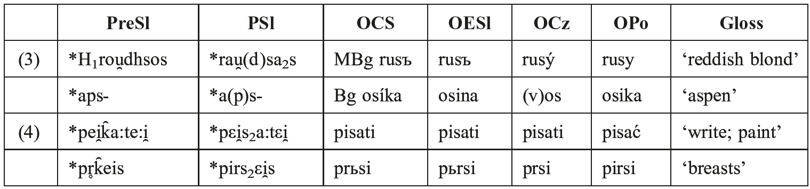

In its initial phase, RUKI was a complex of assimilations: *s developed retracted allophones (collectively *<u>s</u>₂) after sounds produced deeper in the vocal tract. (Andersen [1969] treats this as “markedness assimilation” to sounds that were marked in their natural classes.) Some scholars posit that there was a single allophone *<u>s</u>₂ [ʃ], as in Li and Irn, or retroflex [ʂ]. The palatal would be natural after *i(:), but less motivated after *u(:). The retroflex would be natural after *r, but it is unclear why the accommodation should only involve the shape of the tongue tip or blade, as in retroflexion, especially given that *k, *i(:), and *u(:) had dorsal articulations. To be sure, the rounding of *u(:) could produce much the same acoustic impression as retroflexion.

Actually, there is no need to assume a single *<u>s</u>₂; different allophones could have developed in assimilation to different triggers: 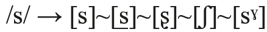(or other retracted values). The key innovation would be the <i>rephonologization</i> of some or, in PreSl, all of the backed allophones as a new phoneme 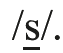 The latter (ultimately rephonologized as /x/) could likewise have had a range of realizations. Cf. Swedish <i>sj</i> [ɧ], whose articulation has been variously described as rounded, labiodental, velarized, velar, dorsovelar, or palato-alveolar-velar.

In PSl, the *<u>s</u>₂ reflex did not occur before consonants (5). Though clusters of *x plus sonorant were permitted in CSl, they only occurred over boundaries, where analogy could operate (6), or in loanwords and expressiva; there are no cases within (synchronic) morphemes (7). Some scholars posit that RUKI actually took place before consonants in PreSl, as in Li and Irn. Thus, in Andersen’s view (1968), BaSl *ʂ (*<u>s</u>₂) merged with the reflex of *k̑ before consonants, then lost its retroflexion in the same environment in PreSl. While this claim cannot be falsified, neither can the alternative hypothesis that RUKI was blocked by a following consonant.

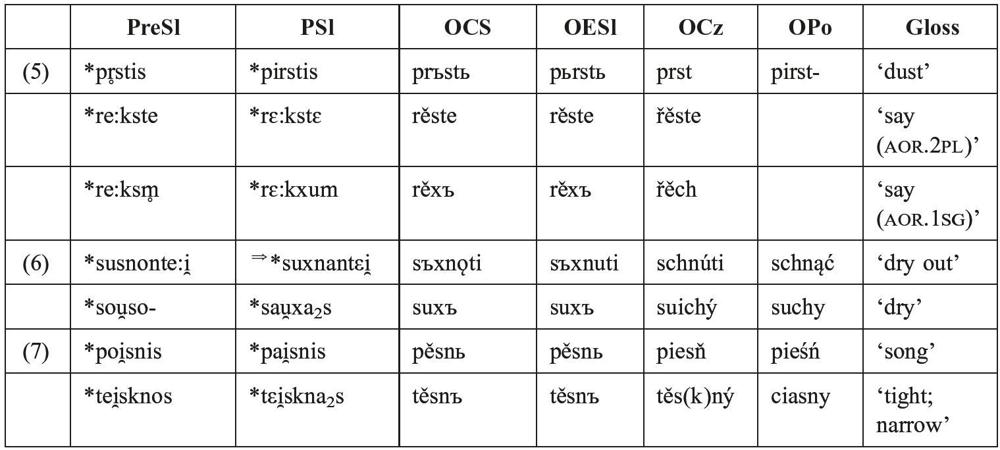

#### 2.5.1. Initial *x

The only regular source for initial *x was *ks- > *kx > *x (1). Other examples may have arisen by the extension of sandhi variants, e.g. after the prefixes *<i>per</i>-, *<i>prei̯</i>-, and *<i>ou̯</i>. This is said to be the origin of *x in *<i>xod</i>- ‘go (INDET)’ and the innovative zero-grade *<i>xid</i>- (2). Initial *x also appeared in onomatopoeia (3) and in loanwords from Gmc or Irn (4).

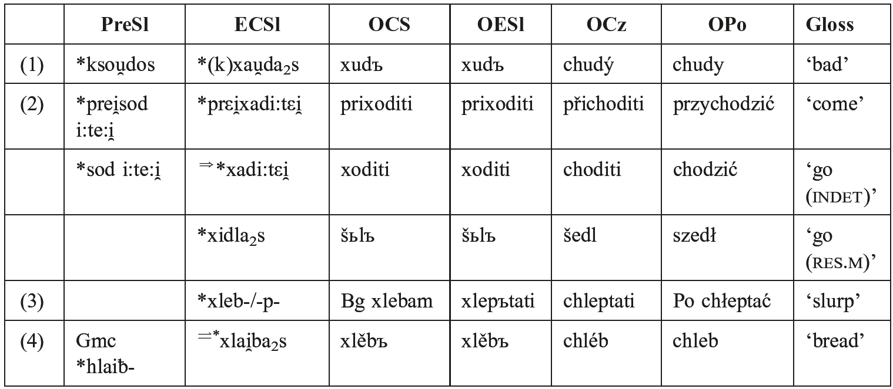

#### 2.5.2. Extension of *x

Once established as a phoneme, *x began to replace *s, *k, and *g in expressive lexemes (1). In some cases, the expected forms coexisted with the innovations. The affective value may have come from *x~*s doublets that had arisen in contacts with non-RUKI dialects or in interactions with conservative speakers in the same dialect<i></i>.

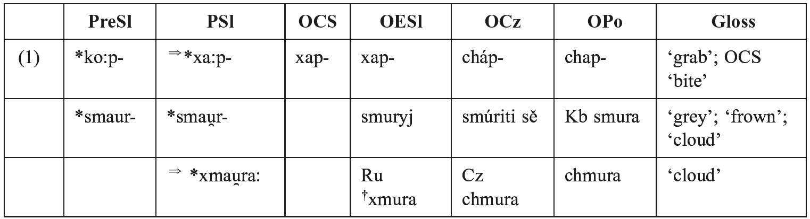

In addition, *x was extended analogically in specific grammatical and derivational contexts. The ending *<i>-su</i> (nominal LOC.PL, pronominal GEN/LOC.PL) was regularly reflected as *<i>-xu</i> after the themes *-i-, *-u-, and *-o-i̯- (with intrusive *-i-) (2). Gradually, *<i>-xu</i> was extended to other inflectional classes (3). The phonologically expected *s was only preserved in personal pronouns − 1PL.GEN/LOC and 2PL.GEN/LOC (4). Relics of the consonant-stem LOC.PL in OCz toponyms, e.g. <i>Doleass</i> ‘in Doljane’ from *<i>dali̯ensu</i> (modern <i>Dolánky</i>). Thus it is not true that “<i>š</i> replaced every desinential <i>s</i> (unless a consonant followed),” <i>pace</i> Lunt (2001: 191).

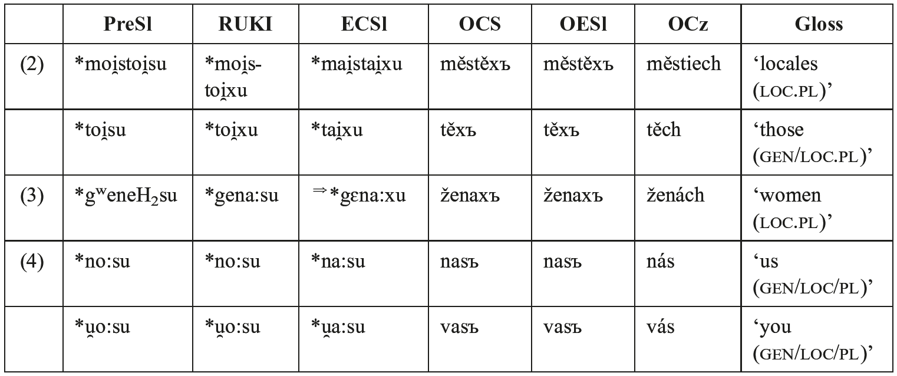

By the regular sound change, PRS.2SG *<i>-si</i> had become *<i>-si</i> (*<i>-xi</i>) after the theme *-ei̯- (5). In CSl, *<i>-xi</i> was extended to all thematic verbs and to athematic ‘have’ (6). The regular outcome survived only in the other four athematics − OCS <i>jesi</i> ‘be’, <i>jasi</i> ‘eat’, <i>dasi</i> ‘give’, and <i>věsi</i> ‘know’.

In the sigmatic aorist, *-x- was phonetically conditioned in the 1SG, 1DU, 1PL, and 3PL of stems in *ī, ū, *r, *k, or * g (7). After phonetic RUKI ended, aorist *-x- and *-s- were reanalyzed as distinct allomorphs. By the earliest writings, -x- had displaced *-s- in all stems in vowels, and the innovative allomorph *<i>-ox-</i> was spreading to all consonant stems (8).

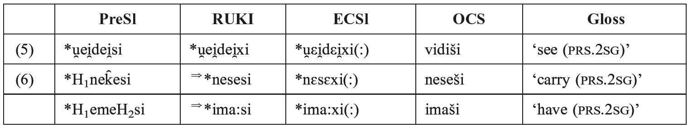

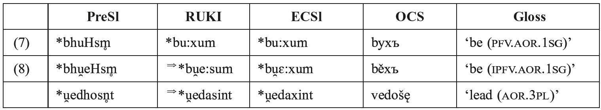

### 2.6. Restructuring of ablaut

Some of the roots in which syllabic sonorants were reinterpreted as /iR/ or /uR/ functioned as zero grades in ablaut alternations. Consequently, *i and *u joined the repertory of alternating vowels as what may be called the <i>Vocalized Grade</i> (VG). Initially, the VG alternated with the old zero grade in certain paradigms: (C)V[+high]R occurred before consonants, and (C)R before vowels (1−2). Thus some of the unsuffixed (Ia and IIIa) sonorant-stem verbs had the old zero-grade in both the present (<i>tudáti</i>-type, with theme vowels before the endings) and in the aorist and/or past participles (with consonantinitial suffixes). Such phonologically conditioned alternations were eliminated by the generalization of (C)V[+high]R, although (C)R could persist in derivationally related forms; cf. OCS <i>granъ</i> ‘verse’ (*<i>gʷ</i>r̥H₂-).

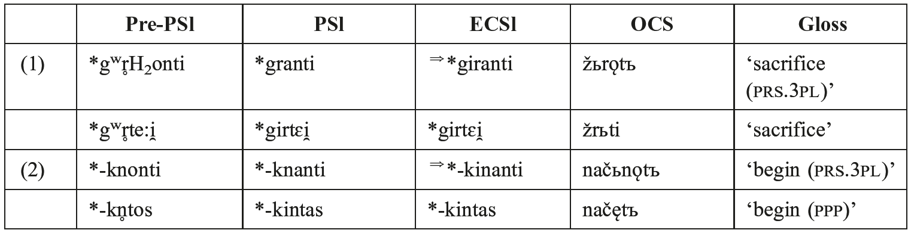

This leveling was an early instance of the tendency to replace the inherited zero-grade with the VG wherever it alternated in paradigms. The same tendency led to the rise of vocalized allomorphs that had not been phonologically conditioned − for example, in the aorist/infinitive stem (3). Eventually, the VG displaced the inherited zero-grade allomorphs in all sonorant-final stems, even in suffixed class IV verbs like ‘be ripe’ (4), where the sonorant had never been syllabic (cf. *<i>g̑r̥Hno-</i> > PSl *<i>zirna-</i> > OESl <i>zьrno</i> ‘seed’). (<i>CCV-</i> roots where the zero-grade did not alternate within the paradigm were unaffected.)

In addition, the VG spread by analogy to alternating zero-grade roots that did not end in sonorants, e.g. ‘call’ (PIE *<i>g̑hu</i>-) (5) and to “vowelless” verbal roots in general. For example, an inverted VG appeared in <i>Schwebeablaut</i> roots in which syllabic sonorants had alternated interparadigmatically with other grades, e.g. *<i>-n̥g̑ h</i>- ‘stick’ (6) alongside o-grade causative *<i>nog̑hi:te:i̯</i> ‘drive (a point) into’ (OCS <i>vъnoziti</i>).

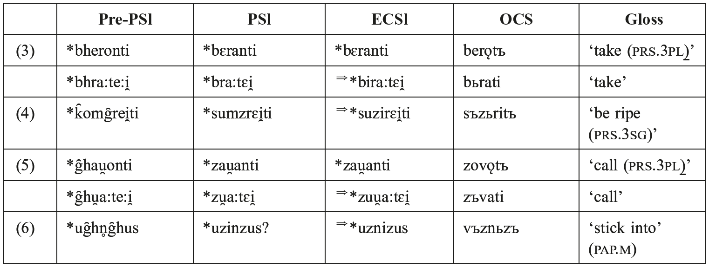

In CSl, the VG was reinterpreted as a type of full grade. Indeed, it displaced the inherited full grade in some paradigms; for example, OCS has present and aorist stem variants <i>žeg-~žьg-</i> (PSl *<i>geg</i>- ‘burn’, PIE *<i>dhegʷh</i>-). Moreover, a new lengthened grade in *i:/*u: arose in iteratives derived from VG roots: VG *<i>-mir-</i>: SLG *<i>-mi:r-</i>, OCS <i>umьr-</i>: <i>um<b>ir</b>a-</i>‘die (PFV: IPFV)’; VG *<i>-zuu̯-</i>: SLG *<i>-zu:u̯-</i>, OCS <i>prizъv-: priz<b>y</b>va-</i> ‘call (PFV: IPFV)’. This paralleled the relation between the inherited full grades (*e/*a) and lengthened grades (*e:/*a:). The Slavic Lengthened Grade was highly productive in CSl, where it was extended to consonant-stem roots that did not end in sonorants: PSl *<i>prasupa:tεi̯sɛ:m</i>|*<i>prasu:pa:tεi̯sɛ:m</i> > OESl <i>prosъpati sʲa</i>|<i>prosypati sʲa</i> ‘awaken (PFV|IPFV)’. It remains productive in the attested languages.

### 2.7. PreSl changes in consonant clusters

#### 2.7.1. Voicing assimilation

In PSl, voiced obstruents were regularly devoiced before voiceless ones and vice versa (1). This rule, inherited from PIE, persisted throughout the CSl period.

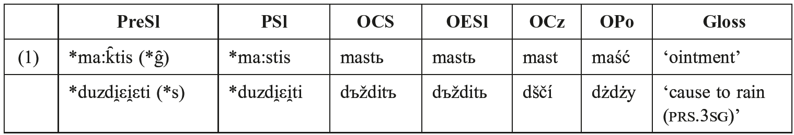

#### 2.7.2. Double dental rule

In PreSl, as in Ba, Irn, Albanian, and Gk, PIE *tt, *dd became *st, *zd, almost certainly through a stage *tst, *dzd (1). In PSl, the results of the change were evident in stem allomorphy before derivational suffixes and endings with initial *-t-. One supposed exception is PSl *<i>at-(ik)-</i> ‘father’ (2), said to correspond to Hittite <i>attaš</i>, Gk <i>átta</i>, La, Go<i>atta</i>. Actually, none of the cognates show expected outcomes for *tt. As a nursery word, *a(t)t- could potentially be (re)created with each first language acquisition.

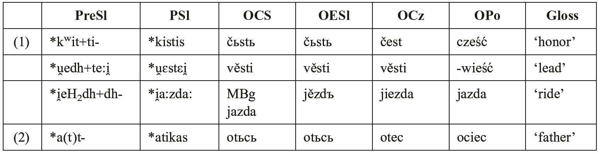

#### 2.7.3. Degemination of sibilants

PreSl was one of several PIE dialects in which *ss became *s (1). This change recurred in the new *ss, *zz clusters (2) that developed by <i>satem</i> assibilation (2.4.3). In CSl, the resulting S~Ø alternations were preserved in the sigmatic aorist of <i>s-</i> and <i>z</i>-stems (3) and in prefixal sandhi (4).

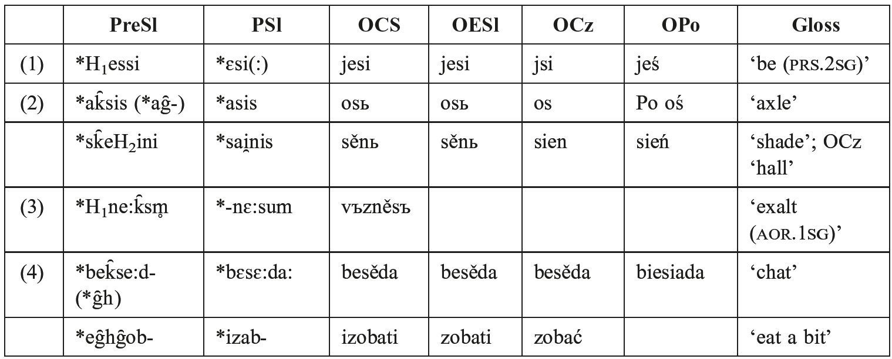

#### 2.7.4. Sibilant + *<i>r</i> clusters

Inherited *sr became *str in PreSl (1), as in Gmc, Albanian, and most of Ba. In PreSl, the change also applied to *sr from *k̑r (see 2.4.3), and there was a parallel change *g̑hr > *zdr (2). It is phonetically natural for closure to develop between continuants and trills. Andersen (1972: 38) treats the change as a “diphthongization”: *r was implemented with “an obstruent-like initial portion,” later reidentified as *t.

The alternations that arose from this change in prefixal and prepositional sandhi were leveled out in most CSl dialects, but they continued to operate in OCS and, to a lesser extent, OPo (3). In <i>Izdrail’-</i> ‘Israel’ (4), a ca. 9th−10th-c. borrowing from Gk into OCS, and from there to OESl, or from La into OCz and OPo, <i>Iz-</i> was contaminated with the prefix <i>iz</i>.

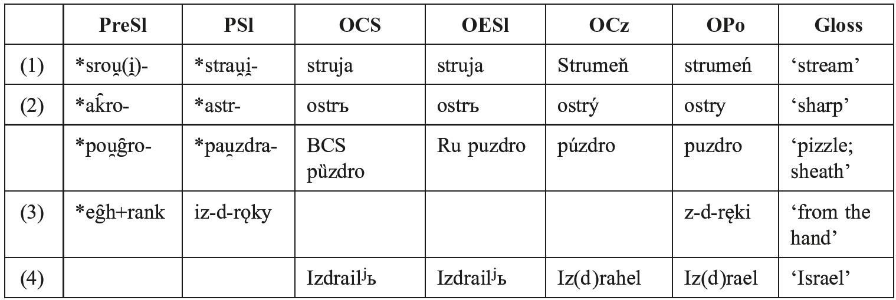

#### 2.7.5. Glide-liquid clusters

In PreSl, as in PreBa, initial *u̯ was lost before non-syllabic *r and *l (1). If this “Lidén’s Law” was a regular change, it must have followed the rise of the new ablaut grade (see 2.6), since *u̯r-, *u̯l- clusters that alternated as zero grades became *u̯ir-, *u̯il- (2). Internal *u̯r, *u̯l were not affected by the change (3)<i></i>.

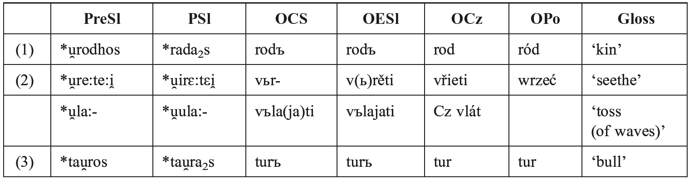

## 3. Early Common Slavic (ECSl) changes

In the ECSl period, the system of vowel phonemes remained identical to that of PSl (2.1); in particular, it continued to allow glide and nasal diphthongs (see 4.1−4.2). The ECSl sound changes had uniform results, without dialect differentiation. Two drifts or conspiracies are said to have operated − the <i>Law of Open Syllables</i> and the <i>Law of Syllabic Synharmony</i>. These labels are unobjectionable as metalinguistic descriptions of the results. However, there is a long tradition of reifying them as causal factors (cf. notably Jakobson [1929] 1962).

The first law, also known as the <i>Tendency to Rising Sonority</i>, subsumes the ECSl loss of coda obstruents (3.1.3) and final sonorants (3.1.4); the MCSl monophthongizations of glide and nasal diphthongs (4.1−4.2); and changes in vowel-liquid diphthongs (4.9, 5.5). Feldstein (2003: 250) distinguishes an early “tendency to the open syllable” from a later “tendency to rising sonority.” The first applied only to non-moraic segments, not diphthongs; by contrast, the later tendency induced changes in falling diphthongs.

The second law subsumes tonality assimilations in which consonants became palatal or coronal before front vowels and *i̯ (3.2, 3.6, 4.4) and in which back vowels were fronted after palatal consonants (3.3). As a result, syllable onsets and nuclei had the same basic tonality − either “soft” (palatal + front) or “hard” (non-palatal + back). However, there are important exceptions (3.4), as well as tonality assimilations that transgressed syllable boundaries (3.7.2, 4.5). The changes covered by the law are quotidian assimilations, so there is no particular need to see an invisible hand behind them.

### 3.1. Changes in syllable structure

In PSl, syllable onsets could have up to four consonants (1), and syllable codas could have up to three consonants (2). In ECSl, the canonical sequence for onsets was <i>fricatives > stops > liquids > glides</i>. Medial clusters that violated the canonical sequence were syllabified with a break before the rightmost licensed onset (3).

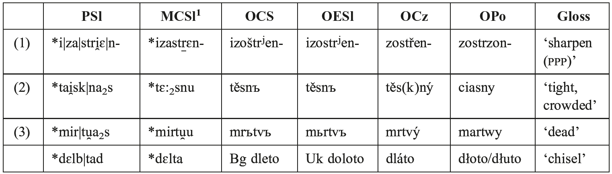

#### 3.1.1. Syncope of stops in non-canonical clusters

In ECSl, stops were elided before obstruents in onsets (1) and codas (2). In *kt, the velar was lost, but the *t had bifurcating reflexes; see 3.6.1.

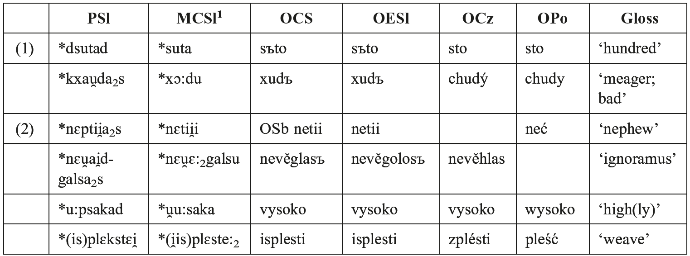

Clusters of *tl, *dl were permitted in ECSl (3); later, the stops were lost in some dialects, though they have left traces in all three branches of Sl (see 4.8). Before nasals, velar stops were preserved (4), but labial and dental stops were elided (5); apparent exceptions, like the OCz and OPo forms in (6), arose by post-CSl changes. In the clusters *stl and *skn, the stops were lost in all dialects, and sibilants were resyllabified as onsets (7).

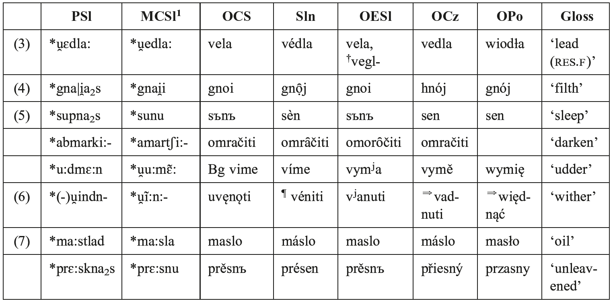

While various processes could have caused the elision, the purely phonetic phase probably involved non-release of the stops, which is common cross-linguistically in clusters: /T/ → [T˺]/__{T, S, N} (where T = stop). The non-released stops would have had a range of articulations, including reduction of the hold phase to zero in allegro speech. Without the burst as a cue, they would have been open to reanalysis as non-segments: /T/ → [T˺]⇒/Ø/ → [Ø].

The loss of coda stops took place after the period of shared BaSl developments − in particular, RUKI, in which the backed allophone of *s was conditioned after velar stops but blocked after labial and dental stops (see 2.5). Within CSl, there is no evidence to establish the relative chronology of the changes in noncanonical clusters. However, the fact that the simplifications had uniform results points to a time when the CSl dialects still formed a cohesive continuum. It seems likely that the loss of syllable-final obstruents preceded the MCSl monophthongization of diphthongs (4.1), where the mechanisms for opening syllables were different in kind and changed the articulation of the preceding vowels.

#### 3.1.2. Syncope in nasal + nasal clusters

Coda nasals were elided before onset nasals (1); the preceding vowel underwent no reconstructible change. Nasals before other consonants were not affected at this stage (see 4.2). Judging from PreSl *<i>n̥men</i> > *<i>i<b>n</b>mɛ:n</i>, the change followed the reinterpretation of syllabic sonorants as diphthongs (see 2.3). The basis for the change may have been a lack of perceptible cues for the transition from the one nasal to the other. Cross-linguistically, nasals tend to be unreleased before other consonants; thus the continuous nasal resonance in the sequence could have promoted the perception that only a single segment was present.

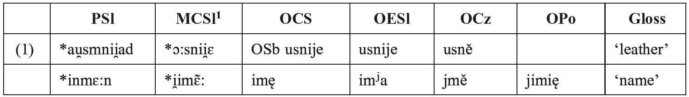

#### 3.1.3. Loss of final obstruents

Obstruents were subject to elision in word-auslaut (1), just as they were in syllableauslaut (3.1.1). The weakening and loss of pre-pausal consonants is a typologically widespread change and can involve non-release or debuccalization. The only final obstruents in PSl were *t, *d, *s, *z (only in the 1SG pronoun), and the clusters *st, *ts. (The final *z and *b that occurred in certain prepositions are irrelevant for word-auslaut.)

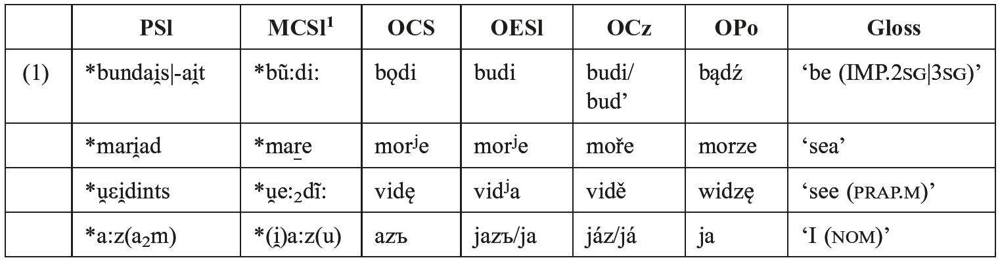

In close juncture, final obstruents were subject to the same tendencies as medial ones (see 3.1.1), so there was no conditioning for weakening or elision if the following word began with a vowel, sonorant, or glide. Presumably, the phase in which final weakening or loss was sound change proper was followed by one with sandhi or stylistic variation between elided and unelided forms; cf. French <i>liaison</i>. Eventually, the elided forms were generalized, even when the final consonants were verified by other forms in the paradigm (2).

Evidence for the sandhi variation is found in athematic verbs − in the PRS.3SG of ‘be’ (3); in the OCS AOR.2−3SG of ‘give’ and ‘eat’ (4) and unsuffixed sonorant-stems belonging to the mobile accentual type (5) (see 6.3.5). In the athematic aorist (4), *<i>-s-tu</i> (where *s reflected the root-final dental) was reanalyzed as a morpheme and extended to ‘be’: OCS <i>by~bystъ</i>. A further relic of sandhi may occur in the suffix *<i>-asi̯a</i>-, used to form hypocoristic nouns from adjectival roots (6). This suffix has been analyzed as an early univerbation of adjectival *<i>-a₂s</i> (M.NOM.SG) with the demonstrative *<i>i̯a₂s</i> (M.NOM.SG). In CSl, as in Ba, phrases of this kind developed into compound (“long”) definite adjectives; cf. Li <i>mãžas</i> ‘little’|<i>mažàsis</i> (DEF). However, in the attested compound declension, the M.NOM.SG reflects the loss of final *-s (7). (The internal *-a₂- in [6] has the expected reflex *<i>a</i>; on the final *<i>u</i> outcome in [7], see 3.8)

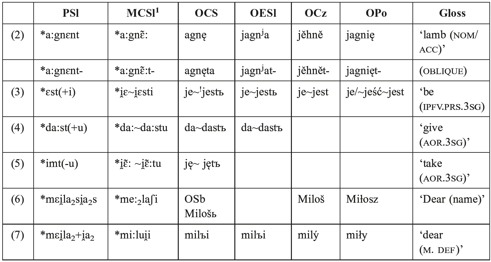

#### 3.1.4. Loss of final nasals

Final nasals were lost after short vowels (1−3), but preserved after long vowels (4) (see further 4.2). It is unclear whether their quiescence after short vowels was a sound change <i>sensu stricto</i>, since the targets of elision only occurred in endings − the ACC of <i>(i̯)o-</i>, <i>u-</i>, <i>i-</i>, and consonant-stem nouns (1); the GEN.PL of all nouns (2); and the AOR.1SG of both the sigmatic and the root types (3). (On the N.NOM/ACC.SG, see 3.8)

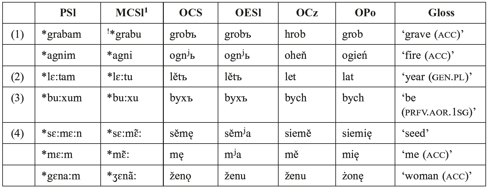

The same change is supposed to have affected four prepositions/prefixes: PSl *<i>un</i> ‘in(to)’, *<i>sun</i>¹ ‘with’, *<i>sun</i>² ‘from’, and *<i>kun</i> ‘toward’ (OCS <i>vъ</i>, <i>sъ</i>, <i>sъ</i>, and <i>kъ</i>). These are traced to PIE *<i>n̥</i>, <i>*s(o)m</i>, *<i>(o)m</i>, and *<i>k(o)m</i>. The change from *-m > *-n in these items occurred in PreSl and is shared with Ba; the nasal comes out as n where preserved − before verbal roots with initial vowels in an archaic pattern of prefixation (5); and before the anaphoric pronoun *i̯- (6), where the nasal was metanalyzed, and the resulting “<i>n</i> mobile” generalized after all prepositions (7).

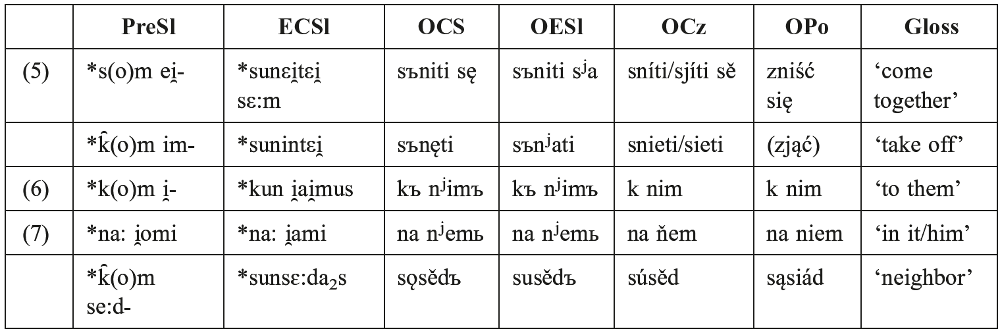

Actually, the loss of final nasals is irrelevant for these four prepositions/prefixes, as they would never have been final in a phonological word; there is no trace of their being postpositions in CSl (cf. La <i>mecum</i>). The most plausible solution lies in the generalization of sandhi variants. In ECSl, the final nasals would had three forms: *-n/__{T, K, V}; Ø/__(#)N (see 3.1.2); and presumably *-m/__P. The least circumscribed and thus basic variant was *-n. With the metanalysis of *-n in certain concatenations, the Ø variants became unpredictable and had a proportionately larger domain; they were revaluated as basic and generalized in new formations. The *-n- and *-m- variants were then eliminated by morphophonemic simplification, apart from lexicalized relics (PSl *<i>unantr</i>- > OCS <i>vъnǫtrь</i>, OESl <i>(vъ)nutrь</i>, Sln <i>nȏter</i> ‘inside’).

#### 3.1.5. Loss of final liquids

In PreSl, final *l and *r occurred only in the NOM of <i>l-</i> and <i>r</i>-stem nouns<i></i>. In CSl, almost all of these nouns were remade as thematics (8). The sole relics were ‘mother’ and ‘daughter’ (9). Here the final *r was lost, and the preceding *e: raised to *i: (cf. 3.8). The elision may be PreSl; forms without *r are also found in Ba and Indo-Iranian, and CSl permitted coda *r and *l in internal syllables. (OCz <i>matě</i> is probably not an archaism but a new formation based on the <i>i̯ā</i>-stem ending.)

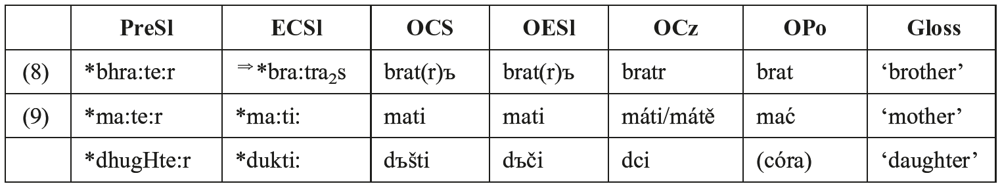

### 3.2. First Regressive Palatalization of Velars (1VP)

In ECSl, velars were fronted before front vowels (1) and *i̯ (2); their ultimate reflexes were alveopalatal: *k > *tʃ, *g > *ʒ, *x > *ʃ (Slavistic <i>č</i>, <i>ž</i>, and <i>š</i>). This change has traditionally been called the <i>First Palatalization of Velars</i> (1VP) or, more recently, the <i>First Regressive Palatalization</i>, as there is debate over its order relative to the Progressive Palatalization (4.6.2).

Before the fronted velars, sibilants underwent assimilatory backing (3): *sk > *ʃtʃ, *zg > *ʒdʒ (Slavistic <i>šč</i>, <i>žǯ</i>). In LCSl, *ʃtʃ and *ʒdʒ were simplified to <i>št</i> and <i>žd</i> in some dialects. When the palatalization trigger was *i̯ (2), it was ultimately reanalyzed as an off-glide (see 3.7.1).

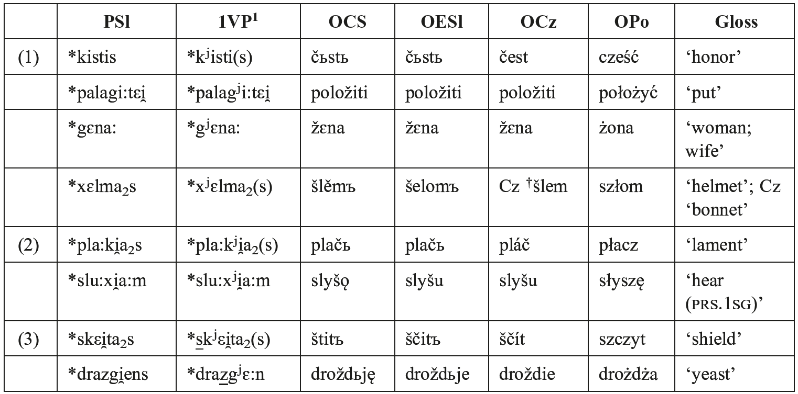

Presumably, the 1VP began as assimilatory softening (1VP¹), followed by coronalization (1VP²), and assibilation (1VP³): *kʲ > *c̟ > *tʃ, *gʲ > *ɟ > *(d)ʒ, *xʲ > *ç > *ʃ, *sʲkʲ > *sʲc̟ > *ʃtʃ, *zgʲ > *zʲɟ > *ʒdʒ. Ultimately, the reflex of *gʲ lost its closure except in the cluster *zgʲ. According to Andersen (1969), *g and *gʲ were lax (slack-voiced) and could be implemented without closure. Eventually, the fricative realization was generalized except when blocked by a constraint against fricative-fricative clusters, which arose after the loss of syllable-final obstruents (3.1.3) and persisted until the jer-shift (5.8).

The <i>terminus a quo</i> of the 1VP is uncertain, but its uniform results point to the pre-Migration-Period, when CSl dialects were still relatively compact. The change ended before the monophthongization of glide diphthongs, since it was not triggered by *ɛ:₂ from *ai̯ (4.1). It was also not triggered by *i(:) in borrowings from Go (ca. 2nd−4th c.). The assibilation phase (1VP³) was completed before the Sl settlements in the southern Balkans (6th−8th centuries); Byzantine sources have <i>ts</i> for *kʲ and <i>z</i> for *gʲ: *<i>kɛlinεi̯kas</i> ‘headman’ ⥬ τσέλνικος (cf. OSb <i>čelьnikь</i>); *<i>gɛu̯pa:nas</i> ‘clan head’ ⥬ ζουπάνος (cf. OCS <i>županъ</i>).

The 1VP created numerous morphophonemic alternations between velars and palatals. These have generally been stable in the Sl languages, as exemplified in (4−6).

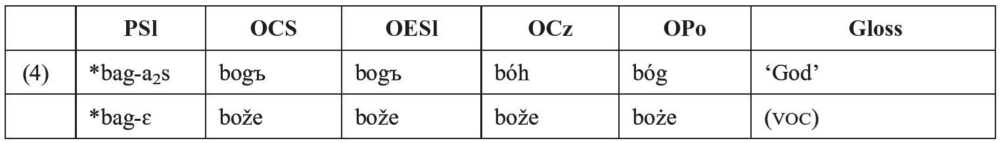

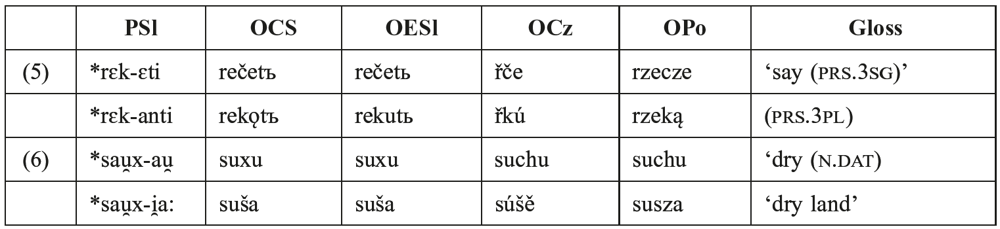

### 3.3. Vowel fronting

Back vowels developed advanced allophones after *i̯ and the alveopalatals (1−2): *a > *a̟ ([oe̞] or similar); *u(:) > *u̟(:) ([ʉ(:)] or similar). Over time, *a̟ was reinterpreted as /ɛ/. While *u̟(:) ultimately merged with *i(:), they were still rounded during the first phase of the Progressive Palatalization of Velars (see 4.6). This change called the <i>First Umlaut</i>, and the vowel fronting after the Progressive Palatalization the <i>Second Umlaut</i>. However, it is possible to treat these as two fronting episodes based on the same constraint, rather than separate changes.

Unlike *a, *a: was not rephonologized as a front vowel. Presumably, both *a and *a: had fronted opening phases, assimilating to the domed tongue position of the preceding palatal. The long vowel would typically have had time to emerge from the transitional phase and still have a distinct phase with open tongue position; hence it would have been less susceptible to reinterpretation. By contrast, like short vowels in general (Labov 1994: 173), *a would often fail to emerge from the transitional phase in time to have a distinct main phase.

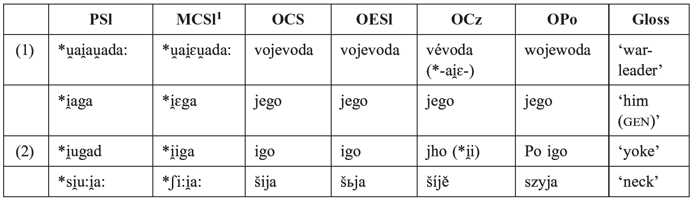

Vowel fronting preceded the monophthongization of glide-diphthongs (4.1). If it had followed, *i̯ai̯ would have become *(i̯)ɛ:₂; its actual outcome was *i̯εi̯ > *(i̯)i:, as seen in *<i>i̯ai̯xu</i> > OCS <i>ixъ</i> ‘them (GEN/LOC.PL)’; cf. *<i>tai̯xu</i> > <i>těxъ</i> ‘those’ (reflecting *ɛ:₂).

The change split the <i>ā</i>-stem (4) and <i>o-</i>stem declensions (5) into varieties with and without fronted endings, traditionally called <i>ā</i>-/<i>jā</i>- and <i>o-</i>/<i>jo-</i>stems (Lunt’s “twofold” declensions [2001: 54−59]). The differences between the fronted and non-fronted declensional variants became opaque after the monophthongization of diphthongs (4.1). Similar bifurcations occurred in derivational morphemes, e.g. (citing OCS) the PRPP suffix *<i>-am-</i>(<i>věd<b>o</b>mъ</i>|<i>znaj<b>e</b>mъ</i>, both ‘known’); the verbal determiner *<i>-au̯a</i>:- (<i>rad<b>o</b>vati sę</i> ‘rejoice’| <i>voj<b>e</b>vati</i> ‘make war’); the nominalizing suffixes *<i>-at</i>- and *<i>-ast</i>- (<i>suj<b>e</b>ta</i> ‘vanity’|<i>tix<b>o</b>ta</i> ‘quiet’; <i>rad<b>o</b>stь</i> ‘joy’|<i>doblʲ<b>e</b>stь</i> ‘valor’); and the possessive suffix <i>*-au̯</i>- (<i>grom<b>o</b>vъ</i> ‘thunder’s’| <i>zmij<b>e</b>vъ</i> ‘snake’s’).

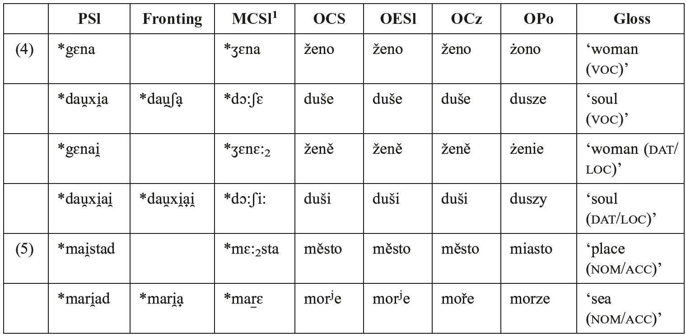

### 3.4. Merger of *i: and *a: after palatals

In ECSl, *ɛ: merged with *a: after *i̯ (1) and the alveopalatal reflexes of the 1VP (2). Concomitantly, the alveopalatals ceased to function as allophones of velars. Unlike *a (3.3), *a: had not been rephonologized as a front vowel after alveopalatals (3); however, it probably had fronting in its opening phases, which would have facilitated the merger perceptually.

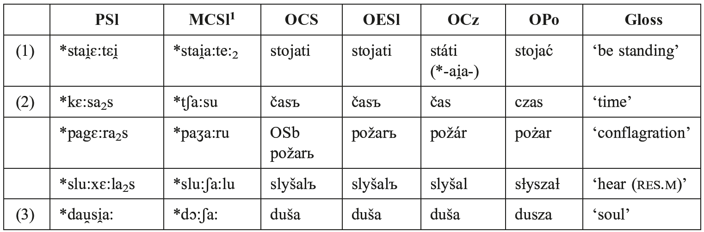

<!-- source-file: content/07_chapter01_3.xhtml -->

The primary impetus for the merger was phonemic reanalysis. As *ɛ: was (near-)open, it neighbored *a: in phonetic space. Thus, innovative learners could interpret it as an allophone of *a: after consonants with palatal (co)articulation; they would perceive its palatality as environmental rather than inherent. Cf. the perception of foreign fronted rounded vowels in Ru: typically, the rounding is preserved, while the frontness is ascribed to the preceding consonant: <i>Bonhoeffer</i> ⥬ [bɔnxʲofɛr], <i>Flossenbürg</i> ⥬ [flɔsɛnbʲurg].

### 3.5. Glide prothesis

In ECSl, on-glides developed before word- and syllable-initial *u(:), *i(:), and *ɛ(:) (1−3). The on-glides were homorganic − rounded before *u(:), and palatal before *i(:) and *ɛ(:).

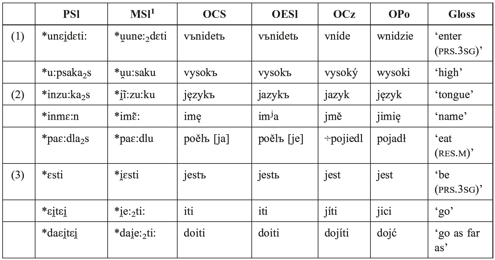

In previous works, prothesis has often been presented as a means of eliminating hiatus. Actually, that was a consequence, not a cause. The initial mechanism of the change was evidently diphthongization, followed by phonemic reanalysis. As the speech organs moved from their rest position or, in close juncture (hiatus), from articulating the preceding vowel, the anlaut vowels were realized with non-syllabic opening phases: /u(:)/ → [ᵘ̯u(:)]; /i(:)/ → [ⁱ̯i(:)], /ɛ(:)/ → [ⁱ̯ɛ(:)]. This is a typologically common form of “peak attenuation” (see Andersen 1972). The transitional phases may have been more salient in slow or emphatic speech. Subsequently, innovative learners could reanalyze the non-syllabic phases as distinct segments, phonemically identical to the inherited glides, and inherent to the given roots: [ᵘ̯u(:)] ⇒ /u̯u(:)/ → [ᵘ̯u(:)], [ⁱ̯i(:)] ⇒ /i̯i(:)/ → [ⁱ̯i(:)], [ⁱ̯ɛ(:)] ⇒ /i̯ɛ(:)/ → [ⁱ̯ɛ(:)]. Thus the traditional term <i>prothesis</i> is misleading: the glide was not added to the vowel but developed from the vowel. Finally, the glide could spread by the usual processes of social accommodation and adaptation within the speech community.

The results of <i>u̯-</i>prothesis were uniform; this suggests that it happened before the migrations, when CSl was still relatively compact. It ended before monophthongization (4.1) and the rounding of *a (5.1), since it did not affect the rounded vowels that arose in those changes, and before the delabialization of *u(:) (5.1), which removed its conditioning.

While the attested results of <i>i̯-</i>prothesis are not uniform (see below), it is reflected in all three branches of Slavic, including peripheral zones; thus, like <i>u̯-</i>prothesis, it took place while CSl was still relatively compact. It followed the backing of *ɛ: to *a: after palatals (3.4), since anlaut *ɛ:, which was subject to prothesis, had a different outcome from the *ɛ: that followed inherited *i̯ (4). (Examples with <i>ja</i> for anlaut *ɛ: arose by later dialectal changes − the merger of *i̯ɛ: and *i̯a: in E-SSl, e.g. OCS <i>jasti</i> ‘eat’; and the retraction of *ɛ: before unpalatalized dentals in Lech, e.g. Po <i>jadł</i> |<i>jedzą</i> ‘eat-PST.M.3SG|PL’.)

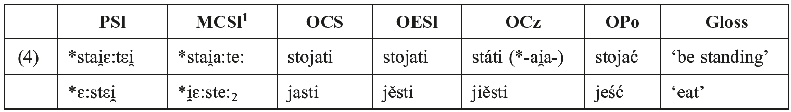

The regularity of <i>i̯-</i>prothesis has been obscured by later dialectal tendencies to eliminate *i̯<i>-</i> of either origin before <i>i</i>. The reflexes of *<i>inmɛ:n</i> (2) and *<i>(da)εi̯tεi̯</i> (3) show that the elision occurred consistently in SSl and most of ESl. The OSln Freising Fragments (later 10th c.) have <i>ge-</i> or <i>ie-</i> for /i̯ɛ/, e.g. <i>gest</i>, <i>iest</i> ‘be (PRS.3SG)’; but plain <i>i-</i> rather than *<i>*gi</i> for initial <i>i-</i>, e.g. <i>iti</i> ‘go’. The OCS and OESl spellings are ambiguous, since Glagolitic and Cyrillic had no way to distinguish <i>ji</i>/<i>jь</i> from <i>i</i>; the spelling <i>krai</i>, with «и, ι» could convey /krajɪ/ ‘edge’ with the same ending as in <i>otьcь</i> ‘father’, or /kraji/ (NOM.PL), with the same ending as in <i>otьci</i>. In OCS, the PAP of *<i>imus</i>- ‘take’ could be written as <i>imъ(š-)</i> or <b><i>j</i></b><i>emъ(š-)</i>; both of these presuppose /jɪmǝ(š)-/. Nonetheless, both OCS and OESl provide unequivocal evidence for <i>i̯-</i>prothesis before *i. In verbal roots (5), initial *i- is reflected as <i>i-</i> in unprefixed forms and after prefixes ending in vowels, i.e. environments where prothesis would have been conditioned, but as <i>ɪ (ь)</i> after prefixes ending in consonants, where prothesis would have been blocked. The cognate forms in OPo (representing Lech in general) followed a similar pattern: root-initial *i was reflected as <i>ji</i> in word-anlaut; as <i>j</i> in medial anlaut (after prefixes ending in vowels); and as zero after consonants when it was in “weak-jer” position (see 5.8). In other WSl dialects, *i underwent the same development after *i̯ in word-anlaut as elsewhere; cf. OCz <b><i>j</i></b><i>mě</i> (1) and <b><i>j</i></b><i>me</i>, <i>po<b>j</b>me</i> (5); US <b><i>j</i></b><i>mje</i> ‘take (PRS.3SG)’, <i>po<b>j</b>mje</i> take (PRS.3SG)’.

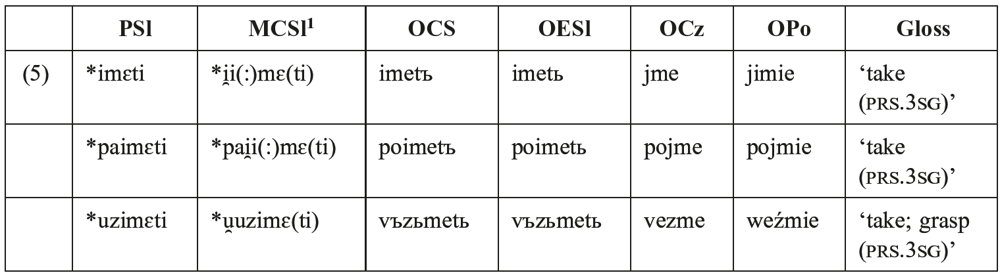

#### 3.5.1. Prothesis before open vowels

Throughout Sl, *i̯ developed before initial *a: in lexical roots (6). On the southeastern periphery, in OCS and later Bg dialects (7), some of these roots are also attested without the glide. There was never prothesis before the conjunction *a: and its compounds (8). The adverbs *<i>a:kad</i> ‘as’ and *<i>a:mas</i> ‘to where’ show variation; the presence of the glide may have been due to contamination with the relative root *i̯- (9).

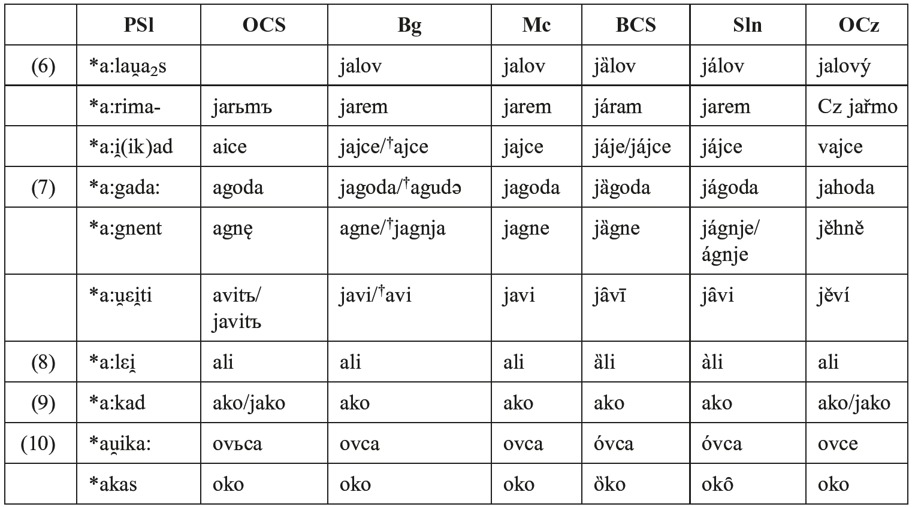

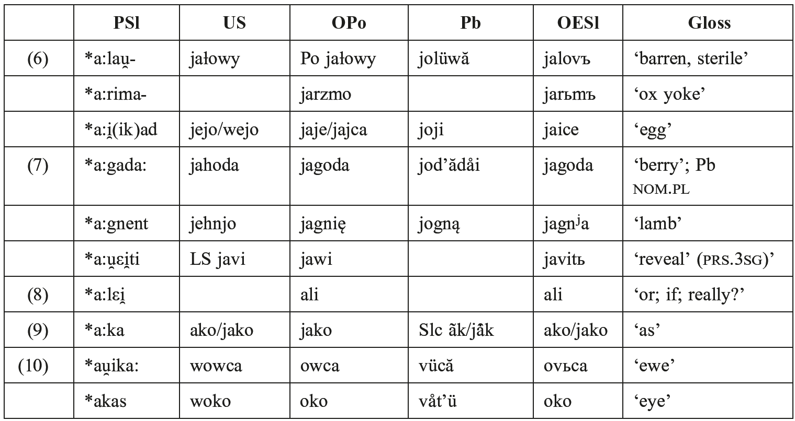

Outside of E-SSl, the isolated lexemes with initial *a: may have non-phonological explanations. The Sln variant <i>ágnje</i> (7) was probably influenced by La <i>agnus</i>. Uk dialectal <i>ajo</i> ‘egg’ is an innovation of children’s speech; Novg <i>aje-</i> (<i>ajesova</i> ‘egg-shover’, with ‘egg’ in the sense ‘testicle’) may be a taboo deformation. (See below for an alternative explanation.)

Because <i>i̯-</i>prothesis occurred before *a: but not *a (10), some scholars have dated it to LCSl, after quantitative distinctions had given way to qualitative ones (*a > *ɔ, *a: > *a; see 5.1); concomitantly, they have interpreted the cases of non-prothesis in E-SSl as peripheral archaisms. This late dating seems implausible for a change attested, with the same restriction to lexical morphemes, in all Sl dialects, including E-SSl in most of the eligible roots. This distribution is comparable to that of ECSl changes, not LCSl. The OCS and Bg exceptions need not be archaisms, since there was a tendency in E-SSl to elide *i̯ in other environments.

Given its restriction to lexical roots, <i>i̯-</i>prothesis before *a: was probably not sound change proper. The palatal glide cannot have been a reinterpretation of the opening phase of *a:; the transition from rest position to the full articulation of *a: would not involve the doming of the tongue characteristic of *i̯. A glottal consonant might be expected instead (and may have actually developed, though it cannot be reconstructed). On the other hand, the palatal glide could have arisen by provection rather than prothesis, from the final phase of front vowels in transition to *a: in close juncture; once reanalyzed as a distinct segment, it could have been generalized as a sandhi variant to other contexts. Presumably, there would have been a parallel tendency for *u̯ to develop in the transition from rounded vowels to *a:. This would account for certain roots in which CSl has an unexpected *u̯ before *a: and even *a, cf. Bg <i>vatral</i> ‘poker’, BCS <i>vȁtra</i>, Cz <i>†vatra</i>, Uk <i>vatra</i> ‘fire’, Slk <i>vatra</i>, Po <i>†watra</i>, ‘hearth’, if from PSl *a:tra: (cf. Avestan <i>āter</i> ‘fire’); OCS, OESl, <i>vonʲa</i>, OCz <i>vóně</i>, OPo <i>wonia</i> ‘smell’ <i>(*ani̯a</i>:). Note also OCz, Slk <i>vajce</i> ‘egg’ (6). Concomitantly, the loss of inherited *u̯ in PIE *<i>u̯ops</i>- > OSb, OESl, OPo <i>osa</i>, OCz <i>os</i> ‘wasp’ could have been a hypercorrection<i></i>. In this scenario, it would not be surprising to find forms without any glide at all; cf. Sln <i>ágnje</i> ‘lamb’, Novg <i>aje-</i> ‘egg’ (above).

The tendency to extend *i̯- more often than *u̯- may be linked with another change that involved *a: but not *a <i>−</i> its merger with *ɛ: after palatals (3.4). In PSl, initial *i̯a: was limited to derivatives of the pronominal root *i̯-. After the change of *i̯ɛ: to *i̯a: (3.4), the inventory grew to include other lexical roots (11). The existence of lexemes with semantically unmotivated (non-pronominal) *i̯a: may have promoted the reanalysis of sandhi off-glides as /i̯-/ and their extension as a phonotactic pattern<i></i>.

Similarly, in some LCSl dialects, there was sporadic <i>i̯-</i>prothesis before anlaut *u:₂ (PSl *au̯) (12) − not the <i>u̯-</i>prothesis that might be expected from the vowel’s articulation per se. This was probably a sandhi phenomenon, perhaps promoted by roots with *i̯u:₂ (from PSl *i̯au̯). This process did not occur consistently anywhere in Sl, and it generally did not affect the preposition/prefix *u:₂ (13). In ESl, there were hypercorrections in which inherited glides were lost before <i>u</i> (from *u:₂ and *ǫ) (14). This has been treated as a sound change, and the exceptions as Church Slavonisms, but in fact there are many lexemes in which the glide has been preserved.

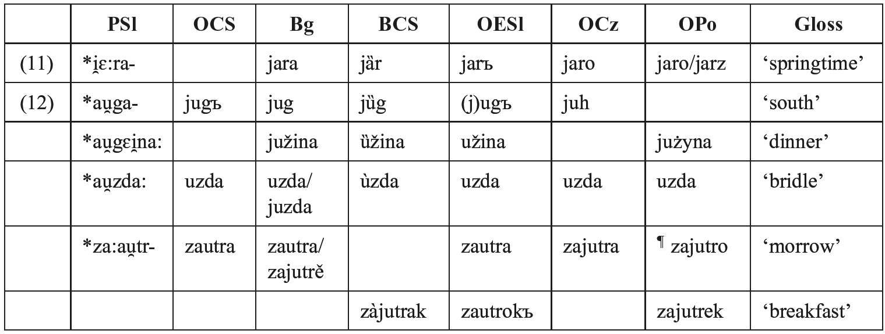

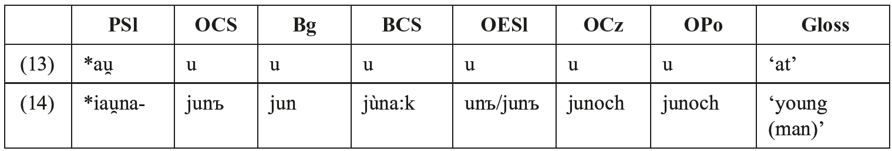

### 3.6. Dental palatalizations

Before *i̯, dentals developed backed allophones with palatal (co)articulation: /Ti̯/ → [Tʲi̯] or [<u>T</u>i̯]. (The retraction diacritic <u>T</u> is used to cover postalveolar and dorsal articulations<i></i>.) Then the sequences were monophonemicized, and *i̯ interpreted as an offglide, which was later eliminated in a deductive change: ECSl¹ [Tʲi̯] or [<u>T</u>i̯] ⇒ /Tʲ/ or /<u>T</u>/ → ECSl² [Tʲⁱ̯ ~ Tʲ] or [<u>T</u>ⁱ̯ ~ T]. This complex of changes (“yodization,” Schenker 1995; “iotation,” Lunt 2001), may have occurred at various times for the different manners of articulation.

PSl *si̯ and *zi̯ became *ʃ and *ʒ (1), thus merging with the reflexes of 1VP *xʲ and *gʲ (see 3.2)<i></i>. PSl *li̯ and *ni̯ became either palatal *ʎ, *ɲ or palatalized dental *lʲ, *nʲ (2); *ri̯ (3) became *rʲ or post-alveolar *<u>r.</u> The reflexes will be indicated with the retraction diacritic (<u>R</u>).

The clusters *ti̯ and *di̯ (4) had diverse reflexes in LCSl (see 4.7). However, all the outcomes can be derived from a stage parallel to the sonorants, with either palatal coarticulation (*tʲ, *dʲ) or primary (alveo)palatal articulation (*c̟, *ɟ). The ECSl² reflexes will be indicated with the retraction diacritic (<u>T</u>).

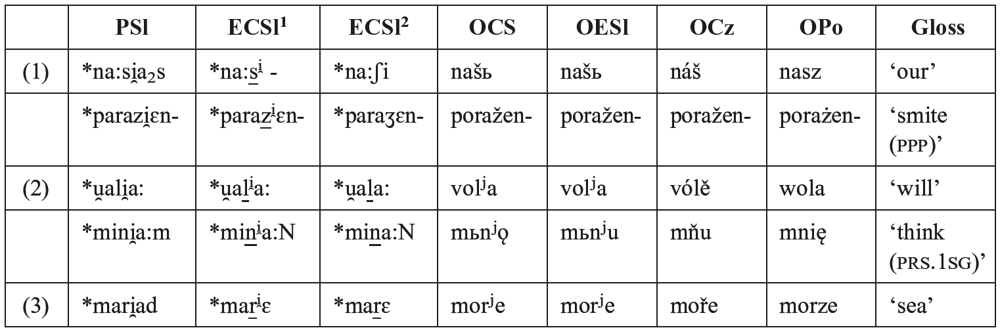

The clusters *sti̯, *zdi̯ merged with *skʲ, *zgʲ from the 1VP (3.2). Evidently, the sibilants backed to assimilate to *<u>t</u> and *<u>d;</u> then they merged with the alveopalatals *ʃ and *ʒ; then the following stops *<u>t</u> and *<u>d</u> assimilated to hushers. (In some ESl and some SSl dialects, *<u>t</u> and *<u>d</u> became alveopalatals in all positions; see 4.7)

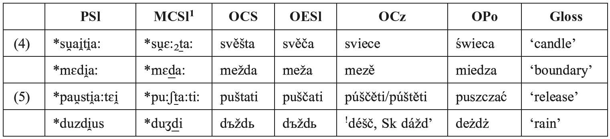

The palatalization of dentals and loss of the triggering *i̯ had a major impact on morphology. In class III verbs (*i̯e/*i̯o themes), new root allomorphs appeared throughout the present-tense system; the stem formant *i̯ was no longer in evidence (6). In Class IV verbs, the theme had appeared in the <i>e-</i>grade *εi̯ or the lengthened grade *i: before consonantal suffixes, and in the zero-grade *i̯ before vocalic suffixes. After dental palatalization, the allomorphy shifted to the root; with the loss of the *i̯ and the development of nasal vowels (see 4.2), the old theme was no longer apparent throughout the paradigm. Where the predesinential vowel persisted, it was necessarily reinterpreted as part of the ending (7).

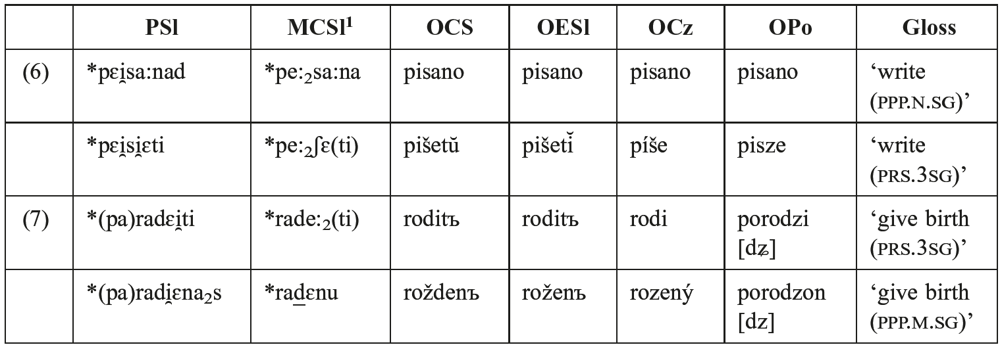

#### 3.6.1. *kt clusters

As noted in 3.1.3, in *kt clusters the velar was lost, while the dental had bifurcating reflexes. It persisted before non-front vowels (1), but became t (see 3.6) before front vowels (2).

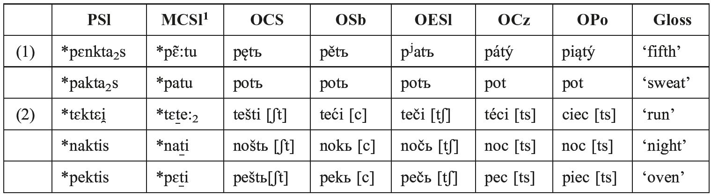

The development here was presumably not *kt > *[k]ti̯, as the drift in CSl was to eliminate postconsonantal *i̯ (see 3.7). Rather, *t developed a non-anterior allophone [<u>t</u>] in assimilation to the surrounding non-anterior segments; this merged with the phonetically similar or identical monophonemicized reflex of *ti̯<i></i>. When the preceding velar was elided, the conditioning of *<u>t</u> became unpredictable. (For the LCSl development of *t, see 4.7.)

There may have been a parallel change *n > *<u>n</u> between velars and *i<i></i>. Here BCS and some Sln dialects have /ɲ/: *<i>(−)gni:da</i>: > Sln <i>ugnjída</i> ‘ulcer’, BCS <i>gnjȉda</i> ‘nits’. In OCS <i>ognʲь</i> ‘fire’ (PSl *<i>agnis</i>), the nasal is often written with the palatalization diacritic (н̑); however, the word is also attested as a <i>i̯o-</i>stem. Elsewhere in Sl, there is principled uncertainty, as the reflexes of *<u>n</u> cannot be distinguished from those of *n before front vowels.

### 3.7. Elimination of glides in clusters

#### 3.7.1. Homorganic glides

After conditioning the 1VP (3.2) and dental palatalization (3.6), *i̯ was reinterpreted as an off-glide of the new palatals and ceased to exist as an independent unit (1−2): /ʃi̯/ → [ʃi̯] ⇒ /ʃ/ → [ʃi̯~ʃⁱ̯ ~ ʃ]. There was a parallel reanalysis of *u̯ after labial consonants; the given clusters occurred in zero-grade forms of ‘be’ (3) and over prefix boundaries (4): /bu̯/ → [bu̯] ⇒ /b/ → [bu̯~bᵘ̯~b]. (Counterexamples in the attested languages are the result of post-CSl changes or leveling: OESl <i>obiniti</i> but Ru <i>obvinit’</i> ‘accuse’, cf. <i>vina</i> ‘fault’.) The changes in homorganic glides are traditionally presented as elision. This is accurate as a metalinguistic description of the outcomes, but the essential innovations were monophonemicizations, or <i>monophthongizations</i> in Andersen’s sense (1972). The changes differed from previous developments in consonant clusters in two ways: they worked progressively, and they involved sequences that did not violate canonical syllable structure (see 3.1).

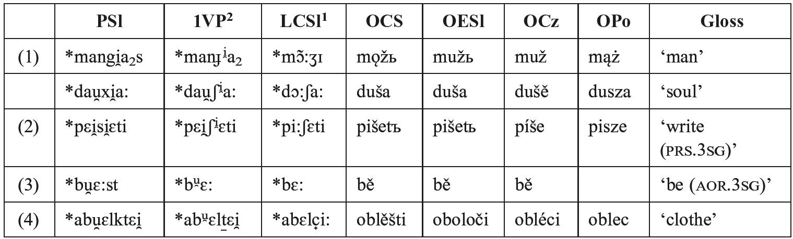

#### 3.7.2. Labial + glide clusters

CSl *i̯ became *<u>l</u> after labials (1−2). This affected not only inherited *i̯ (1−2) but also the *i̯ on-glide that developed in the monophthongization of *ɛu̯ (see 4.1). It is unclear whether the change began before or after the monophthongization. The lateral has traditionally been called <i>epenthetic <u>l</u></i>, as if it were inserted for ease of pronunciation. In fact, the *<u>l</u> was a transmutation of the *i̯, not an addition to the cluster. The phonetic mechanism was target undershoot as the tongue blade retracted from the rest position characteristic for labials to the domed position characteristic for *i̯<i></i>. The resulting not-quite-palatal approximant was perceptually similar both to *i̯ and to *<u>l</u> from *li̯ sequences (see 3.6), and hence open to rephonologization as *<u>l.</u>

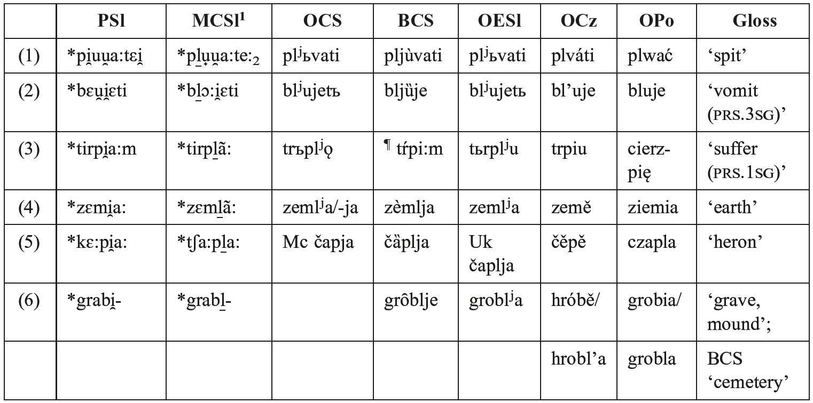

The *i̯ > *<u>l</u> change is usually treated alongside dental palatalizations [3.6], as if it involved palatal (co)articulation; in fact, it was a progressive rather than a regressive change. There are parallels from the historical period in which <i>i̯</i> became <i><u>l</u></i> in new Pi̯ clusters: PSl mai̯x- > LCSl¹ *<i>mæʃina</i> > BCS <i>mjèšina ~ †mljèšina</i> ‘sack’. There are also counter-parallels with ʎ being rephonologized as <i>i̯</i>: Rom <i>Mileta</i> > LCSl¹ *<i>mɪlætǝ</i> > BCS <i>Mljȅt</i> ~ <i>†Mjȅt</i> (name of an Adriatic island); cf. La <i>planus</i> > Italian <i>piano</i> ‘level’; La <i>sclavus</i> > Italian <i>schiavo</i> ‘Slav; slave’.

The change of *i̯ > *<u>l</u> is attested in all Sl dialects within morphemes (1−2). Over morpheme boundaries (3−4), the lateral has been preserved consistently in ESl and W-SSl. Elsewhere, there was a late tendency to reanalyze it as a glide, presumably by leveling with related forms. This reversal was ongoing in OCS (10th−11th centuries), as seen in the spelling variants <i>Plʲ</i>~<i>Pj~Pьj</i> [Pj]. In WSl, *l was lost consistently in paradigmatic alternations (3) and often elsewhere (4). However, non-alternating *l has left many relics: OPo ‘heron’ (5), US <i>ča<b>pl</b>a</i>, LS <i>ca<b>pl</b>a</i>, Kb <i>cza<b>pl</b>a</i>; OCz toponyms <i>Počě<b>pl</b>ice</i>, <i>Počěpli</i>, <i>Poča<b>pl</b>i</i>; the doublets in OCz and OPo ‘mound’ (6), Slk <i>hro<b>bl’</b>a</i> ‘dam’, US <i>hrobla</i> ‘ditch’. This variation shows that the WSl loss of the lateral was relatively late and probably independent of the parallel tendency in E-SSl. (Alternatively, the variation could have arisen not by a “loss” of *<u>l</u> but by the coexistence of conservative and innovative forms within the same speech communities.)

The change led to morphophonemic alternations in verbs. In class IIIb, *<u>l</u> appeared throughout the PRS system: OCS <i>priimati</i>|<i>priemlʲetъ</i>, <i>priemlʲi</i>, <i>priemlʲǫšt-</i> ‘receive (INF|PRS. 3SG, IMP.2SG, PRAP)’. In class IV, *<u>l</u> appeared in the 1SG, but not in other PRS forms: OESl <i>lʲublʲu</i>|<i>lʲubiši</i> ‘love (PRS.1SG|2SG)’. In class IVa, *<u>l</u> occurred in the stems of the imperfect, archaic PAP, PPP, and deverbal noun: BCS <i>ljubljaše</i> (IMPF.3SG); OESl <i>vъzljublʲь</i>(PFV.PAP); BCS <i>ljubljen</i> (PPP); Sln <i>ljubljenje</i> (noun).

### 3.8. Vowels in final closed syllables

In certain grammatical forms, PSl *a(:) and *ɛ(:) in final syllables rose to, or were replaced by, *u(:) and *i(:). The same happened before final sonorants; cf. *<i>ma:ti</i>: and *<i>dukti</i>: in 3.1.4. There is debate about whether the raised outcomes arose in sound changes limited to final syllables <i>(Auslautgesetze)</i> or in morphological substitutions.

For PSl *-aN (1−2), the expected outcome was *-a (see 3.1.4); the actual reflex was *u, fronted to *i after palatals (see 3.4). In the <i>(i̯)o-</i>stem M.ACC (1), the inherited ending would have merged with N.NOM/ACC.SG *-ad > *-a. If the ending *-u did not arise by sound change, it could have been imported from the <i>u-</i>stems (*-um); other <i>u-</i>stem endings were coopted during the CSl period. In the nonsigmatic (root) AOR.1SG, the expected reflex of *<i>-am</i> (cf. Gk <i>-on</i>) would have been *-a; the attested *u (<i>izid<b>ъ</b></i> ‘go out’) may have been reformed on the basis of the sigmatic AOR.1SG <i>*-s-um</i> (PreSl *<i>-sm̥</i>; cf. Gk <i>-sa</i>). The sigmatic aorist became the predominant type during the CSl period, and the two types otherwise interacted; for example, the root aorist ending was coopted to repair the erosion of the sigmatic 2/3SG in Leskien I, II, and V.

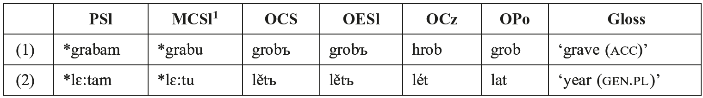

For PSl *-as, the expected outcome was *a, fronted to *ɛ after palatals. This occurs in lexemes where *-as was part of the stem (3). However, in the <i>(i̯)o-</i>stem M.NOM.SG (4), *<i>-a₂s</i> (with the subscript signaling a divergent outcome) rose to, or was replaced by, *<i>-u</i>, fronted to *<i>-i</i> after palatals. If *<i>-a₂s</i> had developed as expected, it would have been syncretic with the N.NOM.SG *<i>-a</i> < *<i>-ad</i> (not to mention the M.ACC.SG, see above). Such syncretism may account for seemingly “neuter” hypocoristics used for male referents, e.g. OSb <i>Radivoje</i>, OESl <i>Stoiko</i>, OCz <i>Tenko</i>, OPo <i>Zdięto</i>. (Conversely, the syncretism may explain why most PreSl barytone neuters became masculines.) While attempts have been made to explain the *<i>-a₂s</i> reflex by sound change, it was more probably analogical to the <i>u-</i>stem NOM/ACC.SG *<i>u</i> (< *<i>-us</i>/*<i>-um</i>). For the hypocoristics, syncretism was promoted by the fact that the neuter was already used to denote baby humans and animals (cf. *<i>agnɛnt</i> ‘lamb’ [6]). The directional adverbial suffix *<i>-mas</i> yielded both *<i>-ma</i> and *<i>mu</i> (5). The latter may be analogical to ACC.SG *<i>-u</i> or DAT.PL *<i>-mu(s)</i>; accusative and dative both had directional meanings.

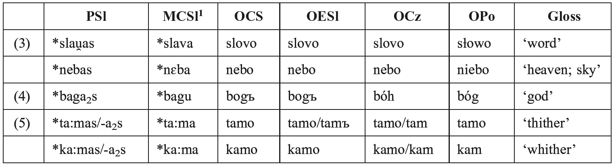

The sequence *-Vnt (<i>nt-</i>stem NOM/ACC.SG) developed like internal *VN-C (6); the vowel and nasal monophthongized as Ṽ (see 4.2). By contrast, *<i>-</i>Vns (<i>o-</i>stem and <i>ā-</i>stem ACC.PL) had different outcomes, depending on the preceding consonant. After non-palatals, the vowel was lengthened without being nasalized (7): *-ins > *-i:, *-uns > *-u:, and *ans > *-u: (with raising). If this was a sound change, the lengthening was compensatory for the disappearing nasal; vowels otherwise did not undergo lengthening before final *s. (If the final *s had disappeared before the nasal, **VN > **Ṽ would be expected; see 3.1.4) When *ans followed a palatal, the loss of the nasal was delayed, for unclear reasons. The vowel was fronted to *ɛ, as expected (3.4). In WSl and ESl, *-ɛns > *ɛ:, parallel to the development of *-ins. In SSl, the vowel underwent both lengthening and nasalization, like internal tautosyllabic *ɛN (see 4.2): OCS <i>ę</i> [[image-glyph: Greek epsilon with tilde]], OSb <i>e</i> [ɛ]. If the development was regular, the outcomes may be due to different relative chronologies: SSl *-ɛns > *-[image-glyph: Greek epsilon with tilde]:ⁿs > *-[image-glyph: Greek epsilon with tilde]:, but WSl, ESl *-ɛ:ⁿs > *-ɛ:s prior to nasalization. In (8), *[image-glyph: Greek epsilon with tilde]: would have yielded OESl <i>a</i>, OPo <i>ę</i> [[image-glyph: Greek epsilon with tilde]], while *ɛ: would have given OCS <i>-ě</i> [æ], OSb <i>-ě</i> [e]. (The WSl and ESl outcome is known as *ɛ:₃, where *ɛ:₁ = PSl *ɛ: [2.1] and *ɛ:₂ = PSl *ai̯ [4.1]. However, it seems likely *ɛ:₃ developed prior to *ɛ:₂.)

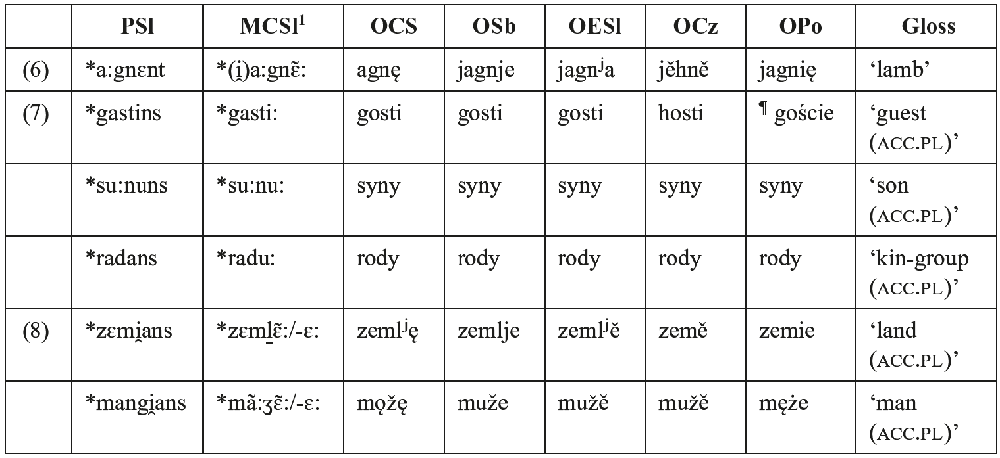

The outcome of *<i>-ants</i># (PRAP.M/N.NOM) also bifurcated, with the same dialect divide. After non-palatals, the vowel was lengthened, and the nasal was lost before the development of nasal monophthongs in MCSl¹. It was raised to *<i>-u</i>: in SSl but remained low *<i>a</i>: in WSl and ESl (6). After palatals, the loss of the nasal was again delayed; all dialects show the expected fronting, then lengthening and nasalization (7). (There is no way to determine if the vowel was also raised, as MCSl¹ *[image-glyph: Greek epsilon with tilde]: and *ĩ: merged in LCSl.)

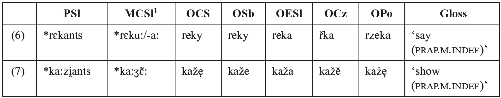

## 4. Middle Common Slavic (MCSl) changes

If ECSl was the period in which the vowel system was essentially the same as in PSl, MCSl began with a drastic restructuring of the vowel system − the monophthongization of diphthongs (4.1−4.2) or <i>First Slavic Vowel Shift</i> (Andersen 1998), which probably occurred ca. 4th−5th centuries (idem 2014: 59). Like the ECSl changes, the monophthongizations had the same results in all the CSl dialects, but they were the preludes to developments with dialectally differentiated outcomes (4.4−4.6). The latter are treated as MCSl changes here if their isoglosses divide a unified WSl from SSl and ESl − that is, if CzSlk patterns with Lech. This distribution can be interpretated as follows: P-WSl extended into the Northern European Plain, which attenuated its contact with the other dialects, but it was still internally cohesive because all of its dialects were on the same side of the Carpathians. The P-ESl zone had been attenuated by northward migrations; thus pre-Novgorodian (Novg) patterned as a periphery to the central zone represented by P-SSl and P-ESl.

### 4.1. Monophthongizations of glide diphthongs

ECSl had falling diphthongs with coda *i̯ and *u̯ before consonants or the word boundary. These tautosyllabic diphthongs became long/tense monophthongs: (1) PSl *ai̯ > LCSl¹ *æ (Slavistic <i>ě₂</i>), merging with the reflex of inherited *ɛ: (1); PSl *εi̯ > LCSl¹ *i (Slavistic <i>i₂</i>), merging with the reflex of inherited *i: (2); and PSl *au̯, *ɛu̯ > LCSl¹ *u (Slavistic <i>u₂</i>) (3−4). Heterosyllabic sequences of the same vowels and glides did not undergo monophthongization; examples from the same roots are included in the table for comparison.

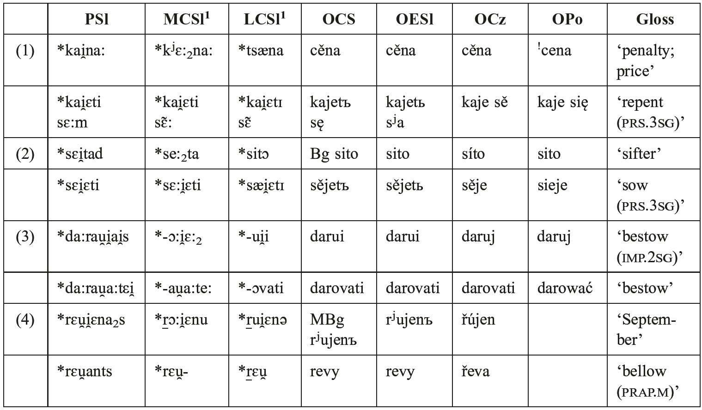

The split of tautosyllabic and heterosyllabic *au̯ created allomorphy in Leskien III verbs with stems in *-au̯- (3). The resulting morphophonemic alternation is still productive in the denominal suffix <i>-ova-</i>: Cz <i>googlovat</i>|<i>googluje</i>, Ru <i>guglovat’</i>|<i>guglujet</i> ‘Google (INF|PRS.3SG)’.

The monophthongizations took place in several phases. First, the vowels assimilated to the tonality of the glides, if different: before *i̯, *a became advanced *a̟, with the tongue slightly domed and closer to the palate; before u̯, *a, *ɛ became slightly rounded *a̹, *ɛ̹. Second, the vowels tensed in partial assimilation to the close, peripheral articulation of the glide: *a̟i̯ > *a̟ˑi̯, *εi̯ > *εˑi̯, *a̹u̯ > *a̹ˑu̯, and *ɛ̹u̯ > *ɛ̹ˑu̯ > *ⁱ̯a̹ˑu̯. The breaking of the *ɛ̹ into a high-tonality opening and a low-tonality nucleus is a well-attested type of change. The front on-glide conditioned dental palatalization (3.6), which was not ordinarily an effect of *ɛ. Afterwards, it was reinterpreted as an off-glide of the preceding consonant, in accordance with the general CSl pattern (see 3.3, 3.6, 3.7.1). After labials, it became *l (3.7.2).

The stage of monophthongizations proper is designated MCSl¹. The tensed vowels became more moved along the peripheral track: *a̟ˑi̯ > *æˑⁱ̯ encroached on *εˑi̯, which rose to *eˑⁱ̯; *a̹ˑu̯ > *ɔˑᵘ̯. The glides were then revaluated as the closing phases of the long/tense vowels: [eˑi̯]⇒/*e:/ → [e:⁽ⁱ̯⁾]; [*æˑⁱ̯] ⇒ /ɛ:/ → [ɛ:⁽ⁱ̯⁾], merging with inherited *ɛ: (a near-open vowel); and [a̹ˑu̯]⇒ /ɔ:/ → [ɔ:⁽ᵘ̯⁾]. The dephonologized off-glides were later eliminated by deductive changes.

The final stage, designated MCSl²<i></i>, the mid- or close-mid monophthongs rose one cardinal position. Thus *e: merged with the reflex of inherited *i:. In rising, *ɔ: encroached on the space of inherited *u:₁, which moved into the central vowel space (see 4.3); *ɔ: then occupied the vacated close back space as *u:₂.

As a result of the monophthongizations, the inherited ablaut relations ceased to be transparent in syllables that had been diphthongal. Thus the ablaut series *i|*εi̯|*ai̯ became *i|*i:₂ |* ɛ:₂ (5), while *u|*ɛu̯|*au̯ became *u|*i̯u:₂ |*u:₂ (6).

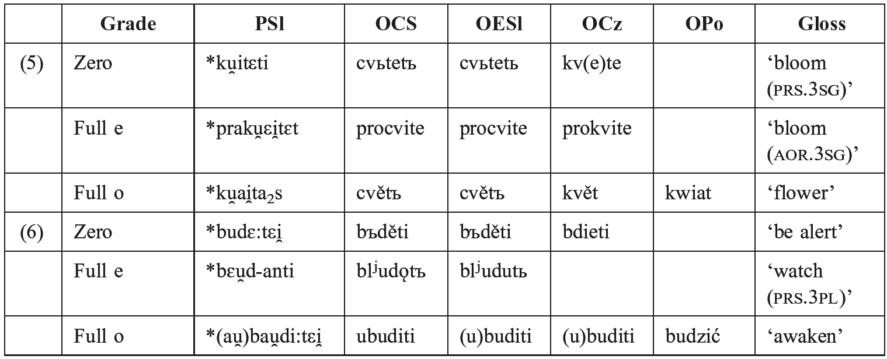

#### 4.1.1. Chronology

As the reflex of *ai̯ did not condition the 1VP (3.2), it evidently was not yet a front vowel during that period. The reflex of *ɛu̯ was not yet a close vowel at the time of Vowel Fronting, since it had a different fate from inherited *i̯u: (see 3.3). (On the relative chronology of monophthongization and the Progressive Palatalization, see 4.6)

The monophthongizations <i>sensu stricto</i> had not begun during the main period of contacts with EGmc (ca. 2nd−4th cc.), since both borrowed and inherited *au̯ and *ai̯ underwent the same changes (5). However, the changes were at the MCSl¹ stage by the time of early contacts with WGmc and Rom (from ca. 5th c.). Foreign *ɔ: or o: (6) was adapted as *ɔ:, the reflex of *au̯, prior to its rise to *u:₂ in MCSl². Gk toponyms of Sl origin, dating at earliest from the late 6th−early 7th centuries, were accessed during the MCSl¹ stage, as the *au̯ reflex was rendered «ο, ω» rather than «ου»: PSl *<i>strau̯mɛn</i>-‘stream’ ⥬ Στρώμην; PSl *<i>sau̯x</i>- ‘dry’ ⥬ Σωχός, Σοχᾶς. Similarly, early BFi borrowings (probably 7th−8th centuries) show a MCSl¹ reflex of *au̯: PSl *<i>gau̯minad</i> ‘threshing floor’ ⥬ Votic <i>kōmina</i>, Vepsian <i>gomin</i>, Karelian <i>kuomino</i>, Eastern Finnish <i>kuomina</i> (from *ō).

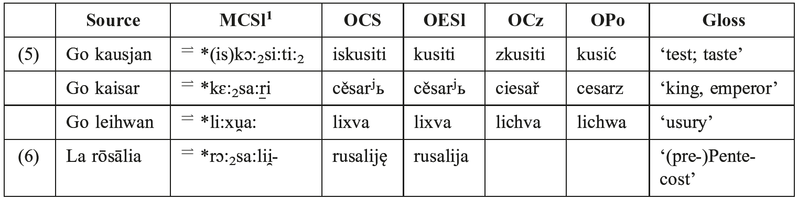

#### 4.1.2. Alternative approaches

The monophthongizations have been interpreted in strikingly different ways. In one approach (e.g. Jakobson 1963), the vowel and glide metathesized in obedience to the Law of Open Syllables; the vowel was lengthened and raised: *εi̯ > *i̯e::> i₂, *ai̯ > *i̯ɛ:₂, *au̯ > *u̯ɔ: > *u:₂. However, the *εu̯ outcome cannot be explained by metathesis (**u̯e:), so an intensity shift is posited instead (*i̯u:₂). This approach does not account for why dentals and labials underwent iotation changes before *i̯u:₂, but not before *i̯e: and *i̯ɛ:₂; nor does it provide a coherent motivation for the lengthening and raising of the vowels.

Another approach (Feldstein 2003) assumes that the diphthongs were not VV̯ but VV (“equal vocalic components”, ibid.: 249). When the components matched in tonality, the first assimilated totally to the second:  in the present notation). When they differed in tonality, frontness spread from one to the other; then one assimilated totally to the other in sonority: 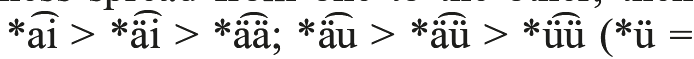*u̟ in the present notation). The notion of “total assimilation” conflicts with the evidence that there was an intermediate stage with mid-vowels (MCSl¹, 4.1.1). The author does not explain why “total assimilation” proceeded right to left for *a͡i, but left to right elsewhere; nor does he account for how his *ü(:) avoided merger with the front(ed) rounded vowel *u̟: (3.3), which was still labialized at the time of the Progressive Velar Palatalization (see 4.3, 4.6). He treats the development of *i̯ before *u̟u̟ (*üü) not as an integral outcome of the monophthongization but as a separate (and ad-hoc) change that “provided additional redundancy” for frontness combined with rounding (ibid.: 261).

#### 4.1.3. Unexpected outcomes

Final *-ai̯ has the regular outcome *ɛ:₂ in some endings, e.g. PSl *<i>zei̯mai̯</i> > OCS, OESl, OCz<i>zimě</i>, OPo <i>zimie</i> ‘winter (DAT/LOC)’. However, in four endings they are said to have yielded *-i:₂. Of these, the DAT.SG enclitic personal pronouns − OCS <i>mi</i> (1SG)<i>, ti</i> (2SG), <i>si</i> (REFL) − can be excluded. Though compared with Gk μοι, σοι, they are more likely to be the regular outcomes of PSl *<i>mɛi̯, *tɛi̯, *sɛi̯</i>; the same ending occurred in the DAT.SG of <i>i-</i> and consonant-stem nouns (OCS <i>pǫt-i</i> ‘road’, <i>dьn-i</i> ‘day’), cf. OPr <i>mennei, tebbei, sebbei</i>, Li †<i>manie</i>, †<i>tavie</i>, †<i>savie</i>. The remaining endings almost certainly do go back to *-ai̯, since they triggered the 2VP (4.4) rather than the 1VP (3.2): <i>o-</i>stem M.NOM.PL *<i>u̯ilkai̯</i> > OCS <i>vlъci</i>, OESl <i>vьlci</i>, OCz <i>vlci</i>, OPo <i>wilcy</i> ‘wolves’; Leskien I−II IMP.2SG|3SG: <i>*mag-ai̯-s</i>/<i>-t</i> > OCS <i>modzi</i>, OESl, OCz <i>mozi</i> ‘dare’. Moreover, forms of the imperative where the diphthong was non-final have the expected outcome *ɛ:₂: OCS <i>modz<b>ě</b>te</i>, OESl <i>moz<b>ě</b>te</i>, OCz <i>moz<b>ě</b>te</i> (IMP.2PL). The problematic endings can be treated as analogical to inflection types with thematic *-i̯- (<i>i̯o-</i>stem nouns and Leskien III verbs). Alternatively, one could posit that *-ai̯C# regularly became *-i:₂, if the <i>o-</i>stem NOM.PL is reconstructed with a final *-s (cf. <i>i-</i>stem *<i>-ii̯ɛs, u-</i>stem *<i>-au̯ɛs</i>, consonant-stem *<i>-ɛs</i>).

### 4.2. Monophthongization of vowel-nasal diphthongs

In MCSl, tautosyllabic vowel-nasal diphthongs became unitary nasal vowels: *aN, *un > LCSl¹ *[image-glyph: open o / reversed c with tilde] (1), and *ɛn, *in > LCSl¹ *[image-glyph: Greek epsilon with tilde]. These are the sounds represented by the OCS “jusy” ѫ <i>(ǫ)</i> and ѧ <i>(ę)</i>, respectively. (For their outcomes in the individual Sl languages, see 5.2.2)

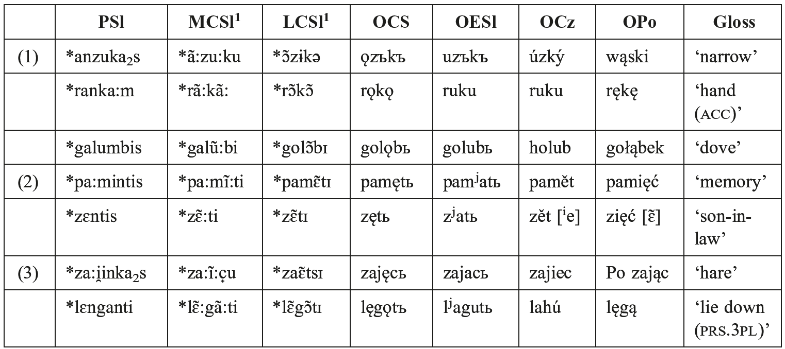

The development of nasal vowels took place in three phases. First, the vowels underwent assimilatory nasalization: /VN/ → [ṼN]/__{C, #}. Second, the nasals were reinterpreted as the closing phases of the vowels: [ṼN] → /Ṽ:/ → [Ṽ(N)]. In other words, they were revaluated as transitions to the closure (complete or partial) of the following units. Concomitantly, their distinctive tonality (*m or *n) was ascribed to the following consonants. Thus syllable-final nasals ceased to exist as phonologically independent units. The new nasal vowels were redundantly long, preserving the mora count of the old diphthongs.

The stage that resulted from these first two phases is designated MCSl¹<i></i>, corresponding to the monophthongization phase of vowel-glide diphthongs (see 4.1). In the next phase, MCSl²<i></i>, *ã: and *ũ: merged as mid-back rounded *[image-glyph: open o / reversed c with tilde]: (Slavistic <i>ǫ</i>), and *ĩ: and *[image-glyph: Greek epsilon with tilde]: as (open-)mid-front [image-glyph: Greek epsilon with tilde]: (Slavistic <i>ę</i>). It is not problematic that the merger involved both lowering of the close vowels and raising of the (near-) open ones. Cross-linguistically, close nasal vowels tend to be perceived as more open, and open nasal vowels as more close, than their oral counterparts. Presumably, the mergers were also facilitated by the relative perceptual difficulty of distinguishing between nasal vowels, as compared with their oral counterparts (see Ohala 1975: 294). (The existence of a separate MCSl¹ stage, with distinct *ĩ: and *[image-glyph: Greek epsilon with tilde]: vowels, is indicated by the fact that the Progressive Velar Palatalization occurred after *in, but not after *ɛn; see 4.6)

The monophthongization created morphophonemic alternations between VN and 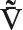[image-glyph: V with tilde] in nasal-stem verbs (Leskien Ia and IIIa) (4−5) and in neuter <i>n</i>-stem nouns (6). In addition, it obscured the ablaut patterns in inceptive verbs with infixed *n in the present system (7−8).

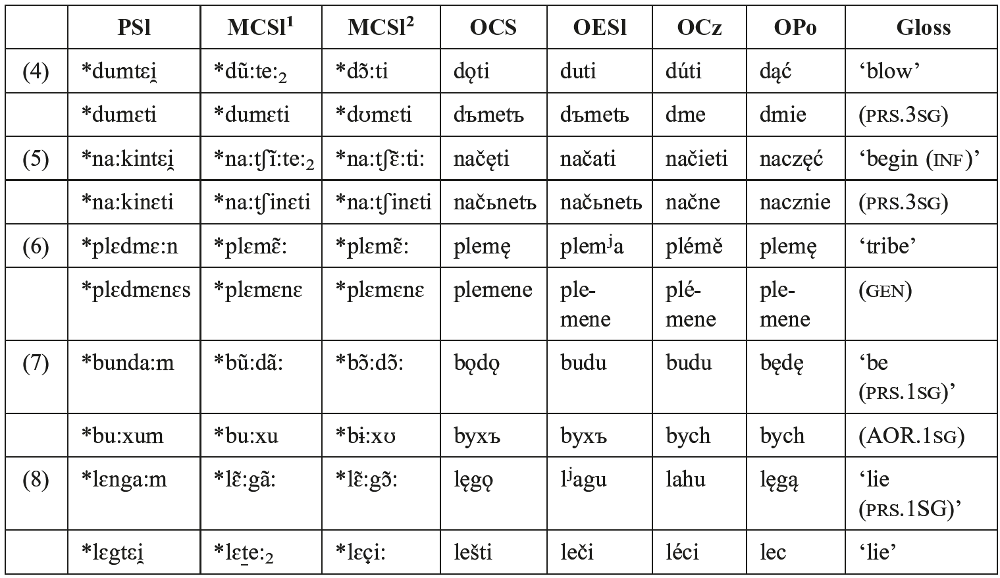

4.2.1. For Feldstein (2003), this change, like the other CSl monophthongizations, involved gemination in a diphthong defined as “equal vocalic components” (Feldstein 2003: 249) − i.e. VN̥. The first portion assimilated to the nasality of the second, which then assimilated to the sonority of the first: VN̥ > ṼN > ṼṼ (Feldstein 2003: 262−263). However, the starting nucleus VN̥ is typologically improbable, whereas the assimilation/ monophthongization process described in 4.2 is well attested cross-linguistically.

### 4.3. Delabialization of *u(:)1 and *(:)₁

As mentioned in 4.1, as *ɔ: (from PSl *au̯, *ɛu̯) rose, it impinged on the phonetic space of inherited *u:₁. As a result, *u:₁ centralized and delabialized, not necessarily in that order (1): *u: > (*ɯ >) *ɨ: (Slavistic <i>y</i>). Short *u underwent a parallel centralization (2): *u > MCSl² *ʊ or *ɵ (2); however, its reflex was still somewhat rounded in LCSl, at least in some peripheral dialects (see 5.1.1, 5.7). These developments evidently added to the push-chain: *u̟(:), which had arisen after palatals (see 3.3), moved into the front vowel space and eventually merged with *i(:) (3). This merger had not yet happened in the early phases of the Progressive Velar Palatalization (4.6), which was conditioned by *i(:) but not *u̟(:).

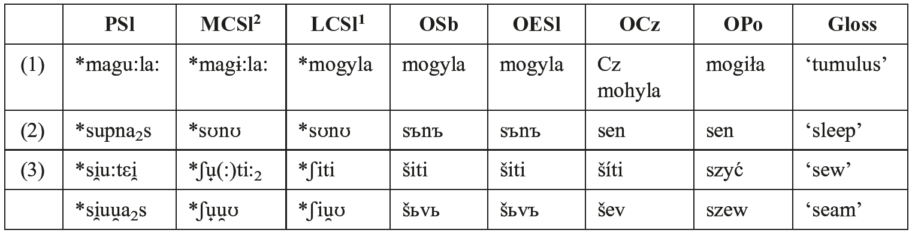

Some of the Balkan Rom (post-Vulgar La) dialects with which migrating Slavophones had contact had front rounded vowels *u̟ and *o̟. These were adapted as MCSl *u̟: (4) or, after non-palatals, *i̯u̟: (5), with the vowel diphthongized to accommodate CSl phonotactics (cf. 3.4). As shown in (5), *i̯ caused dental palatalization (see 3.6); then it was eliminated after palatals, in accordance with the usual CSl pattern (see 3.7). (Cf. Lombard <i>lačüga</i>. La <i>lactūca</i> could not have been the direct source of MCSl *<i>lac̟u̟:ka</i>:, as *kt would be expected to yield *t; nor can the donor have been ERom: Romanian <i>lăptucă</i>.)

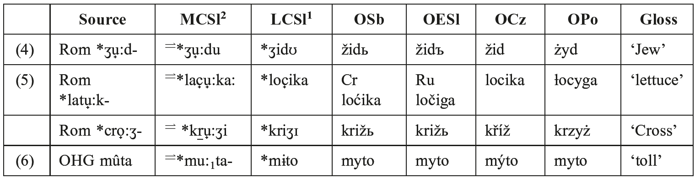

The delabialization of *u(:) had not yet taken place during early Migration-Period (probably 6th−7th-c.) contacts with Gk and La. Slavophone settlers in Byzantine Dalmatia adapted the *u(:) of Rom toponyms as their own *u(:)₁ (>*ɨ: > OCr <i>i</i>): <i>Tragurium</i> > MCSl¹ *<i>tragu:ri</i>- > LCSl¹ *<i>trogɨrɪ</i> > <i>Trogir; Scardona</i> > *<i>skardu:na</i> ⥬ MCSl¹ *<i>skardu:nu</i> > LCSl¹ *<i>skardɨnʊ</i> > <i>Skradin</i>. Likewise, Slavophones adapted OHG <i>u</i>: as their own MCSl¹ *u:₁ (> *ɨ:) rather than MCSl² *u:₂ (6). Conversely, Frankish sources of the 7th−8th centuries render CSl *u:₁ as <i>u</i> rather than, say, <i>i, oi</i>, or <i>ui: *u̯aldu:ka</i>: ‘ruler’ ⥬ <i>Walducus; *dabramu:slis</i> ⥬ <i>Dabramuzli</i>. Similarly, some Gk loanwords and toponyms of CSl provenience, presumably dating from the early period of settlements (late 6th− 7th-centuries) show <i>u</i> (ου) for *u(:)₁ instead of <i>ü</i> (υ) or <i>i</i> (ι, ει, η): *<i>magu:la</i>: (1) ⥬ μαγούλα ‘hill’ (also well represented in toponyms); *<i>buz-</i> ‘elderberry’ ⥬ Βούζι[ον] (toponym), cf. Bg <i>bŭz</i>, BCS <i>baz</i>, Ru <i>boz</i>, Cz, Po <i>bez</i>.

### 4.4. Second Regressive Palatalization of Velars

The Second Palatalization of Velars (2VP) was conditioned by the reflexes of PSl *ai̯ (see 4.1) − MCSl¹ *ɛ:₂ (1−2), and *i: from *ai̯C# (3−4). It was also triggered by *i(:) in Migration-Period loanwords (5). It was the first CSl sound change to have dialectally diverse outcomes: *k > <i>ts</i>, *g > <i>(d)z</i>, but *x > <i>ʃ</i> in WSl, <i>xʲ</i> in Novg, and <i>s</i> elsewhere. These isoglosses suggest that the 2VP was happening as P-WSl speakers were migrating north of the Carpathians, and as P-ESl (P-Novg) speakers moved into northwestern Russia (see 1.1.2).

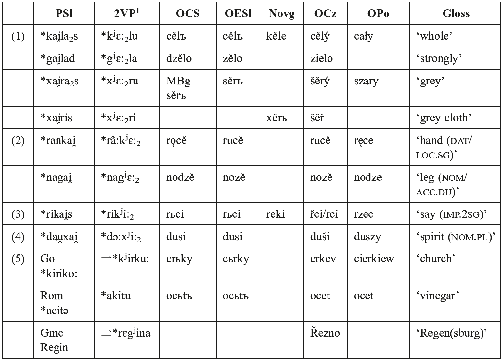

The change proceeded in several phases. In 2VP¹, velars developed fronted allophones, probably with palatal coarticulation: *k > *kʲ, *g > *gʲ, *x > *xʲ<i></i>. This stage is attested in Novg, on the northeastern periphery. In 2VP², the palatalized velars became palatals: *kʲ > *c̟, *gʲ > *ɟ, *xʲ > *ç. At this stage, P-WSl *ç merged with alveopalatal *ʃ from 1VP *x and from *si̯ (3.2, 3.6). In 2VP³, the palatals became dentals with palatal coarticulation: *c̟ > *tʲ, *ɟ > *dʲ, and, in P-ESl and P-SSl, *ç > *sʲ. The dental stops became affricates in all dialects: *tʲ > *tsʲ, *dʲ > *dzʲ (Slavistic <i>c, dz</i> or <i>ʒ</i>, and <i>š</i>). The voiced affricate was preserved as such in E-SSl, Slk, and Lech; otherwise it was lenited to *zʲ except when there was a preceding *z (see [11] below).

For 2VP *xʲ, CenSlk has twofold reflexes − WSl <i>ʃ</i> in non-alternating environments, and quasi-SSl <i>s</i> stem-finally: <i>šerý</i> ‘grey’, but <i>blcha</i>|<i>blse</i> ‘flea (NOM|LOC)’; cf. OCz <i>blcha</i>|<i>blšě</i> ‘flea’ (PSl *<i>bluxa</i>:). The mixed outcome may be due to language contact; prior to the 10th c., CenSlk neighbored W-SSl, and it has SSl-like reflexes from certain other changes. It is also conceivable that the *s was analogical to the velar-to-dental mutations from *k and *g (2).

The 2VP reflexes of *skʲ (6−8) and the rare *zgʲ (9) show a more complicated dialect split. For SSl, WSl, and Novg, the outcomes were homorganic with the *xʲ reflexes. Thus, SSl had palatalized dental *sʲtsʲ and *zʲdzʲ; with the loss of palatal coarticulation, these are reflected as <i>st(s)</i> (<i>ts</i> in some dialects) and <i>zd</i>. WSl had alveopalatal *ʃtʃ and *ʒdʒ; these became <i>ʃc̟</i> [<i>št’</i>] and <i>ʒɟ</i> [žd’] in WCz. The alveopalatal outcomes in WSl presuppose that the sibilants first assimilated to the palatal (co)articulation of the stops: *skʲ > *sʲkʲ (or *sc̟) > *sʲc̟; *zgʲ >*zʲgʲ (or *zɟ) >*zʲɟ. This may also have occurred in the other dialects; cf. the reflex <i>ʃk</i> that appears in a few lexemes in ESl (8), as well as in CzSlk (OCz <i>škieřiti</i>~<i>ščeřiti</i>), if it is not affective in origin. However, only in WSl were the palatalized sibilants identified with the pre-existing alveopalatal fricatives, which conditioned the progressive assimilation of the stops.

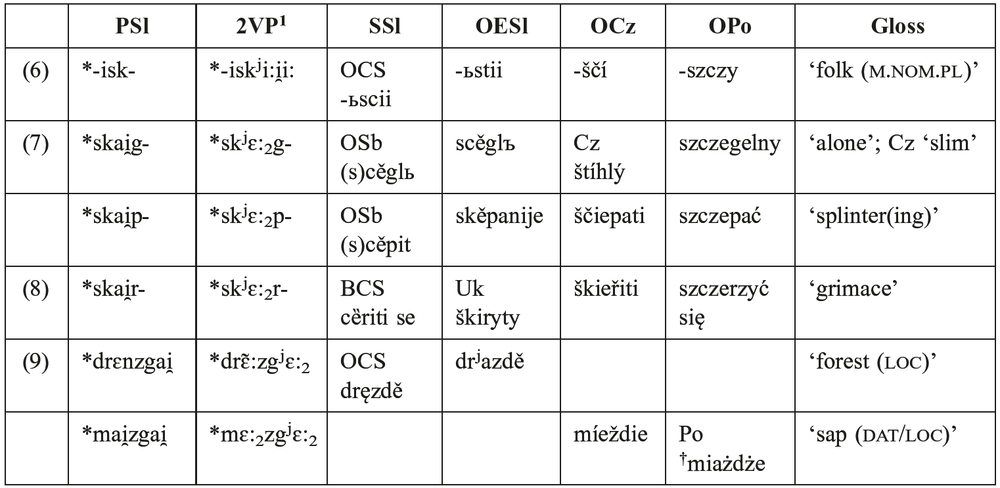

In Novg, where the palatalization halted at the 2VP¹ stage, the reflex is *skʲ, as expected: <i>proskipomъ</i> ‘pierced through (PRPP.M.INDEF)’. Less expectedly, the same reflex is well attested in OESl texts of non-Novg origin: <i>rusьskěi</i> ‘Rus’ (F.LOC.SG.DEF)’; *<i>skai̯p</i>- > <i>skěpanije</i> ‘splintering’<i>, oskěpъ</i> ‘spear’<i>, (o)skěpišče</i> ‘spear shaft’<i>, poskěpaša</i> ‘hack up (AOR.3PL)’; *<i>skai̯mεi̯m</i>- <i>> skěmim-</i> ‘press (PRPP)’, cf. (7). The same outcome is attested in the modern languages: Uk <i>skipka</i> ‘chip’, BR <i>skepka</i> ‘pinch’, SRu <i>raskep</i> ‘split’. However, in OESl texts, *skʲ is more often reflected as <i>sts</i> or <i>st</i>, and *zgʲ is meagerly reflected as <i>zd<b>:</b> rusьscěi~rusьstěi; drʲazdě</i> (9). These OCS-like reflexes appear only in alternating (stem-final) position (6, 9); in root-initial position, <i>st</i> is unattested, and <i>sts</i> only crops up in the rare word <i>scěglъ</i> (7)<i></i>, an element of the ChSl register borrowed from OCS. This points to the conclusion that the alternation <i>sk</i>|<i>st</i> arose in imitation of OCS protographs; this was probably true for <i>sts</i>, though that could also develop by analogy to the alternation of non-cluster <i>k</i>|<i>ts</i>.

There are also lexemes in which 2VP *skʲ seems to be reflected as quasi-WSl <i>ʃtʃ</i>: Uk <i>ščemyty</i>, BR <i>ščemic’</i>, Ru <i>ščemit’</i> ‘press’; Uk <i>ščepyty</i>, BR <i>ščepac’</i>, Ru <i>ščepit’</i> ‘splinter’. However, these are probably <i>e-</i> or zero-grades with the regular 1VP reflex of *skʲ; cf. Ru <i>ščomy</i> ‘pincers’ (*<i>skim</i>- or *<i>skem</i>-), OPo <i>szczmić</i> ‘press’ (*<i>skim</i>-); OESl <i>ščьpь</i> ‘waning crescent moon’, <i>ščopy</i> ‘splinters’, OCz <i>ščpieti</i> ‘produce a stinging odor’ (*<i>skip</i>-); Uk <i>ščyryty</i> ‘bare one’s teeth’ (*<i>skεi̯r</i>-), contrast <i>škiryty</i> (8), reflecting o-grade of the same root. These lexemes aside, the evidence points to *skʲ as the pan-ESl − not just Novg − reflex of *skʲ. In ESl, as in WSl, the preceding sibilant evidently arrested the coronalization process.

In relative chronology, the <i>terminus a quo</i> for 2VP¹ is generally considered to be the monophthongization of *ai̯ (4.1). In a late-6th-c. Byzantine text, Κελαγάστου (GEN), the name of an Antae emissary, probably renders pre-2VP² *<i>kɛ:₂lagast</i>-; cf. OCS <i>cěl-</i>‘healthy’ and <i>gostь</i> ‘guest’. For E-SSl, the phonological constraints introduced by the change were still active in the 860s, when the protographs of the OCS manuscripts were composed − hence the perceived need for a special Glagolitic letter «`» (misleadingly transliterated <i>ћ</i>) to render foreign «g» before a front vowel; the scribes sometimes replaced it with «g» (<i>g̑eorgii</i> ‘George’), or hypercorrected «g» to «ћ» (<i>golъgota</i> ~ <i>ћolъћota</i>|<i>ћelъћota</i> ‘Golgotha’).

The 2VP created several stem alternations: in the <i>ā</i>-stem DAT/LOC (2) and NOM/ACC.DU (2); in the <i>o</i>-stem LOC, M.NOM.PL (4), and LOC.PL, and N.NOM/ACC. DU; and in the IMP of velar-stem verbs (3). These alternations have been leveled out over time in some of the Sl languages.

### 4.5. Ku̯ clusters

The 2VP (4.4) was, for the most part, blocked if there were consonants between the velar and the potential trigger (1). However, in some dialects, palatalization seems to have proceeded without hindrance in <i>Ku̯</i> clusters. This took place in SSl and non-peripheral ESl dialects, but not in WSl or Novg; thus the isogloss essentially matches that of the 2VP. The change was conditioned not only by *ɛ:₂ (2) but also by inherited *i (3) and *i:₂ from *εi̯ (4) <i>−</i> front vowels that would have triggered the 1VP in immediately preceding velars. However, if the target velar was preceded by *<i>s</i>, the palatalization was blocked in all dialects (5).

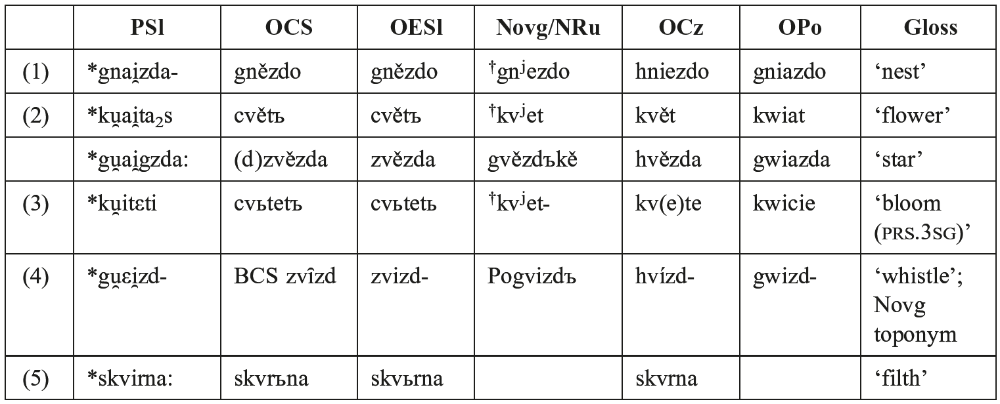

<i>Prima facie</i>, it is odd that the lip rounding and low tonality of *u̯ did not block the 2VP. Rather than assuming that *u̯ was somehow “transparent” for the 2VP when *n, *r, *l were not, it can be posited that *u̯ first underwent assimilatory fronting between velars and front vowels, at least in non-peripheral zones: *u̯ >*ɥ /K__V[+front]. Thus, in (2), PSl *<i>ku̯ai̯t</i>- > *<i>ku̯ɛ:₂t</i>- > *<i>kɥɛ:₂t</i>- > *<i>kʲɥɛ:t</i>- > *<i>c̟ɥɛ:t</i>- *<i>tsɥɛ:t</i>-. The posited labiopalatal glide − a more natural conduit for the 2VP than *u̯ − would not be isolated in place or manner of articulation; syllabic [u̟(:)] (IPA [y(:)]), reflecting PSl *i̯u(:) (3.3) existed at the time of the Progressive Palatalization (4.6). (For other changes with progressive-regressive conditioning, see 3.6.1 and 4.6)

### 4.6. Progressive Palatalization

The <i>Progressive Velar Palatalization</i> (PVP) or <i>Palatalization of Baudouin de Courtenay</i> was triggered by the reflexes of PSl syllabic *i(:)₁ (1) and *in (2). The attested reflexes are the same as those of the 2VP: *k > <i>c</i>, *g > <i>dz</i>, and *x > WSl <i>ʃ</i>, SSl and ESl <i>s⁽ʲ⁾</i>. The affricate <i>dz</i> is attested in E-SSl, Slk, and Lech; elsewhere it lenited to <i>z</i> prior to the historical period.

The PVP had two phases. In PVP¹, the articulation changed from velar to fronted dorsal: *k > *kʲ > *c̟; *g > *gʲ > *ɟ; and *x > *xʲ > *ç<i></i>. In PVP², the reflexes coronalized and assibilated: *c̟ > *tʲ > *tsʲ; *ɟ > *dʲ > *dzʲ; *ç > *ʃ in WSl, *sʲ in SSl and ESl. The voiced affricate *dzʲ was preserved on the NW and SE peripheries (Lech and parts of E-SSl) but lenited elsewhere. It is sometimes posited that the PVP and 2VP were a single change (see 4.6.2); a less controversial position is that PVP² and 2VP² were a single change.

The PVP was more precisely progressive-regressive: velars were regularly affected only before *a(:). By contrast, the 1VP reflexes (see 3.2) appear before PSl *ɛ(:), *i(:), and *i̯ (3), and no palatalization at all occurs before PSl *u(:) (4). The blocking effect of *u(:) is evident where the PSl velar was always followed by the same vowel, as in (4). When the PSl velar was stem-final, before alternating desinences, there was allomorphy between velars and PVP reflexes. This was leveled out − not always in favor of the PVP outcome; for <i>*stiga</i>: (1), cf. OSlk <i>Prěsteg</i> (toponym); Ru †<i>stega</i>; Ru <i>zgi</i> in <i>ni zgi ni vidno</i> ‘pitch-black’ (literally, ‘the path could not be seen’).

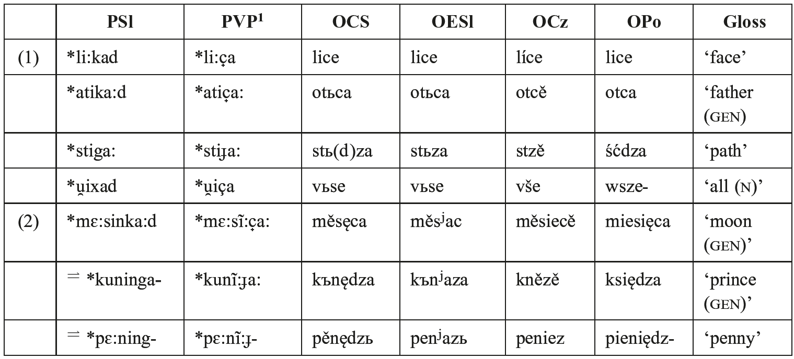

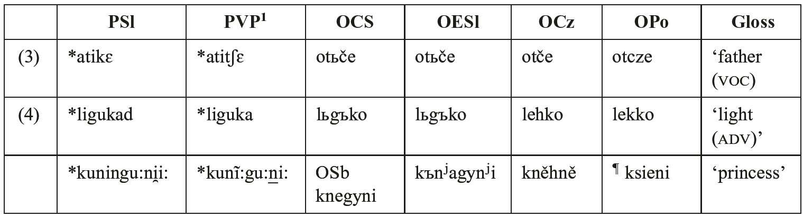

Two relative chronologies should be noted. First, the reflexes of *u̟(:), from PSl *u(:) after palatals (3.3), were distinct from inherited *i(:) at the time of PVP¹ (5); presumably, they were still labialized (IPA [y(:)]) or not fully fronted (IPA [ʉ(:)]). As the PVP was blocked before rounded *u(:), it makes sense that it should have been impeded after a rounded vowel.

Second, PVP¹ took place before MCSl². Unlike *ĩ (from PSl *in), *[image-glyph: Greek epsilon with tilde] (from PSl *εn) did not condition the change, so the two nasal vowels were still distinct (6) (see 4.2, 4.4). Likewise, the reflex of *εi̯, which was not a trigger (7), was still distinct from inherited *i:₁, which was. (Apparent exceptions, e. g. OCS <i>pomidzati</i>, have morphological explanations; see 4.6.1). Scholars who treat the PVP¹ as an ECSl phenomenon (see 4.6.2) argue that the nasal in PSl *in had become *ɲ between *i(:) and velars; this *ɲ was transparent or a trigger for PVP¹, unlike the dental nasal in *ɛn. This ad-hoc explanation fails to explain why other consonants (*l, *r *s, and *z) did not retract (e.g., *l > *ʎ) in the same environment and remained “opaque” for PVP¹. In any case, it is hard to swallow the notion that *ɲ would be a better vector for PVP¹ than *i̯ (7−8).

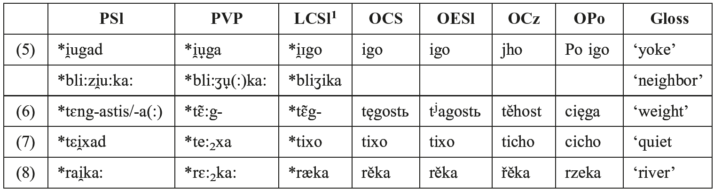

Borrowings to and from Sl indicate that PVP¹ was operating in the 6th−7th centuries. Thus *<i>pɛ:ning</i>- (2) came from a source with WGmc umlaut (*<i>panning</i>- > *<i>penning</i>-; from the late 5th c.); the term is attested in WGmc from the mid-7th c. (There is no known cognate in EGmc; Go had <i>skatts</i> in the given meaning.) This <i>terminus a quo</i> corresponds to the period of Sl settlement in ECen Europe and hence more extensive contacts with WGmc. (For ‘shilling’, also borrowed from Gmc, Go could be the source: OCS <i>skъlędzъ</i>, OESl <i>stьlʲadzь</i>, Cr †<i>clez</i>.) Likewise, P-Sln borrowed the La hydronym <i>Longati<b>c</b>um</i> before the completion of PVP¹: *<i>lãgati<b>k</b></i>- > <i>Logate<b>c</b></i>. P-Sln settlements in the Eastern Alps date to the late 6th−7th centuries.

P-ESSl toponyms in southern and central Greece have also been cited for absolute chronology: *<i>au̯ari<b>k</b></i>- ‘sycamore (DIM)’ ⥬ Ἀβαρῖκος; Γαρδίκι (attested in multiple locales) from *<i>gardika2s</i> ‘walled town’; etc. (Vasmer 1941: 301). These loanwords, probably accessed in the 6th−8th centuries, do not necessarily show the absence of PVP¹, given the limitations of the Gk writing system and the possibility of leveling within Sl. The soft declension of Γαρδίκι may perhaps be due to non-Slavophone perceptions of CSl *kʲ or *c̟ as *ki<i></i>. However, the loanwords may suggest that their Sl models had not completed PVP² at the time of accession; cf. the cognate toponyms Ἀβαρινίτσα<i></i>, Γαρδίτσα<i></i>, which reflect PVP². Vasmer (1941: 301−302) cautions that the Sl suffixes may have been contaminated with the Gk suffix <i>-ikeia</i>.

It is debatable whether PVP² tapered off on the northeastern periphery, as 2VP had (see 4.4−4.5). In Novg, *k after PVP triggers is mostly reflected as <i>ts: otьcь</i> ‘father (NOM)’, <i>věvericě</i> ‘currency (NOM/ACC.PL)’ (*<i>u̯ai̯u̯eri:k</i>-); exceptions may be analogical in origin. For * g in the PVP environment<i></i>, Novg has <i>k(ъ)nʲaz-</i> ‘prince’ but <i>leg (</i>÷<i>lьg-)</i> ‘be permitted’ (*<i>lig</i>-). The former could be a borrowing from Kievan; the latter could be due to stem-leveling. For *x, there is a near-complete paradigm of *<i>u̯ix</i>- ‘all’ with stem-final <i>x</i> and hard type endings: <i>voxo (</i>÷<i>vъxo), vъxoě</i>, etc., corresponding to Kievan OESl <i>vьsь</i> (M.NOM.SG), <i>vьse</i> (N.NOM/ACC.SG), <i>vьseě</i> (F.GEN.SG). On this basis, Zaliznjak (2004: 45−46) concludes that P-Novg *x did not undergo the PVP. However, most of the relevant forms do not represent the PVP¹ triggering environment, since they show the change of *<i>u̯ix</i>- > *<i>u̯ux</i>- (see Zaliznjak 2004: 54−55) − hence the spellings <i>vъx-</i> or <i>vox-</i> instead of <i>vьx-</i> or <i>vex-</i>. Zaliznjak suggests (2004) that the vowel backing did not occur when there was a front vowel in the following syllable, based on the form <i>vьxemo</i> (÷<i>vьxěmъ</i> DAT.PL; OESl <i>vьsěmъ</i>). However, this may have been a contamination from ChSl or a mistake; the token dates from the time when “weak” <i>ъ</i> and <i>ь</i> were being lost. Cf. <i>voxь</i> (÷<i>vъxe</i>)<i></i>, with the early Novg hard-stem(!) M.NOM ending <i>-e</i>. Until the chronology of *u̯ix > *u̯ux- is clarified, the root ‘all’ cannot be considered secure evidence that P-Novg *x was unaffected by the PVP.

#### 4.6.1. Leveling of stem alternants

Several suffixes are attested both with and without PVP outcomes. While some of the variation may have arisen in the historical period, others are pan-Slavic. For example, in the suffix *<i>-(in)i:k</i>-, the generalization of the unpalatalized consonant to signal masculine and the palatalized one to signal feminine (or common gender) was undoubtedly prehistoric, as in the forms for ‘sinner’ in (1).

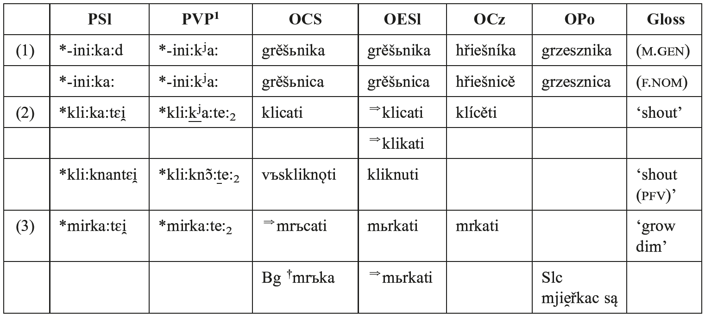

The expected outcomes have often been obscured by analogical extensions of stem allomorphs (PVP or non-PVP). For example, the alternations <i>k</i>|<i>ts</i> and <i>g</i>|<i>dz</i> were regular in some Leskien II−III aspectual pairs, as seen in (2). In some LCSl dialects, the alternations were extended to Leskien II−III pairs where the PVP had not been phonologically conditioned, e.g. when a consonant intervened between the trigger and the velar (3); cf. also OCS <i>blьsnǫti</i> | <i>bliskati</i> (regular)/<i>bliscati</i> (analogical) ‘shine’ (PFV|IPFV)’ (PSl *<i>bli[:]sk</i>-)<i></i>. Alternatively, the regularly palatalized imperfective stem could be leveled out on the model of the non-palatalized perfective, as seen in OESl <i>klikati</i> (2)<i></i>.

One factor that promoted the leveling out of the PVP alternations was their semiotic vacuity in noun stems. The 1VP and 2VP alternations indexed specific endings; the basic allomorphs ended in velars. By contrast, the PVP alternations had no indexical value within paradigms: the distribution of *g and *dz was morphologically arbitary in *<i>stidza</i>:|*<i>stigu</i>:| *<i>stidza:mu</i> (NOM|GEN, NOM/ACC.PL|DAT.PL), etc. as compared with unpalatalized *<i>darga</i>:| *<i>dargu</i>:|*<i>darga:mu</i> ‘road’. After *ɛi̯ became *i:₂, the alternations were no longer predictable. If the basic stem ended in a PVP reflex, the direction of the alternations (high tonality → low tonality) was the reverse of the pattern seen in the 1VP and 2VP reflexes.

#### 4.6.2. Chronological controversy

The PVP is the most debated of the CSl changes. The main point of contention has been its chronology relative to the regressive palatalizations. There are four main schools of thought. In the earliest view (PVP 3 2VP), the PVP is a “special case” of the 2VP (see 4.4); the identity of reflexes points to a single event.

In a second approach (PVP < 2VP), the PVP was the “Third Palatalization.” It began while the 2VP was in progress and continued for some some time after the 2VP ended. The rationale is that the PVP has more exceptions than the 2VP; this is taken to indicate that it happened when the CSl dialect continuum was less cohesive. However, this argument is not cogent; unlike the 2VP, the PVP only occurred where leveling could operate, and there are good reasons why the alternations it produced should be unstable (see above). In fact, there is no convincing evidence that the 2VP preceded the PVP. Whether the 2VP and the PVP should be treated as a single regressive-progressive change or as separate events is a moot point.

In a third view (PVP¹ > 2VP), PVP¹ took place before the monophthongization that triggered the 2VP (4.1). The rationale for this claim is the fact that PSl *-ai̯- was reflected as OCS <i>-i-</i> rather than <i>-ě-</i> in noun endings after PVP reflexes: <i>otьci</i> instead of *<i>otьcě</i> (LOC). This can be interpreted as a regular development, with vowel fronting conditioned by the PVP¹ reflex: *<i>atikai̯</i> > *<i>atikʲa̟i̯</i> > *<i>atic̟εi̯</i> > <i>otьci</i>. However, another pattern has <i>-ě-</i> for PSl *-ai̯- after the PVP reflexes (see below), and there are other facts that are hard to reconcile with the “PVP > 2VP” approach. The crucial <i>-i-</i> in noun endings has a simple morphological explanation: when the basic stem palatalized, the declension pattern appropriate for palatal stems was adopted wholesale, except for the marginal vocative <i>(otьče)</i>.

A fourth view (PVP¹ > 1VP) treats PVP¹ as an ECSl phenomenon. Though initially proposed in a functionalist framework (Martinet 1955: 366−367), this approach became widespread under the influence of generative grammar, which ordered mutations from the PVP before those from the 1VP and 2VP. The argument goes that, as an intersyllabic change, PVP¹ would have contradicted the later CSl trend toward syllabic synharmony (see 3.1); thus it must have occurred before the 1VP, like the other prominent progressive change, RUKI. The reflexes of PVP¹ and the 1VP, it is argued, merged before front vowels; elsewhere, they remained stable until they merged with the 2VP reflexes. As PVP¹ and vowel fronting (3.3) preceded monophthongization (4.1), the declension of nouns like <i>otьcь</i>|<i>otьci</i>|<i>otьče</i> (NOM|LOC| VOC) is phonologically expected. Vocatives like <i>otьče</i> and <i>kъnęže</i> ‘prince’ are problematic for this approach; the original masculine <i>i̯o-</i>stems − i.e., those whose stem-final consonants were affected by the 1VP or dental palatalization − adopted the <i>u-</i>stem VOC in CSl, e.g. OCS <i>vraču</i> ‘physician’ (*<i>u̯arki̯</i>-).

<!-- source-file: content/07_chapter01_4.xhtml -->

The PVP¹ > 1VP viewpoint requires scrutiny because of its drastic ramifications for reconstruction. The crux is the relative chronology of monophthongization. There is consensus that the 1VP happened before *ai̯ >*ɛ:₂, since the latter triggered the 2VP (4.4). Significantly, neither *ai̯ (*ɛ:₂) nor *εi̯ (*e:₂, MCSl² *i:₂) conditioned the PVP (1), even though palatal glides are typologically common triggers for velar palatalization. If *i̯ had the same tongue configuration as *i, its nonsyllabicity should not have blocked the PVP; the velar would have been the onset of a new syllable in any case. This suggests that PVP¹ began after monophthongization, and hence after the 1VP.

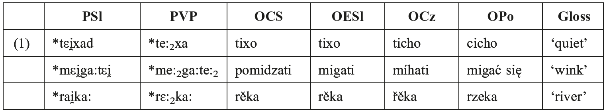

To circumvent this problem, the proponents of PVP > 1VP posit that the CSl diphthongs had non-close slopes − *ae̯ and *ie̯ instead of *ai̯ and *εi̯. This solution is entirely ad hoc. While *i̯ can be reconstructed from other contexts, there is no such evidence for *e̯<i></i>. As an opening diphthong, *ie̯ would be isolated in the CSl vowel system, and its glide would still have to become close at some point to yield the attested outcome *i:<i></i>. Moreover, if *e̯ is supposed to be a mid or near-close vowel, its syllabic counterpart only arose as a <i>consequence</i> of monophthongization.

Further evidence that monophthongization preceded the PVP comes from the different outcomes of the theme vowels in the pronominal-adjectival declension, PSl *-a- (2) and *-ai̯- (3). In ECSl, a “soft” subdeclension emerged due to the fronting of *a to *ɛ and *ai̯ to *εi̯ after palatals<i></i>, as seen in *<i>na:si̯</i>- (3.3). Significantly, in the pronominal adjectives *<i>si:<b>k</b></i>- and *<i>u̯i<b>x</b></i>-, whose stems ended in PVP targets, thematic *a was fronted, but thematic *ai̯ was not. The resulting mixture of “hard” and “soft” endings was phonologically regular and morphologically conservative if *ai̯ monophthongized to *ɛ:₂ before PVP¹ began.

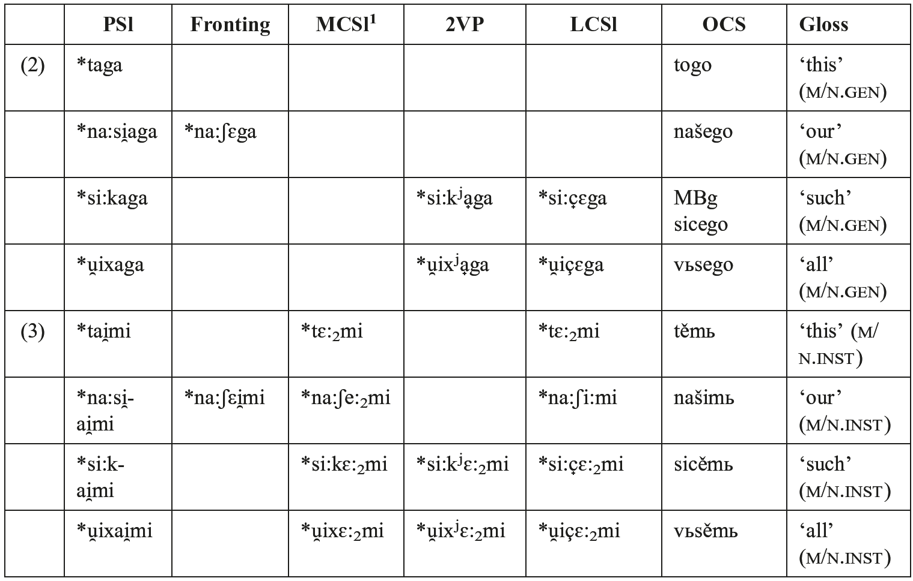

If PVP¹ had come first, *ai̯ would have been fronted to *εi̯ (LCSl *i:₂); forms like <i>sic<b>ě</b>mь</i> and <i>vьs<b>ě</b>mъ</i> would then be highly irregular. To salvage the PVP > 1VP chronology, proponents have cast doubt on the antiquity of *<i>si:<b>k</b></i>- and *<i>u̯i<b>x</b>-</i>, despite the fact that *<i>u̯i<b>x</b>-</i> has precise cognates in Ba (Lith <i>vìsas</i>, Latv <i>viss</i>, OPr <i>wissa-</i>). In addition, they argue that *<i>si:<b>k</b></i>- and *<i>u̯i<b>x</b></i>- adopted certain oblique “hard” endings after the PVP and fronting: *<i>u̯iç<b>i:</b>mi</i> → *<i>u̯iç<b>ɛ:</b>mi</i>. Such a change would undo the otherwise regular “soft” declension pattern; it would have no motivation, unlike the wholesale adoption of soft-declension endings by nouns. There is no reason to assume that the pronouns would be more prone than nouns to undergo “peculiar innovations along with haphazard rearrangements of old materials,” as Lunt claims (1981: 86). All in all, the PVP > 1VP view requires too much special pleading to be credible.

#### 4.6.3. Vowel Fronting after PVP

Following the PVP reflexes, *a was fronted to *ɛ: PSl *<i>li:cad</i> > PVP¹ *<i>li:kʲa</i> > OCS, OESl, OPo <i>lice</i>, OCz <i>líce</i> (see 4.6). This is sometimes treated as a Second Vowel Fronting, but it probably was a new manifestation of a phonotactic constraint introduced after the “first” Vowel Fronting that followed the 1VP (see 3.3). In a related development, endings in *-ī(-) were substituted for pre-PVP *-u(:): <i>*kuningu</i>: ⇒ *<i>kunĩ:gʲi</i>: > OESl <i>kъnʲazi</i> ‘prince (INST.PL)’. This change must have been morphological rather than phonological in nature, given that the PVP was blocked by close back *u(:) (see 4.6).

### 4.7. Reflexes of *<u>t,</u> *<u>d</u>

As noted in 3.6, in the PSl clusters * ti̯<i></i>, * di̯ the stops developed retracted allophones *t, *d in assimilation to the palatal glides. Subsequently, the glides were reanalyzed as off-glides and, over time, eliminated (see 3.7). The PSl cluster *kt was also reflected as *t before front vowels (see 3.6.1). The precise articulation of *<u>t,</u> *<u>d</u> − e.g. [c̟<i></i>, ɟ] or [tʲ, *dʲ] − was uncertain and may have differed by dialect. Their subsequent changes definitely occurred at different times in different dialects. The eventual reflexes fall into four zones − ESl, WSl, W-SSl, and E-SSl.

By contrast, *sti̯ and *zdi̯ had uniform outcomes − *ʃtʃ and *ʒdʒ<i></i>, merging with the 1VP reflexes of *sk, *zg (see 3.2). Evidently, the sibilants assimilated to *<u>t,</u> *<u>d;</u> they became hushers directly or were identified with the hushers produced by the 1VP and dental palatalization (see 3.6). Then retracted *<u>t,</u> *<u>d</u> developed fricative releases in assimilation to the hushers and were identified with the pre-existing *tʃ and *(d)ʒ. (Later, in E-SSl, CzSlk, and some Ru dialects, the fricative-affricate clusters dissimilated to *ʃt, *ʒd.)

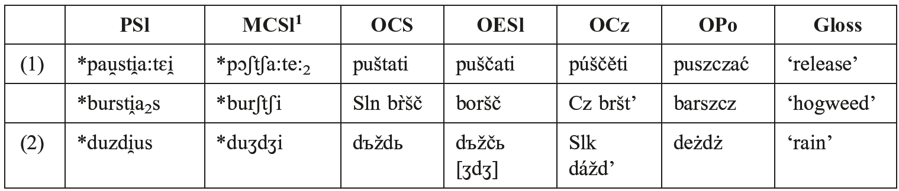

Within ESl, the reflex of *zdi̯ in ‘rain’ (2) varies. The most frequent spelling <i>žd</i>, though OCS-like, may reflect a vernacular pronunciation <i>ʒd</i>, which is widely attested in Ru dialects. The outcome <i>ʒdʒ</i> is also widespread; in OESl texts of WUk origin, it is spelled «žč», with the letter for the voiceless affricate in the absence of one for the voiced. In OESl texts of northwestern, especially Novg, origin, the outcome was <i>ʒgʲ</i> («žg»).

In P-ESl, *<u>t</u> and *<u>d</u> became alveopalatal affricates *tʃ (3) and *ʒ (4) in all environments. Thus they merged completely with the 1VP reflexes of *k, *g (see 3.2). This suggests that the development of fricative release was completed prior to the onset of the 2VP in P-ESl.

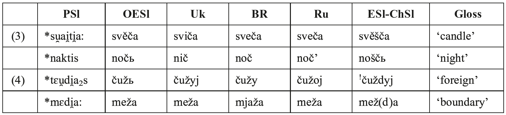

OESl ecclesiastical (ChSl) texts tend to have <i>∫t∫</i> «щ» for *<u>t</u> and either <i>ʒ</i> «ж» or <i>ʒd</i> «жд» for *<u>d.</u> While <i>ʒ</i> was vernacular, the other spellings arose under OCS influence. In 11th- c. texts, the voiceless reflex could be spelled «шт», in direct imitation of OCS <i>∫ t</i>. The reflex <i>∫t∫</i> was derived from the *s<u>t</u> reflex by analogy to OCS, where *<u>t</u> and *s<u>t</u> both came out as <i>∫t</i> (see below).

In P-WSl, *<u>t,</u> *<u>d</u> were assibilated and became the dental affricates *ts (5), *dz (6). These outcomes merged with those of *k, *g in the 2VP (see 4.4) and PVP (see 4.6). Evidently, then, the assibilation phases of the three changes overlapped in P-WSl. The fact that CzSlk patterns with Lech rather than W-SSl may indicate that the change was completed before LCSl (see 4.1). (In Sorb, Cz, and Kb, the reflex of *<u>d</u> ultimately lost its closure.)

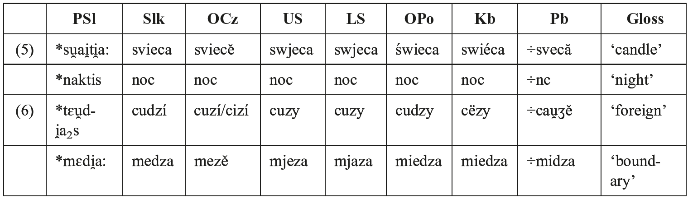

In W-SSl and western E-SSl dialects (7−8), MCSl *c̟, *ɟ were conserved longer than elsewhere; their eventual resolutions belong to the post-CSl period. Unassibilated palatal stops («k[ь]» and «g[ь]») are found in the oldest Sb texts (12th−14th centuries). (The clusters <i>št</i> and <i>žd</i>, borrowed from OCS, [see below] were preferred in texts of the ecclesiastical [Sb-ChSl] register.) Unassibilated palatal stops are also preserved in some Što and Čak dialects, in much of Mc, including the standard, and in some WBg dialects. In other Mc and WBg dialects, the stops have advanced to dental <i>tʲ</i> and <i>dʲ</i>, but without assibilation.

In Sln, Čak, and Kaj, *c̟ typically merged with <i>t∫</i> from the 1VP («č»), while *ɟ lenited through *ɣʲ to *i̯ («j»). In the OSln Freising Fragments (later 10th c.), which were written through the filter of OHG perceptions, the *c̟ reflex can be spelled as a stop («k») or as an affricate («z, c, c∫, t∫, ∫»). The *ɟ reflex is rendered «g» or «i», which can be interpreted as the intermediate stage *ɣʲ or as the end result *i̯. The outcomes <i>t∫</i> («č») and <i>i̯</i> («j, ћ») are also attested in medieval Cr ChSl, though the quasi-OCS <i>št</i> and <i>žd</i> are more frequent.

In most modern Što dialects, including standard Bo, Cr, and Sb, the primary palatals assibilated. In the standard, and in many dialects, they are now palatal affricates <i>tɕ</i> and <i>dʑ</i> (also in some Kaj dialects). In other dialects, dental <i>tʃ, dʒ</i> are found.

In much of E-SSl, *c̟, *ɟ became the clusters *ʃtʃ, *ʒdʒ, merging with the reflexes of *sti̯, *zdi̯. These reflexes are preserved in some WBg and SMc dialects. In EBg, including Cyrillic OCS and the modern standard, the clusters simplified to <i>št, žd</i>.

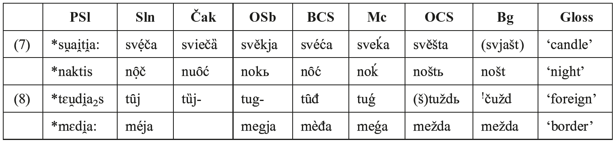

To account for the E-SSl clusters, some scholars have posited gemination followed by lenition (*<u>t</u> > *<u>tt</u> > *ʃt; *<u>d</u> > *dd > *ʒd), parallel to the PreSl degeminations of *tt > *st and *dd > *zd (see 2.7.2). According to Lunt (2001: 188), this occurred “to fit the constraint that the first of two obstruents must be a sibilant.” The problem is how such geminates could have arisen in the first place, given the constraint, which was already in operation in ECSl (see 3.1.2). Velcheva (1988: 74−75) proposes that the degeminations of {*tt, *dd} and {*<u>tt, dd</u>} (delayed-release consonants) were not just parallel but actually simultaneous. This claim is anachronistic; the first change was a PIE dialectal development, while the second was limited to a single sub-sub-branch of LCSl. (Velcheva 1988: 74 treats the geminates as delayed-release stops; this also seems problematic, since the husher precedes rather than follows the stop or affricate portion.)

### 4.8. *tl, *dl clusters

The clusters *tl and *dl, which were permitted in ECSl syllable structure (see 3.1.1), were subject to changes in MCSl. Their reflexes fall into two main zones: the clusters were preserved in WSl, but lost in most of SSl and in non-peripheral ESl: *tl > *dl > <i>l</i>; *dl > <i>l</i>. (Apparent counterexamples with <i>tl</i> and <i>dl</i> arose due to metathesis [5.5] or the jer-shift [5.8]: OCS <i>dlanь</i> < *<i>dalnis</i> ‘palm’; Bg, Ru <i>metla</i> < *<i>mɛtila</i>: ‘broom’.) In transitional CenSlk and NWSln, the stops were preserved across boundaries (2) but underwent elision within morphemes (3); elsewhere in Sln, the clusters are only preserved across boundaries (1 & 2).

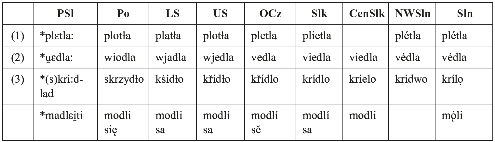

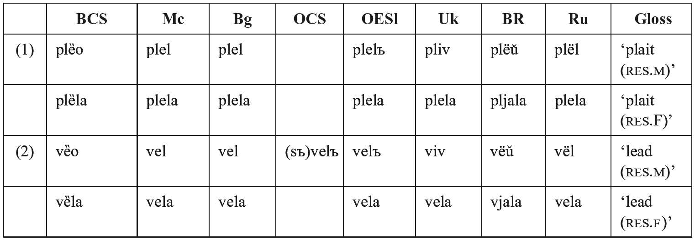

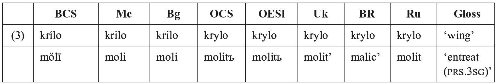

In regions with Ba substrata, the dental stops became velars before *<i>l</i>: NEPo (Mazowian): <i>moglitwa</i> ‘prayer’; Old Pskovian (NW Ru): <i>sočkle sʲa</i> ‘settle accounts (RES.PL)’ (*<i>su-kitl</i>-), <i>veglě</i> ‘lead (RES.PL)’ (<i>*u̯ɛdl</i>-).

### 4.9. Initial vowel-sonorant diphthongs

Initial tautosyllabic *aR underwent metathesis, with lexicalized exceptions on the peripheries of Lech and E-SSl. (The handful of lexemes in which initial *εR has been reconstructed pose great problems and will not be discussed here.)

The reflexes of the metathesis fall into two zones; the isogloss must have formed before the late 9th−early 10th c., when the WSl-W-SSl continuum was disrupted by the Magyar invasion of the Carpathian Basin. In the southern zone (SSl and CenSlk), *a was lengthened in all environments, so that the bimoraicity of the old diphthongs was preserved (1−2): *aRC > *Ra:C. In the northern zone (Sorb, CzSlk, non-peripheral Lech, and ESl), the vowel was only lengthened (1) if it bore an acute accent (see 6.3−6.3.4). Elsewhere, it remained short (2): *ȁ RC > *Ra:C, *aRC > *RaC. In all dialects, *Ra:C was reflected as <i>RaC</i>, and *RaC as <i>RoC</i>, once quantitative differences yielded to qualitative ones (see 5.1).

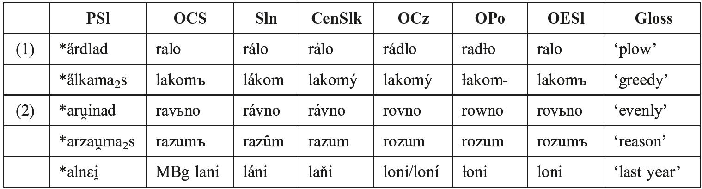

In OESl of the ecclesiastical register (ChSl), forms with <i>ra-</i> and <i>la-</i> for expected *ro-and *lo- often appear in imitation of OCS protographs; some have become part of the standard Ru lexicon: <i>razum</i> ‘reason’; <b><i>ra</i></b><i>znyj|</i>†<b><i>ro</i></b><i>znyj</i> ‘various, separate’.

Initial metathesis had not yet run its course during the Slavophone migrations into the Balkans (ca. 6th−7th centuries). The name *<i>ardagasta²s</i> (post-metathesis ‘<i>Radogostъ</i>’) is attested as Ἀρδάγαστας in an early 7th-c. Byzantine source. There are also many toponyms in Greece that were borrowed from CSl in an unmetathesized form. In the northwestern Balkans, Slavophones were already settling near Albona in Istria and near the Byzantine fortress of Arsa in present-day South Serbia by the late 6th or early 7th c. Likewise, metathesis had not happened in the western Balkans in the late 6th−early 7th centuries. Thus the name of the Istrian city of Albona<i></i>, Rom *<i>albuna</i> was borrowed in time to undergo metathesis: MCSl² *<i>albu:n</i>- > *<i>albɨn</i> > OCr <i>Labin-</i>. The same is true of the name of the Byzantine fortress Arsa in what is now southern Serbia: MCSl² *<i>arsʊ</i> > OSb <i>Rasь</i>. As a <i>terminus ad quem</i>, the change was a <i>fait accompli</i> for the Slavophones near Thessalonica by the 820s−830s, when Methodius and Cyril acquired the dialect.

The sequence *ar- was still possible in P-WSl when Slavophones settled near the Elbe, no later than the 6th c. They borrowed the name of the river from OHG or Rom; it was later subject to metathesis, like native words: OHG <i>Albiz</i>, La <i>Albis</i> ⥬ MCSl² *<i>a:lb(i̯)a</i>: > LCSl¹ *<i>lab(i̯)a</i> > OCz <i>Labě</i>, US <i>Łobjo</i>, OPo <i>Łaba</i>, Pb <i>÷Lobü</i>. (The <i>o</i> in US and Pb is due to later developments.) The change was definitely finished in CzSlk by the 9th c., as shown by proper names in La sources: <i>Rastiz (Rastica)</i> for *<i>arstislāṷas</i> in the Annals of Fulda (later 9c), cf. OCz <i>Rostislav</i>. The earliest WSl texts, the Kiev Folia (early 10th c.), show consistent metathesis.

In the northeast, metathesis had not yet been completed in the early 9th c., when Slavophone settlers near Novgorod borrowed the BFi toponym *<i>aaldokas</i> ‘wavy’ ⥬ MCSl² *<i>aldaga</i>: > LCSl¹ *<i>ladɔga</i> > OESl <i>Ladoga</i>. The location became important with the founding of the Norse trading post of <i>Aldeigja</i> (<i>Aldeigjuborg</i>) in 753. Conversely, Vepsian borrowed the name of the Slavophone settlement *<i>ȁ rdagasti̭a</i>- prior to metathesis: <i>Arśkaht</i> (Ru <i>Radogošča</i>).

By ca. 900, the metathesis was over: Old Norse <i>Helgi</i> ⥬ P-ESl *<i>ɔlˠɪgʊ</i> (with svarabhakti) > LCSl¹ *<i>ɔlɪgʊ</i> > OESl Olьgъ (ruler of Rus’ from 881−912).

#### 4.9.1. Exceptional outcomes

In OCS (10th−11th centuries, with protographs from the later 9th−10th centuries), the change is complete for all lexemes with initial *ar- and for virtually all with initial *al-<i></i>.The exceptions are two roots that show variation between metathesized and unmetathesized forms: *<i>ȁ lk(a:)-</i> ‘hunger’ (6 <i>la-</i> vs. 19 <i>al-</i>, 9 <i>alъ-</i>, 7 <i>al’-</i>); *<i>aldii̯</i>- ‘boat’ (10 <i>la-</i>, 2 <i>al’d-</i>, 1 <i>ald-</i>). These forms were lexicalized from contacts with conservative speakers. They are also attested in MBg, along with <i>al(ъ)nь</i> ‘deer’ (PSl *<i>alnis</i>), and in some modern dialects (Bg †<i>alne</i> ‘young chamois’). Some of the OCS copyists found the syllable-final *l exotic − hence the epenthetic schwas in <i>alъ-, al’-</i>. Similar svarabhakti can be seen in the loanwords for ‘altar’, borrowed in missionary contacts of ca. the later 7th−early 9th centuries: OHG <i>altâri</i> ⥬ OCS <i>olъtarʲ-</i>|<i>ol’tarʲ-</i>|<i>oltarʲ-</i>; Gk ἀλτάριον ⥬ OCS <i>al’tarʲ-</i>|<i>altarʲ-</i>. The centrality of the altar to religious ritual would favor preservation or restoration of the conservative form. (The lexicalized <i>alk-</i>, as in ‘hungering after righteous’, spread from OCS to other ChSl recensions.)

## 5. Late Common Slavic (LCSl) changes

As noted in 1.1, it is impossible to fix a precise upper time limit for the LCSl period. Some LCSl changes were completed in some dialects before they had begun in others. Moreover, some LCSl changes overlapped with changes that belong to the histories of the individual languages. What defines a change as “LCSl” is thus not the “real time” in which it was actualized but the fact that its impetus came from the structure of the LCSl linguistic system (see Andersen 1977, 1986). For this reason, it is a moot point whether the LCSl changes were “shared” or “parallel” in the various dialects, which after the migrations (see 1.1.2) were spread out over a vast territory, albeit with contacts in some zones. It is evident that there were still connections of some kind, given the radiation of loanwords from west to east or south to north; however, the nature of the connections is not fully understood.

In the present work, the LCSl period of changes begins and ends with two major restructurings of the vowel system − <i>Qualitative Differentiation</i> (5.1) and the <i>Jer-Shift</i> (5.8). These are also known as the <i>Second</i> and <i>Third Slavic Vowel Shifts</i>, respectively (Andersen 1998).

The reflexes of LCSl changes typically have central vs. peripheral distributions, based on the historically known positions of the CSl dialects after the Migration Period (see Birnbaum 1966). The actual centers and peripheries differed from one change to another. For the most part, CzSlk patterned with the neighboring dialects of W-SSl in the Carpathian Basin rather than with Lech, with which it was bound in the MCSl changes.

### 5.1. Qualitative differentiation in the vowel system

In <i>Qualitative Differentiation</i> (QD), or the <i>Second Slavic Vowel Shift</i> (Andersen 1998), the old distinctions in length gave way to differences in relative peripherality and tenseness. The resulting <i>LCSl¹ vowel system</i> is attested in OCS (10th−11th centuries). The MCSl² short vowels became lax and non-peripheral (1): *i > <i>ɪ</i>; *ʊ > <i>ʊ</i> or <i>ǝ</i> (see 5.1.1); *ɛ > <i>ɛ</i>; and *a <i>> ɔ</i>. These reflexes are transcribed <i>ь, ъ, e, o</i> in the Slavistic tradition. The MCSl² long vowels became tense and peripheral (2): *i: > <i>i</i>; *ɨ: > <i>ɨ</i>; ɔ: > <i>u</i> (“u₂”); *ɛ: > <i>æ</i> (see further 5.2.1); and *a: > <i>a</i>. These reflexes are transcribed <i>i, y, u, ě, a</i> in the Slavistic tradition. In the nasal subsystem (3), the outcomes were mid vowels *[image-glyph: Greek epsilon with tilde]: > *<i>[image-glyph: Greek epsilon with tilde]</i> or *<i>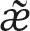[image-glyph: æ with tilde]</i>; and *[image-glyph: open o / reversed c with tilde]: > <i>[image-glyph: open o / reversed c with tilde]</i> or <i>õ</i> (see 5.2.2). These reflexes are transcribed <i>ę, ǫ</i> in the Slavistic tradition.

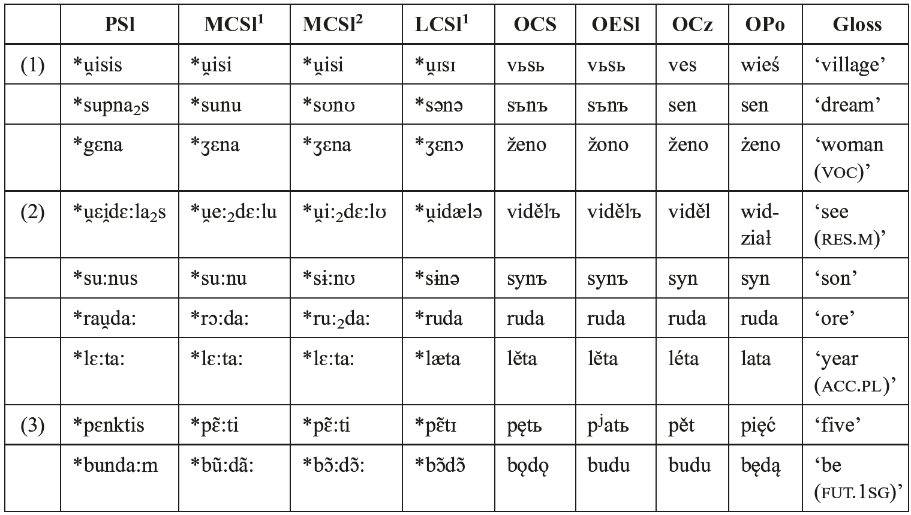

While QD is traditionally presented as a set of phonetic changes, it was principally a phonological reanalysis, in which the previously redundant feature [±tense] took precedence over /±length/. The MCSl² vowels had multiple realizations in phonetic space, which clustered around central or prototypical values; for example, *i could be realized <i>inter alia</i> as [ɪ]. What QD altered was not the range of phonetic values but the underlying relations between the long and short phonemes. The post-QD reflexes of MCSl² long vowels could still be long phonetically; when shortened in final position (see 5.3), they maintained their LCSl¹ articulation rather than merging with their former short counterparts: [a:] > [a], not [o], etc. Likewise, new long vowels developed by accentual retractions (see 6.4.3), contractions (see 5.12), and other changes, but their articulation remained the same: *-ɛi̯ɛ > *ɛ:, not *æ.

QD evidently occurred in the 8th−early 9th centuries. In loanwords accessed prior to the 8th c., foreign <i>a</i> ⥬ MCSl² *a > LCSl¹ *ɔ (4); foreign <i>o</i>(:) ⥬ MCSl² *ɔ: > LCSl¹ *u₂ (5); and foreign <i>u</i>: ⥬ MCSl² *u:₁ >LCSl¹ *ɨ (6). In loanwords accessed after QD, the outcomes were LCSl¹ *a, *ɔ, *u₂, respectively (7). Compare the pre-QD borrowing <i>sotona</i> (4) with the post-QD form seen in OPo <i>szatan</i>, from Latin <i>satanas</i>, borrowed during the Christianization of Poland in the 10th c.

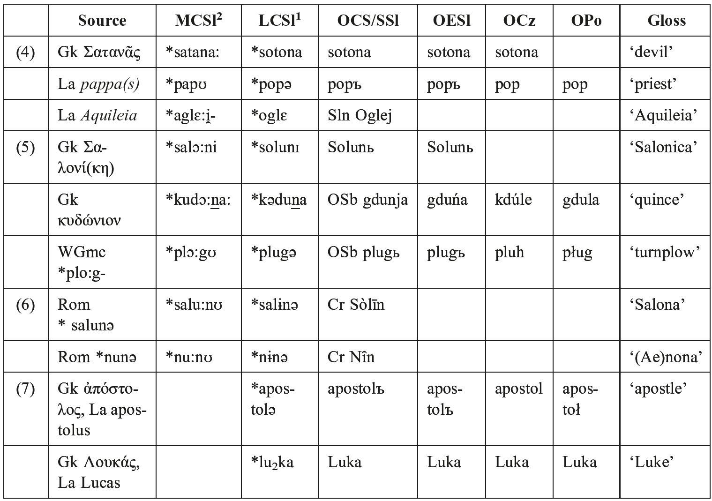

Several of these loanwords have clear <i>termini a quo</i>. <i>Sclaveni</i> began raiding northeastern Italy, where Aquileia (4) was the principal city<i></i>, in the final years of the 6th c. They first besieged Thessalonica (5) in the 580s, though they presumably knew the second city of the Empire by reputation long before. They first attacked Salona (6), on the Adriatic, in 536, and seized the town of Nona (6) in the early 7th c. (The toponyms in [6] reflect the Dalmatian raising of La <i>o</i> to *u in stressed open syllables; cf. <i>locum</i> > Vegliote <i>luk</i>.)

The renditions of Sl names in 6th−7th-c. Byzantine texts also reflect the pre-QD stage; *a is rendered with «α» [a] rather than the «ο» or «ω» that would have been expected in LCSl¹ (7). (Of course, the use of <i>α</i> need not imply that the Sl vowel was unrounded, just that it was too open or not rounded enough for a 7th-c. Greek to perceive it as [o].) The same reflex appears in early BFi borrowings (perhaps 7th c.): *<i>akun</i>- ‘window’ ⥬ Finnish, Votic <i>akuna; *kasa:ri̯</i>- ‘chopper’ ⥬ Finnish, Karelian <i>kassara</i>, Vepsian <i>karaŕ</i> ‘billhook’. BFi undoubtedly had the means to distinguish open and mid-vowels at the time.

There is good evidence for placing the <i>terminus ad quem</i> of QD in the early-to-mid-9th c.

Sl names inscribed in the Cividale Gospel (late 9th−early 10th centuries) appear in post-QD form: MCSl² *<i>katsilʊ</i> ⥬ <i>cozil</i> (= <i>Kocьlъ</i>); MCSl² *<i>dabraʒi:zni</i> ⥬ <i>dobrosisne</i> (= <i>Dobrožiznь</i>). The Glagolitic alphabet (ca. 860), based on the dialect spoken around Thessalonica, has separate letters, transliterated <i>a</i> and <i>o</i>, to render the reflexes of MCSl² *a: and *a<i></i>. For W-SSl and CzSlk, there is evidence from the rendition of Sl names in La and OHG texts.

For ESl, the change was a <i>fait accompli</i> by the 940s, given how Constantine VII renders the names of Dnieper rapids (8) with <i>o</i> [ɔ] for LCSl¹ *ɔ (< MCSl² *a) and <i>η</i> [i] for LCSl¹ *ɨ (< MCSl² *u:₁).

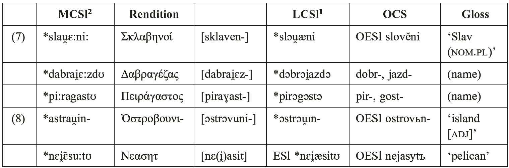

#### 5.1.1. Delabialization of *w

In LCSl¹ (see 5.1), *i and *u (from PSl *i, *u, and *a₂) were realized in most positions as near-close lax *ɪ and *ʊ/ǝ. In Slavistic terminology, *ɪ is called the <i>front jer (ь)</i>, and *ʊ/ǝ the <i>back jer (ъ</i>); these terms are used for convenience in the subsequent discussion. The rounded articulation of *ʊ was preserved in peripheral zones − ESl; southwestern E-SSl (as seen in standard modern Mc); Sorbian; and some CenSlk dialects.

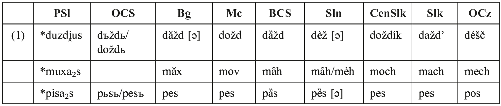

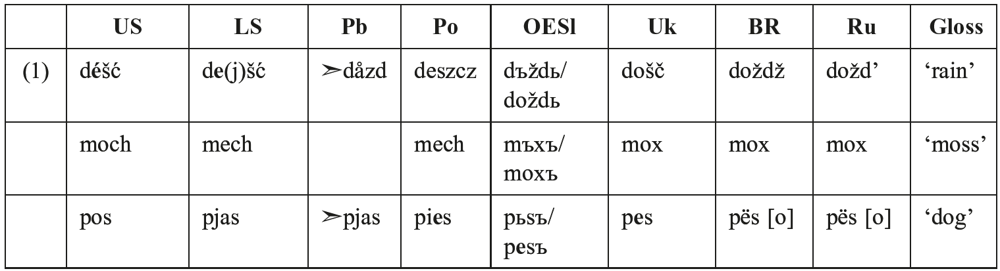

### 5.2. Post-QD changes in vowel quality

#### 5.2.1. Reflexes of LCSl1 *æ

LCSl¹ *æ (Slavistic <i>ě</i> “jat’”)<i></i>, from PSl *ɛ:₁ and MCSl¹ *ɛ:₂, had a (near-)open front articulation. Numerous Gk toponyms and loanwords of Slavic provenience, probably borrowed during the late 6th−8th centuries, render *æ as (ι)α rather than ε. In the historical period, open reflexes were preserved in two peripheral zones − Lech and E-SSl (also areas in which nasal vowels persisted after CSl [5.2.2]). In Lech, *æ backed (by a diphthongization process) to <i>a</i> before hard dentals (1), but rose to <i>e</i> elsewhere (2). In E-SSl, the reflex <i>æ</i> or <i>a</i> persists in scattered enclaves: EBg, Aegean Mc <i>v’æra</i> ~ <i>v’ara</i> ‘faith’. In most of EBg, *æ bifurcated in assimilation to the following consonant: it backed to <i>a</i> (1), with no raising of the dorsum toward the palate, before non-palatal consonants, but rose to <i>ɛ</i> (2), with raising of the dorsum, in auslaut and before consonants with palatal coarticulation (see 5.2). In auslaut, *æ became <i>e</i>, with raising of the dorsum (2). In WBg, *æ became <i>e</i> in all positions.

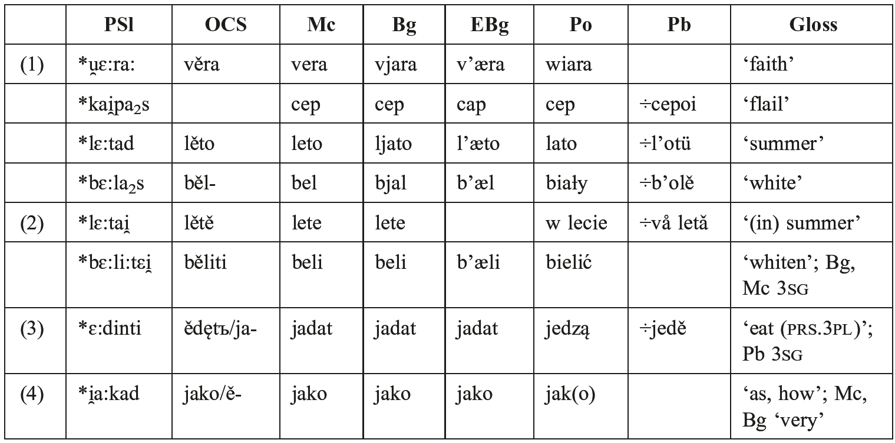

In Mc, the outcome is <i>a</i> after <i>i̯ (j)</i> (3) and <i>e</i> elsewhere (1, 2). The former reflects the Central Balkan merger of LCSl¹ *æ with *a after *i̯ (3−4). OCS Glagolitic, associated with the central Balkans (Ohrid), has a single grapheme «a», transliterated <i>ě</i>, for both *i̯a and *æ after consonants. OCS Cyrillic, associated with the eastern Balkans (Preslav), has separate letters «ѣ» <i>(ě)</i> for <i>æ</i> and (<i>ja</i>) for <i>ja</i>; however, <i>ja</i> is sometimes spelled «ѣ» due to copying from Glagolitic protographs: огн|огнѣ <i>(ognʲa ~ ognʲě)</i> ‘fire (GEN)’.

Elsewhere in Slavic (5), *æ rose to *e. It has been proposed that this was due to a push-chain: *æ rose to remain distinct from *[image-glyph: æ with tilde], which was losing its nasalization (see 5.2.2). For most dialects in this zone, there actually was a merger − across the board in P-Ek, P-Sln, and P-LS; before soft consonants in P-Cz; and in final position in PUS. Thus the push-chain hypothesis explains nothing. In fact, tense vowels naturally tend to rise along the peripheral track: <i>æ > e > i</i>. The real issue, then, is the chronology of the raising of *æ relative to denasalization. In most of the dialects where there was denasalization (see 5.2.2), *[image-glyph: æ with tilde] went through the change before *æ began to rise or while it was still relatively open − hence the merger. In peripheral areas (NW Sln, Slk, and ESl), *[image-glyph: æ with tilde] denasalized after *æ rose to mid-position, which preempted the merger.

The rise of LCSl¹ *æ halted at the *e stage in non-peripheral Sln and in dialect islands in WŠto, CenSlk, and Cen and NE Ru. Elsewhere, the intermediate reflex *e took three paths − diphthongization to <i>iɛ(:)</i>, laxing to <i>ɛ</i>, or raising to <i>i</i>. The diphthongal outcome occurred in Jek («je» [short]<i></i>, long «ije»), Slk («ie»), Sorb («ě»), NUk, and some Cen and NE Ru dialects. The laxed open mid outcome arose in Ek, including Kaj and much of Što, Mc, WBg, BR, and most of Ru. The raised outcome merged with <i>i(:)</i> (from LCSl¹ *i) in Ik and some NRu dialects, but remained distinct in WUk: <i>i</i> > <i>ɪ</i>, making room for <i>e</i> > <i>i</i>. In Cz, *e(:) had trifurcating outcomes: *e > OCz <i>iɛ</i> («ě») > Cz <i>(i̯)ɛ</i> («e|ě|je»); *e: > OCz <i>ɛ</i>: («é») after <i>l</i>, but OCz <i>ie</i> («ie») > Cz <i>i</i>: («í») elsewhere.

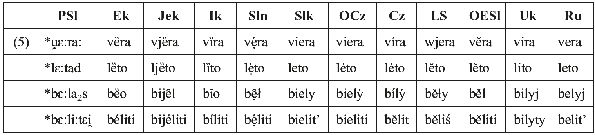

The open reflex is evidenced in early loanwords of P-ESl origin (ca. 7th−9th centuries) in BFi, which had the means to distinguish between open and mid front vowels: LCSl¹ *<i>mæra</i> ‘measure’ ⥬ Finnish <i>määrä</i>, Karelian <i>meärä</i>, Olonetsian <i>meärü</i>, Ludic <i>miär</i>, Estonian <i>määr</i>; LCSl¹ *<i>xlævǝ</i> ‘cowshed’ ⥬ E Finnish <i>lääva</i>, Karelian <i>leävä</i>, Vepsian <i>l’äu</i>. In NW Ru dialects, there are isolated lexemes with <i>a</i> for LCSl¹ *æ, which have been interpreted as relics of the open pronunciation: <i>jal</i> ‘eat (RES)’ (PSl <i>*ɛ:dla₂s</i>); <i>k’ap</i> ‘flail’ (PSl *<i>kai̯pa₂s</i>).

By the historical period (beginning in the 11th c.), OESl had close mid <i>e</i> for LCSl¹ *æ. In early Novg (11th−mid-12th centuries), writers often interchanged the letters «ѣ» <i>(ě)</i> [e] and «є» [ɛ], but this was due to orthographic latitude rather than a merger; <i>e</i> remained distinct from <i>ɛ</i> and eventually merged with <i>i</i>.

#### 5.2.2. Reflexes of LCSl1 nasal vowels

By the end of the LCSl period, the distinction between oral and nasal vowels (see 4.2, 5.1) was only preserved in peripheral dialects − Lech, E-SSl, and NSln (now only in the Jaun Valley [Podjuna] dialect). In these dialects, *[image-glyph: Greek epsilon with tilde] had a (near-)open, front articulation (*[image-glyph: æ with tilde]), distinguished from LCSl¹ *æ solely by the feature /+nasal/. Elsewhere in CSl, *[image-glyph: Greek epsilon with tilde] and *[image-glyph: open o / reversed c with tilde] denasalized, for the most part merging with existing oral vowels. At the time of their denasalization, they must have been unitary vowels /Ṽ/ → [Ṽ], since there are no lexicalized traces of decomposition /VN/ → [ṼN]. The table gives the reflexes in the various languages in a no-fine-print version. Among the factors that influenced the language-specific outcomes were vowel length and the quality of the preceding or following consonant. (The length in question developed after QD from contraction [5.12], the acute [6.1.1], neoacute retraction [6.4.3], or compensatory lengthening before weak jers [5.8].)

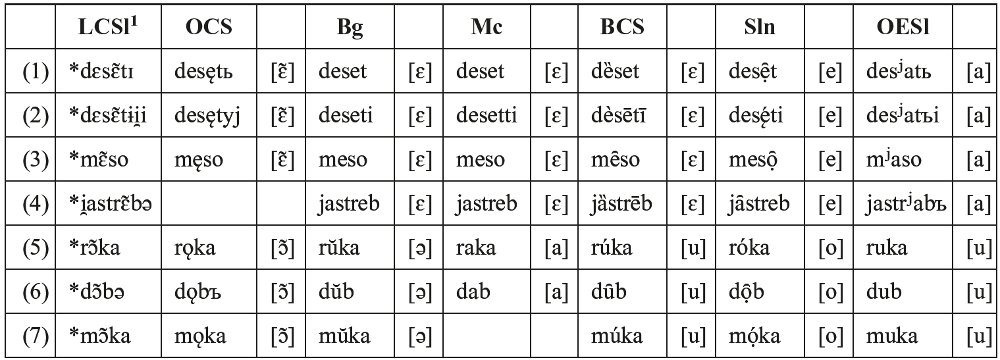

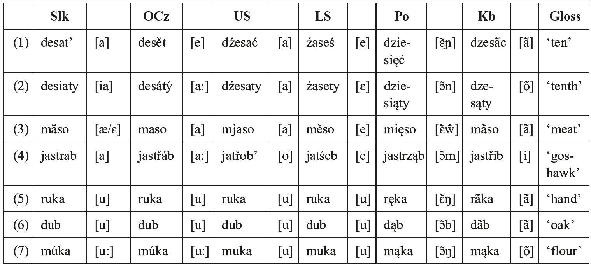

Nasal vowels are robustly attested in the oldest E-SSl texts in OCS; indeed, the main diagnostic for identifying a manuscript as OCS, rather than ChSl, is that the reflexes of *[image-glyph: Greek epsilon with tilde] and *[image-glyph: open o / reversed c with tilde] are spelled as the “jus” letters «ѧ» <i>(ę)</i> and «ѫ, ѭ» <i>(ǫ, jǫ)</i> with a high degree of accuracy. MBg (12th−15th centuries) shows inchoate denasalization; the process has run its course in modern Bg and Mc. In peripheral southwestern Mc, there are isolated lexemes that show decomposition: <i>zǝmp, zamp</i> ‘tooth’ (OCS zǫbъ). (In Mc, besides the standard reflex <i>a</i>, *[image-glyph: open o / reversed c with tilde] can be reflected as <i>u</i> [N, cf. BCS], <i>o</i> [SW], or <i>ǝ</i> [SE and Aegean, cf. Bg].)

In prehistoric Lech, *[image-glyph: æ with tilde] backed to *ã before hard dentals (2−3), just as *æ backed to *a. In Kb and Slc, the remaining instances of *[image-glyph: æ with tilde] rose and eventually denasalized (4): *[image-glyph: Greek epsilon with tilde](:) > *ẽ(:) > *ĩ(:) > *i(:). Short *ã was preserved as <i>ã</i> (2, 6) («ã», earlier «ę»). Long *ã: was raised to <i>õ</i> («ą») (3, 5, 7). (In ‘ten’ [1], the nasal is probably analogical to the ordinal [3].)

In OPo, <i>[image-glyph: Greek epsilon with tilde]</i> and <i>ã</i> merged in the 14th c. as low <i>ã</i> («ø<i></i>, φ» in some texts). Long <i>ã</i>: rose and backed to <i>[image-glyph: open o / reversed c with tilde]</i> («ą») (3−5, 7); short <i>ã</i> eventually fronted to <i>[image-glyph: Greek epsilon with tilde]</i> («ę») (1−2, 6). As a rule of thumb, a former front nasal can be detected from softness reflexes in the preceding consonant (see 5.4). In many dialects, including the standard, <i>[image-glyph: Greek epsilon with tilde]</i> and <i>[image-glyph: open o / reversed c with tilde]</i> have decomposed (diphthongized), in a counterparallel to the MCSl monophthongization: the coda is a glide <i>w ˜</i> before fricatives (2) and finally, and a homorganic nasal stop before stops and affricates. There has been denasalization before laterals.

Elsewhere in Slavic, nasal vowels were denasalized early; they became unitary vowels rather than vowel + nasal diphthongs. In WSln and NWSln, the denasalization took place without changing the vowel height; thus *[image-glyph: open o / reversed c with tilde] and *[image-glyph: Greek epsilon with tilde] merged with LCSl¹ *ɔ and *ɛ. In adjacent Sln, Čak, and some areas of Kaj, *[image-glyph: open o / reversed c with tilde] and *[image-glyph: Greek epsilon with tilde] became close-mid *o and *e; the front vowel merged with the reflex of LCSl¹ *æ, which had risen on a peripheral track. (There are also Kaj dialects in which *[image-glyph: Greek epsilon with tilde] merged with *ɛ; here the reflexes are often near-open.)

In a vast central territory (Što, CzSlk, Sorb, and ESl), contiguous until ca. 900, *[image-glyph: open o / reversed c with tilde] rose to merge with LCSl¹ *u₂. In the same zone, *[image-glyph: Greek epsilon with tilde] became tense near-open *[image-glyph: æ with tilde], so that there was the possibility of a merger either with LCSl¹ *æ (see 5.2.1) or with *a. In LS, *[image-glyph: æ with tilde] underwent a merger with *æ. In US, *[image-glyph: æ with tilde] merged with *æ in final position and with *a elsewhere. (In [3], the <i>o</i> comes from an <i>e > o</i> change.) In Cz, *[image-glyph: æ with tilde] merged with *æ before soft consonants (1, 5), but with *a before hard. In Slk, *[image-glyph: æ with tilde] denasalized and moved into the space formerly occupied by LCSl¹ *æ. The reflex of *[image-glyph: æ with tilde] is <i>æ(:)</i> in some dialects; in others, <i>æ</i> has merged with <i>ɛ</i>, and <i>æ</i>: with <i>a:</i>, or else <i>æ</i>: became a sequence <i>ia</i> or <i>i̯a:</i>. In the standard, based on CenSlk, <i>æ</i> appears after labials (2), and <i>ɛ</i> elsewhere; the long reflex is <i>ia</i> (3, 5).

In ESl, *[image-glyph: æ with tilde] merged with *a, while *æ rose along the peripheral track, perhaps in a push chain. (This reconstruction departs from the traditional Structuralist approach, which rejected the possibility of a LCSl merger of *æ and *a because it would entail inherent softness prior to the jer-shift. Instead, it was posited that *[image-glyph: æ with tilde] became the distinct vowel *ä [5.8].)

There is evidence that denasalization was not completed until the 10th c. in the Carpathian Basin. Hungarian settlers in the Pannonian Plain (from 895) borrowed toponyms from Slk with intact nasalization: <i>Molenta</i> (LCSl¹ *<i>mol[image-glyph: Greek epsilon with tilde] ta</i>, a name); <i>Dumbo</i> (LCSl¹ *<i>d[image-glyph: open o / reversed c with tilde] bǝ</i> ‘oak’). No later than 894, monks in Cividale (northeastern Italy), recorded the visit of the Moravian ruler Svátopluk I as <i>Szuentiepulc</i> (LCSl¹ *<i>su̯[image-glyph: Greek epsilon with tilde] těpl̥kǝ</i>). In a donation charter of 892, the name of the Croatian ruler <i>Mutimir</i> (LCSl¹ *<i>m[image-glyph: open o / reversed c with tilde] timirǝ</i>) is recorded as <i>Muncimiro</i>. However, the OSln Freising Fragments (later 10th c.) contain only three tokens with residual nasality <i>(en, on, un)</i>; *[image-glyph: Greek epsilon with tilde] is otherwise reflected as <i>e</i> and *[image-glyph: open o / reversed c with tilde] as <i>o</i> or <i>u</i>.

Early BFi borrowings from ESl reflect nasal vowels: Finnish <i>sunta</i> ‘direction’, Old Estonian <i>sundja</i> ‘judge’ from LCSl¹ *<i>s[image-glyph: open o / reversed c with tilde] d</i>- ‘judge, court’. Mikkola (1938: 19) suggests that these date from 9th−c. contacts, when the ESl settlers were establishing political institutions. By the early 10th c., denasalization had evidently taken place in ESl; cf. Constantine VII’s Βερούτσι for LCSl¹ *<i>uɪr[image-glyph: open o / reversed c with tilde] tʃi</i> ‘seething’ (the name of a Dnieper rapid). Norse <i>Ingvarr</i>, the name of an early-10th-c. prince of Kiev, was adapted as *<i>igorɪ</i>.

### 5.3. New length distinctions

Although QD eliminated length on the phonemic level (see 5.1), it is posited that the peripheral, tense vowels *i, *ɨ, *u, *æ, and *a and the nasal vowels *[image-glyph: Greek epsilon with tilde] and *[image-glyph: open o / reversed c with tilde] remained phonetically long. Subsequently, in a stage indicated here by <i>LCSl²</i>, they were shortened in certain phonetic positions, which lay the ground for new oppositions with new long vowels that arose by contraction (5.12), compensatory lengthening (5.10), and neoacute retraction (6.10). The following table gives a no-fine-print summary of the long-vowel outcomes in the Sl languages that reflect the LCSl² length distinction.

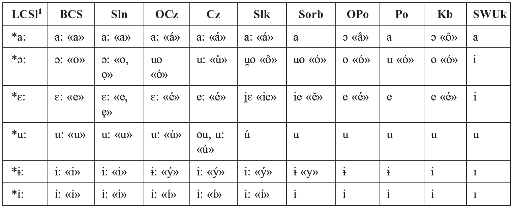

Final vowels were shortened in words of two or more syllables − a process completed before contraction (see 5.12). Thus, the endings in (1) reflect shortening, while those in (2) show length from contraction (except for Sln, which only preserves length in stressed syllables). In addition, long vowels were shortened under or after the ictus in words of three or more syllables (6.1.1). In (3), if the stressed vowel had been long in LCSl², it should have yielded **a: in N/Što BCS («ā») and OCz («á»), and a near-open rather than open vowel in OPo and Slc; cf. also the short vowel in Čak BCS <i>lopȁta</i>. In (4), the OCz root has a long vowel in the disyllabic NOM.SG, but a short in the trisyllabic forms of the paradigm. In OPo and Slc, the length has been eliminated by stem-leveling. (The BCS and Sln outcomes in [4] have the regular reflex of the old acute accent; see 6.1.1) Polysyllabic shortening did not affect syllables immediately before the ictus (5). If the nasal vowel in the first syllable had been shortened, OCz would have **u-, OPo **ę-, and Slc **ɵ; cf. also Čak <i>utrȍba</i>.

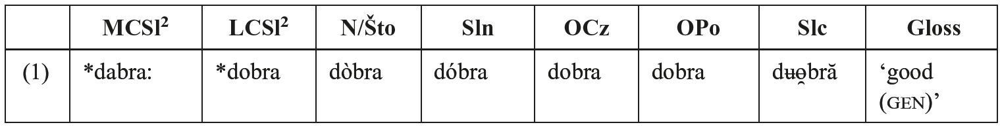

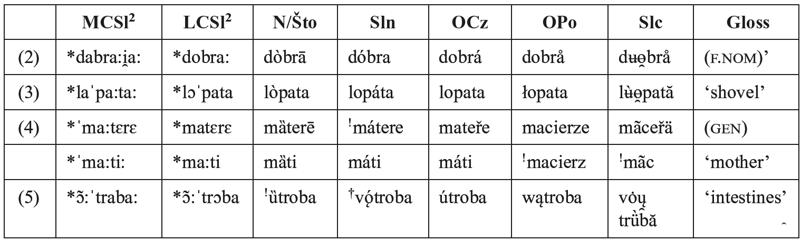

### 5.4. Secondary softening

In some LCSl dialects, prior to the loss of weak jers (see 5.8), labial and dental consonants developed secondary softening (palatal coarticulation) before front vowels: {P, T} > {Pj, Tj}/__ V[+front], where V[+front] = {*i, *ɪ, *e, *ɛ, *æ, * [image-glyph: Greek epsilon with tilde]/[image-glyph: æ with tilde]}. This is a common type of anticipatory assimilation: the blade of the tongue adopted the domed configuration that characterized the following vowel. This secondary softening had different outcomes from the earlier dental palatalization before *i̯ (3.6, 4.7), since the affected consonants remained primarily dentals. (The earlier change of Pi̯ > Pl did not involve labial softening; see 3.7.2) The hard consonants may have been redundantly velarized; this is particularly likely in the development of *l (see 5.5−5.6).

Secondary softening led to an opposition between hard (velarized) and soft (palatalized) consonants in CzSlk, Sorb, Lech, ESl, and ESSl. Subsequent changes in articulation, illustrated (with no fine print) in (1−3), belong to the histories of the individual languages. The archaic system is best preserved in Ru: LCSl¹ <i>*polʊdɪnʊ</i>: *<i>polʊdɪnɪ</i> > <i>*polʊdʲɪnʊ</i>: *<i>polʊdʲɪnʲɪ</i> > OESl <i>polъdʲьnъ</i>: <i>polъdʲьnь</i> > Ru <i>poldën</i> [dʲ]: <i>polden’</i> [dʲ, nʲ] ‘midday (†GEN.PL: NOM.SG)’; LCSl¹ *<i>krou̯ʊ</i>: <i>krʊu̯ɪ</i> > OESl <i>krovъ</i>: <i>krъvʲь</i> > Ru krov: <i>krov’</i> [vʲ] ‘shelter’: ‘blood’

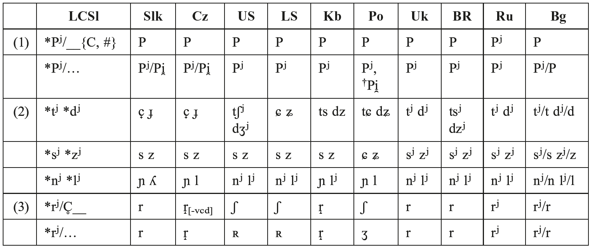

In (3), the hardening of *rʲ was a central LCSl development; it occurred in BCS, Slk, Uk, and BR. On the northeastern periphery (Ru), *rʲ was preserved. On the northwestern periphery, *rʲ assibilated, probably to *r̝, an alveolar trill with lamino-palatal frication, which was preserved in Cz, extreme SPo, Kb, and Slc; in Sorb and Po, the reflex underwent further developments.

In SSl, softening is reflected in Bg, but not in Sln, BCS, and Mc. The Bg outcomes of LCSl¹ *æ (see 5.2.1) depended on the hardness or softness of the following consonant. Ultimately, in most dialects, soft consonants were eliminated except before back vowels, where they had arisen in post-CSl changes (Scatton 1993: 197).

The dialect geography of softening indicates that the assimilation and its subsequent phonemicization was a LCSl change, which happened well before the loss of weak jers (see 5.7). (It was also undoubtedly a LCSl change in the sense that it stemmed from the structure of the LCSl phonological system; see 5.) Nevertheless, it has traditionally been assumed that inherent softening developed as a consequence of, and thus subsequent to, the loss of weak jers. That sequence of events is categorically impossible: if softness had not already been inherent (phonemic), the soft allophones conditioned by weak *ɪ would have hardened automatically in the absence of their trigger. Nevertheless, it is highly probable that the <i>reduction</i> of *ɪ facilitated the covert rephonologization of [Cʲ] ⇒ /Cʲ/. For learners, softening was ambiguous: they could ascribe it to the following vowel or, in a covert innovation, assess it as a feature inherent to the consonant: /dɪnɪ/ → [dʲɪnʲɪ] ⇒ /dʲɪnʲɪ/ → [dʲɪnʲɪ]. The shorter *ɪ became, the more likely the innovative analysis became for any given learner. Thus the jer-shift did not open the door for learners to analyze softness as an inherent consonantal feature; it shut the door to their interpreting it as a subphonemic, vowel-driven feature.

There was also systemic support for the reanalysis of [Cʲ] ⇒ /Cʲ/ in some LCSl dialects. Soft *sʲ already existed in ESl (as well as SSl) in the reflex of *x from the 2VP and PVP (see 4.4, 4.6). Likewise, soft *zʲ existed in dialects where the reflex of *g from the same changes had lost its closure. These outcomes were distinct from inherited *s and *z: P-ESl *<i>kun[image-glyph: æ with tilde] zʲa</i>|*<i>kun[image-glyph: æ with tilde] zʲu</i> ‘king (GEN|DAT)’, *<i>u̯ɪsʲa</i>|*<i>u̯ɪsʲ[image-glyph: open o / reversed c with tilde]</i> ‘all (F.NOM|F.ACC)’; cf. *<i>voza</i>|*<i>vozu</i> ‘cart (GEN|DAT)’, *<i>kosa</i>|*<i>kos[image-glyph: open o / reversed c with tilde]</i> ‘braid (NOM|ACC)’. Here, instead of softness, the traditional Structuralist approach posits ad-hoc vowels *ü and *ä. It is unclear how the putative *ü could have remained distinct from MCSl² *ü: (>LCSl¹ *i:, see 4.3, 5.1), or the putative *ä from LCSl¹ *æ (see 5.2.1), unless PVP² (4.6) and the consequent vowel fronting were later than QD (5.1). In addition, *ü and *ä entail morphological complications (at least, for a Structuralist approach); for example, the endings in *<i>kun[image-glyph: æ with tilde] zä</i> |*<i>kun[image-glyph: æ with tilde] zü</i> would be allomorphs of those in <i>voza</i>|<i>vozu</i>. According to Lunt (1956: 310), the presence and usage of  and «ю» in the Cyrillic alphabet corroborate the existence of /ü/ and /ä/ in OESl. In fact, they stem from an orthographic tradition that began under the influence of Gk perceptions (see Collins 1992).

#### 5.4.1. Fate of the soft sonorants

The reflexes of *<u>n,</u> *<u>l,</u> *<u>r</u> from dental palatalization (3.6) merged entirely with new soft *nʲ, *lʲ, *rʲ in the dialects in which secondary softening developed (5.4). There was no corresponding merger in W-SSl (1−2), where *<u>n</u> and *<u>l</u> are reflected as primary palatals <i>ɲ, ʎ</i>, and *<u>r</u> as the sequence <i>rj</i> (before vowels only). In Mc, *<u>n</u> and *<u>r</u> are reflected as dentals, and *<u>l</u> as <i>lʲ</i> or <i>ʎ</i>, in contrast to the velarized <i>lˠ</i> from *l dental.

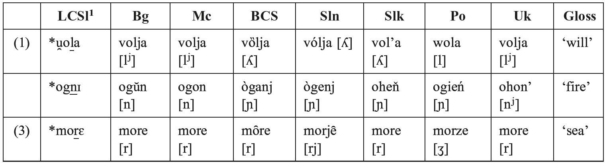

### 5.5. Internal open vowel-liquid diphthongs

Tautosyllabic *ar, *ɛr, *al, *ɛl (traditionally called <i>TORT formulas)</i> underwent changes whose effect was to remove the liquids from the syllable coda. The reflexes fall into three zones − southern, northwestern, and northeastern; there are two conservative peripheries. The change straddled QD (5.1) in SSl and CzSlk but postdated it elsewhere. The dialect geography is LCSl in that it has a post-Migration-Period center/periphery, and CzSlk patterns entirely with SSl rather than with Sorb and Lech (see 4.1).

In the southern zone, SSl and CzSlk, the sequences underwent metathesis; the vowels were lengthened, so that the sequences remained bimoraic: PSl *ɛR > MCSl² *Rɛ: > LCSl¹ *Ræ; PSl *aR > MCSl² *Ra: > LCSl¹ *Ra. The lengthening took place before or at the same time as the metathesis, given that inherited (non-metathesized) *Rɛ-, *Rawere not affected: LCSl¹ *rɛ, *rɔ, cf. OCS <i>drevlʲьnʲь</i> ‘ancient’, <i>plešte</i> ‘shoulder’, <i>plodъ</i> ‘fruit’, <i>krovъ</i> ‘covering’.

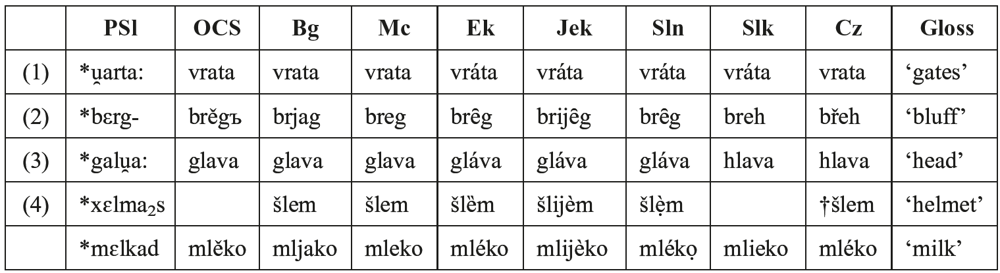

On the southern periphery, the lengthening stage began before the metathesis. This can be seen from isolated lexemes that reflect lengthening only: MBg <i>baltina</i> ‘bog’ (*<i>balt</i>-), <i>zaltarinъ</i> ‘goldsmith’ (*<i>zalt</i>-), <i>maldičie</i> ‘youth’ (*<i>mald</i>-); Bg †<i>dalta</i> ‘chisel’ (*<i>dalbt</i>-). In the same zone, the isolated lexemes with unmetathesized initial diphthongs (4.9) also reflect lengthening.

In the northwest, in Sorb and non-peripheral Lech, the sequences underwent metathesis but not lengthening: PSl *ar > LCSl¹ *rɔ (5); PSl *ɛr > *rʲɛ (6), PSl *al > LCSl¹ *lɔ (7)<i></i>, and PSl *ɛl > *lʲɛ (8). In the same dialects, the reflexes of initial open-vowel-liquid diphthongs had undergone pre-QD lengthening under the acute accent (4.9) In the internal diphthongs, the loss of bimoraicity suggests that the change followed QD (5.1); that is, it occurred at a time when length was no longer distinctive in these dialects. The vowels were sometimes lengthened in later prosodic changes − compensatory lengthening (5.10), seen in the US, Kb, and Slc forms in (6), or neoacute lengthening (6.4.3) seen in the Kb and Slc forms for (8).

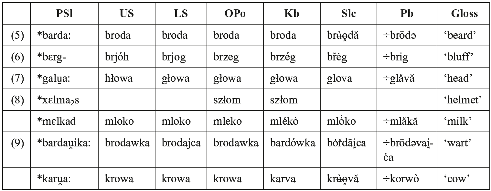

Throughout Lech, tautosyllabic *ɛr, *ar, and *al are consistently reflected with metathesis. However, in peripheral Lech *ar is often reflected as <i>or ~ ar</i> (9). Cf. also Pb ÷<i>bordåi̯nǝ</i> ‘hachet’, Kb <i>korwińc</i>, Slc <i>kãrwińc</i> ‘cow-patty’; OPo <i>karw</i> ‘bull’. Evidently, there has been dialect contact in both directions: Kb <i>bardówka</i> ~ <i>brodówka</i> ‘wart’; <i>korwa</i>|<i>krowa</i> ‘cow’. For Pb, *<i>or</i> was the norm; forms with *<i>ro</i> were accessed in contacts with Sorb or CenLech.

In the northeastern zone, comprising ESl, there was neither lengthening nor metathesis; instead, a matching vowel was added after the sonorant: *ar > *ɔrɔ (10); *ɛr > *ɛrʲɛ (11); *al > *ɔlˠɔ (12); and *ɛl > *ɛl⁽ˠ⁾, with bifurcating reflexes: *ɛl⁽ˠ⁾ > *ɛl⁽ˠ⁾ɔ after palatals (13), but *ɔl⁽ˠ⁾ɔ elsewhere (14). This change is traditionally called <i>pleophony</i>.

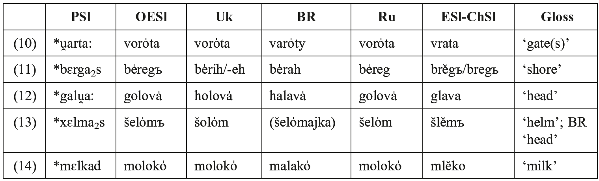

For the Uk lexeme in (11), the predicted outcome is <i>bereh; berih</i> reflects *<i>ɛ</i>:, usually ascribed to either neoacute lengthening (see 6.4.3) or compensatory lengthening before a weak jer (see 5.10). The OESl ChSl register seen in most OESl writings typically employed the SSl reflexes in imitation of OCS protographs. However, for *ɛr sequences, the compromise spelling <i>re</i> is more common than <i>rě</i>, even in texts that otherwise distinguish <i>e</i> and <i>ě</i>.

There is abundant evidence that the changes in internal open-vowel-liquid diphthongs did not begin until the 7th c. or later. Many Slavic proper names are cited in unmetathesized form by Byzantine authors of the 7th−8th centuries: Β<b>αλ</b>δίμερ (*<i>u̯<b>al</b>dɛi̯mɛ:ras</i>)<i></i>, Δ<b>αρ</b>γαμηρός (*<i>dargami:ras</i>) − after metathesisis, <i>Vladimirъ</i>, and <i>Dragomirъ</i>. During the same period of early contacts, pre-metathesis forms made their way into other languages of southeastern Europe: *<i>balta</i>- ‘swamp’ ⥬ Albanian <i>b<b>al</b>të</i> ‘mud’, Romanian <i>b<b>al</b>tă</i> ‘swamp’; *<i>m<b>έr</b>gi̯a</i>: ‘net’ ⥬ Gk dial μ<b>έρ</b>ζα. There are numerous toponyms of Slavic provenience in central and southern Greece that show no sign of metathesis: *<i>g<b>ar</b>dika-</i>‘walled town’ ⥬ Γ<b>αρ</b>δίκι; *<i>b<b>ɛr</b>g</i>- ‘bank’ ⥬ Β<b>έρ</b>γος; *<i>s<b>ál</b>minεi̯ka</i>- ‘bed of straw’ ⥬ Σ<b>αλ</b>μενῖκον. (There are also toponyms that reflect metathesis: *<i>b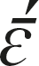[image-glyph: Greek epsilon with overmark/acute-style mark] l</i>- + *<i>g<b>ar</b>d-</i> ‘white town’ ⥬ Μπελιγ<b>ρά</b>δια; *<i>g<b>ar</b>dika-</i> ⥬ Γ<b>ρα</b>δίτσα. These are less frequent in the south, where the hellenization of Slavophone inhabitants began ca. 800.)

In the late 6th−early 8th centuries, CSl borrowed loanwords with tautosyllabic *ar, *ɛr, *al, *ɛl from WGmc and La; these underwent the same changes as the native sequences (15). Sl names in 7th−mid-8th-c. Frankish sources likewise reflect the pre-metathesis stage: *<i>u̯aldu:ka</i>: ‘ruler’ ⥬ <i>Walducus, *dɛru̯a:n</i>- ⥬ <i>Deruanus</i> (620s−640s); *<i>bɛrʒinik</i>-⥬ <i>Bersnicha</i> (834). It is often claimed that metathesis was still underway during the time of Charlemagne (771−814), on the assumption that his OHG name <i>Karl-</i> supplied LCSl¹ *<i>karl-</i> ‘king’, attested in all Sl languages except Pb (16)<i></i>. Spellings that reflect metathesis appear in Frankish sources from the late 8th c. and become the norm by the mid-9th c.: LCSl¹ *<i>tɛrbɛli̯</i>- > P-Slk *<i>trɛbɛʎ-</i> ⥬ <i>Trebel</i> (784); LCSl¹ *<i>pɛrdǝslau̯ǝ</i> > *<i>prɛ:dǝslau̯ǝ</i> ⥬ <i>predezlaus</i> (late 8th−early 9th c.).; LCSl¹ *<i>sɛbædarg</i>- > P-Sln *<i>sɛbedarg</i>-⥬ <i>sebedrago</i> (late 8th c.), <i>Zebedrach</i> (864). Metathesis is reflected consistently in the Kiev Folia (10th c.; protograph 860s−880s), in the Freising Fragments (later 10th c.), and in the canonical OCS manuscripts (10th−11th c. with later 9th-c. protographs).

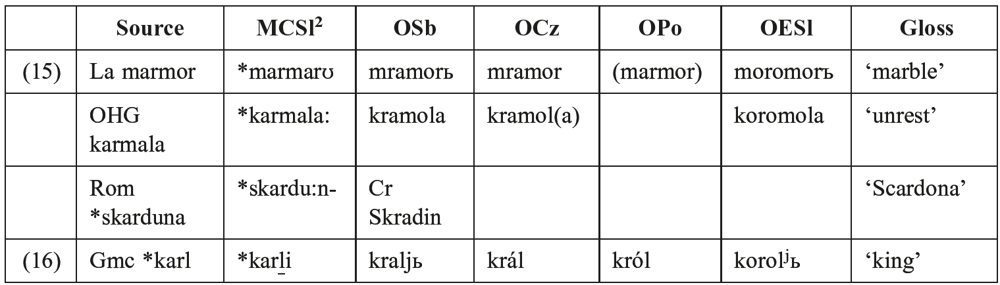

In the northeast, pleophony probably occurred in the 8th−9th centuries. BFi accessed some loanwords from P-ESl prior to the change: *<i>vɛrtɛnad</i> ‘spindle’ ⥬ Votic <i>värttänä</i>, Karelian <i>värt’t’inä</i>, Estonian <i>värten; *talkunad</i> ⥬ Finnish, Karelian <i>talkkuna</i>, Vepsian <i>taukun</i> ‘oat flour’.

### 5.6. Tautosyllabic close vowel-liquid diphthongs

LCSl¹ *ɪ and *ǝ (“jers”) have different outcomes in tautosyllabic *ɪr, *ɪl, *ǝr, *ǝl sequences than in other environments (see 5.8). The reflexes fall into southern, northern, eastern, and northeastern zones. In the southern zone, comprising SSl and CzSlk, the sequences became syllabic sonorants (1−2); that is, the vowels were reinterpreted as opening phases rather than independent nuclei, in a counter-parallel to the PreSl development (see 2.3).

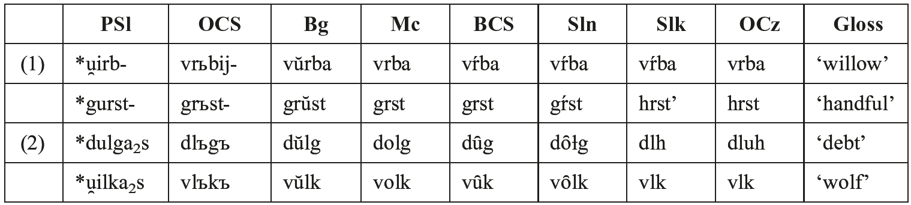

In OCS, the outcomes are spelled «rъ, rь» and «lъ, lь»<i></i>, where the choice of the jer letter was orthographic rather than etymological<i></i>. (OCS dictionaries add to the phonological illusion by using entry-forms with <i>Rь</i> for *Ri and <i>Rъ</i> for *Ru. In the tables here, the most frequent variant is given.) The placement of the jer letter after the liquid was a convention influenced by the phonological perceptions of Gk speakers. In original *rɪ, *lɪ, *rǝ, *lǝ (see 5.10), the reflexes of *ɪ and *ǝ acted like jers in other positions (see 5.8); they could be strengthened (<i>krъvь > krovь</i>) or condition the strengthing of a preceding jer (<i>vъ krъvi > vo krъvi</i>). This did not happen with the reflexes of *ɪr, *ɪl, *ǝr, *ǝl, because no jers were present.

In later Bg, <i>R̥</i> became <i>ǝR</i> when followed by a single consonant, and <i>Rǝ</i> elsewhere: <i>vŭrba</i> ‘willow’~<i>vrŭbnica</i> ‘Willow [Palm] Sunday’. In monosyllables, the <i>ǝ</i> could develop on either side of the sonorant. The expected outcomes have often been obscured by leveling. Elsewhere in the southern zone, <i>r̥</i> (1) has generally been stable; <i>l̥</i> (2) has survived as such only in CzSlk and some WBg dialects. Slk distinguishes <i>l̥</i> and <i>l̥:</i>, with neoacute lengthening (see 6.4.3). OCz preserves <i>l̥</i> only after labials; elsewhere, the sonorant has diphthongized: *l̥ > <i>lu</i>, *l̥: > <i>lu</i>: (<i>lú</i>; modern <i>lou</i>). Similar reflexes occur in the northern zone (below). In Sln, BCS, Mc, and some WBg dialects, *l̥ was probably velarized [lˠ]; its opening phase was reanalyzed as a back rounded vowel: Sln <i>ɔlˠ</i> > <i>ɔw</i> («ol», tonemic-system «ɔƚ»); BCS *ɔlˠ > <i>u</i>.

In the northern zone (Sorb and Lech), LCSl¹ *ɪr, *ɪl, *ǝr, *ǝl also became syllabic sonorants. Subsequently, they again became diphthongs − either <i>VR</i> or <i>RV</i>; the order and the timbre of the vowel depended on the surrounding consonants, and in particular on whether the following consonant was a hard (plain) dental. To account for this environment, scholars who view consonant softening as a consequence of the jer-shift have to reconstruct four syllabic sonorants, with a distinction in second tonality: *ɪR > *R̥ʲ, *ǝR> *R̥ˠ; then *R̥ʲ > *R̥ˠ/__Tˠ. This is superfluous; palatal coarticulation developed prior to the jer-shift (see 5.2), and it can also be assumed before *ɪr and *ɪl became syllabic sonorants.

Accordingly, northern-zone *r̥ split into new back vowel-hard sonorant sequences after hard consonants (3); and between consonants with palatal (co)articulation and hard dentals, *or (western), *ar (eastern), but higher-tonality *ɛr⁽ʲ⁾ elsewhere (4). For *l̥, the outcomes are more complex but follow the same general pattern. After hard consonants and after consonants with palatal (co)articulation preceding hard dentals (5), *l̥ split into back vowel and hard sonorant portions (not necessarily in that order): US *olˠ; LS *lˠu (after dentals) and *olˠ (elsewhere); Slc and Kb *lˠu; Po olˠ or *ɛlˠ (after labials, with variation perhaps due to dialect contacts), *lˠu (after dentals), and *ɛlˠ (after velars). After consonants with palatal (co)articulation preceding other consonants, *l̥ had the following reflexes: Sorb *ɛlʲ (after labials before consonants other than hard dentals), *olˠ (elsewhere in US; after labials before hard dentals and after palatals in US), and *lˠu (in LS after dentals); Slc and Kb *olˠ; and Po *ɛlˠ (after labials before hard dentals), *il (after labials before other consonants), *lˠu (after dentals), and *olˠ (after palatals) (6). Pb was an outlier, in that *r̥, *l̥ became sequences of back vowel plus sonorant without regard to the neighboring consonants.

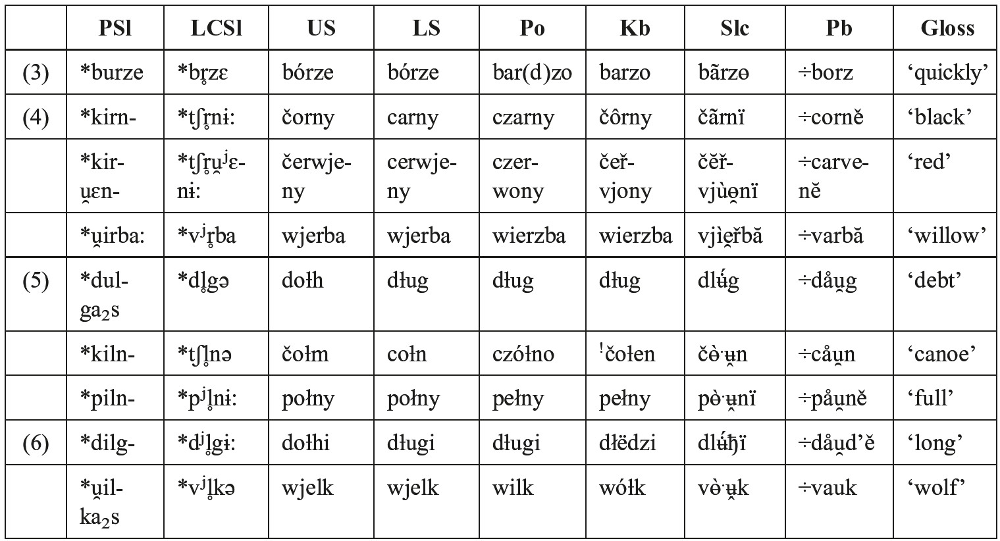

In ESl, coda *l developed velarized articulation [lˠ]; cf. its modern Uk and BR reflex <i>w</i>. Then *ɪ backed to *ʊ before *lˠ (like *ɛ to *ɔ, see 5.5). The backing was blocked when the *ɪ followed palatals, where, since LCSl, phonotactics did not permit *ʊ in that environment. Later, the vowels in tautosyllabic *ɪr, *il, *ʊr, *ʊl sequences developed like ordinary strong jers (9−10); see 5.8. In peripheral Novg, there was a “Second Pleophony” (cf. 5.5): a copy of the vowel before the sonorant developed after it as well: *ɪr > <i>ɪrɪ</i> («ьrь»), *ur <i>> ʊrʊ</i> («ъrъ»), *ʊlˠ > <i>ʊlʊ</i> («ъlъ»), and *ilˠ > <i>ɪlʊ</i> («ьlъ»). The mechanism was probably the same as in the apparent metatheses in CzSlk, Lech, and E-SSl: the sonorants were realized with schwa-like final phases, which could be rephonologized as independent units.

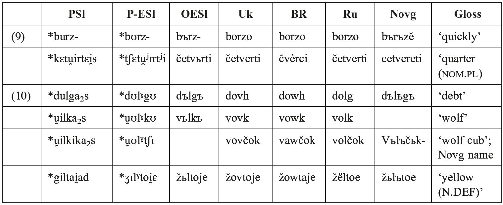

### 5.7. Tensing of *i and *ǝ before *i̯

After qualitative differentiation (5.1), the “jer” vowels *ɪ and *ǝ were subject to tensing before *i̯ (1−3). As a result, they merged with the reflexes of PSl *i: and *u:₁ in most dialects.

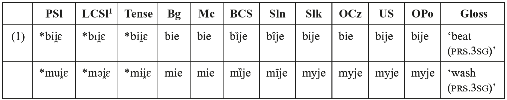

In the table, Bg and Mc <i>ie</i> is a disyllabic sequence. In OCz, <i>ie</i> was a diphthong, which arose from the contraction of *ii̯ɛ (see 5.12).

Non-tensed reflexes were preserved in three peripheral areas − Pb, western (Ohrid) OCS, and Ru (excluding Novg) (2). (If there had been tensing in Ru and Pb, the expected outcomes would be **-i-, **-y-, and diphthongal **ai̯, **åi̯, or **oi̯, respectively.)

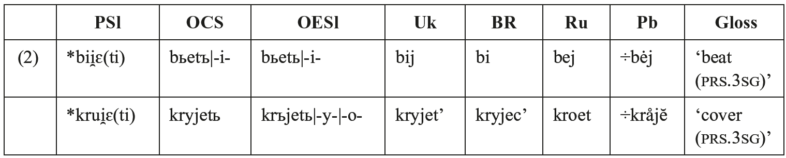

Judging from spelling variations, the tensing was still an active process in OCS (10th−11th centuries) and Kievan OESl (11th−13th centuries). In OCS, there was graphic vacillation in the tensing position between «ь» and «и, ı» for *-ɪ- and between «ъ» and «ъı, ъи» for *ǝ, e.g. sandhi въ истинѫ~въı истинѫ ‘in truth (ACC)’, прѣдамь и~прѣдами и ‘hand over (PRS.1SG) him (ACC)’. In manuscripts originating in the Ohrid milieu, strongjer reflexes (see 5.8) could appear instead: прѣдаме и. Similar variation can be seen in OESl manuscripts.

Tensing overlapped with other changes to *ɪ and *ǝ (see 5.8). In “strong-jer” position, the reflex is generally tense (close) rather than “strong” (mid or near-open). In “weakjer” or reduced position, leveling has obscured the development, but generally, the tense reflex occurs in roots (3), the weak in suffixes (4). (For W-SSl and WSl, the change of *ɪi̯V to i̯V has also been treated as a contraction, but it does not follow the usual course of contraction [5.12].) In eastern OESl, where there was no tensing, quasi-tense spellings of weak jers as и|ı and ъı are probably ChSl imitations of OCS protographs.

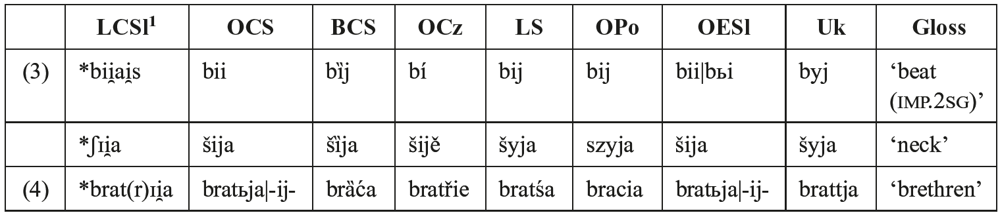

### 5.8. The jer-shift

LCSl¹ *ɪ and *ǝ/*ʊ (“front jer” and “back jer”) underwent a complex of changes known as the <i>jer-shift</i> (Isačenko 1970) or the <i>Third Slavic Vowel Shift</i> (Andersen 1998a). The shift had such major consequences for phonology, syllable structure, and morphology that it is generally, and justifiably, taken as the great divide between LCSl and the history of the individual languages (with the provisos discussed in 5). Among the most important consequences were the abolition of the constraint against closed syllables and the rise of new, previously non-canonical clusters; in the history of the individual languages, this led to new voicing assimilation and final devoicing rules. In addition, in the dialects where consonants developed palatal (co)articulation before front vowels (5.2), the loss of *ɪ in the jer-shift removed the possibility of interpreting them as subphonemic (vowel-driven).

The jer-shift (JS) was not a single punctiliar change. In its first phase (JS¹), there was a tendency, traditionally known as Havlík’s Law, for *ɪ and *ǝ/*ʊ to be reduced (1.0 → 0.5 moras) unless there was an *ɪ or *ǝ/*ʊ in the following syllable: *ɪ > *Ῐ and *ǝ > * [image-glyph: schwa with breve] (breve = IPA “extra short duration”). There was a countervailing tendency to avoid sequences of two ultrashort vowels. By Havlík’s Law, jers were “weak” (subject to reduction) finally (1) and in syllables before non-jer vowels (2); they were “strong” (not subject to reduction) in syllables before weak jers (1, first syllable). In sequences of three jers, the final was weak, the penultimate strong, and the antepenultimate weak (3). (For the further development of strong jers, see 5.8.1)

In the second phase (JS²), weak jers were subject to further reduction: {*Ῐ, *[image-glyph: schwa with breve]} > Ø. This process has traditionally been called the <i>fall of the weak jers</i>, which has the misleading implication that the process was sudden. The principal mechanism was not a sound change proper but a phonemic reanalysis, which elapsed over multiple generations, with a great deal of social accommodation. At any given time, LCSl¹ /ɪ/ and /ǝ/ (or peripheral /ʊ/) had a range of phonetic realizations, from short in lento speech through ultrashort [V] to Ø in allegro speech. Presented with these ambiguities, innovative learners could covertly reanalyze the weak jers as /Ø/. Presumably, for the sake of social continuity, they learned to produce jer-like paragogic vowels as lento or emphatic actualizations of consonants that were final or pre-consonantal in their grammars: /C/ → [Cǝ]; cf. American English emphatic <i>sweet</i> [sǝˈwijt], <i>incredible</i> [ɪnkǝˈrɛdɪbl̥]. Undoubtedly, the actualization was gradual and influenced by pragmatic factors such as rate of speech and style. Overall, innovative speakers would favor null realizations as the best match to their grammars. The null realizations would thus increase in frequency, influencing new learners to make the reanalysis as well. Therefore, the traditional label “fall” or “loss” of weak jers is inaccurate except as a metalinguistic description of the end result.

<!-- source-file: content/07_chapter01_5.xhtml -->

The adjacent consonants also played a role in the implementation. In OESl, the loss of weak jers is first registered between voiceless consonants (LCSl¹ *kʊnʲazɪ > <i>kъnʲazь|knʲazь</i> ‘prince’). Another factor was the position of the jer in the word. Final jers were eliminated earlier than non-final; this is very clearly evidenced in Novg, where null spellings of final jers crop up from ca. 1075, while the main implementation took place in the 1120s−1210s.

The data in the table come from the earliest Sl manuscripts − the Kiev Folia (10th c.), written in OCS of Moravian (Mor) provenience; the canonical OCS codices of E-SSl provenience (late 10th−11th c.); the earliest OESl writings (11th−early 12th c.); andthe Freising Fragments, hand III, written in OSln (later 10th c.). They illustrate the spelling of weak jers in final (1) and medial position (2), as well as sequences of three jers (3).

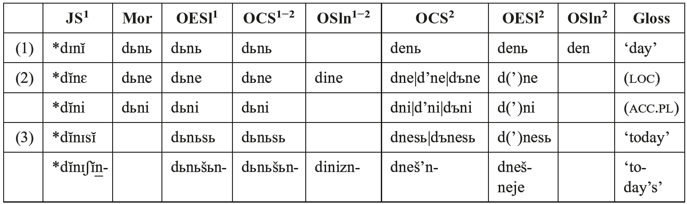

At the JS¹ stage, both weak and strong jers are written with jer letters, without omissions or conflations. This is attested in Mor and in OESl¹. (The occasional omissions of jers in 11th-c. OESl manuscripts is thought to be a “bookish” imitation of OCS rather than a sound change in progress.) At the JS² stage, strong jers can be replaced by other vowel letters (see 5.8.2); weak jers can be dropped, written with an apostrophe, or confused with the other jer (ъ for ь in the OCS² examples). This is attested in OCS², OESl², and OSln². While the canonical OCS manuscripts were all produced by JS² scribes, the majority of their jer spellings reflect JS¹; this is due to the scribes’ copying from JS¹ protographs, receiving dictation in a JS¹ pronunciation, or following JS¹ orthographic rules. In the table, conservative spellings are cited under OCS¹−², and innovative under OCS². In the OSln¹−² spellings, weak jers («i») are omitted after the stress, but preserved elsewhere; the strong jer («i, e») (1, 3) has not yet been conclusively identified with another vowel. (The scribe was probably a German copying from an older text.)

#### 5.8.1. Rephonologization of the strong jers

As weak jers grew shorter (JS²), strong jers were lengthened in proportion; ultimately, they were rephonologized as mid- or near-open vowels. This process has traditionally, though illogically, been called the <i>vocalization of strong jers</i>. The reflexes fall into a central zone and peripheries.

In the central zone (W-SSl, WSlk and ESlk, Cz, Sorb, and most of Lech), strong *ɪ and *ǝ (from LCSl¹ *ʊ [5.1.1]), merged as *ǝ or a similar mid-central vowel. (In WSl, *ɪ left its traces in the softness of the preceding consonant [see 5.4].) In early OSb and OCr, <i>ǝ</i> was spelled with the front jer letter «ь»; the back jer letter «ъ» went into abeyance. During the Middle Ages, <i>ǝ</i> was rephonologized as <i>a</i> in Što and most of Čak, and as <i>ɛ</i> («e») in Kaj and in the Čak dialects of a few Adriatic islands. In Sln, the merged reflex bifurcated, depending on length: *<i>ǝ</i> > <i>ǝ</i> («e»); *<i>ǝ</i>: > <i>a</i>: in the southwest, adjoining Čak, and close-mid <i>e</i> («ẹ» or «é») to the east, adjoining Kaj. In WSl, apart from Pb (see 5.8.2) and part of CenSlk, the merged reflex of *ɪ and *ǝ was identified with LCSl¹ *ɛ. In Sorb, this could change to <i>o</i> in US and <i>a</i> in LS, depending on the adjacent consonants. In the table, <i>Slk¹</i> is SE CenSlk dialects, which have rounded reflexes of *u; <i>Slk²</i> is CenSlk, with forms from the standard. (Cf. WSlk <i>déždž, pes, den</i>.)

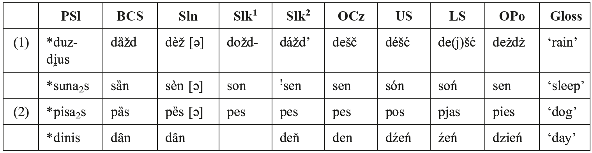

In the other peripheral zones (Bg, Mc, ESl, and CenSlk), strong *ɪ and *ǝ /*ʊ remained distinct, for the most part. Generally, strong *ɪ was reflected as <i>ɛ</i> («e»); in BR and Ru, it bifurcated into <i>ɔ</i> before hard consonants and <i>e</i> before soft. Strong *ʊ became <i>ɔ</i> («o») in ESl, in part of CenSlk, in western (Ohrid) OCS, and in many Mc dialects, including the standard (though <i>a</i> also occurs as an intrusion from BCS). In Bg, its outcome was delabialized <i>ǝ</i> («ŭ»), merging with the reflex of LCSl¹ *<i>[image-glyph: open o / reversed c with tilde]</i>.

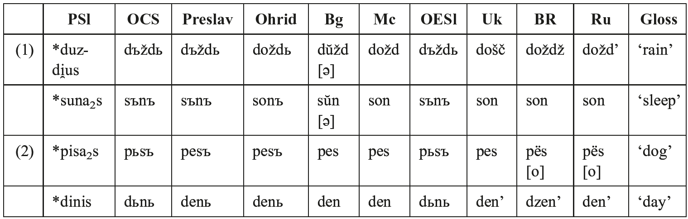

#### 5.8.2. Pb outcomes

The reflexes of *ɪ and *ǝ did not follow Havlík’s Law in the northwesternmost Slavic language, which therefore was an outlier. Weak jers in initial syllables became strong if they were stressed or in the first pre-stress syllable: LCSl¹ *<i>kʊto</i> > <i>÷kåtü</i> ‘who’ cf. OCS <i>kъto</i>|<i>kto</i>; LCSl¹ *<i>pɪsi</i> > <i>÷pasåi</i>, cf. OCS <i>pьsi|psi</i> ‘dog (nom. pl.)’<i></i>. Other weak jers were lost, as expected. Strong *ɪ and *ǝ merged as <i>ɒ</i> (<i>å</i> in normalized spelling) in some environments, but remained distinct in others − <i>a</i> for front, and close-mid <i>e (ė</i> in normalized spelling) for back: LCSl¹ *<i>dʊzɟɪ</i> > <i>÷dåzd</i> ‘rain’, cf. OCS <i>dъždь</i>; LCSl¹ *<i>pɪsa₂s</i> > <i>÷pjas</i> ‘dog’; LCSl¹ *<i>dɪnɪ</i> > <i>dan</i> ‘day’; LCSl¹ *<i>lokʊtɪ</i> > <i>÷lüt’ėt</i> ‘elbow’.

#### 5.8.3. Irregular outcomes

At the time of the jer-shift, conservative speakers presumably tolerated (or even produced) null implementations of weak jers as allegro forms. Conversely, innovative speakers in the same community must have retained awareness of the existence of vowels in weak-jer position and interpreted them as paragogic vowels − that is, as potential realizations of consonants not immediately followed by vowels in high-style or largo speech. This natural result of generational continuity would have provided many opportunities for irregular outcomes, e.g. insertion of non-etymological vowels in inherited clusters (1).

The regular operation of Havlík's Law created extensive allomorphy (“vowel-zero alternations”). Thus, in the individual languages, the distribution of strong and weak jer reflexes has often been disrupted by stem-leveling to break up complex consonant clusters − though the bar for complexity is set quite high in Sl − or to eliminate multiple vowel-zero alternations in the same stem. Thus, e.g. in ‘stalk’ (2), the ESl and SSl languages have generalized the root allomorph that reflects the strong jer; cf. also modern Cz <i>steblo</i>. In ‘light’ (3), the masculine indefinite form, in accordance with Havlík’s Law, should have a null outcome for the rightmost jer; however, the strong-jer reflex has been extended from forms in which it was regular.

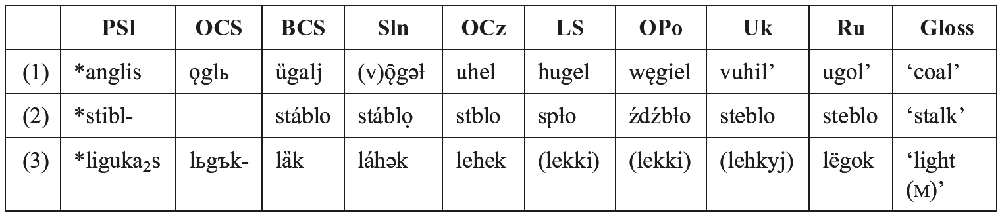

### 5.9. Tautosyllabic liquid-jer sequences

By Havlík’s Law (5.8), LCSl¹ tautosyllabic *rɪ, *lɪ, *rǝ, *lǝ (peripheral *rʊ, *lʊ) are predicted to yield RV in strong position (1), and R in weak (2). In fact, these outcomes only developed in WSl, excluding Slk, and in the more western dialects of ESl. In the WSl dialects, the new interconsonantal sonorants did not become syllabic; the words in (2) are monosyllabic. (By contrast, tautosyllabic *ɪr, *ɪl, *ǝr, *ǝl had become syllabic; see 5.6). In Sorb, interconsonantal *l ultimately developed into *ɨl (2), with a different vowel from the strong-jer reflex *e. In western ESl, both interconsonantal liquids developed a following epenthetic <i>ɨ</i>, again differing from the strong-jer reflexes (2). In some words, leveling has interfered with the outcomes, as in Uk <i>krovi, sl’oza</i> for expected *<i>kryvi, *slyza</i>.

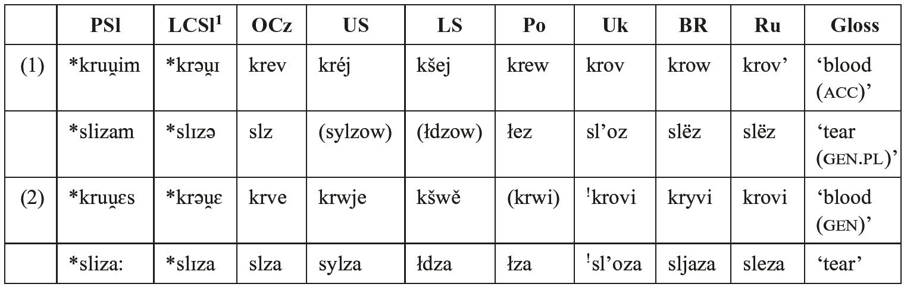

The outcomes in Ru differ from those in other ESl languages in that the strong-jer reflexes developed even in weak position. According to Isačenko (1970), Ru actually developed interconsonantal liquids, but they were eliminated, after a period of “trial and error,” by a morphological rule that eliminated vowel-zero alternations adjacent to consonant clusters.

In Slk and SSl, tautosyllabic *rɪ, *lɪ, *rǝ, *lǝ became syllabic sonorants, thus merging with tautosyllabic *ɪr, *ɪl, *ǝr, *ǝl (see 5.6). This happened regardless of whether *ɪ and *ǝ were strong (3) or weak (4) by Havlík’s Law. Exceptions can be found in western (Ohrid) OCS, where the normal strong-jer reflexes are sometimes found. (Some scholars have posited that W-OCS was a peripheral conservation of the same pattern seen in WSl and ESl; consequently, the syllabic reflexes in Slk and in other SSl dialects was a central LCSl innovation.)

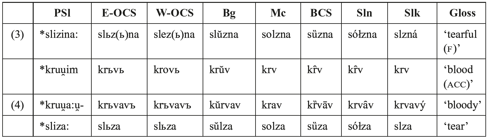

In OCS, the syllabic sonorants of either origin were spelled «rъ, rь» and «lъ, lь»; the jer-letter used was a matter of convention rather than phonology. In EBg dialects, syllabic sonorants were re-diphthongized, with their opening or closing phases reanalyzed as <i>ǝ</i> («ŭr, rŭ» and «ŭl, lŭ»). The tendency was for the opening phase to be reanalyzed before single consonants, and the closing phase before consonant clusters; however, this distribution has been greatly obscured by leveling. (In [3−4], only <i>krŭv</i> shows an unpredicted outcome.) Syllabic sonorants have been preserved in many WBg dialects. In Mc and W-SSl, <i>r̥</i> has been stable; *l̥ eventually re-diphthongized to <i>olˠ</i>, which gave Mc <i>ou̯</i> («ol»), BCS <i>u</i>, and Sln <i>ou̯</i> («ol»<i></i>, tonemic-system «oƚ»).

### 5.10. Compensatory lengthening

Jer-strengthening (5.8.1) was a form of compensatory lengthening (CL): as the weak jer decreased in duration, the strong jer increased. Other vowels also underwent CL before weak jers, at least in the central dialects of LCSl; the process has left no detectable trace in E-SSl, BR, or Ru. In the table, the first form in each set shows the reflex of a vowel lengthened in the CL environment; the second shows the reflex when the following vowel was not a jer. (For the reflexes of lengthened vowels, see 5.3)

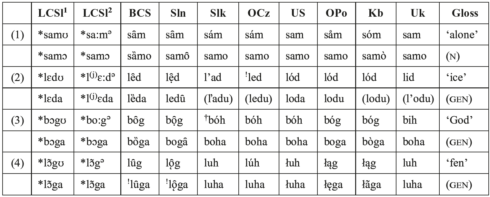

In Sorb, post-16c Po, and Uk, the results of CL can only be seen in the outcomes of LCSl¹ *ɛ (2) and *ɔ (3). In Sorb, the reflexes are either close mid-vowels or diphthongs <i>ie</i> and <i>uo</i> («ě» and «ó»). Similar diphthongs developed in Uk and are preserved in northern dialects. In WUk (including the standard language), <i>uo</i> fronted to <i>iü</i> (OUk «ю»)<i></i>, then lost its labialization; thus it merged with the reflex of <i>ie</i>, and also with the outcome of LCSl¹ *æ (*<i>mæra</i>: > OESl <i>měra</i> > Uk <i>mira</i> ‘measure’). (The reflex of LCSl¹ *i became lax <i>ɪ</i>.)

The regular distribution of CL reflexes has been disturbed by rampant analogy − hence the irregular outcomes (marked !). In various LCSl dialects, the implementation of new length depended on the accent type and the following consonant (see Timberlake 1983a). In WSl, another interfering factor was vowel abridgment, which occurred when the consonant between the target vowel and the weak jer was voiceless. This explains outcomes, especially common in peripheral Lech, where penultimate strong jers have null (quasi-weak jer) outcomes: LCSl¹ *<i>ɔu̯ɪsʊ</i> > Kb <i>óws</i> ‘oats’, cf. Po <i>owies</i>; LCSl¹ *<i>nɔgʊtɪ</i> > Kb <i>nokc</i>, cf. Po <i>nogieć</i>.

### 5.11. Lenition of *g

In a central zone of the post-migration CSl, PSl *g was lenited to *ɣ (1). The zone affected stretched from southern WSl (US, CzSlk) to non-peripheral ESl (Rusyn, Uk, BR, SRu); there was a southward extension from Slk to westernmost SSl (NWSln, WSln, and parts of Čak). The lenition also extended into proximal NRu dialects, but its effects can only be seen between vowels: <i>togo</i> > <i>toɣo</i> (⇒ <i>tovo</i>) ‘that (M/N.GEN.SG)’, but <i>gost’</i> ‘guest’.

Eventually, *ɣ backed to <i>ɦ</i> or <i>ʕ</i> in US, Cz, Slk, NWSln, Rusyn, Uk, and SWBR. This was definitely a secondary development; the reflex in those dialects was evidently still *ɣ when new devoicing rules developed after the jer-shift: /ɦ/ and /ʕ/ devoice to /x/ rather than /h/ or /ħ/ (2). Likewise, /x/ voices to [ɣ] rather than [ɦ] or [ʕ].

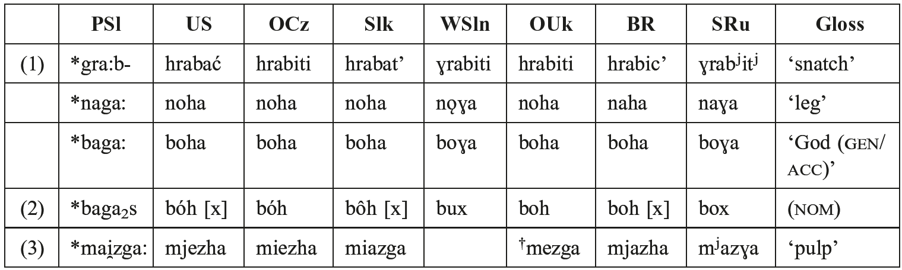

Given its dialect geography, the lenition of *g was undoubtedly a LCSl change. For absolute chronology, it can be noted that the southward extension must have developed while WSl and W-SSl still formed a continuum, i.e. probably before the early 10th c. Nevertheless, some scholars treat it as post-CSl because of names spelled with «g» instead of «h» in La sources and the earliest La-alphabet Sl texts (prior to the 13th c.): early OCz <i>bogu</i> ‘God (DAT.SG)’<i></i>. The rationale is that lenition could not be CSl if it happened after the jer-shift (5.8). This is a weak argument. First, «g» is a plausible way of rendering /ɣ/, especially when there is no contrast with /g/, and when «h» was used to render voiceless /x/, along with <i>ch</i>. (In Hebrew-alphabet Knaanic [Judeo-Czech] glosses from the same period, the *g reflex is spelled as velar <i>gimel</i> instead of <i>he</i> or <i>heth</i>.) Second, the argument is predicated on the false view that the end of LCSl was a punctiliar event. Granted that the jer-shift was the last “common” change, it took place over an extended period; its actualization ended in some dialects before beginning in others. The lenition of *g may have had a different chronology relative to the jer-shift in some dialects than others, but it was a development rooted in the laxness of CSl *g, reflected in the lenited reflexes of the velar palatalizations (3.2, 4.4−4.6.; see Andersen 1969, 1977).

As shown by Andersen (1969), the lenition began at a time when the CSl constraint against fricative-fricative clusters was still in force (see 3.1) − that is, before the jer-shift (5.8). This explains why *zg remained <i>zg</i> rather than becoming *<i>zh</i> in ECz, Slk, Uk, and SW BR (3), the dialects most central for − and hence first affected by − the change. (BR <i>zh</i> is pronounced [zg].) As the change radiated outward, it affected dialects where the fricative-fricative constraint had been lifted by the jer-shift; thus the reflex is <i>zɦ</i> in WCz and US dialects (but cf. US <i>mjezga</i>, Cz <i>†mízga</i>), and <i>zɣ</i> in the SSl and more peripheral ESl dialects in the lenition zone.

### 5.12. Contraction

Following QD (5.1), there was a tendency for Vi̯V sequences, found only over boundaries, to contract to V:. This was one of the changes that created new distinctions in length/tenseness, along with neoacute retraction (6.4.3) and compensatory lengthening (5.10). Contraction occurred throughout Sl, from Pb to Novg; it was most intensive in CzSk and W-SSl, and least in ESl. Nowhere did it reach its ultimate extent; variation between contracted and uncontracted forms still occurred in the historical period, to varying degrees in different grammatical categories. Some of the uncontracted formsmay have been resurrected by stem-leveling, but others were probably original lento forms that persisted as stylistic variants.

In OCS (1−2), four stages of contraction can be observed: 1. pre-contraction; 2. glide loss; 3. assimilation of the second vowel to the first; and 4. monosyllabification (contraction proper). Not every sequence went through all the stages. For example, the assimilation phase could not happen in *-ǝi̯i- or *ɨi̯i, since <i>ǝ</i> and <i>ɨ</i> could not follow other vowels.

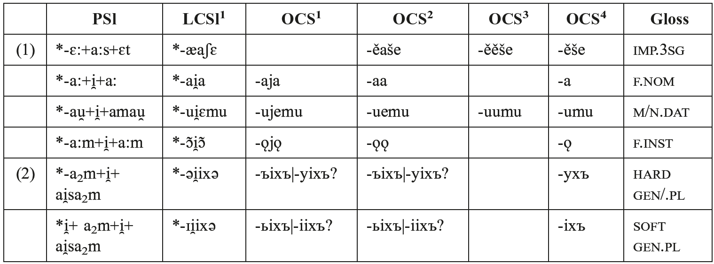

The forms in (2) are ambiguous, like other definite adjective endings formed on the bases *-ǝ- and soft *-ɪ-. As discussed in 3.5, OCS did not have the graphic means to differentiate *i and *i̯i. While the spellings «ъıи», «ии» are clearly disyllabic, they could convey either /ɨi̯i/, /ii̯i/ (OCS¹, with tense-jer reflexes) or /ɨi/, /ii/ (OCS²). Because /ɨ/ was spelled with digraphs («ъı» or «ъи», transliterated <i>y</i>), «ъı, ъи» can be read as disyllabic [ǝi̯i] or monosyllabic [ɨ]. The sequence <i>-ii-</i> («ии») could have arisen by jertensing (5.7) as well as assimilation (OCS³).

The reflexes of contraction were long. If the first vowel was LCSl¹ *ǝ or *ɪ (2), it tensed prior to contraction (see 5.7). When the two vowels were identical, they simply monosyllabified (3). The sequence *ɔjɛ (4) contracted as *ɔ: in SSl, but *ɛ: in WSl (with no secondary softening of the preceding consonant). When the two vowels differed in height, the reflex of contraction matched the more peripheral vowel, regardless of its order in the sequence, according to the following hierachy: <i>close-mid > (near-)open > open-mid</i> (5). The sequence *ii̯V₂ (6), insofar as it contracted at all, became *i̯V₂ or, in WSl, V₂ with preceding secondary softening.

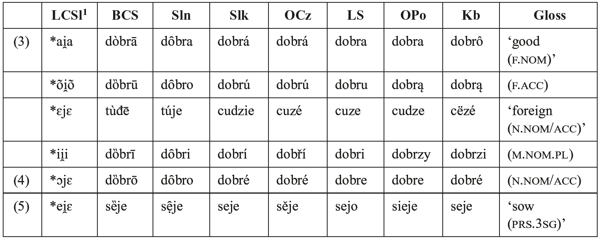

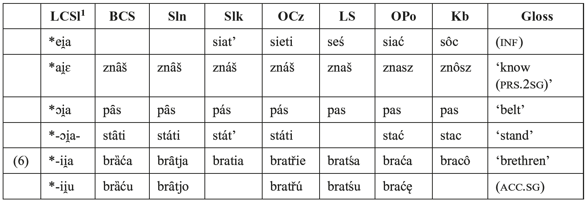

Uncontracted forms are also attested: BCS <i>sȅ jati</i>, Sln <i>sej̣áti</i> ‘sow’; BCS <i>pȍjās</i>, Sln <i>†pojȃs</i> ‘belt’; BCS <i>†stójati</i>, LS <i>stojaś</i>, OPo <i>stojać</i>, Kb <i>stojec</i> ‘stand’. These, plus the lacunae in the table, show the varying extent of implementation or morphological interference in the various dialects.

The contraction *ai̯ɛ > *-a:- in Leskien III verbs like <i>*znati, *znai̯ɛ</i>- ‘know’ opened the door to a major morphological development − the exaptation of the athematic PRS.1SG *<i>mi</i>. The contracted stem in *-a:- was reanalyzed as a theme comparable to the long vowel in athematic *<i>da</i>- ‘give’, *<i>jima</i>- ‘have’; then the thematic PRS.1SG *-<i>[image-glyph: open o / reversed c with tilde]</i> was replaced by *-<i>mi</i>. The innovation spread to other classes, to differing extents, in SSl and WSl (see Janda 1996). (The endings are given in their LCSl¹ form; the actual spread happened in historical times.)

## 6. Suprasegmental phonology

BaSl accentology has been characterized as the “most complex problem of IE historical grammar” (Watkins 1965: 117). The present account for the most part presents the approach of the Moscow Accentological School (Dybo, Illič-Svityč, and Zaliznjak). For brevity, Ba outcomes are only discussed if shared with Sl. BaSl was a dialect continuum; there is no warrant for assuming that PreSl accentual developments always marched in lockstep with Pre-Ba.

In the tables, <i>API</i> gives the accent paradigm (AP) reconstructed for PIE: <i>1 =</i> barytone (fixed on the stem); <i>1s =</i> fixed on a suffix; <i>2 =</i> oxytone (fixed on the ending). <i>APII</i> gives the accent pattern reconstructed for CSl (see 6.7−8): <i>a =</i> fixed on the stem; <i>A =</i> fixed on a suffix; <i>b =</i> fixed on the post-root syllable; <i>B =</i> fixed on the post-suffix syllable; <i>c =</i> mobile stress. Forms given in <i>[]</i> are supplied from other dialects. The glosses for the meaning of the protoform are based on the majority of attested forms. For BCS, the data come from <i>NŠto</i> (<i>Neo-Štokavian</i>), the BCS standard, cited in its Ek variety; and from <i>Čak (Čakavian)</i> (<i>Čak¹</i> = [Kalsbeek 1998]; <i>ˇCak²</i> = Orlec Orbanići [Houtzagers 1985];<i>Čak³ =</i> other).

### 6.1. Sl accentual correspondences

CSl had mobile ictus with distinctive tones under stress. The place of the ictus can be reconstructed from correspondences among the four zones that have preserved accentual mobility: W-SSl, E-SSl (Bg, some EMc), ESl, and peripheral Lech (Cen/NKb, Slc, and Pb). The earliest texts (MBg, OSb, MRu) that indicate ictus by supralinear marks date to the 14th−15th centuries. Elsewhere in Slavic, the stress has been bound to a non-final syllable − initial in Sorb, Cz, W/CenSlk, far SPo, and SKb; penultimate in Po, SWCz, NECz, and ESlk, and separately in peripheral WMc; and antepenultimate in most of Mc.

In LCSl, there were two tones − the <i>acute</i> (V̏), and the <i>non-acute</i>, traditionally known as the <i>circumflex</i> when long (V̑) and the <i>short falling</i> when short (V̏). A new accent, the <i>neoacute</i> (V́)<i></i>, arose in LCSl² (see 6.4.3). These tones can be reconstructed from the intonational distinctions preserved in BCS and Sln, with supplementary data from length or stress correlations in the non-tonemic languages.

#### 6.1.1. Acute

The acute accent appeared on syllables with long vowels or diphthongs that reflected laryngeal length (see 2.3), regardless of the stress. While it was originally non-prosodic (see 6.3.1, 6.3.3, 6.3.4), by LCSl it had become a low-high tone with a fall in the subsequent syllable. In the Slavic languages with accentual mobility, lexemes reconstructed with the CSl acute regularly have stress fixed on the root (1−3) or on a derivational suffix (5−6).

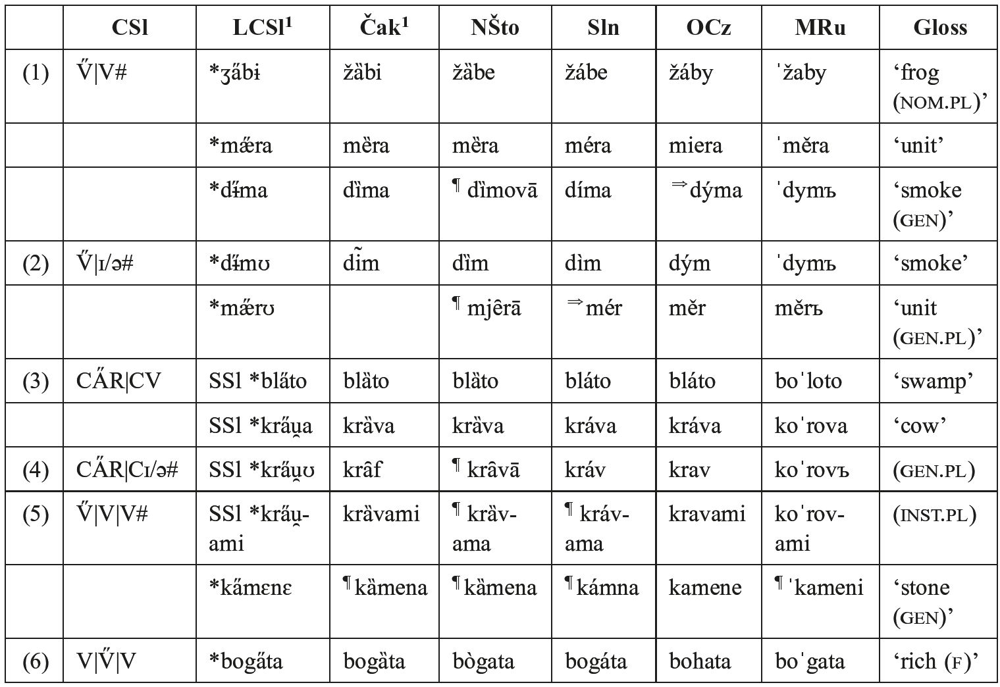

The acute does not have a distinct reflex in Lech, LS, most of Slk, and E-SSl. In W-SSl, lexemes reconstructed with root acutes have the same tone throughout the paradigm, though its length may differ in open (1, 3) and closed syllables (2, 4). Sln has a low-high accent: long V́, or short V́ in closed syllables. BCS has a high-low accent V̏, or long in closed syllables (2). In Čak <i>dĩm</i> [2], the accent is a rising tone of post-CSl origin. In NŠto <i>bògata</i> (6), the place of the ictus reflects the definitional NŠto change: non-initial stresses shifted leftwards, and the receiving syllables developed low-high tones − long V́, short V̀.

In P-Cz and P-WSlk, root acutes were reflected as length in disyllabic forms (1, 3), but not in polysyllables (5−6); cf. OCz <i>¶ kámen</i> ‘stone (NOM)’, <i>žabami</i> ‘frog (INST.PL)’. In forms that became monosyllabic by the jer-shift (5.8), acuted vowels were also shortened (2, 4); cf. OCz <i>blat</i> ‘swamp (GEN.PL)’. In the history of Czech, the resulting root allomorphy was usually leveled out in one direction or the other: OCz ⇒<i>dým</i> (2), but ⇒<i>mier</i> alongside regular <i>měr</i> (2).

In ESl, the acute has a distinct reflex only in internal open-vowel-sonorant diphthongs (see 5.5). The pleophonic outcome is stressed on the second syllable (COˈROC) when the root vowel had been acuted in CSl (3), but on the first (ˈCOROC) when it had been circumflexed (see 6.1.2). In the same environment, US has tense-vowel reflexes <i>lě, rě, ló, ró: bƚóto, wróna</i>.

#### 6.1.2. Non-acute

In LCSl, initial stressed syllables with non-acute accents had high-low tone if long (V̑), and high-low or level if short (V̏). On internal and final non-acuted syllables, only the ictus can be reconstructed. Lexemes reconstructed with non-acute belonged historically to mobile accent paradigms.

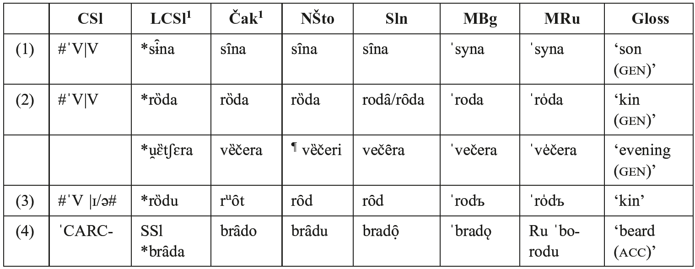

In W-SSl, non-acute accents are reflected as high-low tones − long 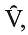 and short V̏ (1− 2). In Sln, the ictus has tended to shift rightwards from circumflexed syllables; though analogy has wreaked havoc on the distribution, generally the presence of a circumflex on a suffix or ending points to an original root circumflex. Similar rightward shifts occurred in Kaj in trisyllabic forms, and Bg in disyllabic. In BCS, short non-acute syllables were lengthened when closed by the jer-shift (3). In ESl, the only distinct reflex of the non-acute accents occurs in disyllabic roots from CSl open vowel-liquid diphthongs, where the stress falls on the first syllable (4) rather than the second (see 6.1.1). In WSl, the non-acute accents do not have distinct reflexes.

### 6.2. Prosodic features inherited from PIE

PreSl and PreBa shared several major innovations in prosody, as compared with other IE dialects (see 6.3). Early scholarship on BaSl accentology tried to reconstruct common BaSl acute and circumflex tones and to trace them back to PIE; hence the use of the terms <i>acute</i> and <i>circumflex</i>, coopted from Gk. These efforts were unavailing, as the acute proved to be a purely BaSl innovation that was non-tonal in its origin (see 6.3.1, 6.3.3, 6.3.4). Moreover, the tones <i>sensu stricto</i> evidently developed independently in CSl and Ba; the LCSl circumflex has a different history from its Li namesake (see 6.4.2). However, even if the PreSl and PreBa tones cannot be traced back to PIE, there were several crucial prosodic features that can − <i>ictus patterns</i> (6.2.1), <i>lengths</i> (6.2.2), and <i>accent valencies</i> (6.2.3).

#### 6.2.1. Ictus patterns

PreSl inherited two lexically specified ictus patterns from PIE − <i>barytone</i> (API = <i>1</i>), with stressed root or derivational suffix, and <i>oxytone</i> (API = <i>2</i>)<i></i>, with stressed desinence. (There is no clear trace of the PIE mobile pattern.) In the PSl oxytones, the stress originally fell on the final syllable of the desinence (1); later there was retraction if there was a laryngeal in the first syllable (see 6.3.2) or if the final syllable consisted solely of a jer. Relics of end-stressed desinences are found in various Sl languages: PSl *<i>-ɛi̯ˈma</i> > Čak¹ <i>držimȍ</i> ‘hold (PRS.1PL)’, Uk <i>bižymoˈ</i> ‘run (PRS.1PL)’, <i>prynesemo ˈ</i> ‘bring (PRS.1PL)’; PSl *<i>-ɛˈtɛ</i> > MRu <i>prinese</i>ˈ<i>te</i> ‘bring (PRS.2PL)’. Similarly, PSl *<i>-ɛˈmɛ, *-ɛˈtɛ</i> > Slk <i>nesieme</i> ‘carry (PRS.1PL)’, <i>nesiete</i> ‘carry (PRS.2PL)’, where the penultimate <i>ie</i> reflects *ɛ lengthened by neoacute retraction (see 6.4.3).

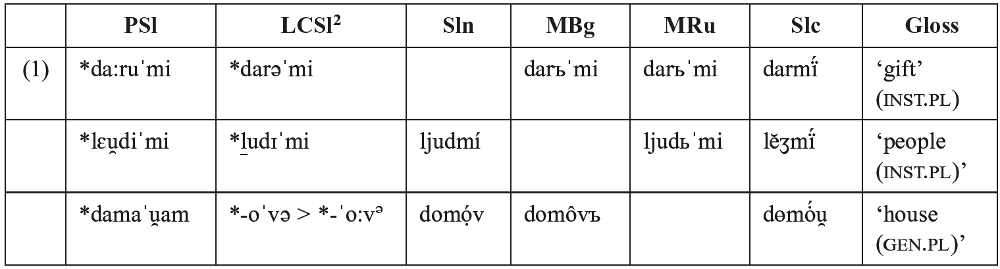

#### 6.2.2. Length

PreSl inherited PIE length from several sources. One was the lengthened grade in ablaut, seen in the root in (1−2) and the suffix in (6). Another was contraction in PreSl V.V, VHV, and Vi̯V sequences, as in the endings in (1, 3, 4, 7). A third source was lengthening before tautosyllabic laryngeals (see 2.2, 6.3.1). In other cases, PIE lengths do not have reconstructible origins; these are often ascribed to laryngeals as well. However, some of the roots in question originated in babbling (5−6), so it is doubtful <i>a priori</i> that they began as closed syllables. Other roots with obscure length may have been borrowed from non-IE languages (7). In any event, PreSl syllables with obscure length developed like those with laryngeal length (see 6.3.1), in contrast to those with length from ablaut or contraction.

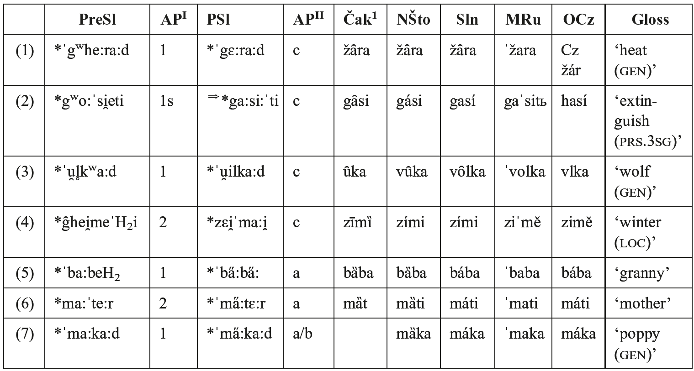

#### 6.2.3. Accent valency

In the reconstruction of the Moscow Accentological School (influenced by Jakobson’s 1963 concept of <i>enclinomena</i>), every BaSl morpheme had an inherent <i>valency −</i> higher {+}, also known as <i>dominant</i>; or lower {−}, also known as <i>recessive</i>. The valencies are hypothesized to be morphologizations of PIE suprasegmental features. Roots and suffixes that occurred solely in barytone lexemes were dominant and thus inherently stressable; whether they were actually stressed in a given lexeme depended on the concatenation of morphemes. Roots and suffixes that were stressless in oxytone forms were recessive and thus inherently unstressed. Prefixes, theme vowels, and endings were also recessive; they were only stressed by default, in forms where there was no dominant root or suffix. If a lexeme contained at least one dominant morpheme, it was inherently stressed <i>(orthotonic)</i>; if not, it was an <i>enclinomenon</i> with variable stress, depending on other elements in the phonological word.

### 6.3. Development of the acute and related changes in PreSl

#### 6.3.1. Acuting before tautosyllabic laryngeals

In PreSl, as in PBa, syllables became /+acute/ if their nuclei directly preceded tautosyllabic laryngeals; when the laryngeals disappeared (2.2), they underwent compensatory lengthening: VH >V̏:/__C. This first wave of acuting affected full-grade vowels (1) and zero-grade *i, *u, and syllabic sonorants (2). Vowels with length of obscure origin in non-ablauting roots also became /+acute/ (3), unlike those with length from ablaut or contraction. As the feature /+acute/ arose by assimilation to a laryngeal consonant, it is posited that it was initially a feature of phonation or voice quality reflecting assimilation to radical articulation − e.g. laryngealized or glottalized/checked. Some scholars argue that it was a glottal stop, which persisted in defiance of the usual treatment of coda stops (see 3.1.3).

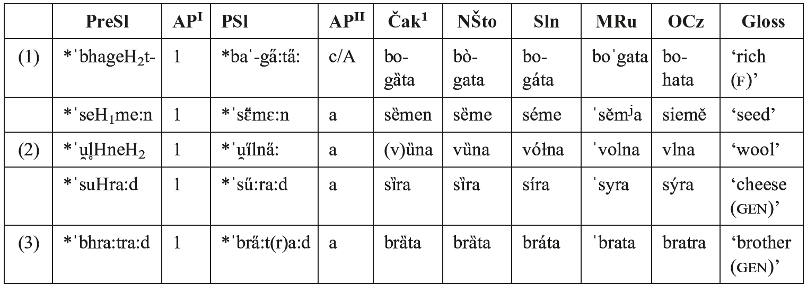

#### 6.3.2. Retraction of the ictus to acuted syllables

In PreSl, as in PBa, the ictus in oxytone lexemes retracted to preceding acuted syllables (1−2):V̏(H)ˈCₙV > ˈV̏CₙV. This change is known as <i>Hirt’s Law</i>. As originally formulated, the retraction was conditioned by “non-apophonic length” − in modern terms, compensatory length before laryngeals, as well as acutes of obscure origin, for which some scholars posit otherwise unreconstructible laryngeals (3).

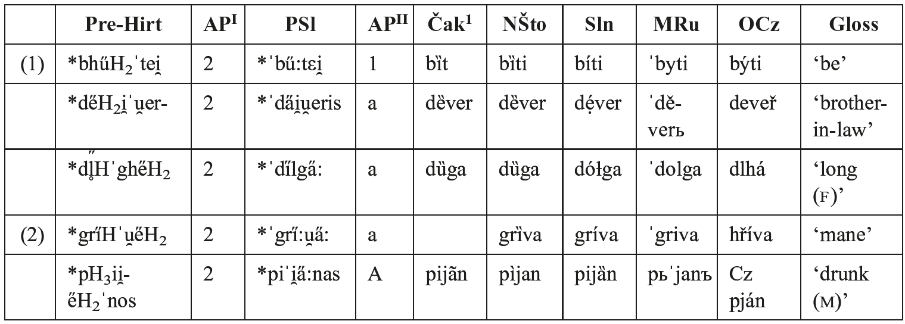

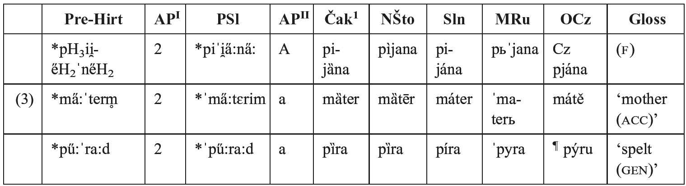

According to Illič-Svityč (1963), the retraction did not happen if the originally stressed syllable had its own tautosyllabic laryngeal; however, this hypothesis, based on Ltv outcomes, lacks Sl evidence and runs afoul of examples like (2).

While Hirt’s Law changed accent contours, it did not cause oxytone paradigms to become barytone (API = <i>1</i>). Ultimately, some lexemes did develop constant root stress by stem-leveling (1−4). Others remained oxytone (API = <i>2</i>), to become mobile in CSl (APII = <i>c</i>) (5). This implies that some of the disyllabic endings had final stress at the time of the change; otherwise, the given words would have become barytone across the board: **CVHCV̍ CV > **CV̍HCVCV.

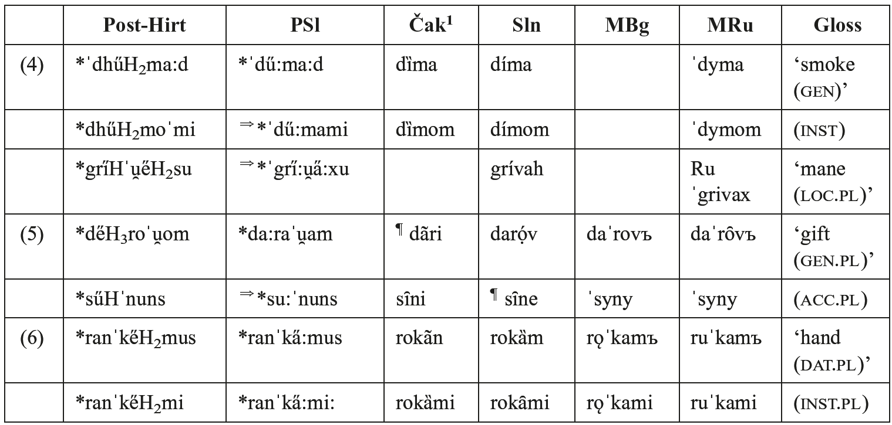

In (5), the use of the graphemes «ȏ» and «ω» in MRu, signifying <i>o</i> instead of <i>ɔ</i>, point to neoacute retraction from a stressed final jer (see 6.4.3); cf. Slc <i>sïnóu̯</i> ‘son (GEN.PL)’, with the reflex of *<i>o</i>: from retraction.

The penultimate stress in disyllabic endings of the <i>(i̯)ā-</i>stem declension (6) is a regular product of Hirt’s Law, since the <i>-eH₂</i> theme attracted the ictus. In the approach of the Moscow Accentological School, themes with laryngeals acquired {+} valencies, i.e. became inherently stressable. However, there are many exceptions, <i>u-</i>stem nouns with CVHC roots like *<i>deH₃ru̍s</i> (5), *<i>suHnu̍s</i> (5), *<i>piH₃ru̍s</i> ‘feast’, *<i>steH₂nu̍s</i> ‘camp’. Here the absence of the root acute is difficult to explain by analogy, since Hirt’s Law should have affected most of the paradigm, including all of the singular.

#### 6.3.3. Acuting before voiced stops

According to Winter’s Law, syllable nuclei immediately before PIE voiced non-aspirates became long and acuted in PreBa and PSl: V > V̋:/__(R)D (1). This change occurred after Hirt’s Law, since it did not condition any retraction of the ictus.

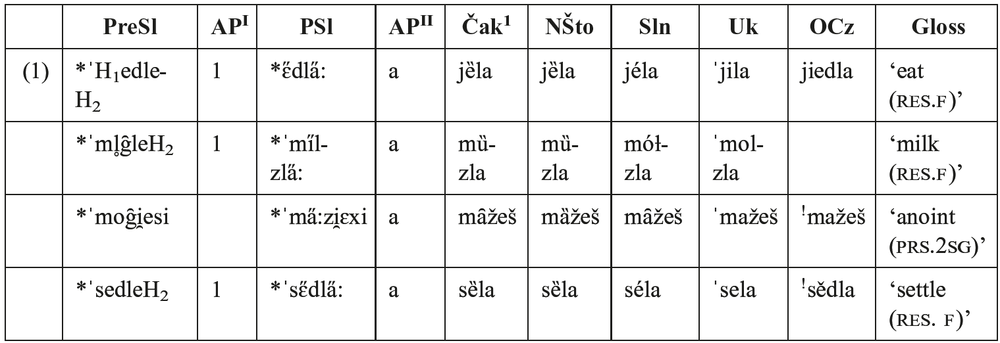

Sln <i>mȃžeš</i> shows the W-SSl “neocircumflex,” which replaced old acutes in thematic presents and certain other categories. Of the OCz forms, only <i>jiedla</i> is regular; <i>mažeš</i> has undergone shortening by analogy, but <i>sědla</i> for expected * <i>*siedla</i> is a true exception to Winter’s Law.

Winter’s Law is much honored in the breech. Many exceptions show lengthening without acuting (2), including cognates of forms cited above (3); the only evidence for the acute in these words comes from Ba. There are also counterexamples with short, non-acute vowels (4).

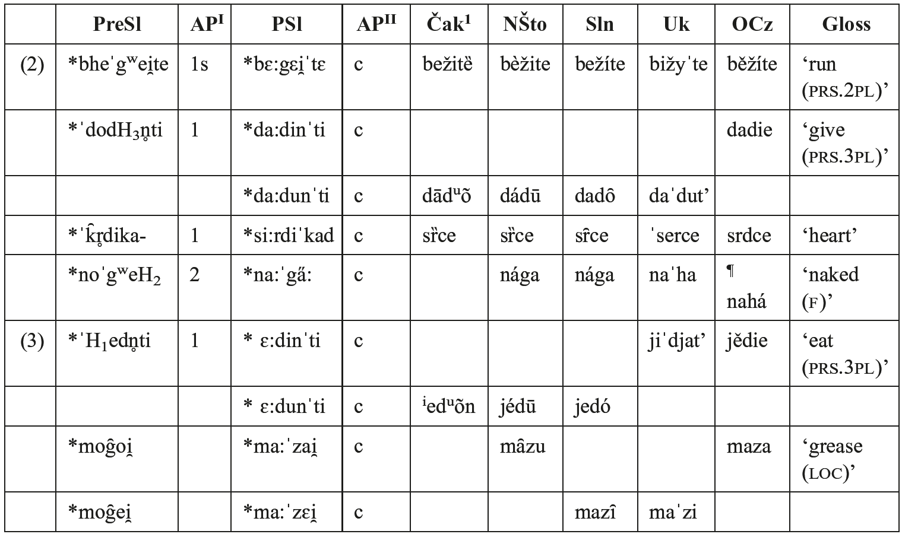

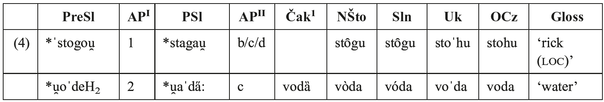

To explain the irregularities, it has been argued that Winter’s Law was blocked when the triggering consonant was followed by a nasal (5), a voiced stop, or a liquid (Dybo); however, there are also examples with the expected outcomes in these environments, as seen in (1). For other recalcitrant roots, it has been argued, often on shaky grounds, that they actually had aspirated stops (6) or else were later loanwords (7). Some of the argumentation has been casuistic, as when the *d in *-pod- (6) is declared to have arisen after Winter’s Law because it contradicts Winter’s Law (Derksen 2008: 180), despite the fact that it also occurs in Gk δεσπóζω ‘I rule’ [*di̯], νέποδες ‘descendants’. Given the many exceptions and the difficulties in explaining them, it might be worthwhile to explore the possibility that Winter’s Law was not pan-BaSl but the result of substratum interference or dialect changes that spread by (cross-)migrations.

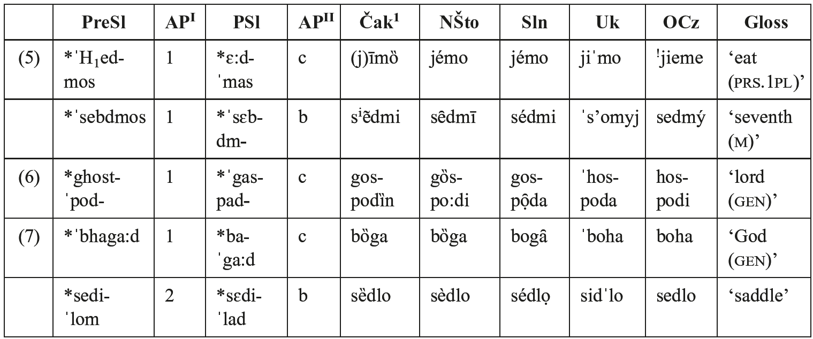

Winter’s Law is claimed to provide evidence for the Glottalic Theory (2.4). Putatively, the PIE egressives (the theory’s version of *b, *d, *g̑, *g, *gʷ) split into glottal and buccal portions, e.g. *t’ > *ʔd; the first part was identical to the *ʔ that the theory posits as the laryngeal reflex<i></i>. In LCSl, the laryngealized quality in Vʔ was reinterpreted as the acute accent. In this approach, forms lengthened before devoiced stops are regular: *H₁e̍ste ‘eat [PRS.2PL]’ from *H₁ed-; *pe:tsios ‘on foot’ from *ped-. In Winter’s formulation, such lengthening would have been blocked by PIE cluster assimilations and voicing rules; the irregular long vowels can be explained by morphological factors. In general, the idea that there were glottalic stops in PIE flies in the face of the compelling evidence for voiced unaspirated stops in all branches of IE; thus it conflicts with the Comparative Method in general. If glottalic stops were still present to condition BaSl prosodic changes, it is necessary to assume that they changed to voiced stops independently in every branch of PIE (see Jasanoff 2004b: 172).

#### 6.3.4. Acuting before heterosyllabic laryngeals

Another wave of acuting, sometimes called “Bezzenberger’s Law,” affected syllables with coda sonorants or glides followed by laryngeals (1): V > V:/+acute/ /__{R, J}HC. These sequences were originally disyllabic, so they did not attract the ictus by Hirt’s Law (see 6.3.2). It has been posited that the the vowels were also lengthened, since acuteness and length were coupled elsewhere; however, there must be principled uncertainty about this if non-final trimoraic diphthongs were shortened (see 2.2).

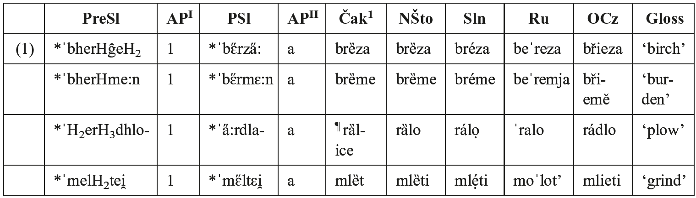

For Slavic, this phase of acuting is only well established for lexemes that were barytone (API = <i>1</i>), where the target syllable was stressed at the time of the change. Lexemes known to have been oxytone (API = <i>2</i>), where the target syllable was unstressed, belong to the CSl mobile pattern (APII = <i>c</i>); they have non-acuted roots (2) or stressed suffixes (3). In other cases, the PIE ictus pattern is unknown. The supposition that PreSl oxytones underwent Bezzenberger acuting rests solely, and therefore shakily, on Ba evidence. In (4), the most cited CVRH root, the sole evidence for acuting or, indeed, for a PIE laryngeal is the acute in Li <i>galvà, gálvą</i> (AP-3). (Some scholars posit that the root was not *<i>gal-</i> ‘bald’ but *<i>gho:lu-</i>; cf. Armenian <i>glux</i> ‘head’.)

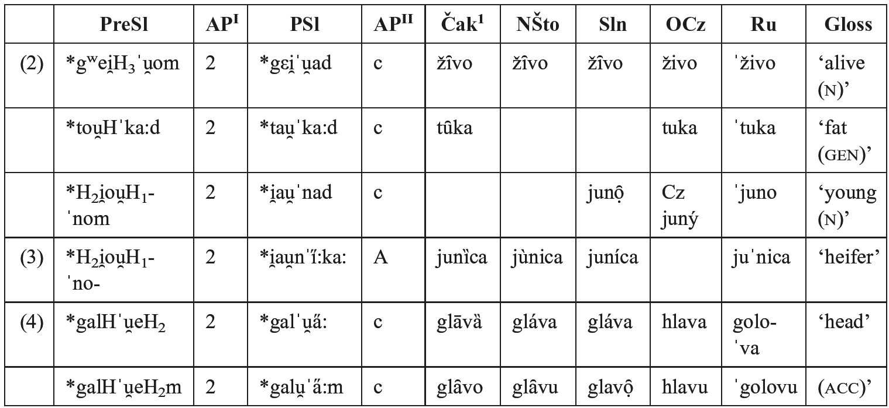

#### 6.3.5. Root acutes in oxytones

In PreSl, some lexemes affected by Hirt’s Law (6.3.2) became barytone (API = <i>1</i>; APII = <i>a</i>); in forms with disyllabic desinences, the non-root stress was leveled out (1). Other lexemes that had been eligible for Hirt’s Law remained oxytone (API = 2). In CSl, they became accentually mobile (APII = <i>c</i>), but they preserved no trace of the acute in forms with root stress (2), unlike their cognates in Li (AP-3, mobile with acuted roots: <i>stónas</i> ‘status’). Likewise, PreSl oxytones whose roots were eligible for the other waves of acuting (6.3.3−6.3.4) also became mobilia with non-acuted roots (3−4), again in contrast to Li AP-3 (<i>péntis</i> ‘axe poll’).

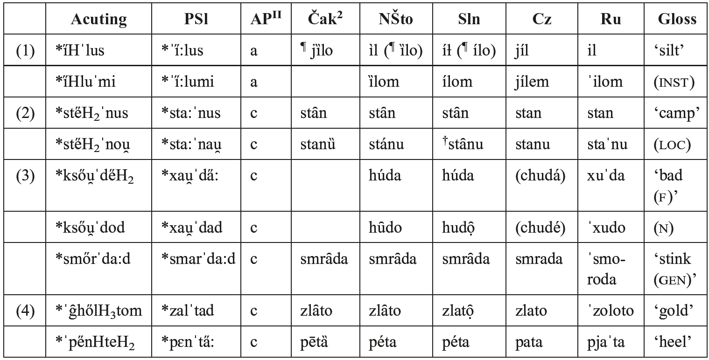

For (1), cf. the non-acuted root in Čak¹ <i>ilovȁčka</i>, Čak² <i>ilovãčka</i> ‘clayey soil’; Sln <i>ilováča</i> ‘bog’, <i>ilovàt</i> ‘silty’; Ru †<i>iˈlovyj</i>, <i>ˈilovyj</i> ‘silty’. For (3), cf. the non-acuted root in Čak¹ <i>hudȁ, hȗdo</i>.

To explain the mismatch between the acute in Li AP-3 and the non-acute in CSl AP-c, Meillet proposed that V̏ underwent metatony to V̑ in CSl by analogy to other oxytones (“Meillet’s Law”). Skeptical that an analogical change would been so consistent, Dybo (1979: 39) posits that root acutes in mobilia were eliminated by a general morphophonemic rule that assigned non-acute accents to all {−} morphemes: ROOT{−} → V/−acute/ (see 6.2.3, 6.4.1).

Other scholars have explained the discrepancy by sound changes plus analogy. According to Kortlandt (1975: 10−11), the heterosyllabic laryngeals that triggered Bezzenberger acuting (6.3.4) were lost earlier in pretonic than in post-tonic syllables: VRHCV-> (a) V:RˈCV-; (b) ˈVRHCV-. In barytone lexemes, the laryngeal was always posttonic (b), so there was consistent acuting. In oxytones, the loss of the pretonic laryngeal (a) created allomorphy; consequently, the post-tonic laryngeal was eliminated by stem-leveling before it could condition the acute. According to Jasanoff (2004a: 251−252), the glottalized (“acuted”) length that had developed before laryngeals lost its glottalization to become the CSl acute accent, but only under stress. Subsequently, in AP-c, the acutes in stressed root syllables were leveled out.

While these explanations are feasible, they all take it for granted that unstressed syllables were subject to acuting by the operation of Winter’s Law and Bezzenberger’s Law. However, the only evidence for this comes from Ba, which is insufficient reason to assume it for PreSl. Indeed, if pretonic syllables are excluded, Bezzenberger acuting is regular in PreSl, and there is no need to appeal to analogy: V > V̏/'__{R, J}HC. Oxytones would not have been affected, as they would not yet have had any stem-stressed forms (see 6.4.1).

### 6.4. CSl changes in suprasegmental phonology

In CSl, /+acute/ ceased to be a distinctive voice quality or phonation (see 6.3.1) and became a suprasegmental feature − rising tone in bimoraic syllables. In the absence of a rising tone, initial stressed syllables are reconstructed with level or falling tones (“circumflex” or “short falling”). Elsewhere in the word, the tonal quality of stressed non-acute syllables is unknown.

The development of the accent in CSl can be divided into three periods. In the first stage (<i>CSl¹</i>, 6.4.1), the ictus became linked with the presence or absence of an acute accent. In the second (<i>CSl²</i>, 6.4.2), the inherited barytone paradigm (API = <i>1</i>) split into stem-stressed and post-stem-stressed varieties (APII = <i>a</i> and <i>b</i>, respectively). In the third stage (6.4.3−6.4.4), the ictus was shifted from weak jers, with concomitant prosodic changes.

#### 6.4.1. Development of marginal accents

CSl¹ saw the rise of the acute as a rising tone − that is, low on the first mora and high on the second in bimoraic syllables. In a given phonological word, the rising tone − or the leftmost one, if there were several − became the focus of the intonational contour. Over time, acutes in syllables to the right of the intonational focus became less prominent and were eliminated. Non-acuted initial or medial syllables, which occurred in some words of the barytone paradigm, probably had level intonation.

In the oxytone paradigm, the ictus was, as expected, assigned to a rising tone if there was one in the desinence (1). In the absence of a rising tone, the word was phonologically unstressed. The ictus, which had been final in PreSl, was assigned by default to one of the marginal syllables in the phonological word − to the rightmost, if the desinence was disyllabic (2) (see also 6.2.1) or if there was an enclitic (3); and otherwise to the leftmost, which could be the first syllable of the lexeme (4) or a proclitic (5). The tone associated with marginal ictus was falling − that is, high on the first mora of a bimoraic sequence. The given pattern is known as <i>AP-c</i>.

In the approach of the Moscow Accentological School, these changes are presented as a morphological rule, according to which the ictus was fixed on the leftmost {+} morpheme. In enclinomena, which had no {−} morphemes, the ictus was assigned by default to one of the marginal syllables, as described. (In the table, the CSl¹ segmental units are given at the PSl stage, as the relative chronology of the ictus shifts is unknown.)

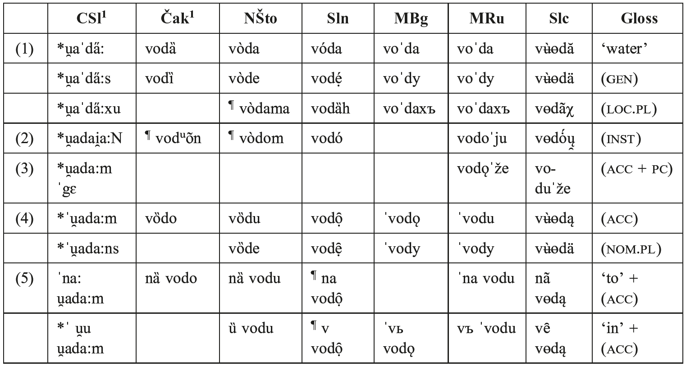

The CSl¹ pattern is preserved in Čak, MBg and MRu. For LOC.PL (1), cf. Čak² <i>vodãh</i>; for NOM.PL (2), cf. Čak² <i>võdi</i>. MRu <i>vъ vo̍du</i> is not an exception, as there was no vowel in the preposition; the letter «ъ» was an orthographic convention. In NŠto, the forms with stressed root <i>ò</i> in (1−2) reflect the leftward shift from non-initial syllables, which occurred in that dialect from the 14th c.; prior to that, the accent had been on the first syllable of the desinence. The NŠto forms with stressed initial <i>ȍ</i> or stress on the preposition reflect an unshifted circumflex accent. In Sln, non-initial rising tones regularly retracted from open final syllables <i>(vóda)</i>, while the initial falling tones moved right; stress shifts onto prepositions were eliminated. In Slc, the stress retracted from final open syllables, but remained on endings that had been disyllabic (<i>vɵdãχ</i>).

The shift of the stress onto proclitics, functioning as the leftmost syllables, is sometimes known as <i>Šaxmatov’s Law</i>; the shift onto enclitics, functioning as the rightmost syllables, is called the <i>Law of Vasil’ev-Dolobko</i>. The alternations created by these changes are well attested in medieval SSl and ESl manuscripts: MRu <i>ˈpočalъ</i> ‘begin (RES.M)’, but <i>počalъˈsja</i> REFL.ACC). The Vasil’ev-Dolobko pattern is preserved in Bg mobile-stress nouns with enclitic definite articles (<i>glas</i> ‘voice’~<i>glaˈsŭt</i> [DEF]; <i>ˈesen</i> ‘autumn’~<i>esenˈta</i> [DEF]) and in lexicalized relics, e.g. adverbs with the particle *<i>si</i> (5).

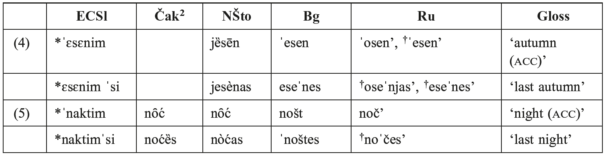

#### 6.4.2. Law of Dybo-Illič-Svityč

In CSl², the barytone pattern, consisting of lexemes with {+} roots or derivational suffixes, was split into two AP’s. If the stressed syllable was acuted, the ictus stayed put (1). The lexemes with this pattern formed CSl AP-a (usually corresponding to Li AP-1, with acute on the stem). However, if the stressed syllable was non-acuted, the ictus advanced to the following syllable (2); this created AP-b, with columnar post-stem stress − not to be confused with fixed final ictus, since the stress fell on the penultimate in disyllabic desinences.

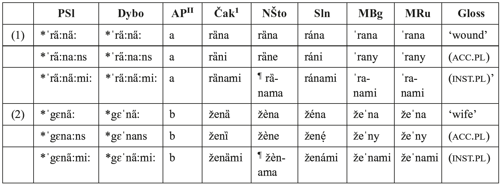

#### 6.4.3. Neoacute retraction

The <i>neoacute</i> accent in LCSl arose in tandem with leftward shifts of the ictus. Such retraction regularly occurred in AP-b when the stressed vowel was a weak jer (see 5.8) − a change called <i>Stang’s Law</i> (1−2): VˈCₙ{Ῐ, [image-glyph: schwa with breve]} > ˈVCₙ. As a result, in AP-b the intonation alternated between forms with the neoacute in the final stem syllable and forms with stressed non-reduced vowels in the post-stem syllable (2). In addition, the neoacute developed when the ictus was retracted from long vowels that had arisen by contraction (3), or when the initial syllable was contracted (4) (see 5.12). Retractions also occurred, for reasons that are not clear, in specific morphological contexts − e.g. in AP-b feminine nouns with the suffix <i>i̯-a:-</i> (5); and in the present of AP-b <i>e-</i> and <i>i̯e</i>-theme verbs (Leskien I and III), apart from the 1SG, which retained post-root stress (6).

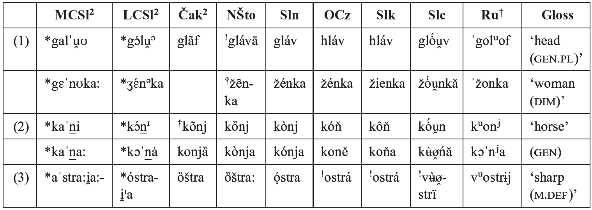

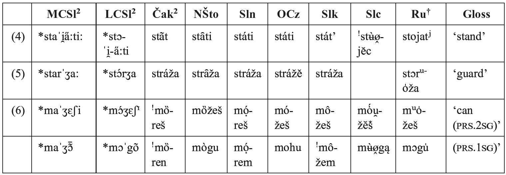

The reflexes of the neoacute fall into several zones. In Sln, the neoacute merged with the acute, a rising tone − long V́, or short V ̀ in final closed syllables. Neoacuted mid-vowels have close-mid reflexes in old bimoraic syllables (<i>é̩, ọ́, ǫ́</i>).

In Čak, Kaj, and some archaic Što dialects, the neoacute became a distinct long rising tone (V́ or Ṽ) on syllables that were bimoraic at the time of the retraction (1). In other dialects of Što, it merged with the circumflex as long falling V̑ on old bimoraic syllables (1). Throughout BCS, the neoacute on monomoraic syllables merged with the acute as short falling V̏ (2). The regular outcomes in BCS have been somewhat obscured by the tendency for short vowels to lengthen before sonorants: Čak <i>kõnj</i> (2)<i></i>, NŠto <i>žȇnka</i> (1).

In WSl, the neoacute is reflected as a long vowel in syllables that were bimoraic at the time of the retraction. In Cz and Slk, long vowels are written as V́; the neoacuted midvowels yielded the diphthongs <i>ie</i> and <i>uo</i> (Cz <i>í</i> /i:/ and <i>ů</i> /u:/; Slk <i>ie</i> and <i>ô</i> /uo/)<i></i>. In Slc, where stressed vowels generally became bimoraic, the neoacute reflex became trimoraic (written Ṽ or V́V̯).

In ESl, length reflexes have generally been lost. However, in some MRu and isolated modern Ru dialects, neoacuted (lengthened) *ó is reflected as a falling diphthong [ᵘo] or as a close-mid vowel [o] (written as <i>ȏ, ω</i> in some MRu manuscripts).

#### 6.4.4. Advancement of stress from reduced vowels

Some AP-c lexemes had stressed jers in their initial syllables. When these jers were reduced (5.8), the ictus shifted to the right, with preservation of the falling accent (1). By contrast, in AP-b final accents were reflected as short acutes − BCS, Sln V̀ (2).

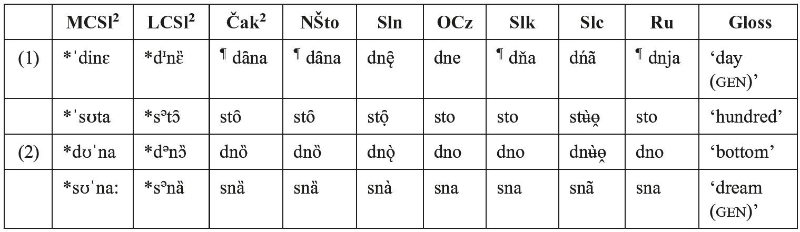

## 7. Sectional references

1. <i>Languages</i>: see also the chapter introductions in Comrie and Corbett (1993). <i>Silesian</i>: see Hannan 1996. <i>Kb as a Po dialect</i>: e.g. Topolińska 1974. <i>Slc</i>: Lorentz 1925; Topolińska 1974. <i>Rusyn</i>: see Birnbaum 1983, Kushko 2007, and Pugh 2007. <i>Novg</i>: Zaliznjak 2004.

1.1. <i>CSl and PSl</i>: Birnbaum 1975: 1−5; 1987b; Andersen 1986; 1996: 183−184. The term <i>Proto-Slavonic</i> is used for ‘CSl’ in the chapters in Comrie and Corbett 1993. <i>Lower limit: ca. 1000 BCE</i>: Van Wijk (1956: 7); <i>ca. 300 CE</i>: Lunt (2001: 182). <i>Upper limit</i>: Birnbaum 1975: 3; Andersen 1985: 78−80. <i>Urheimat debate</i>: for overviews, see Filin 1962: 83−151. Stanislav 1967: 110; Birnbaum 1975: 5−7; Schenker 1995: 1−8; Barford 2001: 15, 22; Heather 2011: 12−21, 388−392; Pronk-Tiethoff 2013: 59−64. See also the map in Barford 2001: 332. <i>Lusatian culture</i>: Dvornik 1956: 8−13; rebutted by Schenker 1995: 2. <i>Herodotus and Aristophanes</i>: Dvornik 1956: 13; Mareš 1965: 20. <i>Term *slau̯ɛ:n(isk)-</i>: Filin 1962: 55−57; Vasmer 1986 <i>slavjanin. Exonym ‘German’</i>: Vasmer 1986 <i>nemec</i>; ÈSSJa *němьcь<i>. Byzantine sources</i>: Filin 1962: 53−55; Schenker 1995: 9, 15−18<i>. Veneti and Venedi</i>: Filin 1962: 50−53; Schenker 1995: 3−5<i>. Venäjä</i>: Mikkola 1938: 13; Xaburgaev 1980: 61. <i>Elite-transfer model</i>: Heather 2011: 23.

1.1.1. <i>Localization</i>: see also 1.1.2 on the <i>Urheimat</i> debate<i></i>. See the cautionary words in Barford 2001: 14−15. <i>No maritime terms</i>: Filin 1962: 117−118. <i>Tree terms</i>: Filin 1962: 143−147; Friedrich 1970; Gołąb 1992: 272−280 (map 306). <i>‘Hazel grouse’ and ‘partridge’</i>: Andersen 1998b. <i>Limited alpine vocabulary</i>: Filin 1962: 119−121; Lenček 1982: 34. <i>Chamois (Rupicapra)</i>: denoted by a term derived from ‘goat’ in Po; ‘wild’ + ‘goat’ in Bg, Mc, BCS, and Uk; by a German loanword in Sln, Slk, and Cz; and by the inherited Sl (including OESl) word for ‘roe deer (<i>Capreolus capreolus</i>)’ in BR and Ru. <i>Language contacts</i>: Filin 1962: 134−143; Shevelov 1965: 613−622; Kiparsky 1975: 54−61; Gołąb 1992: 310−414; Pronk-Tiethoff 2013. <i>Gmc autonym > ‘foreign’</i>: Vasmer <i>čužoj. ‘Spali’ > ‘giant’</i>: Dvornik 1956: 22−23; Filin 1962: 58. <i>Ethnonyms ‘Serb’ and ‘Croat’</i>: Dvornik 1956: 26−27; Xaburgaev 1980: 67, 68; Vasmer 1986 <i>serb, xorvat</i>; Barford 2001: 15; Heather 2011: 406. <i>Borrowing of</i> *xu:z- and ‘ruler’: ÈSSJa *chyzina, *chyzъ, *chyža, *chyžina; Vasmer <i>xižina. Przework, Wielbark, and Cherniakhovo cultures</i>: Barford 2001: 24−25, 38−42, 332. <i>Hydronyms</i>: Toporov and Trubačev [1962] 2009; Xaburgaev 1980: 55−57; Gołąb 1992: 236−267.

1.1.2. <i>Migration Period: Wave of advance model</i>: Heather 2011: 22. <i>Adoption of CSl</i>: Barford 2001: 49. <i>Korchak Culture</i>: J. Hermann in Hermann (ed.) 1985: 21−32; Barford 2001: 47−49, 53−56, 63, 65−66; Heather 2011: 448−449. <i>Migrations</i>: Menges 1953; Dvornik 1956: 3−45; Trubačev 1991; Gołąb 1992: 236−309; Schenker 1995: 1−60; Barford 2001: 45−88; Curta 2001; Heather 2010: 386−451. <i>SE Europe</i>: Vasmer 1941; Dvornik 1956: 34−36, 40−45; Vlasto 1970: 3−12, 185−186; Schenker 1995: 15−18; Heather 2011: 399−406, 423−424. <i>Eastern Alps</i>: Lenček 1982: 27−30; Schenker 1995: 22−25. <i>Milingoi and Ezeritai</i>: Vasmer 1941: 16−18; Heather 2011: 404, 423. <i>Bulgars</i>: Dvornik 1956: 70−72; Schenker 1995: 19−21; Heather 2011: 403−404. <i>Central Europe</i>: Dvornik 1956: 32−34; Schenker 1995: 21−22, 46−48; Andersen 1999: 56−59. <i>Sclaveni and Herulians</i>: Dvornik 1956: 34; Barford 2001: 53 (with caution). <i>Slavophones in Eastern Germany</i>: Jeżowa 1961; Hermann (ed.) 1985: 7−65. <i>Avars</i>: Dvornik 1956: 36−40; Schenker 1995: 10−11; Heather 2011: 400−401<i>. ‘Avar’ > ‘giant’</i>: Schenker 1995: 11. <i>Occidentalization of the Sorbs</i>: Andersen 1999: 59. <i>Serbs and Croats</i>: Dvornik 1956: 27−28, 62− 63; Vlasto 1970: 185; Schenker 1995: 19; Barford 2001: 73−75<i></i>; Heather 2011: 404− 406<i>. P-Lech migrations</i>: Barford 2001: 53−55, 63; Heather 2011: 410−414. <i>Mogiła</i> and <i>Sukow-Dziedzice cultures</i>: Barford 2001: 53−55, 65−66; Heather 2011: 412−413. <i>PreESl migrations</i>: Schenker 1995: 53−54; Barford 2001: 96−101<i></i>.

1.2. <i>Traditions of writing</i>: see the chapters in Schenker and Stankiewicz (eds.) 1980. <i>Cyril and Methodius</i>: Vlasto 1970: 25−82; Schenker 1995: 25−43; Tachiaios 2001. <i>Kiev Folia</i>: Schaeken 1987; <i>Freising Fragments</i>: Kolarič 1968; Bernik 1993. <i>Pb</i>: Olesch 1967; Polański 1993.

1.3. <i>Correspondence sets</i>: the data have been culled from the following sources: <i>OCS</i> − SJS, SS; <i>OESl</i> − Srez; <i>OCz</i> − VW; <i>OPo</i> − SJP, SP16; <i>BCS −</i> Rječnik, HJP; <i>Bg −</i> Gerov, RBE; <i>BR</i>: TSBM; <i>Cz −</i> PřSJČ; <i>Kb −</i> Gołąbek, Ramułt; <i>LS</i>: Muka; <i>MBg −</i> Miklosich; <i>Mc −</i> DRMJa; <i>Novg</i>: Zaliznjak 2004; <i>OSb −</i> Daničić, Miklosich, Rječnik; <i>Pb −</i> Olesch; <i>Po −</i> SJP; <i>Ru</i>: Vasmer 1986; <i>Slc</i>: Lorentz; <i>Slk −</i> Slovníky<i>; Sln −</i> Pleteršnik, SSKJ; Hrinčenko, SUM; <i>US</i>: Kral. <i>Uk</i>. The main etymological dictionaries used to corroborate reconstructions were ÈSSJa, IEW, and Vasmer 1986. Also consulted: AHD (for PIE laryngeals), Derksen 2008, BER, Bezlaj, Boryś, Brückner, ESUM, Machek, SEJDP, and Skok.

2. <i>PSl and PreSl</i>: Andersen 1986; 1996: 183−184. <i>BaSl branch or clade</i>: Meillet [1922] 1967: 59−67; Vaillant 1950: 13−15; Szemerényi 1957; Ivanov and Toporov 1958; Bräuer 1961: 14−20; Shevelov 1965: 613−614; Birnbaum 1970; 1975: 18−21; Beekes 1995: 22−23; Schenker 1995: 70; Andersen 1996: 62−63, 187−188; Fortson 2004: 364.

2.1. <i>PSl vowels and glides</i>: Vaillant 1950: 106−122; Shevelov 1965: 22−26, 150−152, 164−166; Schenker 1993: 63−64, 66−67; 1995: 77−78, 81−82; Lunt 2001: 192. <i>Baltic vocalism</i>: Endzelīns 1971: 32−33, 51. <i>PSl from Ba model</i>: see also Xaburgaev 1980: 49−50. (1d) SJS, Srez <i>mati</i>; VW <i>matě</i>; SP16 <i>macierz</i>; (2a) SJS <i>bьrati</i>, Srez <i>brati</i>, VW <i>bráti</i>, SP16 <i>brać</i>.

2.1.1. <i>Initial *e ~ *a</i>: Andersen 1996. *<i>ed-sk-e</i>: ibid.: 117−118. <i>Backing of *ɛ before *u̯</i>: Shevelov 1965: 357−359. <i>Sequence *ei̯e</i>: Shevelov 1965: 359−360; Lunt 2001: 202.

2.2. <i>Laryngeal reflexes</i>: Shevelov 1965: 28−31; Schenker 1995: 77−78; Lunt 2001: 190−191. <i>Trimoraic shortening</i>: Shevelov 1965: 24; Jasanoff 1983a, 1983b, 2004a, 2004b, 2011; Feldstein 2003: 251. See also Collinge 1985: 127−131 on “Osthoff’s Law.” <i>Length in final syllables</i>: Jasanoff 2004a: 249−251. <i>Alternative approaches</i>: Mareš 1965; Shevelov 1965: 24; Lunt 2001: 193; Orr 2000: 36−37. (2a−b) <i>OPo</i>: BZ <i>córy</i>, <i>jeśm</i>; (4) <i>OCS</i>: SJS, SS <i>orati</i>.

2.3. <i>Syllabic sonorants</i>: Vaillant 1950: 167−177; Shevelov 1964: 96−98; Stang 1966: 77−82; Lunt 2001: 191; Collins forthcoming. (1a) <i>OCS</i>: SJS, SS <i>mati; OESl</i>: Srez <i>mati; OCz</i>: VW <i>matě; OPo</i> SP16 <i>macierz</i>.

2.3.1. *<i>uR after velars</i>: e.g. Kuryłowicz 1956: 235. *<i>uR adjacent to low tonality</i>: Shevelov 1965: 90. *<i>uR after labiovelars</i>: Vaillant 1950: 172; Kortlandt 1994, 2007, 2008; Beekes 1995: 136, n. 1. *<i>iR after palatovelars</i>: Kuryłowicz 1956: 235; Andersen 2003: 60.

2.3.2. <i>Language contact</i>: Andersen 2003: 59−62. <i>Expressiva</i>: Stang 1966: 79; Andersen 2003: 60. <i>Sl ‘hundred’</i>: see IEW *dek̑m̥; Vasmer 1986 <i>sto</i>; Shevelov 1965: 90−91.

2.3.3. <i>Perceptual ambiguity</i>: see Collins forthcoming. <i>Phonetics of syllabic sonorants</i>: Wiese 1996; Toft 2002; Fougeron and Ridouane 2008.

2.4. <i>Glottalic approaches</i>: see e.g. Kortlandt 1978, 1985, 2006; Derksen 2008.

2.4.1. <i>Aspirates</i>: Vaillant 1950: 24−26; Bräuer 1961: 164−166, 167−169; Shevelov 1964: 32−34; Schenker 1993: 65; 1995: 79−80; Lunt 2001: 190. (3c) ÈSSJa *<i>jьgo</i>.

2.4.2. <i>Labiovelars</i>: Vaillant 1950: 24−26; Bräuer 1961: 165, 168, 169; Shevelov 1965: 123−126; Schenker 1993: 65; 1995: 80; Lunt 2001: 190.

2.4.3. <i>Palatovelars</i>: Vaillant 1950: 34−35; Bernštejn 1961: 151, 154; Bräuer 1961: 165, 167, 168; Shevelov 1965: 139−141; Endzelīns 1971: 50−51, 56; Schenker 1993: 65; 1995: 80; Lunt 2001: 193; Andersen 2003: 53. <i>Gutteralwechsel</i>: Andersen 1996: 106− 107; 2003: 54−58; 2009: 25. See also Vaillant 1950: 36−38; Bernštejn 1961: 152−154; Bräuer 1961: 169−172; Shevelov 1965: 141−145; Beekes 1995: 112. <i>Depalatalization before sonorants</i>: e.g. Beekes 1995: 112.

2.5. <i>RUKI</i>: Andersen 1968, 2003: 58−59. See also Vaillant 1950: 28−32; Meillet 1951: 26−28; 80−81; Bernštejn 1961: 160−165; Bräuer 1961: 178−181; Shevelov 1965: 127− 131; Schenker 1993: 65−66; 1995: 80−81; Lunt 2001: 191, 194. <i>Articulation of *s₂: Palatal</i>: Meillet 1951, Vaillant 1950, Bräuer 1961, Lunt 2001, Schenker 1993: 65. <i>Retroflex</i>: Andersen 1968; 2009: 24; Schenker 1995. <i>Swedish sj</i>: Ladefoged and Maddieson 1996: 171−172, 330.

2.5.1. <i>Initial *x</i>: Bräuer 1961: 183−184; Shevelov 1965: 134−136.

2.5.2. <i>Affective extension</i>: Vaillant 1950: 31; Shevelov 1965: 132−134; Priestly 1978. <i>Analogical extension</i>: Vaillant 1950: 30−31; Shevelov 1965: 131−132; Sławski 1974− 1979, 2: 31−32, 34, 71. <i>Consonant-stem LOC.PL</i>: Węglarz 1933; Čornejová 2007.

2.6. <i>New ablaut grades</i>: Vaillant 1950: 299−300; Shevelov 1965: 96−98; Schenker 1993: 64−65; 1995: 79; Lunt 2001: 209. (1) <i>žьrǫtъ</i>: SJS <i>žrьti</i>; (2) <i>načьnǫtъ, načętъ</i>: SJS <i>načęti</i>; (3a) <i>berǫtъ</i>: SJS <i>bьrati</i>; (4) <i>sъzьritъ</i>: SJS <i>sъzrěti</i>; (5) <i>zovǫtъ</i>: SJS <i>zъvati</i>; (6) <i>vъznьzъ</i>: SJS <i>vъznisti</i>.

2.7.1. <i>Double-Dental Rule</i>: Vaillant 1950: 101−102; Shevelov 1965: 182; Fortson 2004: 69.

2.7.2. <i>Degemination</i>: Vaillant 1950: 80−81, 98−99; Meillet 1951: 108; Bräuer 1961: 202−203; Shevelov 1965: 181−183; Fortson 2004: 69−70. (3) <i>OPo</i>: BZ <i>jeś</i>.

2.7.3. <i>Sibilant + *r</i>: Vaillant 1950: 76−77; Meillet 1951: 109−111; Bräuer 1961: 292; Shevelov 1965: 200−201; Endzelīns 1971: 73. (2b) <i>Ru</i>: Vasmer 1986 <i>puzdro</i>; (4) <i>OPo</i>: SSP <i>(Izdraelski). *zark</i>: BER <i>zdrak</i>; DRMJa <i>zdrak</i>.

2.7.4. <i>Lidén’s Law</i>: Lidén 1899; Vaillant 1950: 94−95; Bräuer 1961: 201; Shevelov 1965: 196−197; Endzelīns 1971: 67.

3. <i>Early Common Slavic</i>: Andersen’s (1986: 72) “<i>Early Slavic I</i>, the period of tautosyllabic vowel chains.” Schenker (1993) calls this period “Early Proto-Slavonic.” <i>Law of Open Syllables</i>: see Lunt 1956: 309; Birnbaum 1975: 139−141; 1987a: 105−108; Schenker 1993: 67−68; 1995: 82. <i>Law of Syllabic Synharmony</i>: Jakobson 1962; Lunt 1956: 309; Birnbaum 1975: 140, 141−142; 1987a: 106, 108−109; Schenker 1993: 67; 1995: 82.

3.1. <i>Syllable structure</i>: (1) <i>OCS</i>: SJS <i>izostriti; OESl</i>: Srez <i>izostriti</i>.

3.1.1. <i>Syncope of stops</i>: Vaillant 1950: 79−80, 81−85; Shevelov 1965: 187−196; Schenker 1993: 68; 1995: 91−92. (4d) <i>OCS</i>: SJS <i>dati; OESl</i>: Srez <i>dati; OCz</i>: VW <i>dáti</i>; OPo BZ <i>dam</i>.

3.1.2. <i>Nasal + nasal clusters</i>: Shevelov 1965: 323; Lunt 2001: 198. (1) OPo <i>jimię</i>: SSP.

3.1.3. <i>Coda obstruents</i>: Vaillant 1950: 200−202; Bernštejn 1961: 184−185; Shevelov 1965: 226−227; Schenker 1995: 82; Lunt 2001: 197. <i>1SG pronoun</i>: Hamp 1983; Andersen 1996: 148−149. <i>Sandhi: Aorist</i>: Lunt 2001: 103; Andersen 2013: 26−27, 29. <i>Suffix -oš-</i>: Shevelov 1965: 228; Sƚawski 1974−1979, 1: 78. (1a) <i>OCS</i>: SJS <i>byti. OESl</i>: Srez <i>byti</i>. OCz: VW <i>budi; OPo</i>: BZ <i>bądź</i>. (1c) <i>OCS</i>: SJS <i>viděti; OESl</i>: Srez <i>viděti; OCz</i>: VW <i>procútiti; OPo</i>: Klemenszewicz, Lehr-Spławiński, and Urbańczyk (eds.) 1964: 381. (3) <i>OCS</i>: Lunt 2001: 137−138; <i>OESl</i>: Zaliznjak 2004: 715; <i>OCz</i>: VW <i>býti; OPo</i>: Klemenszewicz, Lehr-Spławiński, and Urbańczyk (eds.) 1964: 363. (4−5) Lunt 2001: 103, 138 (6) <i>OSb</i>: Daničić.

3.1.4.−3.1.5. <i>Final sonorants</i>: Shevelov 1965: 225; Lunt 2001: 200. <i>Sandhi variants</i>: Orr 1988: 57, 2000: 172−174. (2a−b) <i>OPo</i>: BZ; (3) <i>OCS</i>: SJS <i>lěto</i>; OESl: Srez <i>lěto; OCz</i>: VW <i>léto; OPo</i>: BZ.

3.2. <i>1VP</i>: Vaillant 1950: 48−49; Meillet 1951: 72−74; Bernštejn 1961: 168−172; Bräuer 1961: 186−189; Shevelov 1965: 249−263; Schenker 1993: 68; 1995: 83−84; Lunt 2001: 194−195. <i>Lenition of *gʲ</i>: Andersen 1969, 1977. <i>Byzantine sources</i>: Vasmer 1941: 232, 276. (1d) <i>Cz</i>: Vasmer 1986 <i>šelom</i>. (4) <i>OPo: BZ</i>.

3.3. <i>Fronting</i>: Shevelov 1965: 264−270; Schenker 1993: 70; 1995: 86; Lunt 2001: 196<i></i>. (4−5) <i>OPo</i>: Piesni.

3.4. <i>Backing of *ɛ: after palatals</i>: Shevelov 1965: 257−263; Schenker 1995: 88; Lunt 2001: 196. <i>Ru perceptions of front rounded vowels</i>: Andersen 1972: 22−23.

3.5. <i>Prothesis</i>: Vaillant 1950: 140−144, 178−182, 184; Meillet 1951: 65−68; Bräuer 1961: 99−103; Shevelov 1965: 235−238. 240−242; Schenker 1995: 83; Lunt 2001: 203− 204. <i>Peak attenuation</i>: Andersen 1972: 28−32.

3.5.1. <i>Prothesis before *a</i>: Shevelov 1965: 240−244. <i>Prothesis before *u₂</i>: Shevelov 1965: 241−242; Zaliznjak 2004: 53−54. <i>‘Egg’</i>: ÈSSJa *aje, *ajьce; Shevelov 1965: 243; Zaliznjak 2004: 54, 335.

3.6. <i>Dental palatalization</i>: Vaillant 1950: 62−67, 70−72, 292−293; Bernštejn 1961: 166−172; Shevelov 1965: 207−219; Schenker 1993: 69, 76; 1995: 84−85; Lunt 2001: 187−189. <i>Hardening of *r</i>: see also Bräuer 1961: 208−210. (1b) <i>OPo</i>: BZ. (6) <i>OCS, OESl</i>: SJS, Srez <i>pisati; OCz</i>: VW <i>pisano, píše; OPo</i>: BZ <i>pisano</i>, Piesni <i>pisze</i>. (7) <i>OCS, OESl</i>: SJS, Srez <i>roditi; OCz rodi, rozený; OPo</i>: EwZam <i>porodzi</i>, SP16 <i>porodzony</i>.

3.6.1. *<i>kt outcomes</i>: Vaillant 1950: 65−66; Shevelov 1965: 191, 212−213; Lunt 2001: 188. *<i>Kn</i>: Vaillant 1950: 92; Shevelov 1965: 209. (1−2) <i>OSb</i>: Daničić. (2b−c) <i>OPo</i>: BZ.

3.7.1. <i>Homorganic glides</i>: Vaillant 1950: 67, 86−88; Meillet 1951: 73, 115; Bräuer 1961: 196−198, 202; Shevelov 1995: 197−198, 210−211; Velcheva 1988: 69−70; Schenker 1995: 84; Lunt 2001: 195. (2) SJS, Srez <i>napisati</i>; VW <i>napsati</i>; BZ <i>napisze</i>. (3) SJS, Srez <i>byti</i>, VW <i>běch</i>.

3.7.2. <i>Pi̯</i>: Vaillant 1950: 67−70; Bernštejn 1961: 170; Shevelov 1965: 218−222; Shenker 1993: 69; 1995: 84−85. <i>Bg</i>: RBE. <i>BCS</i>: Rječnik. (3c) see ÈSSJa *<i>čapia</i>; (3d) see ÈSSJa *<i>grobja</i>.

3.8. <i>Auslautgesetze</i>: Orr 2000. See also Jasanoff 1983a, 1983b. *<i>-aN#: Phonological</i>: Shevelov 1965: 332−333; Lunt 2001: 196. <i>Morphological</i>: Orr 1988, 2000. <i>Barytone neuters > masculines</i>: Dybo, Zamjatina, and Nikolaev 1990: 40; Kortlandt 1994; Derksen 2008: 20 (presented as a sound change). *<i>-Vns: Phonological</i>: e.g. Lunt 2001: 19. <i>Morphological</i>: Orr 2000: 153−157. <i>Extension of u-stem endings</i>: Schenker 1995: 125. *<i>-Vnts</i>: (4c) <i>OPo</i>: BZ. (5) <i>OPo</i>: BZ.

4. <i>MCSl</i>: Andersen’s (1986: 73) “Early Slavic I” ends with the monophthongizations (4.1−4.2), which are here classified as <i>MCSl¹</i>; his “Early Slavic II” shows raising of the new monophthongs and delabialization of *u(:) <i>−</i> my MCSl² (see 4.1−4.3). Lunt (2001: 182) posits a late emergence of “Early Common Slavic” (ca. 300 CE) and uses the term “Middle Common Slavic” for the period that is “virtually without dialects” − the “Early Common Slavic” of the present work. However, the “Middle Common Slavic” vocalism that he posits is post-Qualitative Differentiation (see 5.1), i.e. follows a period in which there have already been major changes with isoglosses (see especially 4.9).

<!-- source-file: content/07_chapter01_6.xhtml -->

4.1. <i>Glide diphthongs</i>: Meillet 1934/1951: 47−49; Vaillant 1950: 115, 117−118, 121− 122; Bräuer 1961: 70−75; Mareš 1965: 15−20; Shevelov 1965: 271−282, 285−287, 288−292; Andersen 1972: 25; 1998a: 240; Schenker 1995: 86−88; Lunt 2001: 202; Feldstein 2003; Vermeer 2008: 548−553. (1b) <i>OPo</i>: BZ. (2b) <i>OPo</i>: BZ. (3) <i>OPo</i>: SPJ 17−18 <i>siać</i>. (5a) <i>OCS</i>: SJS <i>cvisti; OESl</i>: Srez <i>cvisti; OCz</i>: VW <i>kvísti</i>; (5b) VW <i>prokvísti</i>. (6) <i>OCS</i>: SJS <i>bljusti; OESl</i>: Srez <i>bljusti</i>.

4.1.1. <i>Gk loanwords</i>: Vasmer 1941: 239. <i>BFi</i>: Kiparsky 1975: 56; Mikkola 1938: 31, 56.

4.1.2. <i>Metathesis</i>: Jakobson 1962: 25−26; 1963: 158; Vaillant 1950: 115, 118, 121; Shevelov 1965: 285, 298. <i>Critique</i>: Schenker 1995: 86−88; Vermeer 2008: 551−552.

4.2. <i>Nasal diphthongs</i>: Bräuer 1961: 84−85; Shevelov 1965: 311−316, 326−333; Schenker 1995: 92−93, 99; Lunt 2001: 192−193, 201−202; Feldstein 2003.

4.3. <i>Delabialization</i>: Vaillant 1960: 49−55; Bernštejn 1961: 200−202, 204; Bräuer 1961: 189−191; Shevelov 1965: 294−301, 302−307; Schenker 1995: 89−90; Lunt 2001: 205− 206. <i>Novgorodian</i>: Zaliznjak 1986: 111−119; 1993: 195−197, 2004: 41−45. <i>Balkan Rom front vowels</i>: Bartoli 1906, 2: 337−338. <i>‘Lettuce’</i>: ÈSSJa *<i>loktika</i>; Vasmer 1986 <i>ločika. Frankish sources</i>: Shevelov 1965: 379. <i>Gk contacts</i>: Vasmer 1941: 62, 91, 143, 151, 311.

4.4. <i>2VP</i>: Vaillant 1960: 55−56; Bernštejn 1961: 202−204; Bräuer 1961: 191−192; Shevelov 1965: 301−302; Schenker 1995: 90; Lunt 2001: 205−206. <i>Novgorodian</i>: Zaliznjak 1986: 112−114; 1993: 197, 2004: 45. <i>Novg</i>/<i>NRu</i>: Zaliznjak 1986: 112−113<i>. Kelagast-</i>: Moravcsik 1958: 158. <i>Glagolitic «ћ»</i>: Collins 1992.

4.5. <i>Ku̯ clusters</i>: Birnbaum 1956. See also Vaillant 1950: 55−56; Bräuer 1961: 191− 192; Shevelov 1965: 301−302; Schenker 1995: 90. <i>Novg</i>/<i>NRu</i>: Zaliznjak 1986: 112− 114, 2004: 45.

4.6. <i>PVP</i>: Bräuer 1961: 193−196; Mareš 1965: 32−38; Shevelov 1965: 338−365; Velcheva 1980: 31−37; Schenker 1995: 89−92; Lunt 2001: 193−195; Vermeer 2003, 2008. <i>Blocking action of close back vowels</i>: Vermeer 2008: 526−528. <i>Loanwords</i>: Shevelov 1965: 349−350; Schenker 1995: 92. <i>Gmc ‘penny’</i>: Grierson and Blackburn 2007: 15. <i>Greek toponyms</i>: Vasmer 1941: 301−302; Shevelov 1965: 350−351; Schenker 1995: 92. <i>Novgorodian</i>: Zaliznjak 2004: 45−47; Vermeer 2008: 543−545. <i>Vocalism of ‘all’</i>: Vermeer 2008: 517, n. 27.

4.6.1. <i>Leveling</i>: Shevelov 1965: 340−343; Vermeer 2008: 513−518, 527−528, 546−547.

4.6.2. <i>Controversy</i>: Channon 1972; Birnbaum and Merrill 1983: 27−29; Schenker 1995: 90−92; Vermeer 2003, 2008. <i>PVP</i> 3<i>2VP</i>: Baudouin de Courtenay 1894: 49−50; Vaillant 1950: 53−55. <i>PVP < 2VP</i>: Shevelov 1965: 353. <i>PVP¹ > 2VP</i>: Pedersen 1905; Mareš 1965: 34−36. <i>Criticism</i>: Vermeer 2008. <i>PVP > 1VP</i>: Martinet 1955: 366−367; Channon 1972; Velcheva 1980: 32−33; Lunt 1987, 2001: 193−195. <i>Criticism</i>: Kortlandt 1984, 1989; Schenker 1995: 91−92; Vermeer 2008: 554−561. <i>Generative grammar</i>: Chomsky and Halle [1968] 1991: 420−426, 428−430. <i>Pronouns</i>: Vermeer 2008: 519−525. <i>Vocatives</i>: Vermeer 2008: 521, 528.

4.6.3. <i>Vowel Fronting after PVP</i>: Shevelov 1965: 347−349; Lunt 2001: 196; Vermeer 2008: 505.

4.7. <i>Reflexes of *t, *d</i>: Vaillant 1950: 65−67; Shevelov 1965: 212−215; Andersen 1969; 1977: 9−10; Schenker 1993: 76; 1995: 95−96; Lunt 2001: 187−189; Zaliznjak 2004: 47−49. <i>Freising Fragments</i>: Kolarič 1968: 32−33; Bernik et al. 1993: 145−146 (<i>tige, toie, tomuge</i>).

4.8.*<i>tl, *dl</i>: Andersen 2006. See also Vaillant 1950: 88−90; Shevelov 1965: 202, 370− 375; Schenker 1995: 92. <i>Sln</i>: Lenček 1981: 86−87. <i>CenSlk</i>: Stanislav 1967: 366−370; Krajčovič 1975: 38. <i>Pskovian</i>: Zaliznjak 2004: 49.

4.9. <i>Initial diphthongs</i>: Vaillant 1950: 158−160; Shevelov 1965: 391−399. See Feldstein 2003 for an attempt to subsume this under a “uniform” diphthongization rule. <i>CenSlk</i>: Stanislav 1967: 324−328; Krajčovič 1975: 37−38. <i>Early loanwords</i>: Shevelov 1965: 395−396; Bezlaj 1955−1961: 142; Vasmer 1985 <i>oltar’. Gk borrowings</i>: Vasmer 1941: 290. <i>Rostislav</i>: Stanislav 1967: 326, 330. <i>Ladoga</i>: Vasmer 1986 s.v<i>. Vepsian</i>: Vasmer 1941: 290. (2) <i>OPo</i>: PsFƚ.

4.9.1. *<i>ȁ lk(ā)- and *aldii̯-: OCS</i>: SJS. <i>MBg</i>: Miklosich. See also Vaillant 1950: 161.

5. <i>Late Common Slavic</i>: As periodized here, <i>LCSl</i> is Andersen’s (1986: 73−74), between the Second and the Third Vowels Shifts (QD, 5.1, and Jer-Shift, 5.8). Lunt (2001: 182) uses “Late Common Slavic” for the “dialect continuum that existed c800−c1100” and assigns QD to “Middle Common Slavic.” There is quite clear evidence that QD was going on in the 8th−early 9th centuries in much of the Slavophone domain.

5.1. <i>QD</i>: Andersen 1998a. See also Jakobson 1962: 33−36; Bräuer 1961: 86−94; Shevelov 1965: 376−386, 388−390, 422−431; Schenker 1993: 79; 1995: 99; Lunt 2001: 192− 193, 201−202. <i>Absolute chronology</i>: Andersen 2014: 59. <i>Byzantine texts</i>: Mikkola 1938: 21; Vasmer 1941: 11−19; Bräuer 1961: 87; Vlasto 1970: 24; Heather 2011: 424. <i>Cividale Gospel</i>: Stanislav 1968: 382. <i>BFi borrowings</i>: Mikkola 1938: 20−21, 25−26, 30−31; Kiparsky 1979: 77−87. <i>Dnieper Rapids</i>: Kiparsky 1979: 77; Schenker 1995: 58−59.

5.1.1. *<i>ʊ</i>: Shevelov 1965: 434; Flier 1998. <i>Slk outcomes</i>: Krajčovič 1975: 44−48; Greenberg 1988.

5.2.1. *<i>æ</i>: Vaillant 1950: 113−117; Samilov 1964; Shevelov 1965: 164−166; Schenker 1993: 79. <i>OCS</i>: Diels 1963: 25, 31−36, 42−43; Lunt 2001: 25. <i>Bg</i>: Scatton 1993: 244. <i>Mc</i>: Friedman 1993: 301. <i>BCS</i>: Browne 1993: 308−309. <i>Kaj</i>: Browne 1993: 382. <i>Sln</i>: Lenček 1981: 99, 103−104; Priestly 1993: 448−449. <i>Slk reflexes</i>: Krajčović 1975: 69− 72. <i>OCz</i>: Komárek 1962: 49−51. <i>Merger avoidance</i>: Feldstein 2003: 261. <i>Novg</i>: Zaliznjak 2004: 52−53. <i>BFi borrowings</i>: Mikkola 1938: 30, 83. <i>NRu relics</i>: Shevelov 1965: 173; Nikolaev 1990: 60; Zaliznjak 2004: 52.

5.2.2. <i>Nasal vowels</i>: Vaillant 1950: 144−154; Shevelov 1965: 164−171; Stankiewicz 1986: 25, Schenker 1993: 79−80. <i>Mc</i>: Friedman 1993: 301. <i>Bg</i>: Scatton 1993: 244. <i>NW-Sln. Lech backings</i>: Andersen 1978; Topolińska 1974: 33; Stone 1993: 764. <i>Kb and Slc outcomes</i>: Topolińska 1974: 33−34; Stone 1993: 764. <i>Sln reflexes</i>: Lenček 1981: 100− 101. <i>Kaj reflexes</i>: Browne 1993: 382. <i>Slk reflexes</i>: Krajčovič 1975: 44−47. <i>Cz reflexes</i>: Komárek 1962: 49−50. <i>Putative ESl *ä</i>: e.g. Jakobson 1962, Lunt 1956. <i>Hungarian borrowings</i>: Krajčovič 1975: 45. <i>Cividale Gospel</i>: Krajčovič 1975: 44−45. <i>Muncimiro</i>: Mužić 2007: 205. <i>Freising Fragments</i>: Kolarič 1968: 24−25. <i>Contact evidence for ESl</i>: Mikkola 1938: 19, 28−29, 30, 83; Kiparsky 1979: 77−78, 83.

5.3. <i>New length distinctions</i>: Shevelov 1965: 507−520; Krajčovič 1975: 58−61. <i>Čakavian</i>: Kalsbeek 1998.

5.4. <i>Secondary softening</i>: Shevelov 1965: 488−505, 588−590; Flier 1998. <i>Cz</i>: Komárek 1962: 51−54<i>. Traditional approach</i>: e.g. Jakobson 1962; Lunt 1956: 309, 311.

5.4.1. <i>Soft sonorants</i>: Komárek 1962: 52−53; Shevelov 1965: 208−209.

5.5. <i>Internal open-vowel diphthongs</i>: Vaillant 1950: 156−158; Shevelov 1965: 399−420; Schenker 1993: 74−76; Andersen 1998: 241−243; Lunt 2001: 189; Zaliznjak 2004: 39− 41. <i>Peripheral SSl</i>: Vaillant 1950: 161−162; Shevelov 1965: 406, 409; Stanislav 1967: 338. <i>OPo</i>: Klemenszewicz, Lehr-Spławiński, and Urbańczyk (eds.) 1964: 124−127. <i>Pb</i>: Polański 1993: 803. <i>CenLech</i>: Jeżowa 1961: 78−81. <i>Compensatory lengthening</i>: Stang 1957: 36; Timberlake 1983a−b. <i>Uk long reflexes</i>: for an alternative interpretation, see Andersen 1998: 242−243. <i>Foreign adaptation</i>: Bethmann 1876; Mikkola 1938: 25−27; Vasmer 1941: 287−290; Shevelov 1965: 415, 417; Stanislav 1967: 337−338. <i>Kiev Folia</i>: Schaeken 1987. <i>Freising Fragments</i>: Bernik 1993. <i>‘King’</i>: ÈSSJa *<i>korljь</i>; Vaillant 1950: 165−166; Shevelov 1965: 415−416; Lunt 1966; Stanislav 1967: 338; Schenker 1995: 11.

5.6. <i>Internal close vowel diphthongs</i>: Shevelov 1965: 466−486; Schenker 1993: 74−75; Feldstein 2003. <i>OCS</i>: Diels 1963: 61−63; Lunt 2001: 28−39. <i>Bg</i>: Shevelov 1965: 477− 478. <i>Po</i>: Klemenszewicz, Lehr-Spławiński, and Urbańczyk (eds.) 1964: 118−122. <i>Ru</i>: Isačenko 1970: 100−102; Zaliznjak 2004: 49−52.

5.7. <i>Tense jers</i>: Shevelov 1965: 439−440; Schenker 1993: 81; Schenker 1995: 101. <i>OCS</i>: Diels 1963: 64−69; Lunt 2001: 34−35. <i>OESl</i>: Zaliznjak 1985: 116−118; Flier 1988.

5.8. <i>Jer-Shift</i>: Havlík 1889; Shevelov 1965: 432−464; Stanislav 1967: 383−384; Isačenko 1970: 73−77; Schenker 1993: 78; Andersen 1998a; Flier 1998. <i>Paragogic vowels</i>: Andersen 1972: 35−36. <i>Kiev Folia</i>: Schaeken 1987: 93−94. <i>OCS</i>: Diels 1963: 54−55, 96−97; Lunt 2001: 24−25, 36−40. <i>OESl</i>: Kiparsky 1979: 97−111; Shevelov 1979; Isačenko 1970. <i>Novg</i>: Zaliznjak 2004: 58−67. <i>Omissions imitating OCS</i>: Isačenko 1970:74; Gribble 1989; Zaliznjak 2004: 60. <i>Freising Fragments</i>: Kolarič 1968: 25−26. <i>Czech</i>: Komárek 1962: 47−49.

5.8.1. <i>Strong jers</i>: Shevelov 1965: 434; Stanislav 1967: 384−387; Isačenko 1970: 74− 77. <i>CenSlk</i>: Stanislav 1967: 381−387; Krajčović 1975: 50−55; Greenberg 1988. <i>Sorb</i>: Timberlake 1988. <i>Vowel abridgment</i>: Andersen (1970); Timberlake (1983b).

5.8.2. <i>Pb</i>: Polański 1982 (arguing that the strong reflexes in initial syllables were morphological in origin); 1993: 801−802; Timberlake 1988.

5.8.3. <i>Vowel-zero alternations and stem-leveling</i>: Isačenko 1970: 77−124.

5.9. <i>Liquid-jer sequences</i>: Shevelov 1965: 466−486; Lunt 2001: 28−39; Isačenko 1970: 111−112.

5.10. <i>Compensatory lengthening</i>: Timberlake 1983a, 1983b; Andersen 1970: 70−71. <i>Reflexes</i>: Shevelov 1965: 446−448. <i>Vowel abridgment</i>: Andersen 1970.

5.11. <i>Lenition of *g</i>: Andersen 1969, 1977. See also Vaillant 1950: 32−34; Lunt 2001: 188. <i>Ru dialects</i>: Flier 1983. <i>Slovenian</i>: Lenček 1981: 111−113. <i>Post-CSl phenomenon</i>: e.g. Shevelov 1965: 593−595; Komárek 1962: 67−70; Krajčovič 1975: 81−86; Kiparsky 1979: 131−133. <i>Knaanic</i>: Ulična 2006: 70; 2014: 146−147.

5.12. <i>Contraction</i>: Shevelov 1965: 524−528; Marvan 1979; Andersen 2014: 55−58. See also Vaillant 1950: 193−199; Bräuer 1961: 153−154; Shevelov 1965: 524−530; Stanislav 1967: Schenker 1993: 81; 1995: 101. <i>OCS</i>: Diels 1963: 191−198. <i>Cz</i>: Komárek 1962: 45−47.

6. <i>Suprasegmental phonology</i>: In the correspondences below, the non-Slavic data are cited from Pokorny 1959, Illič-Svityč 1963, Vasmer 1986, and Derksen 2008; the comparisons are based on the most widely accepted etymologies, but often there are no exact correspondences for the Sl formations. <i>Moscow School</i>: see especially Dybo 1981; Dybo, Zamjatina, and Nikolaev 1990; Zaliznjak 1985; and articles by the same authors listed in the References. <i>Criticism</i>: Vermeer 2001; Derksen 2004. <i>Alternative approaches</i>: see Kortlandt (1975, 1994), Stankiewicz (1993), Derksen (2008), Jasanoff (2004, 2008, 2011), and Olander (2009).

6.1. <i>Sl accentual correspondences</i>: Stang 1957: 20−21, 179; Bogatyrev 1995: 6−7, 9− 11. <i>Acute not tied to ictus</i>: Jasanoff 2011. <i>Dated manuscripts</i>: Illič-Svityč 1963: 91−92. <i>Accent paradigms</i>: Stang 1957: 56−154; Illyč-Svityč 1963: 4, n. 1, 157−161; Dybo 1979; Zaliznjak 1985: 125−127, 131−140; Dybo, Zamjatina, and Nikolaev 1990: 7−16, 34− 47; Bogatyrev 1995: 5, 7−9; Andersen 2009: 4−5; Pronk-Tiethoff 2013: 30−38. <i>Neoacute</i>: see 6.4.3.

6.2. <i>Reconstruction attempts</i>: for surveys, see Illič-Svityč 1963: 10−17, 93−96; Bogatyrev 1995: 12−17; Derksen 2004. <i>BaSl innovations</i>: see, e.g., Dybo, Zamjatina, and Nikolaev 1990: 107; Derksen 2004: 81. <i>Separate origins of the circumflex in Ba and Sl</i>: Dybo 1979: 43. <i>Inherited features</i>: Stang 1957: 5, 173−179; Illič-Svityč 1963: 162−164; Bogatyrev 1995: 1−4.

6.2.1. <i>Ictus patterns</i>: Stang 1957: 21; Illič-Svityč 1963: 8−10, 89−161; Derksen 2004: 87−88.

6.2.2. <i>Length</i>: Kortlandt 1975: 20−24; Jasanoff 2004a: 247−248. <i>Babbling</i>: (3a) Li <i>bóba</i> (AP-1), Ltv <i>bãba</i>; (3b) Li <i>móteris</i> ‘woman’ (AP-1), Ltv <i>mâte</i>, OI <i>mātár-</i>, ‘mother’, Gk μητρός − μητέρος ‘mother (NOM − GEN). <i>Borrowings from non-IE</i>: (4) Gk μήκων ‘poppy’, OHG <i>māho</i> (*<i>x</i> instead of *<i>ɣ</i>); ÈSSJa <i>makъ</i>.

6.2.3. <i>Accent valencies</i>: Zaliznjak 1985: 118−127, 140−146; Dybo 1989: 7−10; Dybo, Zamjatina, and Nikolaev 1990: 85, 98−99, 107−108; Bogatyrev 1995: 2−4. <i>Criticism</i>: Vermeer 2001: 155−156; Derksen 2004: 86, 87. <i>PIE suprasegmentals</i>: Dybo 1989, 2003; Nikolaev 1989; Dybo, Zamjatina, and Nikolaev 1990: 107−108. <i>Orthotonic words and enclinomena</i>: Jakobson 1963.

6.3.1. <i>Acuting before tautosyllabic laryngeals</i>: Jasanoff 2004a, 2011. <i>Acuting as glottalization</i>: Stang 1966: 137. <i>Acute as glottal stop</i>: Kortlandt 1975: 16; Derksen 2008; for criticism, see Jasanoff 2004b: 172−173. <i>Acute as checked length</i>: Jasanoff 2004a: 251− 252; Jasanoff 2011.

6.3.2. <i>Hirt’s Law</i>: Hirt 1895: 95, 165−166; Shevelov 1965: 49−55; Illič-Svityč 1963: 78−82; Kortlandt 1975: 2−4, 22−23, 52−54; Dybo, Zamjatina, and Nikolaev 1990: 50; Derksen 2004: 83−85; Jasanoff 2011. <i>MRu</i>: Zaliznjak 1978, 1979.

6.3.3. <i>Winter’s Law</i>: Winter 1978; Collinge 1985: 225−227; Derksen 2004: 82−83; Jasanoff 2004a. <i>Neocircumflex</i>: Stang 1957: 23−35; Dybo, Zamjatina, and Nikolaev 1990: 16−31.

6.3.4. <i>Bezzenberger’s Law</i>: Bezzenberger 1891; Dybo, Zamjatina, and Nikolaev 1990: 7, 71; Jasanoff 2004a: 251.

6.3.5. <i>Meillet’s Law</i>: Meillet 1902; Kortlandt 1975: 10−12, 27−29, 54−55; Dybo 1979: 43; Collinge 1985: 117−118; Jasanoff 2004a: 254; Andersen 2009: 5.

6.4.1. <i>CSl ictus placement</i>: Dybo, Zamjatina, and Nikolaev 1990: 85; Dybo 2000: 94. <i>MBg</i>: Dybo 1971, 1975. <i>MRu</i>: Dybo 1971, 1975; Kolesov 1972. <i>Šaxmatov’s Law</i>: Šaxmatov 1915; Zaliznjak 1989; Andersen 2009: 5. <i>Vasil’ev-Dolobko</i>: Dolobko 1927; Vasil’ev 1929; Dybo 1971, 1975, 1977; Kortlandt 1975: 38−40; Collinge 1985: 29−30; Dybo, Zamjatina, and Nikolaev 1990: 54; Bogatyrev 1995: 3, 14−15; Andersen 2009: 5.

6.4.2. <i>Law of Dybo-Illič-Svityč</i>: Dybo 1962; Illič-Svityč 1963: 157−161; Collinge 1985: 31−33; Bogatyrev 1995: 4−5; Jasanoff 2004a: 254; Andersen 2009: 4−5. <i>MBg</i>: Dybo 1971, 1975. <i>MRu</i>: Dybo 1971, 1975; Kolesov 1972.

6.4.3. <i>Neoacute</i>: Stang 1957: 20−23, 167−173; Jakobson 1963: 164−173; Collinge 1985: 179; Bogatyrev 1995: 10−11; Schenker 1995: 98. <i>Ru dialects</i>: Illič-Svityč 1963: 91; Schenker 1995: 98. <i>MRu</i>: Vasil’ev 1929; Illič-Svityč 1963: 91−92; Zaliznjak 1978, 1979.

6.4.4. <i>Ictus advancement from weak jers</i>: Shevelov 1965: 443−445.
