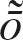
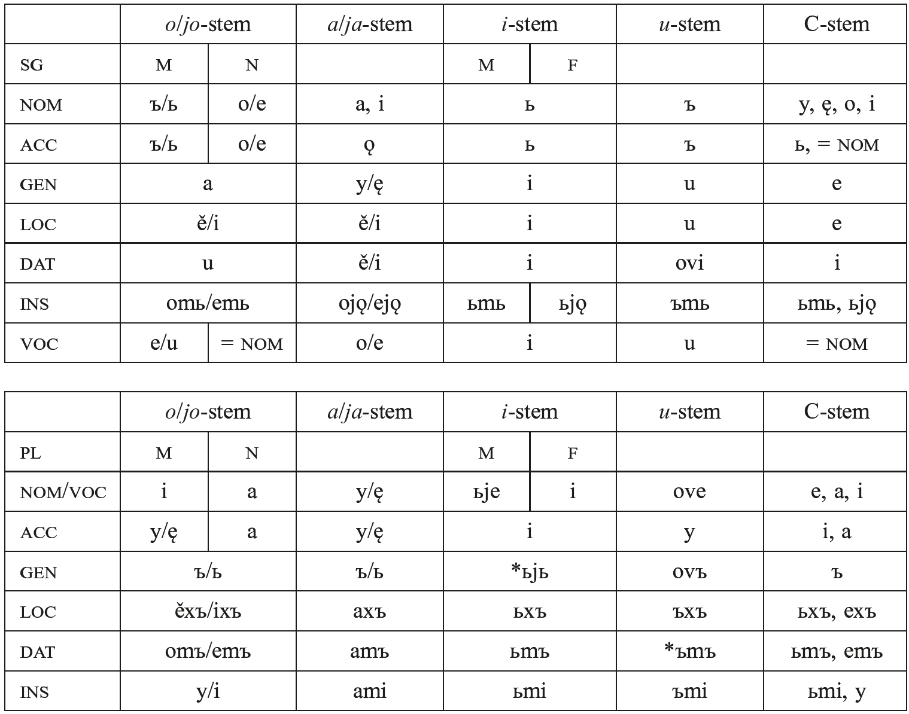
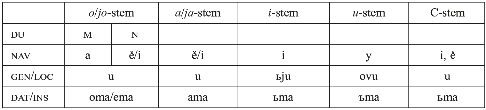
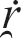
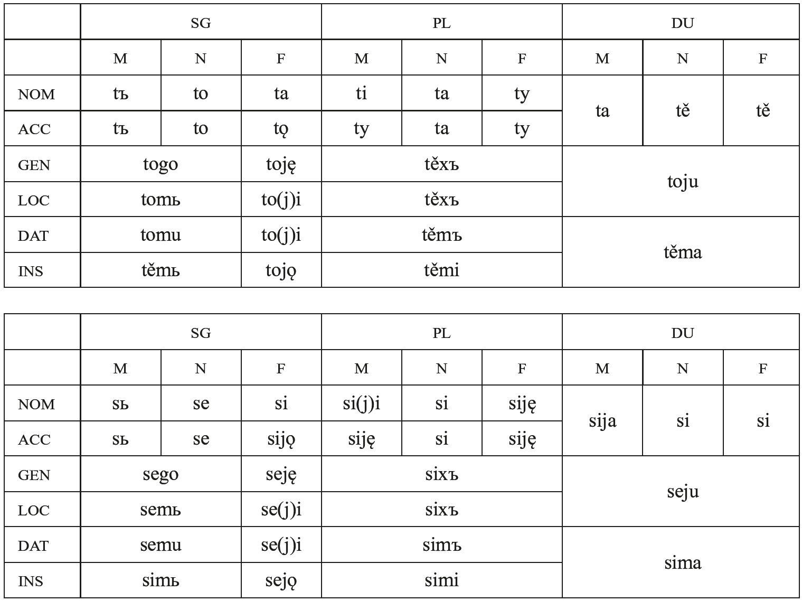
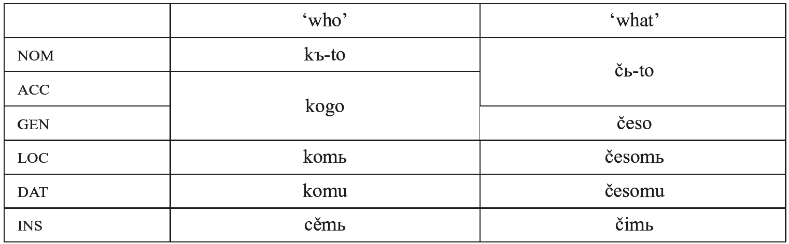
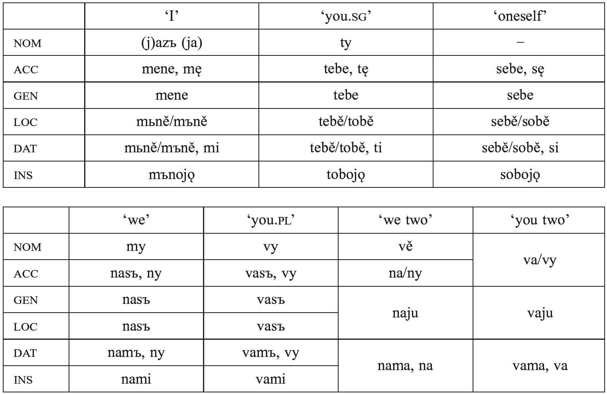

# 82. The morphology of Slavic

1.Introduction

2.Nouns

3.Adjectives

4.Numerals

5.Non-personal pronouns

6.Personal pronouns

7.Verbs

8.References

## 1. Introduction

The Slavic system of nominal inflection is relatively conservative, with 7 cases and singular, dual, and plural numbers. However, in many instances the grammatical endings cannot be transparently derived from standard reconstructions of IE forms according to regular sound changes, and there is no consensus about the origin of certain Slavic forms. The adjective developed a new opposition between indefinite and definite forms, the latter created by the addition of the relative pronoun to the basic declined form. The verbal system of Slavic is considerably simpler than that reconstructed for IE. A number of grammatical categories were lost with little or no trace, while others were replaced with new formations. Another innovation characteristic of the Slavic verb is the development of aspect as a regular grammatical category.

The earliest attested Slavic language, Old Church Slavic (OCS), exhibits a morphological system that is very close to what can be reconstructed for late Proto-Slavic. In some instances a single Proto-Slavic desinence cannot be reconstructed, so the tables below primarily present forms that are attested in OCS, occasionally abstracting away from specific phonological and orthographical features of this language. Unless otherwise noted, all attested forms in the following text are cited from OCS (or occasionally later recensions of Church Slavic), and PIE reconstructions are generally given as in Derksen (2008).

## 2. Nouns

### 2.1. Noun derivation

Slavic does not exhibit any direct continuations of PIE root nouns; these have all been adapted into various suffixed types, although traces of the original non-suffixed inflection may be seen in forms such as <i>kry</i> ‘blood’ < *<i>kruh₂-</i>, reinterpreted in Slavic as a suffixed <i>y</i>-stem (see below), or the dual forms <i>oči</i> ‘eyes’ < *<i>h₃ekʷ</i>-, <i>uši</i> ‘ears’ < *<i>h₂eu̯s</i>-, which are generally understood as representing suffixless formations (Birnbaum 1972: 146), although these nouns have otherwise been adapted to the <i>s</i>- and ultimately the <i>o</i>-stem declension in Slavic; e.g. <i>uxo</i> ‘ear’, GEN.SG <i>ušese</i>/<i>uxa</i>. The expected phonological reflexes of some endings of the root nouns overlapped with those of the <i>i</i>-stems in Slavic, so many of the original root nouns were reinterpreted as belonging to this declension; e.g. <i>myšь</i> ‘mouse’ < *<i>muHs-i</i>-; cf. Lat. <i>mūs</i>. However, as already illustrated, these nouns could also be adapted to either consonantal stem declensions or the productive <i>(j)o</i>- and <i>(j)a</i>-stem types, with or without additional suffixes.

A number of IE consonantal suffixes are reflected as distinct inflectional types in Slavic, although these nouns also tended to be assimilated into the productive vocalic declensions; e.g. <i>korenь</i>/<i>korę</i> ‘root’ (M) < *<i>kor-en-, kamy</i> ‘rock’ (M), GEN.SG <i>kamene</i> < *<i>h₂ek̑-men</i>-, <i>imę</i> ‘name’ (N), GEN.SG <i>imene</i> < *<i>h₁n̥h₃-men</i>-, <i>nebo</i> ‘sky, heaven’, GEN.SG <i>nebese</i> < *<i>nebʰ-es</i>-. One should note in particular the productive use in Slavic of the *-<i>nt</i> suffix to derive words for young people/animals; e.g. <i>agnę</i> ‘lamb’, GEN.SG *<i>agnęte</i>; cf. Lat. <i>agnus</i>. Stems in -<i>y</i>/<i>-ъv</i> < *-<i>uH</i> also enjoyed a certain degree of productivity, as shown by the adaptation of loanwords and the creation of new compounds belonging to this type; e.g. <i>smoky</i> ‘fig’, GEN.SG <i>smokъve</i> < Goth. <i>smakka</i> or *<i>smakk[image-glyph: o with macron and tilde], ne-plod-y</i> ‘barren woman’ < <i>ne</i> ‘not’ + <i>plod</i>- ‘fruit’. Nouns formed with the productive agentive suffix -<i>teljь</i>, presumably a variant of the PIE agentive suffix *<i>-ter</i> (but cf. also Vaillant 1958: 222−223) followed the consonantal stem declension pattern in the plural and the <i>jo</i>-stem declension in the singular; e.g. <i>dělateljь</i> ‘doer’, NOM.PL <i>dělatele</i>. Only two of the original kinship terms in <i>-r</i> clearly preserved their original declension in Slavic: <i>mati</i> ‘mother’, GEN.SG <i>matere, dъšti</i> ‘daughter’, GEN.SG <i>dъštere</i>. The nouns <i>bratrъ</i> ‘brother’, *<i>děverь</i> ‘husband’s brother’, <i>sestra</i> ‘sister’, and *<i>nestera</i> ‘niece’ have been adapted into the <i>o</i>-/ <i>jo</i>- and <i>a</i>-stem declensions, while <i>jętry</i> ‘husband’s brother’s wife’ has become an <i>y</i>-stem. The etymon *<i>ph₂ter</i>- ‘father’ is unattested in Slavic, except for a possible derivative *<i>stryjь</i>, ChSl. <i>stryi</i> ‘paternal uncle’, if this reflects *<i>ph₂tr</i>- > <i>str</i>- (against this hypothesis, see Kortlandt 1982: 26). Heteroclitic stems are not attested as such in Slavic, but traces can be found in the different shapes of cognate forms; e.g. <i>voda</i> ‘water’ < *<i>u̯odōr</i>, <i>vědro</i> ‘bucket’ (< *<i>u̯ēdr-o</i>), Russ. dial. <i>zavon’</i> ‘inlet’ < *<i>za-vodn-ь</i>, from an original <i>r</i>/<i>n</i>-stem (Birnbaum 1972: 149).

One of the most common productive suffixes in Slavic is the formant <i>-k</i>, which occurs in combination with other suffixes and in various guises due to phonological changes. These complex suffixes are used to derive diminutive, agentive, and other types of nouns (in all three genders) from nouns, verbs, and adjectives; e.g. <i>ablъko</i>, ORuss. <i>jablъkъ</i>, S./ Cr. <i>jabuka</i> ‘apple’ from PSl. *<i>ablo</i>/<i>*ablъ</i> (cf. Sln <i>jablo</i>/<i>jabel</i>); Russ. <i>vdovec</i> < *<i>vьdovьcь</i> ‘widower’, <i>vdovica</i> < *<i>vьdovica</i> ‘widow’, from *<i>vьdova</i> ‘widow’ (OCS <i>vъdova</i>); <i>srьdьce</i> ‘heart’ < *<i>r̥d</i>-, etc. Deadjectival abstract nouns are productively derived with the suffix <i>-ostь</i>, which is attested in Hittite and in isolated forms in a number of other languages; e.g. <i>dlъgostь</i> ‘length’, Hitt. <i>dalugašti-</i> ‘length’. A competing formation in -<i>ota</i> (< PIE *<i>-teh₂</i>) has parallels in other IE languages; e.g. <i>dlъgota</i>, Skt <i>dīrghatā</i> ‘length’; <i>nagota</i> ‘nudity’, Lith. <i>nuogatà</i>, Skt <i>nagnatā</i> (see Vaillant 1974: 372; Witczak 2002).

Slavic exhibits compounds that were probably inherited from PIE (e.g. <i>medvědь</i> ‘bear’ < *<i>medʰu-h₁ed</i>-, cf. Skt <i>madhvád</i>- ‘honey-eater’), and compounding continued to be used as a productive word-formation process. The different types of compounds posited for PIE are attested to a greater or lesser degree: copulative (rarely; e.g. <i>bratъsestra</i> ‘brother and sister’, declined as a masculine dual form in OCS), dependent determinative (e.g. <i>bratu-čędъ</i> ‘brother.DAT.SG’ + ‘child’ = ‘nephew’), descriptive determinative (e.g. <i>lixo-klętva</i> ‘bad, evil’ + ‘oath’ = ‘perjury’), possessive (e.g. <i>malo-moštь</i> ‘little’ + ‘power, strength’ = ‘cripple; poor person’), and governing compounds (e.g. <i>vodo-nosъ</i> ‘water’ + ‘carry’ = ‘vessel for water’; see Pohl 1977 for a discussion of these and other examples). As can be seen here, most compounds have a linking element which reflects the thematic vowel. The most common type of verbal governing compound in PIE had the verb as the second element, but in Slavic compounds with an imperative verb form as the first element were productive; e.g. <i>Rosti-slavъ</i> ‘(make) grow’ + ‘glory’ (personal name), ORuss. and ChSl. <i>Daž(d)ь-bogъ</i> ‘give’ + ‘god’ (name of a pagan god), S./Cr. <i>kaži-prst</i> ‘show’ + ‘finger’ = ‘index finger’ (Vaillant 1974: 765−767). Reduplication is attested in a few forms; e.g. <i>glagolъ</i> ‘speech, word’ < PSl. *<i>gol-gol-</i>.

For a recent survey of Slavic nominal word-formation, see Matasović (2014), which appeared after this chapter was written.

### 2.2. Noun inflection

In many instances the morphological markers of the various grammatical categories in Slavic do not correspond with what one would expect from the PIE system reconstructed on the basis of other languages and the regular sound laws of Slavic. Many scholars have posited special phonological changes in final syllables (<i>Auslautgesetze</i>) to explain these forms, but some of these proposals lack a clear phonetic motivation and may be inconsistent with other forms or create problems of relative chronology. Other linguists rely more on analogical changes of varying degrees of plausibility to account for the anomalous endings. A third possibility is the reconstruction of different dialectal IE endings as a starting point for the forms in question. Orr (2000) and Halla-aho (2006) give comprehensive surveys of previous scholarship and arguments for and against these different approaches (for both nominal and verbal inflection, see also Olander 2015, which appeared after this chapter was written).

Slavic also developed variant forms of endings due to the fronting of vowels after <i>j</i> (or palatal consonants derived from <i>C+j</i> sequences), resulting in a differentiation of the inherited paradigms into so-called “hard” and “soft” declensional types. These forms are separated by slash marks in Table 82.1. The <i>a</i>/<i>ě</i> alternation in the hard and soft patterns seen in some early OCS mss. is ignored, since it is not consistently represented in these texts and can be considered a phonetic or orthographic feature by the time of OCS. OCS regularly has <i>i</i> for original <i>ь</i> before or after <i>j</i>, so the endings given as <i>-ьjǫ</i>, -<i>ьje, -ьju, -ьjь</i> appear most often as <i>-ijǫ, -ije, -iju, -ii</i>. Note also that there is no separate letter in either the Glagolitic or early Cyrillic alphabet for <i>j</i>.

Tab. 82.1: Noun endings

#### 2.2.1. Endings that correspond regularly to reconstructed PIE forms

Fewer than half of the endings given above can be transparently derived from standard reconstructions of IE protoforms by regular sound changes. Such processes include the Slavic loss of final consonants (e.g. NOM.SG <i>i</i>-stem -<i>ь</i> < *<i>-is, u</i>-stem <i>-ъ</i> < *-<i>us</i>, GEN.SG <i>o</i>-stem <i>-a</i> < ABL.SG *<i>-ōd</i>), including the loss of a final nasal after <i>ĭ, ŭ</i> (e.g. ACC.SG <i>i</i>-stem <i>-ь</i> < *<i>-im</i>, ACC.SG <i>u</i>-stem <i>-ъ</i> < *<i>-um</i>), and the monophthongization of diphthongs (e.g. LOC.SG <i>o</i>-stem <i>-ě</i> < *-<i>oi̯</i>, *-<i>o[image-glyph: r with tilde]</i>; <i>jo</i>-stem <i>-i</i> < *-<i>(i̯)ei̯</i> < *<i>-(i̯)oi̯</i>; G sg. <i>u</i>-stem <i>-u</i> < *<i>-ou̯s</i>). These correspondences can be found in all standard handbooks and require no further discussion here. Note that the NOM.SG ending <i>-i</i> found with some soft-stem feminine nouns is from the original <i>-ih₂</i>/<i>-i̯eh₂</i> type; the rest of the inflection is identical to the ordinary <i>(j)a</i>-stems, apart from the VOC.SG, which was identical to the NOM.SG.

#### 2.2.2. Endings that may reflect special sound changes in final position

The vowels *<i>a, *ā, *o, *ō</i> merged in Slavic as *<i>ā˘</i>, with a subsequent change of short *<i>a</i> to *<i>o</i> in late PSl. The majority of scholars assume that PSl. *<i>a</i> was raised before a nasal consonant in final position, with subsequent loss of the nasal: *-<i>aN#</i> > *-<i>uN#</i> > -<i>ъ</i>. This development would account for the <i>o</i>-stem ACC.SG ending <i>-ъ</i> and the GEN.PL <i>-ъ, -ov-ъ</i> of the consonantal and <i>u</i>-stem declensions. It has been argued that Slavic, Umbrian, and Old Irish point to short *<i>-om</i> in part of IE for the <i>o</i>-stem GEN.PL, rather than the expected *<i>-ōm</i> (e.g. Kortlandt 1978). However, the <i>o</i>-stem GEN.PL in Slavic could also reflect a later shortening of the inherited ending, as is generally assumed for the GEN.PL ending of <i>a</i>-stems, *-<i>oHom</i>, *<i>-eh₂om</i> > *<i>-ōm</i> > *<i>-om</i>, resulting in the attested form -<i>ъ</i> in both of these declensions. The <i>jo-</i> and <i>ja</i>-stems show the expected fronting to -<i>ь</i>.

The neuter <i>o</i>-stem NOM.SG ending <i>-o</i> then poses a problem, since IE *<i>-om</i> would also be expected to yield <i>-ъ</i> here. Some linguists suggest that this may reflect an original endingless NOM.SG neuter form (see Halla-aho 2006: 117−118; Arumaa 1985: 131−132 for a discussion and references), but the <i>-o</i> is more often explained as a borrowing from the pronominal declension (*<i>tod > to</i>) and/or analogy to the <i>s</i>-stem neuters. In either case, it appears that barytone neuters kept the nasal ending and merged with masculine nouns in Slavic (e.g. <i>darъ</i> ‘gift’, Gk <i>δῶρον</i>; <i>dvorъ</i> ‘court, courtyard’, if this form constitutes an exact match for Skt. <i>dvā´ram</i>, which is first attested in late Vedic. See Hirt 1893: 348−349; Illič-Svityč 1963: 131; and Kortlandt 1975: 45).

A parallel development of long *-<i>āN</i># > *-<i>ūN</i># > <i>-y</i> has been posited to explain the NOM.SG of the masculine <i>n</i>-stems in <i>-y</i> (<i>kamy</i> ‘stone’, <i>plamy</i> ‘flame’), although this is incompatible with the development commonly posited for the 1SG present tense *<i>-ōm</i> > *<i>-āN</i> > <i>-ǫ</i>. To avoid this problem, other scholars suggest that <i>-y</i> here reflects *<i>-ons</i> (Halla-aho 2006: 166−172), *<i>-ōns</i> (Matasović 2008: 124), or a circumflex *<i>-[image-glyph: o with macron and tilde]</i> (Jasanoff 1983; cf. also the proposed derivation of <i>smoky</i> < *<i>smakk[image-glyph: o with macron and tilde]</i> cited above). Other masculine <i>n</i>-stems are attested with final <i>-ę</i> in the NOM.SG, probably reflecting the lengthened grade suffix *<i>-ēn</i>. In OCS the NOM.SG is already being replaced by the ACC.SG form in <i>-en-ь</i>; e.g. NOM.SG <i>korę</i>/<i>korenь</i> ‘root’, <i>kamy</i>/<i>kamenь</i>.

The masculine <i>o</i>-stem ACC.PL ending may reflect *<i>-ōns</i> > *-<i>āns</i> > *<i>-ūns</i> > *<i>-ūs</i> > <i>-y</i> (Arumaa 1985: 141), although it is not necessary to reconstruct an original long vowel here. One could also posit *<i>-ons</i> > *<i>-ans</i> > *<i>-uns</i> > *<i>-ūs</i> > <i>-y</i>, with lengthening in compensation for the loss of the nasal consonant, parallel with the <i>i-</i> and <i>u</i>-stem ACC.PL endings: *<i>-ins</i> > *<i>-īs</i> > <i>-i</i>, *<i>-uns</i> > *<i>-ūs</i> > <i>-y</i>. Most scholars derive the <i>a</i>-stem ACC.PL ending in the same manner from an original *<i>-āns</i> or *<i>-ans</i>.

The development of vowel + nasal sequences in grammatical endings is obviously a complex problem. There is a wide range of opinions about the relative chronology and outcomes, and any coherent analysis of the phonological developments will entail different assumptions about the original forms of some of the endings. The raising of original <i>o</i> to <i>u</i> could arguably be seen as phonetically more likely before the Slavic merger of <i>o</i> and <i>a</i>, and the reflexes of vowel + nasal sequences in other endings would also seem to require a distinction between the treatment of *<i>ăN</i>/<i>āN</i> and *<i>ŏN</i>/<i>ōN</i>; e.g. <i>a</i>-stem ACC.SG *<i>-ām</i> (> *<i>-am</i>) > <i>-ǫ</i>. Kortlandt (1979a) dates the raising of *<i>oN</i># to the early Balto-Slavic period, but treats the raising before *<i>-Ns</i># as a separate process that occurred after the merger of <i>o</i> and <i>a</i>. Matasović (2008: 123−126), on the other hand, dates the raising after the merger of <i>o</i> and <i>a</i>, with outcomes determined by length and the presence or absence of a following consonant: *<i>-an</i> > *<i>-un</i> > <i>-ъ</i>; *<i>-ān</i> > *<i>-ūn</i> > *<i>-ą</i>; *-<i>āns</i> > *-<i>ūns</i> > <i>-y</i>. The soft declension endings also raise questions. South Slavic (including OCS) has <i>jo-</i> and <i>ja-</i>stem ACC.PL <i>-ę</i>, which could be explained as the fronting of *-<i>jūns</i> > *-<i>jīns</i>, but inexplicably without the subsequent loss of the nasal element that occurred in original *-<i>ūns</i>, *-<i>uns</i>, and *-<i>ins</i>. North Slavic has <i>-ě</i>, which does indicate some type of denasalization, but the sequence of developments resulting in this ending is unclear. Although some of the nominal endings explained by the raising of vowels before a final nasal could possibly be attributed to analogy to the <i>u</i>-stem declension, the development of *<i>-om</i> > *<i>-un</i> > <i>-ъ</i> in isolated forms, such as *<i>h₁eg̑Hom</i> > <i>azъ</i> ‘I’, root aorist 1SG -ъ < *-<i>om</i>, and possibly the prepositions <i>kъ(n)</i>, <i>sъ(n)</i>, <i>vъ(n)</i>, suggests a regular phonological process.

Less widely accepted in the literature is the hypothesis that <i>o</i> was also raised to <i>u</i> before <i>s</i> in final position, which has been proposed to account for the masculine <i>o</i>-stem NOM.SG, *<i>-os</i># > *<i>-us#</i> > <i>-ъ</i>. This ending has often been explained instead as the result of analogy to the <i>u</i>-stem declension, where <i>-ъ</i> is the regularly expected outcome in both the NOM.SG and ACC.SG. Traces of an earlier masculine NOM.SG ending *<i>-o</i> may be seen in names such as OPol. <i>Boglo</i>, Cr. <i>Ivo</i>, etc. Vermeer (1991) assumes a regular development of *<i>-os</i> > *<i>-o</i> as part of his explanation of the old North Russian NOM.SG ending <i>-e</i> and the Common Slavic adoption of the <i>u</i>-stem VOC.SG ending <i>-u</i> by the <i>jo</i>-stems, for which it is otherwise difficult to provide a plausible motivation. Raising of *<i>-ōi̯s</i> to *-<i>u̯oi̯s</i> or *-<i>ūi̯s</i> > <i>-y</i> would still seem to be the most plausible explanation for the <i>o</i>-stem INS.PL ending <i>-y</i>. However, Mareš (1969: 116) reconstructs INS.PL *-<i>oi̯ns</i>, with the nasal reflecting a contamination of the nominal ending *-<i>oi̯s</i> with the pronominal *-<i>oi̯mī(s)</i>. Hujer (1910: 160−164) sees this instead as a generalization of the regularly fronted ending of the <i>jo</i>-stems: *<i>-ēi̯s</i> > <i>-i</i>, but using the corresponding back vowel <i>-y</i> after a hard consonant.

Olander (2012) offers a convincing reappraisal of the idea that the masculine <i>o</i>-stem NOM.SG ending <i>-ъ</i> represents a phonologically regular outcome of *-<i>os#</i>. Drawing on several individual proposals that have been made by different scholars, he posits a general phonological rule *<i>˘ā</i>> *<i>˘ə̄</i>/<i>__ (R)s</i># (2012: 337), with *<i>ə, *ǝ̄ > e, ě</i> in the Old Novgorod dialect and <i>ъ, y</i> in the rest of Slavic. The corresponding development for soft stems would be *<i>i̯ə, *i̯ǝ̄ > *jь, *jě</i> (probably in all of Slavic; see Olander 2012: 333− 334). This rule allows us to account for a number of otherwise problematic endings; see Olander (2012) for details.

#### 2.2.3. Analogical replacements and innovations

If one assumes that the normal phonological outcome of *<i>-eh₂(e)s</i> in Slavic is <i>-a</i>, then the most likely explanation for the <i>a</i>-stem NOM.PL ending <i>-y</i>/<i>ę</i> is that it was taken from the ACC.PL, by analogy to the syncretism of the NOM/ACC.PL for the <i>u</i>-stems and feminine <i>i</i>-stems. Some scholars derive the <i>a</i>-stem GEN.SG <i>-y</i>/<i>ę</i> from an earlier *<i>-āns</i>, with <i>-n</i> added to the inherited ending by analogy to feminine <i>n</i>-stems, but the fact that no feminine <i>n</i>-stems are attested in Slavic makes this proposal unconvincing. A borrowing of the NOM/ACC.PL ending to avoid the overlap with the NOM.SG, again by analogy to the syncretism of these cases in the <i>i</i>-stems, would perhaps be a more likely explanation. However, the idea that *-<i>ās</i> in these endings regularly became -<i>y</i> in Slavic, first proposed by Hirt (1893: 353−355), has been accepted by a number of scholars (see Olander 2012: 331−332), and these endings would be phonologically regular according to Olander’s rule cited above.

The origin of the <i>o</i>-stem DAT.SG ending <i>-u</i> is unclear. Proposals to account for this include special phonological developments, *<i>-ōi̯</i> > *-<i>u̯ōi̯</i> > <i>-u</i> (Vaillant 1958: 31) or *-<i>ōi̯</i> > *-<i>ōu̯ > -u</i> (Kortlandt 1983: 175; Matasović 2008: 181), or the extension of a hypothetical <i>u</i>-stem DAT.SG ending *<i>-u</i> to the <i>o</i>-stems (Halla-aho 2006: 208−209).

The <i>u</i>-stem LOC.SG <i>-u</i> reflects an endingless LOC.SG form *-<i>ōu̯</i>, with lengthened grade of the affix (Vaillant 1958: 109; Arumaa 1985: 126).

Slavic, like Baltic and Germanic, has -<i>m</i>- endings in DAT and INS forms (see Darden, this handbook, 2.2): DAT.PL endings -<i>omъ</i>, -<i>аmъ</i>, -<i>ьmъ, -ъmъ</i> < *-<i>V-mus</i> or possibly *<i>-V-mos</i>; INS.PL <i>-ami, -ьmi, -ъmi</i> < *<i>-V-mīs</i>; INS.SG <i>-omь, -ьmь, -ъmь</i> < *<i>-V-mi</i>, DAT/ INS.DU <i>-oma, -ama, -ьma, -ъma</i> < *<i>-V-mā</i>.

The Slavic GEN.DU could theoretically reflect *<i>-ou̯s</i> > <i>-u</i> (<i>-ьj-u, -ov-u</i> in the <i>i</i>- and <i>u</i>-stems), but Balto-Slavic more likely had a syncretic GEN/LOC.DU *<i>-au</i>, based on the very limited evidence from Baltic and comparison with other IE languages (Vaillant 1958: 38−39). It is not possible to reconstruct PIE oblique dual forms because of the limited evidence.

A few endings (in addition to the neuter <i>o</i>-stem NOM.SG discussed above) have been adopted from the pronominal declension. The masculine <i>o</i>-stem NOM.PL ending <i>-i</i> reflects pronominal *<i>-oi</i>, apparently with generalization of the expected reflex after palatals in the <i>jo</i>-stems (but see Olander 2012: 332 for another explanation). The <i>a</i>-stem INS.SG <i>-ojǫ</i> is also taken from the pronominal declension (with a nasal vowel from the characteristic <i>-m-</i>), and the <i>i</i>-stem feminine INS.SG <i>-ьjǫ</i> is modeled on this.

Slavic developed a new gender distinction within <i>o</i>-stem masculine nouns, marked by the replacement of the inherited ACC.SG ending by the GEN.SG <i>-a</i> in nouns denoting persons. This personal/non-personal distinction was already well established by the time of OCS, and was gradually expanded to include animals and extended to the plural and dual in some areas. The other Slavic languages all have the animate/inanimate gender distinction in nouns, with additional personal/non-personal distinctions in some instances.

## 3. Adjectives

### 3.1. Adjective derivation

Adjectives in Slavic are almost exclusively <i>(j)o</i>-stems (M, N) and <i>(j)a</i>-stems (F). Traces of <i>i</i>-stem adjectives can be seen in a few indeclinable forms in OCS (e.g. <i>isplьnь</i> ‘full, fulfilled’). Original <i>u</i>-stem adjectives were regularly adapted to the <i>o</i>- and <i>a</i>-stem declensions by the addition of the suffix *<i>-k</i>; e.g. <i>lьgъkъ</i> ‘light, easy’, cf. Skt <i>laghú</i>-, Gk <i>ἐλαχύς</i>; <i>tьnъkъ</i> ‘thin’, cf. Skt <i>tanú</i>-, Lat. <i>tenuis</i>. The most productive suffixed types are relational adjectives in *<i>-in-</i> and *<i>-isk-</i> and possessive adjectives in *<i>-j-</i> and *<i>-ov-</i>. OCS has a large number of compound adjectives, not all of which are calques from Greek; e.g. <i>maločismenьnъ</i> ‘small in number’. Compound adjectives, particularly of the possessive type, are also common in the other Slavic languages, e.g. S./Cr. <i>gologlav</i> ‘bareheaded’.

### 3.2. Adjective inflection

Adjective forms were originally declined like nouns, and this pattern is preserved in Slavic. The absence of any original sharp distinction between these two classes can still be seen in a number of stems that function as either noun or adjective; e.g. <i>zъl-ъ, -o, -a</i> ‘evil, bad, wicked’ and <i>zъlo</i> ‘evil, harm, wickedness’. Slavic and Baltic developed new definite adjective forms by adding the pronoun <i>j-</i> to the basic (indefinite) adjective form. In Slavic this developed very early into a distinct declension, with a fusion of the enclitic pronoun and the original grammatical ending into a single desinence in several of the more complex forms, by replacing the original adjective ending with <i>-y-</i>/<i>-i-</i>; compare masculine GEN.SG.DEF <i>nov-a-jego</i> ‘new’, where the two components are still transparent in OCS, with INS.SG.DEF <i>nov-yimь</i>. Already in OCS we also see a tendency to contract or further simplify these endings; e.g. <i>novaago, novago, novymь</i>.

### 3.3. Comparative and superlative

For the origin of the comparative forms, see Darden, this handbook, 3.4. By the time of OCS, all but a small number of adjectives formed their comparative with the productive suffix <i>-ěiš-</i>, which is a Slavic innovation. The *<i>-ē-</i> used to extend the inherited comparative suffix is generally thought to be adverbial in origin (see Arumaa 1985: 98−99). We cannot reconstruct a synthetic superlative form for Proto-Slavic. OCS texts typically use just the comparative form, with the comparative or superlative reading determined by the context. However, there are a few instances of comparative forms with the prefix <i>nai-</i> < <i>na</i> ‘on’ + the particle <i>i</i>, and practically all of the modern Slavic languages form superlatives regularly in this manner (e.g. OCS <i>naivęšte</i> ‘the most’, S./Cr. <i>najveći</i> ‘biggest’, Cz. <i>největší</i>, Pol. <i>największy</i>). The exception is Russian, where the few prefixed forms in <i>nai-</i> are borrowings from OCS. The regular Russian superlative formation is <i>samyj</i> ‘the very, itself’ + the positive degree of the adjective (Vaillant 1958: 593−595).

## 4. Numerals

### 4.1. Cardinal numerals

Slavic *<i>(j)edin</i>- ‘one’ can be most easily explained as representing an ablaut variant *<i>ei̯-no-</i> ‘one’ augmented by a prefix *<i>ed-</i> of uncertain origin; cf. <i>(j)edъva</i> ‘scarcely’. It is inflected according to the pronominal declension pattern. The unprefixed form of this numeral survives as the pronoun <i>inъ</i> ‘other’, but in its original meaning appears only as the initial member of a few compounds; e.g. <i>inorogъ</i> ‘unicorn’. The other IE root with the meaning ‘one’, *<i>sem-</i>, is the basis for the pronoun <i>samъ</i> ‘oneself’. Slavic <i>dъva</i> (M), <i>dъvě</i> (N, F) derive straightforwardly from IE *<i>duu̯oh₁</i>, *<i>duu̯oi̯h₁</i>, originally with oblique pronominal dual forms: GEN/LOC <i>dъvoju</i>, DAT/INS <i>dъvěma</i>.

IE *<i>trei̯es</i> ‘three’ was originally inflected as a plural <i>i</i>-stem, and this pattern is preserved in OCS. Masculine *<i>trьje</i>, OCS <i>trije</i> may represent the normal phonological development of heterosyllabic *<i>ei̯</i>, of which there are few examples, or analogy with the zero grade of other forms. Feminine <i>tri</i> is presumably the extension of ACC.PL *<i>trins</i> > <i>tri</i> to the nominative, as seen in other feminine <i>i</i>-stems, and neuter <i>tri</i> reflects original *<i>tri-h₂</i>. The numeral ‘four’, originally a consonantal stem, shows a similar opposition of <i>četyre</i> (M) vs. <i>četyri</i> (N, F) in OCS. The Slavic forms point to an original *<i>ū</i>, which must be a substitution for the vowel alternations *<i>kʷetu̯ōr-</i>/<i>*kʷetu̯or-</i>/<i>*kʷetur-</i> in different cases that are reconstructed on the basis of other languages.

The numerals from ‘five’ to ‘nine’ are feminine <i>i</i>-declension nouns with the same stem as the corresponding ordinals, which replaced the indeclinable forms of these numerals reconstructed for PIE: OCS <i>pętь, šestь, sedmь, osmь, devętь</i>. The form for ‘eight’ has final <i>-m</i> by analogy to the form for ‘seven’. In <i>sedmь</i> the cluster <i>-dm-</i> would not be expected to survive in Proto-Slavic, and may represent a contamination of a possible cardinal form *<i>setь</i> < *<i>septm̥</i> and ordinal *<i>semъ</i>; cf. ORuss. <i>semь</i> ‘seven’, <i>semъ</i> ‘seventh’ (Comrie 1992: 756−757). For ‘six’ and ‘nine’, see Darden, this handbook, 4.1.3− 4.1.4. Unlike ‘one’ through ‘four’, which were treated like modifiers, judging by the evidence of OCS, the numerals ‘five’ through ‘nine’ were quantifiers with a following noun in the GEN.PL.

The numeral ‘ten’ was a consonantal stem in <i>-t</i> in Balto-Slavic, probably masculine (see Darden, this handbook, 4.1.2.). The original declensional pattern is seen most clearly in OCS in the forms for the teens, which are formed on the pattern X-on-ten.LOC.SG (e.g. <i>dъva na desęte</i> ‘12’), and in the tens, which are formed on the pattern X tens.GEN.PL (e.g. <i>pętь desętъ</i> ‘50’). Already in OCS, <i>desętь</i> was shifting to the feminine <i>i</i>-stem declension, like the numerals ‘five’ through ‘nine’.

The numeral <i>sъto</i> ‘100’ is a neuter noun, as in PIE, but the initial vowel of the stem is not the expected reflex of the syllabic nasal in *<i>k̑m̥tóm</i>. It may represent the reflex of an allegro form *<i>sutom</i> from a variant *<i>sumtom</i>, beside expected *<i>simtom</i> (see Comrie 1992: 784). For ‘1000’, see Darden, this handbook, 4.1.1.

### 4.2. Ordinal numerals

For the formation of the ordinal numerals ‘first’ through ‘tenth’ and ‘hundredth’, see Darden, this handbook, 4.2. The ordinal forms of complex numbers are rarely attested in OCS, and the modern Slavic languages have created new ordinal forms based on the corresponding cardinals. The earliest pattern for the teens was presumably with the ordinal form of the first component (e.g. <i>pętoje na desęte</i> ‘15th’), and for the tens with the ordinal form of both components (e.g. Cr. ChSl. <i>sedmoe desetoe</i> ‘70th’; Vaillant 1958: 658). For ‘11th’ OCS has <i>jedinyi na desęte</i>, with a definite form of <i>jedinъ</i> ‘one’ instead of <i>prъvyi</i> ‘first’. OCS also has compound forms, either with the linking vowel <i>o</i> or with an invariable NOM.SG form of the first component, and typically with the addition of the adjectival suffix <i>-ьn-</i>; e.g. <i>osmonadesęt-</i> ‘18th’, <i>devętьnadesętьn-</i> ‘19th’, <i>dъvadesętьn-</i>‘20th’ (see Vaillant 1958: 657−659; Comrie 1992: 771−772).

### 4.3. Collective numerals and other forms

The Slavic collective numerals for groups of two, three, or four reflect thematic IE formations with <i>o</i>-grade of the root in <i>dъvoje, troje</i>, and both <i>e-</i> and <i>o</i>-grade in <i>četvero</i>/<i>četvoro</i> (in OCS proper only <i>o</i>-grade forms are attested, according to Comrie 1992: 809). The higher collective numerals in Slavic are formed in analogy to the latter; e.g. <i>pętero</i>/<i>pętoro</i>, etc. Slavic also formed derivatives of collective numerals in <i>-ica</i>; e.g. OCS <i>troica</i> ‘group of three, the Trinity’. In addition to the numerals proper, we can also mention <i>oba</i> ‘both’, which has forms parallel to those of <i>dъva</i> ‘two’; the second component is identical to that of Gk <i>ἄμφω</i>, Lat <i>ambō</i>, etc. < *-<i>bʰō</i>. The word for ‘half’ is the <i>u</i>-stem noun <i>polъ</i>, which is a Slavic innovation.

## 5. Non-personal pronouns

### 5.1. Demonstrative pronouns

Slavic originally had a three-way system of deixis, which is preserved in OCS: proximal <i>sь</i> < *<i>i-</i>, medial <i>tъ</i> < *<i>to-</i>, and distal <i>onъ</i> < *<i>h₂en-o-</i>. The inherited distinction between <i>o</i>- and <i>i</i>-inflection is preserved, but there are a number of innovations in individual forms.

Tab. 82.2: Demonstrative pronouns

In the NOM.SG of the medial demonstrative, Slavic does not exhibit the <i>s</i>- (M, F), <i>t-</i> (N) suppletion seen in other IE languages. The masculine NOM.SG form has the same ending as <i>o</i>-stem nouns. The masculine/neuter LOC.SG and DAT.SG forms have <i>-m-</i> instead of *<i>-sm-</i>, and the final <i>-u</i> of the DAT.SG presents the same problems as the ending of the <i>o</i>-stem nouns. The masculine/neuter GEN.SG is a Slavic innovation, a remaking of an earlier GEN or ABL form reinforced with the particle -<i>go</i> (Vaillant 1958: 369; Arumaa 1985: 175). The masculine/neuter INS.SG is based on the plural stem *<i>toi-</i>. The oblique feminine singular forms are based on a stem <i>toj-</i>, which has also been interpreted as an extension of the plural stem to the singular (Arumaa 1985: 176−177), but it could also reflect a change of *<i>-sj-</i> > <i>j</i>, like *<i>-sm-</i> > <i>-m-</i> (Darden, this handbook, 5.4). Slavic has eliminated gender distinctions in the oblique plural forms. The GEN.PL <i>těxъ</i> could reflect either *<i>toisōm</i> or *<i>toisom</i> (see the discussion of the <i>o</i>-stem GEN.PL above), and the DAT.PL and INS.PL have the characteristic <i>-m-</i>, as in the noun.

The proximal demonstrative generally exhibits the historically expected forms, apart from the innovations seen also in the <i>o</i>-stem pronominal declension. The neuter NOM.SG has <i>se</i> rather than historically expected *<i>sь</i>. The masculine NOM.PL reflects a remade *<i>sьji</i> in place of expected *<i>sьje</i>, and the ACC.PL is based on the NOM.PL. The feminine forms are secondary, following the same pattern as feminine nouns in <i>-ī</i>/<i>-ii</i>.

### 5.2. The anaphoric and relative pronouns

Because of the fronting of back vowels after <i>j</i> and the development of prothetic <i>j</i> before front vowels, in Slavic the forms of the anaphoric (3rd person) pronoun *<i>i-</i> and the relative *<i>i̯o-</i> fell together. The relative is distinguished from the anaphor in OCS by the addition of the particle <i>že</i>. The nominative forms of the anaphoric pronoun (SG *<i>i, *je, *ja</i>, PL *<i>i, *ja, *ję</i>, DU *<i>ja, *i, *i</i>) are replaced by the demonstratives <i>tъ</i> or <i>onъ</i>, with the historically expected forms attested only as a component of the relative pronoun (e.g. M.NOM.SG <i>i-že</i> ‘who, which’). The corresponding accusative forms (SG <i>i, je, jǫ</i>, PL <i>ję, ja, ję</i>, DU <i>ja, i, i</i>) were enclitic. After a preposition the anaphoric/relative pronoun has a prefixed <i>n-</i>; this represents the final <i>n</i> of the prepositions *<i>vъn, *kъn, *sъn</i>, which was reanalyzed as part of the pronoun and generalized to occur after all prepositions. Otherwise, the anaphoric/relative pronoun forms follow the same pattern as <i>sь</i> above.

### 5.3. Interrogative pronouns

Slavic also distinguishes an <i>o</i>- and <i>i</i>-stem declension for the pronominal stem *<i>kʷ-</i>, the former used for animates and the latter for inanimates. The interrogative pronouns in Slavic have only singular forms, with no gender distinctions. The interrogative ‘who?’ has adopted the GEN form for the ACC, like animate masculine nouns. The NOM of ‘who?’ was reinforced by the addition of -<i>to</i> already in Proto-Slavic, while for the interrogative ‘what?’ this does not appear to have been a common Slavic development, since a number of languages have reflexes of the shorter form *<i>čь</i>; e.g. OPol. <i>we-cz</i> ‘in what?’, Cr. čakavian dialects <i>ča</i> ‘what?’. The oblique forms of ‘what?’ are the only pronominal forms in Slavic that retain the original GEN ending and the *<i>-sm-</i> of the DAT and LOC forms, although the latter have been reshaped by analogy to the GEN <i>česo</i> as well as other pronominal forms.

Tab. 82.3: Interrogative pronouns

## 6. Personal pronouns

Forms attested in early Slavic texts are given in Table 82.4; clitic forms are listed after the comma. Those with cognates in other IE languages and for which a Balto-Slavic form can be reasonably reconstructed are discussed in Darden, this handbook, 6.

Tab. 82.4: Personal pronouns

1SG <i>ja</i> is attested in ORuss. and is the form used in most of the modern Slavic languages and dialects, so it is likely that this shorter form already existed as a variant in Proto-Slavic. The forms of the genitive for the various pronouns were adopted as stressed forms for the accusative, parallel to the development of the animate accusative forms in nouns, while the inherited (originally tonic) accusative forms became clitics. The inherited GEN.PL and LOC.PL forms were apparently reanalyzed as <i>na-sъ, va-sъ</i> and these stems were combined with the nominal endings for the DAT.PL and INS.PL. Since the latter forms look like <i>a</i>-stem nouns, this may explain the final <i>-ě, -ojǫ</i> in the DAT.SG and INS.SG forms (Vaillant 1958: 450). The oblique dual forms also follow the same patterns as nouns and demonstrative pronouns, using the stems <i>na-, va-</i> of the plural.

The possessive pronouns 1SG *<i>mojь</i>, 2SG *<i>tvojь</i>, REFL *<i>svojь</i> reflect IE *<i>mo-</i>, *<i>tu̯o-</i>, *<i>su̯o</i>- with the addition of a suffix *<i>-i̯o</i>. The plural possessives <i>našь, vašь</i> are more recent formations, built on the genitive forms with the addition of the *<i>-jь</i> (< *<i>-i̯o</i>) suffix used to form possessive adjectives (Vaillant 1958: 465). There were no possessive forms for the dual 1st/2nd persons or for the 3rd person pronoun; possession was indicated by using the genitive case.

## 7. Verbs

### 7.1. Verb derivation

The inflectional system of the Slavic verb is based on the relationship between a present stem and an infinitive/aorist stem. Only four old athematic present tense formations are attested in OCS, and the corresponding INF/AOR stems are built in different ways. For the copula <i>jesmь</i> (1SG) < *<i>h₁es-</i>, the INF/AOR stem is suppletive: <i>by-ti</i> (INF) < *<i>bʰuH</i>-. The verb <i>věmь</i> ‘know’ < *<i>u̯oi̯d-</i> has an INF/AOR in *<i>-ē-</i>, <i>věd-ě-ti</i>. Both <i>damь</i> ‘give’ and <i>ěmь</i>/<i>jamь</i> ‘eat’ use the bare root for the INF/AOR: <i>da-ti</i> < *<i>deh₃</i>-, <i>ěs-ti</i>/<i>jas-ti</i> < PSl. *<i>ēd-</i>. There are only traces of reduplicated forms. Apart from a few verbs with expressive reduplication of the entire root, we have only (1SG) <i>deždǫ</i> (thematic, with the suffix -<i>je</i>), <i>dě-ti</i> ‘do, say, put’ < *<i>dʰ</i>eh₁-, and probably <i>damь</i>, 3PL <i>dadętъ</i> ‘give’ (see Arumaa 1985: 210−211).

There are a number of thematic presents based on a bare root, which use either the root or root + *<i>-ā-</i> for the INF/AOR; e.g. <i>nes-e-, nes-ti</i> ‘carry’ < *<i>h₁nek̑-</i> and <i>ber-e-, bьr-a-ti</i> ‘take’ < *<i>bʰer</i>-. Other primary verbs derived with unproductive suffixes and the few verbs with a nasal infix also have the bare stem for the INF/AOR; e.g. <i>ži-ve-, ži-ti</i> < *<i>gʷih3-</i> and <i>sęd-e-</i>, <i>sěs-ti</i> < *<i>sed-</i>. Slavic has a productive type of present with the suffix <i>-ne</i>, which is used to form inchoatives, verbs which indicate the gradual acquisition of a certain quality (derived from adjectives), or semelfactives, and which can be related to several different nasal suffix formations in IE (see Birnbaum and Schaeken 1997: 87− 88). These verbs typically have infinitive stems with the suffix <i>-nǫ</i>, the origin of which is not entirely clear (see Arumaa 1985: 225−226), but lack the nasal suffix in the aorist; e.g. <i>dvig-ne-</i>, INF <i>dvig-nǫ-ti</i>, AOR.1SG <i>dvig-ъ</i>/<i>dvig-oxъ</i> ‘move’. Roots ending in a vowel have the <i>-nǫ</i> in the aorist as well; e.g. <i>mi-ne-, mi-nǫ-ti, mi-nǫ-xъ</i> ‘pass’. The most widespread present suffix is <i>-je</i>, which is used to form a number of different types of verbs, with different corresponding INF/AOR stems. The oldest group is based on (mainly) <i>e</i>-grade roots, like the primary thematic present forms above, and also have either the root or root + *<i>-ā-</i> for the INF/AOR stem; e.g. <i>zna-je-, zna-ti</i> ‘know’ < *<i>g̑neh₃</i>- and <i>češ-e-</i> < *<i>kes-je</i>, <i>čеs-a-ti</i> ‘scratch, comb’. The INF/AOR in <i>-a-</i> corresponding to a present in <i>-je</i>is also characteristic of denominal verbs and various expressive forms; e.g. <i>glagol-je-, glagol-a-ti</i> ‘speak’ < <i>glagolъ</i> ‘speech, word’. There are also productive types in <i>-a-je</i> (deverbal imperfectives, usually iterative), <i>-ě-je</i> (denominal/deadjectival intransitives), and <i>u-je</i> (denominal/deadjectival), with corresponding INF/AOR stems in <i>-a-, -ě-</i>, and <i>-ova</i>, respectively; e.g. <i>pad-a-je-, pad-a-ti</i> ‘fall’ < <i>pad</i>- ‘fall’; <i>um-ě-je-</i>, <i>um-ě-ti</i> ‘know (how to do something)’ < <i>umъ</i> ‘mind’; <i>věr-u-je-, věr-ov-a-ti</i> ‘believe’ < <i>věra</i> ‘faith, belief’. The <i>-a-je-</i> and <i>-u-je-</i> types were also used to adapt many borrowings.

In addition to the thematic present tense forms, Slavic has a present formation with 1SG <i>-jǫ</i> and a suffix <i>-ī</i> in the other forms, which is sometimes referred to as “half-thematic” in the literature. The corresponding INF/AOR stems are built either with the suffix <i>-ī</i> or <i>-ě</i>. For the origin of these types, see Darden, this handbook, 7.4.2 and 7.5.2.

Derivational morphology is used to express aspectual relationships, as already mentioned for certain suffixes above. Slavic has a rich system of verbal prefixes, which in addition to modifying the lexical meaning also typically change an imperfective verbal stem to perfective. Corresponding imperfectives with the same meaning are then derived by suffixation; e.g. perfective <i>otъ-vratiti</i> ‘to turn away’, imperfective <i>otъ-vraštati</i>.

### 7.2. Verb inflection

The verbal system of Slavic is considerably simpler than that reconstructed for PIE. There is no middle voice or synthetic perfect conjugation. Of the modal forms, only the optative survives (as the imperative). The aorist became a simple past tense and the original imperfect was replaced by a new formation. Slavic developed new periphrastic forms for some categories, as well as a new system of grammatical aspect, in which every action is characterized as perfective or imperfective, using two derivationally related verbs.

#### 7.2.1. Present tense

The present tense endings follow the general pattern reconstructed for the primary endings in PIE, although a few forms do not correspond exactly to the traditional reconstructions of these endings. The latter can be more easily explained with the revised picture of the thematic declension developed by some linguists since the 1960s (see Beekes 1995: 252 for a summary of this newer reconstruction in tabular form), but not all scholars accept this view (e.g. Cowgill 1985, 2006). In most instances a single desinence has been generalized for both athematic and thematic verbs, the only difference being the presence or absence of the original thematic vowel. Where distinct forms do exist, the verbs with present tense stems in <i>-ī</i> behave like thematic verbs.

For the first person singular, Slavic has athematic <i>-mь</i> < *<i>-mi</i> and thematic <i>-ǫ</i>, which most likely reflects *<i>-oH</i> plus a nasal consonant, either from the primary or secondary athematic 1SG (for a different view, see Kortlandt 1979b: 56−57). For the verb <i>věděti</i> ‘know’, there is also a unique 1SG form <i>vědě</i>, representing an original perfect *<i>u̯oi̯da</i> + <i>i</i>.

OCS has athematic 2SG <i>-si</i>, thematic <i>-ši</i>, which cannot come from *<i>-si</i>. Some scholars have explained these as reflexes of the mediopassive ending *<i>-soi̯</i> (see Cowgill 2006: 553−554), but this seems unlikely. Based on the newer reconstruction of the thematic endings, the OCS endings could be interpreted as a contamination of athematic *<i>-si</i> with the thematic ending *<i>-eh₁i</i>. In either case, the thematic ending must reflect a generalization of the “ruki” reflex <i>-š</i> (cf. Collins, this handbook, 2.5) after all stems ending in a vowel (including athematic <i>imamь, imaši</i> ‘have’). There is a single instance of athematic <i>-sь</i> < *<i>-si</i> in the Kiev Fragments (<i>podasь</i> ‘give’). Тhe Freising Fragments appear to have some instances of thematic <i>-š(ь)</i> and there is fairly early attestation of 2SG <i>-šь</i> in ORuss. Given that all of the modern Slavic languages also have thematic 2SG <i>-š</i> < <i>-šь</i>, it is reasonable to posit a variant form *<i>-šĭ</i> for Proto-Slavic.

For the 3SG and 3PL, OCS has forms ending in <i>-tъ</i> for both athematic and thematic verbs (e.g. <i>dastъ, dadętъ</i> ‘give’; <i>beretъ, berǫtъ</i> ‘take’). ORuss. has <i>-tь</i> < *<i>-ti</i> for both types, while 3rd person endings with no final consonant are also attested for thematic verbs in OCS and in many other Slavic languages (e.g. Marianus <i>bǫde</i> ‘be.FUT.3SG’, Suprasliensis <i>xъšte</i> ‘want.PRS.3SG’; Vaillant 1966: 227). In the traditional reconstruction, the ORuss. form would represent the inherited ending, with <i>-tъ</i> and <i>-Ø</i> as secondary developments within Slavic. If one accepts the newer reconstruction, the 3SG forms without a final consonant could reflect the original endingless thematic form, with the addition of pronominal <i>-tъ</i> in OCS and extension of athematic *<i>-ti</i> in ORuss. The nasal vowel in the 3PL points to original *<i>-nti</i> or *-<i>nt</i> in Slavic, with the various attested forms remade by analogy to the 3SG.

Slavic has a variety of 1PL forms, which are the same for both athematic and thematic verbs. OCS normally has <i>-mъ</i>, with a newer ending <i>-my</i> that began to appear first in athematic verbs, then spread to other types. The other Slavic languages have <i>-m</i> < <i>-mъ</i>, as well as <i>-my</i>, <i>-me</i>, and <i>-mo</i>. The form <i>-mъ</i> can be interpreted as a reflex of *<i>-mos</i>, with the same special phonological development of *<i>-os</i># posited for the <i>o</i>-stem NOM.SG by some scholars, but a development from the more recent reconstruction of a thematic 1PL *<i>-mom</i> would also be phonologically plausible. 1PL <i>-me</i> and <i>-mo</i> could also reflect *<i>-mes</i>/<i>-mos</i> or possibly the secondary ending without the final consonant, while <i>-my</i> is undoubtedly a Slavic innovation, by analogy to the 1PL pronoun <i>my</i>. Note that Slavic generalized the thematic vowel <i>-e-</i> for the 1PL (and 1DU) present tense in place of <i>-o-</i>; e.g. 1PL <i>beremъ</i>.

<!-- source-file: content/07_chapter01_8.xhtml -->

The 2PL ending is <i>-te</i> < *<i>-th₁e</i>. The dual forms are similar to those attested for other IE languages: OCS 1DU <i>-vě</i>, 2DU <i>-ta</i>, 3DU <i>-te, -ta</i>. The 1DU ending seems to have been modeled on the corresponding pronoun <i>vě</i>. Other old Slavic languages also have <i>-va</i>, which corresponds with Lith. <i>-va</i> and Skt <i>-vas</i>.

#### 7.2.2. Aorist

OCS has three types of aorist forms: a (thematic) root aorist, which is attested for only a small number of verbs, a sigmatic aorist, and a newer productive aorist based on the sigmatic type. There is no evidence for an augment vowel in any of these forms. The personal endings reflect the PIE secondary endings, with some mixing of the athematic and thematic types, as seen above for the present tense.

The root aorist is the most archaic type and represents a continuation of either the IE thematic aorist or imperfect (Arumaa 1985: 297). The endings are mostly a straightforward continuation of the secondary thematic verbal endings; e.g., 1SG <i>pad-ъ</i> < *<i>-om</i> ‘fall’, 2/3SG <i>pad-e</i> < *<i>-es, *-et</i>, 2PL <i>pad-ete</i> < *<i>-ete</i>, 3PL <i>pad-ǫ</i> < *<i>-ont</i>. 1PL <i>pad-omъ</i> and 1DU <i>pad-ově</i> have the same ending as the present tense, but with the original <i>o</i>-grade of the theme vowel. The other dual forms also have the same endings as the present tense. Stems ending in a vowel have athematic 2/3SG forms; e.g. 2/3SG <i>da</i> ‘give’. Verbs with alternating stress patterns appear fairly regularly with final <i>-tъ</i> in the 2/3SG, as in the 3SG present tense (e.g. 2/3SG <i>umьrě-tъ</i> ‘die’). Athematic verbs have <i>-stъ</i>, which can be explained as the regular change of the stem final <i>-d</i> > <i>s</i> before <i>t</i> or as a continuation of an athematic sigmatic aorist form (Vaillant 1966: 56).

The original formation of the sigmatic aorist, with lengthened grade of the root + <i>s</i> + athematic endings, is still discernible in OCS, and there are direct correspondences with Indo-Iranian; e.g. Skt <i>a-vākṣ-am</i>, OCS <i>věs-ъ</i> ‘carry, transport’ < *<i>(h₁e-)u̯ēg̑ ʰ-s-</i>. The first person forms in Slavic are thematic, and we see the regular development of <i>s</i> > <i>x</i>/<i>š</i> after <i>r, u, k, i</i> and before a vowel; e.g. <i>rek</i>- ‘say’, 1sg <i>rěxъ</i>, 1PL <i>rěxomъ</i>, 2PL <i>rěste</i>, 3PL <i>rěšę</i> < *<i>rēk-s-n̥t</i>. The 2/3SG is based on the root aorist, with no lengthening; e.g. <i>rečе</i>.

Slavic created a new productive aorist formation on the basis of the “ruki” variants of the <i>s</i>-aorist, but without any ablaut in the stem; e.g. <i>děla</i>- ‘make, do’, <i>děla-xъ</i>, <i>děla</i>, <i>děla-xomъ</i>, <i>děla-ste</i>, <i>děla-šę</i>. Stems ending in a consonant insert a theme vowel: <i>rekoxъ</i>, <i>reče</i>, <i>rek-oxomъ, rek-oste</i>, <i>rek-ošę</i>. Some of the other Slavic languages have different endings for the 1PL, as in the present tense, and may exhibit an athematic formation; e.g. OCz. <i>vedechme</i> ‘we led’.

#### 7.2.3. Imperfect

Slavic replaced the PIE imperfect with a new formation, based on a suffix <i>-ax</i>- added to a stem in <i>-ě</i> or <i>-a</i>, with secondary thematic endings (see Darden, this handbook, 7.7 for a discussion of the origin of these forms); e.g. <i>nes-</i> ‘carry’, <i>nesěaxъ, nesěaše, nesěaxomъ, nesěašete, nesěaxǫ</i>. The verb ‘to be’ has aorist-like forms with a stem <i>bě</i>- (1SG <i>běxъ</i>, 3PL <i>běšę</i>) for the imperfect, as well as the pattern seen in other verbs (1SG <i>běaxъ</i>, 3PL <i>běaxǫ</i>).

#### 7.2.4. Imperative

The Slavic imperative continues the PIE optative in *<i>-i̯eh₁</i>/<i>-ih₁</i>, although there are a number of unresolved questions about the development of certain forms. As an example of the thematic declension, we may cite 2SG <i>beri</i> ‘take’ < *<i>bʰeroi̯h₁s</i>, 3SG <i>beri</i> < <i>bʰeroi̯h₁t</i>, 1PL <i>berěmъ</i> < *<i>bʰeroi̯h₁me</i> (with -<i>mъ</i> as in other forms with original secondary endings), 2PL <i>berěte</i> < *<i>bʰeroi̯h₁te</i>. As in the NOM.PL of <i>o</i>-stem nouns and pronouns, we seem to have an irregular development of *<i>-ōi̯</i> (< *-<i>oi̯h₁</i>) to <i>-i</i> in the 2/3SG, as indicated by the reflexes of the second palatalization of velars; e. g. <i>rьci</i> ‘say’ (but cf. also Olander 2012: 332). Verbs with a present in <i>-je</i> regularly have *<i>-ōi̯</i> > *<i>-ēi̯</i> > <i>-i</i> because of the palatal consonant, and the verbs with a present in <i>-ī</i> and the athematic verbs reflect the zero grade *<i>-ih₁</i>. The athematic singular forms <i>daždь</i> ‘give’, <i>jaždь</i> ‘eat’, <i>věždь</i> ‘know’ must reflect a final sequence of *<i>-djĭ</i>, but athematic verbs in other IE languages had the full grade of the optative suffix in the singular, and the development of these forms remains unclear (see Vaillant 1966: 34; Arumaa 1985: 311). The only 3PL imperative form attested in OCS, <i>bǫdǫ</i> ‘be’, is unlikely to reflect the original optative ending *<i>-oi̯h₁nt</i> and may instead continue an injunctive *<i>bʰundont</i> (Arumaa 1985: 311). Apart from the imperative, the original optative is the most likely origin for the conditional paradigm of ‘be’: <i>bimь, bi, bi, bimъ, biste, bišę</i>/<i>bǫ</i> (the latter again perhaps an original injunctive), rather than reflecting an original preterite as proposed by some scholars; but the ablaut of the singular and the 1SG ending cannot be original (Vaillant 1966: 34; Arumaa 1985: 318). Other 1SG forms attested in OCS (e.g. <i>bǫděmь</i> ‘may I be’, <i>priměmь</i> ‘may I receive’) are likewise newer formations.

#### 7.2.5. Periphrastic forms

Slavic developed a new periphrastic perfect and pluperfect, using the auxiliary verb ‘be’ plus the <i>l</i>-participle (see below); e.g. <i>(j)esi vъzęlъ</i> ‘(you) have taken’, <i>běaxǫ prišьli</i> ‘(they) had come’. A future perfect formed with the future of ‘be’ plus the <i>l</i>-participle is also attested rarely in OCS. The conditional mood is expressed by the conditional (later aorist) forms of ‘be’ plus the <i>l</i>-participle. No distinct future tense can be reconstructed for Proto-Slavic. OCS texts use present tense verb forms with future meaning, or form periphrastic futures with <i>načęti</i>/<i>vъčęti</i> ‘begin’ or, more commonly, <i>iměti</i> ‘have’. Constructions with <i>xotěti</i> ‘want’ also occur, but not with a purely future meaning according to Vaillant (1966: 107). Some modern Slavic languages regularly use the present tense forms of perfective verbs for the perfective future. Otherwise, the modern Slavic languages form the future with the auxiliaries ‘want’, ‘have’, or the future of ‘be’.

### 7.3. Nominal forms

Slavic has a number of participial and other non-finite forms with cognates in other IE languages. The present active participle is formed with the suffix *<i>-nt-, *-nt-i̯-</i> and has a mixture of athematic and thematic endings; e.g. NOM.SG M/N <i>nesy</i> ‘carrying’, F <i>nesǫšti</i>. The NOM.SG <i>-y</i> reflects a special phonological development of original *<i>-onts</i>, possibly different from final *<i>-ons</i>, judging by the occurrence of NOM.SG <i>-a</i> in North Slavic (e.g. ORuss., OCz. <i>bera</i> ‘taking’). A variety of different explanations have been proposed for these forms; see, for example, Kortlandt (1979a, 1983: 179−180); Holzer (1980); Orr (2000: 174−184); Halla-aho (2006: 172−173); and Olander (2012: 333). The <i>je-</i> and <i>i-</i>presents regularly have <i>-ę</i> from *<i>-i̯ents</i> < *<i>-i̯onts</i> and *<i>-īnts</i>. The past active participle continues the perfect active participle in *<i>-u̯es</i>-. Slavic has zero grade *<i>-us-</i>, *<i>-us-i̯-</i> and the same declension as for the present active participle; e.g. <i>nesъ, nesъši</i>. The past passive participles reflect verbal adjectives with the suffixes *<i>-to-</i>, *-<i>no-</i>; e.g., <i>prostrъtъ</i> ‘stretched’, <i>viděnъ</i> ‘seen’, and neuter verbal substantives are formed from the same stems with the addition of <i>-ьj-e</i>. Slavic also has a present passive participle formed with the suffix *<i>-mo-</i>, as in Baltic (e.g. <i>nesomъ</i> ‘being carried’) and a participle in *<i>-lo-</i> used to form the perfect (e.g. <i>neslъ</i>). Apart from Slavic, forms in *<i>-lo-</i> became part of the verbal system only in Armenian and Tocharian, and purely adjectival forms also exist in Slavic; e.g. <i>teplъ</i> ‘warm’, <i>obilъ</i> ‘abundant’. The infinitive ending <i>-ti</i> reflects the LOC.SG of an abstract verbal noun in *<i>-ti</i>, and the supine <i>-tъ</i> reflects the ACC.SG of an abstract verbal noun in *<i>-tu</i>.
