# 83. The syntax of Slavic

1.Introduction

2.Word classes

3.Nominal morphosyntax and adpositional phrases

4.Verbal morphosyntax and periphrastic formations

5.Word order

6.Sentence syntax

7.References

## 1. Introduction

This chapter will analyze the syntax of Slavic languages, taking into account their diachronic development from Proto-Slavic to the current stages. Proto-Slavic was not recorded; therefore all forms coming from this language are reconstructed. Since syntactic patterns are much more difficult to reconstruct than morphological forms, the empirical basis for the investigation pursued in this chapter will be Old Church Slavonic (OCS), which is the first literary and liturgical Slavic language. The manuscripts written in Old Church Slavonic come from the end of the 10th century; they are translations of Greek ecclesiastical texts made by two monks from Salonika, Constantine (Cyril) and Methodius. The monks’ native dialect was presumably South-Eastern Macedonian, but since they had been delegated by the Byzantine Emperor Michael III to go to Moravia, the texts may have been influenced by local Moravian varieties as well.

Slavic languages show remarkably lax word order patterns, which often reflect the ordering of information presented in a clause: constituents representing old information come first, whereas those carrying new information come last. However, the unmarked order is consistently Subject-Verb-Object. Traditionally, Slavic languages are divided into three subgroups: East, West, and South Slavic. West and South Slavic languages are <i>pro</i>-drop languages, which means that they allow subject omission, unless the subject is focused or topicalized. East Slavic languages are not <i>pro</i>-drop, and the subject cannot be normally omitted, unless it is a topic. In subject-less structures the clause-initial position is usually occupied by the verb (a participle in periphrastic tense constructions) or an adverbial. South Slavic languages have pronominal and auxiliary clitics, which are either adjacent to the verb (as in Bulgarian and Macedonian) or always occur in a uniform order after the first syntactic constituent in a sentence (as in Serbian, Croatian, Slovene, as well as in Czech and Slovak, which belong to the West Slavic group). Contemporary East Slavic languages do not have pronominal or auxiliary clitics.

Given space limitations, the focus of this chapter is placed on those elements of Slavic syntax that are not commonly found in other Indo-European languages and therefore deserve special mention. Consequently, it examines at some length the properties of the Slavic periphrastic tense, which is formed with the auxiliary ‘be’ as the unique auxiliary in all contexts, as well as multiple wh-movement, which involves fronting all the wh-elements (that is, question words such as <i>what</i> and <i>who</i> in English) to clauseinitial position. Moreover, this chapter will also concentrate on those properties of syntax that are assumed to be typical of Proto-Indo-European, but which were lost in most languages that subsequently evolved with the notable exception of Slavic. Hence, it contains a detailed discussion of the development of second position cliticization, which according to Wackernagel (1892) was a basic syntactic pattern of Proto-Indo-European, and which is currently found in some South and West Slavic languages.

## 2. Word classes

Word classes in Slavic include nouns, adjectives, verbs, adverbs, pronouns, adpositions, conjunctions, and interjections. Old Church Slavonic had a rich system of participles; they were all specified for voice (active or passive) and tense (present or past). This system has been preserved to various degrees in contemporary Slavic languages. All Slavic languages except Bulgarian and Macedonian lack articles.

## 3. Nominal morphosyntax and adpositional phrases

Nominal categories in Slavic are specified for number, gender, and in some instances, also for definiteness. Most Slavic languages have seven morphological cases including vocative. The only exceptions are Bulgarian and Macedonian, which have lost case on nouns and currently only show some case distinctions on pronouns. The case system in Proto-Slavic was inherited from Late Proto-Indo-European with slight modifications: the forms covered by ablative syncretized with the genitive (Stieber 1971: 9; Schenker 2002: 85). There were three numbers (singular, dual, and plural) in Old Church Slavonic, on a par with other Indo-European languages, but the dual form fell out of regular use in all contemporary Slavic languages apart from Slovene and Upper and Lower Sorbian.

### 3.1. Articles

Bulgarian and Macedonian, the only two Slavic languages that have lost morphological case are also the only ones that have the definite article. The article occurs as an enclitic after the first element in a noun phrase. Thus, if the noun is the only element in an NP, the article cliticizes on it; if there are more elements in the NP, the article follows the first one, such as the adjective in (1b).

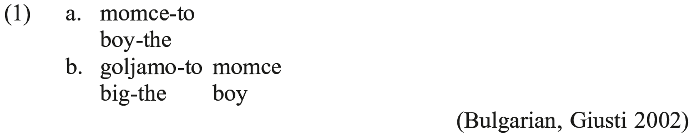

There were no articles in Old Church Slavonic <i>per se</i>, but the demonstratives <i>j-</i> and <i>tъ</i> were used as pronouns and formed part of the adjectival declension. These demonstratives declined for gender, number, and case, and <i>tъ</i> was the source of the article in Bulgarian and Macedonian. It is difficult to establish when the demonstrative <i>tъ</i> grammaticalized into the article, and the topic is a matter of some controversy. Dimitrova-Vulchanova and Vulchanov (2012) observe that the <i>Codex Suprasliensis</i>, an Old Church Slavonic manuscript from the 11th century, contains a homophonous element which may function either as a demonstrative or an enclitic article. When used as an article, this element lacks the deictic function of the demonstrative and may cliticize on different categories within the nominal expression. Moreover, in relics from the 10th−12th century the article and the demonstrative occur in complementary distribution. The article may also appear in contexts in which it is absent in the Greek texts that were the source for the Slavic translation, so it seems it may have emerged as an independent category already at that stage.

There are a number of syntactic differences between those Slavic languages with articles and those which lack the article. For example, only the latter permit Left-Branch Extraction, exemplified in (2). See Bošković (2005) for a discussion of more syntactic contrasts between the two types of languages.

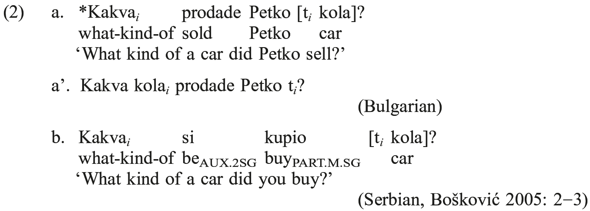

### 3.2. Pronominal forms

Pronouns appeared in six morphological cases in Old Church Slavonic. The dative and the accusative also had clitic variants. The chart in (3) gives a paradigm for the 1st and 2nd person forms with clitic forms to the right of their corresponding full forms. As was noted in the preceding section, for the 3rd person, suppletive variants of the demonstrative <i>j-</i> and <i>tъ</i> were used (cf. Lunt 1974: 65; Schmalstieg 1983: 62−65). Contemporary South Slavic languages have full and clitic forms of the dative and the accusative pronouns, on a par with Old Church Slavonic (the clitic forms usually need to appear in a special syntactic configuration, either verb-adjacent or in the second position, the full forms have a freer distribution). Polish has weak pronouns instead of clitics, which may not appear clause-initially and avoid clause-final position. East Slavic languages have only full pronouns, whose distribution in the clause largely parallels the distribution of other nominals.

<table>
<tr><td>(3)</td><td>Pronominal clitics in Old Church Slavonic</td></tr>
<tr><td></td><td>(Huntley 2002: 144)</td></tr>
</table>

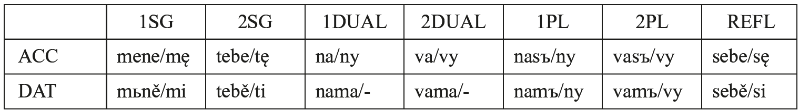

### 3.3. Adjectives

There were two declensions of adjectives and passive participles in Old Church Slavonic: the nominal declension (which produced the so-called “short forms”) and the pronominal declension (which had the so-called “long forms”). The pronominal declension contained the demonstrative pronoun <i>j</i>, which functioned like a postpositional definite article (Klemensiewicz, Lehr-Spławiński, and Urbańczyk 1965: 323−326; Stieber 1971: 76 ff.). The division between the two declension classes of adjectives is reflected in their syntax in contemporary West and East Slavic languages. Adjectives and participles of the “short” declension (such as <i>zdrów</i> in [4]) are restricted to predicative contexts, whereas “long” declension adjectives (such as <i>zdrowy</i> in [4]) occur in the attributive or the predicative position.

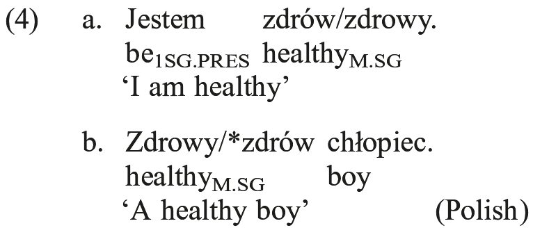

In South Slavic (e.g. in Serbian and Croatian) the two declensions may appear in either position. In general, adjectives in Slavic appear prenominally, but the occurrence of some forms in postnominal position may give rise to a classifying interpretation, in which the adjective specifies a category or a type that the modified noun belongs to (e.g. in Polish, Serbian, and Croatian, cf. Rutkowski 2006); in languages such as Russian, adjectives optionally occur postnominally in scientific terminology (cf. Trugman 2007).

## 4. Verbal morphosyntax and periphrastic formations.

Verbal formations deserve a more detailed treatment, because they display properties not found in many other Indo-European languages. These properties include rich aspectual distinctions and a special set of periphrastic tenses, which consist of the verb ‘be’ as the exclusive auxiliary and the so-called <i>l</i>-participle, which always agrees with the subject in <i>φ</i>-features.

### 4.1. Aspectual oppositions

Aspectual oppositions are morphologically marked on virtually all verbs in Slavic, as well as on nominalizations. Almost all verbs form aspectual pairs, in which each member describes the same kind of event, but one of them appears in the non-perfective aspect (such as <i>czytać</i> ‘to read’; <i>kupować</i> ‘to buy’ in Polish), whereas the other member occurs in perfective aspect (such as <i>przeczytać</i> ‘to have read’; <i>kupić</i> ‘to have bought’ in Polish).

The origin of the aspectual oppositions is related to the presence of aspectual tenses and morphological changes in aspect marking in Proto-Indo-European. Old Church Slavonic inherited two aspectual tenses from Proto-Indo-European: aorist and imperfect. Inflected verbs in Proto-Indo-European had a three-element structure: the stem was formed by a root followed optionally by a suffix and obligatorily by an inflectional ending. The suffix assigned a stem to an inflectional paradigm and expressed aspectual information, often associated as well with action type (Aktionsart). The inflectional endings specified the inflectional categories, such as <i>φ</i>-features; and in the case of nominal forms of the verb, they specified such grammatical categories as supine or infinitive (Schenker 2002: 83). In the prehistoric stages of most Indo-European dialects a particular suffix type, involving a simple vowel alternation *<i>e</i>/<i>o</i> often preceded by *<i>-i̯-</i>, termed “thematic”, tended to become productive; and in this type the vocalic suffix in certain persons, notably 1st sg. and 3rd pl., blended with the inflectional endings. As a result, verbs acquired a two-element structure. The modification is exemplified in (5), showing the Proto-Slavic paradigm of the verb *<i>nesti</i> ‘to carry’, with modifications of the forms of the 1st person singular and the 3rd person plural that have acquired a two-element structure.

<table>
<tr><td>(5)</td><td colspan="2">The modification of the paradigm of *<i>nesti</i> ‘to carry’ in the present tense in Proto-Slavic</td></tr>
</table>

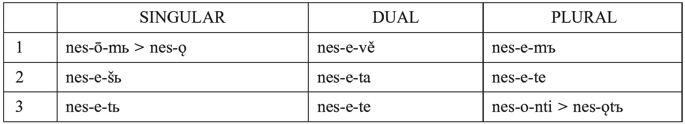

(Proto-Slavic, Długosz-Kurczabowa and Dubisz 2001: 265)

The fusion of the two verb-final morphemes in late-Proto-Indo-European had semantic consequences. Due to the weakening of the distinction between the aspect-marking thematic suffix and the inflectional endings, it was becoming increasingly difficult to mark aspectual oppositions. The change was taking place slowly, but the aspectual system of Late-Proto-Indo-European started to show gaps. In most Indo-European languages the inconsistencies were remedied through the development of new aspectual tenses, such as the Imparfait and Passé Simple in French. However, Proto-Slavic was in this respect the most conservative language in the Indo-European family, because it retained the original ways of marking aspect. Still, the aspectual system it had inherited from Proto-Indo-European was irregular, because sometimes there were no systematic aspectual pairs of verbs. Therefore, Proto-Slavic had to reconstruct and regularize the whole verbal system. At the same time, it further developed the aspectual tenses, the aorist and the imperfect, inherited from Proto-Indo-European. In this way aspect was doubly marked in Slavic: through the aspectual tenses and through the perfective/imperfective morphemes on aspectual pairs, as shown in (6), which presents four different tenses and independent perfective/imperfective distinctions.

<table>
<tr><td>(6)</td><td>Tense and aspect distinctions in Old Church Slavonic as exemplified by <i>(po)nesti</i> ‘to carry’</td></tr>
</table>

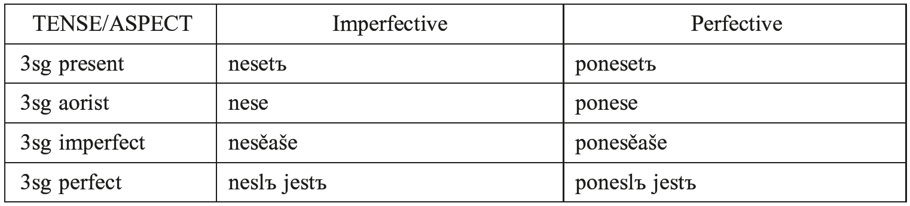

(OCS, cf. Schooneveld 1951: 97)

The coexistence of the aspectual tenses and the perfective and imperfective aspectual forms was a weak point of the Slavic tense system. It led to the decline of the aorist and the imperfect in all Slavic languages except for Bulgarian and Macedonian. The present perfect tense, which is discussed in the next section, was adopted as the default past tense.

### 4.2. Periphrastic formations

Slavic languages have developed a compound tense which is formed with the verb ‘be’ as the exclusive auxiliary in all contexts, irrespective of the transitivity of the main verb. This is a very uncommon pattern outside Slavic. In Germanic and Romance languages, it is found only in the dialect of Terracina (Italo-Romance) and Shetlandic (a variety of Scots English, cf. Bentley and Eythórsson 2004). In other Germanic and Romance languages, the verb ‘be’ is selected as the auxiliary only in unaccusative and passive structures.

The auxiliary ‘be’ is accompanied by the so-called “<i>l</i>-participle”, which is used as the main verb (cf. 7). In contrast to the Germanic and Romance languages, the participle in the compound tense is morphologically different from that in the passive construction.

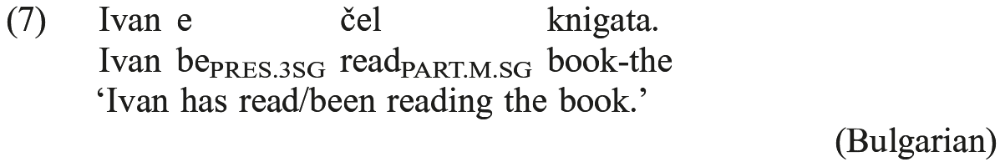

The <i>l</i>-participle is not a past participle, because in some Slavic languages it is used to express future meanings, as shown in (8a) for Polish and in (8b) for Serbian. Example (8b) represents the so-called <i>Future II</i> construction, which existed also in Old Church Slavonic, and is used to denote future events that in turn precede some other future events.

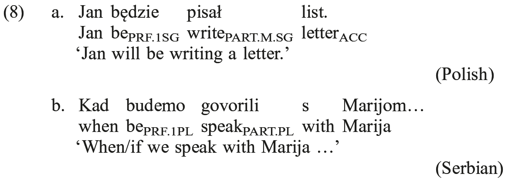

In both Old and Modern Slavic, the auxiliary ‘be’ shows aspectual distinctions, which determine the temporal interpretation of the whole construction. For instance, when ‘be’ is used in the imperfective aspect in Old Church Slavonic (cf. <i>běaxǫ</i> in 9a), the complex tense is interpreted as the pluperfect. When the verb ‘be’ occurs in the perfective (cf. <i>bǫdemъ</i> in 9b), it gives rise to the future perfect interpretation. The <i>l</i>-participle usually appears in the perfective form in Old Church Slavonic, but imperfective forms are also frequently found.

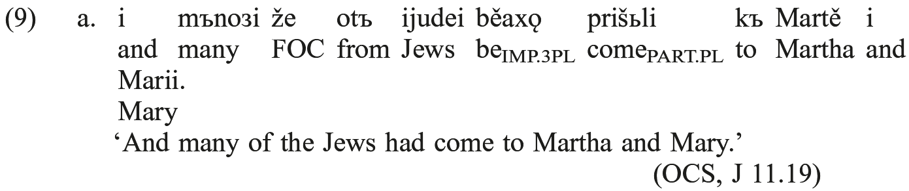

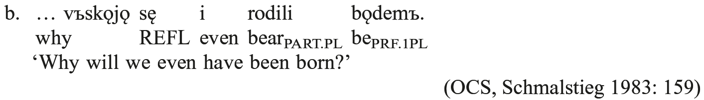

Diachronically, the <i>l</i>-participle is a Slavic innovation. It derives from a class of Indo-European adjectives ending in *<i>-lo</i>, which signified someone’s likelihood to perform a certain action or referred to a characteristic feature of the person involved. The *<i>-lo</i> forms also served as <i>nomina agentis</i> (agent participles) and proper names in many Indo-European languages. Examples of such forms include <i>discipulus</i> ‘student’ or <i>legulus</i> ‘gatherer of fallen olives’ in Latin, <i>tuphlós</i> ‘blind’ in Ancient Greek (cf. Damborský 1967), and <i>slaha</i>/<i>uls</i> ‘brawler’ in Gothic. At some point some of the *<i>-lo</i> adjectives were reanalyzed as participles in compound tenses in three Indo-European subgroups: Armenian, Slavic, and Tocharian, and to a lesser extent in Umbrian (only in future perfect forms) and Indic (Middle Indo-Aryan in active perfective participles; cf. Hewson and Bubenik 1997: 74). It is remarkable that the forms found in Armenian and Tocharian are not only morphologically similar to the Slavic <i>l-</i>participle, but that they may occur in compound tenses with the copula ‘be’ as well. The <i>l</i>-participle in Slavic has adjectival morphology, and agrees with the subject of a clause in gender and number, but is virtually not found outside the compound tenses. In this respect, it differs from the corresponding categories in many other Indo-European languages, which can be used as adjectives outside the compound tense paradigm.

As was noted in the previous subsection, due to the abundant aspect marking on verbal forms the aspectual system of Old Slavic and Old Church Slavonic was unstable and prone to modifications. The modifications are reflected in the decline of the aspectual tenses in all Slavic languages apart from Bulgarian and (in part) Macedonian and in the selection of the present perfect formed with the <i>l</i>-participle as the default past tense. The semantic modification was accompanied by the morphophonological weakening of the auxiliary ‘be’. As shown in chart (10) for Old Church Slavonic, initially only the 3rd person variants had clitic counterparts, <i>je</i> and <i>sǫ</i>.

<table>
<tr><td>(10)</td><td>The paradigm of <i>byti</i> ‘to be’ in the present tense (OCS, cf. Schmalstieg 1983: 138)</td></tr>
</table>

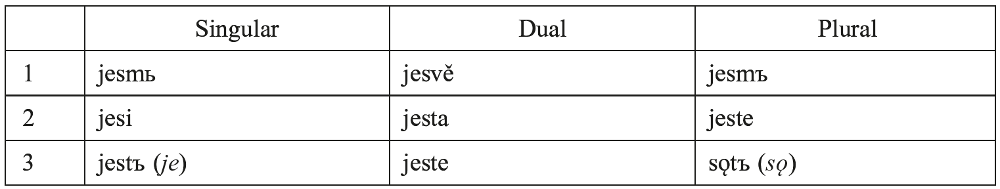

In contemporary South Slavic languages (exemplified by Serbian in 11a), all the present perfect auxiliaries are clitics. In Czech and Macedonian, the 3rd person auxiliary is null. In Polish, the auxiliary has been reduced to an affix, especially in the singular paradigm (cf. 11b). East Slavic languages had lost the perfect auxiliaries by the 16th−17th century.

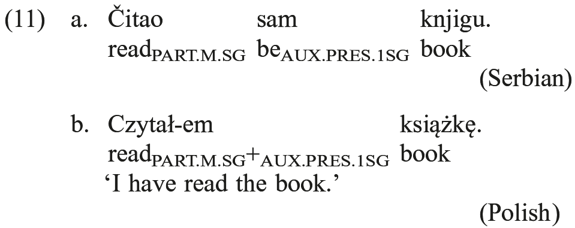

Kashubian and Macedonian are two Slavic languages that in addition to the compound tense constructed with the auxiliary ‘be’ and the <i>l</i>-participle have fully grammaticalized a periphrastic tense formed with the auxiliary ‘have’ and a form of the passive participle used as the main verb.

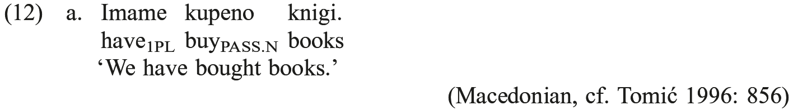

The morphological form of the passive participle does not depend on the feature specification of the subject of the clause and always appears in the singular neuter form (the masculine form is also an option in Kashubian). In this way the ‘have’-perfect differs from the ‘be’-perfect, in which the <i>l</i>-participle obligatorily agrees with the subject in <i>φ</i>-features.

In Kashubian unaccusative participles (such as <i>jidzenô</i> in 13a) agree with the subject and occur with the auxiliary ‘be’. The auxiliary ‘have’ selects transitive and unergative participles (cf. 13b), which do not agree with the subject or the object in <i>φ</i>-features.

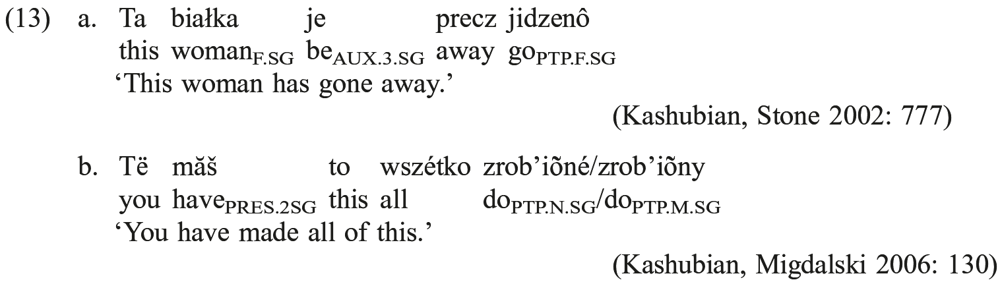

The periphrastic tense formed with the auxiliary ‘have’ is a recent innovation, not found in Old Church Slavonic. It was first attested in written Macedonian in 1706, and is assumed to have emerged under the influence of neighbouring languages, such as Arumanian and Greek, or, in the case of Kashubian, under the influence of German. A number of Slavic languages, such as Polish (cf. 14), Czech, Bulgarian, Serbian, and Croatian, display structures that resemble the periphrastic tense formed with the auxiliary ‘have’. However, these languages never use ‘have’ as a true auxiliary, as the construction is not possible in all contexts and the passive participle agrees with the object (see Migdalski 2007 for a detailed discussion).

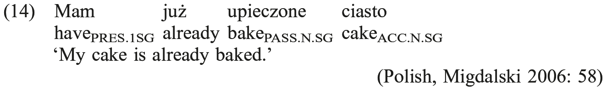

## 5. Word Order

As was noted in the introduction, word order in Slavic languages is relatively free and is often dictated by discourse requirements rather than by a need to mark grammatical relations. Clitics, which occur in the Wackernagel position after the clause-initial constituent in languages like Czech, Serbian, Croatian, and Slovene, are an exception to this freedom of word order (Bulgarian and Macedonian have clitics as well, but they are verb-adjacent and they do not need to appear in the second position). Moreover, the clitics cluster with each other and observe the rigid sequence presented in (15). The cluster opens with the particle <i>li</i>, which is often termed the “interrogative complementizer”. It occurs in questions and/or focus constructions. <i>Li</i> can be followed by a clitic expressing modality. The dative clitic precedes the accusative clitic, while the auxiliary clitics show an intriguing split concerning the positions of the 3rd person singular form, which in most South Slavic languages appears as the last member in the cluster.

<table>
<tr><td>(15)</td><td colspan="2"><i>li</i> > Modal > AUX (except 3rd SG) > REFL > DAT > ACC > 3rd SG AUX</td></tr>
<tr><td></td><td></td><td>(Tomić 1996; Franks and King 2000: 45)</td></tr>
</table>

Placement of the clitics in any other position than the second or splitting them from each other results in ungrammaticality.

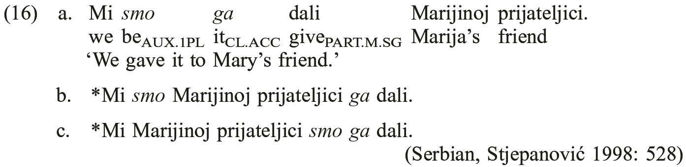

Importantly, even though clitics are phonologically deficient and their placement in this position was sometimes attributed to the requirement of a host that provides phonological support to them, their host must be a syntactic constituent, that is an element that is syntactically mobile. For example, since the first conjunct in coordinate structures is not syntactically mobile in Serbian and Croatian, clitics may not appear after it, in spite of the fact that it is a legitimate phonological host, as it is stressed.

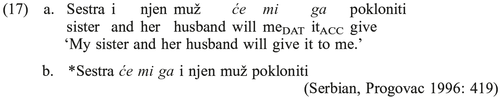

It is commonly assumed that the placement of clitics reflects the pattern of cliticization in early Indo-European languages described by Wackernagel (1892) and now generally known as Wackernagel’s Law. However, the generalized cliticization involving all types of clitics occurring in second position is a relatively recent development. Only three clitics uniformly appeared in second position in Old Church Slavonic: the question/focus particle <i>li</i>, the complementizer clitic <i>bo</i> ‘because’, and the focus particle <i>že</i> (note that these clitics form a natural class, as they all express Illocutionary Force of a clause, see Radanović-Kocić 1988 and Migdalski 2013). As shown in (18), they did not need to cluster with pronominal clitics.

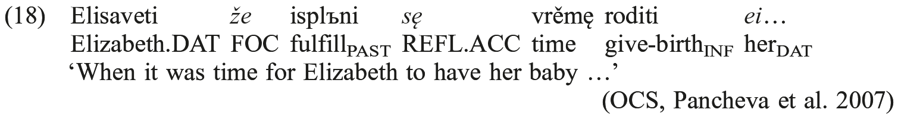

As a rule, pronominal clitics in Old Church Slavonic were postverbal. On the basis of the history of Serbian, we can conclude that the shift of the pronominal clitics to second position was a gradual process: around the 14th century they appeared in second position when they were accompanied by the regular Wackernagel clitics <i>li</i> and <i>že</i> mentioned above; subsequently, they came to occupy second position in the absence of these particles, but it took several centuries before the rule was generalized to all contexts, as examples of sentences with non-clustering clitics occurring in different positions are still found in 19th century Serbian texts (Radanović-Kocić 1988: 174).

Bulgarian and Macedonian clitics are verb-adjacent (these two languages differ in the direction of cliticization, see Bošković 2001 for details), on a par with contemporary Romance languages. Thus, they largely preserve the pattern of pronominal cliticization in Old Church Slavonic, although Pancheva (2005) observes that at least some clitics targeted second position in Bulgarian between the 9th and the 14th−15th centuries.

## 6. Sentence Syntax

One of the recurring observations of this chapter is that Slavic syntax is often determined by information structure requirements; thus, sentence word-order frequently depends on a need to focus or topicalize a certain constituent, which is then moved to the left periphery of a clause. Let us consider some word order permutations and the interpretations that they trigger on the basis of Serbian and Croatian. The basic word order is SVO, so the sentence in (19b) represents the most neutral pattern and is the most natural answer to the question in (19a).

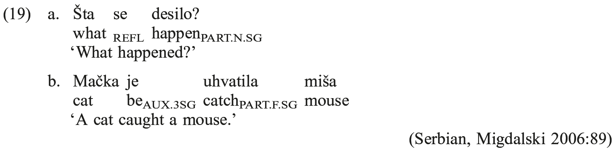

The subject <i>mačka</i> can be dropped if it has been previously mentioned and its referent is presupposed. In such a scenario the most unmarked word order involves the clause-initial placement of the <i>l</i>-participle.

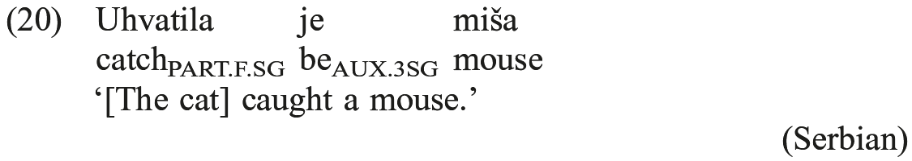

OVS order is possible, but it always occurs in semantically marked contexts. According to Stjepanović (1999: 92, 97), it may arise when both the verb and the object are presupposed, while the subject receives the main sentence stress and constitutes new information focus.

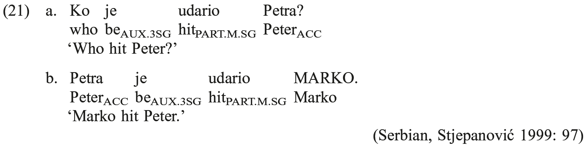

Like other elements placed at the beginning of a sentence, initial adverbs represent old information. Thus, the sentence in (22b) is a felicitous reply to the question <i>What happened yesterday?</i>

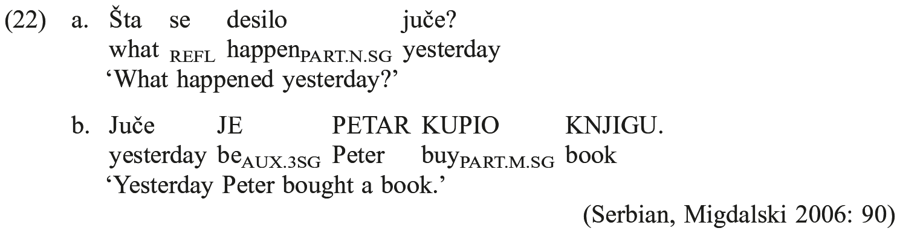

The event time of the predicate in (22b) is presupposed, so the temporal adverb <i>juče</i> ‘yesterday’ appears at the beginning of the clause. However, the string that follows it constitutes “new information” and correspondingly receives new information focus.

Summarizing, it has been shown that constituents whose referents are presupposed are placed at the beginning of a clause, while new information foci are located in the right periphery. However, it is not correct to attribute all the properties of Slavic syntax to discourse considerations. This chapter will conclude with a presentation of a feature of Slavic sentence syntax which is completely independent of information structure requirements and which has attracted considerable attention since Rudin (1988). This feature involves the so-called multiple <i>wh</i>-movement. As exemplified in (23), Slavic, unlike many other Indo-European languages, permits fronting of all <i>wh</i>-words in questions.

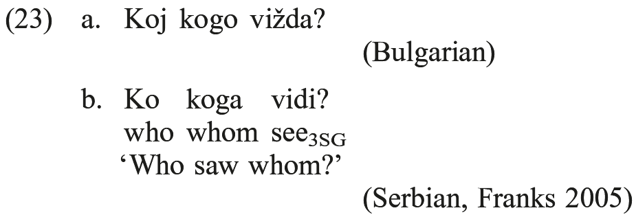

It has been observed that there are typological differences concerning this movement. For instance, whereas the ordering of the <i>wh</i>-elements with respect to each other is free in most Slavic languages, in Bulgarian and Macedonian they form a unit and move as a constituent. This typological division corresponds to a number of other properties of <i>wh</i>-movement, such as the superiority effect (that is, the ordering restriction that specifies that the <i>wh</i>-element referring to the subject must precede the <i>wh</i>-element referring to the object in multiple <i>wh</i>-questions), the impossibility of splitting the <i>wh</i>-sequence with any lexical material, and the availability of island extraction, which largely hold for Bulgarian, but which are not observed in the other languages (see Bošković 1999 for details and challenges to these generalizations).

Summarizing, this chapter has presented some properties of Slavic syntax and examined the way it has changed over time. For recent crosslinguistic overviews of the topic the reader is referred to Franks (1995, 2005), Franks and King (2000), Bošković (2001), Migdalski (2006), as well as to the volumes published in the <i>Formal Approaches to Slavic Linguistics</i> and <i>Formal Description of Slavic Languages</i> series.
