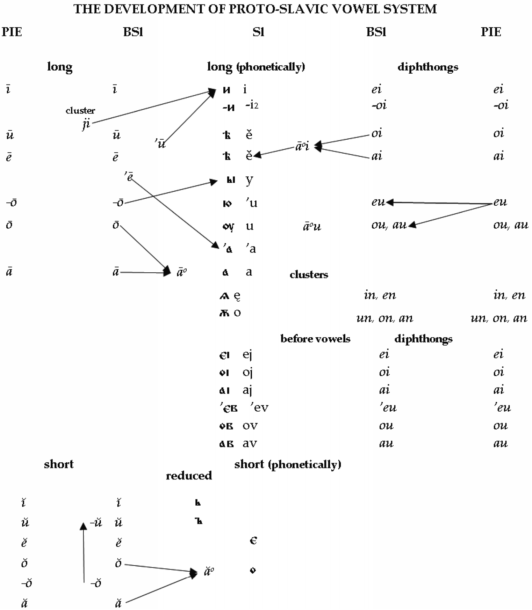

# 85. The dialectology of Slavic

1.Introduction

2.Early Proto-Slavic

3.Late Proto-Slavic

4.The dialectal disintegration of Proto-Slavic

5.South Slavic

6.West Slavic

7.East Slavic

8.Morphology

9.Lexical differences

10.References

## 1. Introduction

All Slavic languages have been derived from their common ancestor, Proto-Slavic. The majority of scholars consider Proto-Slavic to have developed from yet an earlier intermediate proto-language, Proto-Balto-Slavic. This larger entity belonged in turn to the <i>satem</i> group of Indo-European languages. Both Slavic and Baltic harbor some irregular traces of features found in <i>centum</i> dialects, e.g. OCS <i>kamy</i>, Russ. <i>kamenĭ</i> ‘stone’, Lith. <i>akmuõ</i> ‘id.’: <i>ašmuõ</i> ‘blade’, cf. Gk. <i>ákmōn</i> ‘anvil’, ON <i>hamarr</i> ‘hammer, crag, precipice’: Skt. <i>áśman-</i> ‘stone’; OCS <i>slušati</i> ‘hear’, Skt. (Vedic) <i>śroṣantu</i> ‘let them hear’: Lith. <i>klausýti</i> ‘hear’, OIr. -<i>cloathar</i> (subj.) ‘would hear’, Toch. A <i>klyoṣ-</i> ‘heard (3sg.)’, OHG <i>hlosên</i> ‘hear’; OCS <i>svekrŭ</i> ‘father-in-law’, Gk. <i>hékuros</i>, Lat. <i>socer</i>, OHG <i>swêhur</i>: Lith. <i>šẽšuras</i>, Skt. <i>çváçuras</i>, Av. <i>xᵛasura</i>- ‘id.’, etc. Some irregular correspondences reflect probably dialectal differences within Proto-Balto-Slavic. These are usually neglected in comparative grammars but are presented in etymological dictionaries, e.g. OCS <i>večerŭ</i> ‘evening’: Lith. <i>vãkaras</i>, Latv. <i>vakars</i> ‘id.’; OCS <i>redŭkŭ</i> ‘seldom’: Lith. <i>rẽtas</i> ‘id.’; OCS <i>devętĭ</i>, Lith. <i>devynì</i>, Latv. <i>deviņi</i> ‘9’: Pr. <i>newīnts</i> ‘9th’, cf. Gk. <i>ennéa</i>, Lat. <i>novem</i>, Skt. <i>náva</i>, Goth. <i>niun</i> ‘9’; OCS <i>domŭ</i> ‘house’: Lith. <i>nãmas</i> ‘id.’ but <i>dimstis</i> ‘yard, domain’, cf. Skt. <i>dámas</i>, Gk. <i>dómos</i>, Lat. <i>domus</i> ‘house’; OCS <i>dlŭgŭ</i> ‘long’: Lith. <i>ìlgas</i>, Latv. <i>i[image-glyph: l with tilde] gs</i> ‘id.’ but <i>Dùlgas</i>, <i>Dulgẽlė</i> (place-names in Lithuania of Yotvingian origin), cf. Hitt. <i>daluga</i>-, Gk. <i>dolikhós</i>, Skt. <i>dīrghás</i>, etc.

In the development of Proto-Slavic, there were two stages: <i>Early Proto-Slavic</i> (Germ. <i>Frühurslavisch</i>) and <i>Late Proto-Slavic</i> (Germ. <i>Späturslavisch</i>).

## 2. Early Proto-Slavic

Since for every prehistoric language writings are absent, Proto-Slavic has been reconstructed via the comparative method. Early Proto-Slavic had split off from Proto-Balto-Slavic and initially differed little from the latter. Its main structure was in general the same as that of Proto-Baltic, as reflected best in Lithuanian and to some extent Old Prussian and Latvian. Lithuanian in many cases preserves structures and forms that Proto-Slavic once possessed. Syllables in Early Proto-Slavic possessed consonant clusters inherited from Proto-Indo-European and could be open or closed. There was a phonological opposition of long and short vowels inherited from Proto-Indo-European and Proto-Balto-Slavic. It had a simple tone system, often called pitch accent, as evidenced by paradigmatic stress mobility in East Slavic languages, e.g. nom.: acc. sg. <i>ruká</i>: <i>rúku</i> ‘hand’, <i>golová</i>: <i>gólovu</i> ‘head’, <i>zimá</i>: <i>zímu</i> ‘winter’. Such mobility can be explained only by the former existence of a tonic system of the sort seen also in the corresponding Lithuanian items <i>rankà</i> (< *<i>rañkā´</i> < *<i>rañ´kā</i>): <i>rañką</i>, <i>galvà</i>: <i>gálvą</i>, <i>žiemà</i>: <i>žiẽmą</i>. Cases like Lith. <i>rankà</i>: <i>rañką</i>, Russ. <i>ruká</i>: <i>rúku</i> attest also the Law of Fortunatov/de Saussure. The Lithuanian accent paradigm with fixed high intonation on the first syllable (immobile) finds many correspondences in the East Slavonic languages in words with fixed stress on the first syllable, e.g. Lith. <i>líepa</i>: Russ. <i>lípa</i> ‘lime tree’, Lith. <i>kriáušė</i>: Russ. <i>grúša</i> ‘pear’, Lith. <i>šiáurė</i>: Russ. <i>séver</i> ‘north’, etc.

## 3. Late Proto-Slavic

By this stage of its development, the whole system of Proto-Slavic had undergone extensive modifications. The main accelerant of structural changes was the tendency for increasing sonority within all syllables, which affected both inherited Indo-European vocabulary and loan words. One manifestation of this tendency was the law of open syllables, which caused fundamental changes in the structure of words:

1. All consonant clusters were changed or simplified, e.g. *<i>ss</i>, *<i>zs</i> (> *<i>ss</i>), *<i>ts</i> (> *<i>ss</i>), *<i>ds</i> (> *<i>ts</i> > *<i>ss</i>) > <i>s</i>: aor. *<i>nēssŭ</i> > OCS <i>něsŭ</i> ‘I carried’; *<i>izsouxiti</i> > OCS <i>isušiti</i> ‘dry out’; aor. *<i>čĭtsŭ</i> > *<i>čīsŭ</i>, OCS <i>čisŭ</i> ‘I read’; aor. *<i>vĕdsŭ</i> > *<i>vĕtsŭ</i> > *<i>vēsŭ</i>, OCS <i>věsŭ</i> ‘I led’; *<i>ps</i> > <i>s</i>: *<i>opsa</i> > OCS <i>osa</i> ‘wasp’: Lith. (dial.) <i>vapsà</i>.
2. The combination of vowel + nasal changed into a nasalized vowel, e.g. *<i>ronka</i> > OCS <i>rǫka</i> ‘hand, arm’: Lith. <i>rankà</i>, *<i>imti</i> > OCS <i>(vŭz)ęti</i> ‘take’: Lith. <i>im˜ ti</i>.
3. The combination of vowel + liquid became syllabic sonorants [r̥], [l̥], written <rĭ>, <lĭ>, respectively, e.g. *<i>virs</i>- > OCS <i>vrĭxŭ</i> ‘above, up’: Lith. <i>viršùs</i>, *<i>vilkos</i> > OCS <i>vlĭkŭ</i> ‘wolf’: Lith. <i>vi[image-glyph: l with tilde] kas</i> or underwent liquid metathesis to RV; *<i>korvā</i> ‘cow’ > Blg. <i>kráva</i>, S.-Cr. <i>krȁva</i>, Cz. <i>kráva</i>, Slvk. <i>krava</i>, Pol. <i>krowa</i> (on Russ., Ukr. <i>koróva</i>, see 7): Lith. <i>kárvė</i>; *<i>bolto</i> > OCS <i>blato</i> ‘swamp’: Lith. <i>báltas</i> ‘white’.
4. Consonants at the end of closed syllables were dropped, e.g. *<i>tos</i>, *<i>tod</i> > OCS <i>tŭ</i>, <i>to</i> ‘that, this’, *<i>stolos</i> > OCS <i>stolŭ</i> ‘table’: Lith. <i>stãlas</i>, *<i>ognis</i> > OCS <i>ogn̑ĭ</i> ‘fire’: Lith. <i>ugnìs</i>; *<i>sūnus</i> > OCS <i>synŭ</i> ‘son’: Lith. <i>sūnùs</i>, etc. In some cases, a change of syllabic boundaries took place or anaptyctic vowels could appear, e.g. Gk. <i>psalmós</i> > OCS <i>pŭsalŭmŭ</i> ‘Psalm’, Gk. <i>Aíguptos</i> > OCS <i>egüpĭtŭ</i> ‘Egypt’, Gk. <i>Paũlos</i> > OCS <i>pavŭlŭ</i> ‘Paul’, etc.

The new phonemic arrangement of syllables could have the sequence (1) fricative + (2) occlusive(/affricate) + (3) sonorant (<i>nasal</i>, <i>liquid</i>) or <i>v</i> + (4) vowel. (In a reduced variant one or more members of the chain could be absent, e.g. 1 + 4, 2 + 4, 3 + 4, etc.)

The previous phonological opposition of long and short vowels was modified into a new qualitative opposition (see Fig. 85.1).

The disappearance of the phonological opposition of long and short vowels automatically caused the loss of the relevant pitch accent. The reduced vowels <i>ĭ</i> and <i>ŭ</i> (‘jers’) could be in a strong or weak position. The strong position of jers was in stressed syllables (e.g. OCS <i>sŭnŭ</i> ‘dream’, <i>tŭ</i> ‘this, that’, <i>dĭnĭ</i> ‘day’, <i>vĭsĭ</i> ‘all’) and in syllables followed by other syllables with jers (e.g. <i>šĭpŭtati</i> ‘to whisper’, <i>kŭ mŭně</i>, Russ. <i>ko mne</i> ‘to me’). The weak position of jers was in unstressed endings and in unstressed syllables before normal vowels, e.g. OCS <i>synŭ</i> ‘son’, <i>dĭnĭ</i> ‘day’; <i>dŭva</i> ‘two’; <i>sŭborŭ</i> ‘council’, <i>dĭni</i> ‘days’. Later on in Slavic dialects, all jers in weak position disappeared and in strong position changed into normal vowels. The modification of the vowel system took place separately in early Slavic dialects that later gave rise to modern Slavic languages.

The system of consonants was immensely modified after palatalizations of velars. There were three Slavic palatalizations − two regressive before the front vowels <i>i</i> and <i>e</i> and one progressive that took place after these vowels. After the first Slavic palatalization <i>k’</i> > <i>č’</i>, <i>g’</i> > <i>ž’</i>, <i>x’</i> > <i>š’</i>, e.g. OCS <i>živŭ</i> ‘alive, lively’: Lith. <i>gývas</i>, Skt. <i>jīvás</i>, Lat. <i>vīvus</i>; OCS <i>četyre</i> (m.), <i>četyri</i> (f.) ‘four’: Lith. <i>keturì</i>, OIr. <i>ceth(a)ir</i>; OCS <i>tixŭ</i> ‘still’, <i>tišina</i> ‘stillness’. This process took place prior to the monophthongization of diphthongs. The appearance of new front monophthongs from former diphthongs gave rise to the second palatalization: <i>k’</i> > <i>c’</i>, <i>g’</i> > <i>dz’</i> > <i>z’</i>, <i>x’</i> > <i>s’</i>, e. g. OCS <i>cěna</i> ‘price, value’: Lith. <i>káina</i>, Gk. <i>poinḗ</i> ‘price, penalty’, Av. <i>kaēnā-</i> ‘punishment’, Ir. <i>cin</i> ‘guilt, debt’; OCS <i>vlĭkŭ</i> ‘wolf’ (: Lith. <i>vi[image-glyph: l with tilde] kas</i>), nom. pl. <i>vlĭci</i> (: Lith. <i>vilkaĩ</i>); OCS <i>dzělo</i> ‘very, much’: Lith. <i>gailùs</i> ‘sharp, harsh, revengeful’, Goth. <i>gailjan</i> ‘make glad, happy’; OCS f. <i>naga</i> ‘nude’, dat. sg. <i>nadzě</i>: Lith. <i>núogai</i>; OCS <i>suxŭ</i> ‘dry’ (: Lith. <i>saũsas</i>), dat., loc. sg. <i>susě</i> (: Lith. <i>sausaĩ</i>), <i>suša</i> (< *<i>suxii̯a</i>) ‘land’. The third palatalization had the same results but took place only after the vowels <i>ĭ</i>, <i>i</i>, and <i>ę</i>.

The appearance of open syllables exercised a profound influence upon the whole morphological system of Proto-Slavic, causing the deletion of all final consonants, reduction of vowels in endings, and the appearance there of the reduced jer vowels (<i>ŭ</i> and <i>ĭ</i>). As a result, the differences between many forms in distinct paradigms of nouns and verbs were lost, many endings coming to coincide with each other and thereby causing a mixture and simplification of paradigms. In the system of declension, e.g., nom. and acc. sg. of *<i>o-</i> and *<i>u-</i> stems as well as of *<i>i̯o-</i> and *<i>i-</i> stems became identical, cf. nom. and acc. sg. (*<i>o</i>-stems) OCS <i>vlĭkŭ</i> ‘wolf’ (: Lith. <i>vi[image-glyph: l with tilde] kas</i> [nom.], <i>vi[image-glyph: l with tilde] ką</i> [acc.] < *-<i>os</i>, *-<i>om</i>) and (*<i>u</i>-stems) OCS <i>synŭ</i> ‘son’ (: Lith. <i>sūnùs</i> [nom.], <i>sū́nų</i> [acc.] < *-<i>us</i>, *-<i>um</i>); and nom. and acc. sg. (*<i>i̯o</i>-stems) OCS <i>nožĭ</i> ‘knife’ (cf. Lith. <i>kẽlias</i> [nom.], <i>kẽlią</i> [acc.] < *-<i>i̯os</i>, *<i>-i̯om</i>, ‘road’) and (*<i>i</i>-stems) OCS <i>noštĭ</i> ‘night’ (: Lith. <i>naktìs</i> [nom.], <i>nãktį</i> [acc.] < *<i>-is</i>, *<i>-im</i>,), etc. In spite of the loss of IE verbal endings in Late Proto-Slavic, its complicated temporal system continued to exist.

## 4. The dialectal disintegration of Proto-Slavic

The 7th century marks the beginning of the gradual breakup of Proto-Slavic, leading to the appearance of huge dialectal zones. These at first presented a common dialectal continuity until it was broken by the movement of Hungarians into Pannonia in the 10th century. As a result, West Slavs were separated from South Slavs rendering direct contact between them impossible. The break-up of the Slavic dialectal continuity produced three dialectal groups: <i>East Slavic</i>, <i>West Slavic</i>, and <i>South Slavic</i>, which were, however, connected by numerous common isoglosses, many of which are still preserved in modern Slavic languages and their dialects. It is supposed that South Slavs came to the Balkans in two streams and that between them there was a large non-Slavic population of Vlachs. Although East and South Slavic have been separated by vast territories for many centuries, they share slightly more isoglosses in common than they do with West Slavic. We regard only the main dialectal features that are common to all groups of Slavic languages.

For the appearance of the three Slavic dialect groups, the most important developments were the following modifications of the Common Slavic language system. The jer vowels <i>ĭ</i> and <i>ŭ</i> in strong position changed into different vowels. The nasal vowels <i>ǫ</i> and <i>ę</i> underwent variant developments, as did <i>ě</i> and <i>y</i>, jery, and the vowels <i>ĭ</i> and <i>ŭ</i> in weak position disappeared. In separate South and West Slavic dialects new oppositions of long and short vowels appeared, as did changes in the place of stress as well as the development of pitch accent. For the consonant system the most important changes were: modification of oppositions of hard and soft consonants; changes of <i>rĭ</i> [r̥], <i>lĭ</i> [l̥]; of clusters *<i>kv</i>-, *<i>gv-</i>; *<i>tj</i>, *<i>kt’</i>, *<i>gt’</i>, and *<i>dj</i>; *(T)orT, *(T)olT, and *(T)erT, *(T)elT (T = any obstruent); and labial consonant + [j].

## 5. South Slavic

It is supposed that Slavs migrated to the South of Europe in two waves which took place at different times and via different routes. As a result, Slavs came to inhabit almost the entire Balkan region as well as some adjacent territories. Earlier these territories had been occupied by various tribes who spoke different languages. Their assimilation exercised a significant influence upon the ethnogenesis of the South Slavs and the formation of ancient dialects. These facts explain why the South Slavs had been split into two groups − Eastern and Western. The latter group gave rise to Slovenian, Serbian, and Croatian and the former to Bulgarian and Macedonian. Serbian and Croatian were further subdivided into three dialect groups: <i>Štokavian</i>, <i>Čakavian</i>, and <i>Kajkavian</i> based on the form of the interrogative pronoun ‘what?’, which is pronounced <i>što</i> in the first, <i>ča</i> in the second and <i>kaj</i> in the third group. In historical times the South Slavs were subjugated by different conquerors, and their states were split. Slovenian, Croatian, and parts of Serbian lands were for a long time incorporated into Austria, Hungary, and their common state Austro-Hungary, whereas Serbia, Bulgaria, and Macedonia became part of the Ottoman Empire. These historical events, with the attendant linguistic contacts which they produced, have influenced all South Slavic dialects. We first examine the features that were inherited from the time of the split of Proto-Slavic and are common to all South Slavic dialects.

### 5.1. Stress and vowels

The development of the vowel systems in eastern and western areas of South Slavic was different. In Bulgarian and Macedonian the vowel system lacks an opposition of short and long vowels. In Eastern Bulgarian dialects (the basis of the literary language), there are six vowel phonemes (<i>i</i>, <i>u</i>, <i>ŭ</i>, <i>e</i>, <i>o</i>, <i>a</i>). Western Bulgarian and its neighbor Macedonian have a five-vowel system, lacking <i>ŭ</i>. (The Bulgarian vowel transcribed <i>ŭ</i> in this article is the historical back jer <i>ŭ</i>; however, in modern synchronic treatments of Bulgarian it is usually transliterated as <i>ă</i>, better reflecting its pronunciation in the modern language.) In addition, eastern and western dialects differ principally in two aspects. First, in the former the accent is free and vowels are reduced in unstressed position. In the latter, the stress in words of three or more syllables is fixed on the third syllable from the end and in words of two syllables it is fixed on the first syllable, and unstressed syllables do not show vowel reduction. In Eastern Bulgarian dialects these restrictions on the position of the accent do not apply, and the place of stress is phonologically relevant: Bulg. <i>vŭ̀lna</i> ‘wool’: <i>vŭlnà</i> ‘wave’, <i>pàrа</i> ‘vapor’: <i>pаrà</i> ‘coin’, <i>ìmа</i> ‘has’: (аоr.) <i>imà</i> ‘had’.

<!-- source-file: content/07_chapter01_10.xhtml -->

A new phonological opposition of long and short vowels has developed in western areas of South Slavic. Besides that, in Slovenian there is in addition an opposition of long close <i>ó</i>, <i>é</i> and open <i>ȏ</i>, <i>ȇ</i> that is also relevant for lexical and grammatical differentiation (Slvn. <i>kùp</i> ‘haystack, crowd’: <i>kúp</i> ‘buy’; <i>bràt</i> ‘brother’: <i>brát</i> ‘to read’; <i>vèč</i> ‘more’: g. pl. <i>véč</i> [< <i>véčа</i>] ‘assembly, gathering’; <i>péti</i> ‘to sing’: dat.-loc. sg. <i>pȇti</i> [< <i>pȇtа</i> ‘heel’]; <i>téle</i> ‘these’: <i>tȇle</i> ‘calf’; 3. sg. <i>vódi</i>: 2. sg. imper. <i>vȏdi</i> [< <i>voditi</i>] ‘conduct’; <i>vòd</i> ‘wire’: g. pl. <i>vȏd</i> [< <i>vȏdа</i>] ‘water’). The accent in Slovenian is free and mobile and can be dynamic or tonal. Most of the tonal dialects have the following intonations: (1) an irrelevant short (marked with the grave `): <i>bòb</i> ‘bean’, <i>ràk</i> ‘cancer’; (1a) short and rising (`) and (1b) short and falling (marked with the double grave ˋˋ): <i>brȁt</i> ‘brother’, <i>krȕh</i> ‘round’, <i>sȉr</i> ‘cheese’. (2) long and falling (marked with the inverted breve ̑ or the circumflex ͡; close <i>o</i> and <i>e</i> have a dot below): <i>dȃn</i> ‘day’, <i>dȗh</i> ‘spirit, breath’, <i>sȋn</i> ‘son’ and (3) long and rising (marked with the acute ´): <i>žéna</i> ‘wife’, <i>člóvek</i> ‘man, human being’, <i>zíma</i> ‘winter’. The intonations are phonologically relevant: <i>gràd</i> ‘hail’: <i>grȃd</i> ‘castle’ (: g. sg. <i>gráda</i>), <i>pót</i> ‘way, road’: <i>pȏt</i> ‘sweat’; g. sg. <i>goré</i>: nom. pl. <i>gorȇ</i> (< <i>góra</i>) ‘hill’; 2. pl. ind. <i>kosíte</i> ‘you eat’: 2. pl. imper. <i>kosȋte</i>, etc. The place of stress in many instances has been changed. In some circumstances it could be retracted onto the previous syllable (similar to Serbian and Croatian): Slvn. (tonic stress) <i>róka</i> / (dynamic stress) <i>rȏka</i>: Srb.-Cr. <i>rúka</i>: Russ. <i>ruká</i> ‘hand, arm’; Slvn. <i>gláva</i>: Srb.-Cr. <i>gláva</i>: Russ. <i>golová</i> ‘head’; Slvn. <i>žéna</i> / <i>žȇna</i>: Srb.-Cr. <i>žéna</i>: Russ. <i>žená</i> ‘wife’. In other instances it was shifted onto the following syllable: Slvn. <i>nebȏ</i> / <i>nebó</i>: Srb.-Cr. <i>nȅbo</i>: Russ. <i>nébo</i> ‘sky’; Slvn. <i>zlatȏ</i> / <i>zlató</i>: Srb.-Cr. <i>zlȃto</i>: Russ. <i>zóloto</i> ‘gold’; Slvn. <i>srcȇ</i> / <i>srcé</i>: Srb.-Cr. <i>sȑce</i>: Russ. <i>sérdce</i> ‘heart’. In some forms of paradigms, the shift can be absent: g. sg. Slvn. <i>žené</i> − Russ. <i>žеný</i>: Srb.-Cr. <i>žènē</i>; loc. sg. Slvn. <i>sŕcu</i> − Srb.-Cr. <i>sȑcu</i>, Russ. <i>sérdce</i>. Short vowels in syllables with retracted stress could become long: Slvn. <i>ókno</i> / <i>ȏkno</i>: Srb.-Cr. <i>òkno</i>: Russ. <i>оknó</i> ‘window’; Slvn. <i>vóda</i> / <i>vȏda</i>: Srb.-Cr. <i>vòda</i>: Russ. <i>vodá</i> ‘water’, but Slvn. <i>gràd</i>: Srb.-Cr. <i>grȁd</i>: Russ. <i>grad</i> ‘hail’; Slvn. <i>lùk</i>: Srb.-Cr. <i>lȕk</i>: Russ. <i>luk</i> ‘onion’, etc.

In Serbian and Croatian, pretonic vowels are usually short, and reduction of unstressed vowels is absent. The stressed syllabic <i>r̥</i> also has an intonation. As in Slovenian, four intonations are marked:

1. short falling: Srb.-Cr. <i>pȁs</i> ‘dog’, <i>lȉpa</i> ‘lime tree’;
2. short rising: <i>žèna</i>, <i>ìgra</i> ‘play’;
3. long falling: <i>dȃn</i> ‘day’, <i>mȇd</i> ‘honey’;
4. long rising: <i>rúka</i>, <i>gláva</i>.

The intonations are also phonologically relevant: Srb.-Cr. <i>grȁd</i> ‘hail’: <i>grȃd</i> ‘castle’, <i>pȁs</i> ‘dog’: <i>pȃs</i> ‘belt’, <i>lȕk</i> ‘onion’: <i>lȗk</i> ‘bow’; Srb.-Cr. <i>mláda</i>: Russ. <i>molodá</i> ‘young’ [pred. adj.], Srb.-Cr. f. <i>mlȃdā</i>: Russ. <i>molodája</i> [attrib. adj.] f. Accent in Serbian and Croatian is free and mobile, but there are some restrictions on its place and usage of intonations. As a rule, a final syllable is unstressed. Monosyllabic words have only one of two falling intonations: Srb.-Cr. <i>grȁd</i> ‘hail’, <i>grȃd</i> ‘castle’, <i>lȕk</i> ‘onion’, <i>lȗk</i> ‘bow’, <i>pȁs</i> ‘dog’, <i>dȃn</i> ‘day’. In disyllabic and polysyllabic words intonation of the first syllable can vary: Srb.-Cr. <i>zlȃto</i> ‘gold’, <i>vȏjna</i> ‘war’, acc. sg. <i>glȃvu</i> ‘head’: <i>gláva</i> ‘head’, <i>rúka</i> ‘hand’, <i>ȉstina</i> ‘truth’, 1. pl. <i>pȋšemo</i> ‘we write’, <i>nòsiti</i> ‘carry’, <i>písati</i> ‘write’. In words having more than two syllables, accented internal syllables can have only one of two rising intonations: <i>dovèsti</i> ‘carry’, <i>nogári</i> ‘easel’. The place of intonation has often been changed. In most cases it has been retracted onto the previous syllable: Srb.-Cr. <i>rúka</i>, Slvn. <i>róka</i>: Russ. <i>ruká</i>; Srb.-Cr. <i>gláva</i>, Slvn. <i>gláva</i>: Russ. <i>golová</i>; Srb.-Cr. <i>žèna</i>, Slvn. <i>žéna</i>: Russ. <i>žená</i> ‘woman’; Srb.-Cr. <i>vòda</i>, Slvn. <i>vóda</i>: Russ. <i>vodá</i> ‘water’. We must pay attention to the fact that the appearance of the new opposition of long and short vowels has developed independently not only in West Slavic and South Slavic, but also in various South Slavic dialects, cf. Slvn., Srb.-Cr. <i>grȃd</i>: Cz. <i>hrad</i>: Pol. <i>gród</i>, LSorb. <i>hród</i>, ‘castle’; Slovn., Srb.-Cr. <i>mláda</i> (<i>mlȃd</i>): Cz. <i>mladá</i> ‘young’; Slvn. <i>lȏk</i>, Srb.-Cr. <i>lȗk</i>: Cz. <i>luk</i> ‘bow’; Slvn. <i>ókno</i> / <i>ȏkno</i>: Srb.-Cr. <i>òknо</i> ‘window’; Slvn. <i>zlatȏ</i> / <i>zlató</i>: Srb.-Cr. <i>zlȃto</i> ‘gold’; Slvn. <i>nebȏ</i> / <i>nebó</i>: Srb.-Cr. <i>nȅbo</i> ‘sky’.

The jers in a strong position have often merged in South Slavic. In Slovenian <i>ĭ</i> and <i>ŭ</i> become <i>ə</i>/<i>e</i> [ə] and in some cases <i>a</i> (<i>ĭ</i>: Slvn. <i>pɘ̀s</i> / <i>pès</i> ‘dog’, <i>vès</i> ‘village’, but <i>dȃn</i> / <i>dán</i> ‘day’; <i>ŭ</i>: <i>sɘ̀n</i> (<i>sàn</i>) / <i>sèn</i> ‘dream’, <i>lèž</i> ‘lie’, but <i>mȃh</i> / <i>máh</i> ‘moss’). The latter development was usual for Serbian and Croatian (Srb.-Cr. <i>pȁs</i> ‘dog’, <i>òvas</i> ‘oat’; <i>sȁn</i>, <i>lȃž</i>). The vowel <i>ĭ</i> becomes <i>e</i> and in some cases <i>ŭ</i> (<i>ă</i>) in some western dialects of Bulgarian, <i>e</i> in Macedonian (Bulg. <i>pŭs</i> / <i>pes</i>, Macd. <i>pes</i>, <i>den</i>; Bulg. <i>tŭ̀men</i> − Macd. <i>temen</i> ‘dark’. The vowel <i>ŭ</i> <ъ> remains as such orthographically in Bulgarian and becomes <i>o</i> in Macedonian (Bulg. <i>sŭn</i> − Macd. <i>son</i> ‘sleep’, Bulg. <i>mŭ̀x</i> − Macd. <i>mov</i> ‘moss’).

In Slovenian the difference between <i>e</i> and <i>ě</i> has been lost and a new long <i>ē</i> has appeared from both vowels (<i>e</i>: <i>rébro</i> / <i>rȇbro</i> ‘rib’, <i>mȇd</i> ‘honey’; <i>ē</i>: <i>réka</i> ‘river’, <i>lȇs</i> ‘wood’). The same is true of Macedonian, where, however, only short <i>e</i> is possible (Macd. <i>med</i>, <i>reka</i>). In Bulgarian this process involved some peculiarities. <i>ě</i> becomes <i>e</i>, merging with the latter, when stressed before a soft consonant or in unstressed position (OBulg. <i>běl-</i> ‘white’ > Bulg. <i>bèlene</i> ‘whitening’, <i>rekà</i> ‘river’ beside <i>med</i> ‘honey’, <i>vèčer</i> ‘evening’, both with original <i>e</i>). However, stressed <i>ě</i> becomes <i>ja</i> if it was followed by a hard consonant (Bulg. <i>bjal</i>, <i>djado</i> ‘grandfather’). The development of <i>e</i> and <i>ě</i> was very complicated in Serbian and Croatian. In particular instances <i>e</i> could become long (Srb.-Cr. <i>mȇd</i> but g. sg. <i>mȅda</i>, Srb.-Cr. <i>jéla</i> ‘fir’ but ChSl. <i>jela</i>, cf. Latv. <i>egle</i>, Lith. <i>ẽglė</i>; Srb-Cr. <i>jȇž</i> ‘hedgehog’, g. sg. <i>jéža</i>, but ChSl. <i>ježĭ</i>, cf. Lith. <i>ežỹs</i>). The vowel <i>ě</i> underwent various changes which have become very important for the classification of Serbian and Croatian dialects, splitting them into three groups: <i>Ekavian</i> (<i>ě</i> > <i>e</i>), <i>Ikavian</i> (<i>ě</i> > <i>i</i>), and <i>Ijekavian</i> (<i>ě</i> > <i>ije</i> / <i>je</i>): Srb.-Cr. <i>delo</i>, <i>dilo</i>, <i>djelo</i> ‘work’; <i>telo</i>, <i>tilo</i> and <i>tijelo</i> ‘body’. Literary Croatian is based on the <i>Ijekavian</i> norms, whereas literary Serbian allows <i>Ekavian</i> and <i>Ijekavian</i> ones.

The nasalized <i>ę</i> has undergone denasalization to <i>e</i> in Slovenian, Serbian, and Croatian (Slvn. <i>svȇt</i> / <i>svét</i> ‘holy’, Srb.-Cr. <i>svȇt</i>; Slvn. <i>desȇt</i> / <i>desét</i>, Srb.-Cr. <i>dȅset</i> ‘ten’). The nasalized <i>ǫ</i> has undergone a parallel denasalization to <i>o</i> in Slovenian and to <i>u</i> in Serbian and Croatian (Slvn. <i>mȏž</i> / <i>móž</i> − Srb.-Cr. <i>mȗž</i> ‘husband’; Slvn. <i>róka</i> / <i>rȏka</i> − Srb.-Cr. <i>rúka</i> ‘hand, arm’). The development of the nasalized vowels in the Eastern dialects of South Slavic was complicated. In Macedonian <i>ę</i> becomes <i>e</i> and (in rare cases) <i>а</i> (Macd. <i>svet</i>, <i>deset</i>, but <i>jazik</i> ‘tongue’). Nasalized <i>ǫ</i> becomes <i>a</i> and (as in Serbian and Croatian, but in rare cases) <i>u</i> (Macd. <i>maž</i>, <i>raka</i>, <i>kuḱa</i> ‘house’. In Middle Bulgarian <i>ǫ</i> and <i>ę</i> have merged to <i>ǫ</i>, which becomes <i>ŭ</i> (<i>ă</i>), falling together with the old <i>ŭ</i>. In some Bulgarian dialects <i>ę</i> becomes <i>е</i>, resulting in <i>ŭ</i> / <i>e</i> variation: Bulg. <i>žŭ̀tva</i> and <i>žètva</i> ‘reaping’, <i>ezìk</i>, <i>svet</i> / <i>svjat</i>, <i>dècet</i>.

### 5.2. Consonants and clusters

In general the Proto-Slavic system of consonants does not undergo much modification in South Slavic. All dialects have maintained the former opposition of voiceless and voiced consonants. Voiced consonants usually become voiceless before voiceless consonants and in final position; and vice versa, voiceless consonants become voiced before voiced consonants. Similar phenomena are seen in Serbian and Croatian dialects: Srb.-Cr. <i>bȇg</i> / <i>bijȇg</i> ‘flight’ but <i>bèkstvo</i> / <i>bjèkstvo</i> ‘running’; Srb.-Cr. <i>rédak</i> / <i>rijédak</i> ‘seldom, fluid’ but <i>rétkost</i> / <i>rijétkost</i> ‘rarity’; Srb.-Cr. <i>svȁt</i> ‘marriage broker’ but <i>svȁdba</i> ‘marriage’. However, as is the case in Ukrainian, voiced consonants have not undergone devoicing in final position, and therefore stand in phonological opposition to corresponding voiceless consonants: Srb.-Cr. <i>rȃd</i> ‘work, labour’: <i>rȁt</i> ‘war’, <i>sȃd</i> ‘planting, implantation’ / <i>sȁd(а)</i> ‘now’: <i>sȁt</i> ‘clock, hours’.

The opposition of hard and soft consonants is manifested strongly in Bulgarian, where it is reflected by 16 pairs before non-front vowels: <i>b</i> − <i>b’</i>‚ <i>p</i> − <i>p’</i> ‚ <i>v</i> − <i>v’</i>‚ <i>f</i> − <i>f’</i>‚ <i>d</i> − <i>d’</i>‚ <i>t</i> − <i>t’</i>‚ <i>z</i> − <i>z’</i>, <i>s</i> − <i>s’</i>‚ <i>c</i> − <i>c’</i>, <i>g</i> − <i>g’</i>, <i>k</i> − <i>k’</i>‚ <i>h</i> − <i>h’</i>‚ <i>m</i> − <i>m’</i>‚ <i>n</i> − <i>n’</i>‚ <i>l</i> − <i>l’</i>, <i>r</i> − <i>r’</i>. In other South Slavic areas this opposition has been severely reduced or even lost. In Bulgarian, soft consonants in final position have been depalatalized: <i>bojàzŭn</i> ‘fear’, <i>zvjar</i> ‘animal, beast’, <i>vòpŭl</i> ‘cry’, <i>pet</i> ‘five’, <i>kon</i> ‘horse’. In other South Slavic areas in final position, one finds <i>n’</i> (< *<i>nj</i>) and less frequently <i>l’</i> (< *<i>lj</i>): Slvn. <i>kònj</i>, Srb.-Cr. <i>kȍnj</i>, Macd. <i>konj</i> ‘horse’; Srb.-Cr. <i>vȍnj</i>, ‘smell’; Slvn. <i>prijátelj</i>: Bulg. <i>prijàtel</i>, Srb.-Cr. <i>prȉjatel</i> ‘friend’; Srb.-Cr. <i>gòmolj</i> ‘bulb’. Before consonants and in final position, <i>l</i> becomes [u̯] in Slovenian and <i>o</i> in Serbian and Croatian: Slvn. <i>délal</i> [-u̯] <i>sem</i> ‘I made’, <i>ozŕl</i> [-u̯] <i>sem se</i> ‘I looked around’, <i>vól</i>[-u̯]<i>k</i> ‘wolf; Srb.-Cr. m. <i>nòsio</i> ‘carried’ but f. <i>nòsila</i>; m. <i>spásio</i> ‘saved’ but f. <i>spásila</i>; <i>Bèograd</i> ‘Belgrade’ but Srb. <i>bȇli grȃd</i> / Cr. <i>bijȇli grȃd</i> ‘white city or town’.

The exclusive South Slavic isoglosses were changes of *(T)orT and *(T)olT (T = any obstruent) to (T)rаT/(T)laT, contrasting with the outcomes of these sequences in most other Slavic dialects (a notable exception is Czech, where the innovation is likely to be independent). In this regard, as generally in others, OCS shows South Slavic features: Slvn. <i>grȃd</i> / <i>grád</i>, Srb.-Cr. <i>grȃd</i>, OCS <i>gradŭ</i> ‘town’: Cz. <i>hrad</i>: Pol. <i>gród</i> (< *<i>grod</i>) ‘town, castle’: Russ. <i>gorod</i> ‘town’; Slvn. <i>bráda</i>, Srb.-Cr. <i>bráda</i>, Bulg. <i>bradà</i>, Macd. <i>brada</i>, OCS <i>brada</i>: Cz. <i>brada</i>: Pol. <i>broda</i>: Russ. <i>borodá</i> ‘beard’; Slvn. <i>glȃs</i> / <i>glás</i>, Srb.-Cr. <i>glȃs</i>, Bulg., Macd. <i>glas</i>, OCS <i>glasŭ</i>: Cz. <i>hlas</i>: Pol. <i>głos</i>: Russ. <i>gólos</i> ‘voice’. For raT-, laT- cf. Slvn. <i>rabȏta</i> / <i>rabóta</i>, Srb.-Cr. <i>ràbota</i> ‘work’: German <i>Arbeit</i> ‘id.’; Slvn. <i>rаtȃj</i> / <i>ratáj</i>, Srb.-Cr. <i>rȁtār</i> ‘ploughman’, Bulg. <i>ràtaj</i> ‘field-hand’, Macd. <i>orač</i>: Lith. <i>artójas</i> ‘ploughman’; Slvn. <i>ládjа</i>, Srb.-Cr. <i>lȃđa</i>, Bulg. <i>làdija</i>, Macd. <i>laǵa</i> ‘boat’: Lith. (dial.) <i>aldijà</i> ‘id.’. The Proto-Slavic clusters *(T)erT and *(T)elT changed in South Slavic to (T)reT, (T)lеT, respectively, here in part agreeing with their outcomes in West Slavic but differing from those of East Slavic: Slvn. <i>brȇg</i> / <i>brég</i>, Srb. <i>brȇg</i> / Cr. <i>brijȇg</i>, Bulg. <i>bregŭ̀t</i>, Macd. <i>breg</i>, OCS <i>brěgŭ</i>: Cz. <i>břeh</i>, Pol. <i>brzeg</i>, USorb. <i>brjóh</i>: Russ. <i>béreg</i> ‘shore’; Slvn. <i>bréza</i>, Srb.-Cr. <i>brȅza</i>, Bulg. <i>brezà</i>, Macd. <i>breza</i>: Cz. <i>bříza</i>, Pol. <i>brzoza</i>: Russ. <i>berjoza</i> ‘birch’: Lith. <i>béržas</i> ‘id.’; Slvn. <i>mléko</i>, Srb. <i>mléko</i> / Cr. <i>mlijèko</i>, Macd. <i>mleko</i>, Bulg. <i>mljàko</i> (but <i>mlèkomer</i> ‘lactometer’), OCS <i>mlěko</i>: Cz. <i>mléko</i>, Pol. <i>mleko</i>: Russ. <i>molokó</i> ‘milk’: Lith. <i>mélžti</i> ‘to milk’; Slvn. <i>pljéva</i>, Srb. <i>plȅva</i> / Cr. <i>pljȅva</i>, Macd. <i>pleva</i>, Bulg. <i>pljàva</i> (but <i>plevrìt</i> ‘pleurisy’), OCS <i>plěva</i>: Cz. <i>pleva</i> / <i>plíva</i>, Pol. <i>plewa</i>: Russ. <i>polová</i> ‘chaff’: OPruss. <i>pelwo</i> ‘id.’.

A commonly shared isogloss of South and East Slavic is the modification of the clusters *<i>kv</i>-, *<i>gv</i>- to <i>cv</i>-, <i>zv</i>- (Slvn. <i>cvȇt</i> / <i>cvét</i>, Srb-Cr. <i>cvȉjet</i>, Bulg. <i>cvjat</i>, Macd. <i>cvet</i>: Russ. <i>cvet</i>: Pol. <i>kwiat</i> ‘flower’; Slvn. <i>zvézda</i>, Srb.- Cr. <i>zvijèzda</i>, Bulg. <i>zvezdà</i>, Macd. <i>dzvezda</i>: Russ. <i>zvezdá</i>: Pol. <i>gwiazda</i> ‘star’) and *<i>dl</i>‚ *<i>tl</i> to <i>l</i> (Slvn. <i>jélka</i>, Srb.-Cr. <i>jéla</i>, Bulg. <i>elà</i>, Macd. <i>ela</i>: Russ. <i>elĭ</i>: Cz. <i>jedle</i> ‘fir’; Slvn. <i>plèl</i>, Srb.-Cr. f. <i>plȅla</i>, Bulg. <i>plel</i>, Macd. <i>plel</i>: Russ. <i>plel</i> ‘knitted’: OCS <i>pletǫ</i> ‘I knit’). Palatalized labial consonants in non-initial syllables develop a following epenthetic <i>l’</i>, as in East Slavic, whereas in West Slavic this change was absent; (later <i>l’</i> > <i>j</i> in Bulgarian and Macedonian): Slvn. <i>zémlja</i> / <i>zȇmlja</i>, Srb.-Cr. <i>zèmlja</i>, OCS <i>zemlja</i>, Bulg., Macd. <i>zemja</i>: Russ. <i>zemljá</i>: Cz. <i>země</i>, Pol. <i>ziemia</i> ‘earth, ground’; Slvn. <i>káplja</i>, Srb.-Cr. <i>kȁplja</i>, OCS <i>kaplja</i>: Russ. <i>káplja</i>: Cz. <i>kápě</i>, Pol. <i>kapia</i> ‘drop’; Slvn. <i>grȃblje</i> / <i>gráblje</i>, Srb.-Cr. <i>grȁblje</i>: Russ. <i>grábli</i>: Cz. <i>hrábě</i>, Pol. <i>grabie</i> ‘rake’.

The Proto-Slavic syllabic *<i>rĭ</i> [r̥] has been maintained in Serbian, Croatian, and Macedonian, whereas in Slovenian and Bulgarian it has been changed into sequences consisting of either a preceding (Slvn.) or a following (Bulg.) vocal (Srb.-Cr. <i>gȓd</i>, Macd. <i>grd</i>: Slvn. <i>gȓd</i> / <i>gŕd</i> [gərd], Bulg. (dial) <i>grŭ̀d</i> (<i>gord</i> is from Russian): OCS <i>grŭdŭ</i> ‘proud’; Srb.-Cr. <i>vȓh</i>, Macd. <i>vrv</i>: Slvn. <i>vȓh</i> / <i>vŕh</i> [vərh], Bulg. <i>vrŭ̀x</i>: OCS <i>vrĭxŭ</i> ‘summit’. The Proto-Slavic syllabic *<i>lĭ</i> [l̥] has been subject to prevocalization with <i>o</i> or <i>u</i>: Slvn. (<i>l̥</i> > [ou̯]) <i>vȏlk</i> / <i>vólk</i>, Srb.-Cr. <i>vȗk</i>, Bulg. <i>vŭlk</i>, Macd. <i>volk</i>: OCS <i>vlĭkŭ</i> ‘wolf’; Slvn. <i>pȏln</i> / <i>póln</i>, Srb.-Cr. <i>pȕn</i>, Bulg. <i>pŭ̀len</i>, Macd. <i>poln</i>: OCS <i>plĭnŭ</i> ‘full’).

The clusters *<i>tj</i>, *<i>kt’</i>, *<i>gt’</i> on the one hand and *<i>dj</i> on the other underwent different changes: in Slovenian they yielded <i>č</i> and <i>j</i>, in Serbian and Croatian <i>ć</i> and <i>đ</i>, in Bulgarian <i>št</i> and <i>žd</i>, and in Macedonian <i>ḱ</i> and <i>ǵ</i>, respectively (Slvn. <i>svéča</i>, Srb. <i>svéća</i> / Cr. <i>svijèća</i>, Bulg. <i>svešt</i>, Macd. <i>sveḱa</i> ‘candle’: cf. Vedic <i>śvetyá-</i> ‘white’; Slvn. <i>nȏč</i> / <i>nóč</i>, Srb.-Cr. <i>nȏć</i>, Bulg. <i>nošt</i>, Macd. <i>noḱ</i> ‘night’, cf. Lith. <i>naktìs</i>; Slvn. <i>mȇja</i> / <i>méja</i>, Srb-Cr. <i>mèđa</i>, Bulg. <i>meždà</i>, Macd. <i>meǵa</i> ‘border’<i></i>, cf. Lat. <i>medius</i> ‘middle’).

## 6. West Slavic

The classification of the historical dialects of West Slavic is somewhat problematic. They are traditionally divided into three large groups: Lechitic, Sorbian (Upper and Lower), and Czech together with Slovak. Lechitic consists of Polish, Pomeranian (Kashubian and Slovincian) and Polabian. Slovincian and Polabian are extinct and not well known. The status of Kashubian is disputable. Lower Sorbian is a dying language, and Upper Sorbian is spoken only in a small area of Saxony near Bautzen.

### 6.1. Stress and vowels

In West-Slavic the old mobile stress was lost and became fixed, but its fixation developed differently depending on dialect. In Czech, Slovak, and Sorbian, the stress was fixed on the first syllable, whereas in Polish it was fixed mainly on the penultimate syllable. Common to West Slavic was the appearance of a new opposition of short and long vowels, lost in Polish and Sorbian dialects (with some traces of former long vowels still observable). In Czech and Slovak the quantitative opposition of vowels is phonologically distinct (except in some E. Slovak dialects under the influence of Polish and Ukrainian dialects): Cz. <i>žila</i> ‘she lived’ − <i>žíla</i> ‘vein’, <i>nesu</i> ‘I carry’ − inf. <i>nést</i>, <i>drahá</i> ‘dear’ − <i>dráha</i> ‘road’; Slvk. <i>sud</i> ‘barrel’ − <i>súd</i> ‘trial‘, <i>delo</i> ‘cannon’ − <i>dielo</i> ‘affair, work’, <i>dom</i> ‘house‘− <i>dóm</i> ‘Cathedral‘. In Czech and Polish <i>ĭ</i> and <i>ŭ</i> become <i>e</i> (but consonants before the old <i>ĭ</i> are soft in Polish): Cz. <i>den</i>, Pol. <i>dzień</i> ‘day’, Cz. <i>pes</i>, Pol. <i>pies</i> ‘dog’, but Cz., Pol. <i>mech</i> ‘moss’, Cz., Pol. <i>sen</i> ‘dream’. In Slovak <i>ĭ</i> becomes <i>e</i>, <i>’a</i>, <i>o</i> (<i>deň</i>, <i>l’ahký</i> ‘light’, <i>orol</i> ‘eagle’: OCS <i>dĭnĭ</i>, <i>lĭgŭkŭ</i>, <i>orĭlŭ</i>); <i>ŭ</i> becomes <i>e</i>, <i>o</i>, <i>a</i> (<i>sen</i>, <i>zámok</i> ‘castle’, <i>mach</i>). In Sorbian the jers have merged and changed into <i>e</i>, <i>o</i>, or were lost (USorb. <i>dźeń</i>, LSorb. <i>źeń</i>; USorb. <i>worjoł</i>, LSorb. <i>jer’eł</i> ‘eagle’; USorb. <i>rožka</i> − LSorb. <i>rež</i> ‘rye’: ORuss. <i>rŭžĭ</i>; USorb. <i>wótc</i> − LSorb. <i>wóśc</i> ‘father’: OCS <i>otĭcĭ</i>). In Polish <i>e</i> before consonants (<i>t</i>, <i>d</i>, <i>s</i>, <i>z</i>, <i>n</i>, <i>r</i>, <i>v</i>, <i>ł</i>) becomes <i>’о</i> (> <i>’ó</i>) and <i>ě</i> yields <i>’а</i>: (<i>siostra</i> ‘sister’ <i>miód</i> ‘honey’, <i>wiatr</i> ‘wind’: OCS <i>sestra</i>, <i>medŭ</i>, <i>větrŭ</i>, respectively); in other cases <i>е</i> and <i>ě</i> merge to <i>(’)е</i> (<i>niebo</i> ‘sky’, <i>chleb</i> ‘bread’: OCS <i>nebo</i>, <i>xlěbŭ</i>, respectively). In Czech and Slovak <i>е</i> remains as such (Cz. <i>nebe</i>, Slvk. <i>nebo</i> ‘sky’; Cz. <i>řebro</i>, Slvk. <i>rebro</i> ‘rib’: OCS <i>rebro</i>); In Czech <i>ě</i> becomes <i>í</i> in a new long syllable (<i>dílo</i> ‘case’, <i>víra</i> ‘faith’: OCS <i>dělo</i>, <i>věra</i>, respectively), <i>e</i>/<i>ě</i>/<i>é</i> in a new short syllable (<i>les</i> ‘forest’, <i>měřit</i> ‘measure’, <i>témě</i> ‘bregma’: OCS <i>lěsŭ</i>, <i>měriti</i>, ORuss. <i>těmja</i>, respectively); in Slovak <i>ě</i> becomes <i>ie</i> / <i>ia</i> in a new long syllable or <i>е</i> in a new short syllable (Slvk. <i>viera</i> ‘faith’, <i>biely</i>: Cz. <i>bílý</i> ‘white’: OCS <i>bělŭ</i>, <i>lěsŭ</i> ‘forest’). In Sorbian dialects the changes of <i>e</i> and <i>ě</i> fluctuate between those seen in Polish and Czech. The former quantitative opposition of <i>e</i>: <i>ē</i> has been transformed into the qualitative opposition of <i>е</i> (open): <i>ě</i> (close) (USorb. <i>lesny</i> ‘nice’: <i>lěsny</i> ‘forest’, <i>jednica</i> ‘unit’: <i>jědnica</i> ‘throat’). Slavic <i>ǫ</i> and <i>ę</i> in Old Polish dialects merged to <i>ą</i>, and later in historically new short syllables (usually open) <i>ą</i> becomes <i>ę</i>, whereas in historically new long syllables (usually closed) <i>ą</i> remained without changes. This is reflected in alternations such as <i>dąb</i> ‘oak’ − pl. <i>dęby</i>: OCS <i>dǫbije</i> ‘trees’; <i>ząb</i> ‘tooth’ − pl. <i>zęby</i>: OCS <i>zǫbŭ</i> ‘id.’. In Czech and Slovak in a new short syllable and in Sorbian generally, <i>ǫ</i> becomes <i>u</i> (Cz., Slvk., USorb., LSorb. <i>dub</i> ‘oak’, <i>ruka</i> ‘hand, arm’); in a new long syllable <i>ǫ</i> becomes <i>ou</i> in Czech and <i>ú</i> in Slovak (Cz. <i>mouka</i>, Slvk. <i>múka</i>: OCS <i>mǫka</i> ‘flour’; Cz. <i>louka</i>, Slvk. <i>lúka</i> ‘meadow’: OCS <i>lǫgŭ</i> ‘grove’ − Cf. Lith. <i>lankà</i> ‘water-meadow’. For the voicing alternation between the Lith. and OCS forms, cf. OCS <i>redŭkŭ</i> ‘seldom’: Lith. <i>rẽtas</i> ‘id.’ [1. above]. In the current instance it is found even within Slavic itself.). The nasal <i>ę</i> becomes Czech <i>e</i>, <i>í</i>, <i>á</i>, and <i>a</i> depending upon the syllabic quantity and quality of the following consonants (<i>devět</i> ‘nine’ [<i>ě</i> here is a representation of <i>e</i> with a preceding palatalized <i>v’</i>]/ <i>devíti</i> / <i>devátý</i> ‘ninth’/<i>devadesát</i> ‘ninety’: OCS <i>devętĭ</i> ‘nine’); in Slovak <i>ę</i> becomes <i>ä</i> (Slvk. <i>mäso</i> ‘meat’, <i>svätý</i> ‘holy’: OCS <i>męso</i>, <i>svętŭ</i>, respectively), in Sorbian <i>(’)a</i>, <i>(’)е</i> /<i>ě</i> (USorb. <i>swjaty</i> − LSorb. <i>swěty</i> ‘holy’, USorb. <i>dźesać</i> − LSorb. <i>źaseś</i>: OCS <i>desętĭ</i> ‘ten’). In the older stages of West Slavic dialects, <i>o</i> could become long in a new closed syllable and later be changed into <i>ū</i> (Czech <ů>, Slovak <ô>[uo]). This change shows some peculiarities depending on dialect. In Polish and Sorbian the length of such a vowel was later lost, and as a rule it often alternates with <i>o</i> in an open syllable: Cz. <i>stůl</i> − (g. sg.) <i>stolu</i> ‘table’, Slvk. <i>stôl</i> − <i>stolu</i>, Pol. <i>stół</i> − <i>stołu</i>: USorb., LSorb. <i>stoł</i> − <i>stola</i>; Pol. <i>dwór</i> ‘yard’ − <i>dworu</i>, Cz. <i>dvůr</i> − <i>dvora</i>, USorb., LSorb. <i>dwór</i> − <i>dwora</i>, Slvk. <i>dvor</i> − <i>dvora</i>).

A new feature in West Slavic dialects was the appearance of new diphthongs <i>ou</i>, <i>au</i>, and <i>eu</i> in Czech and <i>ô</i> [uo], <i>ie</i>, <i>ia</i>, and <i>iu</i> in Slovak. A peculiarity of West Slovak dialects that is present in the literary language is the law of three moras. In a sequence of two long syllables, the second syllable loses one mora and becomes short: Cz. <i>krásný</i> ‘beautiful’, <i>chválíš</i> ‘you praise’: Slvk. <i>krásny</i> (but <i>pekný</i> ‘baked’), <i>chváliš</i> (but <i>vidíš</i> ‘you see’).

### 6.2. Consonants and clusters

Opposition of soft and hard consonants is reflected best of all in Polish: <i>p</i> − <i>p’</i>, <i>b</i> − <i>b’</i>, <i>f</i> − <i>f’</i>, <i>v −v’</i>, <i>k</i> − <i>k’</i>, <i>g</i> − <i>g’</i>, <i>m</i> − <i>m’</i>‚ <i>n</i> − <i>n’</i>‚ <i>l</i> − <i>l’</i> (final <i>b’</i>‚ <i>p’</i>‚ <i>f’</i>‚ <i>v’</i> and <i>m’</i> have become hard). In Sorbian it is reduced to <i>p</i> − <i>p’</i>, <i>b</i> − <i>b’</i>, <i>c</i> − <i>c’</i>‚ <i>m</i> − <i>m’</i>, <i>n</i> − <i>n’</i>, <i>r</i> − <i>r’</i>‚ <i>ł</i> [u̯] − <i>ł’</i> [u̯’] and in Slovak to <i>t</i> − <i>t’</i>, <i>d</i> − <i>d’</i>, <i>n</i> − <i>n’</i>, <i>l</i> − <i>l’</i>. In Czech it is maintained before <i>i</i> (<i>j</i>) and <i>ě</i>, but has disappeared before <i>e</i>, <i>é</i>; furthermore, the opposition <i>l</i> − <i>l’</i> has been lost. The Slavic sound <i>g</i> is a velar occlusive [g] in Polish and Lower Sorbian and fricative [γ] in Czech, Slovak, and Upper Sorbian. The lateral <i>l</i> is velarized to <i>ł</i> and realized as a bilabial glide [u̯] under specific conditions mainly in Polish and Sorbian (thereby paralleling developments in Belorussian and Ukrainian): Pol. <i>głodny</i> ‘hungry’, <i>czytał</i> ‘read’; USorb., LSorb. <i>mydło</i> ‘soap’, <i>małki</i> ‘little’, perf. <i>mjetł</i> ‘swept’. In many West Slavic dialects (a general exception is Slovak), <i>r’</i> is realized as an affricate <i>ř</i> that can be either voiced or voiceless, depending on position. It is present as such in Czech and was simplified to [ž] / [š] in Polish <<i>rz</i>> and to [š] (in <i>př</i>, <i>kř</i>, <i>tř</i>) in Upper Sorbian and [ś] in Low Sorbian (Cz. <i>řeka</i>, Pol. <i>rzeka</i>: Slvk. <i>rieka</i>, USorb., LSorb. <i>rěka</i> ‘river’; Cz. <i>tři</i>, Pol. <i>trzy</i>, USorb. <i>tři</i>, LSorb. <i>tśi</i>: Slvk. <i>tri</i> ‘three’).

The West Slavic dialects retain some Proto−Slavic features which were lost in other Slavic dialects. They maintain Proto-Slavic *<i>kv</i>-, *<i>gv</i>- (Pol. <i>kwiat</i>, Cz. <i>květ</i>, Slvk. <i>kvеt</i>, USorb., LSorb. <i>kwět</i>: Russ. <i>cvet</i>: Bulg. <i>cvjat</i>, etc. ‘flower’; Pol. <i>gwiazda</i>, Cz. <i>hvězda</i>, Slvk. <i>hviezda</i>, USorb. <i>hwězda</i>, LSorb. <i>gwězda</i>: Russ. <i>zvezdá</i>: Macd. <i>dvezda</i>. etc. ‘star’) and *<i>dl</i>‚ *<i>tl</i> (Pol. <i>radło</i>, Cz. <i>rádlo</i>, Slvk. <i>radlo</i>, USorb. <i>radło</i>, LSorb. <i>radlica</i>: Russ. <i>rálo</i>: Srb.-Cr. <i>rȁlo</i>, etc. ‘ploughshare’; Pol. <i>plótł</i>, Cz. <i>pletl</i>, Slvk. <i>pletоl</i>, USorb., LSorb. <i>pletł</i>: Russ. <i>plel</i>, etc. ‘knitted’). Czech and Slovak have maintained the Proto-Slavic syllabic *<i>rĭ</i> [r̥], *<i>lĭ</i> [l̥] (Cz., Slvk. <i>trh</i> ‘market’; <i>vlna</i> ‘wool, wave’). In Slovak dialects syllabic [r̥] and [l̥] can become long in particular positions (<i>vlna</i> ‘wave’ − [gen. pl.] <i>vĺn</i>, <i>zrno</i> ‘grain’ − [gen. pl.] <i>zŕn</i>); <i>vrch</i> ‘hill’ − <i>vŕšit’</i> ‘pile up’. In Polish and Sorbian dialects they have changed into sequences of vowel + consonant (Pol. <i>targ</i>, USorb. <i>torhośćo</i> ‘market’; Pol. <i>wełna</i>, USorb. <i>wołma</i>, LSorb. <i>wałma</i>: ORuss. <i>vŭlna</i> ‘wool’). West Slavic is characterized by the absence of the change <i>j</i> > <i>l’</i> following labials in non-initial syllables that took place in other Slavic dialects (Pol. <i>ziemia</i>, Cz. <i>země</i>, Slvk. <i>zem</i>, USorb., LSorb. <i>zemja</i>: Russ. <i>zemljá</i>: Srb.-Cr. <i>zèmlja</i>, etc. ‘earth, ground’; Pol. <i>kapia</i>, Cz. <i>kápě</i>: Russ. <i>káplja</i>: Srb.-Cr. <i>kȁplja</i>, etc. ‘drop’; Pol. <i>grabie</i>, Cz. <i>hrábě</i>, USorb. <i>hrabje</i>, LSorb. <i>grabje</i>: Russ. <i>grábli</i>: Srb.-Cr. <i>grȁblje</i>, etc. ‘rake’). The clusters *<i>tj</i>, *<i>kt</i>’,*<i>gt</i>’ on the one hand and *<i>dj</i> on the other become <i>c</i> and <i>dz</i> in Polish and Slovak dialects, respectively, whereas in other West Slavic dialects <i>dz</i> was simplified to <i>z</i> (Pol. <i>świeca</i>, Cz. <i>svíce</i>, Slvk. <i>svieca</i>, USorb, LSorb. <i>swěca</i> ‘candle’; Pol. <i>noc</i>, Cz. <i>noc</i>, USorb, LSorb. <i>nóc</i> ‘night’; <i>miedza</i>, Cz. <i>mez</i>, Slvk. <i>medza</i>, USorb. <i>mjeza</i>, LSorb. <i>mjaza</i> ‘boundary’). The clusters *TorT and *TolT become TroT (TróT) and TłoT (TłóT) in Polish and Sorbian (Pol. <i>broda</i>, USorb., LSorb. <i>broda</i> ‘beard’; Pol. <i>głos</i>, USorb. <i>hłos</i>, LSorb. <i>głos</i> ‘voice’) but TrаT/TlaT in Czech and Slovak (Cz., Slvk. <i>brada</i>, <i>hlas</i>). The clusters *TerT and *TelT become TrzeT and TleT in Polish (<i>brzeg</i> ‘shore’, <i>mleko</i> ‘milk’, <i>plewa</i> ‘chaff’) but TrěT/TrjaT (TrjóT/TrjoT) and TloT/TluT in Sorbian (USorb. <i>brjoh</i>, LSorb. <i>brjog</i>; USorb., LSorb. <i>mloko</i>; OSorb <i>pluwizna</i>, LSorb. <i>plowa</i>) and TřeT/TréT/TříT and TleT/ TlieT in Czech and Slovak (Cz. <i>břeh</i>, Slvk. <i>breh</i>; Cz. <i>mléko</i>, Slvk. <i>mlieko</i>; Cz. <i>pleva</i> / <i>plíva</i>, Slvk. <i>pleva</i>). Initial *orT-‚ *olT- become raT/roT<i></i>, laT/loT in West Slavic, depending on their presumed former intonations (Pol. <i>rataj</i>, Cz. <i>rataj</i>, USorb. <i>ratar</i>, LSorb. <i>rataj</i> ‘ploughman’, but Pol.‚ Cz., Slvk, USorb., LSorb. <i>robota</i> ‘work’; Pol. <i>łakomy</i>, Cz., Slvk. <i>lakomý</i>, USorb. <i>łakomny</i> ‘delicious’, but Pol. <i>łodź</i>, Cz. <i>lod</i>’, Slvk. <i>lodka</i>, USorb. <i>łodź</i>, LSorb. <i>łоź</i> ‘boat’) (cf. Collins, this handbook, 5.5). A common West Slavic and South Slavic feature is the initial <i>jе</i> that corresponds to <i>o</i> in East Slavic (Pol. <i>jezioro</i>, Cz. <i>jezero</i>, Slvk. <i>jazero</i>, USorb. <i>jezor</i>, LSorb. <i>jazor</i>: Russ. <i>ózero</i> ‘lake’; Pol. <i>jeden</i>, Cz., Slvk. <i>jeden</i>, USorb. <i>jedyn</i>, LSorb. <i>jaden</i>: Russ. <i>odín</i> ‘one’).

## 7. East Slavic

The modern East Slavic dialects are outgrowths of a single Old Russian language, which existed until at least the 12th century. The emergence of these dialects is the direct result of colonization of new territories by East Slavs, who subsequently became separated from each other. The discovery of birchbark manuscripts in and around Novgorod in recent years has led to the postulation of an Old Novgorod dialect with some surprising features (Birchbark writing was also used for a Finnic dialect of Old Novgorod. For example, the birchbark letter no. 292 is regarded to be the oldest known document in any Finnic language, dated from the beginning of the 13th century.). These have often been taken to constitute archaisms but are more likely to reflect a Finnic substratum; however, the apparent absence of Old Church Slavic influence may well be an archaic feature. A characteristic phonological feature of Baltic-Finnic languages is an abundance of occlusives and a restriction in the number of fricatives (in Finnish and Estonian there are only two native fricatives − <i>s</i> and <i>h</i>). Forms seeming to show the absence of the second palatalization in birchbark writing of Novgorod can be regarded as rather involving a substitution of occlusives for affricates, a phenomenon which is very common in Estonian and Finnish speech. One can find such substitution even in the modern Pskov dialects. Another characteristic feature of the Old Novgorod dialect (and some other dialects) was the lack of a distinction of the sounds [č] and [c] (Russian <i>tsokanĭe</i>). Most scholars recognize this as reflecting a Finnic substratum. In some writings of Pskov and Novgorod of the 14th−16th centuries, we find clusters <i>kl</i>, <i>gl</i> (< *<i>tl</i>, *<i>dl</i>), e. g. <i>čĭkli</i> < [č’tli] ‘they read’, <i>povegli</i> < [povedli] ‘they led’; and these are thought to reflect an East-Baltic substratum. Old Russian has given rise to modern Russian, Belorussian, and Ukrainian.

Common to all East Slavic dialects is free and mobile stress that has been inherited from Proto-Slavic. The nasalized vowels <i>ǫ</i> and <i>ę</i> were changed into <i>u</i> and <i>ja</i>, respectively (ORuss. <i>ruka</i> ‘hand, arm’, <i>pjatĭ</i> ‘five’: OCS <i>rǫka, pętĭ</i>). The reduced sounds <i>ĭ</i> and <i>ŭ</i> in a strong position become <i>e</i> and <i>o</i>, respectively (ORuss. <i>denĭ</i> ‘day’, <i>sonŭ</i> ‘dream’). A purely East Slavic phenomenon was the appearance of “polnoglasie” − the change of the sequences *<i>er</i>, *<i>or</i>, *<i>el</i>, *<i>ol</i> to <i>ere</i>, <i>oro</i>, <i>ele</i>, <i>olo</i>, respectively (ORuss. <i>beremja</i> ‘load’, <i>voronŭ</i> ‘crow’, <i>želesti</i> ‘pay for’, <i>golova</i> ‘head’). The clusters *<i>kv</i>-, *<i>gv</i> become <i>cv</i>, <i>zv</i>, respectively (ORuss. <i>cvětŭ</i> ‘flower’, <i>zvězda</i> ‘star’); *<i>tj</i>, *<i>kt’</i>, *<i>gt’</i> > <i>č</i> and *<i>dj</i> > <i>ž</i>; *<i>dl</i>‚ *<i>tl</i> > <i>l</i> (Russ. <i>elĭ</i> ‘fir’, ORuss. <i>plelŭ</i> ‘knitted’). Labial consonants develop following epenthetic <i>l</i>’ before [j] (ORuss. <i>bljudo</i> ‘dish’, <i>kaplja</i> ‘drop’, <i>zemlja</i> ‘earth, ground’). Initial <i>jе</i> of West and South Slavic corresponds in East Slavic to <i>o</i> (ORuss. <i>ozero</i> ‘lake’, <i>odinŭ</i> ‘one’).

Among the important phonological features of East Slavic dialects was “akanje”, a weakening of unstressed <i>a</i> and <i>o</i> to [ʌ] or [ə] which appears in Belorussian and South Russian dialects but is absent in Ukranian and North Russian dialects. In Belorussian dialects there is a variant with <i>e</i> becoming <i>a</i> after soft consonants in pretonic syllables: <i>bjadá</i> ‘harm’, <i>njasú</i> ‘I carry’, <i>pjasnjár</i> ‘singer’. It is absent in other unstressed syllables: <i>vesnavý</i> ‘spring (adj.)’ − <i>vyasná</i> ‘spring (noun)’, <i>velikán</i> ‘giant’ − <i>vjalíki</i> ‘great’, <i>vósenĭ</i> ‘autumn’.

Slavic <i>ě</i> was in Old Russian dialects close and prolonged, whereas <i>e</i> was shorter and open. In Russian and Belorussian dialects the two have merged to <i>e</i>. In Ukrainian <i>ě</i> > <i>i</i>: ORuss. <i>lěto</i> > Ukr. <i>lito</i> (Russ. <i>leto</i>) ‘summer’, ORuss. <i>na stolě</i> > Ukr. <i>na stoli</i> (Russ. <i>na stole</i>) ‘on the table’. In Ukrainian <i>o</i> and <i>e</i> from late Common Slavic *<i>o</i> and *<i>e</i> become <i>i</i> in new closed syllables, especially when the following syllable originally contained a front jer: <i>kin’</i> ‘horse’ − gen. sg. <i>konja</i>, <i>nič</i> ‘night’ − gen. sg. <i>noči</i>, <i>pič</i> ‘oven’ − gen. sg. <i>peči</i>, <i>osin’</i> ‘autumn’ − gen. sg. <i>oseni</i>. In all syllables Ukrainian consonants have become hard before <i>e</i> (which must therefore have undergone lowering), whether of late Common Slavic origin, resulting from a strong jer, or pleophonic: <i>temnij</i> ‘dark’ (< *<i>tĭmĭnĭjŭ</i>), <i>bereza</i> ‘birch’ (< *<i>berza</i>). In Ukrainian, East-Slavic <i>y</i> (the vowel written <ы> in Russian) and <i>i</i> have merged to <i>i <</i>и<i>></i>, often transliterated as <i>y</i>, a vowel very close in place of articulation to <i>e</i>. All consonants before this <i>i</i> are hard, e.g. Ukr. <i>biti</i> = Russ. <i>bytĭ</i> ‘be’ and <i>bitĭ</i> ‘strike’, Ukr. <i>milo</i> = Russ. <i>mylo</i> ‘soap’ and <i>milo</i> ‘dear’. In Ukrainian dialects initial <i>i</i> and <i>o</i> could vanish: <i>grati</i> < <i>igrati</i> ‘play’, <i>goród</i> < <i>ogoród</i> ‘vegetable garden’, whereas <i>i</i> could materialize before sonants: <i>iržati</i> < <i>rŭzati</i> ‘neigh’, <i>imla</i> < <i>mgla</i> ‘mist’. In Russian dialects there was a change of <i>e</i> > <i>o</i> (written <ë> when stressed) after soft consonants and before hard consonants: Russ. <i>berëza</i> ‘birch’, <i>nës</i> ‘carried’, <i>vesëlyj</i> ‘merry’. In Ukrainian dialects this change has taken place after sibilants, where the resultant vowel is written <o>: Russ. <i>žëltyj</i> ‘yellow’ − Ukr. <i>žóvtij</i>, Russ. <i>čërnyj</i> ‘black’ − Ukr. <i>čórnij</i> (both of these words with Russian <ë> despite the fact that <i>ž</i> is synchronically hard in Russian), Russ. <i>šestój</i> ‘the sixth’ − Ukr. <i>šóstij</i>, Russ. <i>ščeká</i> − Ukr. <i>ščoká</i> ‘cheek’ (<i>š</i> is synchronically hard in Russian, and the status of <i>šč</i> is unclear).

East Slavic dialects show an opposition of soft and hard consonants. As is the case in Polish, soft final labials have become hard in Belorussian and Ukrainian: Russ. <i>golubĭ</i> ‘pigeon’ − Blr. <i>golub</i>, Ukr., <i>holub</i>; Russ. <i>semĭ</i> ‘seven’ − Blr. <i>sem</i>, Ukr. <i>sim</i>; Russ. <i>sypĭ</i> ‘spot’ − Blr. <i>syp</i>, Ukr. <i>visip</i>. Voiced consonants in final position and before voiceless consonants are devoiced except in Ukrainian dialects: <i>dub</i> [-b] ‘oak’, <i>rid</i> [-d] ‘kin’‚ <i>ridkij</i> [-dk-] ‘seldom’, etc. The letter <i>g</i> is pronounced as a voiced velar fricative in Belorussian and South Russian, as a voiced glottal fricative (normally transliterated <i>h</i>) in Ukrainian, and as a voiced velar occlusive in North Russian dialects and standard Russian.

The peculiar features of Belorussian dialects are:

1. the change of the soft [t’] and [d’] to affricates <i>ts’</i> and <i>dz’</i>, respectively: <i>tsjapér</i> < <i>tepérĭ</i> ‘now’, <i>batsĭka</i> ‘father’, <i>dzitsjá</i> ‘child, kid’, <i>dzíki</i> ‘wild’;
2. the soft labial [r’] has merged with the hard one: Blr. <i>rad</i> − Russ. <i>rjad</i> ‘row’ and <i>rad</i> ‘charmed’.

In Belorussian and Ukrainian prothetic <i>v</i> or <i>g</i> can appear before an initial vowel: Russ. <i>už</i> ‘grass snake’ − Blr., Ukr. <i>vuž</i>, Russ. <i>us</i> ‘moustache’ − Blr., Ukr. <i>vus</i>; Russ. <i>ostryj</i> ‘sharp’ − Blr. <i>vostry</i>, Ukr. <i>ostrij</i>, <i>gostrij</i>; Russ. <i>etot</i> ‘this’ − Blr. <i>gety</i>. A common feature of these dialectal zones was the change of <i>l</i> to <i>ў</i> [u̯] before a consonant or in final position in Belorussian and to <i>v</i> [u̯] in Ukrainian: Russ. <i>dolg</i> ‘duty’ − Blr. <i>daўg</i>, Ukr. <i>dovg</i>; Russ. <i>dal</i> ‘gave’ − Blr. <i>daў</i>, Ukr. <i>dav</i>. In both dialectal zones clusters of the consonants <i>t</i>, <i>d</i>, <i>n</i>, <i>l</i>, <i>s</i>, <i>z</i>, <i>ts</i>, <i>č</i> + [j] have changed into soft geminates: Russ. <i>platĭe</i> ‘clothes’ − Blr. <i>platstse</i>, Ukr. <i>plattja</i>; Russ. <i>sudĭja</i> ‘judge’ − Blr. <i>suddzja</i>, Ukr. <i>suddja</i>, etc.

Numerous phonetic changes took place independently later in individual Slavic languages, leading to the appearance of new Slavic dialects. Their number varies from several in Russian, Ukrainian, and Slovak to about fifty in Slovenian. Modern Slavic languages have a complicated system of dialects that needs to be treated separately.

## 8. Morphology

The morphological system of Slavic had seven cases (nominative, vocative, genitive, dative, accusative, instrumental, and locative), three genders (masculine, feminine, neuter), and old declensional stems and complicated past tenses (imperfect, aorist, present perfect, past perfect). After the disappearance of reduced vowels, many declensional stems merged and have given rise to three main declensional paradigms in the individual Slavic dialects. Many cases have lost their formal differences, producing grammatical homonymy. The seven-case system has been maintained in Ukrainian, Polish, Czech, Serbian, and Croatian. Bulgarian and Macedonian have become analytical languages and have lost the old case system except for some relics of the vocative. In other Slavic dialects the category of vocative has been lost and the number of cases has been reduced from seven to six. In Belorussian and Slovak the vocative exists only for individual words for god, kin, and close friends. In Russian and Slovenian, too, only a few forms of the vocative survive. The category of dual has been maintained only in Slovenian and Sorbian. In most Slavic areas the complicated I.E. system of past tenses has been simplified and the old present perfect tense has become the principal past tense. The old system of past tenses is best retained in Bulgarian, Macedonian, Serbian, Croatian, and Sorbian. The past perfect as a relic tense is present also in Slovak. Grammatical differences between individual Slavic dialects are generally very small but numerous. Nevertheless, they are often intelligible to speakers of other dialects.

## 9. Lexical differences

Lexical differences among the Slavic dialects are also numerous but less intelligible. They have appeared during the individual developments of the dialects and can be explained by the influence of different neighboring languages and dialects.

Despite the changes we have described, the differences between various Slavic languages are often less distinct than what one frequently finds between dialects of some other Indo-European languages, e.g. those of Lithuanian or German. For this reason communication is often possible between speakers of the different Slavic dialectal groups.
