# 86. The evolution of Slavic

1.Introduction

2.Medieval Slavic sound changes

3.Morphology and morphosyntax

4.Balkan developments

5.Conclusion and prospects

6.References

## 1. Introduction

Over the four to five millennia from the Indo-European disintegration to the beginnings of Slavic written history in the ninth century, the Slavic languages underwent notably few phonological and morphological changes relative to the other branches, so that medieval Slavic languages are distinctly more conservative than their contemporaries. The rate of changes has picked up since the Slavic dispersal in the mid-first millennium CE, but even so the modern non-Balkan Slavic languages are (with Baltic) morphologically the most conservative of the contemporary Indo-European languages. Especially conservative is noun and adjective declension. The inherited verb morphology is also fairly conservative in form, though innovative in functions and paradigmatic organization, and much IE verb morphology has been lost.

As of the late centuries BCE Proto-Slavic was probably not a discrete language but a segment of the southwestern part of the sizable Proto-Balto-Slavic range that extended from the middle Dnieper to the Baltic Sea and west probably to at least the Vistula. The ancestral Slavic (i.e. southwestern ancestral Balto-Slavic) presence in this area had probably been continuous since the initial Indo-European expansion or shortly thereafter.

Tab. 86.1: The consonant system of the late Proto-Slavic period

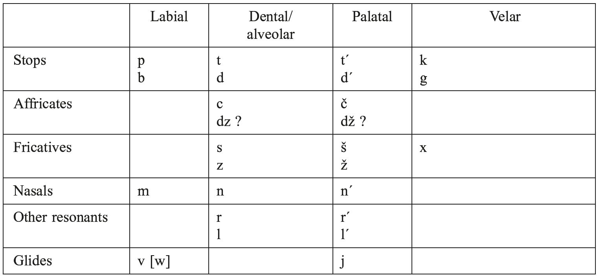

Proto-Slavic had never been in contact with any but Indo-European languages. The beginning of the Great Migrations brought major ethnolinguistic changes: intensification on the steppe and westward expansions of steppe kingdoms to the Danube plain; formation of the syncretic steppe/trading/farming Gothic state, partly on Slavic territory; extension of the Roman Empire to Dacia and the genocide and cultural destruction of the Dacians; incursions of the Huns, who spoke the first non-Indo-European language to be heard in central Europe for several millennia; the shift of the major intake for the southern European slave market to eastern Europe; formation of the Avar state, whose elite were probably speakers of Alanic (East Iranian) but soon shifted to Slavic. The formation and expansion of the Gothic and Avar states, the considerable depopulation of the Balkan peninsula in the Plague of Justinian (542 CE and later episodes), and the westward retreat of Germanic speakers provided the background for the remarkably rapid spread of late Proto-Slavic across much of eastern Europe. Whatever its exact mechanism (see e. g. Timberlake 2013), this spread shuffled and largely effaced previous dialect developments (Andersen 1996, 1999) and absorbed much of the former Balto-Slavic continuum, so that surviving Baltic is now phylogenetically discrete from Slavic.

The last sound changes to affect all of Proto-Slavic were the palatalization of velars before front vowels, palatalizations resulting from resolutions of *Cj sequences, fronting of vowels after palatal consonants, and monophthongization of diphthongs (see Collins, this handbook). Proto-Slavic at this stage (the early centuries CE) had a consonant system with a four-way distinction in places of articulation (much like that of modern Czech or Hungarian), shown in Table 86.1.

The above is presented in conventional Slavistic transcription (except that *tˊ, *dˊ have no single standard transcription). The voiced affricates *dz, *dž may or may not have existed (see Andersen 1969). Note that, here and below, tˊ, dˊ, nˊ, etc. (acute accent following consonant letter) render Proto-Slavic palatals; ć, ś, ń (acute accent over the consonant) are orthographic in some languages using the Latin alphabet; and t’, p’, n’, r’, etc. (consonant followed by apostrophe) transcribe phonemic (or sometimes only phonetic) palatalization, found chiefly in East Slavic languages.

Tab. 86.2: The vowel system of the late Proto-Slavic period (conventional Slavistic transcriptions with phonetic clarifications)

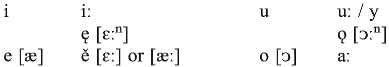

The language of the period from the early centuries CE to about the ninth century is usually called Common Slavic or Late Proto-Slavic. The present chapter deals with changes several of which had their root conditions in Common Slavic but which played out in the subsequent centuries. I will call this later period, from about the ninth century to about the thirteenth or fourteenth, the “Medieval Slavic” period. It is reflected in documents and inscriptions dated from about the eleventh to fourteenth or fifteenth centuries, and is reconstructed in some detail by the comparative method.

The family tree of the Slavic languages is shown in Table 86.3. The earliest written Slavic language, Old Church Slavic (OCS), does not fit into any one branch but is a written tradition comprising early West and South Slavic documents. (Most of the documents reflect Old Bulgarian phonology, and this is the conventional normalization in reference works. But the spelling system shows a predominance of West Slavic and specifically Moravian pronunciation in some diagnostic respects: Shevelov [1957] 1971.) Russian, uniquely, has much admixture (lexical, morphological, syntactic) from Russian Church Slavic, the phonologically Bulgarian-influenced sacral language of Orthodox Slavs and the high language in a diglossic situation that persisted into late medieval times (Uspenskij 2002). Russian Church Slavic has been naturally transmitted only among some Old Believer communities, where as of the mid-20th century it retained an extremely archaic pronunciation (Uspenskij 1968).

In the above display, listing within branches is from east to west and from north to south. * = pairs of very closely related sister languages, with good mutual intelligibility. Rusyn is not usually classified as a separate language by linguists, but there is a distinct national consciousness especially among western Rusyns (see e. g. Magocsi 2004; Vaňko 2000). Bosnian, Croatian, and Serbian are a single language in linguistic terms but with separate national identities and status. The branches are formed as much by subsequent accommodation to cultural and political norms as to divergence, and few early sound changes coincide neatly with the major branches.

<!-- source-file: content/07_chapter01_11.xhtml -->

Tab. 86.3: The Slavic languages

<table>
<tr><td>East Slavic</td><td>(Northern)</td><td>Russian*</td></tr>
<tr><td></td><td></td><td>Belarusian*</td></tr>
<tr><td></td><td>(Southern)</td><td>Ukrainian/Rusyn (Ruthenian)</td></tr>
<tr><td>West Slavic</td><td>Lechitic</td><td>Polish*</td></tr>
<tr><td></td><td></td><td>Cashubian, † Slovincian*</td></tr>
<tr><td></td><td></td><td>† Polabian</td></tr>
<tr><td></td><td>Sorbian</td><td>Lower Sorbian*</td></tr>
<tr><td></td><td></td><td>Upper Sorbian*</td></tr>
<tr><td></td><td>Czechoslovak</td><td>Czech*</td></tr>
<tr><td></td><td></td><td>Slovak*</td></tr>
<tr><td>South Slavic</td><td>Eastern</td><td>Bulgarian</td></tr>
<tr><td></td><td></td><td>Macedonian</td></tr>
<tr><td></td><td>Western</td><td>Slovene</td></tr>
<tr><td></td><td></td><td>Bosnian/Croatian/Serbian (BCS)</td></tr>
</table>

## 2. Medieval Slavic sound changes

Conventionally, the jer shift (discussed just below) marks the end of Common Slavic (though it eventually spread across the entire Slavic territory). The Magyars entered the Carpathian region in 896 and severed Slavic geolinguistic unity, marking the beginning of the end of Slavic linguistic unity. The Life of Constantine/Cyril indicates that in the mid-9th century the Slavic dialects of today’s Greece and Moravia were mutually intelligible while that of northern Rus' was not intelligible in the south (Nichols 1993a). At this point the branches and individual languages (in their ancestral stages) began developing separately. Lechitic became relatively isolated early (Vermeer 2000: 21−22 with further references; Andersen 1969).

The <i>jer shift</i> or <i>fall of jers</i>. Proto-Slavic short *i and *u had, by later Common Slavic times, become schwa-like vowels susceptible to positional weakening, compensatory lengthening, and vowel-zero alternations. In historical Slavistics, these vowels and the Cyrillic letters for them are known as <i>jers</i> (a term based on their spelling names). The mechanism is the following (Timberlake 1983a, 1983b, 1988, 1993): the universal tendency of high vowels to be phonetically shorter than non-high vowels began to be exaggerated in late Common Slavic, with each short high vowel ceding a small increment of its length to the preceding syllable. That tendency increased over time. The eventual outcome was that (with somewhat different conditions in different dialects) a preceding short vowel gained enough length to cross a perceptual boundary and be reanalyzed as long; the jer itself lost all of its audible duration and was reanalyzed as zero; a jer before this lost jer was lengthened enough to be reanalyzed as a mid vowel. As a result, to this day all Slavic languages have vowel-zero alternations in some of their most basic vocabulary and most frequent derivational affixes, and many have length and/or quality alternations of vowels in inflectional paradigms. Examples are provided in Table 86.4.

In this table differences in genitive endings (<i>-a, -e, -u</i>) are morphological, not phonological. Plural or adverb is given when a genitive is not attested or does not exist. Words are written in standard transliteration (OCS, Russian, Belarusian, Bulgarian, Macedonian) or orthography (Croatian orthography represents BCS), except that Cyrillic <i>ё, я</i> are written <i>’o</i> and <i>’a</i>. Diacritics over vowels mark length in Czech (orthographic), tone and length in BCS and Slovene (non-orthographic), and quality elsewhere (orthographic).

Subsequent changes in the vowel system, such as loss of length distinctions, raising of some long vowels, etc. have turned what were originally simple length alternations in pre-jer vowels into less transparent alternations. The Cashubian forms in Table 86.5 (Stone 1993: 768) illustrate vowel alternations caused by lengthening in the nominative singular (whose ending was a jer in Common Slavic). Length was subsequently lost, so the distinctions are now purely qualitative.

These alternations are extensive in Cashubian, where vowels of all heights were lengthened before voiced consonants; Polish has them in fewer vowels and fewer contexts, so they are found only in the last two words of this list: <i>dóm: domu; ksiądz: księdza</i>.

Tab. 86.4: Nominative and genitive cases of selected words illustrating jers, compensatory lengthening, and vowel-zero alternations

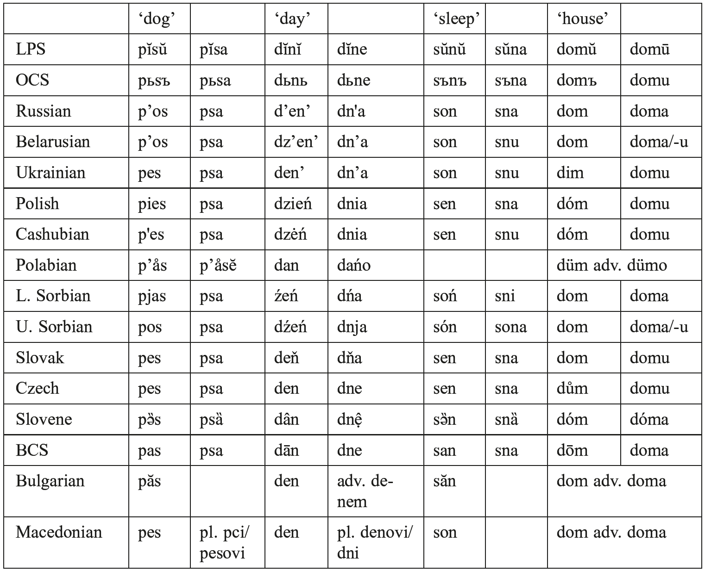

In synchronic morphophonology, the vowel-zero alternations and the vowel quality/ quantity alternations before a lost jer, when the jer was word-final (as in Tables 86.4, 86.5), can be described as alterations of the basic or underlying form that occur before a zero ending. Word-internally, they can be described variously as conditioned by certain consonant sequences or as morphologically conditioned. Abstract underlying representations of modern languages have often represented the former jers as segments.

Especially in the more northerly parts of the Slavic range, front vowels, including the front jer, phonetically palatalized a preceding consonant. In the most extreme outcome, when weak jers were lost the palatalization was isolated, unconditioned, and therefore became phonemic. This effect is the most far-reaching in Russian, where most of the consonants participate in phonemic oppositions of plain vs. palatalized; it is nonexistent or nearly nonexistent in South Slavic. In East Slavic the two jers remained distinct (and the front jer remained capable of palatalizing a consonant) until the weak jers were lost. At the same time the mid vowels *e and *o (with which the strong jers had merged) merged into a single vowel phoneme, their phonetic [e] vs. [o] quality entirely conditioned by the preceding and following consonants (Andersen 1978). Only some centuries later, when length was lost and *ě merged with the [e] allophone of the mid vowel, did front vs. back mid vowels become phonemically distinct again. Developments were similar in Belarusian; in standard Ukrainian, *e shifted to /o/ in more limited contexts (with irregularities).

Tab. 86.5: Cashubian vowel alternations

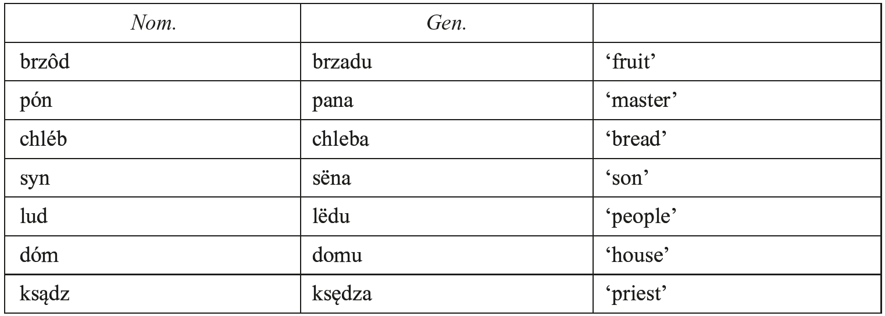

In West Slavic languages, the strong jers have merged as /e/ (falling in with inherited *e). Prior to the merger, in all Lechitic languages to different degrees, mid vowels were backed before hard (i.e. non-palatalized) dentals: *e > o, *ě > a, * ę > ǫ. (Andersen 1978 shows that these and the East Slavic mergers of *e and *o were a single pan-Slavic phonetic innovation whose local phonemic realization depended on the progress of prosodic changes that were spreading from the Slavic center.) Prior to the merger, consonants were palatalized before front vowels. Polish has retained the palatalization, but most consonants have depalatalized in Czech, leaving palatalization only in *t, *d, *n and only before *ě and *i. In both Polish and Czech, some or all of palatalized *t *d *s *z *n are not (as in East Slavic) palatalized counterparts to plain dentals and alveolars but now make up a separate palatal place of articulation: Polish <i>ć dź ś ź ń</i> (spelling before vowel: <i>cia dzia sia zia nia</i>) are palatalized palatals contrasting with retroflex, non-palatalized palatals <i>cz dż sz ż</i> (no change in spelling before vowels) which reflect LPS *<i>č (d)ž š ž</i>; Czech <i>t’ d’ ň</i> (spelling before *ě reflex: <i>tě dě ně</i>) are palatal (all palatalized). Thus the Czech consonant system is similar to that of Table 86.1, but Polish is quite different.

In South Slavic the two jers tended to merge before the weak ones were lost. This has been total in BCS, where all strong jers are /a/ and there are no oppositions in palatalization. BCS also has a palatal series, with stops spelled <i>ć đ</i> and sonorants <i>nj, lj</i>, but it originated not in palatalization before front vowels but from Proto-Slavic *tj, *dj, *nj, *lj sequences. In Bulgarian the two jers are reflected differently: the front jer as /e/ and the back jer as /ǝ/ (Cyrillic ъ, transliteration <i>ă</i> or <i>ŭ</i>). There is palatalization of consonants before the reflex of *ě under stress (the reflex is /a/; spelling я after palatalized consonant) but not before the reflex of the front jer.

<i>Havlík’s law</i>. Compensatory lengthening entailed that, in a sequence of syllables each containing a jer, every other jer was weak and eventually lost: a final jer was weak, the one before it strong, the one before that weak, and so on. This meant that in medieval Slavic the stem shapes of such words varied greatly depending on whether the inflectional ending contained a jer or not (and most paradigms had at least one ending with a jer).

Tab. 86.6: Effects of the jer shift on three-jer sequences

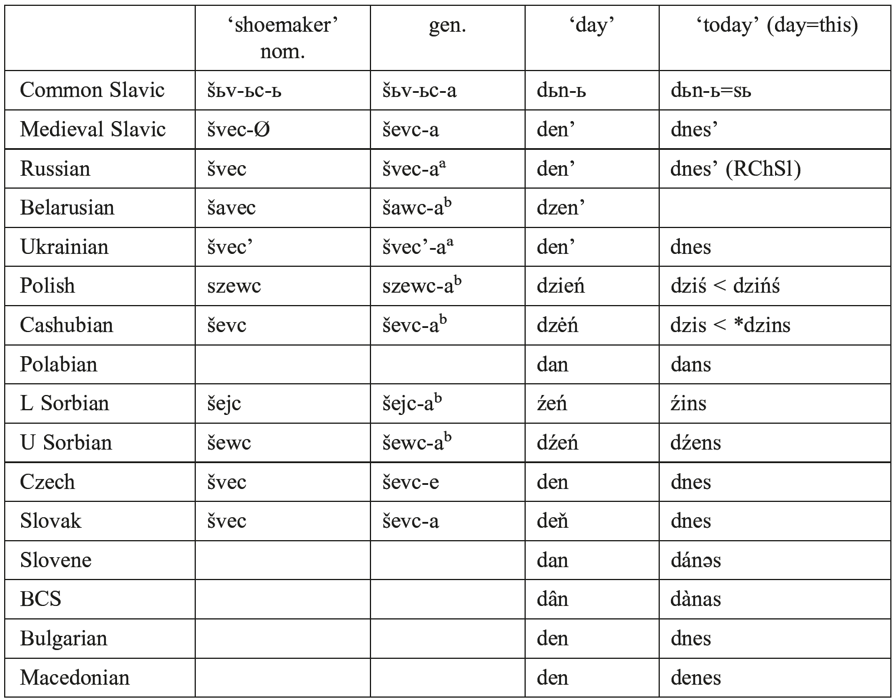

Medieval forms are shown with the /e/ reflex of a strong front jer, as this is its most common spelling. ‘Shoemaker’ has a derivational suffix <i>-ьc</i>- and an inflectional ending. ‘Today’ has a clitic. RChSl = Russian Church Slavic. No entry = no attested cognate in this language. ᵃ = oblique stem has been generalized to nominative; ᵇ = nominative stem has been generalized to oblique.

Modern languages have generally leveled out such alternations in different ways, leaving vowel-zero alternations mostly near the right edges of stems or words (Table 86.6) (a detailed survey for Russian is Isačenko 1970).

A jer adjacent to <i>r</i> or <i>l</i> is strong in East Slavic, often strong in Lechitic, and often weak in South Slavic and Czechoslovak − regardless of the following syllable, i.e. independent of compensatory lengthening. A weak jer adjacent to a sonorant yields a modern syllabic sonorant. These are now found in Czech, Slovak, and BCS.

<i>Status of *i and *y</i>. Several Slavic languages have a high, back or at least nonfront, unrounded vowel spelled or transliterated ‘y’. CS *y descends from IE *ū. It was a high, nonfront, long vowel, likely an [ui]-like diphthong in CS (Mošinskij 1972). Now in East Slavic *i and *y are phonemically merged but phonetically distinct since [i] follows a palatalized consonant while [y] follows a non-palatalized consonant. In Ukrainian palatalization was lost before *i, so the two have also merged phonetically as [y]. A new /i/ arose from *ě and from *o, *e under compensatory lengthening (see ‘house’ in Table 86.4).

In Lechitic *i and *y are phonemically merged but phonetically distinct due to palatalization, much as in East Slavic. In Czech and Slovak they are completely merged though distinguished in the orthography; Czech <i>bil</i> ‘(he) beat’ and <i>byl</i> ‘(he) was’ are entirely homophonous. (In colloquial Common Czech /y/ is usually pronounced /ej/, a sound change that began before the merger and shows that /y/ and /i/ were distinct at the time.) In South Slavic, *y and *i merged early, leaving no evidence of a distinction.

<i>West Slavic *ř</i>. In West Slavic, *r' (before front vowel) and *rj merge to yield a very rare and perhaps unique sound. In Czech /<i>ř</i> / is a “post-alveolar [trill] with considerable friction” (Short 1993: 457), “typically made with the laminal surface of the tongue against the alveolar ridge” and often involving a sequence of trill followed by frication (Ladefoged and Maddieson 1996: 228). It is absent in Slovak. In Sorbian, where /r/ is uvular, /ř/ is uvular and palatalized. In Polish, *ř (spelled <i>rz</i>) has merged with /ž/ (spelled <i>ż</i>). Cashubian preserves /ř/ to some extent, but is shifting to the Polish pronunciation.

<i>Lenition of *g</i>. In a contiguous set of central Slavic languages, CS *g underwent lenition, eventually turning into [h] or [ɦ] in most of the languages but with a narrow band along the edge of the inner isogloss where the pronunciation is [γ]. This dialect geography shows that the change proceeded [g > γ > h / ɦ]. Further evidence is the fact that, in languages with /h/ and word-final devoicing, final <i>h</i> is pronounced /x/. The [ɦ] reflex, in languages that have it, has a certain amount of murmur and is sometimes described as voiced. Languages exhibiting lenition of *g are Ukrainian, southern Russian, Belarusian, Slovak, Czech, Upper Sorbian, northwestern dialectal Slovene, and northwestern dialectal Croatian. Languages in the central part of this area preserve original [g] in -zg- clusters: Ukrainian, Belarusian, Slovak. Those closer to the periphery have [h] even in these clusters. Andersen (1969) shows that this can be explained by the chronology of lenition relative to the jer shift. Prior to the jer shift Common Slavic had a very simple syllable structure with few permissible consonant sequences, among them fricative + stop clusters. Where lenition began before the jer shift, *g in these clusters was not changed because the syllable canon required that the sequence be fricative + stop (where *g filled the stop slot). Where lenition began after the jer shift, many more clusters were possible and *g in *-zg- sequences was free to change into a fricative without violating the (new) syllable canon. Thus, e.g., Ukr. <i>mizka</i>, Slovak <i>miazga</i> vs. Upper Sorbian <i>mjezha</i> ‘sap, pulp’ (Andersen 1969: 559). On this evidence lenition began probably in western Ukraine to eastern Slovakia, not long before the jer shift and thus probably in about the ninth century; its isogloss spread outward slowly and was overtaken by the more rapidly spreading isogloss for the jer shift. Lenition halted along an east-west line in southern Russia, along the southern border of Polish, and largely along the northern boundary of South Slavic with small extensions into northwestern Slovene and Croatian dialects. For lenition, see Andersen (1969).

<i>Prosody</i>. Proto-Slavic inherited from Proto-Balto-Slavic a prosodic system involving a contrast of what is reconstructed as circumflex vs. acute accent on long vowels (probably circumflex = stress or tone peak on first mora, acute = on second mora) and mobile vs. fixed root or stem vs. fixed word-final (desinential) stress paradigms. In words with long vowels, circumflex was associated with mobile stress and acute with fixed stress. Words with short vowels exhibited all three kinds of stress paradigms.

A tone opposition, basically of high (or high fall) vs. low (or low rise) on long vowels, is preserved in dialects of Slovene and dialects of BCS. Standard Slovene has lost tones entirely. Standard BCS (and its dialect base) has lost the original tone opposition but created a new one as the result of a stress shift: all stresses shift forward one syllable toward the beginning of the word, and original initial stress remains initial; original (initial) stress is now falling tone (long or short) and moved stress has rising tone (long or short). Most languages without tones nonetheless preserve stress, quantity, and/or quality phenomena that reflect the former tones.

Tab. 86.7: Differing degrees of *j loss in the Slavic languages

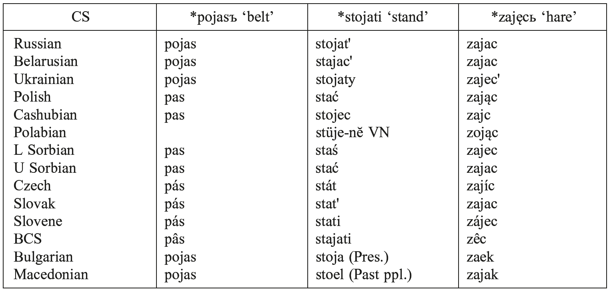

The opposition of fixed to mobile stress, and the specific stress paradigms of many individual words, are preserved in most of South and East Slavic and in dialects of Cashubian. Fixed stress systems have developed in most of West Slavic and dialectally in Ukrainian, BCS, and Macedonian. Baerman (1999) shows that fixation of stress is not a contact phenomenon but an internal Slavic development and evolves as a result of constraints against final stress and regularization of stress patterns within word classes.

For much of its history Proto-Slavic had an opposition of pure length in vowels, but by late Proto-Slavic to early medieval Slavic times quality distinctions had come to accompany quantity distinctions, and the subsequent history is one of loss of length − in individual words, in phonological or morphological contexts, or across the entire vowel system. Length was lost word-finally (i.e. in desinences) in all languages; in initial syllables of trisyllabic or longer words but not immediate pretonic syllables; and in acute syllables (BCS) or circumflex syllables (Czech, Slovak). The peripherally located languages no longer have length: Lechitic, Sorbian, East Slavic, Macedonian, Bulgarian. Those that have it (Czech, Slovak, Slovene, BCS) have gone farthest in the loss of intervocalic *j, which resulted in contraction of the two newly adjacent vowels into one long vowel. This provided new long vowels that kept phonemic length alive. Loss of intervocalic *j is a tendency that is stronger in some languages than others and in some words than others. Marvan (1979: 19) gives a table of frequencies for selected words. Table 86.7 shows a word highly susceptible to *j loss (‘belt’), one resistant to it (‘hare’), and one intermediate (‘stand’). VN = verbal noun.

<i>Loss of nasalization</i>. CS had two nasal vowels, *ę and *ǫ, from sequences of vowel + nasal + consonant or word boundary. These survived in Old Church Slavic, but in modern Slavic languages they survive only in Cashubian and Polish (also in Polabian until its death). In Polish the main allophones are vowel plus nasalized rounded offglide [ᴐwⁿ], [ɛwⁿ] or sequence of oral vowel plus homorganic nasal plus stop. Nasalization survived for at least a century or two after the CS dispersal in East Slavic, as shown by Slavic loanwords into Finnic, first contacted in about the sixth century (Kiparsky 1979: 82−84).

![Fig. 86.1: Splitstree (Huson and Bryant 2006) neighbor net diagram of the Slavic languages after the application of 12 post-Proto-Slavic sound changes that spread easily between branches:  Reflex of *x in the second velar palatalization  *tl, *dl reflexes  *tˊ reflex  *ORT resolution  *TORT resolution  Reflexes of strong jers <i>(e</i>/<i>o, e, a</i>, etc.)  *TuRT resolution  *TRuT resolution  Lenition of * g  Retention/loss of tones  Retention/loss of vowel length  Retention/loss of free stress](images/handbook-comparative-historical-indo-european-linguistics-volume-3-fig-chapter01-196.png)

<i>Positional vowel neutralizations</i>. Several languages have some neutralization of unstressed vowels. In Bulgarian, unstressed high and mid vowels tend to merge. In Polabian there is a final two-syllable window for stress and a three-syllable non-reduction window: a stressed vowel and the first pretonic vowel are unreduced, and more distant pretonic and all post-tonic vowels are reduced to a minimal opposition of <i>ĕ</i> and <i>ă</i>.

In south and central Russian and in Belarusian, there is far-reaching neutralization and reduction of unstressed vowels. All vowels but /u/ neutralize entirely or considerably in unstressed syllables, the phonetic output being either [i/i] or [ǝ/ʌ] depending on such factors as the palatalization or non-palatalization of the preceding consonant and the height of the following vowel. In standard Russian the neutralized vowels preserve a phonemic distinction of /i/ vs. what might be phonemicized as either /e/ or /a/. In Belorusian and some of central Russian including the younger generations of Muscovites, a first pretonic [a] is not reduced and remains a clear /a/. In younger Moscow speech (and some nearby dialects: Čekmonas 1987), this first pretonic /a/ is undergoing a latter-day round of compensatory lengthening, appropriating an increment of length from an adjacent following higher vowel and/or preceding phonetic schwa.

Figure 86.1 is a neighbor net diagram showing an unrooted tree of the Slavic languages as of the high middle ages, the end of the time when sound changes could still spread readily between branches and across most of the Slavic speech community. The webbing between languages and branches shows indeterminacy of subgrouping, due to inter-branch sharings. Despite the considerable indeterminacy, the modern Slavic family tree has clearly begun to take shape: West Slavic, separated by several unique reflexes, is coherent and at some distance from the rest, and East and South Slavic are both discernible though less discrete.

## 3. Morphology and morphosyntax

In several areas of grammar, morpheme forms inherited from Indo-European were assembled into entirely new inflectional, derivational, and morphosyntactic paradigms.

<i>Two-stem verb inflectional system</i>. Proto-Slavic lost the IE perfect stem and perfect tense, but inherited present and past stems. The present stem forms the nonpast tense, present and future participles, and the imperfect where that exists (OCS, modern South Slavic). The past stem forms the aorist, infinitive, and <i>-l</i> participle (a perfect participle in OCS, used to form a periphrastic perfect tense; now used with an auxiliary to form a past tense or even functioning alone as a finite past tense verb form). In CS and OCS the present and past stems often had different ablaut grades. Often one or both were suffixed, and certain pairings of present and past stem morphology became common. Table 86.8 shows the traditional classification of OCS verbs based on the two stems (Leskien [1871] 1962: 121−122).

Tab. 86.8: Leskien’s verb classes for OCS (subtypes not shown)

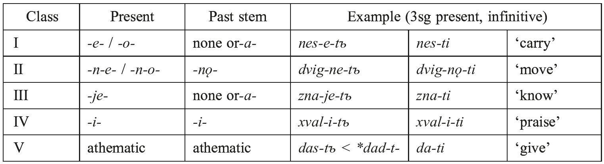

There has been some regularization in all languages (especially Macedonian), but the two-stem principle is evident everywhere.

<i>Switch in valence derivation type from transitivizing to detransitivizing</i>. Proto-Slavic used causative or factitive suffixes extensively to produce many regular pairs consisting of an intransitive and a (derived) transitive verb. In CS, probably late CS, the clitic accusative form of the reflexive pronoun came to be used as a detransitivizing device and rapidly became a regular part of CS derivational morphology. Hence OCS has a number of sets like the following (Gołąb 1968; Nichols 1993):

<table>
<tr><td>(1)</td><td><i>vyknǫti</i></td><td>‘learn’ (PS *u:k-noN-; intransitive inchoative)</td></tr>
<tr><td></td><td><i>učiti</i></td><td>‘teach’ (*ouk-ei-; causative; transitive or ditransitive)</td></tr>
<tr><td></td><td><i>učiti sę</i></td><td>‘learn’ (reflexive; intransitive or oblique object)</td></tr>
</table>

In the daughter languages the relationships between original intransitives and original causatives (like <i>vyknǫti: učiti</i>) have become more etymological than derivational, and they have drifted apart semantically. Reflexivization is the productive means of deriving intransitives, so that now it is the transitives that are basic in transitive-intransitive pairs. This is the case in most continental European languages, and it came to affect Common Slavic as it entered the European cultural sphere.

In Macedonian and Bulgarian many intransitive verbs can be used transitively as well (in Macedonian, if the object is definite) (Macedonian: <i>go=zaspav</i> him=sleep-1sg ‘I put him to sleep’, Friedman 2002: 34). This too has the effect of making transitives formally basic in such verbs (although it does not make intransitives derived).

In the medieval and modern languages, reflexivization of verbs can be both syntactic (in passives and a special diathesis with dative subject) and lexical (derived intransitives). Reflexive passives coexist with participial passives. In Russian they are neatly complementary: participial passives are perfective and reflexive passives imperfective.

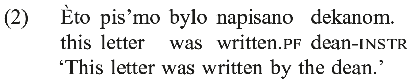

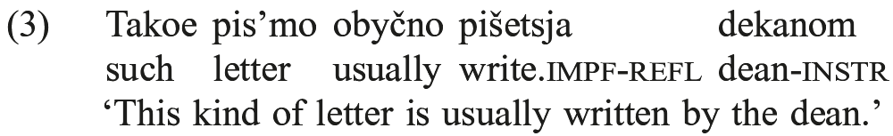

Dative-subject reflexives usually have a modal force: ‘is inclined to’, ‘feels like’, ‘can’.

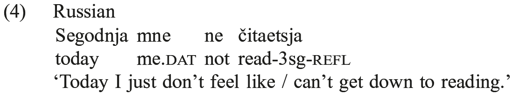

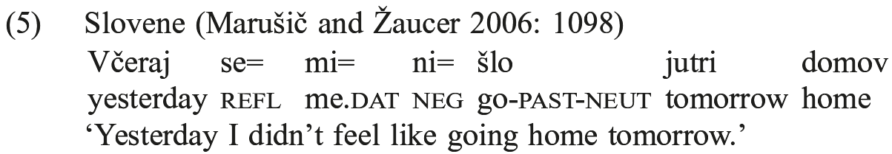

In Russian (and probably most Slavic languages), these constructions are monoclausal, but Marušič and Zˇaucer (2006) analyze the Slovene example as having a null modal predicate which <i>včeraj</i> applies to while <i>jutri</i> applies to ‘go’.

Some lexical reflexives are plausibly semantic developments of literal reflexives, where the reflexive clitic was originally a literal direct object; but some are not. Table 86.9 shows three verb glosses that are almost always reflexive in modern Slavic languages. ‘Laugh’ is from an IE root *<i>smei-</i> with cognates including Engl. <i>smile</i>. The cognates (including the Lithuanian one) are basically intransitive, making it unlikely that PS ever had a transitive *<i>sm(e)i-</i> ‘laugh at, mock; make laugh’. No unprefixed non-reflexive is attested in any Slavic language. (Russian has transitive <i>o-smeivat’</i> ‘mock, ridicule, laugh at’ and <i>vy-smeivat’</i> ‘id.’, but these have applicative prefixes and the transitive valence is their derivational effect rather than an inherited property of the root.) Thus the most parsimonious reconstruction is an intransitive nonreflexive *<i>sm(e)i-</i>‘laugh, smile’ to which existing middle morphology was extended (this is an emotion speech verb in the middle voice typology of Kemmer 1993), rather than detransitivization of a transitive. This implies that *<i>sę</i> was already well installed in the derivational morphology of the verb and associated with intransitivity by the time this clearly CS verb was formed.

*<i>bojati sę</i>, 3sg pres.*<i>bojitъ sę</i> has the suffix paradigm of intransitive and generally non-agentive verbs such as OCS <i>bъděti</i>, 3sg pres. <i>bъditъ</i> ‘be awake’ (Birnbaum and Schaeken 1997: 91) and is therefore very unlikely to result from detransitivization of an earlier transitive. It must result from extension of middle morphology as *<i>smejati sę</i> did (it is an emotion verb in the typology of Kemmer 1993).

The onomasiological slot ‘seem’ is diachronically less stable. It is filled by several different verbs, most of them reflexive and all of those arguably literal reflexives:

*<i>kazati sę</i>, lit. ‘show oneself’, a literal reflexive. (OCS, East Slavic)  *<i>jьz-da(ja)ti sę</i> ‘give oneself off (as), present oneself (as)’, a literal reflexive (West  Slavic, Slovene, western East Slavic)  *<i>učiniti sę</i> (South Slavic including OCS): ‘position oneself’, a literal reflexive

as well as nonreflexive *<i>jьz-ględěti</i> ‘out + look’, i.e. ‘appear, look like’ (South Slavic). That is, the most common source of fillers for this onomasiological slot is a metaphor like ‘show/present oneself (as...)’ using literal reflexivization. Of these only *<i>jьz-da(ja)ti sę</i> is attested in all three branches and can plausibly be reconstructed for CS (however, only nonreflexive <i>izda[ja]ti</i> ‘give out’ is attested in the OCS canon).

Note that the reflexive element *<i>sę</i> is a clitic in South and West Slavic and an affix in East Slavic. The citation form of the Polabian verb for ‘fear’ (from Polański 1993: 803) does not have the reflexive clitic, but this does not mean that the verb was not reflexive.

<i>Other valence issues</i>. CS and the modern languages have a number of valence patterns: intransitive (nominative subject), transitive (nominative subject, accusative direct object), ditransitive (nominative, accusative, dative indirect object), dative subject with one or two arguments (dative only; dative + nominative object), oblique object (nominative subject, one or another oblique case or preposition on the object). Canonical transitives and intransitives are lexically the most frequent. The set of patterns has been quite stable, and the valence types of individual verbs and semantic classes of verbs are also fairly stable. In the Balkan languages, prepositions have replaced cases entirely, and in the other languages (especially West Slavic) there has been some diachronic tendency to expand prepositions at the expense of bare cases on objects.

Tab. 86.9: Reflexive verbs

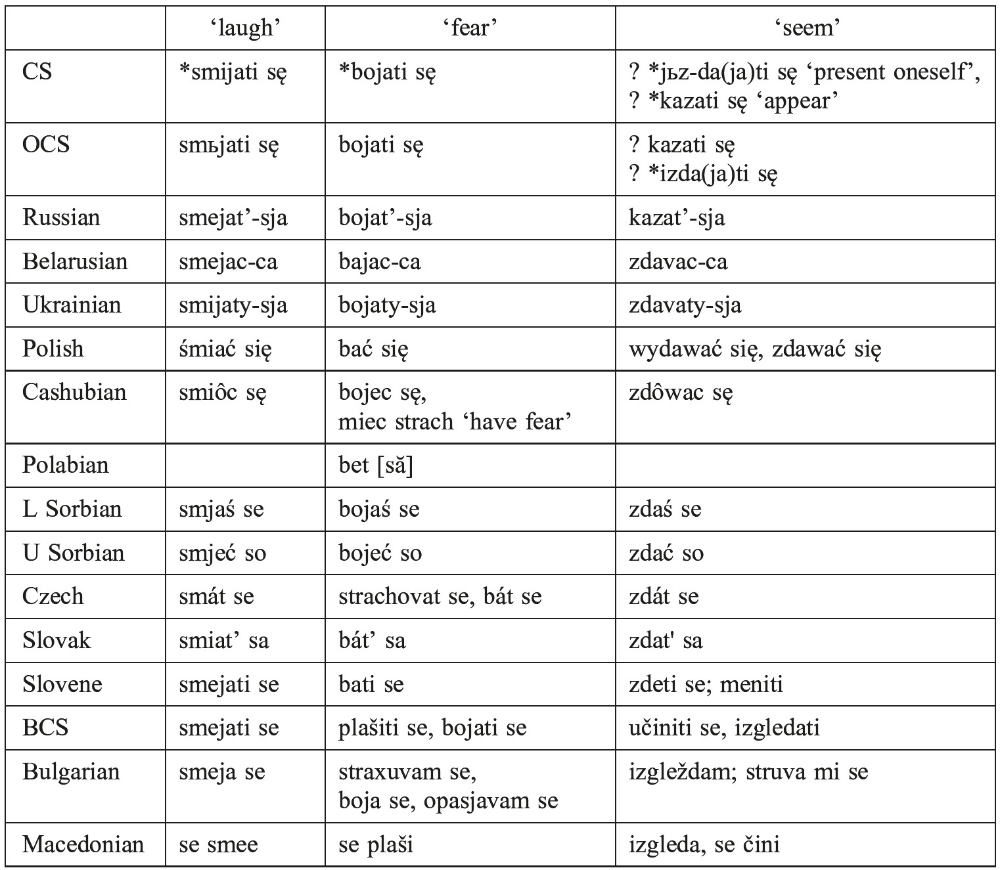

<i>Verb derivational pairings</i>. CS preserved many inherited suffixal forms of verb stems but reassembled them into new derivational sets. Most salient and thoroughgoing was the pairing of plain verbs with iteratives, which in earliest medieval Slavic was turning into the systematic pairing of perfective and imperfective verbs that distinguishes modern Slavic languages. Iteratives were mostly suffixed with *-a-j-and often had lengthened root vowels. Verb prefixes often added a sense of telicity that was grammaticalized as perfective. Other lexical and morphological forms were also recruited to provide perfective or imperfective partners, with the result that modern Slavic aspectual pairings are formally disparate but grammatically and functionally equivalent within languages. Examples of pairings from Russian (only aspect-relevant morphemes are segmented):

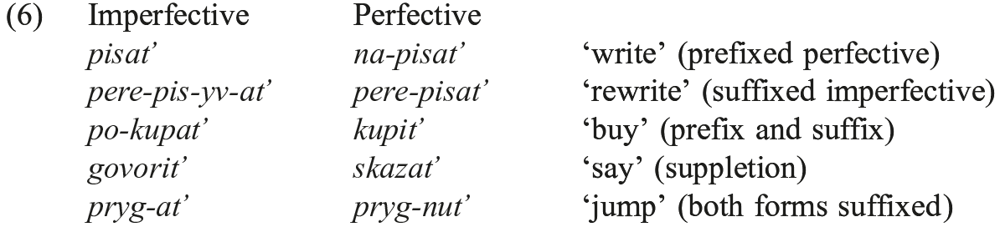

The meaning of aspect depends on the Aktionsart of the verb (Maslov 1948): most commonly, a verb of activity or ongoing potentially telic action, when perfectivized, becomes telic; a perfective that is punctual (e.g. ‘sneeze’, ‘jump’) becomes pluractional when imperfective. In addition, an overarching distinction in the fundamental meaning of aspect divides the more eastern languages (East Slavic, Bulgarian, to some extent Polish and BCS) from the western ones (other West and South Slavic): in the east, perfective means temporal definiteness while in the west it means totality (Dickey 2000).

Medieval Slavic began to develop, and most modern languages have developed, a set of about a dozen paired verbs of motion, where the members of the pair are determinate (motion in a particular direction or toward a goal) and indeterminate (iterative, undirected, or multidirectional motion). In early medieval Slavic the indeterminates were goalless manner verbs and/or iteratives. For the history, see Dickey (2010) and Greenberg (2010). Slovene examples (Herrity 2000: 226):

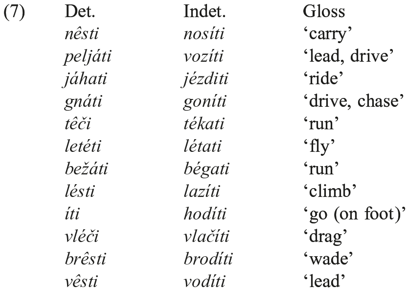

<i>Second-position clitic strings</i>. Medieval Slavic varieties have a second-position clitic string whose elements follow a template with dative preceding accusative, reflexive sometimes specially positioned, and any clitic having scope over only one word immediately following that word (which was usually clause-initial) and preceding the rest of the string. Clitic strings are preserved in South and West Slavic, and are present in Old Russian (Zaliznjak 2008) but lost in modern East Slavic except for Rusyn. In Macedonian and Bulgarian the strings have migrated headward to become ad-verbal (mostly preverbal). Clitic strings are found in other European languages, chiefly Romance, but second-position clitic strings are unique in Europe to Slavic and Ossetic (Iranian, north central Caucasus), which also has the dative-accusative order. Clitics are italicized in (8−10).

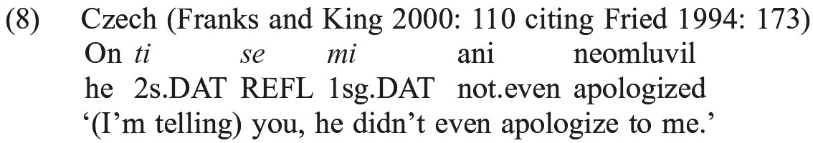

Here the first clitic <i>ti</i> is an ethical dative, a pragmatic function captured in the gloss ‘(I’m telling) you’.

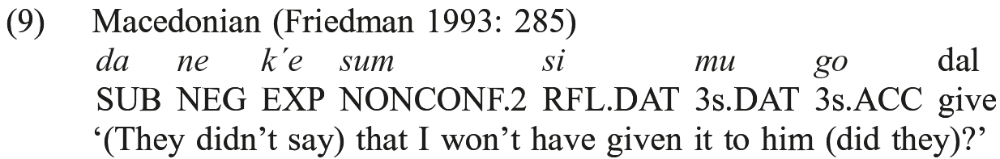

Here the gloss EXP stands for ‘Expectative’, and NONCONF stands for ‘Non-confirmative’.

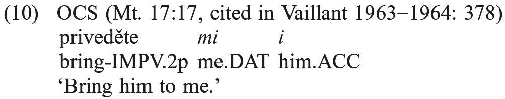

<i>Simplification of tense system</i>. CS and medieval Slavic distinguished present, aorist, imperfect, and perfect tenses. Future meaning could be expressed with the present tense or modal auxiliaries. Most modern languages have added a future but otherwise simplified the tense system to a single past tense, letting aspect take over the work of the aorist/imperfect distinction and losing the perfect entirely. In East Slavic, Polish, Czech, Slovak, and Slovene, the past tense is formed from the old perfect. Cashubian has innovated a new perfect using ‘have’ plus past passive participle, doubtless under German influence. Sorbian preserves all three medieval tense forms, but aorist and imperfect are now in complementary distribution based on aspect. BCS preserves all three in the written language but for the most part replaces the aorist and imperfect with the old perfect; aorist and imperfect are in almost entirely complementary distribution by aspect. Polabian preserved all three. Bulgarian and Macedonian, in somewhat different ways, have recruited and expanded the old perfect morphology to make an evidentiality distinction, often called <i>renarrated mood</i>, opposing indicative to a form indicating that the speaker does not vouch for or has not witnessed the event.

<i>Dual</i>. CS had a dual number separate from singular and plural. The case paradigm of the dual was more syncretized than those of the singular and plural. The dual is used regularly in OCS and medieval Slavic but gradually drops out of use, supplanted by the plural, in all but Slovene, Sorbian, the recently extinct Slovincian dialect of Cashubian, and Polabian. Traces of the dual remain in most languages: e.g., in Russian the usual masculine nominative plural is <i>-y</i>/<i>-i</i>, but in some words referring to natural pairs the ending is <i>-á</i>: <i>beregá</i> ‘riverbanks’, <i>rukavá</i> ‘sleeves’, <i>glazá</i> ‘eyes’. The old dual endings are frozen on the word for ‘two’ in all the languages.

<i>Gender and animacy</i>. Slavic preserves the three IE genders. Genitive-accusative syncretism, replacing an inherited accusative ending with one identical to the genitive, spreads through masculine nominal declension and agreement paradigms following the referential (animacy) hierarchy. In CS the genitive form replaced the accusative in tonic personal pronouns. In OCS masculine singular nouns referring to adult human males also took this ending. The category expands to include human and most higher animate masculine nouns in the modern languages (except Bulgarian and Macedonian, which have no noun cases). West Slavic languages distinguish human from non-human in plural masculines; East Slavic (which makes no formal gender distinctions in the plural) extends animacy to human and higher animate referents of all genders. Corbett (1991: 161−168) considers Slavic animacy a subgender since animate paradigms differ from inanimate ones in only one or two endings.

<i>Morphosyntax of numerals</i>. The morphosyntax of phrases containing numerals is famously complex for modern Russian and several other languages (Mel’čuk 1985; Corbett 1993; Franks 1995: 93−129). In CS and OCS, ‘one’ was an adjective of the regular and open <i>o</i>/<i>a-</i>stem declension, agreeing in gender, number, and case with the quantified noun, which was singular and in the case required by its own syntax. ‘Two’ was a similarly regular adjective in the dual form and taking a noun in the dual. ‘Three’ and ‘four’ were adjectives of irregular or minor declensions, agreeing with a noun that was plural. ‘Five’ and above governed the genitive plural of the quantified noun, since they were morphologically <i>i</i>-stem nouns and nominalized forms of old ordinals. (Most of them end in *<i>-t-</i> cognate to the regular IE ordinal suffix: OCS <i>pętь</i> ‘five’, <i>desętь</i> ‘ten’.) In numeral expressions it is the last digit of the numeral (i.e. the last word in the numeral) that agrees and/or determines case and number.

The loss of the dual number led to changes in this system. In East Slavic the old dual was mostly identified with the genitive singular and this case was extended from 2 to 3 and 4. In BCS the old dual survives as a special counting form, also used with 2−4. In West Slavic plural endings were extended from 3−4 to 2. In Macedonian and Bulgarian the system has been simplified: ‘one’ is an agreeing adjective; all others take the plural (except that for masculine nouns there is a choice between plural and a counting form that continues old dual morphology, used with some of the numerals).

## 4. Balkan developments

Macedonian and Bulgarian are the two Slavic languages included in the Balkan Sprachbund (together with Albanian, Romanian, Greek, and Romani). Of the standardly recognized Balkan areal features − postposed definite article, variant preposed future tense marker derived from verb of volition, clitic doubling for objects, noun case mergers and losses, mid central vowel, lack of an infinitive (finite subordinate clauses where most European languages use infinitives) − the most distinctive relative to the typical Slavic grammar are the presence of a definite article (postposed or otherwise), lack of cases, and use of clitics in verb agreement. Those standardly recognized Balkan areal features are categorical, i.e. present in all the Sprachbund members and no other nearby languages, but on a less categorical approach what is striking in the Balkan profile as it affects Slavic is the development of analytic or at least non-affixal morphology and the development of a head-marking clause (no cases, verb agreement with three arguments, an ad-verbal and chiefly preposed clitic string instead of a second-position one) and the beginnings of head-marked possession (adnominal clitics with kin terms, e.g. Bulgarian, Macedonian <i>brat=mi</i> ‘my brother’). The literature on the Balkan area is vast (see e.g. Sandfeld 1930; Joseph 1983; Lindstedt 2000; Alexander 2000; Rivero and Ralli 2001; Vermeer 2005; Tomić 2006).

## 5. Conclusion and prospects

Some of the grammatical properties that are most distinctive in Slavic − regular reflexivizing detransitivization, second-position clitic strings, new verb derivational connections including aspect pairings − arose late in the Common Slavic period and probably marked the entry of Common Slavic into the European cultural sphere. Polabian, the westernmost Slavic language, went extinct in the 18th century, its speakers gradually shifting to German after the German <i>Drang nach Osten</i>. Cashubian has the sociolinguistic status, in Poland, of one more dialect of Polish. Cashubia is a major tourist destination in Poland, but though this brings much contact the language appears to be stable. Sorbian has been a linguistically conservative island surrounded by German, but is now rapidly losing ground to German (Comrie and Jaenecke 2006). Belarusian should probably be regarded as endangered, its speakers shifting to Russian (Zaprudski 2007). Ukrainian was threatened as of 1991, with most of the urban population and many others predominantly or exclusively Russian-speaking, but a combination of policy and national consensus have strengthened its position. Rusyn is losing ground in Slovakia but apparently not in Ukraine. Apart from Belarusian and perhaps Ukrainian, the national languages are all in strong sociolinguistic positions and not threatened.

Recent overviews of synchronic grammar include Comrie and Corbett (1993) and Sussex and Cubberley (2006). The series Historical Phonology of the Slavic Languages (Universitätsverlag Winter Heidelberg) has produced a number of monographs on the histories of individual languages.
