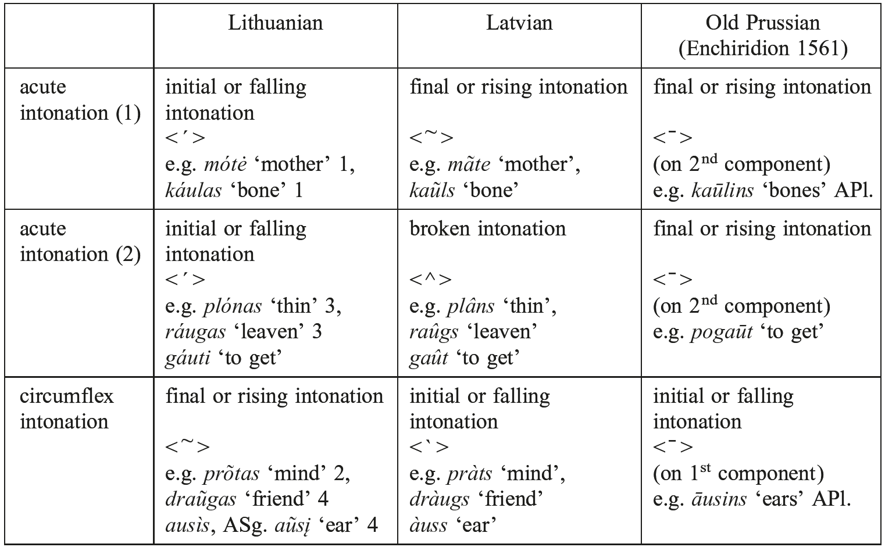

# 88. The phonology of Baltic

1.Introduction

2.Vowels

3.Resonants and diphthongs

4.Accent

5.Consonants

6.References

## 1. Introduction

1.1. In order to describe the phonological system of the Baltic languages, it is worth proceeding, as in the case of reconstructed Proto-Indo-European (PIE), with three types of phonemes: vowels, resonants, and consonants, the reflexes of which present different phonetic behaviors. Unlike PIE, however, beside vowels and consonants, defined by their ability and inability, respectively, to form a syllable, resonants may be defined, in Baltic, mainly by the criterion of intonability, which they in some contexts share with vowels. As a result, the Proto-Baltic sound system must be reconstructed, according to the intrasyllabic arrangement of phonemes, as follows: the phonemes with the lowest sonority are consonants, then follow the resonants, and finally the phonemes with the highest sonority are vowels.

## 2. Vowels

2.1. Vowel quantity is phonemic and independent of stress in East Baltic, e. g. Lith. <i>pùsti</i> ‘to swell’ / <i>pū˜sti</i> ‘to blow’, Latv. <i>sveru</i> ‘I weigh’ / <i>svēru</i> ‘I weighed’, in both cases with initial stress. But, in West Baltic, at least in the Old Prussian Enchiridion (1561), it is possible that unstressed vowels were short (or shortened); this could explain why OPr. has <i>saddinna</i> ‘puts (vb.)’ with a geminate pointing to *<i>sădìna</i>, while Lith. has <i>sodìna</i> ‘seats’ with <i>o</i> from long *<i>ā</i> (< *<i>sādìna</i>). This does not imply, however, that in Old Prussian every stressed vowel was, in turn, long (or lengthened).

2.2. The Proto-Baltic vowel system might be reconstructed in two different ways. Traditionally (e.g. Stang 1966), one ascribes to Proto-Baltic an unbalanced triangular system with four short vowels (*<i>i</i>, *<i>u</i>, *<i>e</i>, *<i>a</i>) and five long vowels (*<i>ī</i>, *<i>ū</i>, *<i>ē</i>, *<i>ō</i>, *<i>ā</i>), this in accordance with Latvian (the only innovation there being the further change of *<i>ō</i> to <i>uo</i>) or Lithuanian (with *<i>ō</i> > <i>uo</i> and *<i>ā</i> > <i>o</i> in the standard language). The most striking feature of Proto-Baltic in comparison with Slavic and Germanic thus seems to have been the preservation of the inherited distinction between *<i>ō</i> and *<i>ā</i> (> Latv. <i>uo</i> / <i>ā</i>, Lith. <i>uo</i> / <i>o</i>), as opposed to the merger of PIE *<i>ŏ</i> and *<i>ă</i> to *<i>ă</i> (> Latv. <i>a</i>, Lith. <i>a</i>). Examples:

<!-- source-file: content/08_chapter02_2.xhtml -->

–Lith. <i>uo</i>, Latv. <i>uo</i> < Proto-Baltic *<i>ō</i> < PIE *<i>ō</i>: Lith. <i>dúoti</i>, Latv. <i>duôt</i> (written <i>dot</i> in the standard language) ‘to give’ (< Proto-Baltic *<i>dō</i>- < PIE *<i>deh₃</i>-, Gr. δίδωμι ‘I give’).

–Lith. <i>o</i>, Latv. <i>ā</i> < Proto-Baltic *<i>ā</i> < PIE *<i>ā</i>: Lith. <i>stóti</i>, Latv. <i>stât</i> ‘to stand up’ (< Proto-Baltic *<i>stā</i>- < PIE *<i>steh₂</i>-, Gr. ἵστημι ‘I set up’).

–Lith. <i>a</i>, Latv. <i>a</i> < Proto-Baltic *<i>ă</i> < PIE *<i>ă</i>: Lith. <i>ašìs</i>, Latv. <i>ass</i> ‘axle’ (< Proto-Baltic *<i>aś</i>- < PIE *<i>ak̑s</i>- < *<i>h₂ek̑s</i>-, Lat. <i>axis</i>).

–Lith. <i>a</i>, Latv. <i>a</i> < Proto-Baltic *<i>ă</i> < PIE *<i>ŏ</i>: Lith. <i>akìs</i>, Latv. <i>acs</i> ‘eye’ (< Proto-Baltic *<i>ak</i>- < PIE *<i>okᵘ̯</i>- < *<i>h₃ekᵘ̯</i>-, Lat. <i>oculus</i>).

2.3. Proto-Baltic *<i>ă</i> may also come from PIE *<i>ə</i> (i.e. *<i>H</i> in a vocalization context), but only in a word-initial syllable (e.g. Lith. <i>stãtas</i> ‘millstone’, Latv. <i>stats</i> ‘stake, post’ < PIE *<i>sth₂-tom</i>); elsewhere, it disappears either completely after a consonant (e.g. Lith. <i>duktė˜</i> ‘daughter’ < *<i>dug-tē</i> < PIE *<i>dʰug̑ h₂</i>-<i>tēr</i>) or with compensatory lengthening and acute tone after a resonant (e.g. Lith. <i>árklas</i>, Latv. <i>arˆkls</i> ‘plough’ ← < *<i>ārtlan</i> < PIE *<i>arH</i>-<i>tlom</i> < *<i>h₂erh₃-tlom</i>; note the later shortening of *<i>ār</i> to <i>ar</i> by Osthoff’s law).

2.4. The other vowels reflect more directly PIE prototypes:

–Lith. <i>i</i>, Latv. <i>i</i> < PBaltic *<i>ĭ</i> < PIE *<i>ĭ</i>: Lith. <i>lìkti</i> ‘to leave’, Latv. <i>likt</i> ‘to put’ (< Proto-Baltic *<i>lik</i>- < PIE *<i>likᵘ̯</i>-, Lat. <i>relictus</i> ‘left’).

–Lith. <i>y</i>, Latv. <i>ī</i> < PBaltic *<i>ī</i> < PIE *<i>ī</i>: Lith. <i>gývas</i>, Latv. <i>dzîvs</i> ‘alive’ (< Proto-Baltic *<i>gīva</i>- < PIE *<i>gᵘ̯</i>ih₃-<i>u̯o</i>-, Lat. <i>uīuus</i>).

–Lith. <i>u</i>, Latv. <i>u</i> < PBaltic *<i>ŭ</i> < PIE *<i>ŭ</i>: Lith. GSg. <i>šuñs</i>, Latv. NSg. <i>suns</i> ‘dog’ (< Proto-Baltic *<i>śun</i>- < PIE *<i>un</i>-, Gr. GSg. κυνός).

–Lith. <i>ū</i>, Latv. <i>ū</i> < PBaltic *<i>ū</i> < PIE *<i>ū</i>: Lith. <i>bū´ti</i>, Latv. <i>bût</i> ‘to be’ (< Proto-Baltic *<i>bū</i>- < PIE *<i>bʰuH</i>-, Gr. ἔφῡν ‘I was’).

–Lith. <i>e</i>, Latv. <i>e</i> < PBaltic *<i>ĕ</i> < PIE *<i>ĕ</i>: Lith. <i>medùs</i> ‘honey’, Latv. <i>medus</i> (< Proto-Baltic *<i>medu</i> < PIE *<i>medʰu</i>, Gr. μέθυ ‘wine’).

–Lith. <i>ė</i>, Latv. <i>ē</i> < PBaltic *<i>ē</i> < PIE *<i>ē</i>: Lith. <i>dė́ti</i> ‘to put’, Latv. <i>dêt</i> ‘to lay (eggs)’ (< Proto-Baltic *<i>dē</i>- < PIE *<i>dʰ</i>eh₁-, Gr. τίθημι ‘I place’).

2.5. This traditional reconstruction, however, does not fit particularly well for West Baltic. In Old Prussian, judging both from the Elbing Vocabulary (EV) and the Catechisms (C), it seems that PIE *<i>ā</i> and *<i>ō</i> had fallen together as *<i>ā</i>. The Enchiridion presents <ā> for both inputs, e.g. <i>brāti</i> ‘brother’ (< *<i>brātē</i>) and <i>dāt</i> ‘to give’ (< *<i>dō</i>-<i>t</i>-). After a labial, this *<i>ā</i> gave *<i>ū</i>, e.g. <i>mūti</i> ‘mother’ (< *<i>mātē</i>) and <i>pūton</i> ‘to drink’ (< *<i>pā</i>-<i>t</i>- < PIE *<i>pō</i>-<i>t</i>-). In the EV, the same undifferentiated vowel *<i>ā</i> secondarily yielded *<i>ō</i>, written <o>, e.g. in <i>brote</i> ‘brother’ (< *<i>brātē</i>), <i>mothe</i> ‘mother’ (< *<i>mātē</i>) or <i>podalis</i> ‘pot’ (< *<i>pōd</i>-<i>elis</i>). For PIE *<i>ă</i> and *<i>ŏ</i>, Old Prussian generally has <a> (e.g. <i>assis</i> ‘axle’ < PIE *<i>ak̑s</i>- or <i>ackis</i> ‘eyes’ < PIE *<i>okᵘ̯</i>-), but in some instances this may appear as <o> (e.g. <i>enkopts</i> ‘buried’ < *<i>kap</i>- < PIE *<i>kop</i>-). Further features of the Old Prussian vowel system are the following: 1. Proto-Baltic *<i>ē</i> was probably pronounced as an open vowel */e:/ in the EV and therefore written <e> (e.g. <i>semen</i> ‘seed’ < *<i>sēmen</i>-) or <ea> (e.g. <i>geasnis</i> ‘woodcock’ < *<i>gēsnis</i>), while in the Catechisms it was probably a closed vowel */e:/, which gave */i:/, written <ī>, in the Enchiridion (e.g. <i>turrītwey</i> ‘to have’ < *<i>turē</i>-<i>t</i>-). 2. For Proto-Baltic *<i>ī</i> and *<i>ū</i>, the Enchiridion shows a tendency for diphthongization, hence *<i>ī</i> > *<i>ei</i> (e.g. <i>geīwan</i> ‘life’ beside <i>gijwan</i> < *<i>gīva</i>-) and *<i>ū</i> > *<i>ou</i> (e.g. <i>soūns</i> ‘son’ < *<i>sūnu</i>-). As in East Baltic, PIE *<i>ĭ</i>, *<i>ŭ</i>, and *<i>ĕ</i> remained basically unchanged in Old Prussian.

2.6. The difference between West and East Baltic, combined with indirect evidence from the Baltic loanwords in the Finnic languages, has led some scholars (e.g. Kazlauskas 1962; Mažiulis 1963) to propose a different reconstruction of the Proto-Baltic vowel system, assuming a distinction between *<i>ō₁</i> (< PIE *<i>ō</i>) and *<i>ō₂</i> (< PIE *<i>ā</i>) and in East Baltic a secondary correlation of *<i>ō₁</i> (< PIE *<i>ō</i>) with *<i>ē₁</i> (< PIE *<i>ei</i>, *<i>ai</i>), the result of which was, in both cases, a diphthong (*<i>ō₁</i> > East Baltic <i>uo</i>, *<i>ē₁</i> > East Baltic <i>ie</i>). Under this view, *<i>ō₂</i> would have become a rounded *<i>ā̊</i>, which merged with *<i>ō₁</i> in West Baltic, but split to *<i>ā</i> in Latvian and to *<i>ō</i> in Lithuanian. This hypothesis remains, however, controversial.

2.7. A few contextual modifications of the vowel system described above are to be mentioned. The most important is the treatment of vowels in word-final position. In Lithuanian, final vowels are generally preserved, except for original long acute vowels, which are shortened by Leskien’s law (Leskien 1881), hence e.g. NSg. of <i>ā</i>-stems *<i>źiemā´</i> (< PIE *<i>-eh₂</i>) > <i>žiemà</i> ‘winter’, 1st Sg. *<i>neśúo</i> (< PIE *-<i>oH</i>) > <i>nešù</i> ‘I carry’, but without shortening Gsg. *<i>źiemā˜s</i> (< PIE *-<i>eh₂es</i>) > <i>žiemõs</i>, NSg. *<i>akmuõ</i> (< PIE *-<i>ōn</i>) > <i>akmuõ</i> ‘stone’. In Latvian, vowels in word-final position have undergone a systematic change, which can be basically defined as a one-mora shortening: bimoric (i.e. long) vowels became short, unimoric (i.e. short) vowels disappeared (except <i>u</i>), e.g. NSg. * <i>źiemā´</i> > <i>zìema</i>, GSg. * <i>źiemā˜s</i> > <i>zìemas</i> (in both cases with short <i>a</i>), Nsg. *<i>dievas</i> > <i>dìevs</i> ‘God’ (cf. Lith. <i>diẽvas</i>), NSg. *<i>medus</i> > <i>medus</i> ‘honey’ (cf. Lith. <i>medùs</i>). In Old Prussian, final long vowels seem to have been preserved (e.g. <i>menso, mensā</i> ‘flesh’ with -<i>o</i>, -<i>ā</i> < *-<i>ā</i>), while final short vowels tend to disappear (e.g. <i>deiws</i> ‘god’ < *<i>deivas</i>, but note <i>deywis</i> in the EV).

## 3. Resonants and diphthongs

3.1. From a structural point of view, one may ascribe to Proto-Baltic six resonants: two nasals (*<i>m</i> and *<i>n</i>), two liquids (*<i>l</i> and *<i>r</i>) and two semi-vowels (*<i>i̯</i> and *<i>u̯</i>). The main feature of resonants in Baltic as opposed to consonants is their intonability; in this respect, tautosyllabic sequences like /an/ or /ar/ have to be treated as diphthongs, in the same way as /ai̯/ or /au̯/, inasmuch as they may carry a syllable toneme, e.g. Lith. <i>lañkas</i> ‘handle’ or <i>var˜gas</i> ‘poor’ like <i>laĩkas</i> ‘time’ or <i>laũkas</i> ‘field’.

3.2. When they act as consonants, resonants are generally stable in Baltic; the only change worth mentioning is that of PIE *<i>u̯</i> to the fricative <i>v</i>. Examples in word-initial position may suffice to illustrate this point:

–Proto-Baltic *<i>m</i> < PIE *<i>m</i>: Lith. <i>m</i>, Latv. <i>m</i>, OPr. <i>m</i>, e.g. Lith. <i>medùs</i>, Latv. <i>medus</i>, OPr. <i>meddo</i> ‘honey’ (< Proto-Baltic *<i>medu</i> < PIE *<i>medʰu</i>, Gr. μέθυ ‘wine’).

–Proto-Baltic *<i>n</i> < PIE *<i>n</i>: Lith. <i>n</i>, Latv. <i>n</i>, OPr. <i>n</i>, e.g. Lith. <i>nósis</i> ‘nose’, Latv. <i>nãss</i> ‘nostril’, OPr. <i>nozy</i> ‘nose’ (< Proto-Baltic *<i>nās</i>- < PIE *<i>nās</i>-, Lat. <i>nārēs</i> ‘nostrils’).

–Proto-Baltic *<i>l</i> < PIE *<i>l</i>: Lith. <i>l</i>, Latv. <i>l</i>, OPr. <i>l</i>, e.g. Lith. <i>lãbas</i>, Latv. <i>labs</i>, OPr. <i>labs</i> ‘good’ (< Proto-Baltic *<i>lab</i>- < PIE *<i>labʰ</i>-, Gr. λάφυρον ‘spoils’).

–Proto-Baltic *<i>r</i> < PIE *<i>r</i>: Lith. <i>r</i>, Latv. <i>r</i>, OPr. <i>r</i>, e.g. Lith. <i>romùs</i>, Latv. <i>rãms</i>, OPr. <i>rāms</i> ‘quiet’ (< Proto-Baltic *<i>rā˘m</i>- < PIE *<i>rom</i>-, Goth. <i>rimis</i> ‘rest’).

–Proto-Baltic *<i>j</i> < PIE *<i>i̯</i>: Lith. <i>j</i>, Latv. <i>j</i>, OPr. <i>j</i>, e.g. Lith. <i>jáunas</i>, Latv. <i>jaûns</i> ‘young’, OPr. anthroponym <i>Jawne</i> (< Proto-Baltic *<i>jāunas</i> < PIE *<i>[h₂]i̯eu̯</i>-<i>h₃n</i>-<i>o</i>-, Lat. <i>iuuenis</i>).

–Proto-Baltic *<i>v</i> < PIE *<i>u̯</i>: Lith. <i>v</i>, Latv. <i>v</i>, OPr. <i>w</i> [v], e.g. Lith. <i>vė́tra</i>, Latv. <i>vẽtra</i>, OPr. <i>wetro</i> ‘wind’ (< Proto-Baltic *<i>vētrā</i> < PIE *<i>[h₂]u̯eh₁</i>-, Gr. ἄησι ‘blows’).

One should note, however, that the Proto-Baltic resonant *<i>j</i> (< PIE *<i>i̯</i>) usually disappears in non-initial position before front vowels (*<i>e</i> or *<i>i</i>), e.g. in the Lith. comparatives like <i>ger</i>-<i>èsnis</i> ‘better’ (with -<i>es</i>- < PIE *-<i>i̯es</i>-). This change did not occur in word-initial position, where the resonant was preserved, as shown e.g. by Lith. <i>jėgà</i> ‘strength’ (< PIE *<i>[H]i̯ēgᵘ̯</i>-<i>ā</i>, Gr. ἥβη ‘youthful strength’). Analogy may obscure the issue, and one actually finds e.g. OLith. ASg. <i>enti</i> ‘going’ (participle *<i>[h₁]i̯</i>-<i>ónt</i>-) with loss of initial *<i>j</i>- by analogy with instances where the verb was preceded by a preverb, such as <i>iš</i>-<i>enti</i> ‘going out’, or conversely the OPr. imperative form <i>pergeis</i> /per-jeis/ ‘may he come!’ (originally an optative *-<i>[h₁]i̯</i>-<i>oi̯[h₁]</i>-) with restoration of internal *-<i>j</i>- before *-<i>e</i>- due to analogy with the simple <i>ieis</i> ‘go!’ (optative *<i>[h₁]i̯</i>-<i>oi̯[h₁]</i>-).

3.3. Another change to be mentioned is the fact that PIE *-<i>m</i> in word-final position became *-<i>n</i> in Proto-Baltic (as e.g. in Greek), as shown by OPr. ASg. <i>deiwan</i> ‘God’ (< PIE *-<i>om</i>).

3.4. When they act as second elements of diphthongs, resonants may undergo significant changes in Baltic. One must distinguish between 1. <i>liquid diphthongs</i> (e.g. /al/, /ar/, or the like), 2. <i>nasal diphthongs</i> (e.g. /am/ or /an/) and 3. <i>semi</i>-<i>vowel diphthongs</i> (e.g. /ai̯/ or /au̯/). Liquid diphthongs are stable in Baltic (e.g. Lith. <i>pìrmas</i>, Latv. <i>pìrmais</i>, OPr. <i>pirmois</i> ‘first’ or Lith. <i>vi[image-glyph: l with tilde] kas</i>, Latv. <i>vìlks</i>, OPr. <i>wilks</i> ‘wolf’). Nasal diphthongs remain unchanged in Old Prussian (e.g. <i>penckts</i> ‘fifth’, <i>sansy</i> ‘goose’, <i>naktin</i> ASg. ‘night’). In Lithuanian, they are usually preserved, unless they stand before a sibilant (<i>s, z, š, ž</i>) or in word-final position; in these cases, the nasal disappeared and produced nasalization of the preceding vowel, written with the cedilla (e.g. *<i>an</i>-<i>S</i>- > <i>ą</i>-<i>S</i>-). After the 18th century, nasal vowels became long oral vowels, which they still are in the standard Lithuanian language. Examples: <i>penkì</i> ‘five’, but <i>žąsìs</i> ‘goose’ /ža:sis/ (< *<i>žans</i>-<i>i</i>-), <i>nãktį</i> ASg. ‘night’ /na:kti:/ (< *-<i>in</i>). In Latvian, nasal diphthongs usually became in all contexts long oral vowels or diphthongs: *<i>am</i>, *<i>an</i> > <i>uo</i> written <o> in the standard language (e.g. <i>rùoka</i> / <i>roka</i> ‘hand’ < *<i>rankā</i>, cf. Lith. <i>rankà</i>), *<i>em</i>, *<i>en</i> > <i>ie</i> (e.g. <i>pìeci</i> ‘five’ < *<i>penkíe</i>, cf. Lith. <i>penkì</i>), *<i>im</i>, *<i>in</i> > <i>ī</i> (e.g. <i>pît</i> ‘to plait’ < *<i>pinti</i>, cf. Lith. <i>pìnti</i>), *<i>um</i>, *<i>un</i> > <i>ū</i> (e.g. <i>jûgs</i> ‘yoke’ < *<i>jungas</i>, cf. Lith. <i>jùngas</i>).

3.5. Semi-vowel diphthongs are well preserved in Old Prussian, e.g. <i>snaygis</i> ‘snow’ (< PIE *<i>snoi̯gᵘ̯ʰ</i>-<i>o</i>-), <i>deiws</i> ‘God’ (< PIE *<i>dei̯u̯</i>-<i>o</i>-), <i>laucks</i> ‘field’ (< PIE *<i>lou̯k</i>-<i>o</i>-), <i>keuto</i> ‘skin’ (< PIE *<i>keu̯Ht</i>-). In East Baltic, they underwent radical changes, which, as a result, considerably obscured ablaut contrasts. For the *-<i>i̯</i>- series, one may suppose a confusion of *<i>ei̯</i> and *<i>ai̯</i> to a long vowel *<i>ē₁</i>, which at a later stage was diphthongized to <i>ie</i> in Lithuanian and Latvian: compare e.g. Lith. <i>sniẽgas</i>, Latv. <i>snìegs</i> ‘snow’ (< *<i>snaigas</i>) and Lith. <i>diẽvas</i>, Latv. <i>dìevs</i> ‘God’ (< *<i>deivas</i>) with OPr. <i>snaygis</i> and <i>deiws</i>. However, the issue is obscured by two facts. Sometimes, East Baltic unexpectedly preserves original *<i>ei̯</i>, e.g. in Lith. <i>deivė˜</i> ‘goddess’ (beside <i>diẽvas</i>); even within East Baltic, discrepancies are to be found, e.g. Lith. <i>eĩti</i> / Latv. <i>iêt</i> ‘to go’ (both from PIE *<i>h₁ei̯</i>-). Based on such contrasts as <i>eĩmu</i> ‘I go’ / <i>iêt</i> ‘to go’ in some Latvian dialects, compared with Old Lith. <i>eimì</i> ‘I go’ / <i>eĩti</i> ‘to go’, Stang (1935) has convincingly argued that preservation of *<i>ei̯</i> was regular in (originally) unstressed syllables.

3.6. The case of *<i>ai̯</i> is different. One might assume that, in East Baltic, Proto-Baltic *<i>ai̯</i> yielded *<i>ē₁</i> > <i>ie</i> in isolated forms, i.e. by a regular phonetic process (e.g. Lith. <i>kiẽmas</i> ‘courtyard’, Latv. <i>cìems</i> ‘village’ < *<i>kaimas</i>, cf. OPr. <i>caymis</i>), whereas its preservation (or restoration) as <i>ai</i> took place only in motivated forms, where an <i>a</i>-grade (< PIE *<i>o</i>) was required by an ablaut contrast (e.g. in causative-iterative verbs of the type Lith. <i>maišýti</i>, Latv. <i>màisît</i> ‘to stir, mix’ beside Lith. <i>miẽšti</i>). But there are many counterexamples that do not fit this view, e.g. isolated words with *<i>ai</i> such as Lith. <i>maĩšas</i> ‘bag’ (cf. Skt. <i>meṣá</i>- ‘ram’) or <i>káimas</i> ‘village’ (the relationship of which to <i>kiẽmas</i> ‘courtyard’ remains obscure), or motivated words with *<i>ie</i> such as Lith. <i>sniẽgas</i>, Latv. <i>snìegs</i> ‘snow’ (obviously derived from Lith. <i>snìgti</i>, Latv. <i>snigt</i> ‘to snow’).

3.7. For the *-<i>u̯</i>- series, West and East Baltic show divergent treatments. The opposition of Proto-Baltic *<i>eu̯</i> (< PIE *<i>eu̯</i>) and *<i>au̯</i> (< PIE *<i>ou̯</i>, *<i>au̯</i>) is usually preserved in Old Prussian, but East Baltic changed *<i>eu̯</i> to *<i>iau</i> (hence Lith. <i>kiáutas</i> ‘shell’ compared with OPr. <i>keuto</i> ‘skin’), whereas *<i>au</i> remained unaltered (hence Lith. <i>laũkas</i> ‘field’ compared with OPr. <i>laucks</i>). The original vowel contrast (*<i>eu̯</i>, vs. *<i>au̯</i>) thus became in East Baltic a consonant contrast (palatalized *<i>iau</i>, vs. unpalatalized *<i>au</i>), which was, in most cases, eliminated: the variant <i>iau</i> is much more scantily preserved than <i>au</i>, generally only in semantically isolated words such as Lith. <i>liaukà</i> ‘gland’ (< PIE *<i>leu̯k</i>-) beside <i>laũkas</i> ‘with a white spot on the forehead’ (< PIE *<i>leu̯k-o</i>-, cf. Gr. λευκός ‘white’).

3.8. Vocalization of PIE resonants in Baltic usually produces a sequence /<i>i</i> + resonant/, e.g. Lith. <i>mirtìs</i> ‘death’ (< PIE *<i>mr̥</i> -<i>ti</i>-), <i>vi[image-glyph: l with tilde] kas</i> ‘wolf’ (< PIE *<i>u̯l̥kᵘ̯</i>-<i>o</i>-), <i>šim˜ tas</i> ‘hundred’ (< PIE *<i>m̥ tom</i>, note the preservation of *-<i>m</i>- before dental), <i>mintìs</i> ‘thought’ (< PIE *<i>mn̥</i>-<i>ti</i>-). But, in some words, it appears as /<i>u</i> + resonant/ (<i>ur, ul, um, un</i>). Some scholars have argued that <i>u</i>-vocalism is regular after velar (i.e. original labiovelar), e.g. Lith. <i>gurklỹs</i> ‘throat’ (< PIE *<i>gᵘ̯</i>r̥h₃-<i>tl</i>-), but this is unlikely, cf. Lith. <i>gìrtas</i> ‘drunk’ (< PIE *<i>gᵘ̯</i>r̥h₃-<i>to-</i>); compare also Lith. <i>giñti</i> and OPr. <i>guntwei</i> ‘to drive’, both from PIE *<i>gᵘ̯ʰn̥</i>-. Interestingly, Stang (1966: 79−80) has drawn attention to the fact that <i>u</i>-vocalism is often to be encountered in expressive words denoting physical shortcomings (e.g. Lith. <i>gurdùs</i> ‘slow’, <i>kum˜pas</i> ‘bent’).

## 4. Accent

4.1. As an inherited feature, stress was free and mobile in Proto-Baltic. This is still well preserved in the Lithuanian standard language, where any syllable may carry the stress, e.g. <i>lìkime</i> ‘let us stay!’ (imperative 1st plural of <i>lìkti</i> ‘to stay’) / <i>likìme</i> ‘O fate!’ (vocative of <i>likìmas</i> ‘fate’) / <i>likimè</i> ‘in fate’ (locative of <i>likìmas</i>). Moreover, stress can move within a paradigm, e.g. NSg. <i>galvà</i> ‘head’, ASg. <i>gálvą</i>, GSg. <i>galvõs</i>, etc. The position of the stress depends on the accentual and tonal properties of syllables, which may be by nature accented or unaccented, acuted or not acuted. In nominal stems, for example, one has to distinguish four accentual patterns, which follow different accentual rules:

–Accentual paradigm 1: stem accent + acuted stem (e.g. <i>líepa</i>, GSg. <i>líepos</i>, InstrSg. <i>líepa</i> ‘lime’)

–Accentual paradigm 2: stem accent + non-acuted stem (e.g. <i>rankà</i>, GSg. <i>rañkos</i>, InstrSg. <i>rankà</i> ‘hand’)

–Accentual paradigm 3: end accent + acuted stem (e.g. <i>galvà</i>, GSg. <i>galvõs</i>, InstrSg. <i>gálva</i> ‘head’)

–Accentual paradigm 4: end accent + non-acuted stem (e.g. <i>žiemà</i>, GSg. <i>žiemõs</i>, InstrSg. <i>žiemà</i> ‘winter’)

As can be seen from these examples, the stem syllable is accented in 1 and 2, but unaccented in 3 and 4 (the genitive being the decisive indicator), acuted in 1 and 3, but non-acuted in 2 and 4. The accentual patterns present the result of the combination of these two parameters − stem accent and stem intonation.

4.2. Stress freedom was probably also preserved in Old Prussian, as presupposed by alternations of the type <i>gīwu</i> ‘you are living’ (2nd Sg. with stem accent) and <i>giwīt</i> ‘to live’ (infinitive with end accent); but this is a much debated issue. In Latvian, perhaps due to linguistic contact with Balto-Finnic languages, accentual mobility was lost: the stress usually falls on the word-initial syllable, except in some compound forms such as <i>ikviens</i> ‘everybody’ /ikˈviens/ or <i>vislielākais</i> ‘the greatest’ /visˈliela:kais/. However, the Latvian broken tone reflects an earlier stage with the same stress mobility as elsewhere in Baltic (e.g. Latv. <i>pêda</i> ‘sole’ < *<i>pē</i>ˈ<i>dā</i>, cf. Lith. <i>pėdà</i>).

4.3. Beside a pitch accent, the Baltic languages are characterized by the existence of tonal oppositions, which basically rest on underlying moraic structures: every long vowel (e.g. /ū/) or diphthong (e.g. /au/) may be defined as a bimoric sequence, in which each component may be emphasized, the first one (e.g. /ū/ = /Uu/, /au/ = /Au/), in which case one speaks of initial or falling intonation, or the second one (e.g. /ū/ = /uU/, /au/ = /aU/), in which case one speaks of final or rising intonation. For Proto-Baltic, one has to assume two intonations, acute (written < ˊ >) and circumflex (written <~ >). Their realizations in the individual Baltic languages are as follows (figures indicate accentual paradigms):

Tab. 88.1: Reflexes of Proto-Baltic acute and circumflex intonations

4.4. As can be seen from the data given above, the Proto-Baltic acute and circumflex tonemes are realized almost conversely: what is a falling tone in Lithuanian is a rising tone in Latvian, and vice-versa; Old Prussian here agrees with Latvian. In addition, Latvian has a third intonation (written <^ >), the so-called “broken tone”, a kind of glottalization (like the Danish <i>stød</i>), that arose from an acute tone in originally unstressed stem syllables (= Lith. accentual paradigm 3). It is generally assumed to be an innovation of Latvian, but some scholars (e.g. Kortlandt 1985) have argued that it could reflect the very nature of the Proto-Baltic acute intonation as an originally glottalized intonation. The origin of the tonal system of Proto-Baltic is in itself a much debated issue. The majority of scholars agree that acute intonation has to be connected with original PIE laryngeals in tautosyllabic position, at least in some contexts (e.g. Lith. <i>draũgas</i> ‘friend’ < PIE *<i>dʰrou̯gʰo</i>-, vs. Lith. <i>gáuti</i> ‘to get’ < PIE *<i>gou̯H-ti</i>-), but there is no broad consensus on the question of whether PIE morphological <i>Dehnstufen</i> are expected to present acute or circumflex intonation in Baltic: speaking for acute intonation is e.g. Lith. <i>žvėrìs</i>, ASg. <i>žvė́rį</i>, Latv. <i>zvȩˆrs</i> ‘wild beast’ (< PIE *<i>g̑ ʰu̯ēr</i>-, compared with Lat. <i>fĕrus</i>), but a circumflex has been presupposed by some scholars, e.g. in Latv. <i>dùore</i> ‘hole in a tree for bees’ (< PIE *<i>dōr</i>-<i>ii̯ā</i> ‘wooden’, if it is a vr̥ddhi-formation to PIE *<i>dŏr</i>-<i>u</i> ‘wood’, cf. Gr. δόρυ).

4.5. In Lithuanian, stress and intonation are combined together insofar as only stressed syllables present tonemes; this was perhaps also the case in Old Prussian. Latvian has preserved an earlier stage, in which there was no interdependence between suprasegmental and prosodic features: every syllable, stressed or unstressed, is intrinsically provided with a toneme. Even in Lithuanian, there is some evidence that unstressed syllables originally possessed tonemes, especially Saussure’s Law (Saussure 1894), which may be defined as an attraction of the stress from a circumflex to a following acute syllable (e.g. * <i>ˈsam˜dýti</i> > *<i>sam˜ ˈdýti</i> > Lith. <i>samdýti</i> ‘to hire, to employ’ with attraction, compared with * <i>ˈlámdýti</i> > Lith. <i>lámdyti</i> ‘to rumple, crumple’) and therefore implies intonability of unstressed syllables.

4.6. In some cases, individual forms of the same stem may display different intonations, e.g. Lith. <i>šókti</i> ‘to dance’ / <i>šõkis</i> ‘dance’. Such prosodic variation, generally connected with derivational processes, is called “metatony”. One may distinguish, since de Saussure (1896), a <i>métatonie douce</i> (acute → circumflex, e.g. Lith. verb <i>šókti</i> → derivative <i>šõkis</i>) and a <i>métatonie rude</i> (circumflex → acute, e.g. Lith. adjective <i>sveĩkas</i> ‘healthy’ → derivative <i>svéikinti</i> ‘to greet’); see Derksen (1996) for a full treatment.

## 5. Consonants

5.1. The consonant inventory of Proto-Baltic may be reconstructed as follows:

–6 stops: 2 labials (voiceless /p/ and voiced /b/), 2 dentals (voiceless /t/ and voiced /d/), 2 dorsals (voiceless /k/ and voiced /g/).

–5 spirants: 1 labial (voiced /v/), 2 dental sibilants (voiceless /s/ and voiced /z/), 2 palatal sibilants (voiceless /ś/ and voiced /ź/).

5.2. The Proto-Baltic stop system underwent two major changes. Within the Indo-European family, the Baltic languages belong to the <i>satǝm</i> group, characterized by 1. the fusion of PIE velars (*<i>k</i>, * <i>g</i>, *<i>gʰ</i>) and labiovelars (*<i>kᵘ̯</i>, *<i>gᵘ̯</i>, *<i>gᵘ̯ʰ</i>) to velars stops (> *<i>k</i>, *<i>g</i>) and 2. the development of PIE palatals (*, *<i>g̑</i>, *<i>g̑ʰ</i>) to spirants (> palatals *<i>ś</i>, *<i>ź</i>). In Latvian and Old Prussian (as in Slavic), the Proto-Baltic palatal sibilants *<i>ś</i> and *<i>ź</i> (< PIE *, *<i>g̑</i>, *<i>g̑ʰ</i>) merged with original dental sibilants to <i>s</i> and <i>z</i>; in standard Lithuanian, they remained distinct as <i>š</i> and <i>ž</i> (but some Lithuanian dialects have <i>s</i> and <i>z</i>). Examples:

–PIE velars:

–Lith. <i>k</i>, Latv. <i>k</i>, OPr. <i>k</i> < Proto-Baltic *<i>k</i> < PIE *<i>k</i>: Lith. <i>kraũjas</i> ‘blood’, Latv. <i>kreve</i> ‘bloody scab’, OPr. <i>crauyo</i> ‘blood’ (< Proto-Baltic *<i>kreu̯(H)</i>- < PIE *<i>kreu̯h₂</i>-, Gr. κρέας ‘flesh’).

–Lith. <i>g</i>, Latv. <i>g</i>, OPr. <i>g</i> < Proto-Baltic *<i>g</i> < PIE *<i>g</i>: Lith. <i>ger˜bti</i> ‘to honour’, Latv. <i>gārbât</i> ‘to care for’, OPr. <i>girbin</i> ‘number’ (< Proto-Baltic *<i>gerb</i>- ‘to count’ < PIE *<i>gerbʰ</i>- ‘to gash’, Gr. γράφω ‘I write’).

–PIE labiovelars:

–Lith. <i>k</i>, Latv. <i>k</i>, OPr. <i>k</i> < Proto-Baltic *<i>k</i> < PIE *<i>kᵘ̯</i>: Lith. <i>kàs</i>, Latv. <i>kas</i>, OPr. <i>kas</i> ‘who, which’ (< Proto-Baltic *<i>kas</i> < PIE *<i>kᵘ̯os</i>, Skr. <i>káḥ</i>).

–Lith. <i>g</i>, Latv. <i>g</i>, OPr. <i>g</i> < Proto-Baltic *<i>g</i> < PIE *<i>gᵘ̯</i>: Lith. <i>gãlas</i>, Latv. <i>gals</i> ‘end’, OPr. <i>gallan</i> ‘death’ (< Proto-Baltic *<i>galas</i> ‘end, top’ < PIE *<i>gᵘ̯olH</i>-<i>o</i>- ‘tip, prick’, OHG <i>quëlan</i> ‘to hurt’).

–PIE palatals:

–Lith. <i>š</i>, Latv. <i>s</i>, OPr. <i>s</i> < Proto-Baltic *<i>ś</i> < PIE *: Lith. <i>širdìs</i>, Latv. <i>sirˆds</i>, OPr. <i>seyr</i> ‘heart’ (< Proto-Baltic *<i>śēr</i> /*<i>śīrd</i>- [length guaranteed by the intonation of Lith. A Sg <i>šìrdį</i>]← PIE *<i>ēr</i> /*<i>r̥d</i>-, Gr. κῆρ, καρδία).

–Lith. <i>ž</i>, Latv. <i>z</i>, OPr. <i>z</i> (often written <i>s</i>) < Proto-Baltic *<i>ź</i> < PIE *<i>g̑</i>: Lith. <i>žinóti</i>, Latv. <i>zinât</i> ‘to know’, OPr. <i>posinnat</i> ‘to recognize’ (< Proto-Baltic *<i>źin</i>- < PIE *<i>g̑ n̥h₃</i>-, Gr. ἔγνων ‘I perceived’).

There is, however, a large set of examples that present a centum-like treatment, i.e. Baltic *<i>k</i>, *<i>g</i> from PIE palatal stops *, *<i>g̑</i>, *<i>g̑ ʰ</i>, e.g. Lith. <i>klausýti</i>, Latv. <i>klàusît</i>, OPr. <i>klausiton</i> ‘to listen’ (< PIE *<i>leu̯s</i>-, OCS <i>slyšati</i> ‘to hear’). Variations between cognate forms are not infrequent, as shown by such doublets as Lith. <i>akmuõ</i> ‘stone’ / <i>ašmuõ</i> ‘cutting edge’ (both from PIE *<i>h₂ek̑</i>-<i>mōn</i>, Skr. <i>áśmā</i> ‘stone’) or Lith. <i>kleĩvas</i> / <i>šleĩvas</i> ‘bow-legged’ (both from PIE *<i>lei̯</i>- ‘to lean, bend oneself’). An explanation for this phenomenon, known in the scholarly literature as “Gutturalwechsel”, is still lacking. One might assume that such centum forms in Baltic belong to a different dialectal layer (anterior to the satemization?). Or, more convincingly, one might remember that Baltic lies precisely on the border between centum and satem languages; it is well known that border languages sometimes take part only to a small extent in linguistic innovations more consistently represented in central languages.

5.3. The second major change characteristic for Proto-Baltic (as well as for Proto-Slavic) is the merger of voiced (PIE *<i>b</i>, *<i>d</i>, *<i>g̑</i>, *<i>g</i>, and *<i>gᵘ̯</i>) and voiced aspirated stops (PIE *<i>bʰ</i>, *<i>dʰ</i>, *<i>g̑ ʰ</i>, *<i>gʰ</i>, and *<i>gᵘ̯ʰ</i>) to a single series of voiced stops (Proto-Baltic *<i>b</i>, *<i>d</i>, *<i>ź</i>, *<i>g</i>). Examples:

–PIE labials:

–Lith. <i>b</i>, Latv. <i>b</i>, OPr. <i>b</i> < Proto-Baltic *<i>b</i> < PIE *<i>b</i>: Lith. <i>dubùs</i> ‘hollow’, Latv. <i>dubt</i> ‘to become hollow’ (< Proto-Baltic *<i>dub</i>- < PIE *<i>dʰub</i>-, Goth. <i>diups</i> ‘deep’).

–Lith. <i>b</i>, Latv. <i>b</i>, OPr. <i>b</i> < Proto-Baltic *<i>b</i> < PIE *<i>bʰ</i>: Lith. <i>bū´ti</i>, Latv. <i>bût</i>, OPr. <i>būton</i> ‘to be’ (< Proto-Baltic *<i>bū</i>- < PIE *<i>bʰuH</i>-, Skr. <i>ábhūt</i> ‘came into existence’).

–PIE dentals:

–Lith. <i>d</i>, Latv. <i>d</i>, OPr. <i>d</i> < Proto-Baltic *<i>d</i> < PIE *<i>d</i>: Lith. <i>dẽšimt</i>, Latv. <i>desmit</i> ‘ten’, OPr. <i>dessimts</i> ‘tenth’ (< Proto-Baltic *<i>deśimt</i>- < PIE *<i>dek̑m̥</i> -<i>t</i>-, Gr. δέκα).

–Lith. <i>d</i>, Latv. <i>d</i>, OPr. <i>d</i> < Proto-Baltic *<i>d</i> < PIE *<i>dʰ</i>: Lith. <i>dė́ti</i> ‘to put’, Latv. <i>dêt</i> ‘to lay (eggs)’ (< Proto-Baltic *<i>dē</i>- < PIE *<i>dʰ</i>eh₁-, Gr. τίθημι ‘I place’).

–PIE palatals:

–Lith. <i>ž</i>, Latv. <i>z</i>, OPr. <i>z</i> (often written <i>s</i>) < Proto-Baltic *<i>ź</i> < PIE *<i>g̑</i>: Lith. <i>žinóti</i>, Latv. <i>zinât</i> ‘to know’, OPr. <i>posinnat</i> ‘to recognize’ (< Proto-Baltic *<i>źin</i>- < PIE *<i>g̑n̥h₃</i>-, Gr. ἔγνων ‘I perceived’).

–Lith. <i>ž</i>, Latv. <i>z</i>, OPr. <i>z</i> (often written <i>s</i>) < Proto-Baltic *<i>ź</i> < PIE *<i>g̑ ʰ</i>: Lith. <i>žiemà</i>, Latv. <i>zìema</i>, OPr. <i>semo</i> ‘winter’ (< Proto-Baltic *<i>źeimā</i>- < PIE *<i>g̑ ʰei̯m</i>-, Gr. χεῖμα).

–PIE velars:

–Lith. <i>g</i>, Latv. <i>g</i>, OPr. <i>g</i> < Proto-Baltic *<i>g</i> < PIE *<i>g</i>: Lith. <i>ger˜bti</i> ‘to honour’, Latv. <i>gārbât</i> ‘to care for’, OPr. <i>girbin</i> ‘number’ (< Proto-Baltic *<i>gerb</i>- ‘to count’ < PIE *<i>gerbʰ</i>- ‘to gash’, Gr. γράφω ‘I write’).

–Lith. <i>g</i>, Latv. <i>g</i>, OPr. <i>g</i> < Proto-Baltic *<i>g</i> < PIE *<i>gʰ</i>: Lith. <i>miglà</i>, Latv. <i>migla</i> ‘mist, fog’ (< Proto-Baltic *<i>miglā</i> < PIE *<i>h₃migʰ</i>leh2, Gr. ὀμίχλη).

–PIE labiovelars:

–Lith. <i>g</i>, Latv. <i>g</i>, OPr. <i>g</i> < Proto-Baltic *<i>g</i> < PIE *<i>gᵘ̯</i>: Lith. <i>gãlas</i>, Latv. <i>gals</i> ‘end’, OPr. <i>gallan</i> ‘death’ (< Proto-Baltic *<i>galas</i> ‘end, top’ < PIE *<i>gᵘ̯olH</i>-<i>o</i>- ‘tip, prick’, OHG <i>quëlan</i> ‘to hurt’).

–Lith. <i>g</i>, Latv. <i>g</i>, OPr. <i>g</i> < Proto-Baltic *<i>g</i> < PIE *<i>gᵘ̯ʰ</i>: Lith. <i>gãras</i>, Latv. <i>gars</i> ‘steam, vapor’, OPr. <i>gorme</i> ‘heat’ (< Proto-Baltic *<i>gar</i>- < PIE *<i>gᵘ̯ʰor</i>-, Skr. <i>gharmá</i>-‘heat’).

This merger is usually considered to have taken place in an early stage of Proto-Balto-Slavic. But it has been proposed by Winter (1978) that, in Baltic and Slavic, vowels were lengthened (with the acute tone) before a PIE voiced stop, but not before a PIE voiced aspirated stop, which implies their merger to be a recent process. Examples of Winter’s Law:

–Lith. <i>ė́sti</i> ‘to eat, to devour’, Latv. <i>êst</i>, OPr. <i>īst</i> ‘to eat’ (< Proto-Baltic *<i>ēd</i>-<i>ti</i>- < PIE *<i>h₁ĕd</i>-, Skr. <i>ádmi</i> ‘I eat’).

–Lith. <i>ū´dra</i>, Latv. <i>ûdrs</i>, OPr. <i>udro</i> ‘otter’ (< Proto-Baltic *<i>ūd</i>-<i>rā</i> < PIE *<i>ŭd</i>-<i>reh₂</i>, Gr. ὕδρα ‘water serpent’).

Admittedly, the evidence for Winter’s Law still remains controversial, since there is a large number of counter-examples (e.g. Lith. <i>dubùs</i> ‘hollow’, Latv. <i>dubt</i> ‘to become hollow’ < Proto-Baltic *<i>dub</i>- < PIE *<i>dₕub</i>-, cf. Goth. <i>diups</i> ‘deep’). This is still a much debated issue; recent attempts at reformulating the law have been proposed by Shintani (1985) and Matasović (1995).

5.4. Except for *<i>s</i>, spirants are, for the most part, recent developments in Baltic. We have to ascribe to Proto-Baltic a voiced labial spirant /v/, going back to the PIE resonant *<i>u̯</i>, but no voiceless counterpart */f/, which does not exist in early stages of any of the three major Baltic languages. In ancient borrowings, /f/ was systematically replaced by /p/, e.g. Lith. <i>ar˜pas</i> ‘winnowing-machine’ (< German <i>Harfe</i>), OPr. <i>pastauton</i> ‘to fast’ (< German <i>fasten</i>). Only recent loans have introduced a phoneme /f/ in the Baltic languages, e.g. Lith. <i>fìlmas</i>, Latv. <i>fi[image-glyph: l with tilde] ma</i> ‘film’.

5.5. Proto-Baltic preserved the unique PIE dental spirant *<i>s</i>, which remained unchanged in most contexts, e.g. Lith. <i>sėdė́ti</i>, Latv. <i>sêdêt</i> ‘to sit down’, OPr. <i>sīdons</i> ‘sitting’ (< PIE *<i>sed</i>-). A voiced counterpart exists only as an allophone, e.g. Lith. <i>lìzdas</i> ‘nest’ (< *<i>nizdo</i>- < PIE *<i>ni-sd-o</i>-).

5.6. The Baltic languages have developed a secondary series of palatal spirants, with at least 2 sibilants (<i>š, ž</i>) and in some languages 2 affricates (<i>č</i>, <i>dž</i>). In chronological order, one might first mention the so-called “ruki-rule”, according to which a PIE sibilant *<i>s</i> after <i>r, u, k</i>, or <i>i</i>, yielded in Proto-Baltic a palatal spirant *<i>ś</i> that merged with the outcome of PIE *, the result of which therefore was /š/ in Lithuanian, /s/ in Latvian and Old Prussian. Examples are quite limited in number:

–after <i>r</i>: Lith. <i>viršùs</i>, Latv. <i>vìrsus</i> ‘top’ (< PIE *<i>u̯r̥s</i>-); cf. OCS <i>vrŭchŭ</i>, Skr. <i>varṣmán</i>-‘height’.

–after <i>u</i>: Lith. <i>jū´šė</i>, OPr. <i>iuse</i> ‘fish soup’ (< PIE *<i>i̯ūs</i>-); cf. Pol. <i>jucha</i>, Lat. <i>iūs</i> ‘soup’.

–after <i>i</i>: Lith. <i>maĩšas</i>, Latv. <i>màiss</i> ‘bag’, OPr. <i>moasis</i> ‘bellows’ (< PIE *<i>moi̯so</i>-); cf. Skr. <i>meṣá</i>- ‘ram’.

(We do not have any reliable example after <i>k</i>). It should be noted that the “ruki-rule” is less regular in Baltic than it is in Slavic or Indo-Iranian. There is a large number of counter-examples, e.g. Lith. <i>ausìs</i> ‘ear’ (< PIE *<i>h₂eu̯s</i>-), <i>vìsas</i> ‘all’ (< PIE *<i>u̯is</i>-<i>o</i>-), some of which might be due to analogy, e.g. Lith. <i>akysè</i> ‘in the eyes’ (Loc.Pl.), instead of *<i>akyše</i>, with the same ending as <i>rañkose</i> ‘in the hands’.

5.7. In Lithuanian, the palatal sibilants (<i>š, ž</i>) thus have two sources (PIE palatal stops or − in the case of <i>š</i> − PIE *<i>s</i> in ruki-contexts). In addition, there exists a series of affricates that appears to be a recent innovation resulting from the palatalization of PIE dental stops before the resonant *<i>i̯</i>: Proto-Baltic *<i>tj</i> (< PIE *<i>ti̯</i>) and Proto-Baltic *<i>dj</i> (< PIE *<i>d[h]i̯</i>) yielded respectively <i>či</i> /tš’/ and <i>dži</i> /dž’/ (<i>i</i> marking here merely the softness of the affricate), e.g. Lith. <i>svẽčias</i> ‘guest’ (< *<i>svetja</i>- ‘stranger’ < PIE *<i>su̯e</i><i>ti̯o</i>-), Lith.dial. <i>mẽdžias</i> ‘forest’ (< *<i>medja</i>- ‘standing in the middle’ < PIE *<i>medʰi̯o</i>-). Hard affricates (<i>č</i> or <i>dž</i>) are rare and always secondary (e.g. Lith. <i>giñčas</i> ‘quarrel’ < *<i>gint</i>-<i>šas</i>). In Old Prussian, Proto-Baltic *<i>tj</i> and *<i>dj</i> remained unchanged (e.g. OPr. <i>median</i> ‘tree’ < *<i>medja</i>-).

5.8. In Latvian, palatalizations are a relatively complex issue. One has to distinguish two different processes. First, in an early stage of the language, Proto-Baltic velar stops *<i>k</i> and *<i>g</i> became affricates *<i>c</i> /ts/ and *<i>dz</i> /dz/ before front vowels (<i>e</i> or <i>i</i>), e.g. *<i>kēlti</i> ‘to raise’ (cf. Lith. <i>kélti</i>) > Latv. <i>celˆt</i>, *<i>gērti</i> ‘to drink’ (cf. Lith. <i>gérti</i>) > Latv. <i>dzerˆt</i>. As a result, a large number of consonant alternations appeared, e.g. Latv. <i>sâku</i> ‘I begin’ (1stSg.), but <i>sâc</i> ‘you begin’ (2nd Sg. < *<i>sâk</i>-<i>i</i>). Secondly, we have to deal with various palatalizations of consonants before the original resonant *<i>i̯</i> (> Baltic *<i>j</i>). They can be summarized by the following (simplified) alternation rules:

Tab. 88.2: Latvian palatalization before <i>*j</i>

<table>
<tr><td>Consonant</td><td>Consonant + * <i>j</i></td><td>Examples</td></tr>
<tr><td><i>p, b</i></td><td><i>pļ</i> /pl’/, <i>bļ</i> /bl’/ (word initially) <i>pj, bj</i> (otherwise)</td><td><i>pļaũt</i> ‘to mow’ (< *<i>pjauti</i>, cf. Lith. <i>pjáuti</i>) <i>bļaũrs</i> ‘nasty’ (< *<i>bjauras</i>, cf. Lith. <i>bjaurùs</i>) <i>upju</i>, GPl. of <i>upe</i> ‘river’ (cf. Lith. <i>ùpjų</i>) <i>gùlbju</i>, GPl. of <i>gùlbis</i> ‘swan’ (cf. Lith. <i>gu[image-glyph: l with tilde] bjų</i>)</td></tr>
<tr><td><i>t, d</i></td><td><i>š, ž</i></td><td><i>svešs</i> ‘stranger’ (< *<i>svetja</i>-, cf. Lith. <i>svẽčias</i>) <i>mežs</i> ‘forest’ (< *<i>medja</i>-, cf. Lith.dial. <i>mẽdžias</i>)</td></tr>
<tr><td><i>k, g</i></td><td><i>c, dz</i></td><td><i>sàucu</i> ‘I shout’ (< *<i>sàukju</i>, cf. Inf. <i>sàukt</i>) <i>lùdzu</i> ‘I beg’ (< *<i>lùdju</i>, cf. Inf. <i>lùgt</i>)</td></tr>
<tr><td><i>s, z</i></td><td><i>š, ž</i></td><td><i>plêšu</i> ‘I tear’ (< *<i>plês</i>-<i>ju</i>, cf. Inf. <i>plêst</i>) <i>laûžu</i> ‘I break’ (< *<i>laûz</i>-<i>ju</i>, cf. Inf. <i>laûzt</i>)</td></tr>
<tr><td><i>n</i></td><td><i>ņ</i></td><td><i>zir˜ņu</i>, GPl. of <i>zir˜nis</i> ‘pea’ (< *<i>zir˜nju</i>)</td></tr>
<tr><td><i>l</i></td><td><i>ļ</i></td><td><i>meļu</i>, GPl. of <i>melis</i> ‘liar’ (< *<i>melju</i>)</td></tr>
</table>

5.9. A few combinatory changes are worth mentioning. First, a sequence of /dental+dental/ as a rule yields /s+dental/ in Baltic, e.g. Lith. <i>ė́sti</i> ‘to eat, devour’, Latv. <i>êst</i>, OPr. <i>īst</i> ‘to eat’ (< Proto-Baltic *<i>ēd</i>-<i>ti</i>-).

5.10. Finally, according to a tendency variously attested in the Baltic languages, a velar stop *<i>k</i> sometimes appears before sibilants, e.g. Lith. <i>tū´kstantis</i>, Latv. <i>tũkstuôtis</i> ‘thousand’ (< *<i>tūstant</i>-), Lith. <i>bókstas</i> ‘tower’ (< Pol. <i>baszta</i>). This so-called “epenthetic *<i>k</i>” is by no means a phonetic rule, as many counter-examples exist, e. g. Lith. <i>pir˜štas</i> ‘finger’ (but Latv. <i>pìrksts</i>), Lith. <i>áuksas</i> ‘gold’ (but OPr. <i>ausis</i>); there are also some doublets, e.g. Lith. <i>plúokštas</i> / <i>plúoštas</i> ‘handful’, Latv. <i>sviêksts</i> / <i>sviêsts</i> ‘butter’. Whatever may be its origin, this tendency must be connected, at least partially, with the fact that a sequence *<i>sk</i> (or *<i>šk</i>) is not tolerated in Baltic before a consonant, where it yields *<i>ks</i> (or *<i>kš</i>), e.g. Lith. <i>tróško</i> ‘feels thirsty’, but Inf. <i>trókšti</i>.
