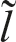
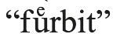
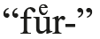

# 91. The lexicon of Baltic

1.Inherited vocabulary

2.Loanwords

3.Specifically Baltic vocabulary

4.Word formation

5.References

## 1. Inherited vocabulary

The common Indo-European vocabulary has been well preserved in Baltic. Below is a list of selected Baltic inherited words alongside an approximate reconstruction of the PIE stem. For larger collections of material, cf. Sabaliauskas (1966, 1990); Lanszweert (1984); and Ademollo Gagliano (1995). The Baltic material is mainly quoted from the following sources: LKŽ, Mühlenbach and Endzelin (1923−1932), and Mažiulis 1988− 1997.

### 1.1. Kinship terms and terms for persons

MOTHER Lith. <i>mótė</i> ‘mother’, later ‘wife’, Latv. <i>mãte</i>, OPr. Cat. <i>mūti</i>, EV <i>mothe</i> (PIE *<i>máh₂ter</i>-); DAUGHTER Lith. <i>duktė˜</i>, OPr. EV <i>duckti</i> (PIE *<i>dʰugh2tér</i>-); SON Lith. <i>sūnùs</i>, OPr. Cat. <i>soūns</i> (PIE *<i>suHnú</i>-); SISTER Lith. <i>sesuõ</i>, OPr. EV <i>swestro</i> ‘sister’ (PIE *<i>su̯ésor-</i>); BROTHER Lith. <i>brólis</i>, dim. <i>broterė˜lis</i>, Latv. <i>brãlis</i>, dim. <i>brātarītis</i>, OPr. Cat. <i>brāti</i>, EV <i>brote</i> ‘brother’ (PIE *<i>bʰráh₂ter</i>-); BROTHER-IN-LAW Lith. <i>díeveris</i>, Latv. <i>diẽveris</i> (PIE *<i>dah₂iu̯ér</i>- or *<i>dai̯h₂u̯ér</i>-); MAN Lith. <i>výras</i>, Latv. <i>vĩrs</i>, OPr. Cat. <i>wijrs</i> (PIE *<i>u̯iHró</i>-); WOMAN OPr. EV <i>genno</i>, Cat. <i>genna</i> ‘woman, wife’ (PIE *<i>gʷ</i>énh₂-).

### 1.2. Body parts

EAR Lith. <i>ausìs</i>, Latv. <i>àuss</i>, OPr. EV <i>ausins</i>, Cat. <i>āusins</i> Apl. (PIE *<i>h₂óu̯s</i>-/*<i>h₂áu̯s</i>-); EYE Lith. <i>akìs</i>, Latv. <i>acs</i>, OPr. Cat. <i>ackis</i> Npl. (PIE *<i>h₃ókʷ</i>-); NOSE Lith. <i>nósis</i>, Latv. <i>nãss</i> ‘nostril’, OPr. EV <i>nozy</i> (PIE *<i>(H)nā´s</i>-); TOOTH Lith. <i>dantìs</i>, OPr. EV <i>dantis</i> (PIE *<i>h₁dónt</i>-); HEART Lith. <i>širdìs</i>, Latv. <i>sirˆds</i>, OPr. EV <i>seyr</i> (PIE *<i>érd</i>-); LIVER Lith. dial. <i>jẽknos</i>, Latv. <i>aknas</i>, dial. <i>jęknas</i>, OPr. EV <i>lagno</i> (recte: <i>iagno</i>) (PIE *<i>i̯ékʷr̥</i>/<i>n</i>-).

<!-- source-file: content/08_chapter02_5.xhtml -->

### 1.3. Fauna

SHEEP Lith. <i>avìs</i>, Latv. <i>avs</i> ‘sheep’, OPr. EV <i>awins</i> ‘ram’ (PIE *<i>Hóu̯i</i>-); WOLF Lith. <i>vi[image-glyph: l with tilde] kas</i>, Latv. <i>vìlks</i>, OPr. EV <i>wilkis</i> (PIE *<i>u̯ĺ̥kʷo</i>-); COW Latv. <i>gùovs</i> (PIE *<i>gʷṓu̯</i>-); HORSE Lith. <i>ašvà</i> ‘mare’, OPr. EV <i>aswīnan</i> ‘mare’s milk’ (PIE *<i>h₁ék̑u̯o</i>-); DOG Lith. <i>šuõ</i>, Latv. <i>suns</i>, OPr. EV <i>sunis</i> (PIE *<i>[u]u̯ ón</i>-); BEAR Lith. <i>irštvà</i> ‘bear’s den’ (PIE *<i>h₂ŕ̥tk̑o</i>-; cf. Karaliūnas 1993); FISH Lith. <i>žuvìs</i>, Latv. <i>zivs</i>, dial. <i>zuvs</i>, OPr. EV <i>suckis</i> (PIE *<i>dʰg̑ʰúH</i>-); GOOSE Lith. <i>žąsìs</i>, Latv. <i>zùoss</i>, OPr. EV <i>sansy</i> (PIE *<i>g̑ ʰáns</i>-); BEAST Lith. <i>žvėrìs</i>, Latv. <i>zvęˆrs</i>, OPr. Cat. <i>swīrins</i> Apl. (PIE *<i>g̑ʰu̯ḗr</i>-); DUCK Lith. <i>ántis</i>, OPr. EV <i>antis</i> (PIE *<i>h₂ánh₂ti</i>-).

### 1.4. Natural objects and phenomena

SUN Lith. <i>sáulė</i>, Latv. <i>sau˜le</i>, OPr. EV <i>saule</i> (PIE *<i>sáh₂u̯l̥</i>/<i>n</i>-); MOON Lith. <i>mė́nuo</i> ‘moon, month’, Latv. <i>mẽness</i> ‘id.’, OPr. EV <i>menig</i> ‘moon’ (PIE *<i>méh₁nōt</i>-); STONE Lith. <i>akmuõ</i> ‘stone’, <i>ašmuõ</i> ‘edge, blade’, Latv. <i>akmens</i> ‘stone’, <i>asmens</i> ‘edge, blade’ (PIE *<i>h₂ák̑men</i>-); WATER Lith. <i>vanduõ</i>, Latv. <i>ûdens</i>, OPr. EV <i>wundan</i>, OPr. Cat. <i>unds</i> (PIE *<i>u̯ódr̥</i>/<i>n</i>-); CLOUD, SKY Lith. <i>debesìs</i>, Latv. <i>debess</i> (PIE *<i>nébʰes</i>-); SMOKE Lith. <i>dū´mai</i>, Latv. <i>du˜mi</i>, OPr. EV <i>dumis</i> (PIE *<i>dʰuh2mó</i>-); SNOW Lith. <i>sniẽgas</i>, Latv. <i>snìegs</i>, OPr. EV <i>snaygis</i> (*<i>snói̯gʷʰo</i>-); NIGHT Lith. <i>naktìs</i>, Latv. <i>nakts</i>, OPr. Cat. <i>naktin</i> Asg. (PIE *<i>nókʷt</i>-).

### 1.5. Adjectives

FULL Lith. <i>pìlnas</i>, Latv. <i>pi[image-glyph: l with tilde] ns</i>, OPr. Cat. <i>pilnan</i> Asg. (PIE *<i>pl̥h₁nó</i>-); OLD Lith. <i>sẽnas</i>, Latv. <i>sens</i> (PIE *<i>séno</i>-); LONG Lith. <i>ìlgas</i>, Latv. <i>i[image-glyph: l with tilde] gs</i>, OPr. Cat. <i>ilga, ilgi</i> adv. (PIE *<i>dl̥h₁gʰó</i>-); RED Lith. <i>rau˜das</i>, Latv. <i>rau˜ds</i> ‘red, reddish-brown’ (PIE *<i>h₁rou̯dʰó</i>-).

### 1.6. Verbs

TO BE Lith. <i>bū´ti</i>, Latv. <i>bût</i>, OPr. Cat. <i>būton</i> ‘to be’ (PIE *<i>bʰ</i>u̯ah₂-), Lith. <i>esù</i>, Latv. <i>ęsmu</i>, OPr. Cat. <i>asmai</i> ‘I am’ (PIE *<i>h₁es</i>-); TO SIT Lith. <i>sėdė́ti, sė́sti</i> Latv. <i>sêdêt</i>, OPr. Cat. <i>sīdons</i> past act. ptc. (PIE *<i>sed</i>-); TO STAND Lith. <i>stóti</i>, Latv. <i>stât</i> ‘to stand’, OPr. Cat. <i>postāt</i> ‘to become’, <i>stānintei</i> gerund ‘standing’ (PIE *<i>stah₂</i>-); TO PUT Lith. <i>dė́ti</i> ‘to put’, Latv. <i>dêt</i> ‘to lay eggs’ (PIE *<i>dʰeh1-</i>); TO GIVE Lith. <i>dúoti</i>, Latv. <i>duôt</i>, OPr. Cat. <i>dāt</i> (PIE *<i>doh₃</i>-); TO GO Lith. <i>eĩti</i>, Latv. <i>iêt</i>, OPr. Cat. <i>ēisei</i> 2sg. prs. (PIE *<i>h₁ei̯</i>-); TO COME Lith. <i>giti</i>, Latv. <i>dzìmt</i> ‘to be born’, OPr. Cat. <i>gemmons</i> past act. ptc. ‘born’, <i>gimsenin</i> ‘birth’ (PIE *<i>gʷem</i>-; the semantic development from ‘to come’ through ‘to come into the world’ to ‘to be born’ is common Baltic); TO EAT Lith. <i>ė́sti</i>, Latv. <i>êst</i>, OPr. Cat. <i>īst</i> (PIE *<i>h₁ed</i>-); TO DRINK Lith. <i>puotà</i> ‘feast, drinking orgy’, OPr. Cat. <i>pūton</i> ‘to drink’ (PIE *<i>poh₃[i̯]</i>-); TO SWALLOW Lith. <i>gérti</i>, Latv. <i>dzerˆt</i> ‘to drink’, OPr. EV <i>gurcle</i> ‘throat’ (PIE *<i>gʷ</i>erh₃-); TO THINK Lith. <i>miñti</i> ‘to think, to remember’, <i>minė́ti</i> ‘to mention, to remember’, Latv. <i>minêt</i> ‘to mention’, OPr. Cat. <i>menentwey</i> ‘id.’, <i>menissnan</i> Asg. ‘memory’ (PIE *<i>men</i>-); TO SEE, TO KNOW Lith. <i>veizdė́ti</i>, Latv. <i>viedêt</i> ‘to see’, OPr. Cat. <i>waist</i> ‘to know’ (PIE *<i>u̯ei̯d</i>-); TO BURN Lith. <i>dègti</i>, Latv. <i>degt</i> (PIE *<i>dʰegʷʰ</i>-); TO PLOUGH Lith. <i>árti</i>, Latv. <i>arˆt</i> ‘to plough’, OPr. EV <i>artoys</i> ‘ploughman’, cf. Lith. <i>artójas</i> ‘id.’ (PIE *<i>h₂arh₃-</i>); TO RUN Lith. <i>bė́gti</i>, Latv. <i>bêgt</i>, OPr. frag. <i>begeyte</i> 2pl. imp. (PIE *<i>bʰegʷ</i>-); TO DIE Lith. <i>mir˜ti</i>, Latv. <i>mir˜t</i>, dial. <i>mìrt</i> (PIE *<i>mer</i>-).

## 2. Loanwords

The majority of older loanwords in the Baltic languages are from Slavic and Germanic. Many of the words imported into Baltic are themselves already borrowings, mainly from Latin and, less frequently, Byzantine Greek. Furthermore, many Germanicisms have been borrowed through Slavic intermediaries, and it can be difficult to determine the exact route of a given word. A few words have been borrowed from the neighboring Balto-Finnic languages, but more significantly, an archaic stage of Baltic is preserved in the form of loanwords in these languages.

### 2.1. Slavic

The Slavic languages have influenced the Baltic lexicon at different stages in time, and it is often difficult to decide which Slavic language is the donor language of a given word. From around the 4th or 3rd c. BCE down to the present, the Slavs and the Balts have remained in constant contact. For collections and studies of Slavic loanwords, cf. Brückner (1877); Skardžius (1931); Sabaliauskas (1990: 227−257); and Kardelis (2003). The Slavic loans in Old Prussian are mainly from West Slavic, i.e. Old Polish (perhaps better labelled “Proto-Polish”); cf. Levin (1974) for a detailed treatment of the Slavic element in the Elbing Vocabulary.

The oldest Slavic loanwords preserved in East Baltic have been analyzed by Būga (1912, 1924); Kiparsky (1948); Guild (1978); Seržant (2006) and Young (forthcoming). These loans display certain archaic traits; for example, jers are preserved as high vowels in both strong and weak position, e.g. Lith. <i>kùrtas</i>, Latv. <i>kurts</i> ‘greyhound’ < *<i>хŭrtŭ</i> (cf. Ru. <i>хоrt</i>); OLith. and dial. <i>tùlkas</i>, Latv. <i>tu[image-glyph: l with tilde] ks</i> ‘translator’ < *<i>tŭlkŭ</i> (cf. Ru. <i>tolk</i>); OLith. and dial. <i>bìrkavas</i>, Latv. <i>bir˜kavs</i>, <i>bir˜kava</i> ‘unit of weight equal to 10 poods’ < *<i>bĭrkovŭ(skŭ pǫdŭ)</i> ‘Birka (pood)’ (originally an adjective formed to *<i>Bĭrka</i>, the Viking-age trading center in Sweden; cf. Ru. <i>bеrkоvеc</i>). A few loans seem to predate the East Slavic pleophony. One such example is Lith. <i>čérpė</i> (dial. <i>čer˜pė</i>) ‘tile to cover the roof, to build an oven; a type of clay dish or a fragment thereof’ from Slav. *<i>čerpŭ</i> ‘fragment, splinter’ (cf. Ru. <i>čerep</i> ‘skull’, <i>čerepok</i> ‘splinter, fragment’). The possibility that <i>čérpė</i> may be a shortened form of *<i>čerepē</i> can, however, not be ruled out; cf. OLith. <i>čerpyčia</i> ‘oven, stove’ which could be a loan from Slav. *<i>čerpica</i>, but could equally be a shortened form of the also attested <i>čerepyčia</i> (Belo-Ru. <i>čerepica</i>), as suggested by Skardžius (1931: 55). An example from Latvian is <i>ka[image-glyph: l with tilde] ps</i> ‘servant; farm hand’ < *<i>хоlpŭ</i> (cf. Ru. <i>хоlоp</i>). This may, however, also reflect a syncopated form (i.e. <i>ka[image-glyph: l with tilde] ps</i> < *<i>kalaps</i>), given the high frequency of syncope of internal short open syllables in Latvian; cf. Endzelin (1923: 46 f.). There are also some examples of early loans with a diphthong <i>uo</i> (< *<i>ō</i>) for Slav. <i>u</i>, which seems to indicate that the Slavic vowel was still *<i>ō</i> at the time these words were borrowed (in later borrowings this vowel is represented by <i>ū</i>, and still later as <i>u</i>), e.g. Latv. <i>duo˜ma</i> ‘thought’ (cf. Ru. <i>duma</i>); Latv. <i>kàpuôsts</i>, dial. <i>kàpuo˜sts</i> ‘cabbage’ (cf. Ru. <i>kapusta</i>); Latv. <i>puo˜kaiņš</i> ‘wire-haired, fletched’. Lithuanian has only a very few examples of this kind, however; cf. Žemaitian <i>puo˜kas</i> ‘down, fluff’ (cf. Ru. <i>puх</i>), as opposed to the later Aukštaitian <i>pū˜kas</i>. Another example from Lithuanian is <i>kruo˜pos</i> pl. ‘groats’ (cf. Ru. <i>krupa</i>). Examples which go back to an original Slavic nasal vowel *<i>ǭ</i> may represent the same phenomenon: Latv. <i>kuodeļš, kùodaļa, kùodeļa</i>, Lith. <i>kuodẽlis</i> ‘tow (of flax)’ (cf. ORu. <i>kudelja</i> Ru. <i>kudelĭ</i>; note that the same word was borrowed into Finnish as <i>kuontalo</i>; cf. Kiparsky 1948: 36); Latv. <i>muõka</i> ‘torment, torture’ (cf. Ru. <i>muka</i>, Pol. <i>męka</i>); Latv. <i>rùobeža</i> ‘border, boundary’ (cf. Ru. <i>rubež</i>). Another point of view is represented by Guild (1978: 428), who argues that Old Russian still possessed nasal vowels at this stage and that Latv. <i>uo</i> in these words reflects earlier *<i>an</i>. It should be pointed out that the same solution is not possible for the few instances in Lithuanian. In a recent article, Seržant (2006) has suggested that these early Slavic loans entered Latvian through Proto-High-Latvian, and that the vocalism may simply reflect the regular substitution of Middle Latv. <i>uo</i> for Proto-High-Latv. *<i>ū</i>. Since the reflex <i>uo</i> for Slavic *<i>ō</i> occurs almost exclusively in Latvian, whereas the same loans in Lithuanian mostly have <i>ū</i> or <i>u</i> (cf. Kiparsky 1948), an inner-Latvian explanation may be preferable in this case.

It is rather difficult to estimate when the earliest loanwords from East Slavic first appeared in Baltic. The fact that some loans seem to predate pleophony suggests that these may have entered Baltic before the 10th c., and the preservation of the jers as high vowels indicates a date before the 12th c.; cf. Būga (1924). In Latvia, the political and cultural dominance shifted by the 13th century with the conquest of Livonia by the Germans and the incorporation of Riga in the Hanseatic league in 1282. From this time German loans begin to appear in Latvian, whereas the borrowing of Slavic words becomes much less common. On the other hand, the Slavic influence on Lithuanian continued. In the Grand Duchy of Lithuania, the West Russian (Old Belorussian) chancellery language was used for administrative purposes (cf. Stang 1935). With the marriage between Grand Duke Jogaila of Lithuania and Queen Jadwiga of Poland in 1386, the Polish influence on the Lithuanian language increased considerably. The major part of the Slavic loans in the Old Lithuanian texts are accordingly from Belorussian and Polish; cf. the large collection made by Skardžius (1931). It is often claimed that the 16th−17th c. texts have at least twice as many loanwords from Polish as from Belorussian. However, this notion is based on a simple wordcount of the loans listed by Skardžius. For example, Palionis (1967: 269 ff.) and Sabaliauskas (1990: 229) both highlight the fact that of the 2950 words in the collection only about 760 words are classified as Belorussian as compared to about 1500 words with a Polish origin. In addition, about 630 words may be from either Belorussian or Polish. Unfortunately, this method does not give a correct picture of the situation. Skardžius did not have access to many of the studies concerning Old Belorussian, and was therefore frequently unable to quote the relevant Old Belorussian forms. In fact, a re-evaluation by Urbutis (1992) of part of the collected material revealed that almost three-quarters of the examined loanwords might just as well be from Belorussian as from Polish. In the remaining quarter, the Belorussian loans seem to be in the majority.

### 2.2. Germanic

Most of the German loanwords in Baltic stem from a variety of Middle Low German used in the domain of the Teutonic Order, though it can be difficult to determine the exact dialectal form; cf. Čepienė (1995, 2006). Some examples: Lith. <i>ãmatas</i>, Latv. <i>amats</i> ‘handicraft’ (MLG <i>am[m]et</i>); Lith. <i>blánka</i>, Latv. <i>blànka</i> ‘plank’ (MLG <i>blanke</i>); Lith. <i>bùdelis</i>, Latv. <i>budelis</i>, <i>budẽlis</i> ‘hangman’ (MLG <i>boddel</i>, EPr. Germ. <i>bodel</i>); Lith. <i>rùngas</i>, Latv. <i>ruñga</i> ‘stake’ (MLG <i>runge</i>); Lith. <i>rū´mas</i>, Latv. <i>ru˜me</i> ‘mansion, chamber’ (MLG <i>rūm</i>). The most widespread loanwords are those associated with government, the military and economics as well as construction and building terms, although words belonging to other semantic areas are not uncommon; cf. Senn (1925); Alminauskis (1934); Sabaliauskas (1990: 257−268); Palionis (1967: 286 ff.); Giriūnienė (1975) for loans in Lithuanian and Sehwers (1936); Jordan (1995) for Latvian. A discussion of the oldest layer of Germanic loanwords is offered by Otrębski (1966). For a summary of previous research and further references, cf. Čepienė (1992). In Lithuanian, most loanwords are found in the dialects along the Prussian border, i.e. West Aukštaitian, and to some extent in the Žemaitian dialects. In the other dialects, there are relatively few German loanwords, and according to Sabaliauskas (1990: 259) the German loanwords constitute only 0.5% of the literary language. In the Latvian literary language, there are about 500 loans from German; cf. Zemzare (1961: 416).

The Old Prussian language, at least in the form that has been transmitted to us, has numerous German loanwords; cf. Smoczyński (2000). Although the Prussians are likely to have been in contact with the Goths, the evidence for Gothic loans in Old Prussian is very slim; cf. Būga (1922) for a discussion of possible examples. Some examples of German loans in Old Prussian are Cat. <i>predickerins</i> ‘priest, preacher’ (MLG <i>prediker</i>); Cat. <i>penningans</i> ‘money’ (MLG <i>peninge</i>); EV <i>broakay</i> ‘breeches’ (MLG <i>brôk</i>). It is often difficult to decide how well integrated the loans were. This is especially true for the language of the Catechisms, being basically word-for-word translations from German. Old Prussian also displays a large number of calques of German compounds, e.g. EV <i>lauca</i>-<i>gerto</i> ‘partridge’, lit. ‘field-hen’ (<i>laucks</i> ‘field’ + <i>gerto</i> ‘hen’), cf. MHG <i>velt</i><i>huon</i>, MLG <i>velt</i>-<i>hôn</i>; EV <i>pausto</i>-<i>caican</i> ‘wild horse’ (<i>pausto</i> ‘wild’ + *<i>caican</i> ‘horse’), cf. MHG <i>wilt</i>-<i>pfert</i>; Cat. <i>labba</i>-<i>segīsnan</i> ‘benefaction’ (<i>labs</i> ‘good’ + <i>segisna</i> ‘deed’), cf. MHG <i>wol</i>-<i>tât</i>. Although Cat. <i>pra</i>-<i>madlin</i> Asg. f. ‘intercession’ is clearly a calque consisting of the prefix <i>pra</i>- translating the Germ.  and <i>maddla</i> ‘prayer’, the addition of the compositional suffix *-<i>ii̯o</i>- (OPr. Asg. -<i>in</i>) shows that it was adjusted to the productive compositional system; cf. 4.4 below.

### 2.3. Balto-Finnic

Due to contacts between the Balts and the neighboring Balto-Finnic speaking peoples we find a few Balto-Finnic loanwords in Baltic, e.g. Lith. <i>bùrė</i>, Latv. <i>bura</i> ‘sail’ (cf. Fin. <i>purje</i>, Est. <i>puri</i>); Lith. <i>laĩvas</i>, Latv. <i>laĩva</i> ‘ship, boat’ (cf. Fin. <i>laiva</i>, Est. <i>laev</i>). In later times, the Latvians were in close contact with Livonian and Estonian, which is reflected in loans like <i>puĩka</i> ‘boy’ (Liv. *<i>pùo̯i̯ga</i> > *<i>pùo̯ga</i>, Est. <i>poeg</i>); <i>vajag</i> ‘is necessary’ (Liv. <i>vajag, vajāg</i>, Est. <i>vaja</i>); Latv. <i>maksa</i> ‘payment’ (Liv., Est. <i>maks</i>). Most of the loanwords, however, went in the opposite direction, from Baltic into Balto-Finnic. For further examples and discussion cf. Thomsen (1890); Kalima (1936); Nieminen (1957, 1959); Steinitz (1965); Suhonen (1988); Larsson (2001); and Kallio (2008). Liukkonen (1999) introduces a large number of possible loans from Baltic to Balto-Finnic, not all equally evident; cf. the negative review by Rédei (2000).

The fact that many of the loanwords from Baltic have been affected by inner-Balto-Finnic sound changes shows that the words were borrowed at a fairly early point in the history of Balto-Finnic. For example, PBalt. *<i>ti</i> developed into BFen. <i>si</i> (Fin. <i>silta</i> < *<i>tilta</i>, cf. Lith. <i>tìltas</i> ‘bridge’), PBalt. *<i>ln</i> > BFen. <i>ll</i> (Fin. <i>villa</i>, Est. <i>vill</i>, cf. Lith. <i>vìlna</i> ‘wool’), and PBalt. *<i>ś</i>, *<i>ź</i> developed into BFen. <i>h</i> (Fin. <i>halla</i>, Est. <i>hall</i>, cf. Lith. <i>šalnà</i> ‘frost’). The oft-quoted development of PBalt. *<i>ei̯</i> to PBFen. *<i>ai̯</i> deserves special comment. The treatment of this problem has been unnecessarily complicated by the assumption that East Baltic <i>ie</i> cannot reflect PBalt. *<i>ai̯</i>. Therefore, it must first and foremost be clarified that PBalt. *<i>ai̯</i> can, indeed, yield East Baltic <i>ie</i> (e.g. Lith. <i>dieverìs</i> ‘brother-in-law’ and ORu. <i>děverĭ</i>, Gk. δᾱήρ, Lat. <i>laevir</i>, Arm. <i>taygr</i>; cf. Mathiassen (1995) for a full discussion). Hence, an example like Fin. <i>paimen</i> ‘shepherd’ (Lith. <i>piemuo˜</i> ‘id.’) is not an instance of PBalt. *<i>ei̯</i> being represented by PBFen. *<i>ai̯</i>, but has simply preserved the Baltic diphthong *<i>ai̯</i> (cf. Gr. ποιμήν). Another key example is Fin. <i>taivas</i> ‘heaven, sky’ which is generally said to be a borrowing from Balt. *<i>dei̯u̯as</i> (Lith. <i>diẽvas</i>, Latv. <i>dìevs</i>, OPr. EV <i>deiwis</i> ‘god’); cf. the comprehensive survey by Suhonen (1988: 608): “<i>taivas</i> (< balt. *<i>deivas</i>)”. However, this example is better explained otherwise: Fin. <i>taivas</i> must reflect an early loan from Indo-Iranian, i.e. IIr. *<i>dai̯u̯as</i>; cf. also Katz (2003: 81) for further discussion. In effect, the material in support of PBalt. *<i>ei̯</i> being represented by PBFen. *<i>ai̯</i> is extremely meager. (The fact that Fin. <i>ei</i> sometimes corresponds to <i>ai</i> in certain South Estonian dialects and Livonian is an inner-Balto-Finnic problem that must be treated separately; cf. Laanest [1982: 325] for discussion.)

## 3. Specifically Baltic vocabulary

Presented below is a sample of specifically Baltic vocabulary; cf. Stang (1966a: 7−9); Lanszweert (1984: V−VI); Zinkevičius (1984: 229 f.); and Sabaliauskas (1990: 142−193) for further examples. Note, however, that the list of words presented by Sabaliauskas also includes lexical items that occur exclusively in East Baltic. The words listed below are attested in both East and West Baltic. Sometimes connections to PIE roots can be made, for example the Baltic word for ‘shoulder’ is probably connected to the root *<i>peth₂</i>- ‘fly, spread out (the wings)’, but in most cases the etymological connections are unclear. In a few cases, only the semantic development is specific to Baltic, for example the Baltic word for ‘forest’ continues PIE *<i>médʰi̯os</i> ‘middle’.

The Baltic languages furthermore share a range of unique lexical correspondences with Germanic and Slavic; cf. Trautmann (1923); Stang (1972) for examples and discussion.

Terms for persons: Lith. <i>mergà</i> ‘girl, maiden’, Latv. dial. <i>mȩ̄rga</i> ‘girl of marriageable age’, OPr. EV <i>mergo</i> ‘maiden’; Lith. <i>vaĩkas</i> ‘child’, OPr. Cat. <i>waix</i> ‘farm servant’. Body parts: Lith. <i>pety˜s</i> ‘shoulder’, OPr. EV <i>pettis</i> ‘shoulder-blade, shovel’, <i>pette</i> ‘shoulder’. Flora and fauna: Lith. <i>žuolas</i>, Latv. <i>uôzuols</i>, OPr. EV <i>ansonis</i> ‘oak’; Lith. <i>bríedis</i>, Latv. <i>briêdis</i>, OPr. EV <i>braydis</i> ‘elk’; Lith. <i>žìrgas</i> ‘horse, steed’, Latv. <i>zirˆgs</i> ‘horse’, OPr. EV <i>sirgis</i> ‘stallion’; Lith. <i>slíekas</i>, Latv. <i>sliêks², sliêka</i>, OPr. EV <i>slayx</i> ‘rainworm’; Lith. <i>geny˜s</i>, Latv. <i>dzenis</i>, OPr. EV <i>genix</i> ‘woodpecker’; Lith. <i>lydekà</i>, <i>lydy˜s</i>, Latv. <i>lîdaka</i>, -<i>eka</i>, OPr. EV <i>liede</i> ‘pike’; Lith. <i>pémpė</i>, OPr. EV <i>peempe</i> ‘peewit, lapwing’; Lith. <i>vãnagas</i>, Latv. <i>vanags</i> ‘hawk’, OPr. EV <i>sperglawanag</i> ‘sparrowhawk’, <i>gertoanax</i> ‘hawk’, lit. ‘henhawk’. Miscellaneous nouns: Lith. <i>lángas</i>, Latv. <i>luôgs</i>, OPr. EV <i>lanxto</i> ‘window’; Lith. <i>mẽdis</i>, dial. <i>mẽdžias</i> ‘tree, wood’, Latv. <i>mežs</i> ‘forest’, OPr. EV <i>median</i> ‘forest’; Lith. <i>rýkštė</i>, Latv. <i>rĩkšte</i>, OPr. EV <i>riste</i> ‘rod’; Lith. <i>pliẽnas</i>, Latv. <i>pliẽns</i>, OPr. EV <i>playnis</i> ‘steel’; Lith. <i>vãris</i>, dial. <i>vãrias</i>, Latv. <i>varš</i>, dial. <i>vaŗš</i>, OPr. EV <i>wargien</i> ‘copper’. Adjectives and adverbs: Lith. <i>í˛sas</i>, Latv. <i>îss</i>, OPr. Cat. <i>īnsan</i> Asg. ‘short’; Lith. <i>lãbas</i>, Latv. <i>labs</i>, OPr. Cat. <i>labs</i> ‘good’; Lith. <i>tolùs</i>, Latv. <i>tâls</i> ‘far, distant, remote’, OPr. Cat. <i>tālis, tāls</i> comp. adv. ‘further’; Lith. <i>dãžnas</i>, Latv. <i>dažs</i> ‘common’, OPr. Cat. <i>kudesnammi, kodesnimma</i> ‘so often’. Verbs: Lith. <i>globóti</i> ‘to take care of, to protect’, <i>glóbti</i> ‘to embrace’, Latv. <i>glabât</i> ‘to keep’, <i>glâbt</i> ‘to save, to protect’, OPr. Cat. <i>poglabū</i> 3sg. past ‘caressed’; Lith. <i>tráukti</i> ‘pull, drag’, OPr. Cat. <i>pertraūki</i> 3sg. past ‘closed up’. Personal names: There are several compound names that are common to Prussian and Lithuanian; cf. Trautmann (1925: 131−157); Stang (1966: 4): OPr. <i>Algard</i> − Lith. <i>Algirdas</i>; OPr. <i>Arbute</i> − Lith. <i>Arbutas</i>; OPr. <i>Butigede</i> − Lith. <i>Butgeidas</i>; OPr. <i>Butrimas</i> − Lith. <i>Butrimas</i>; OPr. <i>Masebuth</i> − Lith. <i>Mažbutas</i>; OPr. <i>Wissebute</i> − Lith. <i>Visbutas</i>; OPr. <i>Barkint</i> − Lith. <i>Barkintas</i>; OPr. <i>Wissebar</i> − Lith. <i>Visbaras</i>; OPr. <i>Daukant</i> − Lith. <i>Daukantas</i>, OPr. <i>Eygayle</i> − Lith. <i>Eigaila</i>; OPr. <i>Eymant</i> − Lith. <i>Eimantas</i>; OPr. <i>Eytwyde</i> − Lith. <i>Eitvidas</i>; OPr. <i>Clawsigail</i> − Lith. <i>Klausigaila</i>.

## 4. Word formation

Among the most important works concerning Baltic noun formation, the following may be mentioned: Leskien (1884, 1891); Skardžius (1943); Otrębski (1965); Bammesberger (1973); Ambrazas (1993, 2000). The Baltic verb has been studied by Stang (1942); Schmid (1963); Schmalstieg (2000); and Smoczyński (2005). Below, some of the most archaic stems preserved in Baltic will be discussed, and a selection of specifically Baltic suffixes will be presented. In addition, the Baltic system of nominal composition will be briefly described.

### 4.1. Athematic stems

The inherited vocabulary, as presented in 1. above, has to a large extent preserved the inherited stem class. For example, many of the inherited athematic verbs have preserved their inflection, e.g. OPr. 1sg. <i>asmai</i>, 2sg. <i>assei, essei</i>, 3sg. <i>ast</i>, OLith. 1sg. <i>esmi</i>, 2sg. <i>essi</i>, 3sg./pl. <i>esti</i>, Latv. 1sg. <i>ęsmu</i>, 2sg. <i>esi</i> (*<i>h₁es</i>- ‘be’) and OPr. 2sg. <i>ēisei</i>, 3sg. <i>ēit</i>, OLith. 1sg. <i>eimi</i>, 2sg. <i>eisi</i>, 3sg./pl. <i>eiti</i>, OLatv. 1sg. <i>eῖmi, iêmu</i>, Latv. 3sg. <i>iêt</i> (*<i>h₁ei̯</i>-‘go’). The athematic stem formation became moderately productive in East Baltic, and hence verbs like <i>álkti</i> ‘to starve’, <i>bárti</i> ‘to scold’, <i>snìgti</i> ‘to snow’, <i>čiáudėti</i> ‘to sneeze’, <i>giedóti</i> ‘to sing’, <i>mė́gti</i> ‘to like’ have athematic forms in Old Lithuanian, although there are no indications that these verbs continue inherited athematic verbs; cf. Specht (1935: 82 ff.); Stang (1966a: 310 f.).

The continuants of root nouns in Baltic are generally based on the PIE accusative stem, both with respect to ablaut grade and stem marker. The small group of root nouns that can be reconstructed with certainty have, in most cases, partially preserved the consonantal inflection, e.g. Lith. <i>naktìs</i> (Gpl. <i>naktų˜</i>), Latv. <i>nakts</i> (Gpl. <i>naktu</i>), OPr. Cat. <i>naktin</i> Asg. ‘night’ (*<i>nokʷt-</i>); Lith. <i>žąsìs</i> (Gpl. <i>žąsų˜</i>), Latv. <i>zùoss</i> (Gpl. dial <i>zùosu</i>), OPr. EV <i>sansy</i> ‘goose’ (*<i>g̑ ʰans-</i>); Lith. <i>žvėrìs</i> (Gpl. dial. <i>žvėrų˜</i>), Latv. <i>zvȩˆrs</i> (Gpl. <i>zvȩˆru</i>), OPr. Cat. <i>swīrins</i> Apl. ‘beast’ (*<i>g̑ ʰu̯ēr-</i>); Lith. <i>žuvìs</i> (Gpl. <i>žuvų˜</i>), Latv. <i>zivs</i> (Gpl. dial. <i>zivu</i>), dial. <i>zuvs</i> (Gpl. <i>zuvu</i>), OPr. EV <i>suckis</i> ‘fish’ (*<i>dʰg̑ ʰuH</i>-). The consonantal inflection must have enjoyed some degree of productivity at an early stage, as witnessed by, for example, the OLith. <i>ti</i>-stem <i>išmintis</i> ‘reason, intelligence’ with consonantal endings Gsg. <i>išmintes</i> and Gpl. <i>išmintų</i> beside <i>ti</i>-stem endings Gsg. <i>išminties</i> and Gpl. <i>išminčių</i>; cf. Kazlauskas (1957: 5 ff.). Therefore, the mere fact that a noun has consonantal endings in Baltic is not enough to warrant the reconstruction of a root noun in Proto-Indo-European. Among original <i>s</i>-stems with preserved consonantal endings, we find Lith. <i>ausìs</i> (Gpl. <i>ausų˜</i>), Latv. <i>àuss</i> (Gpl. <i>ausu</i>), OPr. EV <i>ausins</i>, Cat. <i>āusins</i> Apl. ‘ear’; Lith. <i>debesìs</i> (Gpl. <i>debesų˜</i>) ‘cloud’, Latv. <i>debess</i> (Gpl. <i>debesu</i>) ‘sky’. A few <i>r</i>-stems and <i>ter</i>-stems have preserved their consonantal character, e.g. Lith. <i>sesuõ</i>, Gsg. <i>seser(e)s</i> ‘sister’; Lith. <i>duktė˜</i> (Gsg. <i>dukter[e]s</i>) ‘daughter’; Lith. <i>mótė</i> (Gsg. <i>móter[e]s</i>) ‘woman, mother’; OLith. <i>jentė</i> (Gsg. <i>jenters</i>), Latv. <i>ietere</i> (dial. <i>iẽtaļa</i>) ‘sister-in-law’ (PBalt. *<i>i̯ēnter</i>- < PIE *<i>[H]i̯énh₂</i>- <i>ter</i>-). The consonantal character of the <i>n</i>-stem inflection is also maintained, e.g. Lith. <i>augmuõ</i>, -<i>meñs</i> ‘plant, swelling’; Lith. <i>akmuõ</i>, -<i>meñs</i> ‘stone’, Latv. <i>akmens</i> (OLatv. Nsg. <i>akmuons</i>); Lith. <i>ašmuõ, -meñs</i>, Latv. <i>asmens</i> ‘edge, blade’; Lith. <i>piemuõ</i>, -<i>meñs</i> ‘shepherd’; OPr. Cat. <i>emmens</i> (Asg. <i>emnen</i>) ‘name’; OPr. Cat. <i>kērmens</i> (Gsg. <i>kermenes</i>) ‘body’; OPr. EV <i>semen</i> ‘seed’ (< *<i>seh₁</i>-<i>mn̥</i>; cf. also OLith. <i>sėmuo˜</i>, -<i>meñs</i> ‘id.’). Consonant-stem inflection has generally not become productive, but <i>n</i>- and <i>men</i>-stems seem to have enjoyed a certain degree of productivity in Baltic, as they did in Slavic, e.g. Lith. <i>ruduõ, -eñs</i>, Latv. <i>rudens</i> ‘autumn’; Lith. <i>tešmuõ</i>, -<i>meñs</i>, Latv. <i>tesmens</i> ‘udder’; Lith. <i>rėmuõ</i> / <i>rė́muo</i>, -<i>mens</i> Latv. <i>rẽmens</i> ‘heartburn’; Lith. <i>kirmuõ</i>, -<i>meñs</i> ‘worm’; Latv. <i>zibens</i> ‘lightning’. A few original heteroclitic stems have been preserved in variously remodelled forms, e.g. Lith. <i>vanduõ</i>, -<i>eñs</i>, Latv. <i>ûdens</i>, OPr. EV <i>wundan</i> n., Cat. <i>unds</i> m. ‘water’ (*<i>u̯odr̥</i>/<i>n</i>-). The extra nasal of the Baltic stem may be due to a metathesis in the weak cases, e.g. Gsg. *<i>ud</i>-<i>n</i>-<i>és</i> > *<i>un</i>-<i>d</i>-<i>és</i> (cf. Smoczyński 1997: 198), or, as suggested by Stang (1966: 160), to influence from a verb with nasal infix (cf. Ved. <i>unátti</i>). Another example is Latv. <i>asins</i> ‘blood’ (PIE *<i>h₁ésh₂r̥</i>/<i>n</i>-). The initial <i>a</i>- of the Baltic reflex may be explained by the well-attested phonetic interchange between initial <i>e</i>- and <i>a</i>-; cf. Stang (1966a: 31 f.); Andersen (1996). The word for ‘liver’ is another example. Here the Baltic languages display a range of dialectal forms; cf. Lith. dial. <i>(j)ẽknos</i>, <i>(j)ãknos</i>, Latv. <i>aknas</i>, dial. <i>jęknas</i>, OPr. EV <i>iagno</i>. However, a Proto-Baltic *<i>i̯ekna</i>- may suffice to explain all of the dialectal variants; when the initial *<i>i̯</i> was lost (Arumaa 1964: 109), it gave rise to the dialectal forms with initial <i>ek</i>-, and the variant <i>ak</i>- is the result of the aforementioned interchange of initial <i>e</i>- and <i>a</i>-. Finally, the variant *<i>i̯ak</i>- reflects a contamination of *<i>i̯ek</i>- and *<i>ak</i>-. For a different view, cf. Petit (2004: 100 ff.), who reconstructs two different ablaut grades for Proto-Baltic. PIE *<i>u̯esr̥</i>/<i>n</i>- (cf. OCS <i>vesna</i> ‘spring’, Gr. <i>ἔαρ</i>, Lat. <i>vēr</i> ‘id’, etc.), surfaces as a thematic stem in Baltic: Lith. <i>vãsara</i>, Latv. <i>vasara</i> ‘summer’. The unexpected vocalism of the root is probably to be explained by a kind of vocalic assimilation, as suggested by Skardžius (1938); cf. however Eckert (1969) and Petit (2004: 116), who consider reconstructing an original <i>o</i>-grade. The original <i>l</i>/<i>n</i>-stem *<i>sah₂u̯l̥</i>/<i>n</i>- is preserved in the PBalt. <i>ii̯ā</i>-stem *<i>sāulē</i> (Lith. <i>sáulė</i>, Latv. <i>sau˜le</i>, OPr. EV <i>saule</i> ‘sun’). Note that OCS <i>slŭnĭce</i> etc. < *<i>suln</i>- indicates that this noun still retained its ablaut and heteroclisis in Proto-Balto-Slavic.

### 4.2. Thematic stems and derivatives

Thematic stems are common in Baltic, both in nouns and verbs. Some inherited thematic verbs are Lith. <i>degù</i>, Latv. <i>dęgu</i> ‘I burn’ (PIE *<i>dʰegʷʰ</i>-<i>e</i>/<i>o</i>-); Lith. <i>vedù</i>, Latv. <i>vędu</i> ‘I lead’ (PIE *<i>u̯édʰ</i>-<i>e</i>/<i>o</i>-); Lith. <i>vežù</i> ‘I drive’ (*<i>u̯eg̑ ʰ</i>-<i>e</i>/<i>o</i>-); Lith. <i>sekù</i>, Latv. <i>sęku</i> ‘I follow’ (PIE *<i>sekʷ</i>-<i>e</i>/<i>o</i>-). PIE thematic deverbal action nouns (and agent nouns) usually had <i>o</i>-grade in the root, which, in its various modern reflexes, is still the most frequent root-structure, e.g. Lith. <i>dãgas</i> ‘harvest, (summer) heat’, OPr. EV <i>dagis</i> ‘summer’ (Lith. <i>dègti</i> ‘to burn’); Lith. <i>tãkas</i>, Latv. <i>taks</i> ‘path’ (Lith. <i>tekė́ti</i> ‘to flow, to run’); cf. Leskien (1891:159–233). Deverbal nouns are also commonly formed with the suffix *-<i>ii̯o</i>-/*-<i>ii̯ā</i>- (OPr. -<i>is</i> / <i>-e</i>, Lith. -<i>is</i>, -<i>ys</i> / -<i>ė</i>, Latv. -<i>is</i> / -<i>e</i>), as in Lith. <i>šókti</i> ‘to jump’ → <i>šõkis</i> 2 (= accent paradigm [AP] 2; for details on Lithuanian accent paradigms, see Petit, The phonology of Baltic, this handbook, 4.1) ‘a jump’, Lith. <i>mèsti</i> ‘to throw’ → <i>mė˜tis</i> 2 ‘a throw’, Lith. <i>gérti</i> ‘to drink’ → <i>gė˜ris</i> 2 ‘drink’, Latv. <i>dzerˆt</i> ‘to drink’ → Latv. dial. <i>dzìres</i> ‘feast’ etc. Some examples from the Old Prussian Elbing Vocabulary are OPr. <i>loase</i> ‘coverlet, blanket’ (Lith. <i>lõžė</i> 2 ‘place where corn or grain lies, lying grain’, Lith. <i>iš</i>-<i>lèžti</i> ‘to lodge’); OPr. <i>soalis</i> ‘grass’ (Lith. <i>žolė˜</i> 4 ‘id.’, <i>žélti</i> ‘to become green’); OPr. <i>toaris</i> ‘mow, hayloft’ (Latv. <i>tvāre</i>, Lith. <i>tvorà</i> 4 ‘fence’, Lith. <i>tvérti</i> ‘to fence in’); OPr. <i>boadis</i> ‘a thrust’ (OPr. Cat. <i>em</i>-<i>baddusisi</i> ‘stuck in’, Lith. <i>bèsti</i> ‘stick [into], sting’). In Lithuanian, all derivatives belong to AP 2 (sometimes with secondary spread of mobility, i.e. AP 2 → 4), and the Latvian derivatives show the corresponding long falling tone. Whether the Old Prussian examples also reflect falling tone is a matter of debate; cf. Larsson (2005). When derived from a verb with underlying acute intonation the derivative has <i>métatonie douce</i>, and when the base verb has a short vowel in the root, the root-vowel of the derivative is lengthened to a long circumflex vowel. According to Stang (1966b) and Derksen (1996: 36 f., 44 ff., 59 ff.), these originally end-stressed disyllabic deverbatives have <i>métatonie douce</i> due to a rule by which a sequence *-<i>ìi̯</i>- in medial stressed position lost its ictus to the preceding syllable, causing this syllable to change an original acute tone into a circumflex. As I have argued elsewhere, this rule should be extended to include lengthening of original short vowels in the same position; cf. Larsson (2004a), Villanueva Svensson (2011: 12). For a different explanation of the lengthening, cf. Kuryłowicz (1956: 293 f., 1968: 319).

The suffix *-<i>ii̯o</i>- is also used to derive nouns from adjectives, e.g. Lith. <i>júodas</i> ‘black’ → <i>juõdis</i> 2 ‘blackness’, <i>júodis</i> 1 ‘a black horse, a black animal’; Lith. <i>bė́ras</i>, Latv. <i>bȩ˜rs</i> ‘bay, reddish brown’→Lith. <i>bė˜ris</i> 2 ‘bayness, darkness’, <i>bė́ris</i> 1, Latv. <i>bẽris</i> ‘bay horse’; Lith. <i>sū´ras</i> ‘salt’ → <i>sū˜ris</i> 2 ‘saltiness’, <i>sū´ris</i> 1 ‘cheese’; Lith. <i>seklùs</i> ‘shallow’ → <i>sė˜klis</i> 2 ‘shallowness’, <i>sẽklis</i> 2 ‘a shallow place’; Lith. <i>žìlas</i> ‘grey’ → <i>žỹlis</i> 2 ‘greyness’, <i>žìlis</i> 2 ‘grey-haired man’. Here we find a remarkable difference in both accentuation and ablaut. The accentual opposition between abstract and concrete deadjectival formations of the type Lith. <i>gỹvis</i> ‘liveliness’, as opposed to Lith. <i>gývis</i> ‘living things’ (both derived from the basic adjective Lith. <i>gývas</i> ‘alive’), reflects an original accentual opposition between root-stressed concrete nouns (e.g. Lith. <i>gývis</i> < *<i>gī́vii̯as</i>) and the suffix-stressed abstract nouns (e.g. Lith. <i>gỹvis</i> < *<i>gīvìi̯an</i>); cf. Stang (1966a: 146); Kuryłowicz (1958: 287, 295). In the latter case, the suffix lost the ictus to the preceding syllable in accordance with the rule described above. The same accentual opposition may also account for the difference in ablaut in derivatives from adjectives with short vowel in the root. In such derivatives we find that the short vowel is kept unchanged in the originally root-stressed concrete nouns, e.g. Lith. <i>žìlis</i> (< *<i>źìlii̯as</i>) ‘grey-haired man’, whereas we find lengthening of the root vowel in the originally suffix-stressed abstract nouns, e.g. Lith. <i>žỹlis</i> 2 (< *<i>źilìi̯as</i>) ‘greyness’; cf. Larsson (2004a: 311 ff.).

The Baltic derivational system is unusually rich in ablaut variation, often accompanied by a difference in accentuation. In many cases, the unexpected ablaut can be explained by phonological developments, as argued above. Another example of a phonological development that has generated new lengthened-grade ablaut in Baltic is Winter’s law (Winter 1978). With the acceptance of Winter’s law, the amount of inexplicable “secondary” ablaut variation in Baltic is significantly reduced.

### 4.3. Derivational suffixes specific to the Baltic languages

Some derivational suffixes are specific to the Baltic languages, and the following collection may with a high degree of certainty be projected back to a Common Baltic stage; cf. Stang (1966a: 3 f.). In both East and West Baltic, we find action noun suffixes containing the consonants -<i>s</i>- and -<i>n</i>-, *-<i>s(i̯)en</i>-, *-<i>s(i̯)an</i>-; cf. the productive Latvian action noun suffix -<i>šana</i> e.g. Latv. <i>iêšana</i> ‘walking’, <i>lasîšana</i> ‘reading’, <i>skrìešana</i> ‘running’ and the much less common Lithuanian suffix -<i>sena</i>, e.g. <i>ė˜sena</i> ‘eating; food’, <i>jósena</i> ‘riding’, <i>kratýsena</i> ‘shaking’. In Old Prussian, we have -<i>senna</i> / -<i>sennis</i> and more rarely -<i>sanna</i> and -<i>sna</i>; cf. Parenti (1998) for the suggestion of an original distribution related to accentuation, and Benveniste (1935: 101) for the further connection to the PIE suffix *-<i>ser</i>-/-<i>sen</i>-. Another noun suffix clearly of Common Baltic age is the noun-forming suffix *-<i>ūna</i>-, e.g. Lith. <i>malū˜nas</i>, OPr. EV <i>malunis</i> ‘mill’; Lith. <i>gėrū˜nas</i> ‘drinker, drunkard’, Latv. dial. <i>mirūnis</i> ‘corpse’, OPr. Cat. <i>waldūns</i> ‘heir’; cf. also the less transparent Lith. <i>perkū´nas</i>, Latv. dial. <i>pȩ̄rkūns</i>, OPr. EV <i>percunis</i> ‘thunder, Perkunas’. An adjectival suffix that can be traced back to Common Baltic is -<i>inga</i>- which primarily forms adjectives denoting ‘having a great quantity or degree of something’, e.g. Lith. <i>laimìngas</i>, Latv. <i>laĩmîgs</i> ‘happy’; Lith. <i>píeningas</i> ‘rich in milk’, Latv. <i>piẽnîgs</i> ‘giving much milk’; Lith. <i>gė́dingas</i> ‘modest, shameful’, OPr. Cat. <i>nigīdings</i> ‘shameless’, OPr. <i>labbīngs</i> ‘good’. Derivatives from verbs denote the inclination or ability to perform an action, e.g. Lith. <i>baringas</i> ‘inclined to quarrel’; Latv. <i>tìepîgs</i> ‘stubborn, OPr. Cat. <i>aulāikings</i> ‘abstinent’. In addition, the Baltic languages have a rich and productive tradition of forming diminutives. Some Common Baltic diminutive suffixes are *-<i>ē˘lii̯a</i>-, e.g. Lith. <i>tėvẽlis</i> ‘dear father, daddy’, <i>dukterė˜lė</i> ‘dear little daughter’ (in Lithuanian, the variant with long vowel occurs in words where the nominative has four syllables or more), Latv. <i>vĩrelis</i> ‘insignificant man’, OPr. EV <i>patowelis</i> ‘step-father’, *-<i>ulii̯a</i>-, e.g. Lith. <i>mažiùlis</i> ‘little fellow’, <i>tėtùlis</i> ‘daddy’, Latv. <i>jȩ˜rulis</i> ‘lambkin’, OPr. PN <i>Mattulle</i>, *-<i>uź</i>-, e.g. Lith. <i>mergùžė</i> ‘dear little girl’, OPr. Gr. <i>merguss</i> ‘maid’, *-<i>ut</i>-, e.g. Lith. <i>mažùtis</i> ‘tiny’, <i>vilkùtis</i> ‘small wolf, wolf-cub’, <i>vaikùtas</i> ‘kid, boy’, OPr. EV <i>nagutis</i> ‘nail’, PN <i>Marute</i> ‘Mary’, OPr. PN <i>Geruthe, Waykutte, Masutte</i>, *-<i>ai̯t</i>-, e.g. Lith. <i>langáitis</i> ‘small window’, <i>vilkáitis</i> ‘small wolf, wolf-cub’, <i>mergáitė</i> ‘girl’, PN <i>Valáitis</i>, OPr. Place names <i>Norrayte, Wangaiten</i>.

### 4.4. Nominal compounds

Nominal compounds are found in both East and West Baltic, and although many of them seem to be recent formations or calques, the underlying system clearly continues the inherited PIE system; cf. Larsson (2002) for discussion. Previous studies concerning Baltic nominal compounds include Aleksandrow (1888); Amato (1992, 1996); and Larsson (2010). For a recent treatment of the Old Latvian nominla compounds, cf. Bukelskytė-Čepelė (2017).

Examples of possessive compounds are abundant in East Baltic, e.g. Lith. <i>didžia</i><i>nõsis</i>/-<i>ė</i> ‘having a large nose’; Lith. <i>juoda</i>-<i>bar˜zdis</i>/-<i>ė</i> ‘having a black beard’; Lith. <i>juoda</i><i>rañkis</i>/-<i>ė</i> ‘having black hands’; Lith. <i>tri</i>-<i>dañtis</i>/-<i>ė</i> ‘three-toothed’; Latv. <i>ba[image-glyph: l with tilde] t</i>-<i>galvis</i>/-<i>e</i> ‘blond’; Latv. <i>mȩ[image-glyph: l with tilde] n</i>-<i>ace</i> ‘dark-eyed (girl)’; Latv. <i>trij</i>-<i>zaris</i> ‘three-pronged fork’, although they are rare in the small Old Prussian corpus. These compounds are originally adjectives, sometimes with a substantivized meaning, and the compositional suffix *-<i>ii̯o</i>-/*-<i>ii̯ā</i>- (Lith. -<i>is</i>, -<i>ys</i>/-<i>ė</i>, Latv. -<i>is</i>/-<i>e</i>, OPr. -<i>is</i>/-<i>e</i>) is added to the second member (SM).

Determinative compounds are common in both East and West Baltic, where we find dependent determinatives like Lith. <i>šón</i>-<i>kaulis</i>, Latv. <i>sãn</i>-<i>kaũls</i> ‘rib’, lit. ‘side bone’; OPr. EV <i>daga</i>-<i>gaydis</i> ‘summer wheat’; OPr. EV <i>maluna</i>-<i>kelan</i> ‘mill-wheel’; OPr. Cat. <i>dijla</i><i>pagaptin</i> ‘tool’, lit. ‘work-spit’, where the first member is in a case relationship with the second member, and also attributive determinatives like Lith. <i>júod</i>-<i>varnis</i> ‘black raven’; Latv. <i>gàiš</i>-<i>pęlęˆks</i> ‘light-grey’; OPr. Cat. <i>grēiwa</i>-<i>kaulin</i> Asg. m. ‘rib’, lit. ‘curved bone’. There are also a few descriptive determinatives consisting of two nouns expressing a comparison, e.g. Lith. <i>jáut</i>-<i>karvė</i> ‘ox-cow, cow without a calf’. In most cases, the first member (FM) of determinative compounds consists of the bare stem, although juxtapositions where the FM is a case-form also occur. When the FM consists of the bare stem, the stem vowel is dropped as a rule in Latvian, whereas in Modern Lithuanian it is sometimes dropped, sometimes retained, producing doublets like <i>bról</i>-<i>vaikis</i> / <i>broliã</i>-<i>vaikis</i> nephew’ and <i>šón</i>-<i>kauliai</i> / dial. <i>šonã</i>-<i>kauliai</i> ‘rib’; cf. Otrębski (1965: 25). The original distribution of the stem vowel is still preserved in Old Lithuanian; cf. Larsson (2004b). The second member of determinative compounds may be enlarged with the compositional suffix *-<i>ii̯o</i>-/*-<i>ii̯ā</i>-, but variants without the suffix are common in older texts and in the dialects, e.g. Lith. dial. <i>kir˜va</i>-<i>kotas</i> ‘handle of an axe’ (next to Standard Lith. <i>kir˜va</i>-<i>kotis</i>); OLith. <i>vor</i>-<i>tinklas</i> ‘cobweb, spider’s web’ (next to Standard Lith. <i>vór</i>-<i>tinklis</i>); Latv. <i>lin</i><i>sȩ˜kla</i> ‘flaxseeds’ (next to Latv. <i>lin</i>-<i>sēkles</i>). A few of the Old Prussian determinatives have seemingly added the compositional suffix to the SM, e.g. <i>grēiwa</i>-<i>kaulin</i> Asg. m. ‘rib’ (<i>caulan</i> EV ‘bone’) and <i>nage</i>-<i>pristis</i> (recte: <i>nage</i>-<i>pirstis</i>) ‘toe’, lit. ‘foot-finger’ (<i>pirsten</i> N/Asg. n. EV ‘finger’), although most Old Prussian determinatives do not have this suffix. It is likely that the compositional suffix, which was originally restricted to adjectival compounds (i.e. possessives), was analogically extended to other types of compounds. This extension most probably dates back to the Common Baltic period.

Governing compounds are also well-represented in both East and West Baltic. The verbal governing compounds often function as agent nouns, e.g. Lith. <i>rank</i>-<i>pelnỹs</i>, Latv. <i>rùok</i>-<i>pelnis</i> ‘manual worker’; Lith. <i>avìn</i>-<i>vedis</i> ‘shepherd’; Lith. <i>akì</i>-<i>plėša</i> ‘insolent person’, lit. ‘eye-tearer’; Lith. <i>vasar</i>-<i>augis</i>, OPr. EV <i>dago</i>-<i>augis</i> ‘shoot of a plant as it grows in one summer’; OPr. EV <i>crauya</i>-<i>wirps</i> ‘leech’; OPr. EV <i>pele</i>-<i>maygis</i> ‘kestrel’, lit. ‘mouse-grabber’; OPr. Gloss. <i>kelle</i>-<i>wesze</i> ‘wagon driver’. Some examples of prepositional governing compounds are Lith. <i>añt</i>-<i>akiai</i>, Latv. <i>uz</i>-<i>ači</i> ‘eyebrows’; Lith. <i>pa</i>-<i>daubỹs</i> ‘valley’, OPr. EV <i>pa</i>-<i>daubis</i> ‘id.’; OPr. EV <i>po</i>-<i>corto</i> ‘threshold’; OPr. EV <i>no</i>-<i>lingo</i> ‘rein’. In the governing compounds, the compositional suffix has also attained a certain productivity. Finally, there are a few copulative compounds, although this is not a particularly productive category, and the degree of univerbation varies, e.g. Lith. <i>kója</i>-<i>galviai</i> ‘dish of calves’ feet’, lit. ‘feet and head’; OLith. <i>vyr</i>-<i>moterių</i> Gpl. ‘married couple’; Latv. <i>kùrl</i><i>mȩ̄ms</i> ‘deaf and dumb’.

There is a basic opposition in the accentuation of nominal compounds in Lithuanian between determinative compounds (nouns) with accent on the FM, and possessive compounds (adjectives) with accent on the SM, e.g. <i>vìšt</i>-<i>kiaušis</i> ‘hen’s egg’ vs. <i>višta</i>-<i>ga[image-glyph: l with tilde] vis</i>/-<i>ė</i> ‘hen-headed’; <i>júod</i>-<i>strazdis</i> ‘blackbird’ vs. <i>juoda</i>-<i>rañkis</i>/-<i>ė</i> ‘having black hands’; <i>júod</i><i>varnis</i> ‘black raven’ vs. <i>juoda</i>-<i>bar˜zdis</i>/-<i>ė</i> ‘having a black beard’. Additionally, the accent paradigm of the individual members of the compound is a decisive factor in the accentuation; cf. Larsson (2002: 211 ff.). In Old Prussian, determinative compounds also have the accent on the FM; cf. <i>grēiwa</i>-<i>kaulin</i> ‘rib’, <i>dijla</i>-<i>pagatin</i> ‘instrument’. Although most Old Prussian compounds are calques from German, both East and West Baltic share some common traits and innovations in the compositional system: the compositional suffix *-<i>ii̯o</i>-/*-<i>ii̯ā</i>- has become productive in both branches, and the position of the accent seems to follow similar rules (cf. Larsson 2010: 99 f.).
