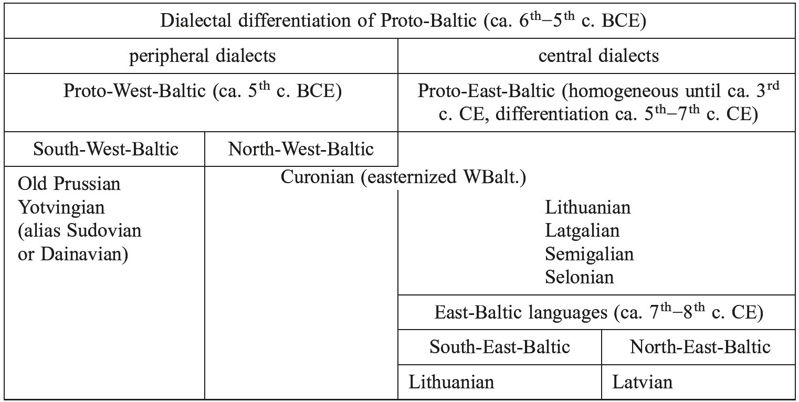
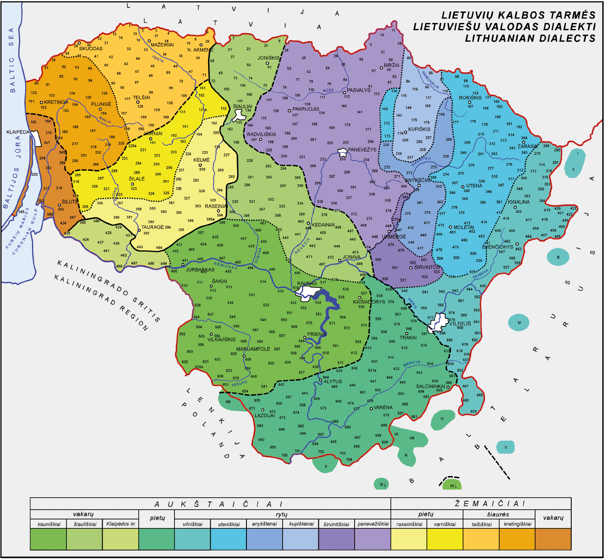
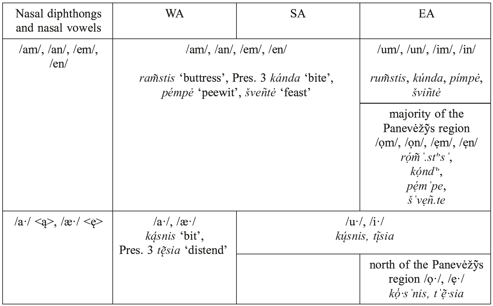
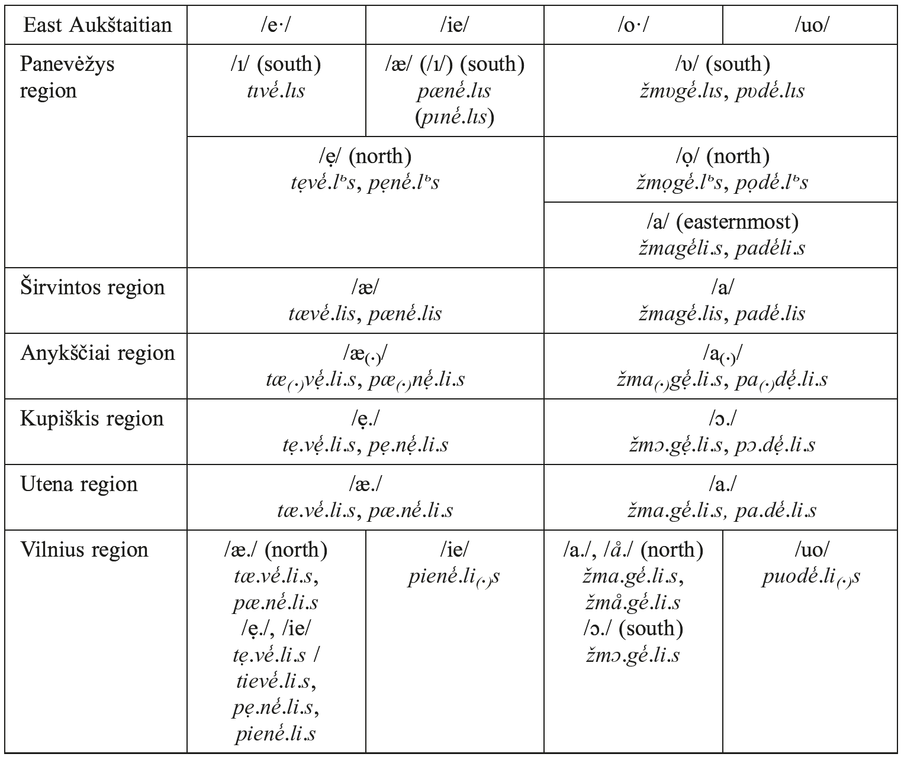
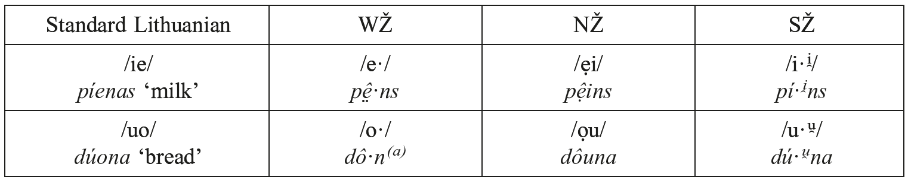
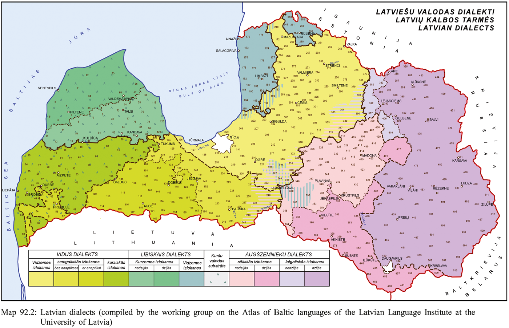

# 92. The dialectology of Baltic

1.Proto-Baltic and its disintegration

2.Lithuanian

3.Latvian

4.Abbreviations

5.References

## 1. Proto-Baltic and its disintegration

The PBalt. area stretched from the Vistula River in the West, to the Pripet, Sejm, and Desna Rivers in the South and South-East, to the upper Oka River in the East, to the upper Volga in the North-East, and to the Daugava River up to the border of present-day Latvia and Estonia in the North-West. PBalt. began splitting into dialects around the 6th−5th c. BCE. No later than in the 5th−4th c. BCE, two main dialectal groups of PBalt. emerged: Proto-West-Baltic (from the peripheral PBalt. dialects), and Proto-East-Baltic (from the central PBalt. dialects) (Mažiulis 1987: 82 ff.; Girdenis and Mažiulis 1994: 11). The area east of the PBalt. region was Slavified during the period from the 5th to the 14th c. CE, when Slavonic tribes separated it from the western PBalt. area, i.e. from the ethnic lands of the later Prussians, Lithuanians, and Latvians (Zinkevičius 1996: 24). Thus the so-called Dnieper Baltic became a substratum to various phonetic and syntactic properties of East Slavic (Dini 2014: 84 f.). The final PBalt. dialectal differentiation can be dated to around the 7th c. CE, when the East-Baltic languages emerged (see Table 92.1).

The essential difference between West- and East-Baltic is the reflex of the PBalt. diphthong *<i>ei</i> (also of *<i>ai</i>/*<i>oi</i>). It was retained in WBalt., e.g. OPr. <i>deiw(a)s, deywis</i> ‘God’ (< PBalt. *<i>deiv</i>-<i>a</i>- < PIE *<i>dei̯u̯</i>-<i>o</i>-, cf. OPr. <i>snaygis</i> ‘snow’ < PBalt. *<i>snaig</i>-<i>a</i>-< PIE *<i>snoi̯gᵘ̯ʰ</i>-<i>o</i>-). One of the earliest EBalt. innovations was its monophthongization into *<i>ē ̣</i>in a stressed position and its secondary diphthongization into <i>ie</i> in Lith. and Latv. at a later stage, e.g. Lith. <i>diẽvas</i>, Latv. <i>dìevs</i> ‘God’ (cf. Lith. <i>sniẽgas</i>, Latv. <i>snìegs</i> ‘snow’). In Lith., however, one finds <i>ei</i> in unstressed syllables (e.g. <i>deivė˜</i> ‘goddess, spirit’). Within paradigms, the alternation <i>ei</i>/<i>ie</i> was later levelled, cf. Lith. NPl. <i>dievaĩ</i> < *<i>deivaĩ</i>. Yet discrepancies are found both between Lith. and Latv., e.g. Lith. <i>eĩti</i>: Latv. <i>iêt</i> ‘to go’ and within Lith., e.g. <i>šveĩsti</i> ‘to polish’: <i>šviẽsti</i> ‘to shine’, <i>teisùs</i> ‘right’: <i>tiesùs</i> ‘upright’ (cf. Petit, “Phonology of Baltic”, this handbook, 3.5−3.6).

### 1.1. West-Baltic

No WBalt. language has survived to the present. Yotvingian, sometimes treated as a dialect of OPr. (Schmid 1976: 16R), became extinct at the end of the 16th c. North Curonian was finally absorbed by Latvian and South Curonian by the Žemaitian dialect of Lithuanian around the 17th c. OPr., which died out completely in the 18th c., is the only WBalt. language documented through written sources. The five known OPr. documents possibly attest some dialectal differences. The three Catechisms (I, II 1545, III 1561) are written in Sambian and the Elbing Vocabulary (E ca. 1400) testifies to the Pomesanian dialect (Gerullis 1922: 266−274). Considering the lack of linguistic data for OPr., its dialectal variation is exceedingly problematic.

Tab. 92.1: Dialectal differentiation of the Baltic languages

### 1.2. East-Baltic

The EBalt. tribes were probably split due to a Balto-Finnic substratum in the north and east of the EBalt. area, i.e. in the north Curonian territory up to the Abava River, at the Riga shore, and in the Latgalian territory north of the Daugava River. The disintegration of PEBalt. into dialectal groups of (later) Lithuanian, Latgalian, Semigalian, and Selonian is likely to have begun after the 3rd c. CE. The fusion of the Latgalians with the north Semigalians, Selonians, and easternized Curonians gave rise to Latvian. The southern EBalt. region, where Lithuanian emerged, was for a long time surrounded by other Baltic tribes and therefore remained almost free from non-Baltic influences. Around the 7th−8th c. two EBalt. languages − Lithuanian (south EBalt.) and Latvian (north EBalt.), which are spoken up to the present time, finally diverged. The foremost phonetic isoglosses which caused the division of EBalt. are as follows:

–PBalt. *<i>ś</i>, *<i>ź</i> are preserved in Lith. and became <i>s</i>, <i>z</i> in Latv. (as in OPr.), e.g. Lith. NSg. <i>šuõ</i>, GSg. <i>šuñs</i> ‘dog’, <i>žẽmė</i> ‘earth’, Latv. NSg. <i>suns</i>, <i>zeme</i> (cf. OPr. <i>sunis</i>, <i>semmē</i>).

–PBalt. *<i>k</i>, *<i>g</i> before front vowels developed to /ts/ <c>, /dz/ <dz> in Latv., e.g. Latv. <i>cits</i> ‘(an)other’, <i>dzẽrve</i> ‘crane’, cf. Lith. <i>kìtas</i>, <i>gérvė</i>.

–PBalt. *<i>tj</i>, *<i>dj</i> developed to /tʃ’/ <či>, /dʒ’/ <dži> in Lith. and became /ʃ/ <š>, /ʒ/ <ž> in Latv., e.g. Lith. NSg. <i>mẽdžias</i> (dial.), NPl. <i>mẽdžiai</i> ‘forest, tree’, GPl. f. <i>bìčių</i> ‘bee’, GPl. m. <i>bríedžių</i> ‘moose’, Latv. NSg. <i>mežs</i>, GPl. <i>bišu</i>, <i>briêžu</i> ‘elk’ (< PBalt. *<i>medja</i>-<i>s</i>, *<i>bit</i>-<i>jōn</i>, *<i>breid</i>-<i>jōn</i>).

–PBalt. *<i>sj</i> is preserved in Lith. and developed to /ʃ/ <š> in Latv. (as in OPr.), e.g. Lith. <i>siū´ti</i> ‘sew’, Latv. <i>šũt</i> ‘sew, tailor’ (< PBalt. *<i>sjū</i>-, cf. OPr. <i>schuwikis</i> ‘shoemaker’).

–PBalt. *<i>an</i>, *<i>en</i>, *<i>un</i>, *<i>in</i> are usually preserved in word-internal position in Lith. (except before sibilants) and were changed into the diphthongs or long vowels <i>uo</i> <o>, <i>ie</i>, <i>ū</i>, <i>ī</i> in all positions in Latv. (except the Cur. subdialects), e.g. Lith. NSg. <i>rankà</i>, ASg. <i>rañką</i> ‘hand, arm’, <i>penkì</i> ‘five’, Pres. 3 <i>siuñčia</i> ‘send’ (cf. Inf. <i>sių˜sti</i>), <i>giñti</i> ‘chase’, Latv. NSg. <i>rùoka</i>, <i>pìeci</i>, Inf. <i>sùtīt</i>, <i>dzìt</i>.

## 2. The Lithuanian language

The dialectal split of the Lith. language area into western (later Žemaitian) and eastern (later Aukštaitian) dialects began around the 9th−10th c. The oldest phonetic isoglosses which set the Lith. dialects apart are as follows:

–the long nasal vowels /a·/ <ą>, /æ·/ <ę> were narrowed to /u·/ <ų>, /i·/ <į> and the nasal diphthongs /am/, /an/, /em/, /en/ to /um/, /un/, /im/, /in/ in the east.

–palatalization and affrication of dental stops /t/, /d/: the EBalt. clusters *-<i>tja</i>-, *-<i>dja</i>-developed to <i>te</i>, <i>de</i> in the west and to /tʃ’a/ <čia>, /dʒ’a/ <džia> in the east.

–/l/ was not palatalized before the mid and low front vowels /æ/, /ei/, /æ·/, /e·/, and /en/ in the east.

The modern structural classification of Lith., which assumes two main dialects, Aukštaitian and Žemaitian, as well as various subdialects, based on the previous atomistic descriptive grouping of Antanas Baranauskas and Kazimieras Jaunius, was proposed by Aleksas Girdenis and Zigmas Zinkevičius (1966). The major criterion in setting Žem. apart from Aukš. is the pronunciation of the diphthongs /ie/ and /uo/ in stressed position. They are preserved in Aukš. but are treated differently in Žem. (see Table 92.4). The classification of the Lith. dialects according to their geographical distribution and of subdialects according to town names is as follows (see Map 92.1):

1. The Aukštaitian dialect (<i>aukštaĩčiai</i>, High Lithuanian):

–West Aukštaitian (WA) subdialects (<i>vakarų˜ aukštaĩčiai</i>):

−Kaũnas region and Klaĩpėda region (<i>kaunìškiai</i>, southern subgroup),

−Šiauliaĩ region (<i>šiaulìškiai</i>, northern subgroup);

–South Aukštaitian (SA) subdialect (<i>pietų˜ aukštaĩčiai</i>), alias Dzūkian (<i>dzū˜kai</i>);

–East Aukštaitian (EA) subdialects (<i>rytų˜ aukštaĩčiai</i>):

−Panevėžỹs region (<i>panevėžìškiai</i>),

−Šìrvintos region (<i>širvintìškiai</i>),

−Anykščiaĩ region (<i>anykštė́nai</i>),

−Kùpiškis region (<i>kupiškė́nai</i>),

−Utenà region (<i>utenìškiai</i>),

−Vìlnius region (<i>vilnìškiai</i>);

2. the Žemaitian dialect (<i>žemaĩčiai</i>, Low Lithuanian):

–South Žemaitian (SŽ) subdialects (<i>pietų˜ žemaĩčiai</i>):

−Raséiniai region (<i>raseinìškiai</i>),

−Var˜niai region (<i>varnìškiai</i>);

–North Žemaitian (NŽ) subdialects (<i>šiáurės žemaĩčiai</i>):

−Telšiaĩ region (<i>telšìškiai</i>),

−Kretingà region (<i>kretingìškiai</i>);

–West Žemaitian (WŽ) subdialect (<i>vakarų˜ žemaĩčiai</i>).

### 2.1. The Aukštaitian dialect

The main criterion for the subdivision into WA, SA, and EA is the pronunciation of /am/, /an/, /em/, /en/, and of /a·/, /æ·/ (see Table 92.2).

Common features of Aukštaitian:

–/l/ remains non-palatalized before the mid and low front vowels /æ/, /ei/, /æ·/, and /e·/ <ė>, except for the major part of the Kaunas region and the west of the Šiauliai region, e.g. NSg. <i>la̾.das</i> ‘ice’ (SL <i>lẽdas</i>).

–initial /æ/ and circumflexed /eĩ/ are changed into /a/, /aĩ/ in SA, EA (/æ/ > /a/ only in the east), and partly in WA, e.g. EA, WA Inf. <i>aĩt</i> ‘go’ (SL <i>eĩti</i>), SA <i>ažỹs</i> ‘hedgehog’ (SL <i>ežỹs</i>).

–the prothesis of initial <v> before back vowels and /uo/, and of /j/ before front vowels is distinctive for WA and SA, e.g. NSg. <i>vùpė</i> ‘river’ (SL <i>ùpė</i>), Pret. 3 <i>jė˜mė</i> ‘take’ (SL <i>mė</i>).

–the conditional stress retraction from a short final syllable to: a) a long vowel or the diphthongs /ie/, /uo/ in the penultima (in the south of the Šiauliai region and in the Širvintos region), e.g. NSg. <i>žmo̾ ·na</i> (SL <i>žmonà</i>), but APl. <i>laukùs</i> ‘field’ (= SL); b) any long penultima (in the middle south of the Šiauliai region and EA), e.g. APl. <i>lau̾kus</i>, but PresSg. 1 <i>nešù</i> ‘carry’ (= SL); c) any long or short penultima (in the middle north of the Šiauliai region and the north-east of the Panevėžys region), e.g. APl. <i>va̾ıkus</i> (WA) / <i>va̾ıkъs</i> (EA) ‘child’ (SL <i>vaikùs</i>), PresSg. 1 <i>nèšu</i> (WA) / <i>nèšъ</i> (EA).

–the Aukš. universal stress retraction law which implies stress retraction from a short or circumflexed final syllable to any penultima (in the north of the Šiauliai region and the north-west of the Panevėžys region), e.g. NSg. <i>šàka</i> (WA) / <i>šàkъ</i> (EA) ‘branch’ (SL <i>šakà</i>), <i>gèrαi</i> ‘well’ (SL <i>geraĩ</i>).

Tab. 92.2: Aukštaitian dialectal outcomes of nasal vowels and diphthongs

2.1.1. West Aukštaitian is closest to SL, which is based on the Kaunas region (alias <i>suvalkiẽčiai</i>) subdialect. Such innovations of the Šiauliai region subdialect as stress retraction, vowel reduction, and apocope of unstressed final vowels originated due to Curonian and Semigalian substratum influence.

2.1.2. South Aukštaitian (Dzūkian). Word-final narrowed nasal vowels of <i>(j)ā</i>-, <i>ē</i>- and <i>o</i>-stems (< PBalt. *-<i>ā´n</i>, *-<i>ḗn</i>) were shortened to /u/, /i/, e.g. ISg. <i>rankù</i> ‘hand, arm’ (SL <i>rankà</i>), ISg. <i>katì</i> ‘cat’ (SL <i>katè</i>), LSg. <i>laukì</i> ‘field’ (SL <i>laukè</i>). Peculiar to SA is the high frequency of the affricates /ts/ <c>, /dz/ <dz> (the so-called <i>dzūkãvimas</i>) which occur under two conditions with one exception:

–/ts(’)/, /dz(’)/ are used instead of /tʃ’/ <či>, /dʒ’/ <dži> (< PBalt. *<i>tj</i>, *<i>dj</i>), e.g. NPl. <i>jáuciai</i> ‘ox’ (SL <i>jáučiai</i>), NPl. <i>m̾edziai</i> ‘tree’ (SL <i>mẽdžiai</i>), GPl. <i>m̾edzių</i> (SL <i>mẽdžių</i>). Perhaps due to paradigmatic analogy, there is no affrication in the GPl. and in the PretSg. 1 of the <i>ē</i>-stems, e.g. NSg. <i>bìtė</i> ‘bee’, GPl. <i>bìt’ų</i> (SL <i>bìčių</i>), Pret. 3 <i>mãtė</i>, PretSg. 1 <i>mat’aũ</i> ‘see’ (SL <i>mačiaũ</i>).

–/t/, /d/ as well as /tv/, /dv/ are changed into the affricates /ts(v)/ <c(v)>, /dz(v)/ <dz(v)> before the high front vowels /i/, /i·/ <į, y>, and /ie/, e.g. Inf. <i>aĩc(’)</i> ‘go’ (SL <i>eĩti</i>), NSg. <i>kecvir˜tas</i> ‘fourth’ (SL <i>ketvir˜tas</i>), NSg. <i>dziẽvas</i> ‘God’ (SL <i>diẽvas</i>). No affrication occurs before /i/ or /i·/ < *<i>ę</i> < *<i>en</i> (see Table 92.2), e.g. ASg. <i>ka̾ t’i</i>. ‘cat’ (SL <i>kãtę</i>), LSg. <i>púod’i</i> ‘pot’ (SL <i>púode</i>).

–/ts(’)/, /dz(’)/ become assimilated into /tʃ(’)/, /dʒ(’)/ due to adjacent <i>š, ž</i>, e.g. NSg. <i>pir˜ščinė</i> ‘glove’ (SL <i>pir˜štinė</i>), Inf. <i>vèšč’</i> ‘convey’ (SL <i>vèžti</i>).

Tab. 92.3: Outcomes of unstressed <i>ė</i>, <i>ie</i>, <i>o</i>, <i>uo</i> in East Aukštaitian

2.1.3. East Aukštaitian differs most of all Aukš. dialects from SL (see Table 92.2). Three grades of vowel length − short, half-long (= V.) and long (= V·) − are distinctive for the Anykščiai, Kupiškis, and Utena regions. The reflexes of unstressed <i>ė</i>, <i>ie</i>, <i>o</i>, <i>uo</i> in EA can be shown by the examples of NSg. <i>tėvẽlis</i> ‘little father’, <i>pienẽlis</i> ‘little milk’, <i>žmogẽlis</i> ‘little human being’, and <i>puodẽlis</i> ‘little pot’ (see Table 92.3).

Panevėžys region: the largest and most complicated subdialect of EA (also see Table 92.2). The reduction of short final syllables becomes more thorough from South to North. Due to a Semigalian substratum, short final vowels developed into murmured /<i>ъ</i>/ and /<i>ь</i>/ in the north, e.g. ASg. <i>píevυs</i> / <i>píevъs</i> ‘meadow’ (SL <i>píevas</i>), APl. <i>katìs</i> / <i>kàtьs</i> ‘cat’ (SL <i>katès</i>). The Kupiškis region subdialect perhaps originated due to a Selonian substratum. The vowels /æ/ and /e·/ are changed into /a/ (lengthened in stressed position) word-finally and before non-palatalized consonants, e.g. PresSg. 1 <i>našù</i> ‘carry’ (SL <i>nešù</i>). The Utena and Vilnius region subdialects display no stress retraction; they have maintained long open /a·/ (< PBalt. *<i>ā</i>), e.g. NSg. <i>žã</i>·<i>di.s</i> / <i>ž[image-glyph: open o / reversed c with tilde]</i>·<i>di.s</i> (Utena), <i>žã</i>·<i>d(z)i.s</i> / <i>ž[image-glyph: open o / reversed c with tilde]</i>·<i>d(z)i.s</i> (Vilnius) ‘word’ (SL <i>žõdis</i>).

Tab. 92.4: Žemaitian reflexes of /ie/ and /uo/

2.2. The Žemaitian dialect perhaps originated due to a Curonian substratum. According to the reflexes of the diphthongs /ie/ and /uo/, Žem. is divided into three subdialects (see Table 92.4). The WŽ subdialect of the Klaipėda region is almost extinct.

Common features of Žemaitian:

–stressed /o·/, /e·/ are changed into /uo/, /ie/, e.g. NSg. <i>kûojẹ</i> ‘leg, foot’ (SL <i>kója</i>), Inf. <i>dîet⁽ẹ⁾</i> ‘put’ (SL <i>dė́ti</i>).

–originally short unstressed vowels in final syllables are apocopated, e.g. NSg. <i>vî·rs</i> ‘man’ (SL <i>výras</i>). Final long unstressed vowels are shortened.

–short /i/, /u/ (also /il/, /ir/, /ul/, /ur/) and /ui/ are broadened into /ẹ/, /ọ/, e.g. Inf. <i>l̾ẹ</i>.<i>ktẹ</i> ‘remain’ (SL <i>lìkti</i>), Pret. 3 <i>bọ̾</i>.<i>vᵃ</i> ‘be’ (SL <i>bùvo</i>).

–the final diphthongs /ai/, /ei/ are monophthongized to /a·/, /e·/, e.g. <i>blòg̣ã·</i>‘badly’ (SL <i>blogaĩ</i>), NPl. <i>pã</i>.<i>ukštê·</i> ‘bird’ (SL <i>paũkščiai</i>).

–no affrication of /t/, /d/ before front vowels (<i>te, de</i> < PBalt. *<i>tjă</i>, *<i>djă</i>) in the east, e.g. NPl. <i>já</i>.<i>utê</i>·‘ox’ (SL <i>jáučiai</i>) (< *<i>jaut</i>-<i>j</i>-<i>ai</i>), NPl. <i>mèdê</i>·‘tree’ (SL <i>mẽdžiai</i>) (< *<i>med</i>-<i>jai</i>), but GSg. <i>já</i>.<i>učẹ</i>, <i>m̾e</i>.<i>džẹ</i> (SL <i>jáučio, mẽdžio</i>). In NŽ and WŽ, no affrication occurs before back vowels either.

–conditional stress retraction from a short final syllable to: (a) a long penultima (SŽ), e.g. NSg. <i>plĩ·tà</i> ‘brick’ (SL <i>plytà</i>), but NSg. <i>šakà</i> ‘branch’ (= SL); (b) any penultima (NŽ and SŽ partly), e.g. <i>šàkà</i>, but GSg. <i>šakuõs</i> (SL <i>šakõs</i>).

–the Žem. universal stress retraction law: Stress retraction from a short or circumflexed final syllable to the first syllable, e.g. GSg. <i>šàkũos</i> (SL <i>šakõs</i>), NSg. <i>pàvàžà</i> ‘runner of a sledge’ (SL <i>pavažà</i>).

–the character of the acute and circumflex tones differs from Aukš. The acute tone (falling in Aukš.) is broken (^) in Žem. The circumflex tone (even or rising in Aukš.) makes the first part of a vowel or diphthong more prominent in Žem.

The Raseiniai region (SŽ) subdialect is transitional between Aukš. and Žem. Old nasal sequences /an/, /en/ (SL <i>ą</i>, <i>ę</i>) and nasal diphthongs /am/, /em/ are maintained, e.g. NSg. <i>žansìs</i> ‘goose’ (SL <i>žąsìs</i>). The diphthongs /ai/, /ei/ are maintained, except for the suffix -<i>áit</i>-, e. g. NSg. <i>mergá</i>·<i>ti̱</i> ‘girl’ (SL <i>mergáitė</i>). Varniai region (SŽ): /am/, /an/, /em/, /en/ are narrowed to /ọm/, /ọn/, /ẹm/, /ẹn/, e.g. Pres. 3 <i>kộ</i>.<i>nd</i> ‘bite’ (SL <i>kánda</i>). Long vowels are changed into half-long in pretonic syllables in the Kretinga region (NŽ): e.g. Pres. 3 <i>gi</i>.<i>vê</i>.<i>n</i> ‘live’ (SL <i>gyvẽna</i>); and into short in pretonic syllables in the Telšiai region, e. g. Pres. 3 <i>givê</i>.<i>n</i>.

## 3. The Latvian language

In the second half of the 16th c., Latv. spread to its present-day territory. Possibly due to contact with Balto-Finnic languages (particularly Livonian), the mobile accent was lost and stress was retracted to the initial syllable in Latv. As a result, final syllables were reduced. Latv. today has a system of three tones: the drawn tone (~ <i>stieptā intonāci-ja</i>), the falling tone (` <i>krītošā intonācija</i>), and the broken tone (^ <i>lauztā intonācija</i>). The classification of the Latv. dialects into 3 groups, based primarily on prosodic characteristics, vowel quantity and quality, as well as morphological innovations, was undertaken by August Bielenstein in the middle of the 19th c. and is still used with small modifications (see Map 92.2).

1. The Central dialect (C, <i>vidus dialekts</i>):

–the Central Livonian subdialects (CLiv., <i>Vidzemes vidus izloksnes</i>),

–the Semigalian subdialects (Sem., <i>zemgaliskās izloksnes</i>),

–the Curonian subdialects (Cur., <i>kursiskās izloksnes</i>):

−deep Curonian,

−non-deep Curonian;

–the Semigalian-Curonian subdialects (SemCur., <i>zemgaliski kursiskās izloksnes</i>, alias <i>kuršu valodas substrāts</i>);

2. the Tamian or Livonian dialect (T, <i>tāmnieku</i> / <i>lībiskais dialekts</i>):

–the Tamian subdialects of Courland (TCur., <i>Kurzemes lībiskās izloksnes</i>):

−deep Tamian of Courland (<i>dziļās Kurzemes izloksnes</i>),

−non-deep Tamian of Courland (<i>nedziļās Kurzemes izloksnes</i>);

–the Tamian subdialects of Livonia (TLiv., <i>Vidzemes lībiskās izloksnes</i>):

−deep Tamian of Livonia (<i>dziļās Vidzemes izloksnes</i>),

−non-deep Tamian of Livonia (<i>nedziļās Vidzemes izloksnes</i>);

3. the High Latvian dialect (HL, <i>augšzemnieku dialekts</i>):

–the Selonian subdialects of East Semigalia and South-East Livonia (Sel., <i>sēliskās izloksnes</i>):

−deep or East Selonian (<i>dziļās sēliskās izloksnes</i>),

−non-deep or West Selonian (<i>nedziļās sēliskās izloksnes</i>);

–the Latgalian subdialects of Latgalia and North-East Livonia (Latg., <i>latgaliskās izloksnes</i>):

−deep Latgalian or strong High Latvian (<i>dziļās latgaliskās izloksnes</i>),

−non-deep Latgalian (<i>nedziļās latgaliskās izloksnes</i>).

The C and T dialects are close to each other. Hence they are occasionally called Low Latvian (<i>lejzemnieku izloksnes</i>) as opposed to the HL dialect. An important factor in the development of the Latv. dialects was the territorial division of Latvia throughout its history. The incorporation of the Duchy of Livonia into the Polish-Lithuanian Commonwealth in 1629−1772 caused the separation of Latgalian from other Latv. dialects and contributed to the development of HL. Corresponding to the former limits of parishes or estates, the three Latv. dialects are subdivided into more than 500 local dialects.

3.1. The Central dialect has maintained the original phonetic system of Latv. SLa. is based on this dialect. Closest to SLa. are the Sem. subdialects around Jelgava (Mitau) and Dobele. Some parts of the CLiv. (around Valmiera and Cēsis) and of the Sem. (around Blīdene and Jaunpils) subdialects have retained all three original tones, e. g. ASg. <i>vĩli</i> ‘file’, ASg. <i>vìli</i> ‘seam’, PretSg. 2 <i>vîli</i> ‘deceive’; and /ir/ and /ur/ before consonants, e.g. Inf. <i>cìrst</i> ‘fell’, <i>kùrls</i> ‘deaf’. The main morphological innovations of CLiv. and Sem. are the following:

–preterite <i>ē</i>-stems are replaced by <i>ā</i>-stems, e.g. PretPl. 1 <i>nesām</i> ‘carry’ (= SLa., cf. Lith. <i>nẽšėme</i>).

–/i·/ is inserted in the future tense of monosyllabic infinitive stems in /s/, /z/, /t/, /d/, e.g. Inf. <i>mest</i> ‘throw’, FutSg. 1 <i>metîšu</i> (= SLa.). This is also a distinctive feature of CLiv.

–the reflexive verbal marker -<i>s(i)</i>- in prefixed verbs occurs according to the type PVR, e.g. Inf. <i>piecelties</i> ‘get up’ (= SLa.).

The Semigalian subdialects are distinguished by anaptyxis between the liquid diphthongs /V+r/ (sometimes also /V+l/) and a following consonant, the vowel remaining short, e.g. NSg. <i>starᵃks</i> ‘stork’ (SLa. <i>stārks</i>). In the Curonian subdialects, the falling tone (`) and the broken tone (^) have merged into a broken tone (^²), e.g. PresSg. 1 <i>lūˆdzu</i>² ‘beg’ (cf. CLiv. <i>lū̀dzu</i>). The main characteristics of Cur. are:

–/V+n/ were maintained, perhaps due to a Curonian substratum, e.g. NSg. <i>bezdelinga</i> ‘swallow’ (SLa. <i>bezdelīga</i>). /V+r/ are lengthened, whereas /ir/, /ur/ can be diphthongized into /ie/, /uo/.

–/u/ was maintained before /v/ and /b/, e.g. NSg. <i>dubȩns</i> ‘bottom’ (SLa. <i>dibens</i>, cf. Lith. <i>dùgnas</i>), NSg. <i>zuve</i> ‘fish’ (SLa. <i>zivs</i>, cf. Lith. <i>žuvìs</i>).

–/v/ was lost after /l/, e.g. NSg. <i>pagālis</i> ‘pillow’ (SLa. <i>pagalvis</i>).

–no insertion of /i·/ in the future tense of monosyllabic infinitive stems in /s/, /z/, /t/, /d/, e.g. Inf. <i>vest</i> ‘lead’, Fut. 3 <i>ves</i> (SLa. <i>vedīs</i>).

–the reflexive verbal marker -<i>s(i)</i>- <i>(</i>-<i>s[a]</i>-<i>)</i> in prefixed verbs occurs according to the type PRV, e.g. PresSg. 2 <i>nuosaraudi</i> ‘weep’ (SLa. <i>nuoraudies</i>). Also the type PRVR can occur, e.g. Pres. 3 <i>atsamuôstas</i> ‘wake up’ (SLa. <i>atmuostas</i>).

–substantival <i>i</i>-stems merged with <i>ē</i>-stems, e.g. NSg. <i>ugune</i> ‘fire’ (SLa. <i>uguns</i>).

3.2. The Tamian or Livonian dialect developed due to a Livonian substratum. The vocabulary includes a great number of Livonian loanwords. The falling tone (`) and the broken tone (^) have merged into a broken tone (^²), e.g. NSg. <i>kuôks</i>² ‘tree’ (C <i>kùoks</i>). T presents mainly quantitative vowel changes. Short final vowels are regularly apocopated, which is often explained as a substratum feature. Thus homonymy is wide-spread in verbal inflection, and the 3rd person forms are generalized for the 1st and the 2nd person. Substantival <i>i</i>-stems partially merged with <i>ē</i>-stems as well as <i>ē</i>-stems with <i>ā</i>-stems. <i>U</i>-stems merged with <i>(j)o</i>-stems and were thus mostly lost. Other characteristics of T are the following:

–unstressed non-initial long vowels and diphthongs are shortened, and in TCur. completely lost, e.g. Inf. <i>sacit</i> (TLiv.) / <i>sać·t</i> (TCur.) ‘say’ (SLa. <i>sacīt</i>); /ie/ and /uo/ are monophthongized to /e/ and /a/ (or /o/), e.g. Inf. <i>sāktes</i> ‘start oneself’ (SLa. <i>sākties</i>).

–short vowels are often lengthened before voiced stops of apocopated syllables, e.g. NPl. <i>gād’</i> ‘year’ (SLa. <i>gadi</i>), <i>lāb’</i> ‘well’ (SLa. <i>labi</i>).

–/ir/, /ur/ are lengthened or diphthongized into /ie/, /uo/ in TCur., e.g. NSg. <i>zîrks</i>² ‘horse’ (SLa. <i>zirˆgs</i>).

–/au/ is changed into /åu/ or /ou/ and /av/ into /åv/ or /ov/, e.g. Inf. <i>roût</i>² ‘tear up’ (SLa. <i>raut</i>), NSg. <i>sovādaks</i> ‘different’ (SLa. <i>savādāks</i>).

–/u/ is preserved before /v/, /b/ in TCur., e.g. NSg. <i>dubans</i> ‘bottom’ (SLa. <i>dibens</i>).

–the reflexive verbal marker -<i>s(i)</i>- <i>(</i>-<i>s[a]</i>-<i></i>, -<i>z[a]</i>-<i>)</i> in prefixed verbs occurs according to the two types PVR and PRVR in TCur., e.g. Inf. <i>sazrū̀ntȩs</i>/<i>sarū̀ntȩs</i> ‘converse’ (SLa. <i>sarunāties</i>). Only the type PVR is known in TLiv., e.g. Inf. <i>uscelˆtes</i>² ‘get up’ (SLa. <i>uzcelties</i>).

–no insertion of /i·/ in the future tense of monosyllabic infinitive stems in /s/, /z/, /t/, /d/, e.g. Inf. <i>sist</i> ‘beat’, FutSg./Pl. 1 (= 2,3) <i>siz</i> (SLa. <i>sitīšu</i>, <i>sitīsi</i>, <i>sitīs</i>, <i>sitīsim</i>, <i>sitīsit [sitīsiet]</i>).

–the feminine gender has extensively merged with the masculine (also in pronouns and adjectives), probably also due to a Livonian substratum, e.g. NSg. m. <i>mas siẽviš</i> (< <i>mazs sieviņš</i>) ‘little wife’ (SLa. f. <i>maza sieviņa</i>).

–the old substantival DPl. endings -<i>Vms</i> are preserved in TCur., e.g. <i>siẽvams</i> ‘wife’ (SLa. <i>sievām</i>).

3.3. The High Latvian dialect. Written HL (the so-called Latgalian language) is based on the dialects of south Latgalia. HL reveals mainly qualitative sound changes, but it has preserved a more archaic morphological and syntactic system. The drawn tone (~) and the falling tone (`) have merged into a falling tone (`²), e.g. <i>vìejš</i>² ‘wind’ (cf. SLa. <i>vẽjš</i>). The Sel. subdialects have maintained the rising tone (ˊ) which elsewhere has merged with the broken tone (^), e.g. NSg. <i>naúda</i> ‘money’ (SLa. <i>naûda</i>), NSg. <i>luógs</i> ‘window’ (SLa. <i>luôgs</i>). The main characteristics of HL are the following:

–/æ/ and /e·/ are changed into /a/ and /a·/, e.g. NSg. <i>vātra</i> ‘storm’ (SLa. <i>vētra</i>).

–/e·/ has developed into /æ·/ <ȩ̄> or was diphthongized into /ie/, e.g. Pres. 3 <i>vȩ̄rp</i> ‘spin’ (SLa. <i>vērpj</i>).

–/a/ is changed into /o/ when the following syllable contains a low vowel (the so-called velar vowel shift), and sometimes also in stressed position (/a/ remains unchanged in final syllables), e.g. NSg. <i>vosara</i>/<i>vosora</i> ‘summer’ (SLa. <i>vasara</i>), but NSg. <i>galˆvinieks</i> ‘warranter’.

–/i·/ and /u·/ are diphthongized into /ei/ and /ou/ (resp. /eu/, /yu/, /iu/ in deep HL), e.g. <i>Rèiga</i>² (SLa. <i>Rīga</i>), NSg. <i>còuka</i>²/<i>cèuka</i>/<i>cyuka</i> ‘pig’ (SLa. <i>cūka</i>).

–all consonants are palatalized before front vowels, e.g. NSg. <i>ćèiruļś</i>² ‘lark’ (SLa. <i>cīrulis</i>).

–preterite <i>ē</i>-stems are partly maintained, e.g. PretPl. 1 <i>aûd’è¸m</i>² ‘weave’ (SLa. <i>audām</i>).

–the reflexive verbal particle -<i>s(i)</i>- <i>(</i>-<i>s[a]</i>-, -<i>z[a]</i>-<i>)</i> in prefixed verbs occurs according to the type PRV, e.g. Inf. <i>abzarauduôt’</i> ‘fall into tears’ (SLa. <i>apraudāties</i>). Also the type PRVR and PVR are known, e.g. Inf. <i>pazaśḿìtîś</i>² ‘deride’ (SLa. <i>pasmieties</i>), <i>nùopirktiês</i>² ‘purchase’ (SLa. <i>nuopirkties</i>).

–no insertion of /i·/ in the future tense of monosyllabic infinitive stems in /s/, /z/, /t/, /d/, e.g. Inf. <i>iêst</i> ‘eat’, FutSg. 1 <i>iêššu</i> (SLa. <i>ēst, ēdīšu</i>), Inf. <i>nest</i> ‘bring’, FutSg. 1 <i>neššu</i> (SLa. <i>nesīšu</i>).

–the old LSg. forms in -<i>ie</i> (for <i>i</i>-stems) and -<i>uo</i> (for <i>u</i>-stems) are maintained, e.g. LSg. <i>àusié</i>² ‘ear’ (SLa. <i>ausī</i>), <i>maduó</i> ‘honey’ (SLa. <i>medū</i>).

The main characteristics of the deep (or eastern) HL subdialects are the following:

–/ie/ and /uo/ are monophthongized to /i·/ and /u·/, e.g. <i>pìci</i> ‘five’ (SLa. <i>pieci</i>), NSg. <i>lûgs</i>² ‘window’ (SLa. <i>luôgs</i>).

–/i/ is velarized to /ы/ <y>, e.g. NSg. <i>myza</i> ‘bark’ (SLa. <i>miza</i>).

–the endings -<i>as</i> and -<i>es</i> can appear changed into -<i>ys</i> /ыs/ and -<i>is</i>, e.g. GSg./N/APl. <i>mùosys</i>² ‘sister’ (SLa. <i>māsas</i>), <i>mùot’iś</i>² ‘mother’ (SLa. <i>mātes</i>).

–the personal pronoun forms of the 3rd person are different from other Latv. dialects: NSg. m. <i>jis</i>/<i>jys</i> ‘he’, NPl. <i>jì</i>² (SLa. <i>viņš</i>, <i>viņi</i>); NSg. f. <i>jèi</i>² ‘she’, NPl. <i>jùos</i>² (<i>joâs</i>, <i>jòs</i>²) (SLa. <i>viņa</i>, <i>viņas</i>). Cf. Lith. <i>jìs</i>, <i>jiẽ</i>; <i>jì</i>, <i>jõs</i>.

## 4. Abbreviations

Language and dialect names:

<table>
<tr><td>PBalt.</td><td>Proto-Baltic</td></tr>
<tr><td>PEBalt.</td><td>Proto-East-Baltic</td></tr>
<tr><td>WBalt.</td><td>West-Baltic</td></tr>
<tr><td>EBalt.</td><td>East-Baltic</td></tr>
<tr><td>SL</td><td>Standard Lithuanian</td></tr>
<tr><td>OPr.</td><td>Old Prussian</td></tr>
<tr><td>Lith.</td><td>Lithuanian</td></tr>
<tr><td>Latv.</td><td>Latvian</td></tr>
<tr><td>Aukš.</td><td>Aukštaitian</td></tr>
<tr><td>WA</td><td>West Aukštaitian</td></tr>
<tr><td>SA</td><td>South Aukštaitian</td></tr>
<tr><td>EA</td><td>East Aukštaitian</td></tr>
<tr><td>Žem.</td><td>Žemaitian</td></tr>
<tr><td>SŽ</td><td>South Žemaitian</td></tr>
<tr><td>NŽ</td><td>North Žemaitian</td></tr>
<tr><td>WŽ</td><td>West Žemaitian</td></tr>
<tr><td>SLa.</td><td>Standard Latvian</td></tr>
<tr><td>C</td><td>Central</td></tr>
<tr><td>CLiv.</td><td>Central Livonian</td></tr>
<tr><td>Sem.</td><td>Semigalian</td></tr>
<tr><td>Cur.</td><td>Curonian</td></tr>
<tr><td>SemCur.</td><td>Semigalian-Curonian</td></tr>
<tr><td>T</td><td>Tamian (Livonian)</td></tr>
<tr><td>TCur.</td><td>Tamian of Courland</td></tr>
<tr><td>TLiv.</td><td>Tamian of Livonia</td></tr>
<tr><td>HL</td><td>High Latvian</td></tr>
<tr><td>Sel.</td><td>Selonian</td></tr>
<tr><td>Latg.</td><td>Latgalian</td></tr>
</table>

Grammatical terminology:

<table>
<tr><td>P</td><td>Preverb</td></tr>
<tr><td>R</td><td>Reflexive</td></tr>
<tr><td>V</td><td>Verb</td></tr>
</table>
