# 95. The phonology of Albanian

1.Preliminaries

2.Vowels

3.Resonants

4.Obstruents

5.Accent

6.References

## 1. Preliminaries

The reconstruction of prehistoric stages of Albanian should ideally be based on the phonological system of Old Tosk, Old Geg, and a number of Modern Albanian (MoAlb.) dialects. This aim is difficult to realize for two reasons: the graphic systems of the Old Albanian (OAlb.) texts still present us with some unsolved problems; and the OAlb. texts do not contain all the relevant vocabulary. Like most scholars, I use Modern Standard Albanian as the base for the reconstruction, adding information from OAlb. wherever relevant. Modern Albanian shared the developments of the Tosk dialects unless stated otherwise.

Internal comparison between the Tosk and Geg dialects allows us to reconstruct a Proto-Albanian stage (PAlb.; in German <i>Uralbanisch</i>; see Hock 2005; Klingenschmitt 1994: 221; Matzinger 2006: 23; B. Demiraj 1997: 41−67; Hamp 1992: 885−902). Additional external information on the development of the phonology is provided by different layers of loanwords, of which those from Slavic (from ca. 600 CE onward) and from Latin (ca. 167 BCE−400 CE) are the most important. Since the main phonological distinction between Tosk and Geg, viz. rhotacism of <i>n</i>, is found in only a few Slavic loanwords in Tosk (Ylli 1997: 317; Svane 1992: 292 f.), I assume that Proto-Albanian predated the influx of most of the Slavic loanwords. Following the authors cited above, I will call the hypothetical stage of Albanian before the start of the Latin influence “Pre-Proto-Albanian” (PPAlb.) (German <i>Voruralbanisch</i> or <i>Frühuralbanisch</i>).

Two other, less conclusive reference points are the borrowing of Ancient Greek loanwords (only a few of which are ascertained) which preceded the Latin period, and the comparison with Rumanian, the surviving Balkan Romance language which has adopted a number of loanwords from PPAlb. or a closely related Indo-European language. It would therefore in theory be possible to distinguish a Late PPAlb. stage (after the first Greek words entered, but before contact with Latin) and an Early PAlb. stage (after the Roman era but some time before the split into Tosk and Geg). In this chapter, however, I confine myself to the stages PIE, PPAlb., PAlb., and MoAlb.

A number of surveys of the historical phonology of Albanian have appeared. In recent years, we find Huld (1984), Beekes (1995: 260−268), S. Demiraj (1996), B. Demiraj (1997: 41−67), Orel (2000: 1−151), Hock (2005), Matzinger (2006), Vermeer (2008), and Schumacher (2013). Most of these start on the PIE side of the reconstruction and deduce the different Albanian descendants of every PIE phoneme. In accordance with the format of this handbook, I reverse the direction here. The origin of the Albanian phonemes is presented in three steps: from MoAlb. back to PAlb., from PAlb. back to PPAlb., and from PPAlb. back to PIE.

For each linguistic stage, the phonological system must be established. This question has been addressed explicitly by Ölberg (1972, for the vowels) and subsequently by Hock (2005), Matzinger (2006: 85−92) and Vermeer (2008, vowels). I trace back the main sources for each reconstructed phoneme for each of the three stages. In addition, it would be desirable to establish a complete relative chronology for the changes that occurred between PIE and Albanian; yet the present article does not leave room for such an endeavour. See Hock (2005) for a first attempt.

In treating phonological change, I use the following symbols to indicate the development of sounds and words: Y < X means ‘Y has arisen from X by sound law’, X > Y means ‘X has become Y by sound law’, Y ← X and X → Y both mean ‘Y has been borrowed from X’ or ‘Y is found in borrowings from X’.

## 2. Vowels

### 2.1. From MoAlb. to PAlb.

The following are the stressed and unstressed vowels of MoAlb. (Buchholz and Fiedler 1987: 28; Gjinari and Shkurtaj 2003: 178−185):

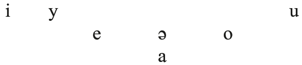

Origins:

<table>
<tr><td>i</td><td><</td><td>PAlb. *<i>i</i></td></tr>
<tr><td></td><td><</td><td>PAlb. *<i>ĩ</i></td></tr>
<tr><td></td><td><</td><td>PAlb. *<i>y</i> in many (mainly Tosk) dialects</td></tr>
<tr><td>y</td><td><</td><td>PAlb. *<i>y</i></td></tr>
<tr><td>e</td><td><</td><td>PAlb. *<i>e</i></td></tr>
<tr><td></td><td><</td><td>PAlb. *<i>ẽ</i> (Standard MoAlb. does not follow the Tosk dialects, which have /ə/ here: MoAlb. <i>brenda</i>, dial. <i>brënda</i> ‘inside’, MoAlb. <i>pe</i>, dial. <i>pë</i> ‘thread’, MoAlb. <i>emër</i>, dial. <i>ëmër</i> ‘name’)</td></tr>
<tr><td>a</td><td><</td><td>PAlb. *<i>a</i></td></tr>
<tr><td></td><td><</td><td>PAlb. *<i>o</i>/<i>u</i>_ (<i>-ua-</i>)</td></tr>
<tr><td>ə</td><td><</td><td>PAlb. *<i>ã</i> (<i>dhëmb</i> ‘tooth’, <i>këmbë</i> ‘foot’, <i>këngë</i> ‘song’)</td></tr>
<tr><td>u</td><td><</td><td>PAlb. *<i>u</i></td></tr>
<tr><td></td><td><</td><td>PAlb. *<i>vë-</i> (<i>ungjill</i> ← Lat. <i>evangélium</i>, <i>ushqen</i> ‘to feed’ ← Lat. <i>vēscō</i>)</td></tr>
<tr><td></td><td><</td><td>PAlb. *<i>ũ</i></td></tr>
<tr><td>o</td><td><</td><td>PAlb. *<i>o</i></td></tr>
<tr><td>zero</td><td><</td><td>pretonic <i>-ë-</i> in many dialects</td></tr>
<tr><td></td><td><</td><td>word-final -<i>ë</i> in many dialects</td></tr>
</table>

The following are the main systemic changes between PAlb. and MoAlb. (Ölberg 1972: 149−154; Gjinari and Shkurtaj 2003: 178−195; Fiedler 2004: 21−56; Matzinger 2006: 55):

1. Long vowels arise through:

–internal contraction (OAlb. and dialectal <i>vē</i> ‘widow’ < <i>*h₁u̯idʰh₁eu̯eh2-</i>; <i>bēkon</i> ‘to bless’ ← Lat. <i>benedicāre</i>, <i>djāll</i> ‘devil’ ← Lat. <i>diabolus</i>, <i>kūt</i> ‘elbow’ ← Lat. <i>cubitus</i>).

–contraction in final position with *-<i>ë</i> or *-<i>i</i> (abstract suffix -<i>ī´</i> < *-<i>í[j]ë</i>, OAlb. dial. <i>prē</i> ‘booty’ < *<i>predë</i> ← Lat. <i>praeda</i>, <i>kȳ</i> ‘this’ < *<i>ku-i</i> [Kortlandt 1987: 224], <i>dȳ</i> ‘two’ < *<i>duï</i> [?; cf. B. Demiraj 1997: 152]). The sequences -<i>aë</i> and -<i>oë</i>, preserved in Buzuku, yield new vowels <i>ǣ</i> and <i>ȫ</i> in certain (Geg) dialects. The northwestern Geg dialects show the largest number of vowel phonemes in modern Albanian dialects; they have the following stressed long vowels: <i>ī</i>, <i>ȳ</i>, <i>ū</i>, <i>ē</i>, (<i>ȫ</i>), <i>ō</i>, <i>ǣ</i>, <i>ā</i> (Behci 1995: 101−166, 169−172; Gjinari and Shkurtaj 2003: 182−185).

–compensatory lengthening of short vowels in open syllables after the loss of -<i>ë</i> in the post-tonic syllable.

–lengthening before certain consonants (nasals, liquids, sibilants).

2. Tosk dialects lose distinctive nasalization: PAlb. *<i>ĩ</i> > <i>i</i>, PAlb. *<i>ũ</i> > <i>u</i>, PAlb. *<i>ẽ</i> > <i>ë</i>, PAlb. *<i>ã</i> > <i>ë</i> (Bonnet 1998: 117 f.).

3. Tosk dialects except those in southern Labëria (the southernmost part of the Republic of Albania) lose the quantity distinction: long vowels merge with their short counterparts.

4. pretonic and posttonic <i>ë</i> are lost in many forms, starting before the period of the OAlb. texts.

5. In dialects, unstressed <i>ë</i> often becomes another vowel <i>a</i>, <i>e</i>, <i>i</i>, <i>u</i>, <i>o</i>, <i>y</i>, depending on the surrounding consonants and the vowel in the next syllable (Topalli 1995: 177− 187).

### 2.2. From PAlb. to PPAlb.

#### 2.2.1. Stressed vowels

<table>
<tr><td>The short vowels of PAlb.:</td><td>Nasalized vowels:</td><td>Diphthongs:</td></tr>
<tr><td>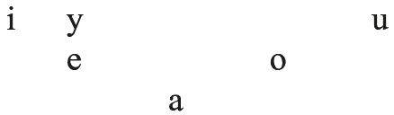</td><td>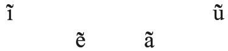</td><td>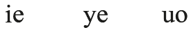</td></tr>
</table>

Origins:

(Here and elsewhere below, in the case of Latin third-declension loanwords showing <i>i-</i>mutation in MoAlb., the Latin source is given in the accusative singular; the precise process leading to <i>i</i>-mutation is a vexed question of Albanian historical linguistics.)

<table>
<tr><td>PAlb. *i</td><td><</td><td>PPAlb. *<i>i</i></td></tr>
<tr><td></td><td><</td><td>PPAlb. *<i>ī</i></td></tr>
<tr><td></td><td><</td><td>PPAlb. *<i>e</i>, Lat. <i>e</i> with <i>i-</i>mutation (<i>vit</i> ‘year’, <i>shtigje</i> ‘paths’, <i>piqni</i> ‘you bake’; <i>qind</i> ‘100’ ← Lat. <i>centum</i> (with <i>i-</i>mutation based on the PAlb. plural, which must at some point have been <i>-ī</i>), <i>grigj</i> ‘flock’ ← Lat. <i>gregem</i>)</td></tr>
</table>

<table>
<tr><td></td><td><</td><td>PPAlb. *<i>e</i>, Lat. <i>ē</i>/_<i>sh</i> (<i>mish</i> ‘meat’; <i>kishë</i> ‘church’ ← Lat. <i>ecclēsia</i>) [sometimes]</td></tr>
<tr><td></td><td>←</td><td>Lat. <i>i</i> with <i>i-</i>mutation where applicable (<i>këshill</i> ‘advice’ ← <i>cōnsilium</i>, <i>qift</i> ‘red kite’ ← <i>accipiter</i>, <i>fëmijë</i> ‘child’ ← <i>familia</i>)</td></tr>
<tr><td></td><td>←</td><td>Lat. <i>ī</i> (<i>mik</i> ‘friend’ ← Lat. <i>amīcus</i>, <i>ishull</i> ‘island’ ← <i>īnsula</i>, <i>mijë</i> ‘1000’ ← <i>mīlia</i>)</td></tr>
<tr><td>PAlb. *e</td><td><</td><td>PPAlb. *<i>e</i>, Lat. <i>e</i>, <i>ae</i>/<i>Cl_</i>, <i>Cr_</i> (<i>kle</i> ‘was’, <i>dredh</i> ‘to turn’; <i>pre</i> ‘booty’ < *<i>predë</i> ← Lat. <i>praeda</i>)</td></tr>
<tr><td></td><td><</td><td>PPAlb. *<i>e</i>, Lat. <i>e</i>, <i>ae</i> in /<i>je</i>/ (<i>mjeshtër</i> ‘master’ < *<i>maester</i> ← Lat. <i>magister</i>, <i>mjek</i> ‘doctor’ ← Lat. <i>medicus</i>, <i>vjetër</i> ‘old’ ← Lat. <i>veterem</i>, <i>pjeshkë</i> ‘peach’ ← <i>persicum</i>)</td></tr>
<tr><td></td><td><</td><td>PPAlb. *<i>ē</i></td></tr>
<tr><td></td><td><</td><td>PPAlb. *<i>a</i>, Lat. <i>a</i>, <i>ā</i> + <i>i-</i>mutation (<i>net</i> ‘nights’, <i>pleq</i> ‘old men’, <i>eshtra</i> ‘bones’, <i>del</i> ‘goes out’, <i>troket</i> ‘knocks’; <i>shëndet</i> ‘health’←Lat. <i>sānitātem</i>, <i>qytet</i> ‘town’ ←Lat. <i>cīvitātem</i>, <i>qelq</i> ‘glass’← Lat. <i>calicem</i>, <i>gjelbër</i> ‘green’ ← Lat. <i>galbinus</i>, <i>qen</i> ‘dog’ ← Lat. <i>canem</i>)</td></tr>
<tr><td></td><td><</td><td>PPAlb. *<i>a</i>, Lat. <i>a</i>, <i>ā</i>/<i>j</i>_ (<i>kërshterë</i> ‘Christian’ ← Lat. <i>christiānus</i>, <i>pëlqen</i> ‘to please’ ← Lat. <i>placeō</i> via the inherited class of presents in *-<i>iān</i>-)</td></tr>
<tr><td></td><td><</td><td>*<i>ø</i> < PPAlb. *<i>ā</i> + <i>i-</i>mutation (<i>vegjël</i> ‘small’ [pl.m.], <i>sheh</i> ‘sees’, present stems in -<i>en</i>)</td></tr>
<tr><td></td><td><</td><td>*<i>ø</i> < PPAlb. *<i>ō</i></td></tr>
<tr><td></td><td><</td><td>*<i>ø</i> < Lat. <i>ō</i> (<i>herë</i> ‘time’ ← <i>[h]ōra</i>, <i>pemë</i> ‘fruit’ ← <i>pōmum</i>, <i>tërmet</i> ‘earthquake’ ← <i>terrae mōtus</i>)</td></tr>
<tr><td></td><td><</td><td>PPAlb. *<i>ai</i></td></tr>
<tr><td></td><td><b>←</b></td><td>Lat. <i>ē</i> (<i>qetë</i> ‘silent’ ← <i>quiētus</i>, <i>femër</i> ‘female’ ← <i>fēmina</i>, <i>vërer</i> ‘venom’ ← <i>venēnum</i>)</td></tr>
<tr><td></td><td><b>←</b></td><td>Lat. <i>i</i> (<i>peshk</i> ‘fish’ ← <i>piscis</i>, <i>shërbes</i> ‘service’ ← <i>servitium</i>, <i>verdhë</i> ‘yellow, green’ ← <i>viridis</i>, <i>meshë</i> ‘mass’ ← <i>missa</i>)</td></tr>
<tr><td>PAlb. *a</td><td><</td><td>PPAlb. *<i>a</i></td></tr>
<tr><td></td><td><</td><td>PPAlb. *<i>e</i>/_$<i>a(m)</i> (de Vaan 2004: 78−83)</td></tr>
<tr><td></td><td><</td><td>PPAlb. *<i>au</i>, Lat. <i>au</i> (<i>than</i> ‘to dry’; <i>ar</i> ‘gold’ ← Lat. <i>aurum</i>, <i>gaz</i> ‘joy’ ← Lat. <i>gaudium</i>)</td></tr>
<tr><td></td><td>←</td><td>Lat. <i>a</i>, <i>ā</i> (<i>aftë</i> ‘suitable’ ← <i>aptus</i>, <i>shtrat</i> ‘bed’ ← <i>strātum</i>, <i>larg</i> ‘far’ ← <i>lārgus</i>, <i>paq</i> ‘peace’ ← <i>pācem</i>)</td></tr>
<tr><td></td><td>←</td><td>Lat. <i>e</i>/<i>q</i>,<i>sh</i>_<i>rr</i>,<i>l</i> (<i>shalë</i> ‘saddle’ ← <i>sella</i>, <i>sharrë</i> ‘saw’ ← <i>serra</i>; <i>qarr</i> ‘oak’ ← <i>cerrus</i>)</td></tr>
<tr><td>PAlb. *o</td><td><</td><td>PPAlb. *<i>ā</i></td></tr>
<tr><td></td><td>←</td><td>Lat. <i>o</i> (<i>shok</i> ‘friend’ ← <i>socius</i>, <i>kofshë</i> ‘hip’ ← <i>coxa</i>)</td></tr>
<tr><td></td><td>←</td><td>Lat. <i>ō</i> (<i>shëndoshë</i> ‘healthy’ ← <i>sānitōsus</i>, <i>kurorë</i> ‘wreath’ ← <i>corōna</i>)</td></tr>
<tr><td>PAlb. *u</td><td><</td><td>PPAlb. *<i>u</i></td></tr>
<tr><td></td><td>←</td><td>Lat. <i>u</i> (<i>gusht</i> ‘August’ ← <i>augustus</i>, <i>kut</i> ‘elbow’ ← <i>cubitus</i>, <i>pulë</i> ‘chicken’ ← <i>pulla</i>)</td></tr>
<tr><td></td><td>←</td><td>Lat. <i>vo-</i> (<i>umb</i> ‘ploughshare’ ← <i>vōmer</i>)</td></tr>
<tr><td></td><td>←</td><td>Lat. <i>o</i>/_<i>N</i> (<i>murg</i> ‘monk’ ← <i>monachus</i>, <i>kundër</i> ‘against’ ← <i>contrā</i>)</td></tr>
<tr><td></td><td>←</td><td>Lat. <i>ō</i> (<i>krushk</i> ‘relative by marriage’ ← <i>cōnsocer</i>, <i>urdhër</i> ‘order’ ← <i>ōrdō</i>)</td></tr>
</table>

<!-- source-file: content/09_chapter03_2.xhtml -->

<table>
<tr><td>PAlb. *y</td><td><</td><td>PPAlb. *<i>ū</i> (cf. Bonnet 1998: 96 f.)</td></tr>
<tr><td></td><td><</td><td>PPAlb. *<i>u</i>, Lat. <i>u</i> with <i>i-</i>mutation (<i>shtyp</i> ‘to press’; <i>kryq</i> ‘cross’ ← Lat. <i>crucem</i>)</td></tr>
<tr><td></td><td>←</td><td>Lat. <i>ū</i> (<i>brymë</i> ‘hoar-frost’ ← <i>brūma</i>, <i>këshyrë</i> ‘pass, gorge’ ← <i>clausūra</i>, <i>pyll</i> ‘forest’ ← <i>palūs</i>)</td></tr>
<tr><td>PAlb. *ã</td><td><</td><td>PPAlb. *<i>a</i>/_<i>N</i> (<i>mëz</i>, Geg <i>mãz</i> ‘foal’, <i>zã</i> ‘voice’)</td></tr>
<tr><td></td><td>←</td><td>Lat. <i>a</i>/_<i>N</i> (Geg <i>kãmbë</i> ‘leg’ ← <i>camba</i>, <i>kãngë</i> ‘song’ ← <i>canticum</i>, <i>dãm</i> ‘damage’ ← <i>damnum</i>)</td></tr>
<tr><td></td><td>←</td><td>Lat. <i>e</i>, <i>ē</i>/_<i>N</i> (occasionally: <i>rërë</i>, Geg <i>rãnë</i> ‘sand’ ← <i>arēna</i>, Geg <i>argjãnd</i> ‘silver’ ← <i>argentum</i>, <i>qãndër</i> ‘center’ ← <i>centrum</i>)</td></tr>
<tr><td>PAlb. *ẽ</td><td><</td><td>PPAlb. *<i>e</i>/_<i>N</i> (<i>pesë</i>, Geg <i>pẽs</i> ‘five’, <i>rẽ</i> ‘cloud’)</td></tr>
<tr><td></td><td>←</td><td>Lat. <i>i</i>, <i>e</i>, <i>ē</i>/_<i>N</i> (<i>fre</i> ‘rein’ ← <i>frēnum</i>)</td></tr>
<tr><td>PAlb. *ĩ</td><td><</td><td>PPAlb. *<i>i</i>/_<i>N</i> (Geg <i>hĩ</i> ‘ashes’, -<i>ĩ</i>, -<i>ĩni</i> nom.sg.m.)</td></tr>
<tr><td></td><td>←</td><td>Lat. <i>ī</i>/_<i>N</i> (Geg <i>lĩ</i> ‘flax’ ← <i>līnum</i>, <i>fqĩ</i> ‘neighbor’ ← <i>vicīnus</i>)</td></tr>
<tr><td>PAlb. *ũ</td><td><</td><td>PPAlb. *<i>u</i>/_<i>N</i> (<i>gju</i>, Geg <i>gjũ</i> ‘knee’ < *<i>glun-</i>, <i>ũ</i> ‘I’ < *<i>un-</i>; <i>mbush</i> ‘to fill’?)</td></tr>
<tr><td>PAlb. *ie</td><td><</td><td>PPAlb. *<i>e</i>, Lat. <i>e</i>, <i>ae</i>/_*<i>ɫ</i>,<i>r</i> # (Geg <i>piell</i> ‘brings forth’, MoAlb. <i>bie</i> ‘to fall’; <i>qiell</i> ‘sky’ ← Lat. <i>caelum</i>)</td></tr>
<tr><td>PAlb. *uo</td><td><</td><td>PPAlb. *<i>ō</i>, Lat. <i>o</i>, <i>ō</i>/_*<i>ɫ</i>,<i>n</i>,<i>r</i>,<i>j</i> # (<i>duar</i> ‘hands’, <i>muaj</i> ‘month’; <i>shuall</i> ‘sole’ ← Lat. <i>solum</i>, <i>ftua</i> ‘quince’ ← Lat. <i>cotōneus</i>, <i>drangua</i> ‘dragon’ ← Lat. <i>dracō</i>)</td></tr>
<tr><td></td><td>←</td><td>Lat. <i>o</i>/#_<i>r</i>,<i>lj</i> (<i>vaj</i> ‘oil’ ← <i>oleum</i>, <i>varfër</i> ‘poor’ ← <i>orfanus</i>)</td></tr>
<tr><td>PAlb. *ye</td><td><</td><td>PPAlb. *<i>ō</i> + <i>i-</i>mutation, Lat. <i>jō</i>/_*<i>ɫ</i>,<i>n</i>,<i>r</i> # (<i>dyer</i> ‘doors’, <i>pëlqyer</i> ‘pleased’ ptc. to <i>pëlqen</i>; <i>arësye</i> ‘reason’ ← Lat. <i>rātiō</i>)</td></tr>
</table>

The main systemic changes between PPAlb. and PAlb:

In the period between PPAlb. and PAlb., phonemic vowel length as it was inherited from PIE disappeared. Like in the Romance languages, vowel quality became the determining factor in the distribution of the vowels. The quantity collapse may have been caused by the fronting of rounded back vowels in the early Roman period (Ölberg 1972: 147 f.). The restructuring of the system was accompanied by different vowel mutations and the subsequent reduction or loss of unstressed vowels. Nasalized vowels arose but were preserved only in Geg, whereas Tosk denasalized them. The most important vowel changes between PPAlb. and PAlb. can be subsumed in the following relative chronology (see also Hock 2005: 264−267):

1. Long back vowels are fronted: *<i>ō</i> > *<i>ȫ</i>, *<i>ū</i> > *<i>ȳ</i>
2. PPAlb., Lat. *<i>ai</i> > *<i>ē</i>
3. PPAlb. *<i>ā</i> > *<i>ɔ</i>:
4. Loss of distinctive vowel length leads to the following system (the PPAlb. antecedents are in parentheses):

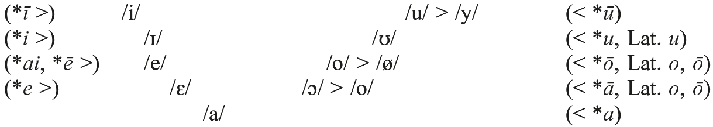

<table>
<tr><td>5.</td><td>a)</td><td>*<i>ɛ > jɛ</i></td></tr>
<tr><td></td><td></td><td>*<i>ɛ</i> > <i>ja</i>/_*<i>a(m)</i> (<i>a-</i>mutation)</td></tr>
<tr><td></td><td></td><td><i>i-</i>mutation: *<i>a</i> > *<i>e</i>; *<i>ɛ</i> and *<i>e</i> > *<i>i</i>; *<i>o</i> > *<i>ø</i>, *<i>u</i> > *<i>y</i></td></tr>
</table>

<table>
<tr><td>b)</td><td>*<i>e</i>, *<i>ɛ</i> > *<i>ie</i> before word-final *-<i>ɫ</i>, *-<i>r</i></td></tr>
<tr><td></td><td>*<i>ø</i> > *<i>ye</i>, *<i>o</i> > *<i>uo</i> before word-final *-<i>ɫ</i>, *-<i>n</i>, *-<i>r</i></td></tr>
<tr><td></td><td>*<i>o</i> > *<i>uo</i>/#_<i>r</i>,<i>lj</i>, *<i>ø</i> > *<i>ye</i>/_(w)V</td></tr>
</table>

6. *<i>ø</i> > *<i>e</i>

7. Unstressed word-internal vowels > */ə/, unstressed initial vowels > zero

8. Rise of phonemic nasalization

#### 2.2.2. The unstressed vowels of PAlb

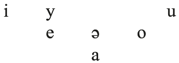

Unstressed vowels were reduced in distinctiveness or were lost altogether in the last phase of the PAlb. period, after the operation of <i>a-</i>mutation and <i>i-</i>mutation. According to their position in the word, we can distinguish the following categories (Topalli 1995: 139−282; Matzinger 2006: 61−63):

a. In absolute initial position, all vowels are reduced to zero (<i>tetë</i> ‘eight’, <i>rërë</i> ‘sand’ ← Lat. <i>arēna</i>, <i>mik</i> ‘friend’ ← Lat. <i>amīcus</i>, <i>shtëpi</i> ‘house’ ← Lat. <i>(h)ospitium</i>) except before -<i>RC-</i>, where a vowel is retained in Buzuku (<i>Enduo</i> ‘Anthony’; <i>elter</i> ‘altar’ ← Lat. <i>altāre</i>; <i>ënbë-</i> ‘on, around’).

b. Internal pretonic vowels, including *<i>au</i>, are either lost at a stage preceding PAlb. (<i>mbesë</i> ‘grand-daughter, niece’ ← <i>*nepṓtia</i>, <i>shtatë</i> ‘seven’ < <i>*septm´̥ to-</i>, <i>ftua</i> ‘quince’ ← <i>*cotṓneus</i>), or merge to */ə/ (e.g. <i>gëzon</i> ‘to enjoy’ to <i>gaz</i> ‘joy’, <i>kërpin</i> ‘to eat a snack’, <i>vëllezër</i> ‘brothers’, <i>kërshterë</i> ‘Christian’, <i>këshill</i> ‘advice’, <i>vërtet</i> ‘truth’, <i>shëndet</i> ‘health’ ← <i>sanitā´tem</i>, <i>këndoj</i> ‘to sing’, OAlb. <i>lëfton</i> ‘to fight’ to <i>luftë</i> ‘fight [n.]’). If a word contained two pretonic syllables, the first one usually retains its original vowel (<i>mallëkon</i> ‘to curse’ ← Lat. <i>maledicāre</i>, Buz. <i>sherbëtuor</i> ‘servant’), except <i>o</i>, which turns into <i>u</i> (<i>ngushëllon</i> ‘to console’ ← Lat. <i>cōnsolāre</i>, <i>vullëndet</i> ‘will’ ← Lat. <i>voluntātem</i>). These reductions have also affected the oldest layers of loanwords from Middle Greek, Italian, and Slavic.

c. Internal posttonic vowels are either lost at an early stage (<i>shelg</i> ‘willow’ ← Lat. <i>sálicem</i>, <i>emtë</i> ‘aunt’ ← Lat. <i>ámita</i>, <i>mëngë</i> ‘sleeve’ ← Lat. <i>mánica</i>, <i>shpirt</i> ‘spirit’ ← Lat. <i>spī´ritus</i>), or merge in */ə/ (Buz. <i>sonëte</i>, MoAlb. <i>sonte</i> ‘tonight’ < *<i>so nate</i>, <i>varfër</i> ‘poor’ ← Lat. <i>όrfanus</i>, <i>tjetër</i> ‘other’ < *<i>te-étero</i>-, <i>upeshkëp</i> ‘priest’ ← Lat. <i>episcopus</i>, <i>kundër</i> ‘against’ ← Lat. <i>contrā</i>).

d. Word-final vowels in MoAlb. which reflect pre-Slavic final sequences are -<i>i</i>, -<i>u</i>, -<i>ë</i>, -<i>e</i>, -<i>a</i>; the vowel -<i>o</i> occurs only in borrowings from Slavic, Italian, etc. The PAlb. word-final vowels which could occur in unstressed position before their reduction to *-<i>ə</i> or loss probably included *-<i>a</i>, *-<i>i</i>, and perhaps *-<i>e</i>, but the form of many nominal and verbal endings is too unclear to give a reliable overview of the system. The only certain information is provided by <i>i-</i>mutation and <i>a-</i>mutation, and by palatalization of word-final consonants in certain morphological categories (the m.pl., the aorist and imperfect). The data suggest that Latin nouns and adjectives were mostly adopted in their accusative form, and, similarly, inherited stock from PIE has sometimes been preserved in the form of the acc.sg. or pl. But in some endings the nominative form apparently won out, as shown by the nom.pl. with palatalization and <i>i-</i>mutation.

A selected number of endings can be traced back to inflectional endings of Early PAlb., PIE, and Latin:

<table>
<tr><td><i>zero</i></td><td><</td><td>PIE -<i>V</i>#, -<i>Vs</i>, Lat. -<i>us</i>; PIE *-<i>oi</i> (or -<i>ī</i>?)</td></tr>
<tr><td>-<i>ë</i></td><td><</td><td>Lat. -<i>a</i>, PPAlb. *-<i>a</i> [sg.f.], PPAlb. *-<i>a(:)m</i> [sg.n., f.], *-<i>ans</i> [acc.pl.m.], *-<i>a(:)(n)s</i> [nom./acc.pl.f.]; ← Lat. -<i>e(m)</i>, -<i>um</i>, Gr. -<i>on</i> (<i>mollë</i> ‘apple’ ← Gr. <i>mãlon</i>), Ital. -<i>o</i> (<i>pjatë</i> ‘plate’ ← Ital. <i>piatto</i>), Slav. -<i>o</i> (<i>karrutë</i> ‘fermenter’ ← Slav. *<i>koryto</i> ‘trough’, <i>sanë</i> ‘hay’ ← Slav. *<i>sěno</i>)</td></tr>
<tr><td>-<i>e</i></td><td><</td><td>PPAlb. *-<i>ja</i> [sg.f.], [pl.n/f.], *-<i>jas</i> [gen.sg.f.]?</td></tr>
<tr><td>-<i>a</i></td><td><</td><td>*-<i>a-ja</i> (cf. Kortlandt 1987: 225; Topalli 1995: 279) [nom.sg.f. def.]</td></tr>
<tr><td>-<i>i</i></td><td><</td><td>*-<i>ís</i> / <i>*éi</i> (originally stressed; in the def. art. m.sg.)</td></tr>
<tr><td>-<i>u</i></td><td><</td><td>-<i>i</i> after velars</td></tr>
</table>

### 2.3. From PPAlb. to PIE

<table>
<tr><td>The short vowels of PPAlb.:</td><td>Long vowels:</td><td>Diphthongs:</td></tr>
<tr><td>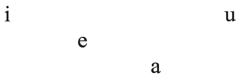</td><td>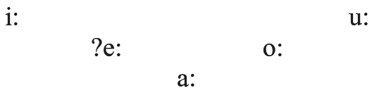</td><td>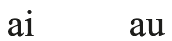</td></tr>
</table>

Origins:

<table>
<tr><td>PPAlb. *i</td><td><</td><td>PIE *<i>i</i> (<i>lig</i> ‘bad, ill’, <i>bind</i> ‘convince’, <i>mbi</i> ‘on’, <i>ndih</i> ‘to help’)</td></tr>
<tr><td></td><td><</td><td>PIE zero/<i>r̥</i>_ (<i>dritë</i> ‘light’, <i>trim</i> ‘strong’)</td></tr>
<tr><td>PPAlb. *e</td><td><</td><td>PIE *<i>(h₁)e</i> (<i>mbledh</i> ‘to gather’, <i>pesë</i> ‘five’, <i>pjek</i> ‘to cook’, <i>jashtë</i> ‘outside’, <i>vit</i> ‘year’, <i>diell</i> ‘sun’)</td></tr>
<tr><td>PPAlb. *a</td><td><</td><td>PIE *<i>(H)o</i> (<i>natë</i> ‘night’, <i>asht[ë]</i> ‘bone’, <i>gjak</i> ‘blood’, <i>zë</i>, G. <i>zã</i> ‘voice’)</td></tr>
<tr><td></td><td><</td><td>PIE *<i>h₂e</i> (<i>athët</i> ‘bitter’)</td></tr>
<tr><td></td><td><</td><td>PIE *<i>RHV</i> (<i>parë</i> ‘first’)</td></tr>
<tr><td></td><td><</td><td>PIE *<i>h₂</i>-, *<i>h₃</i>- /_<i>R</i>- (<i>arë</i> ‘field, <i>emër</i> ‘name’ < *<i>h₃n̥h₃-mn̥</i>)</td></tr>
<tr><td></td><td><</td><td>PIE *<i>H</i>/<i>C</i>_<i>C</i> (<i>thënë</i> ‘said’, <i>bëj</i>, G. <i>bãn</i> ‘to do, make’ < *<i>bh₂-n</i>-, <i>kap</i> ‘to seize’)</td></tr>
<tr><td></td><td><</td><td>PIE *<i>H</i>/<i>CR_C</i> (<i>plak</i> ‘old’ < *<i>plHko</i>-, OAlb. <i>glatë</i> ‘long’, <i>bredh</i> ‘fir’; cf. Schumacher 2007: 229)</td></tr>
<tr><td></td><td><</td><td>PIE *<i>m̥</i> (<i>shtatë</i> ‘seven’ < *<i>septm´̥ to-</i>)</td></tr>
<tr><td></td><td><</td><td>PIE *<i>n̥</i> (<i>mat</i> ‘bank’ if from *<i>mn̥to-</i> ‘elevation’; <i>e-sëll</i> ‘sober’ < *<i>a-</i> < privative *<i>n̥-</i> plus *<i>sillë</i> ‘breakfast’)</td></tr>
<tr><td></td><td><</td><td>PIE <i>zero</i> / C_C (<i>madh</i> ‘big’ < *<i>m̥ g̑</i>-, though Schumacher 2013: 238 suspects paradigmatic leveling between <i>*medʝ-</i> < <i>*meg̑-</i> and <i>*adʝ-</i> < <i>*m̥g̑-</i>)</td></tr>
<tr><td>PPAlb. *u</td><td><</td><td>PIE *<i>u</i> (<i>gjumë</i> ‘sleep’, <i>dru</i> ‘wood’, <i>shtyn</i> ‘to thrust’)</td></tr>
<tr><td></td><td><</td><td>PIE <i>*u-</i>/<i>#_LT-</i> (<i>ujk</i> ‘wolf’ < <i>*ulkʷo-</i>, Schumacher 2013: 229)</td></tr>
<tr><td>PPAlb. *ī</td><td><</td><td>PIE *<i>iH</i> (<i>tri</i> [f.] ‘three’, <i>pi</i> ‘to drink’, <i>ditë</i> ‘day’)</td></tr>
<tr><td></td><td><</td><td>?PIE *<i>ei</i>, *<i>h₁ei</i>, *<i>eh₁i</i> (<i>dimër</i> ‘winter’, <i>ikën</i> ‘to go’ − but these could also have single *<i>i</i>)</td></tr>
<tr><td>PPAlb.*ē</td><td><</td><td>?PIE *<i>eu</i>, *<i>h₁eu</i>, *<i>eh₁u</i> (<i>nëndë</i>, Geg <i>nãndë</i> ‘nine’, <i>hedh</i> ‘to throw’, <i>len</i> ‘to be born’; cf. Hock 2005: 265, fn. 11; Matzinger 2006: 57). Alternatively,</td></tr>
<tr><td></td><td></td><td>the PIE <i>eu-</i>diphthongs yielded PPAlb. *<i>au</i> > PAlb. *<i>a</i>, whence the nasalized vowel in Geg <i>nãndë</i>, and with <i>i-</i>mutation of <i>*a</i> the verbs <i>hedh</i> and <i>len</i> (Schumacher 2013: 228).</td></tr>
<tr><td></td><td>←</td><td>OGr. loanwords (<i>shpellë</i> ‘cave’ ← <i>spēlaion</i>)</td></tr>
<tr><td>PPAlb. *ā</td><td><</td><td>PIE *<i>ē</i>, *<i>eh₁</i> (<i>zot</i> ‘Lord’, <i>mot</i> ‘weather’, <i>mos</i> ‘not’, <i>plotë</i> ‘full’; aor. -<i>o-</i>)</td></tr>
<tr><td></td><td><</td><td>PIE *<i>eh₂</i> (<i>motër</i> ‘sister’, <i>shton</i> ‘to add’)</td></tr>
<tr><td></td><td><</td><td>PIE *<i>-as-</i> and <i>*-es-</i>/_<i>l</i>,<i>n</i>,<i>r</i> (<i>krua</i> ‘spring, fountain’ < *<i>rh₂(e)s-n</i>-, <i>dorë</i> ‘hand’ < <i>*g̑ʰesr-</i>)</td></tr>
<tr><td></td><td>←</td><td>OGr. *<i>ā</i> (<i>mokër</i> ‘millstone’ ← Doric *<i>mākhānā</i>)</td></tr>
<tr><td>PPAlb. *ō</td><td><</td><td>PIE *<i>ō</i>, *<i>oH</i>, *<i>eh₃</i> (<i>tetë</i> ‘eight’, <i>pelë</i> ‘mare’, <i>derë</i> ‘door’, <i>blerë</i> ‘green’, <i>ngjesh</i> ‘to gird’)</td></tr>
<tr><td>PPAlb. *ū</td><td><</td><td>PIE *<i>uH</i> (<i>mi ‘</i>mouse’, <i>thi</i> ‘pig’, <i>ti</i> ‘you’, <i>gjysh</i> ‘grandfather’)</td></tr>
<tr><td></td><td><</td><td>PIE *-<i>us-</i>/_<i>l</i>,<i>r</i> (<i>yll</i> ‘star’)</td></tr>
<tr><td>PPAlb. *ai</td><td><</td><td>PIE *<i>oi</i> (<i>shteg</i> ‘path, Geg <i>vẽnë</i> ‘wine’)</td></tr>
<tr><td></td><td><</td><td>PIE *<i>h₂</i>/<i>3</i><i>ei</i>, *<i>eh₂</i>/<i>3</i><i>i</i> (<i>edh</i> ‘kid’, <i>[h]ethe</i> ‘fever’)</td></tr>
<tr><td>PPAlb. *au</td><td><</td><td>PIE *<i>ou</i> (<i>desh</i> ‘wanted’ [aor.], <i>lashtë</i> ‘old’?)</td></tr>
<tr><td></td><td><</td><td>*<i>h₂</i>/<i>3</i><i>eu</i>, *<i>eh₂</i>/<i>3</i><i>u</i> (pron. <i>atë</i> ‘s/he’ [acc.], <i>ajo</i> ‘she [nom.]’ < PIE <i>*h₂eu-</i>, <i>than</i> ‘to dry’, <i>qan</i> ‘to weep’, <i>ag</i> ‘dawn’)</td></tr>
</table>

## 3. Resonants

### 3.1. From MoAlb. to PAlb.

The resonants of MoAlb.

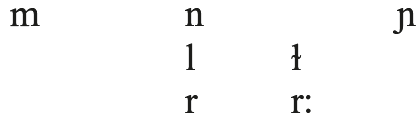

Origins:

<table>
<tr><td>MoAlb. <i>m</i></td><td><</td><td>PAlb. *<i>m</i></td></tr>
<tr><td></td><td><</td><td>PAlb. *<i>β</i>/_<i>VN</i>$ (<i>mëngjill</i>/ <i>vëngjill</i> ‘vigil’ ← Lat. <i>vigilia</i>, <i>mëshikë</i> ‘bubble, blister, bladder’ ← Lat. <i>vē(n)sīca</i> ‘bladder’, cf. Orel 2000: 55)</td></tr>
<tr><td>MoAlb. <i>n</i></td><td><</td><td>PAlb. *<i>n</i> (except intervocalic *<i>n</i>)</td></tr>
<tr><td></td><td><</td><td>PAlb. *<i>n</i>:</td></tr>
<tr><td></td><td><</td><td>PAlb. *<i>nd</i></td></tr>
<tr><td>MoAlb. <i>ɲ</i></td><td><</td><td>PAlb. *<i>ɲ</i></td></tr>
<tr><td>MoAlb. <i>l</i></td><td><</td><td>PAlb. *<i>l</i></td></tr>
<tr><td>MoAlb. <i>ɫ</i></td><td><</td><td>PAlb. *<i>l</i>:</td></tr>
<tr><td>MoAlb. <i>r</i></td><td><</td><td>PAlb. *<i>r</i></td></tr>
<tr><td>Tosk <i>r</i></td><td><</td><td>PAlb. < *<i>n</i>/V_V (<i>rërë</i> ‘sand’, Geg <i>rãnë</i> ‘sand’ ← Lat. <i>arēna</i>, <i>gjiri</i> ‘the breast’, Tosk <i>armik</i> ‘enemy’ ← Lat. <i>inimīcus</i>; dated between 800−1000 CE, Janson 1986: 190−211)</td></tr>
<tr><td>MoAlb. <i>r</i>:</td><td><</td><td>PAlb. *<i>r</i>:</td></tr>
<tr><td></td><td><</td><td>PAlb. *-<i>rn-</i> (<i>zorrë</i> ‘intestine’; <i>ferr</i> ‘hell’ ← Lat. <i>infernum</i>; post-Slavic, Janson 1986: 97 f.)</td></tr>
</table>

### 3.2. From PAlb. to PPAlb.

The resonants of PAlb.

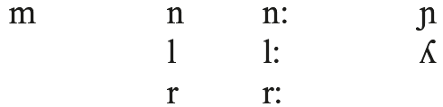

Origins:

<table>
<tr><td>PAlb. *m</td><td><</td><td>PPAlb. *<i>m</i></td></tr>
<tr><td></td><td>←</td><td>Lat. <i>m</i></td></tr>
<tr><td>PAlb. *n</td><td><</td><td>PPAlb. *<i>n</i></td></tr>
<tr><td></td><td>←</td><td>Lat. <i>n</i></td></tr>
<tr><td>PAlb. * n:</td><td><</td><td>PPAlb. *<i>-Tn-</i> (<i>lënë</i> ‘let’)</td></tr>
<tr><td></td><td><i><</i></td><td>PPAlb. <i>*-Kn-</i></td></tr>
<tr><td></td><td><i><</i></td><td>PPAlb. <i>*-sn-</i> (<i>thënë</i> ‘said’ < PPAlb. *<i>ʨasno</i>- < *<i>k̑h₁s-no</i>-)</td></tr>
<tr><td></td><td><i><</i></td><td>PPAlb. <i>*-nd-</i></td></tr>
<tr><td></td><td><i><</i></td><td>PPAlb. <i>*-nt-</i> (3pl., acc.sg.) in posttonic syllable (?) or retention of the cluster (Janson 1986: 96, 154)</td></tr>
<tr><td>PAlb. *ɲ</td><td><</td><td>PPAlb. *<i>nj</i> (<i>bëj</i> ‘I make’, <i>mëdhenj</i> ‘big’ [m.pl.])</td></tr>
<tr><td></td><td><</td><td>PPAlb. and Lat. *<i>gn-</i>, *-<i>gn-</i> (<i>njoh</i> ‘know’ < *<i>g̑n̥h₃-sk̑</i>-, Schumacher 2013: 231; <i>shenjë</i> ‘sign’ ← Lat. <i>insignia</i> and <i>signum</i>, Bonnet 1998: 188)</td></tr>
<tr><td></td><td>←</td><td>Lat. <i>ni</i>, <i>ne</i>/_<i>V</i> (<i>gështenjë</i> ‘chestnut’ ← <i>castanea</i>, <i>linjë</i> ‘line’ ← <i>līnea</i>, <i>kunj</i> ‘peg’ ← <i>cuneus</i>)</td></tr>
<tr><td></td><td>←</td><td>Lat. *-<i>ng(u)-</i>/_<i>V</i>[+front] (<i>njilë</i> ‘eel’ ← <i>anguilla</i>; Bonnet 1998: 188)</td></tr>
<tr><td>PAlb. *l</td><td><</td><td>PPAlb. *<i>ln</i> (<i>diel</i> ‘Sunday’ < acc. *<i>diel-në</i>, Bonnet 1998: 205)</td></tr>
<tr><td></td><td><</td><td>PPAlb. *<i>l</i>/<i>T</i>_ and /_<i>T</i> (<i>plot</i> ‘full’, <i>kulm</i> ‘top’, OAlb. <i>ulk</i> ‘wolf’, OAlb. <i>klān</i> ‘to cry’, OAlb. <i>glunjë</i> ‘knees’)</td></tr>
<tr><td></td><td>←</td><td>Lat. <i>ll</i></td></tr>
<tr><td></td><td>←</td><td>Lat. <i>l-</i></td></tr>
<tr><td>PAlb. *l:</td><td><</td><td>PPAlb. *<i>l</i>, <i>*sl</i>/<i>V</i>_<i>V</i>[−front] (<i>kollë</i> ‘cough’, <i>yll</i> ‘star’ < *<i>h₂us-l-</i> ‘spark’)</td></tr>
<tr><td></td><td><</td><td>PPAlb. and Lat. *<i>lR</i>, <i>*Rl</i> (<i>shtjell</i> ‘to throw’ < *<i>stel-[n]e</i>/<i>o-</i>, <i>gjallë</i> ‘alive’ < *<i>sólu̯o-</i>; <i>përrallë</i> ‘tale, story’ ← Lat. <i>parabola</i>)</td></tr>
<tr><td></td><td>←</td><td>Lat. <i>l</i>/<i>V</i>_<i>V</i></td></tr>
<tr><td>PAlb. *ʎ</td><td><</td><td>PPAlb. *<i>-l-</i>/<i>V</i>_<i>V</i>[+front]</td></tr>
<tr><td></td><td><</td><td>PPAlb. and Lat. *<i>lj</i> (<i>shtijë</i> ‘spear’ ← Lat. <i>hastīlia</i>, Arvan. <i>biʎë</i> ‘daughter’, <i>miʎë</i> ‘1000’)</td></tr>
<tr><td></td><td><</td><td>PPAlb. *-<i>rj-</i> (Bonnet 1998: 208 ff.; Matzinger 2006: 74)</td></tr>
<tr><td>PAlb. *r</td><td><</td><td>PPAlb. and Lat. -<i>r</i>- (<i>arë</i> ‘field’ < *<i>h₂erh₃-o</i>/<i>h₂</i>-)</td></tr>
<tr><td></td><td><</td><td>PPAlb. and Lat. <i>*rC</i>, <i>*Cr</i> (<i>ter</i> ‘to dry’ < *<i>torsei̯e-</i>, <i>sorrë</i> ‘crow’ < *<i>ʧornë</i> < *<i>kers-[e]n-</i>)</td></tr>
<tr><td>PAlb. *r:</td><td><</td><td>PPAlb. and Lat. *<i>r-</i> (<i>rreth</i>, <i>rrath</i> ‘wheel; circle’, <i>rrjedh</i> ‘to flow’)</td></tr>
<tr><td></td><td><</td><td>PPAlb. <i>*wr-</i> (<i>rrënjë</i>, Geg <i>rrã[n]jë</i> ‘root’ < *<i>urad-n-</i>, <i>rrunjë</i> ‘lamb’ < *<i>urH-n-</i>?)</td></tr>
<tr><td></td><td>←</td><td>Lat. -<i>rr-</i> (<i>turrë</i> ‘pile’ ← <i>turris</i>)</td></tr>
</table>

### 3.3. From PPAlb. to PIE

The resonants of PPAlb.

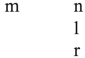

Origins:

<table>
<tr><td>PPAlb. *m</td><td><</td><td>PIE *<i>m</i></td></tr>
<tr><td></td><td><</td><td>PIE *<i>Tm</i> (<i>gjumë</i> ‘sleep’ < PIE *<i>súpnos</i>/<i>m</i>, Geg <i>amë</i> ‘smell’ < PIE *<i>h₃e</i>/<i>od-m</i>-)</td></tr>
<tr><td></td><td><</td><td>PIE *<i>sm</i> (<i>mjekër</i> ‘chin, beard’ < *<i>smek̑-[u]r</i>, <i>thom</i> ‘I say’ < *<i>eh₁s-mi</i>)</td></tr>
<tr><td></td><td><</td><td>PIE *<i>Pn</i> (<i>lumë</i> ‘happy’ < *<i>lubʰ-n</i>/<i>m</i>-)</td></tr>
<tr><td>PPAlb. *n</td><td><</td><td>PIE *<i>n</i></td></tr>
<tr><td>PPAlb. *l</td><td><</td><td>PIE *<i>l</i></td></tr>
<tr><td>PPAlb. *r</td><td><</td><td>PIE *<i>r</i></td></tr>
</table>

## 4. Obstruents

### 4.1. From MoAlb. back to PAlb.

The obstruents of MoAlb. (Buchholz and Fiedler 1987: 37; similarly for Buzuku, cf. Fiedler 2004: 59.)

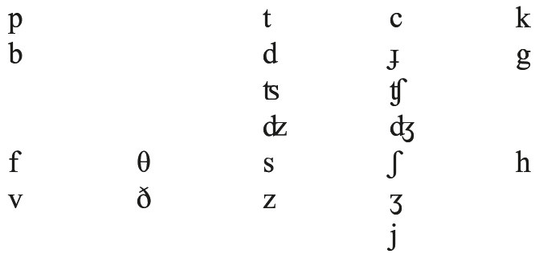

Origins:

<table>
<tr><td>MoAlb. p</td><td><</td><td>PAlb. *<i>p</i></td></tr>
<tr><td>MoAlb. b</td><td><</td><td>PAlb. *<i>b</i></td></tr>
<tr><td></td><td><</td><td>PAlb. <i>zero</i>/<i>m</i>_# (<i>shkëmb</i> ‘rock’ ← Lat. <i>scamnum</i>, Bonnet 1998: 195) PAlb. <i>zero</i>/<i>m</i>_V[−stress] in Tosk (Bonnet 1998: 193)</td></tr>
<tr><td>MoAlb. t</td><td><</td><td>PAlb. *<i>t</i></td></tr>
<tr><td>MoAlb. d</td><td><</td><td>PAlb. *<i>d</i></td></tr>
<tr><td>MoAlb. c</td><td><</td><td>PAlb. *<i>c</i></td></tr>
<tr><td></td><td></td><td>OAlb. <i>kl-</i> (<i>quhet</i> ‘is called’ < <i>kluhet</i>; <i>kishë</i>, <i>qishë</i> ‘church’, <i>qartë</i> ‘clear’</td></tr>
<tr><td></td><td></td><td>← Lat. <i>clārus</i>, <i>shqa</i>, <i>shkla</i> ‘Slav’ ← Lat. <i>Sclavus</i>, <i>shqep</i> ‘lame, limping’</td></tr>
<tr><td></td><td></td><td>← Lat. *<i>excloppus</i>)</td></tr>
</table>

<table>
<tr><td>MoAlb. ɟ</td><td><</td><td>PAlb. *<i>ɟ</i></td></tr>
<tr><td></td><td><</td><td>OAlb. <i>gl-</i> (<i>gjuhë</i> ‘tongue, language’ < <i>gluhë</i>; <i>gjëndër</i> ‘gland’ ← Lat. <i>glandula</i>, etc.)</td></tr>
<tr><td>MoAlb. k</td><td><</td><td>PAlb. *<i>k</i></td></tr>
<tr><td></td><td><</td><td><i>q</i> < OAlb. <i>kl-</i>/_<i>Vsh</i> (<i>këshyrë</i> ‘mountain trail’ ← <i>clausūra</i>, <i>kishë</i> ‘church’)</td></tr>
<tr><td>MoAlb. g</td><td><</td><td>PAlb. * <i>g</i></td></tr>
<tr><td>MoAlb. ʦ</td><td><</td><td>OAlb. clusters <i>d+s</i>, <i>d+th</i>; loanwords</td></tr>
<tr><td>MoAlb. ʣ</td><td><</td><td>PAlb. <i>z</i>/ <i>n_</i> (<i>rënxon</i> ‘to cause a hernia’, <i>nxë</i>, Geg <i>nxã</i> ‘to take’ < *<i>n-zë</i>)</td></tr>
<tr><td>MoAlb. ʧ</td><td><</td><td>OAlb. <i>sh</i>/_<i>C</i> (<i>çmon</i> ‘to estimate’ < *<i>shmoj</i> ← Lat. <i>aestimāre</i>)</td></tr>
<tr><td></td><td><</td><td>PAlb. *<i>d(ë)</i> + <i>sh(q)-</i> (<i>çan</i> ‘to split, cleave’ besides <i>shan</i>, <i>çjerr</i> ‘to tear up’ besides <i>shqerr</i> ‘to tear’)</td></tr>
<tr><td></td><td><</td><td>OAlb. <i>q-</i> (<i>çimkë</i>, <i>qimkë</i> ‘bug’, <i>që</i>, <i>çë</i> ‘that, which’)</td></tr>
<tr><td></td><td>←</td><td>loanwords</td></tr>
<tr><td>MoAlb. ʤ</td><td>←</td><td>loanwords from Italian, Turkish</td></tr>
<tr><td>MoAlb. f</td><td><</td><td>PAlb. <i>h</i> (dial. <i>njef</i> < <i>njeh</i> ‘knows’)</td></tr>
<tr><td></td><td><</td><td>PAlb. *<i>θ</i> (Geg <i>ufull</i>, Tosk <i>uthull</i> ‘vinegar’; <i>fjeshtër</i> / <i>thjeshtër</i> ‘stepson’ ← Lat. <i>fīliaster</i>)</td></tr>
<tr><td>OAlb. <i>f</i></td><td><</td><td>PAlb. *<i>θ-</i>/ <i>C</i>_ (OAlb. <i>rrëfyen</i> ‘to tell’ < *<i>rrë-θyen</i> < *<i>rrë-θø̄:n</i> to <i>thom</i>; OAlb. <i>ënfle</i> ‘to sleep’ < *<i>n-θle</i> < *<i>loi̯-eie-</i>, Matzinger 2006: 71)</td></tr>
<tr><td>MoAlb. v</td><td><</td><td>PAlb. *<i>β</i></td></tr>
<tr><td>MoAlb. θ</td><td><</td><td>PAlb. *<i>θ</i></td></tr>
<tr><td>MoAlb. ð</td><td><</td><td>PAlb. *<i>ð</i></td></tr>
<tr><td>MoAlb. s</td><td><</td><td>PAlb. * <i>s</i></td></tr>
<tr><td></td><td></td><td>PAlb. *-<i>z</i># (<i>mes</i> ‘middle’ ← Lat. <i>medius</i>)</td></tr>
<tr><td></td><td>←</td><td>Slav. <i>ç</i> (<i>porosit</i> ‘to request’, <i>sul</i> ‘small boat’, Svane 1992: 88)</td></tr>
<tr><td>MoAlb. z</td><td><</td><td>PAlb. *<i>z</i></td></tr>
<tr><td>MoAlb. ʃ</td><td><</td><td>PAlb. *<i>ʃ</i></td></tr>
<tr><td></td><td>←</td><td>Slav. <i>s</i> (<i>krashit</i> ‘to prune’, <i>leshë</i> ‘wickerwork’, <i>shuk</i> ‘globe’; Svane 1992: 292)</td></tr>
<tr><td>MoAlb. ʒ</td><td><</td><td>PAlb. *<i>ʃ</i> (<i>zhur</i>, <i>shur</i> ‘sand’ ← Lat. <i>saburra</i>)</td></tr>
<tr><td></td><td><</td><td>PAb. <i>ʃ</i>- in <i>zh-</i> ‘un, dis-’ /_<i>C</i>[+voiced] (<i>zh-bën</i> ‘to undo’, <i>zh-duk</i> ‘destroy’)</td></tr>
<tr><td>MoAlb. j</td><td><</td><td>PAlb. *<i>j</i></td></tr>
<tr><td></td><td></td><td>PAlb. *<i>ʎ</i></td></tr>
<tr><td></td><td></td><td>PAlb. *<i>l</i>/_<i>k</i> (<i>bujk</i>, <i>bulk</i> ‘peasant’, <i>ujk</i> ‘wolf’; <i>fajkua</i> ‘falcon’←Lat. <i>falcō</i>)</td></tr>
<tr><td></td><td></td><td>PAlb. *<i>l</i> in the f. suffix *-<i>ëlë</i> (<i>vdekje</i> ‘death’ < <i>vdekëlë</i>, Topalli 1995: 250)</td></tr>
<tr><td></td><td></td><td>PAlb. *<i>ɲ</i> often between vowels and in final position</td></tr>
<tr><td></td><td></td><td>PAlb. <i>*c</i>, <i>*ɟ</i>, <i>*ɲ</i>/<i>_ C</i> (OGeg aor. 3pl. <i>hojnë</i> [< <i>*hoq-në</i>] ‘they took’, <i>zojtë</i> [< <i>*zogj-të</i>] ‘the birds’, aor. 3sg. <i>bûjti</i> [< <i>*bunj-ti</i>] ‘spend the night’; cf. Schumacher 2013: 275−76)</td></tr>
<tr><td>MoAlb. h</td><td><</td><td>PAlb. *<i>h</i></td></tr>
<tr><td></td><td></td><td>PAlb. #<i>V-</i> (<i>hark</i> ‘curve’, <i>harmëshor</i> ‘stud horse’, <i>harron</i> ‘to forget’, <i>herë</i> ‘time’, etc., Orel 2000: 107)</td></tr>
</table>

### 4.2. From PAlb. back to PPAlb.

The obstruents of PAlb.

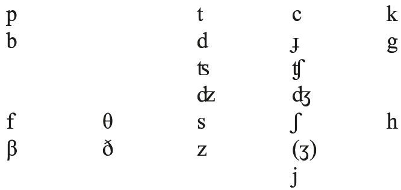

Origins:

<table>
<tr><td>PAlb. *p</td><td><</td><td>PPAlb. *<i>p</i></td></tr>
<tr><td></td><td>←</td><td>Lat. <i>p</i> (<i>pak</i> ‘little’ ← <i>paucus</i>, <i>prind</i> ‘parent’ ← <i>parentem</i>, <i>turp</i> ‘shame’ ← <i>turpis</i>)</td></tr>
<tr><td>PAlb. *b</td><td><</td><td>PPAlb. *<i>b</i></td></tr>
<tr><td></td><td><</td><td>PPAlb. <i>m-</i>/_<i>l</i> (<i>bluan</i> ‘to grind’ < <i>*mleh₁-</i>, <i>bletë</i> ‘bee’ < *<i>m[e]lit-</i>?)</td></tr>
<tr><td></td><td>←</td><td>Lat. <i>b</i> (<i>bishë</i> ‘wild animal’ ← <i>bēstia</i>, <i>bukë</i> ‘bread’ ← <i>bucca</i>, <i>gjelbër</i> ‘green’)</td></tr>
<tr><td></td><td>←</td><td>Lat. <i>w</i>/<i>l</i>,<i>r</i>_ (<i>korb</i> ‘raven’←<i>corvus</i>, <i>shërben</i> ‘to serve’ ←<i>servīre</i>, <i>shëlbon</i> ‘to save’ ← <i>salvāre</i>)</td></tr>
<tr><td></td><td><</td><td>Lat. <i>p</i>/<i>m</i>_ (<i>shembull</i> ‘example’ ← <i>exemplum</i>, <i>mbret</i> ‘king’ ← <i>imperātor</i>)</td></tr>
<tr><td>PAlb. *t</td><td><</td><td>PPAlb. *<i>t</i></td></tr>
<tr><td></td><td>←</td><td>Lat. <i>t</i> (<i>shëndet</i> ‘health’, <i>qetë</i> ‘quiet’ ← <i>quiētus</i>, <i>kultër</i> ‘cushion’ ← <i>culcitra</i>)</td></tr>
<tr><td>PAlb. *d</td><td><</td><td>PPAlb. *<i>d</i></td></tr>
<tr><td></td><td><</td><td>PPAlb., Lat. *<i>t</i>/<i>n</i>_ in a pretonic or stressed syllable (<i>dhëndër</i> ‘bridegroom’, <i>ndjek</i> ‘to follow’; <i>Ndue</i> ‘Anthony’, <i>kundër</i> ‘against’, <i>ndëgjon</i> ‘to hear’ ← Lat. <i>intellegere</i>; cf. Matzinger 2006: 74 f.)</td></tr>
<tr><td></td><td>←</td><td>Lat. <i>d</i> (<i>denjë</i> ‘worth’ ← <i>dignus</i>, <i>dëm</i>, <i>dam</i> ‘damage’)</td></tr>
<tr><td>PAlb. *c</td><td><</td><td>PPAlb. *<i>k</i>, Lat. <i>c</i>, <i>qu</i>/_<i>i</i>,<i>e</i>,<i>ae</i>,<i>y</i> (<i>pleq</i> ‘old men’, <i>qeth</i> ‘to cut’; <i>qetë</i> ‘quiet’, <i>qind</i> ‘hundred’, <i>iriq</i> ‘hedgehog’ ← Lat. <i>ērīcius</i>, <i>faqe</i> ‘face’, <i>qiell</i> ‘sky’, <i>qelq</i> ‘glass’, <i>qen</i> ‘dog’ ← Lat. <i>canem</i>)</td></tr>
<tr><td>PAlb. *ɟ</td><td><</td><td>PPAlb. *<i>ʒ</i>-</td></tr>
<tr><td></td><td><</td><td>PPAlb. *<i>j</i> before a stressed vowel (<i>n-gjesh</i> ‘to squeeze’)</td></tr>
<tr><td></td><td><</td><td>PPAlb. *<i>g</i>, Lat. <i>g(u)</i>/_<i>i</i>,<i>e</i>,<i>y</i> (<i>gjet-</i> ‘found’ < PIE *<i>gʰed</i>-; <i>grigj</i> ‘flock’, <i>shëgjetë</i>, <i>shigjetë</i> ‘arrow’ ← Lat. <i>sagitta</i>, <i>gjind</i> ‘people’ ← Lat. <i>gentem</i>, <i>ngjyen</i> ‘to dye’ ← Lat. <i>unguere</i>, <i>ungjill</i> ‘gospel’)</td></tr>
<tr><td></td><td>←</td><td>Lat. <i>i-</i> (<i>gjymtyrë</i> ‘limb’ ← <i>iūnctūra</i>, <i>[për]gjëron</i> ‘to beseech’ ← <i>iūrāre</i>)</td></tr>
<tr><td></td><td>←</td><td>Lat. -<i>c(u)l-</i> (<i>ungj</i> ‘uncle’ ← <i>avunculus</i>, <i>sheqe</i> ‘sickle’ ← <i>sic[u]la</i> < <i>situla</i>)</td></tr>
<tr><td>PAlb. *k</td><td><</td><td>PPAlb. *<i>k</i></td></tr>
<tr><td></td><td>←</td><td>Lat. <i>c</i>, <i>qu</i>/_<i>C</i>,<i>a</i>,<i>o</i>,<i>u</i> (<i>kërkon</i> ‘to search’ ← *<i>circāre</i>, <i>kreshmë</i> ‘Lent’ ← <i>quadrāgēsima</i>, <i>kuq</i> ‘red’ ← <i>cocceus</i>; <i>qëron</i> ‘to clear away’ ← <i>quaerere</i>, <i>katër</i> ‘four’ ← <i>quattuor</i>, <i>ndrikullë</i> ‘godmother’ ← <i>matricula</i>, <i>kë-</i> in deictic pronouns ← Lat. <i>eccum</i>)</td></tr>
</table>

<table>
<tr><td>PAlb. *g</td><td><</td><td>PPAlb. *<i>g</i></td></tr>
<tr><td></td><td>←</td><td>Lat. <i>g(u)</i>/_<i>C</i>,<i>a</i>,<i>o</i>,<i>u</i> (<i>grigj</i> ‘flock’, <i>gusht</i> ‘August’, <i>dërgon</i> ‘to send’ ← <i>dirigere</i>; <i>lëngon</i> ‘to pine away’ ← <i>languēre</i>, <i>ngënjen</i> ‘to deceive’ ← <i>ingannāre</i>)</td></tr>
<tr><td></td><td>←</td><td>Lat. <i>c</i>/<i>n</i>_ (<i>mëngë</i> ‘sleeve’ ← <i>man[i]ca</i>, <i>mëngon</i> ‘to get up early’ ← <i>manicāre</i>, <i>tingë</i> ‘tench’ ← <i>tinca</i>, <i>këngë</i> ‘song’ ← <i>cantica</i>)</td></tr>
<tr><td>PAlb. *f</td><td><</td><td>PPAlb. *<i>f</i></td></tr>
<tr><td></td><td>←</td><td>Lat. <i>f</i> (<i>fëmijë</i> ‘child’, <i>tërfurk</i> ‘hayfork’ ← <i>triforca</i>)</td></tr>
<tr><td></td><td>←</td><td>Lat. <i>p</i>/_<i>t</i> (<i>aftë</i> ‘suitable’, <i>prift</i> ‘priest’ ← *<i>praebiter</i>)</td></tr>
<tr><td></td><td>←</td><td>Lat. <i>k</i>/_<i>s</i> (<i>kofshë</i> ‘hip’, <i>lafshë</i> ‘crest’ ← <i>laxa</i>)</td></tr>
<tr><td></td><td>←</td><td>Lat. <i>k</i>/_<i>t</i>, esp. initially and after back-vowels (<i>ftua</i> ‘quince’ ← <i>cotōneus</i>, <i>luftë</i> ‘battle’ ← <i>lucta</i>, <i>troftë</i> ‘trout’ ← <i>tructa</i>, <i>dëfton</i>, dial. <i>difton</i> ‘to show’ ← <i>digitāre</i>?, <i>gjymtyrë</i> ‘limb’ < *<i>gjymftyrë</i>)</td></tr>
<tr><td></td><td>←</td><td>Lat. <i>w</i>/_<i>C</i>[−voice] (<i>fqi</i> ‘neighbor’ ← <i>vīcīnus</i>, <i>fton</i> ‘invite’ ← <i>invītāre</i>)</td></tr>
<tr><td>PAlb. *β</td><td>←</td><td>Lat. <i>w-</i> (<i>ves</i> ‘vice’ ← <i>vitium</i>, <i>verdhë</i> ‘yellow’ ← <i>viridis</i>, <i>vjetër</i> ‘old’ ← <i>veterem</i>)</td></tr>
<tr><td></td><td><</td><td><i>zero</i>/_PPAlb. *<i>ā</i>-, /_Lat. <i>ō-</i>. Without <i>i-</i>mutation in <i>vote</i> ‘he went’; <i>ve</i>, NW-Geg <i>vø</i>, OAlb. *<i>voë</i> [cf. Fiedler 2004: 52] ‘egg’ ← Lat. <i>ōva</i>; <i>vaj</i>, Old Geg <i>voj</i> ‘oil’ ← <i>oleum</i>. With <i>i-</i>mutation in <i>vesh</i> ‘ear’; <i>verbër</i> ‘blind person’ ← Lat. <i>orbus</i>, <i>vepër</i> ‘deed’ ← Lat. <i>opera</i> [<i>ō</i>? cf. Sp. <i>obra</i>, not *<i>uebra</i>]; cf. Bonnet (1998: 77); Matzinger (2006: 76); Schumacher (2013: 254).</td></tr>
<tr><td>PAlb. *θ</td><td><</td><td>PPAlb. *<i>ʨ</i></td></tr>
<tr><td>PAlb. *ð</td><td><</td><td>PPAlb. *<i>dʝ</i></td></tr>
<tr><td></td><td><</td><td>PPAlb. *<i>d</i>/<i>r</i>_, _# (<i>pjerdh</i> ‘to fart’, <i>gardh</i> ‘fence’ < *<i>gʰord[h]o</i>-, <i>h[j]edh</i> ‘to throw’ < *<i>skeD-</i>) [after the loss of intervocalic Lat. <i>d</i>]</td></tr>
<tr><td></td><td><</td><td>PPAlb. *<i>d</i>/V_V (<i>dha</i> ‘gave’, after the augment or preverbs; <i>lodhet</i> ‘to be tired’ < *<i>leh₁d</i>-)</td></tr>
<tr><td></td><td>←</td><td>Lat. <i>d</i>/<i>r</i>_ (<i>shurdhër</i> ‘deaf’ ← <i>surdus</i>, <i>verdhë</i> ‘yellow’)</td></tr>
<tr><td>PAlb. *s</td><td><</td><td>PPAlb. *<i>ʧ</i></td></tr>
<tr><td></td><td>←</td><td>Lat. <i>tj</i> (<i>mars</i> ‘March’ ← <i>Martius</i>, <i>pus</i> ‘well’ ← <i>puteus</i>, <i>ves</i> ‘vice’ ← <i>vitium</i>, <i>pëson</i> ‘to endure’ ← <i>patior</i>)</td></tr>
<tr><td>PAlb. *z</td><td><</td><td>PPAlb. *<i>ʤ</i></td></tr>
<tr><td></td><td>←</td><td>Lat. <i>z</i> (<i>pagëzon</i> ‘to baptize’ ← <i>baptizāre</i>. Bonnet 1998: 353)</td></tr>
<tr><td></td><td>←</td><td>Lat. <i>dj</i> (<i>zanë</i> ‘mountain fairy’ ← <i>Diāna</i>, <i>gaz</i> ‘joy’)</td></tr>
<tr><td>PAlb. *ʃ</td><td><</td><td>PPAlb. *<i>ʃ</i></td></tr>
<tr><td></td><td>←</td><td>Lat. <i>s</i> (<i>shurdh</i> ‘deaf’, <i>këmishë</i> ‘shirt’ ← <i>camīsia</i>, <i>shkëmb</i> ‘rock’, <i>gusht</i> ‘August’, <i>fushë</i> ‘plain’ ← <i>fossa</i>, <i>peshë</i> ‘weight’ ← <i>pēnsum</i>, <i>ishull</i> ‘island’)</td></tr>
<tr><td></td><td>←</td><td>OGr. <i>s</i> (<i>presh</i> ‘leek’ ← Gr. <i>prason</i>)</td></tr>
<tr><td></td><td>←</td><td>Slavic <i>s</i> in the oldest loanwords (<i>grusht</i> ‘fist’, <i>shkrap</i> ‘scorpion’)</td></tr>
<tr><td>PAlb. *h</td><td><</td><td>PPAlb. *<i>x</i></td></tr>
<tr><td>PAlb. *j</td><td><</td><td>PPAlb. *<i>j</i> before an originally unstressed vowel (<i>a-jo</i>, <i>kë-jo</i> ‘she’ < PIE *<i>i</i>/<i>ei̯éh₂</i>, <i>ju</i> ‘you’ [pl.] < *<i>iu</i>)</td></tr>
<tr><td></td><td><</td><td>*<i>ð</i> < PPAlb. *<i>d</i>/<i>V</i>_<i>V</i> (<i>ujë</i> ‘water’; aor. -<i>jt-</i>)</td></tr>
<tr><td></td><td>←</td><td>Lat. <i>k</i>/_<i>t</i>, originally perhaps conditioned by preceding or following front vowels and <i>a</i> (<i>kujton</i> ‘to think’ < *<i>kokto-</i> ← <i>cogitāre</i>, <i>drejt</i></td></tr>
</table>

<table>
<tr><td></td><td></td><td>‘straight’ ← <i>directus</i>, <i>pajton</i> ‘to reconcile’ ← <i>pactāre</i>, <i>shenjtë</i> ‘holy’ ← <i>sanctus</i>)</td></tr>
<tr><td></td><td><</td><td>zero /_*<i>e</i> (<i>ep</i>/<i>jep</i> ‘gives’, <i>jashtë</i> ‘outside’, <i>t-jetër</i> ‘other’)</td></tr>
<tr><td>PAlb. zero</td><td>←</td><td>Lat. <i>w</i>/<i>V</i>_<i>V</i> (<i>qytet</i> ‘city’ ← <i>cīvitātem</i>, <i>njerkë</i> ‘stepmother’ ← <i>noverca</i>)</td></tr>
<tr><td></td><td>←</td><td>Lat. <i>b</i>/<i>V</i>_<i>V</i> (<i>buall</i> ‘buffalo’ ← <i>bubalus</i>, <i>djall</i> ‘devil’ ← <i>diabolus</i>, <i>lirë</i> ‘free’ ← <i>liber</i>, <i>kut</i> ‘elbow’)</td></tr>
<tr><td></td><td>←</td><td>Lat. <i>b</i>/_<i>r</i> (via *<i>β</i>) (<i>farkë</i> ‘smithy’ ← <i>fabrica</i>, OGeg <i>fëruor</i> ‘February’ ← <i>februārius</i>, <i>kushëri</i> ‘cousin’ ← <i>cōnsobrīnus</i>, <i>harron</i> ‘to forget’ ← <i>aberrāre</i>?)</td></tr>
<tr><td></td><td><</td><td>*<i>ð</i> ← Lat. <i>d</i>/<i>V</i>_<i>V</i> (<i>gjyq</i> ‘trial’ ← <i>iūdicium</i>, <i>bekon</i> ‘to bless’ ← <i>benedicāre</i>, <i>mjek</i> ‘doctor’ ← <i>medicus</i>, <i>fe</i> ‘belief’ ← <i>fidem</i>). Exceptions such as <i>adhëron</i> ‘to adore’ ← <i>adorāre</i> (Bonnet 1998: 169) may have been borrowed from a later variety of Romance.</td></tr>
</table>

### 4.3. From PPAlb. back to PIE

The obstruents of PPAlb.

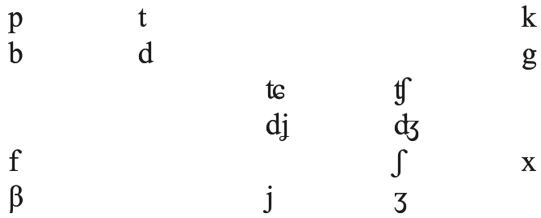

Origins:

<table>
<tr><td>PPAlb. *p</td><td><</td><td>PIE *<i>p</i> (<i>plotë</i> ‘full’, <i>pesë</i> ‘five’, <i>gjalpë</i> ‘butter’, <i>shtyp</i> ‘to press’, <i>[j]ep</i> ‘gives’, <i>pi</i> ‘to drink’)</td></tr>
<tr><td></td><td><</td><td>PIE *<i>b⁽ʰ⁾</i>/_# (<i>lyp</i> ‘to ask for’ < *<i>lub[h]-</i>)</td></tr>
<tr><td>PPAlb. *b</td><td><</td><td>PIE *<i>b⁽ʰ⁾</i> (<i>bie</i> ‘carries’, <i>gjerb</i> ‘to sip’, <i>bardhë</i> ‘white’, <i>blertë</i> ‘green’ < *<i>bʰloh1-ro</i>-?, <i>dhemb</i> ‘to hurt’ < *<i>g̑embʰ</i>-). The fate of *<i>b⁽ʰ⁾</i>/<i>V</i>_<i>V</i> is disputed: <i>det</i>, dial. <i>dēt</i> ‘sea’ is often explained as *<i>deub-eto-</i> ‘depth’, but this is basically a guess. Schumacher (2013: 233) also rejects the etymology.</td></tr>
<tr><td>PPAlb. *t</td><td><</td><td>PIE *<i>t</i> (<i>motër</i> ‘sister’, <i>vit</i> ‘year’, <i>mot</i> ‘time’, <i>tre</i> ‘three’)</td></tr>
<tr><td>PPAlb. *d</td><td><</td><td>PIE *<i>d⁽ʰ⁾</i>/#_, <i>n_</i> (<i>dy</i> ‘two’, <i>darkë</i> ‘evening meal’, <i>derë</i> ‘door’, <i>djeg</i> ‘to burn’, <i>d[ë]-</i> ‘apart, away’ < *<i>dwi</i>-; <i>bind</i> ‘to convince’ < *<i>bʰi-n-dʰ</i>-).</td></tr>
<tr><td></td><td><</td><td>PIE *<i>g̑ ʰ</i>/#_ (<i>dorë</i> ‘hand’ < *<i>g̑ ʰesr</i>-, <i>dimër</i> ‘winter’, <i>derr</i> ‘pig’)</td></tr>
<tr><td></td><td><</td><td>PIE *<i>su̯</i>/_<i>V</i>[+stress] (<i>diell</i> ‘sun’ < *<i>su̯él-</i>, <i>dergjem</i> ‘am ill’ < *<i>su̯órgʰ-</i>, <i>dirsë</i> ‘sweat’)</td></tr>
<tr><td>PPAlb. *k</td><td><</td><td>PIE */_<i>R</i> (<i>quaj</i> ‘to call’ [√<i>leu̯</i>], <i>mjekër</i> ‘beard’)</td></tr>
<tr><td></td><td><</td><td>PIE *<i>k</i> (<i>kohë</i> ‘time’, <i>nduk</i> ‘to pinch’ < *<i>-duk-</i>, <i>kap</i> ‘to grab’)</td></tr>
<tr><td></td><td><</td><td>PIE *<i>kʷ</i>/_<i>C</i>,<i>a</i>,<i>o</i>,<i>u</i>,<i>#</i> (<i>kush</i> ‘who’, <i>pjek</i> ‘to bake’, <i>ujk</i> ‘wolf’, <i>ndjek</i> ‘to follow’, <i>krimb</i> ‘worm’, <i>kam</i>, <i>ka</i> ‘to have’)</td></tr>
<tr><td>PPAlb. *g</td><td><</td><td>PIE *<i>g̑</i>/_R (<i>gju</i>, OAlb. <i>glu</i> ‘knee’)</td></tr>
<tr><td></td><td><</td><td>PIE *<i>g̑ ʰ</i>/<i>n</i>_ (<i>ankth</i> ‘nightmare’)</td></tr>
<tr><td></td><td><</td><td>PIE *<i>g⁽ʰ⁾</i> (<i>gardh</i> ‘fence’, <i>ag</i> ‘dawn’, <i>lig</i> ‘weak, ill’, <i>shteg</i> ‘path’)</td></tr>
</table>

<table>
<tr><td></td><td><</td><td>PIE *<i>gʷ⁽ʰ⁾</i>/_<i>C</i>,<i>a</i>,<i>o</i>,<i>u</i>,<i>#</i> (<i>ngroh</i> ‘to warm’ < *<i>n-gʷʰreh1-</i>, <i>djeg</i> ‘to burn’, <i>gur</i> ‘stone’)</td></tr>
<tr><td>PPAlb. *ʨ</td><td><</td><td>PIE *(<i>thom</i> ‘I say’ < <i>*k̑eh₁s-</i>, <i>thërí</i> ‘nit’, <i>athët</i> ‘bitter’, <i>thjerr[ë]</i> ‘lentil’)</td></tr>
<tr><td></td><td><</td><td>PIE *<i>s</i> (dissimilation before <i>-Vs-</i>: <i>thi</i> ‘pig’ < *<i>suHs</i>, <i>thaj</i> ‘to dry’ < *<i>sou̯s-</i>)</td></tr>
<tr><td>PPAlb. *dʝ</td><td><</td><td>PIE *<i>g̑</i> (<i>dhëmb</i> ‘tooth’, <i>dhëndër</i> ‘son-in-law’, <i>edh</i> ‘goat’, <i>mbledh</i> ‘to collect’, <i>madh</i> ‘big’; <i>dhallë</i> ‘buttermilk’?)</td></tr>
<tr><td></td><td><</td><td>PIE *-<i>g̑ ʰ</i>- (<i>udhë</i> ‘road’, <i>erdh</i> ‘s/he came’, <i>vjedh</i> ‘to steal’)</td></tr>
<tr><td></td><td><</td><td>PIE *<i>dʰg̑ ʰ</i>- (<i>dhe</i> ‘earth’)</td></tr>
<tr><td>PPAlb. *ʧ</td><td><</td><td>PIE *<i>ti̯</i> (<i>mas</i>/<i>t</i> ‘to measure’, <i>flas</i>/<i>flet</i> ‘to speak’, etc.; <i>sot</i> ‘today’, <i>sonte</i> ‘tonight’, <i>sivjet</i> ‘this year’ < *<i>tio-</i>, abl. pl. <i>kë-si</i>, <i>kë-so</i> ‘these [m., f.]’ < -<i>ti-</i>; cf. Kortlandt 1987: 223)</td></tr>
<tr><td></td><td><</td><td>PIE *<i>k⁽ʷ⁾</i>/_ <i>i̯</i>, <i>i</i>, <i>ī</i>, <i>e</i>, <i>ē</i> (<i>sjell</i> ‘to bring’ < *<i>kʷel</i>-, <i>sy</i> ‘eye’, <i>si</i> ‘how’ < <i>*kʷ</i>ih₁, <i>pesë</i> ‘five’, <i>ndër-sej</i> ‘to set on, incite’ <<i>*</i> -<i>kʷi̯eu-</i>, <i>sorrë</i> ‘crow’ < *<i>k̑u̯ērn</i>-?)</td></tr>
<tr><td></td><td><</td><td>PIE *<i>Tt</i> (<i>pasë</i> ‘had’ < *<i>pot-to-</i>?)</td></tr>
<tr><td>PPAlb. *ʤ</td><td><</td><td>PIE *<i>di̯</i>, *<i>dʰi̯</i> (<i>zot</i> ‘lord’ < <i>di̯ēu</i>-?, pl. suffix -<i>z-</i>)</td></tr>
<tr><td></td><td><</td><td>PIE *<i>g⁽ʷ⁾⁽ʰ⁾</i>/_ <i>i̯</i>, <i>i</i>, <i>ī</i>, <i>e</i>, <i>ē</i>? (<i>zjarm</i> ‘fire’ < *<i>gʷʰermo</i>-, <i>ndez</i> ‘to light a fire’ < <i>-dʰogʷʰei̯e-</i>, <i>ziej</i> ‘to boil’)</td></tr>
<tr><td></td><td><</td><td>PIE *<i>g̑ʰu̯</i>- (<i>zë</i> / <i>zã</i> ‘sound, voice’ < *<i>g̑ʰu̯on</i>-)</td></tr>
<tr><td>PPAlb. *f</td><td><</td><td>PIE *<i>sp-</i> (<i>farë</i> ‘seed’ < *<i>spor-</i>, <i>fjalë</i> ‘word’ < *<i>spel-n-</i>)</td></tr>
<tr><td></td><td><</td><td>PIE *<i>p</i> / <i>t_V</i> (<i>ftoh</i> ‘to cool down’ < *<i>t[e]peh₁-</i>)</td></tr>
<tr><td>PPAlb. *β</td><td><</td><td>PIE *<i>u̯</i> (<i>vesh</i> ‘to put on’, <i>vjerr</i> ‘to hang’, <i>gjallë</i> ‘alive’ < PPAlb. *<i>ʒalβo</i>-)</td></tr>
<tr><td></td><td><</td><td>PIE *<i>su̯-</i>/_<i>V</i>[−stress]? (<i>vetë</i> ‘self’, <i>vjehërr</i> ‘father-in-law’, <i>vëlla</i> ‘brother’ < *<i>su̯e-loudʰ-</i>?)</td></tr>
<tr><td>PPAlb. *ʃ</td><td><</td><td>PIE *<i>s-</i>/_V[−stress], <i>V</i>_<i>V</i> (<i>shi</i> ‘rain’, <i>mish</i> ‘meat’, <i>vesh</i> ‘ear’, <i>dhashë</i> ‘I gave’) (The development of PIE single <i>*s</i> in Albanian is much disputed. The interpretation given here is based on Kortlandt 1987. An extensive discussion, with partly different views, is provided by Schumacher 2013: 258−265.)</td></tr>
<tr><td></td><td><</td><td>PIE *<i>s</i>/_<i>T</i> (<i>shtrij</i> ‘to spread’, <i>shtatë</i> ‘seven’, <i>asht</i> ‘bone’)</td></tr>
<tr><td></td><td><</td><td>PIE *<i>ks</i>/_<i>t</i> (<i>jashtë</i> ‘outside’, <i>gjashtë</i> ‘six’)</td></tr>
<tr><td>PPAlb. *ʒ</td><td><</td><td>PIE *<i>s-</i>/_<i>V</i>[+stress] (<i>gjak</i> ‘blood’ < *<i>sókʷos</i>, <i>gjalpë</i> ‘butter’ < *<i>sélpos-</i>, <i>gjerb</i> ‘to sip’ < *<i>sórbʰ-ei̯e-</i>, <i>gjumë</i> ‘sleep’ < *<i>súpnom</i>)</td></tr>
<tr><td>PPAlb. *x</td><td><</td><td>PIE *<i>sk</i> (<i>njeh</i> ‘knows’, <i>hie</i> ‘shade’, <i>hënë</i> ‘moon’ < *<i>skond-</i>)</td></tr>
<tr><td>PPAlb. *j</td><td><</td><td>PIE *<i>i̯</i>-</td></tr>
<tr><td>PPAlb. zero</td><td><</td><td>PIE *<i>i̯</i>/ <i>V</i>_<i>V</i> (<i>as</i> ‘not’ < *<i>h₂oi̯u-kʷid</i>, <i>tre</i> ‘three’ [m.] < *<i>trei̯es</i>)</td></tr>
<tr><td></td><td><</td><td>PIE *<i>u̯</i>/ <i>V</i>_<i>V</i> (<i>ve</i> ‘widow’ < <i>*h₁u̯idʰh₁</i>eu̯eh₂)</td></tr>
<tr><td></td><td><</td><td>PIE *<i>T</i>/_<i>t</i> (<i>shtatë</i> < *<i>septm̥ [to-]</i>, <i>tetë</i> < *<i>Hok̑toH</i>, <i>natë</i> < *<i>nokʷt</i>-)</td></tr>
<tr><td></td><td><</td><td>PIE *<i>H</i>/_<i>V</i> (Kortlandt 1998 has suggested that *<i>h₂</i>/<i>3e</i>- yield Alb. <i>ha-</i>; but <i>h-</i> has arisen secondarily in words such as <i>hark</i> ‘curve’ ← Lat. <i>arcus</i>,</td></tr>
<tr><td></td><td></td><td>which renders <i>h-</i> non-probative; cf. Schumacher 2013: 267)</td></tr>
<tr><td></td><td><</td><td>PIE *<i>s</i>/_<i>l</i>,<i>m</i>,<i>n</i>,<i>r</i> (<i>[h]yll</i> ‘star’, <i>mjekër</i> ‘beard’, <i>thënë</i> ‘said’, <i>dorë</i> ‘hand’)</td></tr>
</table>

<!-- source-file: content/09_chapter03_3.xhtml -->

## 5. Accent

The synchronic accentuation of Albanian is described as preferring penultimate stress (Buchholz and Fiedler 1987: 53) or as stressing “the last non-reduced vowel of the word-formative stem” (Topalli 1995: 433). By non-reduced vowels are meant all vowels but <i>ë</i>. Topalli’s formulation more correctly predicts most of the extant forms and allows the inclusion of end-stressed forms such as f. nouns in -<i>í</i>, def. -<i>ía</i>, present stems with stress on the suffix such as <i>punón</i> ‘works’, <i>përkét</i> ‘belongs’, and nouns and adjectives in a stressed suffix: -<i>tór</i>, <i>-tár</i>, <i>-sór</i>, -<i>úes</i>, etc. Albanian usually shows no paradigmatic shift in the place of the stress in inflection or conjugation.

Latin loanwords retain the accent on the same syllable as in Classical Latin, and the same goes for loanwords from later layers of borrowing, such as from South Slavic, Italian, Middle and Modern Greek, and Turkish. This probably implies that the ancestor of Albanian around the Roman Era allowed the stress to fall on the penultimate or antepenultimate syllable of a word; but the stress system of PPAlb. may of course have been more complicated. If the system of stressing the last predesinential syllable of the stem was in place in the Roman Era, the Latin loanwords must have been incorporated into this system. This would have been facilitated by the fact that in many Latin words the stress fell on the last syllable before the ending (<i>-us</i>, <i>-a</i>, <i>-i</i>, etc.) − which came to be identified with existing PPAlb. endings − or on the penultimate syllable before the ending − often causing the last stem-syllable to develop to <i>ë</i> in Albanian. The present stems of Latin verbs, too, have been incorporated into existing Albanian verb patterns, viz. mainly into suffix-stressed conjugations (Bonnet 1998: 297 f.). Even if the long vowels of the Latin conjugations in <i>-ā-</i>, <i>-ē-</i>, <i>-ī-</i> were unstressed in many persons of many tense forms, they were apparently characteristic enough to be associated with suffix-stressed Albanian conjugations (Bonnet 1998: 302).

Opinions differ on the place of the accent in the period preceding contact with the Romans. Jokl (1923: 7) assumes a general penultimate accent in PPAlb., but there are too many counterexamples for this to have been the case (see Matzinger 2006). Orel (2000: 20−23, 123−138) reconstructs barytone and mobile/oxytone nouns on the basis of the nominal endings of the plural (<i>-a</i>, <i>-e</i>, <i>-ë</i>, <i>zero</i>), which would be due to development under stress. Yet the latter assumption is unwarranted, and the plural endings may be explained differently. If we start counting at the beginning of the word, we can say that the large majority of the (possibly) inherited Albanian words have initial stress, especially words which were probably disyllabic in PPAlb. (thus also Matzinger 2006: 64).

There is one main category of exceptions to the generally columnar accent of Albanian paradigms: a number of nouns and adjectives which show a stressed ending or suffix in the plural. Examples are <i>dhë́ndër</i> ‘son-in-law, bridegroom’ − pl. <i>dhëndúre</i>, <i>kopsht</i> ‘garden’ − (dial.) pl. <i>kopshtínje</i>, <i>lúmë</i> ‘river’ − pl. <i>luménj</i>, <i>i madh</i> ‘big’ − pl. <i>të mëdhénj</i>, <i>i keq</i> ‘bad’ − pl. <i>të këqíj</i>, <i>gjarpër</i> ‘snake’ − pl. <i>gjarp(ër)ínj</i>, <i>(t)jetër</i> ‘other’ − pl. <i>(të) tjerë</i> ‘(the) others’. Since this group mainly contains inherited words (or, at least, words from a pre-Latin layer), some of which show vowel weakening in the initial syllable (<i>mëdhénj</i>, <i>këqíj</i>, <i>tjérë</i>), they may be survivals of plural forms with a stressed root in the singular and a stressed suffix in the plural. To this group of suffix-stressed plural forms we may add those present suffixes which probably go back to pre-Latin conjugations of Albanian: stems in *-<i>(i)ā</i>/<i>ēnj-</i>, <i>*-anj-</i>, <i>*-enj-</i>, <i>*-ī nj-</i>, and *-<i>atj-</i>. Both groups may be due to a rightward shift of the stress from the prevailing word-initial position to the nominal or verbal suffix. The cause would probably have been a phonetic one: an original long vowel in these suffixes, their original intonational quality, or the presence of an extra syllable to their right. It is striking that the large majority of these suffixes have the structure *-<i>V(:)n</i>-, and that all of them end in *-<i>tj</i>- or *-<i>nj</i>-.
