# 96. The morphology of Albanian

1.Preliminaries

2.Nominal morphology

3.Verbal morphology

4.References

## 1. Preliminaries

The morphology of Albanian as presented in the following chapter is exclusively based on the evidence of Old Albanian, more precisely on that of its Old Geg dialect. After all, the bulk of the oldest literary documents of Albanian, the books of Buzuku (1555), Budi (around 1620) and Bogdani (1685) were written in Old Geg, whereas the only Old Tosk book, the catechism of Matrënga (1592), is much shorter than any of the aforementioned three. However, this bias in favor of Old Geg is unproblematic, since Old Geg and Old Tosk, although they differ phonologically and syntactically, have very similar morphologies. Examples are usually taken from Buzuku, but supplementary examples from other authors are indicated in brackets, e.g. [Budi]. All examples provided have been tacitly transcribed into modern orthography, and readers should therefore be aware that they are presented with interpretations of differing and altogether deficient orthographies. While the Old Geg consonant system was virtually identical with the modern system (and can thus be rendered using the modern orthography), it had a much richer vowel system than the Modern Standard language. The additional vowel phonemes and the graphic representations we use are /a:/ = 〈ā〉, /e:/ = 〈ē〉, /i:/ = 〈ī〉, /o:/ = 〈ō〉, /u:/ = 〈ū〉, /y:/ = 〈ȳ〉, /ã/ = 〈â〉, /ẽ/ = 〈ê〉, /ĩ/ = 〈î〉, /ũ/ = 〈û〉, /ỹ/ = 〈ŷ〉, /ã:/ = 〈ã〉, /ẽ:/ = 〈ẽ〉, /ĩ:/ = 〈ĩ〉, /ũ:/ = 〈ũ〉, /ỹ:/ = 〈ỹ〉. Furthermore, the so-called articulated adjectives (cf. 2.2) are cited with a preceding <i>(i)</i>, e.g. <i>(i) mirë</i> ‘good’. And verbs are cited in the 3sg pres. ind. act., e.g. <i>ban</i> (only deponents are cited in the 3sg pres. ind. mid., e.g. <i>gjegjetë</i>). With the exception of 3.1, such citations are glossed with English prepositionless infinitives, e.g. <i>ban</i> ‘do’, because the infinitive is the appropriate citation form in English.

## 2. Nominal morphology

An up-to-date diachronic investigation of the Old Albanian nominal system as a whole or in its parts is still in its early stages (for a first attempt, see Matzinger 2006: 93−107; the most recent treatment in Albanian is Topalli 2011: 165−695). For the nominal system of Tosk-based Modern Standard Albanian, see Newmark, Hubbard, and Prifti (1982: 120−178) and Buchholz and Fiedler (1987: 202−274).

### 2.1. Nouns

Old Albanian nouns are characterized by the categories of number, gender, and case. The category of number distinguishes between singular and plural, the PIE dual having been abandoned completely (its only remnants are the nominatives of the numeral ‘two’, m. <i>dy</i>, f./n. <i>dȳ</i>, see 2.4). Fritz (2011) argues for some remnants of PIE nominal dual forms, but due to massive changes in old final syllables, this cannot be proven. The PIE three-gender system is still preserved, e.g. <i>gjumë</i> m. ‘sleep’ (< *<i>súpnos</i>, cf. Gk. ὕπνος), <i>farë</i> f. ‘seed’ (< *<i>sporáh₂</i>, cf. Gk. σπορά), <i>ujë</i> n. ‘water’ (< a Proto-Albanian reshaped form *<i>uda</i>/<i>udan</i>, cf. Gk. ὕδωρ). On a synchronic level, there is no convenient rule to predict a noun’s gender; gender is therefore inherent in the noun (cf. the examples given above, all ending in <i>-ë</i>; for some handy rules to distinguish gender in Modern Standard Albanian, see Newmark, Hubbard, and Prifti 1982: 131−132). The neuter gender is still vital in Old Albanian, even with animate nouns, cf. nom. sg. def. <i>djalë-të</i> ‘the boy’. However, from the oldest sources onward, neuters are being converted into masculines, as in nom. sg. def. <i>djal-i</i>, a by-form already found in Buzuku. In Modern Standard Albanian, the neuter gender has been restricted to substantivized participles and adjectives (see Newmark, Hubbard, and Prifti 1982: 133−134; Buchholz and Fiedler 1987: 209−211). In some instances, we find gender changes between singular and plural: while the singular is masculine, the plural is feminine (this gender shift − labeled <i>Heterogenie</i> in the terminology of German Albanology and <i>ambigjeni</i> in the Albanian literature − is associated with certain plural morphemes, such as <i>-e</i>, cf. nom. sg. m. <i>kȳ mundim</i> ‘this pain’ vs. abl. pl. f. <i>ën së idhunashit mundime</i> ‘from the bitter pains’; a similar phenomenon can be observed in Rumanian). Old Albanian has five cases: (i) nominative (< PIE nom.), (ii) a case indicating both possession and the indirect object (but see 2.3.1), here labeled “genitive-dative” (< PIE gen.), (iii) accusative (< PIE acc.), (iv) ablative (< PIE gen. in the sg., and < PIE locative in the pl.), (v) instrumental (< PIE inst.); this case appears often after prepositions such as <i>ëmbë</i> ‘on’, which is why it is also called prepositional or locative. There is no overtly marked vocative case in Albanian, the nominative being used instead (often with interjections such as <i>o</i>, cf. <i>o zot</i> ‘o Lord’). In Modern Standard Albanian, the instrumental has been abandoned, and its functions were taken over either by the accusative or the ablative. A peculiarity of Albanian is the fact that the nominative can be governed by certain prepositions, e.g. <i>tek</i> ‘at/ to the location of’, cf. <i>dërgoi shërbëtorëtë e tī tek punëtorëtë</i> ‘he sent his servants to the husbandmen’. This can be explained from the fact that <i>tek</i> originally introduced relative clauses (Proto-Albanian *<i>tō ku</i> ‘there where’); if the verb of the relative clause was a form of ‘to be’, it could be deleted, thus creating a nominal relative clause that was then reinterpreted as a prepositional phrase.

Albanian nouns and noun phrases are either indefinite or definite; indefinite singular forms are usually marked by the indefinite article <i>një</i> (< ‘one’, see 2.4), which is always preposed, cf. <i>hinje se një virgjënë të zanë e të parturonjë një bīr</i> ‘behold, a virgin shall conceive and bear a son’; indefinite plural forms are unmarked. On the other hand, definiteness is marked by the definite article (< PIE *<i>so-</i>/<i>to-</i>), which is always postposed. The definite article is inflected for gender, case, and number (cf. for the nom. sg. m. <i>-i</i>/<i>-u</i> < *<i>-hʉh</i> [on the vowel <i>ʉ</i>, an intermediate stage in the special development of *o in the *<i>o</i>-stem endings *-<i>os</i> and *-<i>osi̯o</i>, cf. Schumacher and Matzinger 2013: 213], f. <i>-a</i> < *<i>-hā</i>, n. <i>-të</i> < *<i>-tad</i>, pl. of all genders <i>-të</i> < *<i>-tai̯</i>, *<i>-tāh</i>, *<i>-tā</i>). It is always attached to the first element of the noun phrase and is added both to appellatives and to proper nouns: <i>e Jakob-i leu Jozef-në, burrë-në e Mërī-së</i> ‘and Jacob begat Joseph, the husband of Mary’; for an attempt at a diachronic explanation of the forms of the definite article, see Matzinger (2006: 95−96); here, this account has been updated according to the historical phonology adopted by Schumacher and Matzinger (2013: 205−276).

In Old Albanian noun inflection, PIE accent/ablaut classes are not continued. The PIE system was first replaced by a stem class system (<i>a</i>-stems, <i>ā</i>-stems, <i>i</i>-stems, etc.; cf. Klingenschmitt 1994: 223−225), which in a later development was replaced by a uniform inflection with two sets of endings, one for masculines and neuters, the other for feminines (the endings actually continuing PIE <i>o-</i> and <i>ā</i>-stem endings). Consonantstem forms are occasionally reflected by plurals, e.g. nom. pl. <i>net</i> ‘nights’ < *<i>nokᵘ̯t-es</i> (see below). In the singular, PIE feminine consonant stems were regularly remodeled to <i>ā</i>-stems by proportional analogy, which can be demonstrated using the forms of the Proto-Albanian <i>ā</i>-stem *<i>pʰarā</i> ‘seed’ (> Old Albanian <i>farë</i>) and the original consonant stem *<i>nakt-</i> ‘night’: acc. sg. *<i>pʰar-an</i>: nom. sg. *<i>pʰar-ā</i> = acc. sg. *<i>nakt-an</i> (< PIE *<i>nokᵘ̯t-m̥</i>): nom. sg. <i>X</i> ⇒ *<i>nakt-ā</i> (> Old Albanian <i>natë</i> ‘night’).

Every Albanian noun has two stems (a singular stem and a plural stem), to which the respective case endings are attached. The formation of the plural stem is complex (for Modern Standard Albanian, see Fiedler 2007). Basically, there are at least eight different ways of deriving the plural stem: (i) zero plural, i.e. both stems are identical (e.g. sg. <i>farë</i> ‘seed’ − pl. <i>farë</i>; sg. <i>lule</i> ‘flower’ − pl. <i>lule</i> [Bogdani]); (ii) vowel change (e.g. sg. <i>anë</i> ‘direction’ − pl. <i>enë</i>); (iii) vowel change plus deletion of a final vowel (e.g. sg. <i>natë</i> ‘night’ − pl. <i>net</i>); (iv) palatalization (e.g. sg. <i>zog</i> ‘bird’ − pl. <i>zogj</i>); (v) a combination of vowel change and palatalization (e.g. sg. <i>plak</i> ‘old man’ − pl. <i>pleq</i>); (vi) addition of a plural ending (e.g. sg. <i>prift</i> ‘priest’ − pl. <i>priftënë</i>); (vii) a combination of vowel change and the addition of a plural ending (e.g. sg. <i>ashtë</i> ‘bone’ − pl. <i>eshtëna</i>); (viii) a combination of vowel change, palatalization and the addition of a plural ending (e.g. sg. <i>breg</i> ‘river bank’ − pl. <i>brigje</i> [Bogdani]). In rare cases, plural formation is accompanied by rightward accent shift (e.g. <i>gjárpënë</i> ‘snake’ − pl. <i>gjërpánjë</i>). There are also plurals that do not match these patterns (e.g. sg. <i>gruo</i> ‘woman’ − pl. <i>grā</i>; sg. <i>njerī´</i> ‘person’ − pl. <i>njérëz</i>, with leftward accent shift), and a few suppletive plurals, e.g. sg. <i>vend</i> ‘place’ − pl. <i>vise</i>. Patterns (i)−(v) reflect various PIE plural nominatives, e.g. <i>farë</i> < PIE *<i>sporah₂as</i>; <i>net</i> < PIE *<i>nokᵘ̯t-es</i>. In masculines, umlaut and palatalization of the final consonant reflect PIE pronominal *<i>-oi̯</i> > Proto-Albanian *<i>-ai</i> > *<i>-i</i>, as in <i>pleq</i> < Proto-Albanian *<i>plak-ai</i>. The endings occurring in patterns (v)−(viii) also reflect PIE plural nominatives, e.g. <i>-ënë</i> < PIE *<i>-e</i>/<i>on-es</i>, <i>-e</i> < PIE *<i>-e</i>/<i>ou̯-es</i> (for their prehistory see Matzinger 2006: 101−103, and Matzinger 2007).

Tab. 96.1: Paradigm of the indefinite masculine/neuter inflection.

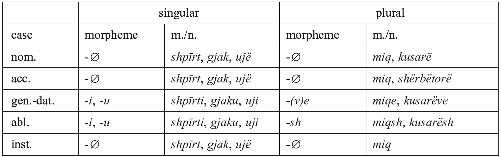

Tab. 96.2: Paradigm of the definite masculine/neuter inflection, i.e. with postposed definite article.

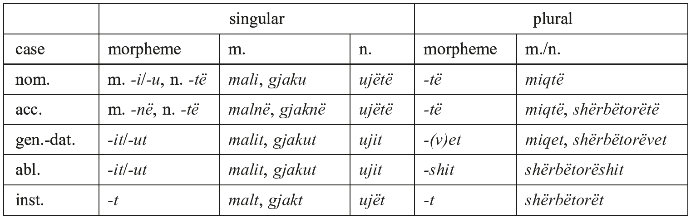

Tab. 96.3: Paradigm of the indefinite feminine inflection.

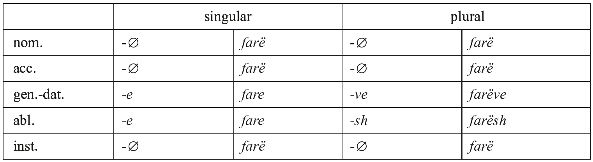

Example: <i>farë</i> (plural stem <i>farë</i>) ‘seed’.  Note that when endings are attached to the singular stem a final <i>-ë</i> is dropped, hence e. g. gen.-dat. <i>far-e</i> to the nom. <i>farë</i>.

Tab. 96.4: Paradigm of the definite feminine inflection, i.e. with postposed definite article.

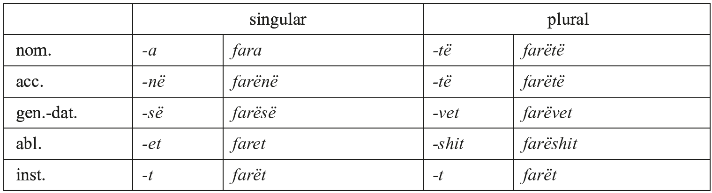

Note that in the nom. sg. the def. article <i>-a</i> replaces a final <i>-ë</i>, similarly abl. sg. <i>-et</i>.

Tab. 96.5: Singular paradigm of the feminine <i>qytet</i> inflection.

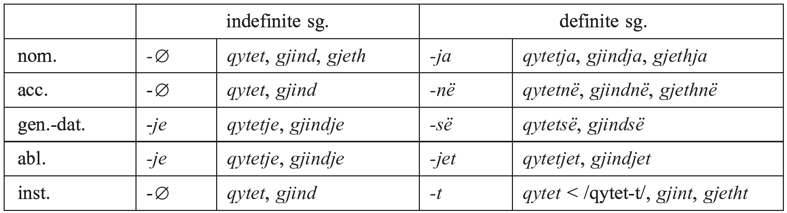

Examples: <i>qytet</i> ‘town’, <i>gjind</i> ‘folk’ (< Lat. nom. sg. *<i>gentis</i>), <i>gjeth</i> ‘leaf, foliage’ (< PIE *<i>gu̯osdis</i>).

All examples in the tables are taken from Old Geg authors: <i>shpīrt</i> ‘spirit’, <i>gjak</i> ‘blood’, <i>mal</i> ‘mountain’, <i>mik</i> (plural stem <i>miq</i>) ‘friend’, <i>kusār</i> (plural stem <i>kusarë</i>) ‘thief’, <i>shërbëtuor</i> (plural stem <i>shërbëtorë</i>) ‘servant’. For the neuter, <i>ujë</i> ‘water’.

Note that when endings are attached to the singular stem a final <i>-ë</i> is dropped, hence e.g. gen.-dat. <i>uj-i</i> to the nom. <i>ujë</i>. In the plural, the gen.-dat. ending is <i>-ve</i> only if the plural stem ends in a vowel. The same applies to the corresponding definite <i>-(v)et</i>.

For the masculine/neuter inflection, see Tables 96.1, 96.2. For the predominant feminine inflection, see Tables 96.3, 96.4. There are also feminines with indefinite singular nominatives in <i>-e</i> and in <i>-ī</i>. Apart from that, there are also feminine nouns with a consonantal final, which go back to PIE and Proto-Albanian <i>i</i>-stems (e.g. <i>Mat</i>, the name of a central Albanian highland, attested in antiquity as <i>Mathis</i> < *<i>mn̥-ti-</i>, cf. Lat. <i>mōns</i>) as well as to loanwords from Latin (e.g. <i>qytet</i> ‘town’ < Lat. nom. sg. *<i>cīvitātis</i>, reshaped from classical <i>cīvitās</i>); see Klingenschmitt (2004: 225), for a list see Topalli (2011: 332− 334).

The original <i>i</i>-stem inflection is reflected by the ending of the definite nom. sg. <i>-ja</i> < *°<i>i</i> +<i>a</i> and evidenced by umlaut <i>e</i> < *<i>a</i> (<i>-tet</i> < Proto-Albanian *<i>-tatih</i>; <i>gjeth</i> < *<i>gadih</i> < PIE *<i>gu̯osdis</i>). In Modern Standard Albanian, these nouns have become masculines, hence nom. sg. <i>qyteti</i>.

### 2.2. Adjectives and adverbs

There are two classes of adjectives in Albanian: (i) the so-called articulated adjectives, which bear an inflected proclitic element that, like the definite article, goes back to PIE *<i>so-</i>/<i>to-</i> (and is often called an “adjective article”) but has nothing to do with definiteness and is a mere word-class marker, e.g. <i>(i) mirë</i> ‘good’; (ii) the non-articulated adjectives, which closely resemble nouns; many adjectives of this class are overtly derived, e.g. <i>kurv-ār</i> ‘adulterous’ from <i>kurvë</i> ‘whore’. On the adjective system of Modern Standard Albanian, see Newmark, Hubbard, and Prifti (1982: 179−209) and Buchholz and Fiedler (1987: 314−348).

The inflection of adjectives differs from the inflection of nouns in various ways. With articulated adjectives, the proclitic element is fully marked for gender, case, and number, e.g. nom. sg. m. <i>shërbëtori i mirë</i> ‘the good servant’, nom. sg. f. <i>pema e mirë</i> ‘the good fruit’ [Budi], nom. sg. n. <i>drithë të mirë</i> ‘good grain’, acc. sg. f. <i>venënë e mirë</i> ‘the good wine’, acc. pl. f. <i>ditë e mira</i> ‘the good days’ (cf. Newmark, Hubbard, and Prifti 1982: 181). However, the adjectives themselves are not marked for case (except if they are attributive adjectives preceding the noun they qualify; see below); they can only be marked for number, as in <i>ditë e mira</i> (with plural marker /-a/ in <i>mira</i>), and some (such as <i>[i] madh</i> ‘big, great’) are also marked for gender, e.g. nom. sg. m. <i>njerī i madh</i> ‘a great man’, nom. sg. f. <i>qytet e madhe</i> ‘a big town’, nom. pl. m. <i>njerëz të mëdhenj</i> ‘great men’ [Budi], acc. pl. f. <i>kafshë të mëdhā</i> ‘great things’. Non-articulated adjectives are marked for gender, e.g. nom. sg. m. <i>engjëlli shtrazëtār</i> ‘the guardian angel’ [Bogdani] vs. nom. sg. f. <i>fara kurvare</i> ‘the adulterous generation’ (with feminine ending <i>-e</i>), and partly for number, e.g. nom. pl. m. <i>engjītë shtrazëtarë</i> ‘the guardian angels’ [Budi].

The aforementioned rules apply to predicative adjectives as well as to attributive adjectives following the noun they qualify. If, however, an attributive adjective precedes its referent, it is fully inflected (including the postposed article, if the noun phrase is definite), while the following noun is only marked for number but not otherwise inflected. Even in this context, articulated adjectives retain their prefix, which is fully inflected, e.g. nom. sg. f. indef. <i>një e madhe ushtërī</i> ‘a big army’, nom. sg. m. def. <i>i madhi zot</i> ‘the Great Lord’, nom. pl. m. def. <i>të mëdhejntë priftënë</i> ‘the chief priests’. Substantivized articulated adjectives are also inflected this way, e.g. inst. pl. m. def. <i>përëmbī të mirët e përëmbī të këqīt</i> ‘on the just and on the unjust’ (<i>të mirë</i>, pl. m. of <i>i mirë</i> ‘good’; <i>të këqī</i>, pl. m. of <i>i keq</i> ‘bad’). By contrast, non-articulated adjectives inflect exactly like nouns, e.g. nom. pl. def. <i>shenjtitë patriarkë</i> ‘the Holy Patriarchs’; in their substantivized form, they are indistinguishable from nouns, e.g. nom. pl. m. def. <i>shenjtitë</i> ‘the Saints’.

Gradation of adjectives is expressed analytically using the particle <i>mã</i> ‘more’ (< Proto-Albanian *<i>maihana-</i>, cf. Proto-Germanic *<i>maizan-</i> ‘more’). In the comparative, <i>mã</i> is simply placed in front of the adjective, e.g. <i>mã i madh</i> ‘bigger, greater’. The reference term to which comparison is made is introduced by the particle <i>se</i>, e.g. <i>a mundë jēsh ti mã i madh se përindi ynë Abraami</i> ‘can you be greater than our father Abraham?’ The superlative is distinguished from the comparative by the fact that the adjective itself always bears the postposed definite article, e.g. <i>E kȳ anshtë i pari e mã i madhi ordhënë</i> ‘and this is the first and the greatest commandment’; <i>Mjeshtrë i silli anshtë ordhëni i ligjsë mã i madhi?</i> ‘Master, which is the greatest commandment of the Law?’

When forming adverbs, articulated adjectives simply drop the proclitic element, e.g. <i>hinje sā mirë e desh</i> ‘behold how well he loved him’. Gradation of adverbs is also expressed by <i>mã</i>, cf. <i>a më do mã mirë se këta</i> ‘do you love me more than these?’ There are no adverbial superlatives.

### 2.3. Pronouns

Due to limitations of space, only a selection of pronouns can be given here. For a thorough presentation of the Modern Standard Albanian pronominal system, see Newmark, Hubbard, and Prifti (1982: 261−288) and Buchholz and Fiedler (1987: 274−314).

#### 2.3.1. Personal pronouns

The Old Albanian personal pronouns of the first and second persons continue the respective PIE pronouns. Here, reconstructions are given wherever the development is straightforward:

Tab. 96.6: Personal pronouns of the first and second person.

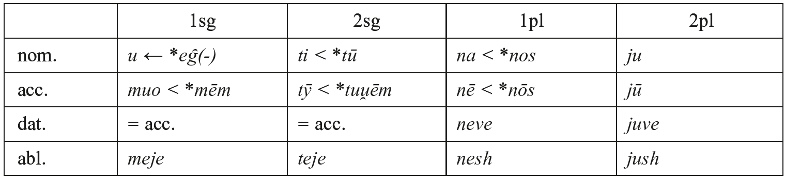

There is no genitive; possession is expressed by possessive pronouns (see 2.3.3). In the singular, the indirect object is expressed by the accusative, and in the plural by a case of its own, which is here labeled ‘dative’, because it can only be used for the indirect object but not for possession. The 1sg <i>u</i> continues Proto-Albanian *<i>uȷ´(-)</i> ← PIE *<i>eg̑(-)</i> with a vocalism reshaped after the 2sg (in other varieties of Albanian, an extended form <i>u-në</i> is used). The 2pl <i>ju</i> must go back to the same form as Old Avestan <i>yūš</i>, etc., but details are unclear. The forms of the abl. sg. and the dat. pl. have been created by analogy to the nominal inflection. A full diachronic discussion of the personal pronoun is found in Matzinger (1998); for the personal pronouns in Modern Standard Albanian, see Newmark, Hubbard, and Prifti (1982: 261−265) and Buchholz and Fiedler (1987: 274−281).

Furthermore, there is a reflexive pronoun, which has one shape for all persons of sg. and pl.: dat. <i>vetī</i>, acc. <i>vetëhenë</i>, abl. <i>vetëhej</i>. All forms can be reduplicated: <i>vetëvetī</i>, <i>vetëvetëhenë</i>, <i>vetëvetëhej</i>. Ultimately, this pronoun is based on the same pronominal stem as the reflexive pronouns of Latin, Germanic, etc., but details are unclear (it is clear, though, that <i>ve-</i> continues PIE *<i>su̯oi̯</i>-).

For reference to the 3sg and 3pl, Albanian uses the demonstrative pronoun <i>ai</i> (see 2.3.4).

#### 2.3.2. Object markers and the middle-voice marker

There are also pronominal elements which go back to enclitic pronouns. Their forms are 1sg <i>më</i> (< *<i>mē˘</i> and/or *<i>moi̯</i>), 2sg <i>të</i> (< *<i>tu̯ē˘</i> and/or *<i>tu̯oi̯</i>), 1pl <i>na</i> (< *<i>nos</i>), and 2pl <i>u</i> (< *<i>u̯os</i>). Additionally, there are third-person forms, namely 3sg dat. <i>i</i> (< *<i>[h₁]esi̯o</i> and *<i>[h₁]esi̯ah₂s</i>), 3sg acc. <i>e</i> (< Proto-Albanian *<i>ii̯an</i>, cf. Latin <i>eum</i>, <i>eam</i>), 3pl dat. <i>u</i> (< *<i>[h₁]ei̯soHom</i>), 3pl acc. <i>i</i> (< *<i>[h₁]īms</i>). As can be seen, these reflect various case forms of the PIE anaphoric pronoun *<i>(h₁)e-</i>/<i>(h₁)ei̯-</i>, which is otherwise lost in Albanian (cf. Matzinger 2006: 108−109). Usually all these elements are described as clitic oblique pronouns. However, they are always accentually bound to the verb and cannot be placed elsewhere in the sentence. Moreover, the first- and second-person forms often co-occur with the direct-object and indirect-object pronouns mentioned in 2.3.1, and the third-person forms equally often co-occur with demonstratives and nouns functioning as direct and indirect objects, e.g. <i>zot u tȳ të lus, ep-ja djalëtë e gjallë asaj</i> ‘Lord, I beg you, give her the living child’. Here, <i>të</i> co-occurs with the direct object <i>tȳ</i>, and <i>-ja</i> (< <i>i</i> + <i>e</i>) co-occurs with the direct object <i>djalëtë e gjallë</i> ‘the living child’ and the indirect object <i>asaj</i> ‘to her’. This phenomenon is often referred to as ‘clitic doubling’, but it is preferable to describe these pronominal elements as verbal affixes, i.e. as agreement markers belonging to the verb. In other words, Albanian has a polypersonal verb which optionally marks direct and indirect objects. Accordingly, we will henceforth use the term ‘object markers’ for these items.

Similarly, enclitic forms of the inherited reflexive pronoun have turned into the verbal affix <i>u</i> marking middle voice (<i>u</i> < *<i>su̯ē˘</i> and/or *<i>su̯oi̯</i>, see 3.3).

#### 2.3.3. Possessive pronouns

Old Albanian has fully inflected possessive pronouns for the first and second persons (the third-person possessives are genitives of the demonstrative pronoun <i>ai</i>, see 2.3.4). The singular possessive pronouns are univerbations of the preposed definite article and a possessive adjective: 1sg nom. sg. m. <i>em</i>, f. <i>eme</i>, n. <i>tem</i> (< *<i>hʉh-</i>/<i>hā-</i>/<i>tad-</i> + *<i>mii̯a-</i>, cf. Lat. <i>meus</i>); 2sg nom. sg. m. <i>yt</i>, f. <i>jote</i>, n. <i>tat</i> (< *<i>hʉh-</i>/<i>hā-</i>/<i>tad-</i> + *<i>tV-</i>; the vocalism of the possessive adjective proper is difficult to reconstruct). By contrast, in the plural possessive pronouns the preposed definite article is univerbated with enclitic pronouns: 1pl nom. sg. m. <i>ynë</i>, f. <i>jonë</i>, n. <i>tanë</i> (< *<i>hʉh-</i>/<i>hā-</i>/<i>tad-</i> + *<i>nah</i>); 2pl nom. sg. m. <i>ȳj</i>, f. <i>juoj</i>, n. <i>tāj</i> ‘your’ (< *<i>hʉh-</i>/<i>hā-</i>/<i>tad-</i> + *<i>i̯uh</i>). As can be guessed, the underlying 1pl enclitic *<i>nah</i> directly continues PIE *<i>nos</i>, while the shape of underlying 2pl enclitic *<i>i̯uh</i> was heavily influenced by the nominative (Old Albanian <i>ju</i>, see 2.3.1). For an overview of the paradigms attested in Buzuku, see Demiraj (1986: 481−484), and some diachronic remarks are given in Matzinger (2006: 111). Possessive pronouns usually follow their referent, which appears with the definite article, e.g. <i>bīri em i dashuni</i> ‘my beloved son’, <i>fēja jote</i> ‘thy faith’. When connected with kinship terms (e.g. <i>atë</i> ‘father’, <i>amë</i> ‘mother’, etc.) and with <i>zot</i> ‘God, Lord’, the possessive pronouns usually precede the noun, which here bears no definite article, e.g. <i>em atë</i> ‘my father’. There is also a third-person possessive pronoun <i>i</i>, which is restricted to kinship terms; here, the kinship term must have the definite article, e.g. <i>i ati</i> ‘his/her/their father’, <i>e ama</i> ‘his/her/their mother’. This pronoun goes back to the singular genitives of the PIE anaphoric pronoun (*<i>[h₁]esi̯o</i> and *<i>[h₁]esi̯ah₂s</i>) but is inflected like the proclitic element of articulated adjectives (see 2.2); it does not specify gender, number, and case of the possessor but those of the possessed.

Finally, Old Albanian has a reflexive possessive pronoun <i>(i) vet</i> for the third person, e.g. <i>e ëngriti Mojzeu dorënë e vet e rā gūrit me portekët të vet dȳ herrë</i> ‘and Moses raised his hand and hit the stone twice with his staff’. This is clearly related to the Old Albanian reflexive pronoun (cf. 2.3.1).

For possessive pronouns in Modern Standard Albanian, see Newmark, Hubbard, and Prifti (1982: 268−275) and Buchholz and Fiedler (1987: 284−292).

#### 2.3.4. Demonstrative pronouns

Old Albanian has two demonstratives, both fully inflected: proximal <i>kȳ</i> m., <i>këjo</i> f., <i>këta</i> n. ‘this’ and distal <i>ai</i> m., <i>ajo</i> f., <i>ata</i> n. ‘that, he/she’. They can appear on their own or with a referent; they usually precede their referent, which rarely bears the definite article (e.g. <i>kȳ nierī</i> or <i>kȳ nieriu</i>, both ‘this man’). The distal pronoun <i>ai</i>, etc. also serves as a third-person personal pronoun. Both demonstratives are compounds with PIE <i>*so-</i>/<i>to-</i> as their second member (which in its uncompounded form has furnished the definite article, cf. 2.1.): gen.-dat. sg. m. <i>këtī</i>, <i>atī</i> < PIE *<i>-tosi̯o</i>; nom. pl. f. <i>ato</i>, <i>këto</i> < PIE *<i>-tah₂as</i>, etc. The first member <i>a-</i> either reflects *<i>so-u-</i> as in Gk. οὗτος or is related to Avestan <i>auua-</i>; the first member <i>kë-</i> is strongly reminiscent of PIE proximal *<i>o-</i>/<i>i-</i> (cf. Hittite <i>kāš</i>), but such a connection would presuppose an irregular development of PIE *. A first attempt to trace the diachronic history of the demonstratives can be found in Matzinger (2006: 109−110). For Modern Standard Albanian, see Newmark, Hubbard, and Prifti (1982: 262−264) and Buchholz and Fiedler (1987: 292−297).

#### 2.3.5. Interrogative pronouns

<i>kush</i> ‘who?’ reflects a PIE nominal sentence *<i>kᵘ̯ós só</i> ‘who (is) this?’ (cf. similarly Tocharian B 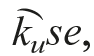 Old Church Slavonic <i>kъto</i>). It inflects for case only, e.g. nom. <i>Kush anshtë emë amë, e kush jane të mī vëllazënë?</i> ‘who is my mother, and who are my brothers?’; its other case forms are gen.-dat. <i>kuj</i> < *<i>kᵘ̯osi̯o</i> and acc. <i>kâ</i> [Bogdani] < *<i>kᵘ̯om</i>. Its counterpart is <i>qish</i> ‘what?’ (allegro variant <i>ç</i>), which continues a heavily reshaped *<i>kᵘ̯id</i> (cf. Matzinger 2006: 112−113), while its gen.-dat. <i>sej</i> quite faithfully reflects PIE *<i>kᵘ̯esi̯o</i> (cf. Schumacher 2004: 763). Apart from these two there are adjectival interrogatives such as <i>(i) silli</i> ‘which (one)?’ and various adverbial ones such as <i>ku</i> ‘where?’ For the interrogative pronouns of Modern Standard Albanian, see Newmark, Hubbard, and Prifti (1982: 278−281) and Buchholz and Fiedler (1987: 300−302).

#### 2.3.6. Indefinite pronouns

<i>kush</i> can also serve as an indefinite pronoun ‘somebody’; in this value, its oblique cases bear an <i>n-</i>suffix (gen.-dat. <i>kujnaj</i>, acc. <i>kana</i>). The inanimate indefinite pronoun is <i>gjã</i> ‘something’ (< <i>gjã</i> f. ‘thing’), which is often preceded by the indefinite particle <i>kun</i> (possibly < <i>ku</i> ‘where’ + the <i>-n-</i> of <i>kujnaj</i> and <i>kana</i>). They often form compounds with the negation <i>as-</i>: <i>askush</i> ‘nobody’, <i>asgjã</i> ‘nothing’ (on <i>as-</i>, see Joseph, this handbook, 5.1). ‘Everyone’ is <i>gjithëkush</i>, ‘everything’ <i>gjithëqish</i>.

#### 2.3.7. Relative particles and pronouns

Albanian has two relative markers. In Buzuku, we only find the invariable particle <i>qi</i>, but from Budi onward the fully inflected pronoun <i>(i) cilli</i> occurs as a relative pronoun. Historically, <i>(i) cilli</i> is identical with Buzuku’s interrogative <i>(i) silli</i> (cf. 2.3.5) and can still be used as an interrogative in Budi’s variety of Old Albanian. The initial <i>c-</i> is derived from allegro accusative forms of <i>(i) silli</i>: <i>të sillë</i> > <i>t’ sillë</i> > <i>cillë</i> → <i>të cillë</i> (in Bogdani, the pronoun has retained its original shape <i>[i] silli</i> and is used both as a relative pronoun and as an interrogative). Headless relative clauses are introduced with <i>kush</i> ‘(he) who’ and <i>qish</i> ‘what’, and with <i>kushdo</i> ‘whoever’ and <i>qishdo</i> ‘whatever’.

### 2.4. Numerals

The Albanian cardinals from ‘1’ to ‘10’ continue the respective PIE cardinals more or less faithfully; above ‘10’, the system was rebuilt; and <i>qind</i> m. ‘hundred’ as well as <i>mijë</i> f. ‘thousand’ are loanwords from Latin <i>centum</i> and <i>mīlle</i> respectively. The cardinal numerals from ‘1’ to ‘5’ have the following forms and prehistories: ‘1’ is <i>një</i> (< Proto-Albanian *<i>mi̯a-</i> m./n. and *<i>mi̯ā-</i> f., rebuilt from *<i>mii̯ā-</i> f. ← PIE *<i>smih₂</i>; a similar development has to be assumed for Old Armenian <i>mi</i>); ‘2’ is <i>dy</i> m., <i>dȳ</i> f./n. (< PIE *<i>duu̯o</i> m., *<i>duu̯ah₂-ih₁</i> f., *<i>duu̯o-ih₁</i> n.); ‘3’ is <i>tre</i> m., <i>trī</i> f./n. (< Proto-Albanian *<i>trei̯eh</i> m., *<i>trii̯āh</i> f., *<i>trii̯ā</i> n.), ‘4’ is <i>katërë</i> (< PIE *<i>kᵘ̯ₑtu̯ores</i> vel sim.), ‘5’ is <i>pêsë</i> (< PIE *<i>penkᵘ̯e</i>). The corresponding ordinals are <i>(i) parë</i> ‘1st’ (< *<i>por-u̯o-</i> vel sim.); <i>(i) dytë</i> ‘2nd’; <i>(i) tretë</i> ‘3rd’; <i>(i) katërtë</i> ‘4th’; <i>(i) pêstë</i> ‘5th’.

The cardinals from ‘6’ to ‘10’ are identical to the respective ordinals: <i>gjashtë</i> ‘6’, <i>shtatë</i> ‘7’, <i>tetë</i> ‘8’, <i>nandë</i> ‘9’ and <i>dhjetë</i> ‘10’ (for the ordinals, cf. <i>[i] gjashtë</i> ‘6th’, etc.); this identity is possibly due to the fact that ‘10’ was originally a feminine consonant stem Proto-Albanian *<i>dećat-</i> (< PIE *<i>dek̑m̥ t-</i>, cf. Vedic <i>daśát-</i> ‘decad’), which was reshaped into an <i>ā</i>-stem *<i>dećatā-</i> according to the analogy sketched in 2.1; once that had happened, the cardinal formally merged with the feminine forms of the ordinal *<i>dećata</i>/ <i>ā-</i> (< PIE *<i>dek̑m̥to</i>/<i>ah₂-</i>). Subsequently, the preceding cardinals down to ‘6’ were analogically based on their ordinals, which can be reconstructed as follows: <i>(i) gjashtë</i> ‘6th’ < PIE *<i>sek̑s-to</i>/<i>ah₂-</i>; <i>(i) shtatë</i> ‘7th’ < PIE *<i>septm̥-to</i>/<i>ah₂-</i>; <i>(i) tetë</i> ‘8th’ (< *<i>Hok̑toH-to</i>/<i>ah₂-</i>), <i>(i) nandë</i> ‘9th’ (< *<i>h₁neu̯n̥-to</i>/<i>ah₂-</i>). Alternatively, the cardinals from ‘6’ to ‘10’ could go back to collective abstracts, e.g. <i>gjashtë</i> < *<i>sek̑s-tah₂-</i> (cf. similar Old Church Slavonic <i>šestъ</i>).

The teens are formed with the synchronically transparent prepositional phrase ‘numeral on ten’. This construction, whose origin is clearly to be sought in Slavic, is also found in Rumanian and constitutes one of the so-called Balkanisms (see Friedman 2006: 664− 665). Therefore, Old Albanian ‘eleven’, <i>një ëmbë dhjetë</i> (cf. <i>ëmbë</i> ‘on’) and the other teens copy Old Church Slavonic <i>jedinъ na desęte</i> etc. ‘20’ is <i>njëzet</i> and must ultimately be related to Lat. <i>vīgintī</i> etc., but details are very unclear. The further decads have the structure ‘numeral + ten’, cf. <i>trī dhjetë</i> ‘30’, etc., the hundreds are <i>një qind</i> ‘100’, <i>dy qind</i> ‘200’, etc., and the thousands are <i>një mijë</i> ‘1000’, <i>dȳ mijë</i> ‘2000’, etc.

The ordinal numerals from ‘second’ onward are simply derived from the cardinal numerals by adding the suffix <i>-të</i> (< *<i>-to-</i>), as can be seen in ‘2nd’ to ‘5th’ above.

Cardinals precede their referent, which from ‘2’ onward is in the plural. Ordinals also precede their referent. However, while noun phrases with ordinals behave exactly like other noun phrases with attributive adjectives preceding their referent, noun phrases with cardinals show a different behavior.

The Albanian numerals are dealt with by Hamp (1992), Demiraj (1997), and Matzinger (2006: 113−117). A lengthy description is also contained in a hitherto unpublished manuscript by Klingenschmitt (unpubl.). For the numerals in Modern Standard Albanian, see Newmark, Hubbard, and Prifti (1982: 248−260) and Buchholz and Fiedler (1987: 349−360).

### 2.5. Prepositions

Old Albanian prepositions mostly govern two cases, rarely only one case. Case differences do not seem to reflect semantic differences, but the whole matter has not been well investigated. With the ablative only: <i>ën</i> ‘from; to, towards’; <i>prej</i> ‘from; to, towards’. With the accusative or the ablative: <i>pā</i> ‘without’. With the accusative or the instrumental: <i>ëmbë</i> ‘in, on’; <i>ëndë</i> ‘in, at’; <i>me</i> ‘with’. With the nominative (see 2.1): <i>tek</i> ‘at/to the location of’, <i>kaha</i> ‘from’ [Matrënga]. On the etymologies of some prepositions, see Matzinger (2006: 105−107). For prepositions in Buzuku from a Balkanological point of view, see Genesin (1994−1995). The prepositions of Modern Standard Albanian are dealt with by Newmark, Hubbard, and Prifti (1982: 289−300) and by Buchholz and Fiedler (1987: 373−384).

## 3. Verbal morphology

The following is a condensation of Schumacher and Matzinger (2013: 25−197, 965− 1010), and readers are referred to this work for any details not dealt with here. For the verbal system of Buzuku, see also Fiedler (2004). For the verbal system of Tosk-based Modern Standard Albanian, see Newmark, Hubbard, and Prifti (1982: 21−119) and Buchholz and Fiedler (1987: 60−121).

### 3.1. Classes of verbs

The classification of verbs in Albanian (whether Old Albanian or Modern Standard Albanian) is very difficult. Classifications by historical principles (e.g. primary vs. non-primary verbs) are impossible, and most other classifications adopted so far (e.g. those based on present-stem inflection alone) are unhelpful. The classification adopted here uses as a guiding principle an abstraction we call the verb-base. Every Albanian verb (primary or non-primary) has a verb-base, which can be deduced from the synopsis of 3sg pres. ind. act., 2sg iptv. act., and 3sg aor. act. (in deponent verbs, the corresponding middle forms can be used). Verb-bases can be monosyllabic or polysyllabic, and, importantly, they end in either a consonant or a vowel. Only verb-bases with final vowel plus /n/ behave ambiguously, as they can be treated either as consonant-final or as vowel-final verb-bases (in the latter case, the vowel is a nasal vowel). However, it is preferable to place verb-bases with vowel plus /n/ among the consonant-final verb-bases. Based on the phonological shape of the final segment of the verb-base and the morphological relationship between the verb-base and the present stem, three major verb classes (each with two sub-classes, here called types) can be defined: (i) Class <i>di</i>/<i>djeg</i>: In this class, there is no synchronically visible element intervening between the verb-base and the present-stem endings. Type <i>di</i> ‘knows’ (< PIE *<i>dʰiH-(i̯)eti</i>, root *<i>dʰei̯H-</i>, LIV²141−142) represents verbs with vowel-final verb-bases (verb-base <i>di-</i>), while type <i>djeg</i> ‘causes to burn’ (< PIE *<i>dʰegᵘ̯ʰ-e-ti</i>, root *<i>dʰegᵘ̯ʰ-</i>, LIV²133−134) represents consonant-final verb-bases (verb-base <i>djeg-</i>). As can be seen, this class contains various primary verbs, but primary verbs are also found in other classes. (ii) Class <i>kujton</i>/<i>ecën</i>: In the present stem, the verb-base is enlarged by an <i>n-</i>suffix. Again, the verb-base can be vowel-final, as in type <i>kujto-n</i> ‘thinks’ (with <i>-o</i> being the final vowel of the verb-base), or consonant-final, as in type <i>ec-ën</i> ‘goes’ (here, the final consonant is <i>-c</i>, and the unstressed <i>-ë-</i> is part of the suffix). Note that the verbs with verb-base ending in <i>-o-</i> constitute the only fully productive verbal class of Albanian, the <i>-o-</i> going back to denominative verbs in *<i>-ah₂- i̯e</i>/<i>o-</i> and factitive verbs in *<i>-ah₂-</i> (however, this class also includes some primary verbs, such as <i>shton</i> ‘adds’, which ultimately goes back to a post-PIE *<i>stah₂-i̯e</i>/<i>o-</i>, root <i>*steh₂-</i>, LIV²590−592). (iii) Class <i>vret</i>/<i>përket</i>: In this class, the verb-base is enlarged with a <i>t-</i>suffix. In the vowel-final verb-bases (type <i>vret</i>), the <i>t-</i>suffix is attached immediately to the stressed final vowel of the verb-base, as in <i>vret</i> ‘kills’ (verb-base <i>vra-</i>); in the consonant-final verb-bases (type <i>përket</i>), a stressed vowel intervenes between the verb-base and the <i>t-</i>suffix, as a result of which the vowel of the verb-base is often weakened or syncopated, e.g. in <i>përket</i> ‘touches’ (verb-base <i>prek-</i>). This class is quite small and not productive. Apart from these three classes, there is a fourth residual class of some twenty verbs that are either suppletive or have some other feature not found elsewhere, which is why these verbs − most of them going back to primary verbs − are best called irregular.

Finally, it must be kept in mind that each of the six types sketched above has various sub-types; for instance, type <i>kujton</i> shows the sub-types <i>kujton</i> (with monophthongal <i>-o-</i>as the final vowel of the verb-base), <i>shkruon</i> ‘writes’ (with diphthongal <i>-uo-</i> in verb-base-final position), and <i>lyen</i> ‘anoints’ (with diphthongal <i>-ye-</i> in verb-base-final position), to mention just a few.

### 3.2. Person and number

Albanian verbs have the usual three persons and two numbers (singular and plural) in each tense or mood category. In the active present indicative, the second and third persons are homonymous; in some verbs of the type <i>djeg</i>, the 1sg is also homonymous with the 2/3sg. Everywhere else, all six persons are distinct from each other.

### 3.3. Voice

Albanian has two voices, active and middle, both continuing the respective PIE categories. Middle voice is expressed morphologically in several ways. (i) In the present-stem system (cf. 3.6) the middle is expressed synthetically by its own set of endings: The present-tense middle endings go back to the same set of endings as the Greek middle endings, including the change of the 1sg from *<i>-h₂ai̯</i> to *<i>-mai̯</i>. On the other hand, the imperfect middle endings are clearly innovative, deriving analogically from the imperfect of the verb ‘be’ (see 3.6). (ii) In the 2sg imperative (3.7), the aorist (3.8), the optative (3.9), the admirative (3.10), non-finite forms (3.11), and periphrastic forms derived from the latter (3.12), the middle is expressed by the middle-voice marker <i>u</i>, which historically derives from enclitic forms of the inherited reflexive pronoun (<i>u</i> < *<i>su̯ē˘</i> and/or *<i>su̯oi̯</i>) but is no longer attached to the pronominal system (cf. 2.3.2). (iii) In the perfect system, except for the admirative, the middle is expressed by the choice of the auxiliary (3.10).

The functions of the two voices are reminiscent of early-attested IE languages. In fact, however, a major reshuffling has taken place, whereby numerous intransitive <i>verba activa tantum</i> first became <i>verba media tantum</i> (deponents) and then developed secondary factitive active forms.

### 3.4. Moods; remarks on aspect

Apart from the indicative, Albanian has the following moods: (i) the imperative, which requires no further explanation; (ii) the subjunctive, which is found in the present-stem system and the perfect system. It has its nucleus in the PIE subjunctive of the present stem but has been fully integrated into the tense systems of the present-stem system and the perfect system, as a result of which most tenses have an indicative and a corresponding subjunctive. The scopes of the various subjunctives thus cover a wide range of meanings but the primary PIE scope of the subjunctive (expression of the expectation of the speaker) can still be retrieved; (iii) the optative, which has its own stem and expresses wishes and curses of the speaker. Note that the optative can refer only to events wished for in the present or the future but not to past events; (iv) the admirative (3.10). Apart from this, one must not forget that even the Old Geg future has modal forms (3.12). However, not all these formations are well-attested, and it remains unclear which of them can be thought of as fully grammaticalized. To sum up, it is very difficult to obtain a general view of the modal system in its totality.

Note that in Albanian all moods (apart from the imperative) are more or less linked to the tense system. This is consistent with the fact that aspect contrasts are not an overall feature of the verbal system − it is only the indicatives of past tenses that are marked for aspect: there is an aspectual contrast (imperfective vs. perfective) between the imperfect and the aorist, and there may be a similar difference between the pluperfect and the aorist-pluperfect (cf. 3.10). However, there is no distinction between imperfectivity and perfectivity in imperatives, subjunctives, optatives, futures, or anywhere else.

### 3.5. The five synthetic stem forms of the Albanian verb

Every Albanian verb paradigm has five synthetic stem forms: the present stem, the 2sg imperative, the aorist stem, the optative stem, and the participle, which is the only synthetic non-finite form of the verbal system. Three of these stem forms (the aorist and optative stems, and the 2sg imperative) have only one function, whereas the other two (the present stem and the participle) are the basis of elaborate sub-systems, namely the present-stem system and the perfect system.

Morphologically, the inflection of the finite verbal forms has several characteristics. (i) Inflection is usually characterized by inflectional endings. In some places, endings have given way to zero morphemes, but these are rare enough to be regarded as morphemes in their own right. (ii) Inflection can be accompanied by morphophonological changes of the rightmost vowel of the verb-base, regardless of whether the verb-base is vowel-final or consonant-final. These changes comprise raising, monophthongization or diphthongization, and lengthening or shortening of that vowel. Additionally, in present stems of the type <i>ecën</i>, the vowel of the <i>ën-</i>suffix can be raised or syncopated, and in present stems of the types <i>vret</i> and <i>përket</i>, the vowel of the stem-final syllable <i>-Vt</i> can be raised. Most vowel changes are due to phonological processes in the history of Albanian, such as umlaut or palatalization. Only in aorist stems do we find verb-base-vowel changes that represent reflexes of PIE ablaut (cf. 3.8). (iii) Inflection can be accompanied by morphophonological changes of verb-base-final consonants. These changes comprise palatalization (<i>g</i> → <i>gj</i>, <i>k</i> → <i>q</i>, <i>n</i> → <i>nj</i>/<i>j</i>), and a change <i>t</i> → <i>s</i>, which historically also reflects palatalization. Finally, in present stems of the classes <i>kujton</i>/<i>ecën</i> and <i>vret</i>/<i>përket</i>, the final consonant of the present-stem suffix regularly undergoes the morphophonological changes <i>n</i> → <i>nj</i>/<i>j</i> and <i>t</i> → <i>s</i>, respectively, in certain forms.

### 3.6. The present-stem system

The present stem continues PIE present-stem formations. The main change that can be observed is that <i>n</i>/<i>nj-</i>suffixes (< *<i>-ni̯e</i>/<i>o-</i>) have spread, yielding the <i>kujton</i>/<i>ecën</i> verbal class. Almost all extant present stems reflect thematically inflected stems, the two major exceptions being <i>anshtë</i> ‘be’ (← *<i>h₁esti</i>, root 1.*<i>h₁es-</i>, LIV²241−242) and <i>thotë</i> ‘say’ (← <i>*k̑eHs-toi̯</i>, root <i>*k̑eHs-</i>, LIV²318−319). The present stem has two tenses, present and imperfect. The present is a continuation of the PIE present stem with primary endings, while the imperfect is a continuation of the PIE present stem with secondary endings, i.e. the PIE injunctive. It also has two moods, indicative and subjunctive. The present subjunctive continues the PIE subjunctive of the present stem; however, it is only in the active 2sg and 3sg and the middle 2sg that the morphology of the subjunctive has not merged with the morphology of the indicative. Nevertheless, all subjunctive forms can be recognized by the fact that they are marked with preceding particles: positive subjunctive forms are marked with <i>të</i>, and negative forms are either marked with the modally marked negation particle <i>mos</i> or the particle combination <i>të mos</i> (very rarely <i>mos të</i>). The fact that the subjunctive is primarily marked by particles has also entailed the development of an imperfect subjunctive. The following table shows examples from all six classes: class <i>di</i>/<i>djeg</i>: <i>di</i> ‘know’ (< PIE *<i>dʰiH-(i̯)e</i>/<i>o-</i>, cf. Schumacher and Matzinger 2013: 969), <i>hjek</i> ‘pull’ (ultimately < PIE *<i>selk-e</i>/<i>o-</i>, cf. Schumacher and Matzinger 2013: 976−978); class <i>kujton</i>/<i>ecën</i>: <i>kujton</i> ‘think’, <i>ecën</i> ‘go’; class <i>vret</i>/<i>përket</i>: <i>përket</i> ‘touch’ (the type <i>vret</i> inflects exactly like <i>përket</i>: 1sg <i>vras</i>, etc.) (see Tab. 96.7).

For a prehistory of these forms, see Schumacher and Matzinger (2013: 51−52).

The middle-voice inflection has the following forms (for semantic reasons <i>di</i> ‘know’ has been replaced by <i>ëmba</i> ‘hold’ and <i>ecën</i> by <i>ënveshën</i> ‘provide with clothes’ < PIE *<i>u̯os-éi̯e</i>/<i>o-</i>) (see Tab. 96.8).

For the prehistory of the endings, cf. Schumacher and Matzinger (2013: 127−131); as mentioned above (3.3), this set of endings reflects the same set of endings as the Greek thematic present middle endings (e.g. <i>-em</i> < *<i>-a-mai̯</i> ← *<i>-a-h₂ai̯</i>, cf. Gk. -ομαι). As can be seen, both <i>hjek</i> (type <i>djeg</i>) and <i>përket</i> (type <i>përket</i>) select the same present-stem allomorph as the one that appears in the active 2pl, and the same applies for type <i>vret</i> presents. In type <i>di</i> presents, an <i>-h-</i> intervenes between the final vowel of the verb-base and the endings (e.g. <i>ëmba-h-etë</i>). In type <i>kujton</i> presents, the <i>-n-</i> of the active voice is retained if the final vowel of the verb-base is monophthongal <i>-o-</i> (as in <i>kujton</i>); however, if the final vowel is diphthongal (as in <i>shkruon</i> ‘write’), the <i>-n-</i> is replaced by <i>-h-</i>, and the diphthong is monophthongized, which yields forms like <i>shkru-h-etë</i>. In type <i>ecën</i> presents, the <i>n-</i>suffix is deleted, which is why the middle counterpart of active <i>ënveshën</i> is <i>ënvishetë</i>.

Tab. 96.7: Present active inflection.

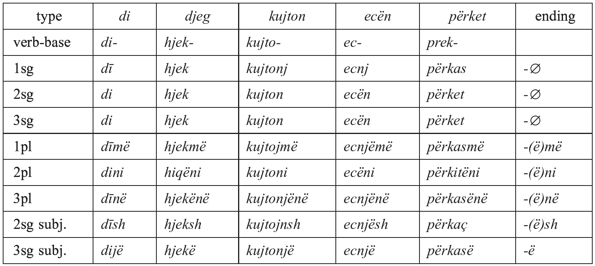

Tab. 96.8: Present middle inflection.

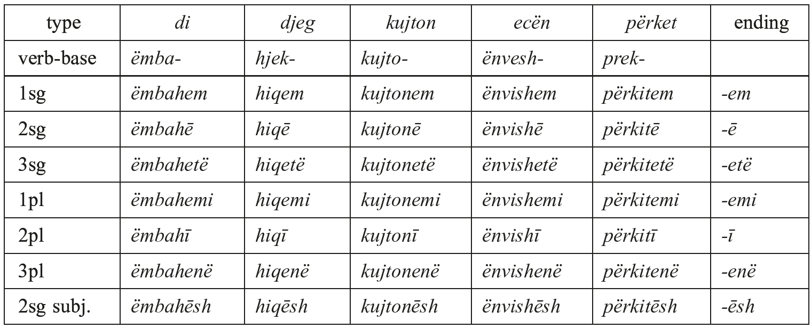

The active imperfect has the following morphology (see Tab. 96.9).

Tab. 96.9: Imperfect active inflection

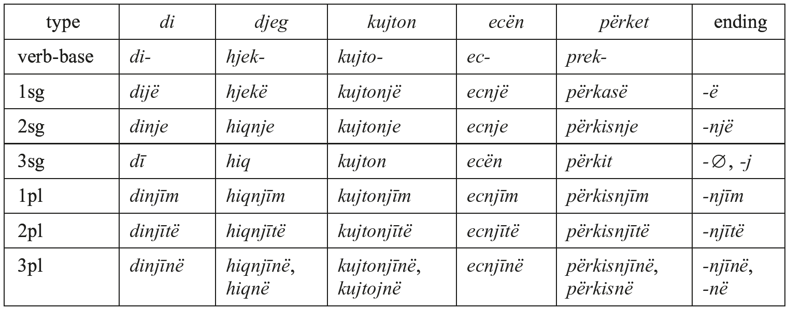

This set of endings, particularly the 1sg <i>-ë</i> and the 3sg <i>-</i>∅, ultimately reflects the PIE thematic secondary endings; therefore, the Albanian imperfect can be traced back to the PIE injunctive of the present stem (there are no traces whatsoever of an augment). For details see Schumacher and Matzinger (2013: 132−140). The element <i>-njī-</i> which is found in 1pl, 2pl, and 3pl in Buzuku (but is lacking in some archaic Tosk dialects) must have spread from the class <i>kujton</i>/<i>ecën</i>. Note also that the <i>-m</i> part of 1pl <i>-njīm</i> reflects PIE secondary *<i>-me</i> or *<i>-mo</i>, while present-tense <i>-më</i> reflects PIE primary *<i>-mes</i> or *<i>-mos</i>.

The middle imperfect has the following morphology:

Tab. 96.10: Imperfect middle inflection.

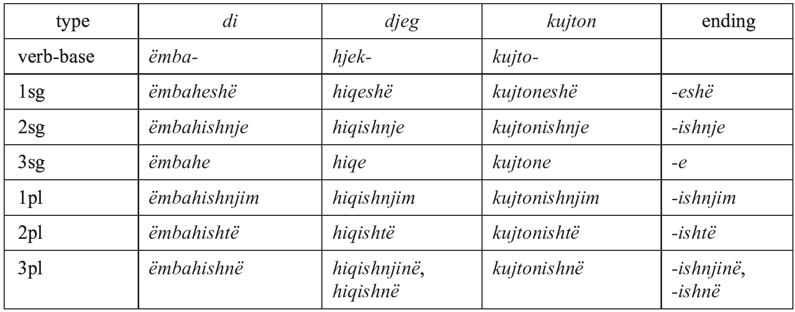

The set of endings found here originates in the imperfect of ‘be’: the Late Proto-Albanian 1sg pres. ind. of ‘be’ was *<i>i̯em</i> (ultimately < *<i>h₁es-mi</i>), and the ending of the 1sg pres. ind. mid. was <i>-em</i>. Since both forms ended in <i>-em</i> and the verb ‘be’ could be reinterpreted as a <i>medium tantum</i>, the imperfect of ‘be’ furnished a template for the inflection of the imperfect middle. In this context, it is useful to cite the full present-stem paradigm of ‘be’. The table below shows the paradigms of both ‘be’ and ‘have’ (whose etymology is unclear), since the two, often used as auxiliaries, heavily influenced each other (for instance, the 1sg pres. ind. of ‘be’ has been changed from *<i>i̯em</i> to <i>jam</i> under the influence of 1sg <i>kam</i>) (Tab. 96.11).

Tab. 96.11: Inflection of ‘be’ and ‘have’

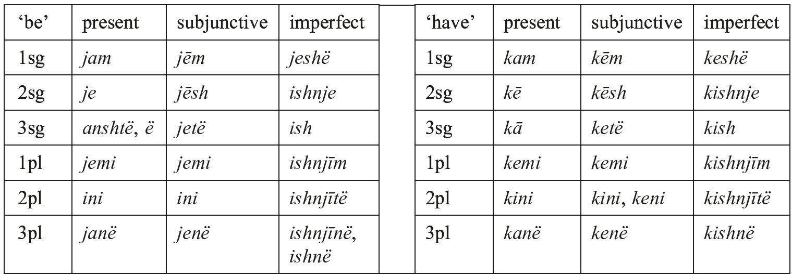

While most forms of the present indicative of ‘be’ have undergone various transformations, the 3sg pres. ind. <i>anshtë</i> quite faithfully continues PIE *<i>h₁esti</i>; its only innovation is the preverb *<i>an-</i> < PIE *<i>on-</i> ‘in’, which is due to the influence of Koiné Greek, where the 3sg ἐστι and the 3pl εἰσι have been replaced by ἔνι, a third-person form of the compound of the verb ‘be’ with the preverb ἐν(ι)- ‘in’. The short form <i>ë</i> goes back to the bare preverb *<i>an</i>, a form that is even more similar to Koiné Greek ἔνι (see also Hamp 1980). For the imperfect, see Schumacher and Matzinger (2013: 145, note 16). In Old Geg, the expected 3sg *<i>je</i> has been altered to <i>ish</i>, but <i>je</i> is actually attested in archaic Tosk dialects in Greece (Sasse 1991: 151).

<!-- source-file: content/09_chapter03_4.xhtml -->

### 3.7. Imperatives

Old Albanian has imperatives of the 2sg, the 1pl, and the 2pl. While the imperatives of the 1pl and 2pl (both active and middle) are homonymous with the corresponding indicative forms, the 2sg imperatives are derived directly from the verb-base. Active 2sg imperatives can consist of the bare verb-base (e.g. <i>ban</i> ‘do!’ from <i>ban</i> ‘do’, <i>ëmba</i> ‘hold!’ from <i>ëmba</i> ‘hold’); alternatively, they can bear an ending, namely <i>-j</i> if the verb-base ends in a vowel (e.g. <i>mos druoj</i> ‘fear not!’ from <i>dro</i> ‘fear’), but <i>-ë</i> if the verb-base ends in a consonant (e.g <i>rrjedhë</i> ‘run!’ from <i>rrjedh</i> ‘run’). Whether the endings <i>-j</i> or <i>-ë</i> appear or not is only partly predictable. Additionally, in all types of 2sg imperatives the verb-base can undergo the morphophonological changes described in 3.5 (ii) and (iii).

Middle 2sg imperatives are derived from their active counterparts by adding the middle-voice marker <i>u</i> (cf. 3.3). This is postposed if the imperative is clause-initial but preposed if anything precedes it, e.g. <i>kujto-u</i> ‘remember!’ but <i>mos u kujto</i> ‘do not remember!’, both from <i>kujton</i> ‘think’ (verb-base <i>kujto-</i>).

In Buzuku, there are also active imperative forms of the 3sg, e.g. <i>ëndjekë</i> ‘let him follow!’ from <i>ëndjek</i> ‘follow’. Genetically, these continue PIE present subjunctive forms; however, since the Albanian subjunctive is synchronically defined by preposed particles, such forms are best described as imperative forms.

### 3.8. The aorist

As the term aorist suggests, this category is a perfective preterite (it has only an indicative; there are no other moods attached to it). It must be kept in mind, though, that the aorist is syncretic in nature with three different categories underlying it: (i) original aorist formations (root aorist, <i>s-</i>aorist, <i>eh₁-</i>aorist); (ii) original perfect formations, some of them dating back to PIE, others post-PIE; (iii) a periphrastic construction involving the verbal adjective in <i>*-to-</i>. Synchronically, there are three different aorist formations in Old Albanian: the <i>v-</i>aorist, the <i>t-</i>aorist, and the suffixless aorist. The <i>v-</i>aorist is found with vowel-final verb-bases only; in the 2sg and the active 1sg, a <i>v-</i>suffix is inserted between the verb-base and the endings, whereas in most other forms the verb-base-final vowel is lengthened or diphthongized. The <i>t-</i>aorist is found with both vowel-final and consonant-final verb-bases and is characterized by a suffix that has the shape <i>-ti-</i> or <i>-të-</i> (< older *<i>-tə-</i>); frequently, <i>-j-</i> is inserted between the verb-base and the <i>t-</i>suffix. Finally, the suffixless aorist is found with consonant-final verb-bases only. In some verb-bases going back to PIE primary verbs, the rightmost vowel is changed, which reflects PIE ablaut (zero grade or lengthened grade), but usually the suffixless aorist can only be recognized by its aorist endings.

The aorist has no synthetic middle, the middle being indicated by the prefixed middle marker <i>u</i>; in this case, the 1sg middle forms have a different ending <i>-shë</i> (taken from the imperfect middle), and the middle 3sg is frequently distinguished from its active counterpart by having a zero ending. The following table shows the inflection of all three aorist types (<i>kujton</i> ‘think’, verb-base <i>kujto-</i>; <i>ëmba</i> ‘hold’, verb-base <i>ëmba-</i>; <i>vê</i> ‘put’, verb-base <i>ven-</i>; <i>djeg</i> ‘cause to burn’, verb-base <i>djeg-</i>):

Tab. 96.12: Aorist inflection.

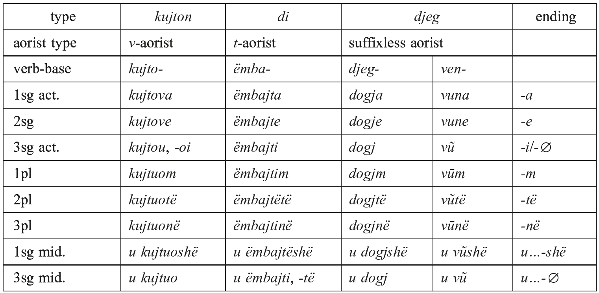

These aorists have the following background: the <i>v-</i>aorists go back to <i>s-</i>Aorists, which had become “alpha-thematic” when the vowel *<i>-a-</i> spread from the 1sg *<i>-san</i> and the 3pl *<i>-sand</i> to the whole paradigm. When suffixed to vowel-final verb-bases, the *<i>-s-</i> became *<i>-h-</i> and then zero, as a result of which the two newly adjacent vowels either contracted to a long vowel (which could later be diphthongized) or developed a hiatus-filling <i>-v-</i>. The point of departure of these aorists must have been <i>s-</i>aorists of primary verbs with laryngeal-final roots; for instance, <i>shtou</i> ‘(s)he added’ from <i>shton</i> ‘add’ (cf. 3.1) goes back to Proto-Albanian *<i>stā-s-</i> ‘placed’, a formation parallel to but independent of Gk ἔστησε. From forms like these, the <i>-s-</i> was transferred to non-primary factitive and denominative verbs, whose verb-base ended in *<i>-ā-</i>. The <i>t-</i>aorists have their origin in a periphrastic construction involving the verbal adjective in *<i>-to-</i>. Originally, this construction must have belonged to the middle, but active forms with <i>-t-</i> arose when deponents developed secondary factitive active forms (cf. 3.3). The suffixless aorists, finally, have various origins: there is a group of some 40 verbs with a special vocalism in the aorist, like <i>dogj</i> ‘(s)he caused to burn’ (present stem <i>djeg</i> < *<i>dʰegᵘ̯ʰ-eti</i>, root *<i>dʰegᵘ̯ʰ-</i>, cf. 3.1) or <i>vũ</i> ‘(s)he put’ (present stem <i>vê</i> < *<i>h₁u̯en-eti</i>, root *<i>h₁u̯en-</i>, cf. Schumacher and Matzinger 2013: 1006−1007). These aorists belong to PIE primary verbs, and their vocalism (which cannot be traced back to phonological or morphophonological processes within Albanian) reflects Indo-European ablaut. On the one hand, there are aorist stems with lengthened grade of the root (here termed <i>o-</i>aorists), as in <i>dogj</i> (virtually **<i>dʰēgᵘ̯ʰ-</i>), and this formation is best traced back to weak stems of PIE and post-PIE perfects (weak perfect stems of <i>T₁eT₂</i>- roots changed from <i>T ₁eT₁T₂</i>- to <i>T₁ēT₂</i>- already in PIE; see now Schumacher and Matzinger 2013: 161−172). On the other hand, there are aorist stems with zero grade of the root, as in <i>vũ</i> ← *<i>h₁u̯en-</i>/<i>h₁u̯n̥-</i>; these are best traced back to the weak stems of PIE root aorists. PIE root aorists are also frequent among verbs here classified as irregular (cf. 3.1). Some of these belong to etymologically unitary paradigms, e.g. <i>la</i> ‘(s)he left’ ← *<i>leh₁-</i>/<i>l̥h₁-</i> (root *<i>leh₁-</i>, LIV²399; present stem <i>lê</i> < Proto-Albanian *<i>lane</i>/<i>a-</i> ← *<i>l̥h₁-neu̯</i>/<i>nu-</i>); others belong to suppletive paradigms, e.g. <i>dha</i> ‘(s)he gave’ ← *<i>deh₃-</i>/<i>dh₃-</i> (root *<i>deh₃-</i>, LIV²105−106; present stem <i>ep</i> < *<i>h₁op-éi̯e</i>/<i>o-</i>, LIV²237). Finally, there are two thematized root aorists, both with an exact counterpart in Greek: <i>kle</i> ‘(s)he was’ < post-PIE *<i>kᵤ̯l-e</i>/<i>o-</i>, cf. Gk. ἔπλετο, Old Armenian <i>ełew</i> (root *<i>kᵤ̯elh1-</i>, LIV²386−388; present stem <i>anshtë</i> ← *<i>h₁esti</i>, cf. 3.6); and <i>u ngre</i> ‘rose (from the dead), arose’ [Budi, Matranga] < post-PIE *<i>h₁gr-e</i>/<i>o-</i>, cf. Homeric Greek ἔγρετο (root *<i>h₁ger-</i>, LIV²245−246; present stem <i>ëngrihetë</i> < *<i>h₁gr̥-sk̑e</i>/<i>o-</i>). However, the bulk of the suffixless aorists show no traces of ablaut and belong to non-primary verbs of various origins. Probably, the first non-primary verbs to develop such aorists were denominatives with a <i>*-i̯e</i>/<i>o-</i>suffix. These developed an aorist in Proto-Albanian by behaving analogically to primary verbs with present-stem suffix <i>*-i̯e</i>/<i>o-</i> and a root aorist, and eventually this way of deriving an aorist stem from a present stem must have spread to all sorts of non-primary verbs (except for those in <i>-o-</i> < *<i>-ah₂-i̯e</i>/<i>o-</i> and *<i>-ah₂-</i>).

### 3.9. The optative

The optative has a stem of its own, but it is easy to see that this stem is mostly linked to the aorist stem. For instance, <i>v-</i>aorists have an optative stem in <i>-f-</i>, (e.g. 2sg <i>kujtofsh</i> [Budi]); <i>t-</i>aorists have an optative stem in <i>-të-</i> (e.g. 2sg <i>ëmbajtësh</i>); and the optatives of suffixless aorists are mostly derived from the aorist stem (e.g. 1sg <i>lasha</i>), the only exception being the perfect-based <i>o-</i>aorists, where the optative has the same vocalism as the 1sg pres. act. (e.g. 3sg <i>djektë</i>). The optative has no synthetic middle, middle forms being indicated by the prefixed middle marker <i>u</i>. The optative has the following set of endings: 1sg <i>-sha</i>, 2sg <i>-sh</i>, 3sg <i>-të</i>, 1pl <i>-shim</i>, 2sg <i>-shi</i>, 3sg <i>-shinë</i>. Apart from the 3sg (which is an analogical form), these endings derive from the optative of the <i>s-</i>aorist (1sg *<i>-sih₁-m̥</i> etc.; see Schumacher and Matzinger 2013: 177−182). However, since in Albanian the PIE present-stem optative has been lost, the optative is no longer a category marked for aspect.

### 3.10. The participle and the perfect system

The participle is the fourth synthetic stem form of the Albanian verb. It is a past participle but, since there is no present participle, the term “participle” is sufficient. Morphologically, the participle is mostly dependent on the aorist stem except in the case of an <i>o-</i>aorist. In Old Geg, the participle can be formed by means of several different allomorphic suffixes: <i>-në</i> and <i>-unë</i> (< PIE *<i>-nó-</i>), <i>-të</i> (< PIE *<i>-tó-</i>), and <i>-m</i> (< PIE *<i>-mh₁no-</i>?). These suffixes have no clear-cut distribution; their occurrence seems to be governed by the individual dialects of the Old Geg authors, but occasionally each author uses more than one suffix with a given verb-base. For instance, <i>pi</i> ‘to drink’ (verb-base <i>pi-</i>) has the participles <i>pīnë</i>, <i>pītë</i> and <i>pīm</i> in Buzuku. The participle can be used as a deverbal resultative adjective (active with intransitive verbs, passive with transitive verbs), in which case it is used as an articulated adjective, e.g. <i>(i) ënvrām</i> ‘killed’ (<i>ënvret</i> ‘kill’). The substantivized neuter of this adjective serves as a verbal abstract, e. g. <i>të ënvrām</i> ‘act of killing’. However, much more often the participle serves as a basis for periphrastic constructions: the non-articulated, invariable form of the participle combines with the auxiliary verbs ‘have’ and ‘be’, thus forming a perfect. Transitive verbs form their active perfects with ‘have’ plus participle and their middles with ‘be’ plus participle, whereas perfects of <i>verba activa tantum</i> mostly vacillate between taking ‘be’ and ‘have’ as their auxiliaries. Deponents always form their perfects with ‘be’.

The perfect system is an important component of the verbal system in that practically all tenses and moods (apart from the imperative) enumerated so far have counterparts in the perfect system. Thus, there is not only a present of the perfect and a pluperfect (indicative and subjunctive), but also an aorist-pluperfect and an optative; in rare cases, even a perfect and a pluperfect of the perfect can occur.

In Budi, we also find perfects with a clipped form of the participle, e.g. <i>kā ardh</i> ‘has come’ beside <i>kā ardhunë</i>. This form of clipping is an innovation; it is not found with other Old Geg authors but is the rule in Modern Geg. Note that the participle is only affected by this in finite perfect-system forms and in the non-finite forms mentioned in 3.11. but not if it is used as a verbal adjective or abstract.

A further derivative of the perfect system is the so-called admirative, which has developed from a univerbated reverse-order perfect. That is, in the admirative the auxiliary (which is always ‘have’) follows the participle, which in turn often loses its final syllable or parts thereof. Thus, the 2sg perf. act. of <i>ruon</i> ‘guard’ is <i>kē ruojtunë</i>, while the corresponding admirative form is <i>ruojtëkē</i>. The admirative is also differentiated from the rest of the perfect system by the fact that the middle is indicated by the prefixed middle marker <i>u</i>. The exact function and scope of the admirative in Old Albanian still needs to be defined.

### 3.11. Non-finite forms

Several non-finite categories are produced by fully grammaticalized combinations of preposition + participle: the infinitive (<i>me</i> ‘with’ + participle), e.g. <i>me kujtuom</i> ‘to think’; the so-called gerundive (<i>tue</i> + participle), e.g. <i>tue kujtuom</i> ‘while thinking’; and the privative, a negative counterpart of the gerundive (<i>pā</i> ‘without’ + participle), e.g. <i>pā kujtuom</i> ‘without thinking’. The gerundive and the privative are converbs, comparable to the French <i>gérondif</i> (e.g. <i>en pensant</i> ‘while thinking’). Middle-voice forms use <i>u</i>, e.g. infinitive <i>me u kujtuom</i> ‘to remember’. Historically, the function of the participle in these constructions was that of a verbal abstract (cf. Lat. <i>factum</i> ‘a deed’). All three non-finite forms have perfect-tense counterparts with <i>me</i>/<i>tue</i>/<i>pā</i> + participle of the auxiliary + participle, e.g. <i>tue pasunë salutuom</i> ‘having greeted’ (<i>saluton</i> ‘greet’). Note that, apart from petrified phrases, Tosk lost the infinitive before it was committed to writing.

### 3.12. Periphrastic tenses derived from the non-finite forms in 3.11

Old Geg has a future, consisting of the present of the auxiliary ‘have’ plus infinitive. This is continued in Modern Geg. Additionally, Old Geg also has corresponding past tenses best described as conditional moods, and there is even a subjunctive of the future.

### 3.13. Polypersonality in the verbal system

As mentioned in 2.3.2, Albanian has a polypersonal verb which optionally encodes direct and indirect objects. The object markers used for this go back to enclitic pronouns but are best described as a part of the verbal morphology.
