# 97. The syntax of Albanian

1.Introduction

2.Nominal morphosyntax and adpositional phrases

3.Verbal syntax

4.Word order

5.Sentential syntax

6.References

## 1. Introduction

Albanian is the stepchild of Indo-European linguistics, being perhaps the least investigated and least understood of the separate major branches of Indo-European. Moreover, within Indo-European historical investigations, syntax is perhaps the least explored component of grammar, and less is known about the syntax of Proto-Indo-European (PIE) than about its phonology or morphology. Putting these two facts together means that obtaining a clear picture of Albanian historical syntax and the emergence of Albanian syntactic structures out of PIE is especially challenging.

This task is complicated by another factor, one that, at the same time, offers some important opportunities for insights into the extent and mechanisms of contact-induced language change. This factor is Albanian’s involvement in the Balkan Sprachbund. That is, due to intense and sustained bi- and multi-lingual contact among speakers of various languages in the Balkans − most notably Aromanian, Bulgarian, Daco-Romanian, Greek, Macedonian, Romany, to a lesser extent Turkish, and of course Albanian (both major dialects, Geg and Tosk) − these languages have converged on common structures and common characteristics at all linguistic levels: phonology, morphology, lexicon, semantics, and syntax. Moreover, the syntactic parallels extend to nominal, verbal, and sentential syntax. Therefore, careful analysis is needed to differentiate those features of Albanian syntax inherited from PIE from those acquired by contact with neighboring languages; it is therefore always crucial to take the Balkan Sprachbund, and thus the possibility of contact-induced characteristics, into account whenever any discussion of Albanian is undertaken, especially when historical concerns are paramount.

In many ways, Albanian syntax is unremarkable from an Indo-European perspective, since among the key areas to consider, such as nominal case usage, subject-verb agreement, noun-adjective agreement, behavior of weak pronouns (“clitics”), presence of preverbs, occurrence of prepositions, the use of middle voice verb forms for reflexives and passives, impersonal verb forms, and the like, many represent, for the most part, familiar syntactic properties found in other branches of the family. Moreover, some aspects of Albanian syntax look rather like those found in “standard average European” languages, for instance several of the periphrastic tenses, and in that way they do not seem particularly “exotic” or unusual even if not dating to PIE.

Still, there are interesting and important characteristics to note about Albanian syntax, both synchronically and diachronically, with a mix of inherited elements from PIE usage and innovative constructions and uses involving both internally motivated and externally caused change. In what follows, various properties of Albanian nominal, verbal, and sentential syntax are surveyed, and what is interesting both from a general and from an Indo-European perspective is highlighted.

## 2. Nominal morphosyntax and adpositional phrases

Within the sphere of the syntax and internal structure of the Albanian noun phrase, especially noteworthy are the various “little words” or “particles” that occur with nominal forms and within the noun phrase. They are mostly found with various modifying elements, whether other nouns in possessive structures, markers of definiteness and specificity, or adjectives.

### 2.1. Modifiers within nominal phrases

To start with modifiers, they typically follow the noun, and with genitive case forms indicating a possessor of the head noun, there is an obligatory connective element linking them to the noun they follow. This linking element is referred to variously as a “connective particle”, “adjectival article”, “<i>nyje</i> particle” (from the Albanian for “knot”), among other labels. The <i>nyje</i> element has either the form <i>i</i>, <i>e</i>, <i>të</i>, or <i>së</i>, depending on the case, gender, number, and definiteness of the modified noun (though <i>të</i> versus <i>së</i> is based on the final sound of the noun form, with <i>së</i> occurring after the noun ending <i>-s[ë]</i>). Some examples are given in (1):

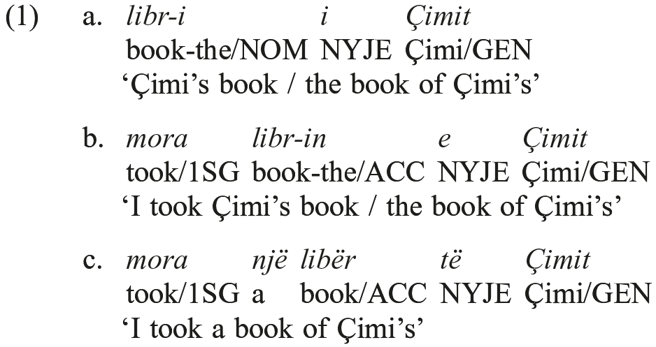

With adjectives, the connective element may or may not occur, with its presence or absence being a matter of morphological and lexical idiosyncrasy, depending on the derivation of the adjective: most basic adjectives are “articulated” (i.e., require the <i>nyje</i>) and certain suffixes always yield articulated adjectives while others (especially but not exclusively, those of foreign origin) always yield unarticulated ones. Some examples of each type are given in (2) and (3) respectively:

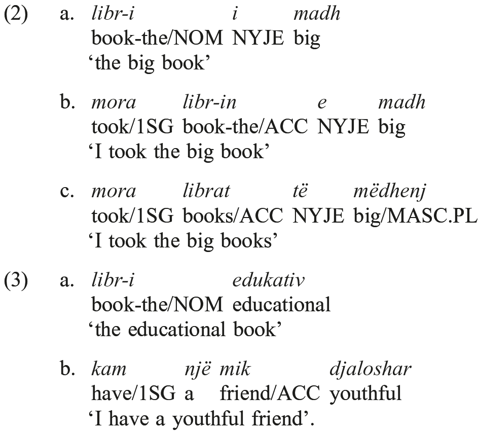

The occurrence of the connective with basic adjectives and its general absence with forms of foreign origin suggest that this is an old trait within Albanian, but it is not one that predates Common Albanian.

Diachronically, the <i>nyje</i> forms continue old demonstrative elements (the <i>t</i>/<i>s</i> alternation from a formal standpoint, though not a distributional one, reflecting in some way the <i>t</i>/<i>s</i> alternation found for instance in Sanskrit <i>sa</i> ‘this/MASC’ vs. <i>tad</i> ‘this/NTR’, though other demonstrative elements might be involved), so that the original syntagm may have involved multiple markings for deixis and definiteness, reinterpreted as a linking element.

### 2.2. Definiteness within the nominal phrase

Definiteness is signaled by means of a postpositive marker, e.g. <i>katund</i> ‘village (NOM)’ / <i>katund-i</i> ‘the village (NOM)’, <i>vajzë</i> ‘girl (ACC)’ / <i>vajzë-n</i> ‘the girl (ACC)’. The definiteness marker, usually called an article, is actually postpositive (enclitic) within the noun phrase as a whole, attaching to the noun itself when the modifier has its usual position after the noun, e.g. <i>vajzë-n të shkretë</i> ‘the miserable girl (ACC)’, but attaching to the adjective when it precedes the noun, for emphasis or contrast, e. g. <i>të shkretë-n vajzë</i> ‘the miserable girl (ACC)’.

The postpositive article, like the connective, has its origins in PIE demonstrative elements (the -<i>n</i> of the accusative singular, for instance, probably reflects the outcome of the PIE accusative *-<i>m</i> with a postposed demonstrative, that is *-<i>m=tom</i> > =<i>n=tom</i> > -<i>nnV</i> > -<i>n[ë]</i>). It is a feature shared with other Balkan languages, in particular Macedonian, Bulgarian, Aromanian, and Daco-Romanian, though each language uses its own native material. Although it is likely to have diffused into these languages through contact, in this case, the postpositive placement may be a substratum feature of an autochthonous Balkan language predating Albanian (so Hamp 1982: 79, based on an analysis of the place name <i>Drobeta</i> as “a Latin misunderstanding or misparsing in Moesia Inferior of *druṷā−tā, a definite noun phrase with postposed article”).

### 2.3. Nominal cases

As the examples above with a variety of nominal cases show, thematic and grammatical relations are indicated by case-forms of nouns. Besides the nominative, accusative, genitive, and dative exemplified above, there is also an ablative case, e.g. <i>zogj pulash</i> ‘birds from-hens (i.e. chicks)’. The ablative is distinct from the dative only in the indefinite plural forms, and it is used somewhat infrequently now, being increasingly replaced in many of its functions by various prepositional phrases or by the dative case.

In Old Albanian (e.g. in the 1555 Buzuku text) and dialectally in contemporary Albanian, there is also a form that is sometimes referred to as a locative case (so Newmark, Hubbard, and Prifti 1982), e.g. <i>malt</i> from <i>mal</i> ‘mountain’ with the preposition <i>në</i> ‘in, on’, thus <i>në malt</i> ‘in/on the-mountain’ (where accusative <i>malin</i> is found with <i>në</i> in other dialects and in the standard language now). This case is referred to as “instrumental” in Matzinger and Schumacher (this handbook, 2.1.).

### 2.4. Prepositions

In addition, Albanian has prepositions that govern nominals in different case forms and signal various adjunct and oblique grammatical relations within the clause. From an Indo-European standpoint, these are not all that remarkable, as all modern Indo-European languages have adpositions of some sort, even though older stages of some of them show adverbial elements (especially Vedic Sanskrit and Homeric Greek) that do not govern object nominals per se, suggesting that PIE may not have had any adpositions. If so, then the occurrence of prepositions in Albanian is an innovation away from PIE syntax but it is one that all the Indo-European languages took part in, a “drift”-like phenomenon.

Two Albanian prepositions, <i>nga</i> ‘from, by’ and <i>tek</i> ‘at/to the location of’, show the trait − unusual both from an Indo-European perspective and more generally cross-linguistically − of governing nouns in the nominative case. In the case of <i>tek</i>, this trait is explainable via its etymology, since this preposition apparently compresses within it traces of PIE correlative syntax, being originally ‘there where NOMINATIVE is’ (so Mann 1932: 72; see also Hamp <i>apud</i> Joseph and Maynard 2000), with the <i>t-</i> of <i>tek</i> reflecting the PIE *to- demonstrative and the <i>-k</i> the relative stem *kʷ- (and with suppression of the copula, as is usual for PIE). The etymology of <i>nga</i> is more obscure, but one might expect a similar sort of explanation for its nominative “object”.

## 3. Verbal syntax

Several features of the Albanian verb qualify as noteworthy from the point of view of historical syntax, including the internal syntax of how certain verbal constructs are composed. Thus mention is made here of the way in which PIE preverbs are realized in Albanian, the formation of various multi-word periphrastic tenses, and the uses of the non-active (mediopassive) voice. Note too that the discussion of weak object pronouns below in 4.2. treats an aspect of Albanian verbal syntax in that the co-occurrence of such pronouns with full objects can be taken as a means of expressing transitivity and thus registering a verb’s argument structure.

### 3.1. Preverbs

Like all other Indo-European subgroups, Albanian shows the accretion onto a verbal root of prefixal elements generally referred to as “preverbs” that once (in PIE) were independent adverbial modifiers within the clause or verb phrase, as in dialectal <i>des</i> ‘die’ versus standard <i>vdes</i> ‘die’. In this regard, therefore, Albanian participated in the same “drift” as other Indo-European languages involving these original adverbials (see 2.4. on prepositions for another aspect of drift involving these elements). Many of these have traceable Indo-European pedigrees (e.g., regarding the form of <i>v-</i>, compare the Sanskrit preverb <i>ava</i>, and for the function of <i>v-</i>, compare Ancient Greek θνήσκω / ἀποθνήσκω ‘die).

For the most part, just one preverb occurs on a verb at a time, so that in this way Albanian is unlike Indo-Iranian, Greek, Celtic, and Balto-Slavic. However, there are a few forms with multiple preverbs, at least from a diachronic perspective, since it is unclear that they could be so identified synchronically due to the degree of fusion between preverbs and verbal root. For instance, the stem <i>hëngër</i>-, which forms the suppletive past tense to the present <i>ha-</i> ‘eat’, derives from a sequence of multiple preverbs attached to a root: *<i>Ho-en-gʷrō-</i>, where *Ho corresponds to the initial element in Greek ὀ-κέλλω ‘I run (a ship) aground’ and *<i>en</i> to Greek ἐν<b>-</b> as in ἐν-τρέπω ‘I turn in, and *<i>gʷrō-</i> is the verbal root seen in Greek βι-βρώ-σκω ‘I eat’, Latin <i>vorō</i> ‘I devour’, etc. A similar phenomenon is seen with some preverbs and the PIE verbal past tense prefixal marker, the so-called “augment”, otherwise not overtly observable in Albanian. In particular, the verb <i>marr</i> ‘take’ is from a preverb *<i>me</i> plus the root and nasal-present formation seen in Greek ἄρνυμαι ‘I gain’, with the <i>-rr-</i> reflecting *-<i>rn</i>-; to explain the vocalism in the past stem, <i>mor-</i>, one can posit *<i>me</i> with the augment *<i>e</i>, and just the root (with no nasal outside of the present system), with a fused (contracted) *<i>mē</i> yielding Albanian <i>mo</i>-. The “interior” positioning of the augment parallels its placement with respect to preverbs in Greek and Sanskrit and thus may reflect an old feature, even if the univerbation took place at the level of the individual branches of Indo-European.

### 3.2. Periphrastic formations

Two-word syntactic combinations that fill paradigmatic slots, so-called “periphrastic” formations, are a key feature of Albanian morphosyntax. The future tense, the perfect system forms, and the modal category known as the “admirative” − indicating (among other modalities) a speaker’s surprise at some unexpected aspect of an event or situation − all now involve, or historically did involve, periphrasis, as does the expression of progressive aspect. In addition, various nonfinite formations are multiword periphrases based on the Albanian participle.

#### 3.2.1. Future tense

There is a major dialectological split within Albanian between a periphrastic future based on ‘have’, found in Geg dialects, and one based on ‘want’, found in Tosk dialects (though the dialect distribution is somewhat more complicated). The Geg future uses an infinitive (marked by a prefixal element <i>me</i>) introduced by an inflected ‘have’ auxiliary, whereas the Tosk future uses a finite subjunctive, introduced by a fixed invariant form <i>do</i>, the third person singular form of ‘want’ (but with its volitional meaning depleted):

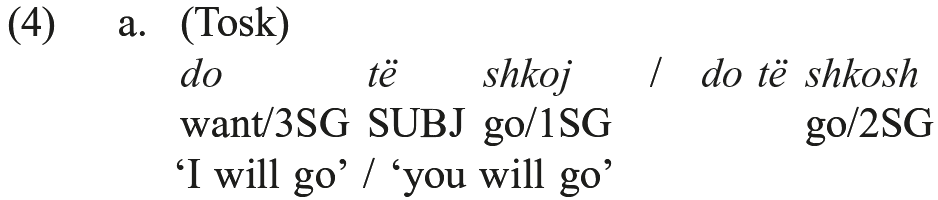

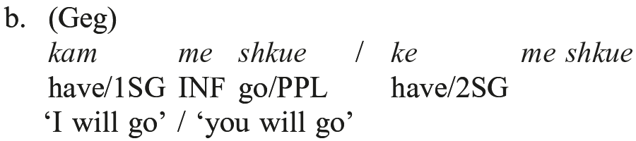

Both formations represent innovations away from the PIE monolectal (synthetic) future, and both must be considered in the context of the Balkan Sprachbund. The ‘want’-based future, especially with an invariant future marker involved, is found in Greek, Aromanian, Daco-Romanian, Macedonian, Bulgarian, and Romani, whereas a ‘have’-based future is found in Macedonian and Bulgarian (where the distribution is grammatically determined, with ‘have’ found mainly in negative forms, and ‘want’ elsewhere) as well as in Daco-Romanian (competing with the ‘want’ future, with some nuanced meaning differences) and some dialects of Aromanian (in negated forms, probably calqued on Macedonian). The exact source of the Albanian futures may well thus lie in contact with one (or more) of those languages, though Vulgar Latin, an important contact language for prehistoric Albanian in the Balkans, may have played a role (note the ‘have’ futures of modern Romance languages, for instance, and there are future-like uses of <i>volō</i> ‘I want’ in late Latin). Moreover, given the existence of parallels outside of Indo-European to both types of future formation, independent emergence of each within Albanian cannot be discounted. But the periphrastic composition of each type historically is clear.

#### 3.2.2. Perfect system

Replacing the synthetic perfect of PIE, Albanian developed a periphrastic perfect, with the verb ‘have’ as an auxiliary for active forms and ‘be’ as an auxiliary for non-active forms; in each case, the main verb is expressed as a participle. Examples are given in (5):

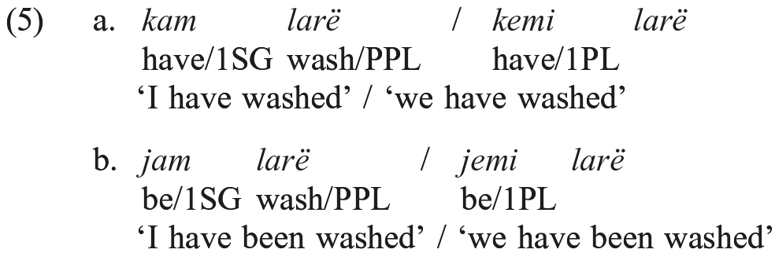

A full set of forms is possible, covering all verbal categories of tense and mood; for instance, a pluperfect active and perfect subjunctive active are given in (6a), and an optative perfect non-active in (6b):

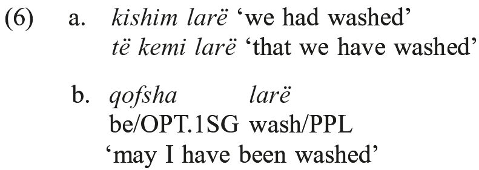

The innovation of an analytic periphrastic perfect is found in the later stages of several branches of Indo-European (compare English and German, for instance, and Romance), so in that sense, here again, Albanian is taking part in a development that may be associated with another characteristic Indo-European drift, in this case towards analytic structures. At the same time, periphrastic perfects with ‘have’ are found in most of the languages of the Balkan Sprachbund (in Macedonian, for instance, such a formation has developed and has come to occupy a different niche in the verbal system from that of the inherited Slavic ‘be’-based perfect), with the pluperfect being a key point of convergence among the languages (it was the point of entry for the whole ‘have’-based perfect of Modern Greek, for instance).

#### 3.2.3. Admirative

Although the use of the admirative is connected with pragmatics and discourse factors, its form clearly reflects an origin in a syntactic combination akin to a perfect formation, consisting of a truncated participle with a postposed inflected form of ‘have’ fused to the participle. There are admirative forms in all tenses and moods, active and non-active; (7) has a sampling (see 3.3. on the non-active formation in [7c]) with glosses that are inadequate as they are not in a suitable discourse context:

<table>
<tr><td>(7)</td><td>a.</td><td><i>paskam</i> ‘I might have’ (cf. participle <i>pasur</i> ‘had’) <i>qenke</i> ‘are you really?’ (cf. participle <i>qenë</i> ‘been’)</td></tr>
<tr><td></td><td>b.</td><td><i>paskam larë</i> ‘I might have washed’ (PERF.ADM)</td></tr>
<tr><td></td><td>c.</td><td><i>u lakam</i> ‘I might wash myself, I might be washed’ (cf. participle <i>larë</i>)</td></tr>
</table>

Although built with native Albanian material, the admirative is clearly an innovation, constituting a category that could not have been a part of the PIE verbal system (inasmuch as it is absent from every ancient Indo-European language). It shows affinities with similar categories in Macedonian and Bulgarian that were built on their perfect formations; in the emergence of this category, all of these languages may have been influenced by Turkish, a language with an inherited category marking a speaker’s epistemic stance towards a narrated event.

#### 3.2.4. Nonfinite formations

Albanian inherited a participle, generally ending in <i>-r</i> in Tosk, reflecting a PIE *-<i>no</i>-suffix, that, like analogously formed participles in Sanskrit (and cf. Hittite *-<i>nt</i>-participles), generally has a passive value when formed from transitives and an active value when formed from intransitives, e.g. <i>shkruar</i> ‘(having been) written’, <i>shëtitur</i> ‘(having) strolled’. From this participle, a variety of periphrastic nonfinite formations are made, all innovative, <i>vis-à-vis</i> PIE, in form and to a large extent in function; following the terminology of Newmark, Hubbard, and Prifti (1982: 64−65), these are given in (8):

<table>
<tr><td>(8)</td><td>a.</td><td>Privative: <i>pa larë</i> ‘without washing’</td></tr>
<tr><td></td><td>b.</td><td>Gerundive: <i>duke larë</i> ‘while washing’</td></tr>
<tr><td></td><td>c.</td><td>Infinitive: <i>për të larë</i> ‘(in order) to wash’</td></tr>
<tr><td></td><td>d.</td><td>Absolutive: <i>me të larë</i> ‘upon washing’</td></tr>
</table>

Note too that Geg has an infinitive formed with <i>me</i> and a shortened form of the participle, e.g. <i>me punue</i> ‘to work’, as opposed to the widespread Tosk <i>për të punuar</i>. Still, there are traces of a Geg-like infinitive with <i>me</i> in some dialects of Tosk.

The composition of these formations is fairly clear and suggests a relatively recent development; most of the relevant formative elements occur otherwise as prepositions with nominal objects (see 2.4.) − cf. <i>pa</i> ‘without’, <i>për</i> ‘for’, <i>me</i> ‘with’. It is likely moreover that the <i>të</i> of the Tosk infinitive is a nominalizing element (perhaps to be identified with the <i>nyje</i> particle) that combines with participles; cf. <i>të dhënat</i> ‘data’, from the participle of ‘give’ (see also 4.3.). In that regard, inasmuch as infinitives in other Indo-European languages typically are formed from deverbal nouns, and the *<i>-no-</i> suffix of the participle that figures in the Albanian infinitival formation also occurs in the Germanic infinitive (cf. Gothic <i>bairan</i> ‘to bear’, from *<i>bheronom</i>) and forms a deverbal derivative in Sanskrit (Ved. <i>bháraṇam</i> ‘[an act of] bearing’), the Albanian infinitive may be a replacement for a PIE infinitival prototype rather than a wholly innovated category and formation. Further, if the occasional <i>me</i> formations in some Tosk dialects are taken seriously as relics, and not as borrowings from Geg, that proto-Albanian infinitive may well have been of the Geg type.

#### 3.2.5. Progressive aspect

One further periphrasis with grammatical value is seen in the two ways in which the indication of progressive aspect in the present and past can be realized. The marker <i>po</i> can occur with present and imperfect tense forms, as in (9ab).

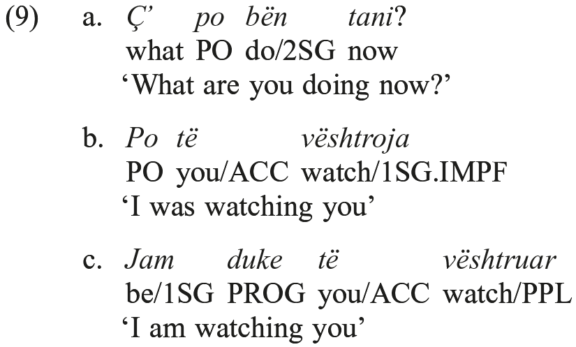

The second type seen (9c), being built on a relatively new nonfinite formation, most likely itself represents a recent development, but the type with <i>po</i> is surely an old feature of Albanian, as it is found in both major dialects, even if innovative from the standpoint of PIE. Newmark, Hubbard, and Prifti (1982: 36) identify this verbal <i>po</i> with the “emphatic particle” <i>po</i> meaning ‘yes, indeed, exactly so!’, though perhaps in a different way; Hamp (<i>apud</i> Joseph 2011) has derived <i>po</i> from *<i>pēst</i>, a combination of an asseverative particle *<i>pe</i> (cf. Latin <i>quip-pe</i> why so?; of course’ [from *<i>kʷid-pe</i>]) with a 3sg injunctive form of *<i>H₁es-</i> ‘be’, so that <i>po</i> is etymologically ‘[it is] just [now] so’, and this “just-now” meaning is the basis for the emergence of a temporal progressive sense for <i>po</i>. Interestingly, this usage has no counterpart in any of the other Balkan languages.

### 3.3. Non-active voice

Albanian has a categorial distinction between active and non-active voice, where the non-active corresponds to what is also called “middle” or “mediopassive”. There is a distinct set of endings added to a special stem in the present non-active system (taking in the present, imperfect, and future tenses and the subjunctive mood), and in other forms (taking in the past tense, the optative, admirative, and imperative moods, and nonfinite forms) the non-active is formed from the combination of active forms with a voice marker <i>u</i>, that is generally a prefix (but postposed in the imperative). Returning to the theme of 3.2.3., there is a periphrastic non-active in the perfect, consisting of ‘be’ plus the participle. Some examples of all of these formations are given in (10):

<table>
<tr><td>(10)</td><td><i>laj</i> ‘I wash’ / <i>lahem</i> ‘I am washed, I wash myself’</td></tr>
<tr><td></td><td><i>lava</i> ‘I washed’ / <i>u lava</i> ‘I was washed, I washed myself’</td></tr>
<tr><td></td><td><i>lafsha</i> ‘may I wash’ / <i>u lafsha</i> ‘may I be washed, may I wash myself’ <i>për të larë</i> ‘(in order) to wash’ / <i>për t’u larë</i> ‘(in order) to be washed; to wash myself’</td></tr>
<tr><td></td><td><i>kam larë</i> ‘I have washed’ / <i>jam larë</i> ‘I have been washed, I have washed myself’</td></tr>
</table>

As the glosses in (10) indicate, the uses of non-active forms include passive and reflexive meanings; in plurals, a reciprocal sense is possible too, e.g. <i>lahemi</i> ‘we wash each other’. Some verbs are deponent, occurring only in the non-active, even if their meaning is active, e.g. <i>kollem</i> ‘I cough’. In addition, there is an impersonal use of the third person non-active forms, most often negated, to indicate a generalized activity, even with intransitives, e.g. <i>s’shkohet</i> ‘there’s no going’ (cf. <i>shkon</i> ‘it goes’).

These uses are familiar and widespread across Indo-European (cf. the Greek and Sanskrit middle voice), and thus they surely continue PIE uses of non-active. From the standpoint of form, it is noteworthy that Albanian is one of the two modern Indo-European languages, along with Greek, that has an inherited distinct monolectal (synthetic) verbal form for the non-active. For Albanian, though, the synthetic form is restricted to the present system and related forms; in the aorist (and other categories, especially the nonfinite forms) one encounters the analytic formation, as in (10), employing the particle <i>u</i>, which derives (in a somewhat complicated way) from the PIE reflexive element *<i>swe</i>.

## 4. Word order

The order of elements in the Albanian clause is typically subject − verb − object, when full nominals are involved as subject and object. Still, case-marking and the use of weak object pronouns to register arguments on the verb (see 5.2.) allow for greater freedom of order for the major constituents of a clause, in some instances associated with pragmatic factors such as topicality. Moreover, it is quite common in discourse for full nominals to be replaced by pro-forms, in particular weak object pronouns for direct and indirect objects, and “zero” (the absence of an overt form altogether) for the subject. The freedom of constituent order in Albanian parallels what is found in other Indo-European languages with similar morphological cues for identifying arguments.

## 5. Sentential syntax

In the area of clausal syntax, there are three main phenomena to consider: negation, weak object pronoun (“clitic”) behavior, and complementation.

### 5.1. Negation

Albanian has a distinction between what may be called “modal” and “nonmodal” negation, roughly equivalent to nonindicative versus indicative negation. Thus, as in (11), the present, imperfect, aorist, perfect, and future tenses are negated with <i>s’</i> or <i>nuk</i>, whereas imperative, subjunctive, and optative forms (as well as nonfinite formations), as in (12), are negated with <i>mos</i>:

<table>
<tr><td>(11)</td><td>a.</td><td><i>Unë</i> nuk <i>e njoh</i> ‘I do not know him’ (PRES)</td></tr>
<tr><td></td><td>b.</td><td>S’<i>ke para</i> ‘You do not have money’ (PRES)</td></tr>
<tr><td></td><td>c.</td><td>Nuk <i>do të vijë atje</i> ‘He won’t come here’ (FUT)</td></tr>
<tr><td></td><td>d.</td><td>Nuk <i>lexonte</i> ‘He was not reading’ (IMPF)</td></tr>
<tr><td></td><td>e.</td><td>S’<i>lexuam një libër</i> ‘We did not read a book’ (AOR)</td></tr>
<tr><td></td><td>f.</td><td>S’<i>e kanë parë</i> ‘They haven’t seen him’ (PERF)</td></tr>
</table>

<table>
<tr><td>(12)</td><td>a.</td><td><i>Përpiqet të</i> mos <i>qeshë</i> ‘He tries not to laugh’ (SUBJ)</td></tr>
<tr><td></td><td>b.</td><td>Mos <i>shko në Tiranë</i> ‘Don’t go to Tirana’ (IMPV)</td></tr>
<tr><td></td><td>c.</td><td>Mos <i>vdeksh kurrë</i> ‘May you never die’ (OPT)</td></tr>
<tr><td></td><td>d.</td><td><i>Erdha ne Tiranë për të</i> mos <i>u mërzitur</i> ‘I came to Tirana (in order) not to be bored’ (NONFINITE)</td></tr>
</table>

This differential usage of <i>nuk</i>/<i>s’</i> and <i>mos</i> continues an old distinction, one that is inherited from Proto-Indo-European. Greek, Armenian, and Indo-Iranian show essentially this same distinction: Ancient Greek − οὐ versus μή (Modern Greek <i>đen</i> [from Ancient Greek οὐδέν, built with the οὐ negator] versus <i>mi</i>); Armenian − <i>očʿ</i> versus <i>mi</i>; Sanskrit/ Avestan − <i>na</i> versus <i>mā</i>. μή/<i>mi</i>/<i>mā</i> negate modal forms and οὐ/<i>očʿ</i>/<i>na</i> negate indicatives. They reflect a PIE distinction of indicative *<i>ne</i> versus modal *<i>mē</i> (Greek οὐ and Armenian <i>očʿ</i> indirectly so, being from a truncation of *<i>ne H ₂oyu kʷid</i> ‘not ever at-all’ [Cowgill 1960], to which Albanian <i>as-</i> ‘no-’ [as in ‘no one’ or ‘nothing’ or ‘nowhere’] may belong, just as <i>s’</i> represents a trunction of *<i>né kʷid</i>, with the same extension as in <i>mos</i>, from *<i>mḗ kʷid</i>).

At the same time, <i>mos</i> shows some innovative uses that in part go beyond negation, and, interestingly, are shared by Greek and in some instances other Balkan languages. One such use is in dubitative questions, as in (13):

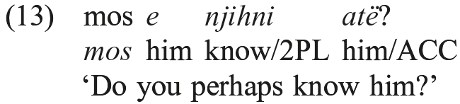

which is matched functionally by such questions with μή in Ancient Greek, and, as in (14), <i>mi</i> in Modern Greek, but is found in no other Indo-European languages:

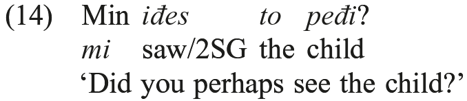

Thus, this may well be an early Greek innovation that was borrowed (calqued) into Albanian, but still represents a new usage that entered Albanian post-PIE.

Another such innovation with <i>mos</i> is an independent use as a one-word prohibitive utterance (15a), also found in Modern Greek (15b) and Romani (15c), but interestingly, not in Ancient Greek nor in any other Indo-European language:

<table>
<tr><td>(15)</td><td>a.</td><td><i>Mos</i>! ‘Don’t’</td></tr>
<tr><td></td><td>b.</td><td><i>Mi</i>! ‘Don’t!’</td></tr>
<tr><td></td><td>c.</td><td><i>Ma be</i>, <i>Ismet</i>! ‘Hey you, Ismet, don’t [<i>ma</i>]!’</td></tr>
</table>

Given the absence of this usage from Ancient Greek, it quite possibly reflects an Albanian innovation that spread into Modern Greek (and Romani).

Both the question use and the independent prohibition use of <i>mos</i> may reflect extensions within Albanian of simple prohibitive *<i>mḗ</i>, inasmuch as the usage in (15) is clearly related to the expression of verbal prohibitions (possibly, therefore, through elision of a now-only-implicit verb), and the uses in (13)/(14) are associated with weak negation of a modal type. However, given the chronological and geographical distribution of clear parallels in Indo-European outside of Albanian, they seem to represent innovations affecting Albanian that took place on Balkan soil, whether emanating from Albanian itself or finding their way into Albanian from some other Balkan language.

### 5.2. Clitics

Another important aspect of Albanian clausal syntax is the occurrence of weak (so-called “clitic”) forms of personal pronouns, e.g. accusative/dative <i>më</i> ‘me’ (versus “strong” <i>mua</i>), accusative/dative <i>e</i> ‘him, her’ (versus strong <i>atë</i>), or dative <i>u</i> ‘to them’ (versus strong <i>atyre</i>). The presence of such forms in the grammar of Albanian is surely a reflex of a PIE strong/weak distinction, given that similar alternations are found in Greek, Hittite, Indo-Iranian (especially Vedic and Avestan), Old Church Slavonic, and Old Irish, among other languages, and to some extent, the forms of the weak pronouns match up well (<i>m-</i> in first person singular, <i>t-</i> in second person singular, <i>n-</i> in first person plural, etc.).

The positioning of the weak pronouns, however, is probably not old but shows affinity with the innovative positioning of parallel elements in Greek (innovative <i>vis-à-vis</i> Ancient and Medieval Greek, cf. Pappas 2003) and Macedonian (innovative <i>vis-à-vis</i> South Slavic, as a comparison with Old Church Slavonic and Bulgarian shows) and is thus probably tied in some way to contact among these languages. In Albanian, the weak pronouns precede all verb forms, though with imperatives they may show postpositive placement:

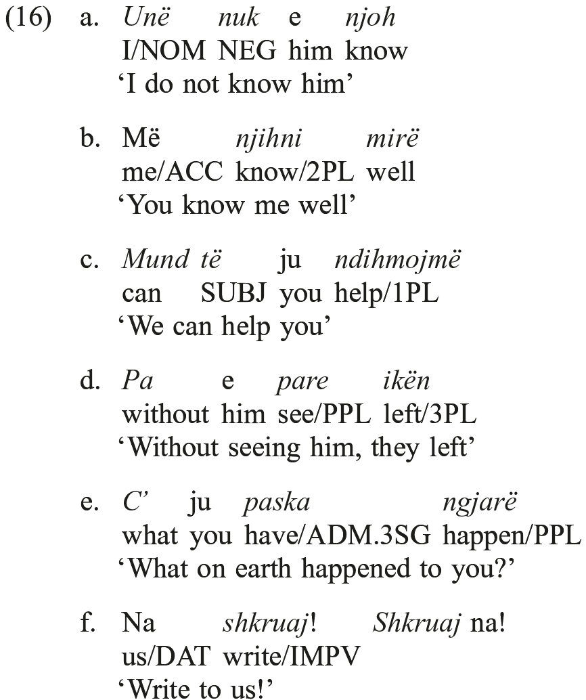

Assuming some sort of “Wackernagel” placement of weak pronouns for PIE, that is, in second position within their governing unit (phrase or clause), as proposed by Wackernagel (1892), the Albanian placement shows two innovations: it is verb-centered (always adjacent to the verb), rather than positioned relative to some element in the clause or phrase, and it involves (nearly) constant pre-positioning (proclisis) of the weak form. The postpositive (enclitic) placement in the imperative could, however, reflect an inherited trait, since imperatives typically would be initial within their clause (as the lone verb with the subject suppressed), and thus an enclitic element would actually be in second position.

One striking fact about the placement of weak pronouns is their positioning in the imperative plural, where the pronoun can be interior to the person/number marker, thus an apparent “endoclitic” (a word-internally positioned clitic):

<table>
<tr><td>(17)</td><td><i>Shkrua</i>më<i>ni</i> ‘Write to me!’ (vs. Më <i>shkruani</i> ‘idem’).</td></tr>
</table>

Admittedly, this placement may say more about the nature of the 2PL ending <i>-ni</i> than about the pronoun, since <i>-ni</i> shows other signs of having a “freer” status than that of other person/number endings. In particular, it can occur as a “plural” marker with a number of interjections, adverbials, particles, and even greetings, forms that would not ordinarily be thought of as being compatible with a verbal plural ending; a few such cases are given in (18), from Newmark, Hubbard, and Prifti (1982: 324):

<table>
<tr><td>(18)</td><td>a.</td><td><i>Mos</i>ni ‘Don’t (you all)!’ (cf. <i>Mos</i>! ‘Don’t’ [15a])</td></tr>
<tr><td></td><td>b.</td><td><i>Forca</i>ni ‘Heave ho (you all)!’ (cf. <i>forca</i> ‘heave ho!’ [from <i>forca</i> ‘powers’])</td></tr>
<tr><td></td><td>c.</td><td><i>Mirëmëngjes</i>ni ‘Good morning (you all)!’ (cf. <i>Mirëmëngjes</i> ‘good morning’)</td></tr>
</table>

These suggest that <i>-ni</i> may have once had greater freedom than an ending like <i>-(j)më</i> for first person plural, and if so, then diachronically <i>shkrua-më-ni</i> might reflect a later accretion of a once-independent “ending” onto an imperative form with a postpositive weak pronoun object.

Interestingly, there is a parallel in Modern Greek to this seemingly unusual pronoun placement in imperatives; in Thessalian Greek (see Tzartzanos 1909), one finds intercalated <i>-m-</i> for a first person singular object between the root and the second plural imperative ending, with a few verbs, e.g. <i>do-m-ti</i> ‘(You all) give me!’ (literally: “give-me-PL!”). The <i>shkrua-më-ni</i> placement, therefore, may represent a contact-induced innovation in Albanian, though it is as likely that Greek borrowed this construction from Albanian (specifically, from Arvanitika, the Tosk Albanian dialect spoken in Greece for the past 600 years or so, with a heavy concentration of speakers in central Greece), and independent innovation cannot be ruled out.

A further innovative aspect of Albanian syntax involving weak pronouns is that they can co-occur with full object forms, either strong forms of pronouns or full noun phrases, as in (19):

<table>
<tr><td>(19)</td><td>a.</td><td>E <i>pashë Gjonin</i> ‘I saw John’ (literally: “him I-saw the-John”)</td></tr>
<tr><td></td><td>b.</td><td>Të <i>pamë ty</i> ‘We saw you’ (literally: “you we-saw you”)</td></tr>
<tr><td></td><td>c.</td><td>I <i>dha Gjonit një libër</i> ‘He gave John a book’ (literally: “to-him he-gave to-the-John a book”)</td></tr>
</table>

This “clitic doubling” (also called “object reduplication”) has a largely pragmatic function, having to do with information flow, topicality, focus, and the like (see Friedman 2008). However, in certain contexts, it has a purely grammatical (i.e. syntactic) function, occurring obligatorily when co-indexing a dative case-marked indirect object, so that (19c) without the cross-indexing <i>I</i> doubling the object, is ungrammatical (*<i>Dha Gjonit një libër</i>).

Clitic doubling occurs throughout the Balkan languages. In Greek, it is entirely pragmatically linked, whereas in Macedonian, a grammatical use parallel to that in Albanian is found, with obligatory doubling of full indirect objects. Given the distribution of this phenomenon and its relatively late appearance in Greek (i.e., it is not part of Ancient Greek syntax) and in other Indo-European languages (e.g. in Spanish, but not in Latin), clitic doubling seems to be a Balkan innovation that has entered Albanian. Most likely its emergence is to be tied to the need for communicative clarity, as expressed through redundancy and emphasis, in cross-language interactions among speakers of different languages with less-than-native command of the other language.

One final use of a subset of the weak pronouns that is noteworthy is for marking the speaker’s emotional involvement in the action expressed in the clause. There is no doubling, since there is no formal object, and the only forms possible here are the first and second person singular and first person plural weak dative pronouns. The function is essentially that of the so-called “dative of interest” or “ethical dative”, and as such, given that there are parallels for this usage in non-Balkan Indo-European languages (e.g. Latin and Germanic), it most likely represents an archaism in Albanian grammar. Some of the more complicated combinatory possibilities that result, as with the 1SG + 2SG + 3PL in (20) (from Newmark, Hubbard, and Prifti 1982: 27), indicating here both speaker and hearer involvement and a doubled object, may well be an Albanian innovation.

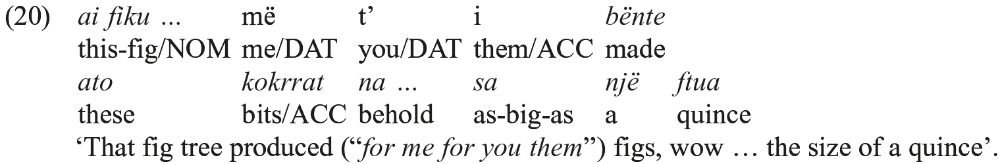

### 5.3. Complementation

One further striking feature of Albanian syntax that aligns it with Balkan Sprachbund languages and differentiates it from most other Indo-European languages is the preponderance of subordinate clauses with finite verbs − most typically subjunctives marked with <i>të</i> − inflected for person and number. This finite complementation means, from a structural standpoint, that all verbs in a sentence are fully “specified” as to person and number and in some instances, tense. This is a feature which links Albanian to the Balkan Sprachbund, as it is found, to varying degrees throughout the region, most thoroughly in Greek and Macedonian, and fairly intensely in Bulgarian, Aromanian, and Daco-Romanian. Presumably, therefore, this phenomenon is not all that old in Albanian, and dates to the period of intense contact with other Balkan languages in the Middle Ages (especially the Ottoman period). Like clitic doubling (5.2.), the use of finite complements instead of infinitives may have been a function of a desire on the part of speakers for clarity of communication via redundancy in a multi-lingual contact situation. (See Joseph 1983 on this Balkan trait, and Chapter 4 on Albanian specifically.)

The extensive use of finite complementation is actually more a feature of the Tosk dialect of Albanian (and thus of the standard language, which is generally based on Tosk) than of the Geg dialect. As noted in 3.2.4., Geg has an infinitive, consisting of the marker <i>me</i> with the participle, and it is used in complementation in contexts in which Tosk uses a finite complement. Some Tosk examples of finite complements, governed by verbs, adjectives, and nouns, are given in (21), and some Geg examples of infinitival subordination, governed by verbs, nouns, and a subordinating conjunction, are seen in (22).

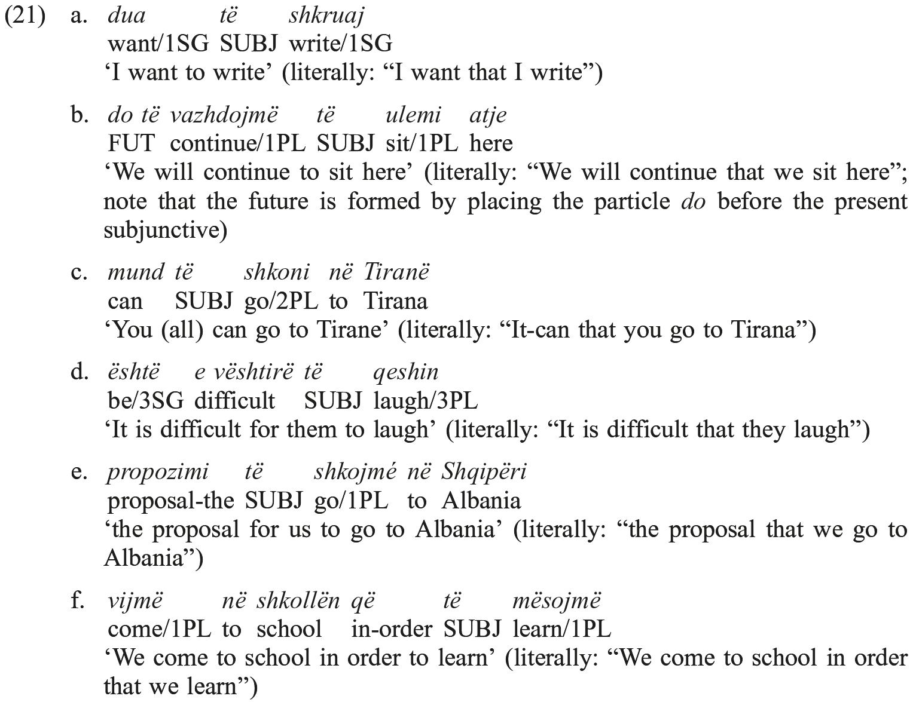

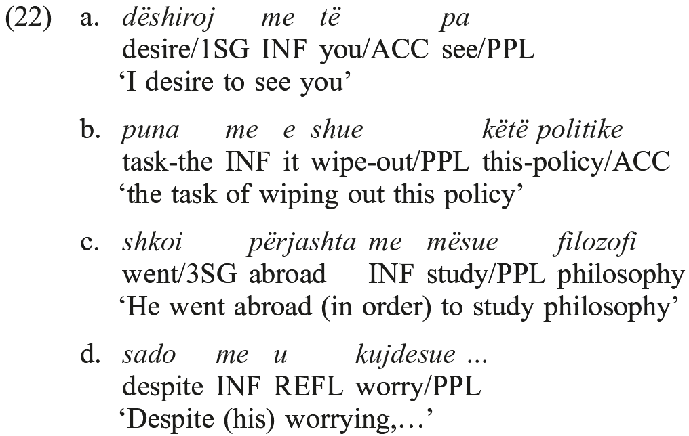

Interpreting these facts historically is even further complicated by the fact that Tosk also has an infinitive, as seen above in 3.2.4., with the form <i>për të</i> + Participle. The infinitive in Tosk has rather limited uses, mainly occurring in the expression of purpose, though it can be used in complementation, as in (23).

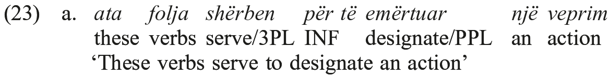

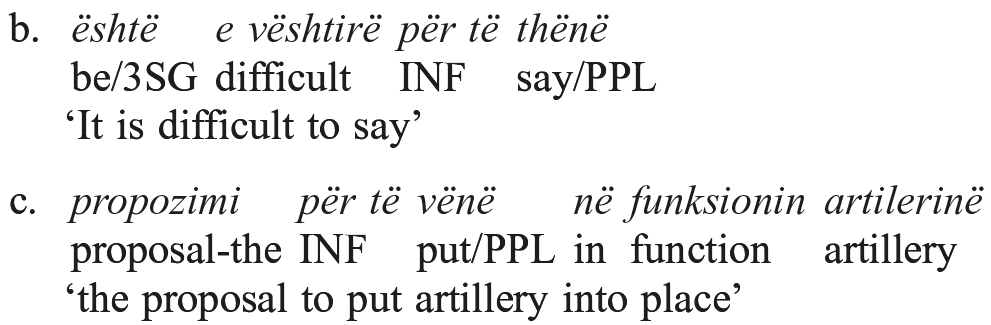

The <i>për të</i> + participle formation has the appearance of being a relatively recent creation. Importantly, a formation that is somewhat similar, but at the same time different in a significant way, is found in Old Albanian. In the Buzuku text, <i>për të</i> occurs with a true nominalized element, clearly so since it shows marking for definiteness and case, e.g. <i>për të lutunit</i> ‘for the prayer’ (with definite dative case marking on the participle <i>lutun</i>from <i>lus</i> ‘invoke’). Moreover, non-active voice marking as illustrated in 3.3., (10), seems not to occur with these early <i>për të</i> formations (and is not allowed in the ostensibly parallel Arvanitika formation). The passage from a nominal formation to a verbal one, capable of marking voice distinctions, is thus an innovation that took place within historically documented Albanian.
