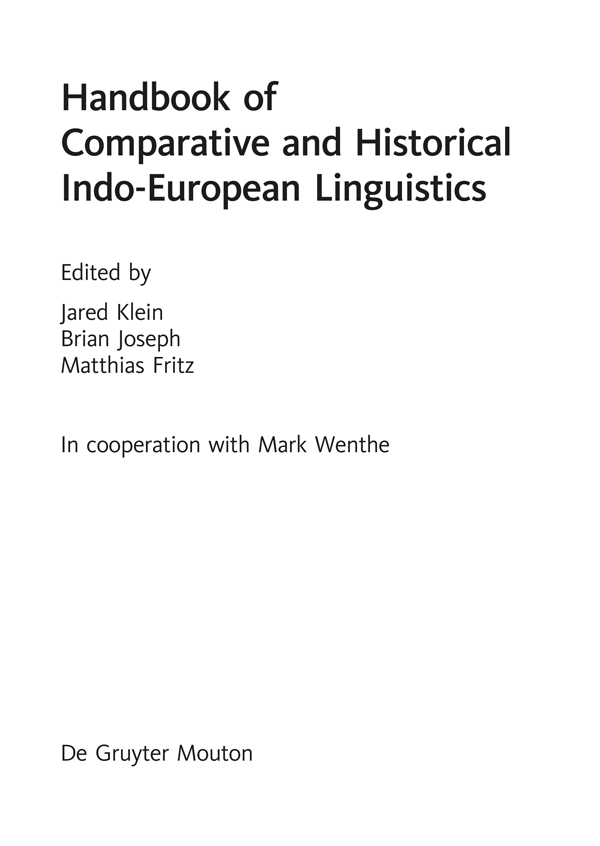

<!-- source-file: content/02_Halftitle.xhtml -->

Handbook of Comparative and

Historical Indo-European Linguistics

HSK 41.3

<!-- source-file: content/03_Front_Matter.xhtml -->

Handbücher zur Sprach- und Kommunikations-wissenschaft

Handbooks of Linguistics  and Communication Science

Manuels de linguistique et  des sciences de communication

Mitbegründet von Gerold Ungeheuer  Mitherausgegeben (1985−2001) von Hugo Steger

Herausgegeben von / Edited by / Edités par  Herbert Ernst Wiegand

Band 41.3

De Gruyter Mouton

<!-- source-file: content/04_Title.xhtml -->

<!-- source-file: content/05_Copyright.xhtml -->

ISBN 978-3-11-054036-9

e-ISBN (PDF) 978-3-11-054243-1

e-ISBN (EPUB) 978-3-11-054052-9

ISSN 1861-5090

<i>Library of Congress Cataloging-in-Publication Data</i>

Names: Klein, Jared S., editor. | Joseph, Brian D., editor. | Fritz, Matthias, editor.

Title: Handbook of comparative and historical Indo-European linguistics: an international handbook / edited by Jared Klein, Brian Joseph, Matthias Fritz; in cooperation with Mark Wenthe.

Description: Berlin; Boston: De Gruyter Mouton, 2017- | Series: Handbücher zur Sprach- und Kommunikationswissenschaft = Handbooks of linguistics and communication science, ISSN 1861-5090; Band 41.1- | Includes bibliographical references and index.

Identifiers: LCCN 2017042351| ISBN 9783110186147 (volume 1: hardcover) | ISBN

9783110261288 (volume 1: pdf) | ISBN 9783110393248 (volume 1: epub) | ISBN

9783110521610 (volume 2: hardcover) | ISBN 9783110523874 (volume 2: pdf) | ISBN

9783110521757 (volume 2: epub) | ISBN 9783110540369 (volume 3: hardcover) | ISBN

9783110542431 (volume 3: pdf) | ISBN 9783110540529 (volume 3: epub)

Subjects: LCSH: Indo-European languages--Grammar, Comparative. | Indo-European languages-Grammar, Historical. | BISAC: LANGUAGE ARTS & DISCIPLINES / Linguistics / General.

Classification: LCC P575.H36 2017 | DDC 410--dc23

LC record available at https://lccn.loc.gov/2017042351

<i>Bibliographic information published by the Deutsche Nationalbibliothek</i>

The Deutsche Nationalbibliothek lists this publication in the Deutsche Nationalbibliografie; detailed bibliographic data are available on the Internet at http://dnb.dnb.de.

© 2018 Walter de Gruyter GmbH, Berlin/Boston

Cover design: Martin Zech, Bremen

[www.degruyter.com](http://www.degruyter.com)

<!-- source-file: content/06_toc.xhtml -->

# Contents

Volume 3

XIII. Slavic

80. The documentation of Slavic

81. The phonology of Slavic

82. The morphology of Slavic

83. The syntax of Slavic

84. The lexicon of Slavic

85. The dialectology of Slavic

86. The evolution of Slavic

XIV. Baltic

87. The documentation of Baltic

88. The phonology of Baltic

89. The morphology of Baltic

90. The syntax of Baltic

91. The lexicon of Baltic

92. The dialectology of Baltic

93. The evolution of Baltic

XV. Albanian

94. The documentation of Albanian

95. The phonology of Albanian

96. The morphology of Albanian

97. The syntax of Albanian

98. The lexicon of Albanian

99. The dialectology of Albanian

100. The evolution of Albanian

XVI. Languages of fragmentary attestation

101. Phrygian

102. Venetic

103. Messapic

104. Thracian

105. Siculian

106. Lusitanian

<!-- source: content/06_toc.xhtml#toc_2 -->
107. Macedonian

108. Illyrian

109. Pelasgian

XVII. Indo-Iranian

110. The phonology of Proto-Indo-Iranian

111. The morphology of Indo-Iranian

112. The syntax of Indo-Iranian

113. The lexicon of Indo-Iranian

XVIII. Balto-Slavic

114. Balto-Slavic

115. The phonology of Balto-Slavic

116. Balto-Slavic morphology

117. The syntax of Balto-Slavic

118. The lexicon of Balto-Slavic

XIX. Wider configurations and contacts

119. The shared features of Italic and Celtic

120. Graeco-Anatolian contacts in the Mycenaean period

XX. Proto-Indo-European

121. The phonology of Proto-Indo-European

122. The morphology of Proto-Indo-European

123. The syntax of Proto-Indo-European

124. The lexicon of Proto-Indo-European

XXI. Beyond Proto-Indo-European

125. More remote relationships of Proto-Indo-European

General index

Languages and dialect index

Volume 1

Preface

I. General and methodological issues

1. Comparison and relationship of languages

2. Language contact and Indo-European linguistics

3. Methods in reconstruction

4. The sources for Indo-European reconstruction.

5. The writing systems of Indo-European

6. Indo-European dialectology

7. The culture of the speakers of Proto-Indo-European

8. The homeland of the speakers of Proto-Indo-European

II. The application of the comparative method in selected language groups other than Indo-European

9. The comparative method in Semitic linguistics

10. The comparative method in Uralic linguistics

11. The comparative method in Caucasian linguistics

12. The comparative method in African linguistics

13. The comparative method in Austronesian linguistics

14. The comparative method in Australian linguistics

III. Historical perspectives on Indo-European linguistics

15. Intuition, exploration, and assertion of the Indo-European language relationship

16. Indo-European linguistics in the 19th and 20th centuries: beginnings, establishment, remodeling, refinement, and extension(s)

17. Encyclopedic works on Indo-European linguistics

18. The impact of Hittite and Tocharian: Rethinking Indo-European in the 20th century and beyond

IV. Anatolian

19. The documentation of Anatolian

20. The phonology of Anatolian

21. The morphology of Anatolian

22. The syntax of Anatolian: The simple sentence

23. The lexicon of Anatolian

24. The dialectology of Anatolian

V. Indic

25. The documentation of Indic

26. The phonology of Indic

27. The morphology of Indic (old Indo-Aryan)

28. The syntax of Indic

29. The lexicon of Indic

30. The dialectology of Indic

31. The evolution of Indic

VI. Iranian

32. The documentation of Iranian

33. The phonology of Iranian

34. The morphology of Iranian

35. The syntax of Iranian

36. The lexicon of Iranian

37. The dialectology of Iranian

38. The evolution of Iranian

VII. Greek

39. The documentation of Greek

40. The phonology of Greek

41. The morphology of Greek

42. The syntax of Greek

43. The lexicon of Greek

44. The dialectology of Greek

45. The evolution of Greek

Volume 2

VIII. Italic

46. The documentation of Italic

47. The phonology of Italic

48. The morphology of Italic

49. The syntax of Italic

50. The lexicon of Italic

51. The dialectology of Italic

52. The evolution of Italic

IX. Germanic

53. The documentation of Germanic

54. The phonology of Germanic.

55. The morphology of Germanic

56. The syntax of Germanic

57. The lexicon of Germanic

58. The dialectology of Germanic

59. The evolution of Germanic

X. Armenian

60. The documentation of Armenian

61. The phonology of Classical Armenian

62. The morphology of Armenian

63. The syntax of Classical Armenian

64. The lexicon of Armenian

65. The dialectology of Armenian

66. The evolution of Armenian

XI. Celtic

67. The documentation of Celtic

68. The phonology of Celtic

69. The morphology of Celtic

70. The syntax of Celtic

71. The lexicon of Celtic

72. The dialectology of Celtic

73. The evolution of Celtic

XII. Tocharian

74. The documentation of Tocharian

75. The phonology of Tocharian

76. The morphology of Tocharian

77. The syntax of Tocharian

78. The lexicon of Tocharian

79. The dialectology of Tocharian

<!-- source-file: content/07_chapter01_1.xhtml -->
