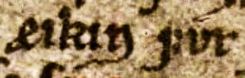
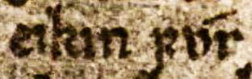
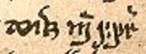
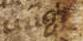
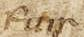
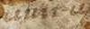
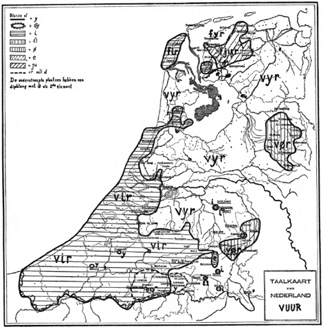

# Chapter 3. The Heteroclite Noun for Fire

<!-- page: 55 -->

Chapter 3.

THE HETEROCLITE NOUN FOR ‘FIRE’

§3.1.

THE GERMANIC MATERIAL FOR THE WORD FOR ‘FIRE’

In this chapter I discuss the inherited heteroclite noun for ‘fire’. It seems that Indo- European had two words for ‘fire’: *h₁n gw-ni-s (cf. Lat. ignis, Lith ugnìs, etc. < *h₁n w-ni-s) and *péh₂ [unclear] , which is discussed in this chapter. According to Gamkrelidze & Ivanov (1995:238, 605), the two different forms reflects a binary classification of nouns as inactive and active. The form *h₁n w-ni-s had active force and it is no surprise that the very important Rg veda deity [unclear] n ḥ (< *h₁n w-ni-s) continues the active word. Whereas the active noun *h₁n w-ni-s did not survive in Germanic, the inactive heteroclite noun *péh₂ [unclear] did. The conception was in no way still of an inactive force among Germanic peoples and Grimm speaks explicitly of the conception of fire as an animate being (Grimm, 1844:567f. “ein lebendiges wesen”). In the following paragraphs I discuss the Germanic material for the heteroclite noun for ‘fire’. Then, in §3.2, p.72, I discuss the comparative Indo-European material and reconstruct the PIE paradigm. Finally, in §3.2.3, p.72 I provide a sketch of the development of the Germanic forms from the PIE heteroclite paradigm. I now turn to the material of the individual Germanic languages, starting with Gothic.

§3.1.1

GOTHIC

Gothic possesses a neuter paradigm with a strong stem fon and a weak stem funin-
‘fire, πῦρ’ occurring a total of 19 times. The strong stem fon (NOM/ACC.SG) occurs 11 times
and the weak stem funin- 8 times (GEN.SG funins, DAT.SG funin).32 The word has an irregular,
uninflected strong stem fon and inflects in the weak cases like the neuter n-stems, cf. hairt-o
[n., n-st.] ‘heart’ with the weak stem hairt-in-, augo [n., n-st.] ‘eye’ with a weak stem aug-in-,
etc. The weak stem should therefore be analyzed as fun-in- attaching the suffix -in- to the root
fun-. The vowel length of <u> in the root fun- cannot be ascertained from the Gothic material,
however, because the Gothic writing system does not distinguish length for the grapheme
<u>. In my opinion the word cannot be separated from ON funi ‘fire’ (cf. §3.1.2, p.57 below),

32 The strong stem (NOM/ACC.SG) fon occurs in Mt. 7:19, 25:41, Jo. 15:6, Lc. 3:9, 9:54, Mc. 9:22, 9:43, 9:44,
9:45, 9:46, 9:48, and the weak stem: GEN.SG funins in Mt 5:22, Mc. 9:49, R. 12:20, Th.II 1:8, and the DAT.SG
funin in Lc. 3:16, 3:17, 17:29, Mc. 9:47.

<!-- page: 56 -->

which has a short vowel. This would strongly suggest that the root fun- contains a short
vowel. Nevertheless, the vowel may have been long if the form LG form füünsk is cognate
(see immediately below). There is no transparent connection between the gradation of the
strong stem fon and weak stem fun-in-. The Gothic word has long been connected to the PIE
r/n-stem *péh₂ [unclear] *ph₂ [unclear] n- and it is likely that the innerparadigmatic alternation fon/fun-in-
somehow continues the ancient heteroclite stem alternation. The derivation of fon/fun-in-
from the PIE heteroclite is investigated further in the discussion in §3.2.3 on p.83 below.
Gothic has an adjective funisks* ‘fiery, flaming, πεπυρωμένος’ (a hapax occurring in
Eph. 6:16 in the form of a f.ACC.PL funiskos). The Greek Vorlage has the adjectival form
f.NOM.PL πεπυρωμένα ‘flaming, fiery’, a reduplicated perfect participle to the passive verb
πυρόω ‘to burn with fire, to burn up’.33 The phrase of Eph. 6:16 in which the word occurs is:

πάντα  τὰ βέλη [unclear] τοῦ πονηροῦ [unclear] πεπυρωμένα
all [unclear] the darts–n.NOM.PL [unclear] the evil-GEN.PL [unclear] flaming–n.NOM.PL

σβέσαι
to extinguish-AOR.ACT.INF

“to extinguish all the fiery darts of the wicked”

This phrase is translated in the Gothic Bible as follows:

allos a ƕaznos [unclear] s  ns l  ns [unclear] f n skos [unclear] afƕap an
all the darts–f.NOM.PL [unclear] the evil-GEN.PL [unclear] fiery–f.NOM.PL  to extinguish-AOR.ACT.INF

“to extinguish all the fiery darts of the wicked”

The Gothic text seems to gloss the Greek Vorlage word for word, where πεπυρωμένα [n.] corresponds to Go. funiskos [f.] ‘flaming/fiery’ entirely as a derivative of the word for ‘fire’ (save for the gender concord). The PERF.PRT πεπυρωμένος* occurs elsewhere in the NT, but these passages have not survived in Gothic and we cannot ascertain whether we are dealing with an ad hoc creation or calque, or with an actual Gothic colloquial formation. It seems not unlikely that fun-isks* is formed to the root of the weak stem fun- ‘fire’ and then modeled after πεπυρωμένος*, which itself is formed to the Greek word for ‘fire’ πῦρ (weak stem πῠρ-). An objection could be made, however, that the Greek word is a participle (used adjectivally), whereas the Gothic form is a straightforward adjective. Gothic funisks* is a formation with the suffix -isk- to a root fun-. The root fun- is prima facie difficult to separate from the root of the weak stem fun-in- ‘fire’ discussed above. The length of the vowel <u> in fun-, however, cannot directly be established, because Gothic orthography does not distinguish length for this letter. The vowel may have been short, as in ON funi ‘fire’ (cf. §3.1.2, p.57). On the other hand, the word may be cognate with LG f nsk ‘haughty (of girls); raging, malicious’ (cf. §3.1.5, p.68), which would indicate a long root vowel. I return to the issue in §3.2.3, p.83), where I discuss the relevant forms together. The 33 The verb πυρόω is translated by Gothic tundnan ‘to burn’, but not by a verb that is related to or derived from fon/fun-in-, cf. I Cor. 7:9 πυρoῦσθαι : Go untundnan ‘burn (with sexual desire)’, and II Co. 11:29 πυρoῦμαι : Go. tundnau ‘I burn’ (it occurs in several other passages in the Greek NT, but the corresponding Gothic bible texts have not survived). This indicates that the meaning of funisks* was not ‘burning’, but rather ‘fiery’.

<!-- page: 57 -->

suffix *-isk- was used to create adjectives from collective nouns in Germanic with the meaning ‘having the character of, belonging to’ (quite similar in meaning to the English affixoid -like), cf. Go. mannisks ‘humanly, of men/mankind’, gudisks ‘godlike’ (Krahe & Meid, 1967 III:196f.). This aligns perfectly with the semantics: funisk- ‘fiery’, i.e. ‘like fire, having the character of fire’, and may corroborate that the derivational root fun- must have meant ‘fire’. The Gothic material contains the interesting form fon/fun-in- ‘fire’, with relic innerparadigmatic stem alternation that was otherwise eliminated in Germanic. A derivate fun-isk- from the root fun- of the weak stem is attested as well (albeit only once), which is discussed further in §3.2.3, p.83.

§3.1.2

OLD NORSE AND THE NORDIC DIALECTS

The Nordic speech-area has a wide variety of forms. Interestingly, the word that is
used most frequently is ON eldr ‘fire’ < *a  l  az, which in turn is derived from a weak verb
*a  l  an- attested in e.g. OE ælan ‘to kindle, to burn’. The weak verb *a  l  an- may derive from
*a [unclear] l  an- which shows dissimilatory loss of *-d- if from the root *h₂e  dh- ‘to ignite, inflame’
(LIV2:259, IEW 11f.), cf. Icel. eldur, Far. eldur, Norw. eld, etc. ‘fire’, and outside of
Scandinavia OE æled ‘fire’, OS ēl  ‘fire’. This form is obviously unrelated to the relevant
heteroclite. The reflexes that interest me are the form funi and the forms fýr(r) and fúr(r),
which are limited to Eddic and skaldic poetry.

The form funi ‘fire (metaph.: lust)’ [m., n-stem] already occurs in the oldest Eddic and
Skaldic poetry. For instance, we find the NOM.SG funi in Grímnismál 13  ǫn  mk f [unclear] , f n  “go
far from me, fire”, and in Skáldskaparmál 3811: funi kyndisk fljótt “the fire ignited quickly”.
The word is continued in Icel. (ZOËG; CLEA) funi ‘fire; flame; hot-tempered man’ as well as
Far. (YOUN) funi [m.] ‘dense smoke’. According to Simms (2009:318), Norn continued a
reflex of funi as Shetl. fona (with variants fenna, finna, fenni, and finni) too. The word funi is,
thus, a widely attested Nordic word. The form continues a NG root *fun-, which may have
either been originally short or it was shortened by Dybo’s Law of pretonic shortening in early
Germanic. The NG root *fun- corresponds formally and semantically to the root fun- in the
Gothic weak stem fun-in-. I discuss the prehistory of the word and its connection to Go. fun-
in- in §3.2.3, p.83.

The form fúr ‘fire’ occurs in both Eddic and skaldic poetry in the earliest sources. In
Skírnismál 175 and 185 the ACC.SG fúr occurs in a dialogue between the giantess Gerðr and
Freyr’s messenger Skírnir:

hví þú einn um komt how did you come by yourself eikinn fúr yfir over the raging fire ór salkynni at siá? to see our home?

In the final lines of the following verse (184-6) Skírnir answers Gerðr:

<!-- page: 58 -->

þó ek einn um komt although I did come by myself eikinn fúr yfir over the raging fire yður salkynni at siá? to see your home.

In both verses the phrase eikinn fúr ‘raging fire’ is found, which is typically interpreted as consisting of eikinn ‘violent, raging’ (to Icel. eikinn ‘unverträglich (of cattle)’, Norw. eikjen ‘quarrelsome’, Sw.dial eken ‘obnoxious’, see AEW under eikinn 1) and fúr ‘fire’. The Codex Regius manuscript (GKS 2365 4to) very clearly shows fúr with acute accent marking the length on the vowel in both verses (both lines have <eikin fv r>), cf. figure 1.a and 1.b. The other MS in which the Skírnismál is found (MS AM 748 I 4, leaf 2) clearly shows <æik in fyr> in verse 17 (Skírnismál breaks off after verse 17 so verse 18 is not found in this MS), however (see figure 1.c). The superscript zigzag is a Norse convention that typically occurs in ua as shorthand for vera ‘to be’ and thus stands for er. Considering that elsewhere in the MS the zigzag has the sound value of either r, er, or yr 34 and that the Codex Regius has yfir following fúr (which is otherwise missing in AM 748 I 4) we may infer that the scribe intended to write fyr yfir, but that for some reason he has not done so. Although the rendering of [yfi] by a zigzag is somewhat unexpected, this practice may be explained by the possibility that the scribe forgot the word yfir and that the line ended after <fyr>. It is reasonable to assume that the scribe had already written fyr and already continued writing on the following line, but only then noticed he had forgotten the word yfir. Since the form <fyr> was close enough to the graphs used in yfir, a zigzag sufficed and the sequence fyr yfir was intelligible. This would mean that the intended form actually was <fyr> representing fýr.35 But isn’t it possible that the attested <fyr> stands for f[úr] y[fi]r, i.e. that the form fúr is hidden behind the contracted form? This cannot be wholly excluded, but then we would rather have expected some indication of contraction above or immediately following f. In any way, it seems to me that a form corresponding to Codex Regius <fv r> with -ú- was not intended, but rather fýr with -ý-. The form <fv r> in the Codex Regius is thus not supported by the material of MS AM 748 I 4.36

Ϟ

ϟ

Ϟ

Ϟ

1.a  <eikin fv r> in GKS 2365 4to
1.b <eikin fv r> in GKS 2365 4to

34 For instance, in line 10 of the folio 2 it reads: <Ambat∙q∙ Maðr æ h vti> for <Ambatt qvaþ Maðr ær hær vti> (=
normalized Ambatt kvað: Maðr er hér úti ‘one is here without’). In this MS the zigzag stands for either r, yr or er
(spelled as ær), etc., either an r or vowel plus r.
35 Alternatively, one could read fýrer or fýrir, but Simms (2009:327) points out that the form fýri(r) otherwise
only occurs in the poetry of one person, Einnarr Gillson, and occurs in a very restricted prosodic environment
(where other words for ‘fire’ could not occur), so that it must have been a secondary, idiosyncratic innovation of
Gillson.
36 In EGIL, line 94 of  ǫl n a k [unclear] a <alþur fvra> (GKS 2365 4to) is emended to allþurr fúrr ‘thoroughly-dry
fire’, and by Sijmons & Gering (1903:299) to allþurro fúrr ‘idem’, but <fvra> may mean ‘fir-tree’ fura [f.] here
as well. The stanza is contested in both structure and meaning and it is safer to leave this ambiguous form out.

Ϟ Ϟ

<!-- page: 59 -->

1.c <æik in  fyr> on folium 2 of MS AM 748 I 4

FIGURE 1.
Photographs of the orthographical forms of eikinn fúr.

In Skáldskaparmál 549 and SnE 551 we would presumably find three words of interest in a single verse: fýr, funi, and fúrr. All three forms occur in the second of four verses of the anonymous þulur called Elds heiti or ‘fire heiti’, which list some sixty heiti for ‘fire’. The two manuscripts in which the verse is found (AM 748 I b 4o (A), folio 20, line 8-9; and AM 757 a 4o (B) folio 9, line 28-30) are quite similar, yet not entirely identical. Whereas AM 748 is clear and easy to read, AM 757 is now impossible to discern. Based on a copy (AM 744 4ox) from 1700-1725, it seems that the verse in AM 757 is shorter than in AM 748 and that the word fúrr is missing entirely. Moreover, in AM 748 the alleged word fúrr is not written in full but we find a contracted word <fr >, which is only interpreted as fúrr. There is no compelling reason to read fúrr, however, because a long vowel ú is not written, nor can we interpret the form as having a masculine (o-stem) ending -r. It would make sense that the form <fr > would be sufficiently different from <fýr> a few lines earlier, but there is no way of telling what the actual form was. The choice of reading fúrr here, based on the isolated Codex Regius forms, is ingenious and quite possible yet unsubstantiated. This means that actual evidence for a form fúrr is not found in Skáldskaparmál 549 and SnE 551.

The form fýr is remarkable as well, for it is supposed to be a NOM.SG like the other kennings for ‘fire’ in the stanza, which are indubitably NOM.SG: brandr and túsi. That is, we would expect fýrr rather than fýr if the form was masculine, attaching the NOM.SG -r to the stem.37 The gender of the form, then, must have been neuter (as recognized by Simms, 2009:324f., and already suspected by EGIL:164). The gender of the alleged form fúrr is equally uncertain and may just as well have been a neuter fúr, for there is no probative evidence for the masculine gender of this word. In the Codex Regius the ACC.SG fúr discussed above may point to either masculine or feminine gender. Compounds containing the form fúr- are almost all ambiguous for gender (e.g. GEN.SG ál-fúrs ‘sea-fire [= gold]’, GEN.PL Rín-fúra ‘of Rhine-fires’, etc.), save one: the NOM.SG or NOM.PL benfúr ‘wound-fire’ in Hákonardrápa. Whereas the Codex Regius shows <benfyr meilsku | rū> (34r, line 8-9) with the form benfýr, manuscript AM 748 I b 4° (A) has <bæn | fur við mæilskurū> containing the compound benfúr.38 The compound ben-fúr (or -fýr) literally means ‘wound-fire’, a kenning for ‘sword’.

The verse in which the compound occurs has proved difficult to make sense of. I propose the following interpretation:

37 The scribe spells double -rr elsewhere in the manuscript, so that the single spelling is probative. 38 The meaning of the form méilskúrum is discussed by Kristensen (1907).

<!-- page: 60 -->

þaðan  verða, [unclear] fǫt [unclear] fyrða,
thence  will-happen [unclear] mail [unclear] men
1SG.PRES.SUBJ.ACT [unclear] ACC.PL [unclear] GEN.PL
‘Thence it will happen (that), the coats of mail of men,’

fregnk [unclear] ǫ la [unclear] at [unclear] Sǫ la,
I-hear [unclear] accurately  that  Sǫ l
1SG.PRES.SUBJ.ACT [unclear] GEN.SG
‘I learn that acc  at ly f om Sǫ l ,’

ask [unclear] b ǫ t [unclear] í [unclear] blóði
redden [unclear] shining [unclear] in [unclear] blood
3PL.IND.MID [unclear] n.NOM.PL [unclear] DAT.SG
‘redden shining, in blood,’

benfúr [unclear] (við) [unclear] méilskúrum
wound-fires  (into?) [unclear] arrow-showers
n.NOM.PL [unclear] DAT.PL
‘the wound-fires [= swords], in arrow-showers [= battle]’

For instance Finnur Jónnson (1973, B1:148 and B1:156) offers a troubled and fragmented translation.39 He treats the adjective neuter NOM.PL b ǫ t as a modifier of the plural form fǫt ‘coats of mail’ (to fat ‘garment, piece of clothing’ [n, o-st.]). However, despite such a radical emendation, which cannot explain the curious occurrence of a nominal modifier straying in the middle of two lines after its noun, the translation appears fragmented and awkward. Furthermore, he wants í blóði (DAT.SG) to modify fyrða (GEN.SG) and translates ‘men’s blood’ (mændenes blod), but is seems more likely that the GEN.SG fyrða would modify the immediately preceding fǫt, instead of a phrase two lines ahead. However, it is also possible to interpret fǫt as an ACC.PL rather than a NOM.PL, and to view the phrase fǫt fy a as the complement (or object argument) of the verb rjóðask. The adjective b ǫ t must modify some noun, and this noun must be either a neuter NOM.PL or a neuter ACC.PL. The adjective b ǫ t ‘shining’ could then modify benfúr, which would settle that benfúr is a neuter NOM.PL. The form benfúr can be interpreted as the subject of the verb in the preceding line, the 3PL.IND.MID rjóðask ‘redden’ (cf. Faulkes, 1998:242). The verb rjódask, conjugated in the middle, may have been used reciprocally (‘redden each other’s coats of mail’). In more plain English the verse would translate as: ‘Thence it will happen, as I hear it accurately from Sǫ l , that the shining swords redden the coats of mail of men in blood in battle.’ Although under this reading, too, the verse is erratic and runs somewhat anomalously (in part due to the parenthetical phrase fregnk ǫ la þat Sǫ la), this reading makes perfectly good sense and unifies the lines of the verse (as opposed to Finnur Jónnson’s fragmented translation). The syntactical oddness of the verse is, in my opinion, mostly due to 1) the parenthetical phrase f [unclear] nk ǫ la at Sǫ la and 2) the appearance of í blóði ‘in blood’ in between the phrase b ǫ t

39 Finnur Jónsson proposes the translation: “D fo må [unclear] n sk nn n [unclear] b yn [unclear] ø fa [unclear] s [unclear] mæn n s blo . Det ha [unclear] ty l [unclear] fa t. S æ [unclear] n ... [unclear] kamp n.” The last sentence especially shows the uncertainty of his translation.

<!-- page: 61 -->

benfúr ‘shining swords’: [NP b ǫ t [PP í blóði] benfúr], obviously for alliterative purposes.40 The form benfúr is then most likely to be a neuter NOM.PL, but is certainly not masculine. I therefore conclude that the gender of fúr was neuter, not masculine as the handbooks and dictionaries invariably posit. The words fúr and fýr are thus both neuter in gender. Despite the claims that either fýr was the oldest form (e.g. Simms, 2009) or that fúr was (e.g. EGIL:159), it seems that in the oldest sources both the forms fúr and fýr occur. The form fúr ‘fire’ is often encountered in skaldic poetry as the first member in compounds, especially in kennings for ‘warrior’ or kennings involving ‘gold’. Kennings of the type ‘fire- tree’, meaning ‘warrior’, are found in (EGIL) fúr-viðr (Hást. 3), fúr-runnr (Isl.dr. 22), and fúr- þollr (Sturl. 5, 11). The kenning fúr-þollr is also attested as fýr-þollr (lit. ‘fire-tree’, to þollr ‘pine tree’, used metaphorically for ‘man’ as well) with fýr instead of fúr as a first member, and e.g. also fúr-leynir besides fýr-leynir ‘fire-hider’ (where ‘fire’ is used metaphorically for ‘gold’). The forms fúr and fýr are apparently used interchangeably in compounds of skaldic poetry, showing that neither form can be shown to be more archaic than the other and that their meaning was (for all intents and purposes) identical.

Simms (2009:325f.; cf. also Voyles, 1992:238) seeks to derive the allegedly masculine
form fúrr via proportional analogy from fýrr. The form fýr- was re-interpreted as a
morphologically conditioned i-mutated form from the DAT.SG, where fúrr was created by
Rückumlaut. Simms proposes the following proportional analogy:

fœt
:
fótr
::
fýr-i
:
X

X [unclear] = [unclear] fúr-r

Under Simms’ view, one form, fýrr, is original and the form fúrr can now be explained away as an innovation. This solution would simplify the historical derivation, yet I am hesitant to follow Simms here. For one, the proportional analogy still does not create two independent paradigms. This makes for a much more intricate derivation which must have taken place quite late. No parallel developments of late Nordic proportional analogy plus Rückumlaut with subsequent split of the stem forms into two independent words are given by Simms. Secondly, both fúr and fýr are found in the oldest ON sources and unless the data suggest otherwise, we are not justified in dismissing the forms so easily.

Following Simms (2009:325), the form fýr can be placed besides the WG proto-form
*fuir-. If the proto-form was *fiur- the reflex would have been +fjór. Although I believe that
*fuir- is the most likely proto-form of ON fýr, I know of no good parallels for the
development of *ui > ON ý, however. An alternative solution is to posit an i-stem fýrr (cf.
recently Ringe, 2006:277). However, the gender was most likely neuter, not masculine. Since
there were no neuter i-stems in Germanic, this account is impossible. As the gender of fýr was
neuter, this form would correspond very closely to the WG forms. It is, then, very attractive to
posit a common (or at least Northwest-)Germanic proto-form that unites the NG and WG
languages. I discuss the prehistory and derivation of fýr and fúr see §3.2.3 on p.83 in greater
detail.

40 Another confusing matter is that the last line of this quatrain may in principle be part of the stef and thus of a different statement (cf. Faulkes, 1998:242), although this does not appear to make sense here.

<!-- page: 62 -->

In overview, the Nordic area provides interesting material for the word for ‘fire’. The Scandinavian languages replaced reflexes of the heteroclite with the reflexes of *a l az (e.g. ON eldr ‘fire’), but especially in poetry we find some interesting forms. The form funi ‘fire’ [m., n-st.] (cf. Icel. funi ‘fire; flame; hot-tempered man’, Far. funi [m.] ‘dense smoke’) may find a cognate in the Gothic weak stem fun-in-. The forms fýr [n., o-st.] (identical to WG *fuir-) and fúr ‘fire’ [n., o-st.] are not masculine forms, contrary to what the dictionaries tell us. The prehistory and derivation of these Nordic forms is discussed in §3.2.3 on p.83 below.

§3.1.3

OLD HIGH GERMAN AND THE HIGH GERMAN DIALECTS

The form fiur ‘fire; hearth’ [n, o-st.] occurs in the OHG documents from after the
ninth century. The earlier forms in the OHG glosses (GRAF) occurring prior to the ninth
century consistently show fuir (spelling variants include e.g. NOM.SG <fuir>, <uuir>, ACC.SG
<fuire> etc.). From the ninth century onwards the form <fiur> becomes the norm, cf. also the
variant spelling in I and M <fyur> (e.g. MS 3093*, ch.102 <enti fyur forbrennitun> ‘and the
fire burned (them)’).41 Notker has the GEN.SG fûris (3628 <in demo ouene des fûris> ‘in the
oven of the fire’) representing /f  -is/.

It is a peculiarity of OHG spelling that it is not always clear whether we are dealing with a diphthong /iu, ui/ or a monophthong / /. The MHG spelling iu was, at least in a good many cases, an orthographical rendering of / / (a sound which can still be found in many modern dialects). We know that Notker, renowned for his systematic OHG orthography, used <íu> consistently for older û to denote / /, cf. NOM.SG hûs ‘house’ : NOM.PL híuser with monophthongization. As Notker also used <íu> in words from older iu, e.g. líute ‘people’, it is deduced that he consistently implements a single notation for / / by <íu> everywhere. The otherwise much less systematic orthography in OHG shows variation of sequences like <iu, ui, u, û>, some of which alternate in spellings of the same word, and must represent / /. This variation is indicative of a spelling for a new sound for which no corresponding (Roman or other) symbol was available. But are we to interpret all OHG spellings of <iu, ui, u, û>, and therefore of fuir and fiur, in this way or did the change occur in a specific period of OHG? There are several pieces of indirect evidence that might help us determine the phonological quality of the spelling <ui> and <iu> and the chronology of the monophthongization.42

41 Voyles (1976) interprets the spelling <yu> as indicating /üu/ < iu. However, the spelling <yu> only occurs in
the word for ‘fire’ in the MSs and in no other word. Moreover, the word for ‘fire’ is consistently spelled with
<yu> (3×). The phonology behind this spelling remains not entirely clear, however.
42 The development of [unclear] from iu (or ui) can be called mutation (as does e.g. Penzl, 1975, e.g. p.90) for it seems
the vowels of the diphthong affected or mutated each other. This would, however, be a mutation isolated from
other kinds of OHG mutation, as it cannot for example be called front mutation, etc. Rather, it seems that [unclear] is
phonetically somewhere between i and u (phonetically qua F2, a characteristic and distinctive energy peak in the
frequency spectrum of vowels) and that not one vowel affected the other, but that both were affected. In other
words, it seems that the i and u assimilated towards each other, towards some ‘middle ground’. We may think of
this as a kind of contraction (as e.g. Mauser, 1933:187f.), although it would not be a qualitative but a quantitative
contraction. That is, the phonological length (two morae) remained the same (which could be expressed in the

<!-- page: 63 -->

First of all, since the spelling of late OHG fiur might present a spelling for a monophthongized vowel (i.e. phonologically /f /), it is interesting to find out whether fuir contains a rare sequence ui or reflects a monophthong. The regular monophthongization of iu > / /, typically written as <iu> in late OHG and well into MHG, must have begun around the year 1000 (BRRE15:52). The main reason is that often <u, û> is written for original iu around 1000 AD (but typically shortly after the turn of the century) in words that in MHG must have had a monophthong. The single graphs <u, û> that occur in place of a diphthong strongly suggest a monophthong and would therefore naturally render the monophthongized reflex of earlier iu. Moreover, <ui> (as well as <iu>) is used in late OHG to represent / / from earlier û by front mutation as well.43 Thus, the variety of the spelling <iu, ui, u, û> which occurs especially after 1000 is indicative of a monophthong / /. This gives us a terminus post quem of monophthongization around 1000 AD, where vowels written <ui> or <iu> before this time most likely represent the actual diphthongs /ui/ and /iu/ respectively.

Nevertheless, even in the eighth and ninth century there are instances of iu spelled as <u>, possibly reflecting monophthongization, e.g. zuhit (in K) for expected *ziuhit (BRRE15:53, n.1). However, fuir containing the diphthong /ui/ is never spelled **<fur> in early OHG and is consistently spelled fuir. As stated above, the relatively infrequent occurrence of the sequence <ui> (in contrast to the very frequent <iu> and unmarked <û>) in early OHG becomes frequent in late OHG where it occurs in place of earlier û and must indicate a long monophthong / / < ū. Again, the consistency of the spelling fuir in older OHG and the absence of the spelling of the more typical **<fiur> or **<fûr> for a monophthongized form points to an actual sequence /ui/ in fuir. Taken together, the early occurrence of fuir, the very consistent spelling of the word, as well the absence of the spelling <ui> for / / in early OHG renders the claim that ui represents a mutated vowel dubitable. It is therefore quite likely that fuir actually represents /fuir/. However, although I find this evidence convincing it is admittedly circumstantial and may not be considered strictly compelling.

Compelling evidence for the phonological form /fuir/ can be found in the Muspilli. The Muspilli is dated to around 870 and probably written in a Bavarian dialect (but see e.g. Bergman, 1967).44 It contains some curious and especially interesting forms which may throw more light on the matter. As Braune (1915:428) points out, the Muspilli contains forms written by an inexperienced scribe and often contains colloquialisms which may throw light on the actual pronunciation of forms behind the orthography. We find the ACC.SG form <fuir> (attested in Muspilli lines 11 and 24, see fig. 2.a), which may either contain a high rounded front vowel / / through monophthongization or a rare diphthong /ui/ like the form fuir in OHG glosses. A NOM.SG is attested in Muspilli line 59, spelled <uugir> (see fig. 2.b). This notation iu > üü), but the vowel quality or timbre of both original vowels changed. Perhaps the most apt term would then be monophthtongization. It would more precisely be a monophthongization of an assimilative kind, where both original sounds of the diphthong contract towards a common mean. Therefore I label the change of iu and ui to [unclear] a monophthongization. 43 But whereas in Alemannic and Franconian the coalescence of û > [unclear] with [unclear] from earlier iu occurred in all phonological environments, in Bavarian (including Swabian) iu became [unclear] only under specific conditions (cf. BrRe15:52). That is, for Bavarian and Swabian mutation of iu occurred when it was followed by a dental + i, j, e.g. NOM.SG hût : NOM.PL hiuti (< *hûti) ‘skin’. Thus, in the Alemannic dialect of Notker (who lived until 1022) we find the spelling GEN.SG fûris for /f -is/, which adheres to the sound law as expected. 44 The Muspilli is found in MS Clm 14098 at the Münchener Staatsbibliothek, on folia 61r, 119v, 120r-v, 121r-v.

<!-- page: 64 -->

form resolves the possible ambiguity of the spelling <fuir>, for it must be a spelling of a
disyllabic variant form /fu.ir/ (cf. BRRE15:53, n.3; thus also Simms, 2009:319). The <g> is
often used for the breaking of hiatus mostly before e, i where it typically occurs after a long
vowel or diphthong (BRRE15:114f., e.g. <eigir> next to <eiier> ‘eggs’). However, another
forms in which we find the sequence /ui/ with short a u spelled as <ugi> can be found in e.g.
(GRAF III:420) <scuginna>, <skugina>, <scugin> for /sku.in-/ ‘shed, cottage’ (cf. also Müller,
2007:294).45 This indicates that both the forms <fuir> and <uugir> stand for /fuir/ and are not
spellings for a mutated form /f  /. Finally, an INS.SG <uuiru> is found in Muspilli lines 56 and
69 (see fig. 2.c) which must, then, stand for /fuiru/ in the light of the above. In all, the
circumstantial evidence from OHG front mutation and the actual evidence from the Muspilli
in combination with the consistency of fuir in the glosses is strong evidence that OHG had the
form fuir, containing a rare diphthong ui, prior to the tenth century.

2.a <fuir> (on folium 119v)
2.b <uugir> (on folium 121r)

2.c <uuiru> (on folium 121r)

FIGURE 2.
Photographs of the orthographical forms of the word for ‘fire’ in MS Clm 14098.

Modern German Feuer ‘fire’ goes back to MHG f [unclear] ‘fire’ (cf. MHG <viur>, <viuuer>,
etc. reflecting various alternative spellings for /f  /) with diphthongization of [unclear] before r (cf.
MHG tiure (= /t [unclear] /) ‘precious, valuable’ > modern German teuer (= /to  ɒ/) ‘dear, expensive’,
MHG gehiure (= /  h [unclear] /) ‘friendly’ > modern German geheuer (= /  ho  ɒ/) ‘safe’). The
diphthongization is often absent in Alemannic dialects, cf. Swiss German (SI) F  , Fī , Foir
‘fire’. In the High Alemannic dialects we find forms directly reflecting MHG  , e.g. Kanton
Schaffhausen (WANN: 20) f [unclear] ‘fire’, of Appenzell (VETS) f [unclear] ‘fire’, and in Jaun, Kanton
Freiburg (STUC) f [unclear] ‘fire’. Further south, in the Highest Alemannic dialects (Walliser
German), we find forms with the regular delabialization of [unclear] > ī as e.g. in the Heimattal and

45 This word scugin(na) developed into standard German Scheune ‘barn’. The word may have originally been a
heteroclite as well, presenting the weak stem scugin(na) < *skuH-én- (suggesting that the laryngeal was *h₁ in
the absence of coloring of the vowel). The corresponding strong stem is probably attested in OHG sciura <
*sk [unclear] -  . A double-zeroed strong stem is also found in OHG scū , OS skū , OFri. skū  , Dan./Norw. skur ‘barn,
shed’. The history of this form is discussed further in §2.2.8, p.42.

<!-- page: 65 -->

environment (BOHN) fī ‘fire’, in Bosco Gurin (RUSS) Fiir ‘fire’, and in Visperterminen (WIPF) fī ‘fire’. All the Alemannic forms directly continue or derive from MHG f . In the Bavarian dialects we find several developments of secondary diphthongization of MHG , cf. Karnten (LEXE

K) foir, foier, fuier ‘fire’, Laurein (KOLL) fuiəR, Gottschee (TSCH) vaijər,
Mòcheno (ROWL) vaier ‘fire’. In the Cimbrian dialects of Siben Komoin (SCHM) we find
vaür, veur ‘fire’, and in Lusern (BACH) vaür (Felthurns foir) ‘fire’. In all, modern High
German dialects continue or derive from MLG f [unclear] ‘fire’.
The High German data point to a proto-form *fuir for its oldest stage (probative for
this reconstruction are the forms in the older OHG glosses <fuir> for /fuir/ and the Muspilli
forms NOM.SG <uugir>, <fuir> for /fuir/, and INS.SG <uuiru> for /fuiru/), which developed a
monophthong f [unclear] in late OHG from which all later forms derive. A WG proto-form *f [unclear] is
corroborated by the OE and ODu. material and indirectly by the OS and OFri. material. Its
origin is discussed further in §3.2.3 on p.83.

§3.1.4

OLD DUTCH AND THE FRANCONIAN DIALECTS

ODu. has a form fuir ‘fire’ [n, o-st.] found e.g. in line 65.12 of the Wachtendonckse Psalmen (OELF) of the 10th century. According to Kyes (1967), the sequence ui is used in the Wachtendonckse Psalmen to indicate the i-mutation of short *u only once in the form duiri ‘door’ (if this is not a copyists error). The word occurs elsewhere as duri without indication of mutation, as is typical. Since the form fuir can hardly represent a short vowel in light of the other WG forms, it does not seem likely that <ui> was used to indicate a monophthong in /f / on the basis of duiri. If OELF had i-mutation of long *ū (and this is very likely judging by MDu. and the corresponding modern dialects), it was not indicated in the spelling and <u> was used for mutated and non-mutated reflexes of *ū. Therefore, if OELF fuir represented /f /, it would have been written **<fur>. It cannot be entirely excluded that fuir doesn’t represent /f /, however, since the spelling <ui> (along with <u, iu>) is used to indicate a long rounded front vowel / / by i-mutation of * [unclear] in other ODu. documents (cf. Borgeld, 1899:13). Nevertheless, the safest way to interpret an orthographical form is to judge it by the orthography and conventions employed within the same manuscript (which may or may not correspond to other manuscripts). Judging by the spelling used in the Wachtendonckse Psalmen alone, which nowhere employs <ui> for / /, the form fuir most likely indicates a phonological form /fuir/. The form fuir corresponds entirely to the OHG forms from the early glosses and Muspilli (cf. §3.1.3 on p.62 above).

<!-- page: 66 -->

MDu. has two variants: f [unclear] and fī . The variant f [unclear] is variously spelled <fuer>,
<tfeuyer> (with proclitic article t-) <vuer>, etc. and the other variant, fī , (perhaps sometimes
still /fier, f [unclear] / which may not yet have undergone ie > ī), cf. <uier>, <vier>, <ujer>, <vir>,
etc. Reflexes of both f [unclear] and fī  are attested in modern Dutch dialects (cf. fig. 3 below). It is
possible to explain the vocalism of vier from the a-mutation of *eu, regularly yielding ie (as
well as io, ia even ea), pointing to a neuter o-stem *f [unclear] an (cf. the Mercian OE form <feor> if
this represents fēo ). This form may be attested in the ODu. hapax DAT.SG viwer. It is possible
that this form shows a diphthong from metathesis of fuir (or it could represent a form with
fronting: /vüwər/?). However, the form vier was clearly a regional variant occurring in the
coastal speech area, which is known for its delabialization of [unclear] > ī, reflected in Du. variants
such as dierbaar ‘cherished’ next to duur ‘expensive’, etc. The ODu. hapax DAT.SG viwer

FIGURE 3. The distribution of vier and vuur in the Dutch speech area (using IPA phonetic symbols). Originally

from van Ginneken (1932-3).

may also represent a long mutated vowel with a schwa before r /f [unclear] /, with perhaps a w written as a hiatus filler or even representing /f [unclear] /.46 Van Ginneken (1932-3) believes that the Brabantian form vuur spread to the area of now North- and South-Holland, which he believes is in consonance with other evidence that Brabantian broke up the coastal area in two 46 On the other hand, the e may just as well indicate length of the preceding vowel iu, and then represent a complex spelling for /f /. In any way, the hapax form does not have to indicate /fiur/.

<!-- page: 67 -->

peripheral areas where the form vier is found (cf. fig. 3 below). Schönfeld (1970:81),
however, simply explains the Hollandish form vier from a regional sound law [unclear] > ī before r.
Whatever the exact distribution and +intricacies of the dialects, ModDu. vuur directly
continues MDu. f [unclear] and coastal ModDu. vier < MDu. fī  is the unrounded coastal variant of
/f  /. That is, both variants go back to earlier *f  . The form f [unclear] is in turn the mutated reflex
of ODu. fuir, discussed above. This explanation of dialectal vuur/vier fits both the
geographical distribution of the word and is more parsimonious, reducing the number of
etymologies for the Dutch speech area to one.

In the Central Franconian dialect of Upper Hessian we find (CREC) Fauer, (STRA) Fauer, besides the occurrence of standard High German Feuer. The Upper Hessian form Fauer ‘fire’ must go back to earlier *fûwer for the vowel sequence to have developed by regular sound law, cf. Michels (1900:110), Mauser (1933:259). Normally, Hessian *iuw develops regularly into ûw before vowel. Mauser (1933:259) believes that the development must have been -iuw- > - [unclear] w- (a rising diphthong) > -ûw-. I strongly doubt the reality of this proposed development—it would be an exceptional single instance of a rising diphthong in the phonological system and it is doesn’t really explain the loss of i either. This new û then coalesces with, and develops together with inherited û (< PG *ū) which subsequently diphthongizes to au. Phonetically the change of -iuw- > -ûw- can be quite naturally explained. The sequence -iuw- has increasing, progressive closure and rounding of the lips from the first phoneme over to the last, which is a labial gesture. The gesture that distinguishes i from u is made by the tongue, although the lip rounding enhances the F2 by lowering it as well. By the loss of the tongue gesture we would get an ‘unrounded u’, or /ɯ/, instead of i, yielding -iuw- > -ɯuw-. If the progressive rounding and closure was initiated already at the first segment—a very small gestural change—we would get -ɯuw- > -ûw-, which still has progressive closure and rounding (but simply not as much). Thus, the change can be explained as phonetic gesture reduction of 1) tongue movement and 2) subsequent earlier labial rounding plus closure (which naturally constitutes a single gesture of the labia). Perceptually, the labial gesture is an enhancement for the F2, the single most important formant which distinguishes i from u. The loss of the tongue gesture would, in part at least, be compensated by the labial movement, which would lower F2 by constricting.

Marschall (1896:37f.) gives probative evidence for the dating of the change of -iuw- > -ûw- in Central Franconian up to the year 1200. For instance, personal names containing WG *liudi- ‘(free) person; people’ occur until the year 1133 invariably with iu (with expected variation <iu, ui, >), cf. <Liuthegerus>, <Liuthardus>, <Luidolphus>, etc. The few instances from 1133 – 1170 show some variation, but after 1170 we exclusively find <u>, cf. <Ludigerus>, <Lupertus>, <Lutolfus>, etc. Likewise, the element WG *niuwi- ‘new’ occurs with a diphthong until 1089, cf. <Niuwenburgensis>, <Niuwenburgensis> , etc., but then invariably with <u>, cf. <Nuwenburgensis>, <Nuenburch>, <Nuwenstide>, etc. The forms like <Nuwenburgensis>, <Nuenburch>, etc. which invariably have <u(w)e> after 1170, must represent /nûwən-/ as shown by modern Naumburg (with au < û). In the strictly Hessian charters (Marschall, 1896:45), however, <iu> is never found for *iuwi, but some clear reflexes of ûw occur, e.g. <Nuwenburc> , <Nuwinburg>. Thus, the change of -iuw- > -ûw- must have occurred around 1150 in Central Franconian, in Hessian probably earlier, after which it fell together with original û (which subsequently developed into au).

<!-- page: 68 -->

It is possible, then, that Fauer goes back to Central Franconian *fûwer by regular sound law but this form itself is obscure (which would be an argument obscurum per obscurius). The form Fauer cannot go back to later ODu. or MHG f , because [unclear] nowhere became au(e). It is possible to assume analogy, but there is no apparent source or motivation to do so. In the absence of a convincing derivation it is tempting to compare the form to fuir. The very rare and exceptional diphthong in fuir (which may possibly have been disyllabic as OHG <uuigir> suggests, or it may have been a ‘Lindeman’s Law variant’ but it would then still show the possibility of disyllabicity) may have been intuited to be very similar if not virtually the same as the sequence -ûwe-. There are two objections to this development: 1) the length of the first vowel and 2) the quality of the second vowel. The vowel quality of the second vowel would have been reduced around the 13th century, where a disyllabic fuir would have developed into *fuer (= /fuər/). Moreover, the particular Hessian spelling <uwi> may indicate a very early local development of -iuw- > -ûwi- which would only later show vowel reduction to -ûwe-. That is, the reduced vowel is to be expected to occur at some early point and poses no problem to the derivation. The vowel length is a more serious obstacle, however. First of all, the sequence *fuir may very well have had a bilabial hiatus-filler w after the bilabial u. But, the first vowel in a form *fuwir would then still be short. Nevertheless, the great similarity of this very exceptional sequence -uwi- to -ûwi- may have led the sequence - uwi- to fall together with -ûwi-, thus making the sound structure of the word more regular. The form Fauer, then, may quite possibly go back to fuir if we allow for the coalescence or assimilation of the exceptional sequence -uwe- to the frequent sequence -ûwə-. The form would then present us with a modern dialect reflecting the archaic form fuir, although this cannot be strictly proven.

In conclusion, I posit the form fuir for the oldest layer of the Dutch and Franconian speech area, corresponding completely to the oldest OHG form fuir. The OHG, OE, and ODu. forms point to a WG proto-form *f [unclear] -, which is probably reflected in the OS and OFri. proto- form *f [unclear] - with metathesis of the diphthong. The later Franconian variant forms dialects f and fī both derive from MDu. f , which in turn (by monophthongization of the diphthong) derives from ODu. fuir. Central Franconian may preserve a continuant of WG *f [unclear] - in Hessian Fauer, although this cannot be strictly proven.

§3.1.5

OLD SAXON AND THE LOW GERMAN DIALECTS

Old Saxon invariably has fiur ‘fire’ [n, o-st]. Hêliand has e.g. ACC.SG fiur (line 2144),

GEN.SG fiures (line 2639), fiuru (line 1954, LOC.SG); the Old Saxon Genesis has e.g. fiures
(line 314 GEN.SG); the Berlin glosses have <viur>. The forms are straightforwardly
interpretable as /fiur-/ (cf. Gallée, 1910:128). MLG (LÜBB) has vûr ‘fire’ (alternatively
spelled viur, vuir, vuer), phonologically / [unclear] /, cf. the older Hamburg dialect (1755, RICH) Für,
the older Osnabrück dialect (1756, STRO) Für, the older LG of Pommerania and Rügen (1781,
DÄHN) füer, für, the older Holstein dialect (1800, SCHÜ) Für ‘fire’, the dialect of Bremen

<!-- page: 69 -->

(BnW) vür, etc., all ‘fire’. Both OS fiur and MLG vûr, [unclear] , f [unclear] (etc.) go back regularly to WG *f [unclear] .

The Low German material points to a proto-form *f [unclear] - which could technically be derived from *f [unclear] - with a raising factor. As the form seems to have been an o-stem, there is no possibility of deriving * [unclear] from * [unclear] by regular sound law, however. The form can hardly be separated from the proto-form reconstructed for OHG, OE and ODu.: *f [unclear] -, which also indicates an *i rather than *e. The most likely solution, then, is to assume that the diphthong * [unclear] was metathesized to assimilate to the overwhelmingly more frequent diphthong * [unclear] at some point in the pre-history of OS (for it is unlikely that the perfectly regular * [unclear] would have metathesized to the irregular * [unclear] ). I discuss the derivation further in §3.2.3, p.83.

A very interesting adjective that may be related to the word for ‘fire’ is attested in LG, e.g. EFri. (SJÖL) fünsk, füünsk ‘raging, malicious’. The word also has a limited spread in North Frisian, cf. NFri. (SJÖL) füünsch ‘furious, poisonous’, Wiedingharde (JENS) f nsk ‘raging’, f nsk-hìâd ‘fury, frenzy’, etc., It is probably borrowed into Jutlandic (FEIL and JO) finsk, fensk ‘haughty (of girls)’, whereas it is absent in WFri. and Saterland Frisian. Although the adjective isn’t attested in OS or MLG, it is found widely in the early modern and modern LG dialects and may very well be an archaism. The older Hamburg dialect has (1755, RICH) fünisch ‘malicious, treacherous’, the older LG of Pommerania and Rügen (1781, DÄHN) fünisch ‘malicious, treacherous’, the older Holstein dialect has (1800, SCHÜ) fünsk ‘malicious, angry’, EFri. (LG) (DOOR) f n sk, f nsk ‘poisonous, malicious, haughty, scornful’, cf. the modern dialectal forms LG (SJÖL) fünsch ‘furious, poisonous, scornful’, Bremen dial. (BnW) fünsk ‘evil’, Altmark dial. (DANN) f nsch ‘whimsical; showing discontent with s.o.’, etc. (it is absent from the LG dialects in the Netherlands).

Sjölin (SJÖL:50) connects the word to Fri. finiinsk, MLG venînsch ‘poisonous’ (< French venin ‘poison’), etc. This is semantically somewhat fitting but formally rather implausible. The connection oversteps the loss of an unstressed vowel plus -n- before stressed vowel with subsequent rounding of i or ī to , which is entirely ad hoc and must be rejected. Another connection has been proposed by Doornkaat Koolman (DOOR:571f.), who connects the word to Engl. fun, which probably goes back to ME fonne ‘foolish, silly’, although the etymology of this word, in turn, is obscure. The formal connection to LG f n sk, f nsk, f nsch is not possible, because the root vowel was long (as I discuss below), whereas the root vowel in Engl. fun, ME fonne is short. Semantically, the connection isn’t strong either. The meaning of Engl. fun, ME fonne meaning ‘foolish, silly’ and perhaps ‘to jest, make/have fun’ is not so easily connected to ‘malicious, haughty, poisonous’, which seems to be quite the opposite in meaning (although such polar shifts are not uncommon). This etymology should also be rejected. But without any convincing etymological connection, the root fun- stands etymologically isolated.

In modern Low German the earlier *  (from *iu and mutated *ū ) and *ū developed
similarly in short and open syllable. The closed syllables retained the vowel length, whereas
they were shortened in open syllables. For instance, EFri. (DOOR) has the MLG reflex [unclear] of
*diuri- ‘expensive, valuable’ in the positive [unclear] (long vowel retained in closed syllable) but
dürer as the comparative (shortening in open syllable), MLG f [unclear] ‘fire’ in f [unclear] (with long vowel
retained in closed syllable) but the adjective fürig ‘fiery’ (with shortening in open syllable),
and the root of MLG [unclear] p  < *diupi- ‘deep’ in [unclear] pt  ‘depth’ (with long vowel retained in

<!-- page: 70 -->

closed syllable) but a verb düpen ‘to deepen’ (shortening in open syllable). Likewise, the
word *hū  - ‘skin’ is attested in closed syllable as hûd, but in the plural with open syllable as
huden with a short vowel. The vowel in LG f  n sk, f  nsk, f  nsch indicates retention of [unclear] < *iu
or *  in closed syllable (where f  n sk is expected to show a short vowel +fünisk, but may be
analogical to f  nsk). A short vowel *ü, in contrast, is never long in a closed syllable, cf. dün
‘thin’ < *  n [unclear] -, brügge, b [unclear] ’ ‘bridge’ < *b [unclear] ō-. This would mean that the vowel in our
word was originally either long or a diphthong, that is either *f [unclear] n-isk-, *f [unclear] n-isk- or *fūn-isk-.

Both formally and semantically we could connect the word to Gothic funisks* ‘fiery’.47 Formally, the connection is entirely possible, both in the shape of the root and derivation. In Gothic the symbol <u> could represent either a long or a short vowel and so funisks* could have a long vowel, which together with LG f nsk, f n sk, f nsch may point to a proto-form *fūn-isk-. Semantically, the development of ‘fiery’ to metaphorical ‘angry, malicious’ is unproblematic. The meaning of ‘catty, haughty (of girls)’ aligns well with the word ‘fiery’ (cf. the meaning of fiery (when said of women) in English for the same range of meanings). However, the LG is attested rather late and the word remains isolated and the Gothic form funisks* form might just as well be a calque of πεπυρωμένος instead of an inherited formation. I discuss the relevant words and their possible connections further in §3.2.3, p.83. OS fiur, as well as the MLG forms, indicate a proto-form *f [unclear] -, which goes back to WG *f [unclear] - (as deduced from OHG, ODu., and OE) by metathesis. The LG form f nsk, f n sk, f nsch ‘raging; haughty (of girls); poisonous’ may be related and derives from either *f [unclear] n-isk-, *f [unclear] n-isk- or *fūn-isk-.

§3.1.6

OLD ENGLISH AND THE BRITISH DIALECTS

Old English normally has the form f [unclear] ‘fire’ [n, o-st.], rarely fī  (lWS). For instance,
Beowulf has the NOM.SG f [unclear] in line 2701, 1881, f [unclear] s (line 185, GEN.SG), etc. ME (MED) fī
[n.] developed regularly from OE f  . Some ME spelling variants include early ME <fyur> (R
Glouc, from 1297), <fire> (Wyc), <fur> (Laym), etc. The received pronunciation of fire /faiə/
derives seamlessly from ME fī  by ME diphthongization. Modern English dialects typically
reflect this diphthongization as well and do not contribute anything new, cf. (WRIG)
Cumberland faiər, south east Lancashire foiə(r), east Somerset vɒiə(r), etc.

Old English [unclear] normally derives from i-mutation of *ū, so that the form may in principle be an i-stem, e.g.*fū -i-. It is not possible for the form to reflect an i-stem, however, because the form is certainly neuter (cf. the neuter concord of ðæt fýr in Bt. 39, 4: búton he hæbbe swá scearp andget swá ðæt fýr ‘unless he should have an understanding as sharp as the fire’) and there are no neuter i-stems in OE (nor in its history). This would also not be very convincing considering that all other WG dialects have o-stem cognates. A proto-form *f

47 Doornkaat Koolman (DOOR:572) already wonders between a connection of the word to Go. funisks*.

<!-- page: 71 -->

like in OS and OFri., with a diphthong * [unclear] , would have yielded early OE ī  which would
subsequently have given ī  or īo. This does cannot explain Old English  . A remaining and
attractive possibility is to derive [unclear] from the very rare vowel sequence *ui, i.e. f [unclear] < *fuir- (cf.
Klingenschmitt, 1994:243; Simms, 2009:320). Simms provides a parallel in the development
of the rare sequence ui in the Old Irish loanword druí ‘druid, sorcerer’ > OE [unclear] ‘sorcerer’.
The proto-form must have been *f [unclear] - but not *f [unclear] -, though, which would have developed to
+fweor like þweorh < * [unclear] h- (< *t [unclear] k -). The derivation f [unclear] < *fuir- is an attractive solution
that unites the OE form with OHG and ODu., going back to WG *f [unclear] -.

Simms (2009:321ff.) mentions the possibility of an alternative form <feor> ‘fire’ in
the OE Riming Poem 45b, which he emends to fīo  or fēo . The form <feor> rimes with
<deor> ‘hart, deer’. Since the rimes generally point to an Anglian dialect, <deor> may have
been Mercian  īo  or  ēo . The riming form <feor> must then have been fīo  or fēo . A form
fīo  or fēo  may derive from *f [unclear] (u)r- (cf. Campbell, 1959:46). Note that in contrast to f  ,
which likely goes back to go back *f [unclear] -, this form is the regular outcome of the o-stem
*f [unclear] a- with *e instead of *i.
OE f [unclear] most likely derives from WG *f [unclear] -, just like OHG and ODu. It is possible that
the hapax form <feor> is to be read as fīo  or fēo  and derives from *f [unclear] a-, which shows the
interesting *e instead of *i (which may be the original vowel timbre with metathesis of the
diphthong * [unclear] to * [unclear] , which I discuss further in §3.2.3, p.83).

§3.1.7

OLD FRISIAN AND THE FRISIAN DIALECTS

Old Frisian has the regular forms fior, fiur [n, o-st.], cf. spelling variation, DAT.SG <fiore> (R 85:27), <fiure> (F 226:5), GEN.SG <fyueris> (Jus 2:172, from the middle of the 16ht century, probably representing /f ū s/), etc. The OFri. forms fior- next to fiur- are usually interpreted phonologically as /f ō -/ and /f ū -/ respectively (HOLT gives f ō , f ū [n.] ‘fire’) and rightfully so. Both forms go back to Proto-Frisian *f ū -, cf. Boutkan (2005:115, who posits the effectively identical *fiur-). Boutkan (ibid. and 1996:21) explains fior as the expected outcome of *-iu- > -io- before a dental /r, s, D, n/.48 Boutkan admits there is ‘free variation’ (R1 contains both the forms fior as well as fiur), which would render the sound law dubitable. Alternatively, it has been suggested that we may be dealing with the influence of writing tradition with iu against actual colloquial io (Boutkan, 1996:21). There may nonetheless be substantial reality to this variation. In northern WFri., for example, we find the same variation reflected in (BOG) fior, fioer [n.] ‘fire’, which suggests that the alternation of OFri. fior : fiur may be more than merely spelling variation or tradition. Nevertheless, there roughly appears to be an areal distribution of the variation, where fior occurs in EFri. and fiur in WFri. (cf. Moritz, 1880:76f., on iu as a WFri. alternant of io). Other WFri. sources show reflexes of *f ū - as well, cf. Schiermonnikoog (SPEN) fjyər [n.] and WFri. fjoer, mNwFries.

48 This formulation of the development is already found in van Helten (1890:26).

<!-- page: 72 -->

fjûr ‘fire’, Hindeloopen has (KOOY) fiir ‘fire’, and Terschelling (KNOP) f [unclear] ‘fire’. Despite
the vacillation between fior : fiur, the form can hardly be separated from the other WG
languages and must therefore either way go back to PFri *f  ū - < WG *feur-.

But the forms present us with a more serious fundamental phonological problem,
however, because we would expect WG *feur to yield PFri. +f [unclear] (which would yield
Schierm. +fjair, but not attested fjyər), but this is not what we find. Both OFri. and the modern
Frisian dialects point to PFri. *f  ū - with *  ū, which normally originates from *iu from *eu by
raising before a front vowel. There is no evidence to suggest that there once was a raising or
mutation factor and, as in all WG dialects, the form is an o-stem. Van Helten (1890:26f.)
posits the following conditioned development of WG *eu into PFri. (disregarding the
unconditioned change * [unclear] > [unclear] which operated everywhere else, i.e. where the following
conditioned changes didn’t operate):

i.
* [unclear] > [unclear] ū [unclear] | [unclear] __CnI
where n = 0 or more and I = /i, ī, j/

ii.
* [unclear] > [unclear] ū [unclear] | [unclear] __w

In principle, the contiguous *r could have functioned like *w in (ii.) causing * [unclear] > [unclear] ū. Forms
like OFri. st [unclear] < *st [unclear] a- (cf. OHG stior ‘bull, ox’, OE stē , ON stjórr, Go. stiur ‘bull’)
prove that *r could not have caused this change. There is, then, no possibility to derive *
from * [unclear] by sound law and, thus, we must conclude that * [unclear] was either original or analogical.
As all WG dialects show a reflex of *f [unclear] - and the older stages of OHG and ODu. *f [unclear] -, WG
seems to have had a proto-form *f [unclear] -, which I explain from *f [unclear] by raising in the dative (I
discuss the WG development further in §3.2.3, p.83).

In NFri. the adjective (SJÖL) füünsch ‘furious, poisonous’ is marginally found, cf. Wiedingharde (JENS) f nsk ‘raging’, f nsk-hìâd ‘fury, frenzy’, etc. probably borrowed into Jutlandic (FEIL) finsk, fensk ‘haughty (of girls)’, etc. The Wiedingharde form f nsk may go back to *fiun-isk-, *fuin-isk-, or *fūn-isk-. However, since the word is not attested in WFri. and Saterland Frisian it is likely to be a borrowing from Low German in which the word is very widely attested. It is quite possible that the word is related to the word for ‘fire’. I discuss the form further in §3.1.5, p.68 and its prehistory in §3.2.3, p.83. In overview, the Frisian speech-area already in its oldest sources shows two variant forms /f ō -/ and /f ū -/, where /f ō -/ correlates to a more eastern spread and /f ū -/ to a more western spread. Like all WG dialects, the Frisian forms point to *f [unclear] - or *f [unclear] - [n, o-st.].

§3.2.

THE PIE ORIGINS OF THE WORD FOR ‘FIRE’

§3.2.1

<!-- page: 73 -->

THE ETYMOLOGICAL CONNECTION OF THE PIE HETEROCLITE STEM

‘FIRE’

Cognates of the Germanic words for ‘fire’ are found in most Indo-European
languages. The most important forms are found in three languages: Hittite, Indo-Iranian,
Greek, and Tocharian. While the remainder of the Indo-European languages offers interesting
material, Greek, Indo-Iranian, and Tocharian provide important corroborative evidence and
Hittite even continues an intact heteroclite paradigm. In the following paragraphs I discuss the
material of Hittite, Greek, Indo-Iranian, and then Tocharian. I then proceed by discussing the
collective form and the cognates of the remainder of the Indo-European dialects. The next
paragraph is a survey and discussion of earlier theories on the reconstruction of this PIE
heteroclite. Finally, I sketch the development of the reconstructed PIE form to Germanic. I
now first turn to the crucial material found in Hittite.

§3.2.1.1

HITTITE

The Hittite paradigm pa [unclear] /pa [unclear] n- ‘fire, campfire, embers; fever’ constitutes the most valuable evidence of all IE languages for the reconstruction of the PIE paradigm as it continues the heteroclite inflection intact. The NOM/ACC.SG pa [unclear] ‘fire’ (attested as e.g. Old Script pa-a - ur) directly continues the strong stem PIE *péh₂ [unclear] (cf. perhaps also CLuw. pa- a- u-u-ur if it means ‘fire’). Rasmussen (1989:7610f.) and Müller (2007:258) reconstruct R(ó), i.e. *póh₂ [unclear] , for the strong stem in consonance with the heteroclite * [unclear] - [unclear] ‘water’. However, if Kloekhorst’s account of Hittite sound laws is correct, then we would expect *póh₂ [unclear] to yield +p [unclear] instead of pa [unclear] , where *ó > [unclear] (HIL:120) which would then have caused lenition of the contiguous laryngeal (HIL:83). Therefore, the strong stem pa [unclear] must go back to *péh₂ [unclear] with R(é). The weak stem, attested in e.g. GEN.SG pa [unclear] naš (attested as e.g. pa-a - -e-na-aš, pa-a - -u-e-na-aš), clearly reflects S(é). The contrast of strong S(∅) versus weak S(é) implies a PD weak stem *ph₂ [unclear] n-. The Hittite weak stem introduced the root vocalism by analogy to the strong stem: pa - < *peh₂- (cf. HIL:710). Since the genitive ending -aš was leveled everywhere in Hittite, the GEN.SG pa [unclear] naš can convincingly be derived from an original PD genitive *ph₂ [unclear] ns.

Nevertheless, the S(e) of the weak stem is often derived from the leveling of an
alleged locative *ph₂ [unclear] n  -i (or *puh₂én/r- by laryngeal metathesis). The evidence for this
form is the Hittite LOC.SG pa  u [unclear] ni. The form pa  u [unclear] ni (pa-a - u-u-e-ni) occurs only once
in later Hittite, however (besides pa  uni 2×, cf. HIL:709f.), although pa [unclear] ni (Old Script
pa-a - u-e-ni) is the frequently attested older form. The form pa  u [unclear] ni can therefore not be
used as evidence. The older form pa [unclear] ni is hardly anything other than the expected Hittite
reflex of the PD LOC.SG *ph₂ [unclear] n , showing the weak stem pa [unclear] n- < *ph₂ [unclear] n- with leveled
pa  - < *peh₂-. Besides, it seems rather unlikely that the locative stem (as opposed to the

<!-- page: 74 -->

strong and weak stem, which were probably far more frequent than the locative stem) had
such influence in the paradigm. Another alleged source for S(e) may be the locative stem
*puh₂én/r- from a holokinetic collective paradigm (e.g. Müller, 2007:258). There is no
compelling basis for such a form (other than the late Hittite LOC.SG pa  u [unclear] ni) and if it
existed its influence on the singular paradigm would even be less likely. Hittite thus provides
substantial evidence for a PIE singular PD1 paradigm *péh₂ [unclear] /*ph₂ [unclear] n-.

§3.2.1.2

ANCIENT GREEK

The Greek form πῦρ, GEN.SG πυρός ‘fire’ (and its derivatives, e.g. πυρρός ‘fiery red,
tawny’, πυρσός ‘fire blight, fire signal’, cf. NIL:540ff.), with a long vowel in the strong stem
must go back to *puh₂r, which is doubtlessly related to *péh₂ [unclear] /*ph₂ [unclear] n-.49 The circumflex is
unexpected and may perhaps point to an earlier long vowel that was lost in the development
of Greek. This may be construed as circumstantial evidence for the PD1 form *peh₂ [unclear] ,
although all other monosyllabic neuters have a circumflex accentuation: μῦς ‘mouse’, ὗς
‘pig’, δρῦς ‘tree’, βῶς/βοῦς ‘οx’, and cf. the heteroclite σκῶρ ‘dung’ (besides σκώρ). This
strongly suggests that a circumflex should be expected in the word for ‘fire’ anyway. The
form *puh₂r is then not so easily dismissed. Whatever the exact explanation of the circumflex
accent, the long vowel in πῦρ must have arisen by laryngeal metathesis from *ph₂ [unclear] , which is
a PIE change. The form *puh₂r may therefore be considerably old and this is corroborated by
the wide attestation of reflexes of *puh₂r in other IE dialects (cf. §3.2.1.5, p.77)

Hamp (1999), following a suggestion going back to Pisani, proposes that Gr. πᾱνός ‘torch’ may very well contain the weak stem alternant to πῦρ ‘fire’. This connection is both semantically and formally appealing (although Frisk, 1960:471, adduces a single instance πταν-, which if it is the same word and original would bar this etymology). Hamp derives the form πᾱνός from *peh₂ [unclear] n-, which in turn is derived from a locative stem *ph₂ [unclear] n- by leveling the root vocalism of the strong stem with R(e) (as in Homeric ἠέλιος ‘sun’ < PGr. *s [unclear] l- os to a virtual *séh₂ [unclear] l with R(e)-S(e)). The form *πᾱϝεν- regularly contracted to πᾱν- and was thematized to yield Gr. πᾱνός. Although I agree in broad lines with Hamp, and his derivation is certainly possible, I believe a simpler solution is both possible and preferable. I follow Hamp in starting from *ph₂ [unclear] n-, which in my view is simply the PD1 weak stem rather than a locative stem. Hittite clearly shows a PD1 paradigm with a weak stem *ph₂ [unclear] n- which would have been more frequent and more prone to generalization than a much rarer locative stem. Although *ph₂ [unclear] n- may have gotten the same double-e pattern as in ‘sun’ (e.g. Homeric ἠέλιος ‘sun’ << virtual *séh₂ [unclear] l with R(e)-S(e)), i.e. a virtual pre-Gr. *peh₂ [unclear] n- (with analogical R(e) as in Hittite) > *πᾱϝεν-, this leveling is only motivated by adducing the word for ‘sun’ and seems otherwise superfluous. It is equally possible that *ph₂ [unclear] n- developed directly into *παϝεν- which would contract to πᾱν- as well (cf. Rix, 1992:52f. on the laws of 49 The weak case forms have a short vowel after the pattern of other monosyllabic neuters with strong ῦ : weak υ, e.g. ὗς ‘pig’, GEN.SG ὑός, or μῦς ‘mouse’, GEN.SG μυός,

<!-- page: 75 -->

contraction). This renders the step of an analogical introduction R(e) into the weak stem
unnecessary. The thematized weak stem *ph₂ [unclear] n- may actually directly yield πᾱνός and is, in
my opinion, a more elegant explanation of the form than Hamp’s more intricate account. The
Greek material, then, provides evidence for a PIE heteroclite in the following forms:

Gr. πῦρ
<
PIE *puh₂r
Gr. πᾱνός
<
PIE *ph₂ [unclear] n-

Note that Gr. πᾱνός may actually derive from *πτᾱνός, because of the attestation of an instance with initial πτ-, which makes this form less reliable.

§3.2.1.3

SANSKRIT AND THE INDO-IRANIAN DIALECTS

The classical Skt. word p akaḥ [m.] ‘fire’ may quite possibly be a derivation from our word for ‘fire’. In the [unclear] veda, the form p ak - is attested several times (e.g. in 3.005.07, 3.017.01, etc.) as well. Nevertheless, the meter requires the form to be emended to pa k -, which is not the same word and makes it likely that p akaḥ ‘fire’ was confused with the word pa ka- in the transmission of the text (cf. Arnold, 1905:143; Gunkel, 2010:83ff, 89). Formally, the adjective pa ka- ‘bright, brilliant, pure, clear’ (also used as an epithet for Agni) can be derived from *p [unclear] - ‘purify, cleanse’ (LIV:480 *peuH-1 ‘reinigen, läutern’), and is continued in MPers. pa [unclear] , Pers. p k ‘clean, pure‘. The root *p [unclear] - is found for instance in Ved. pávate ‘cleanses (himself)’ < *p [unclear] -e-, but classical Skt. p akaḥ ‘fire’ is formally hard to connect to this root. It is both formally and semantically appealing, however, to connect the classical Skt. word p akaḥ ‘fire’ with the heteroclite *péh₂ [unclear] /*ph₂ [unclear] n- ‘fire’. The formation p akaḥ ‘fire’ would then derive from (anachronistically) *peh₂ n -ko- to a virtual form *peh₂ n -, which in turn derives from the strong stem *péh₂ [unclear] but with the weak n-suffix. The form is paralleled by another heteroclite-based formation: udaka- ‘water’ < * n -ko- to * [unclear] -r/udén- ‘water’ (which I discuss in §2.2.2, p.38). The formations are very similar as both attach the suffix -ka- to the weak heteroclite stem, with only the root-gradation of the first member being different between the forms. Semantically, the connection between p akaḥ ‘fire’ and the PIE heteroclite for ‘fire’ is impeccable and I therefore believe it is very likely that the classical Skt. word p akaḥ ‘fire’ goes back to *péh₂ n -, which is derived from the heteroclite *péh₂ [unclear] /*ph₂ [unclear] n- ‘fire’. The heteroclite *péh₂ [unclear] /*ph₂ [unclear] n- ‘fire’ may have influenced, or was at some point confused with, the forms going back to *p [unclear] - ‘purify, cleanse’, creating such forms as p ana- ‘cleansing’ in Sanskrit. The form p ana- may in fact go back to *péh₂ n -o- and, just as p akaḥ ‘fire’, to virtual *péh₂ n -, although the semantics align closely with *p [unclear] - ‘purify, cleanse’. This confusion or mutual influence could explain the causative verb Ved. p [unclear] yat ‘cleanses’ as well, which LIV:480 derives from a question marked *pouH-eie-. The laryngeal would block the effect of lengthening of *o in open syllable by Brugmann’s Law and this reconstruction must therefore be rejected. It is formally attractive to posit an

<!-- page: 76 -->

anachronistic causative proto-form *poh₂ - [unclear] - with at least influence from the word for ‘fire’.

The Nurestāni and Dardic languages of Afghanistan contain many interesting forms. For example (TURN:472) Waigalī p [unclear] ‘embers’, (STRD) Waigalī (Nišei-alâ dialect) püri [n.] ‘coal, charcoal’ (also found in püri-bâs [n.] ‘flame from coals’), (TURN:472) Pashai (Lauṛowānī dialect) pū ‘big fire, bonfire’, all point to a proto-form *puh₂r-. The double- zeroed form *puh₂r is attested widely in the IE dialects (cf. Gr. πῦρ ‘fire’) and is discussed in depth in §3.2.1.5 below. The form found in (TURN:472) Pashai (Darrai-i Nūr dialect) pō ʻburning embersʼ may derive from either *paura- or *p a a-. Both formally and semantically there are no objections to connect the Pashai form pō to the heteroclite for ‘fire’. The reconstructions *paura- or *p a a- can go back mechanically to PIIr. thematized *paHur-a- or *pa [unclear] a -a-. The reconstructed stems paHur-a- or *pa [unclear] a -a- mean that PIIr. either continues the PD1 stem *peh₂ [unclear] - directly or that it has leveled the weak PD1 S(é) to *peh₂ [unclear] -. If the latter scenario is the case, then this would corroborate the existence of a PD1 weak stem with S(é) indirectly. Pashai pō probably continues the strong PD1 heteroclite stem corresponding to the weak PD1 stem found in classical Sanskrit: *péh₂ n -. This may indicate that the Indo-Iranian proto-language may have continued an intact reflex of the heteroclite word for ‘fire’.

The Sanskrit forms are difficult to judge because of the likely confusion of the
heteroclite for ‘fire’ with the root *p [unclear] - ‘purify, cleanse’ in the development of Sanskrit.
Nevertheless, the classical Skt. form p  akaḥ ‘fire’ is probably a derivation from the
heteroclite *péh₂ [unclear] /*ph₂ [unclear] n- ‘fire’. Sanskrit provides meager evidence for the heteroclite, for
there is hardly any reliable evidence for a PD1 (or any other) gradation paradigm nor for an
r/n-suffix alternation in either classical or Vedic Sanskrit. The Dardic language of Pashai,
however, provides some evidence for a corresponding PD1 strong stem *peh₂  (e)r-. This may
suggest the existence of a PIIr. heteroclite reflex. Finally, Nurestāni and Dardic languages
show reflexes of the double-zeroed form *puh₂r. In all, the Indo-Iranian evidence is
interesting and supports the reconstruction of a PD1 heteroclite on the basis of Hittite, but the
material can only amount to indirect evidence for the PIE heteroclite.

§3.2.1.4

TOCHARIAN

In Tocharian we find the forms Toch.A por ‘fire; digestion’, NOM.PL po [unclear] , and
Toch.B pūwa  ‘fire; digestion’, NOM.PL pw ra, LOC.DU pw rine. Winter (1965:192f.) was the
first to propose that Toch.B pūwa  goes back to *pw [unclear] < *puh₂r and represents the same
proto-form as found in Gr. πῦρ, Arm. howr, Umbr. pir, and ON fúr.50 A problem that arises is
that although the development of Toch.B is perfectly regular, Toch.A por cannot go back to
*puh₂r, for *uH never develops into Toch.A o. It is crucial to note that there are no other
50 The form pūwar derives from earlier *pw [unclear] (retained as the non-nominative stem pw  -) by accent retraction
when the sequence w  occurs in a monosyllable.

<!-- page: 77 -->

reliable correspondences of A o : B w  found elsewhere. For example, the word for ‘eyebrow’
*h₃bruH- yielded Toch.A NOM.DU p  w [unclear] and Toch.B NOM.DU p  w n  ‘eyebrows’ (a
parallel formation is found in ON brún ‘eye-brow; edge’, from *h₃bruH-n- or *h₃bruH-Hn-),
showing that the sequence PIE *uH developed into A w  : B w . Winter (1965:192f.)
proposes to derive Toch.A por from *péh₂ [unclear] , the expected PD1 strong stem as found in Hittite
pa [unclear] (as discussed above). The sequence *eh₂u yields Toch.A o before consonant in other
forms, e.g. A ko  : B ka [unclear] ‘day; sun’ < *keh₂  -ni- (cf. Adams, 1999, to *√keh₂  - ‘ignite,
burn’ LIV:345), moreover showing that *eh₂u yielded Toch.B au, not w . The Toch.A and B
forms can therefore not go back to the exact same proto-form.

Alternatively, Schindler (1975a, followed by e.g. Ringe, 1996:17; 2006: 277; Müller, 2007:258) proposes to derive Toch.B pūwa from the collective stem *ph₂ ō (which he derives in turn from earlier *peh₂ ō ). The sequence *-ō [unclear] might possibly yield Toch.B - ,51 but the laryngeal in the first syllable would have yielded Toch.A and B [unclear] in this position and we would then rather expect Toch.B +p wa instead of pūwa (cf. the vocalization of laryngeal in e,g, Toch.B p c [unclear] < *ph₂tē ). It has been assumed that the laryngeal was metathesized from *ph₂ ō > *puh₂ō (thus Adams, 1999). Laryngeal metathesis is otherwise only attested in the sequence *HUC > *UHC. The only two exceptions would be forms of the heteroclites for ‘sun’ and ‘fire’. Seeing that we can explain ‘fire’ in a different way (as well as ‘sun’, see chapter 4, p.87ff.), the hypothesis of a single, isolated occurrence of laryngeal metathesis before vowel is not convincing. It seems to me that Winter’s derivation of Toch.A por < *péh₂ [unclear] , which reflects the expected PD1 strong stem, and Toch.B pūwa < *puh₂r, a form amply attested outside of Tocharian, is correct. Schindler (1975a, followed by Ringe, 1996:17f.) objects that positing two different proto-forms for the Tocharian material unnecessarily multiplies the number of proto-forms and that it is preferable to posit a single proto-form. However, the reconstruction of a different proto-form for Toch.A and B does not unnecessarily multiply the number of proto-forms. I posit that PIE had a singular PD1 strong stem *péh₂ [unclear] and developed a collective *puh₂r from earlier *ph₂ ō (for the reasons presented below). Since both of these proto-forms must have existed in PIE already, this does not unnecessarily multiply the assumptions. The benefit of this theory, then, is that it requires no ad hoc sound laws or special developments. I therefore derive Toch.A por < *péh₂ [unclear] and Toch.B pūwa < *puh₂r.

§3.2.1.5

THE REMAINING IE DIALECTS AND THE ‘DOUBLE-ZEROED’ FORM

*puh₂r
51 This may be the case if A ys r : B yasar ‘blood’ < *h₁ésh₂-ō , although Kortlandt (2010:146) believes we are
dealing with a vocalized laryngeal from *h₁ésh₂-  . If Kortlandt is correct we have to assume analogy in A yt r :
B yt rye ‘road’. However, Hilmarsson (1986:44 proposes that a collective strong stem *h₁ tō  would yield A
yt r : B yt rye, which is certainly not unthinkable. This would make A ys r : B yasar ‘blood’ derive naturally
from *h₁ésh₂-ō , although a proto-form *h₁ésh₂-ō  presents us with a mixture of the singular PD1 R(e) and
collective HD3 S(ō). Either way we have to assume some kind of analogy. This fact alone makes any derivation
that relies on these forms dubitable, although both of the scenarios of Kortlandt and Hilmarsson seem possible as
well as plausible.

<!-- page: 78 -->

Within the IE dialects the wide attestation of reflexes of a double zero-grade form *puh₂r is remarkable and deserves an explanation. A double-zeroed form not only occurs in Gr. πῦρ [n.] ‘fire’ and in the Nurestāni and Dardic languages (e.g. Waigalī p [unclear] ‘embers’), but also in Arm. hur or howr ‘fire’ (GEN.SG hroy) going back to PIE *puh₂r-, cf. Olsen (1999:49, howr < thematic *pū -o-). A form with the corresponding weak n-suffix is found in hnocc ‘furnace’ which probably goes back to *puh₂n-osk -eh₂, remodeled from *puh₂n- sk -eh₂ (following Olsen, 1999:533f., who posits *p(h) nosk ah₂ ← *p(h) n sk ah₂, but this would mean that the laryngeal was lost spontaneously). In Italic we find a double-zeroed form in the Umbrian form pir [n.] ‘fire’ (< *pū < *puh₂r, ACC.SG purome, ABL.SG pure, for the development of *ū > ī in monosyllables cf. ACC.SG sim < *suh₁3-m ‘pig, sow’, Buck, 2005:41) and in the Oscan adjective LOC.SG pur-asiaí ‘fiery’ as well. Latin pū s ‘clean, pure’, pū [unclear] ō ‘to clean’ is not cognate in my opinion and belongs to the root *p [unclear] - ‘purify, cleanse’ (LIV:480 *peuH-1 ‘reinigen, läutern’). Finally, ON fúr [n.] ‘fire’ belongs here too as a double- zeroed form, which I discuss further in §3.2.3, p.83.

The fact that so many distinct IE languages reflect the proto-form *puh₂r can hardly be accidental, but a double-zeroed proto-form *puh₂r cannot be aligned with any known gradation type is and is therefore not likely to have been original. Nevertheless, the form is likely to be PIE for the following reasons. First of all, the widespread occurrence of a double- zeroed form casts serious doubts on any attempt to explain the peculiar form as an independent development within each IE dialect. It is far more plausible that the form goes back to the shared proto-language. Secondly, the PIE phenomenon of laryngeal metathesis in the form *puh₂r (cf. the PD1 strong stem *peh₂ [unclear] which shows the original phonemic permutation) strongly suggest that we are dealing with a PIE formation. Assuming that PIE at some point possessed the form *puh₂r, this form requires an explanation. The form *puh₂r can technically be derived from the singular PD1 gradation by analogical leveling, but I believe that the collective is a more likely source. The main reason is that the weak collective stem already had a double-zeroed pattern R(∅)-S(∅)- and starting from this pattern we can now motivate the analogy as the leveling of the pattern R(∅)-S(∅)- throughout the paradigm of the collective. This seems to me to be far more likely than assuming a two-way analogical leveling of weak R(∅) in the strong singular stem and strong S(∅) in the weak paradigm. If *péh₂ [unclear] got R(∅) from the weak stem, then this would not make the paradigm more regular or unified, for it replaces the irregular pattern *péh₂ [unclear] /*ph₂ [unclear] n- with the equally irregular *puh₂r/*ph₂ [unclear] n-. Moreover, one could posit that both the weak R(∅) leveled to the strong stem and that the strong S(∅) was leveled to the weak stem, but this shows that we require two processes of leveling for both the strong and weak stem to result in R(∅)-S(∅)-. It is more parsimonious to derive *puh₂r from the strong collective stem *ph₂ ō , which has a clear source for the pattern R(∅)-S(∅)- in the weak collective stem. It can be objected that the strong stem *puh₂r was leveled throughout the paradigm (which it evidently was) which would only require the introduction of weak R(∅) into the strong stem. The leveling of the strong stem may have been an inner-dialectal process or not. However, the singular PD1 paradigm must have been present in PIE alongside the PIE form *puh₂r, which makes it very hard to derive *puh₂r from the singular heteroclite

<!-- page: 79 -->

paradigm. Since Greek especially continues many collectives instead of singular heteroclite
paradigms (Greek continues the form *puh₂r in Gr. πῦρ [n.] ‘fire’) it is very much possible
that the form *puh₂r was actually a collective that co-existed in PIE besides the singular PD1
*péh₂ [unclear] /*ph₂ [unclear] n-.

Taking into account the above considerations I posit that PIE initially had this system:

SINGULAR
COLLECTIVE
STRONG
*péh₂
*ph₂  ō
WEAK
*ph₂ [unclear] n-
*puh₂n-

At some point in PIE the strong collective stem *ph₂  ō  changed to *ph₂ur, which became
*puh₂r by laryngeal metathesis, and was formed in analogy to the pattern R(∅)-S(∅)- of the
weak stem *puh₂n-:

SINGULAR COLLECTIVE STRONG *péh₂ *puh₂r WEAK *ph₂ [unclear] n- *puh₂n- [unclear] (perhaps leveled to *puh₂r-)

The absence of any reflexes of *ph₂  ō  corroborates this development (even though this
observation is in itself certainly not probative). The leveling of the new strong stem *puh₂r in
the weak case forms in favor of *puh₂n- may be a late, inner-dialectal development. Since the
weak collective stem *puh₂n- may for instance be continued in Arm hnocc ‘furnace’ (if this
goes back to *puh₂n-osk -eh₂, discussed above), we may have some evidence for the existence
of a weak collective stem *puh₂n-. In conclusion, then, the widely attested reflexes of a
double-zeroed form *puh₂r must be a later PIE continuant of the earlier HD3 strong stem
*ph₂  ō .

§3.2.2

PRIOR THEORIES OF THE PIE DERIVATION AND DEVELOPMENT OF THE

HETEROCLITE STEM ‘FIRE’

Bartholomae (1916:272f.), reconstructed the word for ‘fire’ largely in analogy to the word for ‘water’:

‘fire’
‘water’

NOM/ACC *p [unclear] ō : * [unclear] ō GEN *punés : *udnés LOC *p(u) [unclear] n(i) : *udén(i)

Of course, this reconstruction is dated with most notably the absence of the laryngeal *h₂, rendering this reconstruction obsolete. Nevertheless, the gradation pattern itself as posited by Bartholomae is essentially retained in the modern reconstruction of the collective. Schindler

<!-- page: 80 -->

(1975a:10) reconstructs a proterokinetic singular and a holokinetic collective for the word for ‘fire’: 52

SINGULAR
COLLECTIVE
NOM/ACC
*péh₂
*péh₂  ō
GEN
*ph₂ [unclear] n-s
*ph₂  n-és (> *puh₂n-és)
LOC
*ph₂ [unclear] n
*ph₂ [unclear] n

Most contemporary scholars essentially follow Schindler’s reconstruction or propose a variation on this reconstruction. I agree entirely with Schindler that the singular must have been PD1 (his proterokinetic) on the basis of the Hittite material as well as the corroborating evidence from Tocharian, Indo-Iranian, and possibly Greek as discussed above. Concerning the holokinetic collective, however, I have serious doubts and objections. As I argue in §1.14, p.22 the pattern of the collective strong stem must have been R(∅)-S( ) and thus *ph₂ [unclear] , not *péh₂ ō . Direct evidence for a collective stem is not found in Hittite, but I believe that the collective stem is continued in the reflexes of the double-zeroed form *puh₂r which I discuss in more depth in §3.2.1.5, p.77. Bammesberger (1990:31, 205) principally follows Schindler’s reconstruction, although some of the details are quite baffling. Bammesberger reconstructs a Germanic stem *few-r/n- with alternating *-r-/-n- for the strong and weak stem respectively. He derives the stem *few-r/n- from a proterokinetic singular *péh₂ur. The form *few-r/n- is impossible to derive from *péh₂ur and instead looks more like a reflex of the dated reconstruction by Bartholomae: *p [unclear] ō . The unparalleled, ad hoc loss of laryngeal, that must have occurred to arrive at the proposed proto-form *few-r/n-, as well as the absence of the coloring of *e by *h₂, render this explanation entirely unconvincing. The main reason to posit PG *few-r/n- is to account mainly for the West Germanic material. A formal problem with this account, however, is that the West Germanic material points to a root containing an *i, not an *e, i.e. *fuir- or *fiur, and this crucial point is left unexplained in Bammesberger’s scenario. The same problem occurs in other proposals as well. For instance De Vries (AEW:149) posits a PG *feuraz which could actually not have yielded ON fýr, but would have given jó instead and thus +fjór. A proto-form *feuraz would for instance also have yielded OFris +f [unclear] as opposed to attested f ō , f ū , etc. Thus, Bammesberger’s derivation must be firmly rejected.

Müller (2007:257f.) and Rasmussen (1989:7610f.) both propose a slightly different reconstruction by positing an acrostatic singular (instead of a proterokinetic one as does Schindler) alongside a holokinetic plural. The main motivation is the apparent need to derive all heteroclites from the same gradation pattern, which would admittedly make for an elegant generalization. Like Bartholomae did, Rasmussen imports the gradation pattern of the heteroclite for ‘water’, which he reconstructs as an acrostatic paradigm * [unclear] - /* [unclear] -n- (but see chapter §2.2.2, p.38 for the reconstruction * [unclear] - /*ud-én- ‘water’), and Müller models the gradation on the allegedly acrostatic heteroclite for ‘sun’, *sóh₂ l /*séh₂ l (which he, on p.122f., in turn also bases on the gradation of the word for ‘water’; see chapter 4 for the reconstruction *séh₂ l /*sh₂ [unclear] n- ‘sun’):

52 Note that the proterokinetic gradation corresponds to my PD1 and the holokinetic gradation mostly to my HD3.

<!-- page: 81 -->

SINGULAR PLURAL NOM/ACC *póh₂ - - *péh₂ ō GEN *péh₂ -r- *puh₂n- or *ph₂ [unclear] n-s LOC *puh₂-én-/*puh₂-ér-

First of all, the approach of arguing by analogy to infer the gradation pattern of the word for ‘fire’ by adducing the word for ‘water’ is no warrant for correctness. This reasoning is, in fact, fallacious, for the mere fact that both the words for ‘fire’ and ‘water’ are heteroclites does not prove that they have the same gradation type. In fact, Müller reconstructs a different gradation type for other heteroclites (Müller, 2007:41 posits ‘Narten-Ablaut’ * [unclear] kw- /* [unclear] kw-n- ‘liver’; although Rasmussen, 1989:255, also posits forms with long *ē such as *(h₁) sh₂- [unclear] ‘blood’, he argues that forms with *o were created analogically from original ‘Narten-Ablaut’ forms), which moreover renders his method inconsistent besides being fallacious. Secondly, and most importantly, the data point to a PD1 type rather than an acrostatic gradation type. The Hittite weak stem shows a reflex of S(e) everywhere, which aligns perfectly with the PD weak stem S(é). Müller (2007:258) argues that the S(e) may have been leveled from the locative, but this requires analogical leveling from a single case form to the other weak case forms. Furthermore, from a proto-form *puh₂-én-/*puh₂-ér- we would expect the coloring of *h₂e > *a, so that S(a) rather than S(e) would have been leveled. Instead, the PD1 paradigm can explain the Hittite forms directly by only assuming that strong pa - was leveled throughout the paradigm. The absence of an actual reflex of the alleged locative stem *puh₂-én-/*puh₂-ér- in Hittite means that the actual source for the proposed leveling is itself absent, which is entirely fatal to this theory. As discussed in §3.2.1.1, p.73, Hittite only shows Old Script instances of LOC.SG pa [unclear] ni which must go back to the expected PD1 LOC.SG *ph₂ [unclear] n . The form pa u [unclear] ni occurs only once in later Hittite, however (besides pa uni 2×, cf. HIL:709f.), and is secondary. Thus, an acrostatic gradation type must be rejected and a PD1 gradation type should be posited instead for the singular form. Rasmussen (1989:7710) believes that in the Hittite forms the holokinetic collective paradigm is thoroughly mixed into the singular forms. The NOM.COL form *péh₂ ō is reflected in Hittite pa [unclear] a according to Rasmussen. However, the form pa [unclear] a (NS pa- a - - a-ar) is first of all attested only once and in New Script, whereas old Hittite invariably has pa ur. Furthermore, if the form would reflect a long vowel we would expect plene- spelling (as found for instance in another reflex of the collective, in the NOM.PL of ‘water’ ə [unclear] , in e.g. ú-e-da-a-ar and ú-i-da-a-ar reflecting *ud-ō ). It is unclear to me why Rasmussen posits a weak collective *ph₂ [unclear] n- at all when a PD weak stem can explain the attested singular forms perfectly. Methodically it is not sound practice to haphazardly assume analogy throughout the paradigm, especially when we can explain the attested Hittite forms together rather neatly by positing a PD1 paradigm. Thus, there is no convincing evidence for a holokinetic collective in the Hittite forms as Rasmussen argues. Simms (2009) aims to show that all Germanic forms derive from the holokinetic collective paradigm. As I discusses in chapter X, the very reconstruction of a holokinetic collective is untenable in my view. I shall nevertheless entertain Simms’ position. He starts out from the following holokinetic paradigm and posits the following development:

<!-- page: 82 -->

COLLECTIVE

NOM/ACC
*péh₂-  ō [unclear] → [unclear] *ph₂  ō
> PG
*fō

GEN
*ph₂-un-
> PG
*fun-

Simms (2009:308f.) believes that *ph₂  ō  could become *ph₂ [unclear] ō  (as a Lindeman’s Law
variant) and then lose the laryngeal in pre-vocalic position. However, there is compelling
evidence that a laryngeal would rather vocalize in this position, e.g. Go. nom.pl fawai ‘few’,
ON fár ‘few; reticent’ < PG *fa  a- < *ph₂  -ó- (cf. Müller, 2007:240). The loss of laryngeal
would not have occurred, but the proto-form *ph₂  ō  would certainly yield PG +fa  ō  instead.
This fact alone casts serious doubt on Simms’ attempt to derive the Germanic material from
the holokinetic collective.

For Simms’ derivation to work, the impossible change of *ph₂ [unclear] ō to *f ō is not enough, another tenuous assumption is necessary: the spontaneous loss of * . Simms requires the loss of laryngeal in *ph₂ [unclear] ō to arrive at PG *f ō , which would subsequently have lost the * [unclear] and have adopted the *-n- from the weak stem to yield Gothic fon. This loss of * [unclear] is also assumed by Bammesberger (1990:205) in a similar derivation: *ph₂(u)wō > *f(w)ō which would develop into Go. fon. The alleged loss of * [unclear] after labio-dental *f and before a high, rounded vowel *ō is perhaps possible, but not substantiated by any evidence. Simms admits that (2009:309): “[t]here are no other examples of w in the same environment to determine if this change is sporadic or [unclear] la , tho h th s chan [unclear] wo l not b s p s n .” First of all, this argumentation makes Simms’ account entirely ad hoc.53 Furthermore, the Germanic material actually shows retention of * [unclear] in sequences that phonetically come quite close, which would actually make the alleged loss quite surprising. The Gothic complex phoneme ƕ, which is a bilabial fricative and phonetically close to the labiodental fricative *f (+ [unclear] ), is retained before ō in e.g. ƕopan ‘boast’ (which did not become **hopan). Moreover, we find that * [unclear] is also retained in the sequence *s ō- (note that both f and s are quite similar as fricatives with turbulence actively produced at the front of the oral cavity), e.g. PRT.3SG ga- swogida ‘moaning, στενάζειν’ (Mk 7:34; cf. OS swō an ‘(violently) rush forward’, OE -swō an ‘rustle’) < PG *s ō an-.54 Thus, not only is it impossible for the laryngeal to disappear in *ph₂ ō , but there is also no supporting evidence that a specific phonetic environment caused the loss of * . I therefore conclude that it is entirely impossible that a holokinetic *ph₂ ō was the ancestor of Gothic fon ‘fire’.55

53 For possible similar cases Simms refers to Ringe (2006:136-137), who adduces the word for ‘nine’ *(h₁)n [unclear] n . This word has a completely different structure and it is hard to see any parallels there. The word for ‘sun’ by Ringe is also mentioned, but is admitted to be “not completely certain” as evidence (p.137) and it remains unclear what Simm’s reference to Ringe is meant to contribute. 54 This reasoning may not at all prove that a sequence f ō did not lose the w, but neither can Simms or Ringe prove that it did—the examples show at most that it is not likely that a * [unclear] would have been lost here (and even this does not tell us much). The absence of an applicable sound law only leaves Simms and Ringe with the invocation of an ad hoc phonetic justification which can neither be proved nor disproved. Mere suggestion and leniency of method should in my opinion be barred from the scientific discipline of comparative linguistics. 55 Klingenschmitt (1994:243, note 17) derives Go. fon from a model of an unattested form such as nom.sg * ōn (cf. Gr. χθών ‘earth’), gen.sg *gun-iz from earlier *gumiz (cf. Gr. χθονός). However, as this form (or any similar model) is not attested in Germanic at all and any hard evidence to base this analogy on is missing, this proposal remains nothing more than mere speculation.

<!-- page: 83 -->

Simms proposes an extravagantly complicated derivation invoking numerous analogical changes to derive the Germanic forms. He starts off with the following developments (Simms, 2009:308ff.):

PIE STAGE I STAGE II STAGE III STAGE IV NOM/ACC *ph₂- ō [unclear] > *fō-r *fō *fō *fō *fō *fō *fō GEN *ph₂-un-és > *fu-n-iz *funiz *fuïniz *funiniz *fuïniz *funiniz *fuïniz

Stage I requires a re-analysis of the stem as *fō- and *fu-, which in itself is objectionable as I discuss in §6.1, p.123. Then, *ph₂-un-és is supposed to yield *fu-n-iz, where in stage II an alternation arose between *funiz ~ *fuïniz, which subsequently led to a new alternation *funiniz ~ *fuïniz (which he compares to the Latin heteroclite GEN.SG formation -ineris, although the parallel does not quite fit). Simms in fact proposes (p.314) that two independent paradigms existed at the same time: *fō /*funiz (which subsequently became *fō /*funiniz) besides *fō /*fuïniz. It is tacitly assumed that the forms *funiniz and *fuïniz are meant to be analyzed as *fu-n-in-iz and *fu-ïn-iz respectively, as far as I can tell. For WG *fuïr Simms requires the leveling of strong *-r- and for Gothic fon/funin- and ON funi he requires the leveling of *-n-, yielding the two analogically remodeled paradigms *fōn/*funiniz and *fō /*fuïriz. The development from these paradigms to the individual languages requires even more analogical remodeling and loss. This elaborate derivation rests on a multitude of assumptions and analogical changes, which in itself render the account suspect on the grounds of parsimony. Furthermore, there is the glaring absence of proof for the existence of e.g. two independent paradigms undergoing several analogical changes. There is, for instance, no evidence for the paradigm *fō /*fuïriz apart from Simms’ WG reconstruction *fuïr, nor is there sufficient reason to suppose that two paradigms once existed. But, even though this elaborate derivation is perhaps possible, basically any form can be derived by invoking enough analogical changes and remodeling. In the absence of any plausible motive, conclusive proof, or sufficient reason to support such an elaborate derivation, this account should be rejected.

§3.3

THE DERIVATION OF THE PG FORMS FROM THE PIE

HETEROCLITE STEM ‘FIRE’

In §3.1 I found that the Germanic languages and dialects provide evidence for a number of reconstructions that I discuss in the section. All the WG languages can be traced back to either *fuir or *fiur. The regular diphthong of the proto-form *fiur can be derived from *fuir by metathesis (which would make the form more regular), but not the other way around—it is not at all likely that such a process would occur to create a less regular form. Thus, for WG we can posit a single proto-form: *fuir. Gothic has the paradigm fon/fun-in-, which remains isolated, although the root of the weak stem fun- is probably related to ON funi

<!-- page: 84 -->

[m., n-st.]. ON has more interesting forms. The form fýr [n., o-st.] can be derived from the
same proto-form as WG *fuir-, suggesting a NwG proto-form *fuir-. Finally, the form fúr [n.,
o-st.] can be connected to the ubiquitous double-zeroed forms as discussed in §3.2.1.5, p.77.
I start by reconstructing the Germanic transpose from the (late) PIE forms as
concluded in §3.2.1.5, p.77 above:

SINGULAR
TRANSPOSE

STRONG
*péh₂
>
+fō
WEAK
*ph₂ [unclear] n-
>
+f [unclear] n-

COLLECTIVE
TRANSPOSE

STRONG
*puh₂r
>
+fū
WEAK
*puh₂n-' [unclear] >
+fun-

The vocalism of the transpose +fō is the result of PIE *-eh₂ - > PG *-ō- by Mahlow’s Law. There is thus no need to invoke a holokinetic collective to account for this form. This means that we can derive the Gothic strong stem fon almost directly from the PD1 stem *péh₂ [unclear] , where only the stem-final *-r does not correspond to Gothic -n. In other words, we would have expected Gothic +for, not actual fon. The occurrence of -n in the Gothic strong stem can easily be explained by the analogical leveling of the weak heteroclite suffix *-n-. The Gothic strong stem, then, points to a Germanic strong stem *fōn (with analogical -n) which aligns perfectly with the transpose +fō from PIE *péh₂ [unclear] . The weak singular stem *ph₂ [unclear] n- yields a PG transpose +f [unclear] n- with loss of the laryngeal *h₂ by the law of laryngeal loss: *#CH é- > *#C é- as explained in §6.1, p.123. The PG transpose +f [unclear] n- corresponds roughly to the NwG proto-form *f [unclear] -. First of all, the NwG form had no stem variation, but could have leveled the strong stem suffix *-r. In this way, we arrive at *f [unclear] -, which is very close to, but not yet, *f [unclear] -. The fact that OHG fuir is disyllabic and does not have a falling diphthong indicates that the *i was not original as this would probably have yielded a falling diphthong * [unclear] . Instead, a proto-form *f [unclear] - < *f [unclear] with a vowel *e seems far more likely. The most probable source of *i would be leveling from the

DAT.SG +f [unclear] n-i < *ph₂ [unclear] n-i. In this way, we can satisfactorily explain the NwG form *f [unclear] - by
analogy.

The Gothic weak stem fun-in- and ON funi remain to be explained. The PG transpose
of the weak stem *ph₂ [unclear] n- is +f [unclear] n-, with loss of laryngeal, is the most likely starting point.
The transpose weak stem +f [unclear] n- is not continued directly in Gothic. It is probable that +f [unclear] n-
was re-interpreted as *fu-en-, i.e. as a root *fu- plus n-stem suffix *-en-. This reinterpretation
can be understood as a straightforward attempt to analyze the weak stem as a regular n-stem.
Note that the only difference between the reinterpreted transpose *fu-en- and *fun-en- (> Go.
fun-in-) is the root-final *-n-. In my opinion it can hardly be coincidental that the *-n-
occurring in the root *fun- makes the root conform to the Germanic root structure constraints
(as described in §6.1, p.123). Thus, whatever the origin of this *-n-, it seems that the Gothic
weak stem fun-in- < *fun-en- is almost identical to the transpose +f [unclear] n- < *ph₂ [unclear] n- with the
exception of an *-n- to the root that makes the (reinterpreted) transpose *f  -en- conform to the
Germanic root structure constraints.

<!-- page: 85 -->

The origin of the development *fu-en- → *fun-en- is not an isolated event. As we will see in the coming chapters, the same remodeling occurred in the words for ‘sun’ and ‘source, well’ (cf. the overview in §6.1, p.123). The most likely source for the remodeling is contamination or injection of the weak collective stem *puh₂n-' > +fun-. In this way, the singular *fu-en- was remodeled to *fun-en- with permissible root structure. In Gothic the proto-form*fun-(e)n- yielded the weak stem fun-in- as expected and in ON we see that the weak stem *fun-(e)n- became an independent paradigm to which a missing strong stem *fun-ēn [m. n-st.] was created, yielding ON funi. In this way we can account for both the Gothic weak stem fun-in- and ON funi as deriving from the PD1 weak stem *ph₂ [unclear] n-. We can establish that the Gothic paradigm fon/fun-in- continues the PIE PD1 heteroclite r/n-stem *péh₂ [unclear] *ph₂ [unclear] n-, although leveling and restructuring have altered its shape. Finally, the ON poetic form fúr remains to be explained as well as Go. funisk- and LG vüünisk, füünisk. The form fúr [n, o-st.] corresponds exactly to the collective *puh₂r [n.] and is the most natural way to account for this form, for it requires no extra argumentation or analogies at all. If Arm hnocc ‘furnace’ << *puh₂n- sk -eh₂ reflects the same derivation as Go. funisk- it is possible that we are dealing with a PIE formation in which the weak collective stem was ossified. The vowel length of Armenian and Gothic cannot be determined, but the LG form may go back to WG *f [unclear] n-isk- or *f [unclear] n-isk- as well *fūn-isk-. If the forms reflect the same formation, this would indicate that the sequence *h₂u underwent laryngeal metathesis. This change occurred in PIE which would prove that the formation is inherited. Nevertheless, there is an insurmountable phonological problem. The derivation *puh₂n- sk - must have had accent on the suffix, which could only yield +fun-isk- by Dybo’s Law of pretonic shortening. Furthermore, the late attestation and restricted distribution of LG vüünisk, füünisk, etc. may indicate a different derivation altogether. The form may actually derive from WG *f [unclear] n-isk- or *f [unclear] n-isk- as well, containing the WG weak stem *f [unclear] n- or *f [unclear] n- corresponding to the weak WG (or rather NwG) *f [unclear] -. I conclude, then, that Go. funisk- and LG vüünisk, füünisk are not directly related. LG vüünisk, füünisk possibly continues the weak stem *f [unclear] n- or *f [unclear] n-, complementing WG *f [unclear] -, and ON fúr directly reflects the widely attested double-zeroed strong collective stem *puh₂r. What remains to be explained are the isoglosses. The derivation can schematically be put in the following surveyable representation:

STRONG *péh₂ > +fō → Go. fon WEAK *ph₂ [unclear] n- > +f [unclear] n- → NeG *fun-en- > Go. fun-in- *fun-ēn [unclear] > [unclear] ON funi NwG *f [unclear] - > ON fýr, OHG fuir, etc.

STRONG
*puh₂r
>
+fū
>
ON fúr

Note that there is an unmistakable NwG isogloss *f [unclear] - besides the NeG isogloss *fun-en-. It remains indeterminable whether NG at some point had a reflex of +fō , but the weak stem *fun-en- was shared by both NG and EG. But, how can NwG *f [unclear] - have coexisted in NG besides a weak stem *fun-en-, for there is neither evidence nor compelling motivation to posit that NwG had a paradigm *f [unclear] /*fun-en-. In fact, it seems that the NwG isogloss *f [unclear] - presupposes a paradigm with both a strong and weak stem because of the required weak stem

<!-- page: 86 -->

+f [unclear] n- (which leveled the strong suffix *-r-). The only explanation is that the isogloss ran through the NG territory. The NeG isogloss reflects an earlier paradigm *fō /*fun-en- or *fōn/*fun-en-. It is not possible to posit such a paradigm for NG, which only provides evidence for the weak stem *fun-en- (to which a new strong case form was created: NOM.SG *fun-ēn). Nevertheless, for PG we can posit the following isogloss on the basis of this derivation: one group (> NwG) created a paradigm with an invariable stem *f [unclear] -, whereas another group (> NG and EG) reflected both the PD1 strong and weak stem in an alternating paradigm *fō /*fun-en- or *fōn/*fun-en- (see figure 4). The double-zeroed strong collective stem *puh₂r- is only attested in poetic ON fúr and is therefore no reliable isogloss.

*fū -

EG

NG

*fun-en-

WG

*fuir-

FIGURE 4. Venn diagram of the Germanic

isoglosses for the word for ‘fire’.
