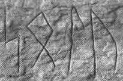

# Chapter 4. The Heteroclite Noun for Sun

<!-- page: 87 -->

Chapter 4.

THE HETEROCLITE NOUN FOR ‘SUN’

§4.1

THE GERMANIC MATERIAL FOR THE WORD FOR ‘SUN’

§4.1.1

GOTHIC

Gothic offers two different but related stem forms for the word for ‘sun’: sauïl ‘sun, ἥλιος’ [n.] and sunno [n. or f., n-st.] of which the gender is uncertain. The neuter NOM.SG form sauïl occurs twice (Mk 1:32, 13:24). Although the word sauïl is always regarded as neuter in the handbooks and dictionaries (e.g. Streitberg, 1910:118; BRHE20:105), the gender cannot be determined for there are no words in concord that prove this. Nevertheless, the absence of an inflectional ending in the NOM.SG does suggest that we are dealing with a neuter. The NOM.SG sunno occurs three times (Neh. 7:3, Eph. 4:26, Lk. 4:40) and can be either feminine or neuter. There are no words agreeing grammatically with sunno in these passages so that it is impossible to determine its gender. We find an ACC.SG sunnon in Mt. 5:45: unte sunnon seina urranneiþ ana ubilans ‘for He causes His sun to rise on evil’ (ἥλιον αὐτοῦ ἀνατέλλει ἐπὶ πονηροὺς). The concord of the feminine ACC.SG seina ‘his’ indicates that sunnon must be feminine. However, a neuter, which in principle could formally be masculine as well, DAT.SG sunnin occurs in Mk 4:6 (at sunnin þan urrinnandin ‘but at the rising sun’) and Mk. 16:2 (at urrinnandin sunnin ‘at the rising sun’). If the word were feminine, the form sunnon would be attested. Nothing lets us determine whether the form sunnin is of masculine or neuter gender, however.

We then arrive at the following situation: NOM.SG sauïl [n.], NOM.SG sunno [f.] or [n.],

ACC.SG sunnon [f.], DAT.SG sunnin [n.] or [m.]. The most elegant way to account for the
seeming randomness in these forms is to first separate the feminine from the neuter forms. If
we disregard the NOM.SG sunno [f.] or [n.] for the moment, the neuter forms appear to be in
complementary distribution (disregarding the possibility of a masculine sunnin). That is, the

DAT.SG sunnin, reflecting a weak neuter stem sunn-in-, can be connected to the strong neuter
stem sauïl. The two stems may then actually reflect a living heteroclite paradigm sauïl/sunn-
in-, much like fon/fun-in- ‘fire’ (discussed in §3.1.1, p.55). The connection between the stem
sunn-in- and sauïl is then not merely an etymological one, but of a remarkable living reflex of
an old heteroclite stem. This makes Gothic the only attested Indo-European language that
actually continues the heteroclite l/n-stem inflection within the paradigm (Gātha Avestan
continues a GEN.SG xvə [unclear] < PD1 *sh₂  én-s in an otherwise HD3 collective paradigm, merely

<!-- page: 88 -->

intimating heteroclisy, cf. §4.2.1.2, p.102) and is thus highly archaic. The full grade -il of
sauïl may either be analogical (although it remains unclear from where), or may rather reflect
leveling of the original weak S(e). I discuss the prehistory of this form and of sunn-in- further
in §4.2.2, p.108.

But how do we account for the f.ACC.SG sunnon and the NOM.SG forms that can be either feminine or neuter? Since the Germanic nominal system was eliminating stem variation as much as possible, it is remarkable that Gothic retains two stem-alternating paradigms from old heteroclites: fon/fun-in- and sauïl/sunn-in-. This would mean that there probably was considerable pressure in the nominal system to level one stem throughout the paradigm. It seems plausible to posit that the weak stem (which inflected like an n-stem) was leveled to attain an invariable n-stem paradigm. The question is: why did the stem sunn- not become a neuter or masculine n-stem paradigm? I believe that analogy played a role here. A very likely source for analogy is the feminine n-stem stairno* (attested once in Mk 13:25 in the NOM.PL stairnons). I then take the ambiguous gender of the NOM.SG sunno to be feminine, which aligns nicely with the feminine ACC.SG sunnon so that this form does not stand isolated anymore. This elegantly resolves the otherwise randomly gendered forms of Gothic into two paradigms: a heteroclite reflex sauïl/sunn-in- [n.] and a newly created n-stem sunno [f.]. The n-stem *sunn- is attested in all other Germanic languages. In overview, the Gothic forms can best be explained as continuing heteroclite inflection in the paradigm sauïl/sunn-in- [n.] and an emerging feminine paradigm sunno [f., n-st.], which was built to the weak stem. Their exact historical development is discussed below in §4.2.2, p.108.

§4.1.2

OLD NORSE AND THE NORDIC DIALECTS

In ON we mainly find the form sól ‘sun’ [f., ō-st.] besides the form sunna ‘sun’ [f., n- st.] in poetry. ON sól has reflexes in the modern Nordic languages, cf. Icel. sól, Fær. sól, Norw. sol, etc. The earliest attestation of the word is found in the runic inscription on the Eggja stone (±650-700, cf. Nielsen, 2000:97f.). The inscription contains the form solu (cf. figure 5, p.89), most likely to be read as /sōl-u/, and interpreted by Nielsen (2000:98) as the

DAT.SG of an ō-stem. Although ON sól inflects like an i-stem the form never shows i-
mutation, suggesting that this inflection was late. In fact, the word was in the oldest sources
inflected as an ō-stem (Noreen, 1923:262), proving that the i-stem forms are a later
development. For instance, the ō-stem DAT.SG sólu occurs in  ǫl sp  442 (sólu fjarri ‘far
from the sun’) and corresponds entirely to the runic form solu on the Eggja stone. An early
attested ON NOM.SG spelled <soulu> may be found in the Codex Leidensis (lat. 4° 83, from
the 10th c.). The form may be taken to contain an actual diphthong (cf. Krause, 1971:59). In
my opinion, however, the form <soulu> cannot continue a diphthong. First of all, there are no
other attested forms (earlier and later) that show such a diphthong, which make this form
stand out. Secondly, it can’t be an archaism reflecting *seh₂  l , for *seh₂  l  yields PG *sōl by

<!-- page: 89 -->

Mahlow’s Law, not **sō  (u)l or the like. Rather, the unexpected sequence <ou> can be
explained as an admixture of the spelling reflecting the runes (sulu), with <u>, and the actual
phoneme (in ON standardized spelling ó). That is, the scribe made a mistake and inserted <u>
on the basis of the spelling in runes (which he had just written) after he had already written
<so>. The intended and correct form would have been <solu> instead. This early ON form
presents us with an ō-stem NOM.SG, which still had -u < PG *-ō < *-eh₂, but which was lost
entirely shortly after (yielding ON NOM.SG sól). For PN, then, the form *sōl-u [n., ō-st.] can
be reconstructed.

FIGURE 5. Fragment of the Eggja stone inscription: solu (DAT.SG /sōl-u/).

Some denominal adverbial compounds contain the formation -sœlis or -s l s (and later OSw. -s l s) as the second member: ON [unclear] ttsœl s, OSw. rætts l s, [unclear] tsø l s cf. Norw. dialect (AASE) rettsøles, Sw. (RIET) rättsols, Sw. dialect (RIET) rätsyls ‘in the direction of the sun’s movement’, ON rangsœl s, cf. Norw. dialect (AASE) rangsøles, rangsæles, Sw. dialect (RIET) rångsöles ‘against the direction of the sun’s movement’, and ON andsœl s, OSw. an s l s, Icel. an s l s, Norw. dialect (AASE) andsøles, andsølt, Sw. dialect (RIET) ansyles, annsoles, etc. ‘against the direction of the sun’s movement’. The ON vowel œ or [unclear] (different spellings for the same vowel) derive from earlier ó by i-mutation. The OSw. vowel [unclear] (later ö, y) in -s l s derives from older *ø by the regular change of ø > [unclear] in secondarily stressed syllables, as in e.g. st [unclear] ø tland > st [unclear] tland (Noreen, 1904:98). This means that the second member -sœlis/-sølis/-s l s in these compounds derives from virtual *sól-is (reconstructed anachronistically without i-mutation), a GEN.SG to sól ‘sun’. The ending -is is an old GEN.SG of ja-stems which was often used in denominal adverbs (Noreen, 1904:362), cf. ON inríkis, OSw. n īk s ‘in the empire’ formed to ON ríkr ‘empire’. Often the corresponding noun was not attested (in e.g. OSw. baklængis ‘backwards’, to a noun attested in Go. laggei ‘length’) or the formations were clearly newly formed analogical creations (as e.g. in OSw. allastædhis ‘everywhere’). The analogical formations typically lack i-mutation. This could mean that the formations with -sœlis/-s l s/-s l s are old, since they show (a reflex of) i-mutated PN *ō. The widespread distribution within the Nordic area points to a common heritage as well, although I believe these forms are not archaic (and Rückumlaut cannot be altogether excluded). The forms should in any way not be connected to PIE [unclear] o-stems such as Ved. sū iya ‘sun’, as intimated by Harðarson (2001:39, note 42, for 1), because there exists no corresponding ja- stem noun in the Nordic languages (or elsewhere in Germanic) and the denominal adverbs in -is were quite productive in the Nordic speech area. Thus, the adverbial compounds with -sœlis are best explained as a specifically Nordic innovation, employing the inherited word sól.

<!-- page: 90 -->

In poetry we also find the form sunna ‘sun’ [f., n-st.]. In the Alvíssmál 161-2, the alliterating words sól and sunna occur side by side:

S l h t [unclear] m [unclear] mǫnn m, ”It was called sun [sól] amongst men, en sunna með góðum and sun [sunna] amongst the Gods“

Likewise, we find sól and sunna paired in a line of sun heiti (Skáldskaparmál 522, Snorra Edda 524): sól ok sunna. The word sunna is limited to poetry only and has no reflexes in the later Nordic languages. However, the otherwise extinct word has a remnant in some Sw. dialects (RIET:699) ag-sönnes, an-sönes (Helsingland ann-sönsj, Ångermanland ann-sjöns) ‘against the direction of the sun’s movement’. The word is formed like the denominal adverbial compounds in -sœlis/-s l s/-s l s discussed above, but formed to the stem sunn- instead of sól. The forms show i-mutation, presupposing an OSw. proto-form *and-synn-is formed to sunna (supposing that ag- in ag-sönnes is a deformation of and- ‘against, contrary to’). As this form is isolated, it cannot be excluded that it is a later analogical formation with back-mutation. In any way, the form sunna derives from the PG stem *sunn-, which is attested all over the Germanic language area. The prehistory of the stem *sunn- is discussed in detail in §4.2.2, p.108. A remarkable form may be retained in the form <syn> in an anonymous þula of sun heiti. The form is typically transcribed as sýn and identified with sýn ‘face, sight’ (cf. De Vries, 1977). In the documents that I have examined there is no trace of a length mark (although very often length wasn’t indicated at all and the form may have been long regardless of the lack of a length mark). Manuscript GKS 2367 4° (folio 44v, line 5) clearly has <syn>, but AM 757 a 4° (folio 9v, line 18) has the damaged <sy[...>. In AM 748 I b 4° (folio 20r, line 30) we find <syni>. We then arrive at two variant forms (disregarding length): syn and syni. If the form syni is a ja-stem, then this would prove that the form had a short root vowel, although it cannot altogether be ruled out that it was an īn-stem. The semantic connection between ‘face, sight’ and ‘sun’ is not self-evident, however, and does not strike me as particularly convincing. It is very tempting to connect the form to the heteroclite weak stem *sh₂ én- > PG *s én-. If the form had a short vowel syn then it would go back to *s in- (for * i > y cf. systir < *s [unclear] stē with raising from *s [unclear] stē ). If the form had a long vowel sýn, then it could go back to *si n- < *se n- with metathesis from *s en- like fýr < *fi r- < *fe r-. with metathesis from *f er. Note that *s in- < *s en- required a raising factor like the word for ‘fire’, on which see the discussion in §6.1 on p.123. It therefore seems very likely that ON poetry continued a reflex of the weak heteroclite stem *sh₂ én-.

In overview, ON provides us with two forms. The first is the form sōl [n., ō-st.]. The
form sól must be connected to the Gothic strong heteroclite stem sauïl (§4.1.1, p.87) and to
OHG Sol, Suol < WG *sōl- (cf. §4.1.3, p.91). The ō-stem endings must have been added to
the form *sōl at some time in the development of Proto-Norse. The second form is sunna
‘sun’ [f., n-st.] corresponding to feminine n-stems in all other Germanic dialects. Finally, a
remarkably archaic form may be continued in the poetic words syn and syni (or sýn, sýni),
which can be derived from the weak stem *sh₂  én-.

<!-- page: 91 -->

§4.1.3

OLD HIGH GERMAN AND THE LATER HIGH GERMAN DIALECTS

OHG has both a feminine form sunna ‘sun’ [f., n-st.] and a masculine sunno ‘sun’ [m.,
n-st.]. The NOM.SG sunna occurs in glosses (e.g. sunna glossing ‘sol’, in Codex
Sedestadiensis, 1063 AD) and in the Wessobrunner prayer (±790 AD): noh sunna ni scein
‘nor did the sun shine’. The weak case form sunnun is widely attested, cf. GEN.SG sunnun (in
Pa., Ra., Rb., O., etc.). For the masculine form sunno we may assume analogy to the words
sterno, sterro ‘star’ [m, n-st.] and m no ‘moon’ [m, n-st.] to explain the gender, as in OE
(§4.1.6, p.96). The masculine form is probably an inner-OHG innovation. MHG continues
these forms in sunne (attested as both feminine and masculine), which yielded HG Sonne. The
High German dialects show reflexes of the feminine form. The Bavarian dialects have e.g.
Karnten (LEXE

K) sunne [f.] (where the sun is also referred to as frau sunna, with the archaic
ending -a), Laurein, Südtirol, (KOLL) s n, and Mòcheno (ROWL) Sunn. In Swiss German there
is the form (SI) Sunne, and in the High Alemannic dialects we find e.g. Kanton Schaffhausen
(WANN) sunn(ə) (locally sɔnnə), Appenzell (VETS) sɔnn, Bündner Herrschaft (MEIN) sonə,
and in Jaun, Kanton Freiburg, (STUC) suna. The Highest Alemannic dialects (Walliser
German) present us with e.g. Kerenzer dialect (WINT) sunnɐ, in the non-Walliser Heimattal
(BOHN) sonne(n), but in Wallis and to the south sunna, and in Bosco Gurin (RUSS) Sunnu
(clearly n-stem with the oblique stem Sunnun- in Sunnuntagg ‘sunday’). In the Cimbrian
dialects of Siben Komoin we find (SCHM) sunna (DAT.SG sunnen, obviously still an n-stem),
Roana (SCHW) sunna [f., n-st.] (DAT.SG sunnen), and in Lusern (BACH) ſun [f.] (SCHW has sun
[f., n-st.] with DAT.SG sunen).

The second Merseburger charm (dated to the 9th or 10th century) contains the form Sunna, which appears to be a personification or deity. We are either dealing with an actual heathen deity (which would be a personification of the sun, not unlike the ON personification of the sun: Sól), or with an ad hoc personification for the sake of alliteration or perhaps to hint at some characteristic feature of the obscure Sinthgunt (spelled sinhtgunt). The line in which the form occurs reads as follows:

thu biguol en sinhtgunt · sunna era suister
‘so Sinthgunt, sun her sister, conjured him’

The grammatical gender of the word sunna [f, n-st.] corresponds to the female sex of the personification or deity (implied by era suister ‘her sister’), which can hardly be accidental. OHG personal names can be adduced here which include the feminine form (FÖRS) Sunna, used for both men and women, as well as the masculine form Sunno, the name of a Frankish prince in the 4th century. Moreover, the word for ‘sun’ is used in binomial names for women, cf. (FÖRS) Sunnechildis, Sunnigisil, Sunneveifa, etc. It is interesting to find that the element sol-, suol- occurs in personal names as well. It is quite probable that the name element represents the strong stem of the word for ‘sun’ as found in ON sól and Go. sauïl. We find the word frequently used for men’s names: (FÖRS) Sola (3rd cent., possibly n-stem), the name of a Saint Sol (889 AD), Suol (9th cent.), Suolo

<!-- page: 92 -->

(794 AD, possibly n-stem), etc. (after which the Bavarian village Solnhofen was named, cf. Suolenhus, 2× in 836 AD). This name has exact correspondents in OE (REDI) Sol, Sola. The element is also found in female binomial names, e.g. Solberta, Solburg, as well as the male binomial name Soligast (Salic Franconian, 6th c.). The name Soli-gast contains an i-stem form sōl-i-, but i-stems occur frequently in personal names and this form need not be significant. On the other hand, this form may also reflect the Latin personal name Solius, Solio. It is hard to connect Sola, Suol, Suolo, etc. to the Latin name in the absence of i-stem inflection in these words, however. Another possibility is that this name is of Greek origin, from Σóλων. But, the occurrence of the element in Germanic compounded names is not an isolated phenomenon, cf. Soligast, ON Sólveig, etc. Moreover, in Rhenic inscriptions the form (RIES) Solimar(i)us is found, which is most likely a Latinized spelling for a virtual PG *sōl -mē1r( )az (with an i- stem *sōl - as in Soligast?). A Greek name would be entirely unexpected in this time and place, but a Celtic origin has been suggested (by e.g. Schönfeld, 1911). Another name that occurs in the Gallic area is Soli|Muti and Solimuto (on which see Reichert, 2009:68). The second member -mut- can only be explained as Germanic and the name finds a correspondent in the Vandalic name Solumuth (Corippus). The form is therefore very likely to be Germanic and then goes back to a PG *sōl-i/u-mund-. This makes a Germanic origin for the name Solimar(i)us exceedingly more likely. Moreover, the name has an exact correspondent in OE (SEAR) Solemære, which further supports a Germanic origin. These forms are best interpreted as continuing a Germanic form *sōl- ‘sun’.

It is very tempting to connect these forms to the strong heteroclite stem for ‘sun’, which is formally without problems (save the gender, which can be attributed to principles of Germanic name-giving or the sex of the bearer). As I discuss in detail in §4.2.2, p.108, PIE *séh₂ l > PG +sōl by Mahlow’s Law, which yields early OHG +sōl, later OHG +suol, which corresponds perfectly to the attested forms. Semantically there are certainly no objections since ‘sun’, in the form of the weak stem *sunn-, is found in personal names (cf. above). The absence of another etymology further welcomes a derivation from the heteroclite strong stem. If the forms Sola, Suolo are n-stems, it seems natural that they took the nasal inflection from the weak heteroclite stem which attached the suffix *-n- to the root. This may perhaps indicate a WG n-stem, but the material requires extreme caution here, since all we have is a number of personal names. In any way, I believe a WG stem *sōl- ‘sun’ can legitimately be reconstructed. The feminine n-stem sunna is of inherited stock, whereas the masculine form sunno is an OHG innovation with the gender taken analogously from the masculine n-stems sterno, sterro ‘star’ and m no ‘moon’. Personal names provide probable evidence for a WG stem *sōl- ‘sun’. In all, OHG provides evidence for a heteroclite strong stem reflex WG *sōl- and a weak stem reflex *sunn-, although not within a paradigm as Gothic does (cf. §4.1.1, p.87).

§4.1.4

OLD DUTCH AND THE LATER FRANCONIAN DIALECTS

<!-- page: 93 -->

ODu. has the NOM.SG sunna ‘sun’ in LW lines 010.03 and 106.15 (dated to ±1100). The ODu. word for ‘sun’ is typically treated as a feminine n-stem (cf. the entry in the ONW), which is supported by the emendated OELF ACC.SG sunnun (for <sunnu>) in MS I of the W.Ps. line 071.17 (the MS I is a copy from the 18th century and may very well contain some corruptions). However, another ACC.SG form sunna is found in the W.Ps. line 057.09: ouirfiel fuir in ne gesagon sunna “the fire caught them by surprise and they did not see the sun”. This form must be a neuter and cannot be a feminine n-stem, however, cf. the neuter ACC.SG herza ‘heart’ as opposed to the feminine ACC.SG zungun ‘tongue’. Thus, in the W.Ps. we find evidence for both a feminine and a neuter n-stem. Concord might further determine the gender of some forms. Sadly, only the forms of LW show concord, which are somewhat later than the W.Ps. Line 010.03 of the LW contains the NOM.SG thiu heizza sunna ‘the hot sun’ and line 106.15 has NOM.SG thiu sunna ‘the sun’. These forms indicate that the word sunna cannot be anything other than a feminine n-stem in the LW (the neuter pronoun would have been thaz or that). MDu. sonne ‘sun’ underwent the change u > o, eventually developing into Mod.Du. zon ‘sun’. I conclude, then, that there existed two forms in the oldest layer of ODu.: a neuter n- stem sunna and a feminine n-stem sunna. The Salic Franconian name Soligast (Lex Salica, 6th c.) is discussed in §4.1.3, p.91.

§4.1.5

OLD SAXON AND THE LOW GERMAN DIALECTS

In OS we find the form sunna, sunne [f., n-st.] ‘sun’. The NOM.SG form sunna alternates with sunne in the Hêliand (cf. line 2478, 2820, 4233, 4502 with <sunne> in M where C correspondingly has <sunna>). The forms are mostly feminine (sometimes masculine, cf. below) but never interpreted as neuter (already Schlüter, 1892:5). The rather consistent difference in the spelling of the endings -a and -e in the individual manuscripts is probably due to interference of the native tongue of the copyists. It has often been noted that the manuscripts C and M are written by copyists speaking different dialects from that of the original OS Hêliand. The original language of the Hêliand is most likely best reflected in the P and V manuscripts (cf. Schlüter, 1892; Klein, 1977). Boutkan (1996:283) concludes that for instance the masculine n-stems in C closely resemble OHG (or perhaps LF). The scribe of C prefers to write e in the GEN.SG and DAT.SG -en, which strongly suggests an OHG or LF copyist. Manuscript M (although probably written by more than one copyist) resembles an Ingveonic dialect, mostly showing the leveled ACC.SG form -on as is characteristic of Ingveonic. This means that in C we may find OHG or LF forms and in M Ingveonic forms.

The following attestations and frequency of the word for ‘sun’ can be found in the manuscripts of Hêliand (data from Sehrt, 1966:515):

<!-- page: 94 -->

M
C
G

NOM.SG
sunn-e (6×)
sunn-a (9×)
sunn-a (2×)
ACC.SG
sunn-a (1×)
GEN.SG
sunn-un (2×)
sunn-un (5×)
sunn-on (1×)
DAT.SG
sunn-on (2×)
sunn-un (2×)

Furthermore, the NOM.SG form sunno occurs three times in C (lines 2910, 3126, 4235). At first
glance, the gender of the forms in C and M must be feminine. The endings of the GEN.SG and

DAT.SG are conclusive as they cannot be neuter (which never show -un, cf. Gallée, 1910:216,
Anm.). The NOM.SG, GEN.SG and DAT.SG in all manuscripts correspond exactly to the feminine
n-stems, although it seems that the ACC.SG sunna in C rather points to a neuter as I discuss
below. Thus, although most forms of the word are attested must be feminine, some forms
must be masculine and one instance may even be a neuter n-stem ‘sun’. To determine the
gender of these forms exactly we must investigate them more closely.

Schlüter (1892:5) states that some passages in C may have had forms that were later
altered into masculine forms. For instance, Schlüter mentions the NOM.SG noun phrase of
Hêliand line 4233, attested in C and M as follows:

C:
thie liohto sunna
M:
thiu liohte sunne
‘the bright sun’

Manuscript M shows the expected feminine concord in thiu liohte sunne. The gender of the construction in C, however, does not correspond to that in M. It appears that C has masculine concord and if sunna in C would be feminine (or neuter, for that matter) the phrase does not seem to be in concord. The demonstrative pronoun thie in C cannot be feminine or neuter, but must be masculine (cf. Gallée, 1910:238f.). The form sunna may then perhaps be interpreted as a masculine n-stem with NOM.SG -a, an ending that occurs elsewhere in C (cf. Gallée, 1910:213, Anm.1). However, a masculine sunna would be highly unusual for a form that is otherwise only attested as feminine, which casts doubt on this interpretation. Since the occurrences of masculine forms that do not occur in the other manuscripts is a phenomenon limited to C, this must be due to the interference of the native language of the scribe of C. The feminine form sunne in manuscript M would then be the original form and we are probably dealing with a later alteration in C. This means that the form sunna may have been the OS feminine form, but that the scribe used masculine concord in thie liohto by association of the masculine OHG sunno.

The form sunno, as indicated above, occurs three times in the C. The form sunno in lines 2909 and 3125 of C is actually a masculine noun and reflects an alteration of the original text as well. The form sunno in C corresponds to M sunne which cannot have been masculine (cf. Gallée, 1910:213, Anm.1). That is, the masculine form sunno in C does not align in gender with the feminine sunne of M. The masculine form sunno in C cannot be explained as an OS form (nor as an OFri. form sunna), however, and must be OHG for it corresponds entirely to the OHG masculine sunno (for which see §4.1.3, p.91). The attestation of an OHG

<!-- page: 95 -->

form sunno occurring only in manuscript C is again entirely in consonance with the proposed OHG influence of the copyist of C. We therefore do not have to posit an OS masculine sunno, but we can explain this form from the influence of the native tongue of the scribe.

Interestingly, the ACC.SG sunna in Hêliand line 3438 of C can only be neuter (sadly no
corresponding line in M or another manuscript survived)—if it were masculine or feminine
we would expect the ending to have been -an instead of -a, i.e. we would expect **sunnan
with a final -n (or rather a feminine **sunnun). The concord of the phrase scînandia sunna
‘shining sun’ in line 3438 does not help us very much. The participle scînandia would be the
only attested instance of an ACC.SG of a neuter participle. However, the ACC.SG form
scînandia is exactly the form that would be expected for a weak neuter adjectival ending,
since participles inflect in both the strong or weak adjectival declension (depending on the
noun they modify). The phrase scînandia sunna must present a neuter form, not a masculine
form. Thus, the unambiguous neuter ACC.SG in line 3438 in C proves the existence of a neuter
n-stem sunna in OS.

It is formally possible that we are dealing with either an OS or OHG neuter, but it would be the only neuter of the word for ‘sun’ in either language. This rare occurrence is quite baffling, but can hardly be counted as a mistake; it does not seem likely that the scribe would have made a mistake in assigning gender for this frequent noun. One could expect interference from the scribe’s native tongue, but since OHG didn’t have a neuter noun for ‘sun’ either this is ruled out. Since the line in which it occurs has not survived in other documents, we cannot be entirely sure if it corresponds to an OS neuter. The origin of the form is thus obscure. I suggest that we are dealing with an OS archaism, a remnant of an old neuter paradigm. My motivation is that the original heteroclite paradigm must have been neuter and is still neuter in the surviving Gothic heteroclite sauïl/sunn-in- (cf. further §4.2.2, p.108). The reason that the form has been neglected may in part have to do with the fact that neuter n-stems are extremely rare in OS. For instance, Gallée (1910:215) gives only the three neuter n-stems herta ‘heart’, ôga ‘eye’, ôra ‘ear’, (as well as the plural sinhîwun ‘husband and wife’, and possibly the GEN.SG wat(t)an- ‘water’ in place-names, in e.g. UUatanscêthe, Wattenscêthe). However, the evidence suggests that this rare passage contains the single occurrence of another neuter n-stem: sunna.

In MLG we find the expected form (LÜBB) sunne [f., n-st.] ‘sun’, continuing OS sunna, sunne [f., n-st.] ‘sun’. In modern LG dialects we find e.g. the older Bremen dialect (TILI) Sunne, in the archaic Göttingen dialect (SCHA) sunne [f.] (still n-stem inflection, cf.

OBL.SG sunnen), in the dialect of Neumark (TEUC) zųnə,  and forms with North Sea-Germanic
palatalization in e.g. the older Holstein dialect (SCHÜ) Sünne ‘sun’, older EFri. (LG) (DOOR)
sün(ne) ‘sun; sunshine’, older LG of Pommerania and Rügen (DÄHN) Sünne [f.] ‘sun’,
Altmark (DANN) s nn’ ‘sun’, and in the Netherlands e.g. Gronings zön(ne), zun(ne), Drents
zun(ne) ‘sun’, etc. The dialects offer no formal or semantic problems and can be
straightforwardly explained from OS sunna.

I conclude, then, that OS had a feminine n-stem sunna that was continued in LG and into the later dialects. A single but indubitable passage contains an OS neuter n-stem sunna, which may be an archaism.

<!-- page: 96 -->

§4.1.6

OLD ENGLISH AND THE BRITISH DIALECTS

The form sunne ‘sun’ [f., n-st.] is very well attested in OE. Furthermore, a rare masculine pendant sunna ‘sun’ [m., n-st.] occurs (e.g. in sunna an mōn , Nar. 28, 20). Like in OHG (§4.1.3, p.91), The word sunna probably has the masculine n-stem ending in analogy to the words steorra ‘star’ [m., n-st.] and mōna ‘moon’ [m., n-st.] (cf. also the rare mōn ‘moon’ [f, n-st.]), both n-stem words for heavenly bodies. Thus, the masculine form sunna is probably an OE innovation and the feminine sunne is inherited. Early ME (MED) has sunne (13th c.), sunnæ, etc. (oblique forms sunnen, 13th c., sunnæn, 12th c.), Chaucer has e.g. the

NOM.SG sonne and the GEN.SG sonnes, showing loss of n-stem inflection, cf. under the sonne
around 1450-1509, etc. Modern English dialects have e.g. (WRIG) Cumberland sun, Shetland
Isles sɒn, Aberdeen sən, etc., all deriving seamlessly from ME son(ne), sun(ne).

The extremely rare OE sōl ‘sun’ (attested once in Ps.Th.120,6) is only attested in two compounds: sōlm ca and solmōna . The striking correspondence of the OE compounds containing sōl with parallel ON compounds most likely indicates that the OE word sōl is an ON loan. ON sólmerki ‘sign of the zodiac’ was borrowed into OE sōlm ca. OE sōlm ca is attested in Britain on the Kirkdale sundial, written by an English-speaking Viking, cf. Page (1971:180f.). Secondly, ON sólmánaðr ‘a month falling halfway June and July’ may have been borrowed into OE solmōna ‘February’. The lack of a semantic correspondence between ON sólmánaðr ‘a month falling halfway June and July’ and OE solmōna February’ is inexplicable and the characterizing of February by reference to the sun can hardly have been original either. In contrast, the period of June and July lies at the heart of summer and this fits the characterization of the month by ‘sun’ much better. It would then appear that ON sólmánaðr had the original meaning and that OE solmōna was borrowed and that its meaning was corrupted. A problem with this explanation is the short vowel of sol- in OE solmōna , although in borrowing this could have been lost. But the number of assumptions we now have to make to connect the two words is not convincing in my opinion. Alternatively, Redin (REDI:24) proposes to see OE solmōna as a native formation to the word sol ‘mud, mire’, although the semantic motivation escapes me.56 First of all, if the month was characterized by mud or mire, this would require heavy rainfall. If modern British weather is any indicator, February is not the rainiest month at all, although it is the coldest of the year. But this does not align with the sense of a‘muddy month’. Although Redin’s explanation is formally appealing because of the apparent short vowel in the first element sol-, it is semantically wanting.

I wish to tentatively propose to connect the element sol- in solmōna to OE (BOTO) sol ‘a collar of wood, put round the neck of cattle to confine them to the stelch’, cf. ME (MED) sol(e) ‘a rope, esp. one used to tether cattle; also, a wooden yoke or collar used to

56 Redin wants to compare the formation in Sw. Göjemånad ‘February’, but the first element of this word, göje-, certainly does not mean ‘mud, mire’ but is related to ON gói, gœ, gómánaðr, Icel. Gói, Norw. gjø, goe ‘a month dating between mid-February to mid-March’, cf. Gr. χιών ‘snow’.

<!-- page: 97 -->

tether a beast in a stall’.57 It is to be expected (and still common practice) that in the coldest month(s) of the year the cattle is kept inside, confined to the stall (i.e. the OE bōs [unclear] ‘an ox- or cow-stall where the cattle stand all night in winter’, cf. modern dialectal boose, boosy ‘a stall, typically for cows’). The name of the month would then be of a very practical and evident nature for farmers, as do other names of months. Most conspicuously, the month name Ð ym lc s mōna , Ðrymylce mōna ‘month of three milkings = May’ indicates the month in which cattle is milked three times a day, which is another month name referring to important cattle keeping practices. (Cf. also the month names referring to agricultural practices: Wēo mōna ‘weed(ing) month’ for August, and Hærfestmōnaþ ‘harvest month’ for September.) This explanation is thus formally sufficient and fits semantically as well. Note that the OE month name has no parallels in other Germanic languages, except perhaps in the much later modern WFri. (WFT) Sellemoanne ‘February’. The word Sellemoanne has been given no convincing etymology (the word is connected in the WFT to sol in OFri. sol-dede ‘a kind of severe crime’, although this word is itself obscure). However, it is possible to connect the word to OE solmōna to a proto-form *sul-a-, although Selle- may also indicate a [unclear] o-stem proto-form *s l- a-.58 In any way, of the two compounds containing sol- or sōl-, OE solmōna cannot contain a native word for ‘sun’, while sōlm ca is adapted from ON sólmerki.

There is scanty, but probative evidence for a reflex of the strong stem PG *sōl
elsewhere in OE, however. The simplex names (REDI) Sol, Sola are attested, as well as (SEAR)
Solemære. As I discussed in §4.1.3, p.91, Solemære has an exact correspondent in Rhenish
(RIES) Solimar(i)us, and most likely is an archaic Germanic name that survived in OE. Thus,
although the semantically identical stems PG *sōl and *sunn- must have once existed in the
prehistory of OE, the stem *sōl was lost in favor of OE sunne/sunna, but it was petrified in
personal names. That remnants of an otherwise lost stem *sōl are rare yet attested in many
areas of the Germanic territory is in line with what we expect of an archaism.

In overview, OE typically has a feminine n-stem sunne. The masculine n-stem sunna is an innovation which took the masculine declension by analogically to steorra ‘star’ and mōna ‘moon’. Finally, there is meager but compelling evidence for OE sōl ‘sun’ in personal names, although it was otherwise lost in colloquial OE.

§4.1.7

OLD FRISIAN AND THE FRISIAN DIALECTS

57 The MED gives one form with long ō (spelled <oo>) for a form with otherwise short vowel. Perhaps there is
analogy from OE s l ‘cord’ in this case.
58 A possible etymological connection for OE sol within Germanic is the isolated Gothic verb ga-suljan ‘ground,
establish, lay fundament, θεμελιόω’. Gothic ga-suljan is a weak verb with a zero-grade root which looks to be
denominative, but for which a corresponding noun has been lacking. The sense of ‘grounding’ is attested in e.g.
Eph. :17 ei in frijaþwai gawaurhtai jah gasulidai ‘being founded and grounded in love’ (Gr. ἐν ἀγάπῃ
ἐρριζωμένοι καὶ τεθεμελιωμένοι), and can be connected to the meaning of OE sol. The sol, the wooden collar (or
rope), connects or ‘grounds’ the cattle to the stall, which may indicate an original sense of ‘grounding,
connecting’ or ‘(being) tied to’. WFri. selle- < *s l  a- would then be provide the required formal connection to
Go. ga-suljan. However, the connection of both OE sol and WFri. selle- to Go. ga-suljan remains speculative at
this point.

<!-- page: 98 -->

OFri. has a variety of forms: sunne, sonne, senne, sinne ‘sun’ [f, n-st.]. Boutkan (2005:382) explains the variation as follows. The OWFri. variant sonne underwent OWFri. lowering of *u before nasal, and reflects the same variation as e.g. PRES.PL kunnen, konnen ‘can’. ModWFri. dialects correspond to OWFri. sonne, cf. Schiermonnikooog (SPEN) son [m.] ‘sun’, Hindeloopen (KOOY) sónne ‘sun’, Terschelling (KNOP) s n ‘sun’. Boutkan believes that OFri. senne and sinne (corresponding to ModWFri. sinne ‘sun’) may be i-mutated forms, leveled from the oblique stem *sunn-in- (< *sunn-en-), cf. Spenter (1968:133). A problem is that the OFri. oblique stem was sunnun-, cf. OFri. sunnundei ‘sunday’, which could not have caused i-mutation. The forms senne, sinne certainly do look like they underwent i-mutation, however, cf. PIE *tn h₂- -ih₂ > PG * n -ī //> *þunn-ī// ‘thin’ > WG *þunni > OFri. thinne, thenne ‘thin’. Perhaps the forms mechanically underwent i-mutation from the plural like some athematic nouns did, e.g. NOM.SG tōth ‘tooth’ : NOM.PL tēth ‘teeth’ (see on this Voyles, 1992:172). Even though this may explain the occurrence of mutation in the plural, it still does not explain the occurrence of i-mutation in the singular. Spontaneous delabialization after a sibilant is neither phonetically likely, nor do other forms show this development, cf. OFri. sunu ‘son’ without a front vowel. Moreover, a similar problem is found in the OFri. word for ‘summer’. The regular reflex is sumer, somer with a single nasal (cf. Schiermonnikoog (SPEN) somər, Dokkum (BOGE) somer, etc.), but these forms stand beside semmer, simmer (cf. west Fri. simmer, east Terschelling (KNOP) sEmmer, etc.) with apparent front mutation and a geminate nasal which is otherwise unattested in the early Germanic languages. There is a striking resemblance between the situation in semmer, simmer and senne, sinne: both are phonotactically: */sVNiNi-/ (where N = /m, n/), both show the variation R(u : o) versus R(e : i), and both show the absence of any apparent factor causing i-mutation. These glaring properties need to be explained.

The attribution of the front vowel to dental mutation (“Dentalumlaut”) in Frisian has recently been discussed by Hoekstra (2007). Hoekstra (2007:47) points out that while in general OFri. has the forms sumur, sumer, only in western OFri. do the forms semmer, simmer occur. This form has been explained by recourse to the notion of dental mutation. As Hoekstra point out, however, the phenomenon of dental mutation before n and after s is “wildly diffuse” (p.56) and “is only found in a handful of words in North Frisian and West Frisian.” Such a spontaneous and irregular change must be rejected in comparative linguistics—a sound law is in effect or it is not. It seems also seems that many forms with a front vowel occur only in later Frisian dialects, although the form OFri. semmer, simmer is certainly old. Moreover, I want to stress that not only do we find a front vowel in OFri. semmer, simmer, but also a geminate nasal, in contrast to OFri. sumur, sumur with a back vowel and a single nasal—a fact that is consistently overlooked and requires and explanation. The invocation of an (irregular!) dental mutation can only partially explain the form semmer, simmer, for it does not explain the presence of a geminate nasal. I therefore conclude that the notion of dental mutation in OFri. semmer, simmer must be rejected.

I would suggest that the vowel quality of OFri. semmer, simmer may actually be old
and reflects old gradation. Since the proto-form for ‘sun’ could hardly have had Germanic
R(e) in place of *u (cf. the details of the PG reconstruction §4.2.2, p.108), but it could in the
word for ‘summer’, we may posit root gradation for the word for ‘summer’. This can account

<!-- page: 99 -->

for the geminate in semmer, simmer as well, if we accept Müller’s account of resonant gemination by laryngeal. Müller (2007:177ff.) holds that a resonant followed by a contiguous laryngeal resulted in a geminate resonant if preceded by an accented vowel and followed by another vowel, or:

3. MÜLLER’S LAW OF RESONANT GEMINATION. – A resonant R is geminated to RR if it is followed by a contiguous laryngeal plus an unstressed vowel and preceded by an accented vowel, so that:

ˊ

*-VRHV- [unclear] > [unclear] *-VRRV-

This explanation is in general attractive, because it can explain the typical and often observed absence of a geminate after a non-accented zero-grade root that alternates with the presence of a geminate after an accented full-grade. In the word for ‘summer’ this can readily explain 1) the occurrence of a zero-grade without geminate *sum- reflected in OFri. sumer, somer as well as all other Germanic languages (cf. ON sumar, OHG sumar, OS sumar, OE sumor, etc. all meaning ‘summer’), and 2) the occurrence of a full-grade with geminate *semm- on the basis of the Frisian forms. Philippa (EWN) reconstructs a ‘received view’ form in PG *sumara- which accounts for all the zero-grade Germanic forms and is a sensible postulate. The form PG *sumara- points to *sm h₂3-ér-o-, with accent on the suffix (or theme vowel?), to a virtual root *semh₂3-, cf. Skt. s m ‘(half-)year; summer’, Av. ham- ‘summer’, Arm. am ‘summer’. It is likely that the root was actually an [unclear] *sem- to which an h₂-stem was formed: *sém-(e)h₂-, cf. Olsen (1999:60; she proposes a Lindeman’s Law variant *sm -eh₂), so that the basis for our word would be *semh₂- (I disregard the morpheme boundary in the following). Note that the color of the second vowel in *sumara- was then colored by the laryngeal *h₂. The OFri. forms simmer, semmer may derive from *semmara- < *sémh₂-ero-, with gemination according to Müller’s Law. In this way we can effectively explain the occurrence of vowel gradation in combination with the geminate nasal in OFri.

In light of the masculine gender of PG *sumara- and the fact that there is a strong
correlation between the masculine gender and HD paradigms, I posit an HD1 r-stem. This
reconstruction is proved by Arm. ama n ‘summer’, which reflects an originally ACC.SG stem
*sm h₂-  -m  according to Kortlandt (1985; not available to me, but credited in EDAIL:60).
This indicates that this formation was an inherited formation. Hence I posit the following PIE
paradigm and its PG transpose as follows:

PIE
PG transpose

NOM.SG  *sémh₂-  (-s)
>
+sémmur

ACC.SG  *sm h₂-  -m
>
+sumár-

GEN.SG  *sm h₂-r-ós
>
+sumr-'

Germanic thematized the middle stem +sumár-, yielding the ‘received’ reconstruction *sumara-, which accounts for most of the Germanic data. The reconstructed pre-OFri. form *semmar- may reflect a thematization of +sémmur, or may be an admixture of the strong and middle stem: *semmara- (in any way, according to Müller’s law a vowel is required to follow

<!-- page: 100 -->

*-ÉRH-). The Frisian forms semmer, simmer, etc. (beside sumer, somer) thus reflect an archaism.

At a time that two alternants *sumara- and *semmara- still co-existed the word for sun was likely to still be a heteroclite (the fact that the heteroclite survived in Gothic and was under the influence of an n-stem variant paradigm that was still only marginal in Gothic indicates that this must have occurred in the recent history of Gothic). As I discuss in §4.2.2, p.108, the heteroclite weak stem must at some point have been *sun-en- which existed alongside an n-stem paradigm *sunn-(e)n-. At this time, the root for the word for ‘sun’, *sun- /*sunn-, was formally very close as well as semantically very close to the weak stem the word for ‘summer’, *sum- (the warm sun is particularly characteristic of summer). It is possible that the word for sun took the vowel color on the basis of the following analogy:

*sum-
:
*sun-
=
*suN-
*semm- :
*sunn-
=
*sXNN
X =  e

ergo: *sunn- → *senn-

The roots *sun-en- : *sunn-(e)n- ‘sun’ were phonotactically very close to the ones in *sum-ar-
: *semm-ar-, reflecting *suN- : *seNN- (note that such alternations as these were at one point
very frequent in Germanic due to Müller’s law, which perhaps legitimizes an even more
general pattern as the basis of analogy: *CuR- : *CeRR-). The forms for ‘sun’ harmonized to
the pattern *suN- : *seNN-, adopting the variation R(u : e) before the respective singulate and
geminate nasal. The variant forms that arose are continued in Frisian (this may have been an
isogloss in prehistory already). The change *sun- → *sunn- in analogy to the n-stem *sunn-
was later completed as in all Germanic languages, including pre-Frisian.

In conclusion, OFri. provides evidence for an inherited feminine n-stem *sunn-. The variant forms simmer, semmer can be explained as due to some kind of analogy and are not original.

§4.2

THE PIE ORIGINS OF THE WORD FOR ‘SUN’

§4.2.1

THE ETYMOLOGICAL CONNECTION OF THE PIE HETEROCLITE STEM

‘SUN’

<!-- page: 101 -->

In the following paragraphs I discuss the Indo-European cognates of the Germanic
forms for the word for ‘sun’. I conclude this chapter with a section of the details of the
development of the Germanic forms from the PIE heteroclite.

§4.2.1.1

ANCIENT GREEK

In ancient Greek we find Homeric ἠέλιος, Cret. ἀβέλιος (with ἀβέλ- < *ἀϝέλ-), Att. ἥλιος, Dor. ἀέλιος, ἅλιος ‘sun; sun-god’ which together point to PGr. *s [unclear] l- os, a masculine o-stem derivative. The stem *s [unclear] l- indicates a virtual *séh₂ [unclear] l. The vowel gradation R(é)-S(e) of *séh₂ [unclear] l would corroborate a PD1 paradigm, showing the strong root gradation R(é) combined with the weak suffix gradation S(é). The Greek virtual proto-form *séh₂ [unclear] l, then, goes back to the strong PD1 stem *séh₂ l , which was influenced by the weak stem *sh₂ [unclear] n-, leveling S(e) (but keeping the accentuation on the root). Furthermore, Nikolaev (fthc.) derives Gr. ἀᾱ ατος (e.g. Hom. ACC.SG ἀᾱ ατον ×2, which he convincingly interprets as ‘sunless’) from PGr. *a-h [unclear] atos < *n -séh₂ n tos ‘not lit by the sun’. Nikolaev connects the word to the heterclite *séh₂ l /*sh₂ [unclear] n- and posits that Gr. ἀᾱ ατος contains the weak suffix *-n-. This means that this form continues a weak heteroclite suffix *-n- complementing the Greek reflexes with a strong suffix *-l- in e.g. Homeric ἠέλιος, Cret. ἀβέλιος, etc. The accent and root gradation R(é) indicate a strong PD1 stem, however. Nikolaev compares the formation to PG *sunþa- ‘south’ and Toch.B sw co and Toch.A sw c [unclear] ‘(sun)beam, ray’.

The Germanic form *sunþa- ‘south’ is gleaned from ON suðr, OHG sund-, ODu. sūth, OFri. sūth ‘south’, etc. A widespread derivative is found in *sunþ-an- (cf. De Vries, 1971). The form probably arose from oblique collocations such as OHG fon sundana ‘from the south’ in which sundana is an adverb (cf. OFri. fon sūtha ‘from the south’), e.g. ON sunnan ‘from the southʼ, OHG sundan ‘the south; south windʼ (MHG sū n ‘the southʼ), ODu. sūthon ‘ab austroʼ, OE sū an ‘from the south’.59 Another widely attested derivative *sunþ(a)- ra- (also used as a first member in compounds), cf. ON sunnari, syðri ‘southernʼ, OHG sundar ‘austerʼ, OS sūtha ‘southwardsʼ, etc. Finally, there are adjectival formations for (wind) directions in *-ōni a- built to the stem *sunþ-ra, i.e. *sunþ-r-ōni a-, in e.g. ON s [unclear] œnn, OHG s n ōn , OE sū [unclear] n ‘southern’. The basis of this very productive set of forms is PG *sunþo- ‘south’. We may derive the form from the collective weak stem *suh₂n- to-, where pre-PG *sūnta- was shortened by Osthoff’s Law yielding PG *sunþa-. The accent on the initial syllable, as betrayed by the absence of Verner’s Law, is remarkable. We would expect non-initial accentuation from both the weak collective stem *suh₂n-' as well as the suffix *-to-, however. This unexpected pattern requires an explanation. Interestingly, Toch.B sw co and Toch.A sw c [unclear] go back to a zero grade proto-form *suh₂n-to- as well (with the same pattern *uh₂ > w as in the Toch.B stem pw -, cf. §3.2.1.4, p.76). Note that the Tocharian forms were furnished with an n-stem suffix. The Tocharian forms appear to be

59 It is tempting to derive the forms ultimately from n-stem locatives in *-en(-i), and cf. the adverbs of location, e.g. Go. ūt-an-a, OHG ūz-an-a ‘from outside’, etc.

<!-- page: 102 -->

otherwise entirely cognate to the Germanic forms, although the Tocharian material tells us nothing about the accentuation.

In overview, the Greek form ἀᾱ ατος goes back to a PD1 form *n -séh₂ n tos (principally a weak stem, although the gradation resembles the strong PD1 stem), but the Tocharian and Germanic words are formed to a weak collective stem *suh₂n-to-. The Germanic forms show absence of Verner’s Law and must have had accentuation on the initial syllable: *súh₂n-to-. The Greek proto-form *-séh₂ n -to- resembles the Germanic and Tocharian proto-form in two significant aspects: 1) in a formation from a weak stem as is evident from the suffix *-n-, and 2) in the accentuation on the stem, not the suffix. Nikolaev (2012:18ff.) starts from an adjective of the ba b t s–type *suh₂n-tó- ‘having sun, sunny’ taken from the weak PD1 stem. In Germanic this adjective was substantivized by retracting the accent and in Tocharian by adding a nasal suffix. Nikolaev proposes to account for the Greek form ἀᾱ ατος as a deadjectival noun in a compound *n -séh₂ n tos ‘lacking sunlight’. Such nouns often got e-grade reintroduced into the stem. I am very sympathetic to this derivation. First of all, we start from the required weak PD1 stem and secondly the accentuation can be satisfactorily explained in this way. This ingenious explanation can thus elegantly account for the forms in all the languages.

In conclusion, then, Greek provides evidence for a PGr. stem *s [unclear] l-  os, a masculine
o-stem derivative from virtual *séh₂ [unclear] l. The gradation shows a PD1 strong stem *séh₂ [unclear] l
with analogical S(e) from the weak stem, which thus provides indirect evidence for the weak
PD2 stem. A remnant of the weak heteroclite stem with *-n- is attested in Gr. ἀᾱ ατος
‘sunless’ < *n -séh₂  n -tos, a compound with a deadjectival noun *séh₂  n -to- from an adjective
*suh₂n-tó- (underlying Germanic *sunþa- as well as Toch.B sw  co and Toch.A sw  c  ).

§4.2.1.2

SANSKRIT AND THE INDO-IRANIAN DIALECTS

Vedic Sanskrit has the form NOM/ACC.SG svàr ‘sun’ in the RV (as an independent noun in e.g. RV 2.35.6a, 10.20.2c, and in countless compounds; always disyllabic) and AV (occurring 57 times, of which 11 scan as monosyllabic) with svarita accent, and the YV has the disyllabic form s aḥ. The corresponding weak stem is always sū - (e.g. GEN.SG sū aḥ). The derivatives for names of solar deities, Sū a- and Sū ya-, are also formed from the stem sū - ‘sun’. The received view holds that the form goes back to PIIr. *súHar which in turn derives from PIE *suh₂el. The virtual form PIE *suh₂el is difficult to explain since it requires to have lost R(é), have metathesized the laryngeal, and then introduced S(é). However, as was shown by Schindler (1975a), the form can better be explained from *suh₂l where the liquid was vocalized *l > PIIr. *ar yielding PIIr. *súHar (cf. the similar phenomenon that I posit in Latin §4.2.1.3, p.104). In this way, the strong stem is united with the weak stem and we do not require an unlikely proto-form *suh₂el. The form goes back to the PIE double-zeroed collective *suh₂l , not to a strong *seh₂ l which took R(∅) from the weak stem (thus Beekes, 1984:7). The stem was *suh₂l everywhere, which can be easier explained from a collective

<!-- page: 103 -->

that finds a parallel in the word for ‘fire’ *puh₂ [unclear] (cf. furthermore ON skúr, §2.2.8, p.52). This
proto-form also underlies the Gātha Avestan NOM/ACC.SG huuarə and we can likewise derive
huuarə from earlier *h [unclear] a  < PIIr. *súHar (cf. Hoffmann, 1967 [1976]:490).

The benefit of positing a double-zeroed proto-form *suh₂l  for Vedic svàr/súvar and
Av. huuarə, is that it unites the strong stem with the weak stem (e.g. GEN.SG Vedic sū aḥ,
Avestan hū ō) and e.g. the name of the deity Sū ya- < *suh₂l-  o-. That is, the PIIr. paradigm
*súHar/*súHr- can be derived from PIE *suh₂l /*suh₂l-. This may indicate that the collective
strong stem *suh₂l(-) was already generalized throughout the paradigm in PIE or early on in
PIIr. Pašto (MORG) nwar ‘sun’ likewise goes back to PIIr. *súHar, if #nw- < *#hw- (as argued
by Morgenstierne, MORG:54), and then to *suh₂l , too. In addition to the effectiveness of the
reconstruction *suh₂l(-) for the Indo-Iranian forms, a paradigm *suh₂l(-) unites the Indo-
Iranian forms with the forms of a number of other Indo-European languages such as Latin sōl
‘sun’ < *suh₂l  (§4.2.1.3, p.104) and OIr. suil < *suh₂l-i- (§4.2.1.5, p.107), reinforcing the
existence of a paradigm *suh₂l(-). The account offered here must moreover be endorsed on
the principle of parsimony.

Gātha Avestan has a remarkable GEN.SG xvə [unclear] ‘of the sun’ (attested three times: Y. 43.16, 44.3, and 50.10). The word is scanned as disyllabic in each of its attestations. Beekes (1988:89, cf. Lubotsky, 1997:11f.) interprets xvə [unclear] phonologically as /huʔanh/, because it is scanned as disyllabic. The phonological interpreted form /huʔanh/ derives from *suHens, according to Beekes (cf. 1984:7, already Kuiper, 1947:34, n.2,). However, this would require laryngeal metathesis before a vowel, which is highly unlikely and should be rejected. Instead, Hoffmann’s (1967 [1976]:490) explanation appears much more attractive. Hoffmann holds that the form xvə [unclear] would have had the disyllabic form * [unclear] ə [unclear] in the language of Zarathustra. The syllable structure of the GEN.SG * [unclear] ə [unclear] would then correspond to the disyllabic structure of the NOM/ACC.SG huuarə (< *h [unclear] a ). The form xvə [unclear] < * [unclear] ə [unclear] must in my opinion go back to PIIr. *su ans from *sh₂ [unclear] n- (assuming that PIIr. lost the laryngeal like in Skt. dyati < *dh₁ -eti). The form *sh₂ [unclear] n- thus lost its laryngeal resulting in the form PIIr. *su ans, with Lindemann’s Law variants: monosyllabic *s ans and disyllabic *s [unclear] ans. This means that the Gatha Avestan GEN.SG xvə [unclear] reflects a PD1 weak stem. The reason that the unique form survived in an otherwise (historically) collective paradigm may have been that the form was disyllabic and resembled the disyllabic NOM/ACC.SG huuarə (phonologically /h [unclear] a /). This archaism is remarkable, although the competing (originally collective) GEN.SG hū ō : Ved. sū aḥ < *suh₂l-os with a monosyllabic stem was also present.

The strong PD1 stem *séh₂  l  is possibly continued in classical Sanskrit saura- (accent
is unsure) ‘belonging to the sun or the deity Sū ya-’ < PIIr. *saHur-a-. It is possible that we
are dealing with a later vr ddhied form, however, which mainly occurs in compounds. A PIIr.
*saHur-a- may reflect the strong stem pendant of a PD1, although this requires that the stem
was thematized already before the liquid vocalized. This is not impossible, but the form
saura- is absent from the Veda’s, which does not inspire confidence. Still, it is not at all
unlikely that the form is original and continues the strong PD1 stem *séh₂  l , because strong
stems typically occur with an added thematic vowel (cf. Burrow, 1955:135ff.). We may be
dealing with a deadjectival form, from the type [unclear] t  - ‘white’ : [unclear] tan [unclear] ‘dawn’, but it remains
uncertain if this type truly consist of (inherited) heteroclites. Thus, the historical connection of
this form remains uncertain.

<!-- page: 104 -->

In conclusion, I reconstruct the following forms on the basis of the Indo-Iranian
material:

PIE
PIIr
Vedic
Gāth.Av.
class.Skt.

NOM.SG
*séh₂  l
*saHur-a- —
—
saur-a-
GEN.SG
*sh₂ [unclear] ns
*s  áns
—
xvə
—

NOM.SG
*suh₂l
*súHar
svàr
huuarə(-c )  —
GEN.SG
*s  h₂l-os *súHr-as sū  aḥ
hū -ō
sū  aḥ

The Indo-Iranian material provides ample probative evidence for the reconstruction of an
HD3 collective *suh₂l /*suh₂l -. Note that the formal category of the collective was already
falling apart in late PIE, for we so often find the collective stem forms used as singulars or
without any remnant collective meaning. That is, collective stems may have been formally
present, existing besides the singular formations, but the collective stems lost their collective
meaning and were confused with the singular when they got their own new plural inflection.
Thus we find that heteroclites sometimes reflect collective formations, sometimes singular
formations, but always as singulars. Furthermore, there is some evidence for an originally
singular heteroclite PD1 stem. The Gātha Avestan evidence is meager but probative in the
archaic GEN.SG xvə [unclear] < *sh₂ [unclear] ns. The GEN.SG xvə [unclear] must be original and continue a PD1

GEN.SG *sh₂ [unclear] n-s. We may find the strong PD1 complement *séh₂  l  in classical Skt. saura-,
but this remains uncertain.

§4.2.1.3

LATIN

In Latin we find the form sōl [m.] ‘sun’. The etymology of this form is disputed and there is no consensus on its derivation. For instance, Bammesberger (1985, cf. already Scherer, 1953:46) posits a development starting from *suə-ōl which develops into *sw(ə)-ōl > Latin sōl. The proposed development is technically possible, but a problem with Bammesberger’s account is the starting point *suə-ōl. The proto-form *suə-ōl is supposed to be a masculine counterpart of the neuter form, which added the masculine S(ō). This explanation is in principle possible, for even if we assume absence of laryngeal metathesis it would yield Latin +sōl. That is, would expect a masculine derivative *sh 2 ōl to give *sawōl > +sawol > +saol > +sōl, cf. the development of *ao > ō in Sihler (1995:83). However, I do not see how this form can be made out to align with any known gradation type other than a collective (which is rejected by Bammesberger, 1985:111), which casts serious doubts on this reconstruction. Furthermore, this derivation requires the costly step of positing another (masculine) form besides the neuter, which is not attractive. Therefore, this etymology must be rejected.

<!-- page: 105 -->

Other researchers have attempted to fit the Latin form into proposed gradation types or
have used the Latin form as evidence for certain gradation types. Kortlandt (apud Beekes,
1984:...) proposes to derive sōl from the strong PD stem *séh₂  l  with a sporadic development
of the sequence *eh₂u before l. This explanation is entirely ad hoc and there is no comparative
evidence to accept such a random development. In fact, Meiser (1998:88) explains that
*séh₂  l  would normally have yielded Latin +saul. Even if we would assume that the final
liquid would have vocalized, where *séh₂  l  > *s wol, this would not yield the required result
cf. m lō < *m  olō, which proves that *  o contracts to  , not ō. This development is
proposed solely to fit the Latin in the proposed PD mold which would otherwise escape the
explanation. This derivation should therefore be rejected.

Another explanation that is widely favored is the reconstruction of an acrostatic singular with a holokinetic collective *séh₂ ōl, going back to Schindler (1975a). However, final ō before liquid is shortened in polysyllabic forms (Meiser, 1998:77) and the sequence * o (from earlier * o, shortened from * [unclear] ō) yields Latin , as I’ve discussed above. That is, a proto-form *séh₂ ōl would yield Latin **s l, not sōl and cannot be right (thus Sihler, 1995:84, cf. already Buck, 1933: 97-98). Müller (2007:123) proposes to start from an AS paradigm. In this scenario the strong AS stem *sóh₂ l develops into *sōwol which in turn contracts to sōl. This account is formally entirely possible, but isolates the word from an otherwise PD paradigm. The basis for the reconstruction of an AS paradigm is the parallel heteroclite word with ‘water’, with Hittite providing the sole probative evidence (cf. Schindler, 1975a). However, as Kloekhorst (fthc.a) has recently shown, the Hittite paradigm is actually PD, not AS or anything else (cf. §2.2.2, p.38). This means that the very word on which the AS gradation type is founded (cf. Schindler, 1975a) does not corroborate the existence of AS heteroclites. This leaves an AS heteroclite isolated, although this is in itself not enough to reject an AS paradigm in the word for ‘sun’, however. The Avestan form xvə cannot be explained from an AS paradigm or from secondary processes, however, and must be an archaism, proving a weak PD form *sh₂ [unclear] n-s. The existence of a weak S(e) is further corroborated by the Greek forms (§4.2.1.1, p.101). Therefore Müller’s proposal, in which Latin sōl is derived from an AS strong stem *sóh₂ l , must also be rejected. Finally, Sihler (1995:84) proposes the development *suHel > *suHal > *suwol > *suol > sōl. The contraction *suwol > *suol > sōl is a development similar to -wo- > -o- in e.g. soror ‘sister’ < *swosō (from earlier < *s [unclear] sō ). Sihler states that the difference in length is due to the bimoaric nature of the sequence in *suol as opposed to *swosō . This is not very convincing without any parallels. Furthermore, the metathesis of the laryngeal in the form *suHel (which itself requires the leveling of the strong suffix *-l- in a weak stem) is suspect, however, because of a lack of probative parallels in PIE. Furthermore, a proto-form *suHel is also entirely unnecessary to explain the Latin form as I argue in the following.

I believe that the development proposed by Sihler is essentially correct. However, the
the contraction of -uo- > -ō- requires a clearer explanation and different derivation. I propose
to derive Latin sōl from the double-zeroed collective *suh₂l . In order to do so, I have to make
the assumption that the liquid was syllabic in the pre-Latin Indo-European proto-form *suh₂l
and was vocalized in the development of Latin. This means that *suh₂l  developed into
*suHol. The proto-form *suHol yields OL *suvol by laryngeal loss, where the sequence
would develop a glide Meiser (1998:110), cf. iuvencus < *h₂ [unclear] -  n -k  s < *h₂ [unclear] -h₃n -k  s. Note

<!-- page: 106 -->

that this example also makes the vocalization of syllabic liquid before laryngeal very likely in our word. It seems that the particular sequence would develop as *suh₂l > *suvol, which would then have contracted much like soror ‘sister’ < *swosō (a close parallel would be p ō s s < *p o- o sos). However, Sihler’s “bimoraic” is really *suvol < *suh₂l which would quite possibly contract to sōl (although I concede that *suvol > *suol > sōl would still be the course of the development). The development, then, is actually quite straightforward. A parallel vocalization of the liquid occurs in Vedic svàr < *suh₂l , cf. §4.2.1.2, p.102, where the laryngeal had to be originally syllabic in the proto-form as well. The vocalization of the liquid *l > *ol in the development of Latin has to have happened before the loss of laryngeal, which is important for the relative chronology of Latin sound changes. The derivation of Latin sōl from *suh₂l is not only attractive from a formal point of view, but it connects the Latin form with OIr. suil, Ved svàr, Av. huuarə, all from *suh₂l-. This effectively unites the diverse forms of a number of Indo-European languages. Latin thus preserves an archaism in the form sōl which derives from the original endingless strong collective stem *suh₂l , as does Vedic svàr. The masculine gender of sōl is baffling, but we need not posit a masculine variant noun *séh₂ ōl to account for the gender, as e.g. Nikolaev (fthc.) and Matasovi (2009) propose. It is tempting to assume analogy, but there is no likely source. De Vaan (EDLIL:570) wonders if the word for ‘moon’ mēns s [m.] might have been the source, but although the word is masculine there is no other apparent connection between the words at all. A plausible source of the gender can, however, be found in Roman religion. The Roman solar deity Sōl was of male sex and his name was thus declined as a masculine noun (cf. the concord in Sōl In ct s ‘Sun the invincible/unconquered’). Since the name of the god was the same as the general word for ‘sun’, it was only natural that the masculine gender was transferred and replaced the original neuter gender. In this way, the otherwise baffling gender of the noun sōl can be explained by putting the word into the context of daily (or, rather, religious) Roman life. The Latin form sōl derives from the endingless strong collective stem *suh₂l , like Vedic svàr. The masculine gender of the noun is transferred from the male solar deity Sōl.

§4.2.1.4

BALTO-SLAVIC

In Baltic we find e.g. Lith. s  l  [f.] ‘sun’, Latv. sa l  [f.]  ‘sun’, and OPru. saule
‘sun’ in the toponym Sawliskresil ‘sun’s chair’, which contains the GEN.SG sawlis- or saul-is.
The forms unambiguously point to a - [unclear] h₂ derivation from the PD strong stem *seh₂  l , much
like Gr. (Hom.) ἠέλιος, cf. §4.2.1.1, p.101. In Slavic we find OCS slъnьce, Russ. sólnce, Cz.
slunce, SCr. s nce, Bulg. sl nce, etc. all meaning ‘sun’. Derksen (2008:479f.) reconstructs a
PSl. *sъln-ьc  [n.] ‘sun’. Derksen (2008:479) gives the PIE *s(e)h₂-ul-, implying the obvious
relation to the heteroclite. The formation concatenates the strong suffix *-l- and weak suffix
*-n-, echoing the heteroclite stem alternation (assuming *-n- is not a suffix, which would

˵

<!-- page: 107 -->

make for an anachronistic derivative *-ni-ko-). The vocalism and intonation of the material is problematic, however. A likely proto-form would be *suh₂ln-iko-, with *suh₂ln- reflecting the collective *suh₂l /*suh₂n-. The short vowel of the Slavic material is surprising, but can be explained by Osthoff’s Law of long vowel shortening before a resonant plus other consonant. This suggests that the sequence *-ln- must be considerably old. However, despite the shortening of the long vowel from vowel plus laryngeal, the Slavic proto-form must have had acute intonation from the earlier laryngeal, although the forms indicate circumflex intonation instead. This does not align with a proto-form containing *suh₂ln-. Alternatively, Balto-Slavic may continue *suln-iko- without a laryngeal if the laryngeal was lost in the PD weak stem *sh₂ [unclear] n- > *s [unclear] n- as in Germanic. But, there are no compelling grounds to assume this development for Slavic as far as I can see. Furthermore, this derivation does not immediately solve the problem as it remains to be explained how *s [unclear] n- lost the *é, for which no apparent reason can be given. If there is some way that the intonation can be made out to conform to a proto-form containing *suh₂ln-, the PBSl. material might corroborate a double-zeroed PIE *suh₂l/n-, but this remains mere speculation at this point. In any way, the form is doubtlessly related to our heteroclite noun and the sequence *-ln- may continue a paradigm in which the *-l- and *-n- alternated. I tentatively conclude that the Slavic ancestral form, whatever its exact shape, alternated *-l- and *-n- and is a remnant of an ancient PIE heteroclite paradigm for ‘sun’, although the form escapes a satisfactory explanation. In overview, the Baltic forms point to a reflex the PD strong stem *seh₂ l , but the Slavic forms are much harder to judge. It is possible that the sequence *-ln- in the Slavic forms continues a heteroclite paradigm in which the *-l- and *-n- alternated.

§4.2.1.5

CELTIC

The most recent contribution to the Celtic material is Zair (2013). His lengthy discussion and the many qualifications of the Brittonic Celtic words for ‘sun’ reveals the great uncertainty of the prehistory of the attested forms. In Brittonic we find OW houl, MW heul, W haul, OCorn. heuul, MCorn. houl, OBret. houl, etc., all ‘sun’. Zair considers that two forms may yield the desired proto-form for the Brittonic forms:

*sóh₂  l [unclear] >  PCelt. *s [unclear] al  >  Brit. *hɔ [unclear] al
*séh₂  ōl  > PCelt. *s [unclear] al  >  Brit. *hɔ [unclear] al

Zair posits a holokinetic paradigm *séh₂  ōl/*sh₂unés, which he believes can account for all
Celtic forms and is substantiated by other languages. As I explained in §1.1.4, p.22, I reject a
holokinetic collective gradation paradigm for theoretical reasons. Furthermore, the gradation
pattern *séh₂  ōl/*sh₂unés is not paralleled in any other language (at least not in this word).
Rather, I would follow Hamp (1975, cf. Beekes, 1984:8, specifically PD; and Huld,
1986:196f.) and start from the PIE strong PD1 stem *séh₂  l , replacing *sóh₂  l  with *séh₂  l  in
the proposed development as above to:

<!-- page: 108 -->

*séh₂  l  > PCelt. *s [unclear] al > Brit. *hɔ [unclear] al

That is, the development would have the same result as Zair’s, but is now in line with the patterns found in the other Indo-European languages. Zair correctly holds that OIr. suil derives from *sūl-i-, but I part from his account of the history of *sūl-i-. Zair states that this form can easily be explained from the oblique collective *sh₂-un- with generalization of the strong suffix *-l-, which is admittedly not unlikely. We could account for most forms by positing analogy, although the motive for this analogy is unclear. Instead, I propose that OIr. suil < *sūl-i- and must be an i-stem derivation from the collective *suh₂l . This explanation has the benefit of elegantly explaining Indo- Iranian, Latin as well the Old Irish form together. MW, W huan, as an adjective meaning ‘shining, bright, sunny’, and as a noun ‘sun, sunlight’, is derived by Zair from *suh₂en-. This form may provide a Celtic form with the weak heteroclite suffix *-n-. It is tempting to follow Zair here, but there is no compelling proof that a laryngeal ever metathesized before vowel (to be fair, Zair argues that laryngeal metathesis here was analogical after the double-zeroed stem *suh₂n- < *sh₂-un-, but there is no apparent formal connection and the environments are too distinct). Instead, I prefer to follow Matasovi , who explains this form from a different root altogether. Matasovi proposes to connect this form to the root *s [unclear] - ‘to turn, to set in motion’ instead (= LIV2:538f. *s [unclear] h₁- ‘to move, to keep in motion’) posits a Celtic proto- form *sowon ‘the turning one, the moving one’. This explanation finds support in Indic poetry, cf. Vedic Savitár ‘sun’ (litt. ‘the turner’ or ‘mover’) and in the RV an epithet for the sun is savitár. Thus MW, W huan does not belong to the heteroclite word for ‘sun’. In all, the Celtic material is very difficult to judge and controversial, although they can be aligned with the reconstructions for the other Indo-European languages. The Brittonic forms can be aligned with a PD1 strong stem *séh₂ l which yields Brit. *hɔ [unclear] al, form which the attested forms can be derived. Furthermore, OIr. suil derives from the collective *suh₂l like the Vedic, Avestan, and Latin forms.

§4.2.2

THE DERIVATION OF THE PG FORMS FROM THE PIE HETEROCLITE

STEM ‘SUN’

The Germanic languages let us reconstruct a strong form *sōl- on the basis of the
North (ON sól) and West Germanic languages (e.g. OHG Suol). Gothic has an intact
heteroclite in the paradigm sauïl/sunn-in-. The form sauïl must somehow be related to the
North and West Germanic forms going back to *sōl-. The Gothic weak heteroclite stem sunn-
in- is formed like the feminine sunno. This stem has counterparts in all other Germanic
languages indicating an n-stem proto-form *sunn-ōn/-ēn. These forms must be related to the
reconstruction of the PIE forms (note that the NOM.COL *suh₂l  derives from earlier *sh₂  ōl,
like the collective for ‘fire’, cf. §3.2.1.5, p.77):

<!-- page: 109 -->

SINGULAR
COLLECTIVE

NOM.SG
*séh₂  l
*suh₂l
GEN.SG
*sh₂ [unclear] n-s
*suh₂-n-ós

The Germanic transpose of the PD1 singular must be reconstructed as follows:

SINGULAR
PG TRANSPOSE

STRONG
*séh₂  l
>
+sōl

WEAK
*sh₂ [unclear] n-
>
+s [unclear] n-

The NwG proto-form *sōl- corresponds entirely to the PG transpose +sōl, with *eh₂ [unclear] > *ō by
Mahlow’s Law of diphthong shortening. The weak stem lost the laryngeal, yielding the
transpose +s [unclear] n-. It is difficult to relate the transpose +s [unclear] n- to the deduced proto-form
*sunn-ōn/-ēn, although I believe that the forms are in fact related. However, first I will look
deeper into the prehistory of the Gothic form sauïl.

EXCURSUS: THE ORIGIN OF GOTHIC auï

Whatever the exact phonological value of the sequence auï in sauïl is, the most likely explanation for the high vowel ï is that it is the reflex of an earlier *e that was analogically introduced from the weak stem *s [unclear] n-. This would require the existence of a weak stem *s [unclear] n-, which I substantiate below. Since PIE *séh₂ l yields *sōl by Mahlow’s Law, which would subsequently get the weak *e by analogy to the weak stem in the prehistory of Gothic, we arrive mechanically at *sō l. We might expect, however, that *sō l yields Gothic **soil, not actual sauïl. But let us first look deeper into the nature of the sequence auï. It is generally accepted that the au stands for a lower (possibly long) vowel. I disregard the controversy of the length of <au> here (i.e. whether it represents /- -/, or /- -/, or both under different circumstances), for it is quite irrelevant for our purposes. For my analysis it suffices to simply interpret au phonologically as /- -/ even though it may have been long at least in some positions. The Gothic sequence is written auï, with a diaeresis (two overdots) on the i. This does probably not, as in modern usage, indicate an independent vowel, but was used in Greek spelling to indicate a glide (Marchand, 1973). The sequence auï should therefore be interpreted phonologically as a diphthong / [unclear] /. The spelling with diaeresis makes sense to indicate that the sequence of three vocalic symbols stands for a diphthong / [unclear] / (and may additionally have been used to distinguish auï from the sequence awi). If sauïl stands for /s [unclear] l/ we will have to explain how the sequence *-ō - in *sō(e)l became a regular diphthong / [unclear] / and not something like /ō [unclear] / or /ō [unclear] /. The trigraph auï occurs in some interesting morphological alternations that shed light on its distribution and history, especially its alternation with oj and its relation to awi. There has been some confusion between awi and auï in the literature. For instance, Krause (1968:83) spuriously compares taujan ‘make, fashion’ (PRET. tawida) with tauï ‘deed’

<!-- page: 110 -->

(GEN.SG tojis), and lumps awi and auï together. Formally and semantically the forms are very
close, but if we look closely we see that the two words each show a different but consistent
pattern. The diphthong in the verb taujan (PRET. tawida) shows -auj- before a vowel and -awi-
before a consonant, whereas tauï shows -oj- before a vowel and otherwise -auï- before word
end. Thus, one type alternates -aujV- : -awiC- (or -awi#) within the paradigm and the other
type alternates -ojV- : -auïC- (or -auï#) within the paradigm. We can thus form two
correspondence sets (forms of which one environment is attested are left out):60

C
#

C
#

-aujV-
:
-awi
-ojV-
:
-auï

gaujis
:
gawi
stojan
:
stauïdes
haujis
:
hawi
toja
:
tauï
maujos
:
mawi
taujan
:
tawide

The evidence for these forms is perhaps not based on many forms, but all forms amply and
securely attested (especially the verbs taujan and stojan) and always perfectly consistent.
Each pair of innerparadigmatic variations, then, must reflect a bifurcation in the development
of a specific, single sound sequence in a particular environment. Moreover, the two different
paradigmatic patterns must be kept apart and are etymologically distinct. It follows that in the
case of taujan (PRET. tawida) and tauï (GEN.SG tojis) we must be dealing with two different
roots (or at the very least with very distinct formations). In the supplement to LIV2, a root
*deh₁u- is posited to unite the words, which now seems unlikely. However, before we can
decide on the matter, we require a standard or measure of certainty.

Since we have established two patterns, we can interpret words of which only one variant is attested and deduce their unattested variation. A form with a reliable etymology is the NOM.PL.PRT.PF af-mauïdai ‘(they are) tired’, which must reflect the root *meh₃- ‘to make work; to (be a) burden’ (LIV2:425), but of which no corresponding form af-mojV-* is found. It is remarkable that the root does not have a labial, which is in line with the interpretation of auï as / [unclear] / (and was therefore traditionally called a “verbum purum”). The verb must reflect a present PG *mō- an- < *méh₃- [unclear] - or causative formation PG *mō- an- < *moh₃- [unclear] - (cf. OHG muoen ‘tire, torment’, OFri. mō a ‘bother, prosecute’, etc.). The verb stojan ‘to judge’ may show the same absence of labial. It is likely that the word stojan derives from the root *steh₂- ‘to stand, to place’ (cf. LIV2:590 for this reconstruction), from a causative *stoh₂-éie- ‘make stand’ > PG *stō- an- ‘judge’, for which no labial element is required. From these etymologies we can establish with relative certainty that the Gothic pattern -ojV- : -auïC/#- reflects an earlier sequence *-ō - that developed differently before a vowel and before a consonant or word end. The other set of forms consists of words that are etymologically quite uncertain. Philippa (EWN) reconstructs a proto-form *k [unclear] h₂- ‘to hit’ (with transposition of the laryngeal from a root otherwise reconstructed as *keh₂u-) on the basis of the Verschärfung ON hǫ [unclear] a ‘hit, beat’ (cf. LIV2:345f. to 2.*keh₂u- ‘strike, split’). The word hawi/haujis ‘hay’ must then go back to *ha - a- ‘that which is hewn’, showing a short vowel and labial. The origin of this pattern, then, lies in PG *-a [unclear] -. 60 The forms are: gawi ‘shire’, hawi ‘hay’, mawi ‘girl’, taujan ‘make, fashion’, stojan ‘to judge’, tauï ‘deed’. Outside of these patterns falls the type naus/nawis ‘dead body’.

<!-- page: 111 -->

The form gawi/gaujis ‘shire’ has also not been given a satisfactory etymology, although I believe one is readily available. The form gawi finds cognates in all Germanic branches, although mostly from place names and its precise meaning is therefore quite hard to establish (something approximating ‘shire’), cf. OHG gawi, gewi, gowi besides gawa, gawia, etc., OS - ō, - , OE - ē, OFri. ga, -gō. Phillipa (EWN) states that the etymology is unknown and tentatively suggests a contracted form of *ga-agwja- ‘belonging to water’, which is artificial and does not seem likely. However, a plausible etymology lies in the meaning found for the word in MDu. gou, (PL ghouwe) ‘path alongside water or fosse’, early modern Du. gouw ‘dike along a fosse or canal’ (Kiliaan), etc. (of which Phillipa also holds that it is the same word). The connection with a place (or path) alongside water may very well connect the word to the root * h [unclear] - ‘to pour’ (LIV2:179). We know that the extended root * h [unclear] -d- was used for place names (e.g. Gotland, Götaland, etc.) and for the people originating from such a place: the Goths, ON gutar < *gut- < * hu-d- with R(∅). It is, then, entirely possible that the word * a - a- derived from * h [unclear] - → (anachronistic) verbal abstract * ho - o- ‘place where water is’, which would be an ideal place for a settlement (> Go. gawi ‘shire’). This would mean that gawi/gaujis derives from PG * a - a- and that we find that the pattern -aujV- : -awiC/#- continues an earlier *-a [unclear] -. We can now securely establish the two patterns of innerparadigmatic variation as having developed as follows:

PG
Go.

*-ō  -
> [unclear] -oj-
__V
*-ō  -
>
-auï- __C

*-a [unclear] - [unclear] >
-auj- __V
*-a [unclear] -
>
-auï- __C

This shows that the Gothic sequence -auï- derives from *-ō - before a consonant, which is important for our discussion of this word. But before returning to the word for ‘sun’, I will tie up some loose ends first. The relation between taujan ‘make, fashion’ (PRET. tawida) and tauï ‘deed’ (GEN.SG tojis) can now be elucidated. The verb taujan must come from a proto-form *ta - an- and the noun tauï from a [unclear] o-stem *tō- a-. As stated above, the forms are related to the root *deh₁u- ‘put together, arrange (in order)’ in the supplement to LIV2, but this is now impossible. The noun tauï must derive from a proto-form of the shape *deH-, however. It is possible to connect the word to the root *deh₁- ‘to bind (together)’ as a deverbal io-stem (anachronistically) *doh₁- o- ‘the act of binding’ > tauï ‘deed’ (cf. ON poetic tœ [n.] ‘help’). It is now also possible to connect tauï ‘deed’ to tewa ‘order, arrangement’, since the *h₁ allows us to reconstruct a long ē. The formation was then (anachronistically) *deh₁- [unclear] h₂, cf. perhaps ON tá ‘dyad’ (Snorra Edda only). Semantically, tewa ‘order, arrangement’ can be explained as the act or result of binding or putting together (i.e. an order or arrangement of things). The form taujan must have had a short vowel diphthong so that a proto-form *ta - an- can be derived from a PIE causative * o h₂- [unclear] - (following Philippa, EWN, to a

<!-- page: 112 -->

root *de  h₂- ‘put together’, LIV2:123), cf. runic PRET.1SG tawido /ta [unclear] ō/ on the Gallehus
horn (early 5th c.), showing a short vowel as well.61

—

I now return to our word for sun in Gothic, specifically to the strong stem sauïl. From
the above discussion, the spelling auï, which stands for /- [unclear] -/, must go back to PG *-ō  - before
consonant. Thus, we can mechanically reconstruct a proto-form *sō  l for Gothic sauïl. Taking
into consideration that *e > i everywhere in Gothic, we may posit that *sō l > *sō  l > sauïl,
where *sō l took the *e analogically from the weak stem *s [unclear] n- (reflected in ON syn or sýn).
In this way we can unite the Gothic form with the Nordic and West Germanic forms and posit
a strong heteroclite stem for Proto-Germanic: *sōl. PG *sōl is the direct reflex of the PD1
strong stem *séh₂  l . Thus, the Gothic strong heteroclite stem goes back to a PD1 strong stem,
which makes it likely that the weak stem *sunn- is related to the PD1 weak stem.
The transpose of the weak stem was PG *s [unclear] n- as I reconstructed earlier, here
reproduced for convenience:

SINGULAR
PG TRANSPOSE

STRONG
*séh₂  l
>
+sōl

WEAK
*sh₂ [unclear] n-
>
+s [unclear] n-

COLLECTIVE
PG TRANSPOSE

STRONG
*suh₂l
>
+sūl

WEAK
*suh₂-n-'
>
+sun-

Like in the word for ‘fire’, a stem of the structure * [unclear] n- was analyzed as an n-stem * [unclear] -en-, i.e. as *s -en-. The root structure * [unclear] - was not allowed in PG and required a remedial consonant (cf. §6.1, p.123). Like in the word for ‘fire’, the weak collective stem *suh₂-n-' > +sun- (by Dybo’s Law of pretonic shortening) infected or was inserted into *s -en- to obtain the phonotactically acceptable *sun-en-. A collective stem for a single phenomenon may at first blush not sound convincing. However, it would certainly have been possible to refer to a single object with a collective (albeit more vaguely; the Greek heteroclites often reflect collectives which functioned like singulars, cf. Gr. NOM.SG ὕδωρ ‘water’ = Hitt. NOM.PL / ə [unclear] /, see §2.2.2, p.38). Furthermore, the sense would still have been singular and the remodeling was purely phonological. The new stem *sun-en- was thus formed, which would have existed besides the other weak heteroclite stems *fun-en- ‘fire’ (which gave Gothic fun- in-) and *brun-en- ‘source, well’ (cf. the overview of §6.1, p.123). However, the form *sun-en- is not yet the attested stem *sunn- with a geminate. It is remarkable that the Gothic weak stem for fire fun-in- doesn’t have a geminate and neither its

61 Another form that is marginally attested is af-dauïdai, of which the etymology is uncertain. If it derived from
*dh [unclear] - ‘move rapidly; shake’, as LIV2:149f. proposes, we would instead have expected +af-dawidai. This
etymology can therefore not be upheld and its prehistory remains obscure. In principle, its ancestor would have
had to be a root of the shape *dheH-. It is tempting to entertain the possibility of a connection to the root *dheh₁-
‘put, lay down; make, render’ (LIV2:136). But was it a causative *dhoh₁-éie- ‘make do’ or ‘make work’ > ‘tire’?

<!-- page: 113 -->

cognate in ON funi. It seems, however, that the occurrence of a nasal geminate corresponds to the existence of an n-stem. That is, the phonotactically similar weak stem forms *sunn-, *brunn- both have a corresponding an n-stem *sunn-ōn and *brunn-ēn, whereas *fun-en- did not (it did become an n-stem in ON, but this must have been a later development since there is no trace of an n-stem in Gothic). This strongly suggests that the geminate nasal had something to do with the existence of an n-stem.

In this light, it seems likely that a particular n-stem case-form will have had S(∅),
yielding *sun-n-, which could then have gotten attached to the root. From the weak stem
*sun-en-, and similarly for *brun-en-, absorption into the n-stem class most likely proceeded
on the basis of the morphological similarity of the suffix *-en-. This means that the forms
were attracted to the masculine n-stems, but not the neuters in *-ōn- or feminines (which had
*-ōn- throughout the paradigm). Thus, the requirements for the n-stem class to absorb our
stems are: 1) the existence of a case-form with S(∅) as well as 2) a case-form with gradation
S(e). It seems to me that the only choice would be the HD2 n-stems, still reflected in e.g. Go.
uhsa < *uhs-ēn:

HD2
PG n-STEM

NOM.SG
*- n
*sun- n
ACC.SG
*- n-m
*sun-én-un
GEN.SG
*-n-ós
*sun-n-ás
LOC.SG
*-én-i
*sun-én

The double nasal in the weak stem forms *sun-ná- was generalized as if it was an original
geminate. In turn, the new HD2 n-stem influenced the heteroclite weak stem. Note that we
can explain the gender of Gothic sunno as analogical to feminine n-stem stairno*, but there is
no model for the gender of brunna. However, the gender of brunna can be explained naturally
from an HD2 paradigm as well as the origin of the geminate nasal at once.62 This is
compelling evidence for this scenario. Incidentally, the HD2 types had R(∅) which
corresponds closely to the shape of *sun-én- and *brun-én- (after the analysis of the forms
into *Cun-én- the new ‘root’ *Cun- was doubtlessly felt to be R(∅)), which reinforces the
likelihood of this scenario.

In any way, we now arrive at the correct situation, which can be schematized as
follows:

STAGE I
STAGE II
STAGE III

*séh₂  l
>
+sōl
*sh₂ [unclear] n-
>
+s [unclear] n-
→
*sun-en-  → *sunn-(e)n-

Stage I reflects the Germanic transposes of a strong stem +sōl and weak +s [unclear] n-, corresponding to +fō /+f [unclear] n- ‘fire’. In stage II we find the (re)analysis of * [unclear] en- as * [unclear] -en- with restitution of the morpheme structure to *Cun-en- on the basis of the collective. In stage III the weak 62 The gender of the WG n-stems is infamously unreliable for reconstructions, but perhaps the OHG masculine sunno ‘sun’ [m., n-st.] (besides sunna ‘sun’ [f., n-st.]) could be explained as an archaic feature, but this remains speculative.

<!-- page: 114 -->

stem of the word for ‘sun’ (as well as the word for ‘well, source’, but not the word for ‘fire’) was transferred to the HD2 n-stems, whence the geminate nasal. The development is further corroborated by the parallel development of the word for ‘well, source’, which I discuss in the following chapter.
