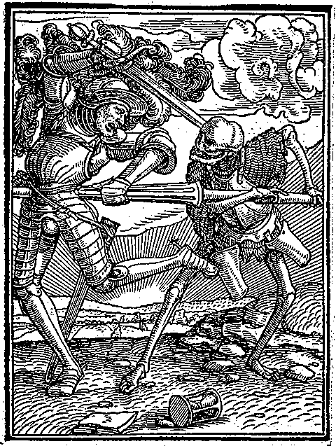

# Front matter

<!-- page: 1 -->

REMNANTS OF
*r/n-STEM HETEROCLITE INFLECTION

IN
GERMANIC

BY

J. KLIMP

UNDER GUIDANCE OF:

G. KROONEN

J.-W. ZWART

MASTER THESIS FOR THE RESEARCH MASTER LINGUISTICS

UNIVERSITY OF GRONINGEN

TH, 2013

SEPTEMBER 25

<!-- page: 2 -->

2

Wakaiþ standaiduh in galaubeinai,
wairaleiko taujaiþ, gaþwastidai sijaiþ.

I Corinthians 16:13

<!-- page: 3 -->

3

CONTENTS

Chapter 0. INTRODUCTION . . . . . . . . 6

Chapter 1. PROTO-INDO-EUROPEAN GRADATION TYPES

AND EARLY GERMANIC SOUND LAWS
.
.
.
.
.
.
13
§1.1 PROTO-INDO-EUROPEAN GRADATION TYPES
.
.
.
.
13
§1.1.1 NOMINAL GRADATION PATTERNS
.
.
.
.
.
13
§1.1.2 THE PROTERODYNAMIC TYPE .
.
.
.
.
.
15
§1.1.3 THE HYSTERODYNAMIC TYPE .
.
.
.
.
.
19
§1.1.4 THE AMPHIDYNAMIC TYPE
.
.
.
.
.
.
22
§1.2 THE LENGTHENED GRADE
.
.
.
.
.
.
24
§1.3 AN OVERVIEW OF RELEVANT GRADATION
TYPES AND LAWS OF VOWEL  LENGTHENING .
.
.
.
.
30

Chapter 2. THE HETEROCLITE DECLENSION AND ITS REFLECTION IN GERMANIC . . . . . . . . 31 §2.1 THE HETEROCLITE INFLECTION . . . . . . 31 §2.1.1 FORMAL ANALYSIS OF HETEROCLITE INFLECTION . . . 31 §2.1.2 THE DIFFERENT TYPES OF HETEROCLISY . . . . 31 §2.1.3 A NOTE ON THE GRADATION OF HETEROCLITE INFLECTION . 33 §2.2 A SURVEY OF GERMANIC REFLEXES OF INHERITED HETEROCLITES . 34 §2.2.1 THE WORD FOR ‘DAY’ . . . . . . . 34 §2.2.2 THE WORD FOR ‘WATER’ . . . . . . 38 §2.2.3 THE WORD FOR ‘UDDER’ . . . . . . 42 §2.2.4 THE WORD FOR ‘LIVER’ . . . . . . 43 §2.2.5 THE WORD FOR ‘EXCREMENT’ . . . . . 47 §2.2.6 THE WORD FOR ‘SPRINGTIME’ . . . . . . 47 §2.2.7 THE WORD FOR ‘FEATHER’ . . . . . . 49 §2.2.8 THE WORD FOR ‘SHELTER, SHED’ . . . . . 52

Chapter 3. THE HETEROCLITE NOUN FOR ‘FIRE’ . . . . . 55 §3.1 THE GERMANIC MATERIAL FOR THE WORD FOR ‘FIRE’ . . . 55 §3.1.1 GOTHIC . . . . . . . . . 55 §3.1.2 OLD NORSE AND THE NORDIC DIALECTS . . . . 57 §3.1.3 OLD HIGH GERMAN AND THE HIGH GERMAN DIALECTS . . 62 §3.1.4 OLD DUTCH AND THE FRANCONIAN DIALECTS . . . 65 §3.1.5 OLD SAXON AND THE LOW GERMAN DIALECTS . . . 68 §3.1.6 OLD ENGLISH AND THE BRITISH DIALECTS . . . . 70 §3.1.7 OLD FRISIAN AND THE FRISIAN DIALECTS . . . . 71 §3.2 THE PIE ORIGINS OF THE WORD FOR ‘FIRE’ . . . . 72

<!-- page: 4 -->

4

§3.2.1 THE ETYMOLOGICAL CONNECTION OF

THE PIE HETEROCLITE STEM ‘FIRE’ . . . . . . 72 §3.2.1.1 HITTITE . . . . . . . . 73 §3.2.1.2 ANCIENT GREEK . . . . . . . 74 §3.2.1.3 SANSKRIT AND THE INDO-IRANIAN DIALECTS . . . 75 §3.2.1.4 TOCHARIAN . . . . . . . . 76 §3.2.1.5 THE REMAINING IE DIALECTS AND THE ‘DOUBLE-ZEROED’ FORM *puh₂r . . . . . . 77 §3.2.2 PRIOR THEORIES OF THE PIE DERIVATION AND DEVELOPMENT OF THE HETEROCLITE STEM ‘FIRE’ . . . . 79 §3.3 THE DERIVATION OF THE PG FORMS FROM THE PIE HETEROCLITE STEM ‘FIRE’ . . . . . . 83

Chapter 4. THE HETEROCLITE NOUN FOR ‘SUN’ . . . . . 87 §4.1 THE GERMANIC MATERIAL FOR THE WORD FOR ‘SUN’ . . . 87 §4.1.1 GOTHIC . . . . . . . . . 87 §4.1.2 OLD NORSE AND THE NORDIC DIALECTS . . . . 88 §4.1.3 OLD HIGH GERMAN AND THE LATER HIGH GERMAN DIALECTS . 91 §4.1.4 OLD DUTCH AND THE LATER FRANCONIAN DIALECTS . . 92 §4.1.5 OLD SAXON AND THE LOW GERMAN DIALECTS . . . 93 §4.1.6 OLD ENGLISH AND THE BRITISH DIALECTS . . . . 96 §4.1.7 OLD FRISIAN AND THE FRISIAN DIALECTS . . . . 97 §4.2 THE PIE ORIGINS OF THE WORD FOR ‘SUN’ . . . . 100 §4.2.1 THE ETYMOLOGICAL CONNECTION OF THE PIE HETEROCLITE STEM ‘SUN’ . . . . . . 100 §4.2.1.1 ANCIENT GREEK . . . . . . . 101 §4.2.1.2 SANSKRIT AND THE INDO-IRANIAN DIALECTS . . . 102 §4.2.1.3 LATIN . . . . . . . . 104 §4.2.1.4 BALTO-SLAVIC . . . . . . . 106 §4.2.1.5 CELTIC . . . . . . . 107 §4.2.2 THE DERIVATION OF THE PG FORMS FROM THE PIE HETEROCLITE STEM ‘SUN’ . . . . . . 108

Chapter 5. THE HETEROCLITE NOUN FOR ‘WELL, SOURCE’ . . . 115 §5.1 THE GERMANIC MATERIAL FOR THE WORD FOR ‘WELL, SOURCE’. . 115 §5.1.1 GOTHIC . . . . . . . . . 115 §5.1.2 OLD NORSE AND THE NORDIC DIALECTS . . . . 115 §5.1.3 OLD HIGH GERMAN AND THE LATER HIGH GERMAN DIALECTS . 116 §5.1.4 OLD DUTCH AND THE LATER FRANCONIAN DIALECTS . . 117 §5.1.5 OLD SAXON AND THE LOW GERMAN DIALECTS . . . 117 §5.1.6 OLD ENGLISH AND THE BRITISH DIALECTS . . . . 118 §5.1.7 OLD FRISIAN AND THE FRISIAN DIALECTS . . . . 118 §5.2 THE PIE ORIGINS OF THE WORD FOR ‘WELL, SOURCE’ . . 118

<!-- page: 5 -->

5

§5.2.1 THE ETYMOLOGICAL CONNECTION OF THE
PIE HETEROCLITE STEM  ‘WELL, SOURCE’ .
.
.
.
.
118
§5.2.1.1 ANCIENT GREEK AND ARMENIAN
.
.
.
.
.
119
§5.2.1.2 SANSKRIT
.
.
.
.
.
.
.
.
119
§5.2.2 THE DERIVATION OF THE PG FORMS FROM THE
PIE HETEROCLITE STEM ‘WELL, SOURCE’
.
.
.
.
.
121

Chapter 6. THE DEVELOPMENT OF HETEROCLITES IN GERMANIC . . . 123 §6.1 THE PARALLEL DEVELOPMENT OF SOME GERMANIC HETEROCLITES . 123 §6.2 ON THE DEVELOPMENT OF THE LARYNGEAL IN THE SEQUENCE * [unclear] - 125 §6.3 THE WORD FOR ‘PALATE, GUMS’ . . . . . 127 §6.4 THE WORD FOR ‘POLE, PROP’ . . . . . . 130 §6.5 ON THE RELATIVE CHRONOLOGY OF SOME RELEVANT SOUND CHANGES 131

Chapter 7. CONCLUSION . . . . . . . . 135 §7.1 SUMMARY AND CONCLUSION . . . . . . 135 §7.2 OVERVIEW OF GRADATION TYPES AND SOUND LAWS . . . 137 §7.2.1 SURVEYABLE REPRESENTATION OF PIE GRADATION TYPES . . 137 §7.2.2 FORMULATION OF PIE SOUND LAWS . . . . . 137 §7.2.3 LAW OF LARYNGEAL LOSS . . . . . . 137 §7.2.4 THE FORMULATION AND RELATIVE CHRONOLOGY OF SOME GERMANIC SOUND LAWS . . . . . . 138

LITERATURE .
.
.
.
.
.
.
.
.
.
139

<!-- page: 6 -->

6

ABBREVIATIONS

LANGUAGES

Älv. Elfdalian (Sw. Älvdalska) Arm. Armenian Att. Attic Av. Avestan Brit. Brithonic Bulg. Bulgarian Cret. Cretan Cz. Czech Dan. modern Danish Dor. Doric Du. modern Dutch EG East-Germanic Far. Faroese Go. Gothic Gr. Greek HG modern High German Hitt. Hittite Hom. Homeric Icel. modern Icelandic Lat. Latin Latv. Latvian LG modern Low German Lith. Lithuanian MCorn. Middle Cornish MDu. Middle Dutch MHG Middle High German MLG Middle Low German MPers. Middle-Persian MW Middle Welsh NeG Northeast-Germanic NFris. North Frisian NG North-Germanic Norw. modern Norwegian

NwG Northwest-Germanic OAv. Old Avestan OBret. Old Breton OCorn. Old Cornish OCS Old Church Slavonic ODan. Old Danish ODu. Old Dutch OE Old English OELF Old East Low Franconian OFris. Old Frisian OHG Old High German ON Old Norse OPru. Old Prussian OS Old Saxon OSw. Old Swedish OW Old Welsh Pers. Persian PG Proto-Germanic PGr. Proto-Greek PIE Proto-Indo-European PIIr. Proto-Indo-Iranian PT Proto-Tocharian Russ. Russian SCr. Serbo-Croatian Skt. Sanskrit Sw. modern Swedish Toch. Tocharian (A and B) Ved. Vedic Sanskrit W Welsh WFris. West Frisian WG West-Germanic YAv. Young Avestan

<!-- page: 7 -->

7

PHONEMIC COVER SYMBOLS

C  =  S + P

P  =  any plosive (± *s)

E  =  /e, o/

R  =  /r, l, [unclear] , [unclear] /

H  =  /h₁, h₂, h₃/

S  =  /r, l, [unclear] , [unclear] , m, n/

L  =  /r, l/

=  /  , [unclear] /

N  =  /n, m/

V  =  any vowel
