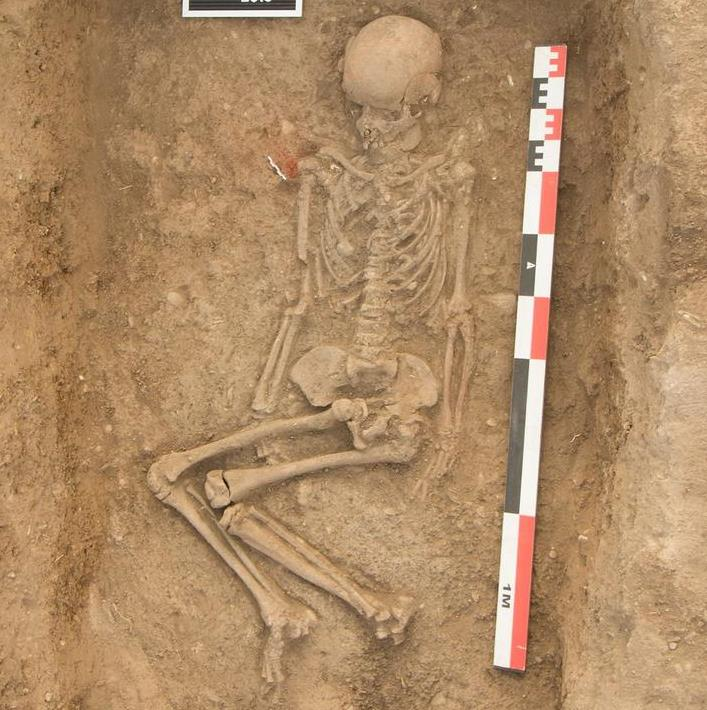

# “Linguistic Residues of Steppe Culture in Germanic”

Jenne Klimp

HANDOUT for presentation at the Oudgermanistendag, 7-6-2019

## §1. Out of the Steppes

Modern insights link Proto-Indo-European speakers to the early Bronze Age Yamnaya culture that spread across the Pontic–Caspian steppes between approximately 4000 and 3200 BC (cf. Anthony 2007, Haak 2015). Although early attested languages such as Indic, Iranian, Greek, and Hittite deserve a prominent role in the reconstruction of the language and culture, the much later attested Germanic languages provide valuable information—the relevance of the Germanic material should not be underestimated. For instance, an inherited possessive compound is found in no less than three languages: *h₁su-h₁ék̑uo- ‘having good horses’, cf. Ved. sv-áśva- ‘id.’, Av. huu-aspa- ‘id.’, Gr. εὔ-ιππος ‘id.’. However, it may also be found in Germanic:

- *h₁su-h₁ék̑uo-h₃n-es (a Hoffmann formation) > *sweh⁽ʷ⁾ōnes ‘Swedes’, cf. ON svíar, svéar, OE swēon, etc., cf. Tacitus suiones, MLat. sueones, and Jordanes (6th c.) swehans, who provides the remarkable, contextually unnecessary description of them “like the Thuringians, having excellent horses” (Getica III.16 Suehans, quae velud Thyringi, equis utuntur eximiis); also note Snorri’s (Ynglingasaga) account that the Swedish king Aðill (6th c.) loved good horses and possessed the best horses

Another inherited compound may be reflected in Germanic. It must be granted, however, that in this cases the original compound had become opaque, enabling Verner’s law to affect the consonants (cf. the same phenomenon in OE meteseax ‘knife’, OHG mezzisahs < *mati-sahsa-, but with Verner’s law in mezzirahs, mezzeres < *matizahsa-):

- *gʷh₃eu-kʷolh₁os ‘cattledriver’ in Gr. βουκόλος ‘cowherd, cattledriver’ (cf. Myc. qo-u-ko-ro, also OIr. búachaill, MW bugail ‘shepherd’ < *gʷh₃eu-kʷolh₁ios), cf. Icel. köguður ‘guardian’, ON kǫgur-sveinn, kǫgur-barn ‘bantling, infant’, Far. køgils-barn, køguls-barn ‘little boy, small child; bad type or character’
  - ON kǫgur-, Far. køgil-/køgul- < Proto-Norse *kǫgula- < *kaugala- (for the diphthong *au cf. hǫfuð ‘head’ < *haubuda- as in OE hēafod; dissimilation of *-ala- in Icel./ON -uð-/-ur remains unclear (Icel. köguður ‘guardian’ may show Angleichung to höfuð ‘head, chief’), but Faroese køgul- must be old) < *gʷh₃eu-kʷolh₁os; the compound was reanalyzed as an *-ala- formation (anachronistic) *gʷoukʷolo- > *kaugala- showing Verner’s law

Two possible archaisms preserved in Germanic connect it to Anatolian languages (which may have split off from PIE proper around 4000 BC already) that haven’t been noticed include:

- PIE *trh₂-u-ént-s/*trh₂-u-nt-ós in Hitt. Tarḫuu̯ant-/ Tarḫunt-, HLuw. Tarḫunt- ‘thunder god’ and the form þrúð- < *truh₂nt- (with laryngeal metathesis) connected to Þórr, cf. Þórr’s abode Þrúð-heimr (Grímn.), Þrúð-vangr (Gylf., Yngl.); the kenning for a shield blað ilja þrúðar þjófs ‘footsole-blade of Þrúð’s thief’ in Ragnarsdrápa refers to Þórr (perhaps rather: ‘the thief Þrúðr’ = Þórr who steals Hymir’s ox?); in Skáldskaparmál a kenning for Þórr is faðir Þrúðar ‘father of Þrúðr’
  - it thus appears that the genealogy of Þórr may not have been literal (at least not in its inception), for his mother Fjǫrgyn (< *fergun-jō < *perkʷ-u-h₃n-) reflects another name of the IE thunder-god *perkʷ-u-h₃n-os (cf. OLith. Perkūnas, OPruss. Perkūns)
- *g̑ʰrh₁-h₃ṓd-s/*g̑ʰrh₁-h₃d-és in Hitt. karāt- c. ‘entrails, innards; inner being, character’ and (continuing the stem *g̑ʰrh₁-h₃ód-m/*g̑ʰrh₁-h₃ód-i) PG *gurat-, cf. Palatine Gorz f. ‘gullet, throat’, Anspach Gräßer m. ‘ructus’ (*gräz- < *gurä́z- < *gurátja-, preserving old compound accent?), also Far. gorrutur adj. ‘loud, vociferous; boasting, swaggering’ with secondary geminate -rr- from gorra ‘(of ravens) croak, cry (hoarsely); to bluster, hold forth, boast, brag’) and the denominal verb *guratjan- (cf. Bav. gurrezen ‘produce the sound gur (of birds or the belly)’, but used typically of sounds emanating from the intestines, Rhenic görzen ‘to vomit, belch after eating’, South Hessian gorzen ‘having rumbling sounds in the intestines; to vomit’, Icel. gorta ‘to brag’ < *‘to vomit out self-aggrandizement’, and perhaps OE gorettan ‘to pour forth; to stare about’)—a compound of *g̑ʰerh₁- (to Lith. žárnos ‘bowels’, ON gǫrn f. 'bowel’ < *g̑ʰerh₁-neh₂-) and the root noun *h₃ōd-s/*h₃d-és ‘sharp stench’.

These forms illustrate the importance of the older Germanic languages, but also of the extensive Germanic dialect material of later stages.

## §2. Nomadic Pastoralism and Dairying – the root *dʰeug̑ʰ-

The Germanic preterit-present *dugan- ‘to avail, be of use, expedient’ (used as lexical and modal verb), cf. Go. daug ‘to be expedient, beneficial’, OE dugan ‘to avail, be good, be vigorous, strong, bountiful’, etc., cf.

- Go. all binah, akei ni all daug ‘all things are allowed, but not all things are expedient’ (Cor. I 10:23)
- OE þū ūs wel dohtest ‘you were good to us’ (Beow. 1821)
- ON ef þitt œði dugir ‘if your wit is of use’ (Vafþr. 20)

Note that ON duga is a weak verb < *dugē- (class III), possibly continuing the ‘stative’ *dʰug̑ʰ-ó(i), cf. Ved. duhé/duhré ‘gives milk, milks (anticausative)’.

We find the adjective ON dygðugr ‘faithful, trusty’, Far. dygdugur ‘upright, virtuous’, whereas the same adjective in Selbumål in [kū’a e̢ dyg`åg] ‘the cow gives potent milk’, to dygd f. ‘nourishment, satisfaction, fat’ (Røset 1999). This points to a meaning *‘to milk (potent/fat milk), yield potent/fat milk’ of the base verb. Note that the Swiss adjective Tugend < *dugunþi- (cf. OHG tugunt f. ‘virtus’, OE duguþ f. ‘manhood; troops; advantage’, etc.) means ‘lifeforce, (life-replenishing) potency; strong taste (of food and drink); pleasant conduct; species’, which plausibly extended the original meaning of *‘(life-replenishing) potency of dairy; potent milk’. Similarly we find MDu. dogetsam ‘virtuous, righteous’, MHG tugentsam ‘id.’, whereas the Bremen dial. dugdsame melk ‘fat and potent milk’ (Tiling 1767) again implies a base verb with the meaning *‘to milk (strong/fat milk), yield potent/fat milk’. Moreover, the abstract *duhti- < *dʰug̑ʰ-ti- is found in e.g. MHG tuht ‘virtus’, but occurs in Go. dauhts* ‘feast, banquet’ (Lk 5:29, 14:13) which implies a verb *‘to milk, give milk’, also presupposing a meaning *‘to milk (potent/fat milk), yield potent/fat milk’ for the base verb.

These forms compel us to reconstruct an original verb *dugan- with the sense ‘to avail, be of use, expedient’ (with the sense ‘virtue, virtuous’ under Christian influence) beside the sense ‘to milk, give potent milk’. This aligns the Germanic verb nicely with the Vedic verb duh- ‘to milk; give milk’. There is therefore no need to draw the conclusion of Kümmel (1996: 63), that no cognates of duh- share the meaning ‘to milk’. He reasons that since cows were so important in the culture of the Indo-Iranian speakers, the association of *‘taugen’ developed into *‘Milch geben’: “Kühe taugen ja eben dann etwas, wenn sie Milch geben”. The exact opposite development seems more plausible to me, given that the importance of the cow and milk in the culture doubtlessly finds its roots in the culture of the Proto-Indo-European speakers already and is mirrored in Germanic. In fact, the sense of verb *dugan- ‘to avail, be of use, expedient’ probably derives from ‘to give milk’. This development is supported by the fact that cattle is conceptually considered useful in Germanic, cf. *nauta- n. ‘cattle, ox’ (ON naut n. ‘cattle, ox’, OE nēat n. ‘ox, cow, cattle’) formed to *neutan- ‘to make use of, enjoy’ (ON njóta ‘to use, enjoy’, Go. niutan ‘to acquire use of, attain’), cf. G. Nutz-vieh ‘domestic cattle’, Palatine Nutz m. has the secondary sense ‘milk yield of a cow’, ON nytja ‘to milk’ (reflexive nytjast ‘to yield milk’), also nyt f. ‘milk; use, advantage; pleasure’, etc.

These findings obliterate the conclusion of Garnier &al. (2017):

> “In addition, there are no expressions using the PIE root *dʰeug̑ʰ- and meaning ‘to produce milk’, whether in Greek, Germanic or Indo-Iranian. Moreover, a semantic shift from ‘to produce’ to ‘to milk’ strikes us as unmotivated. These points seem to argue that the IIr. root *dʰaug̑ʰ- ‘to milk; to give milk’ acquired its connections to milk no earlier than Indo-Iranian, and not as a result of a straightforward semantic shift.”

The PIE verbal root *dʰeug̑ʰ- must in its earliest reconstructable stage already have meant ‘to milk; give milk’. These findings show the importance of Germanic dialect material for comparative studies and the reconstruction of the prehistory of the Germanic and other IE languages.

## §4. A remnant of Yamnaya Burial Rites?

### §4.1 Prayer in ancient India and Germania

The prayer to Agni (RV 6.1.6) proceeded with bent knee (jñubā́dh-) and a bow (námasa-):

```text
saparyéṇyaḥ sá priyó vikṣú agnír
hótā mandró ní ṣasādā yájīyān
táṃ tvā vayáṃ dáma ā́ dīdivā́ṃsam
úpa jñubā́dho námasā sadema
```

> ‘One should hold Agni in honor amongst the clans. The blithe sacrificial priest sat down, the more competent sacrificer.
>
> To thee, who shines in the house, we, upon bent knees, wish to sit down with a reverential bow.’

The compound jñu-bā́dh- consists of double zero-graded *g̑n-u- ‘knee’ *g̑ón-u/*g̑n-éu-s and a form that is connected to Vedic bādh- ‘to depress, press down’ (cf. YAv. auui.bāδa ‘due to pressure’). The long vowel may be secondary (plausibly denominal, but also cf. the rhyming nādh- ‘to be distressed’, see Cheung 2007). It is tempting to connect the form to *bʰedʰh₂- ‘to dig (the ground)’ (cf. Hitt. padda- ‘to dig (the ground); to bury’ < *bʰódʰh₂-e/*bʰdʰh₂-ḗr, Lat. fodio ‘to dig’, OCS bodǫ ‘to stab’). The compound jñu-bā́dh- ‘having the knee pressed (in or on the ground)’ < *g̑nu-bʰṓdʰh₂- ‘having the knee in or on the ground’ (of the type *pk̑u-k̑lṓps ‘cattle-thief’ in Gr. Κύκλωψ, on which see Thieme 1951).

Kern (1881) had already connected jñubā́dh- to Germanic words for ‘prayer’, cf. OE cnēow-gebed n. ‘prayer (on bended knee)’, ON kné-beðr m. ‘id.’ (contra dictionaries, hardly a ‘knee cushion’), OS kneo-beda ‘id.’, MDu. cniebede, cniegebede ‘id.’ consisting of *knewa- ‘knee’ and varyingly *bedōn-, *badja-, *ga-beda- (cf. OS gibed, OHG gibet, OE gebed, etc. ‘prayer’) all formed to the root *bʰedʰh₂-. Note that we often find the collocation with *fallan-, cf. ON falla á knébeðr, (also occurring with biðja ‘to pray’ < *bʰedʰh₂-ie-, cf. e.g. falla á kné-beð … ok biði … in Hóm.), OE ealle fēollan heom on cnēowgebedum, OS thea wrekkion fellun te them kinde an kneo-beda, MDu. hi viel in cnieghebede, etc.

### §4.2 Praying position of the dead

Pooth (MS 2014) compares jñubā́dh- to ā́cyā jā́nu ‘(having) bent knees’ (RV 10.15.6), which is the burial position of the forefathers (pitáraḥ):

```text
ā́cyā jā́nu dakṣiṇató niṣádyemáṃ yajñámabʰí gṛṇīta víśve
```

> ‘Herangebogen das Knie, von rechts (= von Süden) niedergesetzt / sich niedergesetzt habend, dieses Opfer lobpreiset alle!’

In overview, burial of the forefathers show the following properties (mostly found in RV 10.15ff.):

- the forefathers were buried slanted (jihma-śī́- ‘lying slanted, tilted’) (cf. AVŚ 12.4.53d jihmó lokā́n nír r̥chati ‘he goes slanted/tilted out of this world’)
- lying with bent knees (ā́cyā jā́nu, cf. jñubā́dha-)
- facing right (dakṣiṇató), i.e. honoring the rising sun (metaphorically as Agni)
- are sitting in the womb of the reddish ones (ā́sīnāso aruṇīnām upásthe ‘residing in the womb of the ruddy ones’, also called a room (loka-); possibly a strewing of red ochre in the tumulus according to Pooth)
- positioned on a straw seat (barhi-ṣáda-) like Agni

Compare the description in a later (but possibly no less important) text, the Taittirīya Samhita 6.2.5.5: given by Gonda (1972):

> ‘The man who is consecrating himself is a foetus, the consecration-shed is the womb (in which he is). If he were to leave it, it would be as when a foetus falls from the womb. He must not leave it, to guard himself. He lies on the right side; that is the regular position of the sacrificer; verily he lies in his own abode (āyatane). He lies turned towards the fire; verily he lies turned towards the gods and the sacrifice.’

This connects bowing with bent knees as well as lying with bent knees (and thus aslant/tilted) to the position of the dead as a form of prayer.



As noted by Pooth, the Vedic burial description is remarkably similar to Yamnaya culture burials, compare the words of Anthony (2007: 297) and the image above (taken from https://www.helsinki.fi/en/news/science-news/rescue-excavations-led-to-the-discovery-of-a-yamnaya-burial):

> “Bodies buried in Sredni Stog graves usually were in the supine-with-raised-knees position that was such a distinctive aspect of steppe burials beginning with Khvalynsk. The grave floor was strewn with red ochre, and the body often was accompanied by a unifacial flint blade or a broken pot.”

### §4.3 Prayer to the Sun and Dawn(s)

In RV 1.113.5, the Dawns (Uṣásaḥ) awaken the ones who are jihma-śī́- ‘lying aslant, tilted’, i.e. those who honor Agni, cf. AVŚ 12.4.53d jihmó lokā́n nír r̥chati ‘he goes slanted/tilted out of this world’. In the Icelandic Sólarljóð—a 12th c. text containing remnants of a pagan rite—we find the remarkable passage of the dying pagan man (who had just converted):

```text
Sól ek sá        setta dreyrstǫfum;
mjǫk var ek þá ór heimi hallr

(Sól. 40)
```

> ‘I saw the sun, set with bloody staves; I was then greatly slanting/inclined/tilted out of this world’

```text
Sól ek sá        sjaldan hryggvari;
mjǫk var ek þá ór heimi hallr

(Sól. 44)
```

> ‘I saw the sun, [I was] seldom more grief-stricken; I was then greatly slanting/inclined/tilted out of this world’

NOTE: For ór heimi ‘out of this world/abode’ cf. koma í heiminn ‘be born’, i.e. come into the world, so it may be an Augenblicksbildung: be on your way out of this world: (vera?) ór heimi.

The adjective is ON hallr ‘leaning to one side, lying over, sloping; biased, partial’, cf. Far. hallur ‘inclined, sloping; leaning in an oblique or slanting position’, OE heald adj. ‘inclined’, Go. wilja-halþei f. ‘inclination, bias’, etc. The word parallels the Vedic jihma-śī́- in the context of venerating the sun while dying, cf.

```text
Sól ek sá;        svá þótti mér,
sem ek sæja á gǫfgan guð;
henni ek laut

hinzta sinni
aldaheimi í.
(Sól. 41)
```

> ‘I saw the sun; it seemed to me as if I was seeing a venerable god; I bowed to it for the last time in this (age of the) world’

NOTE: For aldaheimi í ‘in this (age of the) world’ cf. heims-aldr m. ‘age of the world’.

Interestingly, prayer to the sun proceeds with a bow (laut), cf. Ved. úpa jñubā́dho námasā sadema (RV 6.1.6) to Agni above.

I suspect that valhǫll ‘hall of the slain (of Óðinn)’ may originally not have been a hall, cf. Swed. (dial.) valhall f. ‘burial tumulus’ (still found in names for burial mounds/tumuli). I propose to derive the words from *wala-halþō- ‘inclined/tilted position of the slain’ or ‘the slain in inclined/tilted position’. During the Viking age, the hall became a prestige room for the (warrior) elite and the word was reinterpreted as a compound containing *hallō- (after *-lþ- > *-ll-). The development of a word for the tilted burial position is paralleled by *hlaiwa- m. ‘(funeral) mound, tumulus’ (OE hlāw m. ‘tumulus, burial mound; interior of a mound, grave’, OHG hlēo m. ‘(burial) mound, tumulus’, Go. hlaiw m. ‘tomb, grave’, etc.) < *k̑loih₁-uo- *‘sloped, declined position (of a dead person)’ to *k̑leih₁-, cf. Lith. šlíeti ‘lean, rest (against)’, and *k̑li-né-h₁-ti/*k̑li-n-h₁-énti in OHG hlinên, OE hlinian ‘lean (over), lie down, recline’, Lat. dē-clīnāre ‘to slope downward, decline’, etc.

### §4.4 The chosen dead

The ON valkyrja ‘choosers of the slain’ (cf. OE wælcyrge ‘Fate, gloss for (malevolent) female divinities’, similarly wæl-cēasiga m. ‘chooser of the dead, raven’) < *wala-kuzjōn- are the ones who choose the dead warriors, cf. Gylfaginning (ch. 36):

> Þessar heita valkyrjur. Þær sendir Óðinn til hverrar orrustu. Þær kjósa feigð á menn og ráða sigri. Gunnur og Rota og norn hin yngsta er Skuld heitir ríða jafnan að kjósa val og ráða vígum.
>
> ‘These are called valkyries. Óðinn sends them to all battles. They choose those men who are to be slain and decide victory. Gunnr and Rota, and the youngest norn is called Skuld, ever ride to choose the slain and decide battles.’

The word ON valr is often derived from *uelh₃- ‘to hit, strike’ (Hitt. u̯alḫ-zi ‘id.’), but is more plausibly derived from *uelh₁- ‘to choose’, i.e. *uolh₁o- (perhaps *saiwalō- f. ‘soul’, cf. Go. saiwala, OE sāwul, etc., reflects a compound *X-uolh₁eh₂-?). Gimbutas (1963) describes the Lithuanian vėlės ‘spirits of the dead’ (cf. Latv. velis ‘ghost of a dead person’) < *uelh₁-ieh₂- as living in sandy hills or burial mounds (whence they travel to the sun at the end of the visible world). Moreover, Av. uruuan- ‘soul (which separates at death)’ may be derived from *ulh₁-uén- (perhaps implying an old heteroclite *uélh₁-ur/*ulh₁-uén-s?), cf. Panaino (2017):

> “According to the description attested in the Hāδōxt Nask 2, when a man dies, his soul, Av. uruuan-, m., separates from the body and abides three nights near the head of the corpse. At the end of the third night the soul of the righteous man (ašā̆uuan-) inspires a sweet perfume brought by the South wind, and then, can see his own daēnā-, f., or “the soul-vision”, in the aspect of a fifteen-years-old extraordinarily beautiful maiden. At this point, the uruuan- asks to the daēnā- who is she, because he never saw in his life a so beautiful and pretty maiden. Then, the daēnā- explains that she is “the soul-vision” of his own indeed, namely his visible representation, which in that beauty embodies the good thoughts, good words and good deeds performed by the dead person in life.”

The spirits of the eligible dead are thus ‘chosen’ (a sense which looks to have faded), and seemed to have involved a beautiful girl. The girl appears on the third day in the Hāδōxt Nask, cf. the Sólarljóð where on each of the nine days (perhaps 3×3 connects it to the Av. 3 nights) on his death bed (he ‘sat on the seat of the norns for nine days’: á norna stóli sat ek níu daga), the protagonist is invited each evening by heljar meyjar ‘hell’s maidens’ (thus totaling 9 such maidens).

This may be compared to the hero Helgi who marries the valkyrie Sigrún after meeting her when she leads nine valkyries (HHund.I). This is followed by his sacrificial murder to Óðinn by Dagr (lit. ‘day’—perhaps intimating a parallel of the cycle of the day following the dawn and the (predestined) cycle of one’s life?), cf. (HHund.I 15):

```text
Þá brá ljóma / af Logafjǫllum,        ‘then light shone from Blazing-hill,
en af þeim ljómum / leiptrir kvómu,   and from the light leapt flashes,
hávar und hjalmum / á Himinvanga,     high under helmets to Sky’s-field,
brynjur váru þeira / blóði stokknar,  their armors were blood-stained,
en af geirum / geislar stóðu.         And from their spears, beams shone.’
```

A consistent, characteristic property of the valkyries/norns is their brightly shining appearance, which further connects them to the shining Uṣásaḥ ‘Dawns’ (e.g. uṣáso rócamānā ‘radiant Dawns’ RV 6.64.1).

This connection may be supported by the manifestation of r̥tá- ‘cyclical cosmic order’ by Dawn, cf. RV 7.75.1:

```text
vyuṣā āvo divijā ṛtena, āviṣkṛṇvānā mahimānam āgāt
```

> ‘heaven-born Dawn opens out things by the r̥tá-, she manifests the greatness’

and the manifestation of ørlǫg ‘fate(d death), predestination’) by the valkyries/norns, cf. Vǫluspá 20:

```text
Þaðan koma meyjar        ‘thence come maidens’
margs vitandi            much knowing
þrjár, ór þeim sál        three, from that dwelling
er und þolli stendr;      that stands under the tree;
Urð hétu eina,            Urðr is called one
aðra Verðandi,            another Verðandi
skáru á skíði,            - they carved on the (fire-)wood -
Skuld ina þriðju;         Skuld the third;
þær lǫg lǫgðu,            they laid (down) laws
þær líf kuru              they chose (the) life
alda bǫrnum,              for the life-time of children -
ørlǫg seggja.             predestination of men
```

NOTE: Since the verb skera (skáru PRET.IND.3PL) in line 7 requires an object, plausibly in the form of ørlǫg seggja, so that the phrase á skíði could (1) modify the verb skera, ‘carved on wood’, referring to the carving of fate onto the primeval man and woman, Ask ‘ash’ and Embla, who are created ørlǫglausa ‘without predestination/fate’ (Vǫl. 17), or tentatively (2) refer to the norns, then residing í skíði ‘on firewood’ (cf. Uṣásaḥ who are referred to as jihmā́na- ‘oblique ones = firewoods’ in RV 2.35.9).

These considerations paint a very provisional and tentative reconstruction of the eligible dead (explaining the derivation of words for ‘soul’ in several IE languages) being chosen by the Dawn(s) in the form of (a) beautiful, shining maiden(s) on the basis of their deeds.

### §4.5 Concluding Remark and Questions

Are we allowed to posit the following scenario?

- during or after three or nine days the eligible dead where chosen (provided they were buried in a tumulus in the supine-with-bent-knees position; perhaps then to be burned?)
- the one(s) who choose is/are the Dawn(s), i.e. beautiful, radiant maidens escorting the eligible dead (to an afterlife or different world?)

But: what made someone eligible—was it a heroic death, heroic deeds, or good and kindly deeds? How did the cultures change and do they reflect an earlier view or did they all change?
