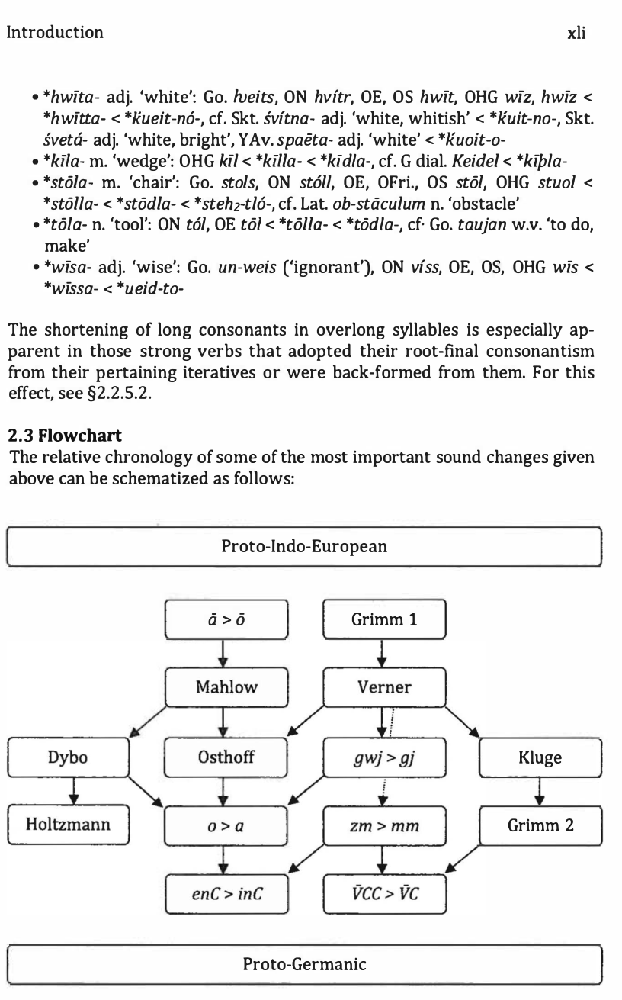

# Introduction

<!-- pdf-page: 12 -->
Introduction

1 The Proto-Indo-European and Proto-Germanic phonemes

1.1 Proto-Indo-European ln the present book, I have made use of the phonological system as envi-

sioned by Beekes 1995 for all рeconstructed Proto-Indo-European forms:

voiceless stops p t If k kw voiced (glottalized?) stops b? d 9 g gw voiced aspirated(?) stops bh dh gh gh gwh fricative s laryngeals h₁ h₂ h₃ resonants m n I r semivowels u vowels e 0 a? e 6

Proto-Indo-European had three series of stops, whose articulation in many ways continues to be debated (cf. Kummel 2012). I have made use of the mainstream division into plain stops, voiced stops and voiced aspirated (breathy-voiced?) stops, but if the voiced PIE stops were actually pre-glottalized, as is assumed within the Glottalic Theory, the feature of aspiration becomes redundant. Unlike Proto-Germanic, which typically had the stress on the first root syllable of the word, Proto-Indo-European had a free tonal accent: the ac cent could occur on the root, the suffix or the ending, and within nominal and verbal paradigms often shifted from one syllable to another. Stress-bearing elements were the vowels, the semivowels, the resonants and the laryngeals. The latter three types of phonemes could only receive the stress when they were in vocalic position, i.e. functioned as sylla ble-building elements. Since the vocalization rules of these phonemes in the individual Indo-European daughter languages are often incompatible with each other, they must post-date the parent language. PIE *h₂mbhi adv. 'around, about', for instance, is realized as *l;J2rpbhi in PGm. *umbi and Skt. abhf, but as *P2mbhi in Gr. aμq>L Similarly, the Proto-Indo-European word *h₃bhruH- 'eyebrow; bridge' has no less than three different vocalizations, i.e. *1;)3bhruH- as in PGm. *brii- and Skt. bhru-, *P3bhruH- as in Gr. 6q>piJ<;, and *1;)3bh[!lj- as in ToB piirwa-ne (du.). The latter example is especially in formative, because it proves that the vocalization of the *r was triggered by

<!-- pdf-page: 13 -->
the vocalization of the laryngeal in Tocharian, just as the vocalization of initial *h₂ in Greek conditioned the non-vocalization of the *m in Gr. aμcpL It seems evident, in other words, that the vocalization of both the laryngeals and the resonants was phonologized in the individual daughter languages. I have therefore refrained as much as possible from indicating vocalization (i.e. P1, P2, p3, 1J1, J, f.1, [, as well as j, y) in PIE reconstructions, as this would inevitably lead to erroneous proto-forms, and have only used them to indi cate vocalizations in proto-forms underlying specific IE dialects.

1.2 Proto-Germanic Proto-Germanic phonology differs significantly from Proto-Indo-European. It acquired a number of new vowels, both short and long, and the stress was retracted to the vowel of the first root syllable of a word. Due to a shift of the Indo-European stops, Proto-Germanic also acquired a large amount of new fricatives, both voiced and voiceless. The phonemes reconstructed as *b, *d, *g in this dictionary also at least partly appear as *b, *d, *g in the Germanic dialects. For instance, most languages have plosives word-initially, but *g emerges as a fricative in this position in both Saxon and Franconian. Since the distribution surfacing in the individual languages is divergent, this alternation is likely to have been subphonemic in Pro to-Germanic. Another important innovation is the rise of phonemic conso nant length. Due to a range of phonetically regular sound changes, Pro to-Germanic acquired a geminated variant of practically any existing con sonant, and this is perhaps one of the the most far-reaching phonological changes that the language went through. The resulting phoneme inventory can be summed up as follows:

voiceless (glottalized?) stops p t k kw voiceless (glottalized?) geminates pp tt kk voiceless fricatives f p h hw fricative geminates ff? pp? hh? sibilants s z long sibilants SS zz? voiced fricatives - stops b-b d-d g-9 gw(-w) voiced geminates bb? dd? gg? resonants m n I r geminated resonants mm nn II rr glides j w geminated glides jj WW short vowels e a u long vowels e 0 f u diphthongs ai au eu ia

<!-- pdf-page: 14 -->
2 From Proto-Indo-European to Proto-Germanic

2.1 The vowels I will here discuss the most important sources of the Proto-Germanic vow els. As mentioned above, one of the striking innovations is that Pro to-Germanic acquired a lot of new vowels, both short and long. that did not yet exist in Proto-Indo-European. These vowels developed from a number of dissimilar sources, mostly combinations of vowels plus laryngeals (HV, VH), vocalized laryngeals (if) and vocalized resonants ({?).

2.1.1 Short vowels

2.1.1.1 PGm. *a PGm. *a arose out of a merger of Pre-Gm. *o and *a. These vowels must nevertheless have remained distinct until after Verner's law, as PGm. *gw from both PIE *kw (*K'J.l) and *gwh (*gh₃.l) was delabialized before *j in roots with *a from old *o (see §2.2.4.). Pre-Gm. *o continues PIE *o, *Ho and *h₃e.

• *aita- m. 'ulcer, pus': OHG eiz m. 'abscess, boil' < *h₂oid-o-, cf. OCS jad'b m. 'poison', SCr. l'jed m. 'gall, poison, anger' • *amban- m. 'belly': OS ambon (m.pl.), cf. Lat umbo 'boss (of a shield); protuberance' < *h₃embh-on- • *fadi- m. 'lord': Go. brup-faps m. 'bridegroom' < *pot-£-, cf. Gr. rr6otc;, Lith. pats m. 'husband'

The direct sources of PGm. *a are PIE */j. and *h₂e:

• *aba adv., prep. 'from; off: Go., ON af. OE of. OHG ab < PIE *h₂ep-6, cf.

Gr. arr6, c'irro adv., prep. 'far away, away from' • *bakan- s.v. 'to bake': ON baka, OE bacan, OHG bahhan < *bh!J39-e-, cf.

Gr. c:pwyw 'to roast' < *bheh₃9-e- • *fader- m. 'father': Go.fadar, ONfaoir, OEfreder, OFri.feder, OSfadar < *ph₂-ter-, cf. Skt pitar-, Gr. rratjp, gen. rra-rp6c;, Lat pater, -tris, Olr. athir, athair m. 'father'

An important issue concerns roots with *a< *lj. that start with a resonant. It is widely assumed that the resonant rather than the laryngeal is vocalized in such roots (cf. Schaffner 2001; Mil.lier 2007), but this is in disagreement with the facts (cf. Beekes 1988):

•*/aka- adj. 'weak': ON lakr < *l!Jzg-o-, cf. Gr. A.ayap6c; adj. 'weak' • *lakjan- w.v. 'to seize': OE lreccian, cf. Gr. A.aсoμm 'id.' < *l!Jzg-ie- • *lata- adj. 'lax, sluggish': Go. lats, ON latr, OE la!t, OS lat< *l!J1d-o-, cf. Gr.

ATJOE'lv 'to be slow' < *leh₁d-

<!-- pdf-page: 15 -->
• *magra- adj. 'slim': ON magr, OE m<Eger, OHG mager adj. 'id.' < *mP21<-r6-, cf. Gr. μaKp6c; adj. 'long'

• *mahan- m. 'poppy': OHG maho m. 'id.' < *mif2k-on-, cf. Gr. μdKwv 'id.' < *meh₂k-on-

• *natja- n. 'net': Go. nati, O.N, OE net, OS netti, OHG nezzi < *nljd-io-, cf. Lat. nodus m. 'node' < *noHd-o-; Olr. nascaid 'to bind' < *nHd-ske-

There are additional cases that seem to indicate that the vocalization of the laryngeals as *a does not change when the following obstruent is a conso nantal resonant A difficulty with the given examples is that their probative force is nullified by Dybo's law, i.e. the regular shortening of pretonic long vowels before resonants. As a consequence of this law (for which see §2.1.2), the vocalization of *H to *a is technically unfalsifiable before resonants, because the *a can always have developed out of unstressed *eh₂;3, *oH or *6 in this position. Nonetheless, the vocalization *H before resonants can be ascertained on the basis of formations in which it is mor phologically unlikely that the root had a full grade, such as, for instance, the PIE no-participles.

• *hanan- m. 'rooster': ON hani, OE hana, OHG hano m. 'id.' < *l<p2n-on-, cf. Gr. dL-Kav6c; 'id.' (<"morning singer")

• *harojan- w.v. 'to sharpen': MDu. haren w.v. 'to sharpen', derived from an adjective *l<p3-ro- or *l<oh₃-r6-, cf. Arm. sur adj. 'sharp'

• *namon- n. 'name': Go. namo, ON nafn, OE nama, OHG namo 'id.' < *h₃np3-men- (less likely *h₃neh₃-men-), cf. Gr. ovoμa 'name'

• *nawi- m. 'corpse': Go. naus, ON nar < *nP2u-i-, cf. Latv. nave f. 'death' < *neh₂u-ieh₂-

• *wana- adj. 'lacking': Go. wans, ON vanr adj. 'id.' < *h₁uP2-n6-, cf. Skt iina- 'id.' (vs. Lat. viinus adj. 'empty, void' < *h₁ueh₂-no-)

PGm. *a in a small number of words continues what looks like PIE *a, but many of these words have a limited European distribution, and it therefore seems unwarranted to project them back into the parent language (Lubotsky 1989). In reality, they are likely to continue Wanderwiirter or were borrowed from now extinct European languages by the individual dialects after they had acquired *a by the vocalization of the laryngeals. This taken into account, very few potential instances of PIE *a remain, es pecially in comparison to the overwhelming evidence for the vowels *e or *o. This alone makes it highly unlikely that Proto-Indo-European had *a as a phoneme. But the prophecy is essentially self-fulfilling: anyone who accepts *a for Proto-Indo-European will start seeing it everywhere:

• *bauno- f. 'bean': ON baun, OE bean, OS, OHG bona< *bhau-neh₂-, cf. Lat faba f. 'id.', OPru. babo 'id.', OCS bob'b m. 'id.' < *bhabh-o/eh₂-

<!-- pdf-page: 16 -->
Introduction xix

•*gait- f. 'goat': Go. gaits, ON geit, OE gtit, OS get, OHG geiz < *ghaid-, cf.

Lat haedus m. 'young goat-buck, kid' < *ghaid-o- • *hafra- m. 'billy goat, buck': ON hafr, OE hrefer < *kap-ro-, cf. Gr. Kanpoc; m. '(wild) boar', Lat. caper m. 'he-goat, buck' < *kap-ro-, Olr. gabor, W gafr 'id.' < *gabro- • *hanipa- m. 'hemp': ON hanpr, OE hcenep, henep, OHG hanaf. hanif < *kanib-, cf. Gr. Kavva.pLc; f. 'id.' < *kannabi-, Ru. konoplja f. 'id.' • *paido- f. 'coat, shirt': Go. paida, OE pad, OS peda, OHG pfeit < *bait-eh₂-, cf. Thrac. pal TI] f. 'coat made of pelt'

2.1.1.2 PGm. *e The main sources of PGm. *e are PIE *e or *h₁e:

• *beran- s.v. 'to carry': Go. bairan, ON bera, OE beran, OFri. bera, OS, OHG beran < *bher-e-, cf. Skt. bharati, Gr. cptpw, Lat. fero, ferre, Olr. beirid 'id.' • *etan- s.v. 'to eat': Go. itan, ON eta, OE, OS etan, OHG ezzan < *hied-, cf.

Hitt. ez(za)zi, Gr. £8w, Lat. edo, esse 'id.'

2.1.1.3 PGm. *i PGm. *i developed directly out of PIE *i. It is sometimes assumed that it merged with *e in Proto-Germanic if the following syllable contained a, but this cannot be the case: unlike *e, *i is never affected by a-breaking in Old Norse, only by a-mutation.

• *fiska- m. 'fish': Go. fisks, ON fiskr, OE, OHG fisc m. 'id.' < *pisk-o-, cf. Lat. piscis < *pisk-i-, Olr. fasc < *peisko- • *likkon- w.v. 'to lick': OE liccian, OS likkon, OHG leckon 'id.' < *ligh-neh₂-, cf. Lat. lingo, -ere 'id.'

A second common source for PGm *i is PIE *e: this vowel was raised before tautosyllabic nasals. This raising must have taken place relatively late, as it post-dated the assimilation of*-ny- to *-nn- (§2.2.5.6) as well as the assimi lation of *-zm- to *-mm- (§2.2.5.4), which itself was posterior to Verner's law. It is further evident that it was later than the merger of *o with *a, as *o would otherwise have been similarly raised to *u.

• *finpan- s.v. 'to find': Go. finpan, ON finna, OE fiOan, OHG findan < *pent-e-, cf. Skt. panthtis, gen. path<is m. 'road, path, course' < *pont-H- • *bindan- s.v. 'to bind': Go., OE, OHG bindan, ON binda < *bhendh-e-, cf.

Skt badhnilti 'id.' < *bhT)dh-neh₂-

<!-- pdf-page: 17 -->
2.1.1.4 PGm. *u The source for PGm. *u is twofold: it developed from PIE *u and from a PIE vocalized resonant CF < uR). For examples of the former:

• *kula- n. 'coal': ON kol, OE co/, OHG ko/ < *gul-o-, cf. Olr. gual < *gou/-o-

• *kustu- m. 'choice'; Go. kustus, ON kostr, OHG kust < *gus-tu-, cf. Lat. gustus 'taste'

The second important source for PGm. *u consists of resonants that were vocalized between consonants:

•*Julia- 'full': Go.fulls, ONfullr, OEful, OHG/o/ adj. 'id.' < *pJhrn6-

• *kwumj;i- 'arrival, coming': Go. ga-qum(f)j;s, ON -kund, OHG qhumft, chumft, chunft 'id.' < *gwrft-ti-, cf. Lat. con-ventio 'convention'

• *tunp- m. 'tooth': Go. -tunpus m. 'id.' < *h₃d1Jt-, cf. Lat dens< *h₁d1Jt-

• *uns pron. 'us': Go. uns, ON oss, OE us, OHG uns 'id'.' < *IJS, cf. Lat. nos< *nos

It is important to realize that resonants were also vocalized before a laryn geal that was later lost. It is consequently incorrect to state that laryngeals are irrelevant for the reconstruction of Proto-Germanic:

• *suma- pron. 'some': Go. sums, ON sumr, OE, OHG sum < *srp.H-o-, cf. Gr. aμo- 'someone'

• *ufuma- comp. 'highest': Go. auhuma < *up-rp.h₂-o-, cf. Skt. upama-, YAv. upama- sup!. 'id.'

• *fulan- m. 'foal': ON Joli, OE fola, OHG volo < *pJH-on-, cf. Gr. rrwA.oc; < *po I H-o-

• *kuru- adj. 'heavy': Go. kaurus < *BwrH-u-, cf. Latgravis

• *furai adv. 'before': Go. /aura, OE fore, OHG fora, Jura < *p[h₁-oi, cf. Gr. mipoc;, Skt puraJ:i 'id.' < *p[h₃-os

2.1.2 Dybo's law Another development involved in the creation of the PGm. short vowels is Dybo's law. It was suggested by Dybo 1961 that in Celtic, Italic and Ger manic long vowels were shortened pretonically. It is incorrect, however, to speak about this law as one single development. While in Italo-Celtic any long vowel seems to have been affected, the Germanic shortening applied only to long vowels before resonants. In this position, Pre-Gm. *a, *o, *e, *i ( <t. PIE *el) and *u were shortened to *a, *e, *i and *u respectively:

• *alino- f. 'elbow': Go. a/eina, ON pin, OE e/n, OHG elena, elna, cf. Gr. wA.EVTJ < *h₁eH/-en-eh₂-

• *delo- f. 'tit': OE de/u, OHG ti/a, cf. Gr. 8TJAd f. 'breast' < *dhehrl-eh₂-

<!-- pdf-page: 18 -->
• *glana- n. 'shine': ON glan < *ghloh₃-n6-, cf. *gloan- s.v. 'to glow': OE glowan, OS gloian, OHG gluoan < *gh/6h₃-e-

• *hula- adj. 'hollow': ON holr, OE, OFri., OHG ho/< *ICuH-16-, cf. Lat cavus adj. 'id.' < *lfouH-o-; Skt. §una- adj. 'lack, absence' < *ICuH-no-

• *stura- adj. 'big': OSw., Elfd. stur < *sth₂u-r6-, cf. Skt sthura- adj. 'big, strong, thick, massy'

• *sunu- m. 'son': Go. sunus, ON sunr, sonr, OE, OS sunu, OHG sun(u), cf.

Skt. sunu-, Lith. sun us, OCS syn'b m. 'id.' < *suH-nu-

• *wira- m. 'man': Go. wair, ON verr, OE, OS, OHG wer, cf. Skt. vfra-, Lith. vyras, Lat. vir m. 'id.' < *uiH-r6-

In Pre-Germanic accentually mobile words, Dybo's law may have given rise to paradigmatic length alternations. It is conceivable that the difference between OHG dumo 'thumb' < *puman- and OSw. pumi 'id.' < *puman- arose in a paradigm *tuH-mon, gen. *tuH-men-os, yielding PGm. *puma, *pumenaz. Since Dybo's law affected the PGm. word for 'egg', whose *a through *o developed from originally long *o, it is likely to have post-dated the change *6u > *6, for which see §2.1.5.

• *ajja- n. 'egg': Go. Crim. ada (n.pl.), ON egg, OE reg, OS, OHG ei < *oj6- < *6j6- < *h₂6u-i6-, cf. Gr. ciJ6v, Lat. ovum, OCS aice n. 'id.'

2.1.3 Long vowels

2.1.3.1 PGm. *e PGm. *e de loped out of PIE *e and *eh₁ and is usually reconstructed phonet ically as [<E]. It yielded a close vowel e in Gothic and Old Frisian, re in Old English, and a in Old Norse, Old Saxon and Old High German.

• *sedi- f. 'seed': Go. seps, ON s<io, OE s<i!d, OHG sat< *seh₁-tf-, cf. Go. saian, Lith. s&i 'to sow' < *sehi-e-

• *nep/6- f. 'needle': Go. nepla, ON n<il, OE nrepl, OHG niidala < *neh₁-tl-eh₂-, cf. *nean- s.v. 'to sow': OHG na(w]an < *neh₁-

• *kweni- f. 'wife, woman': Go. qens < *gwen-i-, cf. Gr. yuviJ f. 'id.' < *gw(o]n-eh₂-

The question whether OE ci! and OFri. e (the latter with raising) reflects PGm. *ci! directly or developed secondarily out of Proto-North-West Ger manic *a is difficult to answer. Latin loanwords such as OE strci!t 'street' < strata are in support of the latter scenario. It has been argued that a was substituted by :i! in these cases because Anglo-Frisian did not have an a at the time of borrowing, but there are additional indications that An glo-Frisian raised older *a. A small but relatively old, i.e. at any rate Pro to-Northwest-Germanic group of n-stems displays a/a-ablaut in the root, cf.

<!-- pdf-page: 19 -->
OHG krii.cho m. 'crook' < *krii.kan- vs. ON kraki m. 'id.' < *krakan-. Since this type of ablaut was introduced analogically on the basis of n-stems with reg ular i/i-ablaut, cf. OHG rido, dat. riten m. 'fever' < *hripo, dat. *hrideni < *kreit-on, *krit-en-i (Schaffner 2001: 549-51), it is likely that PNWGm. had *ii. rather than *re, since it thus would be more susceptible to the introduc tion of a pure length alternation. This *ii. must then have been raised to *re in Anglo-Frisian, and further to *e in Proto-Frisian, as is supported by NFri. (Wiedingharde) krek m. 'hook on clothes' (Kroonen 2011: 332).

2.1.3.2 PGm. *o

PGm. *o is the result of a merger of Pre-Gmc. *o and *ii. from PIE *o, *eh₃, *oh₁;2;3 and *eh₂. Compare the following examples:

• *Jot- m. 'foot': Go. Jotus, ON J6tr, OE, OFri., OS Jot, OHG fuoz < *pOd-, cf. Gr. nou<;, noM<; m. 'id.' < *pod-, Lat. pes m. 'id.' < *ped-

• *9a-no9a- adj. 'enough': Go. ganohs, ON (9)n6gr, OE 9enoh, OHG 9inuo9 < *kom-h₂noK-o-, cf. Skt. anat aor. 'reached' < *h₁e-h₂neK-t

• *doma- m. 'decision, verdict': Go. dams, ON d6mr, OE dom, OHG tuom < *dhoh₁-mo-, cf. Gr. -Bwi] 'punishment' < *dhoh₁-eh₂-

• *sokjan- w.v. 'to search': Go. sokjan, ON scekja, OE srecan, OHG suohhen, cf. Lat. sii.gire < *seh₂g-ie-

• *moder- f. 'mother': ON m6oir, OE modor, OFri. mOder, OS modar, OHG muoter, cf. *meh₂-ter-, cf. Skt. mii.tar-, Gr. μi]TI]p, Lat. mii.ter f. 'id.'

A third source for PGm. *o is PGm. *ou. The details of the underlying sound change are given in §2.1.5.

2.1.3.3 PGm. *i Two sources are available for PGm. *i, i.e. *iH and *ei:

• *swina- n. 'pig': Go. swein, ON svfn, OE, OHG swin < *suH- 'sow' + the suffix *-ina-, cf. Go. gait-ein n. 'little goat'

• *stigan- 'to ascend': Go. steigan, ON stfga, OE, OHG stigan < *steigh-e-, cf. Gr. crrEi.xw 'to go, step'

2.1.3.4 PGm. *ii Unlike PGm *f, which partly developed out of *e + *i, the only regular pre cursor of PGm. *ii is PIE *uH, as the sequence *eu remains PGm. *eu.

• *miis- f. 'mouse': ON mus, OE, OHG miis < *muHs-, cf. Gr. μu<;, Skt. muݺ-

• *sii- f. 'sow': ON syr, OE, OHG sii < *suH-, cf. Gr. l'i<;, Lat. siis

Long *ii probably also arose secondarily, i.e. in analogy to the change of PIE *ei to PGm. *i. For this development, see §2.2.5.2.

<!-- pdf-page: 20 -->
2.1.4 Diphthongs Proto-Germanic had four diphthongs: *ai, *au, *eu and *ia. The vocalic ele ments of these diphthongs have the same origins as their corresponding short vowels, and can be traced back to the Indo-European proto-language accordingly. Likewise, the off-glides *i and *u go back to PIE *i and *u.

2.1.4.1 PGm. *ai

• *aida- m. 'pyre, glow': OE ad, OHG eit < *h₂eidh-o-, cf. Gr. aTBos 'fire', Skt. edha- 'firewood'

• *snaiwa- m. 'snow': Go. snaiws, ON sneer, OE snaw, OHG sneo < *snoigwh_o-, cf. ocs sneg'b m. 'id.'

2.1.4.2 PGm. *au

• *auke conj. 'then again, too': Go. auk, ON auk, ok, OE eac, OHG auh < *h₂eu-ge, cf. Gr. au, au-yE 'id.'

• *rauda- adj. 'red': Go. raups, ON rauor, OE read, OHG rot < *h₁roudh-o-, cf. Gr. £puBp6s adj. 'id.' < *h₁rudh-ro-

2.1.4.3 PGm. *eu

• *eudra- n. 'udder': ON jugr, OFri. jader < *h₁euHdh-r-, cf. Gr. ouBap < *h₁ouHdh-r

• *keusan- s.v. 'to try, choose': Go. kiusan, ON kj6sa, OE ceosan, OHG kiosan < *geus-e-, cf. Gr. yEiJOμm 'to taste'

2.1.4.4 PGm. *ia What is here reconstructed as *ia is traditionally referred to as so-called *ez.

As opposed to *el ( < PIE *e, *eh₁), this second *e has close reflexes throughout the Germanic dialects, viz. Go. e, ON e, OE Ii!, OHG e, ie, ia, and is therefore generally assumed to have been a close-mid vowel [e] in Pro to-Germanic. It is especially frequent in Vulgar Latin loanwords:

• *be2ton- f. 'beetroot': OE bete, OHG bieza, cf. It. bieta

• *bre2fa- m./n. 'letter': ON bref, OHG briaf, cf. Lat. brevis

• *kre2ka- m. 'Greek': Go. Kreks, OHG Kriach, cf. Lat. Graecus

• *mezsa- 'table': Go. mes, OE mese, OHG mias, cf. Lat. mensa

• *rezman- m. 'oar': OHG riemo, cf. Lat. remus

• *te2gula- 'tile': OHG ziagal, cf. Lat. tegula

It has been claimed that *ez developed out of a PIE long diphthong *ei such as, for instance, in *heZr 'here' < *f(eir (Streitberg 1896: §79; Prokosch 1939: 104). This development is not entirely inconceivable, although in view of the parallel change of PGm. *ou to *o (see §2.1.5) I would rather expect *el to be the outcome. In any case, a lengthened grade would be unexpected in the word 'here', since it is not attested anywhere else in the Indo-European

<!-- pdf-page: 21 -->
language family. I therefore follow Kortlandt 2006, who suggested that *e1 at least in the case of *he1r must be analyzed as deriving from *ia, *hi-ar consisting of the root *hi-< PIE *Ii- 'this' (cf. Lith. sis 'this') plus a locative suffix *-ar abstracted from *Par 'there' < *tor and *hwar 'where' < *kwor. This *ia obviously merged with the diphthong *ea that is found in the redu plicated preterites of the class 7 strong verbs, cf. OHG erien 'to plow' < *arjan-, pret iar, ier < *e-ar-, whence it spread to other originally redupli cating verbs. It further seems probable that the Gothic i-stem gen.pl. ending -e, which clearly spread to the other nominal stem classes (Vendryes 1927), developed from PIE *-ei-om (Kortlandt 2006) through an intermediate stage *-ea, i.e. *€2. On the basis of this evidence, I have decided to recon struct *€2 as *ia throughout the dictionary, also in forms whose derivation or etymology is unclear, but it is not inconceivable, for example, that OHG sciari and ziari were formed by the addition of the adjectival r-suffix to the roots *ski- 'to shine' and *ti- 'id.':

• *skiari- adj. 'bright': OHG sciari < *skh₁i-or-i-, cf. Go. skeinan s.v. 'to shine' < *skinan-

• *tiari- adj. 'brilliant': OHG ziari < *diH-or-i-, cf. Skt. diddya 3sg.perf. 'shines' < *diH-doiH-e

In West Germanic, additional cases of secondary PGm. *el arose by the oc casional loss of *z after *i in some cases. The evidence for this loss is patchy, and the phonetic conditioning of the loss remains unclear. Perhaps it oc curred only after i and before dentals.

• *liznon- w.v. 'to learn': OE leornian, OFri. lirna, lerna, OS linon, OHG lernon < */is-neh₁-

• mizdo- f. 'reward': Go. mizdo, OE med, meord, OFri. mede, OS meda, OHG mi a ta

• *waizda- n. 'woad': OE wad, OFri. wede, OS wed, OHG weit

2.1.5 Osthoff's law

Unlike the Indo-Iranian languages, the European branches of the In do-European family, including Greek, Italo-Celtic, Balto-Slavic and German ic, did not have primary long diphthongs, i.e. *e or *o followed by a sonor ant. In order to explain this difference, it has been claimed that every long vowel that stood before a sonorant followed by another consonant was shortened in Proto-Greek (Osthoff 1884: 84-5). With the help of this vowel shortening, which later became known as Osthoff's law, the difference be tween e.g. Skt. Dyaus and Gr. ZEU<; < *dieus and aorists such as e.g. Gr. £5EL4a and Av. dais < *h₁e-deiK-s-t 'showed' can satisfactorily be explained (cf. Beekes 1995: 68; 235-6). Osthoff's law is now generally accepted for Greek

<!-- pdf-page: 22 -->
and ltalo-Celtic (cf. Ringe 2006: 75), but in Germanic the situation is actual ly fairly complicated. Unambiguous evidence for *ei > *ei > *f and *eu > *eu is lacking, and we have to rely on long diphthongs with resonants as their off-glide:

• *fersno- f. 'heel': Go. fairzna, OHG fersana, cf. Gr. mtpvri. Skt. pdr$Qi- < *tpers-n- • *mimza- n. 'meat': Go. mimz, cf. Skt. mtiTJ1sa- < *mems-o- • *winda- m. 'wind': Go. winds, ON vindr, OE, OFri., OS wind, OHG wint < *h₂ueh₁-ent-o-, cf. Hitt. buy.ant- c. 'id.' < *h₂uh₁-ent-, Lat. ventus m. 'id.' < *h₂uehi-(e)nt-o-, Skt. vdta- m. 'id.' < *h₂uehi-nt-o-

An important issue is the outcome of PGm. *-au- that arose from both Pre-Gm. *-au- < PIE *-eh₂u- and *-au- < PIE *-au-, *-eh₃u-, or *-oh₂;3u-. This long diphthong was affected by Osthoff's law in just three cases, and only in closed syllables (i.e. before two consonants) or word-finally.

• *goman- - *gauman- m. 'gum, palate': ON 96mi, 96mr, OE 96ma, OHG 9uomo, 9aumo < *g6m6, gen. *gaumnaz < *gheh₂-u-m6n, gen. *gheh₂-u-mn-os-, cf. Lith. 9omurys m. 'palate', Latv. 9timurs m. 'larynx, trachea' < *gheh₂-mr- • *nausta- n. 'boathouse, boatshed': ON naust < *neh₂u-sth₂-o-, cf. ON n6r m. 'id.', Skt. nau-, Gr. vau<;, Lat. navis < *neh₂u- • *ahtau num. 'eight': Go. ahtau, ON atta, OE eahta, OFri. achta, OS, OHG ahto < *h₃elit-eh₃u, cf. Skt. a$t&, a$t<iu, Gr. 6KTw, Lat. oct6 'id.'

In open syllables, the diphthong was not shortened at all, but rather lost its labial glide (cf. Mahlow 1879: 29-34; Schmidt 1983; Streitberg 1892: 29-37). The material thus demonstrates that the intervocalic loss of laryn geals was coupled with compensatory lengthening at least before u. There is a large corpus of evidence for this change, of which I have given a selec tion here:

• *b6an- s.v. 'to live, dwell': Go. bauan s./w.v. 'id.' < *bheh₂u-, cf. Skt. bh<ivati 'to become, happen, come about', Gr. q>uoμm 'to grow, arise, spring up, become' < *bheuh₂-e-, Lith. buti, OCS byti 'to be' < *bhuh₂- (with laryngeal metathesis) • *doida- ptc. 'vexed': Go. af-dauidai (m.pl.) < *dhoh₂u-i-to-, cf. OCS daviti 'to suffocate', Lith. dovyti 'to make tired' < *dhoh₂u-eie- • *for, gen. *funenaz n. 'fire': Go . for, gen.funins < *peh₂-ur, *ph₂-un-6s, cf.

Hitt. pabbur, gen. pabbuenas n. 'id.' < *peh₂-ur, *ph₂-uen-(o)s •*lama- m. 'betrayal': lee!. 16mur < *loh₁u-mo-, cf. Go. lewjan, OE lci!wan w.v. 'to betray'

<!-- pdf-page: 23 -->
• *soel- n. 'sun': Go. sauil, ON sol< *seh₂-uel (gen. *sh₂-un-6s), cf. Gr. ilA.Loc;, Dor. MA.we; m. 'id.', Lat. sol, so/is m. 'id.', Lith. saule f. 'id.'

• *stora- adj. 'big': ON st6rr, OE, OFri. stor < *steh₂u-ro-, cf. Skt sthiira adj. 'big, strong, thick, massy' < *sth₂u-r6-, Skt sth<lvira- adj. 'broad, thick' < *steuh₂-ro- (with laryngeal metathesis)

The sound law also seems to have been at work in the Gothic ldu. verbal ending -os (cf. Schmidt 1883: 11-13; Streitberg 1896: 322), whose deriva tion is often considered to be problematic (cf. Boutkan 1995: 319-20). In view of the Skt. thematic ending -iivas, attempts have been made to derive this -os from *-o-ues, but the intervocalic *y would never have been lost in this position. I therefore reconstruct the ending as *-o-h₁u-es, with the ele ment *-h₁y- as in Skt. iivam du. 'we two' < *r,i-h₁u-om (which no doubt de veloped from *-dy- 'two'). The resulting *-owiz then regularly lost its labial glide in Proto-Germanic times, and through *-oiz developed into Go. -os.

The material presented here is of some importance because it proves that Osthoff's law must have been posterior to the specifically Germanic loss of the labial glide. This implies that the law cannot have been identical to the parallel shortening of long diphthongs in e.g. Italo-Celtic and Greek, and must have taken place at a late stage within Germanic itself. In other words, there was no such thing as a common West-Indo-European innova tion that can be brought under one umbrella. It is therefore better to con sider the shortening of long diphthongs a linguistically trivial sound change that took place independently in the different Indo-European dialects at different moments in time. For more on the position of the change *-ou- > *-6- in Proto-Germanic relative chronology, see §2.2.5.7.

2.2 The consonants The Germanic consonant system differs considerably from its In do-European counterpart. One of the earliest changes in the Pro to-Germanic consonant inventory was its centumization, i.e. the depalatalization of the Proto-Indo-European palatovelars */(, *g, *gh and the subsequent merger of *ky, *gy, *ghy with the labiovelars *kw, *gw, *gwh. This development also occurred in other branches of the Indo-European family, e.g. Italo-Celtic and Tocharian. The most important, exclusively Germanic innovations are 1) the structural modification of the three series of stops known as the first and second Germanic sound shifts, and 2) the rise of consonantal length. Both developments are phonetically and chronologi cally complex, involving several different sound changes in often debated orders and interpretations, and can only be interpreted in a meaningful way by keeping track of the changes in the dynamics of the system as a whole. This is, in short, an overview of the most important changes that took place between Proto-Indo-European and Proto-Germanic.

<!-- pdf-page: 24 -->
2.2.1 Grimm's law Unlike the Germanic vowels, which do not radically differ from the vocalic elements in related languages such as ltalo-Celtic or Balto-Slavic, the Ger manic consonantism has evolved in an entirely different direction. This Lautstand has become one of the most striking features of the Germanic branch, and forms a major contrast with its closest relatives. It is, in other words, what to a large extent defines Germanic. The relationship between the Proto-Indo-European and the Proto-Germanic consonant inventories has been clarified by the discovery of Grimm's law, which in the traditional view first lenited both voiceless *p, *t, *k, *kw to *f. *p, *h, *hw:

• *faiha- adj. 'colored, colorful': OE fii.h, OS, OHG feh < *p6iK-o-, cf. OCS pbstn adj. 'varicolored' < *piK-ro-

• *hamfa- adj. 'maimed': Go. hamfs, OS hii.f. OHG hamf < *k6mp-o-, cf. Lith. kumpas adj. 'curved' < *kmp-o-

• *hwapera- pron. 'who of two?': Go. luapar, ON hvarr, OE hwCEoer, OS hwethar, OHG wedar, hwedar < *kw6-ter-o-, cf. Skt katara-, Gr. n:6TEpo<; 'which of two'

A consecutive stage consisted of the devoicing of the originally voiced stops *b, *d, *g, *gw to PGm. *p, *t, *k, *kw:

• *inkwan- m. 'lump': Ice!. okkr, okkvi m. 'lump; hillock', MDu. enke, inke m. 'small wound' < *engw-on-, cf. Gr. aodv. -tvo<; f./m. 'gland', Lat. inguen, -inis n. 'swelling on the groin; groin' < *ngw-en-

• *knewa- n. 'knee': Go. kniu, ON kne, OE cneo[w}, OS knio, OHG kneo < *gn-eu-, cf. Skt.jdnu- n. 'id.', Gr. y6vu n. 'knee; joint of plants' < *gonu-

• *paido- f. 'coat, shirt': Go. paida, OE pii.d, OS peda, OHG pfeit, cf. Thrac. ȬatTT] f. 'coat made of pelt'

• *turhta- adj. 'bright': OE torht, OS toroht, OHG zoraht < *drK-to-, cf. OAv. -darasta- adj. 'seen, visible'

It is further assumed that lenition also turned the PIE voiced aspirates *bh, *dh, *gh into the voiced fricatives PGm. *b, *d, *9. The fricatives often surface as plosives, especially word-initially and after n.

• *banda- n. 'band, bond': ON band, OE beand, OFri. bend, OS band < *bhondh-o-, cf. YAv. liaQda- m. 'bond, fetter'

• *berga- m./n. 'mountain': ON bjarg, berg, OE beorg, OFri. berch, OS, OHG berg < *bhergh-o, cf. Hitt. parku-, Arm. barjr adj. 'high' < *bhrgh-u-

Accordingly, PIE *gwh (as well as *ghy) developed into PGm. *9w. This pho neme is not attested as such in the actual languages, except directly after a nasal, where it was a plosive:

<!-- pdf-page: 25 -->
• *lingwa- n. 'heather': ON lyng, OSw. liung < *lengwh-o-, cf. OCS lpg'b m. 'meadow, underbrush', Ru. lug m. 'meadow' < *longwh-o- • *sangwa- m. 'song': Go. saggws, ON spngr, OE, OS sang, OFri. song < *songwh-o-, cf. Gr. 6μ<p؎ f. 'divine voice, oracle, emblem' < *songwh-eh₂-

PGm. *gw was delabialized under certain circumstances, especially initally before *u and *r:

• *guda- n. 'god': Go. gup, ON guo, OE, OFri., OS god, OHG got < * gwhu-t6-, cf. OCS goveti 'to revere' < *gwhou-eh₁- • *gunpi- - *gunpjo- f. 'wound': ON gunnr, guar, OE gila, OS gildea < *gwhn-tih₂-, cf. Hitt. kyenzi - kunanzi 'to kill, slay, ruin' < 3sg. *gwhen-ti, 3pl. *gwhn-enti • *grindan- s.v. 'to grind': OE grindan < *gwhrenHdh-e-, cf. Lat frendo, -ere 'to grind one's teeth' < *gwhrenHdh-e-

The default outcome of PGm. *gw seems to have been *w, however:

• *aiwiskja- n. 'shame, disgrace': Go. aiwiski, OE <Ewisc < *h₂eigwh-isk-, cf.

Skt. an-ehds- adj. 'flawless' < *o-h₂eigwh-os- • *neura/on- n./m. 'kidney': ON nyra, OHG nioro < *negwh_r-on-, cf. Lat nefrones m.pl. 'kidneys, testicles' < *negwh_r-on- • *snaiwa- m. 'snow': Go. snaiws, ON sneer, OE sniiw, OS sneo, OHG sne(o) < *snoigwh-o-, cf. OCS sneg'b, Lith. sniegas, Latv. sniegs m. 'id.' • *wambO- f. 'womb, belly': Go. wamba, ON vpmb, OE wamb, OFri. wamme, OHG wamba < *gwhombh-eh₂-, cf. Skt. gabha- m. 'vagina' < *gwhT[lbh-o- • *warma- adj. 'warm': ON varmr, OE wearm, OFri., OS, OHG warm < *gwhor-mo-, cf. Gr. l'lEpμ6c; adj. 'id.' < *gwher-mo-

There is a small number of potentially convincing examples with PGm. *b as the outcome of Pre-Gm. *gwh (Seebold 1980). The examples are too few to establish a phonetic conditioning, however, and since all instances with *b except *bedjan- have alternative etymologies, whereas the ones with *w have not, it seems best to suspend the implementation of this change until further notice.

• *banjo- f. 'wound': Go. banja, ON ben, OE benu, cf. OAv. bqnaiian 3pl.inj. 'to make ill, afflict' < *bhon-eie- or Hitt. kyenzi - kunanzi 'to kill, slay, ruin' < 3sg. *gwhen-ti, 3pl. *gwhn-enti. • *bedjan- s.v. 'to ask, pray': Go. bidjan, ON bioja, OE biddan, OFri. bidda, OS biddian, OHG bitten, cf. Gr. not'lfo.> 'to desire, long for, miss', Olr. guidid 'to pray' < *gwhodh-eie-

<!-- pdf-page: 26 -->
2.2.2 Verner's law Verner's law is the law that accounts for the ultimate merger of PIE *p, *t, *k, *kw and *bh, *dh, *gh, *gwh into PGm. *b, *d, *g, *gw in non-initial, un accentuated syllables. Proto-Indo-European was an accentually mobile language. Somewhere in Proto-Germanic, i.e. after Grimm's Jaw but before the stress was fixed to the root, Verner's law caused voicing of*f, *p, *h, *hw and * s everywhere but word-initially and directly after a stressed syllable, thus merging the former four of these fricatives with *b, *d, *g, *gw.1

• *ahiz- n. 'ear': OE ear, rehher, eher, OHG ahar, ehir < *h₂el<-es-, cf. Lat. acus, gen. aceris n. 'husk, chaff

• *fader- m. 'father': Go. fadar, ON faoir, OE freder, OFri. feder, OS fadar, OHG fatar < *pf,12-ter-, cf. Skt. pit<ir-, Gr. naTiJp, Lat. pater m. 'id.'

• *hweula- n. 'wheel': ON hj6/, MDu. wiel < *kwe-kw/-6-, cf. Skt. cakr<i- 'id.'

• *magra- adj. 'slim': ON magr, OE mreger, OHG magar < *mf,121<-r6-, cf. Gr. μaKp6<; adj. 'long', Lat. macer adj. 'thin, Jean'

• *uberi adv., prep. 'above, over': OHG ubar, G ilber < *h₁uperi, cf. Skt. up<iri adv. 'above, over, upwards'

In a number of cases, Verner's law also operated word-initially. It is gener ally assumed that this happened because those words predominantly oc curred in clitic position and therefore had no stress.

• *ga[n)- perf. pref.: Go. ga-, OE, OFri. ge-, OS, OHG gi- < *kom-, cf. Lat. con-, com-

• *bi prep., adv. 'by': Go. bi, OE, OFri., OHG bf < *h₁pi, cf. Gr. £m, Skt. 6.pi adv. 'on, at, by' < *h₁epi

Verner's law more often operated regardless of morpheme boundaries. Compare, for instance, the two following doublets consisting of an archaic Verner variant beside a restored form without it:

• *mati-sahsa- - *mati-zahsa- n. 'knife': OHG mezzisahs - mezzirahs, (a compound of PGm. *mati- 'food' and *sahsa- 'knife')

1 It has alternatively been argued that the Verner's law preceded the fricativi zation of the PIE plain stops, which after the voicing process remained distinct from the old voiced consonants because the latter were glottalized (Kortlandt 1988a; 1988b; 1991).

<!-- pdf-page: 27 -->
With the help of Verner's law, the original position of the accent can some times be determined quite accurately in longer words with several conso nants in different syllables. This is especially evident in some archaic com paratives, which, as opposed to their end-stressed positive counterparts, must have had the accent on the root syllable or - more accurately - on the antepenultimate.

• *alpizan- comp. 'older': Go. alpiza, ON ellri < *h₂el-t-i-son- vs. *a/da- adj. 'old': OE eald, OS aid, OHG alt < *h₂e/-t6-

• *junhizan- comp. 'younger': Go.juhiza, ON ceri < Pre-Gm. *juHunkison- < *h₂i-H6-li-is-on- vs. *junga- adj. 'young': Go. juggs, ON ungr < Pre-Gm. *juHunk6- < *h₂iu-Hr.J.-K6-

Verner's law seems to have preceded the resolution of the hiatus caused by the loss of intervocalic laryngeals. This is, at any rate, what follows from the following cases, which must still have been trisyllabic at the time of Verner's law:

• *maizan- comp. 'more': Go. maiza, ON meiri, OE mii.ra, OFri. mii.ra, mera, OS, OHG mero < *mehi-is-on-, cf. Olr. m6r adj. 'great' < *meh₂-ro-

• *flaizan- comp. 'more': Go. flaiza, ON jleiri < *p/6hi-is-on-, cf. Lat. plii.s, -ris comp. 'id.' < *ploh₁-is-

• *winda- m. 'wind': Go. winds, ON vindr, OE, OFri., OS wind, OHG wint < *h₂uehi-ent-o-, cf. Hitt. bu!!ant- c. 'id.' < *h₂uh₁-ent-, Lat. ventus m. 'id.' < *h₂uehi-(e)nt-o-, Skt. v&ta- m. 'id .' < *h₂uehi-nt-o-

Contrary to the usual reconstruction, I derive *winda- from *h₁ueh₁-ent·o (with generalization of the full grade in both the root and the suffix), not from *h₂ueh₁-r.J.t-o- as continued by Skt. v&ta-. The Proto-Germanic outcome of the latter ablaut variant would probably have been *we(w)unda-, as fol lows from PGm. *ju{w)unpi- 'youth' < *h₂iu-H6-ti- and PGm. *junga-, which is generally derived from *ju{w]unga- with a vocalized nasal (cf. Kluge 1913: 242; Ringe 2006: 83), and may like Go.junds 'youth' < *ju(w)undi- still have had a long vowel in Gothic. The general vocalization of resonants after laryngeals is also confirmed by the lsg. subjunctive ending, cf. Go. -jau, which developed from PGm. *-jeu < PIE *-iehi-1']1. Also, even if *h₂uehrnt-o did develop into Pre-Gm. *11ݹnto-, it would have given **winpa-, not *winda-, and the same is actually true for the additional variant *h₂uh₁-ent-o-. Of course, it is still possible to start from end-stressed forms *h₂ueh₁-ent-6- or even *h₂uh₁-ent-6-, but given the fact that full grades typically take the ac cent, as for instance in Skt. v&ta-, it is more attractive to reconstruct the

<!-- pdf-page: 28 -->
2.2.3 Epenthesis of */

It is interesting to see that, in Proto-Germanic, m assimilated only to a fol lowing voiceless *d, not to fricative */J. The latter appears to have triggered the rise of an automatic f in between, probably already within Pro to-Germanic itself, and it has been argued in view of Go. anda-numt (see below) that the sequence *-mJP- further developed into *-mft- (Rasmussen 1983).

• *sampu- m. 'soft': OE sefte, OHG samfti, semfti < *s6m-tu-, cf. Skt santya adj. 'belonging together' < *som-tio-

• *tum/Ji- f. 'agreement': OHG zumft < *dm-ti-, cf. *teman- s.v. 'to befit'

• *numpi- f. 'taking, accepting': Go. anda-numts, OHG numft < *nm-ti-, cf. *neman- 'to take'

• *swum/Ji- f. 'swamp': OHG sunft < *sum-ti-, cf. ON swimma, OE, OHG swimman s.v. 'to swim' < *swimman-

The epenthesis of/still seems to have been automatic in synchronic Gothic in view of the doublet swumsl - swum/sf n. 'pool' < *swum-sla-, both vari ants of which occur in chapter 9 of the Gospel of John. It may follow from this that the f arose between m and p at a relatively late stage, but certainly after the occlusivation of *d to *d after nasals (cf. Rasmussen 1983), as there is no similar epenthesis of *b or *b.

• *hunda- n. 'hundred': Go., OE, OS hund, OHG hunt < *dJ(mt6-, cf. Lith. simtas num. 'id.'

• *skando- f. 'ashamed': Go. skanda, OFri. skonde, OE scand, OHG scanta < *skom-teh₂-, cf. Go. ska man sik w.v. 'to be ashamed' < *skamen-

• *sunda- n. 'swimming; strait': ON, OE sund < *sum-t6-, cf. *swumpi- (see above)

There are two cases that reveal an originally paradigmatic Verner alterna tion, which makes them particularly interesting:

• *kwumpi- - *k(w)undi- f. 'arrival': Go. ga-qumps, OHG qhumft, kumft < *gwm-ti- vs. *k(w)undi- f. 'id.': ON sam-kund < *gwm-tf-2

2 The labiovelar was restored on the basis of the strong verb, cf. Go. qiman < *kweman-.

<!-- pdf-page: 29 -->
When Proto-Germanic still had a mobile accent, these ti- and tu-stems probably had root-stress in the nominative, and suffix-stress in the genitive, e.g. nom. *ghrriJ-tu-s, gen. *9hrm-te/6u-s. After the Germanic sound shifts, the nominative developed into *grumffiuz, whence G Cimb. grumf. while the genitive *grundauz ultimately served as the basis for Go. grundus and the aforementioned West Germanic forms. ON grunnr, on the other hand, goes back to *grunpuz, and appears to be a secondary variant with analogical n or p. The fact that this analogy was possible proves that the paradigmatic Verner alternation must have remained intact until after the breaking up of Proto-Germanic and survived into Proto-Norse.

2.2.4 Delabialization before *j As argued under §2.2.2, Pre-Gm. *gw was delabialized to *B under certain circumstances, especially before *u and *r. Another important position in which delabialization appears to have occurred is immediately before *j. The evidence suggests that this development was conditioned by the sur rounding vocalism: delabialization is found in words where *gw was pre ceded by an originally round vowel.

• *dangjan- w.v. 'to beat': ON dengja, OE dencgan < *dhongwh-eie-, cf. OSw. diunga s.v. 'to beat' < *dingwan- < *dhengwh_e-3

• *sagja- m. 'man, hero': ON se99r, OE secy < *sokwH-i6-, cf. Lat. socius m. 'companion' < *sokWH-io-, Skt. sakha, dat. sakhye m. 'id .' < *sokWH-oi-

• *sagjan- w.v. 'to say, recount': ON segja, OE secgan, OFri. sedza, sidza, OS se99ian < *sokw-eie-, cf. Lith. sakjti, SCS soCiti 'to indicate' < *sokw-eie- and Gr. £v(v)£nw 'to say, recount, announce' < *h₁en-sekw-

• *wulgi-, gen. *wulgjoz f. 'she-wolf: ON ylgr,ylgja < *u/kw-th₂-, *-iehi-s, cf.

Skt. vrkf-, Lith. vilke f. 'id.' (also cf. OHG wulpa f. 'id.' < *wulbjo- with the labial adopted from *wulfaz 'wolf < *ufkw-o- prior to Verner's law)4

When there was originally an *a in the root, we find the expected outcomes of PGm. *gw:

3 Note that the cluster *-ngwj- was phonotactically fine in Proto-Germanic, cf. the denominatives Go. ga-aggwjan w.v. 'to oppress', ON engva, engja w.v. 'to make narrow' < *angwjan- and ON prengva s.v. 'to press, force' < *prangwjan-.

4 Contrary to Rasmussen 1983 and Ringe 2006: 111, I do not think that Siev ers' law has a bearing on the evolution of this word.

<!-- pdf-page: 30 -->
• *auj6- f. 'wetland, island': ON ey, OE ie9, OHG ouwa < *h₂ef<w-ieh₂-, cf. Go. alva, ON a, OE e, OS, OHG aha f. 'river', Lat. aqua f. 'water' < *h₂ef<w-eh₂-

• *mawi, gen. mauj6z f. 'girl': Go. mawi, gen. maujos, ON mcer, gen. meyjar < *ma9h-u-ieh₂-, cf. Go. ma9us, ON mp9r m. 'boy', Olr. mug, Corn. maw m. 'servant' < *ma9h-u-

The alternation of PGm. *dan9jan- vs. *din9wan- is especially interesting because it provides a model for the original distribution of the *g and *w in Go. hneiwan, ON hnf9a, OE, OS, OHG hni9an < *hniwan- - *hni9an- 'to bow (down)' and the pertaining causative Go. hnaiwjan, ON hnei9ja, OE hnii!9an, OS 9i-hne9ian, OHG nei9an, hneiken < *hnaiwjan- - *hnai9jan- w.v. 'to make bow (down)'. It seems reasonable to assume that the labialization was reg ularly lost in the causative *hnai9jan- < *knoi9wh-eie-, but retained in the strong verb *hniwan- < *knei9wh_e-. In order to eliminate the root variation, Gothic generalized the *w and Northwest-Germanic the *g.

2.2.5 The rise of consonantal length

2.2.5.1 Assibilation of dental clusters

Unlike Germanic, Proto-Indo-European did not have long consonants. When two identical consonants collided across a morpheme boundary, the surface result was always a singulate, cf. PIE *h₁es-si 'you are' > *h₁esi > Skt. cisi, Gr. d. The only exception to this rule is when the colliding stops where dentals. The resulting dental clusters were not simplified in Proto-Indo-European, but received an automatic sibilant between the two segments, e.g. *-t-t-, *-d-t-, *-dh-t- > *-tst-. The outcome of this cluster, which was retained as such only in Anatolian, varies across the different Indo-European dialects, but always yielded long *-ss- in Germanic:

• *kwessi- f. 'consent': Go. 9a-qiss* < *gwet-ti-, cf. Go. qi/Jan s.v. 'to speak' < *gwet-e-

• *sessa- m. 'seat': ON, OE sess < *sed-to-, cf. Skt. scitta- ptc. 'seated', Lat sessus m. 'sitting'

• *wissa- adj. 'certain': Go. un-wiss ('uncertain'), ON viss, OE wiss, OFri. wis, OHG 9i-wis < *uid-to-, Skt. vittci- adj. 'id.', Gr. aLO"'CO؏ adj. 'unseen'

• *wissi- f. 'joint': Go. 9a-wiss < *(H)uedh-ti-, cf. Go. 9a-widan s.v. 'to (con)join', Olr.feidid 'to lead, bring together' < *{H)uedh-e-

Long *s may have been the first geminate to arise in Proto-Germanic. But as the result of a number of progressive and regressive assimilations, many others were to follow. Below is a summary of the most important ones.

<!-- pdf-page: 31 -->
• *budmo, gen. *buttaz m. 'bottom': ON botn, OE botm, OS bodom < *bhudh-men, gen. *bhudh-n-6s, cf. Gr. mJBμiJv m. 'id.', Skt. budhnci-, Lat. fundus m. 'id.' (with Thurneysen's law)S

• *hwitta- adj. 'white': Du. wit < *l<uit-n6-, cf. Skt. svftna- adj. 'white, whit ish' < *lfoit-no-

• *pakkon- w.v. 'to touch, pat': E paccian < *th₂9-neh₂-, cf. Lat tango, -ere 'to touch' < *th₂9-neh₂- (again with Thurneysen's law)

For obvious reasons, Kluge's law had far-reaching consequences for the n-stems and the neh₂-presents: these grammatical categories developed paradigms with an alternation of geminated and non-geminated roots. The different dialects often resolved this allomorphy by leveling either the voiced or the voiceless consonant, a simplification process that paradoxi cally enough gave rise to a more complex phonological system by creating new, secondary geminates such as *ff, *pp, *hh and *bb, *dd, *99. Although these geminates can often be shown to go back to Proto-Northwest Ger manic, it is not entirely certain whether they could already have been in troduced in the Proto-Germanic period (but cf. Kroonen 2011: 80-2).

• nom. *hrfpo, gen. *hrittaz m. 'fever': OS hrido, OHG rfdo, rit(t)o < nom. *kreit-on, gen. *krit-n-6s, cf. Olr. crith, W cryd 'id.' < *kri-tiju-

• 3sg. *lappopi, 3pl. labunanpi w.v. 'to lick up', OSw. lapa, OE lapian, EDu. labben, lappen < 3sg. *lap-neh₂-ti, 3pl. *lap-cih₂-enti, cf. Lat. lambo, -ere 'to lick', Lith. lapenti 'to drink greedily' (of pigs)

Kluge's law had a particularly strong impact on the verbal system. The PIE neh₂-presents, which often had iterative semantics, are an extremely pro ductive category in Germanic. Browsing through this dictionary will reveal that practically every strong verb was accompanied by an iterative verb. In many cases, these iteratives seem to have been more primary than their pertaining strong verbs. It can be shown, at any rate, that many strong verbs were back-formed to their iteratives. When this happened, the root varation present in the iterative paradigm was typically exported to the

s Latin n-suffixes became infixed in the root, voicing any intermediate stop in the process (Thurneysen 1883).

<!-- pdf-page: 32 -->
strong verb, which as a result received a similar set of root alternants. Con sider the cross-dialectal variation of the strong verb 'to suck':

• *silgan- - *silkan- s.v. 'to suck': ON suga, OE silgan, silcan, MDu. sugen, sucen, OHG silgan, cf. Lat. silcus m. 'juice' < *soul<-o-, OCS S'bsati (s'bsp) 'id.' < *sul<-eh₂-

Since the PIE root underling this verb was *seul<-, not *suHgh- or *suHg-, the alternation between root-final *g and *k must find its origin in the pertain ing iterative:

• 3sg. *sukkopi, 3pl. *sugunanpi w.v. 'to suck': OE socian, G Rhnl. sucken, Swi. (App.) suga < 3sg. *sul<-neh₂-ti, 3pl. *sul<-1:J.h₂-enti

There is an additional corollary to the frequent back-formation of strong verbs to iteratives. It seems evident that the long *il of strong verbs such as *silgan- - *silkan- arose analogically as a result of the back-formation pro cess (Kroonen 2011: 112-7). Parallel to strong verbs in *i, which were ac companied by iteratives with short *i, the *u of *siigan- - *siikan- must have arisen by the lengthening of the *u of the iterative allomorphs *sukk- and *sug-. For the shortening of the *kk after long *ii, see §2.2.6.

2.2.5.3 Nasal assimilation by resonants

The resonants */ and *r (possibly also *m and *n) were also lengthened by the assimilation of a following *n. Consider the following examples:

• *al/a- adj. 'all': Go. alls < *h₂el-n6-, cf. Osc. allo (f.) 'all, entire' • *fella- n. 'skin': Go. pruts-fill n. 'leprosy' < *pe/-no-, cf. Lat. pel/is 'id.' < *pel-ni-

• *hu/li- f. 'hill': OE hyl < *kl[H)-ni-, cf. Lat. col/is 'id.' < *ko/H-ni-, Lith. kalnas m. 'id.' < *ko/H-no-

• *star(r)an- m. 'starling': ON stari, lcel. star[r)i, MDu. sterre, OHG star[o) < *h₂st6r-6n, gen. *h₂stor-n-6s, cf. Lat. sturnus m. 'id' < *h₂stor-no-

• *ster[r)an- m. 'star': OE steorra, OFri. stera, OS sterro, OHG sterro, sterno < *h₂ster-on, gen. *h₂ster-n-6s, cf. Hitt. baster- c. 'id.', Gr. aoTfip,

-tpo<; m. 'id.' < *h₂ster-

• *we//6- f. 'wave': OHG wella < *uel-nehr, cf. Ru. volna f. 'id.' < *ul-neh₂-

• *wu//6- f. 'wool': Go. wulla, ON ul/ < *Hu/H-neh₂-, cf. Skt. iirriii- f. 'id.'

It is plausible that assimilation only occurred when the nasal was in a stressed syllable, especially since that would be parallel to the conditioning of Kluge's law. It is probably significant that the lack of gemination in the following instances with *-rn- indeed seems to correspond to root-stress in the extra-Germanic cognates:

<!-- pdf-page: 33 -->
• *skarna- n. 'dung': ON skarn, OE scearn, OFri. skern < *s/(-or-no-, cf. Gr. ox&p, gen. O"KaT6c; n. 'muck, excrement' < *s/(-or, *-nt-6s

• *Purna- n. 'thorn': ON, OE porn, OFri. thorn, OHG dorn < *tr-no-, cf. Skt tfTJ.a- n. 'grass, blade of grass, herb'

• kurna- n. 'corn, grain; kernel': Go. kaurn, OE corn, ON, OS, OHG korn < *grh₂-no-, cf. Lat. griinum, Olr. gran, OCS znno n. 'grain'6

2.2.5.4 Long *m It is not entirely certain whether geminated *m could arise by a parallel assimilation of *n, as the evidence is marginal. The cluster *-mn- usually seems to develope into *-bn-, although it is possible that this only happened in those cases where n was retained due to a preceding accent. In the Pro to-Germanic word for 'voice' (see below), all three possibilities seem to be represented. Apparently, this no-stem continues an older ablauting (m)n-stem in which the nominative *stemo alternated with a genitive *stimmaz and a dative *stemeni. Thematization into a no-stem gave rise to several different variants. OHG stimma, for instance, seems to be built on the original genitive, while Go. stibna must continue *stebno- or *stibno-, which could have developed out of a secondary genitive *stemnaz or *stimnaz before the change *-mn- > *-bn-. OHG stimna, on the other hand, may have developed from yet another thematization posterior to this change.

• *stf!bno- - *stimno- - *stimmo- f. 'voice': Go. stibna, OFri. stemme, OS stemna, OHG stimma, stimna, cf. Hitt. istiiman- - istamin- c./n. 'ear', Gr. ITT6μa n. 'mouth' < *stom-n-; Av. staman- m. 'snout' < *stem-n-; MW safyn f./m. 'jawbone, mouth' < *strp-n-

There further is compelling evidence for Proto-Germanic assimilation of a preceding *z:

• *gamman- m. 'animal stall(?)': ON gammi < *gazma-(?) < ?*ghos-m6-(?), cf. Arm. gom 'fold (for cattle)'

• *immi lsg.pres. 'I am': Go. im, ON em (with e from the plural erum, eru<J, eru) < *ezmi, cf. Skt. asmi, asi, asti and Gr. Elμ[, d, EO"Tt < PIE *hies-mi, *hiesi, *hies-ti

• *kwramma-adj. 'thawed, wet': ON krammr < *kwramzma- < *gwroms-m6-, cf. Lith. grimzti (grimztu) 'to sink' < *gwrrps-ske, Ru. grjaznut' 'to sink into something sticky or boggy' < *gwrrps-ne-

6 The lack of Dybo's law in Italo-Celtic as well as the accent paradigm of Pro to-Slavic *zbrno (a), cf. SCr. zrno, points to original root stress.

<!-- pdf-page: 34 -->
• *mammon- f. 'flesh' < *ma(m)zmon- < *mo(m)s-mon-, cf. Go. mims, Skt mtl.f!sa- n. 'meat' < *mems6-

• *pamme datsg.m. 'that': Go. pamma < *tosmeh₁, cf. Skt tcismai dat 'id.' < *tosmoi

A problem is that the underlying *z of *immi and *pamme does not corre spond to the initial accent in the corresponding Sanskrit forms, but it seems likely that Verner's law operated in these two words simply because they often occurred in unstressed position (cf. Ringe 2006: 141). Incidentally, *immi seems to indicate that Verner's law preceded the raising of *e to *i before tautosyllabic nasals. Assimilation did not affect *-sm-, as follows from the examples below:

• *bOsma-m. 'bosom': OE bosm, OFri. bOsem, OHG buosum < *bhehi9h-smo-, cf. ON b6gr m. 'shoulder', Skt bahu- m. 'arm, forearm, forefoot of an animal', Gr. niixuc; m. 'forearm, arm; cubit' < *bhehiBh-u-

• *rusman- m. 'rust': OHG rosmo < *h₁rudh-smon-

• *paismjan- m. 'sourdough': OE presma, OHG deismo < *teh₂is-mon-, cf.

Ru. testo n. 'dough', Olr. tais, W toes m. 'id.' < *teh₂is-to-

2.2.5.5 Long */ Like long *m, geminated */ could arise by the assimilation of a preceding *z:

• *gilla-: Nw. dial. gjell m. 'interrupted rainbow' < *giz/a-, cf. Ice!. gfsli m. 'beam, ray' < *gls/an-

• *krulla- adj. 'curly': MDu. crul, MHG krol < *kruzla-, cf. MHG krils adj. 'id.' < *krilsa-

Similarly, long *I could arise by the assimilation of preceding *d. Apparent counter-examples such as OE Ide/, OHG Ital adj. 'void' < *fdla-, may have been created with productive /-suffixes after the assimilation took place, or there may have been an a- or e-vowel before the /.

• *knulla- m. 'lump': OE cnoll < *knudla-, cf. OE cnoda m. 'lump' < *knudan-

• *stal/a- m. 'standing, stall, stable': ON stallr, OE steal/, OHG stal < *sth₂-dh/o- or *sth₂-tl-, cf. Lat. stabulum n. 'stable'

• *strullon- w.v. 'to gush': MHG strullen, cf. OHG stredan s.v. 'to seethe'

• *trul/on- w.v. 'to pace': MHG trollen, cf. Go. trudan s.v. 'to tread'

2.2.5.6 Long *n Long *n primarily arose by the assimilation of a *y by a preceding *n. There are numerous examples of this change, including the following ones:

<!-- pdf-page: 35 -->
• *minna- adj. 'small': OE minn < *mi-nu-o-, cf. Lat. minuo, -ere 'to dimin ish' < *mi-nu-

• *punnu- adj. 'thin': ON punnr, OE pynne, OHG dunni < *t1J.h₂-u-, cf. Skt. tanu(ka)-, OCS tbn'bkb, Gr. i:ava6<;, Lat. tenuis adj. 'id.'

• *winnan- s.v. 'to suffer; to labor; to gain': Go. winnan, ON vinna, OE winnan, OFri. winna, OS winnan, OHG winnan < *uenu-e-, cf. Skt. van6ti 'to win, defeat, procure' < *y.1J.-neu-

2.2.5.7 Boltzmann's law

In a significant number of words, the PIE glides *-j- and *-y.- emerge as PGm. *-jj- and *-ww-. The gemination underlying these long glides is referred to as Holtzmann's law, after its discoverer Adolf Holtzmann (1835). In syn chronic Proto-Germanic, the glides appear in intervocalic position, but only after short vowels. This constraint may be due to the original conditioning of the sound law, which is generally assumed to have operated only after short vowels. It is possible, too, that long glides from this law were simply shortened after long vowels along with the resolution of all other overlong syllables (see §2.2.6). In Gothic and Old Norse, *-jj- and *-ww- were further occlusified to -ggj-, -ggv- and -ddj-, -ggw- respectively, a process that is generally referred to as the Verschii.rfung. It is considered to be an im portant Northeast Germanic isogloss, and is sometimes adduced to demon strate a Gotho-Nordic versus a West Germanic division. Actually, it is more likely that Verschii.rfung only partly affected the Proto-Germanic dialect continuum, leaving the future West Germanic dialects untouched. Consider the following cases with PIE *-y.- > PGm. *-ww-:

• *blewwan- s.v 'to blow': Go. bliggwan, OHG bliuwan < *mleu-e-, cf. Gr. aμpA.u<; adj. 'blunt; dim, faint' < *1J.-ml-u-, Av. mruta- adj. 'crushed(?), weak' < *mlu-t6-

• *brewwan- s.v. 'to brew': OSw. bryggia, OE breowan, OFri. briouwa, brouwa, OS gi-breuwan < *bhreuhre-, Gr. Hsch. an:-E<ppUO"EV aor. 'brewed' < *bhruhrs-, Lat de-frtltum n. 'must' < *-bhruh₁-to-

• *gruwwa- n. 'dregs': Ice!. grugg < *ghruH-o-, cf. W gro 'pebbles, coarse gravel' *sawwa- m./n. 'juice': Ice!. siiggur, OE seaw, OHG sou < *souo-, Skt. sava m. '(Soma) juice' < *sou-6-, Lith. sula f. 'birch sap' < *su-1-eh₂-

• *snawwa- adj. 'quick': ON snpggr < *snouhro-, cf. *snewan- 'to rush' (see below)

• *snawwa- adj. 'bald' ( < 'shaved'): ON sneggr < *ksnou-6-, cf. Skt. k$1)t1uti 'to whet, to sharpen' < *ksneu-, YAv. hu-xfouta- adj. 'well-sharpened' < *ksnu-to-

<!-- pdf-page: 36 -->
The counter-examples to Holtzmann's law are numerous, and this indicates that the scope of the law was restricted by some sort of conditioning. At present, it is widely assumed that gemination occurred only by the assimi lation of a laryngeal (cf. Smith 1941; Jasanoff l 978b; Rasmussen 1999 [1990]). The material, however, contains many cases with long glides in roots that are usually reconstructed without a laryngeal (see above). More over, many of the forms in which gemination is lacking have roots that did have a laryngeal in Proto-Indo-European.

• *hrawa- adj. 'raw': ON hrar, OE hrrew, hreaw, OHG rao < *krouh₂-o-, cf.

Skt. kriira- adj. 'bloody, cruel' < *kruh₂-r6-

• *knewa- n. 'knee': Go. kniu, ON kne, OE cneo[w}, OS knio, OHG kneo < *gn-eu-o-, cf. Hitt. genu- -ganu- n./c. 'id.' < *gen-u-, *gn-eu-

• *lewan- m. 'scythe': ON Je, obi. lja < *leuhi-on-, cf. Skt. Javftra- n. 'sickle' < *leuh₁-tro-

• *snewan- s.v. 'to rush': Go. sniwan < *sneuH-e-, cf. OE sniid m. 'rush' < *snuH-to-1

A similarly unclear distribution is encountered for the words with PGm. *-jj from PIE *-j-, but the material is far more limited, and so are the coun ter-examples.

• *ajuki- adj. 'eternal': Go. ajuk-dufJs ('eternity'), OE ece < *h₂oiu-gwh₃-i-

• *dajjan- w.v. 'to suckle': Go. daddjan, OSw. dreggia < *dhh₁-oi-eie-, cf.

OCS doiti (dojp) 'to breast-feed, nurse's

• *ejjon lsg.pret. 'went': Go. iddja, OE eode < *h₁ei-om, cf. Ice!. ioa, Gr. lTaw, Lat. ito, -are 'to go (here and there)' < *h₁i-t-eh₂-ie-

• *twajjan num.gen. 'of two': Go. twaddje, ON tveggja < *duoi-om9

• *wajju- m. 'wall': Go. waddjus, ON veggr < *uP1i-u-

In view of unambiguous cases such as *knewa- < *gneu-o-, *sawwa- - Skt. sava- < *sou-6- and *Jewan- < *Jeuh₁-on-, I have decided to drop laryngeals as a factor in the rise of the long glides. With alternations such as *snewan 'to rush' < *sneuH- vs. *snawwa- 'quick' < *snouH-o-, it seems out of the question, at any rate, that the laryngeals were the only factor at work. I have therefore chosen to adopt the more traditional formulation of Holtzmann's law by Kluge 1879: 128, who defined it as plain and simple pretonic

7 Note that ON snemma adv. 'fast' with its geminate appears to have developed from *snewm6t, while the corresponding OE sneome and OS sniumo point to *sneumot.

8 Possibly, *dajjan- arose out of an intermediate form *dajijan- by loss of the i in the second syllable (cf. jasanoff 1978b: 85; Rasmussen 1999 [1990): 2, 381).

9 Rasmussen 1990: 385 reconstructs this form with the dual suffix: *duoihrom.

<!-- pdf-page: 37 -->
gemination. Although this conditioning is not without exceptions either, it seems to predict the Germanic material relatively accurately. Apparent counter-examples such as *brewwan- < *bhreuh₁- can for instance be ac counted for by leveling in a verbal paradigm *brewan-, pret.3sg. *brawe, 3pl. *bruwwun, ptc. *bruwwana-, or by assuming influence from the pertaining iterative ON brugga w.v. 'to brew' < *bruwwon-. Most importantly, Holtzmann's law seems to have been fed by Dybo's law, which is another indication that the accent was located not on the root, but on the suffix or ending. This is especially clear in the PGm. word for 'egg':

• *ajja- n. 'egg': Go. Crim. ada (n.pl.), ON egg, OE reg, OS, OHG ei < *h₂6u-i6-, cf. Gr. c.!>6v, Lat. ovum, OCS aice n. 'id.'

If we assume that Holtzmann's law only affected pretonic glides, the Ger manic form *ajja- must go back to earlier *oj6-. This is exactly the form that is expected if the PIE form *h₂6u-i6- was previously modified by 1) the reg ular change *-ou- > *-6- and 2) Dybo's law. It follows from this chronology that Holtzmann's law was triggered by a following accent, not by the assim ilation of an adjacent laryngeal.

2.2.6 Shortening of overlong syllables

One of the final sound laws leading up to the stage we reconstruct as Pro to-Germanic caused the resolution of overlong syllables, i.e. syllables ending in a long vowel or diphthong plus a long consonant In syllables like these, long stops were shortened, thus giving rise to a Proto-Germanic constraint on overlong syllables. The constraint is likely to have arisen at a relatively late stage, but it is conceivable that originally overlong syllables can be re trieved from the loanwords in the Finnie languages, which have no such phonotactic limitation (Mulder 2010). Anyhow, all geminates arisen ac cording to the sound laws mentioned above were shortened in overlong syllables, as follows from the following examples:

• *aila- n. 'fire': OE al < *ailla- < *h₂eidh-/o-, cf. Skt. edha- m. 'firewood', Gr. cxT'9oc; m. 'firebrand'

• *b/oman- m. 'flower': Go. bloma, ON bl6mi, OS blomo, OHG bluomo < *bl6mman- < *blozman- < *bh/eh₃-smon-, cf. OE blos(t)ma m. 'blossom' < *blosman- (without Verner's law)

• *deupa- adj. 'deep': Go. diups, ON djupr, OE deop, OFri. diap, OS diop, OHG tiuf < *deuppa- < *dheubh-n6-, cf. Olr. domain, W dwfn adj. 'deep' < *dhubh-ni-, Lith. dubils adj. 'hollow, deep, spacious' < *dhubh-u-

• *dfka- n. 'dam; ditch': OE die, OFri., OS dfk < *dfkka- < *dheigh-n6-, Gr. w'lxoc; m. 'wall', Arm. dez 'heap' < *dh6igh-o-

<!-- pdf-page: 38 -->
• *hwfta- adj. 'white': Go. lveits, ON hvftr, OE, OS hwft, OHG wfz, hwfz < *hwftta- < *l<ueit-n6-, cf. Skt. §vftna- adj. 'white, whitish' < *l<uit-no-, Skt. sveta- adj. 'white, bright', YAv. spaeta- adj. 'white' < *l<uoit-o-

• *kfla- m. 'wedge': OHG kfl < *kflla- < *kid/a-, cf. G dial. Keidel < *kfpla-

• *stola- m. 'chair': Go. stols, ON st6ll, OE, OFri., OS stol, OHG stuol < *stolla- < *stadia- < *steh₂-tl6-, cf. Lat. ob-staculum n. 'obstacle'

• *to/a- n. 'tool': ON t6l, OE to! < *tolla- < *tad/a-, cf. Go. taujan w.v. 'to do, make'

• *wfsa- adj. 'wise': Go. un-weis ('ignorant'), ON vfss, OE, OS, OHG wfs < *wfssa- < *ueid-to-

The shortening of long consonants in overlong syllables is especially ap parent in those strong verbs that adopted their root-final consonantism from their pertaining iteratives or were back-formed from them. For this effect, see §2.2.5.2.

2.3 Flowchart

The relative chronology of some of the most important sound changes given above can be schematized as follows:

Proto-Indo-European

a > o Grimm 1

Kluge

Grimm 2

Proto-Germanic

