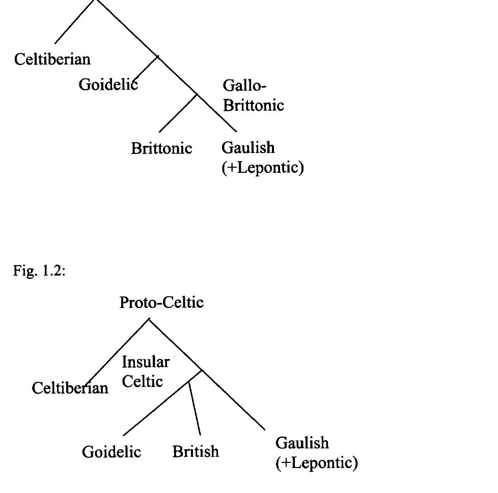

# Introduction

<!-- pdf-page: 9 -->
This dictionary contains the lexical entries that can be more or less reliably
reconstructed for Proto-Celtic. It is intended to contain Proto-Celtic words
rather than roots, but in several cases, where the word formation of cognates
in the attested Celtic languages differs, a rather speculative choice had to be
made in order to decide on the Proto-Celtic form. In some cases the OIr.
form was projected to Proto-Celtic, but in many instances the form with
most parallels in other IE languages was postulated for Proto-Celtic as well.
Whenever the exact Proto-Celtic form is underspecified, for one reason or
another, this is clearly stated in the discussion following the lemma.
   In this dictionary, a Proto-Celtic form is reconstructed whenever at least
one ofthe following two conditions are met:

(1) Cognates are attested in at least two primary branches of Celtic. By
primary branches I understand Goidelic (Irish, Scottish, and Manx), British
(Welsh, Cornish, and Breton), Continental Celtic (Gaulish and Lepontic),
and Celtiberian. Whether British was dialectally closer to Goidelic (the
'Insular Celtic' hypothesis) or to Continental Celtic (the 'P-Celtic'
hypothesis) was considered irrelevant in deciding whether a given word was
reconstructible for Proto-Celtic.

(2) Probable cognates of a word, attested in only one branch of Celtic, exist
in at least one other IE language.

PCelt. words are given as bare stems, e.g. the n-stem *talamon 'earth' is
adduced rather than the Nom. sg. *talamu. Where ablaut patterns within
paradigms of PCelt. nouns can be reconstructed, this was done in the
discussion of particular lemmas. If the etymologically related words within
Celtic do not agree in word-formation, the simpler form was usually
projected to Proto-Celtic. For example, PCelt. *barina 'rocky ground' is
reconstructed on the basis of OIr. bairenn; it is assumed that the Brittonic
forms (W brennigen, Bret. and Co. brennik) represent derivatives
thereof.The meaning of Proto-Celtic words is often rather difficult to
reconstruct. Where meanings of cognates in various Celtic languages do not
agree, either all of the attested meanings were projected to Proto-Celtic, or
the meaning deemed most basic was reconstructed. Whenever the meaning
of a particular PCelt. word remained the same in one or more of the attested
languages, the meaning of the attested word was not adduced in the fields

<!-- pdf-page: 10 -->
containing these reflexes. For example, PCelt. *wiro- 'man' has reflexes
with identical meanings in air. and MW, so the meanings of air. fer and
MW gwr were not adduced separately. The same principle was followed in
adducing the meanings of the PIE forms and their reflexes: since the
meaning of PIE *wiHro- 'man' was preserved in its reflexes (e.g. Skt. vlra-,
Lith. ryras, etc.), it was not adduced in the field containing the attested
forms in IE languages. The list of the attested cognates of the Proto-Celtic
lemmata is not meant to be exhaustive. For the sake of conciseness, I usually
adduced only cognates from two or three IE branches, usually those that are
most relevant for the PIE reconstruction, and added a reference to Pokorny's
Dictionary (IEW), Lexikon der indogermanischen Verben (LIV), and/or
Encyclopedia of Indo-Eruopean Culture (EIEC), where more detailed lists of
cognates can be found.
    Reflexes of the reconstructed PCelt. forms were given from all of the
attested Celtic languages. However, since most of our knowledge about
Gaulish, Celtiberian and Lepontic is derived from onomastic analyses,
cognates in these languages are sometimes adduced although they are not
established beyond reasonable doubt.
    Every investigator of Celtic etymology must make a principled choice:
one can argue that, since Celtic is a branch of Indo-European, it is a priori
likely that words in Celtic languages have Indo-European etymologies. If
one accepts this assumption, then finding any possible cognate in the IE
lexicon is preferable to not giving an etymology at all. On the other hand,
one could argue that we cannot possibly know the percentage of words that
Celtic borrowed from non-Indo-European languages, so that any Celtic
etymon may be equally likely to be inherited as it is to be borrowed from
some unknown source. If this is the case, then one needs more than possible
cognates in other IE languages in order to make an etymology plausible.
    Let us take one example: air. ail (phonologically [al']) 'rock, cliff' is a
very short form, consisting of only two segments. It could, in principle,
represent a variety of Proto-Celtic forms (*ali-, *fali-, *yali-), and these
could go back to an even larger number of possible PIE roots (*hzel-,
 *hzelH-, *phzel-, *pelH-, *(s)pel-, *phzel-, *yel-, *yehzl-, etc.). It is obvious
that, with such a short and isolated form, the possibility of finding chance
resemblances in other IE languages is considerable. Many linguists would
therefore consider any etymology of such a word hypothetical, and leave
 open the possibility that it was borrowed from some non-IE language. On the
 other hand, if one assumes that this word is much more likely to have been
 inherited than borrowed from some unknown source, then finding a possible
 set of cognates from the PIE root *pel- 'rock' (OHGfeliza, etc.) is enough to
make a plausible etymology.
    I am not sure which of these two methodological principles one should
 adopt, but I thought it would not be fair to the reader to be too critical with
 respect to possible, but uncertain Indo-European etymologies of Celtic
 etymons. To do so would mean to limit oneself to trivial and well-

<!-- pdf-page: 11 -->
established etymologies, and my feeling is that potential readers of this book
do not expect it to contain just the information that, e.g., OIr. athir is related
to Lat. pater. Etymological dictionaries are usually not best-sellers, but this
does not mean that they have to be boring. This means that many lemmata in
this dictionary should be understood as proposals to be evaluated, rather than
as a collection of well-established scientific facts.
   However, it was my intention to avoid too speculative etymologies,
especially those that rely on alleged reflexes of PCelt. words in only one,
poorly attested Celtic language. For example, the Gaul. month name
ELEMBIU from the Coligny Calendar is usually! derived from the PIE word
for 'deer' (PIE *h!eln-blio- > Gr. elaphos). The Greek month name
elaphoboleion, derived from the same PIE word, is often adduced in support
of this etymology. However, I did not include it in my lexicon, since the
meaning of ELEMBIU is far from being assured, and there are no traces of
this word in other Celtic languages (but cf. PCelt. *elanti, a different
formation arguably from the same root). The form found in Coligny is
actually compatible with many other interpretations, and in order to relate it
to PIE **h!eln-bho- one would also have to explain the unexpected reflex of
the syllabic nasal in Gaulish (em instead of *am). I have also tried to avoid
all 'last resort' etymologies, which are often repeated in the handbooks
simply because there do not seem to be any better Indo-European
etymologies of particular words. A case in question is, e.g., OIr. dui!
'creation', which is commonly derived from PIE *d~2Ii-, from the root
*d~h₂- 'smoke' (Lat.jUmus, etc.). Now, although it is possible to imagine a
series of steps in semantic development that would lead from 'smoke' to
'creation', I find it difficult to believe this etymology: it seems to me that
accepting it would be a sign of desperation, rather than the result of a sound
consideration of probabilities.
    In many similar cases, the fact that some often adduced etymology is not
included in the lexicon means that I found it too incredible. On the other
hand, I am sure that there are some good Celtic etymologies that were left
out simply because I was unaware that they had been proposed.

In compiling the material for this lexicon, I have consulted all of the existing
etymological dictionaries of Celtic languages published after 1950. I have
not systematically used the older reference works, such as A. Holder's Alt-
celtischer Sprachschatz, or W. Stokes' Urkeltischer Sprachschatz, because
the material they contain has been well analyzed in later etymological
dictionaries. So far the largest collection of Celtic etymologies can be found
in Vendryes' Lexique étymologique de l'irlandais ancien (LEIA); these are

<!-- pdf-page: 12 -->
generally reliable, but often inconclusive and seldom very imaginative.
Unfortunately, LEIA remains unfinished. Mac Bain's etymological
dictionary of Scottish Gaelic is completely outdated and unreliable.
Etymological notes in Geiriadur Prifysgol Cymru (GPe) are short, but often
correct, and they remain the most valuable etymological resource for Welsh.
A. Falileyev's dictionary of Old Welsh is useful mostly for its rich
philological documentation. Another valuable etymological source is Xavier
Delamarre's Dictionnaire de la langue gauloise, although it contains the
etymologies only of those Celtic words that are attested in Gaulish. Gaulish
loanwords in French and other Romance languages can be gathered from the
relevant etymological dictionaries (e.g. Gamillscheg and FEW for French),
but they have also been the subject of several articles, e.g. Bolelli 1941-2,
Corominas 1976, Campanile 1983, Fleuriot 1991). Latin words of Celtic
origin have been treated quite exhaustively in a paper by M. L. Porzio
Gernia (1981). Words attested in Celtiberian inscriptions have been gathered
and subjected to a careful philological and etymological analysis by Dagmar
Wodtko in her Wörterbuch der keltiberischen Inschriften (MLH V.l). For
Breton, we have two etymological dictionaries. The dictionary by
Guyonvarc'h was conceived very ambitiously, but only a few fascicles were
published; the new dictionary by A. Deshayes (2003) is reasonably complete
and generally reliable, but does not offer detailed Proto-Celtic
reconstructions and any IE etymologies. Furthermore, for Old Breton, we
have a very careful and exhaustive work by Leon Fleuriot, Dictionnaire des
gloses en vieux breton (DGVB). Finally, for Cornish we have only one
etymological dictionary by E. Campanile, who analyzed the lexicon of the
Old Cornish glosses. I have also made good use of Stefan Schumacher's Die
keltischen Primiirverben, which contains a lot of detailed etymological
analyses of Celtic verbs with an Indo-European pedigree.
    Apart from the mentioned sources, I consulted the reference works on
Indo-European etymology, most notably Pokorny's dictionary (IEW), EIEC,
and LIV. Unfortunately, Nomina im indogermanischen Lexikon (Wodtko et
alii 2008) appeared too late for it to be used systematically in the preparation
of this dictionary. I also profited a lot from the etymological databases
prepared for the 'New Pokorny' project by my Leiden colleagues, especially
the Indo-Aryan database by A. Lubotsky, Latin and Italic by M. de Vaan,
Hittite by A. Kloekhorst, and Baltic and Slavic by R. Derksen.

<!-- pdf-page: 13 -->
Phonemically, *i and *u were presumably just allophones of the semi-
vowels *y and *w. The status of PIE *a is controversial. Following the
Leiden school, I believe that PIE had no *a in the original, inherited lexicon
(Lubotsky 1989), but this vowel occurs in several words that are probable
loanwords from unknown, non-IE sources. In some cases, *a served as an
epenthetic vowel separating difficult consonant clusters, e.g. Lat. pateo, <
*pt-eh)- (cf. Peelt. *fatamii.'palm of the hand, talon').

                   palatalized   *k
                   velars

The phonemic status of the difference between pure velars and palatalized
velars in PIE is a disputed matter. It is quite probable that the phonological
opposition between them was restricted to just a few environments. The
syllabic resonants were just allophones of the non-syllabic resonants,
occurring in the syllable nucleus. Therefore, they are not distinguished
graphically from the non-syllabic resonants in the PIE reconstructions. The

<!-- pdf-page: 14 -->
exact phonetic realization of PIE stops is a matter of controversy; the
traditional 'voiced stops' may have been ejectives, perhaps in Early PIE. The
phonetic realization of the 'laryngeals' is unknown, so they are marked with
indexes (*hI, *hz, *h₃). Laryngeals may have been lost in some environments
already in PIE, or dialectally, not long after the dissolution of the proto-
language, e.g. before *y (Pinault's rule), or after the sequence *oR (de
Saussure's rule). However, the validity of these rules of laryngeal loss, as
well as their exact formulation, are controversial.
   Here are the principal Celtic sound changes ordered into an approximate
relative chronology:z

4. *CStoPHCstop   > cstopcstopin non-initial syllables, cf. PIE *dhughzter
'daughter' > PCelt. *duxtir (Gaul. duxtir). This development is somewhat
uncertain in the light ofCeltib. tuateros 'daughter' (Gen. sg.).

5. TT > *-ss-, cf. PIE *krd-tu- > PCelt. *krissu- 'belt'; the same development
is found in Italic and in Germanic.

6. *CRHC > *CRaHC (> *CRaC), cf. PIE *plh)no- 'full' > PCelt. *flano-
(OIr. Ian), PIE *w"Hno- 'grain' > PCelt. *grano- (OIr. gran). Laryngeals
were probably preserved after *Ra until the operation of Dybo's law (A7),
and then lost, with the compensatory lengthening of *aH > *a. The change
*CRHC > *CRaC occurred in Italic as well.

7. *YHC > YC in pretonic syllables (Dybo's law, cf. Dybo 1961): PIE
*wiHr6- 'man' > PCelt. *wiro- (OIr. fer). In all non-problematic examples
of Dybo's law the laryngeal was lost after *i, *u, or *a which is the result of
the development of syllabic resonants before laryngeals (A6).3 It is assumed
here that the laryngeals had already been lost after *e and *0, which were
lengthened (A2). Dybo's law was posterior to the change ofCRHC > CRaC
(A6) because of the development of *sfraxto- 'eloquent', *frati- 'fern', and

2 Cf. McCone 1996, Isaac 2007, Kortlandt 2007: 117-120 for similar attempts.
3  For the alleged loss of laryngeals after PIE *e, *0 in pretonic position see the
lemmata *siti- and *omo-.

<!-- pdf-page: 15 -->
  *klad-o- 'dig'. Something like Dybo's law also operated in Italic,4 and, in
  some form, probably in Germanic as well (cf. Lat. uir, OE wer < *wiHr6-;
  maybe the vowel shortening (or laryngeal loss) was restricted to the position
  before resonants in Italic and Germanic). I assume that the operation of
  Dybo's law in Celtic was general (i. e. unrestricted by phonetic
  environment).5 The apparent exceptions to the operation of Dybo's law in
  Celtic are best treated as analogical re-introductions of vowel length from
  the forms of the root where the length was preserved regularly. Of course,
  since the position of the accent in PIE cannot be established for many PIE
. etymons of PCelt. words, the operation of Dybo's law can often be just
  assumed, but not strictly proved.

 8. #RHC- > RaC (cf. Beekes 1988). Although this change is not universally
 accepted, it is found in the development of the following etyma: *latyo-
 'day', *natu- 'poem', *mati- 'good', *mak-o- 'increase', *mad-yo- 'break',
 *laxsaro- 'shine' (PIE *r could not occur word-initially, so here R = m, n,
 and 1).The same change occurred in Italic and Balto-Slavic, and probably in
 other European IE branches. The development of *#yHC- and *wHC- is
 uncertain, but cf. the lemmata *yalo- 'clearing' and *waxto- 'bad' for the
 possibility that *H > *a in this position.

 9. Merger of PIE palatalized velars and pure velars, cf. PIE *dekm 'ten' >
 PCelt. *dekam (OIr. deich). This development is shared by all Centum
 branches ofIndo-European.

 1. *gw> *b, cf. PIE *gWow_> PCelt. *bow- > 'cow' (OIr. bO).

 2. Deaspiration of aspirated stops, cf. PIE *bher-o- > PCelt. *ber-o- 'carry'
 (OIr. berid). This sound change was obviously posterior to *gW> *b (Bl),
 because PCelt. *gwh> *gW,cf. PIE *gwher_> PCelt. *gWer-o-'heat up' (MIr.
 geiriel).

 3. CLCstop> CLiCstop(where L = r, 1),cf. PIE *krd- > PCelt. *krid-yo- 'heart'
 (OIr. cride). It is probable that the same development occurred before PIE
 *m (cf. *kwrmi-'worm' > PCelt. *kwrimi-,*h}lmo- 'elm' > PCelt. *limo- (s.

 4  A clear counter-example is the length of Lat. jUmus vs. Skt. dhuma- < PIE
 *d~h₂m6s. I find none of the explanations of this exception compelling (e.g. the
 analogy withjUligo "soot", de Vaan 2008). However, the general impression is that
 Dybo's law solves more problems than it creates.
 5 Isaac 2007 attempts to limit the operation of Dybo's depending on the nature of the
 laryngeal in question, but I do not find his argumentation persuasive.

<!-- pdf-page: 16 -->
v. *H~mo-,*limo-). This change was anterior to the general change ofCRC >
CaRC (B5) which was otherwise unrestricted by phonetic environment.

 4. *eRa> *aRa (Joseph's rule, cf. Joseph 1982), cf. PIE *terhitro- 'auger' >
 PCelt. *taratro- (OIr. tarathar, W taradr). PIE *e did not become *a before
 *Ra (cf. PIE *gWenh₂ » *gWeneh₂ > *gWena > PCelt. *bena, OIr. ben), and
 the vowel *e was restored analogically before *Ra in many instances, e.g. in
 the reduplicated syllables in the perfect (PCelt. *me-mad- > OIr. memaid
 'broke', 3sg. perf. of maidid 'breaks' < PCelt. *mad-yo-). This change
 preceded the decomposition of syllabic nasals (B5) because of the
"development of PCelt. *elan(t)i 'doe, hind' < *hieln(t)ih₂ (rather than
 *alan(t)i), but after the vocalization of laryngeals between consonants,
 because of the development of *taratro- < *terh itro- above.

5. CRC > CaRC, cf. PIE *dnt- > PCelt. *danto- 'tooth' (OIr. det, W dant),
PIE *mrwo- > PCelt. *marwo- 'dead' (OIr. marb, W marw), PIE *blJ-so- >
PCelt. *barso- > *barro- 'point, top' (OIr. barr). Note that syllabic liquids
had already developed to *ri, *li before stops and *m (B3).

6. Loss of laryngeals in non-syllabic position. This change is later than the
development of syllabic resonants (B5), because of, e.g., PIE *klHeto- >
*kalHeto- > PCelt. *kaleto- 'hard', PIE *wlHo- > PCelt. *walo- 'ruler,
chief, PIE *smh₂eli- > PCelt. *samali- 'similitude', PIE *snHi > PCelt.
*sani- 'without'.

7. *p...kw> *kw...*kw, cf. PIE *penkwe > PCelt. *kwenkwe 'five' (OIr. c6ic,
MW pymp). This change predated the development of *kw > *x before stops
(Cl) if PCelt. *kwerxt- 'bush' (W perth) is from PIE *perkw- 'oak'. It is
assumed here that the similar assimilation in Italic (cf. Lat. quercus) is a
parallel development (for arguments see below).

8. *e > *i, cf. PIE *Hreg- 'king' > PCelt. *rig- (OIr. rz). This change must
predate PCelt. *p> *f> 0 (C4), because of PIE *hiepirom > PCelt. *efirom
(> *eyrom > *erom, OIr. far 'after', not **ir).

9. *0 > *u in final syllables, cf. PIE *kwon 'dog' > PCelt. *kWu(n) (OIr.   cu,
W ci).

11. *Y:RC > *YRC (Osthoff-type shortening before resonants in closed
syllables), cf., e.g., PIE *h₂wehinto- 'wind' > *wento- > *winto- > PCelt.
*winto-, perhaps also PIE *sih₂m-do- > *sindo- > PCelt. *sindo- 'that'. This
change was obviously posterior to *e > *i (B7).

<!-- pdf-page: 17 -->
1. *C1C2 > *xC2 (where C2 stands for any stop and *s), cf. PIE *septm
'seven' > PCelt. *sextam (OIr. secht). This change is posterior to TT > *ss,
and also to CRCstop> CRiCstop(B3) because of PIE *prptu- > PCelt. *frixtu-
'form', *mrgWto-> PCelt. *mrixto- 'variegated', *h₂mlgto- > PCelt. *mlixto-
'milk'.

2. *pL > *bL (where L stands for any liquid), cf. PIE *pi-prh₃-se- > PCelt.
*pibrase- 'will bestow, will give' > *fibrase- (OIr. ebraid), PIE *dwey-plo-
'double' > PCelt. *dweblo- (OIr. diabul).

3. *pN > *wN (where N is any nasal), presumably only after back vowels,
c£ PIE *supno- > PCelt. *suwno- > *sowno- 'sleep' (OIr. suan, W hun).

5. *0> a, cf. PIE *deh₃no- > *dono- > PCelt. *dano- 'gift' (OIr. dan); this
change is obviously later than the change of *0 > u in final syllables (B8).
Clear examples of this change in Celtiberian are lacking, but there are no
counter-examples.

6. *ey > *e, cf. PIE *(H)reyd- > PCelt. *red-o- 'ride' (OIr. reidid). This
change was obviously later than *e > *i (B7). There is some uncertainty
whether this change also occurred in Celtiberian.

7. *ew > *ow, cf. PIE *newyo- > PCelt. *nowyo- 'new' (OIr. nuae, W
newydd).

8. *uw > *owl _ C, cf. PIE *supno- > PCelt. *suwno- > *sowno- 'sleep' (OIr.
suan). This change probably did not apply before *-i- in the next syllable,
because of *dru-wid- > OIr. drui 'druid' (rather than "drol). It is unclear
whether this change applied in Proto-Celtic, or just in Goidelic and Brittonic
(data from Gaulish and Celtiberian are lacking).

1. The liquid assimilations *rp > *rf> *rr (PIE *serp- > PCelt. *serra) and
*lp > *If> *11(PIE *kulp- > PCelt. *kul(f)o-), *-rs- > *-rr- (PIE *bhrso- >
PCelt. *barro-), *rst > *rt (PIE *trstu- 'thirst' > OIr. tart). All of the attested
languages show the results of assimilations, so it is simpler to project those
changes to Proto-Celtic. It is possible, however, that at least some of the
assimilations were parallel innovations of individual languages after the
break-up of Proto-Celtic.

<!-- pdf-page: 18 -->
2. The assimilation    of *mw > *ww, cf. *kom-wlro- > PCelt. *kowwlro-
'true' (W cywir).

3. The lengthening of the vowel before the cluster *xsL, cf. *tok-slo- 'axe' >
*toxslo- > PCelt. *taxslo- (OIr. tal); it is possible that PCelt. *x was lost and
that the preceding vowel was subject to compensatory lengthening.
However, *x is conventionally retained in the PCelt. reconstuctions because
the regularity of this change is uncertain; cf. the lemmata *dlro-, *klsra,
*muxto-, *sego- and *skaxslo- for possible instances of this change, but also
*tullo- for a possible counter-example.

4. The 'liquid metathesis' (*ar, *al > *ra, *la) between labials and a cluster
of two dentals: PIE *mlsto- > PCelt. *mlasto- 'taste', PIE *gWrsto- > PCelt.
*brasso- 'great', PIE *h\Wfsto- > PCelt. *wrasto- 'shower', PIE *wlsno- >
*walsno- > PCelt. *wlanno- 'blood red', etc. Like the preceding one, this
change is proposed here for the first time, so it will probably raise some
controversy. Another possibility is to assume an analogical zero-grade
CCLaC of the roots with the full grade CLeCC (after the regular pattern with
the zero-grade CaLCC and the full grade CeLCC).6

5. The loss of laryngeals after *ey (and *oy?) before consonants (*VyHC >
*VyC), cf. PCelt. *beto- 'food' (W bwyd) < PIE *gWeyh₃to-, PCelt. *deno-
'fast' (OIr. dian) < *deyHno-, PCelt. *tetu- '(grass- )land, territory' (OIr.
iath) < PIE *peyHtu-, PCelt. *kweno- 'long' (OIr. clan) < *kWeyHno-, PCelt.
*reno- 'large expanse of water' (OIr. rian) < PIE *(H)reyHno-, PCelt.
*wero- 'crooked' (OIr. fiar, W gWyr) < PIE *weyh\ro-, etc. There are only
two apparent counter-examples in this dictionary: W rhaeadr 'torrent' and
OIr. riathor (with disyllabic ia), do not represent PCelt. *reyatro-, but rather
*riyatro-; likewise, OIr. disyllabic biad 'food' can be derived from *biyato-
or, less probably, *biwato- (rather than *beyato- < *gWeyh₃to-). There are no
truly reliable examples for the loss of laryngeals after *oy, but cf. PCelt.
*koylo- 'thin' (which can be from PIE *koyHlo-) and *oyno- 'one' (which
some linguists would derive from *oyHno- < *h₃eyHno-).

    E) Some doubtful changes:

1. *(C)RHCdenta\C > *(C)RaCdenta\C, cf. PIE (?) *prh₃-sneh₂ 'gift, share' >
PCelt. *frasna (OIr. rann); however, PCelt. *frasna, just like Lat. pars, can
be derived from a root without laryngeal (generalized after the present stem
*pr-neh₃- / *pr-nh₃- (> PCelt. *far-na-), and explained by 'liquid metathesis'.
Alternatively, the short *a in the Celtic reflexes of PIE roots of the form

6 Note that this explanation will certainly not work for Peelt. *wrasto- (the PIE root
is *h\wers-, not **h\wres-).

<!-- pdf-page: 19 -->
*CeRHC can always be the result of Dybo's law, and it is, of course, more
economical to assume fewer sound changes.

2. #RcvoicedC > #RaCVoicedC(Schrijver's rule, cf. Lat. magnus < *mgnos);
however, all of the alleged examples involve the root *megh₂- 'great' (cf.
PCelt. *maglo-, *magyo-, and *magos). None of those etymologies is
beyond reproach.

3. *h₂rCstop_> *arestop_and *h₃rCstop_> *arCstop_(but *hirCstop_> *riCstop_,cf.
*rig-o- 'go' < *hirgh-o-).7 However, examples of this change are few in
number and quite controversial. PCelt. *orgya 'testicle' can be derived from
*hiorghi- rather than *hirghi- or *h₃rghi- assumed by some linguists; PCelt.
*arto- 'bear' is from PIE *h₂rtko-, but it probably went through the stage
*h₂rpk'0- (and *#rpC- > *#arpC- may be assumed just like *#rsc > *#arsC).
PCelt. *arganto- 'silver' is a problem, since the reconstruction *h₂rgnto-
seems somewhat more probable than *h₂ergnto-. However, the word for
'silver' may have had an ablauting paradigm in PIE (Gr. argyros can be both
from *h₂erg- and *h₂rg-, and Skt. arjuna- 'shining' is clearly from *h₂erg-).

Although Italic shares a number of sound changes with Celtic, I remain
unconvinced of the 'Italo-Celtic hypothesis'. Very few phonological and
morphological changes are actually exclusive Italo-Celtic isoglosses, and,
more importantly, one cannot really establish a relative chronology of those
isoglosses, as one can in the case of, e.g., Balto-Slavic. However, there is
little doubt that Italic and Celtic developed from a group of closely related
Western Indo-European dialects. For a recent discussion of the Italo-Celtic
hypothesis see Kortlandt 2007: 151-157.
     The following phonological innovations of Italic and Celtic are shared:

1. The development of PIE syllabic resonants followed by laryngeals, PIE
*CRHC > *CraC, cf. PIE *grHno- 'grain' > Lat. granum, PCelt. *grano-.
Note, however, that in PCelt. the development was actually from *CRHC to
*CRaHC, and then to *CRaC with loss of the laryngeal and compensatory
lengthening of *a (see above, changes A6-A7 in the relative chronology). It
is uncertain whether the same two-step development occurred in Italic.

2. The assimilation *p ...kw > *kw...kw. However, this change appears to be
late in Celtic. It failed to occur in OIr. deac, deec '10', which is often

7 Joseph 1982: 50-51, McCone 1996: 52, Isaac 2007: 73. It appears that the
sequences *#h₂L-, *#h₃L-, on the one hand, and *#hiL-, on the other, also gave
different reflexes in Proto-Tocharian (Hackstein 1998).

<!-- pdf-page: 20 -->
derived from *dwey-penkw-om 'two-fives', and when this compound was
formed (in Proto-Celtic) *p was not in the beginning of the word, and so it
regularly changed to *f> 0 rather than assimilating with *kw(see Watkins
1966: 145, but also the lemma *dekan below for problems with this
etymology). In any case, such an assimilation is phonetically trivial (cf. the
reverse assimilation in PIE *penkwe'5' > Go.fimf).

3. The shortening of vowels in pretonic position (Dybo's law mentioned
above); however, this change may not be limited to Italic and Celtic, because
it appears to affect Germanic as well, at least in some examples, cf. OE wer
'man' < *wiHro- (Skt. vlra-, Lith. vfwas, Lat. uir, OIr.fer).

1. The genitive ending *-i is neither pan-Celtic (it is lacking in Celtiberian)
nor pan-Italic (it is lacking in Sabellic), and it is not exclusively Italo-Celtic
(it occurs in Messapic and probably in Tocharian). Actually, it is an old
petrified adjectival form (see Matasović 2004) and, as such, does not
represent a common innovation in Italic and Celtic.

2. The generalization of the *so- stem of the PIE demonstrative pronoun *so-
/*to- is a parallel development, since there are clear traces that PCelt. still
had the pronominal stem *to- (see PCelt. *tod). Moreover, it is unclear
whether Celtiberian shared the generalization of the *so- stem.

3. The introduction of the Gen. ending *-strom in the 1st and 2nd person
plural pronouns is not very significant, since the stems of the 2nd person
plural pronouns are different in Celtic and Italic, and the forms that actually
have this ending are attested only in OIr. (nathar) and Latin (nostrum), so we
cannot be sure if they were ever pan-Celtic and pan-Italic.

4. The spread of the Dat./Abl. pI. ending *-bhosis uncertain, since in Gaulish
we only have -bo, and Irish generalized the ending *-bhis from the
Instrumental.

5. The superlative ending *-smmo- is indeed a shared exclusive isogloss, but
in itself it is not enough to prove the existence of an Italo-Ce1tic
protolanguage.

The exact genetic subclassification of the Celtic languages is still an
unsettled matter. Two approaches dominate the current discussions:

<!-- pdf-page: 21 -->
(1)      The traditional view, defended, among others, by Schmidt (1977),
         Koch (1992), and de Bernardo Stempel (2006) who classify Brittonic
         together with Gaulish (and Lepontic, which is probably just an early
         offshoot of Gaulish) into Gallo-Brittonic, while the Goidelic
         languages remain as a separate branch of Celtic (see Fig. 1.1. below).

(2)      An alternative theory, defended by e.g. McCone (1996) and supported
         by Schrijver (1995) and Schumacher (2004), who see Brittonic and
         Goidelic as a separate Insular Celtic branch, while Gaulish and
         Lepontic are viewed as the Continental Celtic branch. Celtiberian, as
         is becoming increasingly clear, is almost certainly an independent
         branch on the Celtic genealogical tree, one that became separated
         from the others very early (see Fig. 1.2. below):

      Celtiberian
                Goideli

                                      Gaulish
                                      (+Lepontic)

                                              Gaulish
                                              (+Lepontic)

<!-- pdf-page: 22 -->
The problem of sub-classification within Celtic is relevant to this work only
inasmuch as it affects the reliability of Proto-Celtic reconstructions. If there
was an Insular Celtic branch within Celtic, then forms reconstructed on the
basis of just Old Irish and Middle Welsh, the two best attested early Celtic
idioms, need not go back to common Proto-Celtic, but may instead represent
Proto-Insular Celtic. Likewise, if we assume the existence of a Gallo-
Brittonic branch, then we should be careful in attributing reconstructions
based on evidence from the Brittonic languages and Gaulish to Proto-Celtic.
   As I have argued elsewhere (Matasović 2008), I tend to view Insular
Celtic more as an areal than as a genetic grouping. This does not, however,
imply that I believe in Gallo-Brittonic as a valid genetic grouping, either: in
the matters of genetic sub-classification within Celtic I think it is wise to
remain agnostic, until more is known about Gaulish, Lepontic, and
Celtiberian. In any case, since the argument about Insular Celtic vs. Gallo-
Brittonic tends to revolve more around the morphological than around the
phonological isoglosses, it is unlikely that the eventual resolution of the
debate will substantially affect the Proto-Celtic reconstructions proposed
here.

There are several unresolved issues in the reconstruction of the Proto-Celtic
phonological system. I have generally tried to follow the consensus opinion,
where there is any, but in some cases difficult choices had to be made. It is
assumed here that Proto-Celtic had the following phonemes:

<!-- pdf-page: 23 -->
I take the monophthongization of PIE *ey > *e to be a Proto-Celtic change,
although it is not absolutely certain that this change occurred in the
prehistory of Celtiberian (cf. MLH V.l: XVII). I also believe that the change
*ew> *ow is Proto-Celtic, and that instances of alleged eu in Gaulish (e.g.
in Neviodunum, a toponym in Slovenia) are just spelling variants of a
diphthong that did not exist in Latin at the time of the adaptation of the
Roman alphabet to Gaulish (cf. McCone 1996).

I assume that *kw merged with *kw in Proto-Celtic, so I reconstruct PCelt.
*ekwo- 'horse' (OIr. ech, etc.) from PIE *htekwo- (Lat. equus etc.).
Apparent exceptions, such as W ci 'dog' < PIE *kwon can be explained by
assuming early delabialization of *kw in certain environments (e.g. before
PCelt. *u as in the preceding example: *kwon > PCelt. *kwlin > *kUn > W
ci). Similarly, the reflexes of *gw(h)and *g(h)Ware indistinguishable in Celtic,
cf. PCelt. *tangWat- 'tongue' < *dnghw_ (OIr. tengae, W ta/oei).

   f    s         [x] (an allophone of *k before stops and *s]
       [z] (an allophone of*s before voiced consonants)

I do not assume that there was a PCelt. phoneme *ts (from PIE clusters with
two dentals, and/or from PIE *-st-). I believe that PIE *st was preserved in
PCelt. (as it is in Celtiberian), and that PIE *TT yielded *ss already in PCelt.
(see Schrijver 1995). The fricative *f is the regular reflex of PIE *p. It may
have been a bilabial voiceless fricative [q>] phonetically, rather than a
labiodental fricative [f]. I also assume that the assimilations of *rs > *rr and
*ls > *11 are Proto-Celtic (see McCone 1996); however, I adopt the
'etymological' spelling for the clusters *-sr-, *-sl-, *-sn-, *-sm-, and *ly, as

<!-- pdf-page: 24 -->
if they were intact in Proto-Celtic reconstructions, although they could have
changed to *-rr-, *-11-,*-nn- and *-mm-, respectively, already in PCelt.8

I assume that the change of PIE syllabic *m, *n > *am, *an is pan-Celtic.
The fronting of *am, *an > *em, *en in Goidelic is a later development that
occurred only in some environments (see McCone 1996 for details). I also
assume that word-final *-m was preserved, as it is in Celtiberian, and
occasionally in Gaulish.

For the purpose of this lexicon we adopt the following periodization of the
attested Celtic languages.

1. Lepontic (attested from the 7th, or early 6th century B.C. until ca. the 1st
century B.C.). In all likelihood, Lepontic is just an early offshoot of Gaulish.
The evidence for Lepontic as a separate branch of Celtic heavily relies on the
archaeological data, especially on the early individualization of the
(Lepontic) Golasseca Culture (see Uhlich 1999: 285-293).

2. Gaulish, attested onomastically since the 6th century B.C., but with a
sizeable corpus of inscriptions only from the 3rd century B.C. (inscriptions
in Greek alphabet). Inscriptions in the Roman alphabet are attested later,
chiefly after the Roman conquest of Gaul (2nd half of the 1st century B.C.).
It is unclear when Gaulish died out, but it was probably spoken until the 6th
or 7th century A.D., at least in some isolated pockets in Gaul. Although
Gaulish is attested for at least a millennium, no attempt has been made to
distinguish between early and late Gaulish in this lexicon. However, the
source of Gaulish words (except for names) is always indicated.

8 All of the attested reflexes have the geminates, cf., e.g., the reflexes of PCelt.
*koslo-, *kasnina, *klsra, *alyo-, and cf. I sg. pres. of the copula, OIr. am, Gaul.
immi. It is quite clear that Proto-Celtic was in the process of developing geminates,
because some of the assimilations that produced geminates are certainly early (see
above). The reconstructions in this dictionary contain geminated stops, fricatives,
and resonants.

<!-- pdf-page: 25 -->
3. Celtiberian, attested from the 3rd or early 2nd century B.C. until ca. 1st
century A.D. The earliest inscriptions are in Iberian syllabary, but from the
Ist century B.C. a considerable number of inscriptions are in Roman
alphabet.

4. Goidelic, represented by Old Irish and Middle Irish, attested since 4th
century A.D. (Ogam inscriptions). We distinguish the following phases of
Goidelic:

    Ogam (4th - 6th centuries)
    Old Irish (7th - 9th centuries)
    Middle Irish (10th - 11th centuries)
    Modern Irish (12th century - present)

Usually only the earliest attested form of the word is adduced in the lexicon.
This is regularly the Old Irish or the Middle Irish form found in DIL. It
should be noted that Old Irish and Middle Irish forms are often not easily
distinguished. In principle, all words attested in the glosses and other texts
from the Thesaurus Palaeohibernicus are Old Irish, but Old Irish forms can
often be found in later manuscripts as well. So, even if a word is only
attested in texts, the manuscripts of which were preserved in the Middle Irish
period (e.g. in the sagas of the Ulster cycle, or in the Leinster eulogistic
poetry), we can often be sure that the same word existed in Old Irish.
Therefore, in some cases where I adduced a word as OIr., although it does
not occur in the proper OIr. texts, the reader will have to trust my
philological judgement, or check the sources for himself.
   Scottish Gaelic and Manx forms were not adduced in this lexicon (with a
handful of exceptions), since they yield very little additional information
about the reconstructed PCelt. words and their origin.

5. Brittonic,9 represented by Welsh, Breton, and Cornish. Dialectal diversity
within Brittonic is far greater than within Goidelic, so reflexes of PCelt.
words from all three Brittonic languages were adduced, whenever attested.
We distinguish the following phases ofBrittonic:

    Old Welsh (7th - 10th centuries)
    Middle Welsh (11th - 14th centuries)
    Modern Welsh (15th century - present)

    Old Breton (9th - 11th centuries)
    Middle Breton (12th - 16th centuries)
    Modern Breton (17th century - present)

9 This branch of Celtic languages is referred to as "British", "Brythonic", and
"Brittonic" in the literature; I tried to be consistent in using "Brittonic".

<!-- pdf-page: 26 -->
     Old Cornish (9th -12th centuries)
     Cornish (13th - 18th centuries)lO

Middle Welsh, Middle Breton, and Middle Cornish forms are adduced by
default. If a word was attested in Old Cornish, Old Breton, or Old Welsh,
it is adduced separately in the Cornish, Breton, and Welsh fields, respectively.
Modern Welsh forms, as cited in GPC, are adduced only when they are
different from MW forms, and often the difference lies only in spelling.

Each entry in this dictionary consists of several fields. The first field
contains the reconstructed Proto-Celtic word and its meaning, as well as
the information about the word-class to which it belonged. The following
fields contain reflexes of the reconstructed etymon in the primary
branches of Celtic, together with some basic grammatical information
about them: as a rule the gender of Old Irish and Middle Welsh nouns,
the inflectional class of the Old Irish nouns and adjectives, and the
attested stems of Old Irish verbs.
   In the next field the PIE root of the Proto-Celtic etymon is given,
together with a reference to the page in IEW where that root is
discussed. After that, there follows a discussion of the proposed
etymology and the alternative proposals found in the literature. I have
tried to make the derivation of the attested forms from PIE and Proto-
Celtic as explicit as possible, without concealing any of the uncertainties
or unresolved problems. This field also contains the discussion of other
possible cognates of the reconstructed Proto-Celtic etymon. In many
cases the etymology proposed here is not the only possible one, but all
of the etymologies in this dictionary are meant to be consistent with
the Celtic sound laws accepted in this Introduction (see above). I have
tried to be maximally clear in making the distinction between mentioning
various possible etymological proposals and claiming that a particular
 etymology is true.
    The last field contains the references. The list of references is not
 meant to be exhaustive, but rather to include the most relevant books
 and articles, published during the last fifty years, in which etymological
 discussion of the etyma in question can be found. They are ordered in

10 Cornish is often divided into Middle Cornish (from 12th until the end ofthe 16th
centuries) and Modern Cornish (l7th - 18th centuries), cf., e.g., Lewis 1990. I have
grouped the words attested from the beginning of the 13th century onwards under a
single label, "Cornish".

<!-- pdf-page: 27 -->
such a manner that the more general reference works precede publications
dedicated to a particular word, or specific problems of phonological
development relevant to the lemma in question.
