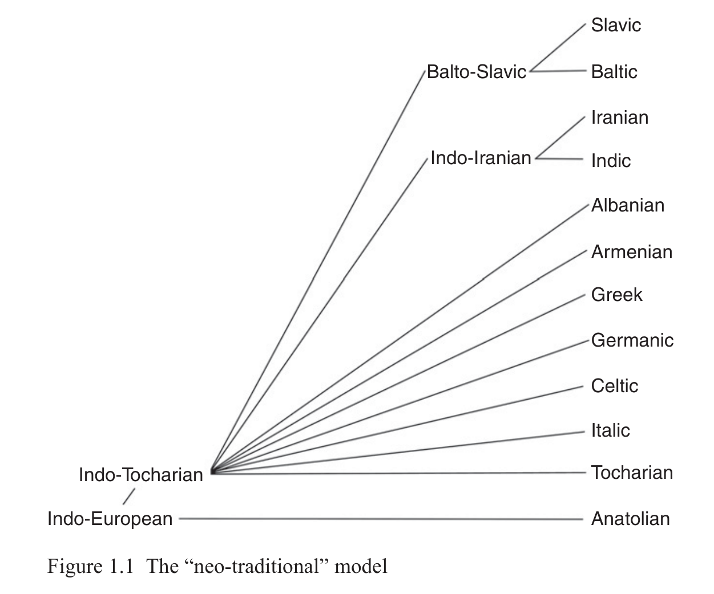
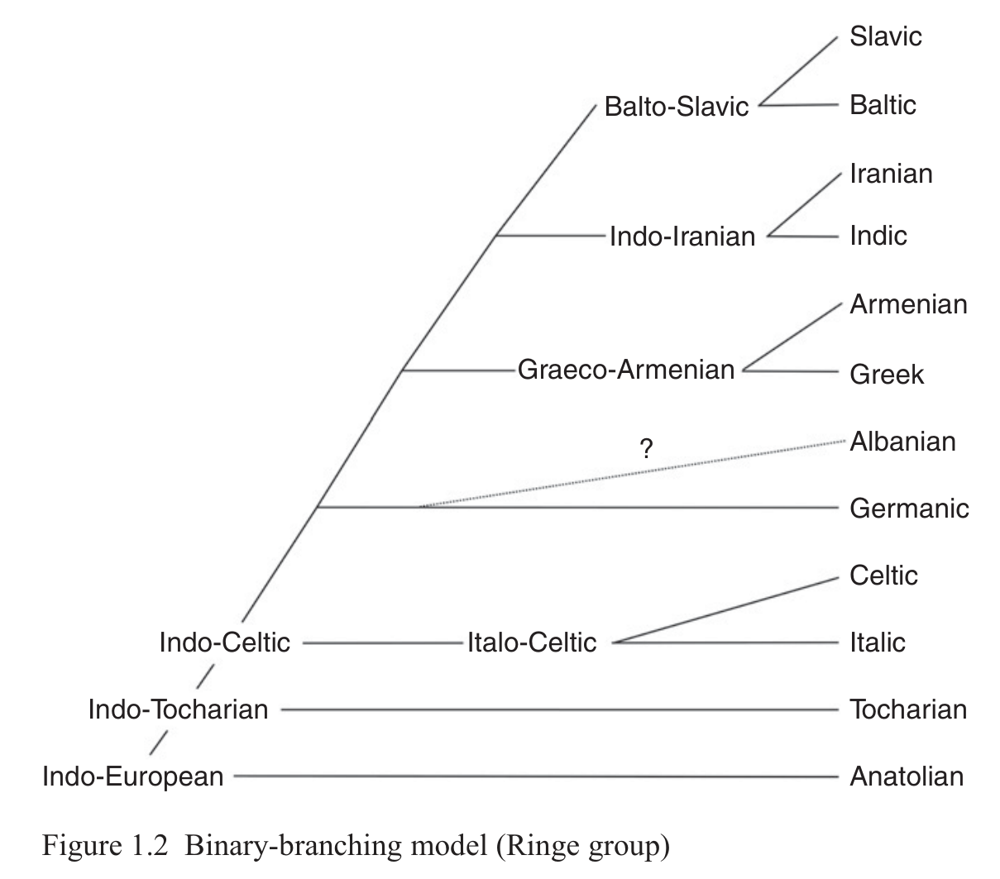
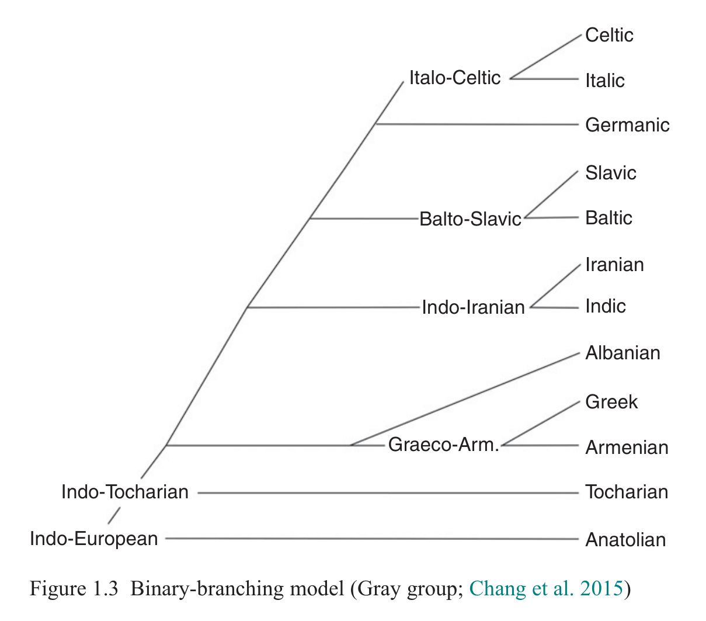

# 1 Introduction

Thomas Olander

<!-- page: 1; pdf-page: 19 -->

## 1.1 Background

The study of the genealogical relationship between the Indo-European languages has been the object of research ever since August Schleicher’s famous Stammbaum representation of the then-known subgroups, or branches (1861: 7; see also 1853: 787). Throughout most of the twentieth century, this topic played a less prominent role in Indo-European studies, but the last few decades have witnessed a surge of interest in the internal structure of the Indo-European language family as well as other language families.

From a methodological point of view, the renewed interest in linguistic phylogenetics, or “phylolinguistics”, came mainly from two sides, rather different in their choice of methods and data, yet both based on computational approaches. A group of researchers led by Don Ringe applied algorithms based on weighted maximum compatibility to a data set consisting of phonological and morphological characters and a list of basic vocabulary items from a selection of twenty-four Indo-European languages representing the individual subgroups (Ringe, Warnow & Taylor 2002; Nakhleh, Ringe & Warnow 2005). Another group, headed by Russell D. Gray, applied Bayesian methods to data sets exclusively consisting of lists of basic vocabulary (for the Indo-European language family, see e.g. Gray & Atkinson 2003; Bouckaert et al. 2012); the same methods and data were used in Chang et al. 2015.

Within Indo-European studies, the increasing interest in linguistic phylogenetics has mainly taken its point of departure in traditional methodology, where subgroups are identified on the basis of significant shared innovations across related languages. It seems likely that specialists have become more interested in the branching structure of the family tree as a result, at least partly, of the growing acceptance of the Anatolian subgroup as a sister to all the remaining

This chapter was written in connection with the research projects<i> Connecting the dots:</i> <i>Reconfiguring the Indo-European family tree</i> (2019–23), financed by the Independent Research Fund Denmark, and<i> LAMP: Languages and myths of prehistory</i> (2020–5), financed by Riksbankens Jubileumsfond. I am grateful to Simon Poulsen for reading and commenting on a draft version of the chapter.

<!-- page: 2; pdf-page: 20 -->

Indo-European languages (see e.g. Kloekhorst 2008: 7–11; Kloekhorst & Pronk 2019; Oettinger 2014; but cf. the more sceptical stance by Melchert in press), which highlights the importance of the structure of the family tree for the purposes of reconstruction.

This book has grown out of a workshop held in Copenhagen in February 2017, “The Indo-European Family Tree”, where invited speakers discussed methodological issues and the phylogenetic relations of each of the main Indo-European subgroups. Some of the chapters of this book have been authored by participants in that workshop, while others have been written by authors invited to contribute to the book project.

The Copenhagen workshop was organised within the framework of the research project<i> The homeland: In the footprints of the early Indo-</i> <i>Europeans</i> at the University of Copenhagen (2015–18, financed by the Carlsberg Foundation). The<i> Homeland</i> project was concerned with the location in time and space of the speakers of Proto-Indo-European and the early spread of the Indo-European language family throughout Europe and western Asia. Since the nodes of a linguistic family tree to a certain extent historically represent the geographical separation of the speakers, it is essential, when attempting to correlate prehistoric languages with material culture, to have a good understanding of the order of separation of the daughter languages from their common ancestor. Thus, the so-called Indo-European homeland problem and the problem of the structure of the Indo-European family tree are closely intertwined. Indeed, studies of linguistic phylogenetics are very often also concerned with the geography and time depth of the nodes in the tree, even if the methodologies involved are very different (for Indo-European see e.g. Nakhleh, Ringe & Warnow 2005 and Bouckaert et al. 2012).

In its design and structure this book is rooted in the traditional methodology of linguistic subgrouping. This is not only because of the background to how the book was conceived. Over the last couple of decades, computer-assisted approaches have, in my view, received more attention than can be justified by the results they have produced. In some circles, especially within non-linguistic disciplines and among a broader audience (as exemplified by the media coverage of Bouckaert et al. 2012), computer-assisted approaches seem to be more highly regarded than traditional studies.

The impact of publications based on computer-assisted approaches has been very limited within the field of Indo-European studies itself, although the results achieved by the Ringe group have been somewhat successful (see Clackson 2015: 5). Interestingly, what we see is not a large-scale rejection of the findings of computer-assisted approaches by traditional Indo-European linguists. The findings are, in most cases, simply ignored,

<!-- page: 3; pdf-page: 21 -->

probably due to a combination of factors, including the fact that computational phylogenetic studies are difficult to evaluate for non-computational linguists. This is because the methods employed are very different from traditional methods in a number of ways. Firstly, the main focus of computational studies is often on the methodology and the results, rather than on the actual data, which are often full of errors. Secondly, computational studies are often written in a very technical language. And thirdly, the results are not thought to be of any actual value anyway as they are often based on material that is not considered to be particularly significant, while the most relevant material is ignored.

Thus, in some sense, this book may be seen as a traditionalist reaction to modern computer-assisted approaches to linguistic Indo-European phylogenetics. This does not mean, however, that the contributors to the book in any way have ignored the fact that such approaches may be of great benefit to linguistic phylogenetics in general or to Indo-European studies in particular; see the chapters by Clackson (Chapter 2), Piwowarczyk (Chapter 3) and Ringe (Chapter 4). What should be evident from the book is that traditional approaches still have a lot to offer, even though they require a high degree of specialisation, including a deep understanding of the comparative method and linguistic reconstruction as well as a profound knowledge of the relevant data, constituted by the phonology, morphology, syntax and lexicon of a large number of languages and their historical development from Proto-Indo-European to their attestation. As is often emphasised, computational methods cannot and should not replace traditional historical linguistics but may prove to be a useful supplement (Ringe, Warnow & Taylor 2002: 65–6; compare also the very enthusiastic remarks on Bayesian linguistic phylogenetics by Greenhill, Heggarty & Gray 2021: 246 with the critical position by Ringe in Chapter 4 of this book). This book is thus, in some way, an attempt at reinvigorating the traditional methodology, which, outside Indo-European studies, seems to be losing ground to computationally based analyses.

In traditional Indo-European linguistics, there are surprisingly few comprehensive studies of the phylogeny of the language family. Two works that were influential in their time are Antoine Meillet’s<i> Les dialectes indo-européens</i> (1908/1922) and Walter Porzig’s<i> Die Gliederung des indogermanischen</i> <i>Sprachgebiets</i> (1954). Both works are now old and outdated in a number of respects, and perhaps more importantly, their primary aim is to analyse the relationship between the ancient Indo-European languages with respect to their geographical location rather than to uncover the phylogenetic structure of the Indo-European family tree.

Somewhat newer, but still more than half a century old, is<i> Ancient Indo-</i> <i>European dialects</i>, edited by Henrik Birnbaum and Jaan Puhvel (1966). While

<!-- page: 4; pdf-page: 22 -->

some parts of that book, especially those concerned with methodological problems, are still useful, and some of the chapters even have similar titles to those found in this book, it does not cover the individual subgroups systematically but only highlights some aspects. Like Meillet’s and Porzig’s books, it is also outdated in a number of respects.

Up-to-date from the point of view of Indo-European linguistics, the work by the Ringe team (e.g. Ringe, Warnow & Taylor 2002; Nakhleh, Ringe & Warnow 2005) is partly based on the traditional methodology in that it identifies significant shared innovations; in addition it incorporates shared basic vocabulary items. In contrast to traditional Indo-European linguistics, the Ringe team uses computational methods to produce the best family tree based on a weighted algorithm. Since the work by the Ringe team has been published in articles and book chapters, rather than in book-length treatments, it does not offer much in the way of extensive qualitative discussion of the evidence provided by the individual subgroups. One of the aims of this book is to facilitate this kind of discussion.

It may be worthwhile to ask why the structure of the Indo-European family tree attracts so much interest. For specialists it is essential to have an idea of the branching structure of the family tree in order to arrive at an adequate reconstruction of the Indo-European proto-language and its development into the attested Indo-European languages. All language-internal aspects of reconstructed Proto-Indo-European – phonology, inflectional and derivational morphology, syntax, lexicon – depend on the relationship between the individual subgroups. Any linguistic feature – say, the phoneme *<i>b</i>, the augment or the word for ‘wheel’ – must be viewed in the light of the family tree (Olander 2018). If the feature cannot be reconstructed back to Proto-Indo-European itself, it may or may not have been present in the proto-language, but the phylogenetic information should be included in the evaluation of each feature, along with systemic and typological considerations and the evidence of internal reconstruction.

Other aspects of Indo-European studies are also intimately connected with the purely linguistic evidence. For instance, as already mentioned, the branching structure is very likely to be related to the geographical spread of early Indo-European speech varieties, and the existence of terminology for concepts like ‘wheel’ in the proto-language of a given linguistic subgroup is crucial for pinpointing the geographical and chronological location of that proto-language. Thus, in correlating the Indo-European proto-language and the prehistoric spread of Indo-European languages with the archaeological record – including the identification of the Indo-European homeland – the branching structure of the family tree plays a decisive role. As this question has appeal that goes well beyond specialist circles, the branching structure of

<!-- page: 5; pdf-page: 23 -->

the family tree is not only highly significant in the field of Indo-European studies but has a great impact on a broader audience as well.

The following illustrations show some of the models of the Indo-European language family that can be found in recent publications (the nodes are named according to the suggestion in Olander 2019a). First, though rarely made explicit, the tree underlying much work in Indo-European studies is the “neo-traditional model”, where the Anatolian subgroup separates first, whereas the relationship between the remaining subgroups is undetermined, de facto resulting in a non-hierarchical subtree for the non-Anatolian part of the family; see Figure 1.1.

A radically different structure is assumed by the Ringe group. The tree is binary-branching, with the subgroups leaving gradually; see Figure 1.2 (based on Nakhleh, Ringe & Warnow 2005: 397, tree 5A). The position of Albanian in this tree is uncertain.

The Gray group also works with a binary-branching tree, but one that differs from the previous one except in the initial splits (Bouckaert et al. 2012, with a revised tree in Bouckaert et al. 2013); see Figure 1.3. The same tree is found in Chang et al. 2015.

<!-- page: 6; pdf-page: 24 -->

<!-- page: 7; pdf-page: 25 -->

## 1.2 Terminology

If authors use the same terms for different phenomena, misunderstandings easily arise, especially across different disciplines. Therefore, I wish to explore in some detail a term that is a recurring topic for discussion in historical linguistics yet which still causes much confusion, namely<i> proto-language</i>, a central concept in phylogenetic linguistics and in discussions of linguistic homelands. Most linguists would agree that the term refers to the last common ancestor of a group of related languages (see the discussion in Olander 2019b: 10–12), but since “the last common ancestor” means different things to different authors, there is often little actual agreement on the content.

In works based on cognacy databases, including Bayesian studies, I have not seen an explicit definition of the concept of a proto-language. However, as long as all items in the basic vocabulary lists of two or more speech varieties are cognate, these varieties are still considered to be one language. Accordingly, I assume, a proto-language does not dissolve as long as no word in the list is replaced by another word in one of the varieties. This mechanism may lead to undesired results. To give an exaggerated example for illustrative purposes, we might hypothetically assume two related speech varieties where all the basic words are cognate, but where, apart from that, there is only a minimal lexical overlap between the two varieties. Moreover, the varieties have diverged significantly phonologically and morphologically; for instance, one variety has [o] and [ʃəvø] for ‘water’ and ‘hair’, with the cognates [ˈakkwa] and [kaˈpelli] in the other. The nominal and verbal inflectional systems are very simple in the former variety, while the latter has a nominal system with numerous cases and an elaborate verbal system with several tenses, aspects and moods. These varieties would still be considered one uniform entity in frameworks that only take basic vocabulary into consideration.

In traditional historical linguistics, by contrast, a proto-language usually refers to the stage of a language immediately before the first linguistic change – not only in the basic vocabulary – that does not affect all daughter languages (cf. Eichner 1988: 11–20; Olander 2015: 18–21 with references). By this definition a proto-language is a uniform entity with no dialects or other varieties. It is clear that this somewhat idealised definition, which refers to only one speech variety, does not correspond to a “real” language, which usually comprises a number of varieties. However, the definition is unambiguous and, crucially, a proto-language is the result of the application of the comparative method to a set of related languages, which makes very good sense from the point of view of historical linguistics.

Still from the point of view of traditional historical linguistics, it may also be useful to be able to refer to a group of related speech varieties that have already diverged from each other yet are still close enough to introduce identical or

<!-- page: 8; pdf-page: 26 -->

near-identical innovations. While some authors may conceive this as a proto-language, I prefer to reserve that term for the above-mentioned concept and to use<i> common language</i> to refer to this latter concept (cf. Olander 2015: 18–21 for the general terminology, and 29–31 for its application to Slavic). Applying these definitions, then, Proto-Indo-European is the stage before the first linguistic change in any speech variety, whereas Common Indo-European refers to a group of already differentiated Indo-European varieties that are still linguistically close enough to carry out common innovations.

In terms of absolute chronology, the stage immediately before any linguistic change in the speech community (detectable by the comparative method) logically precedes, usually by a considerable amount of time, both the last stage where common innovations are still possible and the stage immediately before a lexical item is replaced on a basic vocabulary list. Thus apparently similar ways of defining a proto-language (“last common ancestor”) may, if understood differently, lead to widely diverging results. When taking into consideration how significant this terminological discrepancy may be, it is rather surprising that it is only very rarely addressed in the literature.

Since the<i> homeland</i> of a proto-language is, to most authors, the location in space and time where a given proto-language was spoken (cf. Eichner 1988: 20–1; Olander 2019b: 10–12), a precise understanding of what a proto-language refers to is central in discussions of linguistic homelands. If different definitions of a proto-language end up identifying language stages separated by several centuries or even millennia, it is not surprising that there is disagreement on when and where these stages were spoken. It is, in my view, quite possible that some of the disagreement about the time and place of the Indo-European homeland is directly caused by this terminological confusion. I should add that, in my opinion, a linguistic homeland should, for practical purposes, refer to the location in time and space where a common language, not a proto-language, was spoken (in the sense of the words just discussed).

Another term that may be useful to introduce in discussions of proto-languages is a<i> para-proto-language</i>, which refers to the related speech varieties spoken at the same time as a given proto-language. For instance, Proto-Indo-European as we reconstruct it using the comparative method is one variety among several varieties spoken at the same time; these varieties may be referred to as Para-Proto-Indo-European. While we do not know much about these para-languages, which have subsequently been displaced by other speech varieties, their earlier presence may be indicated, e.g., by phonological irregularities in words that are apparently inherited from Proto-Indo-European but which may actually have been borrowed from Para-Proto-Indo-European varieties.

If we accept that Anatolian and perhaps Tocharian were the two first sub-groups to separate (see the next section), then there must have existed

<!-- page: 9; pdf-page: 27 -->

<i>intermediate proto-languages</i> below the level of Proto-Indo-European but above the level of the proto-languages of the individual subgroups – for instance the proto-language of the non-Anatolian subgroups, that of the non-Anatolian and non-Tocharian subgroups, as well as that of Italic and Celtic and that of Greek and Armenian. The need to be able to designate these intermediate proto-languages has been highlighted in Olander 2019a (see also the careful considerations on the interpretation of a family tree, including the internal nodes, by Ringe, Warnow & Taylor 2002: 109; but cf. the provocative statement by Garrett 1999: 147 that “the intermediate nodes... are nameless precisely because we do not need to refer to them”). I have applied the terminological principles laid out in Olander 2019a to the figures of the present chapter.

It is important to acknowledge that these intermediate proto-languages are not defined by being residual compared to the subgroups they do not include. On the contrary, they are posited precisely because the subgroups descending from them display shared innovations, unlike the remaining subgroups (cf. Ross 1997: 222). If no shared innovations can be shown for a suggested intermediate proto-language, that proto-language is not justified in the model.

## 1.3 Contents and Structure of the Book

The book contains fifteen chapters. The first four chapters outline the background to the book and address methodological issues. They also deal, from different perspectives, with the question of what the book is not, by discussing recent computational approaches to linguistic phylogenetics and why they are problematic.

In this introductory chapter, the background and motivation for the book are outlined, and some of the terminological issues pertaining to linguistic reconstruction and linguistic phylogenetics are addressed. It summarises the content of the remaining chapters and discusses some of the perspectives they raise.

Chapter 2, “Methodology in Linguistic Subgrouping” by James Clackson, shows how scholars have discussed the phylogeny of the Indo-European language family for the last 200 years, and it sets out the methodological choices that face current and future researchers. Since the late nineteenth century, it has been generally agreed that the best supporting evidence for a subgroup of A and B is the existence of non-trivial shared linguistic innovations made in both A and B but not in C. There is, however, still debate as to what counts as non-trivial, how to identify shared innovations that arose through language contact, how many innovations are required to construct a subgroup, and whether splits are necessarily binary. These debates are further explained and explored in the chapter.

<!-- page: 10; pdf-page: 28 -->

Chapter 3, “Computational Approaches to Linguistic Chronology and Subgrouping” by Dariusz Piwowarczyk, presents an overview of computer-assisted approaches to linguistic subgrouping, highlighting advantages and drawbacks of the individual methods and evaluating the results achieved by applying these approaches. Since the exact same set of changes in the same order in two languages can be a sign of common development and, accordingly, of a subgroup, the chapter pays special attention to the potential of computational simulations of sound change. This approach is illustrated by material drawn from different subgroups thought to be closely related, starting from the most obvious ones (Indo-Iranian) to the ones that are less obvious (Balto-Slavic) and even controversial (Italo-Celtic, Graeco-Armenian).

Chapter 4, “What We Can (and Can’t) Learn from Computational Cladistics” by Don Ringe, investigates the advantages and limitations of computational approaches to linguistic phylogenetics. It discusses the intractable size of cladistic data sets, which can only be processed using computational methods, the relative unreliability of lexical data, and the ways in which phonological and inflectional data must be used together to construct and root a cladistic tree. It also considers how to handle language groups with only partly treelike diversification. Finally, the chapter critiques some recent high-profile cladistic analyses from several angles, exposing further pitfalls in the incautious use of cladistic tools. Its conclusions are only moderately positive, but are argued to be realistic.

The remaining eleven chapters each deal with one of the major Indo-European subgroups: Anatolian, Tocharian, Italic, Celtic, Germanic, Greek, Armenian, Albanian, Indo-Iranian and Balto-Slavic, plus the putative Italo-Celtic subgroup. Fragmentarily documented subgroups such as Phrygian and Messapic are not treated separately, but their positions in the family tree are discussed in relation to the major subgroups. The chapters have a similar structure. Each subgroup is presented together with its attestation, geographical distribution etc., the evidence for the subgroup, its internal subgrouping, its relationship to the other subgroups and a discussion of the position of the subgroup in the overall family tree of Indo-European. Since the subgroups are very different from each other on the various parameters, the chapters focus on different aspects of the phylogenetic description. For instance, as the Italic subgroup is more diversified by its earliest attestation than Armenian, the section dealing with the internal structure of Italic (Section 8.3) is much more comprehensive than the corresponding Armenian section (Section 12.3).

Chapter 5, by Alwin Kloekhorst, presents the Anatolian languages and some of their prominent linguistic features, discussing whether they represent archaisms or innovations, only the latter being indicative of an Anatolian subgroup. The chapter proceeds with an analysis of the internal subgrouping of the

<!-- page: 11; pdf-page: 29 -->

Anatolian languages, arguing for a Hittite subgroup and a subgroup comprising Lydian, Palaic and the Luvic languages. After a review of the alleged “western” affinities of Anatolian, the chapter discusses one of the most prominent problems in Indo-European phylogenetics over the last several decades, namely the question of whether the Anatolian subgroup was the first one to separate from the remaining Indo-European languages. It concludes that Anatolian is indeed the outlier in the family, and that the gap between the split-off of Anatolian and the rest is substantial.

Chapter 6, by Michaël Peyrot, introduces the two closely related languages known as Tocharian A and Tocharian B. It addresses the most important shared innovations that characterise these languages and thus define the Tocharian subgroup. This is followed by an analysis of the genealogical relationship with the other subgroups, especially Anatolian. The chapter also assesses the position of Tocharian in the Indo-European family tree, where Tocharian is often considered to be the second subgroup to separate, and reviews the arguments for and against this hypothesis. It is concluded that the question is still open, to some extent because the overall structure of the Proto-Indo-European verbal system is uncertain, which makes it difficult to distinguish innovations from archaisms in the descendants, including Tocharian.

Chapter 7, by Michael Weiss, contains two main subsections. The first one discusses the reality of an Italo-Celtic subgroup within the Indo-European language family, concluding that there is enough evidence to assume a genuine but short-lived subgroup. The second subsection analyses the overall position of Italo-Celtic in the family tree.

Chapter 8, also by Michael Weiss, offers a presentation of the Italic sub-group, the reality of which has sometimes been called into question, although it seems to be supported by a substantial number of shared innovations. The chapter addresses the internal subgrouping of Italic, where Latin and Faliscan constitute one subgroup, and Oscan and Umbrian another, the position of Venetic being unclear. The relationship between Italic and the other subgroups (except Celtic; see above) is discussed.

Chapter 9, by Anders Richardt Jørgensen, first presents the Celtic languages and discusses the arguments, mostly of phonological nature, for a Celtic subgroup. The internal subgrouping of Celtic is contested: while the existence of a Goidelic and a Brittonic subgroup is uncontroversial, it is uncertain whether Brittonic forms a subgroup with Gaulish, with Goidelic or with neither of them. The chapter discusses the relationship of Celtic with Germanic and the other subgroups (except Italic; see above).

Chapter 10, by Bjarne Simmelkjær Sandgaard Hansen and Guus Jan Kroonen, introduces the Germanic languages, listing the most salient features characterising that subgroup. The chapter discusses the relationship between East, West and North Germanic, concluding that the latter two subgroups are

<!-- page: 12; pdf-page: 30 -->

more closely related to each other than to the former. The subgroups that seem to be most closely associated with Germanic are Italic, Celtic and Balto-Slavic, although none of them appears to form an actual subgroup with Germanic in the family tree. Despite being innovative in many respects, Germanic also pre-serves certain archaic features that suggest it may have been one of the first subgroups to separate from the core group.

Chapter 11, by Lucien van Beek, presents the Greek subgroup, arguing for its reality based on several innovations found in all varieties of Greek. It addresses the complicated question of the internal subgrouping of Greek and the relationship of Greek to Macedonian, Phrygian and Armenian, concluding that Macedonian may possibly be classified as a Greek dialect and that Phrygian constitutes a subgroup with Greek. The relationship between Armenian and Greek is not as close as is often maintained (cf. Chapter 12). The position of Graeco-Phrygian in the family tree, and especially the relationship with Indo-Iranian, is also discussed.

Chapter 12, by Birgit Anette Olsen and Rasmus Thorsø, examines Armenian, listing the innovations that constitute the evidence for the reality of the Armenian subgroup. It then analyses the relationship of Armenian to other subgroups of Indo-European, first of all Greek, but also Phrygian and Albanian, arguing that Armenian constitutes a higher-order subgroup, “Balkanic”, together with these three subgroups. Within the Balkanic group, Greek and Phrygian are most closely related, and together with Armenian they constitute a larger subgroup. Armenian and Albanian, on the other hand, do not share any exclusive innovations within Balkanic.

Chapter 13, by Adam Hyllested and Brian D. Joseph, gives an overview of Albanian. After a brief discussion of the features that constitute Albanian as a separate subgroup and a presentation of the dialect divisions within Albanian, the chapter analyses the relationship of Albanian to the other subgroups. Special attention is given to the relationship between Albanian and Greek, which are regarded as forming a subgroup within a Balkanic group also consisting of Armenian and Phrygian.

Chapter 14, by Martin Joachim Kümmel, presents the Indo-Iranian sub-group, discussing the relationship between Indic and Iranian and assessing the difficult question of the position of the Nuristani languages. It analyses the position of Indo-Iranian within the Indo-European family tree, arguing that it may have separated relatively early and stayed in contact with several other subgroups.

Chapter 15, by Tijmen Pronk, covers the Baltic and Slavic languages. It analyses the much-debated relationship between the two groups, concluding that they do constitute a subgroup together. The chapter discusses the question of the internal structure of Balto-Slavic, especially the position of Old Prussian between East Baltic and Slavic, and it analyses the relationship of Balto-Slavic

<!-- page: 13; pdf-page: 31 -->

to Germanic and Indo-Iranian, arguing that Balto-Slavic does not form a higher-order subgroup with these or other subgroups.

## 1.4 Results and Perspectives

As should be all too clear from the preceding section, this book does not solve all problems related to the higher-order phylogeny of the Indo-European language family. On the contrary, in many respects it raises more questions than it answers. At the same time, it also highlights the necessity not only of examining in more detail individual potentially shared innovations across subgroups but also of zooming out and looking at the entire family, and the importance of methodological considerations. The latter question is the topic of the chapters by Clackson (Chapter 2), Piwowarczyk (Chapter 3) and Ringe (Chapter 4), who investigate different methodological aspects of linguistic phylogenetics.

With the exception of Balto-Slavic and, to a lesser extent, Italic, the reality of the main subgroups is hardly ever called into question; the rare exceptions have not found much support in the scholarly community (e.g. the doubts about Greek being а subgroup expressed by Garrett 2006; cf. also the characterisation of Iranian as a Sprachbund by Tremblay 2005: 687). In this book, the similarities between Baltic and Slavic are considered to be so striking that they are dealt with together in one chapter (Chapter 15 by Pronk). Similarly, the Italic languages display enough common innovations that they are also regarded as a real subgroup of Indo-European (Chapter 8 by Weiss). Considerably less certain is a group consisting of Italic and Celtic; in this book the relationship between these subgroups is considered sufficiently important to merit a chapter on Italo-Celtic (Chapter 7 by Weiss), although Italic and Celtic are also discussed in separate chapters (Chapter 8 by Weiss and Chapter 9 by Jørgensen, respectively).

The view that Indic and Iranian, while clearly separate subgroups, do form a subgroup together is unchallenged, although the position of Nuristani within Indo-Iranian is still disputed, and there is no agreement on the position of Indo-Iranian in the overall family tree (Chapter 14 by Kümmel).

When it comes to the higher-order grouping, however, the situation is much less straightforward. A recurring theme throughout the book is that most of the individual subgroups are very difficult to place in the overall family tree, except Anatolian, for which the idea of an early separation has gained much traction in recent decades and is further supported in this book by Kloekhorst (Chapter 5). The position of Tocharian, often regarded as the second subgroup to separate, cannot be established with any certainty since shared innovations of the remaining subgroups are difficult to determine, as argued by Peyrot (Chapter 6).

<!-- page: 14; pdf-page: 32 -->

Weiss (Chapter 7) discusses the idea that Italo-Celtic may have split off relatively early from the tree, perhaps after Tocharian. Germanic, showing affinities above all with Balto-Slavic and Italic, is difficult to place in the overall tree, as argued by Hansen and Kroonen (Chapter 10). The mutual relationship between the “Balkanic” languages – Greek (Chapter 11), Armenian (Chapter 12), Albanian (Chapter 13) as well as scantily attested languages such as Phrygian and Messapic – is evaluated differently by the authors of this book. While Greek is thought to constitute a phylogenetic unit together with Phrygian in all three chapters, the hypothesis of a Graeco-Armenian subgroup is given a negative appraisal by van Beek (Chapter 11), while Olsen and Thorsø (Chapter 12) are positive. A third position is taken by Hyllested and Joseph (Chapter 13), who argue that Greek forms a subgroup with the notoriously difficult Albanian. Interestingly, the evidence for a subgroup consisting of Indo-Iranian and Balto-Slavic, occasionally discussed in the literature (Søborg 2020: 52; cf. Ringe, Warnow & Taylor 2002: 103–4), is considered to be insufficient by both Kümmel (Chapter 14) and Pronk (Chapter 15).

Even without decisive answers to many of the questions that were also being asked in Indo-European linguistic phylogenetics a decade and a half ago, these diverging conclusions – rather than indicating that the endeavour of modelling the Indo-European family tree is a failure – contribute to a more diverse picture of the dissolution of the Indo-European proto-language. When the evidence is not clear-cut, it is natural that assigning different weight to the various pieces of evidence leads to different conclusions. Interestingly, the different conclusions reached in the various chapters only rarely seem to hinge on discrepancies in the reconstruction of Proto-Indo-European and its development into the individual daughter languages, although one might have expected such discrepancies to play a significant role.

This book examines the Indo-European language family from the point of view of each of the ten main subgroups of Indo-European. While a systematic individual assessment of the subgroups is an indispensable first step towards a better understanding of the internal structure of the Indo-European family tree, it is also clear that there is a need for a systematic reassessment of the Indo-European family tree as a whole. It remains an open question as to whether this should be done purely by applying the traditional methodology, which seeks to identify and evaluate significant shared innovations, or if computational methods, which make it possible to work with larger data sets, can contribute anything of true value.

If we are able to obtain a relatively solid picture of the higher-order sub-grouping of the Indo-European language family, the family tree may serve as a vital means of solving problems of Indo-European reconstruction. Any

<!-- page: 15; pdf-page: 33 -->

reconstruction should be evaluated in the light of the family tree, and a reconstruction suggested by several subgroups is only justified for Proto-Indo-European itself if it is compatible with the outlier in the family (see Ringe 1998; Olander 2018). Without an understanding of the structure of the Indo-European family tree, it is also difficult to trace the prehistoric spread of the Indo-European languages throughout Europe and western Asia.

## 1.5 Practical Remarks

I have strived to harmonise the notation of attested and reconstructed forms in the individual chapters without forcing my own views on the authors. For instance, the purely conventional use of *<i>k̑</i> <i>g̑g̑ ʰ</i> and *<i>i̯u̯</i> has been introduced for *<i>k̑</i> <i>ĝ ĝʰ</i> and *<i>y w</i> in Proto-Indo-European reconstructions. However, when the notational differences are the result of different conceptions of the reconstructed forms, I have retained the authors’ preferences. Thus I have not harmonised e.g. the absence or presence of laryngeal colouring (e.g. pf.1sg. *<i>u̯ói̯d-h₂a</i> vs. *<i>u̯ói̯d-h₂e</i> ‘I know’), vocalisation of sonorants (*<i>u̯ ĺ̥kʷo-</i> vs. *<i>u̯ ĺkʷo-</i> masc. ‘wolf’), the notation of Proto-Indo-European laryngeals (*<i>h₁ h₂ h₃</i> vs. *<i>h</i>, *<i>χ</i>, *<i>ʁ</i>, in Chapter 14), dorsals (*<i>k g</i> vs. *<i>q ɢ</i>, again in Chapter 14), or different reconstructions of individual morphemes (e.g. *<i>h₂óu̯i-</i> vs. *<i>h₃éu̯i-</i> ‘sheep’) across chapters. I have also retained *<i>ḱǵ ǵʰ</i> for *<i>k</i> <i>g̑g̑ ʰ</i> and *<i>j w</i> for *<i>i̯u̯</i>. While this practice means that the notation may differ slightly across chapters, I believe that readers who notice the discrepancies will also understand their<i> raisons d’être</i> without being confused.

It should be noted that the terminology for reconstructed stages of the Indo-European language family is not uniform. For instance, while the reconstructed ancestor of the family is referred to as “Proto-Indo-European” by some authors, others prefer “Proto-Indo-Anatolian”. The terminology of the individual authors has been retained. For a discussion of the terminology describing the nodes of the Indo-European family tree, see Olander 2019b.
