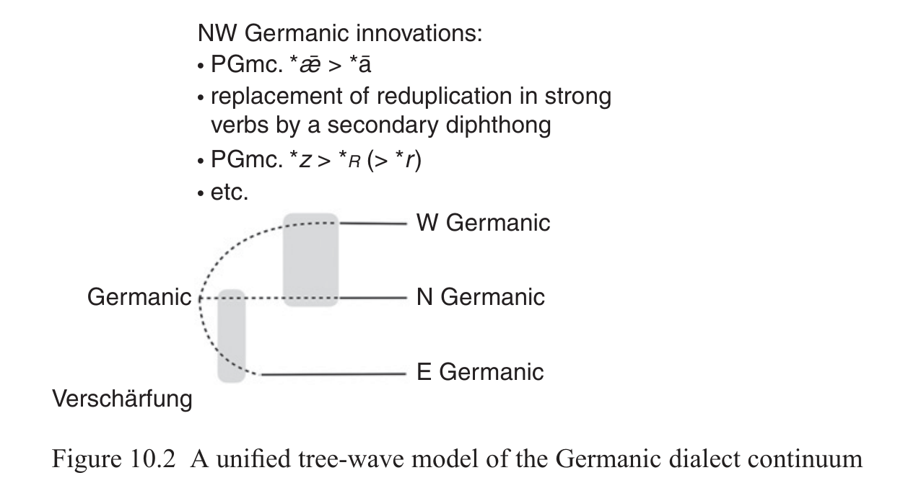
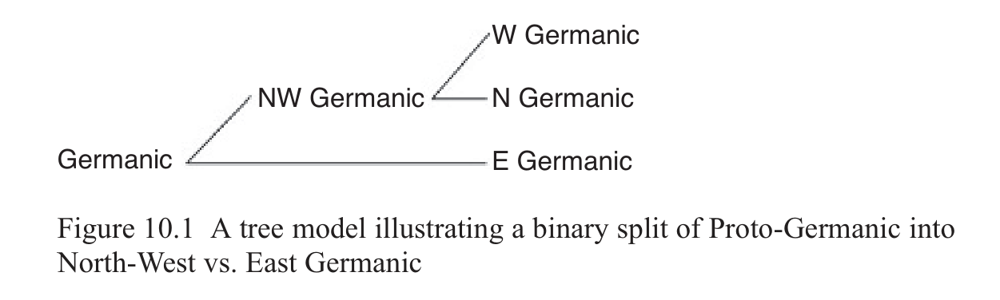

# 10 Germanic

Bjarne Simmelkjær Sandgaard Hansen & Guus Jan Kroonen

<!-- page: 152; pdf-page: 170 -->

## 10.1 Introduction

Germanic languages are spoken by about 500 million native speakers. They constitute a medium-large subgroup of the Indo-European language family and were originally located in Northern Europe, owing much of their current distribution to the recent expansion of English. From a historical perspective, notable old Germanic languages were Gothic, Old Norse, Old English, Old Frisian, Old Saxon, Old Franconian (poorly attested) and Old High German (Bousquette & Salmons 2017: 387–8). Gothic, mainly known from a fourth-century Bible translation, continued to be spoken in a local variant in Crimea until the late eighteenth century but subsequently went extinct (Nielsen 1981: 283–8). The remaining old Germanic languages developed into modern varieties such as English, Frisian, Dutch, German and the Nordic languages (Henriksen & van der Auwera 1994).

However, Northern Europe must have witnessed speakers of some form of Germanic even prior to the attestation of these old Germanic languages. Runic inscriptions in a language that we may label Early Runic appear from the second century onwards, and one inscription on a fourth-century-BCE bronze helmet, the Negau B helmet, has been unearthed in Slovenia. This inscription, which is in a northern Etruscan alphabet and reads <b>hari</b><b>χ</b><b>astiteiwa</b>, constitutes our earliest evidence of Germanic, at least if we follow Markey (2001) in interpreting it as ‘Harigast the priest’.1 It thus constitutes a<i> terminus ante quem</i> for some of the linguistic features that define Germanic (Section 10.2).

## 10.2 Evidence for the Germanic Branch

In this section, we shall list some of the most important diagnostic features of Germanic within the realms of phonology and morphosyntax, which constitute the most reliable means for establishing linguistic clades (see Section 2.3).

1 With<i> harigast</i> as the Germanic words for ‘army’ and ‘guest’ and<i> teiwa</i> as a linguistic precursor of

the Nordic theonym<i> Týr</i>. Alternatively, Must (1957: 55–7) sees a Rhaetic name consisting of Venetic and Etruscan elements in this inscription.

<!-- page: 153; pdf-page: 171 -->

### 10.2.1 Phonology

As indicated by Ringe (2017: 113–27, 147–50 and Section 4.3), all Germanic languages display reflexes of the outputs of the following phonological innovations.2 Three of these, no. 1, 4 and 5, are frequently said to constitute the most striking hallmark of the Germanic languages, i.e., “what to a large extent<i> defines</i> Germanic” (Kroonen 2013: xxvii). 1. Rask/Grimm’s Law I: PIE *<i>p t ḱ</i>/<i>k kʷ</i> > fricatives *<i>f þ h hw</i> unless an

obstruent immediately preceded, e.g. Goth.<i> fadar</i> ‘father’ ~ Ved.<i> pitā́</i>, Gr. <i>πατήρ</i>; Goth.<i> þreis</i> ‘three’ ~ Ved.<i> tráyaḥ</i>, Gr.<i> τρε</i>ῖ<i>ς</i>. 2. Verner’s Law: *<i>f þ s h hw</i> > *<i>β ð z ɣ ɣw</i> if not word-initial, if not adjacent to

a voiceless sound, and if the last preceding syllable nucleus was not accented; e.g. Goth.<i> fadar</i> ‘father’ (PGmc. *<i>faðer-</i> < PIE *<i>ph₂tér-</i>) ~ Goth.<i> broþar</i> ‘brother’ (< PGmc. *<i>brōþer-</i> < PIE *<i>bʰréh₂ter-</i>). 3. Kluge’s Law: PIE *<i>-Pn- -Tn- -Kn-</i> > *<i>-bb- -dd- -gg-</i> (Kluge 1884; Lühr

1988; Kroonen 2011), e.g. OE<i> liccian</i>, OS<i> likkon</i>, OHG<i> leckōn</i> ‘to lick’ < PGmc. *<i>likkōn-</i> < PIE *<i>liǵʰ-neh₂-</i>.3

4. Rask/Grimm’s Law II: PIE *<i>b d ǵ</i>/<i>g gʷ</i> > *<i>p t k kw</i> (including *<i>bb dd gg</i> >

*<i>pp tt kk</i>) (succeeding no. 3), e.g. Goth.<i> twai</i> ‘two’ ~ Ved.<i> dváu</i>, Gr.<i> δύω</i>; Goth.<i> aukan</i> ‘increase’ ~ Lat.<i> augeō</i> ‘increase’, Lith.<i> áugti</i> ‘grow’. 5. Rask/Grimm’s Law III: PIE *<i>bʰ dʰ ǵʰ</i>/<i>gʰ gʷʰ</i> > fricatives *<i>β ð ɣ ɣw</i>, e.g. OS

<i>neƀal</i> ‘fog’ ~ Ved.<i> nábhas-</i>, Gr.<i> νέφος</i>; Goth.<i> daúr</i> ‘door’ ~ Gr.<i> θυρᾱ</i>, Lat. <i>forēs</i>. 6. *<i>β ð ɣ ɣw</i> > *<i>b d g gw</i> after homorganic nasals, and *<i>β ð</i> > *<i>b d</i> word-

initially. 7. Shift of stress to the first syllable of the word. 8. Simplification of geminates after heavy syllables, e.g. PGmc. *<i>wīsa-</i> ‘wise’

(OHG<i> wīs</i>) < *<i>wīssa-</i> < PIE *<i>u̯ei̯d-to-</i>; *<i>deupa-</i> ‘deep’ (Goth.<i> diups</i>) < *<i>deuppa-</i> < PIE *<i>dʰeubʰ-no-</i>. As Ringe (Section 4.3) also mentions, the collocation of these innovations reduces the likelihood of them having taken place individually in each language – and thus the likelihood of these languages not emanating from a common predecessor – to practically zero. However, the list does not confine itself to these eight innovations. We may add at least a handful of further innovations, most of which concern the development of the inventory of stressed vowels. Examples include

2 Innovations no. 3 and 8 are not mentioned by Ringe (2017). However, we have included them

here to demonstrate the full range of the interdependency of these phonological innovations. The sequence of innovations no. 1–5 is disputed. Some adherents of the glottalic theory (e.g. Kortlandt 1991: 3) have Verner’s Law (no. 2) predate both Kluge’s Law (no. 3) and Rask/ Grimm’s Law (no. 1, 4 and 5). 3 In view of PGmc. *<i>seuni-</i> ‘sight, vision’ (Goth.<i> siuns</i>, ON<i> sjón</i>, etc.) < *<i>seɣʷni-</i> < PIE *<i>sekʷ-ní-</i>,

the occurrence of Kluge’s Law must postdate innovation no. 2.

<!-- page: 154; pdf-page: 172 -->

1. Merger of post-laryngeal-colouring PIE *<i>a o ə</i> ><i> a</i>, e.g. OHG<i> hasō</i> ‘hare’ ~

Ved.<i> śáśa-</i> (< *<i>śása-</i>), OPru.<i> sasins</i> (< PIE *<i>ḱas-</i>); Goth.<i> gasts</i> ‘guest’ ~ Lat. <i>hostis</i> ‘enemy’ (< PIE *<i>gʰostis</i>); Goth.<i> fadar</i> ‘father’ ~ Ved.<i> pitā́</i>, Gr.<i> πατήρ</i> (< PIE *<i>ph₂tér-</i>). 2. Merger of post-laryngeal-colouring PIE *<i>ā ō</i> > *<i>ā</i>. 3. *<i>ā</i> > *<i>ō</i>,4 e.g. Goth.<i> sokjan</i> /sōkjan/ ‘seek’ ~ Lat.<i> sāgīre</i>; Goth.<i> bloma</i>

/blōma/ ‘flower’ ~ Lat.<i> flōs</i>. 4. PIE *<i>r̥ l̥ m̥ n̥</i> > *<i>ur ul um un</i>, e.g. Goth.<i> baúrgs</i> /burgs/ ‘city’ ~ Av.<i> bərəz-</i>

‘high, hill, mountain’, OIr.<i> brí</i> (<i>brig-</i>) ‘hill’ (< PIE *<i>bʰr̥ ǵʰ-</i>); Goth.<i> fulls</i> ‘full’ ~ Ved.<i> pūrṇáḥ</i>, Lith.<i> pìlnas</i> (< PIE *<i>pl̥h₁nós</i>). 5. Holtzmann’s Law: PIE *<i>-i̯- -u̯ -</i> > PGmc. *<i>-jj- -ww-</i> under some conditions.5

### 10.2.2 Morphosyntax

Morphosyntax, too, provides a range of compelling evidence that classifies the Germanic languages as belonging to a separate branch. A morphological innovation that may count as one of the defining hallmarks of Germanic is the rise of its verbal system. All old Germanic languages share a verbal system consisting of three subsystems:6

• ablauting “strong verbs” with a present stem predominantly continuing the

Proto-Indo-European thematic presents and a preterite stem continuing the Proto-Indo-European perfect, e.g. Goth.<i> bind-an</i> ‘bind’,<i> band</i> ‘I/he bound’, <i>bund-um</i> ‘we bound’ • non-ablauting “weak verbs” with present stems of varying sources and

preterite stems formed with a suffix containing a dental consonant, mostly in the form of reflexes of PGmc. *<i>ð</i>, e.g. Goth.<i> haus-j-an</i> ‘hear’,<i> haus-i-da</i> ‘I/ he heard’ • “preterite-present verbs” where the present is formed as the strong-verb

preterites and the preterite as the weak-verb preterites, e.g. Goth.<i> kann</i> ‘I/ he can’,<i> kunn-um</i> ‘we can’,<i> kun-þa</i> ‘I/he could’ (see also Section 10.5.2)

Although most of the building blocks of this verbal system are reflected in other Indo-European languages and thus continue Proto-Indo-European elements and processes, their regrammation and reparadigmatisation into a coherent system is

4 Together with a few other loanwords, Gothic<i> rumoneis</i> ‘Romans’ witnesses that innovation no. 2

is a necessary intermediary step and no. 3 must have happened after the acquaintance of the Germanic-speaking peoples with Latin. The source word, Lat.<i> rōmānī</i>, has had its<i> ō</i> rendered as<i> ū</i> (probably because innovation no. 2 caused absence of<i> ō</i> in the Germanic/pre-Gothic vowel system) and its<i> ā</i> rendered as<i> ō</i> (probably because the word was borrowed prior to innovation no. 3) (Noreen 1894: 11–12; Ringe 2017: 171; contested by Stifter 2009: 270–3). 5 The exact conditioning remains debated, most likely involving either adjacency to laryngeals

(Hoffmann 1976: 651; Jasanoff 1978; Rasmussen 1990, 1999) or pretonic position (Kluge 1879: 128; Kroonen 2013: xxxviii–xl); see also Section 10.3.4. 6 In addition to these three subsystems, we find some mixed verbs and a handful of irregular verbs.

<!-- page: 155; pdf-page: 173 -->

a purely Germanic innovation.7 So is one of the building blocks: the dental suffix found in the preterite stem of the weak verbs (Meid 1971: 107–11; Rasmussen 1996/1999; Ringe 2017: 191–4; differently Lühr 1984; Kortlandt 1989).

The system of strong and weak adjectives (Ringe 2017: 313–15) constitutes another regrammation of inherited building blocks that is highly characteristic for Germanic. Continuing mainly PIE<i> a-</i>/<i>ō-</i> and<i> n-</i>stems, respectively, they are not innovations formally speaking. However, the regrammation and reparadigmatisation of the function of these nominal stems (see Table 10.1) is truly innovative, as is the intrusion of pronominal endings in the strong-adjective paradigm.

Finally, degrammation and, in particular, deflection are phenomena often associated with the Germanic branch. Many of the Proto-Indo-European inflectional categories have been lost in Germanic, e.g. the aspectual system and the subjunctive mood (Ringe 2017: 177, 182–6). Others are on the verge of being lost, e.g. the mediopassive, the dual, and the vocative, ablative, locative and instrumental cases. Having arisen independently in the Germanic languages, however, these latter deflectional processes do not characterise Germanic as such. For instance, the vocative is still attested residually in Gothic, likewise the instrumental in Old High German, Old Saxon and Old English, and Early Runic may display one instance of a noun in the ablative with ablatival function (Hansen 2016: 10–16). Thus, while the linguistic structures that would trigger this deflection may very well have been present in Proto-Germanic, the processes themselves occurred individually.

## 10.3 The Internal Structure of Germanic

It is traditionally assumed that the Germanic languages split into three sub-branches (Schleicher 1860; Streitberg 1896; Hirt 1931; etc.): • East Germanic: the long-extinct Gothic language, Crimean Gothic and sev-

eral other languages, likewise long-extinct, of which we have no or only little proof apart from toponyms and ethnonyms, e.g. Vandalic and Burgundian

**Table 10.1 Adjectival definiteness**

Content modifier of noun phrases (adjective) >

modifier of non-definite noun phrases

individualising or characterising noun

> modifier of definite noun phrases Expression reflexes of mainly PIE a-/ō- adjectival

stems (= strong adj.)

reflexes of the PIE n-stem type (=

weak adj.)

7 For the application of the terminology of grammation, regrammation and degrammation and

the connections between grammaticalisation and paradigmatisation, see Andersen 2006; Nørgård-Sørensen & Heltoft 2015.

<!-- page: 156; pdf-page: 174 -->

• North Germanic: the modern-day Nordic languages Icelandic, Faroese,

Norwegian, Elfdalian, Swedish and Danish and their immediate predecessors as well as the now-extinct language varieties of Norn • West Germanic: English, Frisian (West, East and North), Dutch, Low German,

High German and their various dialects, derivations and predecessors.8

### 10.3.1 East Germanic

Linguistic traits and developments specific for East Germanic include, within the realm of phonology, the raising of PGmc. *<i>ǣ</i> to<i> ē</i> (Goth.<i> mena</i> /mēna/ ‘moon’ ~ ON<i> máni</i>, OHG<i> māno</i>), the devoicing of word-final PGmc. *<i>-z</i> ><i> -s</i> (Goth.<i> fisks</i> ‘fish’ ~ ON<i> fiskr</i>, OHG<i> fisc</i>), the development of word-final PGmc. *<i>-ō</i> ><i> -a</i> (neuter<i> a-</i>stem nom./acc.pl. Goth.<i> -a</i> ~ ER<i> -u</i>, ON<i> -</i>∅<i>ᵘ</i>,9 OHG<i> -u</i>/<i>-</i>∅) and the absence of<i> a-</i>,<i> i-</i> and<i> u-</i>mutation (Goth.<i> wulfs</i> ‘wolf’ ~ OHG<i> wolf</i>; Goth. <i>gasts</i> ‘guest’ ~ ON<i> gestr</i>, OE<i> ġiest</i>).

Within the realm of morphology, innovations include paradigmatic levellings of the results of Verner’s Law (Section 10.2.1) in favour of the unvoiced variant (Goth.<i> waírþan–warþ–waúrþum–waúrþans</i> ‘become’ ~ OE<i> weorþan–</i> <i>wearþ–wurdon–worden</i>) and the creation of a deictic demonstrative pronoun Goth.<i> sah</i> ‘this’ (with<i> -h</i> < PIE *<i>-kʷe</i> ‘and’). We also see several instances of retention, e.g. of the reduplication in the preterite of reduplicated strong verbs (Goth.<i> haitan–haíhait–haíhaitum–haitans</i> ‘call’), of four classes of weak verbs and partially of the grammatical categories of dual and mediopassive in the inflection of verbs.

### 10.3.2 North Germanic

If we turn to North Germanic (Nielsen 2000: 255–65), some of the most salient of the many phonological innovations include loss of word-initial PGmc. *<i>j-</i> (ON <i>ungr</i> ‘young’ ~ Goth.<i> juggs</i> /jungs/, OHG<i> jung</i>) and of word-initial *<i>w-</i> before rounded vowels (ON<i> ulfr</i> ‘wolf’ ~ Goth.<i> wulfs</i>, OHG<i> wolf</i>), assimilation of PGmc. *<i>-ht-</i> ><i> -tt-</i> (ON<i> nótt</i>,<i> nátt</i> ‘night’ ~ Goth.<i> nahts</i>, OHG<i> naht</i>), loss of word-final nasals (ON<i> bera</i> ‘carry’ ~ Goth.<i> baíran</i>), rise of<i> i-</i> and<i> u-</i>mutation with subsequent syncope or shortening of the mutation-causing unstressed vowel (PGmc. *<i>gastiz</i> ‘guest’ > ON<i> gestr</i> ~ Goth.<i> gasts</i>)10 and breaking of stressed PGmc. *<i>e</i> ><i> ja</i> and<i> jǫ</i> when the following syllable contained<i> a</i> and<i> u</i> prior to the aforementioned

8 Scholars such as Robinson (1992: 11–12), Nielsen (2000) and Bousquette & Salmons (2017:

389) express minor reservations concerning the unity of the West Germanic branch. 9 The superscript<i> u</i> signifies<i> u-</i>mutation on the vowels of the preceding syllable(s). 10 Similar, though not entirely identical, processes have taken place in the West Germanic

languages (Section 10.3.3).

<!-- page: 157; pdf-page: 175 -->

syncope, respectively (ON<i> jafn</i> ‘even, equal’ ~ Goth.<i> ibns</i> ‘even, level, flat’, OHG <i>eban</i> ‘even, equal’; ON<i> jǫrð</i> ‘earth, soil’ ~ Goth.<i> aírþa</i> /irþa/, OHG<i> erda</i>).

On the morphological level, most of the traits that characterise North Germanic consider loss of some of the grammatical categories that were partially preserved elsewhere, e.g., the instrumental case or the dual and the mediopassive in the inflection of verbs. Others are true innovations such as the creation of a new personal pronoun in the third person (ON<i> hann</i> ‘he’,<i> hon</i> ‘she’), the replacement of the pres.3sg. ending<i> -þ</i> with pres.2.sg.<i> -ʀ</i> ><i> -r</i> and the grammaticalisation of verbs plus reflexive pronouns into a new passive voice.

### 10.3.3 West Germanic

The traits and developments that justify the assumption of a West Germanic unity (Nielsen 2000: 241–7) include several innovations shared with North Germanic (Section 10.3.4). Others are not shared with North Germanic, e.g. phonological processes such as the gemination of all consonants except<i> r</i> in front of *<i>j</i> (PGmc. *<i>hafja-</i> ‘hold up, bear up, lift’ > OS<i> hebbian</i> ~ Goth.<i> hafjan</i>, ON<i> hefja</i>) (Krahe 1966: 95–6),11 the gemination of obstruents in front of prevocalic *<i>r</i> and *<i>l</i> (PGmc. *<i>bitra-</i> ‘sharp, bitter’ > OS<i> bittar</i>; PGmc. *<i>apla-</i> ‘apple’ > OS <i>appul</i>), the rise of<i> i-</i>mutation with subsequent partial syncope or shortening of the mutation-causing unstressed vowel (PGmc. *<i>gastiz</i> ‘guest’ > OE<i> ġiest</i> ~ Goth. <i>gasts</i>)12 and the loss of word-final PGmc. *<i>-z</i> in unstressed syllables prior to its merger with regular<i> r</i> (PGmc. *<i>fiskaz</i> ‘fish’ > OHG<i> fisc</i> ~ Goth.<i> fisks</i>, ON<i> fiskr</i>).

The replacement of the original strong-verb pret.2sg. ending (formed by adding<i> -t</i> to the preterite singular stem) with a new one (formed by adding<i> -ī</i> to the preterite plural stem; OHG<i> bāri</i> ‘you carried’ ~ Goth.<i> bart</i>, ON<i> bart</i>; Krahe 1967: 100–3), the creation of an inflected infinitive (OHG<i> beranne</i> (dat.) ‘to bear’; Krahe 1967: 113) and the retention of reflexes of the irregular verbs PGmc. *<i>dō-</i> ‘do’, PWGmc. *<i>gā-</i> ‘go’ and *<i>stā-</i>13 ‘stand’ (Krahe 1967: 137–40) constitute some of the most salient arguments from the realm of morphology.

### 10.3.4 Intermediary Subgroupings

It is beyond the scope of this chapter to delve into the further sub-branching of these three main sub-branches of Germanic, for which we refer to seminal works such as Nielsen (2000) instead. Rather, we shall discuss whether these three sub-branches arose simultaneously through one single ternary split or came into being through sequences of binary splits. We must therefore decide if

11 North Germanic also geminates<i> k</i> and<i> g</i> in front of<i> j</i> (PGmc. *<i>legja-</i> > ON<i> liggja</i> ‘lie’), but the

West Germanic process applies to a much broader range of cases. 12 Earlier in English (and Frisian) than in High and Low German (Krahe 1966: 59). 13 PWGmc. *<i>stā-</i> ← *<i>stō-</i> (< PIE *<i>steh₂-</i>) by analogy with *<i>gā-</i> (< PIE *<i>ǵʰeh₁-</i>).

<!-- page: 158; pdf-page: 176 -->

any two branches are exclusive in sharing (preferably non-trivial) phonological and morphological innovations that cannot have arisen separately in each branch.

Of the three possible combinations that could theoretically have existed, we may discard the East–West vs. North Germanic one.14 Aside from the use of the derivational nominal suffix PGmc. *<i>-Vssu-</i> (Goth.<i> -(in)assus</i>, OHG<i> -(n)issi</i>), East and West Germanic share no linguistic innovations that are not also shared by North Germanic. The remaining linguistic traits shared only by East and West Germanic all constitute shared archaisms and are thus not diagnostic.

The assumption of another of the constellations, that of an initial binary split into North-East Germanic and West Germanic, once gained some popularity among Germanicists (Maurer 1942; Schwarz 1951; Rösel 1962; Lehmann 1966: 14–19; etc.) under the name Gotho-Norse theory. This split is supported by four (Schwarz 1951: 144–8) or five (Maurer 1952: 67–8) shared innovations, of which only one (Agee 2021: 337–8) may hold any diagnostic potential in a sub-branching discussion: the<i> Verschärfung</i> (i.e., occlusification) of PGmc. *<i>-jj-</i> and *<i>-ww-</i> > Goth.<i> ddj</i>, ON<i> ggj</i> and Goth.<i> ggw</i>, ON<i> ggv</i>, respectively, as opposed to the retention of these geminates in West Germanic where they surface as *<i>-j-</i> and *<i>-w-</i> (Goth.<i> twaddje</i> ‘two’ (gen.), ON<i> tveggja</i> ~ OHG<i> zweio</i>; Goth.<i> triggws</i> ‘trustworthy’, ON<i> tryggr</i> ‘trustworthy, faithful’ ~ OHG<i> triwi</i>). However, as claimed by Rasmussen (1990/1999: 383–4), the<i> Verschärfung</i> process may actually have been initiated already in Proto-Germanic, and West Germanic may have undergone a subsequent “Entschärfung” process affecting both the reflexes of PIE *<i>-i̯H-</i> and *<i>-u̯H-</i> and examples such as OHG<i> reia</i> ‘female roe’, OE<i> rǣġe</i> < PGmc. *<i>raig-jō-</i>. In addition, although seemingly non-trivial, the phonological development of<i> Verschärfung</i> finds approximate parallels in Faroese (Árnason 2011: 31–3) and in the transition from Latin to Romance (Agee 2021: 338). Thus, it is if not trivial, then at least not unparalleled.

We now turn to the possibility of a North-West Germanic unity as opposed to East Germanic. More than twenty linguistic innovations appear to be shared by North and West Germanic (Agee 2021: 336). Some of these may be trivial, e.g. the lowering of PGmc. *<i>ǣ</i> to *<i>ā</i> (ON<i> máni</i> ‘moon’, OHG<i> māno</i> ~ Goth.<i> mena</i>), the development of word-final PGmc. *<i>-ō</i> (via ER<b> -u</b>) ><i> -</i>∅<i>ᵘ</i>(neuter<i> a-</i>stem nom./acc.pl. ON<i> -</i>∅<i>ᵘ</i>, OHG<i> -</i>∅<i>/-u</i> ~ Goth.<i> -a</i>), the rise of<i> a-</i>mutation (PGmc. *<i>hurna-</i> ‘horn’ > ON<i> horn</i>, OHG<i> horn</i>)15 and perhaps even the rhotacism of

14 For a contrasting view, see Kortlandt (2000). 15 Crimean Gothic forms like<i> reghen</i> ‘rain’ and<i> boga</i> ‘arch; bow’seem to suggest that parts of East

Germanic partook in the process of<i> a-</i>mutation (Nielsen 1981: 296), thereby projecting this development back to Proto-Germanic times. The absence of short<i> e</i> and<i> o</i> in Gothic words whose North and West Germanic cognates have undergone<i> a-</i>mutation could then be due to the general Gothic merger of PGmc. *<i>i</i> and *<i>e</i> into *<i>i</i> along with an unverifiable, but structurally expected merger of PGmc. *<i>u</i> and *<i>o</i> into *<i>u</i>.

<!-- page: 159; pdf-page: 177 -->

PGmc. *<i>z</i> (><i> ʀ</i>) ><i> r</i> (PGmc. *<i>maizan-</i> ‘more’ > ON<i> meiri</i>, OE<i> māra</i>) (Kümmel 2007: 80–1). On the other hand, we may not reasonably label as trivial the creation of a new deictic demonstrative pronoun by adding the enclitic particle *<i>-si</i> to the inherited demonstrative pronoun (Runic Danish<b> sasi</b> /sāsi/ ‘this’, OHG<i> dese</i>; Krahe 1967: 64–6) and the analogical replacement of reduplication in strong verbs by the secondary diphthong PGmc. *<i>-ea-</i> ~ *<i>-ia-</i> also known as *<i>ē²</i> (ON<i> lét</i>, OHG <i>liaz</i> ‘let’ ~ Goth.<i> laílot</i>). The latter process in particular consists of so many subprocesses that it would be inconceivable to claim independent developments in North and West Germanic. In addition, although many of the remaining shared innovations may indeed be trivial, the sheer number of instances in itself suggests a period of North–West-Germanic unity. Finally, seeing that Early Runic partakes in all the innovations common to both North and West Germanic but none of those specific to East Germanic (Nielsen 2000: 77–202, 271–98, esp. 287–93), we may safely infer that, by the time of the earliest attestations of Early Runic in the second century CE, the East Germanic branch had split off from the Germanic dialect continuum, prior to its dissolution into North and West Germanic.

On a final note, we shall review an alternative subgrouping scenario. As mentioned by Agee (2021: 344), there may still be some dialectal exchange in the years immediately following a split. If we choose to assign diagnostic value to the<i> Verschärfung</i> process, after all, and if the language varieties that would develop into the three Germanic sub-branches once coexisted in a common dialect continuum, nothing therefore prevents East and North Germanic from having shared innovations such as the<i> Verschärfung</i> at an even earlier point in time. In such a unified tree-wave model, the initial split of Proto-Germanic is defined by the first innovation (i.e., the<i> Verschärfung</i>) not shared by all its descendants, because it did not reach the entire dialect continuum. Between this initial split and the final split, which defines the exit of a dialect from the dialect continuum and thus the establishment of a separate sub-branch, the numerous innovations common to North and West, but not East Germanic, could have taken place.

Such an approach, which allows for both divergence and convergence, is also compatible with Agee’s (2021) recent glottometric calculations, which operate with degrees of subgroupiness rather than absolute, clear-cut splits. He thus (Agee 2021: 335–8, 343) posits a high subgroupiness value for North-West Germanic (ς = 20.04) as opposed to a low value for North-East Germanic (ς = 0.032), indicating not only that North-West Germanic is indeed a tightly knit subgroup but also that the original dialect-continuum situation may have allowed for one shared North-East Germanic innovation.

In sum, two credible models for the disintegration of Germanic present themselves. Either we must dismiss<i> Verschärfung</i> as a common North-East Germanic innovation and assume a North-West Germanic unity vis-à-vis East Germanic (as in Figure 10.1), or we must assume the existence of a Germanic

<!-- page: 160; pdf-page: 178 -->

dialect continuum in which North Germanic could have shared innovations with first East, then West Germanic prior to the final split (as in Figure 10.2).16

## 10.4 The Relationship of Germanic to the Other Branches

Just as Germanic split into its sub-branches (Section 10.3), it has itself split off from Proto-Indo-European at a given point. Beyond the early divergence of Anatolian and Tocharian (Chapters 5 and 6), the relative order of the disintegration of Proto-Indo-European, including the sequence of the splits leading to Germanic, is difficult to establish, however. To solve the riddle, we must attempt to define with which other branches Germanic shares diagnostic linguistic traits, i.e., preferably non-trivial shared phonological and morphological innovations (see Section 2.3).

16 The latter model assumes that an initial split within the Germanic dialect continuum (marked by

the<i> Verschärfung</i>) is followed by the numerous North-West Germanic innovations (such as PGmc. *<i>ǣ</i> > *<i>ā</i> and the analogical replacement of reduplication in strong verbs by a secondary diphthong) within other parts of the continuum and subsequently a final split into North, East and West Germanic.

<!-- page: 161; pdf-page: 179 -->

One possibly high-node innovation that Germanic shares with several other so-called<i> centum</i> branches (Italic, Celtic, Hellenic and maybe Tocharian; see Krahe 1966: 11–12; Fortson 2010: 58–9, 403) is the merger of Proto-Indo-European palatovelar and plain velar plosives into plain velars (PIE *<i>(d)ḱm̥ tóm</i> ‘100’ > PGmc. *<i>hunda-</i>, Gr.<i> ἑκατόν</i>, Lat.<i> centum</i>). In contrast, the so-called<i> satem</i> branches (Indo-Iranian, Armenian, Balto-Slavic and maybe Albanian; see Fortson 2010: 59) merge Proto-Indo-European labiovelar and plain velar plosives into plain velars and develop the palatovelar plosives further into sibilants (PIE *<i>(d)ḱm̥ tóm</i> ‘100’ > Ved.<i> śatám</i>, Av.<i> satəm</i>, Lith.<i> šim̃ tas</i>). The geographical distribution of<i> centum</i> and<i> satem</i> branches indicates, however, that only the latter group was truly linguistically innovative. The branches of the peripheral areas thus merely reflect the original situation, with the exception of a trivial merger of palatovelars and plain velars that could easily have happened separately and independently in each branch and, at any rate, must have happened independently in Tocharian vis-à-vis the western<i> centum</i> branches.

The<i> centum</i>–<i>satem</i> distinction aside, scholars have suggested close phylogenetic relationships between Germanic and a range of other languages. The most frequent suggestions set up a Germano-Italo-Celtic unity (Meillet 1984: 131–2; Porzig 1954: 213) or, less frequently, a Germano-Balto-Slavic unity (Schleicher 1853: 787; Stang 1972; also considered as one among several constellations by Meillet 1984: 132 and Porzig 1954: 214). Other scholars venture into larger groupings such as an “alteuropäisch” group consisting of Germanic, Celtic, Italic, Venetic, Illyrian, Baltic and possibly Slavic (Krahe 1954: 48–63; 1962: 287–8; 1966: 13–14; modified by Schmid 1968), primarily based on hydronymic evidence; a “North-West Indo-European” group consisting of Italic, Celtic, Germanic and Balto-Slavic (Oettinger 1997, 1999, 2003); or a general “central” group consisting of Germanic, Balto-Slavic, Indo-Iranian, Armenian, Greek and probably Albanian (Ringe 2017: 6–7). However, these larger groupings are generally based on shared lexical (and derivational) rather than phonological and morphological innovations, which would constitute a more reliable means for establishing linguistic clades (see Section 2.3). In principle, chances are therefore high that these innovations result from post-split convergence.

In Sections 10.4.1–7, we shall go through the branches with which Germanic is exclusive in sharing specific phonological and morphological features.

### 10.4.1 Italic

Apart from a vast number of lexical innovations, some of which are also shared with Celtic (e.g. Goth.<i> munþs</i> ‘mouth’ ~ Lat.<i> mentum</i> ‘cheek’, W<i> mant</i> ‘jaw’), Germanic shares a handful of innovative phonological and morphological features with Italic (Porzig 1954: 106–17, 123–7; Krahe 1966: 15–17, 20–1).

<!-- page: 162; pdf-page: 180 -->

First among the shared Germano-Italic phonological innovations is the development of PIE *<i>-TT-</i> > *<i>-ss-</i> (e.g. pre-PGmc. *<i>u̯id-(dʰi)dʰeh₁-t</i> > PGmc. *<i>wissē(þ)</i> ‘he knew’; PIE *<i>sed-tó-</i> > Lat.<i> sessus</i> ‘seated, sitting’), which may also have been shared with Celtic (Meillet 1984: 57–61; Porzig 1954: 76–8). Second comes the back-vowel quality of the vowel developed in front of Proto-Indo-European syllabic liquids (PIE *<i>r̥</i>, *<i>l̥</i> > Lat.<i> or</i>,<i> ol</i>, Goth.<i> ur</i>,<i> ul</i>).

The remaining relevant innovations are morphological. Germanic and Italic show some conformity as regards both the present-stem formation and the function of derived factitive verbs in PIE *<i>-eh₂-i̯e-</i> (Germanic class II weak verbs ~ Latin 1st conjugation) and stative verbs in PIE *<i>-eh₁-i̯e-</i> (Germanic class III weak verbs ~ part of the Latin 2nd conjugation, e.g. OHG<i> dagēn</i> ‘be silent’ ~ Lat.<i> tacēre</i>). Within numeral and adverbial word formation, Germanic and Italic share two innovative derivative suffixes with identical meanings: the creation of distributive numerals from multiplication adverbs by means of the suffix post-PIE *<i>-no-</i> (*<i>du̯is-no-</i> ‘double, of two times > ON<i> tvennr</i> ‘double’, Lat.<i> bīnī</i> ‘two by two’) and the creation of ablatival local adverbs in post-PIE *<i>-tr-ōd</i> (Goth. <i>ūtaþro</i> ‘from outside’; Osc.<i> contrud</i> ‘against’).

To the extent that Venetic can be proved to constitute a separate Italic sub-branch rather than an independent Indo-European branch (Section 8.2), we note two innovations of Germanic shared with Venetic in this chapter (Porzig 1954: 128; Krahe 1966: 17–18): the addition of post-PIE *<i>g</i> to the 1sg.acc. of the personal pronoun PIE *<i>mē̆</i> ‘me’ due to analogy with the 1sg.nom. *<i>eǵ-</i> ‘I’ (e.g. Goth.<i> mik</i> ‘me’, Ven.<i> meχo</i> modelled after Goth.<i> ik</i> ‘I’, Ven.<i> eχo</i>) and the creation of an identity pronoun post-PIE *<i>selbʰo-</i> ‘self’ (Goth.<i> silba</i>, Ven. <i>sselb-</i>).17 However, because these two Germano-Venetic innovations are not shared with all Italic subbranches, they must either be independent innovations in Germanic and Venetic or result from convergence between Germanic and Venetic after the initial breakup of Italic.

In a similar vein, granted an Italo-Celtic cladistic node (Section 7.2), the non-participation of Celtic in the Germano-Italic innovations poses serious challenges to the assumption of such a subbranch and suggests that these innovations rather result from secondary convergence after the breakup of Italo-Celtic.

### 10.4.2 Celtic

Germanic and Celtic had a long period of intensive contact (Porzig 1954: 118– 27; Krahe 1966: 18–20; Bousquette & Salmons 2017: 390). Their high number of shared lexical innovations concentrated in certain semantic domains such as

17 The existence of somewhat similar analogies in the personal pronouns in Anatolian (e.g. Hitt.

nom.<i> uk</i> ‘I’, acc.<i> ammuk</i> ‘me) and in Greek (<i>ἔμεγε</i>; see Whatmough 2015: 164) strengthens the suspicion that at least this innovation is trivial and may have happened independently in multiple branches (Porzig 1954: 191).

<!-- page: 163; pdf-page: 181 -->

religion and warfare (Hyllested 2009: 117–18, 122) serves as solid evidence thereof. So do a number of indisputable Celtic loanwords in Germanic, e.g. PIE *<i>h₃rēǵ-</i> ‘king’ > PCelt. *<i>rīg-</i> ⇒ PGmc. *<i>rīk-</i>. However, it is often difficult to decide whether a given Germano-Celticism is a shared innovation (or archaism) or reflects a loanword relationship in either direction as exemplified by PIE *<i>h₃reǵ-tu-</i> > PCelt. *<i>rextu-</i>, PGmc. *<i>rehtu-</i> ‘justice’ (Schmidt 1984, 1986; Hyllested 2009: 107).

Notwithstanding the quantity of these lexical isoglosses or their quality for reconstructing a period of Germano-Celtic neighbourhood and convergence, they remain lexical only. Apart from the uncertainties regarding the participation of Celtic in the development of PIE *<i>-TT-</i> > *<i>-ss-</i> (Section 10.4.1), Germanic shares no exclusive phonological and morphological innovations with Celtic (Porzig 1954: 123; Hyllested 2009: 108–9). The evidence for a common Germano-Celtic branch is therefore scanty.

### 10.4.3 Illyrian, Messapic and the Remaining Balkanic Branches

As with both Italic and Celtic, the vast majority of shared innovations between Germanic, on the one hand, and Illyrian and Messapic, on the other, are lexical, e.g. Goth.<i> þiudans</i> ‘king’ ~ Illyr.<i> Teutana</i> (personal name), but a couple of morphological innovations exists, as well (Porzig 1954: 127–31; Krahe 1966: 18). Only with Illyrian and partially with Greek does Germanic share the generalisation of the<i> ō-</i>grade in the declension of feminine<i> n-</i>stems (Goth. nom.sg. <i>tuggo</i> /tungō/, gen.sg.<i> tuggons</i> /tungōns/ ‘tongue’ ~ Illyr. nom.sg.<i> Aplo</i>, gen.sg. <i>Aplōnis</i> (personal name)). The formation of possessive pronouns with the suffix *<i>-no-</i> attached to the locative of the personal pronouns is shared with Messapic (e.g. post-PIE *<i>su̯ei̯no-</i> ‘his, her’ > Goth.<i> seins</i>, Mess.<i> veinan</i> (acc.)).

Shared innovations between Germanic and the remaining Balkanic branches of Thracian, Albanian and Hellenic are limited to a handful of lexical correspondences, most of which are also shared with Illyrian (Porzig 1954: 138–9). The only exceptions are the trivial phonological development of PIE *<i>sr</i> ><i> str</i> in Germanic and Thracian-Albanian, which is, however, also shared with Illyrian, Brythonic, Slavic and partly Baltic (e.g. ON<i> straumr</i> ‘stream’ ~ Thrac. <i>Στρύμων</i> (river name), Illyr.<i> Stravianae</i>,<i> Strevintia</i> (place names), Lith.<i> strovė</i> ‘stream’; see Porzig 1954: 78–9; Krahe 1966: 22), and the equally trivial Germanic and Albanian merger of PIE *<i>a</i> and *<i>o</i> into *<i>a</i>, which may also be shared with (Balto-)Slavic (Meillet 1984: 54–6; see also Section 10.4.4).

### 10.4.4 Balto-Slavic

Most of the innovations shared between Germanic and Balto-Slavic are lexical (e.g. PGmc. *<i>strēla-</i> ‘arrow’ ~ Lith.<i> strėlė̃</i> ‘arrow, shoot’, OCS<i> strěla</i> ‘arrow’;

<!-- page: 164; pdf-page: 182 -->

see esp. Stang 1972 and Nepokupnyj et al. 1989). Four major exceptions from the realm of phonology and morphology come to mind, though (Porzig 1954: 139–47; Krahe 1966: 21–2).

First, and most famously, Germanic and Balto-Slavic agree in forming the dative and instrumental plural with a suffix reflecting a PIE *<i>-m-</i> rather than the *<i>-bʰ-</i> found in the remaining Indo-European branches (PGmc. dat.pl. *<i>-imiz</i> as per the Germanic theonyms<i> Aflims</i> and<i> Vatvims</i> in Roman inscriptions, Lith. dat.pl.<i> -ms</i>, instr.pl.<i> -mis</i>, OCS dat.pl.<i> -mъ</i>, instr.pl.<i> -mi</i> ~ Ved. dat.-abl.pl. <i>-bhyaḥ</i>, instr.pl.<i> -bhiḥ</i>, Lat. dat.-abl.pl.<i> -bus</i>, Gaul. dat.pl.<i> -bo</i>, Gr. instr.pl.<i> -φι</i>; see also Porzig 1954: 90–1). A recent study by Adams (2016: 19–22) indicates that Tocharian belongs to the<i> m-</i>group, its ablative ending Toch.B<i> -meṃ</i> reflecting pre-Toch. *<i>-mons</i>, i.e., the PIE dat.-abl.pl. *<i>-mos</i> with *<i>n</i> inserted analogically from the acc.pl. as in OPru.<i> -mans</i>. To Olander (2015: 269–70), the *<i>m</i> of Germanic and Balto-Slavic (and Tocharian) represents a phonological innovation of PIE *<i>-bʰi̯-</i> > post-PIE *<i>-m-</i>. Other scholars, however, regard the<i> m-</i>cases as archaic rather than innovative and the *<i>m</i>/<i>bʰ</i> isogloss as a result of different levellings of an original distribution between dative/ablative plural in *<i>m</i> and instrumental plural in *<i>bʰ</i> (Hirt 1895; Beekes 2011: 188; see also Section 15.4.1).18

Second, Germanic and Baltic agree on forming the numerals ‘11’ and ‘12’ in a highly non-trivial way by compounding the numerals ‘1’ and ‘2’ with the reflex of PIE *<i>-likʷo-</i> ‘left’ (Goth.<i> ainlif</i> ‘11’,<i> twalif</i> ‘12’ ~ Lith.<i> vienúolika</i> ‘11’, <i>dvýlika</i> ‘12’). The meaning has probably developed along the lines of ‘one left after counting to 10’ (11) and ‘two left after counting to 10’ (12).

The third innovation is phonological. In both Germanic and Balto-Slavic, the inherited vowel qualities PIE *<i>a</i> and *<i>o</i> merge into *<i>a</i>. Since the Slavic development of *<i>а</i> ><i> o</i> is demonstrably late (Meillet 1984: 54), this Germano-Balto-Slavic merger would seem uncontroversial with the short vowels (e.g. PIE *<i>poti-</i> ‘master’ > Goth.<i> (bruþ-)faþs</i> ‘bridegroom’, Lith.<i> pа̀ ts</i> ‘husband, self’; see Meillet 1984: 54–6).19 However, the Baltic merger of *<i>o</i> and *<i>a</i> must postdate Winter’s Law, since PIE *<i>nogʷ-</i> > PBalt. *<i>nō̰ g-</i> > Lith.<i> núogas</i> ‘naked’ (not *<i>nogʷ-</i> > †<i>nag-</i> > †<i>nā̰ g-</i> > Lith. †<i>nógas</i>). The long vowels also require closer investigation. First, the merger of the long vowels only affects parts of the Germano-Balto-Slavic area, since Baltic keeps the reflexes of PIE *<i>ā</i> and *<i>ō</i>

18 For a review of earlier literature on this matter, see Olander (2015: 267–8). 19 This short-vowel merger also affects Albanian (Section 10.4.3). According to some scholars

(e.g. Luraghi 1998: 174), Anatolian partakes, as well, but as Melchert (1993: 251) demonstrates, this merger did not affect Lycian, in which PIE *<i>o</i> merged with *<i>e</i> instead of *<i>a</i>. Thus, it must constitute a secondary shared innovation in Hittite, Palaic and Luwian. In a similar vein, the existence of Brugmann’s Law, which accounts for the different developments of short PIE *<i>a</i> and *<i>o</i> in open syllables in Indo-Iranian, witnesses that the identical merger in this branch must also have happened posterior to its separation from the remaining Indo-European branches.

<!-- page: 165; pdf-page: 183 -->

apart (PIE *<i>steh₂-</i> > Lith.<i> stóti</i> ‘stand up’ ~ PIE *<i>népōt-</i> ‘grandson’ > OLith. <i>nepuotis</i>). Second, we must accept an intermediary stage of a merged pre-Proto-Germanic *<i>ā</i> that later develops into PGmc. *<i>ō</i> as posited in Section 10.2.1. No matter how many branches the mergers of short and long PIE *<i>a</i> and *<i>o</i> cover, one fact remains: both mergers represent trivial processes of phonological change and may just as easily have taken place independently in each branch.

Fourth and last, Germanic, Slavic and to some extent Baltic share the equally trivial insertion of *<i>t</i> into the cluster PIE *<i>sr</i> with Thracian, Illyrian and Brythonic (Section 10.4.3).

As a parallel to the case of shared Germano-Italic innovations affecting only the Venetic part of Italic, or only the Italic part of Italo-Celtic (Section 10.4.1), the fact that Germanic shares innovations with only parts of the Balto-Slavic unity weakens the assumption of an early Germano-Balto-Slavic cladistic node. Being the sole non-trivial innovation shared by all Germanic and Balto-Slavic (and Tocharian?) sub-branches, only the oblique cases in PIE *<i>-m-</i> may potentially support such an assumption, though with some major potential reservations (Section 15.4.1). The remaining non-lexical innovations could have either happened independently in each branch or arisen due to convergence at a period when Germanic, Baltic and Slavic had all developed into individual branches. Thus, it is not surprising that Pronk (Section 15.4.1) dismisses the idea of such a common Germano-Balto-Slavic node.

### 10.4.5 Armenian

The only innovation uniting Armenian and Germanic is their treatment of the Proto-Indo-European system of plosives. Both branches have undergone ‘consonant shifts’ by changing the articulatory manner of the plosives in similar ways (Meillet 1984: 89–96; Porzig 1954: 80–2; see also Section 10.2.1 for an account of the Germanic developments). The voiced aspirates (PIE *<i>bʰ dʰ ǵʰ gʰ gʷʰ</i>) developed into unaspirated voiced plosives and/or fricatives), the voiced unaspirated plosives (PIE *<i>b d ǵ g gʷ</i>) into unvoiced plosives and, finally, the unvoiced unaspirated plosives (PIE *<i>p t ḱ</i> <i>k kʷ</i>) into unvoiced aspirates. These unvoiced aspirates are predominantly retained as such in Armenian (PIE *<i>t ḱk/kʷ</i> > Arm.<i> tʽ cʽ kʽ</i>) but have developed further into fricatives in Germanic (PIE *<i>p t ḱ/k kʷ</i> > PGmc. *<i>f þ h hw</i>) and partially in Armenian, too (PIE *<i>p</i> > Arm.<i> h</i>).

Although these developments are indeed substantial, they may still have occurred independently in the two branches in question. As Meillet (1984: 93–6) mentions, such consonant shifts are trivial innovations with parallels in several other language families worldwide, e.g. Aramaic and some Bantu dialects, and Porzig (1954: 81–2) questions whether the developments in

<!-- page: 166; pdf-page: 184 -->

Germanic and Armenian are really as parallel as they seem to be at first glance.

### 10.4.6 Tocharian

The apparent participation of Tocharian in the group of languages that select<i> m-</i>variants of the dative/ablative and instrumental plural of case endings (Adams 2016: 19–22; see Section 10.4.4 for a detailed treatment) may position it firmly together with Germanic and Balto-Slavic. Additional parallels between Germanic and Tocharian are limited to lexical elements (Porzig 1954: 97–8, 182–7).

### 10.4.7 Anatolian

Apart from allegedly both grouping together with Italic and Tocharian in expanding the function of the reflexes of the interrogative pronoun PIE *<i>kʷo-</i>/ <i>kʷi-</i> to include the function of a relative pronoun (Puhvel 1994: 318), Anatolian and Germanic only share lexical isoglosses.20 Even if some among these isoglosses are indeed striking and highly specialised (e.g. ON<i> herðar</i> ‘shoulder blades’ ~ Hitt.<i> kakkartani</i> ‘shoulder blade’; Goth.<i> ulbandus</i> ‘camel’ ~ Hitt. <i>huwalpant-</i> ‘hunchback’; Puhvel 1994: 323–4; Melchert 2016: 298–300), they remain lexical and thus less fit for cladistic purposes than phonological and morphological aspects.

## 10.5 The Position of Germanic

As demonstrated in Section 10.4, no branch offers itself as an obvious candidate for sharing a common node with Germanic in the Indo-European cladistic tree. We could tentatively choose to see the *-<i>m-</i>variant of the secondary cases (Section 10.4.4) or the collocation of the Germanic 2nd and 3rd classes of weak verbs with the Latin 1st and 2nd conjugation (Section 10.4.1) as evidence in favour of a cladistic partnership with Balto-Slavic and Tocharian or with Italic, respectively. However, these pieces of evidence obviously point in different directions, and as for the Balto-Slavic connection, other pieces of evidence show shared innovations with Baltic only, not with Slavic, which indicates a period of contact and joint development between Germanic and Balto-Slavic

20 The evidence for Germanic partaking in the innovation of expanding the function of the reflexes

of the interrogative pronoun is meagre, to say the least. The Germanic languages form their primary relative pronouns in three different ways. East Germanic applies the demonstrative pronoun followed by an enclitic particle<i> -ī</i>; North Germanic, an indeclinable particle<i> er</i> or<i> es</i>; and West Germanic, the demonstrative pronoun alone (Krahe 1967: 68–9; see also Porzig 1954: 191).

<!-- page: 167; pdf-page: 185 -->

languages during a relatively late time period and, in any event, after the initial breakup of Balto-Slavic. The same goes for the Germano-Italic innovations that are not also shared with Celtic and thus must postdate the initial breakup of Italo-Celtic. Two linguistic arguments may, however, be presented in favour of a relatively early split of Germanic.

### 10.5.1 Nominal Ablaut

A well-known, seemingly archaic feature of the Germanic branch is its preservation of Proto-Indo-European nominal ablaut, especially in the heteroclitics. Here we may recall cases such as PGmc. nom. *<i>sōel</i> (Goth.<i> sauil</i>, ON<i> sól</i>), obl. *<i>sunn-</i> (Goth. dat.<i> sunnin</i>, ON<i> sunna</i>) ‘sun’ < PIE *<i>séh₂-u̯l̥</i>, gen. *<i>sh₂-u̯ (é)n-s</i> and the somewhat parallel PGmc. nom. *<i>fōr</i> (cf. Goth.<i> fon</i>, OHG<i> fuir, fiur</i> ‘fire’), obl. *<i>fun-</i> (Goth. gen.<i> funins</i>) < PIE *<i>péh₂-u̯r̥</i>, *<i>ph₂-u̯ (é)n-s</i>. With the exception of Anatolian, such nominal ablaut patternsare far less well preserved in the other branches. Although vestiges of these patterns exist throughout the family (Lith.<i> vanduõ</i> ~ Latv.<i> udens</i> ‘water’ < PIE *<i>u̯ (o)d-r/n-</i> and Lat.<i> iecur</i>, gen.<i> iocineris</i> ‘liver’ < PIE *<i>i̯e/okʷ-r/n-</i>), Germanic appears rather conservative in this respect.

Additional indications for such inherited productivity in Germanic come from a related nominal category, the<i> n-</i>stems. There is ample evidence for inherited ablaut patterns in this category, e.g. PIE *<i>kréi̯t-ō</i>, obl. *<i>krit-n-</i> ‘fever’ (OHG nom.<i> rído</i> ~ dat.<i> riten</i>); PIE *<i>meh₂k-ō</i>, obl. *<i>mh₂k-n-</i> ‘poppy’ (OSw.<i> val-mōghe</i> ~ OHG<i> maho</i>,<i> mago</i>); see further MW<i> cryd</i> < PIE *<i>krito-</i> and Gr.<i> μήκων</i> < PIE *<i>meh₂k-on-</i>. In other<i> n-</i>stems, however, the ablaut appears to be decidedly secondary. A possibly secondary full grade pre-sents itself in, e.g., Nw. dial.<i> jase</i> ‘hare’ (< ON *<i>hjasi</i> < PGmc. *<i>hesan-</i>) as opposed to pan-Gmc. *<i>hasan-</i> ~ *<i>hazan-</i> (OHG<i> haso</i>, OE<i> hara</i>) and, outside Germanic, Ved.<i> śáśa-</i>, Lat.<i> cānus</i> (< *<i>kasno-</i>) (< PIE *<i>ḱas-</i>). Secondary zero grades must in turn be assumed for PGmc. *<i>maþō</i>, obl. *<i>mutt-</i> ‘maggot, moth’ (Goth.<i> maþa</i> ~ ON<i> motti</i>) and *<i>raþō</i>, obl. *<i>rutt-</i> ‘rat’ (OHG<i> rato</i> ~ MLG<i> rotte</i>), apparently from pre-PGmc. *<i>mot-n-</i> and *<i>(H)rot-n-</i> (Kroonen 2011: 218–23). The Indo-European nominal ablaut is thus not merely preserved in the Germanic<i> n-</i>stems, but seems to have remained productive, a feature long lost in most other branches.

### 10.5.2 The Preterite-Presents

A second archaic characteristic of Germanic is the retention of the verbal category that is generally held to somehow correspond to the Anatolian <i>ḫi-</i>presents: the Germanic preterite-presents (Section 10.2.2). Examples include

<!-- page: 168; pdf-page: 186 -->

• PGmc. *<i>waita</i>–<i>witume</i> ‘know’ > Goth.<i> wait</i>–<i>witum</i>, ON<i> veit</i>–<i>vitum</i> • PGmc. *<i>maga</i>–<i>magume</i> ‘can’ > Goth.<i> mag</i>, ON<i> má</i>–<i>megum</i> • PGmc. *<i>aiha</i>–<i>aigume</i> ‘own, have’ > Goth.<i> aih</i>–<i>aigum</i>, ON<i> á</i>–<i>eigum</i> • PGmc. *<i>kanna</i>–<i>kunnume</i> ‘can’ > Goth.<i> kann</i>–<i>kunnum</i>, ON<i> kann</i>–<i>kunnum</i> • PGmc. *<i>mana</i>–<i>munume</i> ‘think’ > Goth.<i> man</i>, ON<i> man</i>–<i>munum</i> • PGmc. *<i>skala</i>–<i>skulume</i> ‘shall, must’ > Goth.<i> skal</i>, ON<i> skal</i>–<i>skulum</i> The reconstruction of this category for Proto-Indo-European is debated. Opinions differ as to whether it was a conjugational type of its own or rather originally identical with the perfect (see Kloekhorst 2018 for a discussion).

Regarding the lexical distribution of this class, some of the verbs have parallels in Indo-European languages other than Germanic, e.g. PGmc. *<i>magan-</i> ~ OCS<i> mogǫ</i> (< PIE *<i>mogʰ-</i> ‘be able’); *<i>munan-</i> ~ Gk.<i> μέμονα</i> ‘has in mind’ (< PIE *(<i>me-</i>)<i>mon-</i>); PGmc. *<i>aigan-</i> ~ Ved.<i> ī́śe</i> ‘avail over’ (< PIE *<i>(h₂i-)h₂iḱ-</i>; see Hansen 2015); PGmc. *<i>ōgan-</i> ~ OIr.<i> ágathar</i> (< PIE *<i>h₂e-h₂ogʰ-</i> ‘fear’), yet others are isolated to Germanic, even though they contain more widely attested verbal roots, e.g. PGmc. *<i>kunnan-</i> (< PIE *<i>ǵneh₃-</i> ‘know’),21 *<i>lisan-</i> (PIE < *<i>lei̯s-</i> ‘track’), *<i>ga-nahan-</i> (< PIE *<i>Hnéḱ-</i> ‘reach’) and *<i>skulan-</i> (< PIE *<i>skel-</i> ‘owe’). It is tempting to conclude, as a result, that the Germanic preterite-presents, whatever their ultimate origin, were still a productive verbal category when Germanic split off from Proto-Indo-European. This is more reminiscent of the situation in Hittite, where the<i> ḫi-</i>conjugation is still a fully functioning verbal category, than of the situation in the remaining Indo-European branches, where it has largely disappeared and can only be traced through isolated remnants.

### 10.5.3 Conclusion

Exactly how early Germanic split off remains exceedingly difficult to determine. While Germanic is generally a highly innovative Indo-European sub-branch and lost many of the Proto-Indo-European features still present in Vedic and Greek, the sustained productivity of (1) nominal ablaut and (2) the preterite-presents can be taken as “living fossils”.22

Perhaps then, these are potential indications that Germanic split off from PIE at a relatively early stage, as these features are generally lost in the non-Anatolian branches. Based on this interpretation, we may surmise that Germanic broke off from Proto-Indo-European after Anatolian and just before or after Tocharian.

21 The double<i> n</i> of *<i>kann-</i> ~ *<i>kunn-</i> suggests that it was innovated on the basis of the<i> neh₂-</i>present

PGmc. *<i>kunnō-</i> < PIE *<i>ǵn̥ h₃-neh₂-</i>, which is well-attested outside Germanic (Toch.A<i> knānat</i>, Ved.<i> jānā́ti</i>, etc.) and clearly old. 22 The multiply renewed productivity of the root-noun declension type in Germanic (Hansen

2017) may constitute a third “living fossil” of this type.

<!-- page: 169; pdf-page: 187 -->
