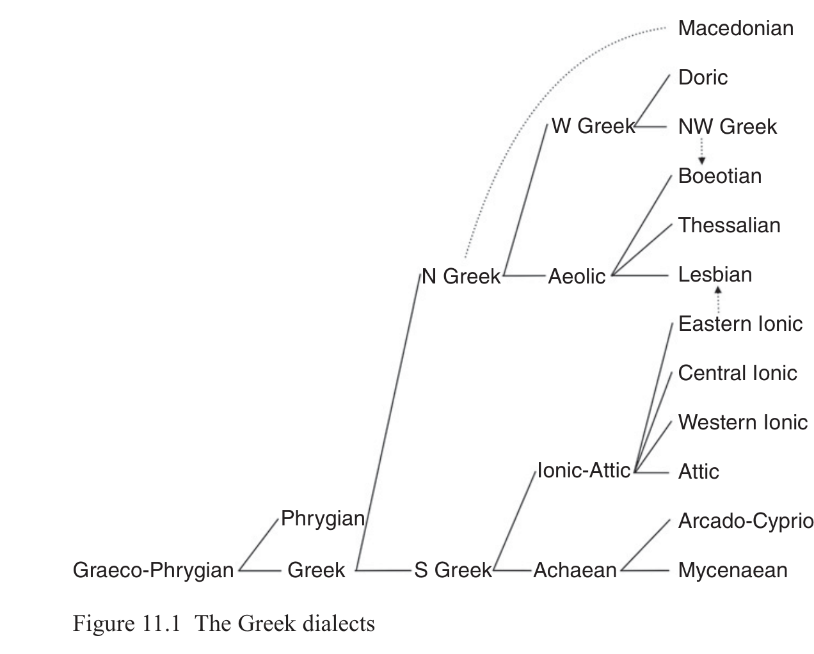

# 11 Greek

Lucien van Beek

<!-- page: 173; pdf-page: 191 -->

## 11.1 Introduction

Greek is one of the earliest attested languages of the IE family, starting with Mycenaean in the fourteenth–twelfth century BCE (on the dating of the tablets, see Driessen 2008). From the so-called Dark Ages (twelfth–ninth century BCE), we have only one written piece of evidence in Greek (Cypriot <i>O-pe-le-ta-u</i>, perhaps mid-tenth century). Starting in the eighth century BCE, alphabetic inscriptions appear in various different dialects and from all corners of the Greek world; moreover, literary Greek starts with the Homeric epics.

From the Mycenaean period onwards, Greek was spoken in the southernmost parts of the Balkan peninsula (Epirus, Thessaly, and further south) and on the islands in the Aegean (Crete, Cyclades) and Ionian seas. Processes of migration and colonization starting as early as the Mycenaean period brought Greek across the Aegean to the Western and Southern Asia Minor coastline, to Cyprus and probably the Levant, and from the eighth century onwards to Sicily, the Italic peninsula, the Rhone delta, Libya, Egypt, and the Black Sea region.

Mycenaean Greek was written in a syllabic script (Linear B). With the destruction of the palaces, Linear B went out of use, but on Cyprus a related syllabary survived, most inscriptions dating to the eighth–fourth century BCE. All other first-millennium varieties of Greek were written in different local forms of the Greek alphabet, which was adopted from the Phoenician<i> abjad</i> during the Dark Ages (the exact date(s) and place(s) of adoption are still debated).1

Ancient Greek is attested in many (at least thirty) different dialects: from the beginning of the Dark Ages until the Classical period, almost every<i> polis</i> had its own local (epichoric) variety and local alphabet, reflecting the political fragmentation of Greece. Broadly speaking, the following dialects are attested in the inscriptional record (cf. Buck 1955), divided into four main groups (see Section 11.3):

This chapter was made possible by a VENI grant from NWO (Netherlands Organization for Scientific Research) for the project<i> Unraveling Homer’s language</i>. 1 An eleventh-century date has recently been proposed (Waal 2018).

<!-- page: 174; pdf-page: 192 -->

• Arcado-Cypriot: Arcadian (Central Peloponnese) and Cypriot (Cyprus);

Mycenaean is closely related to both dialects • Ionic-Attic: Attic (Attica), Western Ionic (Euboea, Oropos), Central Ionic

(Cycladic islands), Eastern Ionic (Chios and the Asia Minor coastline from Smyrna to Halicarnassus) • Aeolic: Thessalian (Thessaly, with five regional varieties), Boeotian

(Boeotia), and Lesbian/Aeolic proper (Lesbos and the Western Asia Minor coastline north of Smyrna) • West Greek, usually subdivided into Doric and North-West Greek dialects

(cf. Mendez Dosuna 2007b): • Doric dialects were spoken around the Saronic Gulf (Megarian,

Corinthian, Eastern Argolic), on the Peloponnese (Western Argolic, Laconian, Messenian), on the southern Aegean islands (Cretan, Theran, Dodecanese (Cos, Rhodes)), and the Ionian islands (including Corcyrean). • North-West Greek dialects were spoken North of the Gulf of Corinth:

Locrian, Phocian, Delphic, Acarnanian, Aetolian, Epirotic.2

• The dialect of Elis has many peculiar features; that of Achaea is marginally

attested. • Various West Greek dialects were transported to colonies in Magna Graecia,

where they developed local characteristics (Syracusan from Corinthian, Tarentine and Heraclean from Laconian, etc.); Cyrenaean developed from Theran. Pamphylian (around present-day Antalya, southern coast of Asia Minor) is fragmentarily attested and difficult to classify (Brixhe 1976; 2013).

A linguistic description of most dialects, however, is hampered in various ways (for a detailed methodological discussion see García Ramón 2017). First, there are large chronological and geographic gaps in the often fragmentary attestations of most dialects. In the archaic period, longer inscriptions (e.g. the Gortyn Law Code) are scarce, and there are not any longer dialect texts from Messenia, Achaea, and large parts the North-Western realm. Secondly, the range of subjects covered in prose inscriptions is narrow (mostly treaties and regulations), and the language is often formulaic or standardized. This may also hold for Mycenaean, where the relative lack of variation between different find spots is suggestive of a bureaucratic register. Third, a tendency toward koineization starts relatively early in most areas, and the tendency to actively promote local dialect peculiarities in official inscriptions led to hyper-dialectal forms. Finally, even with the dialects that are known well (Classical Attic and, to some extent, Eastern Ionic), it must be taken into account that literary texts do not always reflect the actual linguistic situation.

2 Many of these dialects are only fragmentarily attested.

<!-- page: 175; pdf-page: 193 -->

Indeed, utilizing forms of literary Greek poses problems of a different nature. Most archaic forms of poetry are not in local dialect, but in genre-dependent (epic, lyric, drama, etc.) linguistic forms. Specific features became established as markers of certain genres (e.g. feminine participles in<i> -οισα</i> in choral lyric, probably reflecting the prestige of Lesbian poetry). Moreover, all genres share a considerable body of archaic grammatical and lexical features that were absent from most vernaculars. These features may derive from a traditional poetic language (a “poetic Koine”) with roots in the late second millennium.

For these reasons, it is often difficult to assign features attested in literary texts to a specific dialect. Thus, alongside contemporary Lesbian forms, the language of Sappho and Alcaeus contains common poetic forms, borrowings from Ionic and from epic, and probably also artificial forms.3 Epic Greek has a general Ionic phonological veneer and contains many specifically Ionic grammatical and lexical features. However, as the traditional language of verse-composition in hexameters, it also contains large numbers of archaic words, morphemes, and phrases. Some of these can be assigned to dialects other than Ionic (Aeolic, probably also Mycenaean), but often dialect assignment is difficult. Finally, a considerable number of typical Homeric forms are artificial creations (for an overview, see Hackstein 2010).

## 11.2 Evidence for the Greek Branch

This section aims to present all innovative developments (including significant choices between alternatives) that set Proto-Greek apart from other branches.4

In combination with the virtual absence of demonstrably old divergences between the Greek dialects, this enumeration shows that Proto-Greek existed as a real prehistoric linguistic entity, thus disproving Garrett’s provocative claim that there are hardly any “demonstrable and uniquely Proto-Greek innovations in phonology and inflectional morphology” (2006: 141).5

First, some remarks concerning relative chronology. The Mycenaean evidence allows us to assign certain changes to the period after the adoption of Linear B (e.g. *<i>pi̯</i> ><i> pt</i>, or the lenition of initial<i> yod</i>). It is not always easy, however, to distinguish between Proto-Greek innovations and later shared Common Greek developments. An often-cited example is the introduction of *-<i>wot-</i> as the perfect participle suffix. This innovation was formerly reconstructed for Proto-Greek because it occurs in all first-millennium dialects (except for Aeolic, which uses the suffix *-<i>ont-</i>), but Mycenaean shows that Proto-Greek retained *-<i>woh-</i>. However, although the Proto-Greek status of some of the individual changes below may be doubted, it

3 An extensive treatment is Bowie 1981. 4 For a similar but less extensive list, see Clackson 2007. 5 Exaggerated doubts concerning our ability to reconstruct Proto-Greek also surface in Risch’s

work (e.g. Risch 1963).

<!-- page: 176; pdf-page: 194 -->

is clear that they all took place between PIE and attested Greek; hence, the majority will have taken place before the split into North and South Greek.

### 11.2.1 Phonological Innovations Shared by All Greek Dialects

1. Specific laryngeal vocalizations, including

• word-initial before consonant plus vowel (*<i>HCV-</i>): triple reflex<i> e</i>,<i> a</i>,<i> o</i>6

• word-initial before resonant plus consonant (*<i>HRC-</i>): triple reflex<i> e</i>,<i> a</i>,<i> o</i> • between two consonants (*<i>CHC</i>): triple reflex<i> e</i>,<i> a</i>,<i> o</i>; this probably

included word-initial *<i>RHC-</i>, cf.<i> μακρός</i> ‘long’ < *<i>mh₂k-ró-</i> beside <i>μήκιστος</i>,<i> μῆκος</i> • *<i>CRHC</i> > PGr. /CRēC/, /CRāC/, /CRōC/7

• *<i>CRHV</i> > PGr. /CaRV/ (with coloring of V by the laryngeal)8

• the development of *<i>CiHC</i> and *<i>CuHC</i> remains disputed:<i> θῡμός</i> ‘spirit’

< *<i>dʰuh₂mó-</i> ‘smoke’ (Lat.<i> fūmus</i>, Ved.<i> dhūmá-</i>, also Hitt.<i> tuhhuwai-</i>, all ‘smoke’) is a certain example of a long-vocalic reflex. On the other hand, Ved.<i> jī́vati</i>,<i> jīvá-</i> and Lat.<i> vīvō</i>,<i> vīvus</i> seem to imply a vocalization *<i>Ci̯ōC</i> < *<i>Ci̯h̥ 3C</i> for the cognate formations<i> ζώω</i> ‘live’,<i> ζωός</i> ‘alive’ • *-<i>ih₂</i> > -<i>i̯a</i> at word end (nom.sg. of the fem. motion suffix), also *-<i>ih₁</i> > -<i>i̯e</i>

(only in dual *<i>h₃ekʷ-ih₁</i> > Hom.<i> ὄσσε</i> ‘eyes’); it is debated whether this change was phonetically regular or analogical. 2. The double reflex of *<i>i̯-</i>, which merges with *<i>di̯-</i> (plus *<i>gi̯-</i>, *<i>gʷi̯-</i>) in one

subset of lexemes that have correspondences with *<i>i̯-</i> in other IE languages (e.g.<i> ζέω</i> ‘boil’, Myc.<i> ze-so-me-no</i>;<i> ζυγόν</i> ‘yoke’ and<i> ζεύγνυμι</i> ‘connect’, Myc.<i> ze-u-ke-si</i>), but was retained and developed into<i> h-</i> in another subset (relative pron.<i> ὅς</i>, Myc.<i> jo-</i>,<i> o-</i> beside Ved.<i> yáḥ</i>;<i> ἧπαρ</i> ‘liver’ beside Lat. <i>iecur</i>). The distribution between both reflexes, which is the same in all Greek dialects (including Mycenaean), represents an exclusive common innovation of Proto-Greek. The exact conditioning factor, probably the

6 The divergent initial reflex of Doric<i> ϝικατι</i> ‘twenty’ ~ Classical<i> ει῎κοσι</i> < *<i>h₁u̯i-Hḱm̥ t-i</i> (with

problematic<i> o</i> < *<i>m̥</i> ) is unexplained, but this does not suffice to show that the laryngeals were retained until after PGr. 7 The divergent form<i> πρῶτος</i> vs. West Greek<i> πρᾶτος</i> of the ordinal ‘first’ must reflect a contracted

superlative PGr. *<i>pro-ato-</i> (cf. Cowgill 1970: 123, 148). There is some evidence for a disyllabic reflex of *<i>CRHC</i>:<i> τρᾱχύς</i> ‘rough’ < *<i>dʰr̥ h₂gʰ-u-</i>,<i> θράσσω</i> ‘stir’ < *<i>dʰr(e)h₂gʰ-</i>, but<i> ταράσσω</i> ‘id.’ < *<i>dʰr̥ h₂gʰ-</i>. It is often claimed that the disyllabic treatment occurred only when the liquid was accented (e.g. Rix 1992: 73), but in my view this is uncertain. Another plausible possibility is that the disyllabic reflex was regular before /CC/, while the long vowel reflex occurred before /CV/ (van Beek 2021a). 8 *<i>CRh₃V-</i> may have yielded PGr. /CoRV/, with rounding of the anaptyctic vowel caused by the

following labio-laryngeal (cf.<i> μολει῀ν</i> ‘come’,<i> πορει῀ν</i> ‘give’ < *<i>ml̥ h₃-e/o-</i>, *<i>pr̥ h₃-e/o-</i>). The Lesbian form<i> χόλαισι</i> ‘are slack’ (Alcaeus) corresponding to Classical<i> χαλῶσι</i> (<i>χαλάω</i>) is not sufficient evidence for positing a distinct reflex for Aeolic (<i>pace</i> Peters 1980: 28).

<!-- page: 177; pdf-page: 195 -->

presence or absence of an initial laryngeal (cf. García Ramón 1999), is still disputed (cf. van Beek 2019). 3. Loss of word-final stops, including stop clusters (voc.<i> ἄνα</i> ‘lord’

< *<i>wanakt</i>). 4. Restrictions on allowed stop clusters, including developments of “thorn

clusters” (two consecutive stops are allowed only if the second stop is dental, e.g.<i> κτ</i> or<i> πτ</i>; while<i> τπ</i>*,<i> τκ</i>*,<i> κπ</i>*,<i> πκ</i>* are disallowed). This situation is pre-Mycenaean in view of e.g.<i> e-qi-ti-wo-e</i> /ekʷʰtʰiwohes/ perf.ptc. ‘perished’ from PIE *<i>dʰgʷʰei-</i>. 5. Development of voiceless aspirates /tʰ kʰ pʰ kʷʰ/ from the PIE “mediae

aspiratae”, already completed in Mycenaean (cf.<i> te-o</i> /tʰe(h)os/ ‘god’ from PIE *<i>dʰh₁s-ó-</i>; but contrast Section 11.4 on Macedonian and Phrygian). 6. Development of a circumflex accent: the pitch on long vowels may fall on

the first mora (circumflex accent) or on the second mora (acute accent). The distinction was probably phonologized when early contractions took place, not long after the loss of intervocalic laryngeals (e.g.<i> τιμῆς</i> gen.sg. < *<i>-éh₂-os</i> vs.<i> τιμή</i> nom.sg. < *<i>-éh₂</i>). 7. The Law of Limitation: the pitch accent can be assigned only to the last

four morae of a prosodic word, and only to the last three morae if the final syllable is accentually long. 8. Lenition *<i>s</i> ><i> h</i> in different positions: (a) word-initially before vowels or

<i>R</i> (= any liquid, nasal, or glide); (b) between vowels and in the intervocalic clusters *-<i>sR-</i> and *-<i>Rs-</i> (probable exception: -<i>rs-</i> and -<i>ls-</i> were not lenited if the directly preceding syllabic nucleus carried the accent). 9. The syllabic nasals yielded a nasal vowel [ɑ̃] or [ə̃] in Proto-Greek. This

normally merged with /a/ in all dialects, but in some dialects we also find /o/ under specific, yet still uncertain, conditions (perhaps in a labial environment).9

10. Cowgill’s Law, i.e. *<i>o</i> ><i> u</i> in certain environments involving labials and

nasals. In various words this raising occurs in all Greek dialects, e.g.<i> νύξ</i> ‘night’ < *<i>nokʷt-</i>. However, not all dialects show this raising in the same words (cf. Ion.-Att.<i> ὄνομα</i> vs. Dor. Aeol.<i> ὄνυμα</i>), and the conditions are still in part uncertain; see Vine 1999. The laryngeal changes under (1) are mostly specific to Greek, but some are shared with Phrygian (Section 11.4.2). This may also hold for developments (3) and (4), which are equally attested in Phrygian, although the Greek loss of final stops is difficult to date (the Linear B syllabary does not make it possible to determine whether they were present in Mycenaean or not; contrast also Phryg. voc.<i> -vanak</i> with Gr.<i> ἄνα</i> ‘Lord!’). The Law of Limitation is difficult to date as we have no evidence for accentuation in most dialects.

9 Discussion of the evidence in Thompson 1996–7: 316–20.

<!-- page: 178; pdf-page: 196 -->

A development *<i>CRHV-</i> > *<i>CaRV-</i> is also found in Italic and Celtic, but it is probably independent, as in those branches<i> a-</i>coloring of anaptyctic schwa is unsurprising. The vocalization in (9) may be independent of that in Indo-Iranian, as the Greek outcomes /a/, /o/ postdate the Graeco-Phrygian stage (*<i>n̥</i> > Phr.<i> an</i>).

Certain developments involving clusters of stop plus glide are also likely to be Proto-Greek: 11. Intervocalic *<i>t(h)i̯</i> merges with PGr. *<i>ts</i> (Ion.-Att.<i> μέσος</i> < *<i>medʰi̯os</i>,<i> τόσος</i>

< *<i>toti̯os</i>; Arc.<i> μέσος</i>; Myc.<i> to-so</i>; Boeot.<i> μέττος</i>; most other dialects <i>μέσσος</i>; older Cretan may preserve /ts/). In productive formations, *<i>t(h)i</i> was restored; its reflex merged with that of *<i>k(h)i̯</i> in most dialects but not in Mycenaean.

### 11.2.2 Morphological Innovations: Verbal Stem Formation and Endings

12. Development of an aorist in -<i>θη-</i>, in addition to the inagentive aorist in -<i>η-</i>

(which reflects “stative” *<i>-eh₁-</i>). The exact origin and genesis of this formation are still disputed. 13. Creation of a<i> κ-</i>perfect, where -<i>κ-</i> was originally found only in the indic.

sg.10 Greek productively extended this morpheme (perhaps originally an aorist marker, cf. unreduplicated Lat.<i> fēcī</i>,<i> iēcī</i> beside<i> ἔθηκα</i>,<i> ἕηκα</i>), first to intransitive perfects of long-vocalic roots (e.g.<i> πέφῡκα</i>,<i> ἕστηκα</i>), later also to transitive perfects (e.g.<i> λέλῡκα</i>) and other stem types. 14. Replacement of the perf.act.3pl. ending *-<i>ēr</i> with *<i>-n̥ ti</i>, reflected as<i> -ατι</i> in

WGr. dialects and as<i> -ᾰσι</i> in Arcadian (Buck 1955: 112). This ending was later adapted to *<i>-anti</i> (> Att.-Ion.<i> -ᾰσι</i>) in most dialects. 15. The “alpha-thematic” sigmatic aorist paradigm, which was based on the

1sg. after the word-final change *-<i>m̥</i> > -<i>a</i>; the 3sg. received the thematic ending -<i>e</i> after the loss of *-<i>t</i>. 16. Replacement of the stative endings by the middle endings 3sg.<i> -to</i>, 3pl.<i> -nto</i>. 17. Creation of new secondary middle endings 1sg. *-<i>mān</i> (unique to Greek)

and 2sg. *-<i>so</i> (as in other branches, including Italic and Germanic).11

18. Creation of primary middle endings in<i> -i</i>. 19. Development of a medio-passive perfect stem (see Section 11.4.2). 20. Creation of an active pluperfect with a suffix *-<i>e-</i> and alpha-thematic

endings (Hom.<i> ἐπεποίθεα</i>).12

10 Cf. Att.<i> ἑστώς</i>;<i> τεθνεώς</i> beside<i> ἕστηκα;τέθνηκα</i>. 11 It cannot be excluded, however, that the PIE stative endings 1sg. *-<i>h₂</i>, 2sg. *-<i>th₂o</i> were

originally distinct from middle *-<i>mh₂</i>, 2sg. *-<i>so</i>. Cf. Kortlandt 1981. 12 However, the antiquity and spread of this formation are difficult to assess. The irregular Homeric

pluperfect<i> ᾔδη</i> ‘knew’ is certainly old; it has been compared with PCelt. *<i>wēdī</i> < *<i>u̯eid-eh₁-</i> by Schrijver (1999).

<!-- page: 179; pdf-page: 197 -->

21. Certain productive reduplication patterns:

a. default<i> Ce-</i> (perfect stem),<i> Ci-</i> (present stem) for roots with simple onsets b. “Attic reduplication” in roots starting with a vowel (e.g.<i> ἐλυθ-</i> →

<i>ἐληλυθ-</i>) c. full reduplication in roots of the structure /VC-/ (e.g.<i> ἀρ-</i> →<i>ἀρηρ-</i>) d. /e-/ in the perfect of roots with complex onsets (e.g. perf.mid.<i> ἔζευγμαι</i>). 22. The infinitive endings:

a. thematic *-<i>e-hen</i> (e.g. Myc.<i> e-ke-e</i> /ekʰehen/ ‘have’, Att. -<i>ειν</i>, etc.) b. athematic *-<i>men</i>, *<i>-menai</i> (Lesb.<i> ἔμμεναι</i> ‘be’) and *<i>-hen</i> (Myc.<i> te-re-ja-e</i>

/teleiāhen/ ‘fulfill’), *<i>-henai</i> (Att.<i> ι҆έναι</i> ‘go’)13

c. *-<i>(t)sai</i> (<i>s-</i>aorist) d. *<i>-stʰai</i> (middle). 23. Creation of a denominative factitive class in PGr. -<i>ō-</i> (type<i> δηλόω</i>), see

Tucker (1990).

### 11.2.3 Morphological Innovations: The Cases, Nominal Endings, and Nominal Stem Formation

24. The PGr. dat.-loc.pl. ending<i> -si</i> (for PIE *<i>-su</i>) arose by analogical intro-

duction of<i> -i</i> from the loc.sg. ending, probably aided by instr.pl. *-<i>bʰi</i>.14

25. Case syncretism: Proto-Greek merged the dative and locative plural of all

declensions (PGr. *-<i>oisi</i>, -<i>āsi</i>, -<i>si</i>). 26. Greek has various clitics and suffixes marking spatial relations: *-<i>de</i>

cliticized to the accusative of direction, e.g.<i> οι҆῀κόνδε</i> ‘home’ (already Mycenaean), *-<i>tʰi</i> (locative, e.g.<i> οι῎κοθι</i> ‘at home’), *-<i>tʰen</i> (ablative, e.g. <i>παντόθεν</i> ‘from all sides’), but also local *-<i>tʰn̥</i> > -<i>θα</i> as well as *-<i>tʰe</i> after local adverbs; at least *-<i>tʰi</i> and *-<i>tʰen</i> originated in adverbial pronouns (cf. <i>πόθι</i> ‘where’,<i> πόθεν</i> ‘whence’) and were innovations of Proto-Greek. Proto-Greek had more innovations (e.g. the introduction of nom.pl. endings -<i>oi</i>, -<i>ai</i> in the first and second declension, the extension of the 3rd decl. n.pl. ending -<i>ᾰ</i>< *-<i>h₂</i> to thematic stems replacing the reflex of *-<i>eh₂</i>, or the generalization of the 3rd decl. gen.sg. ending<i> -os</i> to the exclusion of *-<i>es</i>). However, since most of them are shared with various different other branches and fairly trivial developments, they cannot be utilized for purposes of subgrouping.

In nominal stem formation, innovations include: 27. The suffixes -<i>ēu̯ -</i> (masculine persons or professions), -<i>ád-</i> and -<i>íd-</i> (denoting

appurtenance).

13 For the relation between *<i>-hen(ai)</i> and *<i>-men(ai)</i>, see van Beek in press. The suffixes *-<i>men-</i>

and *-<i>hen-</i> could both be extended with -<i>ai</i> under certain specific conditions. In Lesbian, -<i>μεναι</i> occurs only with monosyllabic stems containing a short vowel. 14<i> Pace</i> Garrett (2006: 140), this is not “a trivial adaption”.

<!-- page: 180; pdf-page: 198 -->

28. The extended form in<i> -t-</i> (Classical -<i>ματ-</i>, -<i>ατ-</i>) of the suffixes *-<i>mn̥ -</i>,

*-<i>r/-n-</i> in neuter nouns. 29. The extended form of the comparative suffix *<i>-is-on-</i> > -<i>ίων</i> (unattested in

Myc., though). 30. The use of *-<i>tero-</i> as a comparative suffix with gradable adjectives. 31. The superlative suffix *<i>-(t)m̥ to-</i> ><i> -(τ)ατος</i>, replacing *<i>-(t)m̥ Ho-</i> (cf. Lat.

<i>intimus</i> ‘innermost’, Ved.<i> ántama-</i> ‘nearest’).

### 11.2.4 Pronouns

32. Acc.pl. of the personal pronouns in<i> -mé</i> (generalized orthotonic forms

*<i>n̥ s-mé</i>, *<i>us-mé</i>). 33. Reshaping of the nom.pl. *<i>u̯ei</i>, *<i>i̯us</i> of the personal pronouns after the acc.:

*<i>n̥ sm-es</i>, *<i>usm-es</i> (cf. Dor.<i> ἁμές</i>,<i> ὑμές</i>; Aeol.<i> ἄμμες</i>,<i> ὔμμες</i>). 34. The dative of personal pronouns in -<i>i(n)</i>: clitic Ion.-Att.<i> ἧμιν</i>, orthotonic

Dor.<i> ἁμίν</i>, Lesb.<i> ἄμμι(ν)</i> (contrast Ved. dat.<i> asmé</i> < *<i>-me-i</i>). 35. Creation of a stem form<i> σφε-</i> beside<i> σφι(ν)</i> ‘to them(selves)’, probably

a clitic form of PIE *<i>se-bʰei</i>. 36. Grammaticalization of anaphoric/demonstrative<i> οὗτος</i>,<i> αὕτη</i>,<i> τοῦτο</i> (inter-

mediate deixis) from *<i>só (h₂)u</i> plus *<i>to-</i> (the first part corresponds to Ved. <i>sá u</i> and the nom.sg. pronoun PIr. *<i>hau</i> (OAv.<i> huuō</i> /hau/, OPers.<i> hauv</i>), Ved.<i> asáu</i>). 37. Creation of the demonstrative<i> κει῀νος</i> /<i> ἐκει῀νος</i> (distal deixis). 38. Reflexive<i> αὐτός</i> ‘same; self’, grammaticalized from *<i>h₂eu</i> ‘again’ plus

anaphoric-demonstrative *<i>to-</i>. 39. Creation of a negation<i> οὐκ(ί)</i>,<i> οὐ</i>, probably from *<i>(ne)</i>... *<i>h₂oi̯u kʷid</i>

(Cowgill 1960).

### 11.2.5 The Lexicon and Remaining Innovations

Lexical innovations are more difficult to utilize for the purpose of subgrouping, but they may complement the picture gained from the phonological and morphological innovations. Some typical lexical innovations of Greek are (a full list would be much longer): 40. The verb ‘wish, choose’ has a root PGr. *<i>gʷel-</i> or *<i>gʷol-</i> instead of PIE

*<i>u̯elh₁-</i> (<i>βούλομαι</i>, Arc., Eub.<i> βόλομαι</i>, Thess.<i> βέλλομαι</i>, WGr.<i> δείλομαι</i>, etc.). 41. The verb ‘die’ has the root PGr. *<i>tʰnā-</i>, *<i>tʰana-</i>. 42. The word for ‘guest, stranger’ is PGr. *<i>ksenwo-</i>. A large amount of the Greek lexicon was borrowed from the indigenous language(s) of the Hellenic peninsula. Beekes (2014) views this as one single non-Indo-European language which he calls “Pre-Greek”, but while the Greek lexicon indeed has an important non-Indo-European element, it is difficult to

<!-- page: 181; pdf-page: 199 -->

determine when, where, and from how many different varieties this material was taken. The forms<i> πύργος</i> ‘fortification’ < *<i>bʰ(o)rǵʰ-</i> and<i> τύμβος</i> ‘grave’ < *<i>dʰ(o)mbʰ-</i> presuppose an Indo-European donor language.

## 11.3 The Internal Structure of Greek

The Ancients distinguished four main dialects of Greek: Attic, Ionic, Doric, and Aeolic. As they recognized that Attic and Ionic were very closely related, a basic three-way distinction is implied (also reflected in the three Hellenic tribes and their ancestors<i> Δῶρος</i>,<i> Ξοῦθος</i>, and<i> Αι῎ολος</i> in Hesiod fr. 9 M-W). However, ancient scholarship was interested mainly in literary languages, not in spoken dialects (see Tribulato 2019).

After the decipherment of the Cypriot syllabary, however, scholars quickly realized that Arcadian and Cypriot were much more closely related to each other than to Thessalian and Boeotian, and that the Ancients used “Aeolic” as a catchall term for anything that was not Ionic, Attic, or Doric. Even so, the threefold distinction (and the inclusion of Arcado-Cypriot among the Aeolic dialects) was largely maintained.15 In fact, the theory that Ionians, Aeolians, and Dorians existed as distinct ethnic and linguistic groups as early as 2000 BCE, and that they migrated into the Hellenic peninsula in three chronologically distinct waves (Kretschmer’s<i> Wellentheorie</i>), held sway for a long time.

This picture was changed radically by two landmark studies, Porzig 1954 and Risch 1955; see also Risch 1963. Both scholars independently showed that Arcado-Cypriot was a distinct dialect group with close genetic ties to Ionic-Attic. Moreover, both argued that Asia Minor Aeolic (Lesbian) had been influenced substantially by neighboring Ionic dialects, and that East Thessalian is the most conservative Aeolic dialect. In addition, Risch made a plausible argument for reconstructing a first split into North Greek and South Greek (comprising Arcado-Cypriot and Ionic-Attic) in the early second millennium.16 It is now widely accepted that South Greek is characterized by the following exclusive innovations: • assibilation *<i>t</i>⁽<i>ʰ</i>⁾<i>i</i> > /si/ (e.g. 3sg.<i> δίδωσι</i>) • simplification PGr. *<i>ts</i> and *<i>ss</i> ><i> s</i>, also after short vowels (e.g.<i> μέσος</i>)17

15 For a good summary of earlier works on Greek dialect classification and subgrouping, see

Morpurgo Davies 1992. 16 Many scholars still use the terms West Greek and East Greek (cf. Porzig 1954) instead of Risch’s

North Greek and South Greek, respectively. In order to avoid confusion, I stick to Risch’s terminology and reserve “West Greek” for the dialect group that comprises all Doric and Northwest Greek dialects. 17 According to Risch, *<i>ts</i> ><i> s</i> fed the assibilation *<i>ti</i> ><i> si</i>, but the antiquity of (*<i>ts</i> >)<i> ss</i> ><i> s</i> cannot

be proven because Linear B does not write geminates (Myc.<i> to-so</i> corresponding to Ion.-Att. <i>τόσος</i>).

<!-- page: 182; pdf-page: 200 -->

• athematic infinitives *-<i>(h)én</i>, *-<i>(h)énai</i> (Dor. and Aeol. -<i>μεν</i>, -<i>μεναι</i>)18

• correlative temporal adverbs in /-te/, e.g.<i> τότε</i> ‘then’ (Aeol. -<i>τα</i>, Dor. -<i>κα</i>) • temporal conjunction<i> ει҆</i> (Dor. Aeol.<i> αι҆</i> ), but Cypr. has<i> e-</i> • nom.pl.<i> τοί</i>,<i> ταί</i> of the demonstrative replaced by<i> οι҅</i>,<i> αι҅</i> (probably also

Aeolic). There are few (if any) old innovations that are characteristic for all North Greek dialects. The best candidate is the<i> e-</i>vocalism of the present stem ‘want’ (Thess. <i>βέλλομαι</i>, WGr.<i> δείλομαι</i>, etc.), but it remains uncertain whether this is a shared innovation rather than an archaism. It is likely that certain distinctive Aeolic innovations occurred between the separation of South Greek and the twelfth century (Section 11.3.7).

Following Risch, we may distinguish three periods: a. Mycenaean period (relative stability, probably increasing local differentiation) b. Dark Ages (high mobility; rapid language change, convergence)

c. ninth century BCE until the Classical period (the dialects occupy their histor-

ical locations; colonization movements; increasing local differentiation). Various linguistic innovations can be assigned to one of these periods, based on (1) relative chronology, (2) linguistic geography, and (3) their presence or absence in Mycenaean.19

### 11.3.1 Mycenaean

Mycenaean is clearly a South Greek dialect, as evidenced by the assibilation of voiceless dental stops (e.g.<i> di-do-si</i> /didonsi/ ‘they give’), the conjunction <i>o-te</i> ‘when’, and an athematic infinitive in /-hen/ (<i>te-re-ja-e</i> /teleiāhen/ ‘fulfill’).

Apart from this, however, the position of Mycenaean relative to the first-millennium dialects is less clear.20 Arcadian and Cypriot are closely related dialects, but it must be borne in mind that most exclusive Arcado-Cypriot innovations are not attested in Linear B (see below). An exception in this respect might be Myc.<i> pe-i</i> /spʰehi/, an innovation which arose by adding the dat.pl. ending to acc. *<i>spʰe</i>, replacing the older form<i> σφι</i> (Ion., Hom.). This form is continued in Arcadian<i> σφεσιν</i> (<i>SEG</i> 37, 470.15) with<i> -hi</i> replaced by -<i>si(n)</i>, and<i> σφεις</i> (<i>IG</i> V 2, 6.10) with added<i> -s</i> after contraction.21

18 But cf. van Beek in press, arguing that<i> -μεν</i> was preserved longer also in South Greek, and that

Proto-Greek had both *<i>-hen</i> and *<i>-men</i>; the choice depended on whether the paradigm had ablaut or not. 19 As for linguistic geography, features shared exclusively by non-contiguous dialects are plaus-

ibly analyzed as shared innovations stemming from an earlier period when these dialects were in direct contact. 20 See Cowgill 1966 for an overview of earlier literature on the position of Mycenaean. 21 See the discussion in Morpurgo Davies 1992: 429–30.

<!-- page: 183; pdf-page: 201 -->

Risch (e.g. 1955) claimed that there were no noticeable differences between Mycenaean and Proto-Ionic in the fourteenth or thirteenth century BCE. For this, he has been widely criticized (see Cowgill 1966). It is difficult to disprove that all characteristic innovations of Ionic-Attic (beyond general South Greek features) took place after the Mycenaean period, but Mycenaean has also undergone changes that are not paralleled in any first millennium dialect (cf. García Ramón 2016: 242–3):22

• raising<i> e</i> ><i> i</i> before labial sounds • palatalization of /sk/, as evidenced by the orthographic variation<i> a-ke-ti-ri-ja</i>

~<i> a-ze-ti-ri-ja</i> /(*)askētriai/ (Méndez Dosuna 1993) • neuter nouns in<i> -mo(t-)</i> (e.g.<i> pe-mo</i> ‘seed’) instead of<i> -ma(t-)</i>. Several scholars have viewed these features as reflecting dialectal or sociolinguistic differences among Mycenaean scribes (“normal” vs. “special” Mycenaean, in the terms introduced by Risch 1966; monographic discussion in Hajnal 1997), but the evidence is far from clear, and it has alternatively been explained by Thompson (1996–7) as orthographic variation reflecting language change in progress.

### 11.3.2 Arcado-Cypriot

Arcadian and Cypriot are closely related South Greek dialects, but are they closer to each other than to Mycenaean or Proto-Ionic? Morpurgo Davies (1992) has shown that Proto-Arcado-Cypriot can be sensibly reconstructed. The following features are relevant:23

• raising *<i>en-</i>,<i> on-</i> ><i> in-</i>,<i> un-</i> in the preverbs/prepositions<i> ἐν</i>,<i> ὀν</i> (= Att.<i> ἀνά</i>) • word-final<i> -o</i> ><i> -u</i> and diphthongization in the gen.sg. -<i>ᾱο</i> > Arc. -<i>αυ</i>, Cypr. /-au/ • analogical nom.sg. -<i>ης</i> of nouns in -<i>εύς</i> (after acc. -<i>ην</i>) • demonstrative<i> ὁνυ</i> (= Ion.-Att.<i> ὅδε</i>) •<i> ἀπυ</i> and<i> ἐξ</i> governing the dative, not the genitive • preverb/preposition /pos/ (Arc.<i> πος</i>, Cypr.<i> po-se</i>) instead of Ionic-Attic<i> πρός</i> • generalization of the by-form /kas/ (Arc.<i> κας</i>, Cypr.<i> ka-se</i>) of the conjunc-

tion<i> καί</i>. With the exception of some Pamphylian forms, the above isoglosses are exclusive.24 Interestingly, most of the common features of Arcado-Cypriot

22 Here might also be mentioned the desyllabification of /i/ before vowels and the subsequent

palatalization of velars, e.g.<i> su-za</i> /sūtʃa/ < *<i>sūki̯ā</i> < *<i>sūkiā</i> ‘fig tree’, but note that desyllabification of /i/ also occurs in Aeolic dialects. 23 Cf. García Ramón (2010: 227–9; 2017: 78–9). This list excludes lexical choices, which mostly

concern words otherwise preserved only in epic Greek, e.g.<i> αι҆῀σα</i> ‘lot; fate’. Unlike García Ramón, I exclude the palatalization of *<i>kʷi-</i> (cf. Arc. ͷ<i>ις</i>, Cypr.<i> si-se</i>, Att.<i> τις</i>) because it is not an exclusive isogloss with Arcadian, and the regular reflex of *<i>r̥</i> (Arc. has<i> ορ</i>, but the evidence from Cypriot is somewhat ambiguous). 24 Another salient feature of Arcado-Cypriot, the athematic inflection of contract verbs, is shared

with Aeolic (Thessalian, Lesbian). It is unclear to what extent this represents a shared

<!-- page: 184; pdf-page: 202 -->

seem to be post-Mycenaean innovations: this is certain for nom.sg. -<i>ης</i> beside Myc.<i> -e-u</i> and for the syntax of<i> ἀπυ</i> and<i> ἐξ</i>. As for the raising of<i> en-</i> and of word-final<i> -o</i>, these phenomena are not attested in Mycenaean spelling. Finally, note that Myc. has disyllabic<i> po-si</i> corresponding to /pos/, and that it may reflect either *<i>poti</i> or *<i>pr̥ ti</i>.

Various features in which Arcadian and Cypriot diverge may be plausibly assigned to the period after 1200. Thus, the labial reflex of *<i>kʷe</i> in Cypr. <i>pe-i-se-i</i> ‘will pay’ (Att.<i> τείσει</i>) is the default outcome of a labiovelar, while the Arc. reflex /tˢe/ can be part of a development shared with the continuum of West Greek dialects and Ionic-Attic.

As we saw, Mycenaean has a few innovations not present in Arcadian and Cypriot, but the three dialects also share the exclusive innovation /spʰehi/ for /spʰi/. Thus, both first millennium dialects reflect vernaculars spoken in the Peloponnese that diverged slightly from the administrative language written in Linear B but were closely related to it. The common innovations of Arcado-Cypriot may have come into being in the course of the thirteenth or twelfth century BCE, before the migration to Cyprus.

### 11.3.3 Ionic-Attic

Proto-Ionic can be reconstructed fairly well. Exclusive shared innovations between Attic and all Ionic dialects include: • fronting *<i>ā</i> > /æː/ • Quantitative Metathesis (there were two rounds: one preceding and another

following intervocalic<i> w-</i>loss) • nom. and acc.pl.<i> ἡμει῀ς</i>,<i> ἡμέας</i> and<i> ὑμει῀ς</i>,<i> ὑμέας</i> replacing PGr. forms in *-<i>es</i>,

-<i>e</i> (Lesb.<i> ἄμμες</i>,<i> ἄμμε</i>) • dat.pl. orthotonic<i> ἡμι῀ν</i>,<i> ὑμι῀ν</i> (replacing<i> -i(n)</i>, cf. Lesb.<i> ἄμμ</i>ῐ) • athematic imperf.3pl. (and pluperfect) -<i>σαν</i>, from the sigmatic aorist,

replacing *<i>-(h)an</i> • 3sg. *<i>ēs</i> ‘was’ (etymologically expected from *<i>e-h₁es-t</i>, and attested in WGr.

<i>ἦς</i>) was replaced by<i> ἦν</i> (originally 3pl. ‘were’); the latter was replaced as a 3pl. form by<i> ἦσαν</i> • certain typical contractions (Buck 1955: 37–43), notably *<i>ae</i> > Ion.-Att.<i> ᾱ</i>

(Dor.<i> η</i>). Proto-Ionic probably underwent most of these exclusive innovations before the Ionian migrations to Asia Minor, which are conventionally dated to the mideleventh century.25 A number of further innovations are isoglosses, due to

innovation. The athematic 3pl. secondary ending /-an/ (Arc.<i> ἐθεαν</i>, Cypr.<i> ka-te-ti-ja-ne</i>) is also found in Boeotian and is reconstructible for Proto-Ionic. 25 In addition, Proto-Ionic underwent an early loss of word-initial and intervocalic *<i>w</i>.

<!-- page: 185; pdf-page: 203 -->

convergence, with neighboring West Greek dialects; they may have spread in the twelfth or eleventh century: • word-internal *<i>r̥</i> ><i> αρ</i> (<i>ρα</i> in epic Greek or analogical, van Beek 2013; 2022)26

• the 1st compensatory lengthening and isovocalic contractions, leading to

a seven-vowel system • the 2nd compensatory lengthening • dental outcomes of labiovelars before front vowels (cf. also Arc.) • thematic inflection of contract verbs • mid.3sg. -<i>ται</i> ← *-<i>toi</i> (also Aeolic) • impv.act.3pl. -<i>ντων</i> < -<i>ντω</i> +<i> ν</i> (also in Delphic, Cretan, Theran; contrast -<i>ντω</i>

in most other dialects, Lesb. -<i>ντον</i>). It remains uncertain as to what extent Proto-Ionic had already innovated with respect to Mycenaean-like dialects in the thirteenth century. The apparently clear distinction in the reflexes of *<i>r̥</i> (Ionic-Attic<i> αρ</i>, Mycenaean spelled with the<i> o-</i>series) is difficult to use as evidence because a retention of *<i>r̥</i> in Mycenaean cannot be excluded, and the same might be true of Proto-Ionic at this date (van Beek 2013; 2022). The outcome of secondary *<i>t(ʰ)i̯</i> was Proto-Ionic *<i>ts</i> but is spelled with the<i> s-</i>series in Mycenaean (e.g.<i> pe-de-we-sa</i> ‘with feet’), which may represent either /ts/ (Crespo 1985) or /ss/ (Viredaz 1993); in the latter case, Mycenaean would have innovated with respect to Proto-Ionic.

With the migrations across the Aegean, various local varieties of Ionic developed. The main division is between Western dialects (subdivided into Attic and Western Ionic) and Eastern dialects (subdivided into Central and Eastern Ionic); it includes the following characteristic innovations: • *<i>ts</i> ><i> σσ</i> (Eastern and Central Ionic),<i> ττ</i> (Attic, Western Ionic) • loss of *<i>w</i> after<i> R, s</i> with compensatory lengthening (Eastern Ionic), or

without compensatory lengthening (Attic, Western Ionic) • *<i>rs</i> ><i> ρρ</i> (Attic, Western Ionic) • reversion *<i>æː</i> ><i> ā</i> after<i> i</i>,<i> e</i>,<i> r</i> (Attic, perhaps Western Ionic) • loss of<i> h-</i> (Eastern Ionic) • rhoticism, i.e.<i> s</i> ><i> r</i> between vowels and word-finally (Western Ionic). Some of these developments are shared with neighboring dialects (Boeotian, Lesbian).

### 11.3.4 The Unity of Aeolic and the Position of Proto-Aeolic

The need to reconstruct Proto-Aeolic has been forcefully defended by García Ramón (2010), reacting to the superficial treatment by Parker (2008).27 García

26 It is uncertain whether<i> αρ</i> or<i> ρα</i> was the regular reflex in mainland West Greek dialects, but<i> α</i> as

an anaptyctic vowel is certain. 27 On this issue, and on the internal subgrouping of Aeolic, see also the unpublished dissertation by

Scarborough (2016).

<!-- page: 186; pdf-page: 204 -->

Ramón argues that the Aeolic dialects were linked in the twelfth century BCE not only by shared innovations but also by a number of common selections among different alternatives and common retentions.28 Clear shared innovations exclusive to all three Aeolic dialects are • *<i>r̥</i> ><i> ρο</i> • labial reflexes of the labiovelars before front vowels29

•<i> ρι</i> ><i> ρε</i> (Lesb.<i> Δαμοκρετω</i> for class.<i> Δημοκρίτου</i>, Thess.<i> κρεννεμεν</i> for class.

<i>κρίνειν</i>, Boeot.<i> τρέπεδδα</i> ‘table’ from *<i>tripedza</i>, cf. Hsch.<i> τρίπεδδαν</i>) • the sigmatic aorist in -<i>σσ-</i> of stems in a vowel, analogically extended from

stems in<i> -s-</i> • the perfect participle in -<i>οντ-</i>.30

The change *<i>r̥</i> ><i> ρο</i> has gained significance in the light of my investigation of the place of the anaptyctic vowel (van Beek 2013; 2022): the regular reflex is<i> ρο</i> in Aeolic dialects, but not in Mycenaean (which has either *<i>r̥</i> or<i> ορ</i>) or Arcadian (<i>ορ</i>). This makes *<i>r̥</i> ><i> ρο</i> an exclusive innovation of all three Aeolic dialects, which may be dated to the late Mycenaean period or before.

The following features might be added: • 3rd declension dative plural in -<i>εσσι</i>31

• feminine<i> ι῎α</i> ‘one’ (Lesb., Thess., Boeot.) vs.<i> μία</i> (all other dialects)32

• thematic inf. -<i>εμεν</i> (Thess. and Boeot.), but only if Lesb. -<i>ην</i> is due to Ionic

influence • temporal adverbs in -<i>τα</i> (Lesb. and Thess.), if Boeot. -<i>κα</i> is from West

Greek.33

According to Risch (1963), more fully elaborated by García Ramón (1975), there is no hard evidence for an Aeolic subgroup in the Mycenaean era. García Ramón dates the above innovations to the twelfth or even eleventh century.

28 I agree with García Ramón that common choices between alternatives are also significant for

subgrouping, but I disagree with his emphasis on the significance of common retentions (such as the patronymic adj. in -<i>ιος</i>, which is also preserved in Mycenaean but replaced by the gen. of the father’s name in WGr. and Ion.-Att.). 29 Exceptions are the clitics<i> τε</i> < *<i>kʷe</i> and<i> τις</i> < *<i>kʷis</i> in all three Aeolic dialects; the Perrhaebian

form<i> κις</i> may have been generalized from negated *<i>ou=kis</i>. 30 For a more extensive list of features, see Méndez Dosuna 2007a. I have left aside the desylla-

bification *<i>CRiV</i> > *<i>CRi̯V</i>, which leads to partly different results in Thess., Boeot., and Lesb., but may still reflect an early common tendency of the three dialects (García Ramón 2010: 223–4 and 225). Hajnal (2007: 151–2) sees evidence for this change in Mycenaean and views it as an isogloss with early Aeolic. 31 Although -<i>εσσι</i> also occurs in some subtypes of 3rd declension stems in various West Greek

dialects, it was the<i> only</i> current 3rd declension ending (excepting<i> s-</i>stems, where both -<i>εσσι</i> and -<i>έεσσι</i> occur) in all three Aeolic dialects. García Ramón’s view (1975: 83–4) that it arose after the split-up of Proto-Aeolic seems unlikely to me for reasons I will discuss elsewhere. 32 The reconstruction of the PGr. form is debated: does<i> ι῎α</i> reflect a reduced form *<i>smi̯ā-</i> > *<i>si̯ā-</i> that

was leveled from the oblique cases, or does it reflect a different pronominal stem? This issue does not, however, change the significance of the presence of<i> ι῎α</i> in all Aeolic dialects (García Ramón 2010: 225–6). 33 See García Ramón 2010: 232 and 2017: 43–4 on Thess.<i> ποτα</i> and<i> οκκε</i> (< *<i>hota=ke</i>).

<!-- page: 187; pdf-page: 205 -->

However, a number of typical Aeolic innovations probably pre-dated the turmoil of the Dark Ages. For instance, since the Aeolic dialects were not affected by the palatalization processes of labiovelars found in West Greek, Ionic-Attic, and Arcadian, the development to labials is best seen as an earlier innovation of Proto-Aeolic. It is more likely that the differences between West Greek and Aeolic developed gradually over the course of the Mycenaean period.

Lesbian also has features not shared by Thessalian and Boeotian, including34

• assibilation *<i>ti</i> ><i> σι</i> • preverb/preposition<i> πρός</i> (against<i> ποτι</i>) •<i> ο-</i>vocalism in<i> βόλλομαι</i> ‘want’ (against Thess. ptc.<i> βελλομενος</i>, Boeot.

<i>βειλομενος</i>) •<i> ει҆ς</i>,<i> ἐς</i> (< *<i>ens</i>) + acc. ‘into’ (against<i> ἐν</i> + acc.) • thematic infinitives in -<i>ην</i> (against -<i>εμεν</i>) • athematic infinitives in<i> -ν</i> and<i> -μεναι</i> (against<i> -μεν</i>). These divergences are usually accounted for by assuming that the Lesbian features arose in contact with Ionic (Risch 1955). Indeed, the preverbs <i>πρός</i> and<i> ει҆ ς</i>,<i> ἐς</i> might be borrowings from Ionic, and<i> βόλλομαι</i> might be a crossover between earlier<i> βέλλομαι</i> and Ionic<i> βούλομαι</i>. The evidence for *<i>ti</i> ><i> σι</i>, however, is problematic: Lesbian seems to have undergone a sound change, but this would be unexpected as the result of contact since first-millennium Ionic did tolerate /ti/ again. We may therefore envisage a different scenario in which the second-millennium precursor of Lesbian took part in at least one archaic South Greek innovation (*<i>ti</i> > <i>σι</i>) and also in the exclusive isoglosses just listed with Thessalian and Boeotian, without taking part in later exclusive South Greek innovations.35 This would be compatible, for instance, with a localization of pre-Lesbian on the southeastern fringes of Thessaly, in what was certainly part of the Mycenaean realm, or even in Boeotia. In other words, Lesbian would be a bridge dialect between South Greek and Aeolic (thus already Chadwick 1956: 48).

As for Boeotian, this dialect did not undergo all the innovations shared by Thessalian and Lesbian. For this reason, García Ramón 1975 assumes that its speakers migrated into Boeotia in the mid-twelfth century, and that Thessalo-Lesbian underwent a couple of further innovations, including the characteristic Aeolic gemination (in contrast to compensatory lengthening of the vowel in most other dialects), before the Lesbian migration.

34 The athematic infinitive in -<i>μεναι</i> is often included in the evidence for influence of Ionic on

Lesbian: it is supposed to be a contamination of Aeol. -<i>μεν</i> and Ion. -<i>ναι</i>. However, -<i>μεναι</i> may be an archaism inherited from Proto-Greek (García Ramón 2009) or an inner-Lesbian extension of *<i>-men</i>. See van Beek in press. 35 Similarly, but different in the details, Finkelberg 2017. For the athematic infinitives, see van

Beek in press.

<!-- page: 188; pdf-page: 206 -->

### 11.3.5 Doric and North West Greek Dialects as Varieties of West Greek

West Greek dialects are characterized mainly by the absence of specific innovations of South Greek (e.g. assibilation of *<i>ti</i>) and/or Aeolic (e.g. thematic inf. in -<i>εμεν</i>), i.e. by retained archaisms, but they also underwent a small number of common innovations.36 These pan-West Greek innovations must be projected back into the Mycenaean period: if they were later isoglosses it would be difficult to understand why Attic and Arcadian do not share them.

Innovations include: • the so-called “Doric future” in -<i>σέω</i> (also found in all NWGr. dialects), which

arose through contamination of -<i>σω</i> and the “Attic” future in -<i>έω</i> • aorist and future stem in -<i>ξ-</i> of all verbs in -<i>ζω</i> • the numeral<i> τέτορες</i> ‘4’, with analogical -<i>τ-</i> for *<i>-tu̯ -</i> (perhaps after *<i>kʷetr̥ to-</i>). • lexical: e.g.<i> ι҅αρός</i> instead of<i> ι҅ ερός</i> or<i> ι҅ ρός</i>,<i> Ἄρταμις</i> instead of<i> Ἄρτεμις</i> (cf. also

Myc. gen.<i> A-ti-mi-to</i>). Choices between alternatives include: • /a/ < *<i>n̥</i> in the numerals<i> ϝίκατι</i> ‘20’ (also in Thess.<i> ικατι</i>, Boeot.<i> ϝικατι</i>,

without prothetic vowel) and -<i>κατιοι</i> ‘-hundred’ • generalization of the ancient primary 1pl. ending -<i>μες</i> (SGr. and Aeol. -<i>μεν</i>) • temporal adverbs in -<i>κα</i> (also in Boeotian); contrast SGr. -<i>τε</i>, Thess. and

Lesb. -<i>τα</i> • the anaphoric pronoun<i> νιν</i> (contrast Myc. /min/, Ion.<i> μιν</i>) • modal particle<i> κᾱ</i>, elided<i> κ’</i> (also in Boeotian; Thess. Cypr.<i> κε</i>, Lesb.<i> κεν</i>,

Arc. and Ion.-Att.<i> ἄν</i>) • ordinals<i> πρᾶτος</i> ‘first’ (also in Boeotian) vs. Att.<i> πρῶτος</i>, both from *<i>pro-atos</i>

(Cowgill 1970: 123 and 148),<i> ἕβδεμος</i> ‘seventh’ vs. Att.<i> ἕβδομος</i>, and the cardinal<i> τετρώκοντα</i> ‘forty’ vs. Att.<i> τετταράκοντα</i>. Interestingly, West Greek dialects appear to diverge in their treatment of *<i>r̥</i> (van Beek 2013; 2022). Cretan dialects have a regular anaptyxis before /r/, and probably a conditioned reflex:<i> αρ</i> normally, but<i> ορ</i> after labials. On the other hand, the dialects of Elis and Corinth (and its colony Syracuse) seem to have the regular anaptyctic vowel after /r/ (e.g.<i> ἔπραδες</i> for<i> ἔπαρδες</i> ‘you farted’ in the Syracusan poet Sophron). This would have the important consequence that Proto-West Greek retained *<i>r̥</i> until Dorians settled on the Peloponnese and Crete in the twelfth–eleventh century BCE.

Since the nineteenth century, West Greek has been subdivided into “severe Doric” (characterized by a system with five long vowels) and “mild Doric” (seven long vowels, with /eː/ and /oː/ from contractions and the 1st compensatory lengthening, as in Ionic-Attic). In addition to this, Bartoněk (1972) pointed out the existence of “middle Doric” (seven long vowels, with /eː/ and /oː/ from

36 Cf. Méndez Dosuna 2007b for a complete list including more examples, but with some different

choices.

<!-- page: 189; pdf-page: 207 -->

contractions, but /εː/ and /ɔː/ from the 1st compensatory lengthening). According to BartoněkthesevereDoricdialectsformadistinctsubgroupofWestGreek,butmost scholars now suppose that the various different long vowel systems of West Greek dialects took their shape in the late second / early first millennium BCE and kept developing afterwards (Méndez Dosuna 1985; Ruijgh 2007). Indeed, Elean attests yet another different system with six long vowels and its own peculiar history.

Doric and the North-Western group are best seen as deriving from a more or less undifferentiated West Greek. Except for the creation of *<i>ens</i> + acc. ‘into’, which is shared with Ionic-Attic, there are no common innovations of the Doric dialects to the exclusion of NWGr. (Méndez Dosuna 1985; see Méndez Dosuna 2007b: 445 for an overview of relevant features). Moreover, due to the lacunary attestation of many North-Western dialects, it remains uncertain whether they formed a distinct branch of West Greek, or rather a convergence area.

### 11.3.6 The Status of Pamphylian

Even the few data we have for Pamphylian make it clear that the dialect cannot be assigned to one of the groups discussed above: it has, for instance, the athematic infinitive<i> α[φ]ιιεναι</i> (South Greek), dative plural in -<i>εσσι</i> (Aeolic, NWGr.),<i> hοκα</i> =<i> ὅτε</i>,<i> hιαρος</i> =<i> ι҅ ερός</i> (West Greek only), and<i> φικατι</i> /wīkati/ ‘twenty’ (West Greek or Aeolic). From this, it has been concluded that Pamphylian is a mixed dialect, possibly reflecting an original Mycenaean settlement with a superposition of later West Greek and Aeolic strata (Brixhe 1976: 149; 2013: 189–203).

### 11.3.7 Branching and Dating: Tentative Conclusions

In sum, the most likely scenario is as follows (see the tentative tree in Figure 11.1). In the first centuries of the second millennium, Proto-Greek was undifferentiated, although there was no doubt some variation, as well as affinities with other Balkan languages.37 Around 1700, South Greek-speaking tribes penetrated into Boeotia, Attica, and the Peloponnese, while North Greek was spoken roughly in Thessaly, parts of Central Greece, and further North and West (up to Epirus, and perhaps also Macedonia). During the early Mycenaean period, South Greek diverged by the assibilation of *<i>ti</i>, the simplification of word-internal *<i>ts</i> and *<i>ss</i>, and a number of morphological innovations.

37 Scholars often date the immigration into the Peloponnese to the end of the third millennium, but

I would prefer a later date coinciding with the beginning of Late Helladic, in the seventeenth century BCE (cf. Hajnal 2005). This would fit the linguistic data best, as reconstructible differences between South Greek and North Greek in the late Mycenaean period are relatively small.

<!-- page: 190; pdf-page: 208 -->

At some point, probably still in the Mycenaean period, Proto-Aeolic developed as a result of changes such as *<i>r̥</i> ><i> ρο</i>, labial reflexes of all remaining labiovelars, and the creation of 3rd decl. dat.pl. -<i>εσσι</i>. Proto-Aeolic can be reconstructed if the South Greek features of Lesbian and the West Greek features of Boeotian can be ascribed to contact with Ionic and West Greek, respectively, in the late Dark Ages. Alternatively, the precursors of Lesbian and Boeotian in the Mycenaean period may have been bridge dialects linking Thessalian with South Greek and West Greek, respectively. In the thirteenth–twelfth century BCE, then, there were (at least) three larger dialect areas: South Greek on the Peloponnese and in Attica and Boeotia; Aeolic in Thessaly, and West Greek in North-Western regions. Moreover, in the same period Proto-Ionic also started to diverge from Mycenaean-like dialects (Proto-Arcado-Cypriot). We are in the dark, however, about the dialects spoken in Central Greece, and not all dialects spoken in this period need have survived. The traditional concept of Dorian migrations in the twelfth and eleventh centuries is still the best way to explain the isolated position of Arcadian and the specific institutions shared by various Dorian states. Many defining characteristics of the first-millennium dialects (including isoglosses shared between Proto-Ionic and West Greek) took shape in the Dark Ages through convergent

<!-- page: 191; pdf-page: 209 -->

developments; this means that the situation in the second millennium may have been quite different (cf. the discussion about the position of Aeolic), and many specific details cannot be recovered.

## 11.4 The Relationship of Greek to the Other Branches

### 11.4.1 Greek and Macedonian

Macedonian is known from various Greek-like personal names, some glosses in Hesychius, and probably from a curse tablet found at Pella, containing an unknown form of Greek resembling NWGr. dialects (<i>SEG</i> 43.434,<i> c.</i> 380–350 BCE, Hatzopoulos 2007). To this might be added an oracular consultation on a lead tablet found at Dodona (Méndez Dosuna 2012: 144–5). The Pella curse tablet shares some typical features with NWGr. dialects: apocope in the preverb<i> κατ-</i>, dat. pron.<i> ἐμίν</i> vs.<i> ἐμοί</i>, and a temporal adverb in -<i>κα</i>. On the other hand, scholars have traditionally viewed Macedonian as a separate language closely related to Thracian and Phrygian on account of reflexes of the “voiced aspirates” written <β δ γ> (e.g.<i> Βουλομαγα</i> =<i> Φυλλομάχη</i>). However, this does not explain e.g. the reflex of *<i>gʰ-</i> in the name<i> Κεβαλιος</i> (cf. Gr.<i> κεφαλή</i>): if Macedonian had a Thraco-Phrygian-like development, one would expect *<i>Γεβαλιος</i>. Moreover, since there is also evidence that voiceless stops were voiced between vowels and in contact with sonorants (e.g.<i> διγαια</i> = Att.<i> δικαία</i>,<i> Δρεβέλαος</i> = Att.<i> Τρεφέλεως</i>), it is proposed (cf. Méndez Dosuna 2012) that <β δ γ> may represent both voiced fricatives (from *<i>pʰ tʰ kʰ</i>) and normal voiced stops (*<i>p t k</i>); finally,<i> Κεβαλιος</i> presupposes that Macedonian took part in Grassmann’s Law. If this is correct, Macedonian started off as a NWGr. dialect which subsequently underwent its proper <i>Lautverschiebung</i> in the stops. Caution is obviously necessary in view of the limited evidence.

### 11.4.2 Greek and Phrygian

Greek is clearly more closely related to Phrygian than to any of the main branches of Indo-European: there are shared phonological, morphological and lexical innovations.38 This close correspondence is all the more remarkable given the fragmentary attestation of Phrygian. The view that Phrygian and Armenian are especially closely related, already expressed in ancient authors, is not based on compelling evidence (cf. Obrador-Cursach 2019: 240–2;<i> contra</i> Lamberterie 2013).

38 See Neumann 1988, Lamberterie 2013 and Obrador-Cursach 2019 on Graeco-Phrygian, and

Ligorio & Lubotsky 2018 for a recent encyclopedic treatment of Phrygian.

<!-- page: 192; pdf-page: 210 -->

Phrygian shares phonological innovations such as the following with Greek: • a threefold reflex of PIE *<i>CRHC</i> is proven by MPhr.<i> γλουρεος</i> ‘golden’ (cf.

<i>γλούρεα</i>·<i> χρύσεα. Φρύγες <και`> γλουρός</i>·<i> χρυσός</i>, Hsch. γ 659), corresponding to Greek<i> χλωρός</i> ‘bay, pale; green’ < PIE *<i>ǵʰl̥h₃-ró-</i>; this development is not shared with any other Indo-European language • a threefold reflex of word-initial *<i>HC-</i>, cf. NPhr.<i> αναρ</i> < *<i>h₂nēr</i> (Gr.<i> ἀνήρ</i>),

OPhr.<i> onoman</i> (Gr.<i> ὄνομα</i>)39

• triple reflex of PIE *<i>CHC</i>: Phr. -<i>μενος</i> < *-<i>mh₁nos</i>, as in Greek • lenition of prevocalic *<i>s</i>, word-initially (NPhr.<i> εγεδου</i> = Gr.<i> ἐχέσθω</i> < *<i>seǵʰ-</i>)

and after a vowel (NPhr.<i> δεως</i> = Gr.<i> θεοι῀ς</i> < *<i>dʰh₁s-ó-</i>), as well as in *<i>sw-</i> • loss of word-final occlusives: 3sg. impv. -<i>του</i> = Gr. -<i>τω</i> < *-<i>tōd</i>. Note that Phrygian is a<i> centum</i> language: cf. OPhr.<i> egeseti</i>, NPhr.<i> εγεδου</i> < *<i>seǵʰ-e/o-</i>; MPhr.<i> γλουρεος</i> < PIE *<i>ǵʰl̥h₃-ró-</i> plus *-<i>ei̯os</i>. Other phonological innovations led to differences with Greek, but none of them has to be early: • the labiovelars were merged with the pure velars and palato-velars: NPhr.

<i>κναικαν</i> = Gr.<i> γυναι῀κα</i> • the PIE voiced obstruents developed into voiceless stops (Lubotsky 2004):

acc.<i> Τιαν</i> =<i> Ζῆν(α)</i>, gen.<i> Τιος</i> =<i> Διός</i>, dat./instr.<i> Τι(ε)</i> =<i> Διί</i>,<i> Δί</i>, as well as acc. <i>κναικαν</i> ‘wife’ = Gr.<i> γυναι῀κα</i>. The following morphological isoglosses are relevant: • OPhr. (probably 3sg. opt.)<i> kakoioy</i>,<i> kakuioy</i>, probably a counterpart to

Greek<i> κακόω</i> ‘maltreat’ with preserved intervocalic<i> yod</i>; both the type of factitive formation and the lexeme are exclusive to Phrygian and Greek • OPhr.<i> avtos</i>, an exclusive isogloss with Gr.<i> αὐτός</i> ‘self’, cf. (38) above; the

combination OPhr.<i> venavtun</i>, with secondary<i> -n-</i>, neatly matches Gr.<i> ἑαυτόν</i> ‘himself’ < *<i>swe auton</i> • the suffix *-<i>ēu̯ -</i> in Greek masculine nouns in<i> -εύς</i> seems to be matched by

(apparently thematized) OPhr. -<i>avo-</i> • NPhr. 3sg.<i> εγεδου</i>, probably a middle imperative, is paralleled by Gr. -<i>σθω</i>

(possibly a common innovation, Ligorio & Lubotsky 2018: 1828) • the middle perfect ptc. in -<i>μενος</i> < *-<i>mh₁nos</i> (formed in an identical way in

Greek). Phrygian preserves several morphological archaisms that Proto-Greek lost. The 3pl. perfect ending *<i>-ēr</i> is probably continued in NPhr.<i> δακαρεν</i> ‘they established’ (*-<i>ēr</i> plus *<i>-ent</i>). On the whole, however, the Phrygian verb displays many innovations, even if most details are still unclear.

39 The Armenian reflexes of these words (<i>ayr</i> ‘husband’,<i> anun</i> ‘name’) also have “prothetic

vowels”; this is often interpreted as a common development of “Balkanindogermanisch” (cf. Hajnal 2003), but the laryngeals developed differently in Armenian in other environments, whereas there are no discernable differences between Greek and Phrygian.

<!-- page: 193; pdf-page: 211 -->

Lexically, the following items are important: • Phryg.<i> knaikan</i> ‘woman, wife’ beside Gr.<i> γυναι῀κα</i>, reflecting PIE *<i>gʷen-h₂</i>,

*<i>gʷn-eh₂-</i> with an additional suffix<i> -ik-</i> (or<i> -i-k-</i>: cf. Armenian pl.<i> kanai-kʽ</i> ‘women’ without the<i> k-</i>suffix) • Gr.<i> ὄνομα</i> ‘name’ and Phryg.<i> onoman</i> ‘id.’ with a zero grade root (also

attested elsewhere, but contrast Latin<i> nōmen</i>, Vedic<i> nā́man-</i>, Armenian <i>anun</i> < *<i>o/anōmn</i>)40

• Phr.<i> δεως</i> (instr.pl.) and Gr.<i> θεός</i> reflect PIE *<i>dʰh₁s-ó-</i> ‘god’, while most other

languages have a reflex of *<i>deiu̯ó-</i> • NPhr.<i> υψοδαν</i>, if reflecting an adverb *<i>ups-o-dʰn̥</i> ‘above’, forms a near-

precise match with Gr.<i> ὑψόθεν</i> ‘on high; from above’ (Lubotsky 1993). Notwithstanding the fragmentary attestation of Macedonian and Phrygian, it seems likely that their ancestors formed a linguistic unity with (pre-)Proto-Greek in the late third and early second millennium BCE, presumably somewhere on the southern Balkans (Macedonia, Thracia), before Hellenes penetrated into Thessaly and further south. The relationship to other Balkan languages remains quite uncertain. Hajnal (2003) collects some possible evidence for prehistoric contacts between Ancient Balkan languages, including the appurtenance suffix -<i>ei̯o-</i> (attested in Greek, probably in Phrygian<i> kubeleya</i>, possibly in Venetic and Messapic, but not elsewhere) and the innovative dat.-loc. ending -<i>si</i> (probably found in Albanian -<i>sh</i>),41 but there is not enough evidence for drawing solid conclusions.

### 11.4.3 Greek and Armenian

The possibility of a closer relation between early forms of Greek and Armenian has attracted scholarly attention since the works of Meillet and Pedersen. In more recent times, a genealogical connection has been pleaded for by Olsen & Thorsø (Chapter 12) and Lamberterie (1997; 2013). Skepticism has been voiced by Clackson (1994) and, recently, Kim (2018). Indeed, there are no phonological isoglosses that must be distinctive innovations shared exclusively by Greek and Armenian, and what are probably the earliest phonological innovations of Armenian are generally not matched by Greek counterparts. Furthermore, shared morphological innovations cannot be demonstrated (Clackson 1994: 60–87).

Having said this, certain lexical isoglosses remain suggestive, especially those that combine semantic and morphological developments. For an overview of lexical correspondences between Armenian, Greek, and Indo-Iranian,

40 Phrygian<i> onoman</i> renders highly unlikely the idea that the initial vowel of Laconian

<i>Ενυμακρατιδης</i> directly reflects PIE *<i>h₁n̥ h₃-mn̥</i> and that<i> ὄνομα</i> arose by vowel assimilation (cf. Lamberterie 2013: 34 with references). The root of ‘name’ must therefore be PIE *<i>h₃neh₃-</i>. 41 Note that the existence of a Phrygian dative in -<i>ωσι</i> (admitted by Hajnal 2003) is uncertain.

<!-- page: 194; pdf-page: 212 -->

see Martirosyan (2013) and Olsen & Thorsø (Chapter 12), though part of the material consists of shared retentions and independent borrowings. The following examples are among the strongest: • Gr.<i> ἦμαρ</i> < *<i>āmr̥</i> ∼Arm.<i> awr</i> ‘day’ < *<i>āmōr</i> or *<i>āmr̥</i> (cf. Kim 2018: 252),

a (near-)perfect word-equation: this isogloss of core vocabulary is exclusive to Armenian and Greek, but Ved.<i> áhar</i> (gen.<i> áhnas</i>) and Av.<i> aiiarə</i> ‘day’ look suspiciously similar to each other and to the Graeco-Armenian word. It cannot be ruled out that *<i>āmr̥</i> reflects an archaism of PIE (Clackson 1994: 97; Pinault 2017). • The full grade root of<i> δηρός</i> and Arm.<i> erkar</i> ‘long’ < *<i>du̯āró-</i> is certainly an

innovation of both branches, whether it is the phonological outcome of *<i>du̯h̥ 2-ró-</i> or an analogical reshaping *<i>du̯eh₂-ró-</i> after the adverb *<i>du̯eh₂m</i> (cf. Gr.<i> δήν</i>, Arm.<i> erkayn</i> < *<i>du̯ān-i̯o-</i>, Old Hittite<i> tūu̯az</i> ‘from afar’). • The reduplicated aor. *<i>ar-ar-e/o-</i> (Arm.<i> arari</i> ‘made’, Gr.<i> ἤραρον</i> ‘fixed’)

looks like an innovation: full reduplication with vowel-initial roots was productive in Greek, but not in PIE or Armenian; on possible reconstructions of the pre-form, see Willi 2018: 80–2, who prefers the scenario that an original *<i>h₂e-h₂r-e/o-</i> (> *<i>āre/o-</i>) was restored as *<i>h₂r̥ -h₂r-e/o-</i> before the laryngeals were eliminated. • Gr.<i> θερμός</i> and Arm.<i> ǰerm</i> ‘warm’ < *<i>gʷʰer-mó-</i>, with<i> e-</i>grade root as opposed

to the<i> o-</i>grade in most other branches (Lat.<i> formus</i>, Eng.<i> warm</i>). The innovation seems due to influence of the precursor of<i> θέρομαι</i> ‘become hot’ (rather than that of the nominal form<i> θέρος</i> ‘heat, summer’, as per Lamberterie 2013: 20), cf. also the noun Alb.<i> zjarm</i> ‘fire’ and perhaps the Phrygian toponym <i>Γέρμη</i>,<i> Germe</i>. • *<i>mr̥ tó-</i> ‘mortal, man’: this combination of form and meaning occurs only in

Gr.<i> βροτός</i> and Arm.<i> mard</i> (Lamberterie 1997); in Indo-Iranian *<i>mr̥ tá-</i> means ‘dead’, as expected. • The root *<i>h₃bʰel-</i> underlying Gr.<i> ὀφέλλω</i> ‘to be useful, cause to grow’,<i> ὄφελος</i>

‘benefit’ reappears in Arm.<i> y-awelum</i> ‘to add to’, aor.<i> y-aweli</i>, adv.<i> aweli</i> ‘more’; the homonymous root of<i> ὀφέλλω</i> ‘sweep’,<i> ὄφελμα</i> ‘broom’ (both only in Hipponax) recurs in Arm.<i> awel</i> ‘broom’. The root is not attested in other branches. Clackson (1994: 157) argues that the meaning ‘sweep’ is original; Greek and Armenian would both preserve the derived meaning ‘increase’, too. • Gr.<i> ψεύδομαι</i> ‘deceive, lie’,<i> ψεῦδος</i> ‘lie’ with Arm.<i> sowt</i>, gen.<i> stoy</i> ‘false’: the

root is not attested elsewhere. Whether such examples are sufficient for reconstructing a Graeco-Armenian node remains uncertain, as the lack of ascertained common morphological innovations is worrying. The strongest cases by comparison are • Arm. 1sg. middle<i> -m</i> may match Greek -<i>μαι</i>, but Albanian and Tocharian also

have an<i> m-</i>ending, so independent innovations cannot be excluded.

<!-- page: 195; pdf-page: 213 -->

• The parallels in the formation of nasal present stems in both branches seem

suggestive, but they are not numerous and are often inexact. Since double infix presents of the type<i> λαμβάνω</i> are productive in Greek beside thematic aorists, they need not be genetically related to Armenian presents in -<i>anem</i>. Thus, Arm.<i> lkʽanem</i> ‘leave’ has been compared to<i> λιμπάνω</i>, but the latter is not attested in Homer and may be a productive creation based on<i> ἔλιπον</i> (replacing<i> λείπω</i>), while the idea that Arm.<i> lkʽanem</i> < *<i>likʷ-ane/o-</i> arose from *<i>linkʷn̥ -</i> by dissimilation remains conjectural. • Gr.<i> οὐ</i>,<i> οὐκ</i> ‘not’ and Arm.<i> očʿ</i> have been derived from *<i>(ne)</i>...<i> h₂oi̯u kʷid</i> by

Cowgill 1960. However, Clackson (2005: 155–6) argued that<i> očʿ</i> originally meant ‘no one’ and goes back to<i> o-</i> (as in<i> okʿ</i> ‘anyone’ and<i> omn</i> ‘someone’) plus an older negation *<i>čʿ</i> (as in<i> čʿikʿ</i> ‘nothing’) that developed from *<i>(ne)</i>...<i> kʷid</i>. Since the loss of *<i>ne</i> (e.g. French<i> pas</i>,<i> rien</i>, etc.) and the development from indefinite ‘no one’ to ‘not’ (e.g. Eng.<i> not</i>, Germ.<i> nicht</i> < *<i>ni wihti</i> ‘nothing’) are both easily paralleled, the value of this isogloss is limited. Finally, a number of alleged exclusive isoglosses are less strong than they seem: • Gr.<i> κίων</i> ‘pillar’ matches Arm.<i> siwn</i> ‘id.’ < PIE *<i>kiHu̯ōn</i>, but the formation

may have been present in Indo-Iranian, too (cf. Martirosyan 2013: 119, following Lubotsky). • Arm.<i> merj</i> ‘near’ and Gr.<i> μέχρι</i> ‘as long as, until, etc.’ may reflect the same

formation *<i>me-ǵʰsr-i</i> ‘at hand’, but the semantic divergence between<i> merj</i> and<i> μέχρι</i> is considerable (cf. Clackson 1994: 150–1), and *<i>me-ǵʰsr-i</i> would have to be an archaism of PIE. • Arm.<i> artewan</i>, gen.pl.<i> -acʽ</i> ‘eyebrow’ yields an exact correspondence to Gr.

<i>δρεπάνη</i> ‘sickle’, with a metaphorical meaning of the body part in Armenian. However, the fact that<i> δρεπάνη</i> looks like an instrument noun productively derived from<i> δρέπω</i> ‘pluck’ casts doubt on its antiquity. Could the word be a borrowing from Anatolian Greek into pre-Armenian (cf. Clackson 1994: 190)? • Gr.<i> πρέπω</i> ‘be conspicuous’ (Hom.) with Arm.<i> erewim</i> ‘appear’ might be an

exclusive lexical isogloss if the pre-form is *<i>prep-</i>, though OIr.<i> richt</i> ‘form, species’ might derive from *<i>pr̥ ptó-</i>. Alternatively, if Ved. instr.<i> kr̥ pā́</i> ‘beauty’ is related, the root would be *<i>kʷrep-</i>, and the verb a retained archaism. • The word for ‘goat’ is Arm.<i> ayc</i> (<i>i-</i>stem) and Gr.<i> αι῎ξ</i>,<i> αι҆ γός</i>. Both derive from

*<i>aiǵ-</i> or *<i>h₂eiǵ-</i>; the latter is to be preferred if Av.<i> izaēna-</i> ‘of leather’ contains an ablauting root variant. A PIE word for ‘goat’ is difficult to reconstruct, and probably a borrowing. • The meaning ‘laugh’ of the root *<i>ǵelh₂-</i> (Gr.<i> γελάω</i> ‘laugh’,<i> γέλως</i> ‘laughter’;

Arm.<i> całr</i> ‘id.’, gen.<i> całow</i>) is a shared innovation. If the root of Lat.<i> gelidus</i> ‘cold’,<i> gelu</i> ‘ice’ is related (suggested by Clackson 1994: 131, positing

<!-- page: 196; pdf-page: 214 -->

a development ‘shine’ > ‘ice’), the root itself is an archaism. In this case, the lexical development to ‘smile, laugh’ may have taken place in PIE, with Gr. preserving the older root meaning ‘resplendent/icy calm’ beside it. • The formations of Arm.<i> nor</i> ‘young’ < *<i>neu̯o-ro-</i> and<i> dalar</i> ‘green’ <

*<i>dʰl̥H-ro-</i> are not identical with Gr.<i> νεαρός</i> ‘juvenile, fresh’ and<i> θαλερός</i> ‘abundant, fertile’, respectively (note the different meaning of the latter). A relatively recent derivation of<i> νεαρός</i> and<i> θαλερός</i> within Greek is more likely (van Beek 2021b). To conclude, I fully concur with Kim’s words (2018: 263):

[T]he list of linguistic innovations exclusively shared by Greek and Armenian is overwhelmingly composed of lexical items. Furthermore, most of these involve general root cognations, not full word equations allowing for reconstruction of an intermediate preform, which raises the possibility that they are either (partial) independent creations or even borrowings from a third language. In this respect, the relationship between Greek and Armenian differs greatly from that of Indo-Aryan and Iranian, or Baltic and Slavic, where it is possible to reconstruct dozens of distinct lexical preforms for Proto-Indo-Iranian and Proto-Balto-Slavic, respectively.

### 11.4.4 Greek and Albanian

I cannot discuss the evidence for common innovations of Greek and Albanian in any detail here; for a list of potential cases, see Chapter 12, where Hyllested and Joseph adduce some interesting examples, such as the element *<i>ki̯ā-</i> (contained in both Alb.<i> sot</i> ‘today’ and Greek<i> τήμερον</i> ‘id.’). However, a number of Greek innovations adduced there can or must in my view be dated later than Proto-Greek. I am not convinced of a close genetic relation between Greek and Albanian.

## 11.5 The Position of Greek

The further position of Graeco-Phrygian in the family tree is not easy to determine. It is customary, and indeed plausible, to include Greek in a putative group of “Central” Indo-European languages (including Armenian, Indo-Iranian, and probably other<i> satem</i> languages) that remained in the homeland after the departure of Anatolian, Tocharian, Italo-Celtic, and perhaps Germanic. However, as with Graeco-Armenian (Section 11.4.3), the strongest affinities with Indo-Iranian are lexical (Euler 1979). Further qualitative linguistic evidence for “Graeco-Aryan” is meagre. In the phonological domain there are no demonstrable shared innovations (cf. Section 11.2 on the syllabic nasals), and those Greek innovations that are difficult to duplicate are without parallels in the other branches (e.g. the voiceless aspirate stop series, the double outcome of initial<i> yod</i>). In verbal morphology, Greek and Indo-Iranian

<!-- page: 197; pdf-page: 215 -->

preserved more archaisms than most branches, partly because of their early attestation: these include the distinctions between active and middle voice, three different “tense-aspect” stems (present, aorist, and perfect), subjunctive and optative, and so on. It is often asserted that certain similarities between the verbal systems of Greek and Indo-Iranian are common innovations. Thus, the augment, the middle perfect, and the pluperfect are ascribed to this late stage of PIE. However, the augment may well be an archaic feature. Given that Indo-Iranian uses the stative ending *<i>-o</i> in the middle perfect while Greek uses middle *-<i>to</i>, an independent innovation of this formation is possible. This leaves us with the creation of primary middle endings in<i> -i</i>, which might be shared with Indo-Iranian and Germanic, and the use of the originally contrastive suffix *-<i>tero-</i> in comparative adjectives (shared only with Indo-Iranian). In sum, from a qualitative angle it remains uncertain when exactly Greek (Graeco-Phrygian) branched off from Nuclear PIE. There are no indications for an early separation (which would require demonstrating a common innovation of most other branches that Proto-Greek did not undergo). A relatively late departure therefore seems likely, but the evidence for this is mainly lexical.
