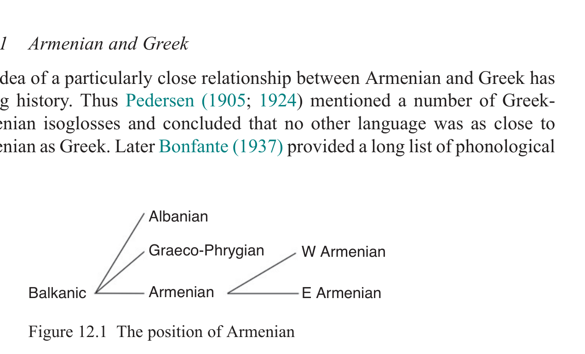

# 12 Armenian

Birgit Anette Olsen & Rasmus Thorsø

<!-- page: 202; pdf-page: 220 -->

## 12.1 Introduction

The attestation of the Armenian language begins in the early fifth century where, according to tradition, the clergyman Mesrop Maštocʽ invented the Armenian script for the purpose of translating the Bible. This century marks the initial period, the “golden age” (<i>oskedar</i>) of Classical Armenian or<i> grabar</i> (written language). Besides the Bible, the earliest texts consist of translations from Greek and Syriac, but also a number of original works. These include for example Eznik’s “Refutation of the sects”, Koriwn’s “Life of Maštocʽ” and, a little later, the historical works by Agatʽangełos, Pʽawstos Bowzand, Łazar Pʽarpecʽi and Ełišē. However, a few graffiti and inscriptions and a papyrus containing a sort of Greek phrasebook written in Armenian script are the only tangible monuments from the fifth century (see Orengo 2017: 1031–4). The literary sources are only transmitted in much later manuscripts, the oldest of which go back to the late ninth century, which means that we cannot really be certain that they faithfully reflect the actual language spoken at least 400 years earlier.

Besides the classical learned and religious language that was still in use, a new written standard, based on western dialects, was created to serve the practical purposes of the state of Cilicia during the thirteenth and fourteenth century, but after the fall of the Armenian kingdom in 1375, there was no administrative system to support a written norm adapted to the spoken language. From the seventeenth century, a lingua franca,<i> vačaṙakanakan hayerēn</i> ‘merchant’s Armenian’ (Orengo 2017: 1034–5), containing various dialectal features, gradually split into the two varieties of modern Eastern and Western Armenian, whose standards were fixed by the end of the nineteenth century. Of these, Eastern Armenian is the official language of the Armenian Republic, but also spoken in Arcʽax (Nagorno Karabagh) and Iran, while Western Armenian as the language of the diaspora following the genocide in 1915 survives in bilingual communities in e.g. Lebanon, Syria, Israel, France, Canada and the USA.

<!-- page: 203; pdf-page: 221 -->

## 12.2 Evidence for the Armenian Branch

This section contains a list of phonological and morphological features that distinguish Armenian from other branches of the Indo-European family.

### 12.2.1 Phonological Innovations

The most important phonological innovations characterizing the Armenian branch are listed below.1

<b>Vowels and Semivowels</b> 1. Raising of long *<i>ē</i> and *<i>ō</i> to<i> i</i> and<i> u</i> (written<i> ow</i>) respectively, cf.<i> sirt</i> ‘heart’

< *<i>k̑</i> <i>ērd-</i>,<i> towr</i> ‘gift’ < *<i>doh₃ro-</i>. 2. Raising of short *<i>e</i> and *<i>o</i> to<i> i</i> and<i> u</i> before nasals, cf.<i> hin</i> ‘old’ < *<i>seno-</i>,

<i>cown-r</i> ‘knee’ < *<i>g̑onu-</i>. 3. Loss of basic length opposition for all vowels: *<i>ā</i>, *<i>ī</i> and *<i>ū</i> merge with

their short counterparts, cf.<i> mayr</i> ‘mother’ < *<i>mah₂tēr</i> and<i> acem</i> ‘lead, bring’ < *<i>h₂ag̑ -e-</i>. 4. Merger of front diphthongs *<i>ei̯</i>/*<i>oi̯</i> into<i> ē</i> (a mid-high, eventually short

vowel, distinguished from the more open<i> e</i>), cf.<i> e-dēz</i> ‘piled up’ < *<i>(h₁)e-</i> <i>dʰei̯g̑ ʰet</i>,<i> mēg</i> ‘cloud’ < *<i>h₃moi̯gʰo-</i>. While *<i>ou̯</i> yields<i> oy</i>, cf.<i> boys</i> ‘plant, herb’ < *<i>bʰou̯ (h₂)ko-</i>, the usually assumed parallel merger of back diphthongs *<i>eu̯</i> /<i>ou̯</i> ><i> oy</i> may not be correct. Thus, Lamberterie (1982: 81–82) assumes a development *<i>eu̯</i> ><i> iw</i>, e.g.<i> hiwcanim</i> ‘pine away’ < *<i>seu̯g̑ -/seu̯g-</i> (OE<i> sēoc</i>, Goth.<i> siuks</i>). See also Olsen 2020. 5. Loss of tonal accent and fixation of stress, at first on the penultimate

syllable, eventually leading to syncope of all final syllables. With few exceptions, stress is thus synchronically fixed on the final syllable. 6. At a later stage than (5), weakening of unstressed high vowels and diph-

thongs, whereby<i> i</i> and<i> u</i> become [ə] (usually unwritten),<i> ē</i> becomes<i> i</i>,<i> oy</i> becomes<i> u</i>, while<i> ea</i> becomes<i> e</i>.2 Compare e.g. nom.sg.<i> sirt</i> ‘heart’, gen.<i> srti</i> [səɾˈti];<i> sēr</i> ‘love’, gen.<i> siroy</i>;<i> loys</i> ‘light’, gen.<i> lowsoy</i>;<i> aṙakʽeal</i> ‘messenger, apostle’, gen.<i> aṙakʽeloy</i>. 7. Vocalic resonants *<i>r̥</i>, *<i>l̥</i>, *<i>m̥</i>, *<i>n̥</i> generally yield<i> ar</i>,<i> al</i>,<i> am</i>,<i> an</i>, cf.<i> mard</i> ‘man,

mortal’ < *<i>mr̥ tó-</i>, Gr. (Aeol.)<i> βροτός</i>, cf. also Ved.<i> mr̥ tá-</i> ‘dead’. 8. While intervocalic *<i>i̯</i> is lost, like in e.g. Greek, the reflex in initial position is

not clear. Options include:

a.<i> ǰ-</i> as in<i> ǰowr</i> ‘water’ < *<i>i̯uHr-o-</i>, Lith.<i> jū́ra</i> ‘sea’

1 For various attempts at establishing a relative chronology of the Armenian sound changes, see

Kortlandt 1980a; Ravnæs 1991; Job 1995. A recent summary of Armenian historical phonology is presented by Macak (2017). See also the general surveys by Meillet (1936); Solta (1963); Godel (1975); Schmitt (1981); Lamberterie (1989); Olsen (2017b). 2 The diphthong<i> ea</i> results from both *<i>ea</i> and *<i>ia</i> arising after the loss of intervocalic consonants.

<!-- page: 204; pdf-page: 222 -->

b.<i> j-</i> as in<i> jow</i> ‘egg’ < *<i>i̯ōi̯o-</i> vel sim

c. zero as in<i> nēr</i> ‘daughter-in-law’, Lat.<i> ianitrices</i>.3 Perhaps also<i> ors</i> ‘hunt,

game’ if < *<i>i̯ork̑</i> <i>o-</i> (thus Martirosyan 2010: 706). An apparent reflex<i> l</i> should probably be explained by other processes. In <i>leard</i> ‘liver’ < *<i>i̯ekʷr̥ t</i>, contamination with *<i>lei̯p-</i> ‘fat, lard’ is conceivable, cf. OHG<i> lebara</i> ‘liver’. Similarly, the word<i> lowc</i> ‘yoke’ could have been secondarily affected by the verb<i> lowcanem</i> ‘to loosen, untie’. 9. Initial *<i>u̯ -</i> yields<i> g-</i>, cf.<i> get</i> ‘river’ < *<i>u̯ed-os-</i>. The internal outcome is more

complex and alternates between<i> g</i>,<i> w</i> and zero.4 It is possible that these reflexes result from a relatively late phonemic split of an intermediary *<i>ɣʷ</i>, which seems to be indirectly attested in Georgian<i> ɣvino</i> ‘wine’, if borrowed from an earlier form of Arm.<i> gini</i> ‘id.’ < *<i>u̯oi̯n-io-</i>. Note also Geo.<i> ɣvia</i> ‘juniper’, Arm.<i> gi</i> ‘id.’ (HAB 1: 554).

<b>Laryngeals</b> 10. Loss of consonantal laryngeals would be consistent with the development in

the other non-Anatolian languages and thus not a specific Armenian feature. It has been claimed that initial *<i>h₂-</i> and *<i>h₃-</i> are preserved as<i> h-</i> before an original<i> e</i>, e.g.<i> haw</i> ‘bird’ < *<i>h₂eu̯i-</i>.5 There are, however, a number of problematic counterexamples, and the hypothesis requires several ad hoc reconstructions (Olsen 1999: 766–7; Clackson 2005: 155; Macak 2017: 1059). 11. Laryngeal vocalization in initial position (“prothetic vowel”) before con-

sonants except *<i>u̯</i>, cf.<i> astł</i> ‘star’ < *<i>h₂stēl</i> for *<i>h₂stēr</i>. It is debated whether Armenian, like Greek, shows a triple representation, but the evidence for this claim, most prominently<i> inn</i> ‘nine’ if < *<i>h₁neun</i>, is scarce.6 Besides, triple representation of the prothetic vowels would be at variance with the development in other positions. 12. Vocalization of all laryngeals to<i> a</i> between consonants in initial and final

syllables, cf.<i> keraw</i> (aor.act.3sg.) ‘ate’ < *<i>gʷerh₃-to</i>. In internal syllables the conditioning of vocalization versus loss is not fully clear (Olsen 1999: 767–8). 13. Double vocalization of *<i>RHC</i> ><i> aRaC</i>, cf.<i> haraw</i> ‘south’ < *<i>pr̥ h₃u̯V-</i>. 14. Vocalization of at least *<i>h₂</i> after *<i>i</i>/<i>u</i> in auslaut as in Greek, cf.<i> sterǰ</i> ‘sterile’

< *<i>steri̯a-</i> < *<i>ster-ih₂-</i>. It cannot be excluded that this was a morphologically

3 The exact reconstruction is difficult, but perhaps *<i>(h)i̯enh₂tḗr</i> > *<i>(h)i̯entḗr</i> (deletion of internal

laryngeal) > *<i>(h)i̯inḗr</i> (*-<i>en-</i> > *-<i>in-</i>; *-<i>nt-</i> > -<i>n-</i>) ><i> nir-</i> (*<i>ḗ</i>> -<i>i-</i>; syncope of unaccented *-<i>i-</i>) → analogical nom.sg.<i> nēr</i>, cf. the pattern<i> sēr</i>,<i> siroy</i> ‘love’ (Olsen 1999: 190–1). 4 For a discussion of the conditioning, see Eichner 1978: 148–9; Olsen 1986; Ravnæs 1991: 72–3;

Matzinger 1992; Olsen 1999: 787–8. 5 Thus Austin (1942: 22–3), followed by Winter (1965), Greppin (1973), Kortlandt (1980b),

Martirosyan (2010: 712–13) and others. 6 Triple representation is advocated by e.g. Winter (1965), Kortlandt (1987), Beekes (1988, 2003),

and Martirosyan (2010: 765–6). The opinion that all vocalic laryngeals yield<i> a</i> is defended by Klingenschmitt (1970: 80 and 1982: 105), Olsen (1985 and 1999: 262–4), Lindeman (1987: 75– 83), and others.

<!-- page: 205; pdf-page: 223 -->

motivated change, i.e. a levelling in favour of the oblique cases where *<i>-i̯a-</i> < *<i>-i̯ah₂-</i>. On the other hand, there is evidence to suggest vocalization of internal *-<i>ih₂/3-</i> and *-<i>uh₂/3-</i> > *-<i>i̯a-</i>/*-<i>u̯a-</i> as well (cf. Olsen 1992; 1999: 770–1), similar to the “breaking” in Greek and Tocharian (cf. Section 12.4.1), though this is not widely accepted.

<b>Other Consonants and Clusters</b> 15. Primary palatalization: the PIE palatals *<i>k̑</i>, *<i>g</i> and *<i>g̑ ʰ</i> yield<i> s</i>,<i> c</i> and <i>j</i> respectively. a. At an earlier stage, (labio)velars had become palatals after *<i>u</i> (including

<i>u-</i>diphthongs), cf.<i> dowstr</i> ‘daughter’ < *<i>dʰugh₂tēr</i>,<i> loys</i> ‘light’ < *<i>le/ou̯ko-</i>. 16. Chain shift of the remaining PIE stops:

a. PIE voiceless stops *<i>t</i> and *<i>k</i> become<i> tʽ</i> and<i> kʽ</i> respectively, while

*<i>p</i> usually becomes<i> h</i> (via *<i>pʰ</i> and/or *<i>f</i>), disappearing before<i> o</i>, cf. <i>het</i> ‘footstep’ < *<i>pedom</i> vs.<i> otn</i> ‘foot’ < *<i>podm̥</i>. b. PIE voiced stops *<i>b</i>, *<i>d</i> and *<i>g</i>⁽<i>ʷ</i>⁾ become<i> p</i>,<i> t</i> and<i> k</i>.

c. PIE voiced aspirated stops *<i>bʰ</i>, *<i>dʰ</i> and *<i>g</i>⁽<i>ʷ</i>⁾<i>ʰ</i> become<i> b</i>,<i> d</i> and<i> g</i>. 17. Lenition or loss of particular voiceless and voiced aspirated stops. The cir-

cumstances are complex, but at least the following developments are fairly certain:

a. intervocalic *<i>p</i> and *<i>bʰ</i> ><i> w</i>, cf.<i> ew</i> ‘and’ < *<i>h₁epi, -(a)wor</i> ‘carrying’

< *-<i>bʰorah₂</i>- b. intervocalic *<i>t</i> ><i> y</i> before front vowels, cf.<i> hayr</i> ‘father’ < *<i>ph₂tēr</i>;

intervocalic *<i>t</i> ><i> w</i> before back vowels, cf.<i> cnaw</i> (aor.3sg.) ‘was born’ < *(<i>e-</i>)<i>g̑enh₁-to</i>; when not following the stressed syllable, intervocalic *<i>t</i> disappears entirely, cf.<i> čʽorkʽ</i> ‘four’ < *<i>kʷetóres</i> c. intervocalic *<i>g̑ ʰ</i> ><i> z</i>, cf.<i> lezow</i> ‘tongue’ < *<i>lei̯g̑ ʰ-uh₂-</i> d. intervocalic *<i>gʷʰ</i> (> *<i>ǰ</i>) ><i> ž</i> before front vowels, cf.<i> iž</i> ‘snake’ < *<i>h₁ēgʷʰ-</i>

<i>i-</i> (apparently no examples of *-<i>gʰ-</i>) e. internal *-<i>pt-</i> ><i> -wtʽ-</i>, cf.<i> ewtʽn</i> ‘seven’ < *<i>septm</i>

f. internal *<i>tR</i>, *<i>kR</i>, *<i>k̑</i> <i>R</i> ><i> wR</i>, cf.<i> arawr</i> ‘plough’ < *<i>h₂arh₃tro-</i>,<i> mawrukʽ</i>

‘beard’ < *(<i>s</i>)<i>mok̑</i> <i>ru-</i> g. internal *<i>-pn-</i> ><i> -wn-</i>, cf.<i> kʽown</i> ‘sleep’ < *<i>su̯opno-</i> h. initial voiceless stops are lost before resonants, cf.<i> li</i> ‘full’ < *<i>pleh₁to-</i>

i. initial *<i>pt-</i> ><i> tʽ-</i>, cf.<i> tʽer</i> ‘side; leaf’ < *<i>pter-</i>.7

18. Secondary palatalization of (labio)velars. This development is most clearly

seen in<i> čʽorkʽ</i> ‘four’ < *<i>kʷet</i>(<i>u̯</i> )<i>ores</i> and<i> ǰerm</i> ‘warm’ < *<i>gʷʰermo-</i>.8 This

7 The seemingly missing lenition of *<i>k</i>⁽<i>ʷ</i>⁾ and *<i>g</i>⁽<i>ʷ</i>⁾<i>ʰ</i> (cf. Kortlandt 1980a; Kümmel 2017) and the

outcome of lenited *<i>dʰ</i> (<i>z</i> or<i> r</i>, cf. Jasanoff 1979: 143–4; Martzloff 2016) are subject to debate. 8 There are no examples involving *<i>k</i>, *<i>gʰ</i> or *<i>gʷ</i>. Considering the evidence at face value thus

leaves an asymmetrical pattern, which is why it is sometimes assumed that palatalization affected all velars (Kortlandt 1975). Numerous exceptions such as<i> keam</i> ‘to live’ < *<i>gʷi̯eh₃-</i> would thus require analogical explanations which are not always straightforward.

<!-- page: 206; pdf-page: 224 -->

feature is perhaps not exclusively Armenian (cf. Section 12.4.3), but another uniquely Armenian rule, the “<i>awcanem-</i>rule” (Kim 2018: 258) proves the preservation of labiovelars into the immediate prestage of Armenian: *<i>VnKʷ</i> > *<i>VwK̑</i> (cf. 15. a), e.g. *<i>h₃n̥ gʷ-</i> ><i> awc(anem)</i> ‘anoint’. 19. While the general reflex of *<i>s</i> is<i> h/Ø</i> much like Greek, conditioned

developments are subject to more controversy.

a. To explain the usual nominal and pronominal ending of the nom.pl. -<i>kʽ</i>,

it is suggested by e.g. Pedersen (1905: 209–227) and Kortlandt (1984) that it is the regular outcome of final *<i>-s</i>. b. A<i> ruki-</i>like development of final *<i>-s</i> ><i> -r</i> after<i> i</i> and<i> u</i> (including *<i>ē</i> and

*<i>ō</i> following [1]) may explain intricacies such as singular aorist imperatives like<i> towr</i> ‘give’, which could then reflect the original injunctive *<i>doh₃-s</i> (cf. Pedersen 1905: 228; Olsen 1989). 20. Metathesis in clusters of voiced (aspirated) stops and resonants whereby

e.g. *-<i>dr-</i>, combined with the sound shift (16), yields<i> -rt-</i> with initial vowel prothesis, cf.<i> artawsr</i> ‘tear’ < *<i>drak̑</i> <i>u-</i>,<i> merj</i> ‘near’ < *<i>me-g̑ ʰsr-i</i>. 21. Epenthesis of *<i>i̯</i> and *<i>u̯</i> caused by an *<i>i</i> or *<i>u</i> in the following syllable, cf.<i> ayl</i>

‘other’ < *<i>h₂alii̯o-</i>,<i> awł-i</i> ‘strong alcoholic drink’ < *<i>h₂alu-</i>. While these changes are not spontaneous, the conditions are not fully clear. It seems that <i>i-</i>epenthesis only took place before resonants and after the vowels<i> a</i> and <i>o</i> while<i> u-</i>epenthesis was restricted to a rather different environment, also after<i> i</i> (perhaps<i> e</i>) and before stops, cf.<i> giwt</i> ‘discovery’ < *<i>u̯id-(t)u-</i>. On the other hand, it is not found in well-established<i> u-</i>stems such as<i> asr</i> ‘wool’ < *<i>pək̑</i> <i>u-</i> and e.g. Beekes (2003: 205) is sceptical of its existence altogether. Perhaps the original place of accent played a role in the development of <i>u-</i>epenthesis (see Olsen 1999: 798–801 with references). 22. Particular developments of various clusters including

a. *<i>sK</i>, *<i>Ks</i> ><i> cʽ</i> in most cases, cf.<i> cʽelowm</i> ‘split, break’ < *<i>skelH-</i>;<i> vecʽ</i>

‘six’ < *<i>suu̯ek̑</i> <i>s</i>. Initially, the outcome<i> š-</i> may sometimes be observed, and might be the result of palatalization before front vowels. Alternatively, Martirosyan (2010: 516) suggests that<i> š-</i> regularly develops from *<i>sKHV-</i> as opposed to *<i>sKV-</i> ><i> cʽ-</i>. It is debated whether -<i>čʽ-</i> is the palatalized version of *-<i>sK-</i> in internal position or should be derived from *-<i>sKi̯-</i>. b. *<i>dʰi̯</i> ><i> ǰ</i>, cf.<i> mēǰ</i> ‘middle’ < *<i>medʰi̯o-</i>. The outcome of *<i>ti̯</i> and *<i>di̯</i>, either<i>cʽ/c</i>

or<i> čʽ/č</i>, is more controversial (see e.g. Olsen 1993, Kocharov 2019: 30–1). c. *<i>Ri̯</i> ><i> Rǰ</i>, cf.<i> sterǰ</i> ‘sterile’ < *<i>sterih₂-</i>. d. *<i>su̯</i>, *<i>tu̯</i> ><i> kʽ</i>, cf.<i> kʽoyr</i> ‘sister’ < *<i>suesōr</i>.

e. *<i>du̯</i> > (<i>V</i>)<i>rk-</i>, cf.<i> erkow</i> ‘two’ < *<i>duō</i>.9

9 Others favour a regular development *<i>du̯</i> ><i> k</i>, cf. Beekes 2003: 199–200. For a more exhaustive

overview of developments in clusters, see Godel 1975: 78–9.

<!-- page: 207; pdf-page: 225 -->

### 12.2.2 Morphological Innovations: The Verb

The Armenian verb has undergone a number of morphological simplifications, such as loss of the dual and the distinction between an optative and a subjunctive, while the perfect only survives in synchronically opaque relics.10 Specific Armenian changes include 23. Generalization of -<i>e-</i> as thematic vowel with the exception of the subj.1pl.

-<i>owkʽ</i> < *-<i>omes</i> and the participle in -<i>own</i> < *-<i>ont-</i>/*-<i>omh₁no-</i>. 24. Merger of the thematic (or<i> e-</i>stem) endings and the verb ‘to be’ in the

present active, thus<i> berem</i> ‘I carry’ like<i> em</i> ‘I am’. 25. Creation of a mediopassive paradigm in -<i>i-</i> from statives in *-<i>eh₁-</i>. 26. Creation of a new imperfect preterite. 27. Merger of old aorist and imperfective stems for the formation of “root aorists”. 28. Creation of a “weak” aorist stem in -<i>cʽ-</i>, possibly a remodelling of the old

<i>s-</i>aorist (cf. Klingenschmitt 1982: 286–7; Olsen 2017b: 443). 29. Formation of a subjunctive morpheme -<i>icʽ-</i> of disputed origin. 30. Formation of a causative in -<i>owcʽanem</i>, aor. -<i>owcʽi</i>, also of disputed origin. 31. Formation of a voice-indifferent infinitive in -<i>l</i> < *-<i>lo-</i>. 32. Formation of a past participle in -<i>eal</i> (<i>o-</i>st.), similar to the Slavic<i> l-</i>participle.

### 12.2.3 Morphological Innovations: The Noun

In the noun, the categories of grammatical gender and the dual number are lost, while an inventory of seven cases is maintained despite several cases of syncretism. The most notable inflectional innovations include 33. Formation of a gen.dat.abl. plural in -<i>cʽ</i>, e.g.<i> i-</i>st.<i> srticʽ</i> from<i> sirt</i> ‘heart’,

possibly originally an adjective in *-<i>(i)-sk̑</i> <i>o-</i>. 34. Introduction of a new abl.sg. ending -<i>ē</i>, probably < *-<i>eti</i>. 35. Introduction of a new loc.sg. ending -<i>i</i> (<i>a-</i>,<i> i-</i> and sometimes<i> o-</i>stems),

probably < *-<i>h₁en</i>. 36. Merger of old root nouns, heteroclitics and<i> s-</i>stems with other stem classes. 37. Creation of a heteroclitic<i> u-</i>/<i>n-</i>stem paradigm from original<i> u-</i>stem adjec-

tives, e.g.<i> barjr</i> ‘high’, gen.<i> barjow</i>, nom.pl.<i> barjownkʽ</i>: Hitt.<i> parku-</i>. 38. Creation of a marginal<i> ł-</i>stem paradigm, apparently extended from the

paradigm for ‘star’,<i> astł</i>. From the field of nominal word formation, the most remarkable innovation must be: 39. The creation of a complex abstract noun suffix -<i>owtʽiwn</i> on the basis of

inherited elements.

10 For more elaborate treatments of morphological innovations, see Klein 2007; Olsen 2017a;

2017b; Klingenschmitt 1982 on the verb; Olsen 1999 on the noun; Matzinger 2005a on nominal inflection.

<!-- page: 208; pdf-page: 226 -->

### 12.2.4 Morphological Innovations: The Pronoun

The pronoun is notoriously a word class that is subject to changes and analogical remodellings, and here Armenian is no exception. However, one feature is particularly characteristic: 40. A systematic distinction between three deictic markers:<i> s</i> for the first

person,<i> d</i> for the second and<i> n</i> for the third. This system includes the postponed articles, -<i>s</i>, -<i>d</i>, -<i>n</i>, the anaphoric pronoun<i> sa</i>,<i> da</i>,<i> na</i>, the demonstrative<i> ays, ayd</i>,<i> ayn</i> and various other pronouns, adverbs and interjections.

### 12.2.5 The Lexicon and Remaining Innovations

The most remarkable feature of the Armenian lexicon is the scarcity of inherited lexemes seen in relation to the abundance of loanwords, mostly from Middle Iranian sources, and words of obscure origin. The etymological background of around 50 per cent of the Armenian vocabulary is unknown, and thus an abundance of words that are only attested in this branch help to define Armenian as an independent member of the Indo-European family.11

## 12.3 The Internal Structure of Armenian

Armenian is generally considered to be a single-language branch and indeed, Classical Armenian appears to be a highly standardized language with very few traces of the dialectal diversity that is likely to have existed at the time of the composition. According to Meillet (1904), the later dialects all derive from a uniform learned<i> κοινή</i> with very few modifications. As examples of dialectal archaisms, Meillet himself (also 1936: 11) mentions the original dialectal form <i>lizow</i> ‘tongue’ vs. Classical<i> lezow</i> with umlaut<i> i-u</i> ><i> e-u</i> and the preservation of the accusative marker<i> z-</i>, mostly lost in the later language, but preserved in the dialects around Lake Van. Within the Classical language itself, we also find doublets such as<i> tʽaršam</i>/<i>tʽaṙam</i> ‘withered’. Another indication of early dialectal differentiation is the word<i> ays</i>, usually ‘evil spirit’, but also attested in the primary meaning ‘wind’ in Eznik, who explicitly calls it a word of the southerners (Clackson 2005: 154). The fifty to sixty modern Armenian dialects all fall into one of the two main groups, Western and Eastern, with further subgrouping possible. Some important criteria for the classification of dialects are the reflection of the Classical Armenian stops and the formation of the present indicative where both Western and Eastern Armenian employ innovative but different formations.12

11 See the excellent overview by Clackson 2017. 12 On the topic of dialectal subdivision and the question of dialectal diversity in the earliest

literature, see Adjarian 1909; Martirosyan 2010: 689–704; Martirosyan 2018; Weitenberg 2017.

<!-- page: 209; pdf-page: 227 -->

## 12.4 The Relationship of Armenian to the Other Branches

In the pre-literary period, there must have been close linguistic contact between Armenian and a great number of other known and unknown languages, Indo-European – especially shown by the massive layer of Middle Iranian loanwords – as well as non-Indo-European, of which the non-Indo-European element is responsible for a substantial part of the lexicon, cf. e.g.<i> xnjor</i> ‘apple’: Hurrian<i> ḫinzuri</i> ‘id.’. While there are relatively few borrowings from Kartvelian in the oldest language, the areal influence of the Kartvelian languages may explain the dialectal glottalization of old mediae.13 On the syntactic level, the ergative-like construction with participles in -<i>eal</i> where the agent is in the genitive and the direct object in the accusative, e.g.<i> nora</i> (gen.)<i> gorceal ē z-gorc</i> (acc.) ‘he has done the work’, likewise finds parallels in Kartvelian (Stempel 1983: 80–7), but also in Iranian, however (Meyer 2017: 109–60).

Occasionally, it seems justified to attribute lexemes exhibiting irregular sound change to an unidentified Indo-European language. Thus<i> bowrgn</i> ‘tower, pyramid’ and<i> dowrgn</i> ‘potter’s wheel’ have the appearance of derivatives of *<i>bʰerg̑ ʰ-</i> ‘(be) high’ and *<i>dʰerg̑ ʰ-</i> ‘run’ respectively, but in both cases the root vocalism and the<i> centum</i> reflex of *-<i>g̑ ʰ-</i> are at variance with established Armenian sound laws.

Otherwise, Armenian shows the strongest similarities to the group of Balkan languages, Phrygian, Albanian and in particular Greek (see Figure 12.1). Some interesting features of this group are shared with Indo-Iranian (in particular the augment and the prohibitive adverb *<i>meh₁</i>) and a few with Tocharian.

13 Adherents of the “Glottalic Theory” interpret this characteristic feature as an archaism (e.g.

Gamkrelidze 2003 with references).

<!-- page: 210; pdf-page: 228 -->

correspondences, most of them not exclusively Graeco-Armenian, Hamp (1976) referred to the “growing list of Greek-Armenian isoglosses”, concluding that the time was “approaching when we should speak of Helleno-Armenian”, and Lamberterie (1983) considered Armenian to be particularly close to Greek.

The opposite stand was taken by Clackson (1994: 199–200), who ended his investigation with the following negative conclusion: “The absence of any compelling explanation of a morphological development of either language suggests strongly that the languages did not form a sub-group.” Even the impressive number of lexical correspondences was toned down: allegedly, only five word-pairs might reflect a common agreement made jointly by Greek and Armenian.

Most recently, Kim (2018) discarded most of the lexical correspondences as “general root cognations, not full word equations” and the notion of a Graeco-Armenian unity as an example of the “inertia of established scholarly opinion”.

However, while the lexical correspondences are certainly the most prominent, generally dismissing phonological and especially morphological correspondences seems unwarranted. In fact, a number of early phonological innovations in Armenian appear to be shared with Greek.

This goes for certain patterns of laryngeal vocalizations, particularly in initial position before consonant (11), in connection with the vowels *<i>i</i> and *<i>u</i> (14) and of “long resonants”, i.e. *<i>CRHC</i> clusters. As for the initial vocalization, Greek clearly shows a triple reflex (<i>ε</i>/<i>α</i>/<i>ο</i>) of vocalized laryngeals, while this outcome is far from assured for Armenian. In fact, one typically finds <i>a</i> in place of both *<i>h₂</i> and *<i>h₃</i>, thus<i> astł</i> ‘star’ = Gr.<i> ἀστήρ</i>;<i> aniw</i> ‘wheel’ ≈Gr. <i>ὀμφαλός</i> ‘navel’. Indisputable examples involving *<i>h₁</i> are unfortunately lacking (see e.g. Clackson 1994: 35).14 At any rate, the tendency for initial laryngeal vocalization is not found anywhere else, apart from Phrygian (Section 12.4.2), and it may to some extent be regarded as a shared innovation.

A closely related change concerns the Greek development of *<i>Cih₂/3C</i> > *<i>Ci̯ā/ōC</i> and *<i>Cuh₂/3C</i> > *<i>Cu̯ā/ōC</i>, which operated in originally unaccented syllables, as observed in e.g. Gr.<i> ζωός</i> ‘alive’ < *<i>gʷi̯ōwó-</i> < *<i>gʷih₃-u̯ó-</i>.15 In

14 However, Clackson (1994: 35) considers a single reflex<i> a-</i> most likely on theoretical grounds.

The final decision depends on the exact analysis of<i> atamn</i> ‘tooth’, traditionally derived from the root *<i>h₁ed-</i> ‘eat; bite’ (or ‘gnaw’?) and<i> anown</i> ‘name’. 15 See Francis 1970: 276–7; Normier 1977: 182 n. 26; Rasmussen 1991; Clackson 1994: 41–9;

Hyllested 2004; Olsen 2009 (for the conditioning); Woodhouse 2015. While this rule, sometimes referred to as “laryngeal breaking” or “Francis’ Law”, has not met with universal acceptance, it remains, in our view, the most economical solution to a number of etymological issues. The only serious counterexample, viz. Gr.<i> θῡμός</i> ‘spirit’ (cf. Chapter 11), may be illusory. As suggested by Kristoffersen (2019), the Greek word, like OHG<i> tuom</i> ‘vapour’ and Lat.<i> fūmus</i> ‘smoke’ (without Dybo’s Shortening! Cf. Section 9.2.3), seems to represent an

<!-- page: 211; pdf-page: 229 -->

Armenian, the operation of a similar rule, *-<i>ih₂/3</i>- > *-<i>i̯ə̄ -</i> > *-<i>i̯ā-</i>/*-<i>uh₂/3</i>- > *-<i>u̯ə̄ -</i> > *-<i>u̯ā-</i>, is suggested especially by<i> erkar</i> ‘long’, which is identical to Gr.<i> δηρός</i> ‘id.’ < *<i>duh₂-ró-</i>. The value of this example has been questioned due to the possible contamination of the adverb *<i>du̯ah₂m̥</i> ‘far’ (Hitt.<i> tuu̯ān</i> ‘to this side’,<i> tūu̯az</i> ‘from afar’ and Gr.<i> δήν</i> beside the morphologically aberrant Arm.<i> erkayn</i>), but there is in fact more Armenian material to suggest that this rule was regular (see Olsen 1992; 1999: 770–3). Note e.g.<i> keam</i> ‘to live’ < *<i>gʷih₃u̯ -</i>, which is traditionally difficult to reconstruct (see Martirosyan 2010: 356–7). The development of these *<i>CI/UHC</i> sequences may be somehow connected with the rather complex and poorly understood development of *<i>CRHC</i> clusters in both Armenian and Greek (Woodhouse 2015). However, as laryngeal breaking is a well-established feature of Tocharian, it can hardly be considered an exclusive Graeco-Armenian isogloss.

It has been suggested (Olsen 1989) that Greek and Armenian share a tendency to voice posttonic *<i>Nt</i> ><i> Nd</i>, though the contexts are not identical as the development in Greek is restricted to *<i>N̥ t</i>, e.g.<i> δέκα</i>,<i> δέκατος</i> ‘ten’ vs. <i>δεκάς</i>,<i> δεκάδος</i> ‘a decade’, but *<i>h₁énterah₂-</i> ‘entrails’ > Arm.<i> ǝnderkʽ</i> vs. Gr. <i>ἔντερα</i>. Rather than an actual shared innovation, we may be dealing with an areal feature.

In general, the most significant argument in favour of a common intermediate proto-language is the existence of shared morphological innovations. For Greek and Armenian, at least a handful of cases of this kind may be adduced: • formation of a<i> nu-</i>present *<i>u̯es-nu-</i> from the root *<i>u̯es-</i> ‘dress’: Arm.<i> z-genowm</i>,

Gr.<i> ἕννυμι</i> as a common substitution for the causative *<i>u̯os-éie-</i> (Klingenschmitt 1982: 248) • formation of a reduplicated aorist *<i>ar-ar-e/o-</i>: Arm.<i> arari</i> ‘I made’, Gr.

<i>ἤραρον</i> ‘I fixed’ (Chapter 11) • formation of a (reduplicated?) present stem *<i>(si)-sl̥h₂-sk̑</i> <i>e-</i>: Arm.<i> ałačʽem</i>

‘ask, request’, Gr.<i> ι҅λάσκομαι</i> ‘appease’ (Klingenschmitt 1970). The development *-<i>sk̑</i> <i>-</i> > -<i>čʽ-</i> seems to be regular before front vowels, and the reduplicative syllable would be lost due to syncope in Armenian. While the root is not exclusively Graeco-Armenian (cf. e.g. Lat.<i> sōlor</i> ‘console’), the stem formation, perhaps patterned on *<i>g̑i-g̑n̥ h₃-sk̑</i> <i>e-</i> (Arm.<i> čanačʽem</i>, Gr.<i> γιγνώσκω</i>), is unique for the two branches • inflection of the *-<i>men(t)-</i>stems: Arm.<i> sermn,</i> gen.<i> serman</i>, Gr.<i> σπέρμα</i>, -<i>ματος</i>

‘seed’, Arm.<i> ǰermn</i>, gen.<i> ǰerman</i> ‘heat, fever’. Greek and Armenian seem to have shared the generalization of the suffix variant *-<i>mn̥ t-</i> in this type, which is thus a likely candidate for a common innovation16

<i>o-</i>grade, *<i>dʰou̯ (h₂)mo-</i> (Gr. *-<i>Vu̯ -</i> > -<i>ū-</i> before labials) as opposed to the zero grade of Ved. <i>dhūmá-</i>, Lith.<i> dū́mai</i>. 16 Unstressed *-<i>mn̥ t-</i> > -<i>man-</i>. However, an analogical explanation of the Armenian paradigm

cannot be definitely excluded.

<!-- page: 212; pdf-page: 230 -->

• creation of the grammaticalized adjectival suffix conglomerate *-<i>ōdēs</i>

< *-<i>o-h₃od-ēs</i>, lit. ‘smelling’, e.g. Arm.<i> awazowt</i>: Gr.<i> ἀμαθώδης</i> ‘sandy’ • formation of the suffix conglomerate *-<i>e(h₁)u-</i> + -<i>to/ah₂-</i> or<i> -ti-</i> in Arm.

-<i>oytʽ</i> <*-<i>e(h₁)u-ti-</i>,e.g.<i>erewoytʽ</i>‘appearance’,Gr.<i>τελευτή</i>‘end’< *-<i>e(h₁)u-tah₂-</i>. The Greek type in -<i>ευσις</i> is late, but a common prestage is most likely a shared innovation. The most spectacular evidence for a Graeco-Armenian subgroup remains a set of lexical isoglosses which vary in nature. Some are simple exclusive root correspondences, but the following etyma are among the strongest examples showing common morphological and/or semantic innovations based on inherited roots. For a comprehensive collection of material, see e.g. Solta 1960, Clackson 1994 and Martirosyan 2013. • *<i>mēdesa-</i> ‘mind’: Arm.<i> mit</i>, usually pl.<i> mit-kʽ</i> (gen.-dat.-abl.pl.<i> mt-acʽ)</i>; Gr.

<i>μήδεα</i> ‘counsels, plans, arts’, cf.<i> μήδομαι</i> ‘to contrive, plan’. At least the long root vowel, whatever its explanation, seems to be an innovation.17 Note also the similar semantics as opposed to Umb.<b> me</b><b>ř</b><b>s</b> ‘law’. The long root vowel cannot be the reflection of an original Narten-ablaut (pace Clackson 1994: 148) since Gr.<i> μήδομαι</i> only has middle forms. Also, the long vowel forms found in Germanic and Old Irish are most likely secondary (Meissner 2006: 80–1). • *<i>dʰeh₁s-</i> ‘god’: Gr.<i> θεός</i> ‘god’ (< *<i>dʰh₁s-o-</i>) agrees semantically with Arm.

<i>di-kʽ</i> ‘(heathen) gods’ (< *<i>dʰeh₁s-es</i>) as opposed to Lat.<i> fēriae</i> ‘holidays’, <i>fānum</i> ‘temple’ which, together with potential Anatolian cognates, viz. HLuw.<i> tasan</i>(<i>-za</i>) ‘votive stele’, Lyc.<i> ϑϑẽn-</i> ‘altar’, suggest an original meaning ‘votive, sacred (thing)’. This would make the semantic change to ‘god’ a shared innovation (Lamberterie 2013: 35–6) in which Phrygian also takes part, cf. Phryg. (dat.pl.)<i> δεως</i> ‘god’ (Section 12.4.2). • *<i>mr̥ tó-</i> ‘mortal’: Arm.<i> mard</i> ‘(mortal) man, person’, Gr. (Aeol.)<i> βροτός</i>

‘mortal’. Formally, this is obviously the past participle of PIE *<i>mer-</i> ‘to disappear, to die’. The semantic shift from ‘dead’ (Skt.<i> mr̥ tá-</i>) to ‘mortal’, presumably a contrast formation to the privative *<i>n̥ -mr̥ to-</i> ‘immortal’, is not a very trivial innovation and has a low chance of reflecting parallel developments. It is also remarkable that the contrast human: god is expressed by the same word pair, Arm.<i> mard</i>:<i> dikʽ</i>, Gr.<i> βροτός</i>:<i> θεός</i>. • *<i>su̯ek̑</i> <i>ura-</i> ‘mother-in-law’: Arm.<i> skesowr</i>, Gr.<i> ἑκυρά</i>. Presumably this exclusive

Armenian-Greek form replaced the more archaic feminine *<i>suek̑</i> <i>ruh₂-</i> (cf. Skt. <i>śvaśrū́-</i>, Lat.<i> socrus</i>, OCS<i> svekry</i>) by analogy with *<i>suek̑</i> <i>uro-</i> ‘father-in-law’ (itself probably a secondary derivative of PIE age, see Olsen 2019: 153). Although this innovation may be said to be trivial, it is not found elsewhere, where the original<i> uh₂-</i>stem is generally well preserved.

17 It may result from contamination with *<i>meh₁-</i> ‘measure’ (GEW 2: 223).

<!-- page: 213; pdf-page: 231 -->

• *<i>mātru</i>(<i>u̯</i> )<i>i̯ah₂-</i> ‘stepmother’: Arm.<i> mawrow</i>, Gr.<i> μητρυιᾱ́</i>. Armenian and

Greek agree in derivation and meaning as opposed to OE<i> mōdriġe</i> ‘mother’s sister’. It is uncertain whether the Germanic forms reflect the same derivation. Clackson (1994: 145–7) considers this isogloss insignificant since both the form and meaning might be archaic (see also Olsen 2019: 156–7). On the other hand, the agreement of an exclusive form and meaning ‘stepmother’ as opposed to the expected ‘mother’s sister’ in Germanic is striking enough to suggest a joint innovation. • *<i>prei̯s-gʷh₂-u-</i> ‘one who goes in advance, elder’: Arm.<i> erēcʽ,</i> gen.sg.<i> eri-</i>

<i>cʽow</i>; Gr.<i> πρέσβυς</i>, Cretan<i> πρει῀σγυς</i> (Lamberterie 1990: 909–11, Clackson 1994: 165; on the phonology, see Olsen 1988). Lat.<i> prīscus</i> ‘ancient’, an <i>o-</i>stem, is unlikely to continue an older<i> u-</i>stem and rather reflects the suffix *<i>-ko-</i>, cf. Weiss 2020: 315. • *<i>osara-</i> ‘harvest’: Arm. (<i>amis</i>)<i> ara-cʽ</i> ‘the sixth month of the ancient

Armenian calendar (month of harvest)’ and Gr.<i> ὀπ-ώρᾱ</i>‘part of the year between the rising of Sirius and of Arcturus, between summer and autumn’. The shared preform *<i>osara-</i> (or *<i>ohara-</i> if *<i>s</i> ><i> h</i> was a shared development) seems to be a thematization of the PIE strong stem *<i>h₁os-r-</i>, cf. Ru.<i> ósen’</i> ‘autumn’, Goth.<i> asans</i> ‘harvest’ (Martirosyan 2013: 110). • *<i>gʷl̥h₂</i>(<i>a</i>)<i>no-</i> ‘acorn’: Arm.<i> kałin</i>, Gr.<i> βάλανος</i> (Clackson 1994: 135). Greek

and Armenian are the only branches to agree on the suffix, cf. Lat.<i> glāns</i> (< *<i>gʷl̥h₂-n̥ dʰ-</i>), RuCS<i> želudь</i> (< *<i>gʷelh₂-ondʰ-</i>), Lith.<i> gìlė</i> (< *<i>gʷl̥h₂-i̯ah₂-</i>). • *<i>perHi-men-</i> ‘piercing object’: Arm.<i> heriwn</i> ‘awl’ < *<i>perHimōn</i>, Gr.<i> περόνη</i>

‘pin, buckle, brooch’ < *<i>perHi̯mneh₂</i>, cf.<i> ἀκόνη</i> ‘whetstone’:<i> ἄκμων</i> ‘anvil’. It may be assumed that the root is *<i>perHi̯-</i>, which would explain Gr.<i> πει´ρω</i>, OCS<i> na-peŕǫ</i> ‘pierce’ as simple thematic presents (Olsen 1999: 492). Of course, it cannot be excluded that this isogloss is a shared archaism. • *<i>pseu̯d-</i> ‘lie’: Arm.<i> sowt</i> ‘false’,<i> stem</i> ‘lie’, Gr.<i> ψεύδομαι</i> ‘deceive, lie’,

<i>ψεῦδος</i> ‘lie’ (Clackson 1994: 168–9). If the basic root is *<i>pseu̯ -</i> ‘blow’, as suspected by Taillardat (1977: 352–3; cf. Fr.<i> vendre du vent</i>, Eng.<i> windy</i>, hot <i>air</i>), only Armenian and Greek agree on the root-extension -<i>d-</i> and the semantic specialization. Moreover, Arm.<i> sowt</i> < *<i>psudo-</i> has the appearance of a contamination of a<i> ro-</i>adjective, like Gr.<i> ψυδρός</i>, and a full-grade<i> s-</i>stem, like Gr.<i> ψεῦδος</i>, meaning that traces of the Caland system would have survived into a common prestage. This favours a common Graeco-Armenian innovation. • *<i>meg̑h₂r̥ -</i> ‘make great’: Arm.<i> mecarem</i> ‘honour’, Gr.<i> μεγαίρω</i> ‘grudge,

envy’. The denominative verb based on the<i> r-</i>stem variant of the heteroclitic corresponding to Ir. *<i>mazar-</i>/<i>mazan-</i> or *<i>masar-</i>/<i>masan-</i> (Kümmel 2012) is almost certainly a common innovation. • *<i>drep-n̥ nah₂-</i> ‘sickle’ in Gr.<i> δρεπάνη</i> ‘sickle’, Arm.<i> artewan</i> (-<i>ownkʽ</i>, -<i>ancʽ</i>/

-<i>acʽ</i>) ‘eyelid; brow’ (Lamberterie 1983: 21–2). The root *<i>drep-</i> is not

<!-- page: 214; pdf-page: 232 -->

exclusively Graeco-Armenian, thus Ru.<i> drápat’</i> ‘scratch, tear’ beside Gr. <i>δρέπω</i> ‘pluck, cut off’, but the striking correspondence consists in the derivational chain *<i>drep-mn̥</i> (Gr. (Hsch.)<i> δρέμμα· κλέμμα</i> (about stealing fruit); Beekes 2010: 353) ⇒*<i>drep-n̥ nah₂-</i> ><i> artewan-</i>/<i>δρεπάνη</i>, very much in accordance with inherited principles. Clackson’s tentative suggestion (1994: 112) of a very early loan from Greek is extremely unlikely, as we have no examples of Greek loanwords borrowed before the soundshift (*<i>d</i> ><i> t</i>). • *<i>h₂alh₁-trih₂-</i> or *<i>h₂l̥h₁-trih₂-</i> ‘female miller’: Arm.<i> aławri</i> ‘female who

grinds corn’, Gr.<i> ἀλετρίς</i> ‘female slave who grinds corn’. Apparently a<i> vr̥ kī́ḥ-</i> type derivative of an agent noun in *-<i>ter</i>/<i>tor-</i>, an otherwise extinct derivational type in Armenian. Clackson’s suggestion (1994: 92) of “a secondary derivative of an unattested instrument noun *<i>aławr</i> ‘mill’” is less economical. Again, a common innovation is the simple solution. • *<i>dʰal-ro-</i> or *<i>dʰHl-ro-</i>: Arm.<i> dalar</i> ‘green, fresh’, Gr.<i> θαλερός</i> ‘blooming,

fresh, abundant’. As Gr. -<i>λρ-</i> is phonotactically impossible, and Arm. -<i>lr-</i> never represents an old consonant cluster, Gr. -<i>ερο-</i>, Arm. -<i>ar-</i> do not necessarily continue a sequence *-<i>Vro-</i>; more likely, we are dealing with an old *-<i>ro-</i>stem, only attested in Armenian and Greek. The root, however, is also found in Alb.<i> dal</i> ‘sprout, enter, come’. Some isolated roots might be retentions from PIE but are still worth taking into account. • *<i>k̑</i> <i>en</i>(-<i>eu̯</i> )<i>-o-</i> ‘empty’: Arm.<i> sin</i>, Gr.<i> κενός</i>, Ion.<i> κεινός</i>, Hom.<i> κενεός</i> (cf.

Clackson 1994: 138). • *<i>mosg̑ ʰ-</i> ‘young bovine’: Arm.<i> moz-i</i>, Gr.<i> μόσχος</i>. Clackson’s (1994: 154)

suggestion of a borrowing from Greek to Armenian seems phonetically impossible and the relatively late (eleventh century) attestation of the Armenian word is not a serious problem in itself. Most likely, it is a shared borrowing, but IE origin cannot be excluded. • *<i>k̑</i> <i>iu̯ōN</i> ‘pillar’: Arm.<i> siwn</i>, Gr.<i> κι´ων</i>. The appurtenance of other cognates (cf.

Lubotsky 2002; Chapter 11) is uncertain, but cannot be excluded. Clackson (1994: 140–1) considers this word a shared borrowing, which would make it an important isogloss as the forms are identical. • The root *<i>h₃bʰel-</i>, exclusively attested in Greek and Armenian, has the

double meaning ‘increase’ and ‘sweep’ in both languages: Arm.<i> awel</i> ‘broom’,<i> awelowm</i> ‘increase’: Gr.<i> ὄφελτρον</i> ‘broom’,<i> ὀφέλλω</i> ‘sweep’ (Hipponax) and ‘increase’; the verb also forms a thematic aorist in both languages: Arm.<i> y-awel</i>, Gr.<i> ὄφελε</i> (Clackson 1994: 156–8). • Arm.<i> awr</i> ‘day’ ~ Gr.<i> ἦμαρ</i> (cf. Chapter 11). Finally, a number of words seem to have been borrowed at a common prestage of Armenian and Greek as the attested forms allow for reconstructions of proto-forms which, for different reasons, are unlikely to be inherited from PIE. The

<!-- page: 215; pdf-page: 233 -->

shared substrate interface seems to contain several chronological layers, some presumably formed after particular Armenian or Greek sound changes.18 The following examples, where all sound changes are observed, can be considered part of the earliest layer which may have been contemporaneous with a shared Graeco-Armenian language stage. • *<i>ai̯g̑ -</i> ‘goat’: Arm.<i> ayc</i> ‘(she-)goat’, Gr.<i> αι῎ξ</i>,<i> αι҆γός</i>. Note the Arm. plural form

<i>ayci-kʽ</i> (beside<i> ayc-kʽ</i>) and derivatives<i> ayceay</i> ‘made of goatskin’,<i> ayceamn</i> ‘roebuck’ which can reflect the same *<i>ih₂-</i>collective as Gr.<i> αι҆γι҆ς</i> ‘goatskin’. The etymon is probably non-IE (Solta 1960: 405; Kortlandt 1986: 38–9; and especially Kroonen 2012: 245–6). Lith.<i> ožỹs</i>, Skt.<i> ajá-</i> reflect *<i>ag̑ -</i> without the semivowel and although the forms are unlikely to be separated completely, the variation cannot really be explained in a PIE framework.19 In light of this, the Armenian-Greek agreement in both root structure and derivation should be considered highly significant. Another possible match is found in Alb.<i> edh</i> ‘kid’,<i> dhi</i> ‘she-goat’ < *<i>ai̯g̑ -ii̯ah₂</i> (Demiraj 1997: 160). • *<i>antʰ-r-</i> ‘coal, ember (?)’: Arm.<i> antʽ-eł</i> ‘hot coal, ember’,<i> antʽ-ayr</i> ‘spark’

(< *<i>antʽari-</i>), dial.<i> antʽrocʽ</i> ‘poker’; Gr.<i> ἄνθραξ</i> ‘charcoal’ (J̌ ahowkyan 1987: 592, Martirosyan 2010: 85; 2013: 113). A substratum origin is supported by Geo. <i>ant-eba</i> ‘to burn’ and the fact that the shared root seems to contain voiceless *<i>tʰ</i> while there is no external support for a reconstruction *<i>h₂antH-</i> vel sim. • *<i>sepʰs-</i> ‘to boil, cook’: Arm.<i> epʽem</i> ‘to cook’, Gr.<i> ἕψω</i> ‘to boil, seethe’. It is

unlikely that Arm.<i> pʽ</i> continues intervocalic *<i>-ps-</i>, cf.<i> eres</i> ‘face’ < *<i>kʷrepsah₂</i> (Olsen 1999: 64; alternatively Witczak 1991). Again, there are few other options than to reconstruct a voiceless aspirate, perhaps from a non-IE source. • *<i>tūpʰ-</i> ‘plant, bush (?)’: Arm.<i> tʽowpʽ</i> (gen.<i> tʽpʽoy</i>) ‘bush, bramble’, Gr.<i> τύφη</i>

‘reed mace,<i> Typha angustata’</i>. Although the semantic details are not fully clear, and Armenian has an<i> o-</i>stem as opposed to the Greek feminine, the roots are identical. The root structure points to a substratum origin. Lat.<i> tūber</i> ‘swelling’, ON<i> þúfa</i> ‘knoll’ may be separate borrowings from the same source or entirely unrelated. • *<i>tarp-</i> ‘basket’: Arm.<i> tʽarpʽ</i> ‘fishing basket, creel’, also<i> tʽarb</i> as a literary

form meaning ‘wooden framework’ (HAB 2: 162; Martirosyan 2010: 281– 2 with references); Gr.<i> τάρπη</i> ‘large wicker basket’. There are no convincing IE etymologies (Chantraine 1999: 1095; Clackson 1994: 183; Martirosyan 2010: 281–2). This etymon may represent a very early borrowing, with the regular Armenian outcome of *<i>tarp-</i> being represented in the form<i> tʽarb</i>.

18 Cf. e.g. Arm.<i> sex</i> ‘melon’ ~ Gr.<i> σικύα</i> ‘bottle-gourd’ with no change of *<i>s</i> ><i> h</i> in either language.

See also Martirosyan 2013: 122–3. 19 For this reason, the connection with Av.<i> īzaēna</i> ‘leathern’ from a putative zero grade *<i>h₂ig̑ -</i>,

mentioned e.g. by Martirosyan (2010: 58), is less likely.

<!-- page: 216; pdf-page: 234 -->

Summing up, the relations between Armenian and Greek seem to be significant enough to justify a common node. They do not only consist of shallow lexical correspondences. The common morphological innovations are far from negligible, and in numerous cases, a given lexical item shows a striking similarity with respect to word formation and semantics. Exclusive loanword isoglosses further confirm this standpoint.

### 12.4.2 Armenian and Phrygian

The idea of a special relationship between Armenian and Phrygian goes back to Herodotus (7.73), who claimed that the “Armenians” (<i>Ἀρμένιοι</i>) were descendants of the Phrygians, and a quotation from Eudoxos by Stephanos of Byzantium, according to whom the Armenians come from Phrygia. He claims that their language is also very similar to that of the Phrygians. However, the closest known relative of Phrygian is undoubtedly Greek (Chapter 11), and while both Armenian and Phrygian may be attributed to the Balkan group of Indo-European of which Greek seems to be the central member, there are no exclusive isoglosses between the two.20

### 12.4.3 Armenian and Albanian

Like Greek, Armenian and Phrygian, Albanian appears to belong to the Balkanic languages in the narrower sense, but apart from the palatalization of labiovelars as opposed to plain velars, perhaps a parallel development of the cluster *<i>su̯ -</i> and a few lexical correspondences (Kortlandt 1986), there are hardly any conspicuous<i> exclusive</i> isoglosses between Armenian and Albanian (see further Chapter 13).21

## 12.5 The Position of Armenian

In Matzinger’s treatments of the question (2005b: 382; 2012), Greek has the central position within the Balkanic group with direct relations to Phrygian, Armenian, Albanian and perhaps – surprisingly – Tocharian.22 Evidence for the inclusion of Tocharian is extremely weak, however, and it is generally considered an entirely separate branch of Indo-European (see Chapter 6). Evidence for the Balkanic group is found at all levels, phonology, morphology and lexicon, and can be summarized as follows: • “laryngeal breaking” (14): Greek, Armenian and Tocharian

20 See Matzinger 2005b and 2012 for details. 21 Details on the connection between Armenian and Albanian are presented by Kortlandt (1986). 22 See e.g. also Klingenschmitt 1994 and the somewhat idiosyncratic overview by Holst 2009.

<!-- page: 217; pdf-page: 235 -->

• development of at least *-<i>ih₂</i> > *-<i>i̯ǝ2</i> (14): Greek, Armenian and Albanian

(Klingenschmitt 1994: 244–5) • prothetic vowels (11): Greek, Phrygian and Armenian; Greek and Phrygian

agree on “triple representation” • traces of labiovelars in<i> satem</i> languages. In Armenian and Albanian, old

voiceless and voiced aspirated labiovelars seem to palatalize (Pisani 1978), and a similar tendency may be observed in the<i> centum</i> language Greek, where labiovelar mediae typically avoid palatalization, cf. e.g. Arm.<i> keam</i> ‘live’: Gr.<i> βέομαι</i>,<i> βίοτος</i>. Here we seem to be dealing with an areal feature • loc.pl. ending *-<i>si</i> for *-<i>su</i>: Greek, Albanian; the origin of Arm. -<i>s</i> is

unknown • mid.1sg. primary ending *-<i>mai</i> for original *-<i>h₂ai̯</i>: Greek (-<i>μαι</i>), Armenian

(-<i>m</i>), Albanian (-<i>m</i>) • formation of<i> s-</i>aorists in *-<i>ah₂-s-</i> from denominative verbs in *-<i>ah₂-i̯e/o-</i>:

Greek, Armenian and Albanian (see Søborg 2020: 78–80, 103, elaborating on Klingenschmitt and Matzinger); this connection presupposes that Armenian aorist marker -<i>cʽ-</i> derives from the<i> s-</i>aorist • aorist *<i>e-kʷle-to</i> ‘became’: Greek, Armenian, Albanian (Gr.<i> ἔπλετο</i>, Arm.

<i>ełew</i>, OAlb.<i> cleh</i>, see LIV² 386–7) • negation *<i>(ne) h₂oi̯u kʷid</i>: Gr.<i> οὐκί</i>, Arm.<i> očʽ</i> and Alb.<i> as</i> but cf. also, as

demonstrated by Fellner (2022), the closely related emphatic negation Toch. A<i> mā ok</i>, B<i> māwk</i>/<i>māᵤk</i> • *<i>ai̯g̑ -</i> ‘goat’: Greek, Armenian and Albanian • *<i>dʰeh₁s-</i> ‘god’: Gr.<i> θεός</i> ‘god’ (< *<i>dʰh₁s-o-</i>), Arm.<i> di-kʽ</i> ‘(heathen) god’,

Phryg.<i> δεως</i> • additional -<i>ai̯(k)-</i> in the inflection of the word for ‘woman’: Gr.<i> γυναικ-</i>,

Phryg. acc.<i> κναικαν</i>, Alb.<i> grā</i> (Matzinger 2000); synchronically, Arm. <i>kanaykʽ</i> is simply the nom.pl. of a stem<i> kanay-</i>, but it cannot be excluded that the ending -<i>kʽ</i> is due to a reinterpretation of a suffixal -<i>k</i>- • *<i>gʷʰermo-</i> ‘warm’: a full-grade<i> mo-</i>adjective common to Gr.<i> θερμός</i>, Arm.

<i>ǰerm</i> and Alb.<i> zjarm</i> A discussion of the relationship between the Balkan group and Indo-Iranian, including such features as the augment, which may theoretically represent an archaism, is beyond the scope of this chapter.
