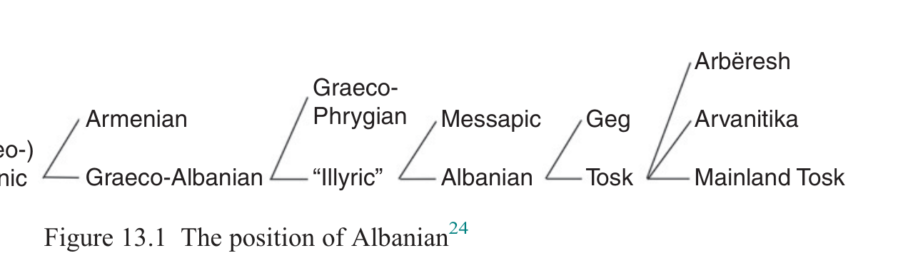

# 13 Albanian

Adam Hyllested & Brian D. Joseph

<!-- page: 223; pdf-page: 241 -->

## 13.1 Introduction

Albanian is sometimes considered the stepchild of Indo-European linguistics, for various reasons. For one, it is the latest attested IE branch; its first documentation is a 1462 one-line baptismal formula, and the first substantial text the 1555 <i>Missal</i> of Gjon Buzuku. Due to this late attestation, many details of its historical development are shrouded in mystery, and its present form does not always appear obviously Indo-European. Consider, for example, the numerals<i> gjashtë</i> ‘6’ and<i> tetë</i> ‘8’, which despite looking strikingly different from, say, Latin<i> sex</i> and<i> octō</i>, in fact reflect the expected outcomes of PIE *<i>sék̑</i> <i>s-tV-</i> and *<i>ok̑</i> <i>tṓ-tV-</i>. Moreover, the complicating factor of heavy external influence can make it difficult to determine what is inherited from PIE. Not only are there Albanian borrowings from Ancient Greek, Latin (<i>sensu lato</i>), Slavic, Turkish, and Italian, as well as from neighbouring Balkan languages, but there is also structural convergence with other Balkan languages, especially Modern Greek, Macedonian, Aromanian, and Romani, but also Turkish, and, by extension, Bulgarian, Meglenoromanian, and Romanian. This convergence covers phonology, e.g. voicing of nasal + stop clusters, as in<i> këndoj</i> ‘sing’ (borrowed from Latin<i> cantō</i>), matching a development in Greek and Aromanian; morphology, e.g. the merger of genitive and dative cases, matching a development in Greek, Aromanian, Romanian, Macedonian, and Bulgarian; syntax, e.g. doubling of direct or indirect objects by weak pronouns, matching a development in Greek, Aromanian, Romanian, Macedonian, Bulgarian, and to some extent, Romani; and semantics, e.g. creation of admirative mood forms to mark non-confirmativity, matching a development in Macedonian, Bulgarian, and Turkish.

## 13.2 Evidence for the Albanian Branch

These difficulties notwithstanding, several innovations define Albanian and set it apart from all other branches of IE, including • *<i>s</i> > [ɟ] (in IPA, spelled ⟨gj⟩in standard Albanian orthography) in initial position before astressed vowel, cf.<i> gjashtë</i>‘6’ < *<i>sék̑</i> <i>s-tV-</i> vs.<i> shtatë</i> ‘7’ <*<i>septḿ̥ -tV-.</i> ⟨gj⟩

<!-- page: 224; pdf-page: 242 -->

represents a voiced dorsopalatal stop, though with varied secondary outcomes dialectally. This change is unparalleled within IE. • *<i>k̑</i> > [θ] (spelled ⟨th⟩), a change found only also in Old Persian among other

IE branches; e.g.<i> athët</i> ‘harsh, sour’ < *<i>ak̑</i> <i>-</i> ‘sharp’ (cf. Ved.<i> áś-man-</i> ‘stone’) • *<i>g̑ (ʰ)</i> > [ð] (spelled ⟨dh⟩), also unparalleled within IE,1 e.g.<i> udhë</i> ‘way’

< *<i>ug̑ ʰ-o-</i> (the root of Lat.<i> veh-ō</i> ‘convey’) • loss of word-internal voiced stops under certain conditions, e.g.<i> ujë</i> ‘water’

< PAlb. *<i>ud-r-jā</i> • *<i>ō</i> ><i> e</i>, as in<i> tetë</i> ‘8’ < *<i>ok̑</i> <i>tṓ-tV-</i> • *<i>ē</i> ><i> o</i>, as in<i> mos</i> ‘not; don’t!; lest’ < *<i>meh₁-kʷid</i> (cf. Gr.<i> μή</i>) •<i> -ni</i> as 2pl. non-past verbal ending, e.g. present indicative<i> ke-ni</i> ‘you all have’,

imperative<i> ki-ni</i> ‘you all have!’, from a reanalysed and repurposed adverbial *<i>nū</i> ‘now’ (Rasmussen 1985) • a postposed definite article, as in<i> det-i</i> ‘the sea’ (literally ‘sea-the’).2

These characteristics give ample cause for treating Albanian as a separate branch within IE, even with various complications in analysing forms.

## 13.3 The Internal Structure of Albanian

Despite constituting its own branch within IE, Albanian is hardly a linguistic monolith. In fact, there are major dialect divisions within the branch, the oldest and most important being a north–south one: the Geg dialect group occurs north of the Shkumbin river (roughly in the middle of present-day Albania), thus covering northern Albanian and the Albanian of the nation-states of North Macedonia, Kosova, and Montenegro, while the Tosk group occurs south of the river, and includes the Arbëresh diaspora communities of southern Italy and the Arvanitika diaspora communities scattered around Greece.

Dialect differences separating Geg and Tosk involve all levels of linguistic structure. In phonology, Geg has nasalized vowels whereas Tosk has lost nasalization (e.g.<i> âsht</i> ‘is’ vs. Tosk<i> është</i> < *<i>ensti</i> < PIE *<i>h₁en-h₁esti</i>), maintains intervocalic -<i>n-</i> whereas Tosk denasalizes it to -<i>r-</i> (e.g.<i> venë</i> ‘wine’ vs. Tosk <i>verë</i>) and has reduced nasal-plus-stop clusters to nasals whereas Tosk maintains the clusters (e.g.<i> nimoj</i> ‘I-help’ vs. Tosk<i> ndihmoj</i>). In morphology, Geg has participials in -<i>m-</i> (among other endings) whereas Tosk mostly uses -<i>uar</i> (e.g. <i>harrum</i> ‘forgotten’ vs. Tosk<i> harruar</i>), and Geg forms its future tense with an

1 The notation<i> g̑ (ʰ)</i> indicates that the PIE voiced aspirated and voiced plain stops generally merged in

Albanian; while this development is characteristic of Albanian, it is not particularly striking within IE, occurring, presumably independently, in Anatolian, Balto-Slavic, Celtic, Iranian, and Tocharian. 2 This feature is found also in neighbouring languages, especially Aromanian, Macedonian, and

Romanian, suggesting causality through contact rather than internal innovation within Albanian. However, Hamp 1982 argues that the ancient toponym<i> Drobeta</i> (in present-day Romania) reflects a Roman misinterpretation of *<i>druwā-tā</i> ‘the wooded (place)’, with a postposed definite article, suggesting it reflects an old Albanian syntagm.

<!-- page: 225; pdf-page: 243 -->

inflected form of ‘have’ plus an infinitive (consisting of<i> me</i> with a participial) whereas Tosk uses an invariant (3sg.) form of ‘want’ with an inflected subjunctive with the modal marker<i> të</i> (e.g.<i> ke me shkue</i> ‘you will go’ (literally “you-have to gone”) vs. Tosk<i> do të shkosh</i> (“it-wants that you-go”)). In syntax, Geg uses its (uninflected) infinitive with<i> me</i> in complement structures where Tosk uses the (inflected) subjunctive with<i> të</i>, e.g.<i> filloj me shkue</i> ‘I begin to go’ (literally “I-begin to gone”) vs. Tosk<i> filloj të shkoj</i> (literally “I-begin that I-go”). Finally, there are lexical differences, e.g. Geg<i> tamël</i> ‘milk’ vs. Tosk<i> qumësht</i>.

Within the Geg and the Tosk dialect complexes, there is much regional variation, the details of which are beyond the scope of this chapter. It can be noted, though, that diaspora varieties of Tosk show the effects of differential contact situations: Arbëresh in Italy not only has many Italian loans not found in Balkan Tosk, e.g.<i> kamineta</i> ‘chimney’ (cf. Italian<i> camineta</i> ‘fireplace’) but also lacks Turkish loanwords (cf. Balkan Tosk<i> oxhak</i> ‘chimney, fireplace’, from Turkish<i> ocak</i>), reflecting its absence from the Balkans after approximately the fifteenth century. Similarly, Arvanitika in Greece shows various Greek features not generally found in Tosk; for instance, according to Sandfeld (1930: 104), in Arvanitika,<i> mnj</i> (Sandfeld’s notation) occurs for<i> mj</i> elsewhere in Balkan Tosk, e.g.<i> mnjekrë</i> ‘chin; beard’ (vs. general Tosk<i> mjekër</i>), a shift he states is “comme en grec” (cf. Thumb 1912: §30, who reports colloquial Greek<i> μνιά</i> ‘one.fem’ (presumably [mɲja] or [mɲa]) versus earlier, and still occurring,<i> μιά</i> ([mjá])).

## 13.4 The Relationship of Albanian to the Other Branches

Albanian shows mixed dialectal affinities, sharing key features with different sets of languages within IE. This situation makes for a complicated determination of how to subgroup Albanian with other branches. Ultimately, although no consensus prevails as to the exact classification of Albanian, we argue here that lexical and morphological isoglosses point to a Greek-Albanian subgroup, a grouping suggested by computational phylogenetic methodology in Chang et al. 2015 (see Section 13.5.2; note also Holm 2011).

We base our discussion largely on significant, non-trivial innovations Albanian shares with other branches. However, what counts as a shared innovation as opposed to a shared retention of course depends on decisions made about the nature of the proto-language in question. Thus, assessments about subgrouping can become complicated and involved.

For instance,3 Cowgill (1960) proposed that Greek<i> οὐ(κί)</i> ‘not’ could be connected with Armenian<i> očʽ</i> ‘not’, with both deriving from a phrase *<i>ne</i>...

3 Other cases like this of what we consider retentions, but which some scholars might see as

innovations, are the use in prohibitions of *<i>meh₁</i> (Alb.<i> mos</i>, Gr.<i> μή</i>; see also Section 13.4.7 Inflection and Morphosyntax) and the use of the augment in marking past tense forms. Space limitations preclude discussion here; see Joseph 2013.

<!-- page: 226; pdf-page: 244 -->

<i>h₂ói̯u kʷid</i>, composed of the negative marker *<i>ne</i>, the noun *<i>h₂ói̯u</i> ‘life-force’, and the indefinite pronoun *<i>kʷid</i>, thus originally “not on (your) life; not at all”, as an emphatic negator. He conjectured, following Pedersen 1900, that the Albanian negative<i> as</i> ‘nor, and not’ might belong here too but was reluctant to pursue the connection. Joseph (2005; 2022) has followed up on the Albanian angle, arguing that the negative prefix<i> as-</i> ‘not’, as in<i> as-gjë</i> ‘nothing’ (cf.<i> gjë</i> ‘thing’), is what matches<i> οὐ(κί)</i> and<i> očʽ</i>.4 Ostensibly, this *<i>ne</i>...<i> h₂ói̯u kʷid</i> phrasal negation could be a shared innovation linking Albanian, Armenian, and Greek (Section 13.4.8), if restricted to those branches. However, Garnier 2014 and Fellner 2022 have argued that Latin<i> haud</i> ‘not’ and Toch.A<i> mā ok</i>, Toch.B <i>mawk</i>,<i> maᵤk</i>, respectively, also reflect *<i>(ne)</i>...<i> h₂ói̯u kʷid</i>, so this negator is shared by languages that do not otherwise show evidence for being subgrouped together. Thus *<i>ne</i>...<i> h₂ói̯u kʷid</i> must be of PIE age, so its occurrence in these languages is a shared retention inherited in each and therefore irrelevant to subgrouping. Any potential shared innovation in principle must be examined carefully to determine its status vis-à-vis innovation versus retention.

As noted above, there are numerous, often contradictory, indications of close connections between Albanian and other branches of IE, and though we ultimately favour the connection with Greek, we review here the evidence that aligns Albanian with one or another branch of IE.

### 13.4.1 Albanian and Balto-Slavic

Various features connect Albanian with Balto-Slavic. We mention a few here, and point interested readers to Porzig 1954: 174–7, Jokl 1963, Çabej 1975, Huld 1984: 166, Orel 1994; 2000: 254–6 for further details and assessment.

#### 13.4.1.1 -teen Numerals Albanian forms the teen numerals eleven to nineteen using a pattern of digit-on-ten, e.g. njëmbëdhjetë ‘eleven’ (cf. një ‘one’, mbi ‘on’, dhjetë ‘ten’), that seems to parallel Slavic (e.g. Ru. odínnadcat’ ‘eleven’ (cf. odín ‘one’, na ‘on’, désjat’ ‘ten’)) and part of Baltic, specifically Latvian (e.g. vienpadsmit ‘eleven’; Lithuanian aligns with Germanic here, using a formative based on *lei̯kʷ- ‘leave’, not a form of ‘ten’). However, there is one key difference between the Albanian and the Slavic/Latvian patterns. Albanian, along with Romanian, has a feminine form of ‘ten’, shown by the use of the feminine tri ‘three’ with dhjetë ten’ in the formation of ‘thirty’, tridhjetë, whereas Slavic has a masculine form, as in the Russian use

4 The relationship between the free word<i> as</i> and the prefix<i> as-</i> is disputed; Joseph sees them as

having different origins, while others connect them. That issue is irrelevant here, as the fact of there being some Albanian cognate to the Greek and Armenian forms is all that matters in this case. See also Hackstein 2020 on sources of negation markers in Albanian, including *<i>ne</i>... <i>h</i>₂<i>ói̯u kʷid</i>.

<!-- page: 227; pdf-page: 245 -->

of masculine<i> dva</i> ‘two’ in the formation of ‘twenty’,<i> dvádcat’</i> (literally “two tens”); Romanian for ‘twenty’ is<i> douăzeci</i> ‘twenty’ (literally “two tens”), with feminine<i> două</i>, thus with feminine ‘ten’.

Following Hamp (1992), these facts can be interpreted for the Balkans as follows. The variety of IE destined to become Albanian (Hamp’s “Albanoid”) was a Northern IE language, grouped with or in contact with Germanic and Balto-Slavic. Within Baltic, Lithuanian absorbed the teen-numeral pattern of Germanic, whereas Latvian interacted with Slavic and Albanoid, an inner-Baltic difference that makes sense geographically. Albanoid, along with Latvian and Proto-Slavic, developed the DIGIT-on-TEN pattern, presumably an innovation in one language that spread by contact into the others, but its speakers changed this pattern as they moved south into the Balkans and came into contact with the variety of Latin that some of its speakers shifted to, yielding Romanian. This scenario accounts for both the similarities between Albanian and Slavic (and Latvian) and the differences within Baltic, while still allowing for the specific Albanian–Romanian parallel to emerge.

#### 13.4.1.2 Winter’s Law Winter (1978) posited for Baltic and Slavic the lengthening of vowels before PIE voiced plain stops (mediae, e.g. *d), a prime example being Balto-Slavic *sēd- ‘sit’ (cf. infinitives Lith. sė́sti and OCS sěsti), from PIE *sed-. Albanian seems to similarly show this development, in forms such as rronj ‘endure’ rēg-n- (with o regularly from earlier *ē; for the root, cf. Gr. ὀρέγω ‘extend’) or erë ‘smell’ ōd-r- (PIE *h₃ed-, cf. Lat. odor), although this may alternatively reflect compensatory lengthening with the loss of the stop (Hyllested 2013).

#### 13.4.1.3 Lexical Isoglosses Several scholars have noted sizeable lexical overlap between Balto-Slavic and Albanian. Orel (1998: 250–6) counts twenty-four shared items, deeming this group of isoglosses the “most important and significant” one. As many as forty-eight words are allegedly shared between Albanian and Baltic only, leading Orel to call this connection “particularly close”, while he further lists twenty-two terms shared just by Albanian and Slavic (“not as frequent as Baltic ones”).

However, not all of these etymologies appear equally convincing. For example, Alb.<i> bac</i> ‘elder brother; uncle’ must be borrowed from Slav. *<i>bat’a</i> ‘elder brother; father’, not cognate with it (Hyllested 2020: 402); Alb.<i> shtrep</i>, <i>shtrebë</i> ‘cheese-fly larva’, rather than being related to Slav. *<i>strupъ</i> ‘scab’, belongs with Gr.<i> στρέφω</i> ‘twist’, as is not least apparent from its inner-Albanian cognate<i> shtrembet</i> ‘be crooked’ (Hyllested 2016: 75); and Alb.<i> murg</i> ‘dark, grey’ ~ Lith.<i> márgas</i> ‘colorful’ do not constitute an isogloss but are clearly related to both PGmc. *<i>murkaz</i> ‘dark’, Gr.<i> ἀμορβός</i> ‘dark’ and Slav. *<i>mergъ</i> ‘brown’.

<!-- page: 228; pdf-page: 246 -->

Crucially, the more promising of these<i> comparanda</i> are, in most cases, morphologically and/or semantically more distant from each other than the proposed Helleno-Albanian isoglosses. Alb.<i> brez</i> ‘belt’ vs. Lith.<i> briaunà</i> ‘edge’ is a typical example: these two words undoubtedly contain the same IE root but with markedly different word-formation and meanings that differ significantly. Thus, while the item is useful in a general comparative analysis, it is less so as evidence for subgrouping. A systematic analysis of all relevant forms goes beyond our scope, but one can fairly say that the number of closely knit lexemes with strong etymologies is in fact not significantly higher between Albanian and Balto-Slavic than one would expect between any two IE branches.

### 13.4.2 Albanian and Armenian

Considering the large number of shared innovations between Albanian and Greek on the one hand (Section 13.4.7) and between Greek and Armenian on the other (Section 12.4.1), it is perhaps surprising how few can be found between Albanian and Armenian only. This does not speak against a Palaeo-Balkanic subgroup encompassing all three since it may simply reflect the fact that Greek preserves so much more IE lexical material, including Balkanic innovations, than the other two.5 Most famous among the relevant isoglosses is Alb.<i> zog</i> ‘bird; nestling; (dial.) animal young’ ~ Arm.<i> jag</i> ‘little bird, sparrow; nestling’, as if from a protoform *<i>g̑ ʰu̯āgʰu-</i> (Jokl 1963: 152; Olsen 1999: 110– 11); however, it may constitute a shared retention since its root etymology is unknown.

A shared inflectional feature is the new masculine *<i>smi-i̯-o-</i> for the numeral ‘one’, Alb.<i> një</i> and Arm.<i> mi</i>, based on the Balkanic feminine *<i>smi-i̯-a</i> with breaking from PIE *<i>sm-ih₂</i> as in Gr.<i> μία</i> (Klingenschmitt n.d.: 22).

In derivational morphology, Armenian and Albanian share a productive agent-noun suffix *<i>-ikʷi̯o-</i> > Arm.<i> -ičʽ</i>, Alb.<i> -ës</i> (Matzinger 2016: 167; Thorsø 2019: 252), which we see as derived from PIE *<i>kʷei̯-</i> ‘gather’ (cf. Gr. <i>ποιέω</i> ‘make’).

One phonological development shared by Albanian and Armenian is loss of *<i>m</i> in the cluster *<i>-ms-</i>, cf. Alb.<i> mish</i> ‘meat’ ~ Arm.<i> mis</i> ‘id.’ < PIE *<i>mems-o-</i>; Arm.<i> ows</i> ‘shoulder’ vs. Gr.<i> ὦμος</i> ‘shoulder’ < PIE *<i>h₁ómsos</i>. This must however reflect two parallel developments if, as we argue, Albanian and Greek (or, for that matter, Armenian and Greek) form a subgroup within Balkanic, since Greek preserves the *<i>-m-</i>.

Other joint phonological features relate to<i> centum–satem</i> behavior and are mostly systematically parallel, not necessarily substantially identical. First and

5 See Section 13.4.8 on innovations shared by the entire proposed Balkan group.

<!-- page: 229; pdf-page: 247 -->

foremost, like Albanian, Armenian keeps a three-way distinction of PIE dorsals (see Section 13.5.1). But both languages also have a development of PIE *<i>k̑</i> <i>u̯ -</i> and *<i>g̑ ʰu̯ -</i>, which, like everywhere in the<i> satem</i> area proper, is different from both that of the palatals and that of labiovelars but at the same time, unlike Indo-Iranian and Balto-Slavic, shows no direct trace of the semivowel; e.g. Alb.<i> zë</i>, def.<i> zëri</i> (Geg<i> zâ</i>,<i> zâni</i>) ‘voice’, Arm.<i> jayn</i> ‘voice, sound’ ~ OCS<i> zvonъ</i> ‘noise’ < PIE<i> *g̑ ʰu̯ónos</i>.

### 13.4.3 Albanian and Celtic

Few traits, almost exclusively lexical in nature, link Albanian specifically with Celtic. A quite optimistic pioneering collection of isoglosses by Jokl 1927 was subjected to critical scrutiny by Çabej 1969, who effectively disqualified much of the evidence. Most famous is the similarity between Alb.<i> gju</i> ‘knee’, S Tosk <i>glu</i>, Geg<i> gjû</i>, def.<i> gjuni</i>, ~ PCelt. *<i>glūnos</i> ‘knee’ (OIr.<i> glún</i>, Welsh<i> glin</i>), apparently involving a new stem-form *<i>gnu-n-</i> from PIE *<i>g̑énu</i> with subsequent dissimilation to *<i>glu-n-</i>.

The remaining evidence amounts to nothing more than what would be expected statistically; Orel (2000) mentions only six items. Moreover, the picture is somewhat blurred by the fact that many apparent shared lexemes are likely early Celtic borrowings into Proto-Albanian from when Celtic tribes such as the Serdi and the Scordisci settled in the Balkans in the third century BCE. This may, e.g., be the case with Alb.<i> shqipe</i> ‘eagle’, which, like Welsh <i>ysglyf</i> ‘eagle’, is derivable from a proto-form *<i>sklubo-</i>, metathesized from earlier *<i>skublo-</i> from which the other attested Celtic forms developed (Hyllested 2016: 76–7).

### 13.4.4 Albanian and Germanic

Ringe, Warnow, and Taylor (2002), in a statistical-quantitative analysis of the IE lexicon, reached the apparent result of an Albanian subgroup with Germanic, the significance of which the authors themselves downplayed, and with good reason: the absolute number of lexical cognates shared by these branches only is relatively moderate. Orel 1998: 253–4 lists just thirteen, not all with equally valid etymologies; for example,<i> tym</i> ‘smoke’ must be borrowed from Gr.<i> θῡμός</i> (with an older meaning than the attested ‘anger’), rather than related to PGmc. *<i>ēðumaz</i> ‘breath’.6 Moreover, the lexical isoglosses are not corroborated by many shared grammatical elements or features.

6 One oft-mentioned item is Alb.<i> det</i> ‘sea’, Arbëresh<i> dej(ë)t</i>, usually etymologized as PAlb.

*<i>deubeta</i>, corresponding to PGmc. *<i>deupiþō-</i> ‘depth’. Hyllested (2016: 71 n. 12) instead suggests it could be a borrowing from Gr.<i> δέλτα</i> ‘river delta’. At least two other Albanian

<!-- page: 230; pdf-page: 248 -->

There are nonetheless some remarkable cases of shared word-formation. One recently published etymology is<i> hundë</i> ‘nose’ < PAlb. *<i>skuntā</i> ~ Far., SWNw.<i> skon</i> ‘snout’ < PGmc. *<i>skuna-</i> (Hyllested 2012). Alb.<i> delme</i> ‘sheep’ is only a metathesis away from corresponding regularly to Dalecarlian<i> tembel</i> ‘sheep’ < PGmc. *<i>tamila-</i>, a derivative of PGmc. *<i>tamjan</i> ‘to tame’ < PIE *<i>demH-</i>; treating the nasal rather than the lateral as original to the Albanian root is supported by the synchronically suppletive plural<i> dhëndë</i> < *<i>domH-it-eh₂</i>, literally ‘the tamed (collective of animals)’.

### 13.4.5 Albanian and Italic

As stated by Huld (1984: 168): “Relations between Albanian and Italic are largely negligible”. Most prominent among the vanishingly few shared innovations is the lexical pair Alb.<i> bir</i> ‘son’,<i> bijë</i> ‘daughter’ (as well as Mess.<i> bilia</i> ‘daughter’), which is likely identical to Lat.<i> fīlius</i>,<i> fīlia</i>, respectively (Hyllested 2020: 421–2). Albanian<i> hi</i>, Geg<i> hî</i>, def.<i> hîni</i> ‘ashes’ < *<i>sken-is-</i> seems to agree in ablaut with Lat.<i> cinis</i> ‘cold ashes’ < *<i>ken-is-</i> vs. Gr.<i> κόνις</i> ‘dust; ashes’ and Toch.B<i> kentse</i> ‘rust’ < *<i>koniso-</i>, but both forms are probably old in IE, and the equation with Albanian is far from certain anyway (Hyllested 2012: 76 n. 4).

### 13.4.6 Albanian and Indo-Iranian

Jokl (1963: 152), in his somewhat inconclusive posthumous work, listed eight lexical parallels between Albanian and Indo-Iranian, almost none of which, however, constitute exclusive isoglosses, as Jokl himself acknowledged. Even his flagship first item, Alb.<i> dhëndër(r)</i>, Geg<i> dhândër(r)</i> ‘son-in-law; bridegroom’, which on the surface looks like the same *<i>-ter</i> formation from PIE *<i>g̑em(H)-</i> as Ved.<i> jā́mātar-</i>, YAv.<i> zāmātar-</i> ‘son-in-law’, may simply owe its <i>-d-</i> to inner-Albanian epenthesis as in the rhyming word<i> ëndër(r)</i> ‘dream’ < PIE *<i>Hon-r-i̯o-</i>, while Indo-Iranian *<i>-tar</i> can be analogical from other kinship terms. In that case, Albanian formally agrees with Lat.<i> gener</i> and Gr. <i>γαμβρός</i> instead.7

Orel’s (2000: 260) more recent list of ten items suffers from the same conspicuous weaknesses; for example, Alb.<i> thadër</i> ‘double-sided axe’ does not actually form a unique isogloss with Ved. Br.+<i> śástra-</i> ‘knife; sword’, since Lat.<i> castrum</i> ‘knife’ represents an identical formation < PIE<i> *k̑</i> <i>as-trom</i>, lit.

words from the same semantic field are Greek borrowings:<i> pellg</i> ‘pond; basin; depth’ ⇐<i>πέλαγος</i> ‘sea’ and<i> zall</i> ‘riverbank, river sand’ ⇐<i>αι҆ γιαλός</i> ‘sea-shore’. 7 The irregular and unparallelled plural<i> dhëndúrë</i>, North Geg<i> dhândórrë</i> is probably due to later

conflation with Lat.<i> genitōres</i> ‘begetters’ (i.e., of heirs, cf. Eng.<i> beget an heir</i>), where the significant position of the plural must be seen in the light of traditional Balkan household structures with several married couples under one roof.

<!-- page: 231; pdf-page: 249 -->

‘cutting-instrument’. A critical assessment of some further oft-mentioned items is provided by Huld (1984: 167).

### 13.4.7 Albanian and Greek

As noted above, our ultimate assessment treats Albanian and Greek as particularly close relatives within Indo-European. We find the number of innovations shared only by Albanian and Greek to be overwhelming, thus pointing compellingly to a Helleno-Albanian subgroup. In this section, we offer an overview of shared developments, without claiming exhaustiveness. The evidence is mostly morphological and lexical in nature, involving particular lexical items or details of word-formation, but there are also several phonological commonalities.8

#### 13.4.7.1 Phonology

1. Initial *<i>i̯-</i> has a twofold reflex in both languages: (a) an obstruent *<i>dz-</i> > Alb.

<i>gj-</i>, Gr.<i> ζ-</i>, which already appears in Mycenaean, vs. (b) a preserved *<i>j-</i> > Alb.<i> j-</i>, PGr. *<i>j-</i>, which later yielded<i> h-</i> in early Greek, but is still partially retained in Mycenaean. For Greek, the conditioning is famously disputed.9

Despite the fact that a similar double reflex between<i> j-</i> and<i> gj-</i> has long been recognized in Albanian,10 it has hitherto gone unnoticed that the distribution between individual lexemes is identical in both languages: Alb.<i> n-gjesh</i> ‘knead’ (< *<i>i̯ós-(i)i̯e-</i>) ~<i> ζέω</i> ‘boil, seethe’ < *<i>i̯es-</i> ‘boil; ferment’; Alb.<i> gjesh</i> ‘gird’ ~ Gr.<i> ζώννυμι</i> ‘id.’ < PIE *<i>i̯eh₃s-</i>; Arbëresh<i> gjër</i> ‘soup’, Geg<i> gjânë</i> ‘silt, mudbed’ < *<i>i̯ou̯h₃-(m)n-o-</i> ~ Gr.<i> ζῡ́μη</i> ‘sourdough’,<i> ζωμός</i> ‘sauce; broth’ < *<i>i̯eu̯h₃-s-</i> ‘mix sth. moist’; vs. Alb.<i> ju</i> ‘you (2pl.)’ ~ Gr.<i> ῡ̔ μεĩς</i> ‘id.’ (although the latter may instead continue PIE acc. *<i>us-mé</i>); Alb.<i> a-jo</i> ‘she’ ~ Gr. rel. pron. f.<i> ἥ</i>< *<i>i̯eh₂</i>; and Alb.<i> josh</i> ‘fondle, caress’ < *<i>i̯eu̯dʰ-s-</i> (cf. for

8 Space does not allow a word-by-word treatment of purported isoglosses whose validity for

various reasons we reject. A few examples may illustrate: Alb.<i> egër</i> ‘wild’ must be borrowed from Gr.<i> ἄγριος</i> ‘id.’, not a cognate, since the PIE root has *-<i>g̑ -</i>, which yields Alb.<i> dh</i>. The singularized plural<i> dhemje</i> ‘caterpillar; maggot’ is unrelated to Gr.<i> δεμελέας</i> ‘leech’; the variant <i>vemje</i> shows it is instead a borrowing from the Slavic collective noun *<i>vьrmьje</i> ‘insects and worms’ with regular development of<i> v-</i> ><i> dh-</i> /<i>_VCC</i> where one consonant is a labial. And while Alb.<i> derr</i> ‘pig’ ~ Gr.<i> χοι῀ρος</i> ‘boar’ clearly point to a common protoform *<i>g̑ ʰór-i̯o-s</i>, this is likely not a Helleno-Albanian innovation since Finn.<i> karjas</i> ‘wild boar’ suggests a loan from an otherwise unattested Proto-Germanic counterpart *<i>garjaz</i> (Hyllested 2020: 412 n. 26). 9 It is likely that the distribution is based on the presence vs. non-presence of laryngeals, as

proposed for Greek by Peters (1976): *<i>i̯ -</i> ><i> ζ-</i> vs. *<i>Hi̯-</i> ><i>῾-</i>; however, other scholars see exactly the reverse distribution here (e.g. LIV²). Either way, it is significant that Greek and Albanian agree on which lexemes show which reflexes. 10 See Kortlandt 1996 for a summary of the various scholarly views regarding the Albanian

material.

<!-- page: 232; pdf-page: 250 -->

the meaning Lith.<i> jaudà</i> ‘seduction’) ~ Gr.<i> ὑσμίνη</i> ‘battle’ < *<i>i̯udʰ-s-</i> < *<i>i̯eu̯dʰ-</i> ‘care for, be engaged in’. 2. In both Albanian and Greek, the original clusters *<i>ti̯</i> and *<i>di̯</i> underwent

affrication to *<i>ts</i> and *<i>dz</i>, and in initial position, the former further assibilated into *<i>s-</i>. In Albanian, assibilation was ultimately completed in all positions, resulting in<i> s</i> and<i> z</i>, a development which happened late enough to affect Latin loanwords. The only relevant lexemes shared by both languages involve the voiced cluster: Alb.<i> Zoj-z</i> ‘Albanian sky god’ ~ Gr.<i> Ζεύς</i> < *<i>di̯ḗu̯s</i> (Mann 1952: 32) and Alb.<i> dhjes</i> ‘to shit’ (with secondary final devoicing) ~ Gr.<i> χέζω</i> ‘id.’ < *<i>g̑ ʰed-i̯e/o-</i>. 3. PIE thorn clusters with a labiovelar retain the rounding (Section 13.5.1).

While this is in itself an archaism, scholars who do not believe in the Core IE thorn-cluster metathesis will see a clear shared innovation here. 4. The two languages share many developments of clusters containing sonants.

For example, *<i>-s-</i> was lost with compensatory lengthening before a sonant, e.g. Alb.<i> dorë</i> ‘hand’ < *<i>g̑ ʰērā</i> < *<i>g̑ ʰés-rā</i> ~ Gr.<i> χει῀ρ</i> ‘id.’ < PIE *<i>g̑ ʰés-r̥</i> and Alb.<i> krua</i> ‘spring’ m., pl.<i> kronj</i> ~ Gr.<i> κρήνη</i>, Dor.<i> κρᾱ́ νᾱ‘</i>spring, well’ < *<i>kras-neh₂</i> ~ PGmc. *<i>hraznō</i> ‘wave’ (> OE<i> hærn</i>, ON<i> hrǫnn</i>).

#### 13.4.7.2 Inflection and Morphosyntax

1. Under the assumption of a set of distinct past tense middle voice endings in

PIE, as suggested by parallels between, e.g., Greek and Sanskrit, e.g. 3sg.<i> -το</i> ~ -<i>ta</i>, 1pl.<i> -μεθα</i> ~ -<i>mahi</i>, 3pl.<i> -οντο</i> ~ -<i>anta</i>, it is interesting that both Greek and Albanian have formations with specifically active past endings in a non-active past paradigm. That is, in the aorist passive, as opposed to middle forms with the endings given above (<i>-το</i>, etc.), Greek adds active endings to the passive stem, e.g. 1sg.<i> ἐπλύθη-ν</i> ‘I-was washed’ / 2sg.<i> ἐπλύθη-ς</i> ‘you-were washed’, etc. (for the endings, cf. active imperfect 1sg.<i> ἔπλυνο-ν</i> ‘I-was washing’ / 2sg. <i>ἔπλυνε-ς</i> ‘you-were washing’); similarly, Albanian uses active forms with the formative<i> u</i> (based on the PIE reflexive element *<i>su̯e</i>), e.g.<i> u lava</i> ‘I-was washed’ /<i> u lave</i> ‘you-were washed’ (for the endings, cf. active past<i> lava</i> ‘I-washed’ /<i> lave</i> ‘you-washed’). These past forms with active endings are in addition, in both languages, to inherited special present medio-passive endings (e.g. 1/2/3sg. Gr.<i> -μαι</i>/<i>-σαι</i>/<i>-ται</i>, Alb. -<i>m</i>/-<i>sh</i>/-<i>t</i>). It thus appears that both have innovated to use ostensibly active endings in a past passive formation. 2. As pointed out in footnote 3, both Albanian and Greek show the inherited use of

the negator *<i>meh₁</i> in prohibitives. Additionally, though, both also show innovative uses of *<i>meh₁</i> not found elsewhere in IE. Specifically (cf. Joseph 2013), uses of *<i>meh₁</i> in negating non-finite forms (e.g. Alb.<i> për të mos dështuar</i> ‘(in order) to not fail’, Gr.<i> τὸμὴπρομαθει῀ν</i> ᾽(the-state-of) not knowing beforehand’), in tentative questions (e.g. Alb.<i> mos e njihni</i>? ‘do you perhaps know him?’,

<!-- page: 233; pdf-page: 251 -->

Gr.<i> μή σοι δοκοῦμεν</i> ‘do we perhaps seem to-you...?’), and in introducing ‘fear’ complements (Alb.<i> kam frikë mos e kam infektuar</i> ‘I-have fear lest I-have infected him’, Gr.<i> δέδοικε μὴδιαφθαρῶ</i>‘he-feared lest I-be-corrupted’) are all functional innovations found exclusively in Albanian and Greek.

#### 13.4.7.3 Verb Formation

1. One of the most characteristic innovations shared by Albanian and Greek is

a group of new productive verbal present types combining a nasal present and a<i> i̯-</i>present. They sometimes build on old nasal presents such as *<i>h₂eu̯bʰ-n̥ -i̯-</i> > Alb.<i> venj</i> ‘weave’, Gr.<i> ὑφαίνω</i> ‘weave’ (Porzig 1954: 178; cf. Ved.<i> ubhnā́ti</i>), sometimes not (see Section 13.4.8 on *<i>bʰeh₂-</i> ‘shine’ > Alb.<i> bëj</i> ‘does’, Gr. <i>φαίνομαι</i> ‘appear’). They may even be denominal, as with Alb.<i> thaj</i>, Arbëresh <i>thanj</i> ‘dry up’ ~ Gr.<i> αὐαίνω</i> < *<i>sau̯s-n̥ -i̯-</i>, denominative to *<i>sau̯s-o-</i> ‘dry’ (Gr. <i>αὖος</i>). 2. Relatedly, both languages often create simple secondary<i> i̯-</i>presents for verbs

with roots ending in a sonant; they share at least three such verbs:

a. PIE *<i>ten-</i> ‘to stretch’:<i> nu-</i>present *<i>tn̥ -néu̯ -</i> (cf. Ved.<i> tanóti</i>) →*<i>ten-i̯e-</i> in

Alb.<i> n-de(n)j</i> and Gr.<i> τείνω</i> b. PIE *<i>der-</i> ‘tear apart’: thematic present *<i>der-e-</i> →*<i>der-i̯e-</i> in Alb.<i> djerr</i>

‘destroy’ ~<i> δείρω</i> (alongside<i> δέρω</i>) ‘to skin, flay’ (<i>pace</i> Orel 1998: 69 and LIV² 119–20) c. PIE *<i>dʰgʷʰer-</i> ‘flow; diverge, perish’: thematic present *<i>dʰgʷʰer-e-</i> →

*<i>gʷʰþer-i̯-</i> (cf. Section 13.5.1 and compare Ved.<i> kṣárati</i> ‘flow; wane, perish’, Av.<i> γžaraiti</i> ‘flow’). 3. As mentioned in Chapter 12, a new type of<i> s-</i>aorist arose in the broader

Balkanic subgroup already, formed with *<i>-eh₂-s-</i> to denominative verbs in *<i>-eh₂-i̯e-</i>. By analogy, Albanian and Greek agree on forming an<i> s-</i>aorist to the PIE root *<i>deh₂i̯-</i> ‘share, divide’, cf. Alb.<i> (n-)dava</i>, Gr.<i> ἐδαισάμην</i> ‘I shared’ vs. the old root aorist in Ved.<i> (ava) adāt</i> ‘split off’ (LIV² 103–4). 4. The OAlb. 3sg.aor.<i> u n-gre</i> ‘arose’ reflects the same innovated thematic

aorist *<i>h₁gr-e/o-</i> as Homeric Gr.<i> ἔγρετο</i> ‘woke up’, to the root *<i>h₁ger-</i> ‘wake up’, replacing an original athematic aorist (Schumacher 2017). 5. Several verbs co-occur with *<i>peri-</i> ‘around’ in both languages:

a. *<i>peri-kʷl̥-n-h₁-</i> ‘turn around’ > Alb.<i> për-kul</i> ‘to bend, curve’ ~ Gr.<i> περι-</i>

<i>τέλλομαι</i> ‘go in circles’ (LIV² 386)11

b. *<i>peri-seh₂g-</i> lit. ‘drive around’, lexicalized as<i> për-gjoj</i> ‘listen closely;

eavesdrop’ ~ Gr.<i> περι-ηγέομαι</i> ‘explain, describe’ (alongside ‘lead around’)

11 Although the context in which OIr.<i> do-air-chella</i> ‘conceals’ is attested also allows for

a translation ‘encloses (of water)’,<i> ar-cela</i> alone means ‘takes away, steals’, and it rather contains the PIE root *<i>kel-</i> in<i> celim</i> ‘hides’ (Edel 2006: 83 n. 46; Le Mair 2011).

<!-- page: 234; pdf-page: 252 -->

c. *<i>peri-pekʷ-</i> ‘bake all over’, lexicalized as ‘crust over’ > Alb. noun

<i>për-peq</i> ‘colostrum pudding’, secondary from the pl. of *<i>për-pak</i> ~ Gr. <i>περι-πέσσω</i> metaph. ‘gloss over, cajole’. 6. The Albanian copula is prefixed with *<i>h₁en-</i>: Geg<i> âsht</i> ~ Tosk<i> është</i> ‘is’ <

*<i>h₁en-h₁esti</i> corresponding to Gr.<i> ἔνεστι</i> ‘is in’ alongside short forms in Tosk <i>ë</i> and Koine<i> ἔνι</i> (cf. Hamp 1980; Joseph 2016).

#### 13.4.7.4 Nominal Formation

1. Across IE, for deriving adjectives from *<i>sal-</i> ‘salt’, various suffixes are

found, e.g. *<i>-iko-</i> in Germanic (e.g. NHG<i> salz-ig</i>), *<i>-no-</i> in Slavic (e.g. Ru. <i>sol-ën-yj</i>), but both Albanian and Greek show parallel formations with an *<i>-m-</i> suffix alone or together with *<i>-i-</i>: Alb.<i> n-gjel-m-ët</i> ‘salty’ ~ Gr.<i> ἅλιμος</i> ‘of the sea’,<i> ἁλ-μ-υρός</i> ‘briny’. 2. Based on the need for *<i>ā</i> or *<i>ē</i> in the preform of Albanian<i> sot</i> ‘today’, in

order to motivate the<i> o-</i>vocalism, Joseph (2013) posits a pre-Albanian adverbial composed of a deictic element *<i>k̑</i> <i>i</i> with *<i>āmer</i> for ‘day’, *<i>k̑</i> <i>j-āmer-</i>, ‘this day’; later, after a metanalysis to *<i>k̑</i> <i>jā-mer-</i>, the more usual word for ‘day’, *<i>diti-</i>, replaced *<i>(ā)mer</i>, giving *<i>k̑</i> <i>jā-diti</i>, from which<i> sot</i> developed regularly. This lexeme occurs also in Greek (cf. <i>ἦμαρ</i>,<i> ἡμέρᾱ</i>) and Armenian (<i>awr</i>), so its presumed occurrence here may link Albanian, Greek, and Armenian, but the use of this form in the word for ‘today’ specifically links Albanian and Greek, since Greek has<i> σήμερον</i> (Attic<i> τήμερον</i>) < *<i>k̑</i> <i>j-āmer-o-m</i>.12

3. Alb.<i> bot</i> ‘someone; person’,<i> botë</i> ‘world; humanity; others’ < a concretized

acrostatic<i> t-</i>stem noun *<i>bʰu̯eh₂-t-</i> ‘living being’ < abstract ‘becoming’ ~ *<i>bʰu̯eh₂-t-éh₂</i>, collective of *<i>bʰu̯eh₂-t-ó-</i> ‘having life’, respectively ~ Gr. <i>φώς</i>, gen.<i> φωτός</i> ‘man; mortal’ < *<i>bʰu̯oh₂-t-</i> (Kashima 2019). 4. Alb.<i> huaj</i> ‘stranger (sb.); foreign, alien (adj.)’ formally matches Gr.<i> ξένιος</i>,

an epithet of Zeus derived from<i> ξένος</i>, Dor.<i> ξένϝος</i>, Ion.<i> ξει῀νος</i> (‘id.’; Porzig 1954: 178). The protoform *<i>ksenu̯o-</i> < *<i>gʰs-en-u̯o-</i> contains the same root as NW IE *<i>gʰós-ti-s</i> ‘guest; host’. The lengthening in Albanian (<i>-ua-</i> < *<i>-ō-</i> < *<i>-ē-</i>) is compensatory from the loss of *<i>-u̯ -</i> (< *<i>ksēnja-</i> < *<i>ksennja-</i> < *<i>ksenu̯jo-</i>; Hyllested 2013). 5. A new term *<i>g̑ ʰersos</i> ‘dry land, fallow land’ from the root *<i>g̑ ʰers-</i> ‘stiff’ >

Alb.<i> djerr</i> ~ Gr.<i> χερσός</i> (curiously reminiscent of Italo-Celtic *<i>tersos</i> ‘id.’ from the root *<i>ters-</i> ‘dry’).

12 It is tempting to see the metanalysis to *<i>k̑jā-</i> as a shared Albanian–Greek feature, since Greek

shows the same development; cf. Mycenaean<i> za-we-te</i> ‘this year’, from *<i>k̑</i> <i>jā-wetes</i> (note later <i>σῆτες</i>, Attic<i> τῆτες</i>).

<!-- page: 235; pdf-page: 253 -->

6. A derivative *<i>spor-eh₂</i> ‘seed; semen’ from the root *<i>sper-</i> ‘spread, strew’ >

Alb.<i> farë</i> ~ Gr.<i> σπορά</i>.13

7. A result noun *<i>g̑ ʰud-tlo-</i> from the root *<i>gʰeu̯d-</i> ‘pour’: Alb.<i> dyllë</i> ‘wax;

sap’, Gr.<i> χῡλός</i> ‘juice’ (Porzig 1954: 178; Huld 1984: 165). The lengthening reflected in Alb.<i> -y-</i> is compensatory from the loss of *<i>-d(s)t-</i>, not a sign of Winter’s Law in Albanian (cf. Section 13.4.1). 8. An instrument noun *<i>k̑</i> <i>emt-trom</i> ‘stinger’ > Alb.<i> thundër</i> ‘hoof’ (with<i> -un-</i>

from *<i>-em-</i> as in<i> tundoj</i> ‘tempt’ ⇐Lat.<i> temptō</i>; same root as in Alb.<i> thua</i> ‘nail’ and<i> thumb</i> ‘bee’s stinger; thorn; arrowhead point’) ~ Gr.<i> κέντρον</i> ‘point, goad; nail’ (borrowed into Geg as<i> çândër</i>,<i> qândër</i> ‘forked shoring pole; prop’). 9. A derivative *<i>h₃od-meh₂</i> ‘smell’ > Tosk<i> amëz</i>, Geg<i> amë</i> ‘scent; flavour’ ~

Gr.<i> ὀδμή</i> ‘stench’ vs. Lat.<i> odor</i> ‘smell’, Arm.<i> hot</i> ‘smell; savour’ (Huld 1984: 165). 10. Hamp (2015: 15) found a common collocation in Alb.<i> bie erë</i> ‘smell’ <

*<i>bʰer-</i> + *<i>h₃od-r-eh₂</i> vs. Gr.<i> ὀσφραίνομαι</i> ‘to smell’ < *<i>h₃od-s-</i> +<i> bʰer-</i> lit. ‘carry odour’. 11. The name of the Albanian dawn-goddess, goddess of love and protector of

women,<i> Premtë</i>,<i> P(ë)rende</i> corresponds regularly to the Greek name <i>Περσέφαττα</i>, a variant of<i> Περσεφόνη</i>, which Janda (2000: 224–50) convincingly traces back to *<i>pers-é-bʰ(h₂)n̥ t-ih₂</i> ‘she who brings the light through’. The development of<i> -bʰn̥ C-</i> would be the same as in<i> venj</i> ‘weave’ < *<i>vemj-</i> < *<i>h₂eu̯bʰ-n̥ i̯-</i> (cf. Section 13.4.7.1 (1)); regarding Alb. <i>-r-</i> from originally pretonic<i> -rs-</i>, cf.<i> ter</i> ‘to dry’ from the PIE causative *<i>tors-éi̯e-</i>. 12. In both Albanian and Greek, two PIE<i> u-</i>stems, *<i>g̑én-u</i> ‘knee’ and

*<i>dór-u</i> ‘tree’, occur with<i> -n-</i>extensions: Alb.<i> gju</i> ‘knee’, Geg<i> gjû</i>, def. <i>gjûni</i> (cf. Section 13.4.3) and<i> dru</i> ‘tree’, Geg<i> drû</i>, def.<i> drûni</i> ~ Gr.<i> γόνατον</i> (alongside original<i> γόνυ</i>) and<i> δόρ(ϝ)ατος</i> (Huld 1984: 165). 13. PIE *<i>h₂endʰos</i> ‘meadow vegetation’ acquired the meaning ‘flower’ in both

Alb.<i> endë</i> and Gr.<i> ἄνθος</i> vs. Arm.<i> and</i> ‘field’, Ved.<i> ándha-</i> ‘herb’, Toch.B <i>ānt</i> A<i> ānte</i> ‘plain’ (Huld 1984: 164; Kortlandt 1986: 39). From this noun, a new verb *<i>(h₂)andʰ-éi̯e-</i> was derived, yielding Alb.<i> ëndem,</i> Gr.<i> ἀνϑέω</i> ‘blossoms’. Formally, they correspond to Arm.<i> andem</i> ‘cultivate’ (Danka & Witczak 1995: 124), but the meaning differences suggest that the Armenian derivation happened independently. 14. The Albanian<i> o-</i>grade derivative<i> darkë</i> ‘supper, dinner; evening’ matches

Gr.<i> δόρπον</i> ‘evening meal’ < *<i>dórkʷom</i> (Porzig 1954: 178; Jokl 1963:

13 Alb.<i> farë</i> meaning ‘affinity; kind’ is historically a different word, borrowed from Langobardic

<i>fara</i> ‘military clan’ into almost all Balkan languages, including Romanian, Bulgarian, and Modern Greek.

<!-- page: 236; pdf-page: 254 -->

154); the root is not isolated if akin to Bret.<i> dibri</i>,<i> dribi</i> ‘eat’ (per Hamp 1966). 15. It has long been known that Alb.<i> për-pjetë</i> ‘steep’, prep./adv. ‘upwards’,

noun f. ‘hill, slope’, from *<i>pro-peth₂-o-</i> corresponds accurately to Gr. <i>προπετής</i> ‘falling forwards’, containing the root of<i> πέτομαι</i> ‘fly’ (Orel 1998: 321 with references). But it has gone unnoticed that the phrase underlying the counterpart<i> tatë-pjetë</i> ‘slope; (adv.) downhill’ (Orel 1998: 450) also occurs in Gr.<i> κατα-πι</i>̄<i>́πτω</i> ‘fall down’. 16. If Nikolaev (2009: 195) has correctly derived Arm.<i> leaṙn</i> ‘mountain’ and

OIr.<i> lie</i> ‘stone’ from *<i>lēh₂u̯ -r̥</i>, *<i>lēh₂u-n-</i>, then Albanian and Greek agree on a secondary thematic derivative *<i>leh₂u-r-eh₂</i> ‘rockfall’ > Alb.<i> lerë</i> ‘boulder; stone heap’ ~ Gr. (Attic)<i> λαύρα</i>, Ep. Ion.<i> λαύρη</i> ‘narrow passage, alley’ (so too Jokl 1934: 46–8).14

17. Albanian and Greek agree on a -<i>no-</i>derivative *<i>ku̯ap-nó-s</i> ‘smoke’ > Gr.

<i>καπνός</i> ‘smoke’, Alb.<i> kem</i> ‘incense’ vs. other derivatives in Lat.<i> vapor</i> ‘steam’, Lith.<i> kvãpas</i> ‘breath; smell’ (Porzig 1954: 177). 18. An<i> -i-</i> in the stem of *<i>k̑</i> <i>ou̯H-(i-)lo-</i> ‘hollow; empty’ is reflected only in Alb.

<i>thellë</i> ‘deep; dark(-coloured)’, Gr.<i> κοĩλος, κόϊλος</i>, Myc.<i> ko-wi-ro</i> ‘hollow’ (Porzig 1954: 177; differently Huld 1978).15

19. PIE *<i>gʷelH-</i> ‘torment, sting’ in words for ‘sewing needle’ > Alb.<i> glep</i>,

<i>gjep</i>,<i> gjilpërë</i>, Geg<i> gjylpânë</i> ~ Gr.<i> βελόνη</i> (Irslinger 2017: 312). The Albanian suffix<i> -ërë</i>,<i> -ânë</i> even formally matches Gr.<i> -όνη</i> < *<i>-m̥ n-eh₂</i> (Olsen 1999: 492; Rasmussen 1996: 154), used in denotations for instruments and remedies. 20. Alb.<i> bar</i> n., pl.<i> barëra</i>, Geg<i> barna</i> ‘grass; medicine’ ~ Gr.<i> φάρμακον</i> ‘drug,

medicine’ < *<i>bʰar-(m)n-</i> (Jokl 1963: 129), derived from the Core IE root *<i>bʰar-</i> which denotes crops everywhere else (e.g. Lat.<i> far</i> ‘spelt’, Eng. <i>barley</i>). 21. Alb.<i> ndër-dym</i> ‘in doubt’ formally corresponds to Gr.<i> διά</i> ‘apart, through’

< *<i>du̯is-m̥</i> ‘in two (parts)’ (Mann 1952: 32). 22. A pronoun *<i>h₂au̯to-</i> ‘self’ occurs in Alb.<i> vetë</i>, Gr.<i> αὐτός</i> (Witczak 1997:

216); also shared with Phrygian (<i>avtos</i>; see Section 11.4.2).

#### 13.4.7.5 Semantic Innovations (Selection)

1. PIE *<i>seh₂g-</i> ‘seek’ →‘drive’: Alb.<i> gjuaj</i> ‘drive (quickly), chase’, Gr.

<i>ἡγέομαι</i> ‘lead the way, guide’ (cf. Section 13.4.7.3 (5b)).

14 Milyan<i> lakre</i> is formally identical to the Helleno-Albanian word, but possibly means ‘stone

tablet’ (Nikolaev 2009: 196). 15 Arm.<i> soyl</i> ‘cave’ appears to be a ghost form and would reflect *<i>k̑ou̯H-lo-</i> anyway (Zair 2011:

166 n. 5).

<!-- page: 237; pdf-page: 255 -->

2. *<i>lógʰ-o-</i> ‘resting-place’ (Slavic *<i>logъ</i> ‘lair’, Toch. B<i> leke</i> ‘bed’) →‘camp’

→‘troop, band’ in Alb. dial.<i> lag</i>, Gr.<i> λόχος</i> (Hyllested 2020: 410–11). 3.<i> bʰúh₂-mn̥</i> ‘growth’ (Ved.<i> bhū́man</i> ‘world, region (n.); multitude, wealth’

(m.)) →‘plant’ in Alb.<i> bimë</i>, Gr.<i> φῦμα</i> (Mann 1950: 387). 4. *<i>h₂endʰos</i> ‘meadow vegetation’ →‘flower’ (Section 13.4.7.4 (13)).16

5. *<i>h₁erg̑ ʰ-</i> ‘go; jump up’ →‘come’ in Alb.<i> erdh-</i> aor., Gr.<i> ἔρχομαι</i>. 6.<i> *h₁éh₁tr̥</i> ‘stomach; intestines’ (PGmc. *<i>ēþrō</i> ‘veins, entrails’, e.g. > OE

<i>ædre</i>, also ‘sinew; kidney’) →‘heart’: in Alb.<i> votër, vatër</i>17, Gr.<i> ἦτορ</i>. 7. *<i>kras-neh₂</i> ‘wave’ (Section 13.4.7.1 (4)) →‘spring, well’ in Alb.<i> krua</i>, Gr.

<i>κρήνη</i>; compare Eng.<i> well</i> ~ NHG<i> Welle</i> ‘wave’, Lith.<i> vilnìs</i>, Ru.<i> volná</i> ‘id.’

### 13.4.8 A Palaeo-Balkanic Group?

Evidence for a broader Balkanic group consisting of Albanian, Greek, and Armenian, as well as Phrygian, is presented in Section 12.4.1 and (mainly) Section 12.5.18 To this we can add 1. A new possessive pronoun *<i>emos</i> ‘mine’ > Alb.<i> im(e)</i>, Gr.<i> ἐμός</i>, Arm.<i> im</i>,

perhaps dissimilated from an old accusative<i> me-me</i> (Huld 1984: 165 with references). 2. A suppletive aorist *<i>gʷerh₃-</i> to the verb ‘eat’, irrespective of the origin of the

present stem. Compare Alb.<i> ha</i>, aor.<i> n-grë</i>; Gr.<i> ἔδω</i>,<i> ἐσθίω</i>, aor.<i> ἔφαγον</i>,<i> ἐ-</i> <i>βρώ-θην</i>; Arm.<i> owtʽem</i>, aor.<i> kʽer-</i> (Holst 2009: 87). 3. By the same analogy described in Section 13.4.7 Verb Formation (3), the old

root aorist of PIE *<i>steh₂-</i> ‘stand’ was replaced with an<i> s-</i>aorist *<i>steh₂-s-</i> with factitive semantics in both Alb.<i> shtova</i> ‘added’, Gr.<i> ἔστησα</i> ‘made stand’, Arm. <i>stacʽay</i> ‘acquired’, Phryg.<i> estaes</i> ‘erected’, and Mess.<i> stahan</i> ‘erected’ (Søborg 2020: 76). 4. A new root *<i>klau̯ -</i> ‘to cry’ > Alb.<i> qaj</i>, OAlb.<i> klanj</i> < *<i>klau̯ -ni̯-</i> ~ Gr.<i> κλαίω</i>,

Arm.<i> lam</i> ‘to cry’. 5. The originally honorific term *<i>h₂ner-</i> ‘man (of consequence)’ has replaced

*<i>u̯iHró-</i> as the common word for ‘man’, Alb.<i> njerí</i>, Gr.<i> ἀνήρ</i>, Arm.<i> ayr</i> (Huld 1984: 165). 6. Generalized full-grade in the word for ‘louse egg’: Alb.<i> thëri</i>, Geg<i> thëni</i> <

*<i>k̑</i> <i>oníd-</i>, Gr.<i> κονίς</i> and Arm.<i> anic</i> (dissimilated from *<i>sanic</i>) vs. zero-grade

16 Changes in specific plant-names (e.g. Alb.<i> ah</i> ‘beech’ ~ Gr.<i> ὀξύα</i> ‘id.’ vs. ‘ashtree’ elsewhere)

are not included here as they may reflect new geographical surroundings rather than genealogy. 17 Synchronically identical to<i> votër</i>,<i> vatër</i> ‘fireplace, hearth’ (understood as the middle of the

house) due to merger with PIE *<i>h₂eh₁-tr̥</i> ‘id.’. 18 We can embrace most of the evidence adduced there although we note that (1) Alb.<i> edh</i> ‘goat’

may simply be borrowed from Lat.<i> haedus</i>, cf. Rom.<i> ied</i> (Witczak 1997: 125); (2) the locative plural ending *<i>-si</i> is not secured for Albanian since even *<i>-su</i> may yield the attested outcome<i> -sh</i>; and (3)<i> awr</i> ‘day’ etc. was probably not originally restricted to Greek and Armenian (Section 13.4.7.4 (2)). On Alb.<i> grua</i> ‘woman’, see also Opfermann (2017).

<!-- page: 238; pdf-page: 256 -->

*<i>k̑</i> <i>nidā</i> in Germanic and Balto-Slavic: OE<i> hnitu</i>, Latv.<i> gnīda</i>, SCr.<i> gnjȉda</i> (Huld 1984: 165). 7. *<i>ster-ih₂</i> ‘sterile (of females)’ > Alb.<i> shtjerrë</i>, Gr.<i> στει῀ρα</i>, Arm.<i> sterǰ</i>

(Hyllested 2016; on the Greek-Armenian connection see Lamberterie 2013). 8. Perhaps PIE *<i>kʷei̯-</i> ‘gather’ > Palaeo-Balkanic ‘make’ (Section 13.4.2). There is also some evidence for a broader Balkanic unity wherein further developments set Albanian and Greek apart from Armenian, again pointing to a Helleno-Albanian subgroup:

9. PIE *<i>bʰeh₂-</i> ‘shine’ (LIV² 68–9) forms a nasal present in Albanian, Greek and

Armenian, but only Albanian and Greek add an extra<i> i̯-</i>present to it, following a productive pattern (Section 13.4.7.3 (1)): Armenian<i> banam</i> < *<i>bʰeh₂-n-</i> vs. Alb.<i> bëj</i>, Geg<i> bâj</i> ‘does’, Greek<i> φαίνομαι</i> ‘appear’ < *<i>bʰeh₂-n-i̯-</i>. 10. A derivative *<i>Hon-r̥ -i̯o-</i> (alongside archaic *<i>Hon-r̥</i> ) ‘dream’ occurs in Alb.

<i>ëndërr</i> ~<i> ëndër</i> and Gr.<i> ὄνειρος</i> ~<i> ὄναρ</i> vs. Arm.<i> anowrǰ</i> (< *<i>Hnōr-i̯o-</i>), all ‘dream’ (Lamberterie 2013; Kortlandt 1986: 38; Witczak 1997: 126). Its root is not found elsewhere, but the heteroclitic declension points to an IE retention in Palaeo-Balkanic. 11. A derivative *<i>h₁ed-ún-eh₂</i> ‘pain’ > Alb.<i> dhunë</i>,<i> dhurë</i> f.pl. ‘damage, injury;

shame, disgrace’ = Gr.<i> ὀδύνη</i> ‘pain’ alongside the older *<i>h₁ed-u̯ōn-</i> in Arm. <i>erkn</i> ‘labour pains’ and e.g. secondary *<i>h₁ed-ōn</i> in OIr.<i> idu</i> (not *<i>-u̯ōn-</i> since *-<i>du̯ -</i> > OIr.<i> -db-</i>). And in one case, an Armenian innovation isolates it from a Helleno-Albanian remainder: 12. The word for ‘bee’ is derived from *<i>mél-it</i> ‘honey’ in all three languages

(Holst 2009: 90): Alb.<i> mjaltë</i> ‘honey’ ~<i> bletë, mjalcë</i> ‘bee’, Gr.<i> μέλι</i> ‘honey’ ~ <i>μέλισσα</i>,<i> μέλιττα</i> ‘bee’, Arm.<i> mełr</i>,<i> -ow</i> ‘bee’ ~<i> mełow</i> ‘honey’, but Armenian has<i> -u-</i> by influence from PIE *<i>médʰu</i> ‘mead’ (Clackson 2017: 112).

## 13.5 The Position of Albanian

### 13.5.1 Broader Connections within IE: Albanian and the Centum–Satem Division

Starting with reconstructed PIE with a three-way distinction in the guttural consonants (palatals, e.g. *<i>k̑</i>, velars, e.g. *<i>k</i>, and labiovelars, e.g. *<i>kʷ</i>), a division within IE is possible, descriptively, into branches that merge palatals and velars (so-called<i> centum</i> languages) and those merging velars and labiovelars (<i>satem</i> languages). The<i> satem</i> languages also show affrication and/or assibilation of the PIE palatals. We say “descriptively” because we do not see this division as a basically genealogical one within IE. For us, the<i> centum</i> languages are not a coherent dialectal or genealogical subgroup though the<i> satem</i> languages might be. The position of Albanian within this

<!-- page: 239; pdf-page: 257 -->

scheme is thus of considerable interest and, not surprisingly, is somewhat complicated.

In particular, while Albanian shows some merger of labiovelar and velar, e.g. <i>pjek</i> ‘to cook’ < *<i>pekʷ-</i> (cf. Gr.<i> πέπων</i> ‘ripe’) and<i> plak</i> ‘old man’ < *<i>plə2k-</i> (cf. Lith. <i>pìlkas</i> ‘grey’), it also maintains the original three-way guttural distinction in some environments, and thus descriptively is neither<i>centum</i> nor<i> satem</i>. As recognized by Pedersen 1900, they all show distinct outcomes before original front vowels, e.g. <i>tho-të</i> ‘says’ < *<i>k̑</i> <i>ē-ti</i> < *<i>k̑</i> <i>eh₁-ti</i> (cf. Old Persian<i> ϑā-tiy</i>),<i> kohë</i> ‘time’ < *<i>kēsk̑</i> <i>o-</i> (cf. OCS<i> časъ</i> ‘hour’), and<i> sorrë</i> ‘crow’ < *<i>kʷērsno-</i> (a vr̥ ddhi derivative of ‘black’, cf. Sanskrit<i> kr̥ ṣṇá-</i>). In this way, Albanian behaves like Luvian, as analyzed by Melchert 1987. Moreover, since elsewhere in Anatolian,<i> centum-</i>like mergers happened independently (e.g. Hitt.<i> kī-ta</i> ‘lies’ < *<i>k̑</i> <i>ei̯-</i>, cf. Ved. Br.+<i> śé-te</i>),<i> centum-</i> ness cannot be considered a significant innovation. In fact,<i> centum-</i>ness seems relevant only for post-Anatolian and post-Tocharian IE, and really equates to just Italo-Celtic and Germanic;<i> satem-</i>ness, by contrast, equates to Balto-Slavic and Indo-Iranian (and could be a real shared innovation between them). An ancient Balkan group, including Armenian, Albanian, and Greek, appears like a potpourri, making up a third unit which initially kept all original stop distinctions; various developments in its individual sub-branches subsequently obscured this basic retention, e.g. the Albanian *<i>k</i>/*<i>kʷ</i> merger in some environments noted above, or the assibilation seen in<i> sjell</i> ‘bring’ < *<i>kʷel-</i> (cf. Gr.<i> πέλω</i> ‘be in motion’).

Albanian lexemes with initial clusters<i> vd-</i> and<i> ft-</i> are of special interest in this context. Previous etymologies of the two clearest examples, Alb.<i> vdjerr</i> ‘to disappear’ and<i> vdes</i> ‘to die’ (stem<i> vdek-</i> as in the participle<i> vdekur</i> ‘dead’), all involve a semantically vague labial prefix<i> v-</i> supposedly added to known verbal stems (e.g. Mann 1952; Orel 1998; Hamp 2004; Holm 2011). However, a less dichotomous<i> centum–satem</i> division, with Balkan languages showing characteristics of both, allows for a more economical analysis of these Albanian verbs as regular reflexes of Core IE “thorn clusters” containing a labiovelar. Thus, Alb. <i>vdjerr</i> can simply correspond fully to Gr.<i> φθείρω</i> ‘destroy, ruin’, med.<i> φθείρομαι</i> ‘perish’, even down to the<i> i̯-</i>present, from Core IE *<i>gʷʰþer-</i> < PIE *<i>dʰgʷʰer-</i> ‘flow; melt away; disappear’, and no prefix need be posited. Similarly,<i> vdes</i> could straightforwardly contain the Core IE root *<i>gʷʰþei̯-</i> < PIE *<i>dʰgʷʰei̯-</i> ‘decline; perish’ also seen in Gr.<i> φϑι</i>̄<i>́(ν)ω</i> ‘perish’,<i> φϑι</i>̄<i>́μενοι</i> ‘the dead’, though formally from a causative *<i>gʷʰþoi̯-kʷ-éi̯e-</i> ‘leave behind’ (→‘depart’).19

An important consequence of this interpretation is that, since Albanian<i> v-</i> or <i>f-</i> reflects the old labiovelar, the dental<i> -d-</i> must continue the PIE thorn element. This, in turn, would mean that the common view that Albanian agrees with

19 A candidate for a reflex of the unvoiced counterpart *<i>tkʷ-</i> might be Alb.<i> ftik</i> ‘dry’ ~ Lat.<i> siccus</i>

‘dry’ (< *<i>sīcus</i>), if from a PIE *<i>tkʷiH-ko-</i> or *<i>tkʷei̯ -ko-</i>, possibly also reflected in PGmc. *<i>swīþan-</i> ‘scorch’ and/or Gr.<i> ψι</i>̄<i>-λός</i> ‘bare’. None of these words have generally accepted etymologies.

<!-- page: 240; pdf-page: 258 -->

Balto-Slavic, Germanic, and Italic in preserving only the dorsal part of<i> palatal</i> thorn clusters – as if *<i>g̑ ʰþōm</i> ‘earth’ and *<i>g̑ ʰþi̯es</i> ‘yesterday’ were *<i>g̑ ʰōm</i> and *<i>g̑ ʰi̯es</i>, respectively – must be abandoned. Although the regular reflex of a palatal *<i>g̑ (ʰ)-</i> in Albanian is<i> d(h)-</i> as well, the sole consonant left in<i> dhe</i> ‘earth’ and<i> dje</i> ‘yesterday’ must then reflect the thorn element and not the dorsal, which disappears without a trace.

The above analysis has important consequences for the internal classification of IE: 1. It makes Albanian more of a<i> centum</i> language, since it preserves not only the

velar-labiovelar distinction but even the actual rounding of labiovelars. 2. It distances Albanian from Balto-Slavic, Germanic, and Italic, which all

agree on preserving the stop part of thorn clusters only. 3. It connects Albanian even more to Greek than previously assumed.

### 13.5.2 Conclusion

As noted at the outset, the relationships that Albanian shows within IE are complicated, and the evidence discussed here should make that point abundantly clear. We have surveyed the most striking possible connections that Albanian shows with other branches of Indo-European, based on key pieces of evidence.20 Technically speaking, from a genealogical standpoint, Messapic likely is the closest IE language to Albanian (Matzinger 2005). However, in the absence of sufficient evidence, that connection must remain speculative. Among the other connections, leaving aside the broad<i> centum–satem</i> parameter, since we do not see it as a valid dialect division in the usual sense, we are left with the following, listed from the least compelling (with Italic) to the most compelling (with Greek):

Albanian and Italic Albanian and Celtic Albanian and Indo-Iranian Albanian and Germanic Albanian and Balto-Slavic Albanian and Armenian Albanian and Armenian, Greek, Phrygian, and Messapic (etc.) Albanian and Greek These are not necessarily mutually exclusive, depending on one’s overall conception of the interrelationships among all branches of IE. That is, some apparent

20 We have deliberately restricted ourselves to the best evidence, leaving out some intriguing

shared substratum words such as Alb.<i> dëllinje, dëlli</i> ‘juniper’ ~ Gr. (Hsch.)<i> σχέλινος</i> ‘wild cypress or juniper’, indicating a protoform *<i>(s)g̑ ʰelin-(i̯)o-</i> (Danka & Witczak 1995: 132); and formations containing isolated roots such as *<i>u̯isg̑ ʰ-i(i̯ )o-</i> > Alb.<i> vithe</i> ‘haunch, especially of a horse’ ~ Gr.<i> ι҆σχίον</i> ‘hip-joint; loins, haunch’ (Mann 1952: 39).

<!-- page: 241; pdf-page: 259 -->

shared innovations could in principle result from wave-like diffusion in prehistoric times. Moreover, as noted throughout, one has to ask whether limited evidence for a particular linkage goes beyond what any two branches might show.

Ultimately, though, as indicated, the preponderance of evidence favours a close connection between Albanian and Greek,21 possibly as a subset within a “Palaeo-Balkanic” group with Armenian and Greek, as well as Phrygian, Messapic, and other fragmentarily attested languages (see Figure 13.1). The Albanian–Greek connection that we argue for here is particularly interesting in the light of the computational phylogenetic study of the interrelationships among IE languages reported on in Chang et al. 2015. In that paper, starting with the same model and data set as earlier phylogenetic studies (especially Bouckaert et al. 2012, 2013), but with a key difference in that they “constrained eight ancient and medieval languages to be ancestral to thirty-nine modern descendants” to allow for greater accuracy, the authors develop an “analysis with modern languages from all IE subfamilies” (Chang et al. 2015: 199–200) in which Albanian, represented by Arvanitika and Tosk,22 ends up in their resulting tree diagram of IE relationships as being most closely connected to Greek. Different methods and different IE data sets and different assumptions can of course yield different results,23 but we take heart from the convergence of our more traditional qualitative assessment of Albanian’s closest relative and the computational quantitative assessment by Chang et al.

21 In line with our interest in just presenting the best evidence, we have focused on shared

innovations. However, shared retentions can in principle, if unusual enough compared to the rest of the family, and especially when paired with significant shared innovations, point to a close genealogical connection; in a certain sense, retaining something can, under appropriate circumstances, be innovative in itself. See also footnote 5. 22 Arvanitika, of course, is a Tosk dialect, but we assume that by “Tosk”, Chang et al. mean the

standard language, which is based on a Tosk variety. 23 Ringe, Warnow, and Taylor (2002), for instance, as noted in Section 13.4.5, see Albanian and

Germanic as particularly closely related. 24 In the absence of linguistic data about ancient Illyrian, we feel caution is in order about the

connection between Illyrian, whatever that label might have meant to the ancients, and Albanian, even if that connection might be reasonable from a geographic and archaeological perspective (so Katičić 1976).

<!-- page: 242; pdf-page: 260 -->
