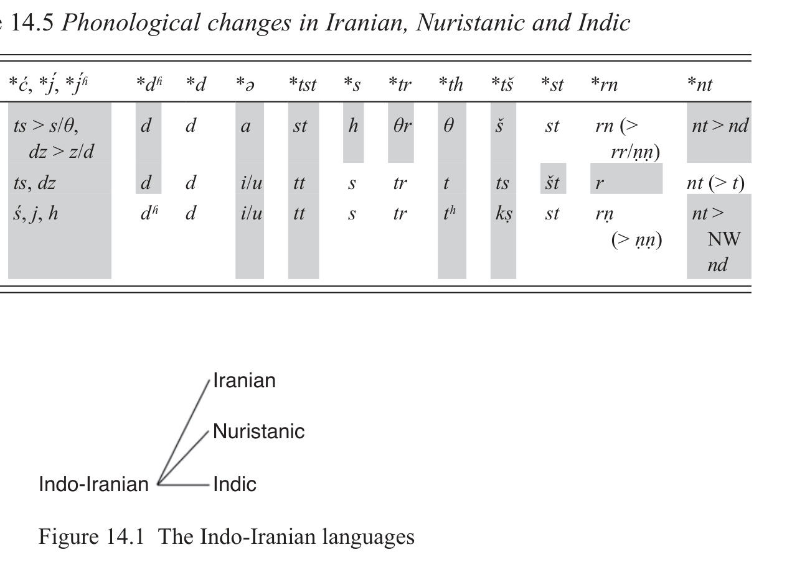

# 14 Indo-Iranian

Martin Joachim Kümmel

<!-- page: 246; pdf-page: 264 -->

## 14.1 Introduction

Indo-Iranian is mainly divided into the two big sub-branches of Indo-Aryan and Iranian.1 IIrn. languages are first attested in the fifteenth century BCE in the Hurrian state of Mit(t)an(n)i and surrounding areas through divine, throne and personal names as well as through hippological terms. Linguistically and culturally, this variety seems to belong rather to Indo-Aryan = WIA (cf. Mayrhofer 1982; Lipp 2009, 1: 265–73, 310–17). Otherwise, Indo-Aryan is confined to south-eastern Afghanistan and the Indian subcontinent = (E)IA, with the language of its oldest texts, i.e. the<i> Rigveda</i>, being slightly less archaic than WIA. To explain this distribution, we can assume that IA was originally a southern branch whose speakers then migrated both westwards and east-wards, possibly under pressure from Iranian coming from the north. Iranian itself was very widespread from the Pontic steppe towards Central Asia and Mesopotamia. Its oldest texts are roughly contemporaneous with Vedic IA. Due to this wide geographical distribution, Iranian is more diverse (the validity of the sub-branch was even doubted by Tremblay 2005).

## 14.2 Evidence for the Indo-Iranian Branch

Of course, innovations are more interesting than archaisms. There are some important laws and changes that are characteristic for Indo-Iranian and which could be innovations.

### 14.2.1 Bartholomae’s Law

Bartholomae’s Law, i.e. the rule on progressive rather than regressive assimilation in obstruent clusters starting with a “media aspirata” stop, is an active rule in Sanskrit, and its results are still faithfully reflected in Old Avestan morphophonology, although the distinction between media and aspirata has

1 Conventions of transcription: (P)IE *<i>h</i>, *<i>χ</i>, *<i>ʁ</i>; *<i>k</i>, *<i>g</i>; *<i>q</i>, *<i>ɢ</i> = traditional *<i>h₁</i>, *<i>h₂</i>, *<i>h₃</i>; *<i>k̑</i>, *<i>g̑</i>;

*<i>k</i>, *<i>g</i>.

<!-- page: 247; pdf-page: 265 -->

already been lost. Accordingly, it must be reconstructed for Proto-Indo-Iranian and even Proto-Iranian.2 Since there are hardly any traces of this law outside of Indo-Iranian, it is disputed whether it can be a PIE law or an IIrn. innovation. However, the rule was abandoned completely as early as Younger Avestan (only isolated examples survived in later Iranian), and so the lack of evidence in IE languages attested later than that is hardly significant, since it is highly likely that the rule was lost independently. Even its absence from Anatolian and Greek may reflect rule loss, since devoicing of the aspirates in the latter would have obscured the rule, and in the former, media and aspirata merged in the same way as in Iranian and, probably, voicing was lost altogether. Furthermore, the rule is even easier to motivate in a stage of PIE that had not yet developed aspiration (cf. Miller 1977a; 1977b) and in which the “mediae” did not participate in the voicing (or fortis-lenis) contrast. Thus, it is quite possible that BL is an archaism, but its loss elsewhere is trivial enough not to require a common innovation of the other branches.

### 14.2.2 Grassmann’s Law

Due to the general loss of breathy voice in Iranian and Nuristanic, it is difficult to say whether Grassmann’s Law (GL), i.e. the dissimilation of an aspirated stop preceding another aspirated stop, occurred already in Proto-Indo-Iranian or only later in Indo-Aryan. The latter assumption would imply a rather long period without dissimilation, which seems quite possible considering the parallel development in Greek, where it clearly happened only after the (rather late) devoicing of aspirates.

Scharfe (1996) has argued for dialectal differences in the chronology of the application of GL and the Vedic devoicing of sibilant clusters, which would necessarily imply a late date for GL. However, this is based on very little evidence and does not explain the whole distribution (see Kobayashi 2004: 106–7, 114–16, 122–7; Lipp 2009, 1: 252–7), so it remains much more probable that GL preceded the devoicing everywhere and thus could be of PIIrn. date.

There is a small circumstantial argument for an early date: the 2sg. imperative of PIIrn. *<i>ǵʱan</i>/<i>gʱn-</i> ‘to hit, kill’ starts with a palatal in both Vedic<i> jahí</i> and Avestan<i> ja</i>i<i>δi</i>, while the parallel imperative of *<i>gam-</i>/<i>gm-</i> ‘to come’ is Vedic <i>gahí</i> = Av.<i> ga</i>i<i>dī</i> with the expected velar. The palatal in the former might have been taken over from the strong stem to avoid homonymy of these forms. If this had happened already in PIIrn., it would presuppose that the two forms *<i>gʱadʱí</i> ‘hit!’ and *<i>gadʱí</i> ‘come!’ had already become homonymous by GL, so that

2 Tremblay (2005) even took this as an argument that the original Old Avestan language still had

two distinctive voiced stop series, i.e. preserved voiced aspirates.

<!-- page: 248; pdf-page: 266 -->

*<i>gadʱí</i> was replaced by *<i>ǵadʱí</i> to solve this problem. However, a parallel development is not completely excluded: a partial spread of the palatal can also be observed in other zero-grade forms of *<i>ǵʱan-</i>, too, cf. Ved. prs.2pl. <i>hathá</i>, OAv. infinitive<i> ja</i>i<i>diiāi</i>.

Furthermore, there is evidence in Tocharian that it also underwent the same kind of dissimilation (but see the more cautious assessment in Section 6.5.2 n. 10): while *<i>dʱ</i> normally became<i> t</i> (><i> c</i> when palatalized) and thus merged with original *<i>t</i>, it sometimes shows the result<i> ts</i> (palatalized), merging with *<i>d</i>, and such cases only appear if a second aspirate follows, e.g. Toch.B gerundive<i> tsikale</i> < ‘should be made’ < PToch. *<i>tsik-a-</i> < PIE *<i>dʰigh-</i>, to *<i>dʰei̯gʰ-</i> ‘form’. For the other stops, the eventual complete merger of all series makes it impossible to see if there was a similar dissimilation.

As a sporadic or narrowly conditioned change, aspiration dissimilation is also found in Latin (see Weiss 2018 and Section 8.2 n. 11) and Armenian (only before a nasal cluster? Cf. Rasmussen 1989: 170–1 n. 16; Martirosyan 2010: 726). In later Indo-Aryan, similar dissimilations also happened again, when new sequences of breathy voiced stops had arisen.

### 14.2.3 Brugmann’s Law

Brugmann (1876) postulated a change of “*<i>a2</i>”, i.e., *<i>o</i> > (*<i>ō</i> >) *<i>ā</i> in open syllables before a consonant. This proposal did not gain much support subsequently, and Brugmann himself withdrew it. However, the reconstruction of laryngeals led to its resurrection, since it could explain many apparent exceptions as conditioned by a lost laryngeal (see Kuryłowicz 1927: 206–7; Lubotsky 2018: 1877).<i> Pace</i> Kiparsky (2010: §2.3), the data are still easier to explain by applying a real sound law than by invoking a special grammatically conditioned development of “floating” *<i>o</i>. The counterexamples given by Kiparsky are either invalid (because they can have original *<i>e</i> or a cluster *<i>CH</i>) or can be explained by inner-paradigmatic analogy (as *<i>pári-</i>, *<i>áwi-</i>), while *<i>ā</i> in the first dual and plural of the thematic inflection is not explained by Kiparsky’s account.3

A similar change can be observed in Anatolian: accented *<i>ó</i> was apparently lengthened > *<i>ṓ</i>> Hitt. Luw.<i> ā́</i> (vs. *<i>á</i> ><i> ă</i>), even in closed syllables, cf. Hitt. <i>kānki</i> ‘hangs’ < *<i>k̑</i> <i>ónkej</i>, Luwian<i> hās</i> ‘bone’ < *<i>χóst</i>.4 Unfortunately, it remains

3 Pyysalo (2013: 114–25) rejects the law in its original form but assumes a “corrected” version,

“Brugmann’s Law II”, where lengthening is only found if *<i>o</i> was followed by a lost “glottal fricative” *<i>ḫ</i>(≃*<i>h₂</i>), while he rejects all other compensatory lengthenings caused by laryngeals. This leads to unnecessary postulation of a glottal fricative for all cases of Indo-Iranian<i> ā</i> = European *<i>o</i>, and his reconstruction methodology is very problematic in general. 4 Chronology and details are disputed, see Kloekhorst 2008a; 2008b: 98–9; 2014: 250, 553–9;

583–4 vs. Melchert 1994: 105, 131, 243–4, 264; 2012b.

<!-- page: 249; pdf-page: 267 -->

unclear if this was an early change and if it happened in all Anatolian languages (in Lycian *<i>e</i> and *<i>o</i> clearly merged into<i> e</i>, but the quantity distinction was lost there).

The mechanism of this sound change is not really clear: could it have been a lengthening of “tense” [o] vs. “lax” [ɛ] (Keydana 2012)? Or is it rather a kind of relic of an originally long vowel (Kümmel 2012: 308–20), similar to what Brugmann proposed (cf. also Viredaz 1983: 35–7; Woodhouse 2012: 2 n. 1; 2015: 6–9)? This last option would presuppose a common innovation of most other languages, i.e. shortening of *<i>ō</i> in most environments (preceding *<i>oH</i> > *<i>ō</i>); however, this is difficult to reconcile with preserved IE *<i>ō</i> in at least forms with lengthened grade.

### 14.2.4 The Vowel Merger

The most striking feature of Indo-Iranian is the merger of all non-high vowels instead of partial mergers in the neighbouring languages; elsewhere this is only found in Luwic (at least in Luwian). It is probable that this merger happened in two stages: first a lowering with a merger of non-front *<i>o</i> = *<i>a</i> > (back) *<i>a</i>, then a merger of front *<i>æ</i> = *<i>a</i> > (central) *<i>a</i>. The intermediate stage with *<i>æ</i>: *<i>a</i> might be reflected by some Uralic loanwords, but this is not certain.

The more restricted merger of *<i>a</i> and *<i>o</i> is much more widespread: it is attested both in Anatolian (except Lycian but cf. above) and a “north-eastern European” area from Albanian and Messapic to Balto-Slavic and Germanic. In fact, only Tocharian and the southern languages from Celtic to Armenian show a distinction of these vowels. Thus the first step of the Indo-Iranian merger might be part of a larger areal development. For long *<i>ā</i> and *<i>ō</i> the merger is restricted to Anatolian, Germanic and Slavic, and in non-final syllables it is also found in Celtic. Albanian merges *<i>ē</i> and *<i>ā</i>, probably together with Messapic and Phrygian.

### 14.2.5 The Liquid Merger

The apparently complete merger of PIE *<i>l</i> = *<i>r ></i> *<i>r</i> is not found anywhere else in IE. Substrate influence is therefore quite probable, but no known language in the relevant regions shows this phenomenon. Note that the often assumed “retention” of<i> l</i> in some cases in IIrn. languages is probably a mirage with no historical foundation (see Hock 1991: 138; Mayrhofer 2004); there is no attested variety in which<i> l</i> shows a statistically valid correlation with PIE *<i>l</i>. Preservation is also contradicted by the fact that the liquid merger fed the<i> ruki</i> development, i.e., PIE *<i>ls</i> turned into *<i>rs</i> > *<i>rš</i> in all of Indo-Iranian, cf. the

<!-- page: 250; pdf-page: 268 -->

root *<i>kʷels-</i>/*<i>kʷols-</i>/*<i>kʷl̩s-</i> (Gr.<i> τέλσον</i> ‘furrow’) > PIIrn. *<i>ḱarš-</i>/*<i>karš-</i>/*<i>kr̩ š-</i> ‘to pull, draw, plough’ > Ved.<i> carṣ-</i>/<i>karṣ-</i>/<i>kr̥ ṣ-</i> = Iranian *<i>karš-</i>/*<i>kərš-.</i>5

### 14.2.6 Weak Stem in Accusative Plural

While in Indo-Iranian the accusative plural belongs to the “weak” stem, elsewhere it normally belongs to the “strong” stem. The only exceptions are “proterokinetic”<i> i</i>/<i>u-</i>stems with *<i>-ej-es</i>: *<i>-i-ms</i>; *<i>-ew-es</i>: *<i>-u-ms</i>. The simplest explanation for this difference is an Indo-Iranian innovation, used to repair the homophony of accusative *<i>-m̩ s</i> ><i> -as</i> = nominative *<i>-es</i> ><i> -as</i>, building on the existing model of the<i> i</i>/<i>u-</i>stems (see Hock 1974).

### 14.2.7 Laryngeal Aspiration

Indo-Iranian is the only branch with incontestable examples of aspiration caused by a following laryngeal. The most famous examples show *<i>h₂</i> after stops: • *<i>meg̑ χ-</i> > *<i>maj́h-</i> > *<i>maj́ʱh-</i> ‘big’ > Ved.<i> máh-</i>, cf. Gr.<i> μέγα</i>, Hitt.<i> mē̆</i> <i>kk-</i>

(together with Iranian *<i>majh-</i> > *<i>mach-</i> > *<i>mac-</i> ><i> mas-</i>,<i> maθ-</i>, see Section 5.3) • *<i>sístχa-</i> > *<i>sištha-</i> > Ved.<i> tíṣṭha-</i> ‘to stand’, cf. Gr.<i> stā-</i>,<i> -sth-</i> (in cases like

<i>Ὀρεσθ-</i>) • *<i>pl̩tχú-</i> > *<i>pr̩ thú-</i> ‘broad’ > Ved.<i> pr̥ thú-</i> = Av.<i> pərəθu-</i>, cf. Gr.<i> Πλαταια</i>ί • pf.2sg. *<i>-tχa</i> > Ved.<i> -tha</i> = Av.<i> -θa</i>, cf. Gr.<i> -tha</i>, cf. also Vedic mid.2sg.<i> -thās</i>. For *<i>h₁</i> this is controversial, but there are some potential examples: • *<i>pónt-e</i>/<i>oh-</i> ~ *<i>pn̩ t-h-</i> > *<i>pántā-</i> ~ *<i>path-</i> > Av.<i> paṇtā-</i> ~<i> paθ-</i> (see de Decker

2012) • 2pl. *<i>-the</i> > Ved.<i> -tha</i> = Av.<i> -θa</i> (but cf. Sabellic *<i>-tā</i> < *<i>-tah₂</i> if not from the

dual?). Continuation of *<i>h₁</i> as an aspirating sound would also be supported by *<i>dʱedʱh-</i> > *<i>dadh-</i> > *<i>dath-</i> > Proto-Iranian *<i>daθ-</i> (see above), but this example does not show secondary aspiration as such.

5 There have been attempts to include pre-PIIrn. *<i>l</i> as [+high] (which would require a change to

a palatal or at least retroflex) in the sounds that triggered<i> ruki</i> (see Lipp 2009, 1: 33 n. 72) but this is contradicted by its different behaviour in all other<i> ruki</i> languages. There is no other evidence that IE or pre-PIIrn. *<i>l</i> had an articulation place different from *<i>n</i>. Fortunatov 1881 claimed a special development of *<i>lt</i> > Skt.<i> ṭ</i>(etc.), but this is generally rejected today; Pyysalo (2013: 227–43) has tried to modify Fortunatov’s Law by also including *<i>r</i> but assuming an adjacent “diphonemic pair” *<i>ah</i>/<i>ha</i> = laryngeal as additional conditioning. This cannot be accepted since it is phonetically unmotivated, and the general approach is based on a flawed reconstruction methodology and much dubious material.

<!-- page: 251; pdf-page: 269 -->

In Greek only *<i>TχV</i> ><i> TʰV</i> seems to be possible, but this is disputed (cf. Cowgill 1965 vs. Peters 1991), and other branches show no clear evidence. Armenian and Slavic seem to show<i> x</i> < *<i>kχ</i>, cf. *<i>tk̑</i> <i>áχkχ-</i>/<i>(t)k̑ χkáχ-</i> ‘branch’ > Arm.<i> cʽax,</i> CSl. *<i>soxà</i> (c) = Ved.<i> śā́khā-</i>, Sogd.<i> šāx</i> (beside MPers.<i> šāg</i>), but this does not necessarily presuppose an intermediate stage with aspiration. No other evidence is found in languages without phonological aspiration.

Notably, it is not altogether clear if Iranian participated in the development of aspiration, or if clusters of stops + *<i>h</i> just underwent preconsonantal fricativization of stops followed by loss of *<i>h</i> (see Kümmel 2018c: 162–4).

### 14.2.8 A Striking Difference

There is one striking difference between IIrn. and the rest of Nuclear IE (= Indo-Tocharian, see Olander 2019):6 “vocalization” of laryngeals leads to low(er) vowels everywhere from Tocharian to Celtic, and from Greek to Germanic, but in Indo-Iranian, we only find the high vowel<i> i</i>, and Iranian and Indo-Aryan do not agree in the conditioning, with Iranian most often showing no vowel. The simplest explanation for this situation is that epenthesis was partly post-PIIrn. (see Kümmel 2016c; Aufderheide & Keydana 2016), and that<i> i</i> is not a direct reflex of the laryngeal. It can thus rather be compared to Greek cases of “schwa secundum” =<i> i</i> insertion (de Vaan 2009). This rather strong difference might be interpreted as an early divergence of Indo-Iranian vs. the rest. However, differences in details exist between all other branches, too, so it remains unclear how fundamental this is.

## 14.3 The Internal Structure of Indo-Iranian

In the oldest stage, there are no fundamental or significant grammatical differences between Iranian and Indo-Aryan. The morphology and syntax of the earliest Vedic and Old Avestan texts are very close, and the main differences are found in phonology and lexicon.

### 14.3.1 Phonological Features

An overview of the main phonological differences is shown in Table 14.1 (clear innovations are shaded).

6 There are no really good examples of “vocalization” in Anatolian: weak stems like<i> as-</i>,<i> ad-</i> for

*<i>h₁s-</i>, *<i>h₁d-</i> are possibly analogical, and Luw.<i> tuwatr-</i>, Lyc.<i> kbatra</i> ‘daughter’ is not clear enough.

<!-- page: 252; pdf-page: 270 -->

For Proto- or Common Iranian affricates see Lipp 2009, 1; 183–91; Peyrot 2018; for the development of “thorn” clusters (*<i>tk̑</i> > *<i>tć</i> > *<i>tš</i> etc.) see Lipp 2009, 2: 1–313 with refs.

### 14.3.2 Morphosyntactic Features: Iranian vs. Vedic

There are a number of mostly minor differences in morphological detail between Old Iranian and Vedic Sanskrit. Most often, Indo-Aryan has innovated while the older stage is better preserved in Iranian (Table 14.2).

However, there are also some cases where Old Avestan stands against an innovation in Younger Avestan, Old Persian and Vedic, so it seems that there was a parallel development in Indo-Aryan and younger Iranian (Table 14.3).

Only rarely is it Old Avestan that innovates vs. archaisms in Younger Avestan and (if applicable) Vedic (Table 14.4).

**Table 14.1 Main phonological differences between Iranian and Indic**

Proto-Indo-Iranian Iranian Indic Remarks

*<i>b</i>, *<i>d</i>, *<i>g</i>: *<i>bʱ</i>, *<i>dʱ</i>, *<i>gʱ</i> <i>b</i>,<i> d</i>,<i> g</i> <i>b</i>,<i> d</i>,<i> g</i>:<i> bʱ</i>,<i> dʱ</i>,<i> gʱ</i> merger *<i>p</i>, *<i>t</i>, *<i>k</i> /<i>_C</i> <i>f</i>,<i> θ</i>,<i> x</i> <i>p</i>,<i> t</i>,<i> k</i> fricativization *<i>ph</i>, *<i>th</i>, *<i>kh</i> <i>f</i>,<i> θ</i>,<i> x</i> <i>ph</i>,<i> th</i>,<i> kh</i> (only a special case of the

previous row) *<i>ć</i>, *<i>j</i> *<i>ts</i>, *<i>dz</i> ><i> s</i>/<i>θ</i>,<i> z</i>/<i>δ</i> <i>ś</i>,<i> j</i> depalatalization

*<i>j́</i>, *<i>j́ʱ</i>: *<i>ǵ</i>, *<i>ǵʱ</i> *<i>dz</i>: *<i>j</i> <i>j</i>,<i> h</i>:<i> j</i>,<i> h</i> merger

*<i>s</i> <i>h</i> <i>s</i>

*<i>š</i> <i>š</i> <i>ṣ</i> only phonetic

*<i>zD</i>, *<i>žD</i> <i>zd</i>,<i> žd</i> <i>ːd</i>,<i> ːḍ</i> not yet in WIA

*<i>tst</i>, *<i>dzdʱ</i> <i>st</i>,<i> zd</i> <i>tt</i>,<i> ddʱ</i> different simplification

*<i>tš</i>: *<i>kš</i> *<i>č</i> ><i> š</i>:<i> xš</i> <i>kṣ</i>:<i> kṣ</i> dissimilation, merger *<i>r</i> *<i>ər</i> (?) *<i>r</i> only phonetic?

*<i>ər</i> <i>ar</i> (~<i> ər</i>?) <i>ī̆r</i>/<i>ū̆</i> <i>r</i> see Cantera 2001

*<i>h-</i> <i>h</i>/<i>x</i> ~ ∅ ∅ Kümmel 2016a: 83;

2018c: 166 *<i>Dh</i>, *<i>Bh</i>, *<i>Jh</i> *<i>Dahi</i>/<i>u</i> *<i>θ</i>, *<i>f</i>, *<i>ts</i> *<i>θai</i>/<i>u</i> <i>dʱ</i>,<i> bʱ</i>,<i> h</i> *<i>dai</i>/<i>u</i> Kümmel 2016a: 82–3;

2018c: 165–6 *<i>-CHC-</i> <i>CC</i> <i>CiC</i> see Werba

2005; Kümmel 2016c: 219–22 *<i>pt-</i> <i>ft</i> <i>pit</i> epenthesis (Kümmel 2016c:

222–3) *<i>pst-</i>, *<i>db-</i>, *<i>dm-</i> <i>fšt</i>,<i> db</i>,<i> dm</i> <i>st</i>,<i> b</i>,<i> m</i> see Kümmel 2014: 211–12 *<i>-kš(t)</i>,<i> -kšt-</i> <i>xš(t)</i>,<i> xšt</i> <i>k</i>,<i> kt</i> simplification, see Kümmel

2014: 212–14

<!-- page: 253; pdf-page: 271 -->

### 14.3.3 The Special Case of Nuristanic

The so-called Nuristani languages are spoken just between Eastern Iranian and NW Indo-Aryan in the Hindukush region. They are only attested in modern times and represent a group of transitional languages between Indo-Aryan and Iranian, rather difficult to classify due to the lack of ancient data. In some features, they agree with Iranian, in others with Indo-Aryan, but they clearly differ from both since early times:

**Table 14.2 Morphological differences between Iranian and Indic**

Iranian Indic Remarks

gen.: loc. dual *<i>-ās</i>: *<i>-aw</i> *<i>-awš</i> cf. Slavic *<i>-u</i> < *<i>-au(š)</i>

instr.-dat.-abl. dual *<i>-aybʱyā</i> > OAv.

<i>-ōibiiā</i>, YAv. <i>-aēbiia</i>, OPers.<i> -aibiyā</i>

*<i>-ābʱyā(m)</i> >

<i>-ā́bhyām</i>

<i>u-</i>stem type<i> -āw-</i> (nom.

sg., acc.sg.)

<i>-āuš</i>,<i> -ām</i> <i>-úṣ</i>,<i> -úm</i>

n.<i> n-</i>stem gen.sg. *<i>-ans</i> > OAv.<i> -ə̄ ṇg</i> <i>-nas</i>

<i>a-</i>stem instr.sg. *<i>-ā</i> <i>-éna (-ā́)</i> comparative *<i>-yās-</i>,

perf.ptc. *<i>-wās-</i>

*<i>-yāh</i>, *<i>-wāh-</i> <i>-yāṃs-</i>,<i> -vā́ṃs-</i>

<i>nt-</i>ptc. to thematic stems *<i>-ant-</i> <i>-at-</i> ablaut taken over

from athematic bases 1sg. pronoun gen. *<i>mana</i> <i>máma</i> but cf. Khot.<i> mamä</i> 2pl. pronoun nom. *<i>yūž-am</i> <i>yūyám</i> contamination with

1pl.<i> vayám</i> 3ps. encl. dative *<i>hai</i> ~ *<i>šai</i> <i>–</i> loss in Indic possessives av.<i> ma-</i>,<i> θβa-</i> <i>–</i> loss in Indic (but also

in later Iranian) distal demonstrative *<i>awá-</i> acc.sg.

*<i>aw-ám</i>

<i>amú-</i> acc.

sg. *<i>am-ú</i>

see Klein 1977

interrogative <i>ci-</i>,<i> ca-</i>:<i> ka-</i> <i>ká-(kím)</i> generalization of<i> k-</i> numeral ‘one’ *<i>aywá-</i> *<i>áyka-</i> middle thematic ptc. <i>-mna-</i> <i>-māna-</i> but cf. MIA<i> -mīna-</i> active optative <i>-ī-</i>:<i> -yā-</i> only<i> -yā-</i> (few relics of *<i>°aH-ī-)</i> 3pl. SE <i>-at</i> (:<i> -rš</i>) only<i> -ur</i>

subj.mid.1sg. *<i>-ānai</i> (~ *<i>-āi)</i> only *<i>-āi</i>

mid.3pl. *<i>-ārai</i>, *<i>-āra(m)</i> ~

*<i>-rai</i>, *<i>-ra(m)</i>

only *<i>-rai</i>

<!-- page: 254; pdf-page: 272 -->

• “Iranian” features: depalatalized *<i>ts</i>,<i> dz</i> distinct from *<i>č</i>,<i> ǰ</i>; no aspirates

(= deaspiration)7 – rather trivial developments (also attested in neighbouring Indo-Aryan but much later) • “Indic” features: *<i>tst</i>,<i> dzdʱ</i> ><i> tt</i>,<i> dd</i>; *<i>ər</i> > *<i>i</i>/<i>ur</i>;8 preserved<i> s</i>, no

fricativization • special features:

• *<i>ćš</i>/<i>tć</i> > *<i>tš</i> > *<i>ts</i> vs. Iranian<i> š</i>, Indic<i> kṣ</i>, cf. Kati<i> iċ</i> ‘bear’

**Table 14.3 Morphological archaisms in Old Avestan**

Old Avestan Elsewhere Remarks

accusative 1/2pl. <i>nā̊</i> < *<i>nās</i> <i>vā̊</i> < *<i>wās</i>

*<i>nas</i>, *<i>was</i> (= dative-

genitive)

cf. Lat.<i> nōs</i>,<i> uōs</i>, OCS<i> ny</i>,<i> vy</i>

nom.acc.pl.n.<i> r</i>/

<i>n-</i>stems

-<i>ārə</i> YAv.<i> -ąn</i> = Ved.<i> -ān-i</i> cf. Hitt.<i> -ār</i>

1sg. present <i>-ā</i> ~<i> -āmi</i> only<i> -āmi</i> cf. general European *<i>-ō</i> velar ~ palatal

alternation

<i>aōgō</i> YAv.<i> aōjō</i> = Ved.<i> ójas</i> generalized velar in Ved.

<i>ā́gas-</i>,<i> ókas-</i>, elsewhere palatal inflection of *<i>wicwa-</i>

‘every, all’ *<i>anya-</i> ‘other’

OAv.<i> vīspā̊</i> <i>ŋhō</i>

“Median” <i>aniyāha</i>

Ved.<i> víśve</i>,<i> anyé</i> YAv.

<i>vīspe</i>,<i> ańiie</i> OPers. <i>aniyai</i>

pronominal desinences of

adjectives (archaism in OAv. not sure)

**Table 14.4 Morphological innovations in Old Avestan**

YAv. (= Ved.) Old Avestan Remarks

gen.sg. *<i>krátwas</i>,

*<i>paćwás</i>, *<i>pitvás</i>

<i>xraθβō</i> =<i> krátvas</i> <i>pasuuō</i> =<i> paśvás</i> *<i>piθβō</i> =<i> pitvás</i>

<i>xratə̄ uš</i> <i>pasə̄ uš</i> <i>pitə̄ uš</i>

most productive

inflectional type

acc.pl. *<i>pr̩ twás</i> <i>pərəθβō</i> <i>pərətūš</i> weak stem *<i>majh-</i>,

*<i>dadh-</i> > *<i>mac-</i>, *<i>daθ-</i>

<i>mas-</i>,<i> daθ-</i> =<i> mah-</i>,<i> dadh-</i>

<i>maz-</i>,<i> dad-</i> analogy after strong

stem<i> mazā-</i>,<i> dadā-</i>

7 However, since Dameli (in spite of some doubts) probably belongs to Nuristanic and appears to

show voiceless aspirates in line with Indo-Aryan, the loss of voiceless aspirates in the rest of Nuristanic may be a late innovation. For voiced aspirates, the merger of the palatal aspirates with the simple voiced palatals presupposes a chronology different from Indo-Aryan, but this only requires that aspiration was lost before the debuccalization of palatal aspirates. 8 With one probable exception: *<i>wərnā-</i> ‘wool’ did not become *<i>wurnā-</i> (> Ved.<i> ū́rṇā-</i>) but

*<i>warnā-</i> > *<i>wārā-</i>; cf. Av.<i> varənā-</i>.

<!-- page: 255; pdf-page: 273 -->

• *<i>st</i> ><i> št</i> (Kati<i> dušt</i> ‘hand’); *<i>š</i>/<i>ṣ</i>><i> s</i> (secondary, see Cathcart 2011);<i> Vrn</i>

(> *<i>rr?)</i> ><i> V̄</i> <i>r</i> • no voicing in<i> nt</i>,<i> nk</i>,<i> nč</i> (vs. most neighbours).

See Table 14.5 (innovations shaded). The most recent discussion is by Werba 2016, who argued that Nuristanic forms a subgroup with Indo-Aryan; but even if he was right to stress that similarities to Iranian do not require a common stage, the differences from Indo-Aryan are strong enough that for all practical purposes, Nuristanic has to be treated as an independent third branch (see Figure 14.1). It did not participate in most early innovations of either Iranian or Indo-Aryan.

In the lexicon, Nuristanic shows some possibly ancient similarities to Iranian (e.g., *<i>khanda-</i> ‘to laugh’, *<i>waina-</i> ‘to see’, *<i>arjana-</i> ‘millet’, *<i>pragāma(ka)-</i> ‘young animal’, *<i>j́ʱayan-</i> ‘winter’, *<i>tridaća</i> ‘13’, *<i>ḱatrudaća</i> ‘14’), but much more often it agrees with Indo-Aryan, which, however, could be due to secondary influence in most cases. It does not share most typical early Iranian (potential) innovations like *<i>gʱauša-</i> ‘ear’, *<i>ḱatšman-</i> ‘eye’, *<i>wasunī-</i> ‘blood’, *<i>ātr-</i> ‘fire’, *<i>swar-</i> ‘to eat’.

### 14.3.4 Lexical Differences

Some examples of lexical differences between the main branches are shown in Table 14.6 (dating of innovations is of course uncertain in Nuristanic due to the lack of ancient data).

<!-- page: 256; pdf-page: 274 -->

9 Derived from the noun *<i>wainá-</i> > Ved.<i> vená-</i> ‘watcher’, MPers.<i> wēnag</i> ‘guard, watchman’; Indic

preserves the narrower meaning; the broadened meaning may also be reflected by an apparently old loanword into Western Uralic, cf. *<i>wajna-</i> > Southern Saamic *<i>wuojnē-</i> ‘to see’, Mordvin <i>vano-</i>/<i>vanə̑ -</i> ‘to watch’ (see Holopainen 2019: 312–13).

Iranian (Avestan)

Nuristanic Indic Remarks

‘fire’ <i>ātar-</i> <i>(-aɣni-)</i>

*<i>angāra-</i>

<i>agní-</i> choice of inherited terms; replaced

by<i> angāra-</i> ‘glowing coal’ in Nuristanic and “Dardic” IA ‘water’ <i>–</i> <i>āp-</i>

– *<i>āp-</i>

<i>vā́r</i>/<i>udán-</i> <i>ā́p-</i>

derivatives in Irn. Nur.

‘rain’

<i>vāra-</i>

*<i>warṣa-</i> <i>varṣá-</i>

derivative of *<i>waHr</i> ‘water’ ‘eye’ <i>(aši)</i> <i>cašman-</i>

*<i>akši</i> <i>ákṣi</i> <i>cákṣuṣ-</i>

parallel innovations

‘ear’ *<i>ušī</i>

*<i>gauša-</i>

*<i>karna-</i> >

*<i>kāra-</i>

<i>kárṇa-</i> cf. Av.<i> karəna-</i> = Ved.<i> karṇá-</i>

‘deaf’ Ved.<i> ghóṣa-</i> ‘sound’

‘to eat’ <i>xᵛar-</i> *<i>yaw-</i> <i>ad-</i> *<i>yaw-</i> also in Waxi and

Chitral IA ‘to drink’ <i>xᵛar-</i> *<i>pā-</i> <i>pā-</i> relics in easternmost Iranian:

Waxi<i> pəv-</i> < *<i>piba-</i> ‘to see’ <i>vāena-</i> *<i>waina-</i>

<i>páśya-</i>

Ved.<i> véna-</i> ‘to look after’9

Av.<i> spasiia-</i> ‘to watch’

‘blood’ <i>vohunī-</i> *<i>asan-</i> <i>ásr̥ k</i>,<i> asan-</i> ‘bird’ <i>vi-</i>? <i>ví-</i>

<i>mərəɣa-</i> *<i>mr̩ ga-</i> <i>pakṣín-</i> Ved.<i> mr̥ gá-</i> ‘animal, game, deer’

‘spring’ *<i>wasar-</i>

*<i>wasanta</i> <i>vasantá-</i> ‘winter’ <i>zim-</i> <i>zaiian-</i> *<i>jayan-</i>

<i>hemantá-</i> ‘ice’ *<i>yaja-</i>? <i>aēxa-</i> ‘snow’ <i>snaiga-</i> *<i>snih-</i>, *<i>sneha-</i> *<i>jim-</i> <i>jima-</i> <i>himá-</i> <i>vafra-</i> ‘moon’ <i>māh-</i> <i>mās-</i> <i>mā́s-</i>

<i>candrámās-</i> ‘sky’ <i>(diiu-)</i> <i>dyā́v-</i>

<i>asmān-</i> <i>abra-</i>

‘stone’ <i>asan-</i>,

<i>asəṇga-</i>

<i>áśman-</i>,<i> áśn-</i>

*<i>warta-</i> *<i>warta-</i> *<i>warta-</i> *<i>gari-</i> *<i>giri-</i>

‘mountain’ <i>ga</i>i<i>ri-</i> <i>paᵘruuata-</i>

<i>girí-</i> <i>párvata-</i>

*<i>kaufah-</i>

*<i>dārā-</i> *<i>dhārā-</i>?

<!-- page: 257; pdf-page: 275 -->

For differences in most of the agricultural terminology (as opposed to animal husbandry), see Kümmel 2017.

## 14.4 The Relationship of Indo-Iranian to the Other Branches

### 14.4.1 The Central IE Sound Shift

Indo-Iranian seems to belong to the group of IE languages that reflect voiced aspirates and thus presuppose the “central IE sound shift” (Kümmel 2012: 304– 6; 2016c: 130–2), i.e. a chain shift from PIE (PIA) *<i>d</i>:<i> ɗ</i> > Central IE *<i>dʱ</i>:<i> d</i>. This is clear for Indo-Aryan, which has had breathy voiced stops ever since Sanskrit. However, it has been proposed that this change did not happen in Iranian (and Nuristanic) where aspiration of media aspirata (MA) is not directly preserved (Lubotsky 2018), so the sound shift would only be an Indo-Aryan innovation, parallel to Greek etc. This is not very easy to determine. One possible argument for pre-Iranian aspiration might be Bartholomae’s Law, the outcome of which is still faithfully observed in Old Avestan. However, this law is possibly older still, since it works even better with pre-shift phonology (cf. progressive voicing as in Turkish) if implosives did not participate in the voicing distinction (cf. above). Thus, its reflection in Old Avestan does not necessarily presuppose aspiration but only some distinction between “media” and “media aspirata”. At first sight, Iranian *<i>dugdar-</i> ‘daughter’ < *<i>dugdʱar-</i> appears to presuppose a post-PIIrn. application of BL, since *<i>dugʱtar-</i> can only have arisen secondarily by loss of the laryngal in *<i>dughtár-</i> < *<i>dʱugχtér-</i>. However, such an allomorph might already have been present in PIIrn. and simply been ousted in Indic (see Lipp 2009, 2: 370–84; Kümmel 2018c: 169). Within a “glottalic” reconstruction of PIIrn., one could also assume *<i>duɠHtar-</i> [ˀɡʔ] > *<i>dug(H)tar-</i> [ɡʔ] > *<i>dugdar-</i> so that we would not strictly need aspiration to be present. However, there is at least one change in Iranian that seems to presuppose aspiration of the MA, namely the transfer of postnasal aspiration to the preceding onset seen in *<i>tengʱ-</i> > *<i>tangʱ-</i> > Iranian *<i>thang-</i> > *<i>θang-</i> ‘to pull’ and maybe also in *<i>kumbʱa-</i> > *<i>khumba-</i> > Iranian *<i>khumba-</i> > *<i>xumba-</i> ‘pot’. This might be supported by a systemic argument: Indo-Iranian does not show any bias against “mediae” after nasals, as one might expect for implosives, so it seems more probable that the “mediae” had already become voiced explosives.

### 14.4.2 The Satem Phenomenon

The so-called<i> satem</i> languages show palatal or depalatalized coronal affricates or fricatives corresponding to<i> centum</i> velar stops, and simple velars corresponding to<i> centum</i> labialized velars (labiovelars). In a third type of

<!-- page: 258; pdf-page: 276 -->

correspondence, all languages have simple velars. The usual PIE reconstruction is so-called “palatals” in the first case, “labiovelars” in the second and “pure velars” in the third. However, the existence of real “pure velars” in PIE has been questioned, and this type of correspondence could also be explained by neutralization of an original twofold contrast between “palatovelars” and “labiovelars”.

The<i> satem</i> languages comprise all Eastern languages except Tocharian, while the areal distribution of<i> centum</i> languages looks much less compact, including the outliers Anatolian and Tocharian, and the European West and South. Therefore, the<i> centum</i> situation is most probably original, and the<i> satem</i> group underwent a chain shift *<i>kʷ</i>: *<i>k</i> > *<i>k</i>: *<i>c</i>. This is a rather trivial phonetic change, but details of phonologization and distribution are far from trivial, cf. forms like *<i>(H)ok̑</i> <i>tóH</i> ‘eight’, synchronically isolated. This requires the assumption of one areal change, possibly cutting across other isoglosses.

The satemization is apparently connected to another areal feature, that of the <i>ruki</i> rule, i.e. a retraction of *<i>s</i> after non-anterior sounds, which is found in more or less the same branches, though to different degrees (with some restrictions in Slavic and Baltic, and only to a very limited extent in Armenian and Albanian, see Martirosyan 2010: 709–10 with refs.). This allophony may have been more widespread in IE but was only phonologized in<i> satem</i> languages since only these developed additional sibilants from other sources (see Andersen 1968).

Similar developments of “palatals” are found in Luwic Anatolian, but then combined with preserved labiovelars. According to the most recent investigation (Melchert 2012a), there was a conditioned palatalization of old “palatals” only; but the claim that original “pure velars” contrastively remained unpalatalized is unsubstantiated: the only example of a preserved velar before a front vowel is Luwian<i> kī̆sā̆</i> <i>(i)-</i> ‘to comb’, and this may have analogical<i> k-</i> or even continue *<i>ks-</i> (there was a regular change of *<i>ks</i> ><i> kis</i> in Hittite, no counterexamples in Luwian). So Luwian might in fact reflect the usual “<i>centum</i>” merger of “palatals” and “velars”, followed by a conditioned palatalization of the resulting velars. However, some words appear to show Luwic “palatals” in environments where secondary palatalization would be improbable: cases like Luw.<i> zanta</i> ‘down’ (Goedegebuure 2010) < *<i>kənt-</i> (cf. Hitt.<i> katta</i>, Gr.<i> κατά</i>) and also HLuw.<i> azu(wa)-</i> ‘horse’,<i> zuwan-</i> ‘dog’ < IE *<i>ekw(o)-</i>, *<i>kwon-</i>, if the latter are not to be read as <i>asu(wa)-</i>,<i> suwan-</i>, borrowed from WIA (as argued by Szemerényi 1976; Lipp 2009, 1: 273–302). If these words show a genuine Luwic development, this looks much more like preserved IE “palatals” than anything secondary.10 Interestingly,

10 One might consider an intermediate stage with a secondary front vowel in the first case, so

something like pre-Luwic *<i>km̩ t°</i> > *<i>kent°</i> > *<i>ḱant°</i> ><i> zant°</i>, but this does not work for the two words with *<i>k̑</i> <i>w</i>.

<!-- page: 259; pdf-page: 277 -->

recent research has also found some<i> ruki-</i>like developments in Luwian (Rieken 2010), which would support the idea that the Luwic developments are<i> satem-</i>like. Currently, it is still unclear how exactly this might be explained.

### 14.4.3 Middle Primary Endings

The “primary” endings of the middle are marked by *<i>-y</i>, identical to *<i>-i</i> used in the corresponding endings of the active. Here IIrn. agrees with Armenian, Albanian, Greek and Germanic, while the more “peripheral” branches Anatolian, Tocharian, Italic and Celtic show *<i>-r</i>. The latter has been interpreted as an archaism and marking by *<i>-i</i>/<i>y</i> as analogical (see Dunkel 2014: 669–70). However, much is still unclear here. In Phrygian, we find<i> -toy</i> earlier than<i> -tor</i> (but never<i> -to</i>). In Tocharian, the preterit middle 1sg. *<i>-ai</i>, 2sg. *<i>-tai</i> could be explained as relics of older<i> -i-</i>endings (see Malzahn 2010: 44–6 with refs.). In Celtic and Italic,<i> -r</i> is not used in all cases, which might point to an incomplete spread.

In Greek, the 1pl. and 2pl. endings are not marked by<i> -i</i> (mirroring the situation in the active), but in Indo-Iranian, they also have a final diphthong *<i>-ay</i>, resulting from a further spread, viz. 1pl. *<i>-madʱay</i> < *-<i>medʱoj</i> for *<i>-mesdʱχ</i>. The same probably happened in Armenian, Albanian and Germanic (see Kümmel 2018b: 194).

### 14.4.4 Verbal Dual Endings

The non-present endings Ved. 2du.<i> -tam</i>, 3du.<i> -tā́m</i> seem to agree perfectly with Gr. 2du.<i> -ton</i>, 3du.<i> -tān</i> < *<i>-tom</i>, *<i>-tā́m</i>. However, the corresponding Avestan endings -<i>təm</i> and<i> -tąm</i> are both used for the 3du., and Toch.B 3du. -<i>te-ṃ</i>(with a secondary nasal) might support the use of *<i>-tom</i> for the 3sg. Similarly, Avestan does not reflect the distinction of Ved. 2du.<i> -thas</i>: 3du.<i> -tas</i> but used <i>-θō</i> =<i> -tō</i> indiscriminately. Gothic 2du.<i> -ts</i> seems to agree, but Greek uses a different ending with no distinction 2=3du.<i> -ton</i>. The Baltic 2du. *<i>-tās</i> and Slavic 2du.<i> -ta</i>,<i> -te</i>, 3du.<i> -te</i> do not agree completely, so a precise reconstruction remains difficult (Pooth 2011 has argued for a secondary differentiation and a connection to the middle).

### 14.4.5 Formation of Accented Personal Pronouns

The PIIrn. stems of the accented non-singular personal pronouns are 1pl. *<i>as-</i> <i>má-</i>, 2pl. *<i>uš-má-</i> < *<i>n̩ s-mé-</i>, *<i>us-mé-</i> vs. 1du. *<i>āwá-</i> < *<i>aH-wá-</i> < *<i>n̩ H-wé-</i> (2du. *<i>yuwá-</i> ⇐*<i>uH-wá-</i>). This agrees most closely with Greek 1pl. *<i>ahme</i>, 2pl. *<i>uhme</i> > Aeol.<i> ἄμμε</i>,<i> ὔμμε</i>; Dor.<i> ᾱ̔ με-</i>,<i> ῡ̔ με-</i>; Ion.-Att.<i> ἡμε-</i>,<i> ῡ̔ με-</i> and 1du. *<i>nō-we</i> < *<i>noH-we (</i>but 2du.<i> σφω</i>). Elsewhere we either find only *<i>nō̆</i> <i>s</i>, *<i>wō̆</i> <i>s</i>

<!-- page: 260; pdf-page: 278 -->

(Italic, Balto-Slavic, Albanian) or 2pl. *<i>uswe</i>: Celtic 2pl. *<i>swīs</i>; Germanic *<i>izwiz</i> or even 1pl. *<i>n̩ swe</i> > Hitt.<i> anze-</i>,<i> sume-</i>, Luw.<i> anzu-</i>,<i> unzu-.</i> The PIE situation is not very clear: apparently extension of the base by both *<i>-me</i> and *<i>-we</i> was possible, and various scenarios have been proposed:

a. pl. *<i>-me</i> vs. du. *<i>-we</i> (Cowgill 1965 = IIrn. + Gr. Archaism) b. 1st *<i>-me</i> vs. 2nd/3rd *<i>-we</i> (Katz 1998: 279) c “inclusive” *<i>-me</i> vs. “exclusive” *<i>-we</i> (Dunkel 2014: 494, 499, 569–74).11

An original inclusive/exclusive distinction appears most promising, but typologically, an inclusive first person (in the usual definition ‘me and you’) often shows a marker of the second person, and this might favour a distribution of first person exclusive *<i>-me</i> (cf. 1sg. *<i>me-</i>) ‘me and someone else but not you’ vs. first person inclusive ‘me and you’ + second person *<i>-we</i> (cf. second person *<i>wo-</i>). In this case, Greek and IIrn. would show a common innovation, i.e. generalization of the exclusive marker *<i>-me</i> in the first person plural followed by its spread to the second person plural, and generalization of the inclusive marker in the first dual. However, this innovation need not be exclusively Greek and IIrn., since corresponding forms might have been lost in all branches that lost these extended forms, i.e. Italic, Albanian, Balto-Slavic and Tocharian.

### 14.4.6 Augment

The so-called augment, i.e. a verbal prefix marking the past vs. the injunctive is only found in Indo-Iranian, Greek, Armenian, Phrygian and Albanian and might be either an archaism lost elsewhere or a common innovation. However, it seems clear that much of the development was parallel rather than shared, since in the earliest records, the prefix had not yet become an obligatory marker. Therefore, the original situation must have been a much less grammaticalized item, in which case it is much easier to assume its loss in other branches.

### 14.4.7 Primary Superlatives

The primary superlative is derived from the primary comparative by the suffix *<i>-t(H)o-</i> in Indo-Iranian, Greek and Germanic, while Italic and Celtic show *<i>-is</i> <i>-m(H)o-</i>. Since both suffixes correspond to some original numerals (see Luján 2019), a parallel development is not unlikely.

11 Dunkel’s reconstruction is based on the particles *<i>me</i> ‘within, together with’ and *<i>we</i> ‘or’, and

he uses an unusual definition of inclusive = ‘me and a third party’ vs. exclusive = ‘me without a third party’.

<!-- page: 261; pdf-page: 279 -->

### 14.4.8 Secondary Comparatives

The suffix *<i>-tero-</i> serves as a productive secondary comparative only in IIrn. and Greek, while elsewhere it can only be derived from pronouns and adverbs. However, the corresponding superlative formation is different: Greek<i> -tato-</i> vs. PIIrn. *<i>-tama-</i>. Therefore, the development was not identical, so the probability of a parallel extension of the existing departicular system is quite high.

### 14.4.9 Formation of Decades

The PIIrn. cardinal numerals ‘thirty’, ‘forty’ and ‘fifty’ are formed by a suffixoid *<i>-(d)ća(n)t-</i>, based on compounds with *<i>-dk̑</i> <i>omt-</i>/<i>dk̑</i> <i>m̩ t-.</i> This seems to agree only with Celtic, where all decades from thirty to ninety are formed with *<i>-dk̑</i> <i>omt-</i>. By contrast, Armenian, Greek, Italic and Tocharian show a slightly different formation with cardinal + collective *<i>dk̑</i> <i>omtχ</i>/<i>dk̑</i> <i>m̩ tχ</i>, and Germanic and Balto-Slavic only use a syntagma with the free word *<i>dk̑</i> <i>m̩ t-</i> (cf. Rau 2009 for an overview and discussion). Since the most original situation remains unclear, the significance of the Celtic–IIrn. agreement is unclear.

### 14.4.10 Instrumental, Dative and Ablative Dual and Plural

In endings of the instrumental, dative and ablative dual and plural, the PIIrn. set *<i>-bʱyā</i>, *<i>-bʱiš</i>, *<i>-bʱyas</i> corresponds more closely to the “southern” set *<i>-bʱoH</i>, *<i>-bʱis</i>, *<i>-bʱos</i> attested from Armenian to Celtic, in contrast to “northern” endings with *<i>-m°</i> in Germanic and Balto-Slavic. Both sets are probably innovations, but the precise development still needs to be clarified (see Melchert & Oettinger 2009; Kim 2013); in any case, the agreement with the southern group indicates closer contact, but differences in details favour an areal development rather than an inherited innovation from a common pre-stage.

## 14.5 The Position of Indo-Iranian

There can be no question that all Indo-Iranian languages are related to one another much more closely than to any other IE language, so Indo-Iranian is clearly defined as a primary branch of IE. The relationship of Indo-Iranian to other branches, however, is much less easy to describe. It has variously been grouped together with quite distinct branches in the history of IE linguistics.

### 14.5.1 Different Trees

Nearly all cladistic models assume Anatolian to have split off first (“Indo-Hittite” model) from PIE with the remaining branches becoming NIE, and most

<!-- page: 262; pdf-page: 280 -->

also assume a second split-off of Tocharian vs. Inner IE (= Indo-Celtic, see Olander 2019) from NIE. Otherwise, they differ in many ways, as in the following overview, with the branches grouped according to how close they are to Indo-Iranian: • Schleicher’s first trees (1860; 1861; 1862): 1. Graeco-Italo-Celtic, 2.

Germanic-Baltic-Slavic • Gamkrelidze & Ivanov 1995: 1. Armenian, 2. Greek, 3. Germanic-Baltic-

Slavic, 4. Italic-Celtic-Tocharian • Hamp 1990: 302: 1. Indo-Iranian = “Asiatic IE” vs. 2. “Residual IE” (all the

rest including Tocharian) • Starostin 2004 (core lexicon only, glottochronology):12 1. Balto-Slavic, 2.

Germanic-Italic, 3. Armenian, Greek, Albanian

Trees based on computational phylogenetic methods: • Ringe, Warnow & Taylor 2002 (mixed features; Germanic not classified): 1.

Baltic-Slavic, 2. Greek, Armenian, 3. Italo-Celtic, 4. Albanian • Gray & Atkinson 2003; Bouckaert et al. 2012 (core lexicon only, problematic

database, Bayesian): 1. Albanian, 2. Baltic-Slavic-Germanic-Italic-Celtic, 3. Greek-Armenian • Chang et al. 2015 (same database and method, different calibrations): 1.

Baltic-Slavic-Germanic-Italic-Celtic, 2. Greek, Armenian, Albanian.13

Thus all neighbouring sub-branches except Tocharian have been assumed to be nearest to IIrn. In what follows, some important isoglosses are briefly discussed.

### 14.5.2 Irrelevant Features: Shared Archaisms

Many common features of Greek and Indo-Iranian are archaisms due to earlier attestation of these branches already in the second millennium vs. all other NIE branches. For example, preservation of: • perfect as a distinct category • original simple imperfect (vs. renewed marked formations in Tocharian,

Armenian, Italic, Slavic) • subjunctive and optative (vs. loss of optative in Celtic, Armenian, of sub-

junctive in Germanic, Baltic-Slavic) • vocabulary and poetic language. It is clear that such evidence is not relevant for subgrouping.

12 Sergej Starostin, 2004, Handout, Workshop on the Chronology in Linguistics, Santa Fe. 13 This is also the result of the most recent application of Bayesian methodology based on

a strongly improved new database in Jena (IE-CoR, with my own participation). The bestsupported tree configuration still shows Indo-Iranian nearer to a group comprising Balto-Slavic and Italic-Celtic-Germanic than to Greek, Armenian and Albanian, but all this with very low certainty.

<!-- page: 263; pdf-page: 281 -->

### 14.5.3 Archaisms Shared with Anatolian (but not Greek)

Some other archaisms are shared with Anatolian but not Greek. The clusters *<i>tst</i> etc. were preserved in PIIrn. (> IA. + Nur. (?) *<i>tt</i>, Irn. *<i>st</i>, as elsewhere in Eastern IE). Morphological archaisms are the middle 3sg. ending *<i>-á(y)</i> < *<i>-ó(-)</i> etc. and the active 3sg. ending<i> -s</i> (see Melchert 2015: 129–31; Kümmel 2018a: 245–52; 2018b: 1912–14); maybe also the numeral *<i>syá-</i> ‘one’ (Kümmel 2016b) = Hittite<i> sia-</i>/<i>sie-</i> (but possibly also in Toch.B<i> ṣe</i>, see Pinault 2006).

Notably, the preservation of consonantal laryngeals seems to be better than anywhere else in NIE: • hiatus in Old Avestan and (less reliably) Vedic: e.g., subjunctive<i> dāt̰</i> {daat}<i> =</i>

<i>dhā́t</i> {dʱaat} < *<i>dʱá(h)at</i> • some laryngeals survived as some kind of *<i>-h-</i> internally after stops into

Iranian, causing devoicing of preceding obstruents (Kümmel 2016a: 82–3; 2018c: 164–5): • *<i>majh-</i> > *<i>mach-</i> > *<i>mac-</i> ><i> mas-</i>/<i>maθ-</i> ‘great’ (vs. *<i>majah-</i> ><i> mazā-</i>) • *<i>dadh-</i> > *<i>dath- daθ-</i> ‘put’ (vs. *<i>dadah-</i> ><i> daδā-</i>); *<i>nābh-</i> > *<i>nāph-</i> ><i> nāf-</i>

‘navel’ (vs. *<i>nabah-</i> ><i> nabā-</i>) • *<i>wabh-</i> > *<i>waph-</i> > *<i>waf-</i> ‘to weave’; *<i>dahiwar-</i> ><i> dhaiwar-</i> > *<i>thaiwar-</i> >

*<i>θaiwar-</i> ‘brother-in-law’ •<i> h-</i>/<i>x-</i> appears to be sporadically preserved in marginal Western Iranian

(Kümmel 2016a: 83; 2018c: 166): e.g., MPers.<i> xirs</i> ‘bear’,<i> xāyag</i> ‘egg’, <i>xāk</i> ‘dust’;<i> hēš</i> ‘ploughshare’,<i> hēsm</i>/<i>hēmag</i> ‘firewood’,<i> hanzūg</i> ‘narrow’; Parthian<i> hand</i> ‘blind’. Especially the cases with<i> x-</i> can hardly be assumed to show a “prothetic” consonant. A similar case can be made for the eastern margin (Khotanese<i> h-</i>, see Kümmel 2020: 246) • loss after<i> i</i>/<i>u</i> was probably only post-Proto-Iranian, cf. the contrast between

lengthening and non-lengthening in cases like *<i>wihrá-</i> > MPers.<i> wīr</i> vs. Sogd.<i> wĭr-</i> ‘man’; *<i>ǵiɣwá-</i> > MPers.<i> zīw</i> vs. *<i>žiwa-</i> > Sogd.<i> žəw-</i> ‘alive’; *<i>duhrá-</i> > MPers.<i> dūr</i> vs. Khot.<i> dura-</i> ‘far’ (see Kümmel 2018c: 166–9).

### 14.5.4 Unique Archaisms = Shared or Parallel Innovation Elsewhere

Indo-Iranian exhibits a few unique archaisms that contrast with innovations elsewhere. For example, the middle 3pl. ending *<i>-rá(y)</i> < *<i>-ró(-)</i> etc. which is not found anywhere else in the middle: all other branches including Anatolian generalized an ending containing *<i>-nt-</i>. However, since the other branches do not agree in detail, this cannot be used as an argument for an early separation of Indo-Iranian vs. the rest. Two other morphological archaisms are the perfect 2pl. ending *<i>-a</i> < *<i>-(H)e</i> and the preservation of a distinct genitive vs. locative dual only in Iranian, while all other branches either lack one or both of these

<!-- page: 264; pdf-page: 282 -->

categories or show syncretism.14 In addition, there are numerous archaisms in the inflection of individual words and stems.

Recapitulating the phylogenetic relations of the Indo-Iranian branch, we may conclude the following: • Indo-Iranian does not have a clear next relative. • It is rather distinct in some respects, so an early split seems quite possible

(Hamp’s scenario), but only under the assumption of continued areal contact. • There is good evidence for early proximity to Eastern Europe – with different

developments shared with either the south (Greek, Albanian, Armenian) or the north (Baltic-Slavic, Germanic), or with the east (<i>satem</i> languages). • An original position at the eastern fringe of Europe is corroborated by

contacts with both Western and Eastern Uralic.
