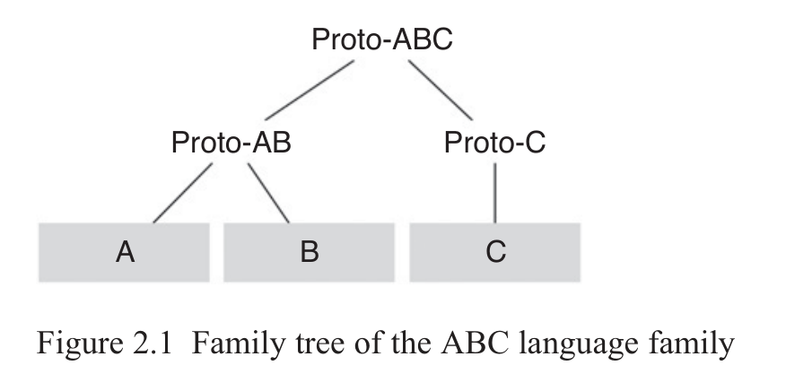
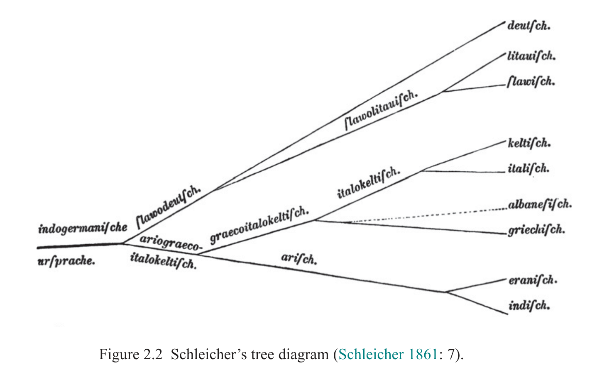

# 2 Methodology in Linguistic Subgrouping

James Clackson

<!-- page: 18; pdf-page: 36 -->

## 2.1 Introduction

If two or more languages form a subgroup of a language family, what does it mean? To answer this, it will be helpful to consider the case of three related languages, A, B and C. I shall assume that these three languages are all spoken at the same point in time and are all derived from an unattested proto-language, which I shall call Proto-ABC (I shall also refer to the language family as ABC). If the languages A and B form a subgroup within ABC, this means that it is possible to reconstruct a stage intermediate between Proto-ABC and languages A and B, which I shall call Proto-AB. To put this in other words, there existed a community of Proto-AB speakers at the time when a separate speech community spoke Proto-C, the language ancestral to C. The situation can thus be represented as in Figure 2.1, where languages are placed in a relationship to one another, much as with a family tree of genealogical descent.1 Diagrams such as Figure 2.1 are accordingly called “tree diagrams”.

## 2.2 The History of Subgrouping

The recognition of subgroups of the Indo-European language family precedes the recognition of the language family itself. Scaliger (1610) was already able to recognise the Romance, Germanic and Slavic families of languages,<i> matrices</i> <i>linguarum</i> in his terms, from shared vocabulary (notoriously using the word for ‘god’ as a diagnostic), and earlier scholars had grouped several languages as one in order to preserve the Biblical notion of seventy-two languages of the world.2

From the beginning of the nineteenth century, the first scholars of Indo-European operated with subgroups such as Germanic and Slavonic. Thomas Young, in the same article which saw the first use of the term “Indo-European” arranged the languages of the world into a three-step hierarchy: classes (of

1 Hoenigswald (1966: 3–5) discusses more complicated arrangements between three putative

languages A, B and C. 2 Borst (1957–63) shows in detail the changing conceptions of languages and language families in

the pre-Modern era. For the background to Scaliger’s work, see Simone (1998: 163–5).

<!-- page: 19; pdf-page: 37 -->

which Indo-European was one), orders and families (1813: 256). Young’s Indo-European class comprised no subordinate orders, but sixteen “families”, some of which are familiar, German, Celtic, Latin and Sclavic, but others less so (Arabian, Etruscan and Cantabrian).3 The first representation of the relationship between languages of the Indo-European family by something like a tree diagram is generally attributed to Schleicher, who included a schematic Stammbaum at the beginning of his<i> Compendium</i> (1861: 7) although there was no explanation of how the groupings had been arrived at.4 The figure from Schleicher’s compendium is reproduced as Figure 2.2. Unlike the diagram given in Figure 2.1, Schleicher’s tree is presented with the parent language on the left, and the daughter languages on the right. The “branches” of the tree are labelled, rather than the nodes as in Figure 2.1.

The first Indo-Europeanists to give serious consideration to the methodology of language subgrouping were the “neogrammarians” (or “Junggrammatiker”), a group of scholars originally based around the University of Leipzig in the 1870s.5 The neogrammarians are associated today principally with the idea that sound change is regular and exceptionless, but their work on sound change was part of a larger programme which established a firmer basis for comparative linguistics. The neogrammarians were more explicit about how and why they did what they did than their predecessors, with publications on the techniques and practices of linguistic comparison.6 In the case of subgrouping, the first tangible advance made by the neogrammarians was Hübschmann’s demonstration that that Armenian was not an Iranian language, but a separate branch on its own.7

3 Compare Max Müller’s later division of Indo-European languages into divisions, classes and

branches (Müller 1861: 380, discussed by Petit 2012: 25–7). The term Cantabrian is an alternative name for Basque, as used by Adelung. 4 See Petit (2012: 22–5) for discussion of an earlier tree-diagram than Schleicher’s, by František

Ladislav Čelakovský representing the relations between Slavic languages; Blažek (2007) gives a survey of the development of tree diagrams after Schleicher. 5 See Morpurgo Davies (1992: 226–78) for the neogrammarian school and its impact on

linguistics. 6 See for example the two books on theoretical linguistics published in 1880, Delbrück 1880 and

Paul 1880, discussed by Morpurgo Davies (1992: 245–51). 7 Hübschmann 1875; see the discussion of Hübschmann’s achievement in Clackson 2016.

<!-- page: 20; pdf-page: 38 -->

The theoretical principles and methods set out for identifying subgroups were put forward by Leskien (1876), partly as a critical response to the Berlin professor Johannes Schmidt’s work on the “wave model” (Schmidt 1872). Leskien was teacher and mentor to many of the neogrammarians, and his work on subgrouping was then refined by Delbrück (1880: 135) and Brugmann (1884).8 The methodological advances made by these scholars are enormous. It is to them that we owe the principles that linguistic subgrouping proceeds through the identification of shared innovations, rather than shared archaisms, and the recognition that phenomena which could arise from language contact, such as shared lexical items, should be treated with caution for subgrouping purposes.9

Indeed, Brugmann’s statement of what constitutes a subgroup (1884: 253) has often been cited, and is worth repeating once again:

Es ist hier nicht eine einzelne und sind nicht einige wenige auf zweien oder mehreren Gebieten zugleich auftretende Spracherscheinungen, die den Beweis der näheren Gemeinschaft erbringen, sondern nur die große Masse von Übereinstimmungen in lautlichen, flexivischen, syntaktischen und lexicalischen Neuerungen, die große Masse, die den Gedanken an Zufall ausschließt.

8 In Morpurgo Davies’s words “the neogrammarians, as often, took their cue [<i>sic</i>] from Leskien”

(1975: 650). 9 Morpurgo Davies (1975: 650) and Petit (2012: 29–30) associate these ideas directly with

Leskien, but as I showed in a recent paper (Clackson 2016), they are already implicit in Hübschmann’s (1875) work on Armenian.

<!-- page: 21; pdf-page: 39 -->

[The proof of a close commonality comes not from a single isolated or a small number of linguistic developments occurring simultaneously in two or more areas, but only through a large number of innovations in phonology, morphology, syntax and vocabulary – a number so great as to exclude chance from consideration.]

Brugmann’s 1884 article has set the scene for the subgrouping of the Indo-European family and other language groupings ever since.10 Brugmann discussed the possible subgroups of Indo-European, seeing only two cases where the recognised branches of Indo-European might be grouped together: Indo-Iranian and Balto-Slavic. It is significant that since 1884 there have been no serious suggestions for some of the higher order groupings proposed seen in Schleicher’s family tree, and the Indo-European family continues to be thought of in terms of the branches Brugmann identified.11 After the neogrammarians Schleicher’s “Graecoitalokeltisch” and “Slawodeutsch” all but disappear from the academic debate for the next hundred years.12 Representations of the Indo-European family in tree diagrams in the century after Brugmann’s article tended to show the branches of Indo-European radiating out as spokes from a centre.13 Indeed, the discovery of two new branches of Indo-European in the early twentieth century, Anatolian (of which Hittite was the earliest identified) and Tocharian, had little initial impact on the presentation of the Indo-European languages. Bloomfield’s tree diagram (Bloomfield 1933: 315) does not include branches for Anatolian or Tocharian, and Meillet was able to issue a second edition of a book written originally in 1908 (and discussed further below) in 1922 only noting the recent addition of the two branches (Meillet 1922: 3).

## 2.3 Criteria for Subgrouping

The reliance on common innovations rather than common retentions, and the need to avoid linguistic agreements that could have arisen independently, or by chance, have been accepted by nearly all those working on subgrouping methodology since Brugmann.14 It has been suggested (Dyen 1953: 581–2) that, despite linguists’ theoretical adherence to the methodology of Brugmann,

10 See the discussion of Dyen (1953: 580–2), who is the first to use the term “subgrouping” in

English. 11 See for example the presentation of the Indo-European languages in Fortson 2010 and Klein,

Joseph & Fritz 2017–18. 12 A Balto-Slavic-Germanic subgroup reappears in the tree-diagram of Gamkrelidze & Ivanov

(1984: 415). 13 To give just two examples, Bloomfield 1933: 312 and the representation of the Indo-European

language family in editions of the<i> American heritage dictionary of the English language</i> (first published in 1969). 14 See Porzig 1954: 17–52 and Clackson 1994: 4–11 for surveys of work on Indo-European

subgrouping in the twentieth century; Ringe & Eska (2013: 256–7) and Ringe (2017: 63) have recently reiterated the need to base subgroups on significant shared innovations.

<!-- page: 22; pdf-page: 40 -->

most subgrouping has actually been carried out “by inspection”, that is to say, through the recognition of a large amount of similarities between closely related languages (much as Scaliger was able to recognise that the Romance languages or the Germanic languages belonged together). This may be true at a very basic level, but any serious considerations of subgrouping for individual languages since the 1870s have proceeded through careful application of something like the Brugmannian criteria. This is especially the case for the less well-attested Indo-European varieties, such as Phrygian, Venetic or Lusitanian. If scholars have not used Brugmann’s criteria to test the validity of the Germanic branch, or Slavic, it is because the innovations are numerous and self-evident.

In the rest of this chapter, I shall look first at further clarifications of the criteria for subgrouping given above, before considering alternative models to the family tree. Advances in the neogrammarian methodology outlined above have been made in three principal areas: assessment of what counts as an innovation; ways to avoid “false positives”, that is, apparent shared innovations which actually arise by chance or through language contact; and in the use of computational methods in order to survey large amounts of data (see Chapters 3 and 4).15 I shall discuss the first two of these developments in this chapter, leaving the third to other contributors to this volume.

How do linguists recognise an innovation against a shared retention? In some areas, innovations are easier to detect than others. Once speakers of a language have merged or partially merged two phonemes, this change cannot be undone. Consequently, phonological changes offer the clearest examples of innovations which can be recovered by the historical linguist. As Hoenigswald put it (1966: 7), the phonological merger is the “prototype” of the shared innovation. Vocabulary replacement and syntactic change provide examples where it is often more difficult to isolate which development is an innovation and which is not. If languages A and B share a vocabulary item, for example the word for ‘man’ or a verb used to mean ‘stand’, and this vocabulary item is not found in language C, how is it possible to ascertain whether that is a shared retention or a common development of the two languages? Dyen is one of only a few scholars to address this question directly:

If any two or more related languages share a feature, the question arises whether this is a retention or an innovation. If we apply a general rule that such features are taken to be retentions unless there is evidence to the contrary, then a corresponding proto-feature is reconstructed. It follows that (borrowings being excluded) an innovation occurring in

15 See Ringe, Warnow & Taylor 2002: 66 for the statement that the computational approach to

subgrouping “is<i> not</i> intended to replace already existing methods, but to supplement them” (emphasis in the original).

<!-- page: 23; pdf-page: 41 -->

two or more languages can be detected only if, as a proto-feature, it contradicts a proto-feature which for some reason appears to be more ancient. (Dyen 1953: 581)

In the Indo-European domain, researchers have the advantage that the Anatolian languages, now generally agreed to have split first from the Proto-Indo-European parent, can sometimes provide a guide to what forms are more “ancient”. To take one example, Greek, Armenian, Albanian and Tocharian share reflexes of a root ‘hand’, reconstructed as *<i>g̑ ʰes-r-</i> (Greek<i> χείρ</i>, Armenian <i>jeṙn</i>, Albanian<i> dorë</i>, Tocharian A<i> tsar</i>). For Pedersen (1924: 225), followed by Solta (1960: 316–17), this was a significant lexical agreement between these branches. However, it is now clear that the word is also present in the Anatolian branch; the presence of the word in the other languages is much more likely to be a shared retention rather than an innovation.16 Vocabulary items may also be judged to be archaic rather than innovatory through their inflectional class or derivational patterns, or because it is possible to reconstruct a semantic shift in one direction rather than another. Even so, such decisions are often reliant on the judgement of the linguist, and in many cases it is impossible to say whether a lexical agreement reflects an innovation or a retention (Hoenigswald 1966: 8– 9; Klingenschmitt 1994: 236).

Innovations in inflectional morphology are also to some extent reliant on the picture the researcher has of the morphology of the parent language, and hence susceptible to the same criticism as the use of shared items of vocabulary for subgrouping purposes. Morphological innovations are, however, generally easier for linguists to spot, since they may be linked to phonological changes and thus more easily linked to a relative chronology.17 Moreover, in inflectional morphology at least, the set of options which can be reconstructed for the parent language is in general much smaller than for lexical innovations. Morphological innovations may also be associated with a larger change in the morphosyntax of the language, such as the creation of a new category or the merger of earlier categories.

In the Indo-European language family, little use has been made of syntactic changes for subgrouping, partly reflecting uncertainties about the reconstruction of Indo-European syntax, with consequent uncertainty about what counts as an innovation.18 In this regard it is important to note recent attempts to find Indo-European subgroups relying on syntactic information put forward by Longobardi & Guardino (2009) and Longobardi et al. (2013). These researchers, working in a Chomskyan syntactic framework, make use of a set

16 Hittite<i> kessar</i>, Hieroglyphic Luwian<i> istra/i-</i>, Lycian<i> izre/i-</i> (see Kloekhorst 2008: 471–2); for the

use of the word for ‘hand’ in a recent subgrouping enterprise, see Ringe, Warnow & Taylor 2002: 82–3. 17 See further below for the importance of relative chronology. 18 Ringe, Warnow and Taylor (2002) include no syntactic features in their data set.

<!-- page: 24; pdf-page: 42 -->

of syntactic parameters, which have been carefully chosen to ensure that the selected parameters show no overlap between them. It is perhaps revealing that the researchers do not attempt to isolate which of the parametric changes count as innovations, relying on the computational approach to identify innovations (Longobardi et al. 2013: 148). Given the absence of suitable information about the parametric constraints of most of the older Indo-European languages, this approach has not proved to be especially helpful for refining current thinking on subgrouping in the language family.

The next problem is how to avoid “false positives”, that is, shared innovations between two languages which were not made during a period of genealogical unity but which come about at a later stage in the language histories. In terms of the hypothetical language family discussed at the beginning of this chapter, examples would be developments shared by languages B and C that took place after the break-up of the Proto-ABC community, or shared by A and B but made after the period of Proto-AB. Such shared developments among separate speech communities may reflect a situation of language contact, for example a period when many speakers of A also spoke B, or when speakers of A and B both spoke a third language, or another more complicated contact situation. Alternatively, a shared development made independently is sometimes attributed to “chance”. In effect, what this usually means is that the innovation may reflect a universal tendency of language development, such as the palatalisation of dorsal consonants before front vowels or the “drift” from perfect formations of the verb to perfectives.19 Languages of the same family have inherited similar structures, and it is consequently not unexpected that the same innovations may occur independently.

As has been recognised since Meillet (1908: 10), understanding the relative chronology of changes is essential in order to determine which shared developments are common shared innovations and which are not. In the terms of the ABC language family, an innovation which is apparently shared by A and B is not diagnostic for subgrouping if it can be shown to have taken place after a development that took place after A had split from B. To take an example from the Italic language family, Oscan and Umbrian have both undergone a process of syncope of short medial vowels so that, for example, an earlier stem *<i>opesā-</i> develops to an Oscan stem<b> úpsa-</b> and Umbrian<i> osa-</i>. But this change is fed by consonant changes in Umbrian, such as the development of intervocalic *<i>d</i> ><i> rs</i> and the palatalisation of velars before front vowels. Syncope, which is not an uncommon change cross-linguistically, is thus an innovation shared by Oscan and Umbrian but is not diagnostic for their

19 For a survey of the sound changes affecting consonants which occur across Indo-European

languages, see Kümmel 2007; on universal paths in the grammaticalisation of tense and aspect, see Bybee, Perkins & Pagliuca 1994, which has spawned a large body of work on processes such as the drift from perfects to perfectives (sometimes called “aoristic drift”).

<!-- page: 25; pdf-page: 43 -->

subgrouping, since it must have taken place after Umbrian changes not shared by Oscan (see Clackson 2015: 10).

In the search for diagnostic innovations for subgrouping, it may not always be possible to construct a relative chronology for the feature in question in relation to what else is known about the prehistory of the language family. Accordingly, linguists have looked to assess the likelihood that a particular innovation might be the result of contact or universal processes, rather than a shared innovation. The result is that some shared innovations carry more “weight” than others, which may be dismissed as “trivial” or “insignificant”.20

Phonological processes which are frequent across the languages of the world, such as palatalisation, lenition, apocope, are accordingly usually dismissed as easily replicable and non-diagnostic. Many scholars have given greater weight to less common or more “unusual” sound changes, although in the absence of a general cross-linguistic repertoire of all known sound changes, this may rely more on the researcher’s own knowledge than an objective assessment. Note also that in the Indo-European language family, the judgement of whether a change affecting reconstructed consonants such as “laryngeals” or “voiced aspirates” is unusual or not also reflects the reconstructed model of PIE which is used. Individual shared vocabulary which might arise from borrowing from languages now lost is similarly easily discounted for subgrouping purposes. Once again it is innovations in the field of morphology, particularly inflectional morphology, which has been seen as especially significant. Incorporation of the inflectional morphology of one language into another is not unknown in situations of prolonged or close contact, or in particular social situations, but it is generally accounted the most resistant area of language to borrowing.21

The creation of a new morpheme often reflects the grammaticalisation of a new category or the merger of earlier categories, and accordingly morphological innovations generally have significant structural importance in the languages in question.

The question remains of how many innovations is enough to reconstruct a subgroup? Brugmann rejected the reliance on a “few” innovations, calling rather for a “large number”, but then he had not made the various further refinements of sorting through what were certain, appropriate or significant innovations, using the methodology developed by later scholars and outlined above. Once all potential shared innovations between two branches have been

20 The “weighting” of isoglosses is implicit already in Hübschmann 1875, and highlighted by

Meillet (1908) and Porzig (1954). 21 See Thomason & Kaufman 1988: 18–20 for the dismissal of earlier claims that morphology is

impervious to borrowing. Morphological borrowing is not just limited to “exotic” languages: the Latin first declension genitive<i> -aes</i>, found predominantly in texts written by writers with little education, shows the partial transfer of a Greek morpheme (see Adams 2003: 473–86 for discussion).

<!-- page: 26; pdf-page: 44 -->

carefully sifted to determine whether they meet all suitable criteria, and those for which there remains any room for doubt have been set to one side, then is it still justified to say that the number remaining is too small to be significant?22

Recent family trees of Indo-European arrived at using computational cladistics, which may have examined a large set of data across vocabulary, morphology and phonological changes (as Ringe, Warnow & Taylor 2002), show a much greater number of branches and subgroups than most of those constructed following Brugmann’s 1884 article.23 In the Ringe, Warnow and Taylor tree, binary splits are the norm, as opposed to the fan-like array of earlier trees. The difference partly reflects the ways in which the computational analysis is constructed, but it also reflects the fact that some of the subgroups are constructed on what is in effect quite a small number of shared features. The Greco-Armenian clade, for example, is supported by only six shared lexical features, four of which need not be significant.24

## 2.4 Subgroups and Prehistoric Dialect Continua

So far in this chapter, I have largely followed the assumption that language change operates over uniform speech communities and that language diversification happens when a single speech community splits into two or more separate groups. However, linguistic history is rarely so straightforward. Clean breaks in the tree-diagram, such as that envisaged in our opening example between Proto-AB and Proto-C, may occur as the result of large-scale dispersals of a population after cataclysmic natural disasters, through massive migrations or other situations, but in the majority of documented situations, the diversification of a language into separate, mutually unintelligible, descendants takes place through periods of dialect continua, which might sometimes last for millennia. Indeed, the spoken varieties of Romance, Germanic, Slavic and several other branches of the Indo-European family still can be described, in whole or in part, as dialect continua. Since Schmidt (1872), linguists have recognised that the spread of phenomena over dialect continua are not best captured by a tree-diagram model. Schmidt himself famously proposed an alternative to the tree diagram, the “wave theory” (“Wellentheorie”), to explain the rippling effect of linguistic changes over a range of mutually comprehensible varieties.25

Leskien and the neogrammarians made a significant advance on Schmidt’s observations by pushing the period of dialectal variation back

22 This is a criticism that has been levelled at me (see, for example, Holst 2009: 53–5) for my

“hyper-critical” analysis of the evidence for a Greek-Armenian subgroup (Clackson 1994). 23 See the survey in Blažek 2007. 24 As noted by Ringe, Warnow & Taylor (2002: 102–3), Ringe (2017: 69). 25 See the discussion by Petit (2012: 27–9).

<!-- page: 27; pdf-page: 45 -->

to the proto-language, rather than, as Schmidt had suggested, a period when it was possible to recognise the first branches of Indo-European. Their methodological justification for this move was that all spoken languages contain some variation, and it is consequently likely that the proto-languages also exhibited variation.26 This line of reasoning was followed up by scholars in the early twentieth century, such as Meillet, whose 1908 book<i> Les dialectes indo-européens</i> explored at greater length various shared developments of vocabulary, phonology and morphology that might reflect dialectal divisions within the parent language (Meillet 1908, second edition 1922). For example, the noteworthy shared agreement of Germanic, Baltic and Slavic in showing *<i>m</i> rather than *<i>bʰ</i> in oblique case markers of the noun could only be explained, according to Meillet, through the supposition of different dialects of Proto-Indo-European (1908: 119).27 The reconstruction of dialects of the proto-language thus allowed historical linguists a way to account for a small number of similarities between languages which were not sufficient on their own to support the reconstruction of a subgroup but were too significant to be ignored. As we have seen, the net effect of this move was that, in contrast to the recognised subgroups lower down the family tree, such as Germanic, Celtic etc., after Brugmann (1884), there were only two generally agreed “higher-order” subgroups, Indo-Iranian and Balto-Slavic. The supposition of a “dialectal” Proto-Indo-European could help explain the existence of a small number of exclusive and significant innovations shared between two or more branches, and also the overlapping nature of these agreements, so that some features might be shared between Germanic and Balto-Slavic, and others between Balto-Slavic and Indo-Iranian.

The supposition of a dialectal array of Indo-European has consequently proved popular and in several handbooks of historical linguistics or Indo-European languages it is possible to find “dialect maps” of Proto-Indo-European, with the putative varieties ancestral to the different branches of the family laid out in something approximating to their geographical attestation, with Germanic at the top left and Indo-Iranian in the bottom right, and then isogloss lines linking or separating groups corresponding to shared “dialectal” features, such as the use of *<i>m</i> or *<i>bʰ</i> in oblique case-markers or the operation of a phonological process known as the<i> ruki</i> rule.28 Such maps meet with the immediate criticism that they

26 As noted by Petit (2012: 31) who cites Leskien (1876: xv): “auf dem Boden der Urheimat

[bestanden] bereits dialektische Unterschiede” [“there were already dialectal differences in the territory of the (Indo-European) homeland”]. 27 Bloomfield (1933: 314–5) also uses the example of the *<i>m</i> and *<i>bʰ</i> case markers as indications

of dialectal differences in PIE. 28 Meillet’s schematic map (1908: 134) has been followed by many others. Anttila 1989: 305 is the

most sophisticated with twenty-four isoglosses included; Hock 1991: 445 has seven isoglosses, Mallory & Adams 2006: 73 just six.

<!-- page: 28; pdf-page: 46 -->

have the potential to include items of different time depths on a single plane. Thus, if the Anatolian branch separated out from the other IE languages first, it is an anachronism to include it in a dialectal area which could not yet have existed.29

Meid (1975) has accordingly attempted to reconstruct a “space-time” model for PIE, which is in effect a “three-dimensional” dialect map, incorporating both temporal and dialectal variety.

The reconstruction of a Proto-Indo-European parent language which has variation over time and space meets with a significant methodological objection: it is difficult to falsify. As Ringe (2017: 65) elegantly expresses it: “new evidence that is at variance with evidence already in hand can often be accommodated on an abstract dialect ‘map’ without major revisions.” Moreover, it significantly overplays the importance of the evidence which happens to survive. Since 1950 the number of early Indo-European texts available to scholars has been significantly increased through greater knowledge of the Anatolian languages; the decipherment of Linear B and consequent accessibility of the earliest stage of Greek; and discoveries and improvements in the understanding of a number of smaller, fragmentary languages, such as Gaulish, Celtiberian and South Picene. This huge increase in our knowledge of the languages used in the first and second millennia BCE has, paradoxically, made scholars more aware of what has been lost. It is clear that, since the Iron Age, speakers of a relatively small number of language families and subfamilies have been hugely successful in Eurasia, and their dominance has been responsible for the demise of countless other languages, many of which were Indo-European. As Ringe & Eska (2013: 262–3) note, the branches of Indo-European that we know about are “probably the surviving remnants of what was once a dialect network”, and the apparent sharp distinctions between them are just the reflection of the “pruning” of closer neighbours. Garrett has suggested in a number of articles that this loss of the intermediate languages in a larger dialectal continuum means the dialectal array of Proto-Indo-European after the separation of Anatolian, and probably Tocharian, may not be retrievable (see Garrett 1999; 2006; Babel et al. 2013). This is not just because of the pruning problem but also because of the fact that the subgroups as we have them may reflect linguistic changes across a dialect continuum, which took place across already divergent dialects. A case in point is Greek, which shows dialectal divisions already in the Mycenaean period, but for which all dialects were to undergo significant shared innovations in the next 500 years. These subsequent wave-like innovations take on a special significance when we have lost so many of the intervening dialects. The combination of

29 In the map of Anttila (1989: 305), Anatolian sits in the middle separated from all other

languages by two isoglosses, one of which is drawn with a thicker line. The maps of Hock (1991: 445) and Mallory & Adams (2006: 73) do not include Anatolian.

<!-- page: 29; pdf-page: 47 -->

shared innovation across an already differentiated dialectal continuum and subsequent “pruning” of intermediate dialects means that the shape of the original dialectal array is forever unobtainable.

Few Indo-Europeanists have been willing to accept Garrett’s arguments for scepticism about subgrouping, however, and most have continued to operate with a branching tree model, with shared innovations as the diagnostic for the construction of a subgroup.30 The objections to Garrett’s proposals are founded on a reluctance to give weight to the “unknown unknowns”, that is the unrecorded Indo-European varieties which gave way to the languages which we know about, and which may have formed a bridge between what we now think of as different Indo-European subgroups (see the comment recorded by Garrett of an anonymous referee at 2006: 48 n. 5; de Vaan 2008: 1229–30). These varieties doubtless existed, but we don’t know how they would have changed our whole picture of Proto-Indo-European as a whole or, indeed, what they would have been like. To abandon the whole enterprise of subgrouping because we don’t know what we are missing seems a step too far. Moreover, there has been no conclusive demonstration of an Indo-European subgroup that has actually arisen through later convergence.31 It is likely that subgrouping as currently carried out will continue, even though Garrett’s arguments are a healthy reminder of the importance of considering the relative chronology of linguistic developments, and of guarding against the false reconstruction of a subgroup on the basis of changes which must have actually been convergences.
