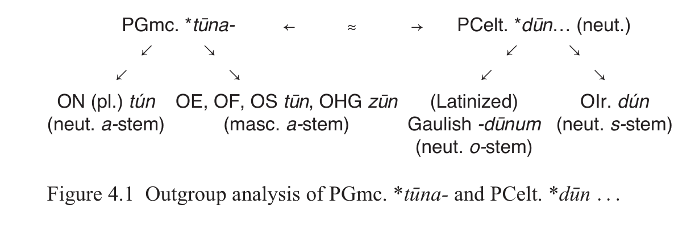

# 4 What We Can (and Can’t) Learn from Computational Cladistics

Don Ringe

<!-- page: 52; pdf-page: 70 -->

For more than twenty years now various teams of colleagues have been pursuing computational work on the cladistics of Indo-European. I am partly to blame, since my collaboration with Tandy Warnow helped to make such research visible and attractive. To at least some observers, it has not always been clear that what we can learn from computational cladistics is limited. This chapter is an attempt to explore those limits.

## 4.1 Outgroup Analysis

I begin with a well-known principle of traditional cladistics that should be kept in mind as background for a consideration of computational methods, namely outgroup analysis. A simple example is given in Figure 4.1.

The reflexes of PGmc. *<i>tūna-</i> ‘enclosure’ are always<i> a-</i>stems, reflecting pre-Proto-Germanic<i> o-</i>stems, but they are neuter in Norse and masculine in West Germanic, so the gender of the proto-form cannot be recovered by evidence internal to Germanic. The reflexes of the corresponding word in Celtic are always neuter, but the Old Irish word is an<i> s-</i>stem, while the Gaulish word is an <i>o-</i>stem – at least to judge from the Latinized form recorded in place names. Leaving that last problem aside (since this is just a demonstration of method), we would have to say that the gender, but not the stem class, of the Proto-Celtic form can be recovered by internal evidence. But if the two problems are considered together, the simplest solution is that the earliest recoverable form of the word was *<i>dūnom</i>, a neuter<i> o-</i>stem, because that hypothesis requires only two changes: a shift of gender in West Germanic, and a shift of stem class in Old Irish.1

I am grateful to Bob Berwick and Tandy Warnow for helpful discussion of various parts of this chapter. All errors and infelicities are mine. 1 Note that this conclusion is valid regardless of whether the Celtic and Germanic words reflect

common inheritance or early borrowing of a Celtic word into Proto-Germanic. I emphasize that because it is one illustration of an important point: subgrouping and establishing a genetic relationship (of words or languages) in the first place are different problems, and they cannot be solved by the same methods.

<!-- page: 53; pdf-page: 71 -->

## 4.2 Computational Cladistics

In this textbook illustration, we took the shape of the cladistic tree for granted as a basis for investigating another type of problem. Cladistics inverts that, using details of the linguistic data to find the true tree.2 Nevertheless, to a large extent (though not completely), a problem in computational cladistics uses the same mathematical principle as outgroup analysis. The most widely employed criterion for tree optimization – that is, for choosing the best of the trees that the software returns – is maximum parsimony: the optimal tree is the tree on which the smallest number of individual changes is required to account for the observed data. That is essentially the line of reasoning employed in the illustration above. Alternative criteria can be (and are) employed. For instance, the maximum compatibility criterion looks for the tree on which the greatest number of characters (that is, words or features) are “compatible” with the tree, i.e. the maximum number which fit the tree with no parallel development and no backmutation. In principle the two criteria are quite different. The maximum compatibility criterion can yield an optimal tree in which there is a great deal of backmutation and parallel development so long as it’s confined to, say, 1 per cent of the words in the comparative wordlist; they can be as messy as you like, as long as there are only a few of them. Maximum parsimony yields the tree with the smallest amount of mess overall, regardless of how it’s distributed. But in practice the two criteria usually give similar results, and if the amount of parallel development and backmutation in a dataset is very small, the results of the two methods converge.

Cladistics involves more than the inverse of outgroup analysis, however. For one thing, automation is necessary because of the sheer size of the problem. As the number of languages compared – in cladistic terms, the number of taxa – increases, the number of possible binary-branching trees that must be considered increases exponentially. If<i> n</i> is the number of taxa, the numbers of possible rooted and unrooted binary branching trees are given by the formulae in Table 4.1 (Dobson [no date]; Embleton 1986: 28–9 with references).

2 For an introduction to computational cladistics and the terminology that computational cladists

use, see Nichols & Warnow 2008.

<!-- page: 54; pdf-page: 72 -->

If the problem under investigation is large enough to be interesting, it’s not just that one human lifetime is too short to do the calculations by hand (though that can be true); it’s also that the human mind can’t keep track of all the possibilities. The computer, of course, can.

## 4.3 Problems with Character Evidence

Traditional cladistics is also beset by another problem that computers are ideally suited to solve. Consider the types of characters used in linguistic cladistics. Lexical characters (vocabulary) are actually the least reliable, because parallel semantic development is rampant – words meaning ‘person’ often come to mean ‘man’ and then ‘husband’, for instance – and undetectable borrowing between closely related languages is a real problem. Moreover, we expect phonological and morphological characters to give a better picture of linguistic descent because they are grammatical, and grammar is acquired in native language acquisition in the first few years of life and resists modification later in life. But phonological and morphological characters have weaknesses of their own as well as strengths. Even if they are based on mergers (not simply on phonetic changes), phonological characters are usually “natural” and easily repeatable, making parallel development a significant problem (Ringe, Warnow & Taylor 2002: 66–7; Ringe & Eska 2013: 257–9); their strength is that mergers are irreversible, which means that the direction of a tree edge in time can be established. By contrast, changes in inflectional morphology are hardly ever repeatable in detail (except for loss of a morphological category or marker, which occurs often); but it is often difficult to figure out which state of a morphological character is original and which states are innovative.

Of course there are traditional ways around these problems. Though the probability of any single sound change recurring independently is usually fairly high, the probability of a whole set of sound changes – especially an ordered set – recurring independently is far lower. The most distinctive sound changes that define the Germanic subgroup are a case in point. The following seven interrelated sound changes occurred in the prehistory of every well-attested Germanic language (Ringe 2017: 113–27, 147–50):

**Table 4.1 Number of rooted and unrooted binary branching trees (n = number of taxa)**

Number of distinct rooted binary trees: (2 n – 3)(2 n – 5) · · · 5 · 3 · 1 Number of distinct unrooted binary trees: (2 n – 5) · · · 5 · 3 · 1

<!-- page: 55; pdf-page: 73 -->

a. PIE *<i>p t k kʷ</i> > fricatives *<i>f θ x xʷ</i> unless an obstruent immediately preceded; b. PIE *<i>b d g gʷ</i> > *<i>p t k kʷ</i> simultaneously with or after (a);

c. PIE breathy-voiced *<i>bʰ dʰ gʰ gʷʰ</i> > fricatives *<i>β ð ɣ ɣʷ</i>; d. *<i>f θ s x xʷ</i> > *<i>β ð z ɣ ɣʷ</i> if not word-initial<i> and</i> not adjacent to a voiceless

sound<i> and</i> the last preceding syllable nucleus was unaccented (“Verner’s Law”); must have followed (a), which fed it; e. *<i>β ð ɣ ɣʷ</i> > *<i>b d g gʷ</i> after homorganic nasals, and *<i>ð</i> > *<i>d</i> also after *<i>l</i> and

*<i>z</i> (at least); must have followed both (c) and (d), which fed it, and also (b), which it counterfed; further, *<i>β ð</i> > *<i>b d</i> word-initially, which likewise must have followed (b) for the same reason; f. stress was shifted to the first syllable of the word; this must have followed

(d), because it both created and destroyed triggering environments for (d); g. unstressed *<i>e</i> > *<i>i</i> unless *<i>r</i> followed immediately; must have followed (f),

which both fed and bled it. We have no basis for<i> calculating</i> the probability that each sound change would occur in a given line of descent within a given time period, but it turns out that that does not matter, because a Bayesian approach to probabilities will yield an overall result in the right ballpark. Let us<i> estimate</i> the probability of each sound change, do the relevant calculation, and try to assess the results (see Ringe & Eska 2013: 259–61).

(a) or something very like it, occurred also in Armenian, thus in two of the ten

well-attested subgroups of IE; let us therefore assign it a probably of 0.2 (two in ten); (b) occurred also in Armenian and Tocharian, so we assign it a probability

of 0.3; (c) might have occurred also in Proto-Italic (Meiser 1986: 38), so we assign it

a probability of 0.2; (d) or a very similar change, occurred in fifteenth-century English (Jespersen

1909: 199–208); given its complexity, we might assign it a probability of 0.1; (e) is commonplace (cf. the allophones of voiced obstruents in modern

Spanish) and so should be assigned a high probability, say 0.5; (f) also occurred in Proto-Italic and Proto-Celtic, so we assign it a probability

of 0.3; (g) is a common and repeatable merger, so a probability of 0.5 is again

reasonable. Using these crude estimates, we can calculate the probability that all seven of these sound changes would occur in a single line of descent<i> by chance</i> as

## 0.2 × 0.3 × 0.2 × 0.1 × 0.5 × 0.3 × 0.5 = 0.00009, or about one in 11,111.

Of course, our estimates of the individual probabilities might be inaccurate. But <i>because they are all between 0.1 and 1</i>, the estimated cumulative probability

<!-- page: 56; pdf-page: 74 -->

cannot be more than about an order of magnitude too small; it could easily be too large, in which case we are constructing an argument a fortiori. However, we are not finished with our calculation. We can establish several relative chronologies among these seven changes:

(a) →(d) →(f) →(g)

(a) →(b) →(e)

(c) →(e)

(d) →(e)

Consider only the first and longest of those chronologies. The sound changes involved could have occurred in any order, yet they did occur in this one. The number of orders in which four events could occur is 4 × 3 × 2 × 1 = 24. To account for the fact that the changes occurred in only one of the possible orders we need to divide our above result by 24, yielding 0.00000375, or about one in 266,667. Since only about 7,000 human languages are attested, the fact that all these sound changes occurred, in the chronological order reconstructible, in the prehistory of every Germanic language can only mean that they occurred once, in the common ancestor of those languages. This is an overwhelming validation of the Germanic subgroup by sound change alone. To validate the Germanic clade, then, we do not need computational methods. Unfortunately not every potential clade offers us such clear phonological evidence; in effect, we got lucky with Germanic. Using characters based on inflectional morphology requires an even greater degree of luck: we need to find a shared morphological character state which, because of its details, is overwhelmingly likely to be an innovation. Once again Germanic is a case in point. The “weak” preterite bears a superficial resemblance to (1) the Gaulish<i> t-</i>preterite; (2) the Oscan<i> -tt-</i> perfect; (3) the Lithuanian imperfect in<i> -davo-.</i> But the details of all four formations are so different that they must have arisen independently. It follows that the weak preterite must be a Germanic innovation, and that too validates the clade. Some clades provide morphological evidence of that quality; unfortunately, many others do not. However, computational cladistics can extract the greatest amount of information from phonological and morphological characters by combining them. We use both sets to find the best<i> unrooted</i> tree; because the tree is unrooted at this initial stage of the investigation, the fact that we might not be sure which states of morphological characters are innovative is not a problem.<i> Then</i> we use the probative phonological characters, which are usually few, to root the tree, relying on the fact that mergers are irreversible.

<!-- page: 57; pdf-page: 75 -->

In principle, then, computational cladistics should be able to solve any subgrouping problem for which there is enough clear evidence in the data. Unfortunately that condition frequently remains unmet. Still worse, many datasets present the researcher with conflicting evidence. There are at least two rather different reasons for that, conceptually distinct even though they shade into one another in practice.

## 4.4 Phenomena Incompatible with Cladistic Trees

On the one hand, it is possible that the diversification of a family of languages simply hasn’t been treelike. In that case an appropriate algorithm will find several possible trees, but none of them will be very good by any optimization criterion, and each will be bad in a different way. Early in the line of work that resulted in Ringe, Warnow & Taylor 2002, we decided to find out what such a case would look like in detail. To that end we did a cladistic analysis of some modern West Germanic languages, with Danish and Swedish as an outgroup, using PAUP*, a program designed to find the most parsimonious tree (see above). We actually expected the analysis to fail, because it’s clear that most West Germanic languages have been in contact, trading material and influencing one another, for as long as they’ve existed; in fact ocular inspection of the data shows that there are so many overlapping patterns of cognation that no perfect phylogeny (PP, i.e. a tree in which no character exhibits parallel development or backmutation) can exist for this dataset. The computational analysis did fail spectacularly (and not only in ways that we had foreseen, because we hadn’t paid enough attention to Scandinavian influence on English and Danish influence on North Frisian). Our results are given in Table 4.2.

The best possible parsimony score is simply the number of state-to-state transitions within characters; if a PP had existed, that would have been its parsimony score. The best trees that we were able to find all exhibit more than

**Table 4.2 Best possible parsimony scores for West Germanic Best possible parsimony score for the data: 262**

Actual scores Tree assigned each score

309 (Eng (WFris NFris)) (Neth HG) 313 ((WFris NFris) (Neth HG)) Eng 315 ((Eng (WFris NFris)) Neth) HG 319 ((NFris HG) (WFris Neth)) Eng 329 (NFris HG) (Eng (WFris Neth)) 335 (((WFris HG) Neth) Eng) NFris

<!-- page: 58; pdf-page: 76 -->

forty additional state transitions, reflecting either parallel development or backmutation. For technical reasons we cannot guarantee that the algorithm found the best available tree, so in principle we cannot exclude the possibility that a closer approximation to a PP for this dataset can be found, but in practice that is highly unlikely. It can be seen that the three least bad trees are plausible: to put it in terms that are in part anachronistic, the first groups Anglo-Frisian against Franconian, the second groups English against continental West Germanic, and the third groups Ingvaeonic against High German. But their parsimony scores are all mediocre, and numerous characters are incompatible with each tree. Still worse, the next three trees have only modestly less acceptable scores but are all implausible, since all three split the Frisian languages. This is what total failure, because the diversification of a family was not treelike, looks like.3

The other possibility is that there<i> is</i> a treelike signal in the data, but that it has been obscured by undetectable borrowing between the languages. There is probably more than one way to approach that problem, but the most straightforward is to take several of the best trees and see how many “contact edges” you need to add to make<i> all</i> the data compatible with the tree. Since each contact edge must represent a historical episode of language contact, they must be posited so as to be compatible with what is known about the geography of the languages in question and the relative chronology of the family’s diversification events. Nakhleh, Ringe & Warnow 2005 is the only attempt to do that that I am aware of; interested readers should consult that work for further discussion.

Tree-networks like these can arise in more than one way in the real world, of course. “Clean speciation” followed by renewed contact and linguistic borrowing that cannot be detected (because no crucial sound changes were involved) is one way. Another possibility is that the diversification of the family was actually network-like, but only non-adjacent members of the dialect network survive; in that case the lateral edges can represent innovations which spread through the dialect network as it was diversifying, and their sparseness is simply an artefact of the originally non-adjacent positions of the survivors. In general, cladistics cannot differentiate between those two scenarios.

## 4.5 Time Depth in Linguistic Cladistics

Thus far I have been discussing cladistics<i> sensu stricto</i>, i.e. the recovery of the branching tree that correctly reflects a language family’s diversification. Numerous researchers have claimed that it is also possible to recover the approximate time in prehistory when each instance of diversification in a tree

3 For a good exploration of the ways in which language families can diversify, see Ross 1997, with

exemplification in Ross 1998.

<!-- page: 59; pdf-page: 77 -->

occurred. The most recent such claim was made by Russell Gray and his coworkers (first in Gray & Atkinson 2003) – and demolished by Andrew Garrett’s team at Berkeley (Chang et al. 2015). The easiest way to discuss the problems involved in dating linguistic divergences is to discuss Gray’s work.

Gray claimed that new and more powerful Bayesian cladistic methods yielded greatly improved trees and – more importantly – allowed researchers to recover the time depths of particular “speciation events” in the prehistory of language families with greater precision. He applied his methods to the Indo-European family (at first to bad data, but increasingly to competently vetted wordlists) and derived dates for PIE that are compatible with Colin Renfrew’s “out of Anatolia” scenario (Renfrew 1987), but not with the “steppe hypothesis” (Anthony 2007, Anthony & Ringe 2014) that most Indo-Europeanists have long believed to be most probable. Both Indo-Europeanists and computer scientists were inclined to dismiss Gray’s work from the start. For one thing, Bayesian cladistics is not in any way mathematically superior to methods already available; it is merely fashionable. For another, it is not inaccurate to say that Gray took already available data and cranked them through prefabricated software. But no one would have cared about that if the work had been cogent. Unfortunately, there were always multiple reasons to suspect that it couldn’t be cogent, as follows (see also Pereltsvaig & Lewis 2015 for further extensive discussion).

First, Gray used only lexical data, which are the least reliable for cladistics (Ringe, Warnow & Taylor 2002: 65 with references; Nakleh et al. 2005).

Secondly,<i> there is no lexical “clock”</i> – that is, the replacement of vocabulary items does not proceed at an even approximately constant rate (Bergsland & Vogt 1962). Moreover, none of the other simplifying assumptions about the rate of word replacement holds up empirically. For instance, the “rates across sites” assumption sometimes encountered in biological cladistics – namely, that if one character evolves, say, half again as quickly in lineage A as in lineage B, you can count on other characters to do the same – clearly does not hold in language development. Gray (and others who have worked in linguistic cladistics, for instance the late Isidore Dyen; see Dyen, Kruskal & Black 1992) have suggested that that need not matter: if you let the assumed rate of change vary randomly around a mean, the result will be realistic. But it’s not clear that even that is loose enough; and of course the wider the variation in rates of change, the more uncertain the hypothetical dates of proto-languages become.

Thirdly, there are serious evidential problems which have an impact on the mathematics of trying to work backwards into prehistory. Steve Evans and coauthors laid out the problem in formal terms in their article of 2006, but it can also be stated informally (Bob Berwick, p.c.). To paraphrase Berwick, we want a theory that can infer backwards in time from a currently observed state so as to recover the dynamic processes that led to that state. In order to describe what

<!-- page: 60; pdf-page: 78 -->

happened accurately, we need to know (a) the nature of the forces that have operated, (b) the magnitude of those forces, (c) the length of time over which they have operated, and (d) the initial state. In this case we are trying to derive (c), so we need to have all the other variables fixed. We linguists believe that we understand (a) well enough; but (d) is invariably full of gaps – there are some things about the proto-language that we simply cannot reconstruct because not enough evidence survives anywhere – and empirical observation shows that (b) varies within limits which are incompletely known but clearly wide. At least one further problem is the loss of data which can never be recovered, as follows. If a word<i> x</i> in a given meaning can be reconstructed securely for the proto-language, and if in the earliest records of a daughter it has been replaced by<i> y</i>, we know that<i> at least</i> one episode of replacement occurred in the unobservable prehistory of that daughter; we do<i> not</i> know whether only one or more than one occurred. Thus even if the rate of vocabulary replacement were more nearly constant, we could not use it to extrapolate into prehistory with any confidence.

Fourthly, incorrect assumptions about the descent of particular languages in the tree can lead to unforeseen problems in calculating time depths. That was shown brilliantly by Chang et al. 2015. They noted that, while both Latin and various Romance languages were in the database of Gray’s project, the algorithm was not informed that Latin was the ancestor of the Romance languages – and likewise with Sanskrit and modern Indic, and a few other, less substantial cases. The program thus returned a tree in which Latin was the<i> sister</i> of the Romance group, Sanskrit was the sister of modern Indic, and so on. The result was to lengthen the time depths calculated from the wordlists. Chang et al. introduced constraints<i> forcing</i> the program to treat Latin as the ancestor of Romance, etc. – and the time depths shortened dramatically, yielding a date for PIE compatible with the steppe hypothesis of Anthony and others and<i> not</i> with Renfrew’s “out of Anatolia” hypothesis. Gray has protested that Classical Latin is not<i> exactly</i> the ancestor of Romance, but Chang et al. replied (correctly) that if all you’re using is basic wordlists, the right question is whether the Latin wordlist is the ancestor of the Romance wordlists (so far as we can tell), and the answer is clearly yes (see the extensive discussion of Chang et al. 2015: 205–8). Of course this all illustrates the fact that if you want to pursue linguistic cladistics you need to have<i> both</i> a world-class linguist<i> and</i> a competent computer scientist on the team, but it also illustrates something else: the results of Bayesian cladistics are not robust; you can tweak one detail and get dramatically different results.

Finally, there is a further problem with Bayesian analyses, which was pointed out in a devastating paper by Bob Berwick (Berwick 2015, unfortunately still unpublished). Berwick noticed that the “higher” nodes in Gray’s best tree had low bootstrap values, often no better than 20–30 per cent. Of

<!-- page: 61; pdf-page: 79 -->

course, the alternatives all had even lower bootstrap values, so the tree presented could be called the “most probable” consensus tree; but a 30 per cent probability is just not probable enough – bootstrap values that low are unacceptable to a real computational cladist. Berwick ran appropriate software on Gray’s data thousands of times and superimposed all the trees returned to give a visual impression of the problem; the top of the tree was a blur, with no resolution – and that remained true even when a million iterations were run. But if you can’t be sure you have the right tree, it’s not feasible to estimate divergence times. Unfortunately that applies to Garrett’s results no less than to Gray’s, since Garrett’s team set out to replicate Gray’s experiment.

In fact, the dispute between Renfrew and most of our community has been resolved in favour of the steppe hypothesis, but neither by archaeologists nor by linguists; the crucial evidence is ancient DNA evidence. Haak et al. 2015 demonstrated that there was a major population incursion from the steppes into Europe in the middle of the third millennium BCE – more or less exactly as the steppe hypothesis had posited – and that the distribution of steppe DNA correlates well with later populations known to have spoken Indo-European languages (see especially Mallory 1989). Those findings are irreconcilably inconsistent with Renfrew’s scenario, according to which, Indo-European languages should have spread first from Anatolia to the Mediterranean lands and from there to northern Europe. That illustrates the most important contention of this chapter: that information from all disciplines must be used, since any one source of information is inconclusive.

## 4.6 Conclusion

The general conclusion of this chapter is neither sweeping nor startling. We should use computational cladistics for what it’s worth, but we need to be aware that its worth is limited. The general rule about extrapolating into the unobserved past still applies: results are comparatively secure when<i> different</i> lines of evidence converge on the<i> same</i> result. Computational cladistics yields only one line of evidence; therefore, it must be used in conjunction with traditional methods, archaeology, ancient DNA evidence and everything else that might be relevant.
