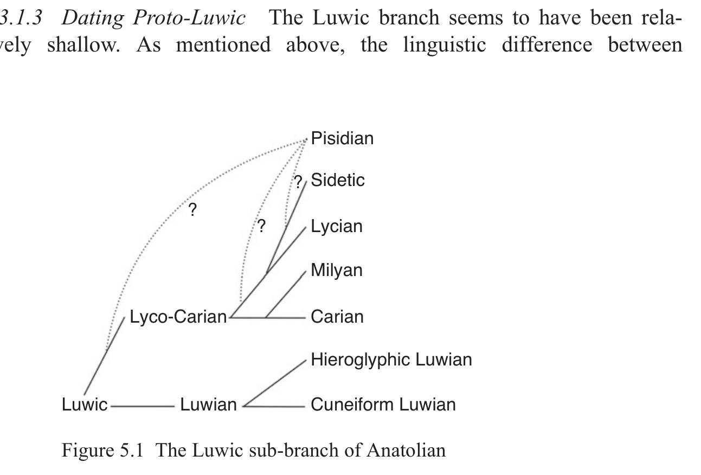
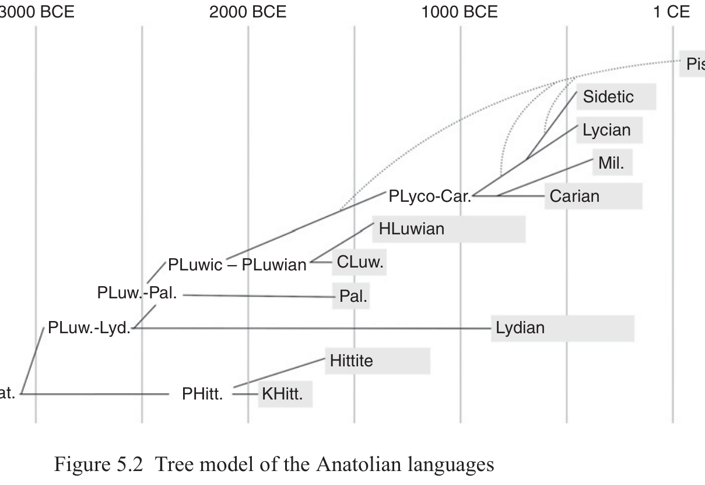

# 5 Anatolian

Alwin Kloekhorst

<!-- page: 63; pdf-page: 81 -->

## 5.1 Introduction

The Anatolian branch consists of a group of languages once spoken in ancient Anatolia (modern-day Turkey) and northern Syria, with textual remains dating from the beginning of the second millennium BCE to the second century CE.1 It is commonly assumed that in the course of the first millennium CE, the entire Anatolian branch became extinct. The attested Anatolian languages are (in chronological order) as follows.2

<b>Kani</b><b>š</b><b>ite Hittite:</b>3 a dialect of Hittite proper, which is known from hundreds of personal names and a handful of loanwords attested in Old Assyrian texts (clay tablets, written in the Old Assyrian version of the cuneiform script, dating to<i> c.</i> 1935–1710 BCE) mostly stemming from Kaniš/Nēša (modern-day Kültepe), Central Anatolia.

<b>Hittite</b> (“Ḫattuša Hittite”):4 the main language of the administration of the Hittite kingdom, written in its own version of the cuneiform script, attested in some 30,000 fragments of clay tablets (dating to<i> c.</i> 1650–1180 BCE),5 especially found in the Hittite capital Ḫattuša (modern-day Boğazkale), but also

1 The research for this chapter was conducted as part of the NWO-funded research project<i> Splitting</i>

<i>the mother tongue: The position of Anatolian in the dispersal of the Indo-European language</i> <i>family</i> (NWO-project number 276-70-026) and the project<i> Multilingualism and minority lan-</i> <i>guages in ancient Europe</i>, funded by the HERA Joint Research Program “Uses of the past” (Horizon 2020). I would like to thank Xander Vertegaal and Stefan Norbruis for their useful comments on earlier drafts of this chapter. 2 Kroonen, Barjamovic & Peyrot (2018) have recently claimed that a number of personal names

that are recorded in texts from Ebla, dated to the twenty-fifth–twenty-fourth centuries BCE, belong to one or more languages “that clearly fall within the Anatolian Indo-European family” (2018: 6). However, no detailed analysis of this material is offered, and at present I therefore regard the linguistic status of these names as too uncertain to make any broad claims. 3 See Kloekhorst 2019 for a full account of this language and its attestations. 4 The authoritative synchronic grammar of Hittite is Hoffner & Melchert 2008. Synchronic

dictionaries are HW² and CHD; etymological dictionaries are HEG, HED, EDHIL. For historical linguistic treatments, see e.g. Melchert 1994; Kimball 1999; EDHIL. 5 But see Kloekhorst & Waal 2019, who argue that a few Hittite tablets may stem from the latter

half of the eighteenth century BCE.

<!-- page: 64; pdf-page: 82 -->

several other places in Central Anatolia. It is the best attested Anatolian language by far, and therefore the most important witness of this branch.

<b>Palaic:</b>6 known from several passages embedded in Old and Middle Hittite texts (sixteenth–fifteenth century BCE), primarily dealing with the cult of the god Zaparu̯a. It was the language of the land of Palā, situated in the north-west of Central Anatolia. The Palaic corpus is small, and therefore many basic matters regarding grammar and lexicon are unclear.

<b>Cuneiform Luwian</b> (also called Kizzuwatna Luwian):7 only known from cultic passages cited in Hittite texts (dating to the sixteenth–fifteenth century BCE). It was certainly spoken in Kizzuwatna (south-east of Central Anatolia) and possibly also in the western part of Anatolia. In Hittite texts from the New Hittite period (fourteenth–thirteenth century BCE), we find many Luwian loanwords, which traditionally were regarded to be Cuneiform Luwian as well but which may be more appropriately regarded as linguistically belonging to Hieroglyphic Luwian.

<b>Hieroglyphic Luwian</b> (also called Empire Luwian / Iron Age Luwian):8

closely related to Cuneiform Luwian, written in an indigenous hieroglyphic script (Marazzi 1998) that seems to have been especially designed for this language. Seals containing these hieroglyphs can be dated as far back as the Old Hittite period (<i>c.</i> 1600 BCE), but real texts (mostly inscriptions on rocks and stone steles) date from the thirteenth to the end of the eighth century BCE. The <i>c.</i> thirty texts that date from the last phase of the Hittite Kingdom (so-called Empire period, and therefore “Empire Luwian”) are found all over Anatolia and northern Syria, whereas the<i> c.</i> 230 post-Empire period inscriptions (Iron Age, and therefore “Iron Age Luwian”) are restricted to south-eastern Anatolia and northern Syria, the region of the so-called Neo-Hittite city states. Thanks to a boost in studies of the language since the publication of Hawkins 2000, Hieroglyphic Luwian has become one of the better-known Anatolian languages.

<b>Lydian:</b>9 the language of the land of Lydia (central western Anatolia), written in its own version of the Greek alphabet, attested in some 120 texts (the bulk of which are inscriptions on stone steles), dating from the eighth to the third century BCE (with a peak in the fifth–fourth century BCE). Our

6 For texts, grammar, vocabulary and historical phonology, see e.g. Carruba 1970; Kammenhuber

1969; Melchert 1994: 190–228. 7 Texts are collected in Starke 1985. For grammatical treatments, see Starke 1990; Melchert 2003.

For the lexicon, see Melchert 1993. See Yakubovich 2010 for the term “Kizzuwatna Luwian”. 8 Texts can be found in Hawkins 2000, see also ACLT. For grammatical treatments, see Melchert

2003; Payne 2010; Yakubovich 2015. A good Hieroglyphic Luwian dictionary is a desideratum: Meriggi 1962 is largely outdated, and the lexical part of ACLT can only be used with caution. 9 For texts, grammar and vocabulary, see Gusmani 1964. Historical linguistic treatments can be

found in Melchert 1994: 329–83; Gérard 2005. A more general introduction to the Lydians and their language is Payne & Wintjes 2016.

<!-- page: 65; pdf-page: 83 -->

knowledge of Lydian is limited since there are only a few bilingual texts and since its vocabulary is difficult to compare to the lexicon of the other Anatolian languages (see also below, Section 5.3.3).

<b>Carian:</b>10 the language of the land of Caria (south-central western Anatolia), written in its own version of the Greek alphabet, attested in some 200 inscriptions from the seventh–fifth century BCE from Egypt (tomb inscriptions from Carian mercenaries living there) and from the fourth–third century BCE from Caria itself. Our knowledge of Carian is very rudimentary: the Carian alphabet was not successfully deciphered until the 1990s, and many inscriptions contain personal names only.

<b>Lycian</b> (also called Lycian A):11 the language of Lycia (south-western Anatolia), written in its own version of the Greek alphabet, in some 150 coin legends and 170 inscriptions on stone, dating to the fifth–fourth century BCE. Our knowledge of Lycian is relatively advanced, partly because of some bilingual texts (including the large trilingual inscription of Letôon) and partly because of its linguistic similarities with the Luwian languages. Nevertheless, many details regarding grammar and lexicon are still unclear.

<b>Milyan</b> (also called Lycian B):12 attested in two inscriptions from Lycia (fifth century BCE) that are written in the Lycian alphabet. Although the name “Milyan” refers to the region Milyas, situated in the north-east of Lycia, it is unclear where it originates. The two Milyan inscriptions, which both seem to be in verse, are difficult to understand, and our knowledge of Milyan is therefore rudimentary.

<b>Sidetic:</b>13 the language of the city of Side (south coast of Anatolia) and its surroundings, written in its own version of the Greek alphabet, attested in some ten inscriptions on coins and stone, dating to the fifth–second century BCE. The number of textual remains is very low, so we only know a few facts about Sidetic grammar and lexicon.

<b>Pisidian:</b>14 a language attested in a few dozen tomb inscriptions in the Greek alphabet that were found in the eastern part of classical Pisidia (south-west of Central Anatolia), dating to the first–second century CE. The inscriptions contain only personal names, some of which point to an Anatolian character to this language.

10 See Adiego 2007 for a full discussion of all Carian texts, and the grammar, lexicon and historical

linguistic interpretation of the language. 11 For text editions see Kalinka 1901; Neumann 1979; Laroche 1979. The vocabulary is compiled

in Melchert 2004 and Neumann 2007. Grammatical treatments and historical linguistic analyses can be found in e.g. Hajnal 1995; Melchert 1994: 282–328; Melchert 2004; Kloekhorst 2013. 12 Shevoroshkin 2013. The Milyan vocabulary is included in Melchert 2004 and Neumann 2007. 13 Pérez Orozco 2007. 14 Brixhe 1988.

<!-- page: 66; pdf-page: 84 -->

## 5.2 Evidence for the Anatolian Branch

There is ample evidence to view the Anatolian languages as forming a single branch: they share enough linguistic features to set them apart as a single group vs. the rest of the Indo-European language family, cf. e.g. Rieken 2017: 299. A complicating factor, however, is the Indo-Anatolian hypothesis, which states that Anatolian was the first branch to split off from the Indo-European mother language, after which the remaining language, which was to become the ancestor language of all the non-Anatolian Indo-European languages (“Core Proto-Indo-European”) underwent a set of innovations (see Section 5.5). Whenever the Anatolian languages show shared features that are different from the other Indo-European languages, we should therefore investigate to what extent these differences are caused by innovations that took place in the prehistory of the Anatolian branch, or by innovations in the prehistory of Core Proto-Indo-European. In the latter case, the Anatolian features may in fact be shared<i> retentions</i>, and therefore cannot, strictly speaking, be used in arguing that the Anatolian languages form a single branch. In practice, however, it is not always easy to distinguish between the two.

Another complicating factor is that some of the Anatolian languages have a very limited attestation (especially Sidetic and Pisidian) or are in general poorly understood (Carian, Milyan and, to a lesser extent, Lydian and Palaic). This means that not all features listed below are found in all languages.

The following specific features of the Anatolian languages can be regarded as examples of common innovations that prove the unity of the Anatolian branch and allow for the postulation of an ancestor language, Proto-Anatolian, from which they all derive:

<b>Phonology</b> • the merger of PIE<i> mediae</i> and<i> aspiratae</i> into a single series that is called<i> lenis</i>

(PIE *<i>d</i>, *<i>dʰ</i> > PAnat. */t/),15 which is distinct from the so-called<i> fortis</i> series, which is the outcome of PIE<i> tenues</i> (PIE *<i>t</i> > PAnat. */tː/) • the operation of Eichner’s lenition rules: (1) pre-PAnat. *<i>V̄́C:V</i> > PAnat.

*<i>V̄́CV</i> and (2) pre-PAnat. *<i>V́</i>...<i> VC:V</i> > PAnat. *<i>V́</i>...<i> VCV</i>16

15 As argued in e.g. Kloekhorst 2016: 226–8, within the glottalic theory this merger may be seen as

the result of the development of PIE<i> mediae</i>, which can be interpreted as pre-glottalized lenis stops, e.g. PIE *<i>d</i> = *[ˀt], into a biphonemic pair of glottal stop + lenis stop: PIE *<i>d</i> = *[ˀt] > pre-PAnat. *[ʔt] = */ʔ/ + */t/. In this way, the oral part of the PIE<i> mediae</i> was detached from its glottal part and merged with the PIE<i> aspiratae</i>, which in fact were lenis stops (e.g. PIE *<i>dʰ</i> = *[t]), whereas the glottal stop merged with the outcome of PIE *<i>h₁</i>. 16 Eichner 1973: 79, 100 n. 86. The two lenition rules can in fact be regarded as a single

development, which may be represented as pre-PAnat. *<i>V́(</i>...<i>)VCːV</i> > PAnat. *<i>V́(</i>...<i>)VCV</i>, cf. Adiego 2001; Kloekhorst 2014: 547–87.

<!-- page: 67; pdf-page: 85 -->

• PIE accented short *<i>ó</i> was lengthened to PAnat. long */ṓ/ (and subsequently

caused lenition according to Eichner’s first lenition rule)17

• the PIE cluster *<i>h₂u̯</i> yields PAnat. monophonemic */qʷː/,18 e.g. PIE *<i>trh₂u̯ (e)nt-</i>

> PAnat. */tːrqʷː(ə)nt-/ > Hitt.<i> tarḫuu̯ant-</i> /tərχʷːənt-/, CLuw.<i> tarḫu(u̯a)nt-</i> /tərχʷː(ə)nt-/, Lyc.<i> trqqãt- / trqqñt-</i> /trkʷ(a)ⁿt-/, Car.<i> trqδ-</i> /trkʷⁿt-/ • the development of a lateral in the word for ‘name’: PIE *<i>h₃néh₃mn-</i> > PAnat.

*/ʔlṓmn-/ > Hitt.<i> lāman</i>, HLuw.<i> álaman-</i>, Lyc.<i> alãma-</i>

<b>Morphology</b> • the creation of an acc.-dat. form */ʔmːu(-)/ ‘me’ (vs. PIE *<i>h₁mmé-</i>) • the creation of a demonstrative pronoun */ʔopṓ-/ (from virtual PIE *<i>h₁o-bʰó-</i>)19

• the loss of the distinction between present and aorist (the “<i>tezzi-</i>principle”)20

• the creation of the<i> ḫi-</i>conjugation (cognate to the PIE perfect)21

• the 1pl. ending */-uén(i)/ (cognate to the PIE dual ending *<i>-ué</i>)22

• the replacement of the post-consonantal pret.act.3sg. ending *<i>-t</i> by the

middle ending *<i>-to</i> (> Hitt.<i> -tta</i>, CLuw.<i> -tta</i>, HLuw.<i> -ta</i>, Lyc.<i> -te</i>)23

• the loss of the subjunctive and optative moods.

For other specifically Anatolian features, see Section 5.5, where a list of shared retentions of Anatolian will be presented (as arguments in favour of the Indo-Anatolian hypothesis).

## 5.3 The Internal Structure of Anatolian

There is some debate on the exact internal subgrouping of the Anatolian branch, although on some aspects there is broad consensus.

### 5.3.1 The Luwic Branch

There can be no doubt that Cuneiform Luwian, Hieroglyphic Luwian and Lycian form a separate branch, which is commonly called “Luwic”. This

17 Kloekhorst 2014: 439–59. 18 Kloekhorst 2006: 102; Melchert 2011: 128–9. Cf. Kloekhorst 2018a for the postulation of

a labio-uvular stop /qʷː/ for the PAnat. stage. 19 EDHIL: 192. 20 Malzahn 2010: 267–8. 21 E.g. Eichner 1975; Kloekhorst 2018b,<i> contra</i> Jasanoff 2003. 22 Jasanoff 2003: 3; EDHIL: 1001. 23 The idea that CLuw.<i> -tta</i>, HLuw.<i> -ta</i> and Lyc.<i> -te</i> reflect the middle ending *<i>-to</i> is generally

accepted (e.g. Yoshida 1993), but the origin of Hitt.<i> -tta</i> is debated. Some scholars assume that the spelling<i> °C-ta</i> can represent /°Ct/ < PIE *<i>°C-t</i> (e.g. Yoshida 1991: 28); others assume that the <i>a-</i>vowel is real and developed as a prop-vowel, i.e. /°C-tə/ < PIE *<i>°C-t</i> (e.g. Melchert 1994: 175–6, with references); and still others have argued that the<i> a-</i>vowel is real but cannot be explained as a prop-vowel, and that Hitt.<i> -tta</i> therefore must reflect earlier *<i>-to</i> (EDHIL: 800–1). If the latter view is correct, the spread of *<i>-to</i> at the cost of post-consonantal *<i>-t</i> must have been a common innovation of all Anatolian languages.

<!-- page: 68; pdf-page: 86 -->

means that these languages derive from a “Proto-Luwic” mother language. It is generally assumed that Milyan and Carian belong to this branch too, and also Sidetic and Pisidian are often regarded as possibly Luwic languages (e.g. Melchert 2003: 170–7; Yakubovich 2010: 6; Rieken 2017: 301–3).

#### 5.3.1.1 Shared Innovations of the Luwic Languages The Luwic sub-branch of Anatolian can be defined through the following innovations (although they are not always attested in all languages):

<b>Phonological</b> • the assibilation of PAnat. */ḱː/ > PLuwic */ts/ > CLuw.<i> z</i> /ts/, HLuw.<i> z</i> /ts/,

Lyc.<i> s</i>, Mil.<i> s</i>, Car.<i> s</i>, Sid.<i> ś</i> (vs. Hitt. /kː/, Pal. /kː/, Lyd.<i> k</i>) • the weakening of PAnat. lenis */ḱ/ > PLuwic *<i>i̯</i> ><i> Ø</i>: e.g. PAnat. */ḱésːr-/

‘hand’ > CLuw.<i> ī̆š(ša)ri-</i>, HLuw.<i> istri-</i>, Lyc.<i> izri-</i> (vs. Hitt. /k/ and Pal. /k/) • the weakening of PAnat. lenis */kʷ/ > PLuwic *<i>u̯</i>: e.g. PAnat. */kʷṓu-/ ‘cow’

> HLuw.<i> wawa/i-</i>, Lyc.<i> wawa-</i>,<i> uwa-</i> (vs. Hitt. /kʷ/, Pal. /kʷ/, Lyd.<i> k</i>) • the merger of PAnat. */e/ and */ō̆ / into PLuwic */ə̄̆ /24 (vs. their retention as

separate phonemes in Hittite, Palaic and probably Lydian25) • Čop’s Law: PAnat. *<i>V̆́CV</i> > PLuwic *<i>V̆́C:V</i>26

<b>Morphological</b> • the large-scale spread of the proterodynamic<i> i-</i>stem inflection replacing ori-

ginal consonant stem and<i> o-</i>stem inflection (formerly called “<i>i-</i>mutation”)27

• the reshaping of the PAnat. nom.pl.c. ending *<i>-es</i> to PLuwic *<i>-Vns-i</i> (based

on the acc.pl.c. ending *<i>-Vns</i> < PIE *<i>-V-ms</i> + the original pronominal nom.pl. c. ending *<i>-i</i> < PIE *<i>-oi</i>?) > CLuw.<i> -Vnzi</i> /-Vntsi/, HLuw.<i> -V-zi</i> /-Vntsi/, Lyc. <i>-i</i> (< *<i>-insi</i>),<i> -ẽi</i> (< *<i>-onsi</i>),<i> -ãi</i> (< *<i>-ānsi</i>), Car.<i> -š</i> (?) • the grammaticalization of the genitival adjective in *<i>-osːo/i-</i> > CLuw.<i> -ašša/i-</i>,

HLuw.<i> -asa/i-</i>, Lyc.<i> -ehe/i-</i>, Mil.<i> -ehe/i-</i>, Car.<i> -š</i> (?), Sid.<i> -asV</i>, Pis.<i> -s</i> (?)28

24 The development of the Carian vowel system is too poorly understood for us to be certain that

Carian was part of this development. If it was not, this isogloss should be removed from the inventory. 25 Note that the prehistory of the Lydian vowel system is still relatively unclear. 26 Cf. Kloekhorst 2014: 567–85 for the fact that this law is not only valid in CLuwian (for which it

was originally formulated, cf. Čop 1970), but also in HLuwian and Lycian. 27 See Norbruis 2021: 9–50 (adapting Rieken 2005) for a full treatment of the phenomenon that in

the prehistory of the Luwic branch the proterodynamic<i> i-</i>stem inflection (synchronically characterized by the presence of an<i> -i-</i> in the nom.sg./pl.c. and acc.sg./pl.c. cases vs. the absence of<i> -i-</i> in all other cases, therefore termed “<i>i-</i>mutated”), which it had inherited from PIE, spread widely within the nominal system, first to consonant-stems, and later to *<i>o-</i>stems (but not to *<i>ā-</i> and *<i>u-</i>stems). See below for the fact that Palaic and Lydian also show some cases of this spread. 28 This suffix is attested in Hittite, too, but it has not been grammaticalized as an inflectional

morpheme, cf. EDHIL: 216.

<!-- page: 69; pdf-page: 87 -->

• the spread of the pret.act.3sg. ending *<i>-to</i> to verbal stems ending in a vowel

(at the cost of the original ending *<i>-t</i>)29

<b>Lexical</b> • PLuwic *<i>māsːVn-</i> ‘god’ > CLuw.<i> māššani-</i>, HLuw. DEUS<i>-ni-</i>, Lyc.<i> mahana-</i>,

Mil.<i> masa-</i>, Car.<i> mso-</i>, Sid.<i> masara-</i> (vs. PAnat. *<i>tieu-</i> (< PIE *<i>dieu-</i>) in Hitt. <i>šiu-</i>, Lyd.<i> ciw-</i>)30

• PAnat. *<i>tːrqʷː(ə)nt-</i> ‘(one who has / has been) conquered’ develops into the

generic name for ‘Storm-god’ in PLuwic, yielding CLuw.<i> tarḫu(a)nt-</i>, HLuw.<i> tarhunt-</i>, Lyc.<i> trqqñt-</i>, Mil.<i> trqqñt-</i>, Car.<i> trqδ-</i>, all ‘Storm-god’ (vs. Hitt.<i> tarḫuu̯ant-</i> ‘conquered’ and dIŠKUR<i>-unn(a)-</i> ‘Storm-god’)31

#### 5.3.1.2 Internal Subgrouping of the Luwic Branch The relationships between the three better-known Luwic languages – Cuneiform Luwian, Hieroglyphic Luwian and Lycian – are quite clear. It is generally accepted that Cuneiform Luwian and Hieroglyphic Luwian are closely related, yet distinct, dialects. The relationship between the two cannot have been a matter of one of them deriving from the other (cf. Melchert 2003: 171–2), which means that both must go back to a common ancestor, which may be termed Proto-Luwian.

Lycian is generally recognized as being closely related to the two Luwian languages. Yet, although it was attested almost a millennium after the latter’s first attestations, it was clearly not a direct daughter language of either of them: the Luwian languages show innovations that are not shared by Lycian (e.g. merger of PLuwic */ə/ and */a/ into PLuwian */a/; replacement of the dat.-loc. pl. ending */-əs/ (< PAnat. */-os/) by */-əns/32 > PLuwian */-ants/ (CLuw. <i>-anza</i> /-ants/, HLuw.<i> °a-za</i> /-ants/); fricativization of */qː/ to PLuwian */χː/ (Kloekhorst 2018a: 73–6)). This means that Lycian stems from a sister language to Proto-Luwian and that both can be regarded as distinct daughters of Proto-Luwic.

Although our knowledge of Milyan is limited, it is usually seen as being closely related to Lycian. This is based on the fact that these two languages have several linguistic features in common, which may be seen as shared innovations that set them apart from Proto-Luwian: PLuwic *<i>-Vs</i> > Mil., Lyc.<i> -V</i> (as in nom.

29 Whereas Hittite still shows the old opposition between post-consonantal *<i>-to</i> and post-vocalic

*<i>-t</i>. Palaic has also retained post-vocalic *<i>-t</i> (e.g. pret.act.3sg.<i> lu-ki-i-it</i>). The origin of Lyd. pret. act.3sg.<i> -l</i> is not fully clear, unfortunately. 30 Eichner (1974: 64) proposed that Luw. *<i>māsːVn-</i> ‘god’ derives from a pre-form *<i>meh₁/3-(o)s-h₃on-</i>

“freien Willen habend, nach eigenem Belieben handelnd” (~ Lat.<i> mōs</i> ‘custom, usage’, which Eichner translates as “Wille”). An alternative may be to derive *<i>māsːVn-</i> from *<i>meh₁ns-en-</i>, a derivative of PIE *<i>meh₁-ns-</i> ‘moon’. 31 Although it cannot be excluded that already in PAnat. *<i>tːrqʷː(ə)nt-</i> was the name of the Storm-

god, and that Hitt. dIŠKUR<i>-unn-</i> is an innovation, cf. Kloekhorst 2019: 192. 32 Having taken over the nasal of acc.pl.c. */-ns/ < PIE *<i>-ms</i>.

<!-- page: 70; pdf-page: 88 -->

sg.c.) (vs. PLuwian *<i>-Vs</i>); PLuwic *<i>-Vn</i> > Mil., Lyc.<i> -Ṽ</i>(as in acc.sg.c.) (vs. PLuwian *<i>-Vn</i>);<i> a-</i>umlaut (e.g. Mil. nom.-acc.pl.n.<i> uwadra</i> vs.<i> uwedr(i)-</i>, or nom.-acc.pl.n.<i> χuzruwãta</i> vs. acc.pl.c.<i> χuzruwẽtiz</i>); syncope in the ethnicon suffix Mil.<i> -wñni-</i> and Lyc.<i> -ñni-</i> < *<i>-wnːi-</i> (vs. PLuwian *<i>-wanːi-</i>); fronting of PLuwic */kʷː/ before a front vowel in rel.pron. */kʷːi-/ > Lyc.<i> ti-</i>, Mil.<i> ki-</i> /ci-/ (vs. PLuwian *<i>kʷi-</i>). A shared lexical innovation may be Mil.<i> kibe</i> ~ Lyc. <i>tibe</i> ‘or’.

The position of Carian, Sidetic and Pisidian is less clear, since the number of possible isoglosses is very low. In the case of Carian, Adiego (2007: 347) states that “a meaningful isogloss shared by Carian and Milyan is the copulative conjunction Car.<i> sb</i>, Mil.<i> sebe</i> ‘and’”, which contrasts with Lyc.<i> se</i> ‘and’. One may add Car.<i> mso-</i> ~ Mil.<i> masa-</i> vs. Lyc.<i> mahana-</i> ‘god’. In the case of Sidetic, the dat.pl. ending<i> -a</i> (in<i> masara</i> ‘to the gods’), which must reflect PAnat. */-os/, shows that this language does not belong to the Luwian subgroup (which rather shows the dat.pl. ending */-ants/). Furthermore, this ending shows that Sidetic, just like Lycian and Milyan, has undergone the development *<i>-Vs</i> ><i> -V</i>, which may be seen as a shared innovation. On the basis of the Sidetic conjuction<i> śa</i> ‘and’, we may assume a closer affinity with Lycian, which has<i> se</i> ‘and’ (vs. Mil. <i>sebe</i> and Car.<i> sb</i>). In the case of Pisidian, a closer affinity with the Lyco-Carian subgroup may be seen from the nom.sg.c. ending<i> -V</i>, which then corresponds to Lyc.<i> -V</i>, Mil.<i> -V</i>, Car.<i> -Ø</i> < PLuwic *<i>-Vs</i> (vs. CLuw.<i> -Vš</i> and HLuw.<i> -Vs</i>). The exact position of Pisidian within this group must remain undetermined, however.

All in all, the tree of the Luwic sub-branch may be envisaged as in Figure 5.1.

<!-- page: 71; pdf-page: 89 -->

Cuneiform Luwian and Hieroglyphic Luwian is minimal, and we may therefore date their pre-stage, Proto-Luwian, to not much more than a handful of generations before the oldest attested Cuneiform Luwian texts (sixteenth century BCE), i.e. to<i> c.</i> the eighteenth century BCE. In the same vein, the difference between the Lyco-Carian branch and Proto-Luwian seems to have been relatively small, so we may assume that Proto-Luwic preceded Proto-Luwian by no more than two or three centuries. We can thus approximately date this stage to the twenty-first–twentieth century BCE.

### 5.3.2 The Position of Palaic

Since our knowledge of Palaic is limited, it is not easy to determine its position within the Anatolian language family with certainty. Moreover, as Carruba (1970: 4) and Melchert (2003: 269) show, Palaic shares linguistic features both with Hittite and with the Luwic languages, adding to the difficulty. Nevertheless, Oettinger (1978) gives several arguments that would indicate that Palaic is more closely related to the Luwic languages than to Hittite and Lydian. According to Rieken (2017: 303), however, “none of the isoglosses suggested so far [i.e., by Oettinger and others – AK] involve newly created morphology. In each case, the change consists of a choice among several inherited morphemes or a shift of a category’s function, mostly extending it”, and she therefore remains agnostic about the position of Palaic. To my mind, this is too negative a view: there certainly are some features that in fact can be used for judging its place in the Anatolian tree. • The Palaic dative of the 3sg. enclitic pronoun,<i> =tu</i> ‘to him/her’, is identical to

CLuw.<i> =tu</i> and HLuw.<i> =du / =ru</i>, but distinct from Hitt.<i> =šše</i> (later<i> =šši</i>) and Lyd.<i> =mλ</i>. Oettinger (1978: 78–9) convincingly argues that this<i> =tu</i> originally was the dative form of the 2sg. enclitic pronoun, which was extended to the 3rd person. This non-trivial development was thus a shared innovation of Palaic and the Luwian languages.33

• In Palaic, Proto-Anatolian lenis */kʷ/ (< PIE *<i>gʷ</i>⁽<i>ʰ</i>⁾) is weakened to /xʷ/ or /χʷ/

in<i> aḫuu̯ā̆</i> <i>nti</i> ‘they drink’ < *<i>h₁gʷʰénti</i>. This fricativization may be seen as a first step towards the full weakening that is found in Luwic, where PAnat. */kʷ/ > *<i>u̯</i>.34

• According to Starke (1990: 71–5), Palaic shows some instances of “<i>i-</i>muta-

tion”, indicating a connection with the Luwic branch. Since it has now become clear that the “<i>i-</i>mutation” inflection in fact goes back to a normal

33 Note that the corresponding Lycian morpheme is<i> =i</i>(<i>je</i>), which then must be a later innovation

through analogy after the nominal dat.sg. ending<i> -i</i>(<i>je</i>). 34 If Watkins’ suggestion (<i>apud</i> Melchert 1990: 207) that Pal.<i> kuu̯ani-</i> means ‘womanly’ (i.e. from

the PIE stem *<i>gʷen-h₂-</i>) is correct, it would show that this weakening did not take place in word-initial position.

<!-- page: 72; pdf-page: 90 -->

PIE proterodynamic<i> i-</i>stem inflection (cf. footnote 27), the mere existence of this type in Palaic is not remarkable per se. However, as noticed by Starke, in Palaic the “<i>i-</i>mutated” inflection also seems to be found in original consonant-stems (e.g. d<i>ilaliant(i)-</i>). This implies a secondary spread that is comparable to the one found in the Luwic branch, and which may then be viewed as a shared innovation. Nevertheless, the fact that our evidence for “<i>i-</i>mutated” stems in Palaic is scanty shows that this spread certainly had not yet taken place on such a large scale as in the Luwic languages. • In Palaic, the pret.act.3pl. ending is<i> -(a)nta</i>, which matches Luwic *<i>-Vntə</i>

(CLuw.<i> -anta</i>, HLuw.<i> -anta</i>, Lyc.<i> -Ṽte</i>),35 but contrasts with Hitt.<i> -er</i> and Lyd. <i>-rs / -riš</i>. Since *<i>-Vntə</i> is generally regarded as deriving from the PIE 3pl. middle ending *<i>-ento</i>, it may be possible to see the transfer of this ending to the pret.3pl. of the active as a common innovation of Palaic and Luwic.36

• In Palaic, the only attested pret.act.1sg. ending is<i> -(ḫ)ḫa</i>, which reflects

PAnat. */-qːa/ < PIE *<i>-h₂e</i>, and thus originally belonged to the <i>ḫi-</i>conjugation. Since it is also found in the form<i> aniēḫḫa</i> ‘I did’ (thus Carruba 1970: 50), which was probably originally<i> mi-</i>conjugating, it seems that in Palaic the pret.act.1sg.<i> ḫi-</i>ending<i> -(ḫ)ḫa</i> has fully ousted the corresponding<i> mi-</i>ending *<i>-m</i> (attested in Hitt.<i> -un</i>,<i> -nun</i> and Lyd.<i> -ν</i>). The same development took place in Luwic, where pret.act.1sg. *<i>-q(ː)a</i> (CLuw.<i> -(ḫ)ḫa</i>, HLuw.<i> -ha</i>, Lyc.<i> -χa</i>,<i> -ga</i>) has fully ousted *<i>-m</i> as well. We may thus assume that Palaic and Luwic shared this innovation.37

Although the material is scanty and the number of arguments low, it does seem safe to conclude that Palaic shares some innovations with the Luwic branch. Nevertheless, it is clear that Palaic cannot be regarded as a proper Luwic language: for instance, it does not show assibilation of PAnat. */ḱː/ (which rather yielded Pal.<i> k</i>; Melchert 1994: 210), and it does not show a nom.pl.c. ending *<i>-Vnsi</i> (but rather<i> -aš</i> and<i> -eš</i>). We should therefore assume that Luwic and Palaic are related on a higher node, which may be termed Luwo-Palaic.38

35 Yoshida’s scenario, by which the Palaic ending<i> -(a)nta</i> has a different origin from the Luwic

ending *<i>-Vntə</i> < PIE *<i>-Vnto</i> (Yoshida 1991: 370–1), seems too complicated to me. 36 We may also assume that this transfer took place as early as in pre-Proto-Anatolian times, and in

fact consisted of the replacement of the original pret.act.3pl. ending *<i>-Vnt</i> < PIE *<i>-(e)nt</i> by its middle variant *<i>-Vnto</i> < PIE *<i>-(e)nto</i> in a reaction to the loss of word-final *<i>-t</i>, just as pret. act.3sg. *<i>-t</i> was for the same reason replaced by middle *<i>-to</i> (cf. Section 5.2). This would fit the fact that a pret.act.3pl. ending *<i>-an</i> cannot be reconstructed for Proto-Anatolian (contra Yoshida 1991). If correct, we have to assume that Proto-Anatolian, next to<i> ḫi-</i>conjugated pret.act.3pl. *<i>-ēr /</i> *<i>-rs</i> (with *<i>-rs</i> being the original zero-grade variant of *<i>-ēr</i>?), possessed the<i> mi-</i> conjugated ending *<i>-(V)nto</i>, and that in all branches only one of these endings survived. Hittite generalized the ending *<i>-ēr</i>, Lydian the ending *<i>-rs</i>, and Palaic and Luwic the ending *<i>-(V)nto</i>. This spread of the<i> mi-</i>conjugated ending *<i>-(V)nto</i> at the cost of<i> ḫi-</i>conjugated *<i>-ēr /</i> *<i>-rs</i> may then be seen as a shared innovation of Palaic and Luwic. 37 Yakubovich (2010: 6) cites this isogloss as the defining feature of the Luwo-Palaic subgroup. 38 Thus also Oettinger 1978: 92; Yakubovich 2010: 6. See now also Giusfredi 2020: 18–19.

<!-- page: 73; pdf-page: 91 -->

### 5.3.3 The Position of Lydian

The exact position of Lydian is widely debated, which is due to the fact that this language is poorly understood: only a few Lydian words can be securely translated, making it difficult to establish etymologies and thus sound correspondences with the other Anatolian languages. Nevertheless, there seems to be more and more consensus that Lydian, too, was related to the Luwic sub-branch, since the two share some isoglosses: • “<i>i-</i>mutation” (cf. Sasseville 2017): since the “<i>i-</i>mutation” inflection reflects

the normal PIE proterodynamic<i> i-</i>stem inflection (Norbruis 2021: 9–50; see also footnote 27), its presence in Lydian is not remarkable per se. However, its presence in nouns like<i> sfardẽt(i)-</i> ‘Sardian’ (nom.sg.c.<i> sfardẽtiš</i> vs. dat.pl. <i>sfardẽtaν</i>), which originally was probably an *<i>-nt-</i>stem, implies the spread of the “<i>i-</i>mutation” inflection at the cost of the consonant-stem inflection, which would be an innovation shared with Luwic (and Palaic). • Lydian pres.act.1sg.<i> -u/-w</i> is identical to PLuwic *<i>-ū̆</i> (CLuw.<i> -u̯i</i>, HLuw.<i> -wi</i>,

Lyc.<i> -u</i>),39 which contrasts with Hitt. pres.act.1sg.<i> -mi</i> and<i> -ḫḫi</i> (unfortunately, in Palaic no pres.act.1sg. forms are attested). However, if *<i>-ū̆</i> indeed goes back to the PIA thematic pres.1sg. ending *<i>-oH</i> (Kloekhorst 2013: 146), the ending is not the result of an innovation. Nevertheless, the fact that both in Luwic and in Lydian (as far as we can tell) *<i>-ū̆</i> < *<i>-oH</i> ousted the athematic <i>mi-</i>conjugation ending *<i>-mi</i> and the<i> ḫi-</i>conjugation ending *<i>-h₂e-i</i> (which were retained in Hittite, where a newly created *<i>-o-mi</i> ousted original *<i>-oH</i>) can be seen as a common innovation.40

• Lydian<i> -cuwe-</i> ‘to erect(?)’ is regarded by Oettinger (1978: 89) and Melchert

(2003: 269) as cognate to CLuw.<i> tūu̯a-</i> ‘to place’, HLuw.<i> tuwa-i</i> ‘to place’ and Lyc.<i> tuwe-</i> ‘to place (upright)’, which all reflect a stem *<i>tuu̯V-</i>. Although there are different views on the exact origin of this formation, it is mostly seen as an innovation, which then must have been shared by Lydian and the Luwic languages.41

39 As Stefan Norbruis and Oscar Billing (pers. comm.) have pointed out to me, since Lycian does

not show a general loss of word-final *<i>-i</i>, Lyc.<i> -u</i> is better derived from PLuw. *<i>-ū̆</i> than from *<i>-ū̆</i> <i>i</i> or *<i>-u̯i</i>. This means that we have to assume that in the Luwian languages the original ending *<i>-ū</i> was secondarily extended with the present marker *<i>-i</i>. 40 Yakubovich (2010: 6) cites this isogloss as the defining feature of the “Non-Hittite” subgroup. 41 According to Oettinger (1978: 89), the stem<i> tuu̯V-</i> is based on a false segmentation of the

pres.1pl. form *<i>tuu̯an(i)</i> < *<i>(dʰe-)dʰh₁-u̯éne(-i)</i> of the verbal root *<i>dʰeh₁-</i> ‘to put’. Frotscher (2012) argues that *<i>tuu̯V-</i> derives from earlier *<i>dʰh₁-oi-</i>, the stem that is found in Hitt.<i> dai-i</i> <i>/ ti-</i> ‘to put’, also derived from PIE *<i>dʰeh₁-</i>. And Melchert (2004: 74) rather derives *<i>tuu̯V-</i> from a stem *<i>(s)teh₂w-</i>, ultimately belonging to PIE *<i>steh₂-</i> ‘to stand’. Since in all languages *<i>tuu̯V-</i> means something like ‘to erect’, a connection with PIE *<i>steh₂-</i> may indeed be more attractive than a connection with *<i>dʰeh₁-</i>. Nevertheless, in all analyses the stem *<i>tuu̯V-</i> is to be viewed as an innovation.

<!-- page: 74; pdf-page: 92 -->

Note that we are not necessarily dealing with a shared innovation in all cases in which Lydian coincides with Luwic: • Lyd.<i> taada-</i> ‘father’ < *<i>tóto-</i> is cognate with PLuwic. *<i>tóti-</i> (CLuw.<i> tāti-</i>,

HLuw.<i> tati-</i>, Lyc.<i> tedi-</i>, Car.<i> ted</i>), which differs from Hitt.<i> atta-</i> and Pal.<i> pāpa-</i> ‘father’. However, since it cannot be excluded that *<i>tóto-</i> is the Proto-Anatolian form, whereas Hitt.<i> atta-</i> and Pal.<i> pāpa-</i> are innovations, this isogloss between Lydian and Luwic (see below for the difference in “<i>i-</i>mutation”) could in principle represent a shared retention and is therefore non-probative. • Lydian has a 1sg. reflexive particle<i> =m</i>, which is identical to PLuwic *<i>=mi</i>

(CLuw.<i> =mi</i>(?), HLuw.<i> =mi</i>), but contrasts with Hittite, which uses<i> =z(a)</i> < *<i>=ti</i> in this function (no attestations known for Palaic). Since it cannot be excluded that Lydian and Luwic reflect the Proto-Anatolian situation, whereas Hittite may have undergone an innovation, this isogloss may represent a shared retention and therefore is non-probative. Moreover, there are also some Luwic isoglosses in which Lydian clearly does not participate: • PAnat. lenis /kʷ/ > Lyd.<i> k</i> in<i> kãna-</i> ‘woman’ < *<i>gʷoneh₂-</i> (whereas in PLuwic,

PAnat. */kʷ/ is weakened to *<i>u̯</i>, e.g. *<i>gʷoneh₂-</i> > CLuw.<i> u̯āna-</i>) • Lyd.<i> ciw-</i> ‘god’ < PAnat. */tieu<i>-</i>/ < PIE *<i>dieu-</i> (vs. PLuwic *<i>māsːVn-</i> ‘god’) • Lyd.<i> a-</i>stem noun<i> taada-</i> ‘father’ (vs. PLuwic “<i>i-</i>mutated” *<i>tóti-</i>, see the

forms cited above) I am therefore reluctant to view Lydian as a proper Luwic language; rather, I assume that both Lydian and Proto-Luwic derive from an earlier node. In order to establish the position of this node vis-à-vis the Luwo-Palaic node as assumed above, the following arguments can be used: • The Lydian dat.sg. form of the 3rd person enclitic pronoun,<i> =mλ</i> ‘to him/her’,

can be derived from *<i>=smei̯ /</i> *<i>=smoi̯</i> (Kloekhorst 2012: 169), which to my mind is an archaic morpheme (cognate with the PIE element *<i>-sm-</i> as found in, e.g., the Skt. pronominal stem<i> tasm-</i>). Lydian thus did not participate in the Luwo-Palaic innovation by which the original dat.sg. of the 2nd person enclitic pronoun, *<i>=tu</i>, was extended to the 3rd person.42

• The Lydian pret.act.1sg. ending is<i> -ν</i>, which reflects the PAnat.<i> mi-</i>

conjugation ending *<i>-m</i>. Since in Lydian no trace of the corresponding PAnat.<i> ḫi-</i>conjugation ending *<i>-q(ː)a</i> (< PIE *<i>-h₂e</i>) is found, we may assume that *<i>-m</i> > Lyd.<i> -ν</i> had been generalized at the cost of *<i>-q(ː)a</i>. This would then be a reverse development to the generalization of the<i> ḫi-</i>conjugation ending

42 It cannot be excluded, however, that Lyd.<i> =mλ</i> < *<i>=smVi̯</i> received its<i> -m-</i> from the correspond-

ing dat.pl. form *<i>=smos</i> (Hitt.<i> =šmaš</i>, CLuw.<i> =mmaš</i>, Lyd.<i> =ms</i>) and originally was *<i>=soi</i>, thus being directly cognate with Hitt.<i> =šše</i>. If this is the case, Lydian would still show an archaic morpheme vis-à-vis the innovated *<i>=tu</i> of Luwo-Palaic, which would indicate that Lydian should derive from a higher node.

<!-- page: 75; pdf-page: 93 -->

*<i>-q(ː)a</i> at the cost of *<i>-m</i> that took place in Palaic and Luwic, and which was mentioned above as a possible shared innovation between these latter two branches. It is for these reasons that I assume that the “Luwo-Lydian” node must be placed higher up the family tree than Luwo-Palaic (thus also Oettinger 1978: 92; Yakubovich 2010: 6).

### 5.3.4 The Position of Hittite

Hittite proper (“Ḫattuša Hittite”) knew a sister dialect, Kanišite Hittite, that is very similar to it but in some points does deviate (Kloekhorst 2019). This calls for the postulation of a Proto-Hittite ancestor language that may have been spoken only a few generations before the oldest attestations of Kanišite Hittite (twentieth century BCE), i.e. around 2100 BCE.

As has become clear in the sections above, there are no clear linguistic innovations that Hittite shares with any of the other Anatolian languages.43 As Rieken puts it, Hittite is “notorious for [its] conservatism” (2017: 303). However, this does not mean that Hittite can be directly equated with Proto-Anatolian: Hittite, too, has undergone its specific innovations (e.g. the assibilation of dental stop + *<i>i̯</i>; the almost complete elimination of paradigmatic alternations between fortis and lenis stops; the reshaping of some verbal endings; the transfer of many<i> mi-</i>verbs to the <i>ḫi-</i>conjugation (Norbruis 2021: 131–207); the spread of the<i> n-</i>suffix in the word for ‘earth’; etc.).

### 5.3.5 Dating Proto-Anatolian

Although it is difficult to say anything certain about the absolute dating of reconstructed ancestor languages, in the case of Proto-Anatolian we have seen that its two best-known branches, Luwic and Hittite, have proto-languages that are roughly contemporaneous: Proto-Luwic can be approximately dated to the twenty-first–twentieth century BCE, and Proto-Hittite to<i> c.</i> 2100 BCE. The difference between the two is quite sizable, and elsewhere (Kloekhorst in press) I have therefore argued that they may have been a millennium apart from each other, which would mean that Proto-Anatolian started to diverge sometime around the thirty-first century BCE.

43 At first sight, the fact that both Lyd.<i> ciw-</i> and Hitt.<i> šiu-</i> < PAnat. */tieu-/ ‘god’show assibilation /

palatalization of the word-initial */t/ may be seen as a shared innovation between these two languages. However, since Lydian shows other features that it shares with Luwo-Palaic, we have to assume that the assibilation in the word for ‘god’ is a parallel, not shared, innovation in these languages.

<!-- page: 76; pdf-page: 94 -->

### 5.3.6 The Dialectal Make-Up of Anatolian

Taking all these points into account, we arrive at a tree model of the Anatolian branch as shown in Figure 5.2.44

## 5.4 The Relationship of Anatolian to the Other Branches

In 1994, Puhvel argued that Anatolian shares many linguistic features with Celtic, Germanic, Italic, Tocharian and, to a lesser extent, Greek, which would point to a genetic relationship between Anatolian and these “western” branches. For instance, Hitt.<i> išpant-i</i> ‘to libate’ matches Lat.<i> spondeō</i> and Gr. <i>σπένδω</i> but has no cognates anywhere else. However, as Melchert (2016: 300) rightly states, all such cases “can be interpreted as common retentions that just happen to be preserved in Anatolian and the western dialects” and therefore “simply are not probative” for determining the position of Anatolian in the Indo-European family tree: only secured common innovations can be used to this end. Melchert himself thinks that such common innovations between Anatolian and “western” languages may indeed exist, but, to his mind, they would rather prove “post-divergence contact between Anatolian and the west-ern dialects” (2016: 300), and thus have no bearing on the<i> genealogical</i> position of Anatolian. Although space limitations do not allow me to examine

44 This tree largely coincides with the trees given by Oettinger (1978: 92) and Yakubovich

(2010: 6).

<!-- page: 77; pdf-page: 95 -->

the four examples treated by Melchert (2016), it is quite clear that none of them can withstand scrutiny. There is thus no reason to assume that Anatolian shares any innovations, either contact-induced or caused by a genetic relationship, with “western” Indo-European languages or, for that matter, with any of the other Indo-European languages.

## 5.5 The Position of Anatolian

A hotly debated issue with regard to Anatolian is the so-called Indo-Anatolian hypothesis (also “Indo-Hittite hypothesis”), which states that Anatolian was the first branch to split off from the Indo-European mother language (which then may be called “Proto-Indo-Anatolian” or “Proto-Indo-Hittite”), after which the remaining language, which was to become the mother language of all the non-Anatolian Indo-European languages (and which may be called “Core Proto-Indo-European”, “Nuclear Proto-Indo-European”, “Classical Proto-Indo-European” or similar) underwent a set of innovations. There is some debate on whether this hypothesis is valid at all, and if so, how large the gap is between the moment Anatolian split off and the time that the first split within Core Proto-Indo-European (CPIE) took place (which is usually thought to have been the split-off of Tocharian, see Chapter 6). Some scholars do not think that there is enough evidence for assuming an early split-off of Anatolian at all (Rieken 2009; Adiego 2016); others think that there may have been an early split, but that the gap between Anatolian and the next split is relatively modest (Eichner 2015; Melchert in press), whereas still others think that the gap is sufficiently large for the Proto-Indo-Anatolian ancestor language to be substantially different from Core Proto-Indo-European (Kloekhorst 2008: 7–11; Oettinger 2014; Kloekhorst & Pronk 2019).

The validity of the Indo-Anatolian hypothesis can only be proven if enough secured shared innovations of the non-Anatolian languages can be found. In Kloekhorst & Pronk 2019: 3–6, a total of thirty-four linguistic features are listed in which Anatolian deviates from the other Indo-European languages, and which are presented as possible cases in which Anatolian has retained the original state of affairs, whereas the other Indo-European languages have undergone a common innovation (with twenty-three examples classified as “good candidates”, and eleven as “less forceful” but “promising” ones). These include:

<b>Semantic Innovations</b> • The Hittite participle suffix<i> -ant-</i> forms both active and passive participles,

whereas in CPIE the suffix *<i>-e/ont-</i> only forms active participles: narrowing of the function of *<i>-e/ont-</i> in CPIE (Oettinger 2014: 156–7).

<!-- page: 78; pdf-page: 96 -->

• The Hitt. active verb<i> ēš-zi</i> < *<i>h₁es-ti</i> means ‘to sit’ next to its middle

counterpart<i> eš-a(ri)</i> < *<i>h₁e-h₁s-°</i>, which means ‘to sit down’, whereas in CPIE the middle verb *<i>h₁e-h₁s-to</i> means ‘to sit’ next to the verbal root *<i>sed-</i> ‘to sit down’: expansion of the meaning of *<i>h₁e-h₁s-</i> from ‘to sit down’ to ‘to sit’, with replacement of *<i>h₁e-h₁s-</i> ‘to sit down’ by *<i>sed-</i> (Norbruis 2021: 235–41). • Hitt.<i> ḫarra-i</i> < *<i>h₂erh₃-</i> means ‘to grind, crush’, whereas CPIE *<i>h₂erh₃-</i>

means ‘to plough’: semantic specialisation in CPIE (Kloekhorst 2008: 9). • Hitt.<i> mer-</i> < *<i>mer-</i> means ‘to disappear’, whereas CPIE *<i>mer-</i> means ‘to die’:

semantic shift, through euphemism, in CPIE (Kloekhorst 2008: 8).

<b>Morphological Innovations</b> • Anatolian has two genders (common/neuter), whereas CPIE has three genders

(m./f./n.): creation of the feminine gender in CPIE (e.g. Melchert in press). • Anatolian has nom. *<i>ti(H)</i>, obl. *<i>tu-</i> ‘ you (sg.)’, whereas CPIE has nom.

*<i>tuH</i>, obl. *<i>tu-</i>: spread of obl. stem *<i>tu-</i> to the nominative in CPIE (Kloekhorst 2008: 8–9). • Anat. *<i>h₁eḱu-</i> vs. CPIE *<i>h₁eḱu-o-</i> ‘horse’: thematization in CPIE

(Kloekhorst 2008: 10). • Hitt.<i> ḫuu̯ant-</i> < *<i>h₂uh₁-ent-</i> vs. CPIE *<i>h₂ueh₁nt-o-</i> ‘wind’: thematization in

CPIE (Eichner 2015: 17–18).

<b>Sound Changes</b> • Anat. *<i>h₂</i> = *[qː] and *<i>h₃</i> = *[qːʷ] vs. CPIE *<i>h₂</i> = *[ħ] or *[ʕ] and *<i>h₃</i> = *[ħʷ]

or *[ʕʷ]: fricativization of uvular stops in CPIE (Kloekhorst 2018a). • Hitt.<i> amm-</i> < *<i>h₁mm-</i> (< pre-PIE *<i>h₁mn-</i>) vs. CPIE *<i>h₁m-</i> ‘me’: degemina-

tion of *<i>mm</i> to *<i>m</i> in CPIE (Kloekhorst 2008: 111 n. 234). Although it is certainly possible that not all of the arguments listed in Kloekhorst & Pronk 2019 will eventually become generally accepted, it seems very unlikely that they will all be refuted, and the Indo-Anatolian hypothesis can thus be regarded as virtually proven. Moreover, since the number of arguments listed is relatively large and some of them concern significant structural innovations (especially the rise of the feminine gender in CPIE, including the creation of the accompanying morphology), it has been argued that the temporal gap between the Anatolian split and the subsequent Tocharian split (cf. Chapter 6) may have been in the range of 800–1000 years. With the Tocharian split commencing around 3400–3300 BCE, the Anatolian split may be dated to the period between 4400–4100 BCE. If Proto-Anatolian indeed first broke up into its daughter languages around the thirty-first century BCE (see Section 5.3.5), it would mean that it had some 1,300–1000 years to undergo the specific innovations that define Anatolian as a separate branch (see Section 5.2). Since these innovations include some large restructurings of especially the verbal system (loss of the subjunctive and optative mood, merger

<!-- page: 79; pdf-page: 97 -->

of the present and aorist aspects, creation of the<i> ḫi-</i>conjugation on the basis of the PIE perfect), such a time span would certainly be fitting.
