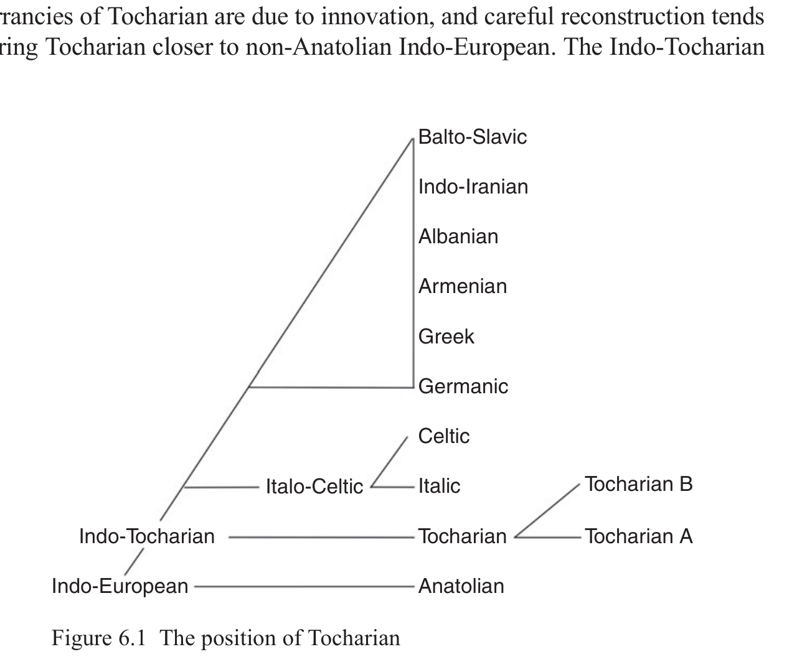

# 6 Tocharian

Michaël Peyrot

<!-- page: 83; pdf-page: 101 -->

## 6.1 Introduction

The Tocharian languages A and B are attested in manuscripts from the northern Tarim Basin, present-day Northwest China. Tocharian B is attested from about the fifth to the tenth centuries of the Common Era. Originally from Kuča, it spread east to Yānqí and Turfan, probably in the late sixth and in the seventh century. In Tocharian B itself, the language is referred to as the language of<i> kuśi</i> ‘Kuča’. Tocharian A is attested a little later, from about the seventh to the tenth centuries. It is originally from Yānqí, spread with Tocharian B east to Turfan, but not west to Kuča, and is referred to as the language of<i> ārśi</i> ‘Yānqí’. Both languages are written in the Indian Brāhmī script, and the vast majority of the manuscripts are of Buddhist content.

Traces of a third Tocharian language have been claimed to be preserved in the Middle Indic Gāndhārī dialect of Niya in the southern Tarim Basin (Burrow 1935). This hypothesis has not received wide support and must still be considered very uncertain (see further below in Section 6.3).1

## 6.2 Evidence for the Tocharian Branch

The existence of the Tocharian branch of Indo-European is beyond any doubt. The two languages A and B are closely related and share numerous significant innovations, so it is unnecessary to give a full list here. Some of the more important, branch-defining developments are: • loss of the threefold Proto-Indo-European distinction between the conventionally termed voiceless, voiced and voiced aspirated stops, i.e. *<i>ḱ</i>, *<i>ǵ</i>, *<i>ǵʰ</i> merged into *<i>k</i> (on *<i>d</i>, see below);

1 I will not discuss in detail a posthumously published proposal by Schmidt (2018: 161–271) to read previously undeciphered manuscript fragments in Formal Kharoṣṭhī as a Tocharian variety from Lóulán. His tentative decipherment is not convincing. Instead, these fragments are probably written in an Iranian language related to Khotanese and Tumšuqese (Dragoni, Schoubben & Peyrot 2020).

<!-- page: 84; pdf-page: 102 -->

• several mergers and shifts in the vowel system, including loss of vowel

length, merger of *<i>i</i>, *<i>e</i>, *<i>u</i> into *<i>ə</i> (the first two regressively palatalising), shifts of *<i>o</i> to *<i>e</i> and of *<i>ā</i> < *<i>eh₂</i> to *<i>o</i>, monophthongisation of *<i>ei</i> to *<i>’i</i> and of *<i>eu</i> to *<i>’u</i>, etc.; • rise of distinctive and morphological palatalisation, principally through the transformation of the contrast between *<i>o</i>: *<i>ē</i> into *<i>e</i>: *<i>’e</i> and *∅: *<i>e</i> into *<i>ə</i>: *<i>’ə</i>; • loss of word-final *<i>-s</i>, *<i>-m</i>, *<i>-n</i>, *<i>-t</i> (*<i>-d</i>), which has led to heavy restructuring of both the nominal and the verbal inflection; • rise of agglutinative case inflection in the noun, next to agglutinative number inflection in some noun classes; • almost complete loss of prefixing morphology; • rise of an intricate system of verbal derivation to form intransitives and

transitives or causatives; • numerous significant innovations in the lexicon. Even considering the late attestation of the Tocharian branch, the extent of structural change is surprisingly large, and it can be argued that this is partly due to a substrate effect. The loss of the distinction between the so-called voiceless, voiced and voiced aspirated stops, the rise of agglutinative case inflection, and the functions of these case suffixes, which include the perlative, denoting movement through, along or over something, point to Uralic influence. A pre-Proto-Tocharian phase of the vowel system can be compared more specifically with an early form of Samoyedic. Pronoun suffixes attached to the finite verb denoting the object may be compared with the objective inflection in Uralic (Peyrot 2019a with references; on the vowel system, see Warries in press).

It is more difficult to assess the Iranian impact on Tocharian. There has been considerable Iranian influence on the lexicon (Isebaert 1980; Tremblay 2005), but only the oldest layer of borrowings from Old Iranian may possibly be added as a branch-defining feature of Tocharian. The reason is that any feature defining the whole branch should have been acquired before the break-up of unitary Tocharian into Tocharian A and B. This is clearly the case with the structural shift attributed to Uralic above. However, many borrowings from Iranian are to be dated after the break-up and therefore do not define the Tocharian branch as such. Examples of this include borrowings from Bactrian, such as Toch.B<i> akālk</i> and Toch.A<i> ākāl</i> ‘wish’ from Bactrian <i>αγαλγο</i> /aγalg/: the<i> ā_ā</i> vocalism of Tocharian A, instead of the<i> ā_a</i> vocalism regular in inherited vocabulary, shows that the word has entered the language later, and the Toch.B and Toch.A forms cannot be reconstructed to a common proto-form. Bactrian influence is therefore to be dated after the split of Proto-Tocharian. The case of borrowings from Old Iranian is different. An example is

<!-- page: 85; pdf-page: 103 -->

Toch.B<i> perne</i>, Toch.A<i> paräṃ</i>‘glory’, which allows a Proto-Tocharian reconstruction *<i>perne</i>, borrowed from Old Iranian *<i>farnah-</i> (Av.<i> xᵛarənah-</i>). Nevertheless, for the Old Iranian layer, the details are not fully clear either. Tocharian B would have preserved a word like *<i>perne</i> unchanged, and the amount of change in Tocharian A is limited: *<i>e</i> ><i> a</i> in the first syllable; apocope of *<i>e</i> in the final syllable;<i> ä-</i>epenthesis in the final cluster<i> -rn</i>. Since these changes in Tocharian A cannot be dated exactly, it cannot be excluded that *<i>farnah-</i> was borrowed into Tocharian B and A independently, at an early stage, before the relevant sound changes in Tocharian A occurred but after the break-up of Proto-Tocharian. A reason to consider this more complicated chronology are the sound changes *<i>rn</i> ><i> rr</i> and *<i>ln</i> ><i> ll</i> in both languages. Good examples of the former are not found in Tocharian A, but the latter is certain. Since old geminates are generally simplified in Tocharian A, the rise of new geminates from *<i>rn</i> and *<i>ln</i> must be dated after the general simplification of geminates. The preservation of<i> rn</i> in ‘glory’ thus suggests an early but post-Proto-Tocharian borrowing according to the following relative chronology: 1. break-up of Proto-Tocharian; 2. degemination in pre-Tocharian A; 3. assimilation of *<i>rn</i>, *<i>ln</i> to<i> rr</i>,<i> ll</i> (the same change occurred independently in pre-Tocharian B); 4. borrowing of *<i>farnah-</i> as *<i>perne</i> (the same borrowing occurred independently in pre-Tocharian B); 5. *<i>e</i> ><i> a</i>, apocope of final *<i>e</i>, and<i> ä-</i>epenthesis to produce Tocharian A<i> paräṃ</i>. Another indication of this chronology is offered by Toch.B<i> etswe</i> ‘mule’, borrowed from Old Iranian *<i>atswa-</i> ‘horse’ (Av.<i> aspa-</i>). Although Toch. B<i> mətstsa-</i>, Toch.A<i> nätswā-</i> ‘starve’ shows that Proto-Tocharian *<i>tsw</i> has developed to<i> tsts</i> in pre-Tocharian B after the break-up of Proto-Tocharian, <i>etswe</i> has<i> tsw</i> unchanged, suggesting that the borrowing is post-Proto-Tocharian. Old Iranian borrowings can only be taken as a branch-defining feature if the preservation of the cluster<i> tsw</i> in Tocharian B, and of the cluster<i> rn</i> in both languages, receives an alternative explanation, notably a conditioning of the relevant assimilations, such as a difference in accent.

## 6.3 The Internal Structure of Tocharian

As Tocharian A cannot be derived from Tocharian B or vice versa, a common ancestor called Proto-Tocharian needs to be reconstructed. For instance, Toch. B<i> yente</i> ‘wind’ cannot have yielded Toch.A<i> want</i> ‘wind’, and the reverse is also impossible: a preform *<i>ẃente</i> is to be posited, with innovations in both languages leading to the attested forms. There is no need to discuss the internal subgrouping of Tocharian, since only one tree is possible. The dating of Proto-Tocharian, the only node in this tree, will be discussed below. Even though

<!-- page: 86; pdf-page: 104 -->

Burrow’s hypothesis of a third Tocharian language is too uncertain to be taken into account for inferences on the prehistory of Tocharian, it presents an illustrative case for the methodology of internal subgrouping.

The Gāndhārī words in the documents from Niya for which Burrow (1935) suggests a Tocharian etymology are few, and among these only two are relevant here:<i> kitsa’itsa</i>, a title, and<i> aṃklatsa</i>, a type of camel.<i> kitsa’itsa</i> has a very Tocharian-looking structure and has been convincingly connected to Toch.B <i>ktsaitse</i> ‘old’, Toch.A<i> ktsets</i> ‘perfect’ by Burrow, who suggests ‘elder’ for the Gāndhārī title. Toch.B<i> ktsaitse</i> derives from PToch. *<i>kətˢaitˢtˢe</i> with degemination after a diphthong,2 and Toch.A<i> ktsets</i> has undergone apocope of final<i> -e</i> and monophthongisation of *<i>ai</i> to<i> e</i>; both languages have syncopated the *<i>ə</i> in the first syllable. Niya<i> kitsa’itsa</i> could derive from Tocharian B as well as pre-Tocharian A or a third branch and is therefore useless for subgrouping. It could reflect an older form of the type *<i>kətˢaitˢtˢe</i> with<i> i</i> for<i> ə</i> and the regular Gāndhārī final<i> -a</i> for the regular Tocharian final<i> -e</i>. The geminate could be simplified or left unwritten. Equally, it could go back to a form of the type Toch.B<i> ktsaitse</i>, with<i> i</i> -epenthesis in the first syllable. Since Tocharian A is attested from the seventh century onwards, much later than Niya Gāndhārī, which is from the third–fourth centuries, it could also derive from an early form of Tocharian A in which monophthongisation of *<i>ai</i> to<i> e</i> had not yet taken place.

The key form for Burrow’s understanding of the internal subgrouping is <i>aṃklatsa</i> (1935: 673). According to him,<i> aṃklatsa</i> denotes a relatively cheap camel, which may therefore have been untrained. He connects the word to Toch.B<i> aknātsa</i>, Toch.A<i> āknats</i> ‘fool’, which is formed with the negative prefix *<i>en-</i> from the verb *<i>kna-</i> ‘to know’: in both languages, the vowel of the prefix has been affected by<i> a-</i>umlaut, and its nasal has been lost before the cluster<i> kn-</i>. To explain the different cluster<i> ṃkl</i> in Niya Gāndhārī, he assumes that it goes back to an earlier form with *<i>nkn</i> that was dissimilated to<i> nkl</i>, written<i> ṃkl</i>. Since the first<i> n</i> of the cluster is lost in both Tocharian A and B, he concludes that the Tocharian variety he assumes in the Gāndhārī of Niya is of a different branch, and this is the reason why it is often termed “Tocharian C”.

Burrow’s Tocharian etymology of Niya Gāndhārī<i> kitsa’itsa</i> is attractive, but his explanation of<i> aṃklatsa</i> is not convincing in view of the semantic and formal problems. At any rate, this questionable etymology can never alone bear the weight of proving a third branch of Tocharian, the famous “Tocharian C”.3

2 See Peyrot 2008: 45 on Toch.B<i> -auñe</i> < *<i>euññe</i> with the same degemination. Adams cites the

word as<i> ktsaitstse</i> (2013: 263), but this form is not attested. 3 Even in the unlikely event that the etymology should be correct nevertheless, it does not

necessarily prove the existence of a third branch of Tocharian. Rather than being a shared innovation of Tocharian A and B, the change *<i>nkn</i> ><i> kn</i> may be a parallel development, since there are cases where the nasal is lost in Tocharian A but preserved in Tocharian B (Hilmarsson 1991: 193–8).

<!-- page: 87; pdf-page: 105 -->

Rather, in the light of research by Niels Schoubben, who proposes new and convincing alternative explanations for some other items that Burrow explained as Tocharian (Schoubben 2021), scepticism about Burrow’s hypothesis is definitely due.

No absolute date can be given for Proto-Tocharian, by definition the latest phase of unity before the break-up in pre-Tocharian A and pre-Tocharian B. The languages are closely related, but differences are considerable in the lexicon, and most scholars estimate Proto-Tocharian around 500 BCE: some take it to be a little bit earlier, between 1000 BCE and 500 BCE; others a little bit later, between 500 BCE and the beginning of the Common Era (see the useful overview of different estimates in Mallory 2015: 7–8).

It is commonly agreed that the advent of Buddhism was after the break-up, as such basic terms as<i> dharma</i> ‘law’ (Toch.B<i> pelaikne</i>, Toch.A<i> märkampal</i>) and <i>karman</i> ‘act, fate’ (Toch.B<i> yāmor</i>, Toch.A<i> lyalypu</i>) are different (Lane 1966). But since Buddhism arrived late in the region, perhaps in the first or second century CE, this gives only an unsurprising<i> ante quem</i> date.

Contacts with the Iranian languages Bactrian and Sogdian took place after the split, probably in the early first millennium CE. Contacts with Old Iranian are more interesting: since it can be debated whether they occurred before or after the break-up, they may have to be dated close to that break-up. In the scenario sketched above, they would have occurred soon after it.4

However, the Old Iranian loanwords are themselves difficult to date in absolute terms. The archaic appearance of words such as Toch.B<i> etswe</i> ‘mule’ ⇐OIrn. *<i>atswa-</i> ‘horse’ (Av.<i> aspa-</i>) or Toch.B<i> waipecce</i> ‘possessions’ ⇐OIrn. *<i>hwai-paθya-</i> (Av.<i> xᵛaēpaiθiia-</i> ‘own’) suggests a date in the middle of the first millennium BCE or earlier, but a more precise dating is difficult. I have suggested that these loanwords may be associated with the presence of Andronovo related groups in Northern Xīnjiāng in the thirteenth– ninth centuries BCE (Peyrot 2018: 280), which would accordingly push the date of Proto-Tocharian towards the beginning of the first millennium BCE. The assumed contacts with Uralic, which may date to around 2500 BCE, in any case took place long before the split, in a pre-Proto-Tocharian phase.

Archaeological evidence on the Tocharians themselves is at present not clear enough (Mallory 2015: 29 and passim). It is uncertain whether the Cháwúhūgōu cultural group near Qarašähär (Debaine-Francfort 1989: 183– 9), whose different phases together cover almost the entire first millennium BCE, can be identified with early speakers of Tocharian A, or whether the Hālādūn cultural group of the early first millennium BCE in and near Kuča

4 It is tempting to consider the possibility that the apparently impressive technological advances

brought by the Iranians speaking this Old Iranian language were the impetus for the split of Proto-Tocharian. At present no evidence for or against this scenario seems to be available.

<!-- page: 88; pdf-page: 106 -->

(Debaine-Francfort 1988: 23) can be identified with early speakers of Tocharian B. Accordingly, archaeological evidence for the date of Proto-Tocharian or the place where it was spoken is presently indirect at best.

## 6.4 The Relationship of Tocharian to the Other Branches

It is now commonly held that Tocharian has no closer affinity to any other branch of Indo-European.5 Proposals for closer affinity have been made but have found little acceptance and concern superficial similarities, such as the spread of the<i> n-</i>stems in the nominal inflection, which would be shared with Germanic (Adams 1988: 5), or the endings in<i> -r</i> of the middle, suggesting a link with Italo-Celtic (e.g. Lane 1970: 78, who attributes the correspondence to post-Proto-Indo-European contact), and so on. References to and discussion of these and other suggestions can be found in Hackstein 2005 and Malzahn 2016: 281. Not accepting any of the adduced old comparisons, Hackstein (2005) proposes instead several close matches between Tocharian and other branches in grammaticalisation processes. According to him, the observed grammaticalisation processes are independent and parallel instead of shared, and indicate post-Proto-Indo-European contact. The matches that he proposes are with Latin, Slavic, Gothic, Greek and Armenian. Although the cases discussed are interesting, the large number of languages in the comparison makes it unlikely that the parallelisms are due to early contact. In addition, it is open to debate whether the parallelisms, if correctly identified, are indeed so salient that they cannot have come about completely independently. For instance, the univerbation of interrogative and demonstrative in Toch.B<i> kᵤse</i> ‘who’ < *<i>kʷi</i> +<i> so</i>, in Alb. <i>kush</i> ‘who’ < *<i>kʷis</i> +<i> so</i>, and in OCS<i> kъto</i> ‘who’ with<i> -to</i> from PIE *<i>tod</i> (Hackstein 2005: 177) has not proceeded in exactly the same way; it probably compensates, at least in part, for the loss of inflection and word weight; and it appears to be a natural process. Toch.B<i> ṣ</i>and<i> ṣpä</i> ‘and’, which Hackstein derives from *<i>h₁eti</i> and *<i>h₁eti-h₁epi</i> respectively, in fact represent one and the same etymon *<i>ṣpə</i> with simplification of<i> ṣp</i> to<i> ṣ</i>in classical and late Tocharian B (Peyrot 2008: 68) so that<i> ṣ</i>cannot be directly compared with Latin<i> et</i> or Gothic<i> iþ</i> (<i>pace</i> Hackstein 2005: 176). A different case is presented by matches with Anatolian, of which several have been proposed that appear to be fairly solid: see for instance Pinault 2006a: 93. These must be archaisms, not showing any closer affinity between Anatolian and Tocharian, and are potentially relevant to establish the position of Tocharian in the tree of Indo-European, discussed in the following section.

5 The prolonged contact with Iranian and the shorter but dramatic impact of Indic are obviously to be discarded as secondary.

<!-- page: 89; pdf-page: 107 -->

## 6.5 The Position of Tocharian

Tocharian is often claimed to have been the second branch to split off the Indo-European proto-language: after Anatolian, but before all other attested branches. This hypothesis may be called the “Indo-Tocharian” hypothesis, based on the model of Indo-Anatolian (Peyrot 2019b; see Figure 6.1). “Indo-Anatolian”, equivalent to “Indo-Hittite”, is used here in a technical sense for the highest node in the Indo-European tree, before Anatolian split off as the first branch, a scenario for which the evidence is steadily growing (cf. Kloekhorst & Pronk 2019).6 Strikingly, the arguments that have been advanced in support of the “Indo-Tocharian” hypothesis vary considerably: many authors making the same claim do not accept each other’s evidence for their claim. The most comprehensive systematic review is that by Ringe (1991), who finds hardly any evidence for the position of Tocharian in the family tree at all. Other relevant contributions include Lane 1970, Schmidt 1992, Winter 1997, Pinault 2013 and Malzahn 2016.

6 Jasanoff (2017: 233–4) explicitly subscribes to this scenario but rejects the term “Indo-Hittite”

because it “acquired tendentious overtones” (p. 233).

<!-- page: 90; pdf-page: 108 -->

hypothesis still seems attractive, but evidence is slim and the difference between Indo-Anatolian and Indo-Tocharian appears to be much larger than that between Indo-Tocharian and the other Indo-European languages. If Indo-Anatolian can be dated to the middle of the fifth millennium BCE, Indo-Tocharian must be much closer to the middle of the fourth millennium. As pointed out to me by Tijmen Pronk, the split-off of the Tocharian branch (Anthony 2007: 305, 307–11; Anthony & Ringe 2015: 208, 211) may be associated with the apparent abandonment of the Caspian steppe in 3500–3400 BCE, probably due to abrupt aridification (Shishlina 2008: 220).

### 6.5.1 Methodology

In view of the many different arguments that have been proposed for the Indo-Tocharian hypothesis, a brief note on the methodology seems in order.

It is generally agreed that the assumption of an early Tocharian split-off must be based on shared innovations of the other non-Anatolian Indo-European languages. In particular, the branch that split off<i> after</i> Tocharian should have shared in such innovations. As the most likely candidate for the branch to have split off third appears to be Italo-Celtic, the supposed shared innovation should ideally be attested in this branch. Conversely, arguments for Indo-Anatolian should be based on shared innovations of non-Anatolian Indo-European, ideally attested also in Tocharian (Peyrot 2019b).

Though clear in theory, in practice finding and defining shared innovations is difficult. There appear to be the following requirements to shared innovations useful for phylogenetic subgrouping: •<i> identifiability</i>: the linguistic element adduced as a shared innovation in the

lower node should be clearly identifiable in the higher as well as in the lower node; •<i> unidirectionality</i>: the observed difference with regard to the selected linguis-

tic element should be interpretable as a unidirectional change; •<i> salience</i>: the observed change should be so salient that it is unlikely to have

occurred independently in the supposed lower-node branches, in which case it would be a parallel, not a shared innovation. The requirement of unidirectionality is widely accepted, and discussion tends to focus on the question as to whether a given difference can be interpreted as a unidirectional change, rather than the need of this requirement as such. A case in point is semantic change: phylogenetic arguments based on semantic change are often contested on the grounds that a given semantic difference is not necessarily due to unidirectional change.

The requirement of identifiability, often implicit, may be helpful in discussions about debated phylogenetic arguments based on the loss or addition of features, or on lexical replacement. Arguments based on loss or addition are

<!-- page: 91; pdf-page: 109 -->

notoriously difficult, as for instance with the comparative and superlative suffixes, which are unattested in Anatolian and Tocharian: have they been lost in both branches, or were they added after the Tocharian split-off? Such arguments cannot be applied if the supposedly added feature cannot be identified with any prestage leading to it or if the lost feature has left no trace at all. Arguments based on lexical replacement are weak because the identifiable element would be the meaning, expressed with different etyma in two branches. Meaning is difficult to use as an identifiable element, because several etyma may have similar, overlapping or even identical meanings, and it is therefore difficult to prove that a certain meaning came to be expressed with a different etymon.

The requirement of salience seems so obvious that no further explanation is needed.

### 6.5.2 Phonology

For our present purposes, phonological evidence appears to be of little relevance in view of the extensive changes in the Tocharian sound system, which are probably due to a Uralic substrate (see Section 6.2). In particular, evidence for the phonetic realisation of the stops in the proto-language has been obscured by this substrate effect. Thus, there is little evidence to establish the position of Tocharian with relation to Kloekhorst’s claim that Anatolian preserves an older system of stop distinctions (2016), with classical PIE *<i>t</i>, *<i>d</i>, *<i>dʰ</i> from Proto-Indo-Anatolian *<i>tː</i>, *<i>ˀt</i>, *<i>t</i>.

For Tocharian, the developments of *<i>d</i> and *<i>bʰ</i> are notable. PIE *<i>d</i> is by default represented with<i> ts</i> and is otherwise often lost, at least before *<i>i̯</i>, *<i>u̯</i> and *<i>r</i>, and so differs from *<i>t</i> and *<i>dʰ</i>, whose default outcome is Tocharian<i> t</i>.7 Thus, even though the exact phonetics remain difficult to establish, *<i>t</i> and *<i>dʰ</i> were apparently closer to each other than either of them were to *<i>d</i>.8 At the same time, *<i>bʰ</i> is lost after *<i>m</i>, for instance in *<i>ǵombʰo-</i> > Toch.B<i> keme</i> ‘tooth’, while *<i>p</i> stays, for instance in *<i>temp-</i> (Lith.<i> tempiù</i> ‘stretch’) > Toch.B<i> cəmp-</i> ‘be able’.9 This suggests that *<i>bʰ</i> was weaker than *<i>p</i>: it may have been voiced,

7 Also, the palatalised reflex of *<i>d</i> is<i> ś</i>, while that of *<i>dʰ</i> and *<i>t</i> is<i> c</i>. 8 Possibly, this distribution also holds for the assibilated variant<i> -ṣ</i>< *<i>-ti</i>, *<i>-dʰi</i> (Jasanoff 1987),

although good evidence for the development of *<i>-di</i> is thus far lacking. 9 With original *<i>mt</i>, compare also *<i>(d)ḱmtóm</i> ‘100’ > Toch.B<i> kante</i>. Parallel cases with *<i>dʰ</i>, *<i>ǵʰ</i>, *<i>gʰ</i>

and *<i>gʷʰ</i> are not readily available. Ringe discusses the possibility that the Toch.B subj. stem of<i> lət-</i> ‘go out’ as in the inf.<i> lantsi</i> shows /lən-/ < *<i>h₁lu‹n›dʰ-</i> (1996: 43). However, he notes that forms with a geminate<i> nn</i> like 1sg.<i> lannu</i> ‘I will go out’ rather suggest an original *<i>ləntn-</i>. Indeed, all forms with a nasal in Toch.B can probably be derived from<i> lənn-</i> < *<i>ləntn-</i>, which arose secondarily through suffixation with *<i>-nəsk-</i> in the present (Peyrot 2013: 446). Toch.B<i> laṅkᵤtse</i> ‘light’ < *<i>h₁leng(ʷ)ʰ-u-</i> shows that *<i>gʷʰ</i> was not lost after *<i>n</i>. It may be supposed that *<i>ǵʰ</i> and *<i>gʰ</i> were not lost after *<i>n</i> either. The reason for this exception could be that there was no corresponding velar nasal phoneme and the velar stop had to remain in order to keep the velar nasal allophone.

<!-- page: 92; pdf-page: 110 -->

fricative or both. It is tempting to compare the typologically common loss of voiced stops after nasals, as in English<i> lamb</i> /læm/, and posit the value [b] for *<i>bʰ</i>, but this is certainly not the only option. Combining the evidence from dentals and labials, it appears that the stop system inherited by Tocharian had strong stops for the conventional voiceless stops like *<i>t</i>, weak stops for the conventional voiced aspirated stops like *<i>dʰ</i>, and a series that was different from both for the conventional voiced stops like *<i>d</i>.10 Although Tocharian offers no direct evidence for the reconstruction of glottalic stops in Proto-Indo-European, the fact that *<i>d</i> has a different reflex from *<i>t</i> and *<i>dʰ</i> is neatly compatible with it, since under Kortlandt’s glottalic theory (e.g. 1985; 2018a) *<i>d</i> [ˀd] on the one hand is set apart from *<i>t</i> and *<i>dʰ</i> on the other.

Nevertheless, the value for the phylogenetic position of Tocharian remains undecided. Since there is strong evidence for *<i>d</i> = *<i>ˀd</i> in classical Indo-European, this feature cannot be used. Further, the position of Tocharian cannot be determined with regard to Kloekhorst’s claim that classical PIE *<i>t</i> (perhaps phonetically [t]) < Proto-Indo-Anatolian *<i>tː</i> and classical PIE *<i>dʰ</i> (perhaps phonetically [d]) < Proto-Indo-Anatolian *<i>t</i>, since both phonetic stages are compatible with *<i>t</i> being stronger and *<i>dʰ</i> being weaker.11

It has been argued that Tocharian shows consonantal reflexes of PIE *<i>H</i> as <i>k</i> (e.g. Winter 1965: 206–10; Schmidt 1988; Kortlandt 2018b). Winter adduces Tocharian A “intrusive<i> k</i>” as a consonantal reflex of *<i>HH</i>, e.g. gen.pl.<i> lwākis</i> to nom.-obl.pl.<i> lwā</i> ‘animals’ or perl.pl.<i> puklākā</i> to nom.-obl.pl.<i> puklā</i> ‘years’. However,<i> k</i> must be secondary in such examples because it effectively prevents the problematic vowel contractions in the morphologically expected forms **<i>lwes</i> < *<i>lwā.is</i> (next to attested gen.sg.<i> lwes</i>!) and **<i>puklā</i> < *<i>puklā.ā</i>. Schmidt (cf. also Hartmann 2001) has argued that the<i> k</i> in roots ending in -<i>tk</i> goes back to *<i>h₂</i>, but Melchert’s earlier derivation of<i> -tk-</i> from<i> -T-sk-</i> is definitely to be preferred (1977; cf. also Pinault 2006b). Kortlandt’s derivation of Tocharian B<i> taka-</i> ‘be’ from *<i>steh₂-t</i> with<i> -k-</i> from *<i>h₂</i> is in itself attractive, but since the “<i>k-</i>aorist” is also attested in e.g. Gr.<i> ἔθηκα</i> and Lat.<i> fēcī</i>, this reflex cannot be used to determine the phylogenetic position of Tocharian, even if the

10 A thorough discussion of these developments can be found in Ringe 1996: 39–66 and

Winter 1962. In both accounts, a complicating factor is the Tocharian version of Grassmann’s Law, exemplified by e.g. Toch.B<i> tsik-</i> ‘form’ < *<i>dʰeiǵʰ-</i> and<i> tsǝk-</i> ‘burn’ < *<i>dʰegʷʰ-</i>, allegedly with<i> ts</i> < *<i>d</i> after *<i>dʰ</i> had been deaspirated to *<i>d</i> before the following *<i>ǵʰ</i> and *<i>gʷʰ</i>, respectively. The evidence for Grassmann’s Law in Tocharian is circumstantial and probably open to an alternative explanation. It is not taken into account here in view of the solid counterexample of Toch.B<i> tapre</i> ‘high’ < *<i>dʰubʰro-</i>, to be reconstructed with *<i>bʰ</i> instead of *<i>b</i> after Kroonen (2011: 253, 255). 11 It is possible that Tocharian inherited a stop system in which distinctive voice had not yet

developed, as argued by Kortlandt (e.g. 1985: 197; 2020: 269), but in my view this is difficult to prove.

<!-- page: 93; pdf-page: 111 -->

evidence as such nicely fits Kloekhorst’s reconstruction of *<i>h₂</i> and *<i>h₃</i> as uvular stops for Proto-Indo-Anatolian (2018; cf. also Kortlandt 2002: 218).

Like other Indo-European languages, Tocharian shows reflexes of metathesis of *<i>Hi</i> to *<i>iH</i> and *<i>Hu</i> to *<i>uH</i>. For instance, metathesis of *<i>Hu</i> to *<i>uH</i> is attested by such forms as Toch.B<i> puwar</i> ‘fire’ < *<i>puh₂r</i>12 (as in Greek<i> πῦρ</i>) from earlier *<i>peh₂-ur</i> (as in Hitt.<i> paḫḫur</i>) and Toch.B<i> ləw(a)-</i> ‘rub’ (prt.3sg.- 3sg.obj.<i> lyawā-ne</i> ‘he rubbed him’) < *<i>leuh₃-</i> from earlier *<i>leh₃u-</i> (as in Hitt. <i>lāḫu-i</i> ‘pour’). Even though unmetathesised forms are also found, for instance Toch.B<i> kaw-</i> ‘kill’ < *<i>keh₂u-</i>, the existence of metathesised forms in Tocharian clearly shows that this sound change is to be dated before Tocharian split off. However, even though Hittite often shows unmetathesised forms next to metathesised forms elsewhere (Kloekhorst & Pronk 2019: 5), the metathesis must have already occurred before Proto-Indo-Anatolian on the evidence of forms such as Hitt.<i> šuḫḫa-</i> ‘pour, sprinkle’ < *<i>suh₂-</i> next to<i> išḫu(wa)-</i> < *<i>seh₂u-</i> and<i> lu-u-</i> ‘pour’ < *<i>luh₃-</i> next to<i> lāḫu-</i> < *<i>leh₃u-</i> (Melchert 2011: 129, 131). At this point, therefore, the mere attestation of laryngeal metathesis cannot be used for inner Indo-European phylogeny.

However, another Indo-European metathesis may be used: that of word-final *<i>-ur</i> to *<i>-ru</i> (Lubotsky 1994: 99–100). This sound change seems to have occurred only after Proto-Indo-Anatolian. Strong evidence for it in Tocharian has been discovered by Del Tomba (2021), who shows that Toch.B plurals in<i> -wa</i> to nouns in<i> -r</i>, such as<i> tarkär</i> ‘cloud’, pl.<i> tärkarwa</i>, presuppose metathesis of *<i>-ur</i> to *<i>-ru</i> in the singular, on which the plural<i> -r-wa</i> < *<i>-ru-h₂</i> was built. Although this sound change may be used for the phylogeny of Indo-European, it clearly groups Tocharian together with the non-Anatolian languages.

### 6.5.3 Morphology

Morphology is the domain that is often ascribed the highest potential to yield evidence for the phylogenetic position of Tocharian. Indeed, morphology meets two essential needs: it is constantly in the process of change, and, at the same time, shifts in function, though commonplace, are subject to

12 The Tocharian word for ‘fire’ is variously reconstructed. Hackstein, for instance, reconstructs

*<i>ph₂u̯ōr</i> (2017: 1314). It is, however, questionable whether *<i>h₂</i> would be lost in this context, and whether the reconstruction of a collective ending *<i>-ōr</i> for this etymon is warranted. A derivation of Toch.B<i> puwar</i> from *<i>puh₂r</i> is the most straightforward. Winter (1965: 192) reconstructs the Tocharian A equivalent<i> por</i> as *<i>paur</i> from unmetathesised *<i>peh₂-ur</i>. This is phonologically possible but most difficult morphologically, since it is not clear what the distribution of these variants in the Proto-Tocharian paradigm might have been. It is therefore preferable to assume a development *<i>wa</i> ><i> o</i> similar to *<i>we</i> ><i> o</i> in<i> koṃ</i>, obl.sg. of<i> ku</i> ‘dog’, < *<i>kwen</i> and *<i>iye</i> ><i> e</i> in <i>karemāṃ</i>‘laughing’ < *<i>keriyemane</i> (Hilmarsson 1989: 135; Hackstein 2017: 1314; Peyrot 2012a: 210).

<!-- page: 94; pdf-page: 112 -->

limitations. Unfortunately, Tocharian morphology is heavily reorganised and its prehistory is often very obscure. Even worse is the fact that the reconstruction of Proto-Indo-European in exactly the relevant points is difficult and often disputed.

Without a doubt, the most prominent argument for phylogeny based on morphology that has been advanced comes from the Tocharian<i> s-</i>preterite. In the active of the Tocharian<i> s-</i>preterite, an element<i> s</i> is only found in the 3sg.: 1sg.<i> prek-uwa</i> ‘asked’, 2sg.<i> prek-asta</i>, 3sg.<i> prek-sa</i>, 1pl.<i> prek-am</i>, 2pl.<i> prek-as</i>*, 3pl.<i> prek-ar</i>. This is reminiscent of the Hittite<i> ḫi-</i>preterite, which likewise has<i> -š</i> only in the 3sg.: 3sg.<i> ākkiš</i> ‘died’, 3pl.<i> aker</i> (Pedersen 1941: 146). There are two schools of thought to explain this correspondence. The first, most prominently voiced by Jasanoff (e.g. 2003: 204–5),13 takes the restriction of the<i> -s-</i> as an archaism of Anatolian and Tocharian, while the rise of the classical<i> s-</i>aorist through generalisation of the -<i>s-</i> from the 3sg. throughout the whole paradigm is a common innovation of the other Indo-European branches. According to the second one, the<i> -š</i> in Hittite is secondary, probably somehow from the <i>s-</i>aorist, while in Tocharian the<i> s-</i>preterite forms without<i> -s-</i> lost it due to the effects of sound law and analogy (Ringe 1990; Kortlandt 1994; Peyrot 2013: 503–7). The matter cannot be treated here in detail. Suffice to say that the assumption of loss of<i> -s-</i> accounts best for the inflection of the Tocharian preterite and its patternings with the subjunctive. At any rate, this famous case very clearly shows how different views on the reconstruction of Proto-Indo-European logically lead to different evaluations of arguments for phylogeny.

Another phylogenetic argument is based on the middle endings in<i> -r</i> (e.g. Ringe, Warnow & Taylor 2002; Ringe 1991: 98–9). It is widely held that the shorter middle endings 3sg. *<i>-to</i> and 3pl. *<i>-nto</i> were secondary endings in Proto-Indo-European, while the corresponding primary endings were originally 3sg. *<i>-to-r</i>, 3pl. *<i>-nto-r</i>, which were later replaced by 3sg. *<i>-to-i</i>, 3pl. *<i>-nto-i</i>, marked with the productive primary marker *-<i>i</i> as found in the active endings. This would not be a valid argument for Indo-Tocharian, since the <i>r-</i>endings are also found in Italo-Celtic and Phrygian, but it would group Tocharian with the older branches.

However, a number of problems with this argument need to be noted: • It is questionable as to whether the contrast between Toch.B pres. 3sg.<i> -tär</i>,

3pl.<i> -ntär</i> and pret. 3sg.<i> -te</i>, 3pl.<i> -nte</i> continues an original primary–secondary contrast, because the Tocharian preterite active endings do not continue the secondary endings of Proto-Indo-European. In the copula 3sg.<i> ste</i>, 3pl. <i>skente</i>, the endings<i> -te</i>,<i> -nte</i> are even used as present endings. Hackstein (1995: 273–5) explains these forms as original resultatives, i.e. “is” < “has

13 Two more recent contributions are Melchert (2015) and Jasanoff (2019).

<!-- page: 95; pdf-page: 113 -->

become”, and notes that presentic readings of preterites are found elsewhere. However, it remains problematic as to why no shade of the past meaning has been preserved in 3sg.<i> ste</i>, 3pl.<i> skente</i>, and why the corresponding suffixed forms, such as 3sg.-1sg.obj.<i> star-ñ</i>, have present endings. This distribution is difficult to explain from an original difference in tense. • The reconstruction of the primary middle endings 3sg. *<i>-to-r</i>, 3pl. *<i>-nto-r</i> is

problematic itself. Indeed, Lat.<i> -tur</i>,<i> -ntur</i> point to *<i>-tor</i>, *<i>-ntor</i>. However, as Weiss (2009: 413) notes, Osc. 3sg.<i> -ter</i>, 3pl.<i> -nter</i> point to *<i>-tro</i>, *<i>-ntro</i>, and Umb. primary<i> -ter</i>,<i> -nter</i> vs. secondary<i> -tur</i>,<i> -ntur</i> suggests Proto-Italic primary *<i>-tro</i>, *<i>-ntro</i> vs. secondary *<i>-tor</i>, *<i>-ntor</i>. Likewise, the Old Irish deponent endings 3sg.<i> -thir</i>, 3pl.<i> -tir</i> point to *<i>-tr-</i>, *<i>-ntr-</i>, probably *<i>-tro</i>, *<i>-ntro</i>. Finally, Toch.<i> -tär</i>,<i> -ntär</i> cannot be derived from *<i>-tor</i>, *<i>-ntor</i> directly (cf. also Pinault 2010b). Ringe (1996: 86) discusses the change of *<i>-or</i> to Toch. *<i>-ər</i>, but the 3rd person middle endings are his only evidence, against counterexamples such as Toch.B<i> malkwer</i> ‘milk’, with suffix<i> -wer</i> < *<i>-uor</i> as in the verbal abstract, e.g.<i> śeśuwer</i> ‘eating’. A further counterexample seems to be<i> yerter</i> ‘felloe’, which on the evidence of the unpalatalised<i> -t-</i> must reflect *<i>-tor</i>.14

• The assumed replacement of well-marked middle paradigms ending in<i> -r</i>

with the active marker<i> -i</i> is difficult to understand. What would be the motivation to do so? If endings are clearly marked to be primary, there seems no need to replace them. The greatest difficulty here is not the addition of the primary active marker<i> -i</i> – such additions are indeed found frequently in e.g. the perfect endings, such as OCS<i> vědě</i>, Lat.<i> vīdī</i>, or Toch.A<i> kärse</i> ‘I knew’ < *<i>kərsa-a-i</i> – but the fact that the transparent middle ending *<i>-r</i> should have been deleted. In view of these problems, it is tempting to follow Kortlandt’s reconstruction (1981) of the middle endings as *<i>-to</i>, *<i>-nto</i> only, without contrast between primary and secondary endings.15 Apparently such contrasts were created independently in the different branches. In any case, the problematic specifics of the reconstruction of the middle endings make them difficult to use for phylogeny.

Another argument advanced by Ringe, Warnow & Taylor (2002: 117) is the thematic optative in *<i>-o-ih₁-</i>, attested in Indo-Iranian, Greek, Balto-Slavic and Germanic, but not in Tocharian. Indeed, this may be a later innovation within Indo-European not shared by Tocharian. In Tocharian, there is only one variant

14 A possible alternative reconstruction would be *<i>-ewer</i> with contraction of *<i>ewe</i> to<i> e</i>. 15 The evidence of Anatolian seems compatible with an original *<i>-to</i>, *<i>-nto</i> without contrast

between primary and secondary endings: synchronically, they are attested in Hittite as pres.3sg. <i>-tta</i>, 3pl.<i> -anta</i>. However, a derivation from *<i>-tor</i>, *<i>-ntor</i> neatly explains the rise of the present particle<i> -ri</i> from resegmentation after the loss of<i> -r</i> after *<i>-ó-</i> (Yoshida 1990). The introduction of the particle<i> -ti</i>, to mark the preterite endings, i.e. 3sg.<i> -ttati</i>, 3pl.<i> -antati</i>, would be motivated in both scenarios.

<!-- page: 96; pdf-page: 114 -->

of the optative suffix,<i> -’i-</i> (<i>i</i> with preceding palatalisation), to be derived from *<i>-ih₁-</i>.16 However, “present optatives”, synchronically imperfects, are unattested in Tocharian A, and they must consequently have been regularised secondarily in Tocharian B (Peyrot 2012b). Therefore, it is difficult to prove that e.g. Toch.B<i> pari</i>* ‘he took’ goes back directly to *<i>bʰer-ih₁-t</i> (for *<i>bʰer-o-ih₁-t</i> elsewhere). In any case, since the thematic optative is not attested in Italo-Celtic, it cannot be used to show that Tocharian split off before that branch.

It has been argued that the combination of the Tocharian present participle in<i> -mane</i> with both active and middle finite inflection is an archaism: the verbal adjective *<i>-mh₁no-</i> would originally have been indifferent for voice, very much like the *<i>-nt-</i>participle in Anatolian (Kloekhorst & Pronk 2019: 3), and became specialised only later, after Tocharian split off, as the middle counterpart of the active *<i>-nt-</i>participle (Pinault 2012: 229; Peyrot 2017: 339–40). However, I now think that this argument has to be abandoned in the light of a study by Friis (2021), who shows that traces of specifically middle use are preserved, which suggests that active use of<i> -mane</i> in Tocharian is secondary.17

A case from word formation in the grammatical domain is the interrogative stem in *<i>m-</i> found in Anatolian and Tocharian (Hackstein 2004: 280–3; Pinault 2010a: 359; Peyrot 2019a: 195–9). A weak point of this argument is that the innovation of the other Indo-European languages would consist only in<i> loss</i> of the<i> m-</i>interrogative, while a strong point is the central position of this stem, paired only with *<i>kʷi-</i> (*<i>kʷe-</i>, *<i>kʷo-</i>), in the linguistic system. Thus, while the identifiability of this feature is low, its salience is nevertheless high.

### 6.5.4 Lexicon

Lexical evidence has been variously evaluated. Important papers adducing lexical evidence in support of an early split off of Tocharian are Schmidt 1992 and Winter 1997. This evidence, and the method as a whole, was criticised by Hackstein (2005: 172) and Malzahn (2016) amongst others. For lexical arguments, a distinction should be made between lexical replacements and semantic change.

16 The full grade variant **<i>-ye-</i> < *<i>-ieh₁-</i> may have been ousted by the zero grade variant through

paradigmatic levelling, but it is also possible that the zero grade variant was generalised from <i>s-</i>aorist optatives with *<i>-ih₁-</i> throughout (if the synchronic optatives of root subjunctives of class 1, such as Toch.B<i> parśi</i> ‘may he ask’, are to be derived from<i> s-</i>aorist optatives, i.e. in this case *<i>préḱ-s-ih₁-t</i>). 17 Thus, even though I cannot agree with the arguments adduced by Fellner & Grestenberger

(2018), I do now concur with their main claim.

<!-- page: 97; pdf-page: 115 -->

Arguments based on lexical replacement are especially difficult because the identifiability requirement is not easily satisfied: it is hard to prove that two words did not carry the same or a similar meaning. An example of such an argument is Anatolian (i.e. Luvian) and Tocharian (i.e. Toch.A) *<i>uel(H)-</i> ‘die’ vs. *<i>mer-</i> elsewhere (Ringe, Warnow & Taylor 2002: 99).18 Although *<i>mer-</i> indeed acquired the meaning ‘die’ from ‘disappear’ after Indo-Anatolian (Kloekhorst & Pronk 2019: 3), and thus became a new word for the meaning ‘die’, the Luvian and Tocharian A words cannot be shown to represent the original word for ‘die’, let alone that it was ousted by the new *<i>mer-</i> (see Malzahn 2016: 285–6).

Another example is *<i>h₁egʷʰ-</i> ‘drink’, well attested in Tocharian and Anatolian, as against *<i>peh₃-</i> elsewhere (Ringe, Warnow & Taylor 2002: 99). This may indeed be a case of lexical replacement, i.e. the meaning ‘drink’ came to be expressed by a different word. However, the details are complicated: Hitt. <i>pāš-i</i> ‘swallow’ shows that *<i>peh₃-</i> needs to be reconstructed for Proto-Indo-Anatolian, with possibly only a slightly different meaning; and Lat.<i> ēbrius</i> ‘drunk’ and Gr.<i> νήφω</i> ‘be sober’ show that *<i>h₁egʷʰ-</i> was preserved after Tocharian split off, possibly with a shift to ‘be drunk’ (Peyrot 2019b). Thus, the argument for lexical replacement remains fragile, while the best phylogenetic evidence is formed by the possible semantic developments of ‘drink’ to ‘be drunk’ for *<i>h₁egʷʰ-</i>, and ‘swallow’ to ‘drink’ for *<i>peh₃-</i>. The attestation of the meaning ‘be drunk’ in Latin is favourable for the Indo-Tocharian hypothesis, because it suggests that this semantic change occurred after Tocharian split off, but before Italo-Celtic split off.

As a lexical argument based on semantics, Ringe, Warnow & Taylor (2002: 99) adduce *<i>meǵh₂</i>, of which the Anatolian (e.g. Hitt.<i> mekk-</i>,<i> mekki-</i>) and Tocharian (e.g. Toch.B<i> māka</i>) reflexes mean ‘much, many’, as against ‘great’ elsewhere. The distribution is especially neat in this case, since the etymon is also attested in Italo-Celtic (OIr.<i> maige</i>, Lat.<i> magnus</i>, etc.) and Germanic (Goth.<i> mikils</i>). Here, the main problem is the requirement of unidirectionality: the meanings are contingent and a change from ‘great’ to ‘much’ is by no means unlikely.
