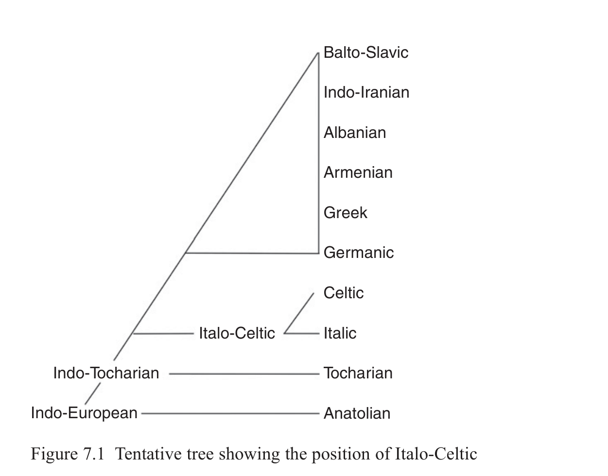

# 7 Italo-Celtic

Michael Weiss

<!-- page: 102; pdf-page: 120 -->

## 7.1 Introduction

Many scholars have noted similarities between Italic (Chapter 8) and Celtic (Chapter 9). Schleicher (1858) was the first to posit an Italo-Celtic node between Proto-Indo-European and Celtic and Italic.1 But in the 1920s Carl Marstrander and Giacomo Devoto questioned the validity of this subgrouping.2

Scholarly opinion has varied ever since. It would be fair to say that Italo-Celtic is more debatable than any other higher order subgrouping, certainly much more so than Balto-Slavic.

## 7.2 Evidence for the Italo-Celtic Subgroup

Many features once cited in favor of Italo-Celtic unity are now seen to be archaisms. For example, the medial<i> r-</i>endings (Lat.<i> sequitur</i> ~ OIr.<i> sechithir</i> ‘follows’) were in the nineteenth century only known from Italic and Celtic, but the appearance of these endings in in Anatolian (Hitt. mid.3sg. -<i>ttari</i>), and Tocharian (Toch.B mid.3sg. -<i>tär/-trä</i>) completely changed this picture. It is true, however, that it is only in Italic and Celtic that -<i>r</i> becomes a marker of middle diathesis, and only Celtic and Latin have created a mid.1pl. *-<i>mor</i>.3 In the other branches continuing *-<i>r</i> the suffix is limited to the primary middle endings only: Hittite prim. -<i>ttari</i>: sec. -<i>ttati</i>; Toch.B prim. -<i>tär</i>: sec. -<i>te</i>.4

Another feature now known to be an archaism is the<i> t-</i>less 3rd singular medial endings: OIr.<i> berair</i> ‘is carried’, Umb.<i> ferar</i> subj.mid.3sg. These forms are

1 But it is usually Lottner (1861) who is credited with first positing Italo-Celtic. In fact, Schleicher

beat him to it by a few years. Schleicher mentioned the<i> r-</i>middle forms, the<i> ā-</i>subjunctive, and the <i>ī-</i>genitive as well as much other material that was just wrong. Lottner (1861) added the formation of the superlative. 2 Devoto 1929; Marstrander 1929. Some key discussions of the issue of Italo-Celtic: Watkins

1966; Campanile 1968; Cowgill 1970; Jasanoff 1997; Schrijver 2016; Zair 2018; see also Kortlandt 1981, 2007. 3 Note, however, that in Old Irish for the 1st plural imperative of deponent verbs<i> r-</i>less forms occur

in the glosses, e.g.<i> seichem</i> ‘sequamur’. See Thurneysen 1946: 37. 4 But note that the secondary middle endings were not completely eliminated. Lat. 2sg. -<i>re</i>

continues < *-<i>so</i> and Venetic continued -<i>to</i> as a pret.act.3sg. ending (<b>donasto</b> ‘gave’)

<!-- page: 103; pdf-page: 121 -->

matched by Hitt. -<i>ari</i> (<i>ēšari</i> ‘sits’) and relics in Vedic (<i>áduha</i>[<i>t</i>] ‘gave milk’). Of course, archaisms like this do not provide positive evidence for subgrouping, but they aren’t completely uninteresting either. In the case of the primary marker *-<i>r</i>, we may note that the nearest groups to the east, Proto-Germanic, Proto-Balto-Slavic, Albanian, and Greek have all taken part in the innovation of replacing primary middle -<i>r</i> with primary active -<i>i</i> (e.g. Goth.<i> haitada</i> ‘is called’ <<i> *-otoi̯</i>, Arc. Gr.<i> -τοι</i>). The fact that the two most westerly branches escaped this innovation may not be fortuitous.5

In the realm of phonology there are a small number of innovative features that have been proposed as shared Italo-Celtic developments, but these are all problematic.

Both Italic and Celtic agree in the development of *<i>CR̥ HC</i> to<i> CRāC</i>: Lat. <i>grānum</i> ‘a grain’ < *<i>g̑r̥ hₓnom</i> vs. Goth.<i> kaurn</i> < PGmc. *<i>kurna-</i>,6 OIr.<i> lám</i> ‘hand < *<i>pl̥h₂meh₂</i>, but this apparent isogloss is complicated by fact that both Italic and Celtic show other outcomes for this sequence. In Italic *<i>CR̥ HC</i> becomes<i> CaRaC</i> under the accent, e.g.<i> palma</i> ‘palm of the hand’ < *<i>palama</i> < *<i>pĺ̥h₂meh₂</i> (see Höfler 2017). In Celtic the outcome<i> CRaC</i> is found in a number of examples, which cannot be easily explained as morphological neo-zero-grades, e.g. OIr. <i>flaith</i> ‘rule’, MW<i> gwlat</i> ‘country’< *<i>u̯l̥hₓti-</i>.7 It is difficult therefore to believe that the resolution of *<i>CR̥ HC</i> sequences happened in Proto-Italo-Celtic. Note in particular the disagreement between MW<i> gwreid</i> ‘roots’ < *<i>u̯radī</i> < *<i>u̯r̥ hₓdih₂</i> and the morphologically nearly identical Lat.<i> rādīx</i> ‘root’.

A famous isogloss that does seem to hold up better is the long-distance assimilation of *<i>p</i>...<i> kʷ</i> ><i> *kʷ</i>...<i> kʷ</i> seen in Lat.<i> quīnque</i>, OIr.<i> cóic</i>, OW<i> pimp</i> ‘five’ < *<i>kʷenkʷe</i> < *<i>pénkʷe</i>.8

Latin<i> quercus</i> ‘oak’ < *<i>kʷerkʷu-</i> < *<i>perkʷu-</i> (cf. Langobardic<i> fereha</i> ‘aesculus’, Goth.<i> faírguni</i> neut. ‘mountain’) seems to show that in Italic the assimilation *<i>p</i>...<i> kʷ</i> >*<i>kʷ</i>...<i> kʷ</i> preceded the change of *<i>kʷu</i> > *<i>ku</i>. But the Celtic place-name<i> Hercynia</i> ‘oak forest’ < *<i>perkunia</i> seems to show that in Celtic the *<i>kʷu</i> to<i> ku</i> change preceded *<i>p</i>...<i> kʷ</i> > *<i>kʷ</i>...<i> kʷ</i>. Since there was no *<i>kʷ</i> to trigger dissimilation *<i>p</i> developed regularly to ∅. This relative chronology,

5 Proto-Balto-Slavic may have taken part in this innovation since the athematic (active) endings go

back to<i> i-</i>diphthongs (OPr.<i> asmai</i> ‘I am’,<i> assei</i> ‘you are’), which may originate in the primary middle endings, though this is controversial. But note that Slavic has retained relic forms that could go back to *-<i>or</i> in OCS<i> kъžьdo</i> ‘everyone’ < *<i>kʷos</i> + *<i>g̑ ʰido(r)</i> ‘is expected’ (Majer 2012: 230) and OCS<i> ĺubo</i> ‘or’ <<i> *leu̯bho(r)</i> ‘is wanted’ (Majer 2015). For Albanian see Schumacher 2016: 386. For the potential relevance of archaisms retained by adjacent languages see Watkins’s discussion (1966: 30). 6 OIr.<i> grán</i> and the other Celtic forms might be loanwords from Latin. 7 See Zair 2012: 69–89 for discussion. 8 The Sabellic form for ‘five’ was *<i>pompe</i>, but strictly speaking it is not possible to determine

whether this is from *<i>kʷenkʷe</i> or *<i>penkʷe</i>. Venetic also probably had this change, as it would have to if it is Italic, to judge from the Istrian ethnonym<i> Quarqueni</i> (Plin. 3. 130) ‘people of the oak forest’?

<!-- page: 104; pdf-page: 122 -->

taken at face value, suggests that the Italic and Celtic long-distance assimilations were independent changes. If, however, the dissimilation of *<i>kʷu-</i> to *<i>ku-</i> occurred already in Proto-Indo-European, as is likely, then one might suppose that the labiovelar had been analogically restored from an oblique stem form *<i>perkʷeu̯ -</i> in the dialects ancestral to Latin, in which case no inference about differing relative chronologies of the sound changes can be drawn.9

In my 2009 book, I entertained the possibility that Italic and Celtic shared the change of *<i>ū</i> to *<i>ī</i> before yod, sometimes called Thurneysen’s Law. But Zair (2009) has shown that the Celtic facts are amenable to a different interpretation. The Old Irish word for ‘smoke’<i> dé</i>, gen.<i> diad</i> must go back to an immediate preform *<i>diots</i>, gen.<i> diotos</i> with a short<i> i</i> from earlier *<i>dʰuh₂i̯ots</i>, *<i>dʰuh₂i̯otos.</i> Zair explains this as *<i>uhₓiV-</i> > *<i>uiV</i> > *<i>iyV-.</i> Fortson (2017: 838) argues therefore that Thurneysen’s Law is a different phenomenon. But the whole complex of facts deserves more discussion than we can give it here. I limit myself to two observations. First, the forms of the verb ‘to be’ with an<i> ī</i> reflecting *<i>bʰuhₓ-i̯e-</i> cannot be explained by an Italo-Celtic rule (Lat.<i> fiō</i>, Osc.<i> fiíet</i>, OIr.<i> biid</i>, but MW <i>byd</i> points to a short *<i>i</i>) because these forms are also found in Germanic and Balto-Slavic (OE consuetudinal present<i> bið</i>, Lith. pret. 3ps.<i> bìt(i)</i>, OCS conditional<i> bi</i>).10 Second, while Latin is uninformative about the vowel quantity in prevocalic position, the Sabellic cognates of<i> pius</i> point unambiguously to a short <i>i</i> (Umb.<b> pehatu</b>, Pael.<i> pes</i> etc.).11 This raises the possibility that the development in Italic, like Celtic, was by way of a short vowel.

Intherealmofmorphologywemaynotefirstthethematicgenitivein*-<i>ī</i>:Ogham Ir. maqqi ‘son’, Gaul. segomari ‘Segomaros’, Lat. aiscolapi ‘Aesculapius’.12

Although the building blocks of the *-<i>ī</i> genitive appear to be Proto-Indo-European (see Weiss 2020a: 204), the complete integration into the thematic nominal paradigmisuniquelyItalicandCeltic.AndyetthiscannothavebeenaProto-Italo-Celtic innovation. It is clear that the replacement of the inherited thematic gen.sg. *-<i>osi̯o</i> happened in the individual Celtic and Italic languages. VOL *-<i>osio</i> is well represented in Satrican valesiosio and in Faliscan<b> euotenosio</b>. Lepontic -<i>oiso</i> is a probably transformation of *-<i>osi̯o</i> under the influence of the pronominal gen.pl. *-<i>oi̯sōm</i>. This means that Latin and Celtic in the historical period have independently replaced an inherited ending with the same piece of morphology. This could hardly be a contact phenomenon.13 Most scholars agree that the origin

9 The paradigm of the word for oak must have preserved its second syllable labiovelar in some

forms. Cf.<i> Querquerni</i> the name of a Celtic tribe of Gallaecia ‘people of the oak forest’. 10 See Hill 2012 for these forms. Hill does not discuss the Italic forms. 11 The Oscan form<b> piíhiúí</b> may be morphologically different (< *<i>pii̯i̯o-</i>). 12 On the Messapic genitive in -<i>aihi</i>, which is not related, see Weiss 2020a: 221, 494; Matzinger

2019: 37. 13 The first instance of -<i>ī</i> in Latin is from the fifth/fourth century BCE Muracci di Crepadosso in

Latium (morai esom ‘I am of Morra.’) The first secure Celtic example is from the second century bce. It’s highly unlikely that the -<i>ī</i> morpheme could have been transferred from Latin to

<!-- page: 105; pdf-page: 123 -->

of the -<i>ī</i> genitive is to be sought in the so-called<i> vr̥ kī́ḥ</i>suffix *-<i>ih₂</i>, which makes substantives with genitival meaning from thematic nouns. The question then arises what function could the<i> vr̥ kī́ḥ</i>suffix have acquired in Italic and Celtic that made it a favorable candidate for eventually replacing the inherited thematic gen.sg.? Answering this question is difficult because we have no attested textual evidence from Italic or Celtic showing both the inherited genitive and the<i> vr̥ kī́ḥ</i> suffix. A necessary mid-stage for the transformation of the<i> vr̥ kī́ḥ</i>suffix-forms, which are substantives in Indo-Iranian, into an adnominal case form would be their use as adjectives. This would be another instance of the so-called weak adjective phenomenon in which an original substantivized form becomes an adjective. Could the reinterpretation of the<i> vr̥ kī́ḥ</i>suffix-forms as adjectives be the shared Italo-Celtic innovation that laid the groundwork for the eventual independent emergence of the<i> ī-</i>genitive?

<b>The</b><b> ā</b><b>-</b><b>subjunctive:</b> OIr. ·<i>bera</i> ~ Lat.<i> ferat</i> ‘carry’. Both Italic and Old Irish display a morpheme<i> ā</i> used to form the subjunctive.14 In Latin this makes the subjunctive to thematic present stems, but relic forms of Old Latin and Sabellic show derivation from the root (<i>advenas</i>,<i> atulas</i>, Umb.<b> nei</b><b>ř</b><b>habas</b>). This must represent an old pattern. In Old Irish the<i> a-</i>subjunctive is formed to weak presents and strong presents ending in<i> b</i>,<i> r</i>,<i> l</i>,<i> m</i>, and<i> n</i> plus<i> agaid.</i>15 Class S 3 (nasal infix presents to seṭroot) affix the suffix to the root with no nasal infix (<i>benaid</i> ~<i> bia</i>). There are two schools of thought on the Italo-Celtic or Italic and Celtic<i> a-</i>subjunctive. One view, the traditional one, identifies the morphemes of the two language families. The other view, originating with Rix (1977) and significantly improved by McCone (1991), derives the Insular Celtic<i> a-</i>subjunctive from *-<i>ase-</i>, either the desiderative morpheme *-<i>h₁se-</i> (Rix) or<i> s-</i>aorist subjunctive morpheme added to laryngeal final roots (McCone). The advantage of the McCone view is that it allows both Old Irish subjunctives to be derived from a single Proto-Indo-European category. But the disadvantage is that the starting point for the<i> a-</i>subjunctive on this hypothesis would be the<i> s-</i>aorist subjunctive built to seṭroots; such a category, which is very sparsely attested in other Indo-European languages, would have to have become very successful in the prehistory of Celtic.

<b>The superlative formant *</b><b>-ism</b><b>̥</b><b> mo-</b><b>:</b> OIr.<i> tressam</i> ‘strongest’ < *<i>treksisa-</i> <i>mos</i>, MW<i> hynaf</i> ‘oldest’ < *<i>senisamos</i>, Lat.<i> maximus</i> ‘greatest’ < *<i>magisVmos</i>,

Gaulish and then from Gaulish to the ancestor of the Insular Celtic languages, which were already on the British Isles by this time. 14 The oft-cited Tocharian class V<i> ā-</i>subjunctive (Toch.A<i> wekaṣ</i>‘will disappear’, Toch.B<i> mārsaṃ</i>

‘will forget’) does not belong with the Italic and Celtic forms. PIE *<i>ā</i> becomes CToch. *<i>å</i> (Toch.A<i> a</i>, Toch.B<i> o</i>, e.g. Toch.A<i> pracar</i>, Toch.B<i> procer</i> ‘brother’ < *<i>bʰrātēr</i> < *<i>bʰreh₂tēr</i>). See Jasanoff 1994: 206–7. 15 Strong presents ending in a velar and dental form the subjunctive with<i> -s-</i>.

<!-- page: 106; pdf-page: 124 -->

Pre-Samnite<i> ϝολαισυμος</i> ‘best’ (see Cowgill 1970). Even strong opponents of Italo-Celtic like Marstrander admit the strikingness of this agreement. Marstrander (1929: 246) wrote:

Une forme tout à fait identique comme irl.<i> nessam</i>, osque<i> nessimo-</i> doit provenir d’une même source primitive; on ne saurait guère admettre qu’elle se soit développée indépendamment dans les deux langues. Mais il n’en suit pas nécessairement qu’elle ait pris naissance à un époque d’unité italo-celtique.

[An absolutely identical form like OIr.<i> nessam</i>, Osc.<i> nessimo</i> must derive from the same original source; it would hardly be possible to accept that it had developed independently in the two languages. But it does not necessarily follow that it arose in an era of Italo-Celtic unity.]

Marstrander thought the proto-form of the superlative suffix was *-<i>sm̥ mo-</i> and of “haute antiquité” [“remote antiquity”], hence a shared inheritance. But we know today, thanks to Warren Cowgill, that the proto-form was in fact *-<i>ism̥ mo-</i> and it is certain that *-<i>ism̥ mo-</i> replaces the earlier superlative formant *-<i>isto-</i> continued by Greek, Indo-Iranian, and Germanic, which was inherited into Italic as traces like<i> iuxtā</i> ‘nearest’ and probably<i> ioviste</i> ‘youngest’ and<i> sōlistimus</i> ‘most favorable’ show.16 Furthermore *-<i>isto-</i> could have been remade as *-<i>ism̥ mo-</i> under the influence of the well-attested suffix superlative *-<i>m̥ mo-</i>, which is normally added to pronominal and adverbial stems. But on what basis could a theoretical archaism *-<i>ism̥ mo-</i> be remade to *-<i>isto-</i>, since the suffix -<i>to-</i> would not otherwise occur as a superlative formant? The superlative formant *-<i>ism̥ mo-</i> seems the strongest argument for Italo-Celtic. It should be noted, by the way, that the same formant is continued in (para-) Venetic (venixema from Emona), but this is unproblematic if one believes, as I do, that Venetic was an Italic language.

<b>Primary 3rd person middle endings *</b><b>-tro</b><b>, *</b><b>-ntro</b><b>:</b> OIr.<i> do.moinethar</i> ‘thinks’, Umb.<i> herter</i> ‘should’ < *<i>her(i)tro</i>.17 The ending *-<i>ntro</i> results from a contamination of *-<i>ntor</i> and *-<i>ro</i> and the innovation spread from the 3rd plural to the 3rd singular. This innovation did not succeed in completely ousting

16 For possible traces of the superlative suffix *-<i>isto-</i> in Celtic personal names, see Prosper 2018:

128–9. Some reconstruct a laryngeal after the *<i>t</i> because of Ved.<i> -iṣṭha-</i>. 17 The source for the Old Irish deponent 3rd singular and plural endings and the Umbrian primary

middle endings must be reconstructed as *-<i>trV</i>,<i> *-ntrV</i>. If the ending had been *-<i>tor</i>, a pre-OIr. *<i>sekʷitor</i> ‘follows’ would have syncopated the medial vowel. The attested form<i> sechithir</i> points to an immediate preform *<i>sekʷitr</i>. See Thurneysen 1946: 367 and Jasanoff 1997. Final<i> *-(n)tro</i> in Umbrian and Oscan became [tḙr]. In Oscan the new vowel merged with old *<i>e</i> and is consistently written with e. In Umbrian the vowel merged with the reflex of short<i> i</i> and is written with e in the Umbrian alphabet and<i> e</i>,<i> i</i>, or<i> ei</i> in the Latin alphabet. Meiser (1986: 112) champions Ebel’s suggestion to derive the forms from *-<i>ti-r</i> and *-<i>ntir</i> with an<i> r</i> tacked on to the primary active personal endings, but this is unnecessary because there is just not enough evidence to show that the outcome of final *<i>Cros</i> was anything different. On Umb.<i> ocar</i>, which is from *<i>okaris</i> not *<i>okris</i>, see Weiss 2013: 349.

<!-- page: 107; pdf-page: 125 -->

*-<i>tor</i> and *-<i>ntor</i> in either Italic or Sabellic. In any case, there is no evidence for this contamination elsewhere in Indo-European.

At a much lower level of importance are the many shared lexical items, since content words can be easily borrowed. Nevertheless, some of these items show striking morphological and semantic specializations. Some examples follow.

Lat.<i> crispus</i> ‘curly’, MW<i> crych</i>, Gallo-Lat. PN<i> Crixsus</i> continue

a proto-form *<i>kripso-</i> from the root *<i>krei̯p-</i> ‘turn’ found also in Balto-Slavic (OCS<i> krěsъ</i> ‘solstice’, Lith.<i> kreĩpti</i> ‘to turn’). The Italic, Celtic, and Slavic forms presuppose an<i> s-</i>stem *<i>krei̯pos</i> ‘turning’. In Proto-Italo-Celtic the<i> s-</i>stem made a thematic derivative, which, in the most archaic fashion, triggered a double zero-grade of the pre-suffixal stem. The meaning ‘having turning’ was specialized to ‘curly’ and ‘wrinkled’, both meanings attested in Welsh and Latin.18

Lat.<i> dēses</i>,<i> dēsidis</i> ‘lazy’, ‘inactive’, OIr.<i> deeid</i> < *<i>de-sed(i)-.</i> The

Latin adjective, which is not attested before Livy, has been suspected of being backformed from<i> dēsidia</i> ‘idleness’ (Plautus +), but the close match with the Irish adjective makes this unlikely. The Irish and the Latin form presuppose a semantic development *<i>de</i><b>/</b> <i>deh₁ + *sed-</i> ‘to remain seated’ (cf. Lat.<i> dēsideō</i>) > ‘to be idle’. Lat.<i> saeculum</i> ‘lifespan’, MW<i> hoedl</i> ‘lifetime’ < *<i>sai̯tlom</i> < *<i>seh₂itlom</i>,

Gaul.<i> deae setloceniae < *sai̯tlokei̯nii̯o-</i> ‘goddess of long life’ (cf. OIr.<i> cían</i> ‘long’). This match is perfect and, if correctly derived from the root *<i>seh₂i-</i> ‘bind’, shows a striking semantic development. The oldest recoverable meaning for both<i> hoedl</i> and<i> saeculum</i> is ‘lifespan’. Thus in early Rome, according to Etruscan belief, a<i> saeculum</i> extended from some important date like the founding of Rome until the last person alive at that initial time died. This meaning could have arisen from the idea of a binding knot, marking the ends of life. Cf. Ved.<i> párur-</i> ~ <i>párvan-</i> which means ‘a knot’, ‘a limit’ and also ‘a fixed period of time’. Lat.<i> dē</i> ‘down from’, OIr.<i> di</i>, OW<i> di</i>. This preposition, probably the

instrumental *<i>deh₁</i> of a pronominal stem *<i>do-</i>, has no precise matches outside of Italic and Celtic. Though just a little word, *<i>deh₁</i>’s import is considerable since it is part of a relatively small set of quasi-functional prepositions.

18 De Vaan (2008: 145) prefers a proto-from *<i>krispo-</i> which is equally possible on the grounds that

*<i>kris-</i> is attested in Latin in<i> crīnis</i> ‘hair’ and<i> crista</i> ‘crest’, but neither<i> crispus</i> nor<i> crych</i> is exclusively a descriptor of hair, and it is easier to explain an -<i>s-</i> as a remnant of an old<i> s-</i>stem than a<i> -p-</i> as a root extension.

<!-- page: 108; pdf-page: 126 -->

Lat.<i> Sēmō</i>, a god of the oath often associated with Hercules, and Osc.

<b>seemún</b>- match Gaul.<i> Segomon-</i>, an epithet of Mars. These forms converge on a Proto-Italic epithet *<i>seg̑ ʰo-mō, -mon-</i> ‘strong-man’, a secondary -<i>mon-</i>stem from a thematic stem *<i>segʰo-</i> ‘strength’ (MIr.<i> segh</i>). The form *<i>seg̑ ʰo-mō</i> seems to have been a divine epithet found nowhere but in Italic and Celtic (see Weiss 2017a). Whether one recognizes an Italo-Celtic node or not, the fact remains that Italic shares more innovative features with Celtic than with any other branch.19 Nevertheless, it should not be forgotten that both Italic and Celtic individually and in common share many features with Germanic. This connection is not surprising given their geographical positions (see Weiss 2020a: 500–1). Somewhat more surprising are some striking agreements between Italic and/or Celtic and Indo-Iranian, famously highlighted by Vendryes. The phylogenetic import of these agreements is still unclear (see Weiss 2020b).

## 7.3 The Position of Italo-Celtic20

The relationship of Italo-Celtic to the rest of Indo-European can be conceived of as the answer to three questions. (1) Was Proto-Italo-Celtic the next clade to separate from the PIE tree after the separation of Proto-Tocharian? (2) How do we interpret the extensive lexical matches between Italic, Celtic, and the other northern Indo-European branches, Germanic and Balto-Slavic, the so-called vocabulary of the northwest? (3) What do we make of the striking matches,

19 For a determined attempt to undermine the plausibility of Proto-Italo-Celtic from the phono-

logical side, see Isaac 2007: 75–95. His argumentation is based on very specific possible formulations of the sound changes and, consequently, relative chronologies which, in my opinion, either can be formulated differently or cannot be stated with sufficient certainty. For example, Isaac relies heavily on the failure of the word for ‘yesterday’ to fall together with the reflect of “thorn” clusters in Italic (*<i>gʰdʰ(i̯)es-</i> > Lat.<i> heri</i>). If the metathesis of<i> TK</i> to<i> KT</i> is Proto-Italic-Celtic (or earlier) *<i>gʰdʰi̯es</i> would have to become *<i>dʰgʰ(i̯ )es.</i> But if this is the case, then how did the Latin form escape the normal treatment of such clusters in Latin to initial<i> s-</i> (<i>situs</i> ‘decay’ < *<i>dʰgʷʰitu-</i>). One solution, Isaac suggests, is to posit a simplification of *<i>gʰdʰ(i̯)es</i> to <i>*gʰ(i̯)es</i> in Proto-Italic but not in Proto-Celtic where the outcomes with<i> d</i> (OIr.<i> indé</i>, W<i> doe</i>) show that this simplification could not have applied. This difference would necessarily mean that Proto-Italic was divergent from Proto-Celtic at this point and the metathesis, if shared by Italic and Celtic, would be a diffused or independent event. By Isaac’s chronology there would then be no unique phonological innovations shared between Italic and Celtic predating this divergence. But this assumes that the thorn cluster development was the result of simple metathesis. In fact, what if, as argued by Jasanoff (2018), the key to the thorn cluster development was spontaneous palatalization in<i> TK</i> clusters with subsequent metathesis? i.e.<i> TK</i> ><i> TʲKʲ</i> ><i> KTʲ</i>. If this was the development, then there is no necessity for<i> KTʲ</i> to have the same development as<i> KTi̯</i>. In some languages these might have merged and in others, including Latin, they did not. 20 For the sake of this exposition, I will take the validity of the Proto-Italo-Celtic subgroup for

granted.

<!-- page: 109; pdf-page: 127 -->

especially in the religious and legal lexicon, shared by Italo-Celtic and Indo-Iranian?

That Proto-Italo-Celtic was the next group to branch off after Proto-Tocharian has been supported by some computational phylogenies of Indo-European (see Figure 7.1) but not others.21 To show that Proto-Italo-Celtic was the next to branch off would require demonstrating the existence of innovations shared by all the other non-Anatolian, non-Tocharian branches that are not found in Proto-Italo-Celtic. The best candidate for an innovation of this sort is the thematic optative *-<i>o-i̯h₁-</i> of which there is no certain trace in Italic or Celtic, while it is well represented, or at least traceable, in Germanic, Balto-Slavic, Indo-Iranian, Greek, Armenian, Phrygian, and Messapic.22 In place of the thematic optative, on the view followed here, Italic and Celtic show the *<i>ā-</i> subjunctive. Another possible innovation of the inner branches is the replacement of the primary middle marker *-<i>r</i> by *-<i>i</i>, which is seen in Greek, Phrygian,23 Indo-Iranian, Germanic, Albanian, and possibly Balto-Slavic.

21 This is the finding of Ringe, Warnow & Taylor 2002, but it is not supported by the Chang et al.

2015 tree. 22 There is no indisputable evidence for the retention of the thematic optative in Albanian, but,

given its advanced state of development at time of first attestation, this is not too surprising. 23 Old Phrygian has only -<i>toi</i>. New Phrygian has two instances of a 3sg. sequence -<i>tor</i>. It’s not clear

that these are to be compared with the<i> r-</i>middle forms of Anatolian, Tocharian, and Italo-Celtic.

<!-- page: 110; pdf-page: 128 -->

These two potential isoglosses seem to constitute the total evidence for innovations not reaching Proto-Italo-Celtic.

At the same time, it is clear that Proto-Italo-Celtic was in close contact with the rest of the northwestern Indo-European branches. Meillet (1922) famously identified a long series of lexical items shared between Italic, Celtic, Germanic, Baltic, and Slavic that found no matches in the other IE languages (cf. also Oettinger 2003). With greater knowledge of Anatolian, Tocharian, and the later Iranian languages, some of these supposedly exclusive items must be reevaluated. For example, the root *<i>seh₁-</i> ‘sow’ (Lat.<i> sēmen</i> ‘seed’, OIr.<i> síl</i>, OHG <i>sāmo</i>, OCS<i> sěmę</i> ‘seed’, Lith.<i> sė́ti</i> ‘to sow’) now has a cognate in Hitt.<i> šāi,</i> <i>šiyanzi</i> ‘to press’. The item *<i>seh₁-</i> must be reconstructed for highest node PIE, but the specialization to ‘sow’ is still only found in the northwest. On the other hand, Meillet’s example *<i>pork̑</i> <i>os</i> ‘piglet’ (Lat.<i> porcus</i>, OHG<i> farah</i>, Lith. <i>par̃šas</i>, CS<i> prasę</i>) is no longer valid since a cognate is attested in Iranian (YAv.<i> parsa-</i>, Khot.<i> pāsa</i>, etc.).

Nevertheless, there are still many items with a northwestern distribution. Some of these might be common or independent borrowings from substratal languages. This scenario is especially plausible for the names of flora and fauna. An example of this sort might be ‘alder’. The cognates for this word show a remarkable amount of formal variation that is difficult to trace back to exclusively Indo-European morphophonology: Lat.<i> alnus < *alsno-</i>; PGmc. *<i>alisō</i> (ODu.<i> elis</i> in place-names; MDu.<i> else</i>, Sp.<i> aliso</i>) ~ *<i>alizō</i> (OHG<i> elira</i>) ~ *<i>aluz-</i> (ON<i> ǫlr</i>, OE<i> alor</i>); Lith.<i> alìksnis al̃ksnis, el̃ksnis</i>; PSl.<i> *olьxa</i> (Ru.<i> ol’xá</i>)<i> ~ *elьxa</i> (Ru. dial.<i> elxá</i>, Bulg.<i> elxá</i>) ~ *<i>olьša</i> (Cz.<i> olše) ~ *eliša</i> (SCr.<i> jȅlša</i>). Cf. Basque <i>haltz</i>. The word may, however, also show up in Macedonian<i> ἄλιζα</i> (Hsch.) glossed as ‘poplar’.

Two terms relating to agricultural technology with somewhat overlapping meanings are (1) *<i>l(V)i̯hₓseh₂</i> ‘furrow, track’ (Lat.<i> līra</i> ‘furrow’<i> < *lei̯hₓseh₂</i>; OPr.<i> lyso</i> ‘field’ < *<i>lihₓseh₂</i>, cf. Lith.<i> lýsė <</i>*<i>lihₓsii̯eh₂</i>; OCS<i> lěxa</i> ‘row’, OHG -<i>leisa</i> ‘track’ <*<i>loihₓseh₂</i>

24) and (2) *<i>polk̑eh₂</i> ‘ploughed piece of land’ (OE <i>fealh</i> ‘ploughed land’, Gaul. *<i>olca</i> ‘arable land’ (Gregory of Tours<i> olca</i>, OFr. <i>ouche</i>, Port.<i> olga</i>), ORu.<i> polosá</i> ‘strip of land’). In Latin, Germanic, and Slavic the root *<i>plek̑</i> <i>-</i> ‘plait’ has acquired a -<i>t-</i>extension: Lat.<i> plectere</i>, OHG <i>flehtan</i>, OCS<i> pletǫ</i>. Contrast the unextended *<i>plek̑</i> <i>-</i> in Lat.<i> ex-plicere</i> and Gk. <i>πλέκω.</i> A piece of military technology is reflected by the word for ‘shield’: Lat.<i> scūtum</i>, OPr.<i> staytan</i> for *<i>skaitan</i> < *<i>skoi̯tom</i> vs. OIr.<i> scíath</i>, MW<i>ysgwyd</i>, OCS<i> štitъ</i> < *<i>skei̯tom</i>.

There are a number of words relating to social structure. Most famous is the word *<i>teu̯teh₂</i> ‘people’ (Osc.<i> touta</i>, Goth.<i> þiuda</i>, OIr.<i> túath</i>, Lith.<i> tautà).</i> And in

24 Whether these forms are further connected with the root *<i>lei̯s-</i> ‘learn’ (LIV² 409) is doubtful, but

in any case, the agricultural meaning is a share feature of the northwest.

<!-- page: 111; pdf-page: 129 -->

quasi-opposition to *<i>teu̯teh₂</i> is<i> *gʰostis</i> ‘guest-friend’ (Lat.<i> hostis</i>, Ven.<i> hosti-</i> <i>hauos</i>, Goth.<i> gasts</i>, OCS<i> gostь</i>). From the legal sphere we have *<i>dʰelgʰ-</i> ‘owe’ (OIr.<i> dligid</i> ‘is owed’, OIr.<i> dliged</i> ‘law’, Goth.<i> dulgs</i> ‘debt’, OCS<i> dlъgъ</i> ‘debt’, though the Slavic forms might be a loan from Gothic) and *<i>u̯adʰ-</i> ‘surety’ (Lat. <i>vas, vadis</i>, Osc.<b> vaamunim</b> ‘vadimonium’ < *<i>u̯afemōnii̯om</i>, Goth.<i> wadi</i> ‘pledge, surety’, Lith.<i> vãdas</i> ‘surety’ (obsolete)).25

Finally, it’s been observed since Vendryes 1918 that Italo-Celtic and Indo-Iranian share a number of culturally important words relating to the religio-legal sphere not occurring in the intervening languages. The most notable of these are the words *<i>h₃rēg̑s</i> ‘rule’, ‘king’ (OIr.<i> rí</i>, Lat.<i> rēx</i>, Ved.<i> rā́ṭ</i>) and *<i>k̑</i> <i>red(s)-dʰeh₁-</i> ‘to trust’, lit. ‘place heart’ (OIr.<i> creitid</i>, Lat.<i> crēdere</i>, Ved.<i> śraddhā́</i> ‘trust’). Vendryes regarded these agreements as archaisms that were discarded in the intermediate languages, but it is striking that the supposed archaic status of these items is not confirmed by evidence from Proto-Anatolian or Proto-Tocharian.26
