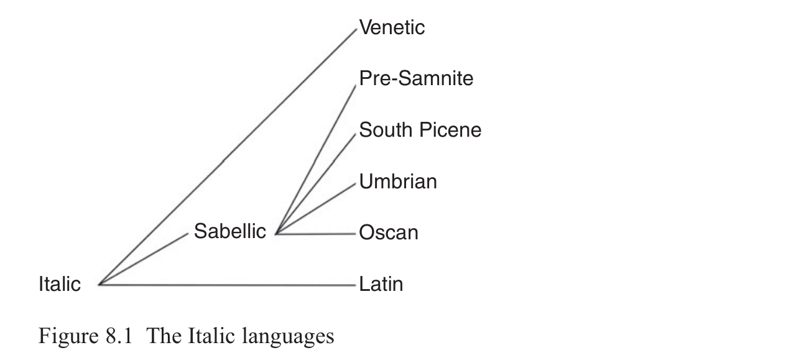

# 8 Italic

Michael Weiss

<!-- page: 114; pdf-page: 132 -->

## 8.1 Introduction

The Italian peninsula before the Roman conquest was home to a large number of languages, both Indo-European and non-Indo-European.1 Among these languages, the following have been thought to descend from a common ancestor, Proto-Italic (cf. Figure 8.1). 1. Latin, spoken in Latium in a number of slightly divergent dialects for most of

which we have only scant information from inscriptions and glosses. The Latin of Praeneste, which is the findspot for the two earliest Latin inscriptions, and the Latin of Falerii are reasonably well attested in inscriptions dating from the seventh to second century bce. The Latin of Falerii is often classified as an independent language called Faliscan, though this is not justified on linguistic grounds.2 But towering above all is the Latin of Rome. In this language we have a small number of inscriptions from the seventh– sixth centuries BCE in a distinctively archaic form, which I call Very Old Latin. After slowing to a trickle in the fifth century, Latin inscriptions pick up again in the fourth century and are joined by literary documents in the third century. The Latin of Rome spread first to Italy, suppressing the previously existing linguistic diversity, and then to most of Western Europe, North Africa, and southeastern Europe north of the Jireček line.3 Roman Latin survives today in its multiple descendants, the Romance languages. 2. The Sabellic languages. These languages, which form an as yet unques-

tioned subgroup, are

a. Oscan, the language of the Samnites of central and southern Italy, who

also expanded into Campania and Sicily, is represented by about 800 inscriptions dating from the mid-fourth century bce to perhaps as late as the first century CE

1 See Weiss 2020: 15–18 for a survey. 2 On Faliscan see Bakkum 2009. There are about 360 linguistically informative Faliscan inscrip-

tions dating from the sixth to second centuries BCE. On Praenestine, see Franchi de Bellis 2005. 3 An imaginary line drawn by the historian Konstantin Jireček marking the southern extent of Latin

influence in southeast Europe.

<!-- page: 115; pdf-page: 133 -->

b. Umbrian, known chiefly from the Iguvine Tables from Gubbio (third–

second century bce; see Weiss 2010) and about forty smaller inscriptions, a few as early as the seventh century c. South Picene,4 the language of fewer than thirty inscriptions from the

Marche and Abruzzo dating from the sixth–third centuries bce d. Pre-Samnite, the language of inscriptions from Campania before the

Samnite conquest in the fifth century; the longest document is the Cippus of Tortora from the sixth–fifth centuries5

e. In addition, there are a number of short texts in the dialects of the Volsci,

Marsi, Paeligni, Marrucini, Vestini, and Hernici.6 We also have a number of Sabellic loanwords in Latin (<i>bōs</i> ‘cow’ for expected *<i>(w)ūs</i> < *<i>gʷou̯s</i> being the most prominent of them).7

3. Venetic, attested in more than 400 inscriptions from the northeast corner of

Italy from the sixth to first centuries bce. Some documents have been discovered in neighboring Slovenia and Austria. Not all scholars would agree that Venetic is an Italic language. 4. Sicel, the language of a small number (fewer than thirty) of pre-Greek inscrip-

tions of eastern Sicily from the sixth to fourth centuries bce and a number of glosses.8 It is very difficult to determine much about this language beyond that it was Indo-European, as the form<i> pibe</i> ‘drink!’ = Ved.<i> píba</i> shows

4 See Zamponi 2021 for a survey of the evidence. 5 But see Clackson 2015: 26–7 who questions Rix’s idea of uniting these texts and some inscrip-

tions of Lucania as a unitary language. Adiego (2015) prefers Opic for the language of these inscriptions, which must have coexisted with Oscan for some time after the Samnite invasion of Campania. 6 There is no space to discuss the internal subgrouping of Sabellic, which is also not uncontrover-

sial. See Clackson 2015 and Fortson 2017: 847–51. 7 See Poccetti 2017 for more detail. 8 On Sicel, see Ambrosini 1984, Agostiniani 1992, Campanile 1969, Willi 2008: 341–8, Poccetti

2012, and Hartmann 2018.

<!-- page: 116; pdf-page: 134 -->

conclusively.9 There are a few items in Sicilian Doric Greek that seem to match Latin and that are suspected of being of Sicel origin, e.g.<i> lítra</i> ~ Lat.<i> lībra</i> ‘pound’,<i> kúbiton ~</i> Lat.<i> cubitum</i> ‘elbow’. The few inscriptions that are longer may show some Italic lexical material such as Mendolito<i> geped</i> ‘had’10 with a simple perfect comparable to Osc.<i> hipid</i>, Grammichele<i> dedaxed</i> ‘made’ (?) (see Machajdíková 2018: 151), perhaps with a reduplicated<i> k-</i>extended form of the root *<i>dʰeh₁-</i> like VOL<i> fhe:fhaked</i>, Osc.<i> fefacid</i>, or the female name<i> Kup(a)</i> <i>ra</i>, which recalls Sabellic *<i>kupro-</i> ‘good’. If Sicel is Italic, it would diverge from all other members in showing voiced reflexes of the PIE voiced aspirates in initial position in contrast to the<i> f</i> < *<i>dʰ,</i> *<i>bʰ</i> and<i> h-</i> < *<i>gʰ</i>/*<i>g̑ ʰ</i> seen in Latin, Sabellic, and Venetic.

## 8.2 Evidence for the Italic Branch

Positing Proto-Italic as the superordinate node of Latin, Venetic, and Sabellic is not uncontroversial, though it is supported by substantial phonological and morphological evidence: the merger of *<i>bʰ-</i> and *<i>dʰ-</i> as *<i>f-</i>,11 the gerundive in *-<i>nd-</i>, the ipf. subj. *-<i>sē-</i>, the ipf. *-<i>βā-</i> (the more probative morphological features are unattested in the fragmentary Venetic corpus). Proto-Italic was recognized as a node from the start of the serious scientific investigation of the Indo-European languages. But some scholars beginning with Walde (1917), Muller (1926), and Devoto (1929) have challenged this assumption and argued instead that Italic and Sabellic are two separate branches that have undergone a secondary process of convergence.12

And indeed, there is no doubt that much convergence has happened between Latin and Sabellic. For example, the change of intervocalic *-<i>z-</i> to -<i>r-</i>, called rhotacism, affects both Latin and Umbrian but not Oscan and can be shown to have happened long after the initial separation of both languages. In Latin the change happened sometime in the fourth century, and the Umbrian change may have happened around the same time. Initial<i> di̯-</i> is eventually simplified in Latin, Umbrian, and Oscan to<i> i̯-</i> (except in Bantia), but again these changes happened within the historical record for Oscan and Latin at least. Both Latin and Sabellic show deletion of the final primary marker *-<i>i</i> in the 1sg., 2sg., 3sg.,

9 On a kylix from Aidone. See Lejeune 1990. 10 For an ingenious attempt to make sense of this text, see Martzloff 2011. 11 But if, as I argued in Weiss 2018a (following Walde 1906), *<i>dʰragʰ-</i> ‘drag’ > *<i>dragʰ-</i> > *<i>tragʰ-</i> >

<i>trah-ere</i>byLimitedLatinGrassmann’sLawandthechangeof*<i>dr-</i> to<i>tr-</i>,andifLimitedGrassmann’s Law is only Latin, then there would be evidence that reflexes of *<i>bʰ-</i> and *<i>dʰ-</i> did not fall together in initial position in Italic so that the<i> f-</i> from both *<i>bʰ</i> and *<i>dʰ-</i> would have to be a diffused trait. The problem is that we can’t determine what the date of Limited Grassmann’s Law is, due to the lack of Sabellic evidence. It could be ordered very early in Proto-Italic before the devoicing of voiced aspirates or even theoretically in Proto-Italo-Celtic times. 12 A thorough survey of the arguments up until 1950 is provided by Diver’s unpublished disserta-

tion of 1953. Further important works are Jones 1951, Safarewicz 1963, Beeler 1966, and Campanile 1968.

<!-- page: 117; pdf-page: 135 -->

and 3pl. (Meiser 1998: 74 after Rix 1996: 158). But the survival of an unapocopated final -<i>i</i> in<i> tremonti</i> in the<i> Carmen Saliare</i> makes it unlikely that this apocope dates to Proto-Italic times. The<i> Carmen Saliare</i> is old, but not that old, and the text has a specifically Latin form of the acc. pronoun<i> tet</i> and so could not be “Proto-Italic”. Instead, the apocope must be a diffused change.13

But while it is easy to show some degree of phonological convergence and, of course, lexical interchange and syntactic influence within the historical period, I know of no case of a Sabellic morpheme being adopted into Latin or vice versa. We have no<i> v-</i>perfects in Sabellic, no -<i>tt-</i>perfects in Latin, no Latin infinitives in -<i>om</i>, no Latin athematic nom.pl. in -<i>s</i>, and so on. This difference between phonological, lexical, and syntactic permeability vs. morphological impermeability is not surprising: morphology is known to be more resistant to borrowing, but the absence of morphological borrowing within the attested timeframe, in a period when the Sabellic and Latin languages were in intense contact, should strengthen our confidence in the value of shared morphology for establishing the Proto-Italic subgroup.

There are a number of shared phonological developments unique to the Italic languages that cannot be shown to be the result of convergence and thus are good candidates for defining innovations of Proto-Italic. The difficult issue is deciding whether they are non-trivial. First on this list is the development of the PIE voiced aspirates. In initial position PIE *<i>dʰ</i> and *<i>bʰ</i> developed to<i> f</i> and *<i>g̑ ʰ/gʰ</i> to<i> h</i> in Latin, Sabellic, and Venetic: *<i>bʰuhₓ-</i> > Lat.<i> fu-ī</i> ‘I was’, Osc.<i> fu-st</i>, Umb.<b> fu-st</b> ‘will be’; Transponat *<i>dʰh₁k-</i> ‘make’ > Lat.<i> faciō</i>, Osc.<b> fakiiad</b>, Umb.<b> façia</b> subj.3sg., Ven.<b> vhagsto</b> pret.3sg.; *<i>g̑ ʰorto-</i> ‘enclosure’ > Lat. <i>hortus</i> ‘garden’, Osc.<b> húrz</b>; Ven.<b> hosti</b>- < *<i>gʰosti-</i> ‘guest’. In medial position, on the other hand, the voiced aspirates became voiced fricatives, and the labial and dental fricatives were not merged:14 Lat.<i> nebula</i> ‘cloud’ < *<i>neβVla</i> < *<i>nebʰVleh₂</i>, cf. Ved.<i> nábhas-</i> ‘cloud’;<i> aedēs</i> ‘temple’ < *<i>h₁ai̯dʰ-</i> ‘burn’, cf. Gr.<i> αɩ҆θόμενος</i> ‘burning’; Lat.<i> Samnium</i> Osc.<b> sa</b><b>fi</b><b>nim</b> by anaptyxis from *<i>saf-</i> <i>nim</i> and Gr.<i> Σαύνιον</i> point to a Sabellic *<i>saβnii̯o-</i>;15 Ven.<b> louderobos</b> ‘children’ dat.pl. ← *<i>h₁leu̯dʰerobʰos.</i> The velar fricative went on to become<i> h</i> everywhere except Faliscan where it hardened to<i> g</i>: *<i>meg̑ ʰei̯</i> ‘me’ dat.sg. > Lat.<i> mihī</i>, Umb. <i>mehe</i>, *<i>legʰeti</i> > Fal.<b> lecet</b> /leget/ ‘lies’, cf. Goth.<i> ligan</i>.16 The combination of devoicing, merger of *<i>dʰ</i> and *<i>bʰ</i> in<i> f</i> in initial position and voicing in medial position (whether this voicing directly continues the voicing of the voiced

13 For more on diffused changes, see Weiss 2020: 496–7. For what it is worth, Sicel appears to

have an unapocopated<i> esti</i>. 14 Though eventually they did merge in Sabellic and Faliscan. 15 Gr.<i> Σαύνιον</i>, which must have been borrowed form a Sabellic form before anaptyxis, shows that

the Greeks heard the fricative spelled by the Oscans with<b> f</b> as a voiced sound. 16 The reflex of *<i>gʰ</i> was still an obstruent in Umbrian at the time of medial syllable syncope

because when this sound comes together with<i> t</i> by syncope it develops to<i> j</i> in the same way as<i> k</i>, e.g. *-<i>u̯eg̑ ʰetōd</i> > *-<i>u̯eγetōd</i> ><b> a</b><b>ř</b><b>veitu</b> ‘bring’ parallel to *<i>fakitōd</i> ><b> feitu</b>.

<!-- page: 118; pdf-page: 136 -->

aspirates or is a revoicing) is a set of developments that is found in no other Indo-European branch.17

A set of sound changes that are certainly shared by Sabellic and Latin is the absorption of a short vowel after yod in a medial syllable. This sound change led to the creation of the 3rd<i> io-</i>type in Latin and its analog in Sabellic, e.g. *<i>kapi̯esi</i> ‘you (sg.) take’ > *<i>kapisi</i> ><i> capis</i>. Cf. Osc.<i> factud</i> (Lu 1.9) fut.ipv.sg. ‘make’ < *<i>fakitōd</i> < *<i>faki̯etōd</i>. After a base of more than one mora, there was an epenthesis of<i> i</i> before the yod prior to absorption of the<i> e</i>: *<i>sent-i̯esi</i> > *<i>sent-ii̯e-si</i> ‘you (sg.) feel’ > *<i>sent-</i> <i>īsi</i> ><i> sent-īs</i>. Cf. Umb.<b> amparitu</b> fut.ipv.sg. ‘raise’ < *<i>am-par-ii̯e-tōd</i>.18 The sound changes that produced this system appear to be quite early since they predate the resolution of syllabic sonorant consonants (see Fortson 2018), but, on the other hand, these sound changes appear to be distinct from similar changes in Germanic and Celtic.19

Another interesting phonological development is the outcome of *<i>m̥ mV</i>. This sequence first arose by the loss of a laryngeal or by Lindeman’s Law. It is also found in the ordinal and superlative suffix *<i>-m̥ mo-</i>, which is of uncertain analysis. In Latin and Venetic the supporting vowel is<i> o</i>, e.g. *<i>g̑ ʰm̥ mō</i> > Lat. <i>homō</i> ‘man’, cf. Goth.<i> guma</i>, *<i>dek̑</i> <i>m̥ mos</i> > Ven.<i> dekomei</i> loc.sg., cf. Celtib. <i>tekametam</i> ‘tenth’. In Sabellic the outcome appears to have originally been<i> u</i>. The best evidence for<i> u</i> is Osc.<b> últiumam</b> ‘last’, Palaeo-Umbrian<b> setums</b> (a personal name, lit. ‘seventh’) < *<i>septm̥ mos</i>, the Pre-Samnite superlative <i>ϝολαισυμος</i> ‘best’ nom.pl.20 It’s not certain what the Proto-Italic state was. We can certainly exclude *<i>um</i> since that would not be lowered to<i> om</i> in Latin, cf.<i> tumor</i> ‘swollen condition’,<i> gumia</i> ‘glutton’. It’s conceivable that *<i>om</i> would have been raised to<i> um</i> in a medial syllable in Sabellic, but there is no independent evidence for such a change. Rather than miss the generalization that the Italic languages uniquely have a rounded vowel as the reflex of

17 But note that if Sicel is Italic, and if the evidence is correctly interpreted as showing that Sicel

had voiced reflexes in initial position, this isogloss would have to be interpreted differently. Either the initial PIE voiced aspirates first became voiced fricatives that were retained or became stops in Sicel and were devoiced in the rest of Italic, or the initial voiced aspirates became voiceless fricatives which were then voiced in Sicel in all positions (cf. the famous southern British English from which the standard dialect borrowed<i> vat</i> and<i> vixen</i>). Whichever interpretation is correct, the Italic developments would still be unique. 18 The sound changes that produced the 3rd<i> io</i> ~ 4th conjugation contrast are attested outside of

verbal morphology, e.g. *<i>dii̯eu̯ii̯o-</i> ‘heavenly’ > *<i>dīu̯ii̯o-</i> (Osc.<b> diíviaí</b>), so it is uneconomical to set up athematic<i> i-</i>inflection for present stems which are functionally identical to the *<i>i̯e-/</i> <i>i̯o-</i>presents of other branches. 19 It is attractive to derive the endings of Old Irish<i> i-</i>stem verbs (absolute<i> gaibid</i>, conjunct ·<i>gaib</i>

‘takes’) from an immediate preform *-<i>iti</i> < *-<i>i̯eti</i>. But there are Gaulish forms that appear to show the unreduced sequence -<i>ie-</i> (<i>bissiet</i> ‘will be’), and the Sieversish distribution seen in Sabellic does not hold in Old Irish, e.g.<i> bruinnid</i>, ·<i>bruinn</i> ‘flows forth’ with an S 2 inflection after a heavy base. 20 The Oscan form<b> humuns</b> ‘men’ and Umb.<i> homonus</i> dat.pl. are ambiguous.<b> humuns</b> is written in

an alphabet that does not distinguish<i> u</i> and<i> o</i> and Umbrian lowers<i> u</i> to<i> o</i> before<i> m</i>.

<!-- page: 119; pdf-page: 137 -->

prevocalic *<i>m̥</i> which contrasts with its development in preconsonantal position, it may be preferable to reconstruct *<i>ɵm</i> with a close mid central unrounded vowel that merged with either<i> o</i> (in Latin and Venetic) or<i> u</i> in Sabellic.21 There are a number of other phonological features that could be mentioned, but they are all problematic in one way or another.22 The phonological innovations are admittedly not many, but they are indicative of a subgroup.

It is the shared morphological innovations, which, in my opinion and the opinion of most experts, make the existence of a Proto-Italic unavoidable. The Italic languages share a new verbal adjective, the gerundive, with the suffix -<i>ndo-</i> in Latin and *-<i>nno-</i> in Sabellic (Osc.<b> úpsannam</b> ‘to be constructed’, Umb<i>.</i> <i>ocrer pihaner</i> ‘to purify the city’). The origin of this form and the synchronically related gerund, not attested in Sabellic, are much debated. The original function of the form seems to have been quite similar to a middle participle as we can see in synchronically isolated cases such as Lat.<i> secundus</i> ‘following’ ~<i> sequor</i> ‘I follow’,<i> oriundus</i> ‘arising’ ~<i> orior</i> ‘I rise’, but the semantic development to a verbal adjective of necessity is found in both Sabellic and Latin. Whatever its origin, the gerundive has no analogs outside of Latin and Sabellic.

The imperfect subjunctive in *-<i>sē-</i>, e.g. Osc.<b> fusíd</b> = Lat. ‘foret’, Lat.<i> es-sē-s</i> ‘be’ ipf.subj.2sg., is another morpheme of disputed origin.23 It does not have any<i> comparanda</i> outside of Italic.24 The category is not attested in Umbrian or Venetic. But beyond the existence of an identical morpheme for this category, it is worth noting that a subjunctive system with present, imperfect, perfect, and presumably pluperfect is a uniquely Italic way of organizing the verb.

Another Italic-only verbal exponent is the imperfect indicative morpheme *-<i>βā-</i> (Lat.<i> dūcēbās</i> ‘you were leading’, Osc.<b> fufans</b> ‘they were’, Vest.<i> profafa-</i> i.e. = Lat.<i> probābā-</i> ‘was approving’).25 It is generally agreed that *-<i>βā-</i> is

21 Alternatively, one could suppose that pre-vocalic syllabic *<i>m̥</i> was preserved in Proto-Italic and

then developed in slightly different ways in the daughter languages. In this way one loses the generalization that all Italic languages show a rounded vowel in this environment, but it is not too shocking that a prop vowel should develop to a rounded vowel before a labial. A distinct syllabic *<i>m̥</i> arose in the 1sg. of the verb ‘to be’: *<i>esmi</i> became *<i>esm̥</i> by the loss of the final primary marker *-<i>i</i>, and this developed to<i> esom</i> in VOL (Garigliano esom), but there is quite a bit of variation here. Latin itself attests<i> sim</i>, said to be Augustus’ favored form, and Sabellic has the same two variants *<i>som</i> (Osc.<b> súm</b>) and *<i>sim</i> (Pre-Samn. and SPic.<b> sim</b>). There are also Sabellic forms in<b> esum</b> (TE 4 SPic., Ps 4, 5<b> esum</b>) and<b> sum</b> (Ps 13), but these are in alphabets that don’t distinguish<i> u</i> and<i> o</i>. 22 See Weiss 2020: 496–8. On the development of syllabic liquids in Italic, see Zair 2017.

Thurneysen-Havet’s Law (in the formulation of Vine 2006) and the development of *CR̥ HC to<i> CaraC</i> are thought to be conditioned by the PIE accent and would be early, potentially of Proto-Italic date. I don’t believe that there are any secure examples of Thurneysen-Havet’s Law in Sabellic, but there is one good instance of *CR̥ HC to<i> CaraC</i> (Umb.<i> parfa</i> (type of bird) < *<i>parasā</i> < *<i>pŕ̥ hₓseh₂</i>, see Höfler 2017). This rule has a close parallel in Greek, however, and it is thus conceivable, though unlikely, that the Latin and Sabellic developments were independent. 23 Cf. Jasanoff 1991, Meiser 1993, Rasmussen 1996, Christol 2005 for some recent attempts. 24 Despite Campanile’s attempt (1968: 59) to connect it with the Brittonic subjunctive. 25 On the last, see Dupraz 2010: 321.

<!-- page: 120; pdf-page: 138 -->

a form of the root *<i>bʰuhₓ-</i> ‘be’ combined with the morpheme *<i>ā</i> < *<i>eh₂</i> also seen appended to the root *<i>h₁es-</i> in the unique imperfect stem seen in 2sg. <i>erā-s</i> ‘you were’.26 The combination of this extended root shape with a nominal form of the verb, probably originally an instrumental, is only found in Italic. Again, the corresponding forms, if any, in Umbrian and Venetic are unknown.

Another shared Italic innovation is the replacement of the Proto-Indo-European 2nd plural middle ending *-<i>dʰu̯e</i> with a form containing *-<i>m</i>: Lat. -<i>minī</i>, Sabellic * -<i>mX</i> inferable from fut.ipv.mid. ending Umb. -<i>mu</i> and Osc. -<i>mur</i> < Proto-Sabellic * -<i>mōr</i>.

Ideally, it would be preferable to derive these forms from the same proto-form. If, as most scholars believe, the Latin mid.2pl. ending continues the nom.pl. of a middle participle (< PIE *-<i>mh₁no-</i>), the Proto-Italic form, if there was one, would have been *-<i>manōs</i> with the inherited thematic nom.pl. ending. In Latin the analogy that produced the mid.ipv.3sg. was act.ipv.2pl. -<i>te</i>: fut.ipv.act.3sg. -<i>tōd</i>: mid.ipv.2pl. *-<i>manoi̯</i>: fut.ipv.mid.3sg. *-<i>manōd</i> > -<i>minō</i>. That is, the acquirer got the idea that the fut.mid.ipv. was formed by hacking off the final syllable of the act.ipv.2pl. and substituting -<i>ōd</i>. But this is not the only way an acquirer could have conceived of the relation. Alternatively the “rule” could have been “remove all material but the initial consonant and substitute with -<i>ōd</i>,” i.e. -<i>t-e</i>: -<i>t-ōd</i>:: -*<i>m-anōs</i>: *-<i>m-ōd</i>. This path seems the only way to unify the Italic forms and retain the observation that both Sabellic and Latin have replaced the inherited mid.2pl. ending with a form beginning with *-<i>m</i>.27

There are a few other features shared between Latin and Sabellic, such as the use of the interrogative-indefinite stem as a relative pronoun (Umb.<i> po-i</i> = Lat. <i>quī</i>). But this is a common development and occurred independently in Hittite, Thessalian, and elsewhere. Another oft-cited commonality is the creation of a distinct ablative singular form for all declensions,28 e.g. Osc.<i> toutad</i> ‘community’ from an<i> ā-</i>stem. However, Celtiberian also created distinct ablatives for other stem types, e.g.<i> ā-</i>stem<i> arekorataz</i> (the name of a town attested on a coin, i.e. ‘from the town of A.’).29 Thus this innovation could have happened

26 There are other views, however, e.g. Willi 2016. 27 The alternatives are worse: (1) Latin and Sabellic both replaced the mid.2pl. with<i> m-</i>initial

forms, which are unrelated. (2) While Latin had a reflex of *-<i>mh₁no-</i>, Sabellic had *-<i>mo-</i> like East Baltic and Slavic, but there are to my knowledge no isoglosses connecting Sabellic and Balto-Slavic, and Balto-Slavic *-<i>mo-</i> may in any case come from *<i>-mh₁no-</i>. (3) *-<i>mh₁no-</i> gave *-<i>mo-</i> in Sabellic, but this is excluded by the many cases of survival of -<i>mn-</i>, both primary and by syncope. 28 In the proto-language only<i> o-</i>stems made distinct abl.sg. forms. In all other stem types, the abl.

sg. and the gen.sg. were identical. Another shared innovation of Sabellic and Latin is the extension of the PIE thematic instrumental to the dative-ablative (VOL -<i>ois</i>, Osc. -<b>úís</b>), but Venetic has retained the more archaic -<i>obos</i> in<b> louderobos</b> ‘children’ dat.pl. 29 See Villar 1995 and Beltrán & Jordán 2019: 251–3. Young Avestan, independently, did the same

thing, e.g.<i> zaoθraiiat̰</i> ‘libation’ from an<i> ā-</i>stem, etc.

<!-- page: 121; pdf-page: 139 -->

(1) independently in Latin, Sabellic, and Celtiberian, (2) in Proto-Italic and Celtiberian, or (3) in Proto-Italo-Celtic.30

The realm of derivational morphology, which is typically underexploited in discussions of subgrouping, also displays a number of striking shared Italic innovations. For example, the suffixes *-<i>āsii̯o-</i> (Umb.<i> farariur</i> ‘pertaining to grain’ nom.pl.m. = Lat.<i> farrārius</i>), and *-<i>āli-</i> ~ dissimilated to -<i>āri-</i> after a base containing an<i> l</i> (Umb.<i> sorsale</i> ‘of pig’<i> staflare</i> ‘of the stall’ ~ Lat.<i> mortālis</i> ‘mortal’,<i> mīlitāris</i> ‘miltary’) are exclusively Italic.31 Both Latin and Sabellic have specialized the conglomerate *-<i>kelo-</i> to form diminutives to nonthematic bases (Osc.<i> zicolom</i> Umb.<b> tiçel</b> ‘day, date’ ~ Lat<i> diēcula</i>). Both Latin and Sabellic have a predominantly deverbal adjectival formant *-<i>dʰli-</i> (Lat. <i>amābilis</i> ‘lovable’, Umb.<b> purtifele</b> ‘to be offered’).

The shared lexical material of Italic is extensive. Safarewicz (1963) estimated that, with obvious loanwords excluded, 49 percent of the Oscan vocabulary known to him had exact matches in Latin.32 Of course, a true doubter of Italic unity could claim that this high percentage results from borrowing. But there are several items where semantic divergences make recent borrowing unlikely. For example, Lat.<i> aut</i> means ‘or’ but in Osc.<i> avt</i> means ‘but’. Lat. <i>enim</i> means ‘then’, but Osc.<b> íním</b> means ‘and’. We may also note some interesting specializations of meaning and/or form not found outside of Italic: Latin, Sabellic, and Venetic all have the stem *<i>diē-</i> generalized from the Stang’s Law outcome of *<i>di̯eu̯m</i> as the word for ‘day’: Lat.<i> diēs</i>, Ven. loc. <i>diei</i>, Osc.<i> zicolom</i>, Umb.<b> tiçel</b> < *<i>di̯ēkelos.</i> Though the accusative form was obviously inherited (Ved.<i> dyā́m</i>, Phryg.<i> Τιαν</i>, Gr.<i> Ζῆν(a)</i>), it is only in the Italic languages that a new paradigm has been formed specifically in this meaning. Only in Latin and Sabellic does *<i>h₂eh₁seh₂</i> mean ‘altar’ (Lat.<i> āra</i>, Umb.<b> asa</b> abl.sg., Osc.<b> aasaí</b> loc.sg.). The Hittite cognate<i> ḫaššāš</i> means ‘hearth’ and Ved. <i>ā́sa-</i> m. means ‘ashes’. Latin, Sabellic, and Venetic have created a neo-root *<i>dʰeh₁k- ~ dʰh₁k-</i> from a<i> k-</i>extended stem originally at home in the active singular of the aorist (Lat.<i> facere</i> ‘to make’, Umb.<i> façia</i>, Osc.<i> fakiiad</i> pres. subj.3sg., Ven.<b> vhagsto</b> pret.3sg., vs. Gr.<i> ἔθηκε</i>, Phryg.<i> addaket</i> aor.act.3sg. vs. <i>ἔθετο</i> aor.mid.3sg.).33

30 Closely related to the ablative phenomenon is the extension of originally instrumental adverbs

in *-<i>eh₁</i> > *-<i>ē</i> by -<i>d</i>: OLat. facilumed ‘very easily’, Osc.<i> amprufid</i> ‘improperly’. 31 One might add *-<i>idʰo-</i> if we were sure that the Sabellic place name<i> Callifae</i> were to be equated

with Lat.<i> callidus</i> ‘experienced’ < *‘hardened’ or Lat.<i> calidus</i> ‘warm’. But I am skeptical of this because the name is attested only once at Livy 8.25 beside the much better attested<i> Allifae</i> and <i>Allifae</i> is known to have had a long<i> i</i> (<i>Allīfāna</i> Hor.<i> S.</i> 2.8.39, Ital.<i> Alífe</i>). 32 See also the listing and discussion in Fortson 2017: 843–5. 33 There are also many items that are attested exclusively in Latin and Sabellic. To mention just

two: *<i>kubā-</i> ‘lie’ (Lat.<i> cubat</i>, SPic.<b> qupat</b>) largely replacing *<i>legʰ-</i> except in Fal.<i> lecet</i>, SPic. <b>veiiat,</b> and Lat.<i> lectum</i> ‘bed’, *<i>famelii̯ā</i> ‘household’ (Lat.<i> familia</i>, Umb.<b> fame</b><b>ř</b><b>ia</b>) derived from *<i>famelo-</i> ‘slave’ (Lat.<i> famulus</i>).

<!-- page: 122; pdf-page: 140 -->

All in all, the phonological, morphological, and lexical innovations shared between Latin, Sabellic, and Venetic (when available) are too numerous and integrated to be the result of secondary approximation alone. At the same time, there are quite appreciable differences between the Italic languages. Given the fragmentary state of the Italic languages other than Latin, it is hard to know exactly how different Latin and Sabellic were in, for example, the second century bce. In my opinion they were synchronically much less closely related or mutually intelligible than the old Germanic languages but more closely related than Old Irish and Middle Welsh or Lithuanian and OCS. From this we infer that there must have been quite a long period of divergence before the forms of Italic began to converge again in the historic period. Whether this inference can be made to correlate with any plausible archaeological or genetic scenario is an open question.

Two final points on the question of Proto-Italic: What would prove that the Sabellic languages and Latin do not belong to the same subgroup? Well, imagine, as a thought experiment, that a scholar claimed that Sabellic and Germanic formed a subgroup within Indo-European. This would be refuted to most people’s satisfaction by pointing out that Sabellic and Germanic share no innovations that (1) are not shared with other groups as well and (2) precede the earliest separate innovations in these two groups. If our imaginary proponent of Sabello-Germanic retorted that Proto-Sabello-Germanic should be reconstructed at a stage that could account for both sets of developments, we would respond that such a reconstructed state would be virtually identical to Nuclear Proto-Indo-European and therefore any Nuclear Indo-European language would be derivable from it.

If we return now to reality, can the proponents of the independence of Sabellic and Latin point to any innovations in either language group that make it impossible to derive the other branch from any other common ancestor than the proto-language? There are a few cases where the differing outcomes of the two groups lead to the reconstruction of the PIE state of affairs (e.g. syllabic nasals, labiovelars), but these must be weighed against the instances where this is not the case. Finally, if, on theoretical grounds, we believe that only binary branching is possible,34 denying an Italic subgrouping immediately raises the question of what Sabellic or Latin should be grouped with instead. And when we put the question in those terms, it becomes clear that there is no other branch that could be more closely grouped with either Latin or Sabellic. And thus one would be forced to the position that, despite the evident shared innovations, Latin or Sabellic is more closely related to some language of which there is no trace.

34 See Hale 2007: 238–9 on this point.

<!-- page: 123; pdf-page: 141 -->

## 8.3 The Internal Structure of Italic

There are actually fairly few innovations on the Latin side that can be shown to encompass all the Latin dialects and to have taken place before the onset of the historical record. In many cases the fragmentary dialects don’t preserve the trait in question. For example, the productive<i> v-</i>perfect formant is attested in Roman Latin (earliest epigraphical example probavet ‘approved’ from the Egadi rostra dated before 241 bce; see Prag 2014) and in Praenestine (cailavit ‘chiseled’) but not in Faliscan. This is presumably an accidental gap. The scant corpus of Faliscan does not preserve any alternative morpheme in the same functional slot. In some cases what would appear to be a defining innovation of Proto-Latin can be seen not to have affected all the dialects or to have been a later diffused change. Roman Latin, for example, has changed medial *<i>β</i> and *<i>đ</i> to stops<i> b</i> and<i> d</i>, and *<i>γ</i> to<i> h</i>, whereas Faliscan has<i> f</i> for the reflex of medial *<i>β</i> and *<i>đ</i> and apparently a stop<i> g</i> as the reflex of *<i>γ</i> (Fal.<b> lecet</b> ‘lies’ < *<i>legʰeti</i>). Thus Proto-Latin must have had fricatives *<i>β</i>, *<i>đ</i>, and *<i>γ</i>, and not *<i>b</i>, *<i>d</i>, and *<i>h</i> as Roman Latin. With these cautions in mind, we may point to the following Latin innovations, which are assumed to be Proto-Latin in the absence of evidence to the contrary.

As far as phonology is concerned, few secure innovations define the Latin node; most prehistoric phonological innovations are on the Sabellic side. One Latin innovative feature is the shortening of long vowels before final -<i>m</i>, which did not happen in Proto-Italic since South Picene and Oscan preserve distinct reflexes of a long vowel in the genitive plural in *-<i>ōm</i> and Oscan retained a long vowel in this environment at least in monosyllables (Weiss 1998; Zair 2016: 82). There was eventually such a shortening in polysyllables in the Sabellic languages, but this is an independent change. Another phonological innovation on the Latin side is the contraction of some unlike vowel sequences after the loss of intervocalic yod. Whereas like vowels contracted already in Proto-Italic (e.g. the iterative-causative suffix *-<i>ei̯e-</i> > *-<i>ee-</i> > *-<i>ē-</i> Lat.<i> ē</i>, PSab. *<i>ẹ̄</i>), the sequence *<i>āi̯ō</i> contracts in Latin to -<i>ō</i> but remains uncontracted in Sabellic (Lat.<i> vocō</i> ‘I call’ vs. Umb.<i> subocau</i> ‘I invoke’ < *<i>subu̯okāi̯ō</i>). Likewise, the sequence *-<i>āi̯ē-</i> contracts to<i> ē</i> in Latin but remains uncontracted or perhaps diphthongizes in Sabellic (<i>amēs</i> ‘love’ subj.2sg. < *<i>amāi̯ēs</i>, vs. Osc.<i> deivaid</i> ‘may he swear’ < *<i>dei̯u̯āi̯ēd</i>).35

There are other cases where both Latin and Sabellic have innovated in different ways from the Proto-Italic situation. For example, Latin has eliminated the nasal in the sequence *-<i>Vns</i>#, e.g. in the acc.pl. (VOL deivos ‘gods’ acc.pl.). The same treatment is found in Venetic (Ven.<b> deivos</b> ‘gods’ acc.pl.). In Sabellic, on the other hand, the development of final *-<i>ns</i> and *-<i>nts</i> is to<i> -f</i>

35 Cf. also the uncontracted form Umb.<b> ahesnis</b> ‘brazen’ abl.pl. < *<i>ai̯esno-</i>, although in this case

the Latin cognate<i> aēnus</i> also remains – surprisingly – uncontracted.

<!-- page: 124; pdf-page: 142 -->

(Umb.<b> vitluf</b> ‘calves’ acc.pl.,<i> traf</i> ‘across’<i> ~</i> Lat.<i> trāns</i> < *<i>trānts</i>). The sequence that gave -<i>nd-</i> in the Latin gerund(ive) gave -<i>nn-</i> in the corresponding Sabellic morpheme (Osc.<b> úpsannam</b> ‘to be constructed’; Umb.<i> pihaner</i> /pianner/ ‘to be purified” = Lat.<i> piandī</i>).

Sabellic, on the other hand, has a number of distinctive phonological innovations. The most salient is the change of the voiced and voiceless labiovelars to labial stops, e.g. *<i>kʷis</i> ‘who’ > Osc.<i> pis</i>, Umb.<i> pis-i</i> = Lat.<i> quis</i>; *<i>gʷih₃u̯o-</i> ‘alive’ > Osc.<i> bivus</i> ~ Lat.<i> vīvī</i>, *<i>gʷem-</i> ‘come’ > Umb.<i> benust</i> fut.perf.3sg. ~ Lat.<i> vēnerit</i>.36 Venetic agrees with Latin in preserving the voiceless labiovelar and turning *<i>gʷ</i> into<i> w</i> (<b>kve</b> ‘and’,<b> vivoi</b> ‘alive’ dat.sg.). Another distinctive feature of Sabellic is across-the-board syncope of a short vowel before a final -<i>s</i> (Osc.<b> húrz</b> ‘garden’ = Lat.<i> hortus</i>, Osc.<i> bantins</i> ‘from Bantia’ < *<i>bantīnos</i>). In Latin and Venetic this type of syncope is more limited and occurs chiefly after<i> r</i> (Lat.<i> sacer</i> ‘sacred’ < *<i>sakros</i>,37 Ven.<b> teuters</b> ‘public’ < *<i>teu̯teros</i>), but not elsewhere. In Sabellic, stops were lenited to fricatives before a dental stop, so *<i>pt</i> ><i> ft</i>, *<i>kt</i> ><i> ht</i> (Osc.<i> scriftas</i> ‘written’ nom.pl.f. ~ Lat.<i> scrīptae</i>,<b> úhtavis</b> ‘Octavius’). In Umbrian *<i>ft</i> ><i> ht</i> (<i>screihtor</i> ‘written’ nom.pl.n.). The voiced labial and dental fricatives -<i>β-</i> and -<i>đ-</i>, which occurred in medial position as the reflexes of the PIE voiced aspirates, merged as<i> β</i> ⟨f⟩(Osc.<b> me</b><b>fi</b><b>aí</b> ‘in media’, Umb.<b> rufru</b> ‘rubrōs’). In Latin and Venetic these are kept separate, ultimately becoming stops in Latin and probably eventually in Venetic too (<b>mediai</b> ‘middle’ loc.sg. from *<i>medʰi̯o/ā-</i>,<b> louderobos</b> ‘children’ dat.pl. from *<i>h₁leu̯dʰeros</i>, cf. Gr.<i> ἐλεύθερος</i> ‘free’). In initial syllables, syllabic nasals developed to *<i>aM</i> in Sabellic but to *<i>eM</i> in Latin (Osc.<b> fangvam</b> ‘tongue’ acc.sg. < *<i>dʰn̥ g̑</i> <i>(ʰ)u̯ā-</i>,<i> an-</i> neg. < *<i>n̥ -</i> vs. OLat.<i> dingua</i> < *<i>dn̥ g̑ ʰu̯ā</i>,<i> in-</i> <<i> en-</i>). But elsewhere the development is to<i> en</i> as in Latin (Umb.<i> desen-duf</i> ‘twelve’, cf. Lat.<i> decem</i> ‘ten’). In Venetic the outcome is -<i>an</i> at least in final syllables (<b>donasan</b> ‘they gave’ < *<i>-sn̥ t</i>).

Turning to morphology, the innovations are more evenly distributed between Latin and Sabellic.38 Oscan and very probably Umbrian have remade the inherited nom.sg. of<i> n-</i>stem nouns with -<i>ō</i> as the final-syllable vowel by introducing the<i> n</i> from the oblique stem and recharacterizing the nominative with -<i>s</i>. The resulting sequence gave -<i>f</i>, e.g. Osc.<b> úíttiuf</b> ‘use’ < *<i>oi̯ti̯ōn-s</i> vs. Lat. -<i>iō, -iōnis</i>. In the -<i>eh₂-</i>stems, Sabellic retains a contrast between a reflex of *-<i>ā</i> < *-<i>eh₂</i> in the nom.sg. (Osc.<b> víú</b>, Umb.<i> Turso</i> [name of a goddess]) and *-<i>ă</i> in the vocative (Umb.<i> Tursa</i>) whereas Latin has a surprising and not satisfactorily explained -<i>ă</i> in both the nom. and voc.sg. In Sabellic, the proterokinetic

36 The Sabellic treatment of the voiced aspirate labiovelar was to<i> f</i> in medial position: *<i>h₁u̯egʷʰ-</i> >

Umb.<b> vufru</b><b> ‘</b>votive’ ~ Lat.<i> voveō.</i> There are no good examples of initial *<i>gʷʰ</i>, but it would be surprising if it was anything other than<i> f</i>. 37 The nom.sg. sakros is attested in VOL but it is probably an analogical restoration. 38 For a survey of Italic morphology with many references, see Vine 2017.

<!-- page: 125; pdf-page: 143 -->

<i>i-</i>stem gen.sg. ending *-<i>ei̯s</i> was generalized to the<i> o-</i>stems and consonant stems (<b>medíkeís</b> ‘meddix’ gen.sg.). In VOL<i> o-</i>stems retain -<i>osi̯o</i>, as in valesiosio ‘of Valesios’ (Hom. Gr. -<i>οιο</i>, Ved. -<i>asya</i>, etc.) beside -<i>ī</i>, which eventually replaces -<i>osi̯o</i>, and consonant stems retain -<i>es</i> and -<i>os.</i> But note that in the case of *-<i>ei̯s</i>, Sabellic preserves an ending eliminated by Latin. Sabellic also gets rid of the athematic accusative singular ending *-<i>em</i> < *-<i>m̥</i>, replacing it with thematic *-<i>om</i>. But, on the other hand, Sabellic retains the athematic nom.pl. *-<i>es</i>, which is syncopated to -<i>s</i> (Marruc.<i> medix</i> ‘medix’ nom.pl. < *<i>medikes</i>), whereas Latin has eliminated this ending in favor of -<i>ēs</i> < *-<i>ei̯es</i> originally from the -<i>i-</i>stems. Sabellic also retains the thematic nom.pl. *-<i>ōs</i> and the<i> a-</i>stem nom.pl. *-<i>ās</i>, which Latin has replaced with pronominal *-<i>oi̯ > -ī</i> and analogical<i> -ai > -ae</i>, just as in many other Indo-European languages.39 Sabellic has even extended the thematic nom.pl. nominal ending to the nonpersonal pronouns (Osc.<b> pús</b> ‘who’ nom.pl.m. vs. Lat. <i>quī</i>). The neut.pl. in Sabellic has generalized the thematic ending -<i>ā</i> < *<i>-eh₂</i> to athematic forms (Umb.<b> triiuper</b> ‘three times’), but in Latin the generalization has gone the other way with -<i>a</i> < *-<i>h₂</i> in all paradigms.

In pronominal morphology, Latin has extended the accusatives of the singular personal pronouns by -(<i>V)d</i> (VOL, Fal., Praen.<i> med</i>) whereas Sabellic has used the particle *-<i>om</i> (OUmb.<b> míom</b>). Sabellic retains the oblique stem formant -<i>sm-</i> in the anaphoric and relative-interrogative stem (SPic.<b> esmín</b> loc.sg., Umb.<b> esmik</b> dat.sg.,<b> pusme</b> ‘to whom’), which Latin has replaced (<i>istī eiiei</i>,<i> cui</i>,<i> quō</i>). Sabellic has an innovative oblique stem of the anaphoric pronoun *<i>ei̯s-</i> created by reanalysis of the genitive plural *<i>ei̯sōm</i>, e.g. dat.pl. Osc.<i> eizois</i>, Umb.<b> erer-unt</b>. Sabellic has a unique proximal deictic stem *<i>eko-/ekso-</i>. In Oscan these stems are suppletive, with *<i>eko-</i> forming the nom.-acc. and *<i>ekso-</i> forming the oblique stem. Umb. has a unitary stem *<i>esso-</i> < *<i>ekso-</i>, which may be the older situation. The corresponding Latin proximal deictic is made from a stem *<i>ho-</i> (Lat.<i> hic</i>, Fal.<i> hec</i> ‘here’), which may be continued in the Umb. pronominal form<i> erihont</i> ‘the same’ nom. sg.m.40

In the personal ending of the verb Latin has generalized the thematic 3rd person plural *<i>-ont(i)</i> to athematic forms (<i>sont</i> ‘they are’; exception: opt.3pl.<i> sient</i>) whereas Sabellic has extended the range of the ending -<i>ent</i> (Osc.<b> fi</b><b>ie(n)t</b>), though -<i>ont</i> does survive in Pre-Samnite<i> fυfϝοδ</i> ‘they were’. In the primary 2nd plural SPic. has -<i>tas</i> (<b>videtas</b> ‘you see’), which must be from *-<i>tās</i> since *-<i>tas</i> would have syncopated to *-<i>ts</i>. But Latin has an incompatible -<i>tis</i>. Most probably, Proto-Italic had primary 2du. *-<i>tas</i>, 2pl. *-<i>tes</i>;41 secondary 2du. *-<i>tā</i>, 2pl. *-<i>te</i>. Latin would

39 Latin does have instances of nom.pl. -<i>ās</i>, but these are probably not archaisms. See Weiss

2020: 252. 40 On the Sabellic demonstrative system, see Dupraz 2012. 41 There is little evidence for 2pl. primary *-<i>tes</i> outside of Italic. The ending *-<i>tes</i> may itself have

been an analogical creation on the model of primary *-<i>me/os.</i>

<!-- page: 126; pdf-page: 144 -->

have generalized the plural endings while Sabellic generalized the dual endings and leveled the *<i>ā</i> from the 2du. secondary to the primary dual ending. In 3rd person middle endings, Umbrian appears to have preserved the PIt. situation with primary -<i>ter</i> and -<i>nter</i> < *-<i>tro</i> and *-<i>ntro</i> contrasting with secondary endings in *<i>-tor, -ntor</i> (Umb.<b> terkantur</b> ‘let them see’). Oscan has generalized the primary endings, and Latin has generalized the secondary endings. Sabellic also retains<i> t-</i>less mid.3sg. forms (Umb.<i> ier</i> ‘one goes’,<i> ferar</i> ‘one should carry’, Osc.<i> loufir</i> ‘or’, lit. ‘(if) it is wished’), which Latin has eliminated without a trace. The mid.2pl. is not attested in Sabellic but is partially inferable on the basis of the deponent future ipv. ending *-<i>mō</i> (Umb.<b> persnimu</b> ‘pray’, Osc.<i> censamur</i>) which must have been created like the corresponding Lat. -<i>minō</i> on the basis of the 2pl. middle ending. This form therefore began with *<i>m-</i>. In the endings of the perfect system, Latin has for the most part preferred the endings originating in the PIE perfect (1sg. -<i>ai</i>, 2sg. *-<i>istai</i>, 3sg. -<i>eit</i>, 3pl. -<i>ēre</i>, all of perfect origin), but has also incorporated some originally aorist endings (3sg. -<i>ed</i>, 3pl. -<i>ēr-ont</i>, and -(<i>er)ont</i> ← *<i>-ond</i>, cf. Fal.<b> fifi</b><b>qo(n)d</b>). Sabellic has only aoristic endings in the forms we know: 1sg. -<i>om</i>, 3pl. -<i>ens</i>, Pre-Samn.<i> -ο(ν)δ</i>. The ending -<i>e</i> of the perf.2pl. form Pael. <i>lexe</i> ‘you (pl.) have read’ is sometimes compared to Ved. perf.2pl. -<i>a</i> but, given the overall aoristic provenance of the perfect endings of Sabellic, this is improbable. The ending may ultimately be from *(-<i>s)te</i>.

When we turn to tense, aspect, and mood, Latin has cobbled together a future tense out of (1) an original periphrastic with *<i>bʰuhₓ-</i>, which gives the<i> b/f-</i>future (Fal.<i> carefo</i> ‘I will lack’, Lat.<i> carēbō</i> ‘I will lack’), and (2) the PIE subjunctive (athematic<i> erō</i> ‘I will be’, thematic<i> dūcēs</i> ‘you will lead’). Sabellic has a probable trace of the thematic subjunctive formant<i> ē</i> in SPic. <b>knúskem</b> ‘know’ 1sg., but it is difficult to say whether this is used in subjunctive or future function. Otherwise, Sabellic has generalized the athematic<i> s-</i>future to all stem types. Latin once had comparable forms, but only the PIE subjunctive and optative of this type survive in the mainly OLat.<i> faxo</i> (fut.),<i> faxim</i> (subj.) type. In addition, the Latin future perfect and perfect subjunctive (<i>fēcerō, fēcerim</i>) employ this same morpheme after a union vowel /i/ appended to the perfect stem. Sabellic forms the future perfect with the same athematic<i> s-</i>morpheme added to a union vowel -<i>u-</i>,42 but the perfect subjunctive does not use the<i> s-</i>morpheme at all, instead adding -<i>ē-</i> to the perfect stem (Osc.<b> tríbaraka-tt-í-ns</b>). This<i> ē</i> is presumably the same as the subjunctive formant<i> ē</i> used in the present stem.

The stem formation of the perfect is very divergent between Latin and Sabellic.43 While both Latin and Sabellic continue reduplicated perfects,

42 See on this category most recently Zair 2014. 43 This disagreement contrasts strikingly with the general agreement of present stem formation

between Latin and Sabellic. The reasons for this contrast are presumably (1) that the historical “perfect” of Latin and Sabellic results from the parallel independent merger of the PIE perfect

<!-- page: 127; pdf-page: 145 -->

simple perfects (perhaps thematic aorists or dereduplicated perfects), and lengthened-grade perfects, Latin has utilized the<i> s-</i>aorist formant much more than Sabellic, which does not have a single completely certain example. Venetic, on the other hand, seems to have generalized the<i> s-</i>aorist as the productive perfect formant (<b>donasto</b> ‘gave’ 3sg.,<b> donasan</b> 3pl.,<b> vhagsto</b> ‘made’ 3sg.). Latin has greatly expanded the range of the<i> v-</i>perfect, of which Sabellic has no trace. Sabellic has a number of innovative perfect formants mostly of quite unsettled origin. These are the -<i>tt-</i>perfect and the supposed -<i>k-</i>perfect of Oscan, the -<i>nki̯-</i> perfect of Umbrian, and the -<i>ō-</i>perfect of South Picene.44

In nonfinite morphology, Latin and Sabellic have made different choices in grammaticalizing different case forms of different stem types as an infinitive. Latin makes use of the locative of an<i> s-</i>stem (<i>dūcere</i> ‘to lead’ < *<i>deu̯kesi</i>) whereas Sabellic used the accusative in -<i>om</i> (Osc.<b> tríbarakavúm</b> ‘to build’), which might originate in either a thematic or a root noun (since Sabellic replaces *-<i>em</i> with -<i>om</i>). For the medio-passive, Sabellic retains the form *-<i>fiē</i> or *-<i>fiēi̯</i> (Umb.<i> cehefi</i>‘to be taken’, Osc.<b> sakrafír</b> ‘to be sanctified’), which is an instrumental or dative of the same piece of nominal morphology that gave Ved. -<i>dhyāi</i> and Toch.B, Toch.A -<i>tsi.</i> Latin has perhaps redone the expected cognate *-<i>diē</i> as -<i>rier</i> to create its passive infinitive (see Fortson 2012; 2013).

Nominal derivational morphology is overall quite similar between Latin and Sabellic. Most suffixes found in one branch are also found in the other in more or less the same function. One notable difference is that Sabellic has no hesitation in adding the suffix<i> -ii̯o-</i> to a base in<i> -ii̯o-</i>. This is the origin of the Sabellic (mainly attested in Oscan) gentilics in -<b>iís</b> -<i>ies</i> (<b>statiis</b> < *<i>stātii̯-ii̯-os</i> derived from the praenomen<b> staatis</b> < *<i>stātii̯-os</i>). Latin has no trace of such iterative derivation and prefers formations like<i> Lūcīlius</i> and<i> Mānīlius</i> from <i>Lūcius</i> and<i> Mānius</i> or<i> Lātīnus</i> from<i> Lātium</i>. An interesting mismatch between Latin and Sabellic is shown by Lat.<i> fānum</i> ‘shrine’ < *<i>fasnom</i> vs. Osc.<b> fíísnu</b> nom.sg.f., where Latin continues a zero-grade of the root *<i>dʰh₁s-</i> and Sabellic reflects a full-grade *<i>dʰeh₁s</i>-. Since ablaut in a -<i>no-</i> or<i> -nā-</i>stem is unlikely, it is possible that the derivational base showed ablaut or that one or the other forms may have been remade on the basis of related elements.

Defining the distinctive lexicon of Latin vs. Sabellic is challenging given the incommensurate sizes and natures of the corpora. For example, even if we combine all Sabellic languages, we still know fewer than eighty of the 200

and aorist and (2) that denominal verbs had not yet acquired a productive perfect formant. For the development of the perfect system of Italic, see in general Meiser 2003. 44 On these formants, see for the most recent proposals and a review of earlier scholarship: Willi

2010; Dupraz 2016: 340 (-<i>nki̯ -</i>); Willi 2016; Dupraz 2016: 347 (-<i>tt-</i>); Dupraz 2018 (-<i>k-</i>); Zair 2014 (-<i>ō-</i>).

<!-- page: 128; pdf-page: 146 -->

items on the Swadesh list. It is often impossible to determine whether Latin and Sabellic agree on any particular lexical innovation. Nevertheless, something can be said about the distinctive lexical profile of Sabellic (see Buck 1928: 12– 17). There are a small number of cases where Sabellic retains a form of a root or particle that has been completely eliminated from Latin.45 Sabellic, like Vedic, has reflexes of both *<i>u̯ih₁ro-</i> (Umb.<i> ueiro</i> acc.pl.n.) and *<i>h₂nēr</i> (SPic.<b> níír</b>, Umb.<i> nerf</i> acc.pl. etc.) in the meaning ‘man’ while Latin has eliminated the latter.46 The Indo-European word for ‘daughter’ is preserved in Osc.<b> futír</b> while Latin has replaced it with the neologism<i> fīlia</i>. Likewise, an old word *<i>putlo-</i> ‘son’survives in Osc.<b> puklum</b> acc.sg., cf. Ved.<i> putrá-</i> in contrast to Lat. <i>fīlius.</i> Umbrian preserves the<i> r/n-</i>stem for ‘water’ (<b>utur</b> acc.sg.,<b> une</b> abl.sg.) while Latin only continues the derivative<i> unda</i> ‘wave’47 and has replaced the basic word with a West IE neologism *<i>akʷā</i> > Lat.<i> aqua.</i>48 Sabellic has a word for ‘god’ *<i>ai̯so-</i> (Osc.<b> aisús</b> nom.pl.) that it shares with Venetic (<b>aisus</b>), to the exclusion of Latin. Interesting are the divergent prepositional/preverb forms: Osc.<b> aa</b>-, Umb.<i> aha-</i> ‘to’ (OHG<i> uo-</i>) with no analog in Latin; Osc.<i> eh</i>, Umb.<i> ehe</i> ‘from’ < *<i>eg̑ ʰ</i>, which, like Lith.<i> iž</i>, preserves an<i> s-</i>less form of this particle whereas Latin has only<i> ex</i> and its further developments; and *<i>dād</i> ‘from’ (Osc.<i> dat</i>, Umb.<i> da-</i>), which has no analog outside of Sabellic at all. Some other Indo-European roots and words are preserved uniquely in the Sabellic branch: *<i>ad-</i> ‘law’ (Umb.<i> arsmo</i> ‘rites’, OIr.<i> ad</i> ‘law’,<i> ada</i> ‘fitting’), Umb. <i>e-iscurent</i> ‘seek’ fut.perf.3pl. (Ved.<i> iccháti</i>),49 Osc.<i> cadeis</i> ‘hostility’ (OHG<i> haz</i> ‘hate’), Osc.<i> mais</i> ‘more’ (Goth.<i> mais</i> ‘more’), *<i>nertero-</i> ‘left’ (Umb.<i> nertru</i>, Osc.<b> nertrak</b> ~ ON<i> norþr</i> ‘north’), Osc.<b> nessimas</b> nom.pl.f. ‘nearest’ (OIr.<i> nessam</i> ‘nearest’), Umb.<b> pir</b> ‘fire’ (Gr.<i> πῦρ</i>, but possibly in Lat.<i> pūrgāre</i> ‘to purify’), Umb.<b> terkantur</b> ‘look’ subj.3pl. (Gr.<i> δέρκομαι</i>), Osc.<i> touta</i> ‘people’ (OIr.<i> túath</i>, Goth.<i> þiuda</i>, etc.). There appears to be no particular pattern to these items. Some have matches only in the Northern European IE languages (*<i>ado-</i>, *<i>tou̯tā</i>). Most have widespread cognates.

The syntax of Sabellic and Latin are very similar, but this may be partly the result of the generic similarities of epigraphical documents from Central Italy. The use of the locative case in Latin has been greatly curtailed, but the Sabellic

45 I am intentionally omitting any proposal of my own. 46 The gens Claudia, of legendary Sabine origin, introduced the praenomen and cognomen<i> Nerō</i>

‘strong’ into Latin. 47 Unless<i> unda</i> is deverbative to *<i>u-ne-d-ti</i> (Ved.<i> unátti</i> ‘flows’). 48 Oscan<b> aapam</b> acc.sg.fem. is usually compared with Ved.<i> ā́p-</i> ‘water’, but this root is *<i>h₂ep-</i> and

would not have a long<i> ā</i> in its paradigm. The Oscan word does not mean ‘water’ per se but most likely ‘water works’ vel sim. and can be explained as the substantivization of an inner-Italic vr̥ ddhi formation *<i>āpo-</i> ‘of water’, but this could just as well be derived from *<i>apā</i> < *<i>akʷā</i> as from *<i>ap-</i> < *<i>h₂ep-</i>. 49 Unless the root *<i>h₂ei̯s-</i> is somehow continued in Lat.<i> quaerere</i> ‘to seek’ and<i> aeruscāre</i> ‘to beg’.

<!-- page: 129; pdf-page: 147 -->

languages continue to use it freely: Osc.<b> eiseí tereí</b> ‘in this territory’,<i> comenei</i> ‘in the assembly’.

## 8.4 The Relationship of Italic to the Other Branches

Italic, unsurprisingly, shares many features with other European branches of Indo-European. Meillet (1922) famously recognized a “civilization of the Northwest”, which was shared by the branches that eventually became Balto-Slavic, Germanic, Italic, and Celtic.50

One occasionally sees the claim that Italic has an especially close relationship with Germanic (most recently Kuz’menko 2011), but there are in my view no innovations in phonology or inflectional morphology shared exclusively by Italic and Germanic.51 Most of the innovations listed by proponents of Italo-Germanic such as Hirt 1897 or Devoto 1936 are not correct, are attested elsewhere, or are suspect of being parallel developments.52

That said, there are still a number of unique Italo-Germanic agreements in lexicon. Only in Germanic and Italic is the suffix *-<i>no-</i> added to the multiplicative adverb *<i>du̯is</i> ‘twice’ to create *<i>du̯isnó-</i> ‘double’, a proto-form continued in the Latin distributive numeral<i> bīnī</i> ‘two at a time’ and in Germanic *<i>tu̯izná-</i> (ON<i> tvennr</i> ‘two-fold’, OE<i> ge-twinn</i> ‘twin’, OHG<i> zwirnōn</i> ‘to twine’). But the addition of the suffix *-<i>no-</i> to adverbial forms is well known elsewhere in Indo-European, cf. Ved.<i> purāṇá-</i> ‘ancient’ ←<i>purā́</i> ‘of old’. Lat.<i> vadum</i> ~ ON<i> vað</i> n. ‘ford’, OHG<i> wat</i>, OE<i> wæd</i> ‘sea’ is a perfect and exclusive match. Assuming Germanic *<i>ga-</i> really is cognate with Latin<i> com-</i>, the match between Lat. <i>commūnis</i> and Goth.<i> gamains</i> etc. is striking. An innovative word for ‘year’, Lat.<i> annus</i>, Osc.<i> akeneí</i> loc. sg., and Goth.<i> aþna-</i>, is added to PIE *<i>h₁ieh₁r̥</i>, which survived in both Italic (<i>hornus</i> ‘this year’ < *<i>ho-i̯Vrno-</i>) and Germanic (Goth.<i> jer</i>), but this word is probably closely related to the Celtic words for ‘time’ OIr.<i> am</i>, Gaul.<i> amman</i> (see Stifter 2017: 220–2). The words for ‘barley’, OHG<i> gersta</i> and Lat.<i> hordeum</i>, reflect two different genitival derivatives of a *<i>gʰr̥ sdo-</i> ‘prickly plant’ (OE<i> gorst</i>). Italic and Germanic share not one but two exclusive words for ‘be silent’: (1) Lat.<i> tacēre</i>, Umb.<i> taçez</i>, Goth.<i> þahan</i>, ON

50 For more on the Indo-European of the Northwest see Chapter 7. 51 Polomé 1966 refutes the supposed morphological and semantic isoglosses well, though obvi-

ously we might conduct the refutation somewhat differently today. 52 The supposed match between the -<i>ne</i> of Lat.<i> superne</i> and the -<i>na</i> of Goth.<i> utana</i> ‘from the

outside’ is vitiated by the fact that Latin<i> superne</i> has a short final -<i>e</i> (cf. also<i> dōnicum</i> ‘until’ < *<i>dōnVkʷom</i>), and the suffix -<i>nV</i>added to preverbs is found widely in Indo-European, e.g. Hitt. <i>istarna</i> ‘among’. The derivation of adverbs from preverbs and pronominal bases with *-<i>t(e)rō</i> or *-<i>t(e)rōd</i> as in Lat.<i> ultrō</i> ‘willingly’, Osc.<i> contrud</i> ‘contrary to’, and Goth.<i> innaþro</i> ‘from within’, etc. is not exclusive (cf. Gr.<i> προτέρω</i> ‘further’ etc.), and the semantic match between Italic and Gothic is not good. While the Gothic forms have ablatival meaning, the same is not true of the Italic forms.

<!-- page: 130; pdf-page: 148 -->

<i>þegja</i>, OHG<i> dagēn</i> and (2) Lat.<i> silēre</i>, Goth.<i> anasilan</i> ‘to grow calm’. Both verbs have been compared more widely (LIV² 495 explains<i> tacēre</i> ~<i> þahan</i> as a semantic specialization of *<i>pteh₂k-</i> ‘to cower’; others prefer to connect these forms with OIr.<i> tachtaid</i>, MW<i> tagu</i> ‘strangle’ < ‘silence’, and<i> silēre</i> has been compared to OIr.<i> silim</i> ‘pour’ and more generally to the root *<i>seh₁-i-</i> ‘let’), but even if these somewhat difficult comparisons are correct, the close formal and semantic match between Germanic and Italic remains.

A word needs to be said about two matches between Venetic (considered here as an Italic language) and Germanic. The Venetic accusative of<i> ego</i> ‘I’ is <i>mego</i>, and this has been compared to the Germanic accusative reflected by Goth.<i> mik</i>. Given the different extensions of the accusative stem of the 1sg. personal pronoun seen in Latin (OLat.<i> mēd</i>), Sabellic (OUmb.<i> míom</i>), and Venetic, it seems that Proto-Italic must have actually retained an unextended accusative *<i>mē</i> or *<i>me</i>.53 This would mean that<i> mego</i> would have resulted from a secondary influence of Germanic, but given the fact that<i> mego</i> can be explained as an inner-Venetic conflation of *<i>egō</i> and *<i>me</i>, it’s preferable to leave the Germanic and Venetic forms unconnected.54 The second Venetic-Germanic isogloss, Venetic<i> sselboisselboi</i> ‘for himself’ ~ Goth.<i> silba</i> ‘self’, OE<i> seolf</i>, OHG<i> selbselbo</i>, ON<i> sjálfr</i> is unquestionable and not likely to be coincidental. But it should be noted that the Venetic form occurs on one of the latest Venetic inscriptions, written in the Roman alphabet. It’s possible that this is the result of a quite recent and perhaps one-off borrowing from Germanic.

Although there have been the occasional attempts to connect Italic more closely with one or another branch of Indo-European, these are mainly of historical interest. In the early days of Indo-European, some scholars posited a Greco-Italic group, e.g. Georg Curtius (1858: 22).55 In both Greek and Italic the voiced aspirates end up as voiceless segments at least in word-initial position, but the behavior of medial voiced aspirates is quite different.56 Greek and Italic share an innovative nominal genitive plural for *<i>eh₂-</i>stems *-<i>āsōm</i> (Lat. -<i>ārum</i>, Osc. -<i>azum</i>, Hom. Aeol. Gr. <i>-ᾱ́ ων</i>), but this is an introduction of the pronominal form (cf. Ved.<i> tā́sām</i> ‘of these’) into the nominal paradigm, which could have happened independently. An interesting agreement in derivational morphology is the extension of the stem *<i>dek̑</i> <i>s</i>(<i>i</i>)- ‘on the right’ by the oppositional suffix *-<i>teros</i> (Lat.<i> dexter</i>, Umb.<i> destram</i>, Gr.<i> δεξιτερός</i>) in contrast to *<i>dek̑</i> <i>s(i)-u̯os</i> (also in Gr.<i> δεξι(ϝ)ός</i>, Gaul.<i> dexiva</i>, Goth.<i> taihswo</i> ‘the right hand’) or *<i>dek̑</i> <i>s(i)-no-</i> (Ved.<i> dákṣiṇa-</i>, YAv.<i> dašina-</i>, Lith.<i> dẽšinas</i>, OCS<i> desnъ</i>). The

53 I’ve suggested (Weiss 2018b: 351) that exactly such a form,<i> me</i>, is continued in Venetic<i> me</i> in the

Isola Vicentina inscription. 54 Cf. also Hitt.<i> ammuk</i>. 55 The most recent proponent of this view was Thibau (1964). 56 The voiced aspirates were also devoiced in Romani.

<!-- page: 131; pdf-page: 149 -->

antonym<i> σκαι(ϝ)ός</i> ~<i> scaevus</i> ‘left’ is also limited to Greek and Latin. An exclusive match of derivation and meaning in a culturally important word is Lat.<i> līber</i> ‘free’, pl.<i> līberī</i> ‘children’, Ven.<i> louderobos</i> ‘children’ dat.pl., Gr. <i>ἐλεύθερος</i> ‘free’. The use of the suffix *-<i>ero-</i> suggests that *<i>h₁leu̯dʰeros</i> originally meant ‘(one who is) in the people’ (*<i>h₁leu̯dʰo-</i> > ON<i> ljóðr</i> ‘people’, OE<i> lēod</i> ‘man’, OCz.<i> ĺud</i> ‘people’) in opposition to those outside of the community.

Martynov (1978) has indicated a number of cases where Slavic has two words for the same thing, one of which closely matches Italic. Most of these comparisons don’t hold up – the two best are OCS<i> mesęcь</i> ~ OCS<i> luna</i> ‘moon’, cf. Lat.<i> lūna</i> and OCS<i> starъ</i> ~ OCS<i> matorъ</i> ‘old’, cf. Lat.<i> mātūrus</i> – but these are not significant enough to support any theory of closer connection between Italic and Slavic, let alone Martynov’s view of a prehistoric conquest of pre-Slavs by pre-Italic speakers.

Finally, Melchert (2016), following in the footsteps of Puhvel (1994), has pointed out a few instances where Latin shares some innovative features with Anatolian, e.g. (1) HLuv. REL-<i>ipa</i> ‘indeed’~ Lat.<i> quippe</i> ‘indeed’ < *<i>kʷid-pe</i>, (2) Lyd.<i> nãν, nã-m qid</i> ‘whatever’ ~ Lat.<i> quidnam</i> ‘what on earth?’, (3) Hitt. <i>kappūwe/a-</i> ‘count’ ~ Lat.<i> computāre</i> ‘to reckon’. Whether these agreements are sufficient to support some secondary contact between Proto-Italic and Proto-Anatolian is uncertain.

To sum up: the similarities noticed between Italic and other Indo-European branches are predominantly lexical, and, when we compare these similarities to the ones noted between Italic and Celtic, the case for Proto-Italo-Celtic seems all the stronger (Chapter 7).

## 8.5 The Position of Italic

See Chapter 7.
