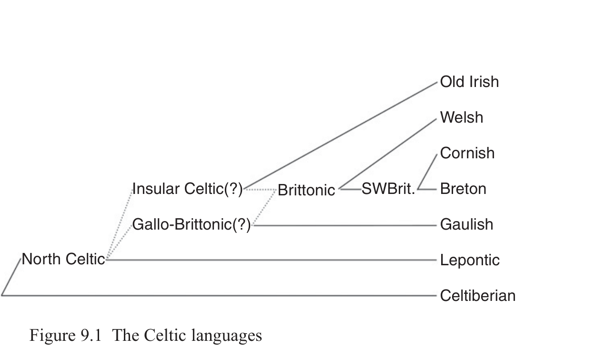

# 9 Celtic

Anders Richardt Jørgensen

<!-- page: 135; pdf-page: 153 -->

## 9.1 Introduction

This chapter provides an outline of the defining characteristics of the Celtic proto-language and the internal divisions within Celtic. Only languages which are clearly identifiable as Celtic will be included in this treatment, i.e. Goidelic, Brittonic, Gaulish (including Cisalpine, Transalpine and the onomastic material from Central European and Balkanic Celtic), Celtiberian, Lepontic and Galatian. Pictish, Tartessian and Lusitanian will be excluded, either due to the fragmentary attestation or because it is highly unlikely that the language belongs to the Celtic branch of Indo-European.

## 9.2 Evidence for the Celtic Branch

When listing the defining innovations of Proto-Celtic, we quickly encounter a problem closely linked to the poor attestation of the Continental Celtic languages: many of the most distinct innovatory features differentiating Celtic from the other Indo-European branches can strictly speaking only be proven to be “Proto-Goidelo-Brittonic”, and it is unclear how close this actually takes us to a Proto-Celtic encompassing both the Insular and the Continental Celtic branches.1 However, an area where the scant attestation of Continental Celtic nonetheless provides a fair amount of information is historical phonology. Accordingly, Proto-Celtic will mainly be defined by a series of phonological changes differentiating it from Proto-Indo-European and the other Indo-European branches. This does not mean that Proto-Celtic had not innovated in other areas such as morphology and syntax, only that our limited knowledge of Continental Celtic, particularly in the area of verbal morphology, makes it difficult to project innovations such as the<i> t-</i>preterite, the<i> s-</i>preterite

Work on this chapter was carried out with the support of the Independent Research Fund Denmark for the project<i> Connecting the dots: Reconfiguring the Indo-European family tree</i>, and of Riksbankens jubileumsfond for the project<i> Languages and myths of prehistory: Unravelling the</i> <i>speech and beliefs of the unwritten past (LAMP).</i> 1 Insular and Continental Celtic are used here as geographical terms, without necessarily signifying

linguistic subgroups.

<!-- page: 136; pdf-page: 154 -->

and the<i> ā-</i>preterite back to a specific stage beyond “Insular Celtic” (or Goidelo-Gallo-Brittonic for that matter). For instance, it is not absolutely certain whether the merger of the PIE aorist and the perfect into a new preterite, though completely carried through in Insular Celtic, had necessarily occurred by the Proto-Celtic stage.

In the following, some of the more significant innovations from PIE to Proto-Celtic will be listed in rough chronological order, to the extent that such an order can be established. For more detailed descriptions, see e.g. McCone 1996: 37–104 and Stifter 2017.

### 9.2.1 The Centum Merger and “Thorn” Clusters

The<i> centum</i> merger, i.e. the merger of palatal and plain velars, is unconditioned in Celtic and can therefore not be placed with confidence in the relative chronology. Given the equally unconditioned developments in several other Indo-European branches (most notably the neighbouring Germanic and Italic branches), it is likely that this is a very early areal innovation.

Proto-Indo-European sequences of original palatal stop + *<i>u̯</i> merge with the corresponding labiovelar in Celtic: *<i>h₁ék̑</i> <i>u̯o-</i> ‘horse’ > PCelt. *<i>ekʷo-</i> (cf. the Gaul. theonym<i> Epona</i>, OIr.<i> ech</i> ‘horse’, MW<i>ebawl</i> ‘foal’) has the same medial phoneme as PIE *<i>tekʷ-</i> ‘runs’ > PCelt. *<i>tekʷ-e/o-</i> (OIr.<i> techid</i> ‘flees’, MW<i> tebed</i> ‘retreat, flight’).

Proto-Indo-European “thorn” clusters, traditionally reconstructed as PIE *<i>Kþ/</i> <i>Gð</i> but in fact rather PIE *<i>TK</i>, underwent metathesis to *<i>KT</i> in pre-Proto-Celtic, as exemplified by *<i>h₂r̥ tk̑</i> <i>o-</i> > *<i>h₂r̥ kto-</i> > *<i>arxto-</i> > PCelt. *<i>arto-</i> (W<i> arth</i> ‘bear’, OIr.<i> art</i> ‘hero’) and *<i>dʰg̑ ʰom-</i> ‘earth’ > *<i>gdom-i̯o-</i> > PCelt. *<i>gdon-i̯o-</i> ‘earthly; mortal’ (Cisalp. Gaul.<i> TEUO-XTONI[O]N</i> ‘of gods and mortals’; simplified to *<i>don-i̯o-</i> in later Celtic, e.g. OIr.<i> duine</i>, MW<i> dyn</i>, MBret.<i> den</i> ‘man’).

### 9.2.2 The Syllabic Liquids

The Proto-Indo-European syllabic liquids developed a prop vowel whose distribution is mainly conditioned by the following segment. The commonly accepted distribution assumes the outcome *<i>ri/li</i> before stops and *<i>m</i> and the outcome *<i>ar/al</i> elsewhere: PIE *<i>bʰr̥ g̑ ʰ-</i> > PCelt. *<i>brig-</i> (Gaul.<i> -briga</i>, OIr.<i> brí</i>, MW<i> bre</i>, MBret.<i> bre</i> ‘hill’), *<i>kʷr̥ mi-</i> > PCelt. *<i>kʷrimi-</i> (OIr.<i> cruim</i>, MW<i> pryf</i>, MBret.<i> preff</i> ‘worm’), *<i>k̑</i> <i>r̥ -n-</i> > PCelt. *<i>karnV-</i> (Galat.<i> κάρνον</i> ‘horn, trumpet’, MW<i> carn</i> ‘horn, hoof’, ModBret.<i> karn</i> ‘hoof’), *<i>kr̥ so-</i> > *<i>karso-</i> > PCelt. *<i>karro-</i> (OIr.<i> carr</i>, MW<i> kar</i>, MBret.<i> carr</i> ‘cart’), *<i>pr̥ h₂-i</i> > PCelt. *<i>(ɸ)are</i> (Gaul.<i> are-</i>, OIr.<i> air-</i>, MW<i> ar-</i>). This distribution has recently been challenged by Hill (2012), who assumes that *<i>r̥ /l̥</i> also gave *<i>ri/li</i> before *<i>n.</i> This would provide a straightforward explanation for a form

<!-- page: 137; pdf-page: 155 -->

such as OIr.<i> tlenaid</i> ‘steals’ < PCelt. *<i>tli-na-</i> < PIE *<i>tl̥-n-ah₂-</i> from the root *<i>telh₂-</i> (LIV² 622), which otherwise is difficult to explain satisfactorily. The apparent counterexample PCelt. *<i>karnV-</i> may be derived from PIE *<i>k̑</i> <i>r̥ -snV-</i> instead.

The differing treatment of PIE *<i>h₂r̥ tk̑</i> <i>o-</i> ‘bear’ and *<i>h₁r̥ g̑ ʰ-</i> ‘mount, go up’ in Celtic, PCelt. *<i>arto-</i> (MW<i>arth</i> ‘bear’, OIr.<i> art</i> ‘hero’) and *<i>rig-</i> (OIr. fut.<i> -rega</i> ‘will go’, cf. McCone 1996: 62) respectively indicates that, in initial position at least, a preceding *<i>h₂</i> caused the prop vowel to develop before the syllabic liquid and not after it, as would be otherwise expected. This means that *<i>h₂</i> still contrasted with *<i>h₁</i> when the prop vowels developed.

### 9.2.3 Elimination of the Laryngeals

As is usually the case in non-Anatolian branches, the PIE laryngeals were eliminated as phonemes, but left traces in various ways. Word-initial laryngeals were lost without a trace, whether prevocalic or preconsonantal, while post-vocalic laryngeals in the syllabic coda were lost with compensatory lengthening of the preceding vowel. The latter development took place before the restructuring of the long vowel system outlined below. In a fair number of instances, however, the expected lengthening does not appear, and we are instead left with a short vowel, e.g. PIE *<i>u̯iH-ró-</i> > PCelt. *<i>u̯iro-</i> ‘man’ (OIr. <i>fer</i>, MW<i> gwr</i>), PIE *<i>g̑ ʰuH-tu-</i> > PCelt. *<i>gutu-</i> (OIr.<i> guth</i> ‘voice’). This phenomenon, called Dybo’s Shortening (after its first formulation in Dybo 1961), is not restricted to Celtic but is also found in Germanic and Italic, possibly as part of an early areal tendency. The exact conditions leading to this shortening (or lack of lengthening) are not clear, and no consensus has formed as yet. For a recent discussion of the literature on this problem and the proposed solutions, see Zair 2012: 132–50.

Laryngeals between non-syllabic consonants are usually vocalized to *<i>a</i>, as in e.g. PIE *<i>ph₂ter-</i> > PCelt. *<i>(ɸ)ater-</i> (OIr.<i> athair</i> ‘father’), PIE *<i>sh₁-tV-</i> > PCelt. *<i>satV-</i> (MW<i> had</i>, MBret.<i> hat</i> ‘seeds’), PIE *<i>pl̥th₂-no-</i> > PCelt. *<i>(ɸ)litano-</i> (OIr.<i> lethan</i>, MW<i> llydan</i>, MBret.<i> ledan</i> ‘broad, wide’). This appears to be the case irrespective of the position of the syllable in the word, agreeing with Italic but differing from Germanic and Balto-Slavic, where only laryngeals in the first syllable appear to be vocalized to *<i>a</i>.

Sequences of<i> CR̥ HC</i> usually develop into<i> CRāC</i> as in Italic, e.g. PIE *<i>pl̥h₂-mah₂</i> > PCelt. *<i>(ɸ)lāmā</i> (OIr.<i> lám</i>, MW<i> llaw</i> ‘hand’), PIE *<i>ml̥h₂tV-</i> > PCelt. *<i>mlātV-</i> (OIr.<i> mláith</i> ‘smooth’, MW<i> blawd</i> ‘flour’, MBret.<i> bleut</i>), but occasionally, a short vowel is encountered instead, e.g. *<i>pr̥ H-ti-</i> > PCelt. *<i>(ɸ)rati-</i> (Gaul.<i> ratis</i>, MIr.<i> raith</i>, MBret.<i> raden</i> ‘ferns’; cf. Schumacher 2004: 136–7). For recent treatments of the problems relating to the development of laryngeals in Celtic,

<!-- page: 138; pdf-page: 156 -->

cf. McCone 1996: 51–4; Schumacher 2004: 135–8; Zair 2012; Stifter 2017: 1194–6.

### 9.2.4 The Syllabic Nasals

The development of the syllabic nasals is straightforward. As has been demonstrated convincingly by McCone (1992: 21–6; 1996: 70–9; for the traditional view, cf. e.g. de Bernardo Stempel 1987), apparent cases of older *<i>eN</i> in Irish from PIE *<i>N̥</i> may effortlessly have passed through the PCelt. stage *<i>aN</i>, only to have been secondarily raised in the prehistory of Irish. Hence, we may reconstruct PCelt. *<i>aN</i> as the regular outcome of PIE syllabic nasals in all instances. This is borne out by e.g. Celtib.<i> argato-</i> /arga(n)to-/, Gaul.<i> arganto-</i>, OIr.<i> argat</i>, MW<i> aryant</i>, MBret.<i> archant</i> ‘silver’ < PCelt. *<i>arganto-</i> < PIE *<i>h₂(a)rg̑ -n̥ t-o-</i> and Celtib.<i> tekam-etinas</i>, Gaul.<i> dekam-etos</i> ‘tenth’, OIr.<i> deich</i> ‘ten’ (< *<i>deken</i>) < PCelt. *<i>dekam</i> < PIE *<i>dek̑</i> <i>m̥ (t)</i>.

### 9.2.5 The Voiced Labiovelar and the Merger of Aspirated and Plain Voiced Stops

Based on MW<i> gieu</i> ‘sinews, tendons’, OCorn.<i> goiu-en</i> < Brit. plural *<i>gi.ou</i> (with a secondary<i> u-</i>stem plural ending *<i>-ou̯</i> < PCelt. nom.pl. *<i>-ou̯es</i>) < PCelt. *<i>g(i)i̯V-</i> < PIE *<i>gʷ(i)i̯ah₂-</i> (cf. Ved.<i> jyā́-</i> ‘tendon, string (esp. of a bow)’, Lith. <i>gijà</i> ‘thread’, Gr.<i> βιός</i> ‘bow’) and MIr.<i> nigid</i> ‘washes’ < PCelt. *<i>nig-i/i̯o-</i> < *<i>nigʷ-i̯e/o-</i> (Gr.<i> νίζω</i>) it appears that PIE *<i>gʷ</i> was delabialized to *<i>g</i> before a following *<i>i̯.</i> For purely structural reasons we would expect PIE *<i>kʷ</i> and *<i>gʷʰ</i> to be similarly delabialized, but there are no certain instances of this. The delabialization must precede the shift of PIE *<i>gʷ</i> > *<i>b</i> and consequently the merger of the PIE voiced and voiced aspirate stops (since *<i>gʷʰ</i> does<i> not</i> give PCelt. *<i>b</i>, but rather PCelt. *<i>gʷ</i>). Therefore, it can safely be ascribed to the pre-Proto-Celtic period, even without any evidence of the sound change from Continental Celtic. In all other instances, when PIE *<i>gʷ</i> was not affected by delabialization, it yielded PCelt. *<i>b</i> and as such merged with the outcome of PIE *<i>bʰ</i> and the much rarer *<i>b.</i> This is demonstrated by e.g. Gaul.<i> -bena</i>, OIr. <i>ben</i>, MCorn.<i> ben-en</i> ‘woman’ < PCelt. *<i>benā̆</i> < PIE *<i>gʷen-h₂</i> ‘woman’, OIr. <i>biur</i>, MW<i> ber</i> ‘spear’ < PCelt. *<i>beru-</i> < *<i>gʷeru-</i> and OIr.<i> brao</i>, MW<i> breuan</i>, MBret.<i> brou, breau</i> ‘hand-mill, quern’ < PCelt. *<i>brāu̯ū,</i> *<i>-on-</i> < PIE *<i>gʷr̥ h₂-u̯ -on-</i> or *<i>gʷrah₂-u̯ -on-</i>.

At some point after the development of PIE<i> gʷ</i> to *<i>b</i>, the PIE voiced aspirated stops lost their aspiration and merged with the corresponding voiced stops, e.g. PIE *<i>bʰedʰ(h₂)-o-</i> (cf. Lat.<i> fodiō, -ere</i> ‘to dig’) > PCelt. *<i>bedo-</i> ‘grave’ (Celtib.<i> argato-bezom</i> ‘silver-mine (?)’, MW<i> bedd</i>, MBret. <i>bez</i> ‘grave’), PIE *<i>seg̑ ʰ-etlo-</i> (Gr.<i> ἐχέτλη</i> ‘plough-handle’) > PCelt.

<!-- page: 139; pdf-page: 157 -->

*<i>segetlo-</i> (ModW<i> haeddel</i>, MBret.<i> haezl</i> ‘plough-handle’, MCorn.<i> hethlor</i> ‘ploughman’).

### 9.2.6 Changes to the Vowel System

The long vowel system was restructured, whereby the PIE long vowel phonemes *<i>ē</i> and *<i>ō</i> were eliminated. It is likely that this development had already occurred in the pre-Proto-Celtic period: • PIE *<i>ō</i> (including PIE *<i>oH</i>) was eliminated, giving either PCelt. *<i>ū</i> (in word-

final syllables) or PCelt. *<i>ā</i> (elsewhere). Accordingly, it merged either with the reflexes of PIE *<i>ū</i>, *<i>uH</i> or *<i>ā</i>,<i> aH</i>: Celtib.<i> n-</i>stem nom.sg.<i> -u</i>, Gaul.<i> -u</i>, OIr.<i> aub</i> ‘river’ (< *<i>abū</i> with<i> u-</i>infection) < PCelt. *<i>-ū</i> < PIE *<i>-ō</i>, Celtib. <i>o-</i>stem Dg.<i> -ui</i>, Lep.<i> -ui</i>, Gaul.<i> -ui</i> < PCelt. *<i>-ūi̯</i> < PIE *<i>-ōi̯</i>, Celtib.<i> o-</i>stem abl. sg.<i> -uz</i> < PCelt. *<i>-ūd</i> < PIE *<i>-ōd</i>; as opposed to *<i>ā</i> < *<i>oH</i> in non-final syllables in e.g. OIr.<i> dán</i>, MW<i> dawn</i> ‘gift, endowment’ < PCelt. *<i>dānV-</i> < *<i>doh₃no-</i> (cf. Ved.<i> dāná-</i>, Lat.<i> dōnum</i>). • PIE *<i>ē</i> (including PIE *<i>eh₁</i>) was raised to *<i>ī</i> and merged with the reflex of

PIE *<i>ī</i> and *<i>iH</i>: Celtib.<i> ti-</i>, Gaul.<i> di-</i>, MW pref.<i> di-</i> < PCelt. *<i>dī</i> < PIE *<i>deh₁</i> (Lat.<i> dē</i>); the Gaul. onomastic element<i> -rix</i> /-rīxs/ ‘king’ in e.g.<i> Dumnorix,</i> <i>Vercingetorix</i>, OIr.<i> rí</i>, gen.sg.<i> ríg</i>, MW<i> rhi</i> < PCelt. *<i>rīx-s</i>, gen.sg. *<i>rīg-os</i> < PIE *<i>(h₃)rēg̑ -</i>. This resulted in a triangular long-vowel system,<i> ī – ā – ū.</i> This system was extended with a new<i> ē</i> < *<i>ei̯</i> and, somewhat later, a new<i> ō</i> < *<i>ou̯</i> during the attested history of the Continental Celtic languages. The Insular Celtic languages may be derived from a long-vowel system with five vowel qualities,<i> ī – ē</i> (< *<i>ei̯</i>) –<i> ā</i> –<i> ō</i> (< *<i>ou̯</i> ) –<i> ū</i>, matching the five short-vowel qualities, <i>i – e – a – o – u.</i>

Joseph’s Law, formulated by Lionel Joseph (1982; cf. Schrijver 1995: 73– 93), states that a pre-PCelt. sequence *<i>eRa</i> (typically from PIE *<i>eRə</i>) gives *<i>aRa.</i> This elegantly explains numerous forms in Goidelic, Brittonic and Gaulish, e.g. *<i>taratro-</i> ‘drill’ (Ir.<i> tarathar</i>, MBret.<i> tarazr</i>, Gaul. *<i>taratro-</i> ⇒ Judeo-Fr.<i> taredre</i> /taˈrẹðrə/, OOcc.<i> taraire</i>) < *<i>teratro-</i> < PIE *<i>terh₁-tro-</i> (cf. Gr.<i> τέρετρον</i>) and *<i>talamū</i> (OIr.<i> talam</i> ‘the earth, the world’) < *<i>telamū</i> < *<i>telh₂-mō, -mon-</i> (Gr.<i> τελαμών</i> ‘carrying strap’), *<i>garano-</i> ‘crane’ (Gaul.<i> tri-</i> <i>garanus</i> ‘having three cranes’, MW<i> garan</i>) < *<i>gerano-</i> < PIE *<i>gerh₂no-</i> (Gr. <i>γέρανος</i>) which previously had to be reconstructed as *<i>tr̥ h₂atro-</i>, *<i>tl̥h₂amon-</i> and *<i>g̑r̥ h₂ano-</i>. The absence of any traces of Joseph’s Law in e.g. fem.<i> ā-</i>stems and weak<i> ā-</i>verbs indicates that it was not triggered by a long *<i>ā.</i> It is also likely that it did not operate when the *<i>a</i> was word final.

An expanded version of Joseph’s Law has recently been proposed by Eugen Hill (2012). According to Hill, sequences of *<i>eLNa</i> were also affected by this change. This explains the vocalism of e.g. W<i> sarnu</i> as opposed to OIr.<i> sernaid</i>

<!-- page: 140; pdf-page: 158 -->

as deriving from a paradigm PCelt. *<i>sternū,</i> *<i>starnati</i> (vel sim.), from an older subjunctive *<i>ster-nh₂-e/o-</i> (cf. Lat.<i> sternō</i>).

### 9.2.7 Cluster Simplification

It is likely that there was a general loss of stops before<i> -sC-</i> (Stifter 2017: 1191– 2). This would explain instances such as OIr.<i> tes</i>, MW<i> tes</i> ‘heat’ < PCelt. *<i>testu-</i> < PIE (Transponat) *<i>tep-s-tu-</i> and OIr.<i> lesc</i>, MW<i> llesc</i> ‘weak; lazy’ < PCelt. *<i>lesko-</i> < PIE (Transponat) *<i>legʰ-sko-</i> ‘lying down’. In these cases, the root-final stop was not restored, because the association to the underlying root was not sufficiently strong. However, when the association with forms with a preserved root final consonant was sufficiently strong, the consonant was typically restored. The restored stop was subsequently subject to the general neutralization of non-dental stops: before a following *<i>t</i> or *<i>s</i> all Proto-Indo-European “non-dental” stops (i.e. *<i>k̑</i>, *<i>g̑</i>, *<i>g̑ ʰ</i>, *<i>k</i>, *<i>g</i>, *<i>gʰ</i>, *<i>kʷ</i>, *<i>gʷ</i>, *<i>gʷʰ</i>, *<i>p</i>, *<i>b</i>, *<i>bʰ</i>) merge as a velar (or uvular) fricative, usually noted *<i>x</i>, as in PIE *<i>h₃ok̑</i> <i>toH</i> > PCelt. *<i>oxtū</i> (Gaul. <i>oxtumetos</i> ‘eighth’, OIr.<i> ocht</i>, MW<i> wyth</i>, MBret.<i> eiz</i> ‘eight’), *<i>septm</i> > PCelt. *<i>sextam</i> (Gaul.<i> sextametos</i> ‘seventh’, OIr.<i> secht</i>, MW<i> seith</i>, MBret. <i>seiz</i>, PIE (Transponat) *(<i>H)eu̯p-s-elo-</i> (cf. Gr.<i> ὑψηλός</i>) > PCelt. *<i>ou̯xselo-</i> (Gaul.<i> uxello-</i>, OIr.<i> úasal</i>, MW<i> uchel</i>, MBret.<i> uhel</i> ‘high’). The exact phonemic status of this *<i>x</i> is not entirely clear; it did not occur in other contexts.

In restored clusters of the structure *<i>xsC</i>, the *<i>s</i> was subsequently lost, probably by regular reduction. This paved the way for the<i> t-</i>aorist of roots ending in velar stops (as in OIr. pret.<i> -acht</i> ‘drove’, MW<i> aeth</i>, MBret.<i> aez</i> ‘went’ < *<i>ax-t-</i> < *<i>ax-s-t</i> from the PCelt. pres. *<i>ag-e/o-</i>), ultimately deriving from an old 3sg.<i> s-</i>aorist. A very similar loss, of both *<i>s</i> and *<i>x</i> is observable between liquid and stop. This can be observed in e.g. OIr.<i> tart</i> ‘thirst’, MW<i> tarth</i> ‘steam, haze’ < PCelt. *<i>tartu-</i> < *<i>tarstu-</i> < *<i>tr̥ s-tu-</i> and MW<i> arth</i> ‘bear’ < PCelt. *<i>arto-</i> < *<i>arxto-</i> < *<i>h₂r̥ tk̑</i> <i>o-</i>. This reduction explains the development of the<i> t-</i>preterite to roots ending in liquids, departing from the original 3sg.<i> s-</i>aorist, *<i>bʰēr-s-t</i> > *<i>bīr-t →</i> *<i>bir-t-</i> (OIr.<i> birt, -bert</i>, MW<i> kymyrth</i>).

Inherited *<i>st</i> appears to have been preserved as such in Proto-Celtic, as indicated by its survival in e.g. Celtib.<i> boustom</i> ‘cow stable (?)’ < PCelt. *<i>bou̯sto-</i> < PIE *<i>gʷou̯ -sth₂-o-</i> (Ved.<i> goṣṭhá-</i>) and occasional survival in Brittonic. In Goidelic, on the other hand, *<i>st</i> has given *<i>ss</i> ><i> s</i> in all positions. PIE *<i>-Dt-</i>, presumably realized as [tst] and hence indistinguishable from *<i>-Dst-</i>, was reduced to PCelt. *<i>-ts-</i>. In Insular Celtic, if not earlier, this was further reduced to *<i>ss</i>, as in PIE *<i>u̯id-to-</i> > *<i>u̯isso-</i> > OIr.<i> -fess</i> ‘is known’, MW<i> gwys</i>, MBret.<i> gous</i> ‘was known’.

<!-- page: 141; pdf-page: 159 -->

### 9.2.8 Elimination of PIE *p

The elimination of the phoneme *<i>p</i> is probably the best-known defining sound change in the Celtic languages. However, in many contexts *<i>p</i> leaves a trace by merging with other phonemes, e.g. PIE *<i>Vpn</i> > PCelt. *<i>Vu̯n</i> (PIE *<i>su̯op-no-</i> or *<i>sup-no-</i> > PCelt. *<i>sou̯no-</i> > OIr.<i> súan</i>, MW<i> hun</i> ‘sleep’),2 *<i>VpL</i> > *<i>VbL</i> (PIE *<i>du̯ei̯-plo-</i> > *<i>du̯ei̯blo-</i> > OIr.<i> díabul</i> ‘twofold’), *<i>ps</i> > *<i>xs</i> (cf. PCelt. *<i>ou̯xselo-</i> above), *<i>pt</i> > *<i>xt</i> (cf. PCelt. *<i>sextam</i> above). It is possible that the phoneme /ɸ/ was not completely lost by Proto-Celtic times but that we still had /ɸ/ in the earliest attested stage. This is primarily based on Lep.<i> uvamokozis</i>, plausibly analysed as a personal name with a first member /uɸamo-/ from PIE *<i>up-m̥ Ho-</i> ‘highest’ (cf. Schumacher 2004: 133–4; Eska 2013). Another indication that a reflex of PIE *<i>p</i> was still preserved as a distinct phoneme in Proto-Celtic is provided by the reflex of PIE *<i>sp</i>. In initial position, this cluster yields OIr.<i> s-</i>, len.<i> f-</i> and Brit. *<i>f-</i>, as in OIr.<i> seir</i> ‘heel’, dual<i> dī p[h]erith</i>, W<i> ffêr</i> ‘ankle’ < PCelt. *<i>sɸeret-</i> < PIE *<i>spʰerH-</i> ‘to kick’ (LIV² 585), OIr.<i> selg</i>, MBret.<i> felch</i> ‘the spleen’ < PCelt. *<i>sɸelgā</i> < PIE *<i>spelg̑ ʰ-</i> (cf. Lat.<i> lien</i>, Ved.<i> plīhán-</i>, Gr.<i> σπλήν</i>). This distribution of outcomes does not correspond with that of any other known initial cluster. We cannot posit PCelt. *<i>su̯ -</i> as the outcome of PIE *<i>sp-</i> because, while PCelt. *<i>su̯ -</i> would account for Old Irish<i> s-</i>, len.<i> f-</i> (as in OIr. <i>siur</i>, len.<i> do phethar</i> < PIE *<i>su̯esor-</i>), it gives *<i>hu̯ -</i> in Brittonic (MW<i> chwaer</i>, MBret.<i> hoar</i> ‘sister’) and cannot therefore have merged with the outcome of PIE *<i>sp-</i>. Indeed, PIE *<i>sp-</i> appears to be the only regular source of PBrit. *<i>fV-</i> apart from Latin borrowings with<i> f-</i>.

### 9.2.9 Length Opposition in Consonants

A length opposition in sonants had already developed in pre-Proto-Celtic. The long sonants came about by assimilation, the most common being the assimilation of *<i>-sR-</i> to *<i>-RR-</i>, as in Celtib.<i> iomui</i> < PIE *<i>i̯osmōi̯</i>, OIr.<i> coll</i>, OW<i> coll</i>, OBret.<i> coll-guid</i> ‘hazel-tree’ < *<i>kollo-</i> < pre-PCelt. *<i>koslo-</i>. Hence, Proto-Celtic acquired an opposition between<i> n</i> and<i> nn</i>,<i> m</i> and<i> mm</i>,<i> l</i> and<i> ll</i>, and <i>r</i> and<i> rr.</i> PIE postvocalic *<i>-sr-</i> may, however, have yielded *<i>-dr-</i> instead, as indicated by Gaul.<i> tidres</i>, OIr.<i> teoir</i>, MW<i> teir</i> fem. ‘three’ < *<i>tidres</i> < PIE *<i>tisres</i> (Schrijver 1995: 448–52). However, *<i>rr</i> developed from other sources, such as PIE *<i>rs</i> (OIr.<i> carr</i>, MW<i> karr</i>, MBret.<i> carr</i> ‘cart’, Latin<i> carrus</i> from Gaulish < PCelt. *<i>karro-</i> < PIE *<i>kr̥ so-/k̑</i> <i>r̥ so-</i>) and possibly *<i>rp</i>.

The phonemic length opposition in sonants is paralleled by a similar opposition in stops. Proto-Indo-European did not allow geminate stops, at least not outside Lallwörter, but new geminate stops arose at some point in Celtic. This

2 Probably only after rounded vowels, cf. PIE (Transponat) *<i>tep-net-</i> > PCelt. *<i>tenet-</i> > OIr.

<i>teine</i> ‘fire’).

<!-- page: 142; pdf-page: 160 -->

happened either by regressive assimilation between two stops across a morpheme boundary, e.g. PIE (Transponat) *<i>(h₂)ad-k̑</i> <i>(i)i̯ah₂</i> “at-ness”, ‘proximity’ > *<i>akki̯ā</i> > OIr.<i> aicce</i> ‘proximity; fosterage’, MW<i>ach</i> ‘lineage, ancestry’ or through hypocoristic gemination observable particularly in personal names.

### 9.2.10 Lenition of Voiced Stops

A purely phonetic lenition of the short voiced stops after vowels may possibly be reconstructed for Proto-Celtic or a Common Celtic period shortly thereafter.3

While this lenition is central to Insular Celtic, operating both word-internally and across word boundaries as part of grammatical lenition, there is some evidence in favour of it going back much further. The use of an apparent sibilant symbol for the outcome of mainly postvocalic *<i>d</i> in Celtiberian (Villar 1995) may plausibly be interpreted as an indication of phonetic lenition to [ð]. Likewise, the occasional loss of intervocalic *<i>g</i> (as in Celtib.<i> tuateres</i> ‘daughters’ < PCelt. *<i>dugateres</i>) may be an indication of intervocalic /g/ being realized as [ɣ]. It is likely that this lenition also affected *<i>s</i> (> *<i>h</i>) and *<i>m</i> (> *<i>β̃</i>), as it did in Insular Celtic. The occasional loss of /s/ in Gaulish may support this.

### 9.2.11 Morphological Innovations

As noted above, in many instances where Brittonic and Goidelic share morphological innovations, it is difficult to tell whether or not these innovations date back to Proto-Celtic, Common Celtic or a later stage common to Goidelic and Brittonic. The following non-trivial innovations are likely to date back to Proto-Celtic or at least an early Common Celtic stage: • Levelling of the pronominal *<i>so-</i>/<i>to-</i> paradigm in favour of the allomorph

with *<i>s-</i>, as evident from e.g. Celtib. dat.sg.<i> somui</i> < PCelt. *<i>sommūi̯</i> ←PIE *<i>tosmōi̯</i>, the OIr. 3pl. prepositional dative ending<i> -ib</i> and the PBrit. 3pl. prepositional ending *<i>-ʉβ</i> (MW<i> -udd</i>, MBret.<i> -e</i>,<i> -o</i>,<i> -eu</i>)4 < PCelt. dat.pl. *<i>soi̯bis</i> ←PIE *<i>toi̯bʰi(s).</i> This innovation is possibly shared with Italic. • Loss of the agent noun suffix *<i>-ter-/-tel-</i>: while there are many instances of

the instrument-noun suffix *<i>-tro-/-tlo-</i> in Celtic, the agent-noun suffix *<i>-ter-</i>/ <i>-tel-</i>, from which *<i>-tro-</i>/*<i>-tlo-</i> is plausibly derived, is completely absent from Celtic. Instead, we find alternative productive suffixes with this function, such as *<i>-ii̯o-</i> and *<i>-ii̯ati-</i> (abstracted from *<i>CeCH-ti-</i> > *<i>CeC-ati-</i> and suffixed to *<i>-ii̯o-</i>stems).

3 The Common Celtic period refers to the period after the split-up of Proto-Celtic in which

innovations could still affect all Celtic varieties. 4 Cf. the treatment of final unstressed *<i>-lʉβ</i> ‘herb’ in *<i>tʉd-lʉβ</i> ‘navelwort’ > ModBret.<i> tule, tulo,</i>

<i>tulev</i>.

<!-- page: 143; pdf-page: 161 -->

• Elimination of the present and past active participle as part of the verbal

paradigm. The former survives in numerous fossilized nominal formations, e.g. PCelt. *<i>karant-</i> ‘friend’ (OIr.<i> carae</i>, W<i> car</i>). The past passive participle is preserved in this function, though typically in the form *<i>-ti̯o-</i> for expected *<i>-to-</i> in Insular Celtic. • Merger of the aorist and the perfect into a preterite (cf. the parallel innov-

ations in the prehistory of Italic and Germanic). • Loss of the inherited categories of subjunctive and optative (although the

Celtic<i> s-</i> and<i> ā-</i>subjunctives and futures may continue PIE<i> s-</i>aorist subjunctives). •<i> s-</i>aor.3sg. *<i>-s-t</i> reanalyzed as *<i>-st-</i> and used as a marker for the past tense. • Thematization of *<i>es-</i> ‘is’: there is evidence from both Old Irish and Brittonic

that at least some of the present-tense forms of *<i>es-</i> (PIE *<i>h₁es-</i>) were thematized to *<i>es-e/o-</i>, as described by Schrijver 2020.

## 9.3 The Internal Structure of Celtic

The precise internal subgrouping of Celtic is still not entirely settled (cf. the tentative tree in Figure 9.1). However, it seems fairly clear that Celtiberian should be contrasted with the more northern varieties (cf. Schrijver 2015; Eska 2017). This may be demonstrated for instance by the development of a clitic relative particle *<i>i̯o</i> in Gaulish, Goidelic and Brittonic as opposed to the fully inflected relative pronoun *<i>i̯o-</i> in Celtiberian (e.g. dat.sg.<i> iomui</i>) and the transfer of the feminine gen.sg. ending *<i>-i̯ās</i> from the<i> ī-</i>stems to the<i> ā-</i>stems (Gaul.<i> -ias</i>, OIr.<i> -e</i> as opposed to Celtib.<i> -as</i>). Celtiberian, conversely, has innovated e.g. by creating a new<i> o-</i>stem gen.sg. in<i> -o</i> of unclear origin.

Celtic

<!-- page: 144; pdf-page: 162 -->

### 9.3.1 Goidelic

Establishing Goidelic as a branch separate from the other Celtic branches is unproblematic, Goidelic being easily defined by a long series of sound changes differentiating it from Proto-Celtic and resulting in the remarkably uniform Old Irish language. Recent chronological overviews of these developments are given in Sims-Williams (2003: 296–301) and Stifter (2017: 1198–200). The subsequent Goidelic dialects derive more or less directly from Old Irish. Among the defining features of Old Irish, we can include the following, in rough chronological order (largely following McCone 1996: 105–25; but cf. e.g. Kortlandt 1997 and Isaac 2007: 97–113): • Fronting and raising of PCelt. *<i>a</i> to *<i>æ</i> before tautosyllabic nasals. This *<i>æ</i>

may subsequently be further raised to<i> e</i>/<i>i</i> or<i> é</i> (when lengthened) or revert back to<i> a</i>, the conditions for this being debated (cf. McCone 1992; Schrijver 1993). Word final *<i>-an</i> (as in the nom.-acc.sg. of neuter<i> n-</i>stems and the acc. sg. of<i> ā-</i>stems and consonant stems) is also affected by this, giving *<i>-en</i> which usually causes palatalization when lost by apocope. • *<i>o</i> > *<i>a</i> in final syllables. •<i> VNT</i> ><i> V(ː)D</i>, i.e. loss of nasals before voiceless obstruents (PCelt. *<i>k</i>, *<i>kʷ</i>, *<i>t</i>,

*<i>s</i>, *<i>x</i>), with voicing of a following stop and frequently with compensatory lengthening of a preceding front vowel, e.g. PCelt. *<i>kanto-</i> ‘100’ > *<i>kænto-</i> > OIr.<i> cét</i> /k’eːd/, PCelt. *<i>krenxtV-</i> > OIr.<i> crécht</i> ‘wound, scar’ (MW<i> creith</i>, MBret.<i> creizenn</i>). • Postvocalic lenition of voiceless stops to the corresponding voiceless

fricatives. • Raising and lowering of short vowels caused by the height of the vowel in the

following syllable. • Several rounds of palatalization, whereby consonants are palatalized by front

vowels under different circumstances. The front vowels may subsequently be lost (by syncope or apocope) or reduced to schwa, causing the palatalization to become phonemic. • Loss of the rounding of the reflexes of PCelt. *<i>kʷ</i>, *<i>gʷ</i> and merger with the

plain velars. In some cases, the rounding may be transferred to a following vowel, as in PCelt. *<i>kʷrimi-</i> (MW<i> pryf</i>) > OIr.<i> cruim</i> /kruμ’/ ‘worm’. • Apocope of vowels in absolute auslaut. Long vowels followed by

a consonant are shortened but preserved. • Loss of fricatives before sonants with compensatory lengthening or

<i>u-</i>dipthongization of the preceding vowel, e.g. *<i>(ɸ)etnos</i> > *<i>eθnah</i> > OIr. <i>én</i> ‘bird’ (MW<i>edyn</i>, MBret.<i> ezn</i>), gen.sg. *<i>(ɸ)etnī</i> > *<i>eθnī</i> ><i> euin</i>. PCelt. *<i>tr</i> > <i>θr</i> is not affected by this change, cf. PCelt. *<i>aratrom</i> (MW<i> aradyr</i>, MBret. <i>arazr</i>) > *<i>araθran</i> > OIr.<i> arathar</i> ‘plough’.

<!-- page: 145; pdf-page: 163 -->

• Syncope of vowels in even-numbered, medial syllables, after the operation of

apocope. • Initial, unlenited *<i>u̯ -</i> > OIr.<i> f-</i> (presumably /ɸ-/), PCelt. *<i>u̯iro-</i> > OIr.<i> fer.</i>

### 9.3.2 Brittonic

The existence of a Brittonic subgroup distinct from Goidelic is uncontroversial, even if the position of Brittonic is itself contested. Much like Goidelic, Brittonic underwent a fundamental transformation in the early Medieval period. Unlike Old Irish, however, where the inherited nominal and verbal morphology remained largely intact, albeit in a much-altered guise, the sound changes in Brittonic resulted in massive restructurings in inflectional morphology, leading to a complete loss of the nominal case system. The singular/ plural opposition has also been partially restructured: in some nouns, typically ones that would often occur in the plural, the underived form has plural (or “collective”) meaning, with the singular (or “singulative”) being formed by a Proto-Brittonic suffix *<i>-ɪnn</i> (masc.), *<i>-enn</i> (fem.), as in e.g. coll. *<i>gu̯ ɪð</i> ‘trees’, sglt. *<i>gu̯ ɪð-enn</i> ‘a tree’ (W<i> gwydd</i>,<i> gwydden</i>, MBret.<i> guez, guezenn</i>) < PCelt. *<i>u̯idu-</i> (OIr.<i> fid</i>).

These defining sound changes took place after the introduction of the main body of Latin loanwords, since these loanwords are generally affected by the same changes as inherited vocabulary. Many of the changes may be due to contact with early Gallo-Romance, such as voicing of postvocalic voiceless stops, penultimate stress, loss of phonemic vowel length and the loss of the neuter gender, cf. Schrijver 2002. The phonological changes leading from Proto-Celtic to Old Welsh, Old Cornish and Old Breton have been treated in great detail by Jackson 1953: 265–699, Schrijver 1995 and Sims-Williams 2003. Chronological overviews are given in Jackson 1953: 694–99 and Stifter 2017: 1200–1. • The Proto-Celtic voiced geminate stops appear to have been devoiced in

Brittonic (cf. Pedersen 1909: 159–61) and subsequently fricativized regularly, just like the Proto-Celtic voiceless geminates (cf. spirantization below). This is borne out by e.g. PCelt. *<i>biggo-</i> (OIr.<i> bec</i> /b’eg/) > *<i>bikko-</i> > PBrit. *<i>bɪx-an</i> (dimin. suff. *<i>-an</i>; W<i> bychan</i>, Bret.<i> bihan</i> ‘little’), PCelt. *<i>kloggā</i> (OIr.<i> cloc, clog</i> /klog/) > *<i>klokkā</i> > PBrit. *<i>klox</i> (W<i> cloch</i>, Bret.<i> kloc’h</i> ‘bell’), PCelt. *<i>u̯raggā</i> (Ir.<i> frac, frag</i> /frag/?) > *<i>u̯rakkā</i> > PBrit. *<i>u̯rax</i> (W<i> gwrach</i>, Bret.<i> gwrac’h</i> ‘hag’), PCelt. *<i>buggo-</i> (OIr.<i> bog</i> ‘gentle, tender’) > *<i>bukko-</i> > Brit. *<i>bux</i> (ModBret.<i> bouc’h</i> ‘blunt’; Bret.<i> bouk</i> ‘soft’ must instead be a borrowing from Irish). This change also accounts for the development of PCelt. *<i>zd</i> (*<i>ðd</i>?) in Brittonic, which appears to have gone through *<i>dd</i> (OIr. /d/) to *<i>tt</i> and ultimately to PBrit. *<i>θ</i>. This may be exemplified by e.g. PCelt. *<i>nizdo-</i> > *<i>niddo-</i> (OMIr.<i> net, ned</i> /N’ed/) > *<i>nitto-</i> > PBrit. *<i>nɪθ</i> (W<i> nyth</i>,

<!-- page: 146; pdf-page: 164 -->

Bret.<i> neizh</i> ‘nest’). The change must predate the creation of geminate stops by assimilation of preverbs and verbs and the univerbation of verbal compounds such as PCelt. *<i>kred-dī-</i> ‘believes’ (MW<i> credu</i>, MBret.<i> cridiff</i>, OIr. <i>creitem</i> ‘to believe’). • Restructuring of the vowel system: fronting of PCelt. *<i>ū</i> > *<i>ī</i> (causing

a merger with PCelt. *<i>ī</i> ) and monophthongization of the remaining diphthongs: PCelt. *<i>oi̯</i> > *<i>ō</i> (merging with the reflex of PCelt. *<i>ou̯</i> ) > *<i>ū</i>, PCelt. *<i>ai̯</i> > *<i>ɛ̄</i> and PCelt. *<i>au̯</i> > *<i>ɔ̄</i> (possibly via *<i>ā</i>). • Final<i> a-</i>affection: a Proto-Celtic long *<i>ā</i> in the final syllable lowers

a preceding PCelt. *<i>i</i>, *<i>u</i> to *<i>e</i>, *<i>o.</i> This may be observed in feminine<i> ā-</i> stems, especially in adjectives in Middle Welsh, where the lowering has become a mark of the feminine, e.g. nom.sg.masc. *<i>u̯ind-os</i>, nom.sg.fem. *<i>u̯ind-ā</i> > MW masc.<i> gwynn</i>, fem.<i> gwenn</i> ‘white’. • Lenition of postvocalic voiceless stops to the corresponding voiced ones, e.g.

PCelt. *<i>brātīr</i> > PBrit. *<i>brɔdr</i> ‘brother’ (MW<i> brawd</i>, MBret.<i> breuzr</i>), PCelt. *<i>dekam</i> > PBrit. *<i>deg</i> ‘ten’ (MW<i> dec</i>, MBret.<i> dec</i> /deg/). • Nasalization of voiced stops,<i> ND</i> ><i> NN</i>, as in PCelt. *<i>landā</i> (MIr.<i> land</i>, Gaul.

*<i>landā</i> ⇒Fr.<i> lande</i> ‘heath’) > MW<i> llan</i> ‘enclosure; church’, MBret.<i> lann</i>. This also operates in syntactically close external sandhi and gives rise to the limited Brittonic nasal mutation. • Fixed stress on the penultimate syllable. With apocope (see below), the stress

came to fall on the final syllable. • Final<i> i-</i>affection, whereby a short vowel is raised and/or fronted by a final *<i>-ī</i>

and *<i>-i̯o-.</i> After apocope, a new round of<i> i-</i>affection takes places, this time caused by high front vowels still remaining after apocope. • Apocope of all final syllables. In contrast to Goidelic, even long vowels

followed by consonants are lost. • Syncope of immediately pretonic vowels in open syllables. • Spirantization or “second lenition”, whereby previously unlenited voiceless

stops become voiceless fricatives after vowels and non-homorganic fricatives (thus Schrijver 1999; for a different chronology, see Sims-Williams 2007: 43–58). This includes former geminate stops and stops protected from the first lenition in external sandhi. It is possible that this development was sufficiently late to have developed differently in Welsh and South-West Brittonic: in external sandhi, spirantization only seems to occur after vowels in Welsh, while in South-West Brittonic it also appears to take place after non-homorganic sonants. • The new quantity system, whereby the inherited phonemic vowel length was

lost. However, this did not entail any large-scale merger, since older phonemic contrasts in length were shifted to quality (e.g. PCelt. *<i>ī</i> > *<i>i</i> as opposed to PCelt. *<i>i</i> > *<i>ɪ</i>, PCelt. *<i>ū</i> > *<i>ʉ</i> as opposed to PCelt. *<i>u</i> > *<i>u</i> and PCelt. *<i>ā/au</i> > *<i>ɔ̄</i> > *<i>ɔ</i> as opposed to PCelt. *<i>o</i> > *<i>o</i>) or preserved by diphthongization of

<!-- page: 147; pdf-page: 165 -->

the old long vowels (PCelt. *<i>ei̯</i> > *<i>ē</i> > PBrit. *<i>uɪ</i> and PCelt. *<i>ai̯</i> > *<i>ɛ̄</i> > *<i>oɪ</i>). The new quantity system only has allophonic vowel length, with stressed vowels being long before single consonants and in word-final position and short elsewhere. A number of changes take place in the course of the Old British transmission but are nevertheless shared by all Brittonic branches, e.g.: • Initial, non-lenited *<i>u̯ -</i> > *<i>gu̯ -</i>, as in PCelt. *<i>u̯iro-</i> > PBrit. *<i>u̯ur</i> > MW

<i>gwr</i> ‘man’. • Accent retraction from the final to the penultimate syllable. It is unclear

whether the final stress of Vannetais Breton is the result of a later forwards shift due to French influence or if it represents an archaism, with the Proto-Brittonic final stress being preserved due to a higher proportion of French speakers in this region. Though it may seem surprising at first glance, given the geographical proximity of Cornwall to Wales and its relatively long distance from Brittany, there is a fair amount of evidence in favour of a distinct South-West Brittonic branch consisting of Cornish and Breton to the exclusion of Welsh (cf. Hamp 1953, Jackson 1953: 19–25 and<i> passim</i>, Schrijver 2011: 15–33).

### 9.3.3 The Position of Brittonic: Gallo-Brittonic or Insular Celtic?

The position of Brittonic in the Celtic family tree remains an unsolved question, specifically whether we should posit an Insular Celtic node consisting of Brittonic and Goidelic to the exclusion of Gaulish (as e.g. McCone 1992; Schrijver 1995: 463–5; Eska 2017), a Gallo-Brittonic node excluding Goidelic (as Koch 1992) or a dialect continuum with a fundamental three-way split, allowing Brittonic to share innovations with both Gaulish and Goidelic (thus e.g. Sims-Williams 2007: 34).

Among the potential Gallo-Brittonic innovations are the following: • *<i>kʷ</i> > *<i>p</i> in Gaulish, Leponic and Brittonic, as in PCelt. *<i>ekʷo-</i> ‘horse’ >

Gaul.<i> Epona</i> ‘name of a goddess’, MW<i> ebawl</i> ‘foal’ (cf. OIr.<i> ech</i> ‘horse’). • A change of *<i>oRa</i> to *<i>aRa</i>, i.e. an expanded Joseph’s Law, seems to occur in

Brittonic and Gaulish, as shown by MW<i> taran</i> ‘thunder’, Gaul.<i> Taranis</i> as opposed to OIr.<i> torann</i> ‘thunder’. • PCelt. *<i>sr-</i> > *<i>fr-</i> seen in e.g. PCelt. *<i>sroKnā</i> (OIr.<i> srón</i> ‘nostril’) > Brit.

*<i>froɪn</i> (W<i> ffroen</i>, MBret.<i> froan</i> ‘nostril’), Gaul. *<i>frognā</i> (whence OFr. <i>frongne</i> ‘scowl, frown’). • Devoicing of the voiced geminate stops: we may assume that this change also

took place in Gaulish, thus providing us with a potential Gallo-Brittonic isogloss. This is based on the evidence of PCelt. *<i>kʷezdi-</i> ‘bit, piece’ > *<i>kʷeddi-</i> (OIr.<i> cuit</i> /kud’/) > Gallo-Brit. *<i>petti̯ā</i> (Gaulish ⇒LLat. *<i>pĕtti̯a</i> >

<!-- page: 148; pdf-page: 166 -->

Fr.<i> pièce</i>, etc.), Brit. *<i>peθ</i> (W<i> peth</i>, Bret.<i> pezh</i>) and PCelt. *<i>bozdo-</i> ‘knob’ > *<i>boddo-</i> (MIr.<i> bot</i> /bod/ ‘tail; membrum virile’) > Gallo-Brit. *<i>botto-</i> (Gaulish ⇒LLat. *<i>bottu-</i> > Fr. dial.<i> bo, bout</i> ‘hub of a wheel’,<i> bouton</i> ‘button’), Brit. *<i>boθ</i> (W<i> both</i> ‘hub of a wheel’), cf. Delamarre 2003: 93, 249–50. Even if one does not accept a general devoicing of voiced geminates in Gallo-Brittonic, the specific development of PCelt. *<i>zd</i> to *<i>tt</i> still constitutes an isogloss. • Thematization of feminine consonant stems: a few consonant stems, pre-

served as such in Goidelic, seem to have been transferred to the feminine<i> ā-</i> stems in Brittonic and Continental Celtic. The trigger for the transfer was probably the Proto-Celtic acc.sg. *<i>-am</i> (< PIE *<i>-m̥</i> ) and acc.pl. *<i>-ās</i> (< PIE *<i>-m̥ s</i>), which had become identical to the feminine<i> ā-</i>stems. Examples include PCelt. *<i>abū,</i> *<i>abon-am</i> (OIr.<i> aub, abainn</i>)<i> →</i>*<i>abon-ā</i> (MW<i> afon</i>, MBret.<i> auon</i> ‘river’, Gaul. *<i>abonā</i> ⇒Fr.<i> Avosnes</i>, name of a village), PCelt. *<i>brix-s,</i> *<i>brig-am</i> (OIr.<i> brí</i> ‘hill’)<i> →</i>*<i>brig-ā</i> (MW<i> bre</i>, MBret.<i> bre</i> ‘hill’, Gaul.<i> -briga</i> in numerous place names) and PCelt. *<i>brus-ū,</i> *<i>brunn-am</i> (OIr. <i>brú, broinn</i>5 ‘belly; womb’)<i> →</i>*<i>brunnā</i> (MW<i> bron</i>, MBret.<i> bronn</i> ‘breast’, Gaul. *<i>brunnā</i>, possibly reflected in Modern Gallo-Romance, cf. von Wartburg 1928: 566). The list of potential shared innovations between Gaulish and Brittonic may not be particularly impressive, yet it should be noted that it is difficult to point to any significant Gaulish innovations<i> not</i> shared with Brittonic. One might even pose the question as to whether Brittonic could simply be seen as continuing a dialect of Gaulish. Such a scenario would require the following Insular Celtic innovations to have resulted from a later Sprachbund-type situation: • The absolute/conjunct opposition, whereby many finite verbal forms have

longer endings when in initial position of the verbal syntagm. This is in all likelihood an innovation of “Insular Celtic”, brought about by the generalization of a main clause verbal particle *<i>et(i)</i>, which occupied the second position of the clause, protecting the verbal endings from reduction when the verb is clause initial (Schrijver 1994; 1997: 147–58; Schumacher 1999; 2004: 90–114). • Striking similarities in the system of verbal morphology, particularly

with regard to the formation of compound verbs, perfective particles and infixed pronouns. There is little to no evidence for this from Continental Celtic.

5 It is conceivable that the Old Irish paradigm Nsg.<i> brú</i>, Gsg.<i> bronn</i> reflects a remodelled

PCelt. *<i>brunn-s</i>, *<i>brunn-os</i> with the Nsg. levelled after the oblique cases, rather than the spectacularly archaic and irregular PCelt. *<i>brus-ū</i>, *<i>brun-n-os.</i> Irrespective of this, the ultimate origin of either Proto-Celtic paradigm must be a PIE (Transponat) *<i>bʰrus-ō</i>, *<i>bʰrus-n-os</i>.

<!-- page: 149; pdf-page: 167 -->

• Analogical replacement of *<i>u̯er</i> ‘over’ (PIE *<i>uper</i>) with *<i>u̯or</i> (OIr.<i> for</i>, MW

<i>gor-, gwar-</i> as opposed to Gaul.<i> uer-</i>), probably under the influence of the antonym *<i>u̯o</i> ‘under’ (PIE *<i>upo</i>).

## 9.4 The Relationship of Celtic to the Other Branches

With the exception of Italic (cf. Chapter 7), no branch of Indo-European appears to share a significant number of isoglosses with Celtic, at least not to the extent that a plausible case can be made for a shared post-Proto-Indo-European stage.

Admittedly, there does appear to be a special connection between Celtic and Germanic to the exclusion of other branches. However, the shared features are almost exclusively lexical in nature (for Dybo’s Shortening see Section 9.2.3), either the existence of a root, e.g. *<i>tegu-</i> ‘fat, thick’ (OIr.<i> tiug</i>, W<i> tew</i>; OE<i> þicce</i>, OHG<i> dicki</i>), *<i>magu-</i> ‘boy, servant’ (OIr.<i> mug</i>, MCorn.<i> maw</i>; Goth.<i> magus</i>, OE <i>magu</i>),6 or a specific semantic development encountered only in these two branches, such as *<i>priH-o-</i> ‘beloved’ (Ved.<i> priyá-</i>) > ‘free’ (W<i> rhydd</i>, Goth. <i>freis</i>, OHG<i> frī</i>). The absence of any securely identified innovations in the realm of inflectional morphology between Celtic and Germanic makes it very likely that this relatively impressive collection of lexical isoglosses is due to borrowing.

Apart from lexical isoglosses, there are a few apparent shared innovations which are worth mentioning: • AnotablesyntacticcorrespondencebetweenHittiteandOldIrishistheuseofPIE

*<i>nu</i> (Hitt.<i> nu</i>, OIr.<i> no</i>) as a sentence initial particle. In Old Irish, this is done in order to provide a preverb to which a clitic pronoun can be attached, while in Hittite it functions as a sentence connecting particle to which clitics may be suffixed. • Another notable syntactic correspondence is between Celtic and Tocharian.

This is the development of the PIE adverb *<i>(h₁)eti</i> (Lat.<i> et</i>, Goth.<i> iþ</i>, Ved.<i> áti</i>) to a clitic obeying Wackernagel’s Law. In Insular Celtic this yields the main clause particle *<i>et(i)</i>, blocking lenition of the following element, responsible for the emergence of the absolute/conjunct allomorphy in the finite verb in Insular Celtic, in Tocharian B it produces<i> -ṣ</i>‘and’, a clitic connector following the first word of the clause (Hackstein 2005: 176)<i>.</i>

## 9.5 The Position of Celtic

See Chapter 7.

6 One could consider *<i>magu-</i> to be a late borrowing from Germanic to Common Celtic. This would

allow us to reconstruct pre-Germ. *<i>mh₂k̑</i> <i>-u-</i> ‘a reared one’ > PGerm. *<i>magu-</i>, from the PIE root *<i>mah₂k̑</i> <i>-</i> ‘to rear, to nourish’. The inherited Celtic cognate would be PCelt. *<i>makʷo-</i> ‘boy, son’, continuing a thematized *<i>mh₂k̑</i> <i>-u̯o-</i>.

<!-- page: 150; pdf-page: 168 -->
