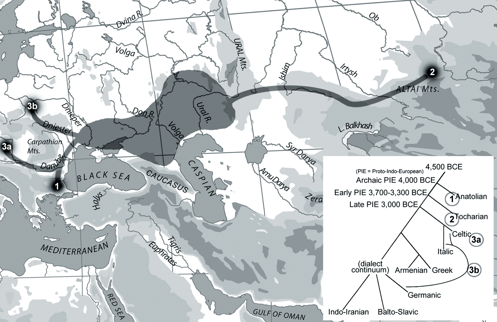
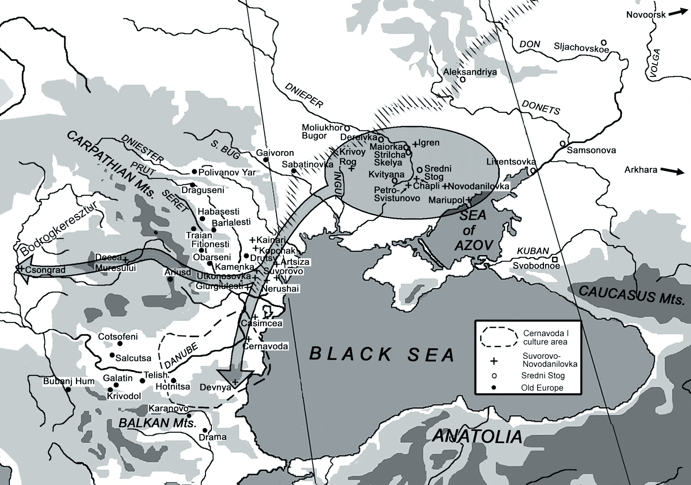
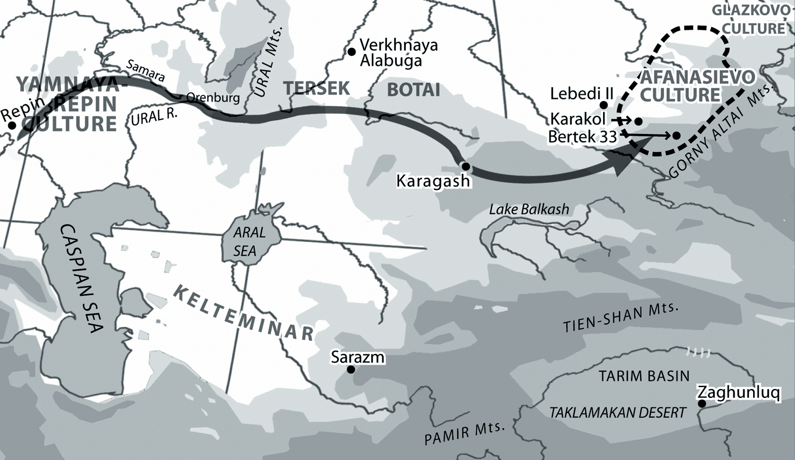
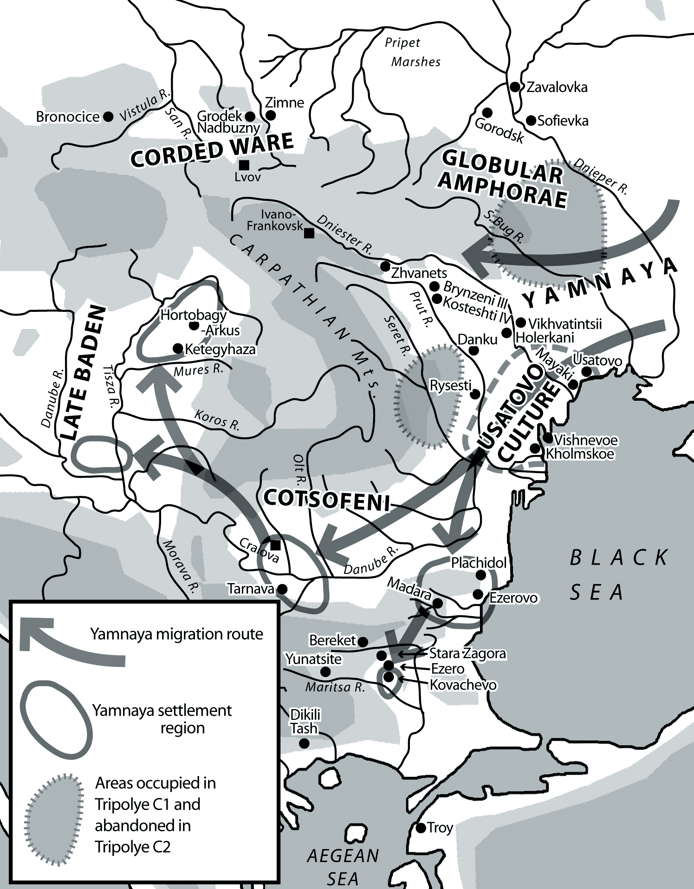

# Two IE phylogenies, three PIE migrations, and four kinds of steppe pastoralism

David W. Anthony  
Anthropology Department, Hartwick College (Oneonta, New York)

Journal of Language Relationship • Вопросы языкового родства • 9 (2013) • Pp. 1–21 • © Anthony D. W., 2013

## Abstract

This paper defends and elaborates a Pontic-Caspian steppe homeland for PIE dated broadly between 4500–2500 bc. First I criticize the Bouckaert et al. phylogeny, rooted in Anatolia, published in Science in August 2012. Then I describe archaeological evidence for three migrations from the Pontic-Caspian steppes into neighboring regions, dated to 4500–2500 bc, that parallel the sequence and direction of movements for the first three branches in the Ringe phylogeny (Ringe, Warnow and Taylor 2002) of the Indo-European languages: 1. Anatolian, 2. Tocharian, and 3. a complex split that separated Italic, Celtic, and perhaps Germanic (Germanic could be rooted in two places in their phylogeny). Each of the migrations I described is suggested by purely archaeological evidence, unconnected with any hypothesis about language. They are dated about 4400–4200 bc for branch 1, 3300–2800 bc for 2, and 3000–2800 bc for 3. These three apparent prehistoric movements out of the Pontic-Caspian steppes match the directions expected for the first three splits in the Ringe phylogeny, and the directions of later movements are plausible given the Ringe sequence and the known later locations of the daughter branches. The parallel between the archaeological sequence and the linguistic sequence, each sequence derived from independent data, is argued to add archaeological plausibility to the hypothesis of the Pontic-Caspian homeland for PIE. In addition, recent archaeological research on steppe economies and diets shows that it is misleading to regard “steppe pastoralism” as a single undifferentiated economic category. I suggest that we can link the three earliest periods of outward migration from the Pontic-Caspian steppes with particular kinds of pastoral economy in the steppes. I provided a brief characterization of four different kinds of steppe pastoralism relevant to Indo-European migrations.

**Keywords: Indo-European origins, pastoralism, migration, language trees, wheeled vehicles, horseback riding.**

On September 11 and 12, 2012, a two-day international conference was held at the Russian Institute of Archaeology and the State University of the Humanities in Moscow. The first day featured papers by archaeologists presented in honor of Nikolai Merpert, a giant figure in Russian archaeology and an important archaeological influence on me, and on all who today discuss Indo-European origins in relation to the archaeology of the Pontic-Caspian steppes (Merpert 1974). The second day’s papers were largely by linguists, about the Indo-European languages, with a few papers by Indo-European-oriented archaeologists.

My paper was a defense and elaboration of a Pontic-Caspian steppe homeland for PIE dated broadly between 4500–2500 bc. I described archaeological evidence for three migrations from the Pontic-Caspian steppes into neighboring regions, dated to this period, that parallel the sequence and direction of movements for the first three splits in the Ringe phylogeny (Ringe, Warnow and Taylor 2002) of the Indo-European languages. Each of the migrations I described is suggested by purely archaeological evidence, unconnected with any hypothesis about language. Whether they represent language spreads is of course a separate question. But three apparent prehistoric movements out of the Pontic-Caspian steppes match the directions expected for the first three splits in the Ringe phylogeny, and the directions of later movements are plausible given the Ringe sequence and the known later locations of the daughter branches. The parallel between the archaeological sequence and the linguistic sequence, each sequence derived from independent data, was argued to add archaeological plausibility to the hypothesis of the Pontic-Caspian homeland for PIE. In addition, recent archaeological research on steppe economies and diets shows that it is misleading to regard “steppe pastoralism” as a single undifferentiated economic category. I suggested that we could link the three earliest periods of outward migration from the Pontic-Caspian steppes with particular kinds of pastoral economy in the steppes. I provided a brief characterization of four different kinds of steppe pastoralism relevant to Indo-European migrations. These subjects, sufficiently ambitious for a short paper, are briefly elaborated below.

But I should also address a dispute about the Indo-European homeland that emerged at the Moscow conference, related to a paper published in Science by Bouckaert et al. (2012) two weeks before the conference started. This paper suggested another, competing parallel between archaeological evidence and a second, different phylogeny for the IE languages, with a much deeper origin in time, rooted in Neolithic Anatolia. The co-authors of the 2012 Science paper included Q. D. Atkinson and R.D. Gray, who had initiated this approach to the study of Indo-European origins (Gray and Atkinson 2003), adding a geographic mapping component and additional data and refinements in 2012. In both the 2003 and the expanded 2012 study they used models derived from the biological study of the phylogeny, origin and spread of viruses as the method for understanding the phylogeny, origin, and spread of the Indo-European languages. They concluded that the PIE ‘virus’ originated, under almost any reweighting of the components in their model, in Anatolia about 7000–6000 bc. The most intriguing aspect of their solution was that it emerged from a quantified biological model independently of the archaeological evidence suggesting that the Neolithic farming economy had spread into Europe from Anatolia about 7000–6000 bc.

## The Anatolian virus

The apparent parallel between archaeological and hybrid bio-linguistic evidence in Bouckaert et al. 2012 seemed to support Renfrew’s (and others’) hypothesis that the Indo-European languages originated in Anatolia, differentiating through geographic isolation following the migrations that carried agricultural economies from Anatolia to Europe during the 7th–6th millennia bc. Neolithic population movements from Anatolia into Europe are documented by ancient DNA from the first farmers and their cattle, and archaeobotanical evidence from their crops (Deguilloux et al. 2012; Scheu et al. 2012). This event is much simpler and more obvious archaeologically than the three-phase archaeological parallels that I compared with the Ringe phylogeny.

A steep increase in explanatory complexity is inherent in moving Indo-European origins away from the spread of agriculture. No other prehistoric population movement is marked so clearly and accepted so unanimously by archaeologists. The steppe-homeland and the Anatolia-origin hypotheses differ not only in time and place, but also in the complexity of their associated social explanations. Farmers’ languages often have spread with agriculture, replacing hunter-gatherer languages in a wave-like process driven by demographic advantages (Bellwood and Renfrew 2002). A later spread from the steppes, in contrast, requires a sociolinguistic explanation involving waves of language shift among long-established agricultural communities, in the absence of empire, in a context of squabbling and competing small-scale Copper Age and Bronze Age tribes arranged in shifting alliances. The mechanism driving later waves of language shift through such a complex social matrix is not obvious, but it must have happened, if the steppe homeland hypothesis is correct. And it must have depended little if at all on demographic advantages, as no obvious demographic advantage can be assigned to any particular region or culture in the Copper and Bronze Ages. Language shift on anything like the required scale would have to result from sharp differences between Copper and Bronze Age language communities in social prestige and the resonance of power publicly associated with particular political alliances or particular ways of life, such as the age-old contrast between the farmer or the herder. The alliances that attracted the most followers, perhaps at times of social unrest, spoke Indo-European languages. This is quite a different social mechanism from the demographic advance of Neolithic pioneer farmers. The differences in ‘when’ require differences in ‘where’ and ‘how’. And of course the two models are incompatible. One of them, at least, must be wrong.

In an earlier publication (Anthony 2007: 79–80) I dismissed the Gray and Atkinson 2003 iteration of their argument because their chronology, retained in 2012, required that the period of PIE unity ended, and the differentiation of the daughter branches began, about 6000 bc. This chronology is incompatible with internal evidence contained in the PIE vocabulary referring to wheeled vehicles. The invention of the wheel-and-axle principle and the first wheeled vehicles are solidly dated by radiocarbon after 4000–3500 bc, a very reliable and well-studied external fact (Bakker et al. 1999; Fansa and Burmeister 2004; Anthony 2007). The presence in undifferentiated PIE (with the possible exception of Anatolian, which might have separated before wheels were invented) of a developed vocabulary for wheeled vehicles indicates unavoidably that PIE (post-Anatolian) remained undifferentiated after wheeled vehicles were invented, or after 4000–3500 bc. Atkinson’s online comments about this chronological problem in March 2004 suggested that since most of the wheeled-vehicle vocabulary is based on IE roots — most of it was not borrowed from a non-IE language — the daughter languages could have independently chosen the same IE root to designate wheels after they were invented, a suggestion repeated by Paul Haggerty at the Moscow conference.

I find this proposal not just unconvincing, but surprising. It requires a remarkable degree of psychic unity between the dispersed daughter languages, leading them to independently select the same IE roots to refer to a wide range of newly-introduced wagon parts (two shared roots for wheel, one for thill, one for axle, and a shared verb meaning to go in a vehicle). Moreover, these five (a minimal count) PIE roots must have survived in an unchanged and increasingly archaic phonological form, not once, but in each daughter branch, from Proto-Indic to Proto-Celtic, unaffected by the distinct phonological systems evolving around them, making the PIE phonological root available to all of the daughter communities three millennia after they had split, when wheeled vehicles and axles finally were invented; and all of these constraints must have affected only the wheel vocabulary — other inventions that occurred after the IE dispersal, things like spoke, iron, or glass — were named very differently in the various dispersed daughter languages. This argument was never really articulated; it was and remains a dismissive wave of the hand, more confusing than enlightening. But even in rough hand-waving form, it seems to require suspension of the rule that the relation between word and thing is arbitrary, one of the basic postulates in linguistics; replacing it with a unique and frankly amazing series of parallelisms that constrained both the creation of new words and the retention of phonological archaisms, and acted in this extraordinary way only with the wheel vocabulary.

The date of the Neolithic agricultural dispersal is an insuperable obstacle to accepting it as the vector for the differentiation of PIE into its daughters. Anatolian Neolithic farmers could not have had wheeled vehicles; the speakers of PIE did. The first farmers probably dissemi- nated some variety of Afro-Asiatic, Hattic, or Caucasian languages, non-Indo-European language families known to have been present in Anatolia in antiquity.

At the Moscow conference Paul Haggerty from the Max Planck Institute in Leipzig presented a defense of Bouckaert et al. and its Anatolian homeland hypothesis. He welcomed the paper as a definitive science-based rejection of the steppe theory of Indo-European origins. Haggerty argued that Bouckaert et al. presented “the data” in a quantified and objective manner, that their chronological and geographic conclusions were strongly supported under the thousands of different iterations that generated them, and that, in spite of small flaws in their phylogeny, it would be irresponsible to reject such a strongly supported quantitative argument drawn from linguistic data across the Indo-European languages, in favor of an impressionistic steppe-origin theory that he admitted he had never liked.

I argued that the Anatolian geographic root in Bouckaert et al., the new element that merited publication in Science, was made inevitable by three constraints in their model: first, Anatolian was the first and oldest branch to split in their phylogeny; second, the Anatolian languages were assigned a priori to Anatolia by their mapping constraints, which did not permit any language to be mapped outside its known range (also limiting Celtic to the British Isles); and third, the mechanism of spread was a series of short-distance random walks constrained only to avoid sea crossings, and assuming that the world was otherwise a flat plane with no geographic barriers. On this plane, the modern geographic distribution and number of Indo-Iranian languages pulls the optimal origin point to the south, under an assumption of incremental random movements as the mechanism of spread; and the greater difficulty assigned to sea crossings makes a center north of the Black Sea less likely than Anatolia, south of the Black Sea; and again, Anatolian a priori was assigned to Anatolia. I thought that the Anatolian root was the product of their methods.

Our minor debate in Moscow was simultaneously and subsequently upstaged by a much more widely disseminated series of online essays that began to appear on September 4, 2012, one week before the Moscow conference began, at the website Geocurrents (http://geocurrents.info), created by Stanford University’s Martin Lewis, a geographer, and Asya Pereltsvaig, a linguist. This series of web posts, as of this writing in November 2012, contains 30 referenced articles, each with a different criticism of Bouckaert et al., presenting a new flaw or error every 2–3 days for two months. Rarely has a Science paper been exposed to such a withering and wide-ranging barrage of point-by-point criticisms from a professional source. A few titles convey the tone of the series: “The malformed language tree of Bouckaert and colleagues”, “Atkinson’s nonsensical maps of Indo-European expansion”, “103 errors in mapping Indo-European languages” [five separate posts], “The misleading and inconsistent language selection in Bouckaert et al.”, “The hazards of formal geographic modeling”, “Absolute dating and the Romance problems on the Bouckaert/Atkinson model”, “Shared innovations are more important than shared retentions”, “Linguistic phylogenies are not the same as biological phylogenies”, “Do languages spread solely by diffusion (no)?”, “The consistently incorrect mapping of language differentiation in Bouckaert et al.”, “Mismodeling Indo-European origin and expansion: Bouckaert, Atkinson, Wade, and the assault on historical linguistics”, and, following the same chronological argument I articulated, “Wheel vocabulary puts a spoke in Bouckaert et al’s wheel”. Even if you do not agree with every point, it is difficult to retain any faith in the Bouckaert et al. model after reading these 30 detailed, incisive essays, many of which present important and persuasive insights.

The Bouckaert et al. paper was badly received not just by Geocurrents and its commenters, but also at Language Log, where some of the Geocurrents essays were cross-posted and discussed by readers. Critics argued that significant parts of the linguistic and mapping data that entered the Bouckaert et al. model contained or were based on errors, and both the virus-based, random-walk, diffusionistic model of expansion and the chronological assumptions that guided its pacing also were either riddled with errors (in the dates assigned to “known” language splits, which determined the chronology) or were inaccurate for modeling language shifts and expansions (in reference to the virus-based model). Haggerty’s defense of Bouckaert et al. in Moscow was conceived before these criticisms appeared and did not address them.

I think that the underlying intellectual problem that makes us lean in such different directions is a disagreement about the reality of PIE as a language community. James Clackson, in his textbook on Indo-European linguistics (Clackson 2007), warned that reconstructed PIE is like a constellation seen from the earth: it is composed of pieces and parts that might be of quite different ages and distances away from us in time, so in a sense is an illusion created only when we put the pieces together into one entity that never existed. This view of PIE permits it to float in various different times simultaneously, with none of its pieces (like the wheel vocabulary) anchored to any specific time or place. Some linguists take Clackson’s constellation analogy to heart and are very reluctant to treat PIE as an entity that actually existed anywhere except in our own clever heads. In Moscow, Haggerty denied that any meaning could be attached to any reconstructed PIE root, even the root for ‘axle’, reconstructed as *hₐ[?]eǩs- by Mallory and Adams (2006), and retaining the meaning ‘axle’ in cognates in Indic, Baltic, Slavic, Germanic, Italic, and Greek. Since the meaning ‘axle’ is attached to every cognate in six branches, that meaning is the most economical one that can be attached to the PIE root; indeed, it is difficult for a reasonable person to imagine how the same meaning could have become attached to each cognate, including ancient ones, except by shared inheritance from PIE. Haggerty, however, insisted on a minimalist definition of PIE, lacking any meanings, its cognates reduced to strings of phonemes floating in imaginary time like Clackson’s constellation, and therefore of little interest to archaeologists who study real things.

Clackson’s constellation is, however, a bad analogy in a good book. Unlike a constellation, which has no effect on anything real, there must have been an actual language, PIE, ancestral to the daughter IE languages, whose regular derivation from that language is demonstrable by the comparative method. We can debate what we mean by “that language”, but the debate itself is caused by the fact that we can see different parts of PIE through several different evidentiary lenses (syntax, morphology, vocabulary, poetic conventions, mythology) while any constellation disappears as soon as the observer moves. Clackson did not actually suggest that PIE never existed independently of us observers (as with the constellation), but only that it had a dynamic evolutionary character, with earlier and later parts, only a few of which we are able to sort out, which is a very different kind of problem. Clackson’s principal disappointment with what we know about PIE is that it is difficult to confidently identify stages in the evolution of PIE verbal morphology or nominal conjunctions, which many linguists have tried to detect. But he also believed that other things in PIE can be dated. Grammar, he said, cannot be dated, “…since it is not clear how one can date a feature such as a casemarker or verbal paradigm, although it may be possible to assign some absolute dates to items of material culture, such as wheels [my emphasis] or the terminology for spinning wool.”

Linguists are disappointed in evidence like this only because they are not archaeologists. Archaeologists are eager for even small scraps of textual evidence, including the fragments of grammar and vocabulary that Clackson found disappointing. But Clackson simultaneously recognized that some elements of PIE can be tied to real-world facts and dates. We can use these pieces as chronological anchors. PIE is tied to the real world through material objects like wheeled vehicles and domesticated sheep that appeared in Europe and Asia after specific times, well-dated by radiocarbon dates, and that is no illusion.

In the end, it is the reconstructed PIE vocabulary that is the entire reason for an anthropologically-oriented archaeologist such as I am to pursue Indo-European origins. If an archaeologist found a 1000-word vocabulary inscribed on a tablet from a time and place so remote that no written language was known there, his/her discovery would be regarded as an exciting window into a society previously known only through the labored interpretation of its burial mounds and pottery. That is more or less how I regard the possibilities contained in the reconstructed PIE vocabulary, with the added interest that this was a language that generated daughters that were adopted from China to Scotland during the Copper and Bronze Ages, periods we know very well archaeologically. We are already studying the social and economic changes that accompanied the Indo-European expansion; we just haven’t looked at the archaeological data from that perspective. This is because we don’t know where to look, and we have rarely tried to look for regional waves of cultural shift towards new symbols of power and prestige that align with the political and cultural institutions referenced in the PIE vocabulary. The possibility of a fruitful conjunction between archaeological and linguistic evidence therefore is compelling in this case, but it will require archaeologists to accept reconstructed linguistic data into analyses of Bronze Age cultural and political dynamics. Their reluctance to do so reflects real concerns: the political misuses of the past that such an acceptance might encourage, as well as their uncertainty about the reality of reconstructed roots.

But all sources of evidence about human history are partial, fragmentary, and difficult to interpret. Artifacts are not particularly eloquent about many important aspects of human behavior, and ancient texts are partial, class-biased, gender-biased, sometimes retain anachronistic characters and expressions, and are interpreted differently by different trained readers. The reconstructed PIE vocabulary shares many of the same problems, but that does not disqualify it as a source of information about the past. If we can narrow the chronological focus for PIE to about 4500–2500 bc and the geographic focus to the Pontic-Caspian steppes, then the reconstructed vocabulary can be useful as a guide to behaviors that might not be expressed, or might be expressed in a puzzling way archaeologically. To give just one example on the cultural side, Clackson’s 2007 textbook contained a long and fascinating discussion of the vocabulary for family relations in PIE, which he reviewed in the manner of an ethnographer and concluded that “they” were patrilineal in inheritance rules and patrilocal in residence rules for married couples, a long-known feature of PIE life. Archaeologically, most Yamnaya burial mounds in the Volga-Dnieper steppes were built over the graves of adult males. Clackson also discussed the implications of the fact that PIE-speakers placed people in the same grammatical category as domesticated animals, while wild animals were discussed in a different category. Archaeologically, wild animal bones are very rare in Yamnaya grave sacrifices or settlements. On the political side, mortuary feasts and celebrations associated with the burial under kurgans of exceptional individuals are documented in Yamnaya and earlier Pontic-Caspian steppe archaeology, and these might align with the reconstructed PIE vocabulary for feasting, gifts, songs of praise, guest-host relationships, and patron-client relationships. The reconstructed PIE vocabulary is the prize, and we should not be distracted from it by pessimism about the limitations of linguistic evidence. We can assign more than 1000 roots to PIE, and we have only begun to use them to understand the people who spoke them.

## The Ringe et al. phylogeny and migrations out of the Pontic-Caspian steppes

I accept the Pontic-Caspian steppe homeland for Proto-Indo-European, and a date for PIE (post-Anatolian) in the late fourth and early third millennia bc, see Fig. 1. The strongest geo-

graphic indicator is the fact that PIE and Proto-Uralic were geographic neighbors; they shared core-vocabulary roots (name, water) and even pronoun paradigms. Proto-Uralic was a language of forest-zone foragers, unfamiliar with domesticated animals except dogs. The sharing between PIE and Proto-Uralic, which is well documented by both Uralic and Indo-European linguistic specialists (Koivulheto 2001; Janhunen 2001, 2000; Kallio 2001; Ringe 1997; Salminen 2001), suggests a PIE homeland bordering the forest zone. PIE also exhibits borrowings with Caucasian language families, particularly with a language ancestral to Kartvelian, suggesting a location adjoining the Caucasus (Gamkrelidze and Ivanov 1995). The Pontic-Caspian steppes lie directly between the Caucasus and the Uralic forest zone, a plausible and even probable location for PIE given these internal clues from shared loans and/or inheritances with neighbors. The additional constraints that PIE speakers were familiar with herding, agriculture, and wagons (shown in PIE vocabulary) and with honeybees and horses (Carpelan and Parpola 2001) and that the daughter branches must have differentiated many centuries before 2000 bc (shown by Anatolian, Greek, and Indic inscriptions in the 2nd millennium bc) limits PIE to a window of time (maximally 4500–2500 bc) and geographic location (in the Pontic-Caspian steppes between the forest zone and the Caucasus west of the Urals). Does the archaeology of this region show evidence for migrations outward?

Here I point to archaeological evidence for three migrations, or more accurately periods of out-migration, from the Pontic-Caspian steppes that can be seen as corresponding with the first three branching events in the phylogeny of Ringe et al. (2002). The Ringe et al. phylogeny was based on the application of quantitative methods derived from cladistics, like Bouckaert et al., but included phonological and morphological traits, in addition to shared cognates, and was overseen by an Indo-European historical linguist. The parallel between predicted (by Ringe et al.) and observed directions and sequence of movement provides archaeological support for the Pontic-Caspian steppe homeland hypothesis, in addition to the advantages that it is in the right place (between Proto-Uralic and Proto-Kartvelian, with honeybees and horses) at the right time (after wheeled vehicles were invented), with actual wagon burials as part of its material culture.

To be explicit, the first three splits in the Ringe et al. phylogeny are 1. Anatolian, 2. Tocharian, and 3. a complicated root that engendered Italic and Celtic, and possibly Germanic, the root of which remained unresolved in the Ringe et al. phylogeny. Germanic showed some archaic traits that suggested a phylogenetic root at about the same time as Italic and Celtic, but also exhibited other traits that suggested a later rooting, at about the same time as Balto-Slavic. Archaeologically, an earlier root would seem to match the archaeological evidence better. If the PIE homeland was in the Pontic-Caspian steppes, root 1 should be reflected in a migration that began in the Pontic-Caspian steppes and moved into or toward Anatolia. Root 2 should detach in a migration to the east, toward the Tarim Basin, where Tocharian was later spoken. Root 3 should be a complex series of movements to the west, from the steppes into Europe, toward regions that could plausibly have been connected later with Celtic, Italic, and Germanic origins. Pre-Italic, Pre-Celtic, and pre-Germanic should not be conceived as languages but rather were regional phases in language evolution, possibly millennia of language evolution for Pre-Germanic, preceding the later formation of Proto-Italic, Proto-Celtic, and Proto-Germanic. Archaeological migrations matching these requirements are identified below.

I should note that after the third split in the Ringe et al. phylogeny, Proto-Indo-European can no longer be said to exist. Pre-Italic and Pre-Celtic might have shared some areal linguistic similarities prior to the formation of Proto-Italic and Proto-Celtic, but the phylogeny suggests that regional and geographic isolation between these branches began soon after the migrations that separated them from late PIE. After these movements occurred, PIE differentiated into daughter languages in Anatolia, SE Europe, the Pontic-Caspian steppes, and central Europe that were largely isolated from each other through geographic separation and were quickly altered by interaction with regionally distinct substrate languages outside the steppes. It is impossible to connect all of the branching events in the Ringe et al. phylogeny with archaeological migrations out of the PIE homeland because after the third branching event the PIE language community no longer existed, and the homeland was a distant memory — perhaps a place referenced in songs and folklore, but essentially forgotten.

**1.** The first split in the Ringe et al. phylogeny is Anatolian. To arrive in Anatolia from the Pontic-Caspian steppes, the direction of movement should have been south, through either southeastern Europe or the Caucasus. The oldest archaeological evidence for a post-Neolithic migration from the Pontic-Caspian steppes into neighboring regions is a movement into southeastern Europe about 4400–4200 bc, linked chronologically and geographically with the sudden abandonment and burning of hundreds of tell settlements in the lower Danube valley and eastern Bulgaria about 4400–4200 bc, with associated rapid changes in pottery, metallurgy, mortuary customs, ritual figurines, and other behaviors (Fig. 2). During the same period Balkan copper bracelets, beads, and rings were obtained by small-scale steppe elites in the lower-Dnieper and middle Volga steppes, seen in graves at Skelya, Novodanilovka, Petro-Svistunovo, and Khvalynsk, among others; and a chain of similar copper-rich graves, equipped with similar shell beads and flint blades and bifacial lanceolate points, extended through the Dniester steppes (Koshary, Kainari) to Suvorovo in the lower Danube steppes and onward to eastern Bulgaria (Devnya), with a separate path of movement extending into Transylvania (Decea Muresului) and eastern Hungary (Csongrad) (Telegin et al. 2001; Rassamakin 2002). One of the richest of the intrusive cemeteries, a cluster of five well-outfitted burials, was discovered at Giurgiuleşti, at the southern tip of Moldova, north of the Danube delta (Bicbaev 2009). A horse

was sacrificed above the grave of an adult male armed with gold-trimmed javelins at Giurgiuleşti. A human bone gave a date of 4490–4330 bc (Ki-7037, 5560 ±80 BP).

While it is difficult to identify the role of the Suvorovo-type steppe migrants in the collapse of agricultural tell settlements in Balkan Thrace and the lower Danube valley (primary cause? after the fact?), it is clear that steppe people of the Suvorovo type moved into the lower Danube valley and eastern Bulgaria at about the same time as the collapse, probably bringing horses with them. The total number of intrusive cemeteries is not large, but the subsequent period saw the adoption of a more mobile, less settled economy particularly in the Balkan uplands, where no settlements of any kind can be identified for 500 years after the collapse of the tell societies. The new pastoral economy, probably using horse-mounted herders who could manage two times larger herds than pedestrian herders, was familiar and well-suited to the immigrants from the steppes. At this moment of wrenching change for the local people, the immigrants’ familiarity with social mechanisms for managing social relations at a distance, such as patron-client and guest-host relationships, and their promotion of these relationships at public feasting events featuring praise poetry for the sponsor of the feast (all indicated in PIE roots), gave them the ability to absorb local people into a system suitable for a more mobile, pastoral economy. Pastoral institutions for maintaining social relations at a distance, celebrated at boastful public feasts, could have been a vector for language shift.

The Cernavoda 1 culture that followed the abandonment of the tells in the lower Danube valley, together with the archaeologically undocumented shepherds who grazed their sheep on the abandoned tells in the Balkan uplands between 4200–3500 bc, could have been the distant antecedents of the Anatolian branch, the first split in the Ringe et al. 2002 phylogeny. They would have spoken a language detached from an early chronological stage (a millennium earlier than the next split) and a western geographic dialect in the evolution of PIE, consistent with

the multiple archaisms retained uniquely in the Anatolian branch. Note that this migration is dated before wheeled vehicles were invented, perhaps the reason why Anatolian uniquely lacked the shared wheel vocabulary of later PIE. Troy I had a material culture closely linked to Balkan cultures such as Ezero, and the Anatolian branch could have become isolated in Anatolia, initiating the shift from Pre-Anatolian to Proto-Anatolian, with the movement of some Balkan people to the Troad during the Troy I era, 3000–2600 bc.

**2.** The second split in the Ringe et al. phylogeny is Tocharian, requiring the second movement to depart from the Pontic-Caspian steppes toward the east. Tocharian retained PIE roots in its wheeled-vehicle vocabulary, and in other ways shared the innovations that defined all post-Anatolian IE languages, so the migration that separated Pre-Tocharian speakers from regular contact with the main body of PIE speakers must have occurred after wheeled vehicles were invented, probably after 3500 bc. The second archaeological migration from the Pontic-Caspian steppes meets these criteria, Fig. 3. A much-argued but widely accepted migration did occur, going from the Caspian-Ural steppes eastward across Kazakhstan to the western Altai Mountains about 3300–3000 bc (disregarding some earlier dates, now regarded as anomalous), creating the intrusive Afanasievo culture in the western Altai. The Afanasievo migrants seem to have introduced a pastoral economy, wheeled vehicles, horses, and an accompanying new social order into mountain meadows formerly occupied by ceramic-making mountain foragers, some (many?) of whom probably were absorbed into the Afanasievo culture. Afanasievo material culture exhibits typological, ritual, and economic parallels with Yamnaya, including Yamnaya kurgan grave types, a typical Yamnaya burial pose, Yamnaya-Repin ceramic types and decoration, and sleeved axes and daggers of specific Yamnaya types (Kubarev 1988; Chernykh, Kuz’minykh and Orlovskata 2004: Fig. 1.4). The Ural-Altai connection seems to have been maintained at least sporadically after 2800 bc, because typological innovations in the western steppes including later sleeved axe types and MBA Catacomb-style ceramic censers appeared in late Afanasievo graves in the western Altai. The Afanasievo culture

could have represented the antecedent population for the Tocharian languages later spoken in the Tarim Basin, an argument articulated by Mallory and Mair (Mallory and Mair 2000).

**3.** The third split in the Ringe et al. phylogeny is the departure of groups that would later engender Italic and Celtic, and perhaps Germanic, a branch with an unresolved root. This complex movement should flow from the Pontic-Caspian steppes to the west, perhaps divided into southern (Italo-Celtic) and northern (Pre-Germanic) streams. It should be dated later than the Tocharian migration, although since these two migration streams flowed from the eastern and western margins of the PIE language community, they probably spoke different regional dialects of PIE, so some of the linguistic differences between them (supporting their chronological split) could have been partly geographic-dialectical, or synchronic, rather than entirely chronological-developmental, or diachronic. The third cluster of archaeologically documented migrations meets these complicated criteria, Fig. 4.

The southern stream was the Yamnaya-culture migration into the Danube valley and the Balkan uplands of Bulgaria, dated about 3000–2800 bc. The migrants probably came from the Bug-Dnieper-Azov steppes, and targeted the lower Danube valley and Bulgaria, in one direction; another series of movements pushed farther up the Danube to the middle Danube valley in eastern Hungary, where thousands of intrusive Yamnaya kurgan graves are assigned to this event (Ecsedy 1994), contemporary with late Baden/Cernavoda III. The rare ceramic gifts in these graves were largely derived from local Cotsofeni traditions, typical of a culture centered in the strategic Iron Gates passes, which seems to have been integrated with the Yamnaya immigrants. Pre-Celtic and Pre-Italic might have emerged from dialects spoken during this series of migrations, but after the movement started, about 3000 bc, it would be perhaps 1500 years before the probable formation of Proto-Celtic (in Austria?) or Proto-Italic (in Italy?). Pre-Celtic was not a language but rather designates a phase of language history, unfortunately almost unknown, bridging PIE and Proto-Celtic, lasting for at least 1500 years. Proto-Celtic can be regarded as a language, the reconstructable language immediately ancestral to the Celtic languages, and presumably was spoken about 1500–1000 bc. In each daughter branch there was a Pre-phase of varying lengths. We should not expect to be able to track the intervening steps in convenient language-coded pottery types.

The northern stream in this third migration moved a shorter distance but was more obviously and thoroughly integrated with a local agricultural population, the village farmers of the late Tripol’ye CII culture north and east of the Carpathians. At the mouth of the Dniester in the coastal steppes, dagger-holding patrons were buried under Usatovo-culture kurgans in the Dniester steppes. Tripol’ye CII people seem to have lived in the Usatovo settlement, and very similar people lived far up the Dniester, where the settlements that made fine Usatovo pottery styles (Brynzeni III) were located (Anthony 2008; Patokova et al. 2009). But Usatovo cemeteries exhibited a hierarchy in which some people were buried in flat graves with poor grave goods, like the cemeteries near the Tripol’ye settlements just upriver in the farming zone; and others were buried under Yamnaya-style kurgans with rich gifts of arsenical bronze weapons and fine painted Tripol’ye CII pots. The Usatovo culture probably was the product of a group of steppe warriors becoming patrons of late Tripol’ye clients, beginning about 3300 bc, a century or two before the Yamnaya migrations into the Danube valley. Tripol’ye CII groups might well have shifted to the speech of their Usatovo patrons, making Tripol’ye CII groups a vector for the spread of IE languages (pre-Germanic?) up the Dniester into Poland, where there are many indications of contact between pre-Corded Ware (Zimne, Gródek Nadbużny) and Tripol’ye C II communities before 3000 bc (Klochko and Kośko 2009). Through this geographic path, where many interpenetrating cultural influences can be seen archaeologically, IE dialects from the steppes could have been adopted in Poland, eventually becoming a pre-Germanic array of languages in the northern European plain.

What was the social mechanism for inter-cultural accommodation in these episodes of contact? Mobile steppe pastoral societies, documented archaeologically, must have developed a social and political infrastructure to manage mobility and social relations at a distance, and the reconstructed PIE vocabulary suggests how they did it. The great increase in mobility that occurred in the Pontic-Caspian steppes at the opening of the Yamnaya period, about 3300 calBC, probably resulted from the initial combination of ox-wagons with horseback-riding, which greatly increased the potential geographic range and productivity of pastoral economies. Increased mobility is seen archaeologically in the disappearance of settlements in large regions where thousands of kurgan cemeteries are known, and by the appearance of some kurgan cemeteries in the interior steppes, outside major river valleys. This shift in living patterns and economy (see final section, economy 2) cannot have happened without social effects. The PIE vocabulary suggests that Yamnaya groups recognized mutual obligations of ‘hospitality’ between guest-hosts, a reciprocal relationship (*ghos-ti-). This institution redefined who belonged under the social umbrella, extending protection to non-kin who might be moving through others’ pastures. It would have been very useful first as an adaptation to mobility in a pastoral economy, and later as a way to incorporate outsiders as people with clearly defined rights and protections, as it was used from The Odyssey to medieval Europe (Kristiansen and Larsson 2005: 238).

Steppe societies already recognized differences in rank and prestige, probably the beginning of the patron-client system suggested by PIE vocabulary for leaders and followers, and for gifts and the institutionalized praise of gifts. Beginning rather suddenly in the Eneolithic, when they first acquired domesticated cattle and sheep from neighboring (Afro-Asiatic?) farmers, Pontic-Caspian steppe societies made funerals into a theatre of social and political competition, particularly for community leaders, who were buried with multiple cattle, sheep, and horse sacrifices; elaborate costumes of exotic ornaments, including copper rings and beads; and weapons, including polished-stone-headed maces or axes, as at Khvalynsk on the Volga and Nikol’skoe on the Dnieper. The new public theatre continued into the EBA Yamnaya period, expressed in the construction of a kurgan, the sacrifice of domesticated animals, deposition of symbolic parts of the animals in the kurgan ditch and in the grave, and (presumed) feasts using the remainder of the carcass. PIE contained a vocabulary related to gift-giving and gift-taking that is interpreted as referring to potlatch-like feasts meant to build prestige and display wealth (Benveniste 1973: 61– 63; Mallory and Adams 1997: 224–225; Markey 1990). The public performance of praise poetry, animal sacrifices, and the distribution of meat and mead were central parts of the performance. Calvert Watkins (1995: 73–84) identified a special kind of song, the 'praise of the gift' in Vedic, Greek, Celtic and Germanic, and therefore almost certainly in late Proto-Indo-European. Praise poems proclaimed the generosity of a patron and enumerated his gifts. These performances were both acclamations of identity and recruiting events through which the language of power might be learned first as songs sung over free food and drink. But equally likely, the PIE vocabulary suggests, was that the patron’s language was learned from a more unsettling institution: roaming war-bands of youths who were initiated into manhood by going raiding for livestock and/or women, the famous PIE institution of the Mannerbünde, or Kouros (Falk 1986; Kershaw 2000).

Guest-host institutions (egalitarian), patron-client institutions (hierarchical), wealth and generosity, the threat of violence from seasonally active war-bands, and a new, more productive herding system probably brought prestige and power to the identities associated with Proto-Indo-European dialects after 3300 bc. The institution of oath-bound obligation between the strong and the weak and the guest-host institution extended those protections to new social groups. These mechanisms made it possible for a patron to accept and integrate outsiders as clients without shaming them or assigning them permanently to submissive roles. Patrons were themselves clients of other patrons. Praise poetry at public feasts encouraged the patrons to be generous, and validated the language of the songs as a vehicle for communicating with the gods who regulated everything. All of these factors taken together suggest that the spread of Proto-Indo-European probably was more like a franchising operation than an invasion. Although the initial penetration of a new region (or ‘market’ in the franchising metaphor) required an actual migration from the steppes and military confrontations, once it began to reproduce new patron-client agreements (franchises) its connection to the original steppe immigrants became genetically remote, while the myths, rituals, and institutions that maintained the system were reproduced, in the proper words, down the generations.

Each of these three episodes of migration is suggested by dated archaeological evidence. The sequence and direction of apparent prehistoric movements out of the Pontic-Caspian steppes and into neighboring regions can be matched with the first three splits in the sequence and direction of movements suggested by the Ringe phylogeny, which adds weight to the hypothesis of the Pontic-Caspian homeland for PIE. A Pontic-Caspian PIE homeland is plausible archaeologically, and also is consistent with internal linguistic evidence for wheeled vehicles, an environment with horses and honey bees, and loans between PIE and Proto-Uralic.

## Four Kinds of Pastoralism

In the final part of this paper, I address the organization and content of Pontic-Caspian steppe economies during the period of interest for understanding the expansion of the IE languages. It is necessary to move beyond arguments about the homeland in order to understand the speakers of Proto-Indo-European as people rather than as icons. We cannot understand the process of linguistic expansion until we understand how the societies that spoke PIE were organized economically.

Between 1995 and 2001 Dorcas Brown and I, with colleagues from Samara, directed the Samara Valley Project. The Samara River flows westward into the Volga from the southern slopes of the Ural Mountains through the northern edge of the steppe zone. Nikolai Merpert excavated a final Bronze Age settlement at Suskanskoe near Samara early in his career, and he was a mentor for Igor Vasiliev, whose energetic and ambitious excavations redefined the archaeology of the middle Volga region. We started our project working with Vasiliev, and when he passed the command to his students, we were lucky to work with Pavel Kuznetsov, Oleg Mochalov, and Aleksandr Khokhlov. Our project was designed to investigate the role of agriculture in Bronze Age pastoral economies in the Samara River Valley. We produced some original archaeological evidence that can be combined with other recent studies to suggest that there were four distinct kinds of pastoralism in the middle Volga steppes (Anthony et al. 2005; Anthony et al. forthcoming).

**1.** In the Eneolithic the population buried at Khvalynsk and one other cemetery had a minimal reliance on domesticated animals in their daily diet, which was strongly based on fish, according to new evidence obtained from stable isotopes in human bone (Fig. 5). But domesticated animals were 100% of the food sacrificed in funeral rituals at the Khvalynsk cemetery, dated about 4500–4200 bc, where sacrifices of a minimum 29 cattle (22.3%), 85 sheep-goat (65.4%), and 16 horses (12.3%) were concentrated principally in or near graves containing individuals with elite ornaments and stone maces (Agapov 2010). (These numbers add the fauna reported by Agapov for Khvalynsk II with the fauna in the original zoological reports from Khvalynsk I, only partly included in the Agapov report.) Horses were grouped with domesticated cattle and sheep in graves that contained no obvious wild animals, so horses might have been domesticated.

In the Dnieper Rapids region, elite individuals like Dereivka grave 49 showed stable isotopes that might suggest a diet containing more domesticated animals and less fish than others (Lillie et al. 2012: 86). We have previously suggested that the earliest and first domesticated animals in the western steppes might have been used more as an elite currency for feast-hosting and ritual-hosting than as a principal source of daily food (Anthony 2007: 220, 225; Anthony and Brown 2011: 138). The Eneolithic diet probably depended to a large extent on fish, and was significantly different isotopically from the diet that characterized Bronze Age pastoralists in the middle Volga steppes beginning with Yamnaya. In Ukraine, unlike the middle Volga steppes, some Eneolithic pottery contains imprints of wheat, barley, and millet,

![Fig. 5. Stable isotopes of ¹⁵[?]N and ¹³[?]C in human bone in individuals from the Eneolithic through the LBA in the middle Volga steppes. The Eneolithic diet was significantly different from the Bronze Age diet. The EBA, MBA, and LBA diets showed no difference in stable isotopes](images/anthony-2013-two-ie-phylogenies-fig5.png)

although the numbers are very small (Kotova 2008: 124–125); and stable isotopes in human bone are more variable than in the middle Volga region and show less reliance on fish. So in the Dnieper steppes, domesticated animals might have been more important in the daily diet, while in the Volga steppes domesticated animals were used principally in a new field of social competition between elites. During the Suvorovo/Skelya era, intense exchange in high-prestige copper goods between the Pontic-Caspian steppes and the Varna-period cultures of southeastern Europe ended about 4300–4100 bc with a migration into the Danube valley from western Ukraine and the extinction of tell settlements in that region. The migrants might have been mounted on horses but had no wagons and might have regarded domesticated animals largely as status and ritual symbols in a growing field of political competition revolving around public feasting.

**2.** About a thousand years after the collapse of the tell cultures in the Danube valley, at the start of the Early Bronze Age (EBA) about 3300 bc, the population in the middle Volga steppes adopted a new, entirely pastoral economy, probably stimulated to do so by the invention of wheeled vehicles (Merpert 1974). Wagons made portable things that had never been portable in bulk — shelter, water, and food. Herders who had always lived in the forested river valleys and grazed their herds timidly on the edges of the steppes now could take their tents, water, and food supplies to distant pastures far from the river valleys. The wagon was a mobile home that permitted herders to follow their animals deep into the grasslands and live in the open. Yamnaya communities dispersed across the interior steppes, building kurgans in places that earlier had been almost useless economically. Significant wealth and power could be extracted from larger herds spread over larger pastures.

A nomadic form of steppe pastoralism appeared with the first wheeled vehicles and horseback riding (for which there is clear evidence at contemporary Botai in Kazakhstan) in the EBA. The archaeological expression of the first age of equestrian, wagon-aided pastoralism was the Yamnaya horizon, which extended from the Dnieper to the Ural Rivers, the first cultural horizon to spread across all of the western steppes and perhaps an economic vector for the spread of PIE across the western steppes.

Again in this period, as in the Eneolithic, Yamnaya herding communities west of the Don River (eg, at Mikhailovka on the Dnieper) were occasionally tethered to small fortified settlements where some agriculture has been found. It was probably these western Yamnaya communities that migrated into the Danube valley and central Europe. The departure of Pre-Anatolian-speakers from SE Europe into Anatolia could have been a reaction to the arrival of this new wave of steppe immigrants.

But eastern Yamnaya communities in the Volga-Ural steppes left no evidence of settlements or cultivated grain and they seem to have lived in wagons — a Bronze Age form of pastoral nomadism not articulated with farming. Yamnaya individuals in the middle Volga steppes had no caries in their teeth, dental health not seen among bread-eaters. Yamnaya stable isotopes do not suggest millet in their diet (Fig. 5 above). The daily diet for the middle Volga Yamnaya population probably depended entirely on domesticated animals, probably principally sheep and goat products, according to stable isotopes. After this new pastoral diet was established, its isotopic signature did not change throughout the Bronze Age, not even in the Late Bronze Age when the Srubnaya population settled in permanent settlements.

**3.** In the Late Bronze Age (LBA), beginning about 1900 bc, previously mobile pastoral communities in the middle Volga steppes and across the Eurasian steppes settled down in permanent homes near marshes, during a climatic period of arid, cold conditions when riverine marshes became smaller. This settling process was assumed to be connected with the adoption of agriculture and the spread of a new agro-pastoral settled economy (Ostroshchenko 2003). However, the cause of the settling process might have been climate change and competition for good winter pastures near marshes, which became so important that herding groups settled near large marshes rather than leaving them open to be claimed by others. Again, as in earlier periods, the LBA Srubnaya settlements west of the Don exhibit some evidence for the cultivation of millet. But in spite of a large flotation effort designed to recover charred grains (Popova 2007), we found no evidence for agriculture at the excavated Pokrovka-Srubnaya settlements of Krasnosamarskoe or Kibit in Samara oblast, dated 1900– 1700 bc, and Diaz del Rio et al. (2006) found no evidence of agriculture at the Srubnaya mining settlement of Gorny, nor did Lebedeva (2005) find any evidence of agriculture in flotation experiments at 11 other Srubnaya settlements in the Volga-Ural steppes. Srubnaya settlements in this region were occupied permanently, year-round, but there is no evidence of agriculture at 14 Srubnaya settlements tested with flotation.

Hundreds of charred seeds of Chenopodium and Amaranthus were recovered from Srubnaya settlements at Krasnosamarskoe, Kibit, and Gorny. The daily diet in the LBA depended on domesticated animal products and perhaps wild seeds, probably very similar to the EBA Yamnaya diet. Paleopathological analysis by Eileen Murphy of 297 skeletons from the Samara region shows that the teeth of the Bronze Age population, EBA through LBA, had no caries — like the teeth of hunters-gatherers — and were quite different from farmers’ teeth. There was no difference in diet-related dental pathologies or in dietary stable isotopes between the era of mobile pastoralism (EBA & MBA) and the era of settled pastoralism (LBA). The LBA Srubnaya economy in the middle Volga region did not include agriculture, and was not agro-pastoral, as has been assumed, but instead was an unexpected combination of pastoralism and wild seed gathering. Probably the Sintashta economy, just earlier than Srubnaya, was non-agricultural as well. The late MBA/LBA steppe populations that probably spoke Proto-Indo-Iranian and early Iranian would have known of agriculture — Srubnaya people in Ukraine raised a little millet, and the markets that received the copper from the Srubnaya mines around Kargaly were in agricultural regions — but Sintashta and eastern Srubnaya people rarely if ever ate bread themselves.

**4.** The final phase in Eurasian pastoralism was the era of nomadic pastoralism that began in the Iron Age and continued through the Medieval period. In Lebedeva’s flotation experiments (Lebedeva 2005), the average frequency of charred cultivated grains in flotation samples from 36 Srubnaya settlements was 0.06 grains per 10 liters of floated soil. In Final Bronze Age samples (1200–800 bc) the frequency increased to 2.7 grains per 10 liters, and the grains included wheat (emmer, T. dicoccum, and bread wheat, T. aestivum) and barley, not just millet (Lebedeva 2005: 66). The Iron Age settlements (after 800 bc) she sampled, in the Kuban piedmont, Crimea, and the upper Don forest-steppe, yielded 40 grains per 10 liters of soil, an increase of almost 15 times over the Final Bronze Age and 80 times over the Srubnaya samples. Surprisingly, the age of Iron Age pastoral nomadism was also the age of agriculture. The consumption of grain might have become common in many parts of the Eurasian steppes only during the era of pastoral nomadism, thought to represent the antithesis of agriculture. Murphy’s (2003) paleopathological study of Iron Age nomad skeletons at the cemetery of Aymyrlyg in Tuva in the Altai Mountains documented significantly more caries among nomadic Saka and Hunnic Iron Age herders in the Altai, who almost certainly regularly ate bread, than among the settled Late Bronze Age herders of the Samara Valley, who didn’t.

In the middle Volga steppes recent flotation campaigns connected with the excavation of Medieval nomadic sites found that the pastoral nomads of the Golden Horde cultivated millet, rye, and wheat (Nedashkovskii 2009), unlike the sedentary LBA people of the same region; and Scythian-era pits dated 300–200 bc on the lower Donets contained the seeds of cultivated hulled barley (Hordeum vulgare) and broomcorn millet (Panicum miliaceum), together with seeds of Chenopodium album, which the authors noted could have been a food, not a weed (Motuzaite-Matuzeviciute, Telizhenko and Jones 2012). The authors suggested that Scythian nomads occasionally cultivated plots of grain in the riverine floodplains of the steppe zone.

In some parts of the Eurasian steppes, bread was an Iron Age novelty that only became widespread with the rise of pastoral nomadism, which was closely articulated with agricultural communities at the edges of the steppes, from the upper Don and the Kuban piedmont to the Talgar settlements in the piedmont of the Tien Shan (Chang 2008). It appears that Iron Age nomads chose to eat bread, not because they needed it — their Bronze Age ancestors had survived very well without it — but because farming was adopted as a major source of food in and at the edges of the steppes only in the Final Bronze (1200–800 bc) and Iron Ages (after 800 bc). Iron Age nomads ate bread because they liked it, not because they needed it, and they obtained it from local agricultural settlements like those tested by Lebedeva, or they grew it themselves.

In each era we investigated we found surprises that we did not expect. Steppe economies have been stereotyped, and these stereotypes have retarded our understanding of the evolution of Eurasian pastoralism and the economic dynamics of the Indo-European expansion. In my view, the most significant spread of Indo-European languages was connected with migrations number 2 and 3 and economy number 2, the Yamnaya-era expansions. Yamnaya social groups seem to have been nomadic, often lived in wagons, and moved in significant numbers into the Danube valley and toward the Carpathians. This was not an invasion as we understand that word, but rather a search for new clients by would-be patrons who were seeking to start new franchises that perhaps would carry their name. The adoption of wagon transport across Europe after 3500 bc encouraged the spread of new, mobile economies, necessarily based more on animal herding than agriculture, and the Corded Ware horizon was their material expression across much of the northern European plain. Yamnaya societies inherited well-tested political and social structures to integrate communities across geographic distances, and these institutions and the language in which they were encoded were adopted in many parts of Europe with the new mobile economy.

## Russian abstract

Д. В. ЭНТОНИ. Две индоевропейские филогении, три праиндоевропейские миграции и четыре типа степного скотоводства.

Автор, перерабатывая некоторые традиционные положения, выступает в защиту локализации индоевропейской прародины в причерноморских степях (курганная гипотеза). В начале статьи критикуется географическая модель Bouckaert et al. 2012, соглас-

но которой индоевропейская прародина помещается в Анатолию. Далее автор описывает археологические свидетельства трех предполагаемых миграционных волн из степей в соседние регионы в период 4500–2500 гг. до н. э. При этом указанные волны соответствуют трем первым разделениям генеалогического дерева и.-е. семьи согласно филогении, предложенной в Ringe, Warnow, Taylor 2002: (1) отделение анатолийской группы, (2) отделение тохарской группы, (3) отделение италийской, кельтской и, возможно, германской групп. Поскольку три миграционные волны постулируются исключительно на археологических данных, совпадение независимых выводов лингвистики и археологии является дополнительным аргументом в пользу степной локализации и.-е. прародины. В завершение автор обсуждает некоторые новейшие археологические данные, проливающие свет на образ жизни и особенно диету обитателей степей того времени. На сегодняшний день можно выделить несколько экономических типов степного скотоводства, и автор предполагает связь между периодами трех древнейших миграций и различными установленными типами скотоводческой экономики. Всего автор кратко касается четыре таких типа, релевантных, по его мнению, для реконструкции истории праиндоевропейцев.

Ключевые слова: индоевропейская прародина, скотоводство, миграция, древесная классификация языков, колесная повозка, езда на лошади.
