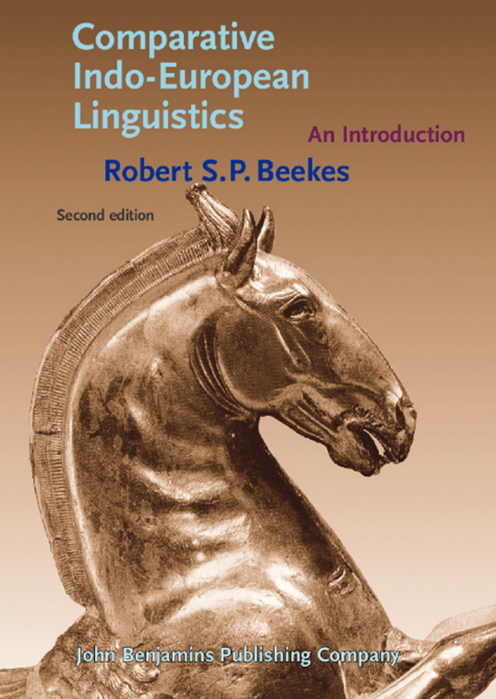

# Front matter

<!-- pdf-page: 1 -->

<!-- pdf-page: 2 -->

Comparative Indo-European Linguistics

<!-- pdf-page: 3 -->

<!-- pdf-page: 4 -->

Comparative Indo-European Linguistics

An introduction Second edition

Robert S.P. Beekes

Revised and corrected by

Michiel de Vaan

John Benjamins Publishing Company

Amsterdam / Philadelphia

<!-- pdf-page: 5 -->

The paper used in this publication meets the minimum requirements of American National Standard for Information Sciences – Permanence of Paper for Printed Library Materials, ansi z39.48-1984.

TM

Library of Congress Cataloging-in-Publication Data

Beekes, R. S. P. (Robert Stephen Paul) [Vergelijkende taalwetenschap. English] Comparative Indo-European linguistics : an introduction / Robert S.P. Beekes ; revised and

corrected by Michiel de Vaan. -- Rev. ed. p. cm. Includes bibliographical references and index. 1. Indo-European languages--Grammar, Comparative. 2. Comparative linguistics. 3. Historical

linguistics. I. Vaan, Michiel Arnoud Cor de, 1973-

P575.B4413 2011 410--dc23 isbn 978 90 272 1186 6 (pb) / isbn 978 90 272 1185 9 (hb) (alk. paper) isbn 978 90 272 8500 3 (eb)

© 2011 – John Benjamins B.V. No part of this book may be reproduced in any form, by print, photoprint, microfilm, or any other means, without written permission from the publisher.

John Benjamins Publishing Co. · P.O. Box 36224 · 1020 me Amsterdam · The Netherlands John Benjamins North America · P.O. Box 27519 · Philadelphia pa 19118-0519 · usa

<!-- pdf-page: 6 -->

Table of contents

Preface xv

Preface to the Second Edition xix

List of Abbreviations xxi Languages xxi Other abbreviations xxii

Transcription xxiii

List of Exercises xxiv

Part I. General section

chapter 1
Introduction
## 1.1 Historical and comparative linguistics 3
## 1.2 Comparative linguistics 3
## 1.3 The language families of the world 5
### 1.3.1 The Old World 5
### 1.3.2 The New World 8

chapter 2
The Indo-European Family of Languages
## 2.1 The genesis of comparative linguistics 11
## 2.2 The discovery of the Indo-European family of languages 13
## 2.3 The Indo-European languages 17
### 2.3.1 Indo-Iranian 17
### 2.3.2 Tocharian 19
### 2.3.3 Armenian 20
### 2.3.4 The Anatolian languages 20
### 2.3.5 Phrygian 22
### 2.3.6 Balto-Slavic 22
### 2.3.7 Thracian 23
### 2.3.8 Macedonian 23

<!-- pdf-page: 7 -->

### 2.3.9 Greek 24
### 2.3.10 Illyrian 24
### 2.3.11 Messapian 25
### 2.3.12 Albanian 25
### 2.3.13 Venetic 25
### 2.3.14 Italic 25
### 2.3.15 Celtic 27
### 2.3.16 Lusitanian 28
### 2.3.17 Germanic 28
### 2.3.18 Summary 30
## 2.4 The splitting up of Proto-Indo-European; dialects 30
## 2.5 Indo-Uralic; the Nostratic theory 31

chapter 3
The Culture and Origin of the Indo-Europeans
## 3.1 The culture of the Indo-Europeans 35
### 3.1.1 Material culture 35
### 3.1.2 Organization and religion 39
## 3.2 Poetry 42
### 3.2.1 An Indo-European poetic language 42
### 3.2.2 Indo-European metrics 43
## 3.3 The arrival of the Indo-Europeans 45
## 3.4 The origin of the Indo-Europeans 48

chapter 4
Sound Change
## 4.1 The sound law: The ‘Ausnahmslosigkeit’ 55
## 4.2 Sporadic sound changes 57
## 4.3 The sound laws: Place and time (isoglosses and relative chronology) 58
## 4.4 The sound law: Conditioning 58
## 4.5 The sound law: Formulation 60
## 4.6 Phonemicization of changes 60
## 4.7 Types of sound change and the phonemic system 61
## 4.8 Phonetic classification of sound changes: Consonants 63
### 4.8.1 Assimilation 63
### 4.8.2 Deletion 64
### 4.8.3 Insertion 64
### 4.8.4 Dissimilation 64
### 4.8.5 Metathesis 64
## 4.9 Phonetic classification of sound changes: Short vowels 65
## 4.10 Phonetic classification of sound changes: Long vowels and diphthongs 67
## 4.11 Causes of sound change 69

<!-- pdf-page: 8 -->

Language change

chapter 5
Analogy
## 5.1 Introduction 75
## 5.2 Proportional analogy 75
## 5.3 Non-proportional analogy: Leveling 76
## 5.4 Replacement, secondary function and split 78
## 5.5 Analogy and sound law 78
## 5.6 Model and motive 79
## 5.7 The regularity of analogy: Direction 80
## 5.8 The regularity of analogy: Change or no change 81
## 5.9 The limits of analogy 82

chapter 6
Other Form-Changes
## 6.1 Additions 83
## 6.2 Adopted forms 83
## 6.3 The creation of new formations 84

chapter 7
Vocabulary Changes
## 7.1 Introduction 85
## 7.2 The disappearance of old words and the appearance of new ones 86
## 7.3 Changes of meaning: Reduction or expansion of features 88
## 7.4 Changes of meaning: Other cases 89
## 7.5 Causes: Wörter und Sachen 90
## 7.6 Other causes 91

chapter 8
Morphological and Syntactic Change
## 8.1 Introduction 93
## 8.2 Morphological change 93
### 8.2.1 The disappearance of morphological categories 93
### 8.2.2 The rise of new categories 94
### 8.2.3 Change 96
## 8.3 Syntactic change 96
## 8.4 Causes 98

<!-- pdf-page: 9 -->

Reconstruction

chapter 9
Internal Reconstruction
## 9.1 Introduction 99
## 9.2 Examples 99
## 9.3 Vowel alternation (Ablaut) 100
## 9.4 The laryngeal theory 102
## 9.5 The place of internal reconstruction 103

chapter 10
The Comparative Method 107
## 10.1 Introduction 107
## 10.2 Voiced stops in Avestan 109
## 10.3 OCS nebese – Gr. népheos 110
## 10.4 The passive aorist of Indo-Iranian 112
## 10.5 The middle participle 113

Part II. Comparative Indo-European Linguistics

Phonology

chapter 11
The Sounds and the Accent
## 11.1 The PIE phonemic system 119
## 11.2 Preliminary remarks on ablaut 120
## 11.3 The stops 121
### 11.3.1 Labials and dentals 121
### 11.3.2 Palatals, velars and labiovelars 122
### 11.3.3 The three velar series 124
### 11.3.4 Centum and satem languages 126
### 11.3.5 The voiceless aspirates 127
### 11.3.6 The glottalized consonants 128
### 11.3.7 Grassmann’s and Bartholomae’s Laws 129
### 11.3.8 The Germanic and the High German sound shifts 130
### 11.3.9 Skt. ks ̣ — Gr. kt etc. 135
## 11.4 PIE *s 137
## 11.5 The sonants 137
### 11.5.1 r, l, m, n, i, u as consonants; Sievers’ Law 138
### 11.5.2 r, l, m, n, i, u as vowels 139

<!-- pdf-page: 10 -->

## 11.6 The vowels 141
### 11.6.1 The short vowels (*e, *o) 141
### 11.6.2 No PIE *a 141
### 11.6.3 The long vowels (*ē, *ō) 143
## 11.7 The diphthongs 143
### 11.7.1 The short diphthongs 143
### 11.7.2 The long diphthongs 144
## 11.8 The laryngeals 146
### 11.8.1 Laryngeal between consonants 148
### 11.8.2 Laryngeal before consonant at the beginning of the word 148
### 11.8.3 Laryngeal before vowel 148
### 11.8.4 Laryngeal after vowel before consonant 149
### 11.8.5 Laryngeal after sonant 151
### 11.8.6 Laryngeal before sonant 152
## 11.9 Accentuation 154
### 11.9.1 Introduction 154
### 11.9.2 The Indo-European languages 154
### 11.9.3 Sanskrit, Greek and Germanic 155
### 11.9.4 Balto-Slavic 156
### 11.9.5 PIE a tone language? 159
## 11.10 From Proto-Indo-European to English 162
### 11.10.1 The consonants 163
### 11.10.2 The vowels 165

Morphology

chapter 12
Introduction
## 12.1 The structure of the morphemes 171
### 12.1.1 The root 171
### 12.1.2 The suffixes 172
### 12.1.3 The endings 172
### 12.1.4 Pronouns, particles, etc. 172
### 12.1.5 Pre‑ and infixes 172
### 12.1.6 Word types 173
## 12.2 Ablaut 174
### 12.2.1 Introduction 174
### 12.2.2 The normal series 174
### 12.2.3 Ablaut with laryngeals 174

<!-- pdf-page: 11 -->

### 12.2.4 The place of the full grade 175
### 12.2.5 The function of the ablaut 176
## 12.3 The origin of the ablaut 176

chapter 13
The Substantive
## 13.1 Word formation 179
### 13.1.1 Root nouns 179
### 13.1.2 Derived nouns 180
### 13.1.3 Reduplicated nouns 183
### 13.1.4 Compounds 183
## 13.2 Inflection 185
### 13.2.1 The type of the Indo-European inflection 185
### 13.2.2 Case and number 185
### 13.2.3 Gender 189
### 13.2.4 The inflectional types 190
### 13.2.5 The hysterodynamic inflection 193
a.	 n-stems 193
b.	 r-stems 194
c.	 l-stems 195
d.	 m-stems 195
e.	 t-stems 196
f.	 nt-stems 196
g.	 s-stems 197
h.	 i-stems 198
i.	 u-stems 199
j.	 laryngeal stems 199
h₁-stems 199
h₂-stems (the ā-stems) 199
i-stems (type vr̥kī́ḥ) 201
u-stems 201
### 13.2.6 The proterodynamic inflection 201
a. 	 i and u-stems 202
b.	 laryngeal stems 204
h₂-stems 204
ih₂-stems (devī́) 204
c.	 s-stems 204
d.	 n-stems 205
e.	 r/n-stems (and l/n) 206
### 13.2.7 The static inflection 206

<!-- pdf-page: 12 -->

### 13.2.8 Root nouns 207
a.	 Static 209
b.	 Hysterodynamic 209
### 13.2.9 The o-stems 211
### 13.2.10 The historical relation between the inflectional types 214
### 13.2.11 The dual 216

chapter 14
The Adjective
## 14.1 Stems 219
## 14.2 Feminine and neuter 220
## 14.3 Inflection 221
## 14.4 Comparison 221

chapter 15
The Pronoun
## 15.1 Introduction 225
## 15.2 The non-personal pronouns 225
### 15.2.1 The demonstratives 225
### 15.2.2 The interrogative and indefinite pronouns 227
### 15.2.3 The relatives 231
## 15.3 The personal pronouns 232
### 15.3.1 The (non-reflexive) personal pronoun 232
### 15.3.2 The reflexive 234
### 15.3.3 The possessives 235

chapter 16
The Numerals
## 16.1 The cardinal numbers 237
### 16.1.1 From ‘one’ to ‘ten’ 237
### 16.1.2 From ‘eleven’ to ‘nineteen’ 240
### 16.1.3 The decimals 240
### 16.1.4 From ‘hundred’ to ‘thousand’ 240
## 16.2 The ordinal numbers 241
## 16.3 Collective adjectives 242
## 16.4 Adverbs 242
## 16.5 Compounds 242

chapter 17
Indeclinable Words
## 17.1 Adverbs 245
### 17.1.1 Introduction 245

<!-- pdf-page: 13 -->

### 17.1.2 Cases of substantives and adjectives 245
### 17.1.3 Substantives and adjectives with a suffix 246
### 17.1.4 Syntactic groups 247
### 17.1.5 The later prepositions and preverbs 247
## 17.2 Negation particles 248
## 17.3 Particles 249
## 17.4 Conjunctions 249
## 17.5 Interjections 250

chapter 18
The Verb
## 18.1 General 251
### 18.1.1 Introduction 251
### 18.1.2 The augment 252
### 18.1.3 Reduplication 251
## 18.2 The present 254
### 18.2.1 Stem formation 254
a.	 Root presents 254
b.	 Reduplicated presents 255
c.	 Suffix -ei/i- 255
d.	 Suffix -ehi- 256
e.	 Suffix -sk- 257
f.	 Suffix -s- 257
g.	 Other suffixes 257
h.	 Other presents 258
### 18.2.2 Personal endings 258
a.	 The Athematic Endings (of the Present and Aorist) 259
b.	 The Thematic Endings 260
### 18.2.3 Inflection 261
## 18.3 The aorist 262
### 18.3.1 Stem formation 262
a.	 The Root Aorist 262
b.	 The Thematic Aorist 263
c.	 The s- (sigmatic) Aorist 263
### 18.3.2 Personal endings 263
### 18.3.3 Inflection 263
## 18.4 The perfect 264
### 18.4.1 Stem formation 264
### 18.4.2 Personal endings 264
### 18.4.3 Inflection 265

<!-- pdf-page: 14 -->

## 18.5 The middle 267
### 18.5.1 Stem formation 267
### 18.5.2 Personal endings 267
### 18.5.3 Inflection 269
## 18.6 The dual 270
## 18.7 The static inflection 271
## 18.8 The moods 272
### 18.8.1 The indicative 272
### 18.8.2 The injunctive 273
### 18.8.3 The subjunctive 273
### 18.8.4 The optative 274
### 18.8.5 The imperative 276
## 18.9 The nominal forms 279
### 18.9.1 The participles 279
### 18.9.2 The verbal adjective 280
### 18.9.3 The verbal nouns and the infinitives 280
## 18.10 The PIE verbal system 282
## 18.11 A paradigm as example 284
## 18.12 Schleicher’s fable 287

Appendix
I.
Key to the exercises 289
II.	 Phonetics 298
III.	List of Terms 301

Bibliography

I.
General introduction 311
I.1
The language families of the world 311
I.2
Linguistic surveys of modern Indo-European languages 313
I.3
History and culture of the Indo-European peoples 313
I.3.1
Material and spiritual culture of the Indo-Europeans 313
I.3.2
History and religion of the IE peoples 314
II.	 Language change 316
II.1
Historiography of linguistics 316
III.	Indo-European Linguistics 317
III.1
Introductions, grammars and dictionaries 317
III.2	 The reconstruction of PIE 330
III.3
Reviews of the first edition 341
III.4	 Translations of the first edition 342

<!-- pdf-page: 15 -->

Maps

Illustrations

Indexes

<!-- pdf-page: 16 -->

Preface

The Germanic languages, of which English is also a member, are related to many other languages, such as Sanskrit of ancient India, Russian, Irish, Albanian and Armenian. The Gothic word gasts, which means ‘guest,’ is very similar to German Gast, while English guest is a loan-word from Norwegian. It is related to Latin hostis, which means ‘enemy.’ The explanation for this is that the word originally meant ‘stranger’ and a stranger was usually considered an enemy. Still, when a stranger crossed the threshold into your home, he had the right to your protection. The Latin word continues to live in the English word hostile. In Serbo-Croatian we see it in gostionica, ‘inn.’ Words such as cardiology and cardiogram are well-known. They contain the Greek word for ‘heart’ which also happens to be related to the English word, as well as to Latin cor, cordis which we know from English cordial(ity). These are just a few examples of what comparative linguistics has to teach us. This book has been written to explain what comparative linguistics is, what methods it uses and what its current ‘state of the art’ happens to be. Our own method for explaining this will be by means of illustrations drawn from the whole field of comparative Indo-European linguistics. The comparative linguistics of the Indo-European languages has been, without doubt, more exhaustively studied than any other. English belongs to this family, and we shall be regularly describing English words. At the same time, though many Greek and Latin words will also be described in this book, readers who have never studied either of these languages will still be able to recognize many of them. Latin, after all, does continue to live on in French (and in Italian, Spanish and so forth). Besides, there are very many loan-words which English has borrowed from Greek and from Latin, especially in the sciences, an example of which we have already seen in cardiology and cardiogram. The fascinating thing about comparative linguistics is that such an enormous variety can be traced back to just one common origin. Not less exciting is that research in comparative linguistics takes us to other countries and other times. In this book we shall not only be looking closely at etymology (the history of words), but also at the structure of the Indo-European languages. We will see that developments within languages are often possible to follow down to the smallest details. Another thing which this book does is to present a survey of the newest insights in the field of Indo-European linguistics. Although this subject has already existed for

<!-- pdf-page: 17 -->

two hundred years, it has enjoyed an accelerated development especially in the last decades. New theories are always springing up and new discoveries are continually being made. Some of these discoveries have taken a physical form, as when new inscriptions are found or even new (old) manuscripts, such as the Old Church Slavonic manuscripts which were discovered in the St. Catherine monastery in the Sinai in 1975. But most progress is made because research in one area in one language always sheds light on other areas and other languages. Comparative linguistics is one enormous floor-puzzle wherein we are continually busy not only finding more and more pieces, but are also becoming increasingly successful in putting them in their proper places, so that the ‘great picture’ becomes clearer and clearer as we go along. This book gives an interrelated overview of the recent developments which have been made in putting the puzzle together. In fact, it presents the first systematic treatment of the whole Indo-European family of languages which has ever been published in English. The book consists of two parts, the first of which is general in nature. Here, after a short introduction, the Indo-European languages are described, after which a chapter follows on the culture and the origin of the speakers of the common language from which the whole Indo-European group is derived. This is followed by a general introduction to the subject of language-change in which various changes of sound, form, vocabulary and sentence structure are all dealt with one by one. In each case, an attempt is made to illustrate by means of examples in the hope that these will speak for themselves. My hope is that the reader hereby will slowly but surely begin to feel more and more comfortable with the material being presented. Among the examples are some of the more complicated ones, too, because a first introduction may not create the impression that everything to follow is going to be equally easy. In the last two chapters I try to show how comparative linguists, using their expert knowledge of language-change, go about their work, how they use language to reconstruct the history of language. The second part of this book is a systematic description of the results which a comparison of the Indo-European languages has so far provided us with. Here we do not give examples, but rather a full and complete description of the structure of the languages in the Indo-European family. At the end of the book the reader will find an appendix containing a.) a survey of the sound developments in Albanian; b.) a short chapter on phonetics; c.) a list explaining the technical terms which I have used throughout; d.) a bibliography (with a general Section and another (I.) on special problems). The book contains a number of illustrations with examples from different languages, as well as some relevant maps. Finally, an index has been included which makes it possible to locate words either according to their meaning or to their form.

<!-- pdf-page: 18 -->

This book is a revision of the original book, Vergelijkende taalwetenschap, which was published in 1990 by Het Spectrum (Aula paperback), in Utrecht, the Netherlands. It was written in a direct everyday-dutch; it was intended that this character is preserved in the translation, which was made by Paul Gabriner. It contains a large number of additions and corrections. Sections 3.3 and 3.4 were largely rewritten after Mallory’s book on the origin of the Indo-Europeans was published. I wish to thank my colleagues F.H.H. Kortlandt, A. Lubotsky, J.J.S. Weitenberg and P. Schrijver and other colleagues of the Institute for Descriptive and Comparative Linguistics of Leiden University for their helpful remarks and in general their immensely stimulating cooperation and their personal friendship. I am indebted to my Leiden colleague, Dr. Rolf H. Bremmer, from the English Department, who wrote Section 11.11 which treats the sound changes from Proto-Indo-European to modern English. For the appendix on Albanian I am much obliged to Dr. Bardhyl Demiraj, from Tirana, who worked in Leiden on his etymological dictionary of Albanian, and our project of making a new general etymological dictionary of Indo-European, a ‘new Pokorny’. It goes without saying that the results as here published are no one’s responsibility but my own, and that, considering the vast nature of the subject, mistakes are almost inevitable. Much remains that is uncertain and, therefore, also open to differences of opinion. The John Benjamins Company/ The editor prepared the book with much care. I give my thanks especially to Mrs. Y. de Lusenet for her cooperation. I want to thank Mrs. drs. Geke Linker for reading the proofs of this complicated text.

Robert S.P. Beekes

<!-- pdf-page: 19 -->

<!-- pdf-page: 20 -->

Preface to the Second Edition

The first edition of this book was both acclaimed and heavily criticized, sometimes by the same reviewer in the same review. A list of reviews of the first edition is provided at the end of the bibliography. The critics rightly saw that the book has a twofold character: on the one hand, it seeks to provide a general introduction to language reconstruction, on the other hand, it wants to present a full picture of the way Proto-Indo-European should be reconstructed according to the author. As a result the pre-sentation of both themes is often very succinct, to the point that it can be hard for beginners to understand what the author means. Another point of criticism was the particular brand of Indo-European reconstruction, the so-called “Leiden school”, and the fact that the author does not provide references for many claims which deviate from the received opinion of 1995. Furthermore, the English translation of Beekes’ Dutch original from 1990 betrays a lack of understanding of the topic on behalf of the translator. This explains many un-English formulations and some real missers. Finally, the first edition contains a high number of printing errors, Since 1995, a significant number of introductions to Indo-European has appeared, including two in English. None of them, however, are similar in character or ideas to Beekes’ text, which is why a second edition is justified. As the main competitors on the market I regard Meier-Brügger (2010) and Fortson (2004), see further in the bibliography. The main aims of this second edition are to remedy the typos and translation errors of the first, to add some explanations to really difficult passages of the original, and to add exercises so as to enable students to practise the reconstruction of PIE. Exercises have been added for Chapters 11 to 18, and the solutions are given in the appendix. Many of these exercises have been used by myself and other colleagues in introductions to Indo-European taught in Leiden, but I have also added some new ones in order to achieve a more balanced distribution across the different chapters. I expect that the exercises will be fruitful particularly in combination with expert teaching. Teachers can easily adapt the solutions to fit their own view of PIE reconstruction. A mere subsidiary aim of this edition is the modernization of the contents — after all, Indo-European studies has progressed in the past 15 years — and the bibliography. In order to fully modernize and rewrite the text, as would have been possible in many places, I would have needed much more time. For instance, I have refrained from adding a chapter on the reconstruction of PIE syntax.

<!-- pdf-page: 21 -->

Some elements have been changed more thoroughly. I have taken the liberty to remove the appendix on Albanian, as similar overviews have appeared elsewhere in the last couple of years. Some of the main phonological developments of Albanian appear in the surveys in Chapter 11. I have also removed Section 1.3 of the original (about linguistic disciplines) and 2.3.2 (about Bangani). I have rewritten Sections 2.4–2.7, 4.5, 4.8 and 8.4 of the general part. I have furthermore moved 10.4 (about the PIE velars) of the original book to Chapter 11 (on PIE phonology), and 10.5 (on n-stems) to Chapter 13 (on morphology), since the original placement implied a lot of browsing back and forth in the book. Instead I have added two different case studies to Chapter 10 (10.2 and 10.4). Section 11.3 has been integrated into 11.9 of the original, and Chapter 12 slightly reorganized. I have added paragraphs on Marcus van Boxhorn to Section 2.1, on the Germanic sound shifts to Section 11.3.8, and on vrddhi derivatives and on internal derivation to Section 13.1. The Hittite material has been updated to include the most recent developments (Kloekhorst 2008). At the very end I have added Schleicher’s Fable in the oldest version and the most recent one. The bibliography has been extended and reorganized. The reviewers’ complaint about the lack of references cannot be resolved. To add references to all the claims made would take up a lot of space and it would also reduce the primarily didactic character of the book. All main ideas about the way PIE is to be reconstructed according to the Leiden school can be found in Section III.2 of the bibliography. For all purposes, then, those may be regarded as the main references. Many people have assisted in the preparation of this edition. Many students have unwittingly provided assistance by testing the exercises, both our regular BA and MA students and the international participants in various Leiden Summer Schools in IE linguistics. Sean Vrieland (Leiden) has corrected the English spelling of the original. My colleagues Alwin Kloekhorst, Frederik Kortlandt and Alexander Lubotsky have helped me reformulate bits and pieces of the original text and add some new features. Eithne Carlin (native American languages), Maarten Kossmann (African languages) Leonid Kulikov (Indo-Aryan), Hrach Martirosyan (Armenian), and Michaël Peyrot (Tocharian) have contributed to the bibliography. I thank the John Benjamins Publishing Company for providing us with the opportunity for this second edition; the editor, Anke de Looper, has made the editorial process easier in various ways. Finally, I am very grateful to Robert Beekes for giving me carte blanche in changing his original text.

Leiden, April 2011 Michiel de Vaan

<!-- pdf-page: 22 -->

List of Abbreviations

Languages

Aeol.
Aeolic
Alb.
Albanian
Arm.
Armenian
Att.
Attic
Av.
Avestan
Bl.
Baltic
Boeot.
Boeotian
Bret.
Breton
BSl.
Balto-Slavic
Corn.
Cornish
Cret.
Cretan
Dor.
Doric
Du.
Dutch
E.
English
Fr.
French
Fri.
Frisian
G.
German
Gaul.
Gaulish
Gmc.
Germanic
Goth.
Gothic
Gr.
Greek
Hebr.
Hebrew
Hitt.
Hittite
Hom.
Homeric Greek
IE
Indo-European
IIr.
Indo-Iranian
Ill.
Illyrian
Ion.
Ionian
Ital.
Italic
Lat.
Latin
Latv.
Latvian
Lesb.
Lesbian
Lith.
Lithuanian
Luw.
Luwian
Lyc.
Lycian
Lyd.
Lydian

Μ
Middle‑
MCo(rn).	 Middle Cornish
MLG
Middle Low German
MW
Middle Welsh
Myc.
Mycenaean
NHG
New High German
O
Old‑
OAtt.
Old Attic
OAv.
Old Avestan
OCS
Old Church Slavonic
OE
Old English
OFri.
Old Frisian
OHG
Old High German
OIc.
Old Icelandic
OIr.
Old Irish
OLat.
Old Latin
OLith.
Old Lithuanian
OLFr.
Old Low Franconian
ON
Old Norse
OP
Old Persian
OPr.
Old Prusssian
ORuss.
Old Russian
OS
Old Saxon
Osc.
Oscan
Osset.
Ossetic
OW
Old Welsh
Ρ
Proto‑
Pamph.	 Pamphylian
PBl.
Proto-Baltic
PCl.
Proto-Celtic
PGmc.
Proto-Germanic
Phr.
Phrygian
PIE
Proto-Indo-European
PII
Proto-Indo-Iranian
PIr.
Proto-Iranian
PIt.
Proto-Italic

<!-- pdf-page: 23 -->

PToch.
Proto-Tocharian
Russ.
Russian
SCr.
Serbo-Croatian
Skt.
Sanskrit
Sl(av).
Slavic
Slov.
Slovenian

Thrac.
Thracian
Toch.
Tocharian
Umbr.
Umbrian
Ven.
Venetic
W.
Welsh
YAv.
Young Avestan

Other abbreviations

abl.
ablative
acc.
accusative
act.
active
adj.
adjective
adv.
adverb
anal.
analogy, analogically
aor.
aorist
AP
accent paradigm
cf.
compare
cons.
consonant
dat.
dative
dem.
demonstrative
du.
dual
f(em).
feminine
fut.
future
gen.
genitive
ib(id).
in the same place
id.
idem
ill.
illustration
imf.
imperfect
imp.
imperative
ind.
indicative
inf.
infinitive
inj.
injunctive
ins(tr).
instrumental case
intrans.	 intransitive
loc.
locative
m(asc).
masculine

med.
medium, middle
nom.
nominative
n(tr).
neuter
opt.
optative
pass.
passive
pf.
perfect
pl.
plural (1 pl., 2 pl., 3 pl. = 1st, 2nd, 3rd
person plural)
ppf.
pluperfect
pr(es).
present tense
pret.
preterite
ptc.
participle
RV
Rigveda
sg.
singular (1 sg., 2 sg., 3 sg. = 1st, 2nd,
3rd person singular)
subj.
subjunctive
subst.
substantive
trans.
transitive
vb.
verb
voc.
vocative

>
becomes
<
derives from
*
(before a word) reconstructed form
¯
long vowel
˘
short vowel
Ø
zero

<!-- pdf-page: 24 -->

Transcription

The Indo-European languages are transcribed in this book in the Latin alphabet. But the reader must know which sound is represented by which character in a given language, for this can change from language to language. For the sounds, see further the Phonetics section and the Explanatory List of Words in the Appendix. (Note that in this book the vowels a, e, i have the same value as in the continental languages, i.e., as in card, bait, see, respectively.)

Sanskrit: ṭ etc. are retroflexes; c = [tš], j = [dž]; ś (formerly ç) = š; ‑ḥ is a voiceless h; r̥ is vocalic r; ṃ or ṁ: nasalization of the preceding vowel. e and ο are long vowels, ai and au are long diphthongs.

Avestan: ą nasalized a; ā̊ as in broad, x as ch in Scottish Loch, ϑ = [ϑ]; β, δ, γ voiced fricatives; c, j (formerly č, ǰ) as in Sanskrit; ń, ŋ́, x́ palatalized n, ŋ, x; ‑t̰ is an unreleased (i.e., the first part of) t; y and v are written ii and uu word-internally.

Old Persian: c, j, see Sanskrit; ϑ also þ = [ϑ]; x (also ḫ) as in Avestan; ç maybe as Czech ř.

Old Church Slavonic: ě = [ε]; ę, ǫ nasalized e, o; ь, ъ as in pit, cut; c = [ts], č = [tš], x see Avestan.

Lithuanian: ė long, closed e; ę, ą, long æ, a; y = ī; ie formerly ë, uo formerly ů; š formerly sz, č formerly cz.

Armenian: p‘ etc. = [ph]; c = [ts], j = [dz], c‘ = [tsh] (formerly c̣), č = [tš], ǰ = [dž], č‘ = [tšh] (formerly c̣c); r̄ = rr (formerly ṙ).

Albanian: ë = [ə], y = [ü]; th = [ϑ], dh = [δ]; c = [ts], x = [dz]; ç = [tš], xh = [dz]; q = [c], a voiceless palato-alveolar stop, gj = its voiced counterpart.

Hittite: s also written š; z = [ts]; h also ḫ = [x].

Tocharian: a = [ə], ā = [a], ä = [ɪ]; further as Sanskrit.

Old Irish: c = [k], á etc. long a; iC = C⁜y (palatalized consonant).

Welsh: ll is a voiceless fricative l whereby air escapes on one side.

Gothic: ei = ī; ai, au (also aί, aú) = [ε, ɔ] before r, h, hw; hw = [xw].

<!-- pdf-page: 25 -->

List of Exercises

Section	 Exercise	 On
### 11.3.1 labial & dental obstruents
### 11.3.2 all obstruents
### 11.3.7 Grassmann & Bartholomae
### 11.3.8 4–8
Germanic sound shifts
132–135
### 11.3.9 obstruent clusters
## 11.5 sonants
## 11.7 11–12
vowels & diphthongs
### 11.8.4 13–14
laryngeals
### 11.8.6 15–16
laryngeal before/after sonant
## 11.9 17–23
repetition of PIE phonology
160–162
## 12.1 PIE root structure
## 12.2 ablaut grades
## 12.3 origin of ablaut
## 13.1 27–28
derivatives & compounds
184–185
### 13.2.4 29–32
nominal endings & inflectional types
192–193
### 13.2.5 33–34
hysterodynamic inflection
201–202
### 13.2.6 35–38
protero‑ and hysterodynamic inflection
206–207
### 13.2.8 39–41
all athematic stems
210–211
### 13.2.9 42–43
o-stems
## 14.4 44–47
adjectives
## 15.2 48–49
non-personal pronouns
231–232
## 15.3 50–52
personal & possessive pronouns
## 16.5 numerals
## 18.2 54–55
present stems & inflection
## 18.4 56–57
verb stems
## 18.5 58–59
active & middle
## 18.8 60–62
verbal endings
278–279
## 18.9 63–64
participles
## 18.11 PIE verbal paradigms
## 18.12 Schleicher’s fable
