# Illustrations

## Illustrations, printed p. 359

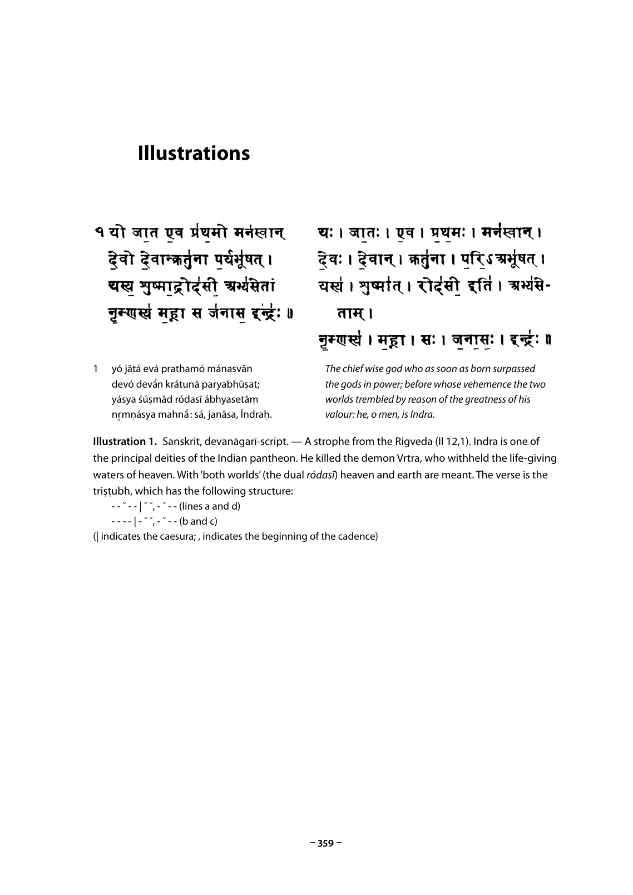

<!-- pdf-page: 384 -->

Illustrations

yó jātá evá prathamó mánasvān
devó devā´n krátunā paryabhūṣat;
yásya śúṣmād ródasī ábhyasetāṃ
nr̥mṇásya mahnā´ : sá, janāsa, Índraḥ.

The chief wise god who as soon as born surpassed
the gods in power; before whose vehemence the two
worlds trembled by reason of the greatness of his
valour: he, o men, is Indra.

Illustration 1. Sanskrit, devanāgarī-script. — A strophe from the Rigveda (II 12,1). Indra is one of
the principal deities of the Indian pantheon. He killed the demon Vrtra, who withheld the life-giving
waters of heaven. With ‘both worlds’ (the dual ródasī) heaven and earth are meant. The verse is the
triṣṭubh, which has the following structure:
‑ ‑ ˘ ‑ ‑ | ˘ ˘, ‑ ˘ ‑ ‑ (lines a and d)
‑ ‑ ‑ ‑ | ‑ ˘ ˘, ‑ ˘ ‑ ‑ (b and c)
(| indicates the caesura; , indicates the beginning of the cadence)

## Illustrations, printed p. 360

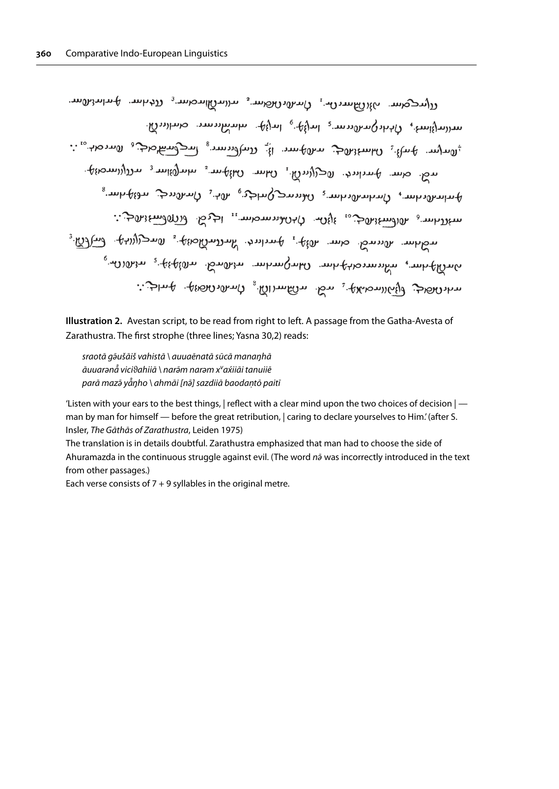

<!-- pdf-page: 385 -->

Illustration 2. Avestan script, to be read from right to left. A passage from the Gatha-Avesta of
Zarathustra. The first strophe (three lines; Yasna 30,2) reads:

sraotā gә¯ušāiš vahistā \ auuaēnatā sūcā manaŋhā
āuuarәnā˚ viciϑahiiā \ narә¯m narәm xvax´iiāi tanuiiē
parā mazә¯ yā˚ŋho \ ahmāi [nә¯] sazdiiā baodaṇtō paitī

‘Listen with your ears to the best things, | reflect with a clear mind upon the two choices of decision | —
man by man for himself — before the great retribution, | caring to declare yourselves to Him.’ (after S.
Insler, The Gāthās of Zarathustra, Leiden 1975)
The translation is in details doubtful. Zarathustra emphasized that man had to choose the side of
Ahuramazda in the continuous struggle against evil. (The word nә¯ was incorrectly introduced in the text
from other passages.)
Each verse consists of 7 + 9 syllables in the original metre.

## Illustrations, printed p. 361

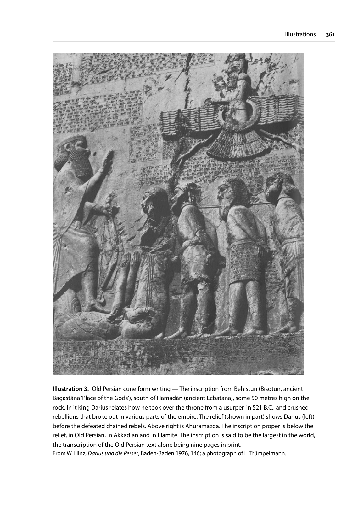

<!-- pdf-page: 386 -->

Illustration 3. Old Persian cuneiform writing — The inscription from Behistun (Bīsotūn, ancient
Bagastāna ‘Place of the Gods’), south of Hamadān (ancient Ecbatana), some 50 metres high on the
rock. In it king Darius relates how he took over the throne from a usurper, in 521 B.C., and crushed
rebellions that broke out in various parts of the empire. The relief (shown in part) shows Darius (left)
before the defeated chained rebels. Above right is Ahuramazda. The inscription proper is below the
relief, in Old Persian, in Akkadian and in Elamite. The inscription is said to be the largest in the world,
the transcription of the Old Persian text alone being nine pages in print.
From W. Hinz, Darius und die Perser, Baden-Baden 1976, 146; a photograph of L. Trümpelmann.

## Illustrations, printed p. 362

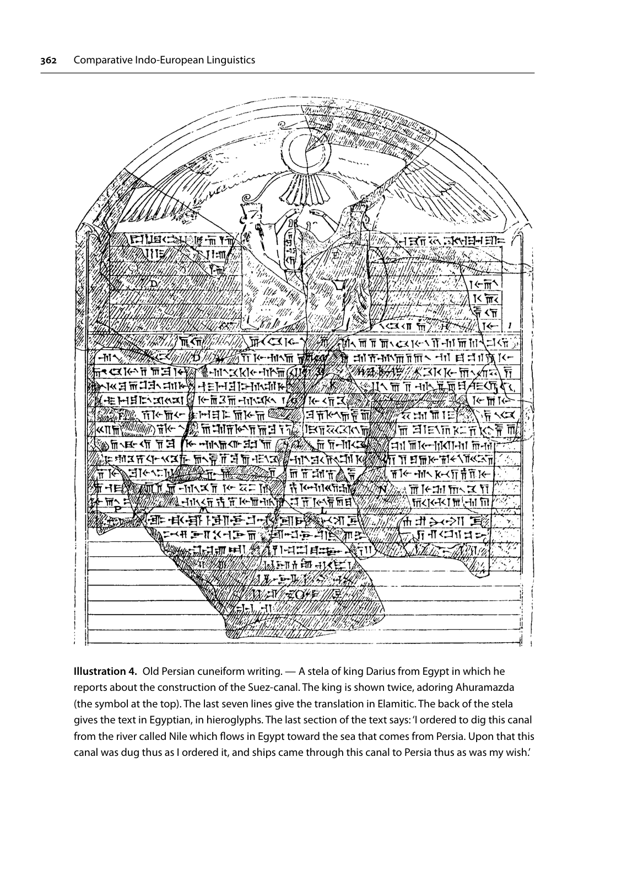

<!-- pdf-page: 387 -->

Illustration 4. Old Persian cuneiform writing. — A stela of king Darius from Egypt in which he
reports about the construction of the Suez-canal. The king is shown twice, adoring Ahuramazda
(the symbol at the top). The last seven lines give the translation in Elamitic. The back of the stela
gives the text in Egyptian, in hieroglyphs. The last section of the text says: ‘I ordered to dig this canal
from the river called Nile which flows in Egypt toward the sea that comes from Persia. Upon that this
canal was dug thus as I ordered it, and ships came through this canal to Persia thus as was my wish.’

## Illustrations, printed p. 363

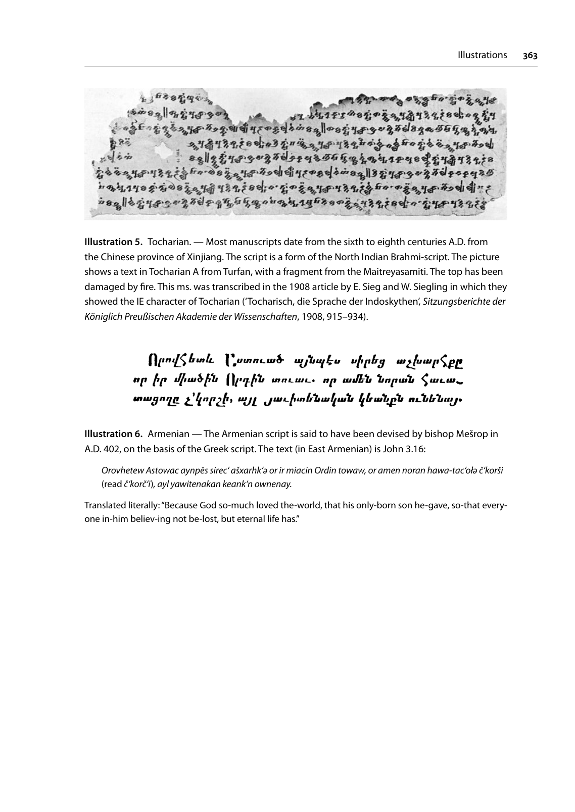

<!-- pdf-page: 388 -->

Illustration 5. Tocharian. — Most manuscripts date from the sixth to eighth centuries A.D. from
the Chinese province of Xinjiang. The script is a form of the North Indian Brahmi-script. The picture
shows a text in Tocharian A from Turfan, with a fragment from the Maitreyasamiti. The top has been
damaged by fire. This ms. was transcribed in the 1908 article by E. Sieg and W. Siegling in which they
showed the IE character of Tocharian (‘Tocharisch, die Sprache der Indoskythen’, Sitzungsberichte der
Königlich Preußischen Akademie der Wissenschaften, 1908, 915–934).

Illustration 6. Armenian — The Armenian script is said to have been devised by bishop Mešrop in
A.D. 402, on the basis of the Greek script. The text (in East Armenian) is John 3.16:

Orovhetew Astowac aynpēs sirec‘ ašxarhk‘ә or ir miacin Ordin towaw, or amen noran hawa-tac‘ołә č‘korši
(read č‘korč‘i), ayl yawitenakan keank‘n ownenay.

Translated literally: “Because God so-much loved the-world, that his only-born son he-gave, so-that every-
one in-him believ-ing not be-lost, but eternal life has.”

## Illustrations, printed p. 364

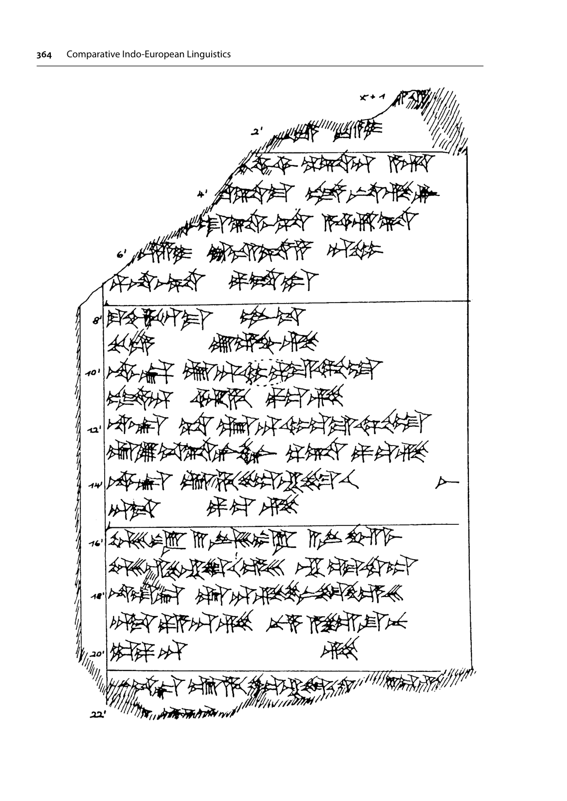

<!-- pdf-page: 389 -->

## Illustrations, printed p. 365

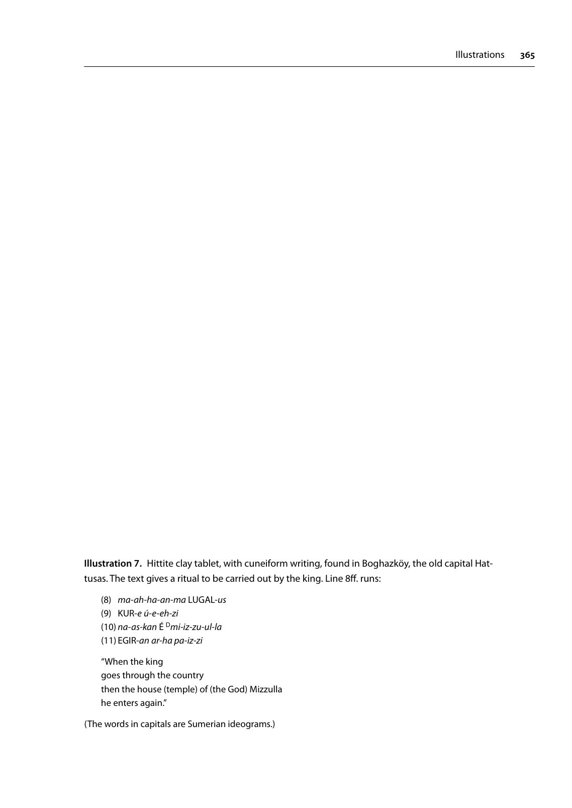

<!-- pdf-page: 390 -->

Illustration 7. Hittite clay tablet, with cuneiform writing, found in Boghazköy, the old capital Hat-
tusas. The text gives a ritual to be carried out by the king. Line 8ff. runs:

(8) ma-ah-ha-an-ma LUGAL-us
(9) KUR-e ú-e-eh-zi
(10) na-as-kan É Dmi-iz-zu-ul-la
(11) EGIR-an ar-ha pa-iz-zi

“When the king
goes through the country
then the house (temple) of (the God) Mizzulla
he enters again.”

(The words in capitals are Sumerian ideograms.)

## Illustrations, printed p. 366

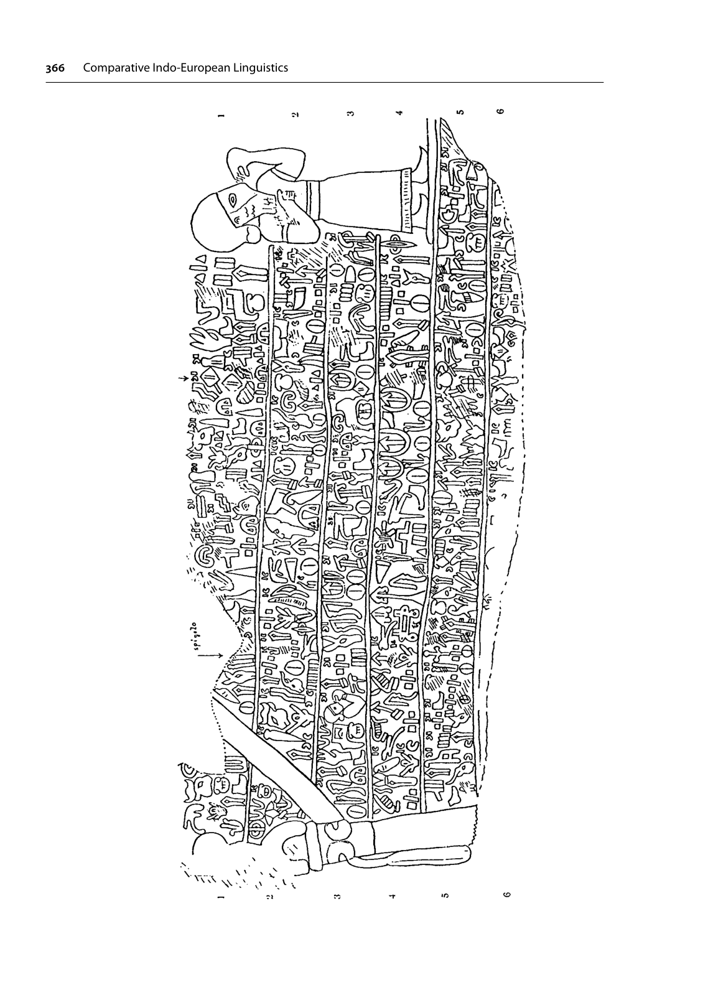

<!-- pdf-page: 391 -->

## Illustrations, printed p. 367

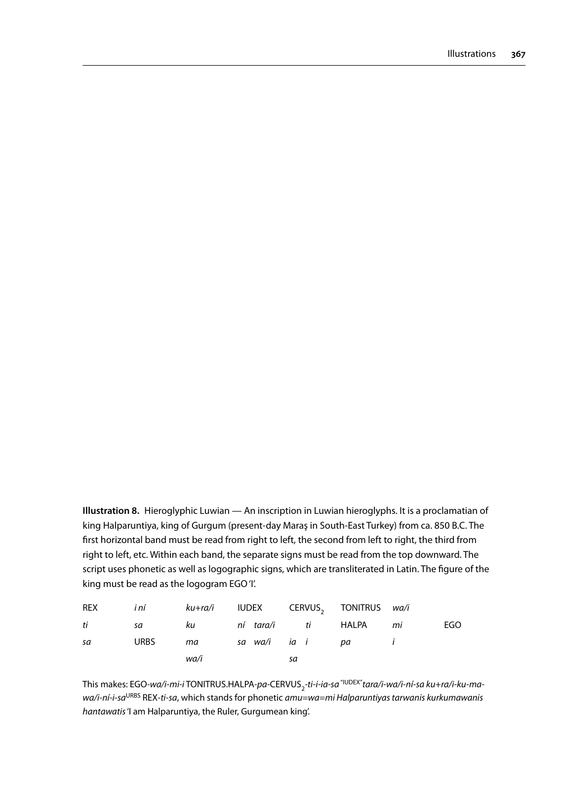

<!-- pdf-page: 392 -->

Illustration 8. Hieroglyphic Luwian — An inscription in Luwian hieroglyphs. It is a proclamatian of
king Halparuntiya, king of Gurgum (present-day Maraş in South-East Turkey) from ca. 850 B.C. The
first horizontal band must be read from right to left, the second from left to right, the third from
right to left, etc. Within each band, the separate signs must be read from the top downward. The
script uses phonetic as well as logographic signs, which are transliterated in Latin. The figure of the
king must be read as the logogram EGO ‘I’.

REX
i ní
ku+ra/i
IUDEX
CERVUS2
TONITRUS
wa/i

ti
sa
ku
ní tara/i
ti
HALPA
mi
EGO

sa
URBS
ma
sa wa/i
ia i
pa
i

wa/i
sa

This makes: EGO-wa/i-mi-i TONITRUS.HALPA-pa-CERVUS2-ti-i-ia-sa “IUDEX”tara/i-wa/i-ní-sa ku+ra/i-ku-ma-
wa/i-ní-i-saURBS REX-ti-sa, which stands for phonetic amu=wa=mi Halparuntiyas tarwanis kurkumawanis
hantawatis ‘I am Halparuntiya, the Ruler, Gurgumean king’.

## Illustrations, printed p. 368

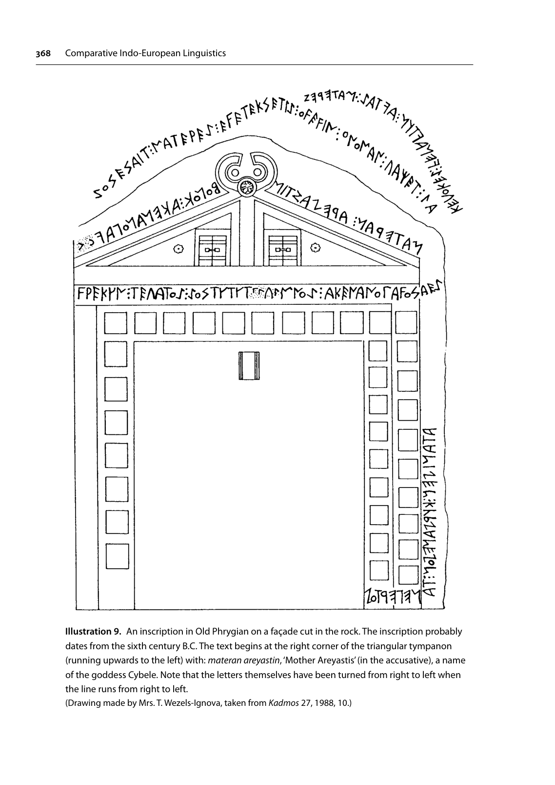

<!-- pdf-page: 393 -->

Illustration 9. An inscription in Old Phrygian on a façade cut in the rock. The inscription probably
dates from the sixth century B.C. The text begins at the right corner of the triangular tympanon
(running upwards to the left) with: materan areyastin, ‘Mother Areyastis’ (in the accusative), a name
of the goddess Cybele. Note that the letters themselves have been turned from right to left when
the line runs from right to left.
(Drawing made by Mrs. T. Wezels-Ignova, taken from Kadmos 27, 1988, 10.)

## Illustrations, printed p. 369

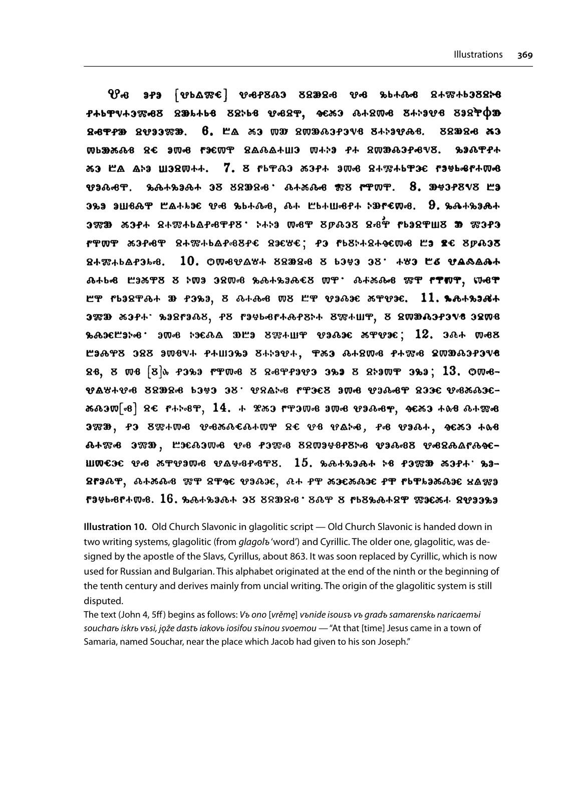

<!-- pdf-page: 394 -->

Illustration 10. Old Church Slavonic in glagolitic script — Old Church Slavonic is handed down in
two writing systems, glagolitic (from glagolъ ‘word’) and Cyrillic. The older one, glagolitic, was de-
signed by the apostle of the Slavs, Cyrillus, about 863. It was soon replaced by Cyrillic, which is now
used for Russian and Bulgarian. This alphabet originated at the end of the ninth or the beginning of
the tenth century and derives mainly from uncial writing. The origin of the glagolitic system is still
disputed.
The text (John 4, 5ff) begins as follows: Vъ ono [vrěmę] vъnide isousъ vъ gradъ samarenskь naricaemъi
soucharь iskrь vъsi, jo˛že dastъ iakovь iosifou sъinou svoemou — “At that [time] Jesus came in a town of
Samaria, named Souchar, near the place which Jacob had given to his son Joseph.”

## Illustrations, printed p. 370

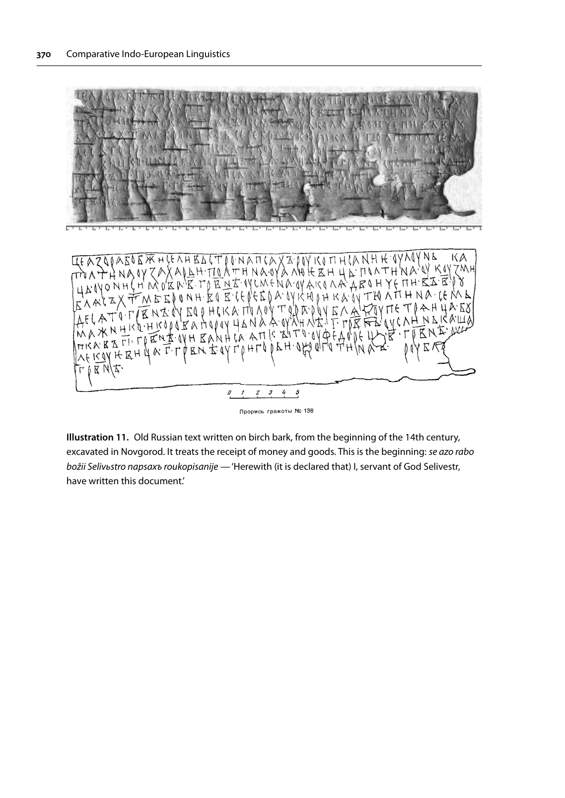

<!-- pdf-page: 395 -->

Illustration 11. Old Russian text written on birch bark, from the beginning of the 14th century,
excavated in Novgorod. It treats the receipt of money and goods. This is the beginning: se azo rabo
božii Selivьstro napsaxъ roukopisanije — ‘Herewith (it is declared that) I, servant of God Selivestr,
have written this document.’

## Illustrations, printed p. 371

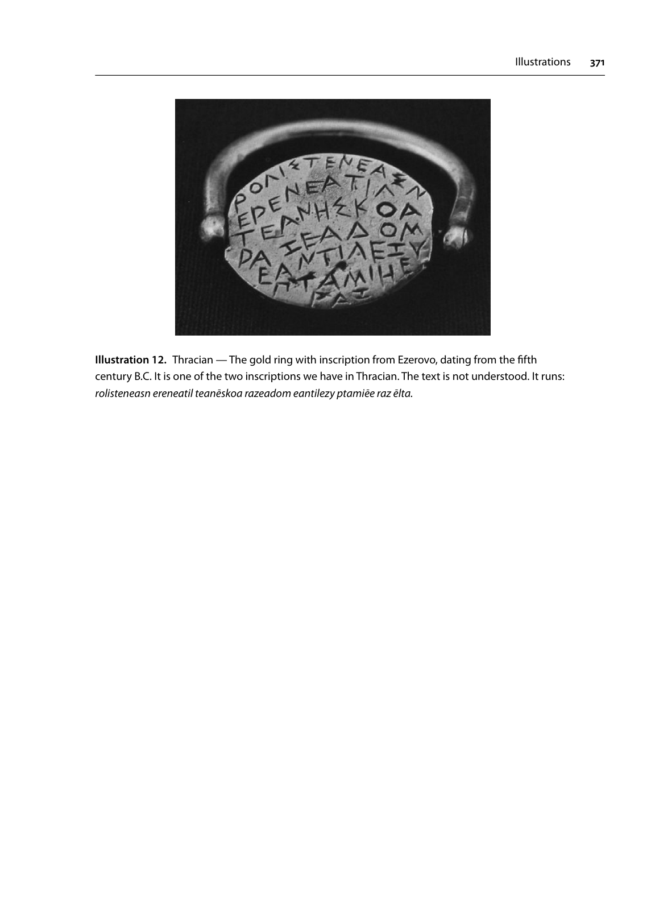

<!-- pdf-page: 396 -->

Illustration 12. Thracian — The gold ring with inscription from Ezerovo, dating from the fifth
century B.C. It is one of the two inscriptions we have in Thracian. The text is not understood. It runs:
rolisteneasn ereneatil teanēskoa razeadom eantilezy ptamiēe raz ēlta.

## Illustrations, printed p. 372

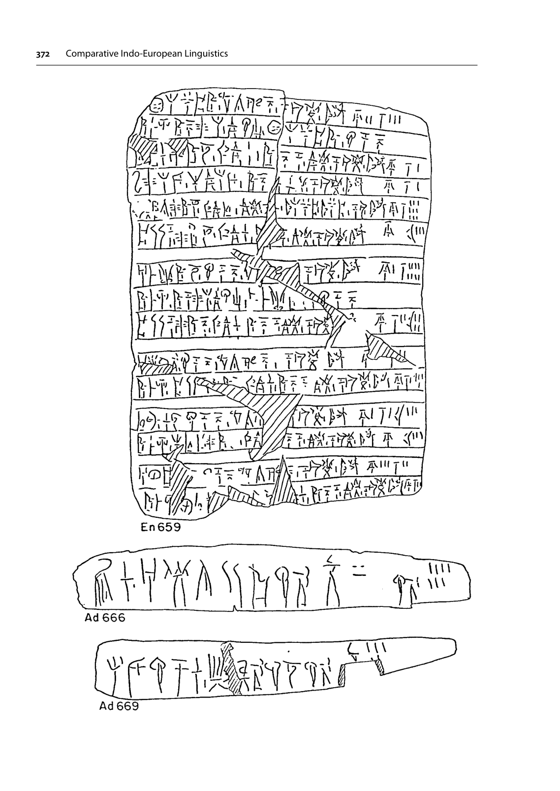

<!-- pdf-page: 397 -->

## Illustrations, printed p. 373

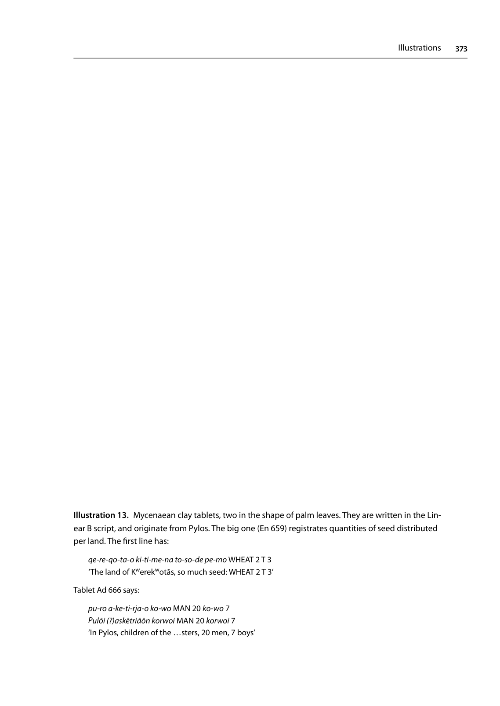

<!-- pdf-page: 398 -->

Illustration 13. Mycenaean clay tablets, two in the shape of palm leaves. They are written in the Lin-
ear B script, and originate from Pylos. The big one (En 659) registrates quantities of seed distributed
per land. The first line has:

qe-re-qo-ta-o ki-ti-me-na to-so-de pe-mo WHEAT 2 T 3
‘The land of Kwerekwotās, so much seed: WHEAT 2 T 3’

Tablet Ad 666 says:

pu-ro a-ke-ti-rja-o ko-wo MAN 20 ko-wo 7
Pulōi (?)askētriāōn korwoi MAN 20 korwoi 7
‘In Pylos, children of the …sters, 20 men, 7 boys’

## Illustrations, printed p. 374

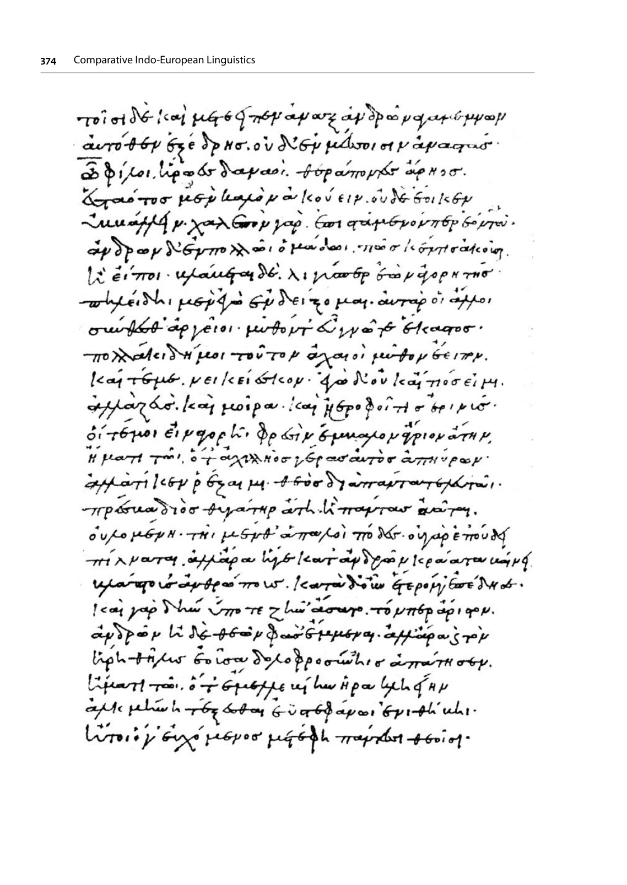

<!-- pdf-page: 399 -->

## Illustrations, printed p. 375

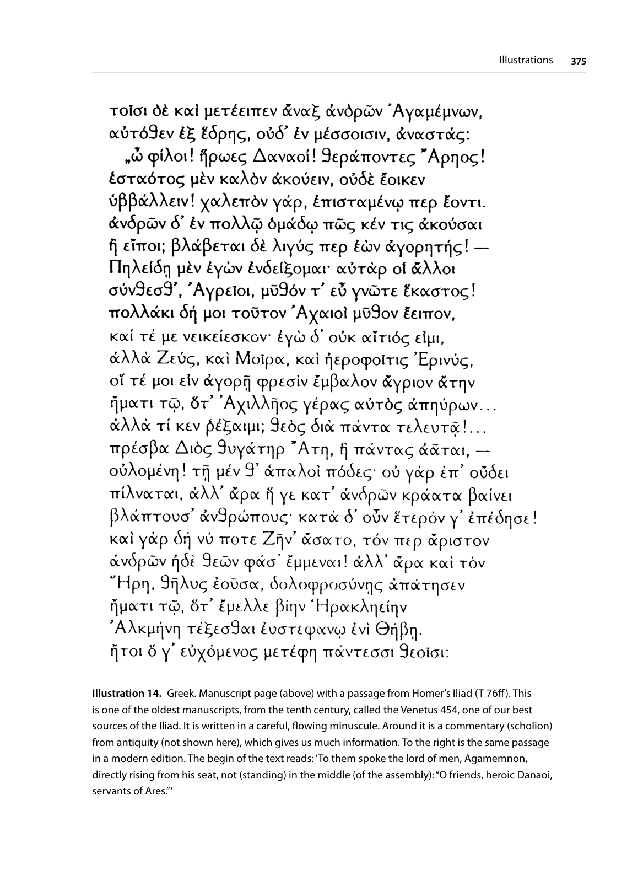

<!-- pdf-page: 400 -->

Illustration 14. Greek. Manuscript page (above) with a passage from Homer’s Iliad (T 76ff). This
is one of the oldest manuscripts, from the tenth century, called the Venetus 454, one of our best
sources of the Iliad. It is written in a careful, flowing minuscule. Around it is a commentary (scholion)
from antiquity (not shown here), which gives us much information. To the right is the same passage
in a modern edition. The begin of the text reads: ‘To them spoke the lord of men, Agamemnon,
directly rising from his seat, not (standing) in the middle (of the assembly): “O friends, heroic Danaoi,
servants of Ares.”⁜’

## Illustrations, printed p. 376

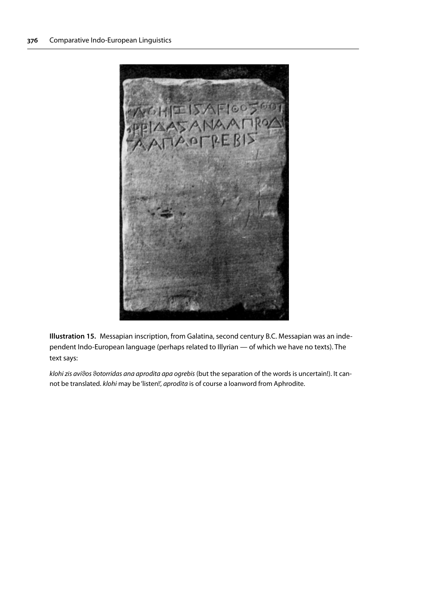

<!-- pdf-page: 401 -->

Illustration 15. Messapian inscription, from Galatina, second century B.C. Messapian was an inde-
pendent Indo-European language (perhaps related to Illyrian — of which we have no texts). The
text says:

klohi zis aviϑos ϑotorridas ana aprodita apa ogrebis (but the separation of the words is uncertain!). It can-
not be translated. klohi may be ‘listen!’, aprodita is of course a loanword from Aphrodite.

## Illustrations, printed p. 377

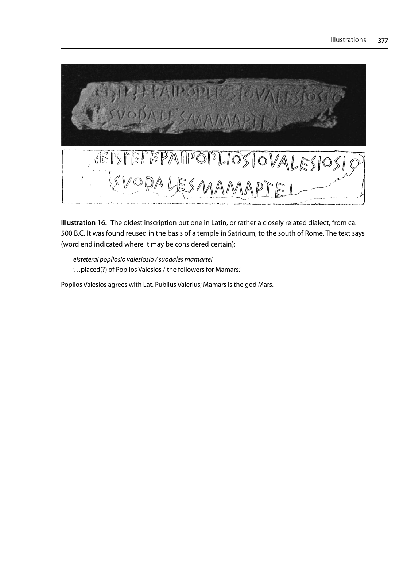

<!-- pdf-page: 402 -->

Illustration 16. The oldest inscription but one in Latin, or rather a closely related dialect, from ca.
500 B.C. It was found reused in the basis of a temple in Satricum, to the south of Rome. The text says
(word end indicated where it may be considered certain):

eisteterai popliosio valesiosio / suodales mamartei
‘…placed(?) of Poplios Valesios / the followers for Mamars.’

Poplios Valesios agrees with Lat. Publius Valerius; Mamars is the god Mars.

## Illustrations, printed p. 378

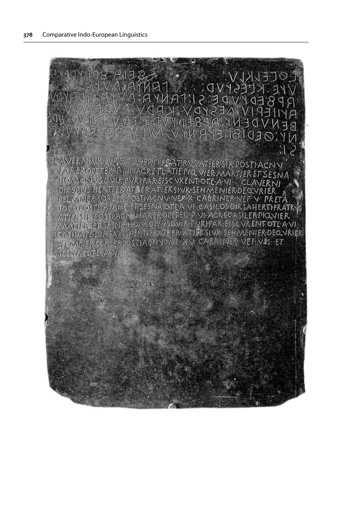

<!-- pdf-page: 403 -->

## Illustrations, printed p. 379

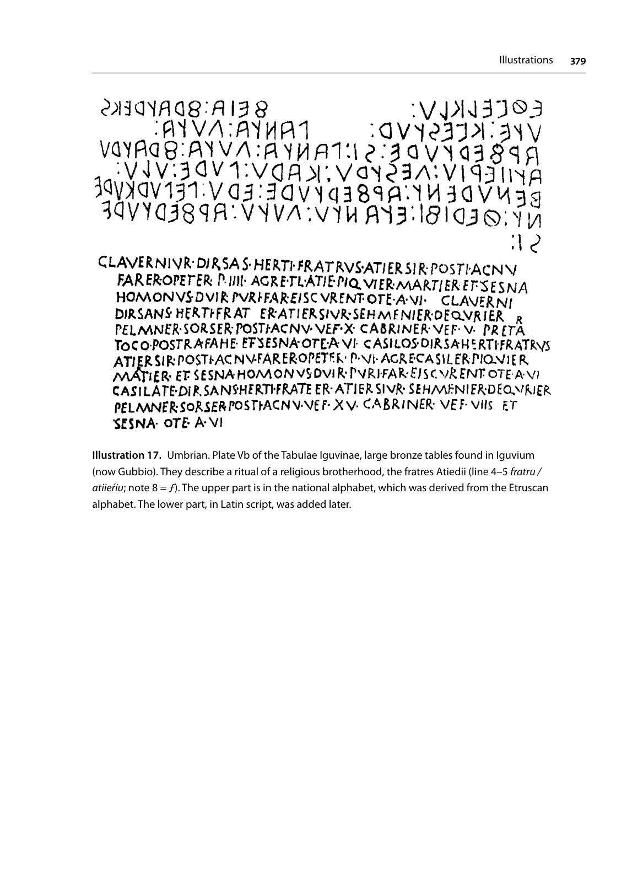

<!-- pdf-page: 404 -->

Illustration 17. Umbrian. Plate Vb of the Tabulae Iguvinae, large bronze tables found in Iguvium
(now Gubbio). They describe a ritual of a religious brotherhood, the fratres Atiedii (line 4–5 fratru /
atiieŕiu; note 8 = ƒ). The upper part is in the national alphabet, which was derived from the Etruscan
alphabet. The lower part, in Latin script, was added later.

## Illustrations, printed p. 380

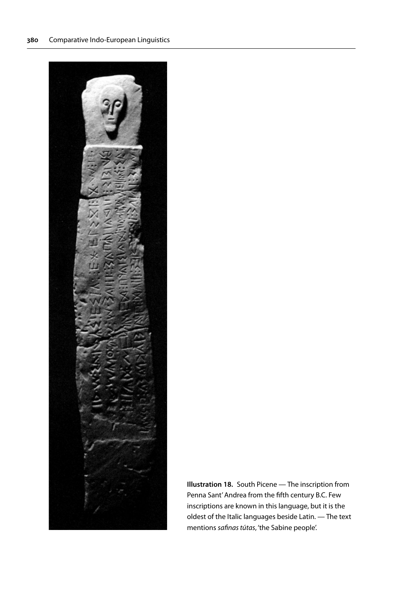

<!-- pdf-page: 405 -->

Illustration 18. South Picene — The inscription from
Penna Sant’ Andrea from the fifth century B.C. Few
inscriptions are known in this language, but it is the
oldest of the Italic languages beside Latin. — The text
mentions safinas tútas, ‘the Sabine people’.

## Illustrations, printed p. 381

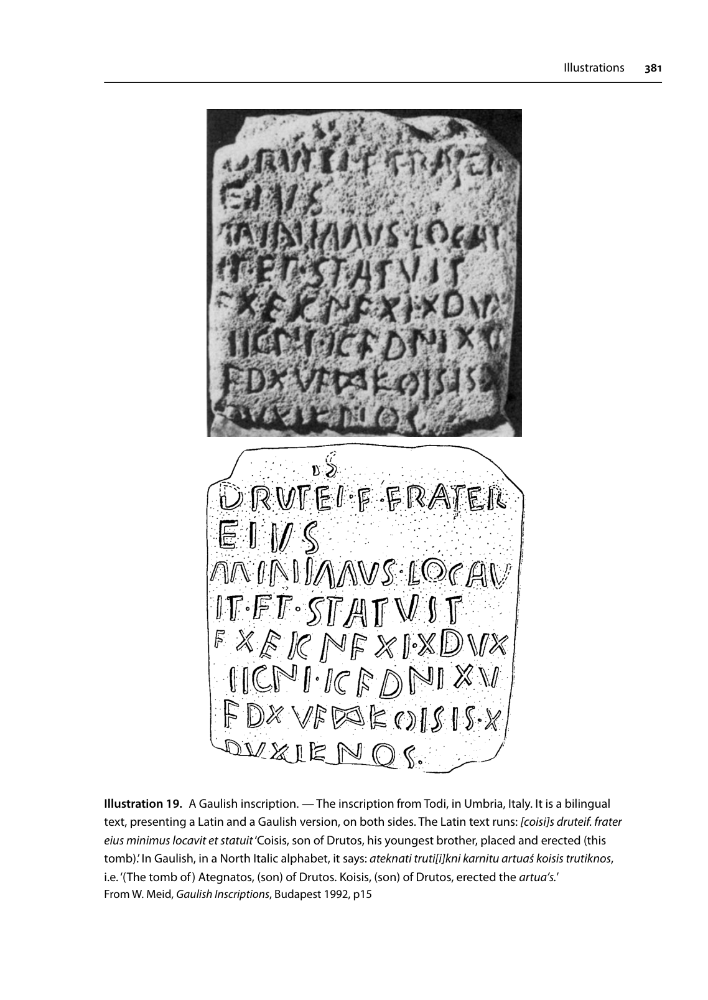

<!-- pdf-page: 406 -->

Illustration 19. A Gaulish inscription. — The inscription from Todi, in Umbria, Italy. It is a bilingual
text, presenting a Latin and a Gaulish version, on both sides. The Latin text runs: [coisi]s druteif. frater
eius minimus locavit et statuit ‘Coisis, son of Drutos, his youngest brother, placed and erected (this
tomb).’ In Gaulish, in a North Italic alphabet, it says: ateknati truti[i]kni karnitu artuaś koisis trutiknos,
i.e. ‘(The tomb of) Ategnatos, (son) of Drutos. Koisis, (son) of Drutos, erected the artua’s.’
From W. Meid, Gaulish Inscriptions, Budapest 1992, p15

## Illustrations, printed p. 382

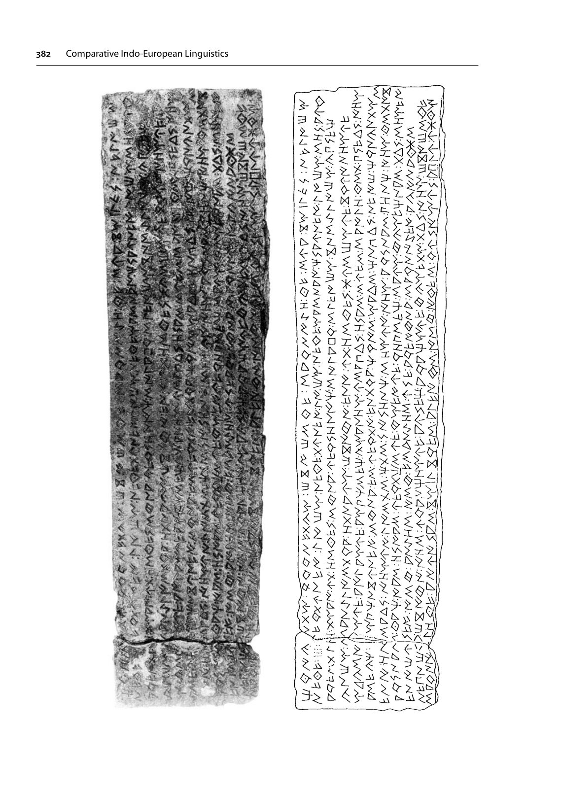

<!-- pdf-page: 407 -->

## Illustrations, printed p. 383

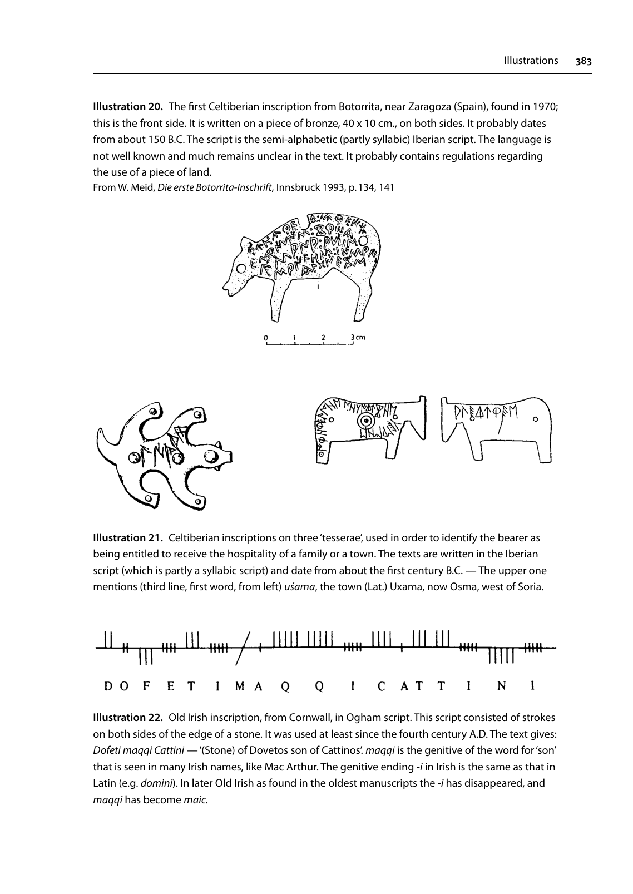

<!-- pdf-page: 408 -->

Illustration 20. The first Celtiberian inscription from Botorrita, near Zaragoza (Spain), found in 1970;
this is the front side. It is written on a piece of bronze, 40 x 10 cm., on both sides. It probably dates
from about 150 B.C. The script is the semi-alphabetic (partly syllabic) Iberian script. The language is
not well known and much remains unclear in the text. It probably contains regulations regarding
the use of a piece of land.
From W. Meid, Die erste Botorrita-Inschrift, Innsbruck 1993, p. 134, 141

Illustration 21. Celtiberian inscriptions on three ‘tesserae’, used in order to identify the bearer as
being entitled to receive the hospitality of a family or a town. The texts are written in the Iberian
script (which is partly a syllabic script) and date from about the first century B.C. — The upper one
mentions (third line, first word, from left) uśama, the town (Lat.) Uxama, now Osma, west of Soria.

Illustration 22. Old Irish inscription, from Cornwall, in Ogham script. This script consisted of strokes
on both sides of the edge of a stone. It was used at least since the fourth century A.D. The text gives:
Dofeti maqqi Cattini — ‘(Stone) of Dovetos son of Cattinos’. maqqi is the genitive of the word for ‘son’
that is seen in many Irish names, like Mac Arthur. The genitive ending ‑ i in Irish is the same as that in
Latin (e.g. domini). In later Old Irish as found in the oldest manuscripts the ‑ i has disappeared, and
maqqi has become maic.

## Illustrations, printed p. 384

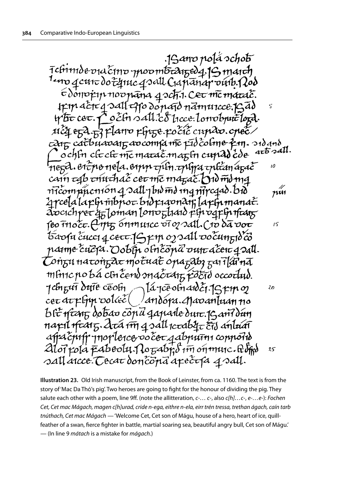

<!-- pdf-page: 409 -->

Illustration 23. Old Irish manuscript, from the Book of Leinster, from ca. 1160. The text is from the
story of ‘Mac Da Thó’s pig’. Two heroes are going to fight for the honour of dividing the pig. They
salute each other with a poem, line 9ff. (note the allitteration, c‑… c‑, also c[h]…c‑, e‑…e‑): Fochen
Cet, Cet mac Mágach, magen c[h]urad, cride n-ega, eithre n-ela, eirr trén tressa, trethan ágach, caín tarb
tnúthach, Cet mac Mágach — ‘Welcome Cet, Cet son of Mágu, house of a hero, heart of ice, quill-
feather of a swan, fierce fighter in battle, martial soaring sea, beautiful angry bull, Cet son of Mágu.’
— (In line 9 mátach is a mistake for mágach.)

## Illustrations, printed p. 385

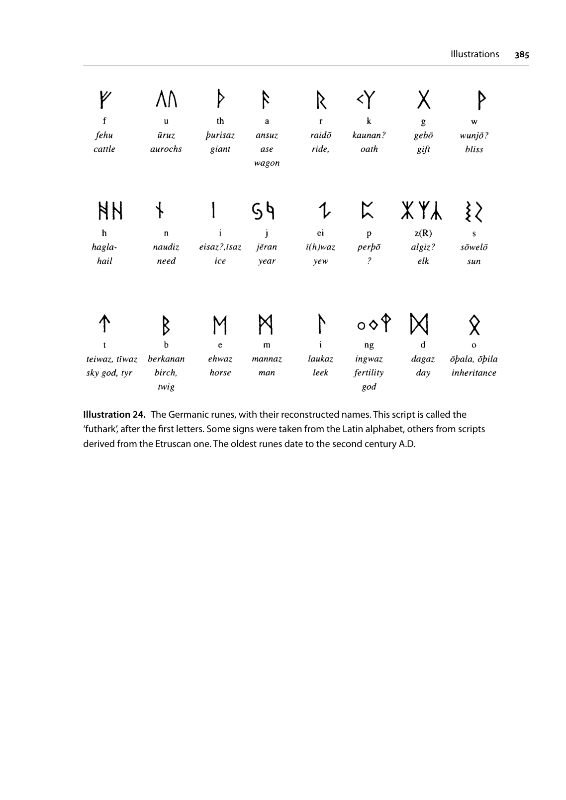

<!-- pdf-page: 410 -->

Illustration 24. The Germanic runes, with their reconstructed names. This script is called the
‘futhark’, after the first letters. Some signs were taken from the Latin alphabet, others from scripts
derived from the Etruscan one. The oldest runes date to the second century A.D.

## Illustrations, printed p. 386

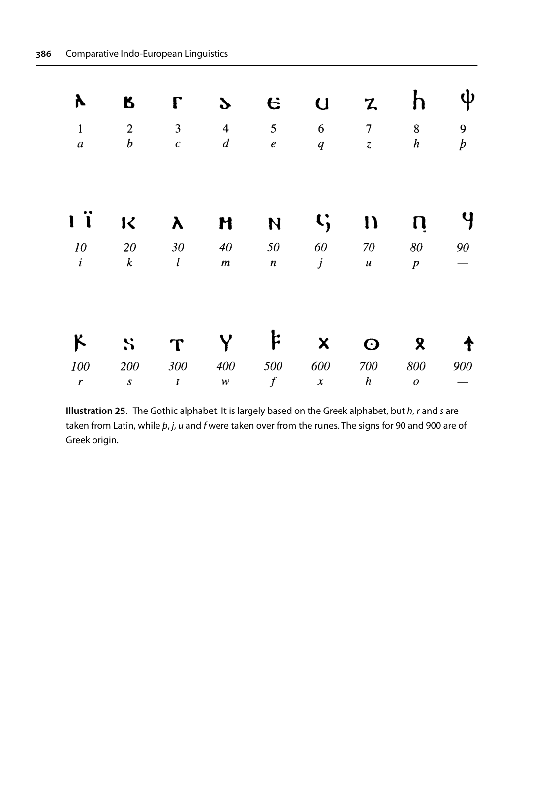

<!-- pdf-page: 411 -->

Illustration 25. The Gothic alphabet. It is largely based on the Greek alphabet, but h, r and s are
taken from Latin, while þ, j, u and f were taken over from the runes. The signs for 90 and 900 are of
Greek origin.

