# Maps

## Maps, printed p. 343

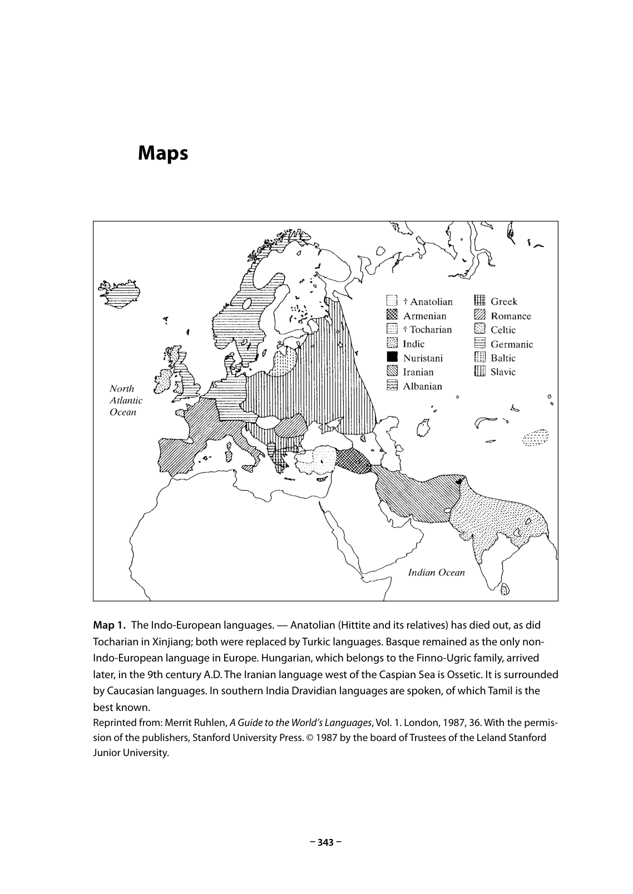

<!-- pdf-page: 368 -->

Maps

Map 1. The Indo-European languages. — Anatolian (Hittite and its relatives) has died out, as did
Tocharian in Xinjiang; both were replaced by Turkic languages. Basque remained as the only non-
Indo-European language in Europe. Hungarian, which belongs to the Finno-Ugric family, arrived
later, in the 9th century A.D. The Iranian language west of the Caspian Sea is Ossetic. It is surrounded
by Caucasian languages. In southern India Dravidian languages are spoken, of which Tamil is the
best known.
Reprinted from: Merrit Ruhlen, A Guide to the World’s Languages, Vol. 1. London, 1987, 36. With the permis-
sion of the publishers, Stanford University Press. © 1987 by the board of Trustees of the Leland Stanford
Junior University.

## Maps, printed p. 344

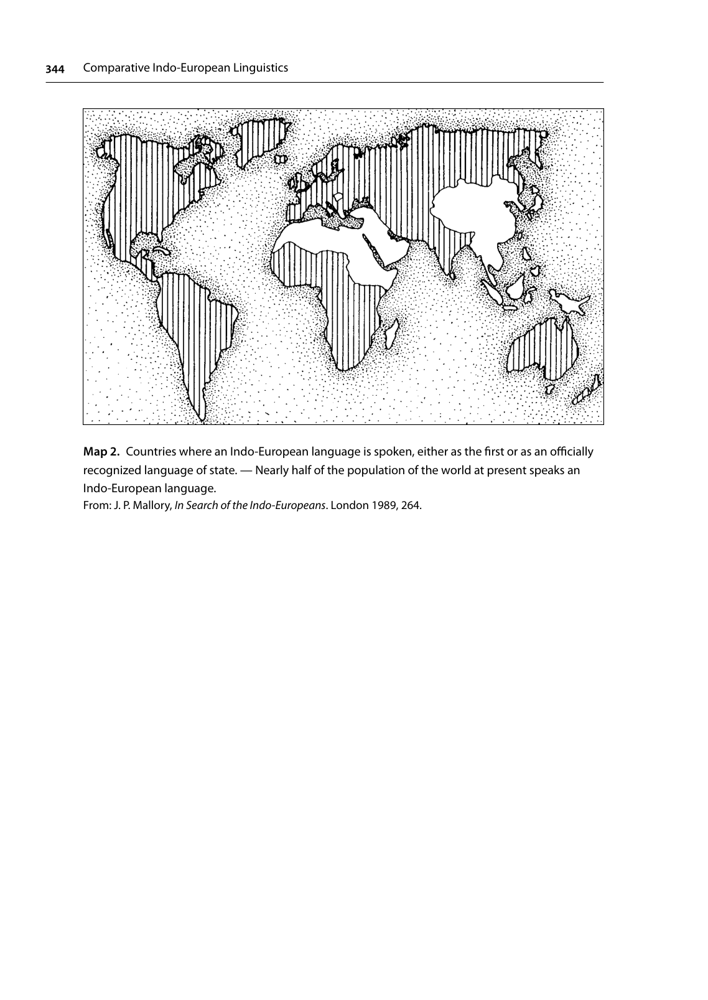

<!-- pdf-page: 369 -->

Map 2. Countries where an Indo-European language is spoken, either as the first or as an officially
recognized language of state. — Nearly half of the population of the world at present speaks an
Indo-European language.
From: J. P. Mallory, In Search of the Indo-Europeans. London 1989, 264.

## Maps, printed p. 345

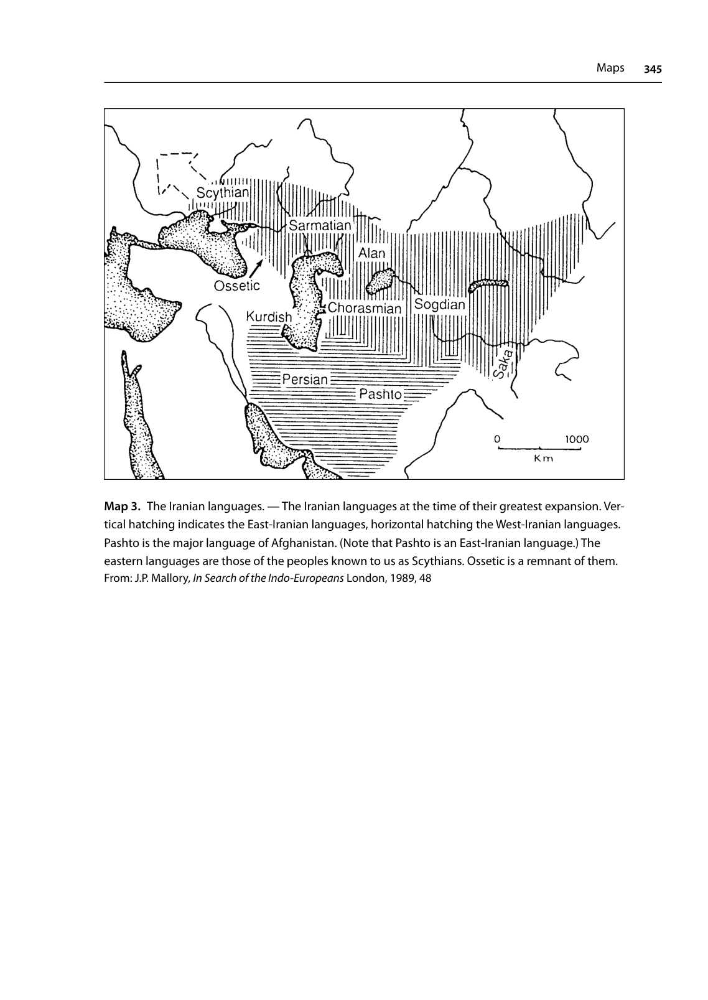

<!-- pdf-page: 370 -->

Map 3. The Iranian languages. — The Iranian languages at the time of their greatest expansion. Ver-
tical hatching indicates the East-Iranian languages, horizontal hatching the West-Iranian languages.
Pashto is the major language of Afghanistan. (Note that Pashto is an East-Iranian language.) The
eastern languages are those of the peoples known to us as Scythians. Ossetic is a remnant of them.
From: J.P. Mallory, In Search of the Indo-Europeans London, 1989, 48

## Maps, printed p. 346

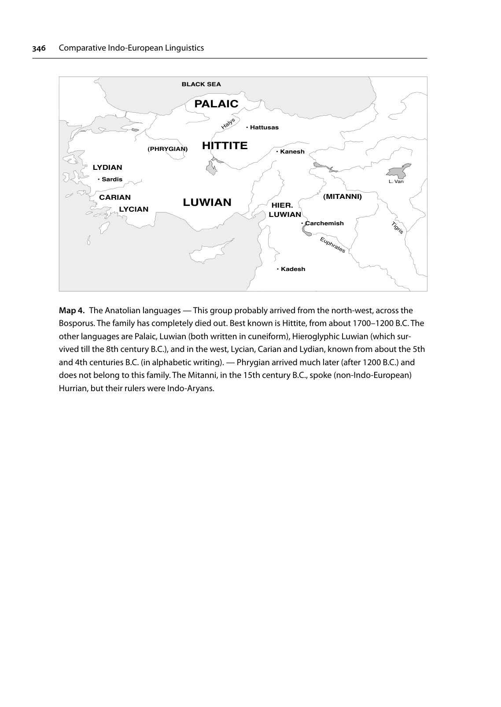

<!-- pdf-page: 371 -->

BLACK SEA

PALAIC

Halys

• Hattusas

• Kanesh
HITTITE

(PHRYGIAN)

LYDIAN

• Sardis

L. Van

(MITANNI)

CARIAN

LUWIAN

HIER.

LYCIAN

LUWIAN
• Carchemish

Tigris

Euphrates

• Kadesh

Map 4. The Anatolian languages — This group probably arrived from the north-west, across the
Bosporus. The family has completely died out. Best known is Hittite, from about 1700–1200 B.C. The
other languages are Palaic, Luwian (both written in cuneiform), Hieroglyphic Luwian (which sur-
vived till the 8th century B.C.), and in the west, Lycian, Carian and Lydian, known from about the 5th
and 4th centuries B.C. (in alphabetic writing). — Phrygian arrived much later (after 1200 B.C.) and
does not belong to this family. The Mitanni, in the 15th century B.C., spoke (non-Indo-European)
Hurrian, but their rulers were Indo-Aryans.

## Maps, printed p. 347

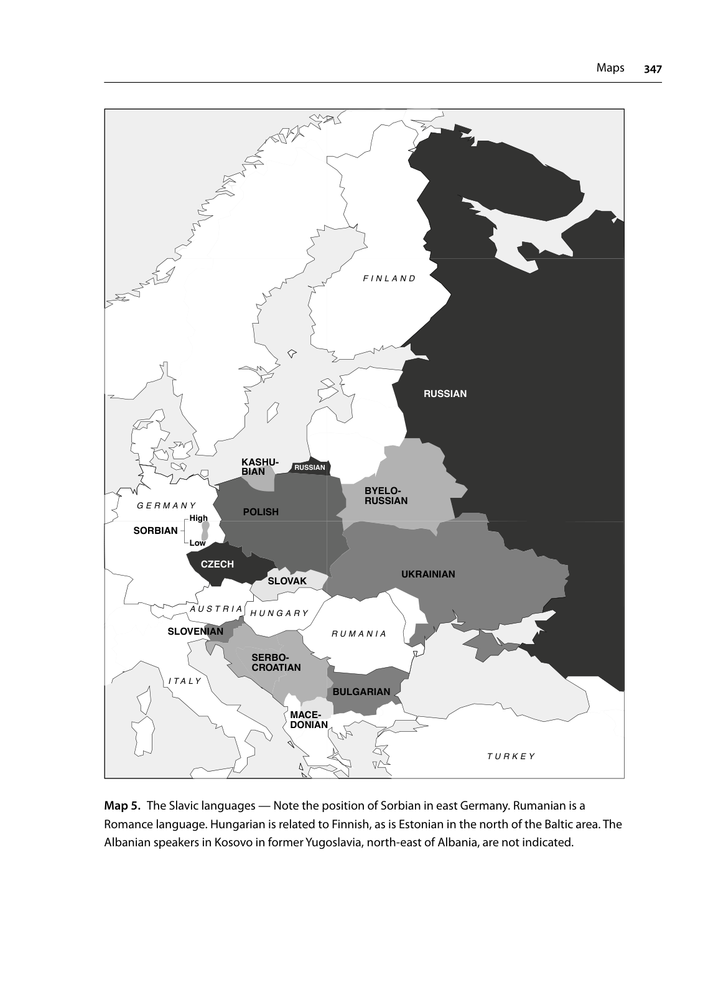

<!-- pdf-page: 372 -->

F I N L A N D

RUSSIAN

KASHU-
BIAN

RUSSIAN

BYELO-
RUSSIAN

G E R M A N Y

POLISH

High

SORBIAN

Low

CZECH

UKRAINIAN

SLOVAK

H U N G A R Y
A U S T R I A

SLOVENIAN

R U M A N I A

SERBO-
CROATIAN

I T A L Y

BULGARIAN

MACE-
DONIAN

T U R K E Y

Map 5. The Slavic languages — Note the position of Sorbian in east Germany. Rumanian is a
Romance language. Hungarian is related to Finnish, as is Estonian in the north of the Baltic area. The
Albanian speakers in Kosovo in former Yugoslavia, north-east of Albania, are not indicated.

## Maps, printed p. 348

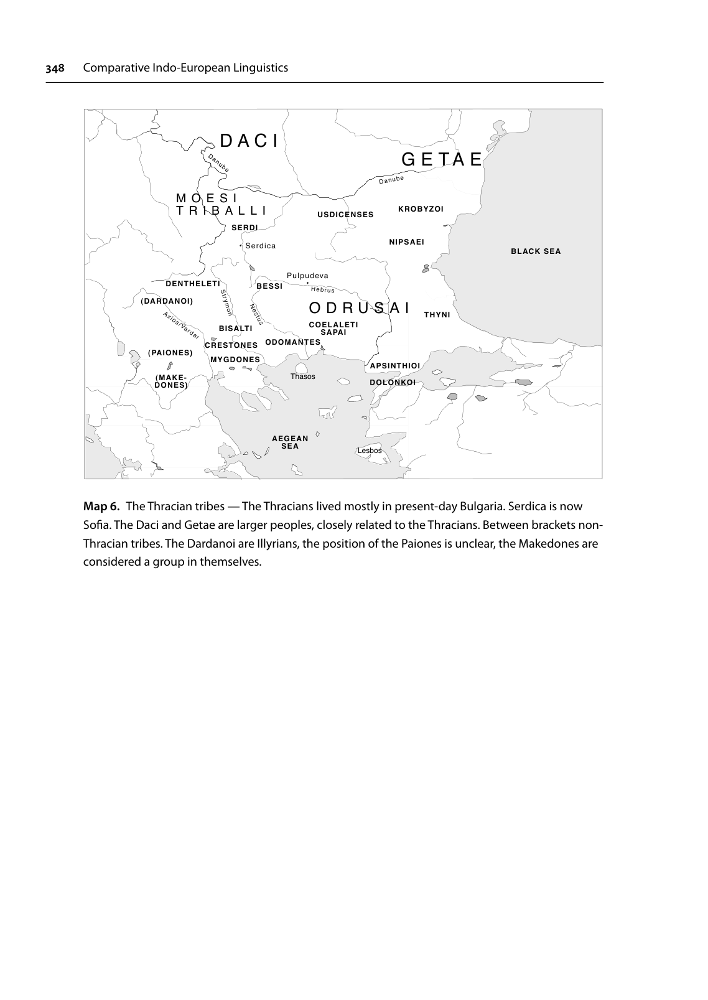

<!-- pdf-page: 373 -->

D A C I
G E T A E

Danube

Danube

M O E S I
T R I B A L L I
USDICENSES
KROBYZOI

SERDI

NIPSAEI
BLACK SEA

• Serdica

Pulpudeva
•

DENTHELETI

BESSI

Hebrus

Str ymon

(DARDANOI)

COELALETI
SAPAI
O D R U S A I

Nestus

Axios/Vardar

THYNI

BISALTI

ODOMANTES

CRESTONES

(PAIONES)

MYGDONES

APSINTHIOI

Thasos

(MAKE-
DONES)

DOLONKOI

AEGEAN
SEA

Lesbos

Map 6. The Thracian tribes — The Thracians lived mostly in present-day Bulgaria. Serdica is now
Sofia. The Daci and Getae are larger peoples, closely related to the Thracians. Between brackets non-
Thracian tribes. The Dardanoi are Illyrians, the position of the Paiones is unclear, the Makedones are
considered a group in themselves.

## Maps, printed p. 349

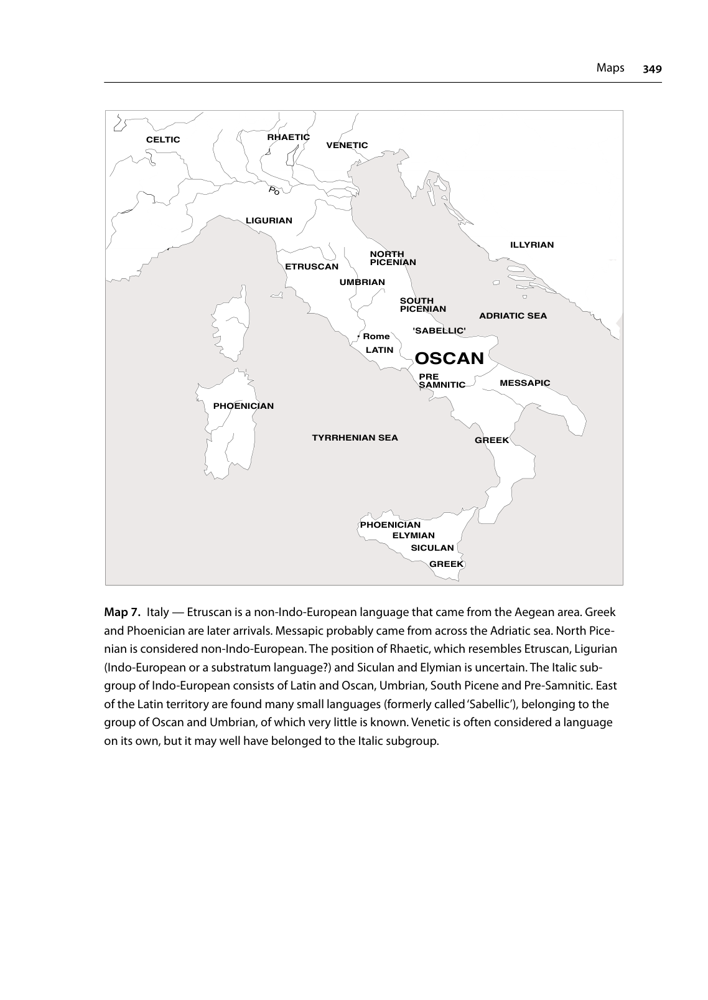

<!-- pdf-page: 374 -->

VENETIC
RHAETIC
CELTIC

Po

LIGURIAN

ILLYRIAN

NORTH
PICENIAN

ETRUSCAN

UMBRIAN

SOUTH
PICENIAN

ADRIATIC SEA

'SABELLIC'

• Rome

OSCAN
LATIN

PRE
SAMNITIC
MESSAPIC

PHOENICIAN

TYRRHENIAN SEA

GREEK

PHOENICIAN
ELYMIAN
SICULAN

GREEK

Map 7. Italy — Etruscan is a non-Indo-European language that came from the Aegean area. Greek
and Phoenician are later arrivals. Messapic probably came from across the Adriatic sea. North Pice-
nian is considered non-Indo-European. The position of Rhaetic, which resembles Etruscan, Ligurian
(Indo-European or a substratum language?) and Siculan and Elymian is uncertain. The Italic sub-
group of Indo-European consists of Latin and Oscan, Umbrian, South Picene and Pre-Samnitic. East
of the Latin territory are found many small languages (formerly called ‘Sabellic’), belonging to the
group of Oscan and Umbrian, of which very little is known. Venetic is often considered a language
on its own, but it may well have belonged to the Italic subgroup.

## Maps, printed p. 350

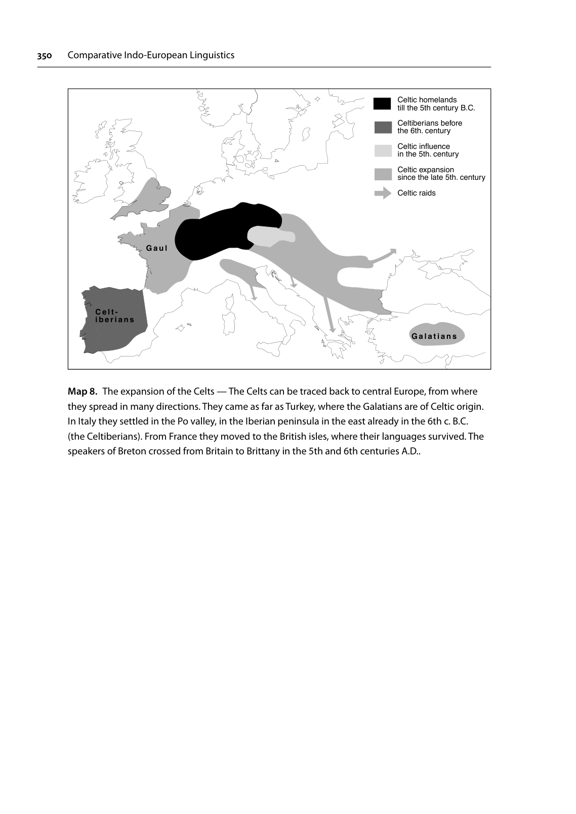

<!-- pdf-page: 375 -->

Celtic homelands
till the 5th century B.C.

Celtiberians before
the 6th. century

Celtic influence
in the 5th. century

Celtic expansion
since the late 5th. century

Celtic raids

G a u l

C e l t -
i b e r i a n s

G a l a t i a n s

Map 8. The expansion of the Celts — The Celts can be traced back to central Europe, from where
they spread in many directions. They came as far as Turkey, where the Galatians are of Celtic origin.
In Italy they settled in the Po valley, in the Iberian peninsula in the east already in the 6th c. B.C.
(the Celtiberians). From France they moved to the British isles, where their languages survived. The
speakers of Breton crossed from Britain to Brittany in the 5th and 6th centuries A.D..

## Maps, printed p. 351

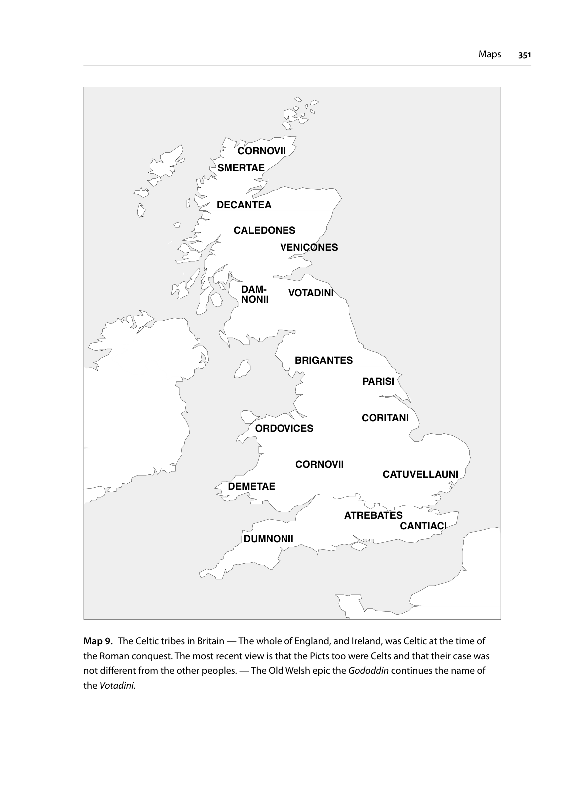

<!-- pdf-page: 376 -->

CORNOVII

SMERTAE

DECANTEA

CALEDONES

VENICONES

DAM-
NONII
VOTADINI

BRIGANTES

PARISI

CORITANI
ORDOVICES

CORNOVII

DEMETAE
CATUVELLAUNI

ATREBATES
CANTIACI
DUMNONII

Map 9. The Celtic tribes in Britain — The whole of England, and Ireland, was Celtic at the time of
the Roman conquest. The most recent view is that the Picts too were Celts and that their case was
not different from the other peoples. — The Old Welsh epic the Gododdin continues the name of
the Votadini.

## Maps, printed p. 352

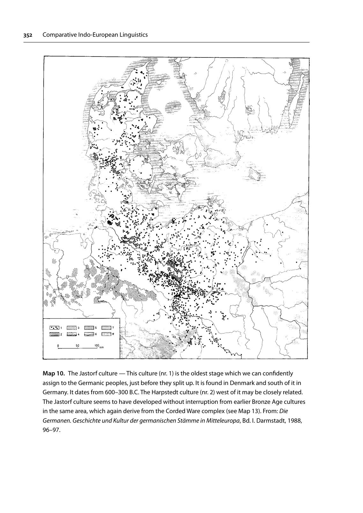

<!-- pdf-page: 377 -->

Map 10. The Jastorf culture — This culture (nr. 1) is the oldest stage which we can confidently
assign to the Germanic peoples, just before they split up. It is found in Denmark and south of it in
Germany. It dates from 600–300 B.C. The Harpstedt culture (nr. 2) west of it may be closely related.
The Jastorf culture seems to have developed without interruption from earlier Bronze Age cultures
in the same area, which again derive from the Corded Ware complex (see Map 13). From: Die
Germanen. Geschichte und Kultur der germanischen Stämme in Mitteleuropa, Bd. I. Darmstadt, 1988,
96–97.

## Maps, printed p. 353

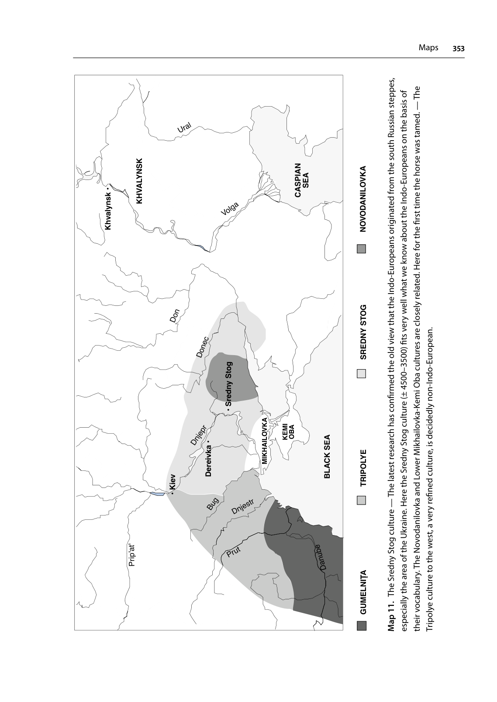

<!-- pdf-page: 378 -->

Map 11. The Sredny Stog culture — The latest research has confirmed the old view that the Indo-Europeans originated from the south Russian steppes,

their vocabulary. The Novodanilovka and Lower Mikhailovka-Kemi Oba cultures are closely related. Here for the first time the horse was tamed. — The

especially the area of the Ukraine. Here the Sredny Stog culture (± 4500–3500) fits very well what we know about the Indo-Europeans on the basis of

Ural

KHVALYNSK

CASPIAN
SEA

TRIPOLYE
NOVODANILOVKA
SREDNY STOG

Khvalynsk •

Volga

Don

Tripolye culture to the west, a very refined culture, is decidedly non-Indo-European.

Donec

• Sredny Stog

MIKHAILOVKA

KEMI
OBA

Dnjepr

BLACK SEA

Dereivka •

• Kiev

Bug

Dnjestr

Danube

Prip'at'

Prut

GUMELNITA
¸

## Maps, printed p. 354

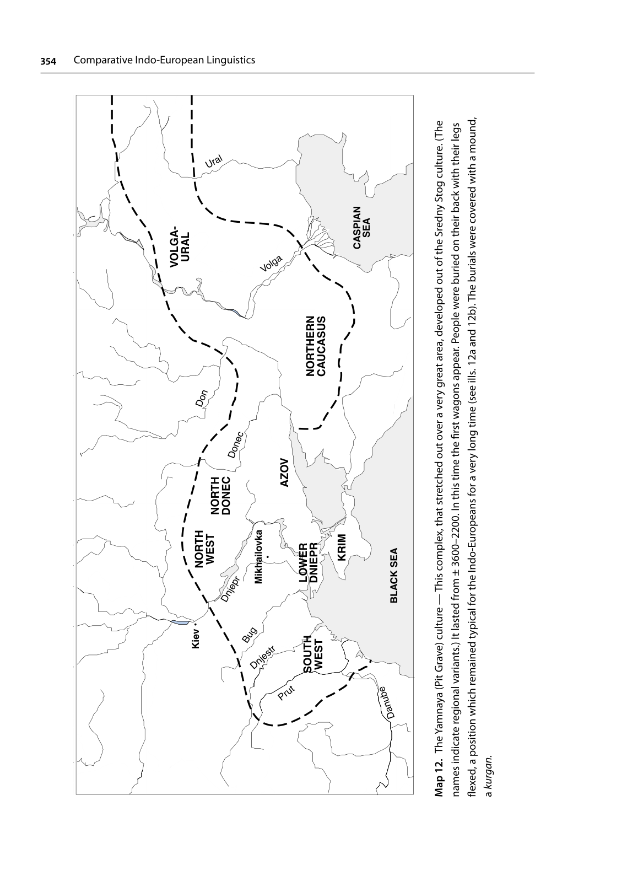

<!-- pdf-page: 379 -->

flexed, a position which remained typical for the Indo-Europeans for a very long time (see ills. 12a and 12b). The burials were covered with a mound,

Map 12. The Yamnaya (Pit Grave) culture — This complex, that stretched out over a very great area, developed out of the Sredny Stog culture. (The

names indicate regional variants.) It lasted from ± 3600–2200. In this time the first wagons appear. People were buried on their back with their legs

Ural

CASPIAN
SEA

VOLGA-
URAL
NORTH
WEST
NORTH
DONEC

Volga

NORTHERN
CAUCASUS

Don

Donec

AZOV

Mikhailovka
•

KRIM

LOWER
DNIEPR

BLACK SEA

Dnjepr

Kiev •

Bug

SOUTH
WEST

Dnjestr

Prut

Danube

a kurgan.

## Maps, printed p. 355

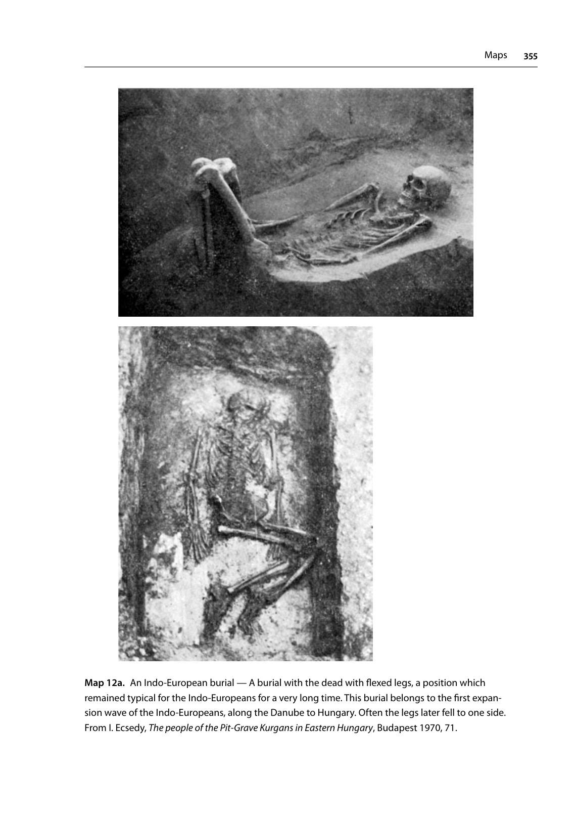

<!-- pdf-page: 380 -->

Map 12a. An Indo-European burial — A burial with the dead with flexed legs, a position which
remained typical for the Indo-Europeans for a very long time. This burial belongs to the first expan-
sion wave of the Indo-Europeans, along the Danube to Hungary. Often the legs later fell to one side.
From I. Ecsedy, The people of the Pit-Grave Kurgans in Eastern Hungary, Budapest 1970, 71.

## Maps, printed p. 356

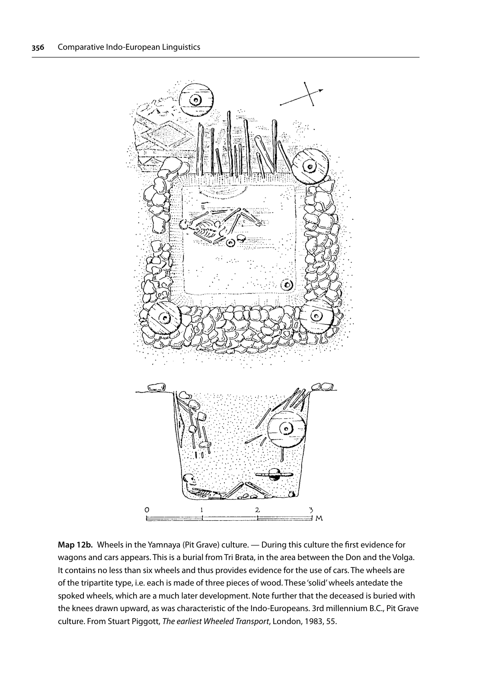

<!-- pdf-page: 381 -->

Map 12b. Wheels in the Yamnaya (Pit Grave) culture. — During this culture the first evidence for
wagons and cars appears. This is a burial from Tri Brata, in the area between the Don and the Volga.
It contains no less than six wheels and thus provides evidence for the use of cars. The wheels are
of the tripartite type, i.e. each is made of three pieces of wood. These ‘solid’ wheels antedate the
spoked wheels, which are a much later development. Note further that the deceased is buried with
the knees drawn upward, as was characteristic of the Indo-Europeans. 3rd millennium B.C., Pit Grave
culture. From Stuart Piggott, The earliest Wheeled Transport, London, 1983, 55.

## Maps, printed p. 357

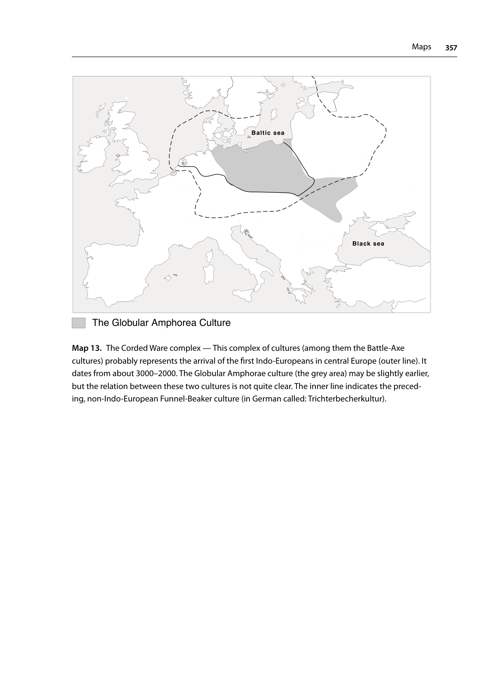

<!-- pdf-page: 382 -->

Baltic sea

Black sea

The Globular Amphorea Culture

Map 13. The Corded Ware complex — This complex of cultures (among them the Battle-Axe
cultures) probably represents the arrival of the first Indo-Europeans in central Europe (outer line). It
dates from about 3000–2000. The Globular Amphorae culture (the grey area) may be slightly earlier,
but the relation between these two cultures is not quite clear. The inner line indicates the preced-
ing, non-Indo-European Funnel-Beaker culture (in German called: Trichterbecherkultur).

## Maps, printed p. 358

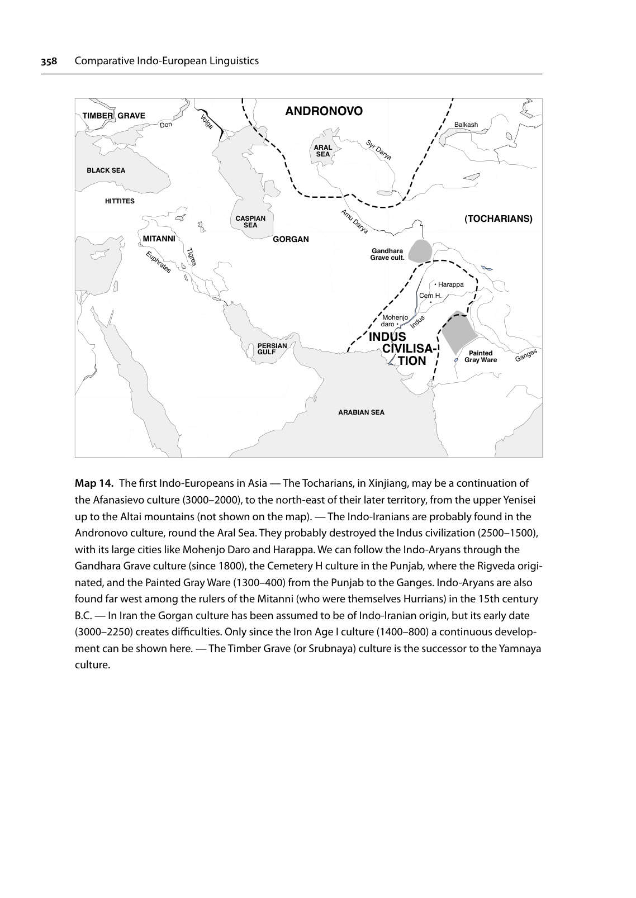

<!-- pdf-page: 383 -->

ANDRONOVO

TIMBER GRAVE

Volga

Don

Balkash

Syr Darya

ARAL
SEA

BLACK SEA

HITTITES

Amu Darya

(TOCHARIANS)

CASPIAN
SEA

MITANNI
GORGAN

Tigres

Gandhara
Grave cult.

Euphrates

• Harappa

Cem H.
•

Mohenjo
daro •

Indus

INDUS
CIVILISA-
TION

PERSIAN
GULF

Ganges

Painted
Gray Ware

ARABIAN SEA

Map 14. The first Indo-Europeans in Asia — The Tocharians, in Xinjiang, may be a continuation of
the Afanasievo culture (3000–2000), to the north-east of their later territory, from the upper Yenisei
up to the Altai mountains (not shown on the map). — The Indo-Iranians are probably found in the
Andronovo culture, round the Aral Sea. They probably destroyed the Indus civilization (2500–1500),
with its large cities like Mohenjo Daro and Harappa. We can follow the Indo-Aryans through the
Gandhara Grave culture (since 1800), the Cemetery H culture in the Punjab, where the Rigveda origi-
nated, and the Painted Gray Ware (1300–400) from the Punjab to the Ganges. Indo-Aryans are also
found far west among the rulers of the Mitanni (who were themselves Hurrians) in the 15th century
B.C. — In Iran the Gorgan culture has been assumed to be of Indo-lranian origin, but its early date
(3000–2250) creates difficulties. Only since the Iron Age I culture (1400–800) a continuous develop-
ment can be shown here. — The Timber Grave (or Srubnaya) culture is the successor to the Yamnaya
culture.

