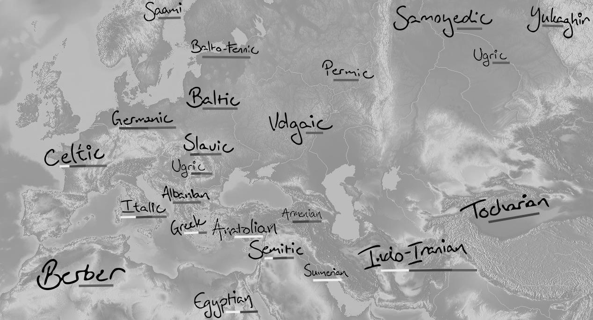
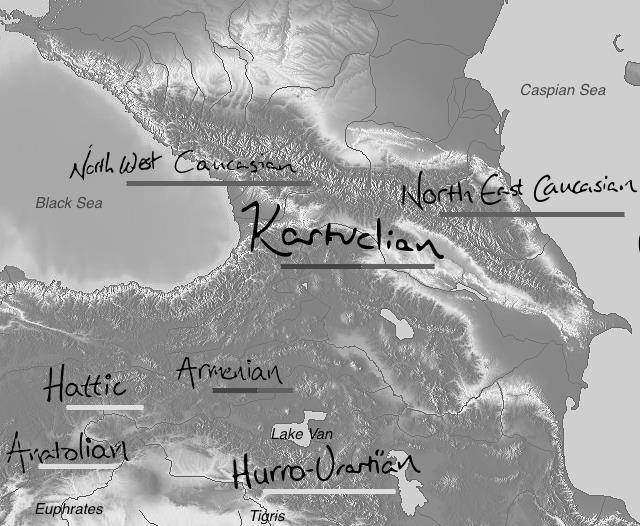

<!-- pdf-page: 35; source-page: 23 -->

# 2 Languages in time and space

This chapter contains brief introductions to the language families treated in the present paper. Of primary interest are age and distribution that necessarily have effects on compatibility with the PIE speech community that is the focus here. A few literature references are given at the end of each segment to allow the reader access to the pertinent fields (details are in the bibliography), that by no means are meant to be exhaustive.

Map 2.A: Attestations of languages in the historic Indo-European contact sphere Grey: Modern languages Dark grey: Old languages, attested 0-1500 CE (note: Greek accidentally misses this component) Light grey: Ancient languages, attested 3000-1 BCE

<!-- pdf-page: 36; source-page: 24 -->

Map 2.B: Attestations of languages in the Caucasus and Northern Fertile Crescent Grey: Modern languages Dark grey: Old languages, attested 0-1500 CE Light grey: Ancient languages, attested 3000-1 BCE

2.1 Languages of the Caucasus Four distinct and commonly acknowledged language families belong to the Caucasus and Transcaucasus region, one of which went extinct BCE:

- Northeast Caucasian (or Nakh-Daghestanian)

- Northwest Caucasian (or Abkhaz-Circassian)

- Hurro-Urartian (extinct)

- Kartvelian (or South Caucasian)

A common feature of the three contemporary language families is glottalization of consonants (Hewitt 2004: 32), which plays a central role in the Glottalic Theory for PIE (Gamkrelidze & Ivanov 1995: 5ff.). In addition, they all exhibit ergative case marking, which constitutes another typological argument for early PIE contact with the area (e.g. Beekes 1985: 172ff.). Within the fields of both linguistics and archaeology the inclusion of a small

<!-- pdf-page: 37; source-page: 25 -->

handful of indirectly or scantily attested cultural languages into the Caucasian grouping has seemed straightforward (however difficult, if not impossible, to prove); these references are given below and may shed much-needed historical light on an otherwise complicated task. The central geographic location of the Caucasus makes it interesting in the development of PIE as the historic distribution of IE languages envelops the region completely, albeit with the later enrichment of Turkic. Additionally, and more pertinently for a discussion of PIE proper, the most prominent homeland hypotheses place the point of dispersal for the IE languages either north (the Pontic steppes) or south (Transcaucasia or the Anatolian highlands) of the region (§ 3). An important question also applies to the permeability of the region, the shortest route between Anatolia and the Pontic Steppe, yet the embedded linguistic patchwork seems to be old and inhospitable to foreign permanence, as suggested by the unique status of all three Caucasian families that seems mirrored genetically (Yunusbayev et al. 2011). The Armenian presence in the southern parts seems more a refuge from an earlier vast territory further west than its original point of dispersal (cf. Mallory 1989: 34), which is corroborated by its eclipse of the Urartian empire that appears to have had strong ties to the Caucasus (§ 2.1.3). Other foreign elements include Ossetic (an Iranian language) in the north and a few Turkic languages that all can be traced historically to Steppe migrations emanating from Central Asia (cf. Nichols 1997: 132f.). The trichotomy of the modern Caucasian languages is uncontroversial, while further attempts to unite some or all the families are complicated by their intricate and ancient relationship with mutual influence that obscure regular sound correspondences (cf. Deeters 1963: 41). The most pervasive and obvious unification is that of NW and NE Caucasian in a common North Caucasian (§ 2.1.4). The cultures historically confined to the Caucasus region are widely believed to have played a bigger role in the Fertile Crescent around the time of the incipient stages of PIE further north (cf. Roberts 1998: 72ff.), the last remnant of which may be linguistically corroborated by the ultimate disappearance of the Hurro-Urartian languages in the first millennium BCE.

Literature: Diakonoff & Starostin (1986) Hurro-Urartian as an Eastern Caucasian Language Dumézil, Georges (1933) Grammaire Comparée des Langues Caucasienne du Nord Hewitt, George (2004) Introduction to the Study of the Languages of the Caucasus Nikolayev & Starostin (1994) North Caucasian Etymological Dictionary

<!-- pdf-page: 38; source-page: 26 -->

2.1.1 Northeast Caucasian Languages (NE Caucasian) or Nakh-Daghestanian The family consists of eight more or less independent branches, of which only Nakh (no. 3) and Lezgian (no. 5) have sufficiently varied internal dialectal variation to warrant linguistic sub-branching:

1. Dargi
2. Lak
3. Nakh (Bats, Ingush, and Chechen)
4. Khinalug
5. Lezgian

a. Archi
b. Samur (Tsakhur, Rutul, Kryts, Budukh, Udi, Lezgi, Agul, and Tabasaran)
6. Avar
7. Andian
8. Tsezian

Sometimes geographically also referred to simply as East Caucasian, the alternative term Nakh-Daghestanian is actually obsolete, but not very dissimilarly from how Indo-European fails to account for all of its internal constituents (cf. Armenian, Anatolian, Iranian, and Tocharian that are neither Indian nor European). The NE Caucasian languages are also occasionally divided into a Central Caucasian (Nakh) and a Northeast Caucasian proper language category, but these dichotomies are disputed and of secondary importance.

Geography and history The present distribution is, as indicated by their epithet, centered in the northeast corner of the Caucasus on the shores of the Caspian Sea with the Nakh languages further inland. The earliest attestations of NE Caucasian languages are included in word lists assembled in the late 18ₜₕ century (Hewitt 2004: 2). There is no indication of significant migrations by NE Caucasian speakers either to or from its current location, although Russian and Turkic encroachment continue to decimate the number of speakers, and archaeological continuation seems to indicate stability at least since the Bronze Age (Nichols 1997: 125). The internal diversification probably took place roughly contemporarily with incipient stages of the proto-Indo-Iranian linguistic community was present in its vicinity as is indicated by several borrowings (Dolgopolsky 1987: 18), while Nichols uses lexicographic data to pinpoint the spread, which she perceives to have happened after the domestication of sheep, cattle, and goats, but before horses became a stable word (1998: 225). Diakonoff & Starostin suggest that the Hurro-Urartian languages (§ 2.1.3) are to be considered a branch on the NE Caucasian language tree (1986), but the difficulties with which the comparison could be made, they argued, is like adducing genetic kinship between transcribed modern French with Sanskrit (1986: 98). Access to this potential treasure trove of ancient forms is thus hampered by the extremely complicated task of bridging of almost three millennia of silence and this suggested relation will consequently play a minor role in the loan etymologies.

<!-- pdf-page: 39; source-page: 27 -->

Literature: Deeters & Solta (1963) Armenisch und kaukasische Sprachen Diakonoff & Starostin (1986) Hurro-Urartian as an eastern Caucasian language Hewitt, George (2004) Introduction to the Study of the Languages of the Caucasus

2.1.2 Northwest Caucasian Languages (NWC) or Abkhaz-Circassian The family is rather small, consisting of only four extant languages (with dialects), divided into two subgroups, that teeter on a recently extinct intermediary.

Circassian branch:

- Adyghe

- Kabardian
Ubykh (extinct since 1992)
Abkhaz branch:

- Abaza

- Abkhaz

Geography and history The NW Caucasian languages, true to their name, occupy the northwestern perimeter of the Caucasus mountains on the shores of the Black Sea and further inland. Like their eastern neighbors, their territory is continually dwindling under the cultural influence of Russian, despite the fact that Abkhaz remains a strong ethnic language in the breakaway republic of Abkhazia, whose de facto sovereignty from Georgia is militarily secured from Moscow. Word lists only began emanating from the area in the 17ₜₕ century in the notebooks of travelers (Hewitt 2004: 1); the added fact that the NW Caucasian languages suffer from very late attestation and close geographic proximity severely inhibit internal reconstruction. Further, the root structure is mostly CV, allowing very little material for radical alignment (cf. Chirikba forthc.: 12f., Dolgopolsky 1989: 16). Consequently, the comparison with the reconstructed PIE that harks back at least 5.000 years is extremely difficult. Nichols considers NW Caucasian to have occupied roughly its current distribution for a considerable amount of time (1997: 125). Connections with Hattic (§ 2.5) have been proposed (Diakonoff & Starostin 1986: 2,97 and Dolgopolsky 1989: 14), possibly through North Caucasian proper (Kassian 2010: 320), but remain controversial (cf. Goedegebuure 2010: 949).

Literature: Chirikba, Viacheslav (1996) Common Northwest Caucasian Deeters & Solta (1963) Armenisch und kaukasische Sprachen Kuipers, A.H. (1975) A Dictionary of Proto-Circassian Roots

2.1.3 Hurro-Urartian (HU) The Hurro-Urartian language family consists of only two languages, Hurrian and Urartian, whose genetic affinity is well-established (cf. Wilhelm 2008a: 81 and Fournet & Bomhard 2010: 2ff.). Hurrian is the better attested language of the two constituents and was spoken in

<!-- pdf-page: 40; source-page: 28 -->

the northern Fertile Crescent (modern day northern Syria and Iraq and southern Turkey) from the latter parts of the 3ʳd millennium BCE through to the turn of the first millennium BCE. It was the language of the Mitanni empire known to Indo-Europeanists for its Indo-Iranian superstrate and owes much of its attestation to the Hittite archives. Urartian was spoken from the Caucasian corner of the Caspian Sea to the Euphrates. Attestations run from c. 800 BCE to no later than 600 BCE and thus seem to continue in the vacuum left by the Hurrians, but not as a direct continuation hereof; the branches may have split around 2.000 BCE (Wilhelm 2008b: 105). The Urartian empire was likely displaced by the Armenians (Ajello 1998: 197ff., Solta 1963: 80ff.), which is evidenced by substrate words such as Armenian xnjor ‘apple’ from Hurrian ḫinzuri (Fortson 2010: 382 and, more elaborately, Greppin 2008). The archaeological record appears to link the civilization of the Hurrians and Urartu with the Caucasus, where it is first detectable in the fifth millennium BCE (Burney 1990), a notion corroborated by the Middle Eastern genetic component (Yunusbayev et al. 2011). Further connections with NE Caucasian have been proposed (§ 2.1.1 and § 2.1.4).

Literature:
Diakonoff, Igor M.
(1971) Hurrisch und Urartäisch
Diakonoff & Starostin (1986) Hurro-Urartian as an Eastern Caucasian Language
Fournet & Bomhard  (2010) The Indo-European Elements in Hurrian
Speiser, E. A.
(1941) Introduction to Hurrian

2.1.4 North Caucasian As mentioned above, various groupings of the Caucasian languages have been proposed, but the most pervasive theory remains North Caucasian that reconstructs the common ancestor of NW and NE Caucasian. Its strongest argument is by far the 1994 North Caucasian Etymological Dictionary by Nikolayev & Starostin, while profound skepticism can be found with Nichols (2003: 208). The question of their possible aboriginal unity gains saliency in the ability to reconstruct phonemes, morphemes, and, consequently, lexemes in greater depths of time and with greater (although still comparatively limited) geographic dispersal to check for secondary regional phenomena. If both families are significantly younger than PIE, it makes sense to consider the possibility of ancestral forms to inform the pertinent chronological stage in the region. Nikolayev & Starostin estimate Proto-North Caucasian to be at least 5.000 years old (1994: 60), which means that proto-forms existed no later than

3.000 BCE, and consequently comparable to the dates of PIE; at any rate, and per definition, significantly older than the established individual North Caucasian language families on their own. If the Hurro-Urartian connection with NE Caucasian holds true, a window opens into the more distant aspects of the makeup of the languages of the region that very likely were in contact with PIE. Additionally, the ergative HU *-s(ə) ending, which Diakonoff & Starostin compare to the NE Caucasian instrumental suffix *-s (1986: 75), and ultimately may prove to be the origin of the PIE nominative marker *-s. A truly significant informant of Caucasian language matters at the time of PIE may thus potentially be synthesized from all three proposed constituents, i.e. NW Caucasian, HU, and NE Caucasian (cf. Dolgopolsky 1989: 16). Ultimate primordial Sino-Caucasian affinities (cf. Kassian 2010: 321ff.) are way beyond the scope of the present thesis.

<!-- pdf-page: 41; source-page: 29 -->

2.1.5 Kartvelian or South Caucasian Languages Four languages comprise this family, in which an early bifurcation separates Svan from the rest of the stock (cf. Klimov 1998: viii), thus:

Svan Georgian-Zan:

- Zan

o Mingrelian o Laz

- Georgian (attested already from Old Georgian in the 4ₜₕ century CE)

Geography and history The distribution of the Kartvelian languages is largely confined within the borders of modern day Georgia, with the gravity centered around Georgian as the country’s only official language and the three minor languages in the west. The Zan languages straddle the Black Sea, while Svan is confined to a handful of valleys in the western Caucasus mountains. The breakup of proto-Kartvelian is generally believed to have happened in the third millennium BCE (e.g. Smitherman 2012: 517), and different technological assemblages may aid the stratification (cf. Klimov 1998: ix). Nichols believes that Kartvelian is foreign in its present Caucasian distribution, originally “emanating from somewhere to the south-east of the Caspian Sea” (1997: 128), a hypothesis based on loan word trajectories and linguistic spread zones. This theory is worth questioning, as complete relocations of linguistic communities require more than circumstantial evidence, and is, indeed, contrary to the general assumption of a homeland equal to or in the vicinity of its current distribution (cf. Tuite 2008: 145, Dolgopolsky 1989: 10 fn.3, and Smitherman 2012: 517).

Literature:
Fähnrich, Heinz
(2007) Kartwelisches Etymologisches Wörterbuch
Klimov, Georgij A.
(1969) Die kaukasischen Sprachen
---
(1998) Etymological Dictionary of the Kartvelian Languages

<!-- pdf-page: 42; source-page: 30 -->

2.2 Uralic (U) and Yukaghir (Yuk.) The Uralic languages represent a wholly uncontroversial linguistic unit that likely is genetically related to the Yukaghir languages of far north-eastern Siberia (Collinder 1940).

Yukaghir
Uralic

- Samoyedic

- North

o Nganasan
o Nenets
o Enets
o Yurak (extinct)

- South

o Selkup
o Kamassian (extinct)
o Mator (extinct)

- Ugric

- Ob-Ugric

o Mansi o Khanty

- Hungarian (attested already from the 10ₜₕ century)

- Fenno-Permic

- Permic

o Komi o Udmurt

- Fenno-Volgaic

o Volgaic

 Mari
 Mordvin
o Balto-Fennic

 Finnish & Estonian  The Saami languages

This traditional branching of the Uralic tree has been challenged, e.g. by Carpelan & Parpola who suggest that Samoyedic only is an early offshoot from the same branching as Proto-Ugric (2007: 135); the consequence is that Proto-Fenno-Ugric qualifies as the de facto Uralic proto-language, but the following bifurcations appears valid, especially in field of lexicography (cf. Janhunen 1998: 461):

[Fenno-Permic]
+
[Ugric]
=
Fenno-Ugric (FU)
[Proto-Samoyedic]
+
[Fenno-Ugric]
=
Uralic

<!-- pdf-page: 43; source-page: 31 -->

Geography and history The modern Uralic languages are scattered over a vast area from Hungary and Northern Scandinavia in the west to the Taymyr Peninsula in the east. Due to the coincidence of history, the national languages Finnish, Hungarian, and Estonian are the most accessible Uralic languages, and especially the former has been the immediate entry to Uralic studies, and not always undeservingly so (on conservative and innovative features of Finnish compared to other Uralic languages, see Korhonen 1981 and Posti 1954). Attestations only appear with the first sporadic contributions in written form in Hungarian at the end of the first millennium CE, which, coincidentally, is about the same time East Slavic expansion into the Volga region ushered in a millennium of constant Russian encroachment on the Uralic speech communities. The incipient stages of this process can be adduced from the disappearance of the tribes Meschera, Merya, and Muroma, recorded only in the Primary Chronicle of the eastern Slavs. The discontinuous distribution is thus largely attributable to continuous assimilation of the native Uralic tribes, recently continued with the death of Kamassian with its last speaker in 1989. The reconstructed culture was based on a hunter-gatherer economy, possibly with incipient reindeer herding, since highly specialized vocabulary pertains to this domain (Häkkinen 2001). This substantiates its original point of dispersal in similarly northern regions, cf. also the treatment of the ‘cloudberry’ (§ 4.1, item 95), and, while the exact location is contested, the last point of Uralic unity may reasonably be found within the extremes of the present distribution between 6.000 and 4.000 BCE (Bakró-Nagy forthc.: 13). Alternatively, Nichols suggests that the spread originated somewhere far east of the Ural Mountains to its present distribution (1997: 141), a notion possibly supported by its affinity with the Yukaghir languages of far northeastern Siberia.

Literature:
Collinder, Björn
(1940) Jukagirisch und Uralisch
---
(1955) Fenno-Ugric Vocabulary
---
(1957) Survey of the Uralic Languages
---
(1960) Comparative Grammar of the Uralic Languages
Nikolaeva, Irina
(2006) Historical Dictionary of Yukaghir
Rédei, Károly
(1988-91) Uralisches Etymologisches Wörterbuch
Sinor, Denis
(1988) The Uralic Languages

<!-- pdf-page: 44; source-page: 32 -->

2.3 Semitic and Afro-Asiatic Semitic is demonstrably only a branch of a far-extending Afro-Asiatic language family that also includes Egyptian, another language of ancient civilization. These two branches have been subject to numerous comparisons with the IE languages, but seldom from the point of view of their common heritage of Afro-Asiatic, the reconstruction of which remains a linguistic frontier despite heavy recent contributions. The actual number of branches is disputed (cf. Lipińsky 1997: 41), but a general introduction to the family must mention the following:

Berber (incl. Tuareg, North Africa)
Chadic (incl. Hausa, spoken in northern Nigeria and adjacent areas of the Sahel)
Cushitic (incl. Oromo and Somali, on the Horn of Africa)
Omotic (Southwestern Ethiopia around the river Omo; possibly a sub-branch of Cushitic)
Egyptian (from Ancient Hieroglyphic through Coptic)
Semitic

- East (Akkadian)

- Central (Arabic; Hebrew, Aramaic)

- South (the Modern South Arabian languages, and Ethiopic, incl. Ge’ez)

Geography and history The distribution of the Afro-Asiatic (alternatively Afrasic or Afrasian) family is comparable to the modern spread of Arabic, its most prolific continuant, whose spread is historically attested and tied to the spread of Islam. The biblically old, but still occasionally used, term Hamito-Semitic suffers from the cladistic misconception of having the Semitic languages representing the original bifurcation. The field of comparative Afro-Asiatic studies is inhibited by the late attestation of all but the northern branches, Semitic, Egyptian (Orel & Stolbova 1995: xv), and, somewhat later, from around beginning of the current era, still enigmatic inscriptions in Berber (Lipiński 1997: 25). Semitic is represented by the old languages of the Fertile Crescent, e.g. Akkadian of the east, Phoenician and the Punic empire as continuations of Old Canaanite in the west, and Ge’ez in Ethiopia to the south. The difficulties in extricating clear developmental trajectories for their reconstruction is evident in the mostly attested history of the Middle East where political and cultural power shifted among the otherwise diverging dialects (cf. Faber 1998: 3f. and Lipiński 1988; 2001). Egyptian competes with Sumerian for the claim to the earliest attestation in the world, and is continued uninterrupted through to Coptic that, while extinct in its colloquial forms, lives on as the liturgical language of the Christian Copts. The rest of the branches straddle the southern periphery of the Sahara, from the Cushitic languages on the Horn of Africa in the east to the Chadic languages in the Sahel region of northern Nigeria and adjacent countries. Homeland theories for Afro-Asiatic are as many as they are contested, but the gravity, of course, within the present distribution (Huehnergard 2008: 225). Anthony suggests that the Neolithic entry in the Balkans represents a related linguistic community (2007, see § 2.5), either as a fourth part of Semitic (“North or Balkan-Semitic”) or as a separate branch on the Afro-Asiatic tree (“Balkanic”), that went extinct without attestations, conceivably subdued

<!-- pdf-page: 45; source-page: 33 -->

by successive migrations from the Pontic steppes. The temporal side of the genesis story is complicated by the lack of knowledge of how the branches are related, but a very obvious terminus ante quem is given by the early attestations of Egyptian and Akkadian that necessarily has to be subtracted considerable time to account for both Semitic and more general Afro-Asiatic diversification, and a proto-language is inconceivable after 5.000 BCE. For the entries in the etymological section below, Semitic and Egyptian are for the most part represented individually in the form the comparanda traditionally have been put forward, but there are also instances where a common Afro-Asiatic (although mostly Egypto-Semitic) comparison with PIE has been proposed, and the claim is scrutinized accordingly.

Literature: Hetzron, Robert (ed.) (1997) The Semitic Languages Huehnergard, John (2008) “Afro-Asiatic” Lipińsky, Edward (1997) Semitic Languages: Outline of a Comparative Grammar Moscati et al. (1964) Comparative Grammar of the Semitic Languages Orel & Stolbova (1995) Hamito-Semitic Etymological Dictionary Woodard, Roger (ed.) (2008c) The Ancient Languages of Mesopotamia, Egypt and Aksum

2.4 Sumerian Rivalling hieroglyphic Ancient Egyptian to be the first language to be recorded into history, Sumerian is still considered an isolate, although numerous attempts have been made to connect it with known language families or other language isolates (Pallis 1958: 86). The language was spoken in southern Mesopotamia from the late 4ₜₕ millennium where it is recorded onto clay tablets as the earliest cuneiform writing, and although there is no clear indication of the exact time for its demise as a colloquial language, the waxing power of the Semitic Akkadian language ultimately confines it to liturgical use where it was maintained until its ultimate demise in the 2ₙd century BCE (Thomsen 1984: 32). The Sumerian origins of writing similarly sustained its legacy as it remained in graphemic use as Sumerograms in the cuneiform scribal tradition (e.g. in Hittite, § 1.3.2.1). Language isolates constitute an especially difficult entity to treat etymologically as the criteria for stratification almost exclusively have to be derived internally as it cannot be compared with related languages to establish historical referentiality (cf. § 1.2.2).

Literature:
Michalowski, Piotr
(2008) “Sumerian”
Pallis, Svend Aage
(1958) Akkadisk og Sumerisk
Sahala, Aleksi
(2009) Sumero-Indo-European Language Contacts
Thomsen, M.-L.
(1984) The Sumerian Language

2.5 Isolates, extinct languages, and other language families Old European and the agricultural substrate It is widely believed that the European continent prior to the influx of the IE languages was inhabited by speakers of unrelated, and possibly also unattested, languages that eventually

<!-- pdf-page: 46; source-page: 34 -->

succumbed to the immigrant speech. If attested, obvious candidates include the Basque language of northern Spain, the sole language isolate in Europe that has defied linguistic classification, although not for want of trying (cf. Vennemann 2003). Alternatively, the extinct Etruscan language of the northern half of the Italian peninsula may have ancient bearings on the continent, but some more or less reliable factors, including its generally accepted relation to Lemnian (in the Aegean), suggest that it emanated from Anatolia (cf. Rix 2008: 141f.); further connections to Indo-European, possibly more specifically Anatolian, Kartvelian, or the North Caucasian languages remain highly speculative. A third option is tied to the archaeological data that suggest that agriculture arrived in Europe in the Danube valley around 6000 BCE, ultimately spreading from western Anatolia (Cunliffe 2008: 101ff.), which might suggest that the first agrarians in Europe could have continued an extinct branch of Afro-Asiatic, perhaps closely related to Semitic proper (Anthony 2007: 75f.,166f.,404f. and Militarev 2002). This later influx is entirely superimposable on Renfrew’s data (1987). If the languages remained unattested, however, the material is confined to the substrates of the attested European languages.

Hattic Hattic, a language preserved in enigmatic cultic texts from the Hittite empire, continues to elude proper classification. The language is believed to have been spoken in central and northern Anatolia before the Anatolian languages, and, in particular, Hittite, gained supremacy in the area. Relations to NW Caucasian (§ 2.1.2) are possible, but remain unsettled (cf. Chirikba 1996: 407ff.)

Turkic (or Chuvash-Turkic) Historically Turkic languages have come to play an important role in the geographies treated in the present paper, but since their presence here demonstrably is connected to a historic spread (cf. Mallory 1989: 147f., Nichols 1997: 132f., and Poppe 1965: 60) the family is not relevant in the discussion of the earliest loan relations of PIE. It will be noted, however, that when the Turkic languages seem to partake in a given set of comparanda, most often in relation to the Uralo-Yukaghir languages, the comparandum is given in the discussion. These instances may be effects of Wanderwort phenomena or ancient genetic affinity, but, as stated, impertinent to the present inquiry.

Dravidian Extant only on the southern half the Indian sub-continent with few isolated pockets further north, the Dravidian languages probably enjoyed greater distribution up until the advent of the Indo-European languages from the north. Archaeological and genetic data (Kivisild et al. 1999: 1333) has led scholars to suggest a prehistoric migration from modern day Iran, possibly even related to the Elamite kingdom, but these connections remain linguistically unsubstantiated despite recent attempts (e.g. McAlpin 2015). As with Turkic, the occasional comparandum is given in the discussion.
