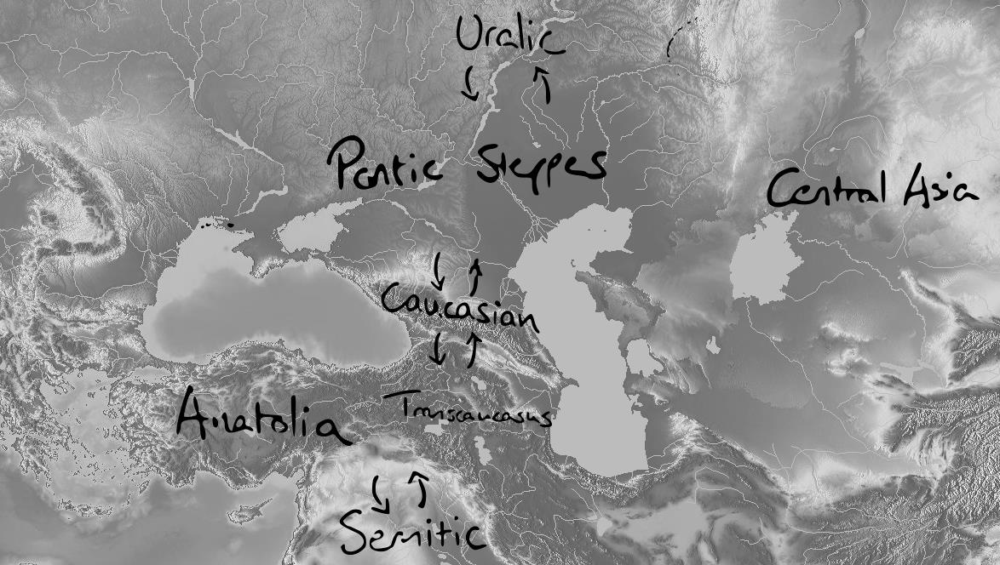

<!-- pdf-page: 47; source-page: 35 -->

# 3 Homelands and proposed relations

This chapter introduces the most widely held theories regarding the homeland of PIE (§ 3.1) and linguistic affinities, whether genetic or adstrate (§ 3.2). It should be noted that the present paper holds no a priori assumptions on these problems, and analyses are consequently not conducted to bolster one theory over another. This entails that comparanda are evaluated on linguistic merit alone, including borrowability (§ 1.4.2) and linguistic strata (§ 1.3 and § 1.4.5). The items in the wordlist are thus freely available to be employed to scrutinize the lexical evidence for the proposed locus of the initial IE emigrations or macro-phyla. That said, there seems to be compelling evidence of a Pontic-Caspian Steppe homeland, and, although exponentially more controversial, northern affinities in a shared Indo-Uralic proto-stage.

3.1 Homeland theories Although a generally satisfactory solution to this issue has been gathered over the course of the past twenty or thirty years, pointing at a final point of tangency on the Pontic Steppes, the inherent and continually renewed scrutiny and search for alternative options help strengthen and revitalize the hypothesis. As borrowing is a contact phenomenon, different comparanda have been linked to different perceptions of locality for the respective transfers, and loanword studies consequently form a central argument in all modern homeland theories; a scrutiny of lexical comparanda would lack a central part of its bearings without a basic understanding of the more common proposals on the origins of PIE. While the attested distributions of phyla such as Semitic and Uralic strongly suggest their presence south and north of the Caucasus, respectively, established loan relations with either would, mutatis mutandis, indicate closer contact at the pertinent level. The problem of assigning dates and location to the PIE homeland is as old as it is contested, but there are some key issues and aspects that can be addressed. While the basic idea of a speech community limited in time and space like modern languages has been questioned altogether (§ 1.4.4), the wealth of common lexical, pronominal, and grammatical items connected by established sound laws testifies to a common stock that requires a close-knit dialect continuum as a minimum. The vast area covered by the various ancient IE languages arguably encompasses their common point of departure. A terminus ante quem is available from the earliest attestation, viz. Anatolian from the early 2ₙd millennium BCE to which may be added some 500 years to account for some unmistakable traits already in Akkadian sources. Within these limitations, a few theories have precipitated.

3.1.1 The Pontic Steppes Gimbutas (e.g. 1997) posited the Pontic Steppes as the homeland of the Indo-Europeans on archaeological grounds, and this theory was later refined and linguistically substantiated by Mallory (1989), Kortlandt (1990), and, irrevocably, Anthony (2007). The presence of its earliest attestation in Anatolia is just geographically coincidental and suggested by the attested distribution of the Anatolian languages only in western Anatolia delimited by Hurro-Urartian in the east, favoring an entry route via the Balkans (see discussion in Melchert 2003: 24ff.). In the recent years, the increasing sophistication of DNA has

<!-- pdf-page: 48; source-page: 36 -->

corroborated this migrational trajectory with genetic data (e.g. Allentoft et al. 2015, cf. § 1.6.2), while a phylogenetic model has been presented that similarly corroborates this hypothesis (Chang et al. 2015, cf. § 1.5.1). Its implications for the internal stratification are described above (§ 1.3). This theory stands incredibly strong and is adhered to by a majority of IE scholars.

Loan word component PIE presence north of the Caucasus has been tied to contacts with the Uralic languages (e.g. Anthony 2007: 93ff.) and, following the recent surge in North Caucasian studies (§ 2.1.4), these phyla have similarly come to play an important role in establishing the spatial framework for PIE.

3.1.2 Central Asia Inspired by the known trajectories of the Iranian, Turkish, and Mongolian tribes across the Central Eurasian steppe country, Nichols (1997, 1998) envisions a similar spread of the IE languages emanating from further east than any of the other major proposals. The dispersal then followed two distinct western trajectories north and south of the Caspian and Black Seas. A central issue here, it seems, is the domestication of the horse (item 32) that accelerated movement and broadened the horizon of a given linguistic community (cf. Anthony 2007), but Nichols does indicate that similar diffusional rates could be attained bipedally, citing the spread of the Slavic peoples as a historical parallel (1998: 254).

Loan word component Nichols suggests that PIE and Kartvelian both stem from Central Asia based on shared loan word trajectories, i.e. words of Semitic origin have undergone similar developments before reaching both languages (1997: 128). Uralic connections are either explained as common genetic stock or through contacts on a similar longitudinal trajectory north of the path envisaged for PIE. The dearth of Turkic comparanda may justifiably be questioned is this regard.

3.1.3 Central Anatolia Associating the speakers of PIE with the Neolithic revolution from the Fertile Crescent, an Anatolian homeland is primarily favored by Renfrew (1987) and its basic tenet is the spread of agriculture. While the Anatolian languages then supposedly remained in their autochthonous area, non-Anatolian (or Western) IE then migrated into the Balkans from where it spread (Dolgopolsky 1989: 10ff. fn.4-5). The genetic influx of the first agriculturalists into Europe at first seemed to corroborate this hypothesis (cf. § 1.6.2), while similar dates were produced with the application of the phylogenetic method (Gray & Atkinson 2003, cf. § 1.5.1).

Loan word component Drawing on similar loan etymological interpretations as the Transcaucasian hypothesis (§ 3.1.4), intense contacts with Semitic and Kartvelian are considered suggestive of a common homeland south of the Caucasus, although the latter component is discarded rather as

<!-- pdf-page: 49; source-page: 37 -->

evidence of genetic affinity by Kaiser & Shevoroshkin (1986: 374f.). Uralic and North Caucasian comparanda are treated as secondary borrowings from early Indo-Iranian.

3.1.4 Transcaucasia Departing from the glottalic theory and typological similarities with the Kartvelian languages, Gamkrelidze & Ivanov (1995) prefer a homeland in Transcaucasia right between the Caucasus and the Fertile Crescent.

Loan word component Strong emphasis is put on the connection with Kartvelian (cf. also Winter in the Foreword to Klimov 1998: v,xi f.) and, less saliently, the Semitic languages.

Map 3.A: Main homeland theories and other language families: The Pontic Steppe, Central Asia, Anatolia, and Transcaucasia (arrows indicate expected loanword trajectories)

<!-- pdf-page: 50; source-page: 38 -->

3.2 Proposed relations Beyond borrowing and chance resemblance, the third option in the assessment of inter-linguistic similarity is common genetic heritage. While the scientific consensus justifiably rests with the established language families and isolates, a number of combinations have been proposed for deeper relationships involving two or more of these. As quite a few comparanda are difficult to stratify within the established linguistic layers, an outline of the affinity theories between PIE and the other families treated here will serve the dual purpose of adding an alternative interpretational paradigm and providing some of the impetus prompting scholars to compare the vocabularies in the first place.

The basic idea of proto-proto-linguistic unity is inherently valid, simply extending the theoretical framework supported by the available knowledge of linguistic development, but beyond the established language families (and for some even within) complexity naturally increases. These language stages may represent linguistic communities defined by a certain cultural or natural impetus to migrate while being rather successful at it, delimiting the fairly clear-cut identity of, e.g., IE, Uralic, and Turkic, where the preceding stages just as well may have been marked by dialectal variation and multi-loci adstrate influences, as described by several researchers (Nichols 1997, Uesson 1970: 70, Trubetzkoy 1939). While the genetic model of gradual branching is traditionally consulted to explain profound systemic correspondences, these alternative explanatory models, basically extreme cases of intimate borrowing in intense contact situations (§ 1.4.4), have been introduced to account for common elements; such theories are grouped here under adstrate, refraining from the more loaded terms of sub- and superstrate. The comparison of several established language families has been conducted many times, especially in the 19ₜₕ century and into the first half of the 20ₜₕ, after which the field seemingly sobered up and returned to intra-familiar problems; major exceptions include Nostratic (and/or Eurasian), Indo-Uralic, and, to some extent, Uralo-Altaic.

3.2.1 NE Caucasian Relations with North East Caucasian are only inferred from the unspecified (North) Caucasian adstrate theories, most notably S. Starostin (2009), see below (§ 3.2.3).

3.2.2 NW Caucasian Adstrate Specifying the general trend of assigning Caucasian influence to some defining features of PIE, Bomhard suggests that PIE was in intense contacts with NW Caucasian in a period leading up to the split of the Anatolian branch (2015: 11), and has produced a list of 150 lexical items to substantiate the claim. Kortlandt similarly favors NW Caucasian adstrate as the defining factor in the genesis of PIE (2010: 6). The suggested North Caucasian family (§ 2.1.4) would demand clearer stratification of these proposals.

<!-- pdf-page: 51; source-page: 39 -->

Common heritage Attempts have been made to demonstrate that PIE and the NW Caucasian languages share common heritage from a unique mutual prehistoric stage. Such a genetic connection was first suggested by Friedrich on the basis of typological features (1964: 208-9), and is now primarily championed by Colarusso, who dubbed the proposed super-family ‘Proto-Pontic’ (1981), but without wider acceptance. It may be noted that the Proto-Pontic hypothesis is at odds with the proposed North Caucasian language family (§ 2.1.4).

3.2.3 Caucasian (unspecified) Adstrate Since Uhlenbeck (1901), a school of thought has explained the identity of the IE languages as an Indo-Uralic language that was marked by considerable influence of a Caucasian language, imbuing the incipient stages of PIE with traits of ergativity, additional places of articulation, and, seemingly later, gender. The dearth of comparative evidence for the linguistic communities in the Northern Caucasus (§ 2.1.1, § 2.1.2) postponed the more precise associations that have materialized in the most recent thirty years (e.g. S. Starostin 2009: 126f.). This analysis may be corroborated by Nichols’ typological dichotomy of northern and southern Eurasian languages (cf. § 1.5.2), where PIE exclusively falls within in the northern group with the marked exception of two particular features, viz. gender assignment and a high number of consonant articulation places (2007: 203f.). Although Nichols dismisses ergativity as a PIE trait (2007: 195), another southern feature, the otherwise asymmetric accusative system seems to indicate a period of influence from such a system (Uhlenbeck 1901; Beekes 1985: 172ff. & 2011: 214-216). Of particular lexical interest is the suggestion by Uhlenbeck that the IE languages consist of two distinct layers, “A und B,” one of which represents the structure of the language, and another that provided terms for “einzelne Verwandtschaftsnamen, zahlreiche Körperteilnamen, Zahlwörter usw.” (1933: 397); such claims may now be more rigorously tested with the aid of an additional eighty years of research into the Caucasian languages.

Common heritage Reversing the trajectories of the adstrate hypothesis, Trubetzkoy suggests that PIE developed from a Caucasian language under the influence of Uralic to become an independent language family (1939: 89).

3.2.4 Kartvelian Adstrate Based on a series of typological similarities, most notably their suggested glottalic mode of articulation of one of the PIE stop series (cf. § 1.4.6), Gamkrelidze & Ivanov suggest prolonged and intimate contacts with Kartvelian in the Transcaucasian region (1995: 768f.). Smitherman (2012) believes to have demonstrated clear evidence of similarly intense contacts, but is adamant in allowing the transfers to have occurred either in PIE proper or a slightly later, still undifferentiated branch. Kartvelian adstrate is suggested to have happened in Central Asia by Nichols (1997 and 1998, cf. § 3.1.2).

<!-- pdf-page: 52; source-page: 40 -->

Common heritage Kaiser & Shevroshkin (1986) assign strictly genetic affinity due to the semantic fields to which the purported lexical comparanda belong.

3.2.5 Uralic The comparison of the entire PIE and Uralic stock is warranted by great resemblance in very core linguistic material such as pronouns and grammar (for an early and prudent comprehensive treatment of the verbal systems, see Pedersen 1933). A small handful of lexical items have traditionally been added to this list (e.g. water, item 128, and name, item 61), but other features, most prominently the consonant inventories, poorly match in the reconstructed stages.

Adstrate For the Indo-Uralic hypothesis to be written off completely, a comprehensive explanation of the glaring morphological and pronominal correspondences need be presented, and a period of intimate contact between the speakers of the Uralic and IE proto-languages is thus usually implied in most criticisms of the Indo-Uralic theory, but the systemic transfers are seldom treated in-depth; a rare exception is Wagner (1967, see Bjørn 2016: 12f. for a methodological criticism), treating a marginal enclitic form with very limited bearings on the system as a whole, while Rédei’s complete rejection of the common pronominal traits as “Lautsymbolismus” falls incredibly short of the mark (1986: 19). If the similarities in the pronominal and verbal systems of PIE and Uralic are loan phenomena, it should be expected that more vulnerable parts of the vocabulary be borrowed, too. Uralic adstrate is similarly a part of Trubetzkoy’s theory on the ultimately Caucasian identity of PIE (§ 3.2.3).

Genetic affinity: the Indo-Uralic hypothesis The lure of Indo-Uralic has drawn scholars to the theory for more than a century and a half, from Thomsen (1869) through Hyllested (2008) and the present author (Bjørn 2016), to account for the sometimes obvious consistencies, and sometimes the seemingly incompatible discontinuations. Some considerations are thus in order to qualify the objective approach to the present study:

1. The grammatical systems of Indo-European and Uralic are demonstrably

transposable, and the phonological systems are not, as has been suggested elsewhere (e.g. Janhunen 1999: 212-215), fundamentally incompatible; it may be noted here in passing that none of the two conceivably oldest branchings of IE requires the level of complexity in articulation of the velar series as is traditionally reconstructed. 2. What remains, however, to establish Indo-Uralic as a viable language family is a

shared lexicon to facilitate a thorough phonological analysis; lexical borrowing is common, and several layers of loans between the two established language families have been demonstrated, so it necessarily comes down to the basic vocabulary to provide the core evidence for shared heritage. Few obvious cognates

<!-- pdf-page: 53; source-page: 41 -->

have been identified, perhaps most notably PIE *wed-, Finnish vesi (nom.), veten (gen.) ‘water’ (item 128), and this paucity naturally constitutes a red flag, and despite glottochronological efforts (cf. § 1.5.1), the rate of lexical substitution remains undetermined. Much effort has been invested in identifying loans directly between the proto-languages (cf. Koivulehto 1991, 1994, 2001; Joki 1973; Rédei 1986) which may, indeed, have been a widespread phenomenon. 3. Claims that face-value correspondences are too alike to be of common heritage

(Koivulehto 2001:257f.), must, however, be regarded as unsubstantiated. It remains to be established what developments may conceivably separate PIE and the Uralic proto-language, but tentative inquiries into the pronominal systems suggest that the systems may actually be quite alike in some aspects, cf. the tentative correspondences from Bjørn 2016 (for a complete consonant correspondence set, see, e.g., Kümmel 2015):

*kʷ
*k̂
PIE
*k
*t
*s

*k⁽ʷ⁾
Uralic
*k
*k / *s
*t
*s

The blank dismissal on grounds of similarity alone, then, would disqualify shared heritage of English name and Sanskrit nāman-, Latin nōmen, where the inclusion of Finnish nimi only stands out in a paradigm of which we “know” that it is unrelated. 4. Phonotactic prohibition of initial clusters is internally reconstructable for Uralic,

but it need not be so for all posterity of the family. In the wordlist below, if a complex (P)IE onset is compared with a simpler Uralic ditto, it is assumed that the item transferred from the former to the latter. If, however, simplification of initial clusters in Uralic is an internal innovation, the pre-proto-language may have had higher complexity, and the conclusions reached have to be reexamined. This is speculative, and for the direct comparison there is no need to entertain such concoctions; however, in a few instances, e.g. ‘mushroom’ (item 117), distribution suggest that the Uralic form is older. 5. It is of some lexicographic curiosity that of only 18 secure Uralic cognates

(Häkkinen 2001, employing the very conservative restrictions of attestation in all branches), Helimski finds half of them in PIE, too (2001: 196 fn. 19); most relevant for the present discussion are the non-pronominal lexemes Fin. ala- ‘under’ ~ IE *Hel- ‘deep’ (not treated here); Fin. nimi ~ IE *h₁neh₃m- ‘name’ (item 61); Fin. punoa IE *spen- ‘to spin’ (item 116). He similarly questions the lack of “useful” borrowings, i.e. items with a clearer transitional value and concrete content, in the shared proto-material (2001:199). Laxing the strict criteria for complete in-family representation, more items are added, of course. To consider Samoyedic an offshoot on the Ugric branch allows a wider set of possible cognates; around 700 compared to the mere 130 or so when Samoyedic is treated as the original bifurcation (Carpelan & Parpola 2001: 77).

<!-- pdf-page: 54; source-page: 42 -->

6. While the classical PIE e-o-Ø Ablaut system has no parallel in the Uralic languages,

an older stratum of common vowel gradation may be visible (Bjørn 2016: 18f.). 7. Carpelan & Parpola suggest that satəmization is an areal phenomenon “possibly

triggered by the Proto-Finno-Ugric substratum influence upon the Pre-Proto-Indo-Aryan [of the] Abashevo culture” (2001: 131), cf. Balto-Slavic, Indo-Iranian, Albanian, Armenian, and Uralic. Secondary palatalization is also widespread in Tocharian that nonetheless is a centum branch. 8. Campbell’s (1990) proof of recurrent similarities in the arboreal stock of IE and

Uralic is unmistakable. The correspondences need only be explained either as common inheritance or loan- or wander words. It is, indeed, peculiar to find such a broad spectrum of trees represented in both families. A major caveat, however, is that the IE stock in most cases only is represented by the Western branches, i.e. that reflexes are lacking in Tocharian, Anatolian, and Indo-Iranian. Without neglecting the significance of this dearth of evidence, it is certainly conceivable that the Eastern languages have substituted the vocabulary as they encountered different kinds of landscape. These items are not etymologized. 9. The chronologies of the archaeological cultures assigned by Carpelan & Parpola

(2001) are suggestive (cf. § 1.3.1):

Period (BCE) PIE culture (location)
Uralic culture (Upper Volga)
6000-5000
Samara (Volga Bend)
Upper Volga Ware (5900-5000, Pre-Uralic)
5000-4000
Khvalynsk (Volga)
Lyalovo (5000-3650, Proto-Uralic)
4500-2500
Yamnaya (Pontic Steppes)

From what have been gathered above, a hypothesis that can be tried against further evidence may be constructed as a tentative relative chronology of an Indo-Uralic language family with established events:

1) (Tentative) Common Indo-Uralic proto-language is spoken by hunter-gatherers

in the forests of the Volga-Ural region. The stop inventory conceivably medium sized. 2) (Established) The PIE language community experiences great societal change

on the Pontic-Caspian steppes. 3) (Tentative) Meanwhile, what later becomes the Uralic language community

remains on the northern fringes of the IU dialect continuum and partook in the regional palatalization known from the IE satəm languages. 4) (Tentative) Fundamental substitution of the vocabulary occurs in one of the

constituent families (perhaps most likely PIE - from Caucasian) 5) (Established) Anatolian leaves PIE before the development of the Core-IE

aspect system; the nature of the stop system is inconclusive. 6) (Established) Tocharian similarly departs at an early stage. The stop system is

still inconclusive.

<!-- pdf-page: 55; source-page: 43 -->

7) (Tentative) The Uralic languages more or less continue the Indo-Uralic culture

and gradually diffuse; there are no traces of cultural revolution comparable to what IE underwent.

A shorter schematization with a PIE focus would be:

Indo-Uralic → Caucasian influence defines PIE → Anat. departs → etc.

Anywhere along this line, lexemes may enter the language, either by loans or internal derivation. Truly ancient words without comparanda may also disguise themselves in this category, but are, for the present time, indistinguishable from innovative features. Correlations between Anatolian and Uralic therefore require special attention (cf. Uesson 1970: 96). Later loan relations between IE and Uralic languages, of which there are plenty, are not considered in the present treatment; only, of course, so far as to establish whether a proposed etymology is warranted for the proto-languages and not just individual branches hereof.

The relationship between IE and Uralic has thus been investigated at intervals, yet without any significant breakthrough in the sense of a lasting acceptance of the phylogenetic link. A look at PIE through the lense of Caucasian, as has been suggested, may enlighten the endeavor, akin to how Modern English is incomprehensible without the knowledge of sustained superstrate influence of Norman French (cf. Ragot 2011). The attempt at a stratification within this publication will provide a framework for assessing the hypotheses of the suggested Uralic and Caucasian lexical elements in PIE.

3.2.6 Semitic and Afro-Asiatic The allure of Semitic, and consequently, but with many more intricacies, Afro-Asiatic, is primarily rooted in some typological similarities, including the Semitic system of radicals that has been proposed as a parallel to the PIE Ablaut system that is seemingly inexplicable internally in PIE (Bomhard 1981: 359ff.); whether this feature is an innovation (Greenberg 1996: 552) or shared heritage with the rest of the Afro-Asiatic stock (Huehnergard 2008: 227,232f.) remains unsettled. The employment of gender in both families have similarly been invoked as a sign of affinity, but the classical IE three-tier gender system (masculine, feminine, and neuter), does not formally match the Semitic bipartite system (masculine and feminine), even less so when PIE is reconstructed with due reference to the Anatolian stock, i.e. as bipartite system distinguishing animacy rather than actual gender. For a thorough treatment of the Semitic gender system, see Moscati et al. (1964: 84ff.).

Adstrate Semitic adstrate influence has been employed by Kaiser & Shevoroshkin to indicate a PIE homeland in Anatolia (1986: 374), while Gamkrelidze & Ivanov similarly have suggested that the comparanda warrant a location south of the Caucasus, although they prefer a point of departure further east in Transcaucasia (1995: 768ff.).

<!-- pdf-page: 56; source-page: 44 -->

Common heritage While some justifiable comparanda do exist, several formal aspects still complicate the immediate genetic affiliation. Although vowel gradation does occur in both families, the systems are incompatible; the comparanda are sporadic in either one or both families, and even the radical structure very often include an extra radical absent in the IE material, cf., e.g., Bomhard’s Afro-Asiatic examples, of which most are Semitic, e.g. Proto-Semitic *k’wš-‘to be bent, curved’ opposing PIE *k’eu- ‘id.’ (1981:432). As Levin himself (1995) is painfully aware, the comparison of PIE with Semitic that Møller (1906) diligently spearheaded has fallen completely out of favor in historical linguistics, especially due to the improving understanding of the larger Afro-Asiatic family to which Semitic belongs. Quite contrarily to the method employed by Colarusso (§ 3.2.2, §6.4.1), Levin is stuck in the philological trap when he marvels at the ostensible 1:1 correlation between Arabic tʰawraⁿ and Latin taurum, not only in the root, but even in the desinence! A similar attitude is expressed by Hodge (1998: 329) who reconstructs an ancient common ancestor, “Lislak”, harking back twenty thousand years; a depth of time comparable to Nostratic (§ 3.2.8). What Levin and Hodge fail to observe, of course, is the history of both declensional systems; the IE side of the story should be familiar, while the common Semitic system clearly rests on a purely vocalic alternation a-i-u, only secondarily fitted with -m as a means of definiteness (Moscati et al. 1964: 94ff.). A thorough and damning criticism of Levin’s work from the perspective of an otherwise enthusiastic macro-comparativist is presented by Bomhard (1997). The interrelatedness of Semitic and Indo-European is not impossible, but tangency most likely only appears at the Nostratic horizon.

3.2.7 Sumerian No homeland theory directly suggests that the PIE speech community should have had contacts with the area of known historical Sumerian habitation, and different models have consequently been proposed for the lexical comparanda, including common genetic heritage, proto-Sumerian migrations, and, most probably, transmission through known (e.g. Semitic) or unknown geographically intermediary languages (cf. Sahala 2009: 2f.). This latter proposal is bolstered by the obvious cultural impact of the Sumerian civilization directly demonstrated in extensive loans into the Semitic languages.

3.2.8 Macro-families The proposition of macro-families compiles a number of established language families and isolates in strictly hereditary groupings such as Eurasiatic (e.g. Greenberg 2000), Nostratic (e.g. Bomhard 2008), and even Proto-world, tracing human languages to its suggested African monogenesis (e.g. Ruhlen 1994). The difficulties are palpable and exponentially more intricate than with the traditional proto-levels, but a comprehensive literature is available making volumes of comparanda available. Some references are given here on comparanda with more profound resemblances that are difficult to establish either as borrowings or chance resemblance.
