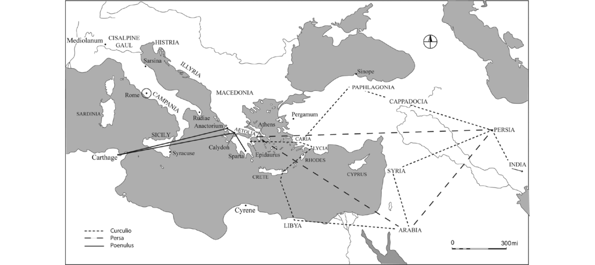

# Chapter 3 Elusive Migrants of Ancient Italy

**Contributors:** Elena Isayev

The landscapes of the Italian peninsula, no less than others in the ancient Mediterranean of the third and second centuries BC, hosted numerous intersections for the convergence of resources – people, objects, ideas and stories – recounted in multiple languages and mediums.[^1] Propelled by technology, trade, warfare and alliances, as well as love, curiosity and brigandage, the ensuing connectivities stimulated the emergence of new sociocultural trends and communities. Both material and literary endeavours attest to the dynamism of multiple movements within and through Italy in this period (Isayev 2017). Yet, tracking migrants who were part of these human flows, in terms of numbers, origins, destinations and the drivers of their mobility, proves difficult apart from a few exceptional episodes. Beyond the peninsula it is particularly hard to identify individuals of Italian origin living abroad before the Late Republic, despite multiple indicators of ties between communities in Italy and sites around the Mediterranean, especially in the archaeological record. In part, the elusive nature of migrants may be attributed to the governing authorities’ lack of interest in counting and recording people on the move, beyond what was necessary for military recruitment, the census and taxation. While there were requirements for traders to register their goods at customs houses (Lefèvre 2004; Bresson 2007),[^2] we have 

no evidence in this period for physical state borders or any checkpoints resembling those of twentieth- and twenty-first-century immigration controls that would have hindered civilian mobility. The lack of such mechanisms is a testament to the positioning of mobility, not as a phenomenon that was exceptional to the everyday functioning of communities, but inherently embedded within it. The barriers that were difficult to cross were those of status, especially the one between slave and free. To showcase the extent to which a mobile culture formed part of the everyday norm of Italo-Roman society, this chapter will present a number of cases indicative of people from Italy moving around the Mediterranean and then examine ancient perceptions of mobility through the comedies of Plautus. The ancient cities of his plays – whether Athens, Calydon, Epidamnos or Thebes – are dynamic sites of interaction. They also reflect an interest in finding new ways to define movement and categorise those who were present in the city at any given time, both the long-term residents and the new arrivals.

## Mobility of Italians in the Third and Second Centuries BC

Beyond the stage, epigraphy provides the most tangible evidence for the presence of civilians from Italy in other parts of the Mediterranean in the period of the third and second centuries BC. Studies such as those of Hatzfeld (1912; 1919), and more recently of Ferrary (2002) and Hasenohr (2007b), for example, have shown that Italians are visible on the island of Delos from at least the third century BC (and see also Rovai, Chapter 8 of this volume). Before this period, however, we have trouble recognising people with Italian origins abroad in any substantial numbers, although from ancient writings and other material evidence we know they must have been there. In part this has to do with the lack of interest in displaying Italian cultural traits materially before the spread of Roman power. The virtual invisibility can also be attributed to the nature of the epigraphic habit in Italy itself, which only gained prominence in the third and second centuries BC, especially with the diffusion of elite funerary epitaphs (Berrendonner 2009: 192). Based on surveys of 

a decade ago, for the whole of Italy the total number of Latin inscriptions known from the third century BC is about 600, of which only about 146 are from the city of Rome (Gordon & Reynolds 2003: 219–20, 227–8). In the following two centuries the total number of Latin inscriptions from Italy rises to over 3,000, and most of these date to the final 160 years (Panciera 1997; Gordon & Reynolds, 2003: 219–20; Pobjoy 2000). This is precisely the point at which Italians overseas become more visible. Individuals who arrived from Italy or had roots in the peninsula can be recognised as such on inscriptions either by the nature of their name (which is not uncontroversial: Wilson 1966: 104–7; Solin 1982: 112; Müller & Hasenohr 2002) or because they are cited, for example, as <em>Rhômaioi</em> or <em>Italikoi</em> in Greek inscriptions and as <em>Italici</em> in Latin ones (Ferrary 2002: 135). The surviving number of such inscriptions, however, still does not reflect the extent to which Italians would have moved out of the peninsula to work and live abroad.

The issues surrounding the visibility of people from Italy abroad may be captured by considering the sources related to the slightly later events which took place in Asia Minor. Our earliest inscriptions from this region that include names which are distinctly recognisable as Italian are from Pergamum and date to circa 133 BC (von Prott & Kolbe 1902 Nr. 116; Nr. 118; Nr. 119). The presence of these individuals would have preceded direct Roman administration and formation of the province of Asia Minor that was overseen by M. Aquillius in the years 129–126 BC.[^3] Despite the extension of direct Roman rule over the area, even a generation later, the total number of remaining inscriptions indicating persons of Italian origin is about a handful.[^4] We get a different impression of the situation from the records of Mithridates’ massacre in 88 BC of Romans and Italians living in Asia Minor. The total number of those who were killed, according to some authors, was 80,000.[^5] 

Whether we can believe this possibly exaggerated figure is questionable. Still, even if reduced to 10,000, the number of people who lost their lives is significant, especially if we consider it in light of the overall free population of Italy, which some estimate at about eight million in the first century BC (Bowman & Wilson 2011; De Ligt 2012; Hin 2013). Without the references to this event we would have little sense that so many Italians lived in this area of the Mediterranean at the time. The episode, which engulfed numerous communities in the region, is particularly revealing, since these people were not in Asia Minor as a result of any mass mobile event such as colonisation. They lived across numerous cities, arriving as individuals and in family or household groups for a variety of reasons and opportunities, both economic and cultural. These would have increased with Roman hegemony, not least for the <em>publicani</em> (tax collectors)[^6] and the <em>negotiatores</em> (tradesmen), who could operate with the added protection of Roman laws (<em>Lex de Prouinciis Praetoriis</em> = Crawford 1996: Law 12). It was in part their exploitation of the region that was later blamed for the widespread support of Mithridates, leading to the murder of Romans and Italians in 88 BC (Justin 38.7; Amiotti 1980: 134, 139).

The form of independent and private mobility which is evidenced by these events is the great unknown in terms of numbers on the move. Our figures for such mobility exist on a large spectrum of two extremes proposed by demographic studies: in the second and first centuries BC the total number of individual movements through, in and out of Italy could have been either five million (the low estimate by Scheidel 2004) or forty million (the theoretical figure based on medieval comparisons, Osborne 1991; Erdkamp 2008: 419). What has become evident is that the large figure is plausible (Isayev 2017: chapter 2). Even Scheidel, using the well-documented census data of the Augustan period at the end of the first century BC, estimates that some 40 percent of male Romans over forty-five would have been born in a different location to their current place of residence (Scheidel 2004: 13–20; 

Scheidel 2006: 223–4, with De Ligt 2012: 120–8). The figures can be adjusted depending on what is believed to be the overall population of Italy, but even if the total estimate is reduced from 40 percent to 20 percent (based on doubling Scheidel’s low count figures for the overall population),[^7] it still remains a substantial proportion of the <em>recorded</em> citizen body which is on the move. Such demographic calculations, presenting a highly mobile culture (as also supported by Tacoma 2016a), are one step towards understanding the ways in which mobility and those who were on the move were positioned within society.

## The Plautine Corpus

Plautus wrote his comedies in the decades which spanned the third and second centuries BC – a period of unceasing warfare on the Italian peninsula and beyond it. Produced against the backdrop of the Hannibalic War and the repercussions that followed, his corpus may be conceived as a wartime repertoire. Amy Richlin’s most recent study of the Plautine corpus shows the extent to which we need to position it not only in the midst of warfare and devastation but also within the context of mass displacement and enslavement (Richlin 2017). In fact, she argues that his comedies are ‘slave theatre’ – performed by select travelling troupes who were largely made up of the lowest members of society for consumption by an audience that would have included many of their peers. While some may question the extent to which the comic entourage was made of up slaves, there is no doubt that the comedies present a world where movement was ubiquitous, a society that depended on mobility, anticipated it and was aware of its risks and opportunities. But this is not predominantly due to the wartime context, even if conflict and criminal activity are the roots of many characters’ predicaments of slavery and displacement. When Plautus was writing his comedies, aside from the war-driven circulation of people, Rome was also rapidly becoming the main destination cosmopolis for merchants, politicians, artists, craftsmen, scholars, slaves, entrepreneurs and others seeking opportunities around the Mediterranean. The players allow these other stories to 

emerge, even if Rome itself is never the setting for Plautus’ comedies. They consistently tell the audience that the plays are on foreign soil, <em>palliata –</em> in Greek dress, to enhance the foreignness of their actions. The prologue to the <em>Menaechmi</em> emphasises this: ‘This story is quite Greek-ish, but to be exact, it’s not Athen-ish, it’s Sicil-ish, in fact’.[^8] Despite the pretence of a distant physical setting, there are few distinguishing characteristics in the actions of the comic ‘Greeks’ or ‘Sicilians’ (Segal 1987: 37). Plautus’ imaginary settings could be anywhere (Gratwick 1982: 112–13; Gratwick 1993: 8–15), and equally they could each be Rome. The mobile eclectic troupes of multiple origins who evoked these settings were the transmitters of stories and performances, old and new, that reached into Latium. Greek theatre was already being consumed and adapted by Italic elites living in the hinterlands of South Italy from the fifth century BC (Taplin 2007: 32; Biles & Thorn 2014; Robinson 2014; Nervegna 2015). Through an intricate study of theatrical scenes on vases found at indigenous South Italian sites, Robinson has demonstrated that the aristocrats who purchased them, and for whom they were produced, would likely have had first-hand knowledge of the performances that were depicted. The site of Ruvo in ancient Apulia, for example, contained forty-four such vessels (Robinson 2004; 2014: 326). Here was just one of the many intersections that through theatre alone strung together Greece, Sicily, South Italy and, by the fourth century BC, also Macedon. It is representative of wide-reaching networks and a shared cultural milieu, which equally pervades the later cosmopolitan settings of the Plautine corpus.

The Greek dramatic underpinnings of Plautus’ comedies, in particular the products of Greek New Comedy (c. 325–250 BC), have driven an ongoing debate about whether the plays can be used as a historical source for Republican Italy, which partly hangs on the extent to which Plautus altered the Greek originals.[^9] There is now sufficient evidence indicating that the Plautine corpus was highly innovative; it is not made up of simple translations, nor even of close adaptations of the original texts (Lefèvre, Stärk & Vogt-Spira 

1991; Benz & Lefèvre 1998; Fraenkel 2007; Richlin 2017). His works are unlike the comedies of the later Roman playwright Terence, who followed the Greek originals much more closely (Segal 1987: 7; Habinek 1998: 56–7). Plautus’ plays are products of his time, reflecting Romano-Italian concerns and societal frameworks, proving an important historic source for the period (e.g. Segal 1987; Leigh 2004, Manuwald 2011: 225–33; Richlin 2017). There are differences in the approach to mobility between the Greek and Plautine comedies. In the Greek plays mobility is usually part of the backstory rather than crucial to the plot, while in most of Plautus’ plays a character coming from abroad holds a central position. His imaginary world also feels bigger and more global, lacking a single centre, while the Greek comedies operate with more local networks using Athens as the primary hub, along with its demes. Plautine characters seem to travel further and for longer periods of time. In choosing to move, individuals did not set out with the goal of becoming members of new communities; the presence of colonial foundations hovers in the background (<em>Epidicus</em> 342–3; and <em>Pseudolus</em> 1100). Unlike the preceding Greek plays, especially those of Menander, in which it is specifically Athenian citizenship that matters, Plautine characters seek generic citizenship rather than that of any particular state. This is not to say that there is less mobility evident in Greek comedy, but rather that it is not as prominently displayed, which perhaps suggests a different perception of those on the move.

The way in which Plautine comedy exposes Italic characteristics, while seeming to follow Greek comic plots, is exemplified in its plethora of homecoming scenarios. Many of the Latin plays have extended scenes of homecoming or the welcome and greeting of a guest that are often accompanied by mockery of hospitality rituals. Those who typically are on the receiving end of this hospitality include friends and visitors, foreign notables, soldiers returning from campaign, merchants and relatives arriving from business trips or the farm.[^10] In addition, homecoming scenes are also satirically played out among slaves, courtesans and parasites, 

offering hospitality which they could not fulfil, or expecting it (e.g. <em>Stichus</em> 480–90; <em>Bacchides</em> 185–7). An example is Plautus’ <em>Epidicus</em> (1–10), which opens with two slaves acting out the rituals of welcome. The dialogue is between Thesprio, just returned from a campaign, carrying his master’s equipment, and Epidicus, who is there to greet him:[^11]

Epidicus:

Hi there young fellow!

…

Thesprio:

Good day to you.

EP:

God grant your wishes. Glad you are safely back.

TH:

What about the rest?

EP:

What

’

s normally added to this: you shall be given a dinner.

TH:

I promise

–

EP:

What?

TH:

–

to accept if you give me one.

EP:

What about yourself? Are you well?

It is an example of a stock sequence, which begins with the recognition of the traveller, then a greeting followed by an expression of delight for their safe return, an enquiry after their health, and ending with a dinner invitation (Barsby 1986). The slaves’ inability to provide dinner, along with the unlikelihood that anyone would take care of their well-being, is what makes the scene into a satirical subversion of the rituals expected upon a freeman’s return. Part of the comic effect may have been created through an implicit questioning of the sincerity of such exchanges overall, which follow a well-known pattern that appears in other Plautine comedies as well. The situation is somewhat different in the Greek plays, such as those of Menander, for example. Although there are many homecomings in his surviving corpus, they are presented in a more cursory way, at times as a simple greeting upon a character’s return (e.g. Menander’s <em>Dis Exapaton</em>, 102–7; with Barsby 1986: 140). Plautus takes them to the other extreme, as Lowe (2007: 110) reflects on the comedy of <em>Stichus</em>: ‘Menander’s play seems to have been taken apart and reassembled into a virtually plotless montage of festive variations on a theme of homecoming’. There would have been little incentive for Plautus 

to revel in these scenarios unless they enhanced the comic effect. In order for the status subversion to work, the audience would have had to be familiar with the rituals, implying that they happened often and formed part of a shared etiquette to which the spectators could relate.

Could it be that the Plautine scenes convey a more general widespread cultural trait: an Italian fascination with the rituals of arrival? Although not explicit, there may be some evidence of this from the archaeological context. In Italy, the theme of some of the images in the fourth- and third-century BC tomb paintings from the cemeteries of Poseidonia has been interpreted as that of homecoming. The scene usually depicts a woman with a libation and a warrior on horseback, who at times wears distinctive dress and armour, such as the three-disk breastplate typically associated with the Italic sphere.[^12] The scene, understood as one of greeting, seems similar to the better-known portrayals of women and warriors on Attic pottery (Greco Pontrandolfo & Rouveret 1983; Pontrandolfo & Rouveret 1992). On the Greek vessels, in contrast, the depiction is less ambiguously one of departure, with an arming for battle rather than a return. It would require a more in-depth study of the visual and literary material to see if, among Italic communities, there was a greater emotional focus on arrivals than on departures compared to what we find in the Greek sphere.[^13]

## Comedies of Movement

The Plautine comedies do not provide any additional data to help make better calculations for the numbers of people on the move – a preoccupation of the twenty-first century for which interest in the ancient world was lacking. They show little interest in the state-initiated mass migrations that are often the focus for demographers. Instead, their interest is in explorations of the unquantifiable, everyday movements of individuals and their entourages 

around the cities of the Mediterranean. The plays reveal a certain intangibility of the physical landscapes within which any notional <em>patria</em> sits.[^14] Any nostalgia for a past (or future) home tends to envisage it as ephemeral, a matter of moments in time rather than space. It may be embodied in the simple question posed by the servant Messenio to one of the twins in Plautus’s <em>Menaechmi</em> (1111): <em>Quid longissume meministi, dic mihi,</em> **<em>in</em>** <em>patria tua?</em> (Tell me, what is the earliest thing you remember **in** your country?). The question is not what is remembered **of** the <em>patria</em> but the action **within** it. In response Menaechmus recounts the memory of going with his father to a market in Tarentum, where he wandered off and was taken away. In the comedies, the home of return that is conjured up appears as an intersection of relations at one’s birthplace rather than any evocation of the built or natural environment. The most tangible elements of a <em>patria</em> are the <em>domus</em> and its altars, which are used metaphorically, and in the earliest Latin literature are often presented in opposition to statelessness and exile (Isayev 2017, chapter 11). They appear in Ennius’s tragedy of <em>Andromache</em> (83–4, 87) who evokes her stateless existence through its symbols: <em>arce et urbe orba sum. quo accedam? quo applicem? cui nec arae, patriae domi stant, fractae et disiectae iacent</em> … <em>O pater, o patria, o Priami domus!</em> (‘Citadel and city gone. Where shall I take myself? Where shall I appeal? No longer do my ancestral/native altars stand at home but lie broken and scattered … O father, O fatherland, O house of Priam!‘). Although the setting draws on Greek narratives, as Jocelyn (1969: 244–5, 250–2) and Feeney (2016: 75) observed, Ennius employs the language of Roman law and social practice, presenting the destroyed altars as a symbol of loss. The lament was familiar enough to be parodied in Plautus’s <em>Bacchides</em> (932): <em>O Troia, o patria, o Pergamum, o Priame periisti senex …</em> (‘O Troy, o fatherland, o Pergamum, o old Priam, you have perished … ‘).

The rootlessness and search for an intangible <em>patria</em> can be in part attributed to the uncertainty and displacement resulting from the backdrop of warfare and mass enslavement against which the plays were created, as suggested by Richlin (2017). There is also 

shifting and restlessness, which goes beyond the conflict scenario – an anticipation of people on the move, which the comic plots depend on. In the prologue of Plautus’s comedy <em>Menaechmi</em> (72–6), the towns are mobile as are their inhabitants, inside and outside the comic action. To set the scene an actor puts the play, and the stage-set, into motion:

> ‘This is the city of Epidamnus while this play is acting; when another shall be acted, it will become another town. It is quite like the way in which families too, are wont to change their homes; now a pimp lives here, now a young gentleman, now an old one, now a poor man, a beggar, a king, a parasite, a seer’.[^15]

Plautus’s <em>Mercator</em> tells of sons selling up their fathers’ farms to move onto a life at sea as merchants (Plautus <em>Mercator</em>, 64–79). Neither in his comedies, nor in the writings of his contemporary Cato, do we find the image of the sedentary farmer. Although for Cato the model Roman citizen is a farmer and soldier – in contrast to the untrustworthy tradesman – his <em>de Agri Cultura</em> is written for the farmer as businessman (Cato <em>de Agri Cultura</em>, Introduction 1–5). Implicit in the <em>de Agri Cultura</em> are regular movements between town residence and country farm which are also part of Plautus’s comic repertoire (e.g. <em>Casina</em>, 90–112, and <em>Mercator</em>, 275–82). Although these shorter movements may be distinct from ones further abroad, still, Cato’s writings reveal an environment with high turnover of farms and owners, encapsulated in his advice for buying a farm: that it should be in the neighbourhood where farms do not often change owners and those who have sold up are sorry to have done so (Cato <em>de Agri Cultura</em>, 1.4). The destinations of those who sell up their farms, whether within the <em>ager Romanus</em> of Italy or the newly expanding Roman territory overseas, is another matter and not specifically of interest for Cato in this particular work.[^16] In these writings the figure of the sedentary peasant is missing, except in an idealised almost mythical sense: a figure whose existence Rathbone (2008) and others have also 

questioned (Horden & Purcell 2000: 380; Archibald 2011). Like the merchant, the agriculturalist too can soon find himself on the road, either because of military service, expulsion, enslavement or simply the choice to do something other than farm – to follow a love interest or the ambition to take to the seas as a tradesman. Plautus’s world map is a dense web of life trajectories criss-crossing the Mediterranean.[^17] Some of the longest traverses appear in the plays <em>Curculio</em>, <em>Persa</em> and <em>Poenulus</em>, with the journeys presented there spanning from the Black Sea to North Africa and as far as India (Figure 3.1).

## A Disposition for Mobility

Multiple aspects of the Plautine comedies indicate that a highly mobile culture was embedded in the Romano-Italic context that produced and consumed them. Many of his plays depend on travelling characters arriving from foreign parts or setting off on journeys as comic motifs to drive the action. Some plays have few characters of local origin, and in <em>Poenulus</em> none are citizens of Aetolia, where the action is set.[^18] Outsiders are used as targets for subversion; newcomers with the least amount of local knowledge overturn the role of their hosts (especially in <em>Menaechmi</em>; <em>Miles Gloriosus</em>; <em>Poenulus</em>; <em>Rudens</em>). It may appear curious, therefore, considering the frequency of arrivals and the variety of welcome scenes, that the Plautine characters show little interest in the foreign aspect of the journeys, the places visited, or origins. These factors become a point of interest when needed to establish the characters’ position in society and their status as slave or free (especially in <em>Menaechmi</em> 1068–95; <em>Persa</em> 595–648; <em>Poenulus</em> 1040–85; <em>Rudens</em> 735–45, 1130–53). Otherwise, for the internal logic of the plays it seems to matter little which city the characters came from, particularly if they were slaves. Plautus’s insistence

 

that the plays are on foreign soil, <em>palliata –</em> in Greek dress, does not translate to his characters having particular distinguishing ethnic features. That is not to say that foreign cultural traits are absent. On the contrary, bizarre names, Persian and Carthaginian exotic dress habits, and the Punic language do become direct comic targets in the plays <em>Persa</em> (330, 473, 690) and <em>Poenulus</em> (975–1040; Palmer 1997: 31–52). Negative cultural stereotyping in Plautus’s comedies also appears in the metatheatrical context, where the targets of humour become those who are close to home, such as the smelly Roman rowers (1313–14), the pompous Praenestines (<em>Bacchides</em> 21–2; <em>Captivi</em> 884; <em>Truculentus</em> 690), and the Apulians, who have strange habits (<em>Miles Gloriosus</em>, 648). But there is little within these caricatures that fits the category of xenophobic ethnic labelling of the kind that appears in Greek Comedy. There is nothing as direct as the Greek playwright Alexis’s characterisation of Boeotians, as slow, boorish and gluttonous in <em>Trophonius</em> (fr. 239 K-A (237 K)), for example. Nor are there contrasting stereotypes, as in Menander’s <em>Aspis</em> (240–5), of the virile and vigorous Thracians who are pitted against the unmanly, cowardly Phrygians. The portrayal of the ‘other’, of the kind presented in Hartog’s <em>Mirror of Herodotus</em> (1988), is not to be found in the comedies of Plautus. It is absent even in <em>Poenulus</em>, as will be argued below, despite the majority of its characters being of Carthaginian origin.

<em>Poenulus</em> is a particularly intriguing comedy, because its hero Hanno is a Carthaginian – an endearing uncle who comes to Calydon in Greece searching for his stolen daughters. The comedy may have been based on a much earlier Greek original with a similar plot, <em>Karkhedonios</em>, probably by Alexis (Arnott 1996; Arnott 2004). But the appearance on a Roman stage of a Carthaginian Hanno in 191 BC, soon after the Second Punic War (Henderson 1999: 8), could not have been a neutral decision by the playwright. Nevertheless, there is no hint that the subject matter of <em>Poenulus</em> may be uncomfortable for the Roman audience. There is no sense that it embodies the recent trauma of the ravages of Hannibal’s campaign in Italy. The foreign hero displays pious and noble traits, which cannot be argued away (Hanson 1959: 92–5; Franko 1996: 441; Maurice 2004: 268). Hanno’s 

devotion to his family and reverence for the gods are exemplary of a virtuous Roman. This is even acknowledged by Franko (1994; 1996), who has argued that the partially derogatory depiction of the Carthaginian characters in the play echoes actual Roman xenophobic attitudes towards Carthaginians in the post-war period. A key point of controversy is the way in which the comedy uses the term <em>Poenus</em> – ‘Punic’. Prag (2006: 5–8, 14–15, 30) in his analysis of its use concludes that it was unlikely to have been a pejorative label at the time of Plautus, and that the comic use of <em>Punica fides –</em> Carthaginian perfidy – is essentially a <em>political</em> claim; a characterisation that is equally applied to Greeks, among others, in the comedies (e.g. Plautus <em>Asinaria</em>, 199; Segal 1987: 38–9).

The issue with <em>Poenulus</em> is that it is too much like Plautus’s other comedies. There is just not enough of the stereotyping or the fear and hatred of the ‘other’. We may wonder whether Hanno’s opening speech in Act 5, delivered in Punic, would have startled the Roman audience. How familiar was the sound of the Carthaginian tongue, and was it purely associated with hostility? It may be that the Punic passage was not a Plautine creation but an adoption from Alexis’s Greek original. For some of those watching the comedies – whether as civilians, hostages (Allen 2006: 161–3), refugees or slaves – Punic may have been their mother tongue. It may be that Punic speech brought to mind trade, travel, festivals and distant friends rather than merely hostility.

Carthaginians were the trading partners of Italic communities for centuries. Punic inscriptions at such Archaic sanctuaries as that of Etruscan Pyrgi are a testament to these links (Heurgon 1966; Bonfante & Bonfante 2002: 64–8). The interweaving of cultural practices is also evident on a fourth-century BC Tarquinian sarcophagus of Carthaginian design decorated with Etruscan painting (Crouzet 2004; Fentress 2013: 157–78). Punic elements had filtered into Italian practices and even language: from everyday things such as Punic porridge – <em>pultem Punicam</em> (Cato <em>Agr.</em> 85) and specialty objects such as Punic couches – <em>lectuli Punicani</em> (Cicero <em>Mur.</em> 75), to more technical elements such as Punic windows and joints (Cato <em>Agr.</em> 18.9; Varro <em>R.</em> 3.7.3; 1.52), and perhaps even the <em>macellum</em> (Palmer 1997: 43–8, 115–19). Remains of 

possible Semitic/Punic names appear at a number of sites on the west coast of Italy (La Torre 2009: 191), such as the Phoenix who was cursed on a fourth-century BC <em>defixio</em> from Roccagloriosa (Buxentum 3/Lu 45). Romano-Carthaginian treaties, as recorded by Polybius, are a testament to long-term links and the presence of both groups in each other’s communities (Palmer 1997; Erskine 2013: 113–29; Isayev 2017, chapter 8). There is even a suggestion that the Hercules cult at the Ara Maxima in the Forum Boarium may have had Phoenician roots and is evidence of such foreign traders in Rome during the Archaic period (Van Berchem 1959–60; Van Berchem 1967; Forsythe 2005: 119–21).

Conversely, long-standing Italo-Carthaginian relations also mean that by this period Italians could hardly have been newcomers to the northern shores of Africa. There is some evidence that there may have been a significant number of Romano-Italian landowners or investors in the region.[^19] Such investments may have been one of the reasons that the agricultural pamphlets of the Punic author Mago (Varro <em>R.</em> 1.1.10; Lancel 1992: 273–80; Erskine 2013: 117) were translated into Latin in the second century BC (with senatorial funding) by Decimus Silanus, a specialist in Punic language and literature.[^20] Italian civilians appear to have been in Carthage even on the eve of its fall in 149 BC. Polybius describes how the Carthaginians, realising their fate, threw themselves at the envoys and any other Italians they came across (Polybius 36.7.4–5; Appian <em>Punica</em> 92).

A persistent question concerning Plautus’s <em>Poenulus</em> is: Would we notice any distinctive features within it, especially in relation to ethnic stereotyping, if another city of origin was used in place of Carthage for its protagonists? In the comedies there is little to suggest either that those going abroad or those coming into the 

community would have struggled to fit in culturally, or that they would have been at the sharp end of xenophobic harassment. The characters care little for ethnic concerns and in their transfers between different locations continue to function within an apparently unitary cultural milieu. Here the <em>Poenulus</em> is no exception. Hanno on arrival in Calydon displays full knowledge of the legal system and of his rights as a visiting freeborn citizen, while also being aware of the difficulty which outsiders have in bringing cases to trial.[^21] The most prominent obstacle for the outsider, and for those who have been away for some time, is their lack of knowledge, and networks of <em>hospites</em> whom they can trust and rely on (e.g. <em>Miles Gloriosus</em> 480–530; <em>Poenulus</em> 1003; <em>Mostellaria</em> 473). Taking the perspective of the outsider in Plautus’s <em>Asinaria</em> (495), a trader in Athens, wondering whether to trust Leonida the slave, states that ‘man is no man, but a wolf to a stranger’.[^22] All those whom one does not know are potentially dangerous, whether native or alien. What is most noticeable throughout the comedies is the nonchalant attitude to foreignness and an assumption of shared understanding along horizontal society lines, even between those separated by vast distances.

## Mobile Terms

We might expect in any society that has specialised terms for the accoutrements of travel such as travel funds <em>– uiaticum</em> (Plautus: <em>Captivi</em> 449; <em>Poenulus</em> 71; <em>Trinummus</em> 720), or a travel bag – <em>uidulus</em> (Plautus: <em>Menaechmi</em> 287; <em>Vidularia</em>) – neither of which exist as a single term in English – that mobility is also ubiquitous. The nature of everyday mobility can be traced in the Latin terminology and expressions used in the comedies of Plautus that refer to the act of moving, its accoutrements, and those who departed and arrived. Even the Latin term <em>migrare</em> and its derivatives reveal a particular understanding of migration, which is distinct from what we understand by it today. A key difference in Latin Republican usage, as it appears in the comedies, is that it does 

not make a distinction between a move that is made to a different state or community, and one that is simply to a house next door. The most frequently used derivative is <em>commigrare</em> which defines a move to a different residence with one’s family and belongings (Plautus: <em>Cistellaria</em> 177; <em>Poenulus</em> 94; <em>Trinummus</em> 1084–5). But it could equally be expressed by <em>emigrare</em> or <em>migrare</em> (Plautus: <em>Epidicus</em>, 342; <em>Mostellaria</em>, 470–2). In the writings of Plautus and other Latin authors of the time, <em>migrare</em> simply indicated a physical move from one place of residence to another. It was not used to articulate distance, duration or the crossing of community boundaries. One anomaly is the compound <em>remigrare</em> which appears metaphorically in the prologue of the comedy <em>Poenulus</em>, 46–9. The narrator, recognising that he has gone on for far too long and off the main subject, states that he now wants to <em>remigrare</em> (return) to outlining the plot. The additional language of land surveying that follows the actor’s comment is an allusion to land division which accompanied new foundations, veteran or colonial.

In this playfulness with the terminology of mobility, we can see an increasing interest in defining forms of movement and categorising those from abroad, which accompanied Rome’s increasing empire and its establishment as a central Mediterranean hub. There was a variety of Latin terms that were used to refer to the ‘outsider’. The most threatening outsider was called a <em>hostis</em> – an enemy. The opposite is expressed by <em>hospes</em> – guest friend, indicating ties to the members of the host community and the expectation of hospitality by the incomer (<em>Persa</em> 603; <em>Asinaria</em> 417). The juxtaposition of these two is expressed in <em>Bacchides</em> (251–3): <em>tun hospitem illum nominas hostem tuom?</em> – ‘Do you call that enemy of yours your friend?’ At times, the term <em>hostis</em> is used in the Plautine comedies to mean foreigner, but in the vast majority of cases its unambiguous meaning is enemy. Of the terms used by Plautus, the most neutral in the third and second centuries BC was <em>peregrinus</em>, meaning to be from elsewhere or abroad – <em>peregre</em>.[^23] Other terms such as <em>alienus</em> or <em>ignotus</em>, more specifically, 

identified someone as being unknown.[^24] But the categories were not necessarily overlapping, as one did not need to be a foreigner to be a stranger, and both terms could be equally used in reference to a local who was unfamiliar. Considering the variety of Latin terms, it may be surprising that there is no equivalent to the English term <em>immigrant</em> as it appears in current usage, referring to someone who moves across an international border or boundary in a permanent way with the purpose of residence.[^25] The closest Latin equivalent for the more generic term <em>migrant</em> is <em>transitor</em> – literally meaning he who goes over or is a passerby. But it only appears in late antiquity when concepts of immobility were beginning to be associated with virtue (Ammianus 15.2.4). By the time of Justinian in the sixth century AD people were being scrutinised on entry into Constantinople (Feissel 1995: 366). The categorisation of someone as <em>transitor</em>, in the same way as <em>migrant</em> today, is not a neutral designation. It implies an adverse state and reflects shifting attitudes to mobility, the status of individuals, and methods of control.

There were different expressions designating those who lived in the city. These appear as a list in Plautus’s <em>Aulularia</em> (406–7). A mistaken robbery forces Congrio, the cook, to run into the street appealing for help to those around him: <em>cives</em>, <em>populares</em>, <em>incolae</em>, <em>accolae</em>, <em>aduenae</em>, <em>omnes.</em> We can imagine that as the actor shouted this from the stage he would have attracted the attention of bystanders, in the hope that they would join the audience.[^26] The most literal translation of the passage which allows for the broadest meaning is ‘citizens, compatriots/countrymen, inhabitants/resident-aliens, neighbours, arrivants/newcomers, everyone’.[^27] 

This cry for help to those on the street indicates that there was a certain level of distinction among the city’s freeborn foreigners. In this inventory, the term <em>incolae</em> is of particular importance because Plautus provides the earliest example of its use in Latin literature.[^28] It appears to distinguish a specific status, perhaps one equivalent to a <em>metic</em> in the Greek context (Kasimis 2018). From later Latin texts we know that its use becomes more defined. In the <em>lex Coloniae Genetiuae</em> of the first century BC (chapters 95.6 and 126)[^29] and <em>lex Irnitana</em> of the first century AD (chapters 69, 71, 83, 84, 94)[^30] the term is employed to designate resident aliens, or more precisely those who have transferred their <em>domicilium</em> to a place different to that of their origin (Thomas 1996: 25–53). These later texts indicate that <em>incolae</em> would have had both rights and obligations in their new place of residence. By this period the meaning of <em>incolae</em> became more defined, but its use in the comedies of Plautus is not exclusively reserved for contexts involving foreigners. Its meaning appears to have been more fluid in the early second century BC. In <em>Persa</em> (554–5), <em>incolae</em> is used as a reference simply to inhabitants or residents, without any specification of status: ‘If the inhabitants (<em>incolae</em>) are of sound character, I consider the town well-fortified’ – <em>Si incolae bene sunt morati</em>, <em>pulchre munitum arbitror.</em> Similarly, a general meaning is implied by the use of the verb <em>incolere</em> – to reside – in <em>Rudens</em> (906–7). Not only does the term have diverse meanings but, as Thomas (1996: 28–34) has also noted, even in epigraphic texts it appears without any consistent statutory designation. At the time that Plautus was writing, it is plausible that the term was gaining a more specific definition. This would allow for another layer of meaning in the cook’s appeal to those around him in the <em>Aulularia.</em> The whole list may be a topical play on the emerging status categories in Rome, and their proliferation could be easily turned to comic effect just at the moment when numerous people flocked 

to take up the opportunities offered by Rome the new Mediterranean hub – the reason that new categories were needed.

## Conclusion

Plautus’s cosmopolitan world, within and beyond the comedies, was filled with characters from around the Mediterranean for whom the <em>poleis</em> acted as intersections on their journeys. There is nothing in the comedies to suggest that there were any state-imposed restrictions on who had access to the city, in the way of border controls. There are instances when port authorities and customs houses are mentioned (<em>Asinaria</em> 240–3; <em>Menaechmi</em> 117–19; <em>Trinummus</em> 795, 1105–7), but they are primarily for monitoring the circulation of goods and resources, not people. There were no mechanisms in place for either hindering outsiders or keeping track of their flows. What numbers we have from this ancient context are accidental, and our interest in using them to generate statistical data as a way of understanding and conceptualising mobility does not reflect ancient concerns or modes of classification. The ‘migrants’ of ancient Italy are elusive because the people who were on the move did not fall into a single category. They were not interesting simply because they were on the move, but were defined by their relationship to the host community, not to each other. That relationship was underpinned by the status of slave and free. For those who were free a series of other classifications could be applied, such as those listed in the cook’s cry for help in the <em>Aulularia</em> (406–7). This comic passage reveals an interest in making more nuanced distinctions between the status of those in the city. In the Plautine comedies there is still flexibility in the way that terms are used; <em>incolae</em>, for example, could simply refer to inhabitants or more specifically to resident-aliens. At the time that Plautus was writing, Roman institutions were adapting to the necessities of an imperial centre that saw an influx of newcomers and a dispersion of its own citizens. It is precisely at this time that Italians become visible abroad, especially in the East Mediterranean, not because they had only just arrived, but because they were now displaying Italo-Roman characteristics that left a mark in the record. The choice to hold on to one’s distinctive 

external cultural signifiers, such as dress, language or name, and to indicate as much in an epigraphic mark, is a sign of privilege and confidence – afforded by being a Roman citizen or a member of another Italian community. The dynamism that has been presented here only begins to incorporate a sense of what it means to have a significant part of the population not only on the move but also in conditions of slavery and displacement. The acting troupes, and the characters they presented on the stage, such as those of Plautus, would have contributed to this group; a group for whom <em>patria</em> may have been unknown or unreachable, and homelands were ephemeral. Memories into the past or those imagined into the future were moments in time rather than in space.

## Notes
