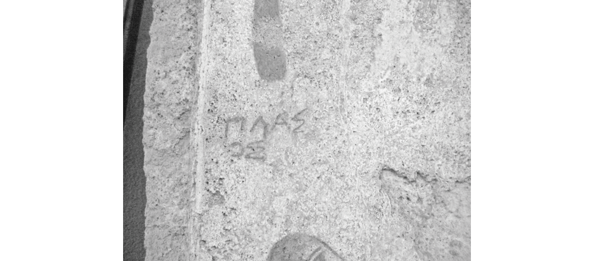
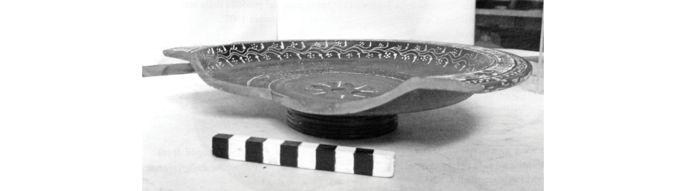
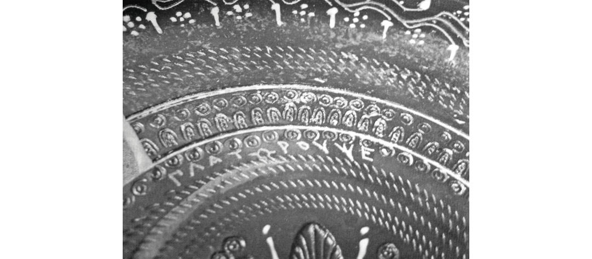
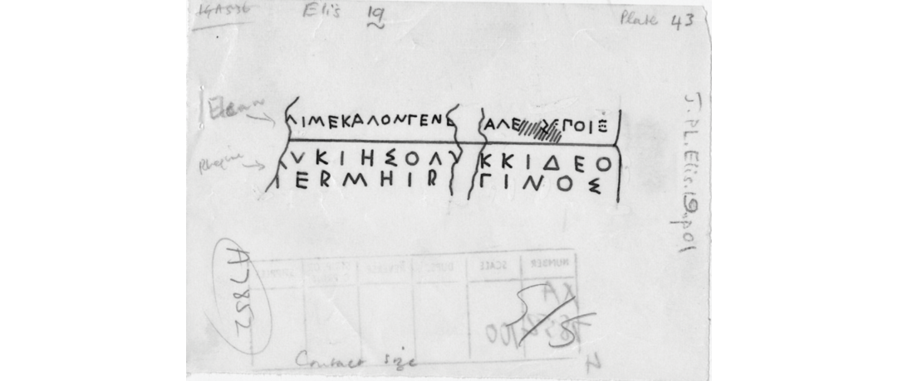

# Chapter 4 The Language of Mobile Craftsmen in the Western Mediterranean

**Contributors:** Katherine McDonald and James Clackson

## Introduction

Artisans and craftsmen in Southern Italy participated in complex networks of interactions which are not yet fully understood. Although we know the broad outlines of the kind of mobility driven by trade, the movements of individual artists or artefacts are much harder to track and, unlike the careers of elite men or soldiers, craftsmen’s lives are rarely memorialised in literature or outlined on gravestones. Instead, their work provides our main insight into how artisans lived, worked and travelled. The style, function and decoration of paintings, ceramics and other products provide some clues, but text is also used for decorative and practical purposes on a wide range of different objects. Many of these inscriptions show the writer’s familiarity with multiple languages, alphabets or dialects and, in some cases, may show evidence for movement across language or dialect boundaries.

Identifying whether products or craftsmen have moved is not straightforward. The migration of the craftsmen themselves and the production of goods for an export market are intertwined phenomena, but need not go together. In this chapter we will present several case studies to show how detailed examination of the language of texts, mostly those inscribed on prestige ceramics or paintings, can offer fresh insight into the mobility of people and objects. Products produced by local makers for a local market can play on the prestige of non-local forms and names, and items meant for export may not remove all traces of the artist’s origin. Artists’ signatures may use Greek morphology on a non-Greek name rather than giving themselves a completely ‘Greek identity’, which suggests that there was value in being (or marketing oneself 

as) a bilingual craftsman. In other inscriptions, the Greek alphabet appears to act as a ‘scriptio franca’ in which names and other details were comprehensible across a number of languages (including, for example, Greek, Oscan, Messapic and Gaulish), suggesting that artists were aware of how the alphabet was used in the wider Hellenistic world. Even where art is unsigned, inscriptions may show evidence of mobility. Dialect choice may also be revealing about the original provenance of craftsman and makes it possible in some cases to track artists on the move. The complex migration history of some Greek potters can be surmised through consideration of decorative inscriptions – such as ‘speech bubbles’ – on some Italian red-figure pots.

## Signatures on Italian Ceramics

Art in Southern Italy shows particularly complex adaptations and interactions of styles. Red-figure pottery is one good example of this. During the sixth and fifth centuries BC, most of the figured pottery in Italy was imported from Greece, particularly from Attica. But in the second half of the fifth century, red-figure workshops were established in Lucania and Apulia, and by the early fourth century BC, Lucanian and Apulian red-figure pottery had all but replaced imported wares in the local elite market, and had moved away from directly imitating Attic designs.[^1] Most of this pottery was produced for the local market – less than 1 per cent of Apulian ware has been found outside Apulia – so that we can be fairly sure these craftsmen were catering to local tastes; and, although the craftsmen have sometimes been assumed to be ethnically Greek and Greek-speaking,[^2] more recent scholarship has deemed this highly unlikely based on the sites where the wares are found.[^3] Wall paintings in tombs in Southern Italy, particularly those in Paestum and Apulia, are another example of the interaction of Greek and Italian artistic traditions, but one where artists are catering to local rather than export markets.

A number of the inscriptions that we discuss in this chapter are <em>dipinti</em> on red figure vases or on wall paintings, and so have been written by the same craftsmen who were part of these innovative artistic movements catering to Greek-influenced local elite tastes. Even the act of signing works of this kind can be seen as a Greek practice which was taken up by artists in Italy, no matter what language they used for their signature.[^4] In a recent book on signatures in ancient Greece, Jeffrey Hurwit argued that signing works of art was an exceptionally Greek practice, unparalleled anywhere in the ancient world.[^5] However, even in Hurwit’s book, the picture which emerges is much more complicated. Although he suggests that Etruscan and Roman artists’ ‘impulse for self-identification’ was ‘weak’,[^6] he nevertheless identifies a number of examples of Etruscan and Roman artists who do sign their work.[^7] His book also shows that, despite the common practice of labelling figures and using writing in art in other ways, Greek artists in both wall painting and vase painting only very rarely signed their work – more than 99 per cent of the surviving Athenian figured vases are unsigned.[^8] Whether signatures can be considered a clearly Greek practice, particularly in Italy, is therefore a complicated issue.

## The Onomastic Fallacy

Many short inscriptions from the ancient world consist only of a personal name. If that name is written in the Greek alphabet, which was used for a number of different languages in Central and Southern Italy, then there is no obvious clue to the language spoken by the writer other than the apparent etymological origin of the name. But assuming someone’s identity, origins or language from their name is always problematic and leaves significant room for error. Names can be inherited from immediate or distant ancestors who came from another region or speech community, or can be borrowed 

from prestigious contemporary languages and cultures. Bilingual individuals can have names which reflect one, both or neither of their languages, and individuals may carry a name appropriate to a speech community to which they do not belong. Furthermore, sometimes the modern scholar may lack the requisite knowledge to locate a particular name. Take the example of a Greek–Phoenician bilingual inscription on a mask found at Soluntum in Sicily (<em>SEG</em> 34.973), which includes the name φαδις; Crawford et al. (2011: 1532) suggest that this is an Italic <em>nomen</em>, comparing Latin Fadius, but there is no good comparison from other languages of Italy.

It is also important to remember that a signature is a text which has a particular function – it indicates only the ‘customer-facing’ professional identity of the craftsman, and may not be the name he used in the other domains of his life. However, in almost all cases, we can only guess at this: if the craftsman has changed his name to a Greek one and has also used the Greek language in his inscriptions, then any membership of a non-Greek group becomes invisible to us.

An example of the difficulties faced by scholars is found in Small’s (2006, 2014) discussion of two imbrex tiles from the area around Montescaglioso in Apulia. One is stamped with the words Δάζιμος κερ/αμεὺς χαῖρε ‘<em>Dazimos the potter, greetings!’</em> and the other with ΗΡΑΚ[, expanded by Small as either ‘<em>Herakas’</em> or ‘<em>Herakleides</em>’.[^9] Small dwells on the origin of the names: ‘The artisan’s name is Messapic, so he was presumably a native Apulian, although he addresses the passer-by in Greek. These relatively humble objects suggest that the use of Greek was common among the Apulian artisan class, even if their proficiency in the language may have been limited.’[^10] Herakleides, however, he identifies as probably ethnically Greek.[^11] Small’s overall conclusion that artisans were able to move between Greek and Apulian communities[^12] is mostly unproblematic. 

But the categorisation of some artisans as ‘Greek’ and some as ‘Apulian’, based on our perceptions of the origins of their names, may in fact create artificial ethnic and linguistic boundaries between people who, at the time, thought of themselves as part of both groups, or did not conceptualise these differences as constituting two different groups at all. Lo Porto (1988–9: 402–3) points out that the name Δάζιμος or Δάσιμος appears several times in Italy, including in the name of the Heraclean ephor Δάζιμος Πύρρω, named in the Heraclean Tables (I 5, 9, 97, II 5 and 8; cf. II 1). Whatever the origin of the name, some of its bearers might well have considered themselves ‘Greek’. There is also no evidence on these tiles of the limited proficiency in Greek that Small suggests.

In a highly mobile and multilingual population, this ‘onomastic fallacy’ may lead us to see both more and less multilingualism in the sources than may have existed. As the examples below will show, artists and craftsmen may have made complex decisions about how to present themselves to clients, including making decisions about what their names would be. These decisions are not always straightforward, and may be influenced by the languages spoken by artists and the writing systems in which they were literate, as well as their perceptions of relative prestige, their geographic range, and their familiarity to their clients. As we will see below, artists may be motivated to appeal to an élite which was well disposed towards Greek culture either by using Greek or by Hellenising their names to a greater or lesser extent, even where the artist and clientele were not first-language Greek speakers.

## Ceramics – Morkos and Pyllos

A fifth-century BC <em>pyxis</em>, found in a burial context at Gravina (Puglia),[^13] bears the following <em>dipinto</em> (<em>SEG</em> 54.955):

> Μόρκος: ἐποίε̄ · Πύλλος: ἐδίδασκε · Μόρκος Πύλλος: αβγδεζηθικλμν · Μόρκος ἔθηκε Γναίϝαι

> Morkos made (it). Pyllos was (his) teacher. Morkos, Pyllos, α β γ δ ε ζ η ι κ λ μ ν. Morkos dedicated (it) to/for Gnaiva.

The <em>dipinto</em> is clearly in the Greek language, and there are no significant errors that would lead us to believe that the writer was not a first-language speaker of Greek. Nevertheless, the names in the inscription have led most scholars to identify the writer and the two other people mentioned as non-Greek. For example, under a heading ‘the ethnicity of the artisans’, Small writes, ‘the names Morkos and Pyllos are of Messapic type, and Gnaiva is Oscan’.[^14] This explanation elides the difficulties of straightforwardly assigning these names to particular ‘ethnicities’.

In the case of the name <em>Morkos</em>, there is reasonable evidence for similar names in Messapic inscriptions. It appears twice in this form, in <em>MLM</em> 4 Gn and <em>MLM</em> 11 Ro, though there is also an alternative nominative form <em>Morkes</em> (<em>MLM</em> 7 Cae). But the idea that <em>Pyllos</em> is a Messapic name seems to be an argument from silence. It is rare in Greek (with only seven occurrences listed in the Lexicon of Greek Personal Names), but does it therefore follow that it must be a Messapic name? The only similar name found in Messapic is a name which appears to read <em>Poollo</em>, which occurs only once at Alezio (<em>MLM</em> 31 Al, fifth century BC). If this is the same name as <em>Pyllos</em>, then at the very least there has been significant remodelling of the name to make it conform to Greek phonology and morphology. If <em>morkes</em> was the original Messapic form of the name, then the same remodelling could have also happened in the case of <em>Morkos</em> (in this case and all the others where it appears). The morphology of both names could in fact suggest that both were meant as Greek versions of the bearer’s Messapic name, and that it is misleading simply to label these names as ‘Messapic’.

Gnaiva (Γναίϝαι) occurs only here in Greek inscriptions. It appears to be the feminine of a common Oscan <em>praenomen</em> **gnaivs**, which in Oscan inscriptions in the Greek alphabet is written either with upsilon or digamma.[^15] It is worth noting that the female version of this name is not attested in any Oscan 

inscription, so the existence of this name is probable but not definite.[^16]

If Morkos and his companion have deliberately adapted their names, what aim did they have in mind? There are two main possibilities: either they wanted their names to be easier to pronounce and decline for Greek speakers, or they wanted to appear more ‘Greek’ to their local clients by having Hellenised names (or both). In a highly bilingual and well-connected area of Italy, they would probably have been aware that the names <em>Morkos</em> and <em>Pyllos</em> would not make them sound completely Greek to a native Greek speaker; to achieve this, they would have needed to adopt a fully Greek name as their professional identity. Instead, Morkos and Pyllos have names that signal their membership of a ‘globalised’ network, where arguably the ideal was to seem a little bit ‘foreign’ to everyone.[^17]

## Tomb Paintings – Plasos

A similar explanation may help us to understand the signature on a wall painting at Paestum. On one wall of Tomb 1/1972, dated to around the third century BC, there is a scene which can be interpreted either as a warrior departing or returning home. The warrior, riding a white horse, is in the centre of the scene and faces a woman who stands on the right. Behind the warrior and the horse stands a smaller figure, probably a groom or a slave.

There is a signature in Greek letters above the head of this left-hand figure which reads πλασος (<em>plasos</em>) (Paestum 3, Figure 4.1).[^18] The tomb is usually dated to the Oscan-speaking era of Paestum based on the style of painting and the goods found in the tomb. The name <em>Plasos</em>, however, is morphologically Greek rather than Oscan. The 

use of an individual name rather than a two-part name indicates either a Greek or Messapic name, or – in the Oscan-speaking world – the name of a slave, which is a plausible enough social background for an artist in ancient Italy.[^19] Elsewhere <em>Plasos</em> does not appear as a Greek individual name, and may therefore be of Oscan or other Italian origin. A notable possibility is that this name is a remodelling of the common Messapic name <em>Plator</em>, with an eye to making the name more typically ‘Greek’. Again, it is possible that Plasos has taken care when signing his work to choose a ‘Greek’ professional name to fit with the purchaser’s expectations of quality goods, even where the name is not Greek in origin.[^20]

## Tomb Paintings – Artos

One Messapic inscription seems to show this use of Greek morphology in an artist’s signature even where the inscription is in the 

Messapic language. The decision to use a non-Greek name with Greek morphology while still using the Messapic language is a complex one.

A third-century <em>dipinto</em> reading αρτος πιναϝε or αρτος πιναιος (<em>artos pinave</em> or <em>artos pinaios</em>) (<em>MLM</em> 10 Ar), discovered in the vestibule of the ‘Ipogeo della Medusa/Hypogeum of the Medusa’ in Arpi,[^21] is thought to be the signature of the artist who decorated the tomb.[^22] The inscription is on a <em>pinax</em> (rectangular painted field) on the left-hand side of the rectangular vestibule of the tomb. The <em>pinax</em> is delineated with a brown line on a red background; the image shows a male figure wearing a white tunic with a black border, with a groom behind him carrying a large shield and leading a horse with a brown mane.[^23] Immediately above the first man is an inscription ‘in caratteri greci’, read by De Simone as <em>Artos pinave</em>, probably referring to the painter of the image on the <em>pinax</em>. De Simone notes that the form of the name (<em>Artos</em> and not <em>*Artas</em>) shows Greek influence;[^24] yet the verb <em>pinave</em> is Messapic.[^25]

This signature has repeatedly been seen as a sign of both local pride and use of Greek practices and language to give an impression of prestige. This <em>Artos pinave</em> is one of only a few examples of artists’ signatures on wall paintings in Apulia.[^26] Mazzei suggests that this adoption of the practice of signing artistic works was the adoption of a Greek practice and is indicative of a change in cultural attitudes to artists, affording them more prestige.[^27] According to Massa Pairault, the artist wrote ‘painted’ rather than ‘made’ as a sign of pride in his work.[^28] De Simone (1995: 212) also suggests that the ‘Graecised’ name is a sign of linguistic interference. All of these explanations for the language of the inscription may be true in part.

We should also consider the overlap opportunities provided by the Greek alphabet here. Artos could see that anyone literate in the Greek alphabet – whether they were speakers of Greek or Messapic – could read his name. Even for a Greek speaker who could not understand the verb (if the second word of the inscription is a verb), the message was perfectly clear. For a Messapic reader who could read the verb, the morphological ending of the name might have signalled a connection to a wider Greek-speaking world without being fully ‘foreign’.

## Mobile Craftsmen? Plator

Not all craftsmen in Italy adopt this practice of changing the morphology of their name. For example, a potter at Teanum Sidicinum around 300 BC wrote his signature in both Oscan and Greek, but seems only to have used a Greek alphabet, whatever language he was writing in. We find πλατωρ ουψε (<em>plator oupse</em>) ‘Plator made (this)’ (Oscan) on a decorated black slip plate found 

in Tomb 58 (Figures 4.2 and 4.3) and also πλάτωρ ἐποί[η]σε (<em>platōr epoi[ē]se</em>) ‘Plator made (this)’ (Greek) on a plate found in Tomb 29.[^29]

There are many suggestive details to these inscriptions. Crawford suggests, because of the association of the name Plator with Messapic, that he may have come to Teanum from Apulia.[^30] 

The inscriptions show that he was probably more used to writing Greek than Oscan. Even though the Greek alphabet was commonly used for Oscan in Lucania and Bruttium, in the area around Teanum the Oscan ‘Native’ or ‘National’ alphabet (an alphabet based on the Etruscan alphabet) was the usual writing system for Oscan. The Oscan perfect ending, usually written as -εδ in the Greek alphabet, has been replaced with a Greek secondary tense ending -ε.[^31] Additionally, the spelling of ουψε suggests a writer more used to writing Greek: in Oscan, this verbal root is found spelled -πσ- (except at Messina), suggesting that the -ψ- spelling is an ad hoc application of the Greek alphabet to Oscan words.[^32]

Why did Plator sign his work in both Oscan and Greek? If one product was destined for a local market, and the other for export, it is curious that they are both of a very similar style and that they both ended up in graves at the same site. Rather than seeing Greek as signalling ‘export’ in this case, we can see both plates as intended to appeal to the local Hellenised élite, in much the same way as Plasos and Artos the tomb-painters must have been doing. We also have the possibility here of seeing the movement of a craftsman across linguistic barriers, and possibly being able to give his products an air of imported Greek goods.

## Mobile Products and Missing Morphology

One strategy for artisans signing their work, particularly with moveable products, is to avoid using any morphology at all. This is particularly common on tile and amphora stamps, where space is at a premium, though it is also used on other kinds of objects. The first part of the name is usually sufficient to identify a craftsman or workshop. A side effect of this strategy is that, where the Greek alphabet is used, it becomes extremely difficult to identify the language of the inscription.

We must at least consider that this could have been intentional, and that craftsmen living in bilingual communities or those who intended their wares to travel over linguistic boundaries saw the 

advantage of signing their names in ambiguous ways. It may be that there is no need to try to establish the ‘language’ of very short inscriptions, especially those written in an alphabet as widely known as the Greek alphabet.

For example, it is not always possible to know whether tile stamps in the south of Italy are intended as Greek or Oscan inscriptions, as both languages use (very similar) versions of the Greek alphabet across most of this region. A case in point is the tile stamps from Tiriolo, which read <ΚΕΡ> (Teuranus Ager 2 and 3) and <ΤΠ> (Teuranus Ager 4), and it is hard to ascribe either of these abbreviations to a specific language with absolute certainty. More likely, they were abbreviations that acted as a logo and identified a particular manufacturer. The stamp Caulonia 5 (?<ΤΣ>) has been read as both Greek and Oscan, depending on whether the second letter is read as a three-barred sigma or an Italic <f<em>></em>.[^33] If it is the latter, then it could only represent an abbreviation of an Oscan name, either in one or two parts,[^34] while a sigma could belong to either language. If we try to assume the language of a tile stamp based on other inscriptions from the site, we run the risk of erasing evidence of bilingualism and, particularly, texts which show an engagement with the wider Hellenistic world.

Similar considerations apply to other kinds of commercial inscriptions, such as short inscriptions on amphorae. An amphora (Corinthian type A) from the Tomba delle Anfore in Arpi bears what could be a Greek inscription, written by the dispatcher, or a Messapic inscription, written later in the amphora’s journey (<em>MLM</em> 11 Ar: ΗΑΡ / ΑΒΓΔ). We know there is an import–export relationship here, based on the trade in Greek wine. It is worth considering whether the exporters in Greece knew, on some level, that labels and manufacturers’ marks in the Greek alphabet were functional in Apulia as well, whether or not they had a clear idea of the Messapic language. We should also consider how commercial 

labels like this might relate to the evidence of bilingualism that we already saw in the artist’s signature from Arpi.

## Luxury Goods

Possible examples of deliberate linguistic ambiguity are not limited to labels on ceramics. An inscription on a silver cantharus shows that this is a possible interpretation of inscriptions on high-quality luxury items as well.

The cantharus of Alesia was (probably) discovered in 1862 at the excavation of Alesia, in Southern Gaul, although there have been questions over its authenticity and, if genuine, its date.[^35] Its deposit in a ditch may be associated with the siege of the town during the period of Julius Caesar’s command. It is usually believed to have been produced in Italy and then imported, given its similarity to Italian goods such as the Boscoreale treasure, although it dates to at least a generation earlier.[^36] The cantharus bears three inscriptions underneath the foot, all three of which may be by different hands at different dates. Text A appears to be a non-alphabetic mark denoting the weight, and is probably contemporaneous with manufacture. Text C is not understood, and we do not know how closely it is supposed to relate to the other texts, and at least some of it may have been added by a later hand.

Text B is in the Greek alphabet and consists of two groups of letters clearly separated by a space. The letters themselves are clear and read μεδα αραγε. But it is possible to analyse the language of the inscription in different ways:[^37]

> 

Lejeune (1983)
> Either Gaulish:μεδα(μος?) αραγε(νι? -νιος?) – name plus patronymic
> Or Oscan:μεδα(τιες) αραγε(τασις) – Oscan <em>gentilicium</em> plus ‘silversmith’Crawford et al. (2011)
> Oscan:με(τις) δα(τιες) αραγε(τασις) – Oscan <em>praenomen</em> and <em>gentilicium</em> plus ‘silversmith’

As in our previous examples, the script doesn’t help us establish the language of the inscription, the morphology has been omitted, and, in this case, the object is associated with at least two different areas. Lejeune argues that, if the inscription is Oscan, it is most likely to have come from Messina, which was well connected and is known to have had silversmiths, though there is no specific evidence that points to this as the original production site.[^38]

Given the active trade networks and the mobility of objects around the Mediterranean, it is possible that a silversmith in Southern Italy would have an eye on the export market when producing a high-quality piece like this. He might be aware, even dimly, that there were not just Greek-speakers, but speakers of other languages around the Mediterranean who would be familiar with the Greek alphabet. Just like Morkos, Pyllos and Plator (the makers of ceramics discussed earlier in the chapter), he could therefore sign his name in such a way as to appeal to as many possible markets as possible, and make his name comprehensible across linguistic borders. If this interpretation of the text is correct, then this example goes to show the importance of the Greek alphabet, perhaps even more so than the Greek language, as a mode of communication across language barriers in the Western Mediterranean at this date.

In her discussion of a different mixed-language text from southern Gaul, Mullen states that ‘[w]e should arguably not be seeking to disentangle something that may be deliberately entangled’.[^39] This is a key insight for framing our discussions of texts from multilingual areas. If it proves difficult or impossible to decide 

what language an inscription, or part of an inscription, is meant to be in, then we should consider that the writer deliberately left the text open to multiple overlapping interpretations.

## Dialect Mixing

For many of the ancient languages which survive in epigraphic texts from around the western Mediterranean, there is insufficient material to enable the construction of secure dialectal areas or isoglosses, let alone relate an individual inscription to a particular dialect. The evidence for dialectal variation in Faliscan, Gaulish, Iberian, Messapic, South Picene, Sicel and Umbrian (not to mention many other minor languages) is either too geographically restricted, or the texts are not well enough understood, to reach any secure conclusions about dialectal features.[^40] A deviant feature in one text might be indicative of an areal distinction, but it might also correlate with the social status of the writer, or simply be an orthographic mistake. For some languages, such as Oscan, Etruscan and the Latin of the Roman Republic, it has been possible to isolate a few plausible dialectal features.[^41] Occasionally, it is even possible to identify objects which appear to have dialectal features in these languages at odds with the dialect of the provenance; for example, a stamnos found at Capua (Capua 35 in Crawford et al. 2011), carries an inscription with features that are not typical of the Oscan of Capua.[^42] However, the paucity of material of this type makes it difficult to reach any general conclusions about dialect mixing in any language other than Greek. For Greek there is a rich surviving inscriptional evidence of dialects both in the mother cities and in the colonies in the western Mediterranean, and it is this textual material which allows the 

researcher to understand how place, language and migration interact. We shall concentrate in this section on how dialectal choices and dialectal mixing in Greek texts can be used to contribute to a picture of migration amongst craftsmen.

It has long been recognised that Greek artists working in a different environment from their native <em>poleis</em> generally retain their native dialect if they signed their work themselves, although they sometimes adapt their language to local practice, particularly in order to avoid a form which was peculiar to a single dialect and might not be well understood. Buck (1913: 139–43) provides a number of examples both of retention of the local dialect and also of the second process, which can now be recognised to belong to the range of behaviours generally grouped under the term ‘accommodation’ in modern sociolinguistic studies.[^43] Buck’s examples of the retention of the artist’s local dialect include a text on a statue base found in Delphi, which was dedicated by Glaukies of Rhegion but made by the sculptor Kalon from Elis, in the north-western Peloponnese (<em>I.Rhegion</em> 66 = <em>IvO</em> 271 = <em>IGASMG</em> III 65 = <em>CEG</em> 388 = <em>IGDGG</em> I 36 = Minon (2007), text 62); L. H. Jeffery’s drawing is reproduced in Figure 4.4). Pausanias (5.27.8) reports that the statue, now lost, featured Hermes holding the caduceus.

[

Γλαυκί

]

αι

με

Κάλ

ō

ν

γεν

[

εᾶι

Ϝ

]

αλεῖ

[

ο

]

ρ

ἐποίε

̄

44

[

Γλ

]

αυκίης

ὁ

Λυκκίδε

ō

[

το

͂

]

ι

Ἑρμῆι

Ῥ

[

η

]

γῖνος

.

> ‘Kalon the Elean made me for the family of Glaukies.Glaukies the son of Lukkides of Rhegion (gave me) to Hermes’.

Kalon uses the Elean dialect in the description of the manufacture of the object, with its characteristic rhotacism of final <em>-s,</em> hence Ϝ]αλεῖορ ‘Elean’,[^45] and retention of original long <em>a</em> in 

[Γλαυκί]αι and Ϝ]αλεῖ[ο]ρ. In the next two lines (which are divided from the first by a horizontal incision), Glaukies’ dedication switches to the Ionic dialect of Rhegion with long <em>e</em> from original long <em>a</em> represented here by <Η> and first declension genitive singular of masculine nouns in -εω (here written <ΕΟ>). Note, however, that the surviving letterforms are similar to the Elean part of the inscription, with the tailed rho (apparently) used in both scripts, and the Ionic text avoiding the lunate gamma, <S> for sigma and <D> for delta characteristic of other early inscriptions from Rhegion. Other than this statue, the artist Kalon is known only from another reference in Pausanias (5.25.4), where he is credited for bronze statues set up in Olympia to commemorate a chorus of thirty-five boys, their flautist and trainer, all of whom perished in a storm while travelling across the straits from Messena to Rhegion.[^46] Kalon presumably was known to the Rhegines, but there is no need to suppose he ever moved away 

from Olympia, and it is even possible that Glaukies bought a signed statue and then added his own dedication. Not much remains of the epigraphy of Rhegion itself, although there is some possible evidence of dialects other than Ionic spoken there before its later sack and refounding by Syracuse in the fourth century.[^47]

Sometimes, the inscription giving the name of the artist might avoid any particular local peculiarity of dialect in order to appear less distant from the dialect of the community in which the work would be displayed, a practice which recalls the downplaying of dialectal peculiarities in inscriptions in verse from around the Greek world (Mickey 1981).[^48] Indeed, the best example given of this practice from Buck (1913) is that of pieces by the Parian sculptor Euphron and the Cretan Cresilas, and most of the examples involve verse dedications. At other times it appears that someone other than the artist might add the artist’s signature, as is the case of the Attic sculptor Phaidimos, whose name appears on three works, one of which is in a different hand (Jeffery 1990: 63). The avoidance of peculiar regional letterforms in <em>I.Rhegion</em> 66 discussed earlier may be explicable in this light.[^49]

Dialect choice on inscriptions on pottery might also give indications of the movements of artists. Most pottery produced in the Greek mainland intended for the South Italian and Sicilian market retains the dialect of the home of the producer. Thus pots imported from Athens have Attic legends, and those from Corinth exhibit the Corinthian dialect, complete with the local peculiarities of its alphabet. There are, however, occasional instances of a pot that 

can be associated with a known Athenian painter bearing a legend in a different dialect. It is important to be cautious in the assessment of this evidence. One case which shows dialect mixing probably unrelated to migration is a psykter, or wine cooler, signed by the Athenian painter Euphronios, found in a Cerveteri tomb in the nineteenth century depicting <em>hetairai</em> drinking and playing <em>kottabos</em>.[^50] One woman, identified as Smikra, has a ‘speech bubble’ beside her written in Doric:

> τὶν τάνδε λατάσσω Λεάγρε ‘I am making this throw for you, Leagros’.

The other inscriptions on this vase are all Attic (or Attic-Ionic, note names such as ΑΓΑΠΕ = Ἀγάπη with η not α). Kretschmer (1894: 87) suggested that the switch into Doric reflected the fact that the game of <em>kottabos</em> was invited by the Sicilians, and so the players used the Doric of Sicily, much as the sport of fencing uses French terms such as ‘Allez!’ and ‘En garde’. But other vases depicting the ‘Kottabos Toast’ have a different formula τοὶ τήνδε, with Attic τήνδε, and a less ‘broad’ Doric τοί for Attic σοί ‘to you’.[^51] The use of the Doric dialect here is thus probably part of a literary or cultural tradition, although it is also possible that Euphronios was aware of dialectal differences among the potential buyers of his wares in the Greek colonies of Magna Graecia.

Pots may also provide our best epigraphic record of wandering artisans, whose own idiolect reveals their background through a combination of different local features. Wachter (2001: 270–3) considered in detail the language of one maker of painted and inscribed pots, known as the Inscription Painter, whose idiosyncratic language appears to be the result of his own transient career. The Inscription Painter was active from the middle of the sixth century BC and is the chief exponent of a distinctive style of decoration, now known as ‘Chalcidian’, even though no longer thought to have any particular association with the Euboean city of Chalcis. The eighteen inscribed vases attributed to the Inscription Painter contain only names, mostly those of gods and heroes 

familiar from Greek mythology, but some are ‘throwaway’ names, apparently invented as appropriate for the depicted scene. Examples of the latter from the Inscription Painter are a maenad named Ϝιō ‘Violet’ and a satyr called Με̄´ξᾱς, which Wachter derives from μείγνυμι ‘have sexual intercourse’, both on a krater from Vulci.[^52] The Inscription Painter, like the other artists of the ‘Chalcidian’ school, uses an early form of the Euboean alphabet, and his dialect is basically Ionic, with the majority of cases of original long <em>a</em> represented by <E>, showing the Ionic change of vowel quality. However, on occasion the Inscription Painter employs a non-Ionic form, sometimes giving two different forms of the same name on different vases. Thus the hero Geryones is dubbed Γε̄ρυόνε̄ς on Wachter (2001) CHA 9 but Γᾱρυϝόνε̄ς on Wachter (2001) CHA 2, the latter with <α> for original long <em>a</em> in the first syllable and the non-Ionic phoneme /w/, written <ϝ>, employed as a glide.

Wachter rejects earlier attempts to see literary or cultural reminiscences in the mixed dialect of the Inscription Painter, along the lines we have suggested for the Doric of the Kottabos Toast above, but instead he wonders whether the potter’s language might reflect migration between different areas. Wachter notes that the endings of names are generally Ionic in form, but non-Ionic forms occur in the stems of the words (as with the name Geryones), and furthermore that the potter makes occasional mistakes in his use of script, sometimes employing a Corinthian rather than a Euboean letter. He thus concludes that the Inscription Painter was in origin a native of Corinth, who then travelled to an Ionic-speaking area where he perfected his craft; the ‘Chalcidian’ style of pottery and decoration also combines Corinthian and Attic styles. There is little evidence for other painters of the ‘Chalcidian’ school, but it may be significant that one other artist of this group, known as the Cambridge Painter, also shows some dialect conflation in his texts, using digamma as well as Euboean letterforms. It is not clear where the actual production base of the painters of the Chalcidian school was, but it is not impossible that these were 

immigrants from Greece who set up a workshop in Magna Graecia. Dell’Oro (2017: 172–5) accepts Wachter’s arguments and offers further support on the basis of an early Corinthian presence in the Euboean colony of Cumae. Dell’Oro’s evidence from Cumae, however, is difficult to assess. It consists of two partial abecedaria written contiguously (<em>IGASMG</em> III App. II, 113, A1, b-c = <em>IGDGG</em> I 11b); the first of these has Euboean letterforms, the second a Corinthian beta (but otherwise Euboean forms, although badly executed). This text is dated to the proto-Geometric period, and consequently probably 150 to 200 years earlier than the ‘Chalcidian’ vase-painters, and cannot be directly related to them, and the Corinthian beta may reflect the incompetence rather than the provenance of the inscriber.

## Conclusions

Robert Garland, in his recent book <em>Wandering Greeks</em> (Garland 2014), attempts to flesh out the characters of the different members of the Greek diaspora and early colonists. Chapters in Garland (2014) carry titles such as ‘The Settler’, ‘The Wanderer’, ‘The Deportee’, ‘The Fugitive’ or ‘The Economic Migrant’. There is, however, no chapter entitled ‘The Artist’, and only two pages (Garland 2014: 165–6) are given to tracking the movement of craftsmen from Athens to colonies. The only literary source that Garland mentions for movement of artists, following MacDonald (1981), is a passage of Thucydides (7.27.5) in order to support a theory that many of the potters and painters who travelled may have been slaves. Unfortunately, Thucydides is not much help here, since he is describing the defection of ‘over 20,000’ slaves from the silver mines at Laurion Attica to the Spartan fort constructed at Decelea; the information that a large part of these slaves were χειροτέχναι is likely to refer to the agricultural or possibly mining workers rather than artists.[^53]

We are reliant, therefore, principally on epigraphic evidence in order to track the movements of craftsmen in the western Mediterranean. As shown in the examples presented in this 

chapter, this type of evidence presents problems of interpretation since inscriptions on pots and paintings are mostly extremely short, and it is unusual to have more than one signed piece from an individual craftsman. Plator of Teanum Sidicinum and the Inscription Painter are valuable exceptions to this rule. Moreover, in general artists did not want to call attention to their dialect or origin as much as their name. The employment of Greek by non-Greek speakers and the suppression of tell-tale non-Greek morphology thus complements the avoidance of unusual dialect forms and peculiar letter shapes among the texts written by Greeks. Just as at a later period of history, the Celtic and Roman potters at La Graufesenque in southern Gaul chose Latin as the language to present themselves to the wider export market,[^54] so in the period of Greek cultural dominance in Italy in the preceding millennium, Greek was the default language of the artisan. It is only by unpicking some of the linguistic minutiae that we can uncover some of the evidence for mobility from these texts.

## Notes
