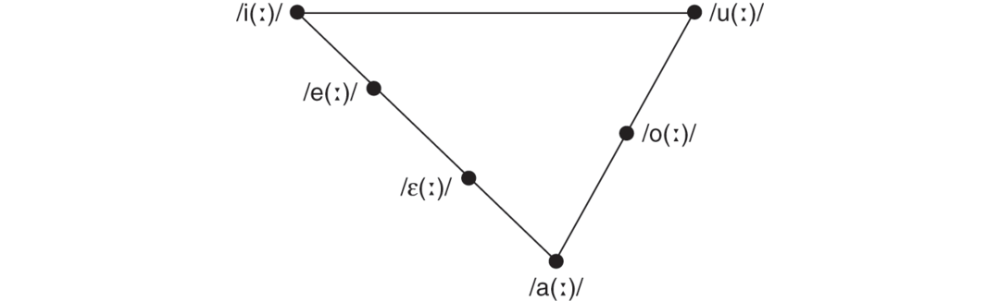

# Chapter 6 Mobility and Orthography

## A Contextualisation of Variant Spellings in the Oscan Inscriptions in the Greek Alphabet

**Contributors:** Livia Tagliapietra

Between the fifth and the fourth centuries BC, Oscan-speaking populations from the area of Samnium, in Central Italy, spread into the south of the Italian peninsula; here they came into close contact with the Greeks of Magna Graecia.[^1] The Greek language with which Oscan speakers interacted in this area was by no means homogeneous. In fact, the Greeks who had founded colonies in South Italy had come from various areas of mainland Greece and the eastern Mediterranean, and, as a result, the forms of Greek across this region differed significantly: Ionic around the bay of Naples and in Rhegion, on the strait of Messina; Laconian Doric in Taras and its sub-colony Heraclea, both on the Gulf of Taranto; Achaean Doric in a number of colonies in south Campania, Lucania and Bruttium; Northwest Greek in Locri Epizephyrii, in the toe of the Italian peninsula; and possibly Attic-Ionic in Thurii, a Panhellenic colony founded in the fifth century under the leadership of Athens. Then, towards the end of the fourth and the beginning of the third century, the local forms of Greek became increasingly exposed to the influence of the <em>koine</em>, the new ‘standard’ variety of Greek based on the dialect of Athens and employed by the increasingly dominant Macedonians.

In the southern regions of the Italian peninsula, Oscan speakers adopted the Greek script that by that time was uniformly employed by the local Greeks, namely the East Ionic alphabet, for writing their own language. However, the Oscan inscriptions in the Greek 

alphabet that have survived are characterised by a high level of variation in the correspondence between Greek letters and Oscan sounds, even within the same text. Although the question of spelling inconsistency has been addressed in previous studies, interaction with the local Greeks and acquaintance with their different and changing writing practices has not previously been considered as a possible factor influencing the spelling in Oscan inscriptions. The fact that contact with the local Greeks has not been taken into account in previous studies is particularly surprising when we consider that closeness between Oscan and Greek speakers in South Italy, particularly after the mid-fourth century, is not only well known to us from the accounts of ancient historians and from archaeological data, but also the Oscan inscriptions in the Greek alphabet themselves reveal a high degree of contact and interaction with the local Greeks both from a linguistic and a graphic perspective, as a number of publications have recently acknowledged (particularly McDonald 2015; Zair 2013, 2016).

The present chapter thus investigates whether migration and contact with the local Greeks could also have affected the orthography of the Oscan populations, and how consideration of the socio-historical context, including our understanding of the contemporary Greek dialects of South Italy, may help solve some long-debated questions related to the spelling of Oscan in the Greek alphabet. This chapter has been elaborated in the wake of the book <em>Oscan in the Greek Alphabet</em> by Nicholas Zair (2016), which has recently reopened the question of writing conventions in the Oscan inscriptions using Greek letters.[^2] Aiming to further explore and expand Zair’s conclusions on spelling inconsistency across the corpus, I shall focus here on the major question of the spelling of the Oscan vocalic phonemes. In fact, while other inconsistent spellings that are observable in the South Oscan inscriptions have been convincingly explained in Zair’s study, none of the hypotheses for the spelling of vowels that have been proposed so far is entirely satisfactory.

## Previous Hypotheses

Oscan, an Indo-European language of the Sabellic family attested in South Italy between the fifth and the first centuries, had a six-vowel system consisting of the phonemes /i(ː)/, /e(ː)/, /ɛ(ː)/, /a(ː)/, /o(ː)/ and /u(ː)/ (see Figure 6.1) although, in fact, long vowels seem to have been retained in initial or radical syllables only, that is, in stressed syllables (see Zair 2016: 26). The phoneme /u/ is assumed to have developed an allophonic variant [y] when preceded by a coronal consonant (/t/, /d/, /n/, /s/, possibly /r/), as Zair (2014) has discussed. Five original diphthongs with a short first element are known to have been retained unchanged (i.e. not monophthongised) in Oscan: these are /ɛi/, /ai/, /ɛu/, /au/ and /ou/ (Buck 1928: 41–7; Lejeune 1975; Seidl 1994; Wallace 2007: 11–13).

Oscan speakers were located in Campania, Samnium, Lucania, Bruttium and Sicily; the alphabet in which the language was written differed across these regions. The writing system in use in the northern areas, Campania and Samnium, which have provided the largest number of Oscan inscriptions, was derived from the Etruscan one and is normally referred to as the ‘national’ or ‘native’ Oscan alphabet (see Tikkanen, Chapter 5 of this volume). As a consequence of Etruscan having a four-vowel system consisting of /i/, /e/, /a/ and /u/ (thus lacking a phoneme /o/ and having only one mid-vowel on the front axis), early native Oscan inscriptions are characterised by the use of the letter <**u**> for both the back vowels /o/ and /u/ and <**i**> for both /i/ and /e/ (with <**e**> instead being used for their more 

open /ɛ/). Around 300 a writing ‘reform’ was undertaken in these areas, whereby the letters <**ú**> and <**í**> were created to represent /o/ and /e/ respectively by adding a diacritic to <**u**> and <**i**>; consequently, <**u**> and <**i**> came to be restricted to /u/ and /i/ (Table 6.1).

**Table 6.1 Spelling of Oscan vowels in the native Oscan alphabet**

| Oscan vowel | Native Oscan alphabet pre-300 | Native Oscan alphabet post-300 |
| --- | --- | --- |
| /i/ | <**i**> | <**i**> |
| /e/ | <**i**> | <**í**> |
| /ɛ/ | <**e**> | <**e**> |
| /a/ | <**a**> | <**a**> |
| /o/ | <**u**> | <**ú**> |
| /u/ | <**u**> | <**u**> |

On the other hand, the southern regions of Lucania, Bruttium and Sicily have offered a corpus of about a hundred Oscan inscriptions written in the Greek alphabet, mostly dating from the fourth to the early first century; these are mainly from Lucania and Bruttium, while those from Sicily are limited to a small group from Messana (modern Messina); a few inscriptions in the Greek alphabet have also been found in Campania.[^3] On account of its distribution in the southern Oscan-speaking areas, the Greek alphabet employed in this corpus is generally referred to as the ‘South Oscan’ alphabet. These inscriptions, however, compared to those employing the native Oscan alphabet are characterised by a high degree of inconsistency in their spellings. In particular, major inconsistencies across the corpus are observable in the representation of the phonemes /e/, /ɛi/, /u/, /o/ and /ou/, as illustrated in Table 6.2.

**Table 6.2 Inconsistent spellings of the Oscan vowels in the Greek alphabet**

| Phoneme | Spelling in the Greek alphabet |
| --- | --- |
| /e/ | <ε>, <ι>, <ει> |
| /ɛi/ | <ει>, <ηι> |
| /u/ | <υ>, <ο>, <ου> |
| /o/ | <ο>, <ω> |
| /ou/ | <ου>, <ουϝ>, <οϝ>, <ωυ>, <ωϝ> |

In order to account for these variant spellings, Lejeune (1970) hypothesised that a reform in the South Oscan writing system was 

undertaken towards the early third century, similar to what is supposed to have occurred around the same period in the regions where the native alphabet was in use (Table 6.3). In particular, Lejeune’s hypothetical reform would have prescribed the use of the digraphs <ει> and <ου> to represent /e/ and /u/ respectively, under the influence of the <em>koine</em> Greek spellings, while previously <ι> was used for /i/, <ε> for /e/ and /ɛ/, <υ> for /u/ and <ο> for /o/. In order to represent the original diphthongs /ɛi/ and /ou/ new strategies would have been adopted once <ει> and <ου> had started to represent /e/ and /u/; namely, the Greek letter <η> would have been introduced for writing the diphthong /ɛi/ (thus <ηι>), while the diphthong /ou/ would have come to be spelled <ωυ> or <ωϝ>, with the introduction of the Greek <ω> in the Oscan writing system. A transitional period in the early years of 

this reform would explain, according to Lejeune, certain inconsistencies within individual documents, such as those observed in Potentia 40/Lu 13 (250–200), which attests the diphthong /ɛi/ spelled <ηι> according to the ‘new’ convention in κλοϝατηις (/klowatɛis/), and similarly /e/ spelled through the ‘new’ sign <ει> in αfακειτ (/anafaket/), but, at the same time, also uses the ‘old’ spelling <ε> for the same phoneme in πεhεδ (/pe.ed/).

**Table 6.3 Lejeune’s model (simplified)[^4]**

| Oscan vocalic phoneme | Stage 1 | Stage 2 |
| --- | --- | --- |
| /i/ | <ι> | <ι> |
| /e/ | <ε> | <ει> |
| /ɛ/ | <ε> | <ε> |
| /ɛi/ | <ει> | <ηι> |
| /a/ | <α> | <α> |
| /o/ | <ο> | <ο> |
| /u/ [u] | <υ> | <ου> |
| /u/ [y] | <υ> | <υ>, <ιυ> |
| /ou/ | <ου> | <ωϝ>, <ωυ> |

This hypothesis has been generally followed in subsequent scholarship (e.g. Lazzaroni 1983; Del Tutto Palma 1989; Wallace 2007). Already in 1972, however, in the light of new findings contradicting his model, Lejeune proposed a revision and postulated the existence of a small number of scribal schools diverging from these general writing conventions (Lejeune 1972); this revision of the original theory, however,[^4] did not re-emerge in his later studies (Lejeune 1975, 1990), and probably for this reason has been generally ignored.

The new epigraphic evidence published in the last decades has increasingly contradicted the hypothesis of a unitary model for the development of the south Oscan alphabet. Therefore, through an exhaustive presentation of the data, Zair (2016) has questioned and rejected Lejeune’s model by arguing that the epigraphic evidence does not support the existence of such a standardised convention for writing Oscan in the Greek alphabet after 300. Instead, Zair has argued that both <ι> and <ε> are used alongside <ει> to write /e/ throughout the full temporal span covered by the surviving inscriptions, while, from at least 300, both <ο> and <ω> are used for /o/, and <υ>, <ου> and <ο> could be used for representing /u/ (Table 6.4). Moreover, he has observed that inconsistency frequently occurs within the same inscription: for instance, in Buxentum 1/Lu 62 <ει> and <ου> are used both for the real diphthongs and for /e/ and /u/, and in the same inscription /e/ is also occasionally spelled <ι> and <ε>. Similarly, /e/ is spelled with all <ι>, <ε> and <ει> in Potentia 40/Lu 13 and Potentia 1/Lu 5; in Petelia 2, Potentia 1/Lu 5 and Cosilinum 2/Lu 40 /o/ is spelled both <ο> and <ω>; and in Potentia 40/Lu 13 /u/ is spelled both <ου> and <ο>.[^5]

**Table 6.4 Zair’s model (from Zair 2016: 79)**

| Oscan vocalic phoneme | Spelling 1 | Spelling 2 | Spelling 3 |
| --- | --- | --- | --- |
| /i/ | <ι> |  |  |
| /e/ | <ι> | <ε> | <ει> |
| /ɛ/ | <ε> |  |  |
| /ɛi/ | <ει> | <ηι> |  |
| /a/ | <α> |  |  |
| /o/ | <ο> | <ω> (from third c.) |  |
| /u/ = [u] | <υ> | <ο> | <ου> |
| /u/ = [y] | <ο> | <ου> |  |

Zair (2016: 4–5, 170–4; cf. Zair 2013) has therefore interpreted the great variety of spellings across the corpus as the result of the individual choices of different writers, or perhaps of localised groups of writers. According to Zair, it is conceivable that Oscan speakers would primarily learn the Greek letters for writing the Greek language, while a specifically Oscan writing convention never developed (‘bilingualism without biliteracy’); consequently, the graphic representation of the Oscan sounds remained a matter of arbitrary choice among the suitable Greek letters at their disposal.[^6]

However, although Zair’s analysis of the data effectively outlines the variation within the corpus and convincingly points to the absence of any fixed Oscan orthographic convention, one might wonder whether some rational framework can ultimately be identified behind 

different choices of possible spelling. Even if the primacy of Greek in the literacy of Oscan writers may be considered as a context in itself for the occurrence of inconsistent spellings, still a comprehensive attempt at contextualising diverging practices has not yet been attempted. In particular, elements that need further consideration are the geographical and chronological context of individual inscriptions, the phonology and writing conventions of the local Greeks, and the Oscan phonological system itself.

In the following discussion, I propose a more precise definition and contextualisation of individualism in the spelling of South Oscan inscriptions in the light of these factors. In particular, I shall concentrate on the inscriptions dating to the fourth and third centuries, that is, the earliest in the corpus, as the paucity of Greek evidence prevents investigation of Greek influence on Oscan orthography after c. 200. The Oscan inscriptions from Messana will be dealt with separately from the rest of the corpus. The authors of these inscriptions are identified with the Mamertini, a group of Italic mercenaries who had served under Agathocles and took over the Greek <em>polis</em> of Messana around 289, after the death of the Syracusan ruler. According to ancient sources, they came probably from Campania, or perhaps from Samnium (Polyb. 1.7.2, 1.8.1; Strabo 6.2.3; Fest. in Lindsay 1913: 150). In either case, their original provenance was from an area where the native Oscan alphabet was in use; therefore, their adoption of the Greek alphabet should have occurred at a date close to the recording of the inscriptions themselves, that is, sometime in the late fourth or early third century, possibly during their service under the Greeks, or as they took Messana. Zair (2016: 138), however, has also acknowledged the possibility, relying on Festus’ narration of the events, that the Mamertini adopted the Greek alphabet in Tauricana, in the south of modern Calabria (if correctly connected with the Tauriani of Bruttium, for which see Crawford 2007: 277; Crawford et al. 2011: 58, 1505–10), to where they are said to have initially moved from Samnium. Fresh adoption of the Greek script on the part of the Oscan speakers in Messana is also suggested, as discussed by Zair, by peculiar spellings in the Messana inscriptions, particularly in personal names, apparently reminiscent of previous familiarity with the native Oscan practice (Zair 2016: 

137–41; see also McDonald 2015: 90–2; also Zair, Chapter 7 in this volume). The inscriptions from Messana therefore reflect the orthographic practice of a localised group of non-local Oscan speakers within a limited period of time as the script had been newly adopted. Comparison of these with the rest of the corpus is of crucial importance to our understanding of variant spellings across the corpus, as I shall discuss at the end of this chapter.

In the following discussion, inconsistency in the spellings mentioned above will be first considered from a phonological perspective, and the rational motivations behind these will be identified. I shall then attempt a coherent and comprehensive explanation for the variation emerging from the corpus by combining the evidence from phonology with the socio-historical context. A schematic presentation of the inscriptions discussed, chronologically ordered, is provided in Tables 6.5 and 6.6.

**Table 6.5 Spelling in South Oscan inscriptions c. 400–200 BC (excl. Messana)* = date proposed by Crawford et al. (2011) questioned by Zair (2016) since based on the spelling of /εi/ (<ει> considered earlier than <ηι>)**

| Inscription | /e/ | /ɛi/ | /u/ <*<em>ŭ</em> | /u/ <*<em>ō</em> | /o/ | /ou/ and /ow/ |
| --- | --- | --- | --- | --- | --- | --- |
| Metapontum 1/Lu 37(400–375) | **<ι>**μεδικιαι |  | **<υ>** [y]συπ |  | **<ο>**μεταποντινας |  |
| Lucania or Brettii or Sicilia 3/Lu 18(375–350) | **<ε>**αναfακετ |  |  |  |  |  |
| Laos 2/Lu 46(330–320) | **<ε>**μεδεκον (×3)μεδεκαν**<ει>**μαραειν(×2) |  | **<ο>** [y]νοψιν (×3)[^8] νοψ(ι)α(ν) | **<ο>**βοθρονι[(ο)ν] | **<ο>**λοικιν | **<οϝ>** (/ow/)οϝι(ν) |
| Caulonia 2(325–300) |  | **<ει>**ϝεζεις |  |  |  |  |
| Buxentum 3/Lu 45(400–300) |  |  |  |  | **<ο>**πολλ[ιε]ς φοινι[κις] |  |
|   Thurii Copia 1/Lu 47(350–300) |  |  | **<ο>** [y]νομψις |  | **<ο>**λοικ(ις)λοικες |  |
| Laos 3/Lu 63(300) |  |  |  | **<ο>**ορτοριες | **<ο>**ορτοριες | **<οϝ>** (/ou/)λο̣ϝ̣κις |
| Paestum 1/Lu 14(300) |  | **<ηι>**ιουϝηι [2]+[1]αναρηι βρατηις |  |  |  | **<ουϝ>** (/ow/)ιουϝηι |
| Paestum 2(300) |  | **<ηι>**μινιηις |  |  |  |  |
| Petelia 2(300) | **<ι>**πισπιτι(νι)μκαιδικωκαιδικις**<ε>**αϝες | **<ηι>**ετ/ηις or ηισου(μ)[^9] |  | **<ου>**ηισου(μ) (gen. pl., if the reading is correct)[^10]**<ο>**σολλομ (gen. pl.) | **<ο>**σολλομπακολκαϝνοτοστατιοεμαυτομινα<τ>ο (×2) αυδα<ϝ>ονοϝιο**<ω>**πακϝιω και{αι}δ<ι>ω στατιωκαιδικωτρε<β>ωαλαφιωσκαφιριω βαντινω κωσσανω | **<οϝ>** (/ow/)νοϝιο |
|   Vibo 2/Lu 25(300*) |  | **<ει>**διουϝει ϝερσορει |  | **<ο>**ϝερσορει |  | **<ουϝ>** (/ow/)διουϝει |
| Cosilinum 1/Lu 3(300 Crawford et al.; before 200 Zair) |  |  |  | **<ο>**[τανγιν]ο<δ> |  |  |
| Potentia 24/Lu 30(325–275) | **<ε>**νετεfςπεhετεfς |  |  |  |  |  |
| Potentia 13/Lu 16(325–275*) |  | **<ει>**μεfιτειβρατεις |  |  |  |  |
|   Potentia 19/Lu 36(325–275*) |  | **<ει>**μαμερτει |  |  | **<ο>**μεfιτανοι |  |
| Potentia 20/Lu 28(325–275 Crawford et al.; 325–200 Zair) |  |  | **<υ>** [y]νυμψδοι (×2) νυ[μψδαναι] |  | **<ο>**οιναινυμψδοιμεfιτανοι μαμερττοι |  |
| Potentia 17/Lu 15(300–275 Lejeune 1971; 300–200 Crawford et al. 2011) | **<ι>**τιτιδιες | **<ηι>**οκ(ι)ηιςμεfιτηιβ[ρ]α̣{ι}τηις |  |  |  |  |
| Vibo 7/tLu 7(300–275*) |  | **<ει>**τουρειεις | **<ου>** [y]τουρειεις |  |  |  |
| Numistro 1/Lu 4(300–275) | **<ι>**μεδδικεν**<ε>**σουϝενμεδδικεν |  |  |  |  | **<ουϝ>** (/ow/)σουϝɛ̣ν |
|   Anxia 1/Lu 39(300–250) | **<ει>**ειν(ειμ)λεικειτ λιο{κα}κειτ μειαι | **<ηι>**μ]αχερηι |  |  | **<ω>**πωτκω[ρο] |  |
| Crimisa 3/Lu 44(300–250) | **<ε>**ιμες |  |  |  | **<ο>**ποπεδ[ι(ο)μ] πολλιες |  |
| Potentia 12/Lu 27(300–200) | **<ι>**τιτιδιες | **<ηι>**διοϝηι |  |  |  | **<οϝ>** (/ow/)διοϝηι |
| Buxentum 1/Lu 62(300–200) | **<ι>**ποκ]καπιδποκκαπιδιαf<h>ιπειδουπ̣ιδπις**<ε>**με]δδεςεινεμμεδδες ιουfετοδμε]δδε[ς**<ει>**μεδεικα[τεντρειβιϝομ hαfειτουδ <h>ιπειδεινεμ τουτεικαις ειοκ (×2)τουτ]ε̣ικουδ]ι[1]εδειστ τρειπκατομ | **<ει>**εισεις]υ̣κεις | **<ου>**fουστ | **<ου>**εστουδ<εσ>σουfακτουδhαfειτουδ ιουfετουδτ{αν}αγγινουδπαντου[δτουτ]ε̣ικουδπονδιου[μ (gen. pl.) | **<ο>**<κ>λοπουστ ποια[δπονδιου[μ σερευ]κιδιμοειοκ (×2) | **<ου>**τουτεικαις |
|   Crimisa 1/Lu 23(300–200) |  | **<ηι>**πακτηις | **<ου>** [y?]ερουκ<ι>η<ι>ς |  |  |  |
| Crimisa 2/Lu 24(300–200) |  | **<ηι>**ωυδδιηις(h)εριηιςμαι[-?-]ηις |  |  |  | **<ωυ>**ωυδδιηις |
| Potentia 15/Lu 33(300–200) |  | **<ηι>**μεfιτηι |  |  |  |  |
| Potentia 31/Lu 59(300–200) |  | **<ηι>**]κηις |  |  |  |  |
|   Potentia 40/Lu 13(250–200) | **<ι>**αυτι**<ε>**μετσεδπεhεδ πλαμετοδ**<ει>**αfακειτ | **<ηι>**κλοϝατηις |  | **<ου>**fλουσοι | **<ο>**fατ̣[οϝ]ο̣ɩ̣fλουσοι | **<οϝ>** (/ow/)κλοϝατςδ̣ɩ̣οϝιοιfατοϝεκλοϝατηις |
| Potentia 21/Lu 29(250–200) |  |  |  |  | **<ο>**κhομοινυμ]ψδοι |  |
| Potentia 18(225–200) |  |  |  |  | **<ο>**μα]μερτοι |  |
| Potentia 44/tLu 1(225) |  |  | **<ο>** [y?]αρροντιες |  |  |  |
| Vibo 5/tLu 3(before 200) |  | **<ηι>**κοττειηις |  |  |  |  |
| Vibo 6/tLu 8(before 200) |  | **<ηι>**μαιηις |  |  |  |  |
| Vibo 8/tLu 6(before 200) |  | **<ηι>**<h>ορτιηις |  |  |  |  |
| Lucani 1/nLu 1(207–204) |  |  |  | **<ο>**λουκανομ (gen. pl.) |  | **<ου>**λουκανομ |
|   Potentia 11/Lu 35(either side 200) |  | **<ηι>**ζωϝηιπιζηι |  |  |  | **<ωϝ>** (/ow/)ζωϝηι |
| Potentia 16/Lu 32(either side 200) |  | **<ηι>**μ̣εfιτηι |  | **<ο>**καποροιννα̣[ι] |  |  |
| Potentia 22/Lu 31(either side 200) |  | **<ηι>**ϝενζηι |  |  |  |  |
| Potentia 25/Lu 21(either side 200) |  |  |  | **<ου>**δουνακλο̣μ̣ |  |  |
| Teuranus Ager 1 /Lu 43(presumably before 200) |  |  | **<υ>** [y]νυμψιμ |  |  |  |
| Lucania or Brettii or Sicilia 1/Lu 26(after 200 Crawford et al.; no date Zair) |  | **<ει>**hερεκλεις |  |  |  |  |
|   Potentia 1/Lu 5(125–100 Crawford et al.; 200–100 Zair) | **<ι>**ειζιδομαιζνιω κωσ(τ)ιτ**<ε>**ρεγο(μ)**<ει>**ειν(ειμ)ειζιδομ | **<ηι>**κενσορτατηι | **<ο>**ποκιδ(ιηις) | **<ο>**πωμπονις κενσορτατηι τανγινοτρεγο(μ) | **<ο>**σταβαλανο σεγονω**<ω>**πωμπονις πωμfοκ(ιαι) πρωfατεδ κωσ(τ)ιτσεγονωαιζνιω<ο>πσανω |  |

**Table 6.6 Spelling in the Messana inscriptions**

| Inscription | /e/ | /ɛi/ | /u/ <*<em>u</em> | /u/ <*<em>ō</em> | /o/ | /ou/ and /ow/ |
| --- | --- | --- | --- | --- | --- | --- |
| Messana 6/Me 4(275) |  | **<ηι>**μαμερε̣κηις |  |  |  |  |
| Messana 4/Me 1 & 3[^11](250) | **<ει>**μ̣εδδειξεινειμ | **<ηι>**σταττιηις νιυμσδιηις αππελλουνηι | **<ιυ>** [y]νιυμσδιηις | **<ου>**αππελλουνηι | **<ο>**πομπτιεςτωϝτομαμερτινοσακορο | **<ωϝ>** (/ou/)τωϝτο |
| Messana 5/Me 2(250) | **<ει>**εινειμ | **<ηι>**σ]ταττιηιςνιυμσδιηις αππελλ[ο]υ̣νηι | **<ιυ>** [y]νιυμσδιηις | **<ου>**αππελλ[ο]υ̣νηι | **<ο>**μ̣αμερτινοσακορο | **<ωϝ>** (/ou/)τω<ϝ>τ[ο] |
| Messana 7/Me 5(250) |  | **<ηι>**στεννιηις[α]π̣πελλουνηις |  | **<ου>**[α]π̣πελλουνηις |  |  |
| Messana 1/nMe 1a–b(225) |  |  |  | **<ου>**μαμερτινουμ (gen. pl.) |  |  |
| Messana 2/tMe 1(perhaps before 200) |  |  |  | **<ου>**μαμερτινουμ (gen. pl.) |  |  |

## Phonological Motivations: Disambiguating Spellings

It is important to note that the use of certain Greek graphemes in Oscan inscriptions contradicts Greek scribal practice. According to Greek conventions, both <ε> and <ει> could be used for a front mid-vowel (<ει> properly representing a long close front mid-vowel; but the length implied by such a spelling in Greek could have been ignored by Oscan speakers, as vowel length distinctions had been lost outside initial syllables, i.e. in unstressed syllables, in Oscan). The employment of <ι> for /e/ in Oscan, however, contradicts Greek practice, according to which <ι> could only represent /i(ː)/. One might wonder whether the spelling <ι> reflects an actual raising of /e/ to /i/; however, although in a few words the spelling <ι> for /e/ seems consistent throughout the corpus, no consistent phonological environment in which /e/ is spelled <ι> can be detected in the surviving South Oscan inscriptions.[^7] A more satisfactory solution might be offered by 

the non-correspondence between the Oscan and Greek vowel systems: while Oscan had two mid-vowels on the front axis, Greek only had one short central mid-vowel spelled <ε>, and, depending on the dialect, one or two long mid-vowels, spelled <η> and <ει>. Since the signs <η> and <ει> representing long front mid-vowels in Greek seem to have been ignored by Oscan writers before c. 300 (see below), we assume that when Oscan speakers first adopted the Greek alphabet they were familiar with only one sign, <ε>, for representing both their mid-vowels /ɛ/ and /e/. Apparently, /ɛ/ was identified as corresponding to the Greek mid-vowel spelled <ε> without exception, as the consistent spelling <ε> for Oscan /ε/ confirms. On the other hand, Oscan writers could consider /e/ as closer to either /ɛ/, spelled <ε>, or /i/, spelled <ι>. Familiarity with the native Oscan practice before 300, which had for both /i/ and /e/, could perhaps have further influenced the choice of <ι> as an acceptable spelling for /e/ in the southern Oscan regions.

Similarly, the use of <ο> for /u/ in Oscan inscriptions is unparalleled in Greek practice. As Zair (2016: 63–79) has observed, the spelling <υ> is never used for [u] (/u/ in non-post-coronal position), which is only spelled <ο> and <ου>; on the contrary, <υ> is attested for the allophone [y] (/u/ after a coronal), alongside <ο> and <ου>. The fact that [u] is never spelled <υ> in South Oscan inscriptions thus suggests that <υ> was employed to represent allophonic [y], leaving only <ου> and <ο> as possible spellings for [u]. The fact that in a number of inscriptions [y] is also spelled <ου> and <ο> (i.e. in the same way as /u/ in other environments: see Thurii Copia 1/Lu 47, Laos 2/Lu 46, Vibo 7/tLu 7, Crimisa 1/Lu 23, Potentia 44/tLu 1) can be explained in the light of the non-phonemic nature of the sound represented by <υ> in Oscan, as already observed by Zair (2016: 173). Thus some writers may have unconsciously tended to eliminate <υ> to the advantage of the graphemes representing /u/ in the majority of contexts.

Thus, differences between the Oscan and the Greek phonological system provide a plausible context for inconsistent spellings that do not have correspondents in Greek writing practice. It is now necessary to assess whether variant spellings that are compatible with the Greek use may have been influenced by contact with the local 

Greeks. In order to answer this question, we first need to determine whether alternative spellings for the representation of an Oscan phoneme were completely equivalent from a functional perspective, and what their distribution within the corpus of Oscan inscriptions is.

Interestingly, the digraphs <ει> and <ου>, which in <em>koine</em> Greek represented close long mid-vowels, seem not to be used as spellings for Oscan /e/ and /u/ respectively before the late fourth or early third century, while they are widely attested afterwards. This conforms to what had been already observed by Lejeune. In earlier inscriptions, /e/ is normally spelled <ε> or <ι>, and /u/ <ο>. The earliest surviving inscription in which <ει> is used to represent /e/ is Laos 2/Lu 46, dating to 330–320, followed by Anxia 1/Lu 39 (300–250), Buxentum 1/Lu 62 (300–200) and Potentia 40/Lu 13 (250–200), while the first occurrence of the digraph <ου> for /u/ ([u]) appears in Petelia 2 (300).

Zair (2016: 53) has argued that the absence of <ει> and <ου> for /e/ and /u/ in the surviving documentation before c. 300 might be just a matter of chance, since a very few inscriptions are earlier than the first attestations of the digraphs for /e/ and /u/.[^12] However, had this been the case, it would be difficult to explain why <ει> and <ου> were not readily employed as the unique spellings for /e/ and /u/ when the Greek alphabet was first adopted for writing Oscan in these regions. The spellings <ε>/<ι> and <ο> attributed to the phonemes /e/ and /u/ respectively were ambiguously shared with other phonemes: <ε> and <ι> for spelling /e/ could also be used for /ɛ/ and /i/ respectively, generating ambiguity; likewise, the spelling <ο> could represent both /o/ and /u/. By contrast, the digraphs <ει> and <ου> would distinguish /e/ and /u/ from /ɛ/, /i/ and /o/ respectively. Had these been available at an earlier stage, it would be very surprising not to find them employed for /e/ and /u/ from the beginning in order to avoid homography.[^13] But most 

importantly, the hypothesis that <ει> and <ου> were not used for /e/ and /u/ before at least the late fourth century is strongly suggested by changes in the spelling of the diphthongs /ɛi/ and /ou/ around the same date.

The use of <ηι> for the diphthong /ɛi/ also seems to first appear in inscriptions dating around 300 (Paestum 1, Paestum 2, Petelia 2), while in the earlier Caulonia 2 (325–300) and in a number of other texts dating around 300 (Vibo 2/Lu 25, Potentia 13/Lu 16, Potentia 19/Lu 36), the spelling used for the diphthong is <ει>. After c. 300, <ηι> is consistently employed for spelling /ɛi/.[^14] Correspondingly, before the beginning of the third century the original diphthong /ou/ is spelled either <οϝ> or <ου>/<ουϝ> before a vowel;[^15] but after c. 300 the spelling <ου> is abandoned 

in favour of <οϝ> (Petelia 2, Potentia 12/Lu27, Potentia 40 /Lu 13), <ωυ> (Crimisa 2/Lu 24), and <ωϝ> (Potentia 11/Lu 35).[^16] Although it must be admitted that the extant evidence is scant, the fact that after c. 300 only <ηι> is attested as the spelling for /ɛi/, while <ου> is no longer employed for /ou/ can hardly be regarded as pure coincidence: indeed, since absence of a standardised orthographic norm is assumed, it would be very hard to explain why such practices became consistent throughout Lucania and Bruttium after the early third century. It therefore seems very likely that new digraphs were introduced for spelling the diphthongs around 300, when <ει> and <ου> started to be widely used for /e/ and /u/.[^17]

In this connection, we observe that the letter <η> in Oscan inscriptions is exclusively employed for spelling the diphthong /ɛi/ (<ηι>), and never for /ɛ/ alone. Such an observation strongly suggests that <η> was intentionally adopted from the Greek writing system with the specific purpose of being employed for the representation of the diphthong; the only context that could plausibly justify the development of the spelling <ηι> for /ɛi/, previously written <ει>, would be the necessity to distinguish the real diphthong from /e/ spelled <ει>. We may also observe that the local Greek communities had been using the letter <η>, as well as <ω>, since the adoption of the East Ionic script around the early fourth century, and therefore the appearance of <η> in Oscan inscriptions only around 300 would be very surprising, unless we assume a connection between the adoption of <η> and the 

necessity to provide a new spelling for the diphthong /ɛi/, once <ει> had started to be used for /e/.

The evidence for the introduction of the spellings <ει> and <ου> for /e/ and /u/ around 300 and not earlier is sufficient and convincing when all the available data are considered. Thus <ε>, <ι> and <ο> seem to have been the early spelling for these phonemes, ambiguously shared with /ɛ/, /i/ and /o/. As the spellings <ει> and <ου> were introduced, new strategies for spelling the real diphthongs /εi/ and /ou/ were adopted. The fact that a number of disambiguating spellings are attested for the diphthong /ou/ after c. 300 (<οϝ>, <ωυ>, <ωϝ>) presumably reflects the absence of a standard graphic convention in Lucania and Bruttium. While this assumption does not contrast with Zair’s general claim for individualism in South Oscan inscriptions compared to the standardised orthographic norm for writing Oscan in the north, it implies that ‘individualism’ should not be interpreted simply in terms of extemporaneous choices among the signs available.

Finally, the letter <ω> first appears in South Oscan texts in inscriptions dating around 300 to represent both simple /o/ and the first element in the diphthong /ou/. Zair (2016: 63) has considered the evidence for pre-300 spellings of /o/ copious enough to assume that <ω> was not in use before the early third century: before c. 300 /o/ is only spelled <ο> (Metapontum 1/Lu 37, Laos 2/Lu 46, Buxentum 3/Lu 45, Thurii Copia 1/Lu 47, Laos 3/Lu 63), while the earliest example surviving of <ω> in the spelling of the diphthong occurs in Crimisa 2/Lu 24 (300–200). The use of <ω> for simple /o/, however, seems not to be evenly spread, and is found in very few inscriptions in our corpus; these are: Petelia 2 (300), Anxia 1/Lu 39 (300–250), and later in the second century in Potentia 1/Lu 5 (125–100 Crawford et al.; 200–100 Zair), Potentia 23/Lu 64 (125–100) and Cosilinum 2/Lu 40 (100). The other inscriptions that date after 300 and attest to /o/ instead have <ο> to represent this phoneme.

However, inconsistency in the use of <ω> and <ο> for /o/ across the corpus largely disappears when individual inscriptions are considered. In fact, the spellings <ω>, <ο> and <ου> never all occur in the same inscription, with the exception of Petelia 2.[^18] 

Generally, inscriptions having <ω> for /o/ do not also have <ου> for /u/, but rather retain the older spelling <ο> for representing /u/ (Potentia 1/Lu 5, Cosilinum 2/Lu 40); similarly, those having <ου> for /u/ retain <ο> for /o/ and do not employ <ω> for this phoneme (for instance, Buxentum 1/Lu 62, Potentia 40/Lu 13, Potentia 25/Lu 21). If the motivation for adopting either <ου> or <ω> around 300 is considered, namely the necessity to disambiguate the spelling of /u/ and /o/ (both were previously written <ο>), it seems clear that both <ου> and <ω> should be regarded as equivalent strategies adopted by different writers, or perhaps schools of writers, in order to distinguish the spelling of the two phonemes: some decided to change the spelling of /u/, others that of /o/. We may perhaps hypothesise that change of the spelling of /o/ instead of /u/ was undertaken under the influence of the native Oscan alphabet, in which the new signs introduced with the reform around 300 were those for /e/ and /o/, instead of /e/ and /u/. The later Potentia 23/Lu 64 may perhaps be considered as a convergence of the two practices, having <ω> for /o/ and <ου> for /u/ with no use of <ο>.

In Petelia 2 (300) /o/ is spelled both <ο> and <ω>, while /u/ is spelled both <ου> and <ο>. While the use of <ο> for both /u/ and /o/ in this inscription may be explained in terms of conservative spellings (<ο> had been long used for both /o/ and /u/), the simultaneous appearance of <ου> and <ω> may be surprising in light of the fact that other inscriptions generally show either <ου> for /u/ or <ω> for /o/. However, the date attributed to this inscription would not be incompatible with a period of experimentation with the spellings which had recently become available. Even if extemporaneous choices among the signs available were postulated for Petelia 2, the fact that the majority of the evidence does not attest to simultaneous use of <ου> and <ω> needs to be acknowledged; therefore, Petelia 2 at the moment seems better considered as the exception rather than the norm.

The spellings <ει> and <ου> for /e/ and /u/, the use of the digraphs <ηι> and <οϝ>/<ωυ>/<ωϝ> for the diphthongs, and that of <ω> for /o/ thus do not find a compelling motivation within a context of extemporaneous choices among the Greek signs compatible with the Oscan phonemes. Rather, these variant 

spellings need to be considered as rational responses to the need to disambiguate the spelling of different phonemes. A summary of the disambiguating strategies discussed in this section is provided in Table 6.7.

**Table 6.7 Spelling disambiguation (highlighted: ambiguous spellings)**

| Phoneme | Before c. 300 | Disambiguating spellings |
| --- | --- | --- |
| /i/ | <ι> |  |
| /e/ | <ι>, <ε> | <ει> |
| /ɛ/ | <ε> |  |
| /ɛi/ | <ει> | <ηι> |
| /u/ = [y] | <υ> | <ου>, <ο> |
| = [u] | <ο> |  |
| /o/ | <ο> | <ο>, <ω> |
| /ou/ | <οϝ>, <ου>, <ουϝ> | <οϝ>, <ωυ>, <ωϝ> |

## Defining Contextual Motivations

Having accounted for much of the inconsistency in the corpus from a phonological perspective, two questions remain to be addressed in order to provide a more comprehensive framework for assessing the hypothesis of ‘individualism’. Firstly, why were <ει> and <ου> employed to spell /e/ and /u/ only around 300 and not earlier? And, second, how should inconsistency within the same inscription be interpreted after the introduction of the new spellings? In fact, if unawareness of a Greek grapheme that could represent Oscan /e/ can justify the uncertainty between the spellings <ε> and <ι> in the same inscription before c. 300, it seems very surprising to still find these spellings alongside <ει> once this has been introduced (e.g. Buxentum 1/Lu 62, Potentia 40/Lu 13, Potentia 1/Lu 5; note also that Petelia 2 uses <ηι> for /ɛi/, but has /e/ spelled either <ε> or <ι> instead of <ει>, as would be expected). Similarly, after 300 it is still possible to find both <ου> and <ο> for /u/ (Petelia 2), and both <ω> and <ο> for /o/ in the same 

inscription (Petelia 2, Potentia 1/Lu 5). Such questions find plausible answers if the socio-historical context and contacts with the local Greeks are considered.

### Why did <ει> = /e/ and <ου> = /u/ appear only around 300?

As we observed, the introduction of <ει> and <ου> for /e/ and /u/ respectively satisfies internal necessities, namely the need to distinguish /e/ from both /ɛ/ and /i/, and /u/ from /o/. Such necessities, however, were clearly already felt when Oscan speakers first began to use the Greek alphabet, and therefore these alone do not account for the appearance of <ει> and <ου> around 300; rather, it is necessary to postulate the occurrence of favourable external circumstances for the adoption of these spellings around this date but not earlier.

First, we may observe that in most areas, particularly in Bruttium, Oscan speakers came into close and frequent contact with the local Greeks only in the second half of the fourth century. Although Poseidonia (later Paestum) possibly had a significant Lucanian presence already in the early fourth century (Strabo 5.4.13, 6.1.1), most other sites, such as Sybaris on the Traes, Hipponion (later Vibo), Temesa, Caulonia and several other <em>poleis</em> of South Magna Graecia (possibly including Skylletion and Terina) are known to have been taken by the Brettii around 346 (D.S. 16.15; Strabo 6.1.5), while Thurii suffered from their attacks around 344 (Plut. <em>Tim.</em> 16.3–4) and Croton summoned the Syracusans for aid against this Oscan population in 325 (D.S. 19.3).[^19] Therefore, we expect that it was precisely around this date that Oscan speakers of the South became literate in Greek on a wide scale, and consequently accustomed to Greek writing conventions. We might suppose that previously the Greek letters had been simply mechanically assigned to the Oscan sounds with little or no experience in writing Greek on the part of the writers, 

and that the monophthongised value of the digraphs <ει> and <ου> in Greek was simply not known to the majority of them.

But another possibility is that the monophthongised value of the digraphs <ει> and <ου> developed in the language of the local Greeks only at this stage, under the influence of the Hellenistic <em>koine</em>, and not earlier. Accordingly, the possibility to employ <ει> and <ου> for single vowels was simply not available to Oscan writers until c. 300, as the local Greeks would have pronounced such sequences as real diphthongs in their own language before then. In fact, we may observe that some of the <em>poleis</em> that are known to have been captured by Oscan speakers in the second half of the fourth century still do not attest to <ει> and <ου> for Oscan /e/ and /u/ until the beginning of the third century. This is particularly the case of the inscriptions from Caulonia and Hipponion. In Caulonia 2 (325–300) and Vibo 2/Lu 25 (300) <ει> is used only for the diphthong /ɛi/, while <ουϝ> is employed for spelling the ambisyllabic diphthong /ow/, and /u/ is spelled <ο>.[^20] Therefore it seems that the spellings <ει> and <ου> for /e/ and /u/ in Caulonia and Hipponion are not immediately connected with closer interaction with the local Greeks in the second half of the fourth century.

In this connection it seems relevant that the earliest attestation of <em>koine</em> features in the Greek inscriptions from the nearby site of Locri date precisely to the beginning of the third century. These include the introduction of the spellings <ει> and <ου> for secondary long mid-vowels from compensatory lengthening and contraction, while previously these digraphs were used only for the original diphthongs in the local <em>severior</em> Doric dialect (i.e. a variety of Doric in which primary and secondary long mid-vowels had merged and were spelled <η> and <ω>, whereas other dialects, e.g. Attic-

Ionic, had two pairs of long mid-vowels, spelled <ει>/<ου> and <η>/<ω> respectively).[^21] The evidence available does not allow us to determine whether the spellings <ει> and <ου> still represented /ei/ and /ou/ in the local Doric dialect, or if by the fourth century the original diphthongs might have been monophthongised as in Attic-Ionic; but it clearly cannot be excluded that these were in fact monophthongised only around 300 under the influence of the <em>koine</em>.[^22] In either case, the spread of the <em>koine</em> in the early third century significantly increased the frequency of occurrence of <ει> and <ου> with monophthongised value in the texts by local Greek speakers, since before then secondary long mid vowels from compensatory lengthening and contraction were spelled <η> or <ω>.

Possibly, the two explanations proposed are not incompatible: as in some Oscan inscriptions the new spellings seem to appear at a slightly earlier stage compared to others (see e.g. <ηι> for /ɛi/ in Laos 2/Lu 46, dating to 330–320, but still <ει> in Caulonia 2, dating to 325–300), it is possible that in certain areas the Greek original diphthongs had already been monophthongised and were used for secondary long mid-vowels by the time the Oscan speakers came into close contact with the Greeks during the fourth century, while in others, where a <em>severior</em> Doric dialect was in use, this development either did not occur or had a very low frequency of occurrence before the early third century. In particular, among the Greek dialects with which Oscan speakers came into contact in Lucania and Bruttium, the spelling of secondary long mid-vowels as <ει> and <ου> already before the diffusion of 

the <em>koine</em> is expected in the dialect of Velia (founded by East Ionian colonists) and probably also in that of Thurii, which was founded under the leadership of Athens.[^23] Moreover, some areas may have yielded to the <em>koine</em> more quickly than others: for instance, the <em>koine</em> seems to have had a stronger influence in Croton than in Locri towards the end of the fourth century, as evidenced by a fragment of an official inscription from Croton attesting the spelling <ου> for the secondary long back mid-vowel, whereas contemporary official inscriptions from Locri retain the spellings <η> and <ω> for secondary long mid-vowels until at least the mid-third century.[^24]

Whether the spellings <ει> and <ου> for /e/ and /u/ were introduced in Oscan inscriptions as Oscan speakers took control of the Greek <em>poleis</em> in the second half of the fourth century, or in the early third century, as the <em>koine</em> spread among the local Greeks, the appearance of new spellings in south Oscan inscriptions in the late fourth and early third century is clearly the result of proximity to the Greeks and literacy in their language. Indeed, bilingualism and literacy in Greek is confirmed by a number of other features in these inscriptions, such as code switching into Greek, imitation of the letter shapes in contemporary Greek inscriptions (e.g. <em>alpha</em> with broken crossbar, lunate <em>sigma</em>, ‘half-h’), and spellings peculiar to Greek such as <ψ>, <ξ> and <γγ> to represent /ps/, /ks/ and /ŋg/, instead of <πσ>, <κσ> and <νγ> respectively, as McDonald (2015: 82–90) and Zair (2013: 221; 2016: 19–24, 141–4) have recently discussed.

#### Persisting Inconsistency of Ambiguous Spellings after 300

The socio-historical context thus credibly accounts for the fact that <ει> and <ου>, and consequently <η> and <ω>, first became 

available to most Oscan writers around 300. However, moving to our second question, the inconsistency observed in using the new signs, despite their convenience in terms of phonemic representation, still needs to be explained. The idea of freedom of choice between the Greek signs as a consequence of literacy being primarily acquired in Greek does not provide a full explanation once the risk of ambiguity involved in the choice of the older spellings is considered. A different explanation would be that use of the older spellings alongside the new ones after 300, in particular of <ε> and <ι> for /e/ and <ο> for /u/, is a conservative trait. This is strongly suggested by comparison with the small number of inscriptions from Messana.

As previously mentioned, the authors of these texts, the Mamertini, are supposed to have learnt the Greek alphabet only around the beginning of the third century, as they arrived in the southern regions as mercenaries from an area where the native Oscan alphabet was in use. Recent acquisition of the Greek letters thus implies unfamiliarity with any previous spelling use in the Greek alphabet. In this instance, we observe that these Oscan writers show perfectly coherent, consistent and unambiguous spelling of the vowels in question both across and within the surviving inscriptions: /e/ is only spelled <ει>, and so /ɛi/ <ηι>, /u/ <ου>, /o/ <ο>, while <ωϝ> is used for diphthong /ou/, and /u/ after coronal is written <ιυ>, presumably reflecting influence of the spelling <iu> used in the northern areas (Zair 2016: 138–9).

Such a level of consistency may plausibly be ascribed to the lack of any ‘memory’ of older practices. We cannot exclude the possibility that these writers’ consistency could be partly determined by their being accustomed to standardised orthographic conventions in their homeland, where a different grapheme was attributed to each vocalic phoneme after 300, provided that the reform had already occurred at the time when they left the northern areas. Even if this were the case, however, it is still remarkable that what these writers learnt in Southern Italy matches with the practices that we observe, although irregularly, in the South Oscan inscriptions after c. 300: this indicates that the Mamertini did not simply choose arbitrarily one of the available Greek spellings for a certain sound and use it systematically for each occurrence, 

which is what we would expect if choices of spellings in the South Oscan areas were completely extemporaneous in the absence of proper literacy in Oscan. If this had been the case, the Mamertini could easily have chosen signs from the Greek inventory different from those chosen by the local Oscan writers: for instance, they could have decided to use the letter <η> for /ɛ/ in general, and not only for the first element of the diphthong /ɛi/. By contrast, the evidence available, despite being very meagre, suggests that they were instructed in a rational manner on the value that the South Oscan writers attributed to these spellings: thus <ει> and <ου> were learnt as the spellings that needed to be used for /e/ and /u/, while <ε>, <ι> and <ο> were to be employed for /ɛ/, /i/ and /o/ respectively; similarly, <ηι> was to be used for /ɛi/ and <ωϝ> for /ou/. Acquaintance with standardised writing conventions in their place of origin might have further enforced the consistent use of a unique spelling for each of these phonemes.

By contrast, it seems entirely plausible that consistency in the use of <ει> and <ου> for /e/ and /u/ in the rest of the South Oscan inscriptions was delayed and hindered by familiarity with older spellings in the absence of a proper writing reform undertaken across the southern regions similar to what had occurred in Campania and Samnium. As the new spellings <ει> and <ου> lacked official ratification and promotion from a prestigious centre or institution, despite their convenience, older practices could remain perceived as acceptable, perhaps even prestigious in certain items of lexicon, or in formulaic and other standardised contexts (although the evidence is too scant to confirm this in any absolute way). In such circumstances, it is highly likely that the need to systematically replace traditional spellings was not immediately perceived, and therefore that these continued to be used alongside the new ones.

## Conclusion

Zair’s research on the orthography of the South Oscan inscriptions has reshaped the scenario previously assumed on the basis of Lejeune’s contributions. He has shown that a range of different alternative uses of the Greek letters is attested throughout the corpus of South Oscan inscriptions, and in some cases even within the same text, and that this 

is incompatible with the hypothesis of a standardised Oscan orthography in Lucania and Bruttium. The alternative interpretation of the data provided by Zair explains this degree of variation in terms of different individual choices taken by different Oscan writers, at times inconsistently. In this chapter the concept of individualism formulated by Zair has been further explored and defined; in particular, a systematic contextualisation of individual choices of spelling for the Oscan vowels has been attempted through a comprehensive reconsideration of Oscan phonology, the historical events that brought Oscan and Greek speakers into closer interaction, and the local Greek dialects. In light of this examination, it does not seem that bilingualism without biliteracy can alone explain the orthographic variation across the south Oscan corpus. Rather, an attempt at systematic employment of the Greek signs throughout the corpus <em>can</em> be recognised, although modalities differed from area to area, and possibly even from writer to writer, due to the absence of a unitary convention for writing Oscan in the southern regions.

Rational motivation based on the need for disambiguation provides the most likely explanation for the introduction of <ει> and <ου> for /e/ and /u/ and of <ω> for /o/ instead of <ο>, as well as for the development of new spellings for the diphthongs /ɛi/ and /ou/ once <ει> and <ου> started to be used for /e/ and /u/. The consistency with which <ει> and <ου> are abandoned as representations of the diphthongs after the beginning of the third century strongly suggests that such spellings for /e/ and /u/ began to be employed by Oscan writers around 300 and not earlier, despite Zair’s reservations. Individual preference without such a context would not explain the general disappearance of <ει> and <ου> for writing the diphthongs in the third century, or the fact that the spellings <ω> for /o/ and <η> for /ɛ/ in the diphthong /ɛi/ are not found before c. 300.

We also observed that the socio-historical context provides a credible environment for the introduction of new spellings in south Oscan inscriptions around 300. The fact that in most areas Oscan speakers came to live close to the Greeks only in the second half of the fourth century is compatible with the absence of the digraphs <ει> and <ου> for /e/ and /u/ before then, as it was only at this stage that Oscan writers could 

develop a deeper acquaintance with the Greek orthography on a large scale. We noted, however, that, at some sites which Oscan speakers had been sharing with Greek speakers since the mid-fourth century (particularly Caulonia and Hipponion), there seems to be some delay in the introduction of the digraphs until the early third century; this should probably be connected with the phonology and scribal practices of the local Greeks. Contemporary Greek inscriptions from Locri attest to changes taking place precisely in the early third century under the influence of the <em>koine</em>, which included the more frequent, if not completely new, employment of the digraphs <ει> and <ου> for close long mid-vowels: such changes therefore conceivably account for the appearance of the same uses in the local Oscan inscriptions at this stage but not earlier. As the new signs for /e/ and /u/ became available, Oscan writers had to find alternative spellings for the diphthongs /ɛi/ and /ou/, previously spelled <ει> and <ου>. This triggered the adoption of the letter <η> in the spelling <ηι> for the diphthong /ɛi/, and <ω> in the spellings <ωϝ> and <ωυ> for the diphthong /ou/; absence of a fixed Oscan orthography in Lucania and Bruttium plausibly accounts for the development of several different disambiguating strategies for spelling /ou/. The adoption of <ω> as a disambiguating spelling for /o/ in certain areas can also be explained in the light of increased interaction with the local Greeks in the later fourth century, as this letter does not appear in earlier Oscan inscriptions despite having been in use among the Greeks since the early fourth century.

At the same time, the persistence of older, ambiguous spellings may be conceivably attributed to conservatism, as the new signs appearing around 300 lacked the prestige that a unitary orthographic reform would have determined. This seems particularly indicated by the perfect consistency of spelling noticeable in the few inscriptions surviving from Messana, written by Oscan speakers who had adopted Greek letters in the early third century and had no familiarity with any previous usage.

## Notes
