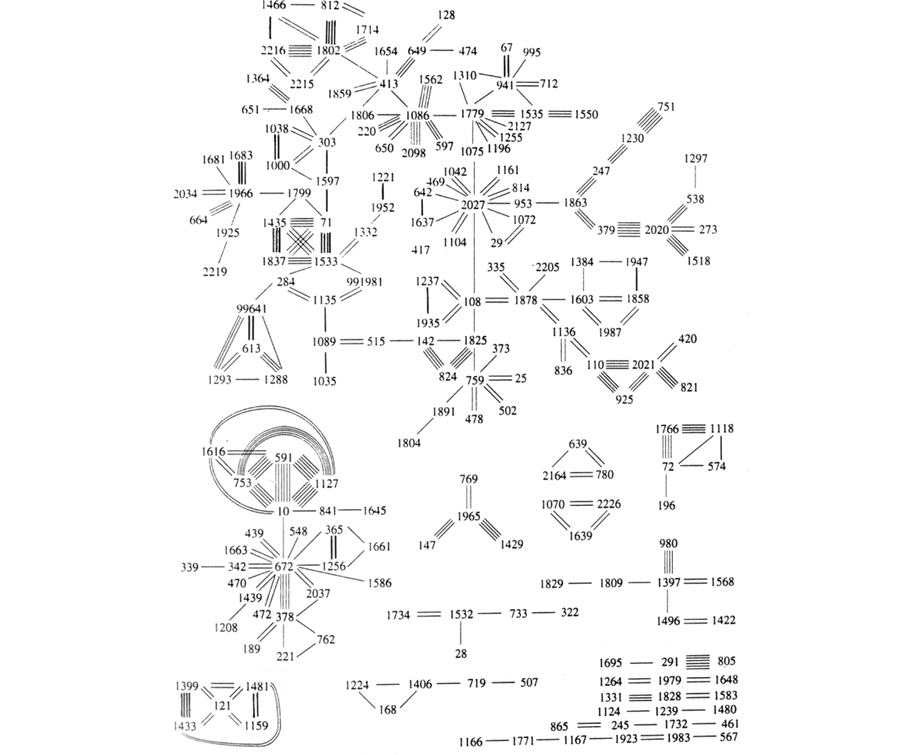

# Chapter 8 Migration, Identity, and Multilingualism in Late Hellenistic Delos

**Contributors:** Francesco Rovai

> But if you have the temple of far-shooting Apollo, all men will bring you hecatombs and gather here, and incessant savour of rich sacrifice will always arise, and you will feed those who dwell in you from the hand of strangers.
> — (Hom. <em>Hymn</em> 3 to Delian Apollo, 56–60; trans. Hugh G. Evelyn-White)

## Introduction

In the aftermath of Rome’s defeat of Macedonia at the Battle of Pydna, which established the Republic as a major power in the eastern Mediterranean, Hellenistic Delos lost its formal independence (it was under the patronage of the Antigonid monarchy) and was placed by Rome under the rule of Athens in 166 BC.[^1] The new administration expelled the Delians, who were replaced by Athenian settlers, and sent an ἐπιμελητής (‘supervisor’) and other magistrates from the metropolis to govern the island (Durrbach 1921: 133ff; Roussel 1987: 1–18). By that time Delos, although it was politically insignificant, nonetheless flourished as a trading centre after the decision of the Senate to make it a duty-free port through a grant of ἀτέλεια ‘exemption from taxes’. In addition to this privilege, to the protection offered by the centuries-old sanctuary of Apollo, and to its good geographical location (cf. Strabo 10.5.4: ἐν καλῷ γὰρ κεῖται τοῖς ἐκ τῆς Ἰταλίας καὶ τῆς Ἑλλάδος εἰς τὴν Ἀσίαν πλέουσιν ‘for it is happily situated for those who are sailing from Italy and Greece to Asia’), in the second half of the second century BC other important developments gave a decisive boost to its economic prosperity. These were the 

destruction of the rival port of Corinth (146 BC), the crisis of the Seleucid kingdom, and the creation of the province of Asia (129 BC).

Thus, the Delian <em>emporion</em> functioned as a core hub for the Mediterranean markets, in which the buying and selling of slaves, oil, wine, luxury goods, and so on, took place – alongside the financial activities of many bankers (for a recent overview and bibliography on the manufacturing and commercial activities of the inhabitants, see Zarmakoupi (2013)). Such an economic development generated an unprecedented demographic growth[^2] due to the large-scale immigration of Athenians and other Greeks, Romans and other Italian <em>negotiatores</em> (‘businessmen’), and also Egyptians, Phoenicians, Syrians, and others, all streaming into Delos for economic purposes (see the next section). The fortune of the island quickly collapsed by the first half of the first century BC as a consequence of the Mithridatic wars: in 88 BC it was sacked by Menophaneses, the general of Mithridates, for siding with Rome (20,000 of the island’s inhabitants were killed, according to Appian <em>Mith</em>. 5.28), and in 69 BC the pirates of Athenodorus, an ally of Mithridates, led most of the inhabitants away as slaves.

Many epigraphic records and much archaeological evidence have survived from the prosperous period between 166 BC and 69 BC, investigation of which may help us to assess issues of multilingualism, multiculturalism, and mobility in the ancient world.

## The Cultural and Linguistic Environment of the Island

The cosmopolitanism of the Delian population between the second and first centuries BC is well known to historians, archaeologists, and linguists (among many others: Hatzfeld (1912); Couilloud (1974); Durrbach (1921: 113–236); Roussel (1987: 87–95); Adams (2003a: 642–5); Hasenohr (2007); and Poccetti (2016)), and it is possible to get an impression of the real scale of this 

phenomenon from Table 8.1, which gives the place of origin of more than 1,600 individuals that are known from both public epigraphy (accounts of the temples, dedications, catalogues of donors, etc.) and funerary inscriptions.[^3]

**Table 8.1 The Delian population in the public and funerary inscriptions**

| Place of origin | Public inscriptions | Funerary inscriptions | Total |
| --- | --- | --- | --- |
| Italy | 586 | 59 | 645 |
| Athens | 421 | 23 | 444 |
| Levant (Syria, Egypt, Cyprus) | 234 | 99 | 333 |
| Asia Minor and Black Sea | 69 | 22 | 91 |
| Aegean islands | 72 | 13 | 85 |
| Greece and Macedonia | 10 | 3 | 13 |
| Arabia | 5 | 0 | 5 |
| Mesopotamia and Media | 1 | 2 | 3 |
| Cyrenaica | 1 | 1 | 2 |

Within this heterogeneous population coming from the Central and Eastern Mediterranean basin, three primary ethnic, linguistic, and cultural components can be easily individuated: Italian, Greek, and Semitic.

A few more words are due about the last group, whose numerical consistency is probably underestimated in Table 8.1, especially within public inscriptions. This is due to the fact that, whereas the Roman onomastic formula is unambiguous, only a very few Semitic names are undoubtedly characterised as such (e.g. 2611: Μαγγάβων; 2365: Ζαβδίων; 2619: Σαββίων).[^4] In many cases, instead, onomastics may be deceptive because, in a Hellenistic environment like Delos, people from the Eastern Mediterranean adopted Greek names (Couilloud 1974: 310); for example, Γοργίας, which is a rough transliteration of the Semitic name 

<em>Gerges</em> (Roussel 1987: 91); Ἡλιόδωρος and Βασιλείδες, which approximately translate the Phoenician names <em>‛bdšmš</em> (<em>Abd</em>-<em>Shemesh</em>) ‘Servant of the Sun’ and <em>Mlkb‛l</em> ‘Baal is king’ (Masson 1969: 683, 691); Στράτων and Φιλόστρατος, for their assonance with the theophoric names embedding the name of Astarte (Masson 1969: 692–3). Thus, on closer scrutiny, ‘[l]a population d’origine orientale était certainement aussi nombreuse à Délos que la population italienne’ (Couilloud 1974: 310). The Phoenicians in particular are well represented (Hasenohr (2007: 77–80), and references therein): many citizens of Berytus, Tyre, Sidon, Ascalon, and other minor cities of Phoenicia are known from both official inscriptions and gravestones;[^5] they were organised in two public associations whose status was religious and professional at the same time, ἡ σύνοδος τῶν Τυρίων Ἡρακλειστῶν ἐμπόρων καὶ ναυκλήρων ‘the association of Tyrian <em>Herakleistai</em>, merchants and shipowners’ (cf. 1519.35–6, 40–1, 49–50 and 61–4: 149 BC) and τὸ κοινὸν Βηρυτίων Ποσειδωνιαστῶν ἐμπόρων καὶ ναυκλήρων καὶ ἐγδοχέων ‘the community of Berytian <em>Poseidoniastai</em>, merchants and shipowners and warehousemen’ (e.g. 1520.1–2 and 27–8: 149 BC; 1778.2–3: after 150 BC);[^6] the members of these associations financed the construction of numerous public buildings (Hasenohr 2007: 81–2); their youths were admitted to an ephebic education together with young Athenians and Romans, and continued to attend the gymnasium (Baslez 2002: 55: ‘lieu par excellence de l’intégration sociale’) as <em>pareutaktoi</em> or <em>hieropes</em>.[^7]

## The ‘House of Seals’

A representative cross-section of this multicultural and multilingual society can be obtained from the study of the ca. 26,000–27,000 imprints of seals on ca. 16,000 clay cachets that were found in a private house in the quarter of Skardhana and gave the house the name ‘Maison des Sceaux’ (Boussac 1988; 1992; 1993; Auda & Boussac 1996). The front side of the cachets is impressed with seals (from 1 to 13), while the back side has traces of the papyrus fibres of the documents that were sealed with them and that were lost in 69 BC when the house was burnt down.

It was in all likelihood an archive of private contracts that was managed by a man involved in commercial transactions, probably a banker or a broker (Boussac 1988) – maybe Italian (Rauh 1993: 217–18; Zarmakoupi 2013), though not necessarily one of the <em>Mundicii</em> referred to later in this chapter – that also bore the function of <em>syngraphophylax</em>, a private individual who acted as a trustee responsible for keeping contracts (Boussac 1993: 683–4). The nature of the archive can be inferred from the fact that the official seals are extremely scarce (Boussac 1993: 680) and that three quarters of the clay sealings (ca. 76.5 per cent) have at least two seal impressions (Auda & Boussac 1996: 511–12). This is typical of private deeds among individuals, in which the sealing is jointly sealed by the parties, and/or the guarantors, and/or the witnesses who are involved in the transaction (Boussac 1988: 312–18; 1993: 674–9).

The archive was in operation during the second period of Athenian rule, as is shown by the presence of the official seal of the Athenian supervisor of Delos (Boussac (1988: figg. 8, 9): bearded head with the inscription ἐπιμελητὴς ἐν Δήλῳ). An absolute chronological reference is provided by a Greek–Phoenician bilingual official seal of a κοινοδίκιον (a joint tribunal consisting of judges appointed by two or more cities, which was responsible for 

the legal conflicts among their citizens in the Hellenistic world; Chaniotis (1996: 141–3)), which dates to year 185 of the Seleucid Era, that is, 128–127 BC (Boussac 1982: 444–6; 1992: 16–17). The sack of the island by Athenodorus in 69 BC, when the entire quarter of Skardhana was destroyed by fire, gives the final date for the use of the house.

## Movements of People

This section is not intended as a comprehensive survey of such a large hoard of imprints. In most cases they do not bear any linguistic information, because inscribed seals are an exceptional minority, and the iconography alone makes it impossible to establish the identity of the seal owners: the portraits are portraits of unknown individuals, and the eclectic stylistic and iconographic repertoire of deities and heroes (Boussac 1988: 333–4; 1993: 686–93) simply results from the well-known heterogeneous religious <em>milieu</em> of the island, where the traditional Greek gods (obviously Apollo, but also Heracles, Artemis, etc.) coexist with the oriental ones (mainly Egyptian, but also Syrian) and with the usual Roman civil cult of Rome, Romulus and Remus, and the rest (Roussel (1987: 206–80); Bruneau (1970)).

Instead, this section aims at highlighting some general facts that can provide important insights into the composition and the consistency of the clientele, with some further considerations on those cases where an inscription is available.

The small group of official seals is indicative of a range of business activity that included Italy and the Eastern Mediterranean: the seal of a Roman magistrate, probably Cn. Cornelius Dolabella, the proconsul of Cilicia in 80–79 BC (Boussac 1988: 319 fig. 17a–b: <em>Dolabel</em>[<em>la</em>]); two seals of the Seleucid administration (Boussac 1988: 315 fig. 15: a horse’s head and anchor; 319 fig. 16: βασιλέως Ἀντιόχου); some seals of Greek cities of the Cyclades, such as Naxos (Boussac 1988: 315 fig. 10: Ναξι) and Mykonos (Boussac 1988: 315 fig. 11: Μυκο), and of Asia Minor, such as Ephesos (Boussac 1988: 315 fig. 12: Artemis Ephesia and Εφ), Kolophon (Boussac 1988: 315 fig. 13: 

Κολοφωνίων), and Tralles (Boussac 1988: 315 fig. 14a–b: Τραλλιανῶν).

The cosmopolitanism of the clientele is also confirmed by the rare inscribed sealings that attest Greek, Roman, and Semitic names, which is in line with what it is known about the population of Delos between the second and first centuries BC. The Greek data are not particularly significant, as they are limited to the personal name (in most cases, very common) without any ethnic indication or patronymic. But, again, it may be the case that Oriental people are hidden behind a Greek name: the names Ἰάσων and Στράτων, which are attested among the seals, were often borne by hellenised Semites (Boussac 1988: 322 n. 59; in particular, according to Masson 1969: 682, the former was adopted by Jews and Phoenicians, for the latter, see the discussion earlier in this chapter).

As for the Romans, the most updated list of the onomastic material that is engraved on the seals can be drawn from the <em>Liste des Italiens de Délos</em> by Ferrary et al. (2002). There is a total of sixty-one private seals bearing Roman names: fifteen onomastic formulae contain at least <em>praenomen</em> and <em>nomen</em>, of which thirteen are written in Latin[^8] and two in Greek;[^9] in two cases the seal is intact but contains only a Greek-written Latin <em>praenomen</em>;[^10] finally, in forty-four cases, all Latin-written, the names are fragmentary or abbreviated.[^11] It is not surprising that, for a marker of personal identity in official transactions like the seals, the Italian <em>negotiatores</em> used almost exclusively Latin. This is consistent with their linguistic behaviour in the public and official domain, where Latin is maintained as a marker of corporate identity (see discussion later in this chapter). And the four exceptions of Latin names written in Greek boil down to two 

(Γαίος Αὐφίδιος and Αὖλος Σήιος), because the two Greek-written Latin <em>praenomina</em> (Πόπλιος and Τίτος) may simply refer to Greek citizens that took a Latin <em>praenomen</em> as their personal name, as is demonstrated by other instances where the Attic demotic is decisive, such as Γαίος Ἀχαρνεύϛ (2072.4, 2073.6–7, 2091a.4), and Μᾶρκος Ἐλευσίνος (2037.1).

The Semitic names are fewer than expected for a community that was well represented on the island (see the discussion earlier in this chapter). The sole two instances, both discussed by P. Bordreuil in the Appendix of Boussac (1988: 339–40), are nevertheless of interest. The former, which is written <em>‛blM</em> and is interpreted by Bordreuil as the personal name <em>‛bld’lm</em> ‘serviteur des dieux’ (Boussac 1988: 340), is a curious mixture of three different alphabets: according to the author, the sign for <em>b</em> belongs to the Aramaean alphabet, <em>l</em> is in all likelihood Phoenician, while the final letter is a Greek capital μ. The reading of the latter seal is instead uncertain, but it probably contains three letters <em>lrt’</em> that may be compared to the Palmyrene name <em>rt’</em>.

However, the most interesting aspect of this seal is the fact that it is impressed on the same clay sealing where a Roman seal is impressed (Boussac 1988: 320 fig. 20, 321), which raises some questions about the management of the interaction taking place between the two parts. As nobody would sign a document that he does not understand (at least in its general outlines), this sealing shows that, one way or another, a Roman and a Semite could achieve mutual comprehension. The practical arrangement of this interaction is necessarily bound to remain speculative: perhaps at least one of the subscribers was a fluent bilingual and he was competent in the standard formulae of the bureaucratic language, so that the document, either Latin- or ‘Semitic(= Palmyrene?)’-written, was understandable by both sides. But it is also possible that at least one of the two parts was accompanied by an interpreter or a bilingual clerk; or that they communicated in the <em>lingua franca</em> Greek, so that the document was also written in Greek; or that the document included two versions that were written in the two different languages.[^12]

This sealing is further evidence of the fact that mutual interaction, and presumably comprehension, between the Romans and people from the Near East was commonplace, as is also shown by the close relationships of the former with the Phoenicians (Hasenohr 2007; Poccetti 2016). In the public domain, on the one hand, the κοινόν of Berytian <em>Poseidoniastai</em> celebrates the goddess Roma εὐνοίας ἕνεκεν τῆς εἰς τὸ κοινὸν καὶ τὴν πατρίδα ‘on account of her goodwill towards the association and the homeland’ (1778.4; cf. also 1779) and has among its members the Roman banker Marcus Minatius (1520; Hasenohr 2007: 87). On the other hand, the Phoenician banker Philostratus of Ascalon offers and receives dedications from the <em>Italici</em> for his generous donations to the <em>Agora des Italiens</em> (1717, 1718, 1722, 2454, 2549),[^13] to the point of gaining the citizenship of Naples (Hasenohr 2007: 87; Leiwo 1989). Finally, among the subscribers of the <em>Agora des Italiens</em> (2612) there are thirty-six Italians, nine Greeks (including continental Greeks and Ionians), and two Phoenicians (from Tyre and Sidon). In a more private dimension, instead, the prosopographic investigations of Le Dinahet-Couilloud (2001), Baslez (2002), and Poccetti (2016: 412, 417) have repeatedly drawn attention to the existence of mixed marriages between Italians and women from the Eastern Mediterranean.

## Mobility and Interpersonal Relations

In spite of the scarce linguistic data, the frequency of seal impressions and their reciprocal associations can nevertheless function as 

a reliable indicator of the mobility of individuals (Boussac 1993: 686; Auda & Boussac 1996). These numerical indicators may disclose a difference between two types of clients: the largest part of the clientele is occasional, as can be inferred from the fact that most of the seals are impressed only once (ca. 70 per cent; data from Boussac 1993: 686) or twice; the more stable and regular business partners are a small minority, with a restricted group of persons that are responsible for hundreds of transactions (out of a sample of 5,255 seals only 87 are impressed from 11 to 76 times, 5 are impressed ca. 100 times, 1 occurs 255 times, and 1 occurs 357 times; data from Auda & Boussac 1996: 513).

Most interestingly, the detailed statistical analysis by Auda and Boussac (1996) on a sample of 3,435 seals impressed on 1,487 cachets, has shown that, among those seals that are impressed at least twice, there are regular co-occurrences of the same seals on the same cachets, that is to say that there were enduring and constant interpersonal relations held between individuals that regularly took part in common transactions.[^14] Figure 8.1 (adapted from Auda & Boussac 1996: 323) displays, for example, that seal n. 1435 is associated four times with seal n. 71, three times with seal n. 1533, and three times with seal n. 1837; in its turn, seal n. 71 is associated four times with seal n. 1533, and three times with seal n. 1837; and so on.

If these clusters of relations are mapped on the ground of the socio-historical reality of Delos, there results the image of a ‘close-knit social network’ in the classical sense of Milroy (1980), which is made of a group of individuals that are members of a high-density and territorially based community, that work in the same place and in the same field (trade and related activities), that create voluntary associations with other members of the community (the religious <em>collegia</em> and guilds operating on the island, the attendance at the gymnasium), and that – at least in 

some cases – may be demonstrated to have ties of kinship on the island.

It is important to highlight that the native culture of the individuals seems to be rather an irrelevant factor in the establishment of these interpersonal relations. This may appear trivial with regard 

to business and trade activities, but it holds for other aspects of the social life as well. From the 130s BC, for example, Athenians and other Greeks, Italians, and Semites gathered together under the collective definition of Ἀθηναίων καὶ ‘Ῥωμαίων καὶ τῶν ἄλλων ξένων οἱ κατοικοῦντες καὶ παρεπιδημοῦντες ἐν Δήλωι (1646) in a number of honorific decrees made on the combined initiative of the various groups (cf. also 1644, 1645, 1650, 1651, 1652; this formula and its variants are discussed in Roussel 1987: 50–5).

Furthermore, they all shared the cults of a remarkably eclectic pantheon. Apollo is honoured not only by Athenian priests in his own sanctuary but also by the Italian <em>Apolloniastai</em> and the Berytian <em>Poseidoniastai</em> (Hasenohr 2007: 85). When the worship of the Egyptian god Sarapis, formerly private, was made a public cult, a sanctuary (the so-called Serapeum ‘C’) was built in the first half of the second century BC (Scott 2015: 236), and within the sanctuary itself the temple of Isis and its cult statue were bestowed by the Athenians (2041, 2044).[^15] The review of the inventories of the temple (1403, 1412, 1416, 1417, 1434, 1435, 1440, 1442, 1445, 1452, 1453, 1454), dedications (2037–219), and lists of subscribers (2614–25) made by Roussel (1916: 281–4) shows that ‘[l]es fidèles des dieux égyptiens de Délos se recrutaient dans toutes les région du monde gréco-romain’ (Bruneau 1970: 466). And next to the Serapeum ‘C’, a sanctuary devoted to the Syrian divinities Atargatis and Hadad (who were hellenised as Hagne Aphrodite and Zeus Hadad; cf. Bruneau (1970: 470)) was constructed in the second half of the second century BC (Bruneau 1970: 466). Also in this regard, as can be seen from the numerous dedications (2220–304) and lists of subscribers (2626–8), the worshippers engaging with this 

temple were Athenians, both priests (e.g. 2227, 2228) and private individuals (e.g. 2250, 2251), Romans (e.g. 2245, 2255), and Syrians (e.g. 2224, 2256; cf., in addition, Siebert 1968 for τὸ κοινὸν τῶν θιασιτῶν τῶν Σύρων τῶν εἰκαδιστῶν οὓς συνήγαγε ἡ θεός ‘the association of society members of Syrians of the twentieth day of the month which the goddess gathers together’).[^16]

Finally, with regard to more personal aspects of social life, it may be appropriate to recall that Greeks, Romans, and Semites entered into mixed marriages (cf., again, Le Dinahet-Couilloud 2001, Baslez 2002, and Poccetti 2016: 412, 417), and as young men they attended ephebic training and the gymnasium side by side (see n. 5). Such activities were in their turn linked to the cult of Apollo (Bruneau 1970: 166–7).

Against this social background as described, the second part of the chapter focuses on the following aspects of multilingualism and multiculturalism. On the one hand, it is clear that such a multilingual society, whose members are closely connected with each other, cannot but favour both societal and individual bilingualism: as shown later in the chapter, Latin (and its varieties as well) could be part of the linguistic repertoire of a Greek speaker. At the same time, this does not exclude the existence of smaller-scale, equally close-knit social networks that are based instead on a shared cultural background. Thus, on the other hand, the dialectics between accommodation in a multicultural society and the maintenance of cultural individuality can be overtly marked by means of different language choices, as illustrated later in this chapter with reference to the Latin-speaking <em>Italici</em>.

## The Greeks and Their Language

The Greek population of the island was in large part made of Athenians, as should be expected in the light of the historical 

and political context, as we have already seen. Long before the 166 BC settlement, the Athenian influence on Delos dates back to the sixth century BC and, most of all, to the fifth century BC with the creation of the Delian League under the leadership of Athens. This had a direct impact on the Greek language that was written and spoken in Delos which, like the other Cycladic islands, underwent progressive Atticisation first, and then Koineisation from the fifth down to the second century BC (Handel 1913).

## The Linguistic Repertoire of the Greek-Speaking Delian Community

As a result, the language of the public, official epigraphy of Delos is the Attic Koine that essentially developed from the so-called Great Attic, a superdialectal variety used in Attica, Euboia, the Ionic Cyclades, and Asian Ionia as the written language of the administration in the late fifth and fourth centuries BC (Horrocks 2010: 73–7, 80–4; Bubeník 1989: 178–81).[^17] A number of typical Great Attic/Koine forms are attested in the Delian official inscriptions (state decrees, records of the temples, honorific dedications on public buildings, statue bases, altars, etc.). Among others: the spelling ἀμφικτύων instead of ἀμφικτίων (cf. Threatte 1980: 263–4); the analogical levelling of (παρ-)ἐδώκαμεν (aor. 1st pl.) (e.g. 1401.c.9, c.10 and c.18: after 166 BC; 1416.A.2.15: 156 BC; 1417.B.1.149: 155 BC; 1442.46, 49; and 73: 146–145 BC) and ἔδωκαν (aor. 3rd pl.) (e.g. 1507.10: 145–135 BC; 1514.10: 116 BC) instead of (παρ-)ἔδομεν and ἔδοσαν respectively; ἐγίνετο for ἐγίγνετο (e.g. 1517.16: 156 BC) and γίνεσθαι for γίγνεσθαι (e.g. 1517.26: 156 BC); ἕνεκεν for ἕνεκα (e.g. 1520.30 and 43: 149 BC; 1527.6: 145–116 BC; 1778.4: after 150 BC); the initial aspiration in ἕτος instead of ἔτος (e.g. καθ’ ἕτος in <em>IG</em> XI.2 135.26: 314–302 BC); the spelling of the diphthong -ηι as -ει in the dative singular of η-stems (e.g. 1501.22: 148 BC; 1507.6: 146–135 BC; the common formula of the decrees: ἀγαθεῖ τύχει· ἔδοξεν / δεδόχθαι τεῖ βουλεῖ; compare also Threatte (1980: 377–80)).

More private documents like the epitaphs from the necropolis of Rheneia (Couilloud 1974; Poccetti 2016) bear, instead, some traces of a spoken ‘innovative’ variety that was part of the linguistic repertoire of the Greek speakers during the Hellenistic period. These texts are almost exclusively limited to the stereotyped formula ‘[name of the deceased] χρηστὲ/-ὴ (καὶ ἄλυπε) χαῖρε’,[^18] but some alternations in the variable parts of the text (i.e. the name of the deceased and his/her demotic) indicate a tendency to iotacism (e.g. C 155: Ἱεροπολεῖτι ~ C 131: Ἱεροπολῖτι; C 420: Εἰσιάς ~ C 438: Ἰσιάς; C 45: Μεικώνιε for Μυκόνιε) and a confusion between long and short vowels (e.g. C 154: Ἡράκληα ~ C 485.2: Ἡράκλεαν, both for Ἡράκλεια; and, again, C 45: Μεικώνιε for Μυκόνιε).

Although they underwent separate developments in Roman times (with <η> [ɛː]> [eː]> [i] ≠ <ε> [e]> [ɛ], and <ω> [ɔː]> [oː]> [o] = <ο> [o]), the spelling alternations <η> ~ <ε> and <ω> ~ <ο> may be related to the loss of distinctive vowel length in some domains of the Greek language – even if the precise chronology of this phenomenon is very debated and not easy to assess (see Teodorsson (1974: 183–4, 211–2, 218–19) versus Threatte (1980: 159–64, 384–7); further discussion in Allen (1987: 94); Duhoux (1987); Bubeník (1989: 184); Horrocks (2010: 163–5); Rovai (2015b: 168–9) and references therein). However, further evidence for an advanced loss of vowel-length distinctions in Delos during the second and first centuries BC, can be drawn from the Greek transliteration of some Latin names. While Latin <em>ō</em> is regularly transliterated as <ω>, spellings such as Ῥομαία (C 150, <em>bis</em>; instead of Ῥωμαία, passim), Νόννεις (C 318; instead of Νώνιο[ς], 2616 / Νῶν<ι>α, C 52),[^19] and Ὀφίδιος (for Latin <em>Ōfidius</em> in 2623.A.1.3, a list of subscribers of the Serapeum) can be interpreted as the result of an ‘under-differentiation’ on the part of (more or less) bilingual speakers,[^20] who substitute a single phoneme of their primary language (Gr. /o/) for two phonemes of the secondary language (Lat. /o/ ~ /oː/) whose opposition is not contrastive for them. 

Also the representation of Latin <em>ĭ</em> by <ηι> in Ὀλόσσηιος (2248, for <em>Volusĭus</em>) and by <ει> in Γάειος (C 492, for <em>Gaĭus</em>), indicates, in addition to iotacism, the absence of quantitative distinctions in the language of the Greek drafters. Further evidence in favour of the iotacism that characterised their spoken variety comes from the fact that Latin <em>ī</em> may correspond to either <ι> (e.g. 442, 443: Πλίνιος, for <em>Plīnius</em>), <ει> (e.g. 1429, 1432: Σαβείνιος, for <em>Sabīnius</em>),[^21] or <η> (e.g. 2351: Σερουήλιος, for <em>Seruīlius</em>), and Latin <em>ĭ</em> to either <ι> (e.g. 1751, 2628: Λικίνιος, for <em>Licĭnius</em>) or <υ> (e.g. 1417, 2124, <em>et passim</em>: Αἰμύλιος, for <em>Aemĭlius</em>).

These kinds of variations are consistent with the hypothesis of the existence of at least two subsystems in the phonetics and phonology of the Greek-speaking Hellenistic world, in continuity with a pre-existing distinction between two different varieties within the fourth-century Attic: the ‘conservative system’ of the aristocracy, which mostly retained both qualitative and quantitative oppositions, and the ‘innovative system’ of the moderately educated, which was instead characterised by a remarkable iotacism and was far more advanced in the loss of vowel-length distinction (Teodorsson 1978: 91–8, discussed in Horrocks 2010: 163–5).[^22]

The linguistic features of the public and funerary epigraphy suggest that this was also likely to be the condition of the Greek-speaking community of Delos, where the Koine forms of the official written variety used for decrees, honorific dedications, and so on are attested alongside some features of a spoken ‘innovative’ variety that have occasionally penetrated the written language of more private documents like the epitaphs. Thus, the Koine functions ‘not only as the standard written and spoken language of the upper classes …, but also more abstractly as a superordinate variety standing at the pinnacle of a pyramid comprising an array of lower-register varieties, spoken and occasionally written’ (Horrocks 2010: 84; cf. also Consani 1991: 16; Consani 2014: 121–2). As Teodorsson (1978: 93) correctly emphasises, such a distinction should be regarded not as a clear-cut diastratic opposition but as a scalar diaphasic variation, with most users of the conservative and the innovative subsystems respectively being more or less competent in the other subsystem. Moreover, a certain degree of societal bilingualism must be presupposed for the Greeks dwelling in Delos, in order for them to do any kind of business with the foreign groups on the island, especially the Romans.

## The Linguistic Repertoire of an Individual

There is first-hand evidence for individual Greek–Latin bilingualism in a graffito, which is particularly interesting both for its linguistic features and for its authorship. It was found on a wall of the ‘Maison du Théâtre’ and drawn as follows (Figure 8.2) by Rostovtsev (1896: 392), who also offered the text and the interpretation that are accepted in later editions (1):

- 

(1) <em>Valeri Nerius uneo igni suạ</em> // <em>Augias</em>(Rostovtsev 1896: 392; <em>AE</em> 1897.33; <em>CIL</em> I² 3437b; <em>CIL</em> III 14203.7)

The text dates to ca. 100–70 BC,[^23] and is inscribed with a stylus and undersigned <em>Augias</em>. Thus, it was scratched by a Greek individual who had mastered the Latin alphabet. The text seems to be praise for an actor, and it is interpreted by Rostovtsev (1896) as ‘Oh Valerius! Nerius (is) a pearl by virtue of his fire. Augias’. In addition to the place where it was found (a house of the Theatre District), this reading may be supported by the fact that <em>unio</em> (here <em>uneo</em>; see below) with reference to an actor also occurs in a Pompeian graffito, in which it is said of a pantomime: <em>Paris unio scaenae</em> ‘Paris, pearl of the stage’ (<em>CIL</em> IV 3867; for <em>unio</em> as a eulogistic term, see also Robert & Robert 1976: 578).

However, as shown by Clackson (2016: 84–6), <em>unio</em> was also an old Latin term for dice throws and indicated the ace, the worst and lowest throw of a single die. According to Isidore (<em>Or</em>. 18.65) the ace was called <em>unio</em> by the <em>lusores ueteres</em> but this name was later replaced by <em>canis</em> (‘dog’), as a calque from the Greek κύων (cf. Poll. 9.100: καὶ τὸ μὲν μονάδα δηλοῦν, καλείται κύων ‘and the throw of an ace is called <em>dog</em>’). Board games with dice were extremely popular among all social classes and they were played everywhere from the Pompeian taverns (Clackson 2016) to the halls of Augustus (Suet. <em>Aug</em>. 71.2). Typical game situations are often referred to by authors as usual images of everyday life (see, among others, Pl. <em>As</em>. 904–5, <em>Cur</em>. 354–60; Mart. 14.17; Sen. <em>Ep</em>. 117.30), and people were familiar with their rules and 

terminology, which could undergo metaphorical and figurative uses (Pl. <em>Rud</em>. 358–60: <em>O, Neptune lepide, salue, nec te aleator nullus est sapientior; profecto nimis lepide iecisti bolum</em> ‘Bless you, excellent Neptune, there is no player more expert than you with the dice; to be sure, that was a beautiful throw of yours!’). Thus, it cannot be excluded that <em>Nerius</em> (as well as his Pompeian colleague <em>Paris</em>) was not an excellent but a very bad actor, so that he was taunted by means of comparison with a particularly unlucky dice throw. In addition, the author of the graffito was bilingual and he could have been aware of the correspondence between the Latin <em>unio</em> and the Greek κύων, which was a common insult in Greek.

A few palaeographic observations may be appropriate here, because, except for a few cursive tendencies (the descender of ‹s› and ‹r› extended below the baseline; the ligature between ‹i› and ‹a› in <em>Augias</em>) and for the archaising form of the letter ‹a› (but the horizontal medial stroke that is detached from the left bar and hangs as a short oblique stroke might also be the result of a tendency to verticalisation which is typically cursive), it is worth noting that the letter forms are a good example of a capital script, which suggests that the Greek writer derived his model from the ‘square capitals’ of the public Latin epigraphy and/or from the ‘rustic capital’ that was the standard calligraphic book script.

In any case, the most relevant linguistic feature of this text is the form <em>uneo</em> instead of <em>unio</em>, which – whatever its meaning – testifies the use of <em>e</em> for <em>i</em> in hiatus.[^24] But, as a preliminary issue, it must be safely excluded that such a vowel lowering is the result of an influence of Augias’s native language. Phonetically, the pervasive iotacism that characterised Hellenistic Greek in general led to the raising and merging of front vowels, so that the lowering of a Latin [i] to [e] in the speech of Greek–Latin bilingual seems to be highly unlikely; but, orthographically, not only <i> for <e> but also <e> for <i> could be a hint of a confusion between two front vowels.[^25] 

In this sense, the spelling of the name <em>Augias</em> in itself, which is normally spelled Αὐγέας in the Greek script (cf. the name of the famous king of Elis in the literary sources), might testify to a vowel raising and demonstrate some uncertainty about front vowels in hiatus, but it must be taken into account that doublets of masculine personal names in -έας and -ίας both existed in Attic (Καλλέας and Καλλίας, Νικέας and Νικίας, etc.; Threatte 1980: 145–6), and it may well be the case that <em>Augias</em> is simply the transcription of a possible Greek form Αὐγίας.

Also the name <em>Nerius</em> deserves further discussion, because, as the name of an actor, it might be expected to be a Greek name (cf. <em>Paris</em> in <em>CIL</em> IV 3867), perhaps a stage name. In this case, it may be supposed to represent Νηρεύς but, as far as we know, there is no evidence that the short first element of the diphthong ευ was ever involved in a process of raising in Koine Greek (Threatte 1980: 345–8). Rather, the diphthong adopted a closer articulation of the second element that led to the Modern Greek pronunciation [ef] / [ev] (Horrocks 2010: 163–5, with references to Teodorsson 1974 and 1978). <em>Nerius</em> can therefore be intended as a Latin <em>nomen</em> referred to a member of the <em>gens Neria</em>, and the fact that, like the opening vocative <em>Valeri</em>, it occurs as a single personal name without any <em>praenomen</em> or <em>cognomen</em> is consistent with the onomastic practice of a Greek speaker.

Thus, as the Latin spelling <em>Augias</em> may correspond to a possible Greek form Αὐγίας, and the Latin names <em>Valeri</em> and <em>Nerius</em> indicate that the writer was well aware of the distinction between <e> (= [ɛ ~ e]) and <i> (= [i]) – at least in the transcription of Latin 

forms – <em>uneo</em> can be regarded not as a graphic by-product of the influence of Greek iotacism, but as a genuine Latin form, which was present in a Latin variety that was used in Delos and that Augias came into contact with. Notably, the spelling of <em>e</em> for <em>i</em> in hiatus is traditionally assumed as a feature of Faliscan and other non-urban dialects of Latin, namely Praenestine (Ernout 1905–6: 318–19; Campanile 1961; Coleman 1990: 11; Joseph & Wallace 1991; Mancini 2005: 1038). More recently, Adams (2007: 68–72) has critically re-surveyed the epigraphic evidence and observed that the size and the chronology of the corpus of examples are insufficient for arguing that <em>e</em> for <em>i</em> before a vowel reflects a phonetic feature of the language spoken in the territories of either Falerii or Praeneste.[^26] However, building on the literary evidence of the well-known passage from Plautus’s <em>Truculentus</em> (Pl. <em>Truc</em>. 691), in which it is stated that the inhabitants of Praeneste said <em>conea</em> instead of <em>ciconia</em> (‘stork’), he acknowledges that the lowering of <em>i</em> in hiatus in the early period would seem to have been associated with the Praenestine dialect or, more generally, with a non-urban regional dialect (see also Adams, 2013: 102–3).

This graffito, with its script and its linguistic features, raises several considerations on how complex and multilayered the linguistic repertoire of a single individual could be in the multilingual and multicultural <em>milieu</em> of Delos during the second and first centuries BC. Augias was a Greek–Latin bilingual and, as a member of a Greek-speaking Late Hellenistic community, his Greek competence was likely to include the range of variation sketched elsewhere in the chapter. Moreover, as he was literate in Latin, it can easily be deduced that he was able to also write in Greek. In addition, not only was he acquainted with a written, and, therefore, (at least to some degree) standardised, variety of Latin, but his Latin competence and speech were also influenced by a non-urban variety of spoken Latin.

## The <em>Italici</em> and Their Language

Although they were deeply integrated into a tight network of social relationships with the Greeks and other Eastern people, the community of the <em>negotiatores</em>, those freemen, freedmen, and slaves who came from Italy for business, preserved a well recognisable corporate Latin-speaking identity that distinguishes them from all the other groups acting on the island.

## Identity, Accommodation, and Linguistic Choices

As suggested in Mullen (2012: 26–7), the concept of ‘ethnolinguistic vitality’, that is, ‘that which makes a group likely to behave as a distinctive and collective entity within the intergroup setting’ (Giles, Bourhis & Taylor 1977: 308), may have potential heuristic value in understanding the linguistic behaviour and the language choices of a speech community of immigrants in situations of language contact.

The <em>Italici</em> exhibit a high level of ‘ethnolinguistic vitality’: their shared cultural background is overtly symbolised by several collective self-definitions that they use in either Greek- or Latin-written public epigraphy: they call themselves <em>Italici</em> / Ἰταλικοί 

(‘those who come from Italy’);[^27] they make explicit reference to their common economic interests (Hatzfeld 1919: 192 ff.; Rauh 1993; Zarmakoupi 2013), describing themselves as businessmen <em>qui Deli negotiantur</em> (cf. 1620, 1695, 1696, 1698) / οἱ ἐν Δήλωι πραγματεύομενοι / ἐργαζόμενοι (cf. 1725, 1727, 1729);[^28] they operate in the public domain as the <em>magistri</em> of four major religious <em>collegia</em> (<em>Hermaistai</em>, <em>Apolloniastai</em>, <em>Poseidoniastai</em>, and <em>Competaliastai</em>; cf. 1731–70),[^29] which are set up according to the model of the <em>collegia</em> acting in Southern Italian cities (Hasenohr 2002; 2007); they head the construction of a large square, the so-called <em>Agora des Italiens</em> (cf. 2612 and 1683–93bis for the neighbouring buildings), which became a gathering point for their entire community (Hasenhor 2007);[^30] in addition to the religious cults that are common to other groups (see the ‘Movements of People’ section), they attended the typical Roman domestic cult of the <em>Lares</em> that was celebrated by the <em>Competaliastai</em> (Hasenhor 2003).

The dialectics between their accommodation in a Greek-speaking environment and the maintenance of such a well-characterised identity is reflected in their choices of language for the different types of written documents. Drawing from the <em>liste des Italiens de Délos</em> (Ferrary et al. 2002: 186–226), 314 texts are known that may be related to members of the Italian community (Table 8.2):[^31]

**Table 8.2 Delian documents containing Latin names**

| Types of inscription | n. | Language | n. |
| --- | --- | --- | --- |
| Accounts of the temples | 40 | Greek | 40 |
| Ephebic and gymnasium lists | 6 | Greek | 6 |
| Honorific dedications and decrees | 139 | Greek | 101 |
|  |  | Latin | 17 |
|  |  | bilingual | 21 |
| Funerary inscriptions | 63 | Greek | 61 |
|  |  | bilingual | 2 |
| <em>Graffiti</em> | 6 | Latin | 3 |
|  |  | Greek | 3 |
| Seals | 59 | Latin | 57 |
|  |  | Greek | 2 |
| <em>Defixiones</em> | 1 | Latin | 1 |

They had no choice either for the accounts of the temples or for the lists of the gymnasium, which could only be written in Greek, as they were commissioned by the Athenian administration to professional stonemasons. On their part, the gravestones from Rheneia are carved as a serial and rather banal production (Couilloud 1974: 53–9) by primarily, if not exclusively, Greek-speaking draftsmen (Poccetti 2016: 422). But for the other typologies of sources an explicit choice was made by the Italian <em>negotiatores</em>. As already advanced by Adams (2003a: 645–61), the use of Greek in public epigraphy expresses their accommodation in Greek-speaking Delian society; at the same time, the maintenance of Latin in the decrees of the <em>collegia</em> and other public inscriptions in which they acted under the collective name of <em>Italici</em> underlines their corporate Latin-speaking identity. In contrast with the public epigraphy, the use of Latin for an inherently private action like a malediction (the Rheneia curse tablet: 2534; Adams 2003a: 680–2; Poccetti 2016: 421), as a marker of personal identity (the seals), and in more casual contexts (the graffiti) suggests that Latin remained the spoken language for inner communication among the 

<em>negotiatores</em>.[^32] What kind of Latin, is the question addressed in the following sections.

## Spoken Latin in Greek Inscriptions

In Rovai (2015b) I tried to individuate some features of the variety of Latin that was spoken by the community of the Italian <em>negotiatores</em>, through the investigation of the transliteration of the Latin personal names within Greek texts. The accommodation of Latin onomastics into Greek orthography does, in fact, reflect a complex overlap of the graphemic conventions current in the two languages with a set of tentative correspondences that switch between orthographic and phonetic transcriptions (Rovai (2015b: 170–80), and references therein).

Once we exclude what can be traced to the official, standard criteria of transliteration that were established in the Greek versions of <em>senatus consulta</em> and in the <em>epistulae</em> of Roman magistrates (Rovai 2015b: 170, 172–3),[^33] and what is due to the influence of the language that was spoken by the Greek drafters of the inscriptions (Rovai 2015b: 174–5; see also earlier discussion on the inconsistencies in the use of <ι>, <ει>, <η>, and <υ> for Latin [i(ː)], which reflect the Greek iotacism), there remains a reliable corpus of <em>nomina</em>, whose Greek transcriptions entail a spoken, rather than written, Latin model.

In particular, they testify to some well-known phenomena that are currently acknowledged as colloquial features of the Latin speech (see a list in Väänänen (1967: 35–45); Clackson (2011: 520), among many others): the monophthongised pronunciation of 

<em>au</em> is witnessed by the form Σωφήιε, which occurs in a bilingual epitaph (C 243) alongside the Latin vocative <em>Saufeie</em> (Poccetti 2016: 421);[^34] the syncope of a short post-tonic vowel is indicated by the Greek script in the usual transcription of the <em>praenomen</em> <em>Decimus</em> as Δέκμος (<em>passim</em>); and many instances of transliteration of the Latin <em>ĭ</em> as <ε> (e.g. 2616 and C 75: Καικέλιος; 2598: Φλαμένιος; 1732, 1753, and 1754: Τεβέριος) and <em>ŭ</em> as <ο> (e.g. 1427 and 2612: Δεκόμιος; 1755 and 2618: Λοκρήτιος; 1430, 1432, 1449, 1450, and 1451: Ποστόμιος; 2346: Σπόριος), speak in favour of a lowered pronunciation of the Latin short high-vowels, which is recognised by scholars as a phonetic feature of spoken Latin from early times (Allen (1978: 49); (1987: 63–4); Vineis (1984: 49–53); Marotta (2015: 46–52), and references therein; see also Rovai (2015b: 177–80), for a full list of examples and further discussion).[^35]

## The Graffiti

While my investigation in Rovai (2015b) was based exclusively on public, official inscriptions and ‘private’ epitaphs, this section discusses instead a numerically minor, and more casual, typology of texts, that is, <em>graffiti</em>.

The Latin <em>graffiti</em> are extremely scarce – three texts total, of which one is the work of a Greek. Of the other two, the first, which is also the shortest, is not particularly interesting except from a prosopographic point of view. It was scratched into a wall of the ‘Maison des Sceaux’ (whose destruction in 69 BC can serve as the <em>terminus ante quem</em> for this text; see note 23) and consists of the onomastic formula of two brothers, which is set in between two lines that partially preserve some readable Greek letters (2):

- 

(2) ΘΗ[…] // <em>L</em>(<em>ucius</em>) <em>M</em>(<em>arcus</em>) <em>Mundicius</em> // ΘΩΔ […] ΜΟΥ(Le Dinahet-Couilloud 2001: 105–6; <em>AE</em> 2001.1797)

The <em>Mundicii</em>, their freedmen, and their slaves are also known from public epigraphy (1692, 1760, 1764, 1768, and 2612) and, according to Le Dinahet-Couilloud (2001: 105–6), the two brothers <em>Lucius</em> and <em>Marcus</em> may be identified with the masters (or patrons) of two slaves (or freedmen) who are part of the <em>collegium</em> of the <em>Competaliastai</em> in 100–98 BC (1760: Ξένων Μονδίκιος Λευκίου καὶ Μαάρκου) and 93 BC (1764: Ἀλέξανδρος Μονδίκιος Λευκίου κα̣ὶ̣ Μ̣α̣ά̣ρ̣κ̣ο̣υ̣).

A second graffito (Figure 8.3) is the work of <em>C</em>. <em>N</em>(<em>e</em>)<em>rius Eros</em>, a freedman of another <em>gens</em> whose presence in Delos is well attested: [Γ]άιος Νέριος and [Π]όπλιος Νέριος are among the subscribers of two public dedications (2432 and 2457 respectively); another freedman, <em>C</em>. <em>Nerius M</em>. <em>l</em>., commissioned a <em>signum Volcani</em> together with a group of freedmen and slaves (2440); and <em>Nerius</em> was also the name of the actor in ex. (1). The text dates to ca. 100–70 BC (Roussel & Hatzfeld 1909: 508–10) and it is an extemporary and rudimentary dedication drawn freehand on a marble plate that was part of an altar dedicated, among others, to Poseidon (3):

- (3) <em>C</em>(<em>aius</em>) <em>N</em>(<em>e</em>)<em>rius Eros Apollinei et Iouei et Neptuno Minerua</em> <em>et Mircurio</em> | Ποσειδῶ[νος] | Ναυκλαρίου[^36](Roussel & Hatzfeld 1909: 508–10; <em>AE</em> 1910.15; <em>CIL</em> I² 2233)

The forms <em>Minerua</em> for <em>Mineruae</em> and <em>Mircurio</em> for <em>Mercurio</em> are particularly interesting, as they attest a dative ending -<em>a</em> in the first declension and a spelling <em>-irc</em>- for <em>-erc</em>- that have often been discussed in relation to the Latin dialectal variation.[^37] Today, after Adams’s (2007) thorough review of the available epigraphic evidence for regional variation across ancient Italy, the first declension dative ending -<em>a</em> can be essentially classified diaphasically rather than diatopically, as a feature that characterised the register of religious dedications (cf. Adams (2007: 46–52), and references therein).

The spelling <em>Mircuri</em>- for the name of the god <em>Mercurius</em> may instead be acknowledged as a genuine dialectal feature of the Republican Latin (see, among many others: Ernout (1905–6: 321; 1947: 47); Leumann (1977: 45)), although it cannot be attributed to any specific region in view of the scattered geographical distribution of the forms <em>Mircuri-</em>/<em>Mirquri-</em> (Adams 2007: 89), which occur four times at Delos (<em>CIL</em> I² 2233, 2239, 2240, 2504), twice at Praeneste (<em>CIL</em> I² 553, 564), once at Firmum Picenum (<em>CIL</em> I² 1920), and once at Lissa in Dalmatia (<em>CIL</em> I² 2295).[^38] Half of the eight cases are found in Delos, and this fact has been taken by Vine (1993: 161–73) as evidence for a particular regional characterisation of -<em>irc</em>- for -<em>erc</em>- (Vine (1993: 171): ‘essentially Campanian or Faliscan’), according to the traditional assumption of Hatzfeld (1912), (1919: 238–56) that the <em>negotiatores</em> operating in Delos in the second and first centuries BC were not from Rome but from Southern Italy, especially Campania. 

However, as already stated (n. 27), such a claim is no longer acceptable.

Thus, following Adams (2007: 90–1), who also discusses the form <em>stircus</em> for <em>stercus</em> of the <em>lex Luceriae</em> (<em>CIL</em> I² 401), and the passage of Velius Longus where <em>commircium</em> for <em>commercium</em> is attributed by Varro to the <em>antiqui</em> (Vel. Long. 7.77.12–14 K), <em>-irc</em>- for <em>-erc</em>- can be loosely assumed as a non-urban dialectal feature, though with ‘some uncertainties’ due to the fact that there is little evidence for the spelling that might have been current in Rome. In fact, as is often the case with early inscriptions, there are more attestations not only of the irregular spelling <em>Mircuri</em>- (see above) but also of the regular form <em>Mercuri</em>- outside Rome than in Rome itself: two are from Delos (<em>CIL</em> I² 2242, 2243), one from Praeneste (<em>CIL</em> I² 563), one from Puteoli (<em>CIL</em> I² 1618), and one is of uncertain provenance (<em>CIL</em> I² 579). There remains only one certain instance of <em>Merqurio</em> (<em>CIL</em> I² 992) from Rome, which testifies to an urban spelling <em>-erc</em>- against a non-urban spelling <em>-irc</em>- during the late Republic.[^39]

However, some further elements in favour of the urban characterisation of -<em>erc</em>- may be probably inferred from a handful of forms that have the same root as <em>Mercurius</em>, that is, <em>mercassitur</em> from the <em>lex Agraria</em> (<em>CIL</em> I² 585, 71: 111 BC) and <em>merkatus</em>, which is attested three times in the <em>Fasti</em> (<em>CIL</em> I² <em>fasti</em>: <em>Iul</em>. 14(15)–19, <em>Sept</em>. 20–23, <em>Nov</em>. 18–20).

On the one hand, the anomalous morphological structure of <em>mercassitur</em>, with a <em>synthetic</em> passive future perfect in the place of <em>mercatus erit</em> (Lindsay 1894: 465; Leumann 1977: 623), is observed also in very few other examples that are clearly characterised in terms of register: <em>turbassitur</em>, in a law quoted by Cicero (Cic. <em>Leg</em>. 3.11); <em>faxitur</em>, in the 217 BC <em>rogatio</em> of the 

<em>pontifex maximus</em> Lucius Cornelius Lentulus mentioned by Livy (22.10.6); and <em>iussitur</em>, in the solemn prose of Cato’s <em>de Agri Cultura</em> (Cato <em>Agr</em>. 14.1). Whatever their origin,[^40] these forms are restricted to legal and other high-register texts, in which archaisms are in frequent use. In view of their distribution and their extra-paradigmatic status, <em>mercassitur</em> and the like can therefore be seen as true, sporadic survivals of an archaic stage of the language. On the other hand, the three occurrences of <em>merkatus</em> in the <em>Fasti</em> exhibit the typical archaising convention of writing the letter <k> before the letter <a>. Thus, the <em>erc-</em>spelling of the root *<em>merc</em>- is represented by two forms, whose morphology (<em>mercassitur</em>) and orthography (<em>merkatus</em>) indicate them as belonging to the traditional language of law and official texts. This fact suggests: (a) that they are ancient; and (b) that they are representative of urban Latin, because these kinds of documents could not have been composed anywhere but Rome. On the whole, they can be a piece of evidence supporting the originally urban characterisation of the spelling -<em>erc</em>-, as opposed to the dialectal status of the alternative spelling -<em>irc</em>-.

## Final Remarks

To summarise, the cosmopolitan population of Delos is an illustrative case study for investigating the complex and multilayered relationship between culture, ethnicity, identity, and language behaviour, as well as the communication strategies in intergroup and interpersonal relations. The issue is complex and multilayered because it can be approached at different levels: societal, intergroup, interpersonal, and individual.

On the whole, the Delian community can be seen as a ‘community of practice’ <em>à la</em> Wenger (1998: 72–8), whose structure is based on ‘mutual engagement’, ‘joint enterprise’, and ‘shared repertoire’. The members are mutually engaged in a network of collaborative relationships that bind them together as a social entity, and they have a shared understanding of the joint enterprise that binds them together: the ties can be easily 

recognised in what Rauh (1993), in the title of his book, has called ‘the sacred bonds of commerce’ (of which we have seen an example earlier in this chapter). Thus, as part of their practice, they develop a repertoire of common resources that are used in the pursuit of their joint enterprises. Not only the various forms of civil and religious associations, but, at this level, multilingualism <em>per se</em> is one of these resources and functions as a cultural trait which characterises the entire community.

The role of language as a marker of identity surfaces instead at a smaller-scale level, that of intergroup relations. There are, however, important differences between the two main ethnic, linguistic, and cultural groups of immigrants, the <em>Italici</em> and the Semites. When the Phoenicians and the Syrians make reference to their ethnic and cultural identity in a public context, acting under the patronage of their institutions (cf. earlier discussion in note 6 on the Tyrian <em>Herakleistai</em> and the Berytian <em>Poseidoniastai</em>; and the discussion before note 16: τὸ κοινὸν τῶν θιασιτῶν τῶν Σύρων), they never use their native languages – as far as we know, at least – but Greek. The <em>Italici</em>, on the other hand, present their ethnic and cultural identity not only in Greek but also in Latin. Such a difference depends on obvious differences of power relations obtaining between the groups: and not on the level of economic and social development (the Phoenician community was wealthy and its members were fully integrated in the social life of the island), but on the level of political authority, which was very supportive of the <em>Italici</em>, as Rome was rising as the new political and military power (and the citizenship of an Italian city was highly prized by the Phoenicians themselves; cf. Philostratus of Ascalon). While Greek continued to be a language of culture and power in the East Mediterranean, Latin was now able to stand on a par with it in the public and official domain.

The single individuals (the Greek Augias who praises – or blames – an actor; the Roman and the Semite who undersign a common transaction; Marcus Minatius who took part in the association of the Berytian <em>Poseidoniastai</em>; the young Romans and Phoenicians who attended the Greek gymnasium together with young Athenians, cf. n. 7) were, at the same time, part of the larger community of the island and of their smaller ethnic 

community, and this multiple identity correlates with their multilingual competence. At this level, interpersonal aspects of communication probably overruled intergroup considerations, so that mutual comprehension became the most important issue, whatever the linguistic management of the interaction.

Finally, with particular reference to the structure of the Greek–Latin bilingual individual repertoires that resulted from such a close language contact, it is important to highlight the fact that linguistic interference is not just a matter of two systems in contact, but of two dia-systems in contact, a set of varieties of Greek that interact with a set of varieties of Latin. Augias did not come into contact with ‘Latin’ <em>tout court</em> but, at least, with some written registers of Latin <em>and</em> with a spoken regional variety of Latin. And the Greek drafters of both public and funerary inscriptions, who transliterated a Latin <em>ī</em> or <em>ĭ</em> as either <ι>, <ει>, <η>, or <υ>, were not simply ‘Greek speakers’, but they had a linguistic repertoire that included, among others, an innovative variety of Greek that was clearly characterised by iotacism.

## Notes
