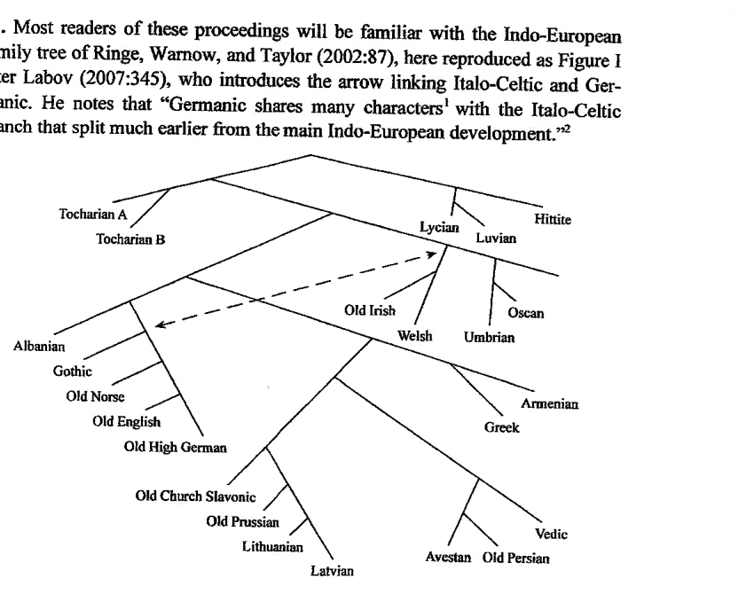

# Celto-Germanic Lexis in Light of Laryngeal Realism

**Joseph F. Eska**  
Virginia Polytechnic Institute & State University

## Prelude

§1. Most readers of these proceedings will be familiar with the Indo-European family tree of Ringe, Warnow, and Taylor (2002:87), here reproduced as Figure 1 after Labov (2007:345), who introduces the arrow linking Italo-Celtic and Germanic. He notes that “Germanic shares many characters[^1] with the Italo-Celtic branch that split much earlier from the main Indo-European development.”[^2]



§2. There is an enormous body of scholarship that discusses lexis which is presumed either to have been borrowed from Celtic by Germanic or to represent lexical developments that are shared exclusively by Celtic and Germanic. Some recent examples from the last three decades are Mees 1998, Markey 1999, Meid 1999, Schmidt 1999, Rübekeil 2002, Schumacher 2007, Stifter 2009, Hyllested 2010, and Quentel 2012.

§3. Some of these lexical items are viewed as shared innovations, e.g., PGmc. *aiþaz (Goth. aiþs, OIcel. eiðr, OE āþ, OS ēth, OHG eid), which reflects Grimm’s Law frication of PIE */t/ > */þ/, beside Proto-Celt. *oitos (OIr. oeth, OW an-utonau gl. ‘periuria’) < earlier *oitós ‘oath’, both of which share a special semantic development of the root *h₁ei- ‘go’.[^3]

§4. Other lexical items are clearly loans from Celtic because they reflect a Common Celtic sound change, e.g., PGmc. *rīkiją (Goth. reiki, OIcel. ríki, OE rīce, OS rīki, OHG rihhi) ← Common Celt. *rīgiom (OIr. ríge) ‘kingdom’ < *h₃rēǵ- ‘king’, which reflects Common Celt. */ī/ < Proto-IE */ē/ and Grimm’s Law devoicing of Proto-IE */g/ > */k/.

Both of these types of contact, then, are presumed to have taken place during the pre-Germanic period.

§5. Yet other lexical items, e.g., PGmc. *ambaxtaz (Goth. andbahts,[^4] OE ambeht, OHG ambaht)[^5] ← PCelt. *ambaktos (Latinized Transalp. Celt. ambactus[^6]) ‘servant’, which are presumed to post-date Grimm’s Law, are assumed to demonstrate that contact persisted for an extensive period of time (so Stifter 2009:273).

## The data

§6. Numerous lists of the Celtic loanwords and possible loanwords into Germanic, and shared innovations of the two families, have been compiled. In this paper, I make use of the conservative list of Don Ringe.[^7] A concise presentation, with occasional modifications, is set out here;[^8] see Ringe’s list for more detail:

1. Words shown to be Celtic loanwords by the Celtic sound change */ē/ > */ī/:

   a. PGmc. *īsarną ‘iron’ ← PCelt. *īsarnom < pre-Celt. *ēsarnom.

   b. PGmc. *rīk- ‘ruler’, *rīkiją ‘kingdom’ < Common Celt. *rīg- < pre-Celt. *rēg-.

2. Words shown to be Celtic loanwords by other formal peculiarities:

   a. PGmc. *brunjō ‘mailshirt’ ← PCelt. *brusn- ‘breast’ (only Celtic extends the root *brus- with *-n-).

   b. PGmc. *lēkijaz ‘physician’ ← PCelt. *leagis (the contraction of vowels and replacement of the stem vowel *-i- by *-ijaz makes better sense if the Germanic lexeme is a loan).

   c. PGmc. *Rīnaz ‘Rhine’ ← PCelt. *reinos ‘stream’ (the fact that Germanic does not possess this lexeme as a common noun demonstrates that it is a loan).

3. Words known to be Celtic loanwords for historical reasons:

   a. PGmc. *ambaxtaz ‘servant’ ← Transalp. Celt. *ambaktos.

   b. PGmc. *walxaz ‘foreigner’ ← Transalp. Celt. Volcā (an ethnonym).

4. Words which might be Celtic loans or shared innovations:

   **Legal and social relations:**

   a. PGmc. *aiþaz, PCelt. *oitos ‘oath’ (special semantic development of the root *h₁ei- ‘go’ only in Celtic and Germanic).

   b. PGmc. *arbiją, PCelt. *orbjom ‘inheritance’ (special semantic development of *h₃erbʰ- ‘orphan’ only in Celtic and Germanic; derivation in *-jo- restricted to Celtic and Germanic).

   c. PGmc. *frijaz, PCelt. *φrios ‘free’ (special semantic development of *prih₂os ‘dear’ only in Celtic and Germanic).

   d. PGmc. *gislaz, PCelt. *geislos ‘hostage’.

   e. PGmc. *leugō ‘vow’, PCelt. *lugjom ‘oath’ (the difference in ablaut suggests that this lexeme is a shared innovation rather than a borrowing from Celtic).

   f. PGmc. *rūnō, PCelt. *rūnā ‘secret’.

   **Terms of military relevance:**

   a. PGmc. *burg- ‘hillfort’, PCelt. *brig- ‘hill’ (the root noun *bʰr̥ǵʰ- is attested only in Celtic and Germanic).

   b. PGmc. *marxaz, PCelt. *markos ‘horse’.

   c. PGmc. *rīdaną, PCelt. *reideti ‘ride’ (special semantic development of *reid- ‘move unsteadily’ only in Celtic and Germanic).

   d. PGmc. *rōwaną, PCelt. *rēt- ‘row’ (only Celtic and Germanic possess a verb that continues the o-grade of *h₁reh₁-).

   e. PGmc. *tūną ‘enclosure’, PCelt. *dūnom ‘fort’.

   f. PGmc. *wīganą, PCelt. *wiketi ‘fight’ (only Celtic and Germanic make a thematic present with zero-grade vocalism to *weik-).

   **Technology:**

   a. PGmc. *laudą, PCelt. *φloudia ‘lead’.

   b. PGmc. *leþrą, PCelt. *pletrom ‘leather’.

5. Basic vocabulary, likely (but not certain) to reflect shared innovations:

   a. PGmc. *allaz, Brit. *olnos ‘all’.

   b. PGmc. *fergunją, PCelt. *φerkuniom ‘mountain’ (derivation in *-jo- of root *perku- < PIE *kʷerk-u- ‘oak’ and connection with mountains restricted to Celtic and Germanic).

   c. PGmc. *gablō, PCelt. *gablā ‘fork’.

   d. PGmc. *[unclear]istiz ‘digit’, PCelt. *bistis ‘finger’ (this lexeme must be a shared innovation of the pre-Celtic period since PIE */gʷ/ > PCelt. */b/).

   e. PGmc. *landą ‘land’, PCelt. *landā ‘open area’ (the Celtic form appears to be the collective to the Germanic form).

   f. PGmc. *lahaną ‘reproach’, PCelt. *loxtos ‘guilt, error’.

   g. PGmc. *maguz ‘boy’, PCelt. *magus ‘slave’.

   h. PGmc. *ōganą, PCelt. *ag- ‘fear’ (special semantic development of perfect *h₂e-h₂(o)gʰ- ‘be upset’ only in Celtic and Germanic).

   i. PGmc. *rīmō ‘number’, PCelt. *rīmā ‘counting’ (the Celtic form appears to be the collective to the Germanic form).

   j. PGmc. *þekuz, PCelt. *tegus ‘thick’.

   k. PGmc. *widuz, PCelt. *widus ‘wood’.

   l. PGmc. *xaiþī ‘uncultivated land’, PCelt. *kaito- ‘forest’.

6. Late loan from Celtic to Germanic or (more likely?) vice versa:

   PGmc. *brōk- ‘legging, stocking’, PCelt. *brāk- ‘trousers’.

## Laryngeal Realism

§7. Laryngeal Realism is an approach to phonology which “adopts a more transparent relationship between distinctive features as phonological entities and the phonetic substance of those features” (definition as per Brown 2016:395; the term “Laryngeal Realism” originates with Honeybone 2005).

There are three Laryngeal features:

```text
Laryngeal
├── voice
├── spread glottis
└── constricted glottis
```

In languages that have a binary contrast between occlusives in which the feature [voice] is active, /p t k/ contrast with /b d g/ (e.g., French); in languages in which [spread glottis] is active, /pʰ tʰ kʰ/ contrast with /p t k/ (e.g., English); in languages in which [constricted glottis] is active, /pʼ tʼ kʼ/ contrast with /p t k/ (e.g., St’át’imcets).[^9]

§8. Standard phonological studies of English (e.g., Hammond 1999:2–8) and German (e.g., Wiese 1996:23), for example, assume that [voice] is the active laryngeal feature via which the plosive series are contrasted in these languages, but it is well known that they actually make their plosive contrast via aspiration, i.e., [spread glottis] is the active feature (Iverson and Salmons 1995). Tape cutting experiments of words commencing with /s/ plus voiceless plosive—in which the plosive is unaspirated because such groups share a single [spread glottis] gesture which is extinguished prior to the release of the occlusion of the plosive (Kim 1970)—make this contrast clear for English. Such sequences are taped, the friction of the /s/ removed, and experiment participants asked to identify the remaining word, e.g., spy, sty, and sky were heard as buy, dye, and guy in virtually all tokens once the sibilant was subtracted (Lotz et al. 1960; Reeds and Wang 1961).[^10]

## Grimm’s Law under Laryngeal Realism and the Persistence of Aspiration in Germanic

§9. Grimm’s Law is traditionally characterized as either a pull chain or a push chain shift:

```text
(2) Pre-Germanic → Proto-Germanic

Voiceless plosives:          *p *t *k *kʷ  →  *f *þ *x *xʷ
Voiced plosives:             *b *d *g *gʷ  →  *p *t *k *kʷ
Voiced aspirated plosives:   *bʰ *dʰ *gʰ *gʷʰ → *b *d *g *gʷ
```

But there is no phonetic rationale for voiceless plosives to fricate unless they are aspirated.[^11] Thus Iverson and Salmons (2003:54–5)—so also Kümmel (2007:169)—posit that the voiceless plosives of pre-Germanic became phonologically aspirated, probably originally as phonetic enhancement, though they do not rule out a contact effect with (an) unknown language(s).

Thus, as follows, assuming a pull chain shift (Iverson and Salmons 2003:54–5):

```text
(3)
I.    Pre-Germanic inventory
II.   Voiceless plosives are aspirated
III.  Voiceless aspirated plosives are fricated
IV.   Voiced unaspirated plosives are devoiced
V.    Voiced aspirated plosives are deaspirated
VI.   New voiceless unaspirated plosives are aspirated
VII.  New voiced unaspirated plosives are devoiced

[table of stop-series transformations present in source; several glyphs are unclear in the scan][^12]
```

## The Celtic plosive shift

§10. Though grammars of ancient, medieval, and contemporary Celtic languages all claim that the active laryngeal feature via which the plosive series are contrasted is [voice] (e.g., Thurneysen 1946:114–8 for Old Irish; Jackson 1953:394–436 passim for the medieval Brittonic languages), it is clear that the contemporary Celtic languages make their contrast via [spread glottis], i.e., the contrast is not /p t k/ vs. /b d g/, but /pʰ tʰ kʰ/ vs. /p t k/. See Jones 1984:41 for Welsh and Ní Chasaide 1999:113 for Irish.

§11. There is also evidence from earlier Celtic that the contrast in the plosive series was /pʰ tʰ kʰ/ vs. /p t k/. Just as contemporary Welsh indicates that a plosive after /s/ is unaspirated via orthographic ⟨sb⟩ and ⟨sg⟩ and contemporary Scottish Gaelic via orthographic ⟨sg⟩, Middle Welsh, Early Modern Irish, and earlier Scottish Gaelic did so via the use of ⟨sb sd sg⟩ for [sp st sk]; cf. the following data from Middle Welsh (cited after Schumacher 2011:116):

(4) a. *kysbell* (PRBH 1182.37) ‘appropriate, convenient’ beside *kyspell* (LIH 210.1).

b. *kysdud* (CA 14.339) ‘affliction, oppression’ beside *kystut* (LIDC 51.30).

c. *kisgaw* (LIDC 13.17) ‘I sleep’ beside *kyscaf* (LIDC 28.62).

§12. Even in Continental Celtic, there is some evidence that the contrast in the plosive series was /pʰ tʰ kʰ/ vs. /p t k/:

(5) a. The Celtib. acc. sg. det. SDAnm (MLH K.6.1) occurs in one of a number of inscriptions in which an orthographic voicing contrast has been claimed to have been introduced (cf. Jordán Cólera 2005, 2007, 2017). But it does not make sense for a voiced plosive to occur immediately after voiceless /s/. It would make sense for ⟨DA⟩ to represent unaspirated [t] in this position, however, which implies that the ⟨T⟩ series of characters represents voiceless aspirated plosives (Eska 2017b).

b. When the speakers of Cisalpine Celtic first adopted and adapted the north Etruscan alphabet—probably via the Veneti, whose language contrasted /p t k/ vs. /b d g/—it possessed characters to represent ⟨d g⟩ beside ⟨p t k⟩, but later gave the former series up. This hardly makes sense if Cisalpine Celtic likewise contrasted /p t k/ vs. /b d g/. But it would make sense if its contrast was not one of [voice] but of [spread glottis], i.e., /pʰ tʰ kʰ/ vs. /p t k/ (Eska 2017a).

c. Heretofore presumed /b d g/ in Celtic names in Latin inscriptions which are otherwise accurately spelled sometimes appear as ⟨p t k⟩, especially at the dorsal place, where, owing to physiological factors, it is most difficult to maintain voicing (Eska 2017b:60–5).

   1. APLONDVS (CIL II 3082) beside ABLON|IVS (CIL III 2940) < PCelt. *ablo- ‘strength’.

   2. ATVMENNIA (CIL VI 21070) beside ADVMEN(us) (CIL XII 1225) < PCelt. *addu- */haːtw/- < PIE *pód-u- ‘foot’ (so Delamarre 2014:79–82).

   3. ATECNATI (AE 1974, 490; gen. sg.) beside ATE|GNATAE (CIL II 5698; dat. sg.) < PCelt. *gnata/a- /knaːtto/aː/- ‘son/daughter’.

§13. Upon the basis of this evidence, I would project [spread glottis] as the active laryngeal feature distinguishing the plosive series back to Proto-Celtic and posit the following plosive shift (Eska forthcoming):

```text
(6)
I.    Pre-Celtic inventory
II.   PIE *gʷ merges with PCelt. */b/
III.  Merger of voiced aspirated plosives with voiced unaspirated plosives
IV.   Voiceless unaspirated plosives are aspirated
V.    Voiced plosives are devoiced
VI.   */pʰ/ is fricated to */ɸ/

[table of stop-series transformations present in source; several glyphs are unclear in the scan]
```

## Celto-Germanic lexis in light of Laryngeal Realism

§14. It is normally presumed that the Celto-Germanic lexis which was borrowed from Celtic into Germanic occurred after Proto-Celtic (conventionally dated to ca. 800 BCE)[^13] sound changes took place, but prior to the completion of Proto-Germanic (conventionally dated to no earlier than ca. 500 BCE, see Ringe 2017:84, 241) sound changes, particularly Grimm’s Law. And that shared Celto-Germanic innovative lexis arose during a “contact period ... before the occurrence in any of the languages of any distinctive sound changes that would have rendered the borrowings detectable” (Ringe, Warnow, and Taylor 2002:111). Under a Laryngeal Realism analysis of Proto-Celtic and Proto-Germanic plosive phonology, such a view is still possible, but is not necessary.

```text
(7)
Proto-Celtic      Pre-Germanic       Proto-Germanic
[comparative stop-series table present in source; glyph-level recovery requires further pass]
```

§15. The Celtic loanwords without Proto-Germanic fricatives could be post-Grimm because Proto-Indo-European voiced plosives were devoiced in both Proto-Celtic and Proto-Germanic. PGmc. *rīk- ‘ruler’ and *rīkiją ‘kingdom’ could have been borrowed after the Common Celtic sound change of PIE */ē/ > */ī/, but also after the operation of Grimm’s Law, else Celt. */k/ would have developed to PGmc. */x/ (8a, c, d) (so also Celt. */p/ would have developed to PGmc. */f/ (8b)).

(8) a. *lēkijaz ‘physician’ (Goth. lēkeis, OIcel. læknir, OE lǣce ‘physician, leech’, OHG lāhhi, lāchi ‘leech’) ← Celt. *lēkis (OIr. liaig) (Celtic pre-plosive shift *leagis).

b. *brunjō ‘mailshirt’ (Goth. brunjo; OIcel. brynja, OE byrne, OS brunnia, OHG brunja, brunna ‘coat of mail’) ← Celt. *brusn- (OIr. bruinne ‘breast’) (Celtic pre-plosive shift *brusn-).

c. *rīk ‘ruler’ (Goth. reiks) ← Celt. *rīk- (Transalp. Celt. rix, OIr. rí) (Celtic pre-plosive shift *rīg-).

d. *rīkiją ‘kingdom’ (Goth. reiki, OIcel. ríki, OE rīce, OS rīki, OHG rīhhi) ← Celt. *rīkiom (OIr. ríge) (Celtic pre-plosive shift *rīgiom).

§16. The certain Celtic loanwords with Proto-Germanic fricatives may have been borrowed at various times:

(9) a. *ambaxtaz ‘servant’ (Goth. andbahts, OE ambeht, OHG ambaht) ← Celt. *ambaktos (Latinized Transalp. Celt. ambactus, OBr. ambaith, MW amaeth) may have been borrowed prior to the operation of Grimm’s Law, but could also be post-Grimm, because Celt. *kʰ > x / __ t.

b. *walxaz ‘foreigner’ (OE wealh, OHG walh) ← Celt. *Volkā (Latinized Transalp. Celt. Volcae [nom. pl.; e.g., Caes., Gal. 4.24]), however, must be a pre-Grimm, or even a pre-Celtic, borrowing, because PCelt. */kʷ/ < PIE */kʷ/ remains unaltered in this environment (Celtic pre-plosive shift *wolkā).

§17. All other post-Grimm forms containing */θ x/ < pre-Grimm */tʰ kʰ/ can represent shared innovations, but could, indeed, also have been borrowed from Proto-Celtic after PIE */t k/ > PCelt. */tʰ kʰ/, but before Grimm’s Law operated in Proto-Germanic:

(10) a. *aiθaz ‘oath’ (Goth. aiþs, OIcel. eiðr, OE āþ, OS ēth, OHG eid) < (← Celt.) *oitʰos (OIr. oeth; OW an-utonau gl. ‘periuria’) (Celtic pre-plosive shift *oitos).[^14]

b. *laxaną ‘reproach’ (OE lēan; OS/OHG lahan ‘blame, prohibit’) < (← Celt.) *lokʰ- (OIr. locht ‘guilt, error’) (Celtic pre-plosive shift *lok-).[^15]

c. *leþrą ‘leather’ (OIcel. leðr, OE leðer, OHG ledar) ← Celt. *φletʰrom (OIr. lethar, MW lledr, MBr. lezr). This must be a borrowing because PIE */p/ is not continued by the Germanic forms; it, furthermore, is likely to be a late borrowing because PCelt. */φ/ survived into early Cisalpine Celtic[^16] (Celtic pre-plosive shift *pletrom).

d. *marxaz ‘horse’ (OIcel. marr, OE mearh, OHG marh, marah) < (← Celt.) *markʰos (Galat. μαρκαν [acc. sg.], MIr. marc, OC/MW march, OBr. marh) (Celtic pre-plosive shift *markos).

e. *þekuz ‘thick’ (OIcel. þjukkr, þjokkr, þykkr, OE þicce, OS thikki ‘multiple’, OHG dicki ‘dense, frequent’)[^17] < pre-Gmc. *tegus; OIr. tiug; OW/MC teu, MBr. teo, teu < PCelt. *tʰekus (Celtic pre-plosive shift *tegus).

f. *xaiþī ‘uncultivated land’ (Goth. haiþi ‘open field’; OIcel. heiðr ‘heath, moor’; OE hǣþ, OHG heida ‘heather’) < *kaitʰī, OC cuit gl. ‘silva’, OW coit, MBr. coat ‘forest’ < PCelt. *kʷaitʰo- (Celtic pre-plosive shift *kʷaito-).[^18]

§18. Proto-Germanic lexemes containing */f/ < earlier */pʰ/ could represent shared innovations, but could also be post-Grimm borrowings, if they occurred before PCelt. */pʰ/ > /φ/ > Ø:

(11) a. *frijaz ‘free’ (Goth. freis, OE frēo, frī, OS/OHG frī) < *prijos or ← Celt. *φrios (OBr. rid, MW rhyd; OC benan rid gl. ‘femina’) (Celtic pre-plosive shift *prios).

b. *fergunją ‘mountain’ (Goth. fairguni, OE firgen ‘mountain’, OIcel. fergyn ‘Mother Earth’, OHG Fergunna ‘Ore Mountain’) < pre-Gmc. *perkunja or ← PCelt. *φerkʷunjom (Transalp. Celt. Hercyniam [acc. sg.; e.g., Caes. Gal. 4.24]).[^19]

§19. The remaining Celto-Germanic lexis could represent shared innovations, but could also be post-Grimm borrowings, because pre-Celt. */t k b d g/ > PCelt. */θ k t p t k/, e.g.:

(12) a. *arbiją ‘inheritance’ (Goth. arbi, OIcel. arfr, OE ierfe, OS/OHG erbi) < (← Celt.) *orθiom (OIr. orbae) (Celtic pre-plosive shift *erbionr).

b. *kablō ‘fork’ (OE geafel, OHG gabala) < (← Celt.) *kaplā (OIr. gabul, OBr. gabl, MW gaff) (Celtic pre-plosive shift *gablā < *gʷablā).

c. *kislaz ‘hostage’ (OIcel. gísl, OE gīsel, OS/OHG gisal) < (← Celt.) *keislos (OIr. giall; OC guistel; OBr. guistl gl. ‘obses’; MW gwystyl, gwystl ‘pledge, surety, hostage’)[^20] (Celtic pre-plosive shift *geislos < *gleislos).

d. *lantą ‘land’ (Goth./OIcel./OS land, OE land, lond, OHG lant) < PGmc. *lontā or ← Celt. *lantā (OIr. land ‘plot of land’; OW lann gl. ‘aet[h]ra 3. aula celi’ ‘church (yard)’) (Celtic pre-plosive shift *landā < *lndʰā).

e. *lautą ‘lead’ (OE lēad) ← Celt. *(φ)loud- (OIr. luaide) (Celtic pre-plosive shift *ploud-). This lexeme must be a borrowing; cf. the discussion in (10c).

f. *leugō ‘vow’ (Goth. liugos [acc. pl.] ‘marriage [i.e., “vows”]) < pre-Gmc. *leug-; OIr. luige, MW lw, MBr. le ‘oath’ < PCelt. *lug- (Celtic pre-plosive shift *lug-).

g. *makuz ‘boy’ (Goth. magus, OIcel. mǫgr, OE magu ‘boy, son’) < (← Celt.) *makus (OIr. mug ‘slave’, OBr. maui ‘youth, servant’; MW meudwy ‘servant of god’) (Celtic pre-plosive shift *magus).

h. *ōganą ‘fear’ (Goth. ogan) < (← Celt.) *ak- (OIr. ad-ágathar) (Celtic pre-plosive shift *ag-).

i. *rīdaną ‘ride’ (OIcel. ríða, OE/OS rīdan, OHG rītan) < (← Celt.) *reite/o- (OIr. réidid) (Celtic pre-plosive shift *reide/o- < *reidʰe/o-).

j. *tūną ‘enclosure’ (OIcel. tún, OE tūn ‘enclosure, town’, OHG zūn ‘fence, enclosure’) < (← Celt.) *θūnom (Latinized Transalp. Celt. -dūnum, OIr. dún ‘hillfort’, OBr. din gl. ‘arx’, MW din ‘fort’) (Celtic pre-plosive shift *dūnom).

k. *wīganą ‘fight’ (Goth. du-wigan ‘to fight’; OIcel. vega, OE/OHG wīgan ‘fight’) < (← Celt.) *wikʰeti (OIr. fichid) (pre-plosive shift *wiketi).

l. *widuz ‘forest, wood’ (OIcel. viðr, OE widu, wiodu, wudu, OHG witu) < (← Celt.) *witus (OIr. fid; OW/OBr. guid [coll.]) (Celtic pre-plosive shift *widus < *widʰus).

§20. It is clear that Proto-Germanic lexis that reflects Common Celtic sound changes that did not also occur in Proto-Germanic such as PIE */ē/ > Common Celt. */ī/ must have been borrowed during the period between when Proto-Celtic had fully emerged and Proto-Germanic had not yet begun to do so (§4 and (8c, d)). But in view of the Proto-Celtic plosive shift discussed herein (§§10–3), many details of which parallel those of Grimm’s Law, tokens of Celto-Germanic lexis that have been taken to be shared innovations that antedate both Proto-Celtic and Proto-Germanic may, in many, though certainly not all, instances, be viewed as borrowings of the post-Proto-Celtic and pre-Proto-Germanic period, or, indeed, in some instances, of the post-Grimm’s Law period. It seems clear that the Celto-Germanic lexis, indeed, is the result of contact over many centuries, but there is less certainty as to whether many tokens are the result of shared innovation or borrowing after the Celtic plosive shift.

[^1]: “Character” is employed as in the usage of computational phylogeny.

[^2]: Borrowing is taken up by Nakhleh, Ringe, and Warnow 2005 and Warnow et al. 2006. The problem that contact poses for the placement of Germanic within the Indo-European tree is discussed by Ringe, Warnow, and Taylor 2002:110–2 and Nakhleh, Ringe, and Warnow 2005:396–408.

[^3]: “Shared innovations” have traditionally been assumed to represent the result of contact phenomena prior to the completion of any distinctive sound changes in either Proto-Celtic or Proto-Germanic; cf. Ringe, Warnow, and Taylor 2002:110 and see §14. The root of the Celtic and Germanic etyma have sometimes been connected to the Hittite root ḫai- ‘believe, trust’ (e.g., Mallory and Adams 2006:323) listed, e.g., by Puhvel (1984:III.9–10); but he himself rejects the comparison, as does Kroonen (2013:13 s.v. *aiþa-).

[^4]: With remodeled prefix. NB the incorrect segmentation, as *b* belongs to the Celtic prefix.

[^5]: Cf. also feminine OIr. [unclear] ‘bondwoman; concubine’.

[^6]: Cf. Paul. Fest. p. 4.20–1 L: *Ambactus apud Ennium lingua Gallica servus appellatur*.

[^7]: Available at <http://www.ling.upenn.edu/~kroch/courses/lx310/handouts/handouts-09/ringe/celt-loans.pdf> (accessed 8 March 2017).

[^8]: The labeling of categories and notation of diagnostic features are as per Ringe.

[^9]: It has been claimed that Swedish (e.g., Helgason and Ringen 2008; Beckman et al. 2011) and Norwegian (Ringen and van Dommelen 2013) contrast [spread glottis] and [voice], but Salmons forthcoming demonstrates that [voice] is phonologically inert in these languages and that any voicing present is for phonetic enhancement purposes. See Avery and Idsardi 2001, Keyser and Stevens 2006, Stevens and Keyser 2010, and Hall 2011 on phonetic enhancement.

[^10]: Davidson 2016 and forthcoming demonstrate that the voiceless unaspirated plosives may be passively voiced in sonorous environments. Such voicing is gradient, and may not occur at all, even in some sonorous environments.

[^11]: Voiceless aspirated plosives possess a shorter period of occlusion than voiceless unaspirated plosives (Kohler 1984:164, Ohala 1990:438). Since, as Iverson and Salmons 1995:389 puts it, “a substantial portion of an aspirated stop’s duration is taken up in the release phase, whereas the entirety of an unaspirated stop is taken up in the closure,” voiceless aspirated plosives can tend to become fricated, whereas voiceless unaspirated plosives do not.

[^12]: Iverson and Salmons write this series as */d ð ɣ ɣʷ/.

[^13]: Probably no later than this date as the earliest Cisalpine Celtic inscription is now dated to the third quarter of the seventh century BCE (Gambari 2011:19).

[^14]: The sequence “< (← Celt.)” indicates that the Proto-Germanic lexeme developed regularly phonologically if a shared innovation with Proto-Celtic, but could also have been borrowed from Celtic.

[^15]: Since this root is attested only in Celtic and Germanic, it is formally possible that the root was PCelt. *glok- < PIE *plok-; were this possibility correct, the Proto-Germanic lexeme could only be a borrowing from Celtic. Cf. the discussion in (10c).

[^16]: Represented by the character ⟨v⟩ in the form uvamokozis (CIL 180 = LexLep CO-48) /ujamo/- < *upamo- ‘highest’.

[^17]: Remodeled as a *ja*-stem in Northwest Germanic (Kroonen 2013:537 s.v. *þekuz*).

[^18]: English dialectal *hoath* presupposes a thematic stem identical to the Celtic etymon (Kroonen 2013:202 s.v. *haiþī*).

[^19]: Relevant factors are the relative timing of vowel changes and whether one is willing to account for the sound substitution of vowels.

[^20]: The Brittonic forms contain an intrusive -/t/- that emerged when the mid-line air passage—which is open for /s/, but closed for /l/—and lateral air passage—which is closed for /s/, but open for /l/—were both momentarily closed in the transition from /s/ to /l/; see Ohala 1997:88 and 2005:29–31.
