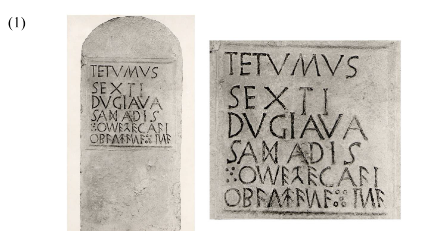

# Script and Language at Ancient Voltino

*Joseph F. Eska – Rex E. Wallace*

*Alessandria* 5 – 2011, pp. 93–113.

## Prelude[^1]

§1. One of the most enigmatic inscriptions of the ancient Mediterranean world is that from the village of Voltino on the western shore of the Lago di Garda in northern Italy.[^2] Discovered built into the outside wall of the village church, it was removed to Brescia in 1858 and is now housed there in the Musei d’Arte, Storia e Scienze. The inscription, generally dated anywhere from the late second century BCE to the early first century CE, occupies a space of 41 cm. × 41 cm. on a stone measuring 90 cm. in height by 45 cm. in width. It was first published – to our knowledge – by ODORICI 1853: 50–1. The six lines of text are carefully incised within a well-defined frame:[^3]

(1)



It is important to note that both the Latinised text and the indigenous text are engraved in mixed alphabets. MOMMSEN 1853: 210, in fact, describes the indigenous alphabet as ‘eigenthümlich’, all of whose English translations – ‘curious, peculiar, singular, strange’ –, indeed, apply.

§2. The indigenous text has variously been treated as Etruscan,[^4] Raetic,[^5] para-Raetic,[^6] Celtic,[^7] and, recently, Camunic[^8] in language.[^9] The conventional Celtic transliteration, segmentation, and translation as in (2) were originally set out by THURNEYSEN 1923: 8–10.[^10]

(2)

```text
to-med-eclai | obalda natina
‘O., (their) (dear) daughter, set me up’
```

ESKA – WEISS 1996 resegments the fifth line as *to=me=declai* < *to=me=de-ek-lā-e* to bring the morphology of the pronominal form in line with Celtic expectations.[^11]

Though the Celtic analysis of the inscription has not been universally accepted – largely on the basis of the alphabet –, the competing para-Raetic analysis has been a minority view, for no real coherent interpretation of the text has been offered.[^12] Recently, however, SCHÜRR 2007 and ZAVARONI 2008[^13] have offered interpretations of the indigenous text as Camunic in language, a view that has met with some approval in the Celtic community, e.g., STIFTER 2008: 274. The purpose of the present paper is to refute such a linguistic ascription and reärgue the case for why the Voltino inscription should be placed within the corpus of Cisalpine Celtic.

## What is Camunic?

§3. Camunic is the language of the Camunni, a tribe that inhabited the Val Camonica, an Alpine valley in the territory of Brescia stretching from the Lago d’Iseo northward to the Tonale Pass.[^14] The language’s corpus is composed of 150+ inscriptions and abecedaria (MORANDI 1998: 100).[^15] Most of the inscriptions known to us are very roughly hewn on the faces of rock walls; a few are carved on slabs of stone. The texts are short, composed in most cases of a single word terminating in *-au* or *-s*, e.gg.:[^16]

(3)

a. *enezau* (NIC BD 8h)  
b. *ḷamas* (NIC PC 26o,38)  
c. *neṃases* (IV Na 12)  
d. *neunau* | *ṭeimeziau* | *pualau* (NIC BD 6f)  
e. *śqaniau* (IV PC 31a,43)  
f. *uelalaus* (IV FN 15).

Little about the language’s grammatical structure can be ascertained from the texts, though it does not appear to be Indo-European. Talk of affiliation with Etruscan and/or Raetic is premature.[^17]

§4. The Camunic alphabet appears to be descended directly from Etruscan. Camunic abecedaria have the full complement of 26 characters plus an array of supplementary characters.[^18] This suggests that the alphabet was borrowed no later than the end of the seventh century BCE, i.e., before Etruscan alphabetic reforms eliminated beta, delta, omicron, and qoppa. Borrowing directly from Greek is a possibility (see TIBILETTI BRUNO 1992), but this hypothesis does not, in our opinion, provide greater insight into the formation of the Camunic alphabet. Regardless of the source, many Camunic character shapes were altered so dramatically that they no longer resemble their historical antecedents (SCHUMACHER 2007: 335).[^19]

## A look back to WHATMOUGH 1933

§5. WHATMOUGH 1933: 549–51 assumes that the indigenous text is Raetic in language and that, given the use of both the Roman alphabet and an indigenous alphabet in the inscription, it is a bilingual. In order to support such an analysis, he first makes a number of epigraphic assumptions that are, to say the least, ad hoc:

(4)

a. *i* and  must be supplied to render an equivalent for DVGIAVA.  
b.  represents both /t/ and /d/.  
c.  represents /u/.  
d.  represents both /k/ and /ɡ/.  
e. The sequence  in l. 5 is amended to 6 and the 6 is taken to be a variant of , the *san* character, which occurs in l. 4.  
f.  is taken to be a variant of , which is said to be a development of . , thus, represents /k/, though , as noted in (4d), is meant to do so, as well.

He also assumes that, since the indigenous text extends further to the right than the Latinised text, it originally did so to the left, as well, despite the well-defined frame around the inscription. This gives him license to supply characters at the beginning of both lines, which results in the following:

(5)

```text
[θe]θome = TETVMVS
zecśθi = SEXTI
[θ]ok[i]au[a] = DVGIAVA
zaśaθiśa = SAADIS
```

## The Camunic analyses

§6. It seems clear to us that the Camunic analyses of the indigenous portion of the Voltino inscription are motivated by the shapes of the characters. , for example, is only known to occur in the Camunic alphabet. The articles by Schürr and Zavaroni, then, serve a useful function in calling attention to the need to look at the inscription from an epigraphic perspective much more closely than has previously been done. Their respective assumptions that the language of the indigenous portion of the text is Camunic, however, are not justified. There are characters in the alphabet that do not occur in Camunic abecedaria or inscriptions. And more importantly, their interpretations of the text strain credulity.

### SCHÜRR 2007

§7. Schürr critiques the Celtic analysis of the indigenous text, though he discusses only THURNEYSEN 1923 and MEID 1989. He tries to establish a new transliteration on the basis of the Camunic alphabet, though he admits that some of the characters in the indigenous text are not known to occur in it.

§8. He finds much to admire in Whatmough’s attempt at interpreting the indigenous text, and so also attempts to treat it as a bilingual. The transliteration that he establishes is:[^20]

(6)

```text
θome = TETVMVS
zecAai = SEXTI
oBau = DVGIAVA
zanaθina = SAADIS
```

§9. But whereas Whatmough interprets the language of the indigenous text as Raetic, Schürr considers it to be Indo-European.[^21] He then emends the inscription to get to the following correspondences:

(7)

```text
[θe]θome[i] = TETVMVS
zec‹n›ai = SEXTI
[θ]oBau[a] = DVGIAVA
zanaθina = SAADIS
‘Dem Tetumes, Sohn des Sek(as?), Duxawa, Tochter des Sanadis.’
```

One should note the immediate structural differences. Schürr casts the indigenous text as a dedication employing the dative case, though the Latinised text is phrased as two names in asyndeton. The patronymics in the indigenous text are taken to be adjectives derived with the suffix *-na*, while those in the Latinised text are syntactically dependent genitives.

§10. There are also numerous epigraphic difficulties. Like Whatmough, Schürr must supply text to the left of the inscription’s frame and at the end of two forms. And he has to make a number of unsupported epigraphic assumptions:

(8)

a.  in l. 4 is taken not to be the *san* character, but a ligature composed of  and  = /nn/, despite the fact that 6 is used elsewhere in the inscription.  
b. , whatever it represents phonologically, in l. 5 corresponds to /t/ in the Latinised text, but in l. 6 to /d/.  
c.  in l. 5 is emended to 6.  
d.  is taken to represent /ɡj/.

In the end, three of the four forms require emendation. In the face of such unmotivated restructuring of the existing text, Schürr, himself, has to posit that the inscription was copied from a ‘verstümmelte Vorlage’, which is perhaps not all too likely a prospect in view of how carefully incised the inscription is.

### ZAVARONI 2008

§11. Like Schürr, Zavaroni tries to establish a transliteration on the basis of the Camunic alphabet, but, likewise, has to acknowledge that some of the characters in the indigenous text – turned , reversed 6, and  – are not known to occur in it (2008: 20). Unlike Schürr, he assumes that the language of the text is Etruscoid in its grammatical structure.

§12. Zavaroni assumes that the two texts are parallel – two names in asyndeton –, though not the same structurally: The patronymic forms in the indigenous text are derived adjectives rather than genitives. The transliteration that he establishes is as follows:[^22]

(9)

```text
θoMe = a masculine idionym
þeCuai = a patronymic adjective in -i to the stem þeCua-
ośau = a feminine idionym
saΝaθiΝa = a patronymic adjective in -na to the stem saΝaθi
```

Though he does not seek to establish a one-to-one correspondence between the Latinised and indigenous texts, Zavaroni, nonetheless, considers *θoMe* to be the Camunicised equivalent of TETVMVS and *saΝaθina* to be the equivalent of SAADIS.[^23] He goes on to posit that *þeCuai* and *ośau* are equivalent to SEXTI and DVGIAVA, respectively, though distinct formally.

Zavaroni analyses *þeCuai* as a patronymic adjective formed with the suffix *-i*, which he argues is a development from the suffix *-iio̯-* borrowed from an Italic language. In support of such an analysis, he cites a few Etruscan idionyms terminating in *-ai*, e.g., *maclai* (ET Cr 1.68).[^24] The idionym *ośau* is taken to be a ‘semantic’ equivalent to DVGIAVA in the sense that both forms are derived, following the analysis of Zavaroni, from roots that are claimed to be etymological near synonyms.

But even should one admit the correspondences proposed by Zavaroni, his grammatical analyses and etymological interpretations of the Camunic forms, based as they are on unsupported ideas about Camunic morphology and lexis, do not convince. Firstly, Cam. *þeCuai* and Etr. *maclai* are not comparable. *maclai* is neither an adjective nor a patronymic, but an idionym. Moreover, the final *-i* of *maclai* is unexpected. In Etruscan, the regular development of *-aie* is to *-ae*, as is demonstrated by *maclae* (e.g., ET Cr 1.58) < *maclaie* (ET Cr 1.67), and by the idionyms *velcae* (ET Cl 1.2336) < *velcaie* (e.g., ET Cm 2.38) and *leθaes* (ET Vs 1.142) < *leθaiesͯ* (ET Ve 3.44) (gen.). However *maclai* is to be explained, it cannot be used to support the claim that *-ie* > *-i* in Etruscan, let alone Camunic. Secondly, Zavaroni begins his etymological analyses with the assumption that the Camunic lexicon has been heavily Indo-Europeanised via intensive contacts with Indo-European speakers from central Europe, perhaps Germanic, during the prehistoric period,[^25] an idea for which there is no credible evidence. Thus, while DVGIAVA clearly appears to be connected to the nil-grade of the Proto-IE root *dɦeu̯gɦ-* ‘treffen’ (LIV² 148–9) (apparently → ‘serve’ in Celtic and ‘be useful’ in Germanic), *ośau*, though Camunic is said to be an Etruscoid language, is connected to the nil-grade of the Proto-IE root *h₃neh₂-* ‘genießen’ (LIV² 302–3) (→ ‘be useful’ in Greek). Such etymological argumentation, in which the common link is found only in secondary developments in daughter languages, is methodologically unacceptable.[^26]

§13. There are also a number of difficult epigraphic assumptions:

(10)

a. Like Schürr, Zavaroni takes  in l. 4 not to be the *san* character, but a ligature composed of  and  = /nn/, despite the fact that 6 is used elsewhere in the inscription.  
b. Like Whatmough, and similar to Schürr, he must take  to represent /t/ in l. 5, but /d/ in l. 6.  
c. The allographs of the *alberello* character are transliterated as ‹þ› in l. 5 and ‹s› in l. 6.  
d.  is taken to be , the Camunic character transliterated as ‹ś›, in l. 6.

## A look at the indigenous character shapes[^27]

§14. A careful examination of the shapes of the characters of the indigenous alphabet reveals not only the amount of special pleading necessary to read many of them as belonging to the Camunic alphabet, but also that a plausible case can be made out for the transliteration that underlies the traditional Celtic analysis of the text.

(11)

a.  is the *san* character = ‹ś› of the alphabet of Lugano, in which most Celtic inscriptions of northern Italy and Switzerland are engraved. For its use in an idionym which is otherwise engraved in Roman characters and whose language is Latinised, cf. SVRICA CIPOIS F. (CIM 73; Levo: ca. 100 × 50 BCE) in Celtic territory.[^28] , also oriented as , occurs as a supplementary character in Camunic abecedaria, e.gg., position 30 in NIC PC 10b,22. It also occurs infrequently in Camunic inscriptions, e.g., NIC PC 17d,29, though its phonological value is unknown.[^29]

b.  occurs in the Camunic alphabet only, in which it occupies the ‹θ› position in abecedaria.[^30] In view of the existence  = ‹t› in Camunic, it could well represent /tʰ/. Both Schürr and Zavaroni take it to represent a /t/ of some variety in l. 5, but /d/ in l. 6.

c.  = ‹o› appears to be the Roman character. In Camunic abecedaria and inscriptions, ‹o› is a small character, either round  or diamond-shaped .[^31]

d.  = ‹m› appears to be a turned four-bar Roman , i.e., with all four strokes of roughly equal length. The oblique bars of the Camunic character meet the vertical bar about halfway up, viz., . NB that turned  occurs in Cisalp. Celt. ←ii = *Koimila* (CIS 125 = CIM 69; Levo: ca. 150 × 100 BCE).[^32]

e.  = ‹e› is the normal shape not only in the Camunic alphabet, but also in the Celtic, Raetic, and Venetic alphabets of northern Italy.

f. The *alberello* character  – and its allograph – is difficult. It occurs in the sigma position in Camunic abecedaria and appears to represent /s/ in inscriptions. We note that  appears to be the shape of ‹z› in the inscription on the bronze wine jug from Castaneda nel Cantone dei Grigioni (Switzerland).[^33] Unfortunately, the linguistic affiliation and interpretation of this inscription remain uncertain.[^34]

g.  = ‹c› is the Roman character. Gamma = ‹g› appears bearing the shapes , , and  in Camunic abecedaria, but is not certainly attested in inscriptions.[^35]

h.  in l. 5 probably is for , since ‹a› otherwise bears the shape  in the indigenous text.[^36]  is the normal shape of ‹u› in Venetic and Raetic alphabets. It is found in Camunic abecedaria and inscriptions from Piancogno and Foppe di Nadro in that shape, but ‹u› generally bears the shape  at other sites, e.gg., Berzo Demo, Naquane, and Pla d’Ort. N.B. the Etruscised form ←i = *keltie* from Spina (ca. 300 BCE),[^37] which places the use of  to represent ‹l› in northern Italy.[^38]

i.  is one of the shapes of ‹a› in the Celtic alphabet of northern Italy. This shape for alpha is rare in Camunic, restricted to one abecedarium (NIC PC 6,19, turned to ) and one inscription (NIC PC 11c,23).[^39] The normal shape of the Camunic character is , either upright or turned.[^40] The shape  is also common in later Venetic and Raetic inscriptions.

j. *i* = ‹i› is the normal shape in all of the Etruscoid alphabets of northern Italy. The Camunic character most often bears the shape *i*, but it sometimes leans to the left or right. In a few tokens, a very short horizontal bar crosses the middle of the main bar, e.g., NIC BD 6f.

k. Full-looped  = ‹b› appears to be the Roman character. The Camunic beta-shaped character is infrequently attested in inscriptions, e.g., NIC PC 31a,43. It has two, sometimes three, loops that are less full, and are occasionally toothed, viz., , e.gg., NIC PC 31a,43 & NIC Zu 67. The character is found in the *san* position in Camunic abecedaria, which points to it representing a sibilant, perhaps /ʃ/.

l. 6 = ‹n› appears to be the reverse of the Roman character 7. The shape of the equivalent Camunic character has two short oblique bars that attach to the vertical bar at the mid-way point, viz., . Reversed  occurs in Cisalp. Celt. ←i | i = *aśKoneTio* | *Pianu* (CIS 120 = CIM 65; Brisino: ca. 150 × 100 BCE)[^41] and ← = *Tunal* (CIS 125 = CIM 69; Levo: ca. 150 × 100 BCE).[^42]

§15. Of the 12 indigenous characters that occur in the inscription, then, only one, , is definitely Camunic. Another, the *alberello* character  (and its allograph), is likely to be.[^43] Four others, , , , and *i*, could be, but are not certainly so. Two characters,  and , are Roman. , , and 6 may well be, too, but could be Celtic. Finally,  could be Camunic, but it is more likely to be Celtic.

## Some factors for a Celtic analysis

§16. It seems clear that the indigenous text is engraved in a mixed alphabet that has at least three sources: Camunic, Latin, and Celtic, perhaps also Etruscan, Raetic, or Venetic. In view of this fact, it seems reasonable to give a wide berth to the uncertainties in transliteration.

Even were one to fix a basic identity on the indigenous alphabet, it does not follow that a script could be employed for only one language. The inscription of Oderzo (CIM 271; ca. 500 BCE), for example, is engraved in the Venetic alphabet, but is Celtic in its morphosyntax (ESKA – WALLACE 1999).

§17. It should be noted that Voltino is not located in the Val Camonica, where the vast majority of the Camunic epigraphic corpus is attested, but in the territory of the Cenomani, a Celtic tribe whose main centre was at Brescia, and in which a number of linguistically Celtic inscriptions have been found (see DE MARINIS – MOTTA 2007).

§18. Outside of Lat. Sext(i)us, which is very common in the region (UNTERMANN 1959: 141–3), the three names in the Latinised portion of the inscription are likely to be Celtic.

(12)

a. To TETVMVS,[^44] cf. Transalp. Celt. *tetio* (GLG 53.3), Latinised TETTO|SERVS (CIL XIII 6087), etc. (see DELAMARRE 2007: 180–1).  
b. To DVGIAVA,[^45] cf. Latinised Cisalp. Celt. dat. sg. DVGIAVAE (CIL V 4887), Transalp. Celt. *dougilio″* (RIG G–4), etc. (see DELAMARRE 2007: 90–1).  
c. To SAADIS, cf. Cisalp. Celt. *sasamos* (CIS 129 = CIM 45; Ornavasso; 89 × 50 BCE), Transalp. Celt. SAS|SVLA (CIL XIII 5913), etc. (see DELAMARRE 2007: 161).

## Epigraphic considerations

§19. The following epigraphic assumptions must be made to get to a Celtic reading of the Voltino inscription:

(13)

a.  must be read as representing /t/. This does not seem to be problematic.  
b.  and its allograph must be read as representing /d/ – or, perhaps more likely, the intervocalic allophone of /d/, probably [ð].  
c.  must be read as representing /l/, as occurs in an Etruscan inscription from Spina.

## Celtic linguistic features

§20. Given the highly mixed character of the indigenous alphabet and the uncertainties occasioned by it, we believe that the traditional transliteration of the inscription in support of a Celtic analysis, as set out in (14), is defensible:[^46]

(14)

| to= | me= | d(e)- | ec- | la- | -i |
|---|---|---|---|---|---|
| PREV | 1.SG.OBJ | PREV | PREV | put | 3.SG.PERF |

| obalda | nat-ina |
|---|---|
| O.NOM.SG | daughter-?DIM?.NOM.SG |

‘O., (their) (?dear?) daughter, set me up.’[^47]

§21. The following Celtic linguistic features are in evidence:

(15)

a. The use of the empty preverb *to* to act as host for an unstressed pronoun. Cf. the following Cisalpine Celtic verbal form (RIG *E–2 = CIS 141 = CIM 100; Vercelli: end of first half of first century BCE):

```text
To=      ṣ́o=        Ko-   T-    -ẹ
PREV     3.SG.OBJ    PREV  give  3.SG.PERF
```

‘He gave it.’

*ṣ́o=* = /đõ/=[^48] < acc. sg. *(i)stom, an apherisised clitic form of stressed 3. masc. nom. sg. pron. *iśos* (CIS 119 = CIM 106; Vergiate: ca. 500 BCE); *Ko-* = /kõ/- < *k̑om; *T-* = /d/-, the nil-grade form of *deh₃-* ‘give’[^49] or *dʱeh₁-* ‘place’.

b. The combination of *de-* and *ek-* as perfective preverbs; cf. OIr. 3. sg. pret. *dessid* ‘has sat’ < *de-ek-sed-* (to *saidid* ‘sits’).

c. The suppletive preterital root *lā-* ‘put’; cf. OIr. 3. sg. pret. *ro∙lá* ‘has put’ (to *∙cuirethar* ‘puts’). SCHUMACHER 2004: 443 connects the root to *leh₁-* ‘nachlassen, (zu)lassen’ (LIV² 399), which seems preferable to *h₁elh₂-* ‘wohin treiben’ (LIV² 235), which was proposed by ESKA 1989: 1073 and MCCONE 1991: 33, for the reasons he sets out.[^50] He takes 3. sg. aor. *-t* to have been lost and the remaining final vowel in a monosyllable to have been lengthened as per THURNEYSEN 1946: 32. Once the desinence was lost, the form was recharacterised by the affixation of 3. sg. perf. *-e*; *-lai* resulted either via raising of */e/ > /i/ in hiatus with a preceding long vowel or via diphthongisation of */aː.e/ > /a(ː)j/.[^51]

d. The word for daughter, *nātā* (cf. Transalp. Celt. NATA [e.g., RIG L–112]) < *g̑n̩h₁-teh₂* lit. ‘one having been born’ (cf. GNATHA [RIG L–119] and GENETA [RIG L–114] < *g̑enh₁-eteh₂*).[^52] The nominal suffix *-ina* has usually been identified as a diminutive exponent (e.gg., HAMP 1989: 108 and MEID 1989: 22), which certainly makes sense in context, but we note also, while maintaining our agnosticism on the matter, the existence of a suffix *-īnā* employed to form the designations of female living beings in such Latin forms as *concubīna* ‘concubine’ ← *concumbere* ‘sleep with’, *gallīna* ‘hen’ ← *gallus* ‘cock’, *lībertīna* ‘freedwoman’ ← *lībertus* ‘freedman’, and *rēgīna* ‘queen’ ← *rēx* ‘king’ (see WEISS 2009: 288).[^53]

e. The fronting of the verb to clause-initial position when an object pronoun is present in the clause, a phenomenon known as Vendryes’ Restriction. Two other tokens are attested in later Cisalpine Celtic and Transalpine Celtic:[^54]

(i) Cisalpine Celtic (RIG *E–2 = CIS 141 = CIM 100):[^55]

```text
aKisios arKaToKo{K}|maTereKosi To= ṣ́oᵢ= | Ko- T- -ẹᵢ ạToṃⱼ Teuoc|Toniọn
A.      A.NOM.SG                 PREV 3.SG.MASC.OBJ PREV give 3.SG.PERF border.ACC.SG god.man.GEN.PL
```

‘A. A.ᵢ, he gaveᵢ itⱼ, a borderⱼ of gods and men.’

(ii) Transalpine Celtic (GLG 14.20–1 = RIG L–31; La Graufesenque: 40 × 68 CE):

```text
sioxt=i                         albanos     pannai        extra
?add?.3.SG.PRET 3.PL.NEUT.OBJ  A.NOM.SG    vessel.ACC.PL beyond
tuđ(đon)        ccc
allotment.ACC.SG 300
```

‘A. added themᵢ, vesselsᵢ beyond the allotment (in the amount of) 300.’

## Conclusion

§22. In an inscription such as that of Voltino, in which the transliteration of some of the characters of the indigenous alphabet is in question, it is necessary, when possible, to allow non-epigraphic factors to aid in the analysis. A Celtic reading of the indigenous text requires us to transliterate  (and its allograph) and  as 〈d〉 and 〈l〉, respectively. The transliteration of the former, we acknowledge, is problematic, though perhaps not insuperable,[^56] and we have provided some reason for why the latter may be justified. Such an analysis buys us so much linguistically, as illustrated in §21, that the epigraphic cost seems relatively small. Could the presence of so many Celtic linguistic features be coïncidental?

## Abbreviations

CIE = COLONNA – MARAS 2006  
CII = FABRETTI 1867  
CIL = *Corpus inscriptionum Latinarum*  
CIM = MORANDI 2004  
CIS = SOLINAS 1995  
ESEL = HÜBNER 1885  
ET = RIX 1991  
GLG = MARICHAL 1988  
IL = *Inscriptiones Italiae*  
IV = MANCINI 1980  
LIV² = KÜMMEL – RIX 2001  
NIC = TIBILETTI BRUNO 1990  
PID = WHATMOUGH 1933  
RIG E = LEJEUNE 1988: 1–54  
RIG G = LEJEUNE 1985  
RIG L = LAMBERT 2002

## Notes

[^1]: We should like to thank Stefan Schumacher and David Stifter for their comments upon earlier versions of this paper. All usual disclaimers apply.

[^2]: It is catalogued as CII 13, CIL V 4883, ESEL 19, PID 249, IL X/5.3 1046, and CIM 233.

[^3]: We are grateful to the Settore Musei d’Arte, Storia e Scienze of the Comune di Brescia for permission to reproduce these photographs.

[^4]: So PAULI 1885: 97.

[^5]: So WHATMOUGH 1933: 57–9 & 549–51 and LEJEUNE 1971: 642²⁰.

[^6]: So LATTES 1893: 1041⁵¹ & 1914: 476¹; TIBILETTI BRUNO 1978a: 218–9 & 1978b: *passim*; and RISCH 1992: 684.

[^7]: E.gg., HÜBNER 1885: 8; STOKES 1886: 119–20; THURNEYSEN 1923: 8–10; KOCH 1985: 24–5; ESKA 1989; HAMP 1989; MEID 1989: 17–26; ESKA – WEISS 1996; and SCHUMACHER 2004: 444ᶜ. RHŶS 1905–6: 337–41, 1913–4a: 94–7, & 1913–4b: 346–7 treats the inscription as possibly Celtic.

[^8]: So, independently, SCHÜRR 2007 and ZAVARONI 2008.

[^9]: For a review of the literature on the Voltino inscription up to 1885, see ROBERT 1886.

[^10]: Epigraphic symbols employed in this paper are the following: Square brackets [ ] indicate characters which are restored or can no longer be read; round brackets ( ) indicate characters which were left out by the engraver; angled brackets ‹ › indicate characters restored by an editor in place of those incised by the engraver; curly brackets { } indicate characters erroneously incised by the engraver; the underdot ̣ indicates characters which are damaged and/or no longer clearly legible; the pipe | indicates line breaks.

[^11]: MORANDI 2004: 670–1 accepts that the inscription is Celtic, but transliterates the two lines as omezecụai | obauzanaina and interprets the first line as an ā-stem dative singular and the second line as two ā-stem nominative singulars, *obauza* and *naina*, thus, it seems, as a dedicatory inscription.

[^12]: TIBILETTI BRUNO 1978a: 218–9 transliterates the two lines as omezecavi | obalzanaina (NB that  is transliterated as ‹v› in the first line and as ‹a› in the second line) and interprets the first evidently as an Indo-Europeanoid personal name in *-avi* (for *-avia*), comparing gen. sg. DEMI|NCAVI at CIL V 5340, and the second as a Raetoid patronymic in *-θina*.

[^13]: A preliminary version appears in ZAVARONI 2005b: 28–9.

[^14]: See Pliny, *Nat. hist.* III 133–4.

[^15]: An up-to-date corpus of Camunic inscriptions does not exist. TIBILETTI BRUNO 1990 ably edits the inscriptions and abecedaria discovered in the 1980s.

[^16]: Camunic characters are transliterated as in TIBILETTI BRUNO 1990 save for the *alberello* character , which we transliterate as ‹s›, the khi-shaped character  found in the position of zeta, which we transliterate as ‹z›, and the beta-shaped character  found in the position of *san*, which we transliterate as ‹ś›.

[^17]: Cf. the comments of SCHUMACHER 2007: 334.

[^18]: The source of the supplementary characters and their respective phonological values are not clear.

[^19]: Zeta provides a good example. It often bears the form of a trident, viz., .

[^20]: Roman characters are in capitals.

[^21]: According to SCHÜRR 2007: 342, Camunic merges Proto-IE */o/ and */a/ as /a/. He also provides partial paradigms of a-stem and e-stem (!) nominals.

[^22]: Roman characters are in capitals.

[^23]: *saNaθina* is analyzed as a patronymic adjective in *-na*, a suffix widely attested in Etruscan nominal forms.

[^24]: Apart from *maclai*, the Etruscan forms cited by Zavaroni either do not exist, e.gg., *atai* and *pupai*, or are not masculine forms, e.g., *velcai*, which, hence, does not continue masculine *-aie*.

[^25]: See, for example, ZAVARONI 2003: 90–1 for a brief statement about such cultural contacts.

[^26]: Indeed, Zavaroni’s argument by which *h₃nh₂-* developed into the root of *ośau* is so tortuous as to be not even moderately plausible. Note further that his analysis does not discuss final *-au*.

[^27]: For studies of the Camunic abecedaria, see TIBILETTI BRUNO 1992 and ZAVARONI 2001 & 2005a.

[^28]: STIFTER 2010: 368, like Schürr and Zavaroni, takes  to be for , though he takes it to be an error, rather than a digraph. We find the likelihood of such an unusual error to have occurred twice in different locales to be remote.

[^29]: TIBILETTI BRUNO 1990: 83 transliterates the character as 〈š〉.

[^30]: Theta may also appear bearing the shape  in IV FN 13 (so MANCINI 1980: 142). TIBILETTI BRUNO 1990: 57–8 interprets the final character of NIC PC 4d,17, which bears the shape , as a theta.

[^31]: The character bears the shape □ in NIC PC 4d,17 and NIC FN 5e,61. See TIBILETTI BRUNO 1990: 57–8 & 136–8, respectively, and MORANDI 1998: 103.

[^32]: TIBILETTI BRUNO 1978b provides a facsimile at 7bis on the plate following 24.

[^33]: MOTTA 2000: 207–8 & 2001: 315–7 has noted that beside the well known Cisalpine Celtic coin legend *seceθu* (Verdello: ca. 400 BCE), there are now attested two tokens of the form *seKezos* (CIM 189 & 191; Como-Prestino: ca. 450 × 400 BCE) (there likely are two further fragmentary tokens from the same site, restored by Morandi as [*se*]Kezos [CIM 190] and [*seK*]ezos [CIM 192]), which appear to be closely related. He suggests that the former continues *-ed-ū, the latter *-ed-os (so also PRÓSPER in VILLAR – PRÓSPER 2005: 285–6), with  representing /d/. As attractive as this proposal may be, the existence of Latinised dat. sg. SEGESSAE (CIL V 4717) virtually guarantees that *seKezos* continues *segestos*, as per SOLINAS 2004–5: 591–3 and RUBAT BOREL 2005: 25.

[^34]: MARKEY – MEES 2004 argues that the inscription is Celtic in language, but we remain agnostic.

[^35]: See PROSDOCIMI 1965: 584 for a possible example, but note that MANCINI 1980: 118 thinks that the character is more likely to be transliterated as ‹l›.

[^36]: WHATMOUGH 1933: 57 states that the cross-stroke is very shallow and may be a modern defacement, though MEID 1989: 21 is surely correct when he remarks that ‘[d]ie Querhaste ist breit und einigermaßen tief, und ist sicher nicht rezenten Datums.’ We believe it likely that the cross-stroke is an error induced by the four ‹A›s in the Latinised portion of the inscription.

[^37]: COLONNA 1993: 140 fig. 14 and VITALI 1998: fig. 3 provide photographs.

[^38]: As far as we are aware,  = ‹u› never occurs inverted to  in neo-Etruscan inscriptions. Sporadic examples of turned characters are found in Archaic Etruscan inscriptions from Veii, e.gg., CIE II 1, 5 6670 (*san*), 6672 (alpha, upsilon), and 6703 (*san*, upsilon). In our view, then, transliterating  as ‹l› to yield *keltie* rather than as ‹u› to yield *keutie* is certainly no less probable.

[^39]: In NIC PC 26o,38, the right bar of ‹a› is vertical, but the top oblique bar is much longer than the medial bar, thus giving the character the appearance of an open alpha rather than a digamma.

[^40]: Alpha is upright in Camunic inscriptions and abecedaria from Piancogno and Foppe di Nadro, but is generally turned at other sites, e.gg., Berzo Demo, Naquane, and Pla d’Ort. It is worth noting that in most, if not all, inscriptions, when alpha is written upright, upsilon is turned, and that when alpha is turned, upsilon is written upright, so that the characters are stylistically in synch, e.g.,  . This practice is not always adhered to in abecedaria, e.g., NIC PC 27p,39, in which both alpha and upsilon are turned.

[^41]: A photograph and facsimile are provided by DE GIULI 1978–9: 246.

[^42]: TIBILETTI BRUNO 1978b provides a facsimile at 7bis on the plate following 24.

[^43]: David Stifter suggests to us that the presence of  and the *alberello* character in the indigenous alphabet indicates that it is Camunic at its core, but we do not agree. Since Voltino is not in the Camunic speech area, it seems clear that  had become fashionable beyond the Val Camonica. And the *alberello* character is also found in pre-Samnite inscriptions – representing /s/, as appears to be the case in Camunic – that date to the sixth century BCE (see RUSSO 2005: 59–70 and RIX 2005: 326–7), as well as appearing as a siglum on ceramic ware throughout ancient Italy at all periods. We, thus, would not label the indigenous alphabet as Camunic at its core on the basis of two characters.

[^44]: UNTERMANN 1959: 127 notes that ‘[n]ur im Brescianer Gebiet gibt es einheimische I[ndividualnamen] und Cognomina in *-umus*.’

[^45]: UNTERMANN 1959: 137 notes that, contrary to *-umo-/-ā*, *-au̯o-/-ā* ‘[e]bensowenig ist … eine spezifische Besonderheit des Brescianer Gebiets.’

[^46]: The *alberello* character is here transliterated with ‹d›, though we suspect that it represents [ð]. If the character is, indeed, Camunic in origin and to be transliterated as ‹s›, we would argue that it, as a character that represents a coronal fricative, has been pressed into service to represent a phone, viz., [ð], for which a character was not readily available.

[^47]: DE BERNARDO STEMPEL 2011: 75 segments the Celtic text as *to=me deklai obalda natina* ‘anche per me ho fatto io Obalda, natina’, treating *to=me* as a preposition equivalent to OIr. *du-/do-* with attached clitic 1. singular pronoun. The preposition, however, is *dū*, as attested in the Transalp. Celt. conn. *du=ci*, lit. ‘to here’ (e.g., GLG 3.10), and it governs the dative case, so the pronominal form would be either *=moi* or, with contraction of the diphthong, *=mī*. We do not find any value in her analysis.

[^48]: đ is employed as a cover symbol for the tau Gallicum phoneme, on which see ESKA 1998.

[^49]: We assume the analogical restoration of the colour of the perfect desinence should the root be *deh₃-*.

[^50]: MARKEY – MEES 2004: 88 derive the root from *logʱ-* (to *legʱ-* ‘sich (hin)legen’ [LIV² 398]), but such a connection is not possible, for not only is *legʱ-* monovalent – whereas the text includes a direct object –, but the change of */o/ > /a/ is not Celtic and DVGIAVA demonstrates that intervocalic /ɡ/ was not lost in the language of this inscription.

[^51]: Cf. early Cisalp. Celt. 3. sg. pret. *KariTe* and *KaḷiTe* (CIS 119 = CIM 106), which continue imperfect forms to which 3. sg. perf. *-e* was affixed in order to recharacterise them after apocope of *hīc-et-nunc* *-i* created ambiguity with the 3. single present forms (ESKA 1990: 83–4).

[^52]: Cf. OIr. *geined* ‘offspring; person’, on which see BREATNACH 1994.

[^53]: MARKEY – MEES 2004: 88 prefers to regard *natina* as an idionym in asyndeton with *obalda*, but since the verb appears to be singular in number, we discount such an analysis. MORANDI 2004: 671 also speculates as to whether *natina* may be an idionym, but notes that it would have to be in apposition to *obalda*.

[^54]: The unmarked clausal configuration of these languages is SVO with pro-drop (ESKA 2007). The unmarked clausal configuration of earlier Cisalpine Celtic is SOV.

[^55]: NB that this inscription manifests an instance of left dislocation, so the clause formally begins with the verb, and that the object agreement marker doubles the nominal accusative argument (as also in the second token).

[^56]: Especially if the character is Cam. ‹s› and is employed to represent [ð], as discussed in n. 46.
