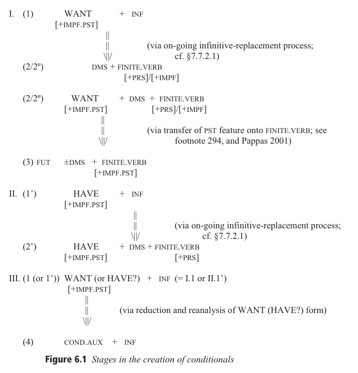
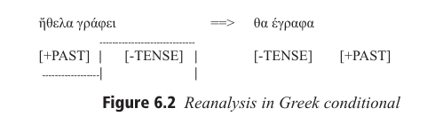

<!-- pdf-page: 715; source-page: 675 -->
### 6.2.4 Mood: Futures, Conditionals, and Volitionals

The view of modality employed here is that of Kuryłowicz 1956: 26, Gołąb 1964b,
Lyons 1969: 304ff., and Aronson 1977, among others, who define mood in terms of the
ontological qualification of the narrated event as real or unreal. According to this
analysis, futures are considered with conditionals and volitionals (cf. Ammann & van
der Auwera 2004), a treatment that is also consistent with their respective historical
developments.264 There are two main issues relevant here. One is the competition
between ‘want,’ ‘have,’ and ‘be’ as auxiliaries; this is especially important in the
development of the future, but also has relevance for the conditional. The second is the
reduction of finite forms to particles (or affixes), a trait present to some extent in all the
Balkan languages, but to varying degrees. We can note that the freedom of word order
in the auxiliary is related to its degree of reduction to a particle and the degree of
infinitive loss. As pointed out in Matras 2007, modal forms are especially amenable to
contact-induced change. The most important of the Balkan modal markers is the dms
(Friedman 1985a, and see §4.3.3.1.2, footnote 145), which is discussed at length in
§7.7.2.1.3.1 in connection with the replacement of the infinitive.

#### 6.2.4.1 Futures: An Overview

When Slavic entered the Balkans (sixth to seventh centuries CE), the synthetic futures of Ancient Greek and Classical Latin were already obsolete and Slavic itself (based on

264 Although imperatives are also modals, they are treated in §6.5 owing to a variety of morphosyntactic specificities. The intersection of infinitives with mood is treated in §7.7.2.1.3.1.

<!-- pdf-page: 716; source-page: 676 -->
the evidence of OCS) had no systemic future. There was competition between the
auxiliaries ‘have’ and ‘want’ + infinitive to mark futurity in Latin and Greek, with Latin
ultimately favoring ‘have’ (seen all across the Romance languages) and Greek favoring
‘want.’ OCS used the perfective of ‘be’ in addition to ‘want,’ ‘have,’ and various forms
of ‘begin’ + infinitive. The ‘want’ + infinitive construction survives (with modified or
newinfinitives)inRomanian,inNorthwestGeg(nearandinMontenegro),inBulgarian
(with postposed auxiliary) as an archaism or dialectism, and Meglenoromanian (for
speculations and threats). This form also survives in all the non-Balkan Štokavian and
Čakavian dialects of BCMS and connects them with East South Slavic. In fact, much of
Štokavian ended up in its current location as a result of northward migrations during the
fifteenth to eighteenth centuries. The rest of Slavic, including Kajkavian, which goes
with Slovene in this respect as in many others, developed the perfective of ‘be’ as a
future marker.265 The next stage was ‘want’ + dms + conjugated present tense verb (for
Greek in the fourteenth century, for Slavic the fifteenth century). This stage also
survives in BCMS, including Torlak dialects. The third stage, which overlaps the
second, is the transformation of ‘want’ into an invariant particle + dms + conjugated
main verb. This type of construction is still the main one in Tosk (and Standard
Albanian) and in parts of Geg. It also occurs in northern Aromanian (Papahagi 1974:
70); it is characteristic of southern Romanian and survives in Torlak BCMS and in
certain modal uses in East South Slavic and Romani, but not in Greek. The fourth stage
is the elimination of the dms so that the future is marked by an invariant particle plus a
conjugated verb. In addition to being the standard future in Balkan and southern Vlax
Romani, Greek, and Balkan Slavic (including Torlak BCMS), it is very common in
colloquial Tosk (including informal written Standard Albanian) and southern
Aromanian (Papahagi 1974: 70). In Meglenoromanian, the original future marker
mergedwithdms,producinga new particle, ãs,inTsărnarekă,but eliminatinga distinct
future marker in the other villages, where the dms alone (si or sã) doubles as a future
marker (Atanasov 2002: 249).266 Romani outside the Balkans has other means of
forming or expressing the future, and it appears that the Romani development in the
Balkans occurred in concert with the other Balkan languages.
The conjugated ‘have’ future (+ dms + subjunctive) is one among several standard
variants in Romanian and can be encountered in Meglenoromanian (Atanasov 2002:
248). It also occurs in the Arbëresh of Calabria and Sicily (but not further north and
east, where ‘want’ is used; Gjinari 2007: Map 305). Conjugated ‘have’ + infinitive
(most of Geg) or + për + deverbal nominalization (a few Tosk dialects) occurs in
Albanian. Invariant negative ‘have’ (= negative existential) + dms + conjugated.verb

265 The specifics of future development vary in other Slavic languages or groups thereof but need not concern us here. 266 As noted, the development of ãs happened only in Tsărnarekă, which is the most heavily Slavicized Meglenoromanian dialect. The parallel can be compared with Macedonian dialects that merge *kje + da, but the Meglen Macedonian future marker is kji from reduced kje (Bojkovska 2006: 114). So while the Tsărnarekă development resembles the Greek θα (which derives from θε να; see §6.2.4.1.1), it also has parallels in dialectal Balkan Slavic (kja, ža, etc. – see also §7.4.1.2.2.1) albeit not in the rest of Meglenoromanian. Given that Macedonian was the main contact language for Meglenoromanian, we suspect this is a parallel, rather than contact-induced, development.

<!-- pdf-page: 717; source-page: 677 -->
is normal for Balkan Slavic and also for dialects in contact with it (Romani, WRT, Aromanian), while positive ‘have’ (both invariant and conjugated) has various modal connotations (Bužarovska & Mitkovska 2019). Thus, while the historical record makes it clear that the seeds of the Balkan future were already present in Latin, Greek, and Slavic at the times of contact, and while the lexicalsourcesoftheauxiliariesaretypologicallyordinary,andwhilethespecificsetsof structural changes can each be explained language-internally, nonetheless it is equally clear that the ‘want’ future in the Balkans is an example of mutual reinforcement and feature selection under conditions of language contact that began to take shape in the late middle ages but did not reach its current state until the early modern period, and in some areas, e.g., parts of Albania, and in Romani dialects, the process is still ongoing.267 Moreover, competition with the ‘have’ future also shows local variation. Thus, while similar types of futures have developed elsewhere, the evidence of Balkan Slavic, Balkan Romance, and Balkan Indic (Romani) make clear the fact that in the context of European history and geography the Balkan future is indeed a Balkanism. Moreover, regardless of where the centers of diffusion might originally have been located, in the more recent past the intersecting linguistic peripheries of western Macedonia and adjacent parts of Albania emerge as a center of innovation. In looking at the expression of future constructions, we see, on the one hand, that ‘want’ is still spreading at the expense of ‘have,’ ‘have’ is not altogether vanquished, and reduction to an invariant marker is not altogether complete, especially in Romanian, BCMS, and Bulgarian (especially for the Balkan conditional, where the auxiliary conjugates).

##### 6.2.4.1.1 Greek

For Greek, ἔχω ‘have’ and μέλλω ‘be about to’ + infinitive emerged as the main
competitors with the synthetic future during the early Postclassical period, with θέλω
‘want’ – even though attested (sparsely) in Postclassical Greek as early as the sixth to
seventh centuries in papyri and with earlier antecedents in Classical and Hellenistic
Greek (Holton et al. 2019: 1781) – not supplanting μέλλω and ἔχω until the Middle
Ages.268 As Holton et al. 2019: 1781 put it, “Future-referring θέλω + infinitive can
alreadyoccasionallybefoundinA[ncient]G[reek]andthelower registersof Hellenistic
Greek . .. but its breakthrough is probably to be dated to the E[arly]Med[ieval]G[reek]
period,” a stretch of time covering c. 500–1100, and thus a chronology that is
Balkanologically significant, given the presence of Slavs in the Balkans from about
the sixth century, and Albanians and Romans from considerably earlier.
The ἔχω type was most probably influenced by, if not completely based on, the
Late Latin infinitive + habēre ‘have’ future that may have played a role as well in

267 The Balkan future is thus a classic example of feature selection in language ecology as identified in Mufwene 2001a. 268 See Markopoulos 2009 for a detailed account of the Postclassical situation, and Lucas 2013, 2014 for discussion specifically of the future with μέλλω and its place in the ecology of future formations in this era. Holton et al. 2019: 1767–1795 offer details on the wide range of future varieties found from Postclassical into early modern Greek, along with numerous examples. We draw on these extremely useful sources even if we disagree with some of their interpretations.

<!-- pdf-page: 718; source-page: 678 -->
the Geg Albanian future and the Balkan Romance future, and thus ultimately the Greek perfect via a conditional sense, as discussed in §6.2.3.3. Horrocks 2010: 300 attributes the victory of ‘want’ over ‘have’ as the future marker to this development of ‘have’ as the perfect marker. It has been claimed that the θέλω + infinitive future was consistently distinguished from θέλω + νά + finite verb to express volition, but that may have held only for “the first centuries of the L[ate]Med[ieval]G[reek] period” (c. 1100–1500), as noted by Holton et al. 2019: 1788; Joseph & Pappas 2002 document clear instances of future θέλω + νά + finite verb constructions in Medieval Greek, and Holton et al. 2019: 1788 also offer several examples. The θέλω + infinitive future continued to be used – at least in texts – until the infinitive disappeared in the sixteenth century, although Thumb 1912: §226 reports it dialectally into the nineteenth century.269

Meanwhile, two different paths of development emerged from the θέλω + infinitive future, both with Balkanological import. The path that led to the widespread modern future marker θα took the following form, using the verb γράφω ‘write’ as an example of a main verb, shown here in its imperfective form; we gloss θέλω as ‘want’ in the topmost line as that was the starting point but as ‘will’ thereafter to indicate the futurity of the combination (Table 6.22).

Table 6.22 Greek future developments, I

θέλω γράφειν
‘want.1sg write.inf’
⇓
θέλω να γράφω
‘will.1sg dms write.1sg’ (by on-going replacement of infinitive (see
§7.7.2.1.1.2.1))
⇓
θέλει να γράφω
‘will.3sg dms write.1sg’ (by elimination of redundant person/number marking
on auxiliary verb, giving an impersonal auxiliary)270

⇓
. . .
θα γράφω
‘fut.ptcl write.1sg’ (by several steps involving sound change and analogy)

269 As it happens, the future with θέλω + the remnant of the infinitive is widespread in nineteenth- and twentieth-century Katharevousa (the puristic, high-style variety [the H of Ferguson 1959]) so that through this artificial usage, the θέλω + infinitive future would have been available to the stylistic receptive repertoire of speakers of Greek, even if not colloquial usage per se. 270 Horrocks 2010: 228–229, 301–302 and Holton et al. 2019: 1790 discount this stage and derive θε να, the more immediate source of θα, directly from θέλω να. They claim that examples of θέλει να γράφω are too late to have fed into a θε να γράφω type (echoing the claim of Horrocks 2010: 324, footnote 11 that putative examples are not “convincing” even though they themselves provide (p. 1789) examples from as early as the fifteenth century). We see that as problematic for it is not clear how to get from θέλω να to θέ να via regular sound changes or plausible morphological changes, while θέλει να to θέ να is more straightforward (due in part to the loss of unaccented high vowels in fast speech); see also footnote 271.

<!-- pdf-page: 719; source-page: 679 -->
Table 6.23 Greek future developments, II

θέλει γράφειν
‘want.3sg write.inf’
⇓
θέλει γράφει
‘will.3sg write.inf’ (by sound change deleting -ν#)
⇓
θέλει γράφει
‘will.3sg write.3sg’ (by reanalysis based on
||
convergence in form of 3sg and infinitive)
||==⟹θέλω γράφω ‘will.1sg write.1sg’ (doubly marked agreement
. . .
allowed by reanalysis)
⇓
θε γράφω
‘fut.ptcl write.1sg’ (by several steps involving sound
change and analogy, as in Table 6.22)

The alternative path involved different steps and led to a different outcome; the starting point was the 3sg form (Table 6.23). These two paths of development meant that Greek had both a future based on ‘want’ with the dms να and one without it, both arising via perfectly ordinary system-internal well-motivated processes of language change.271

These WANT-based futures occur with great frequency in Medieval and
Early Modern Greek texts from the thirteenth to the eighteenth centuries,
and all the variant forms indicated in the above tables are attested, some even
co-occurring in the same text. The types θε να and θα να, the predecessors to
θα, are reported by Thumb 1912: §225) as present “dialectally or archaically”
in the late nineteenth century, while Asenova 2002: 214 claims that θε να was
limited to the fourteenth to eighteenth centuries and θα να was limited to the
sixteenth century.
Greek is the only Balkan language in which no vestige of the subjunctive marker
per se survives into the present day in future or future-like constructions, although
the vowel of θα is testimony to the previous presence of να.272 The fact that there
were variants with and without να, i.e., θε να γράφω ~ θε γράφω, despite their
different origins, may well have played a role in the partial absence of the dms të in
Albanian, through a cross-language analogy (see §6.2.4.1.4), although the same
development (elimination of the dms) in Balkan Slavic may also have been
relevant.

271 Horrocks 2010: 228–229, 301 treats the developments leading from θέλει (να) to θε / θα as having arisen in allegro speech, but Joseph & Pappas 2002 give a detailed account of all the steps in terms of regular sound change and analogy. Markopoulos 2009: 198 has yet another account, taking θε as due to “contact between Greek and Romance speakers, especially Old Venetian and Old French;” see Joseph 2009: 115–118 for counter-argumentation to this last account. 272 While remnants of the dms are rare or marginal in Balkan Slavic and Romani, they can occur, usually with a different nuance from straightforward futurity.

<!-- pdf-page: 720; source-page: 680 -->
Greek is also the only Balkan language in which ‘have’ (or the functional equivalent in Romani and WRT) plays no role in a modern future formation, though, as noted above, ‘have’ (ἔχω) was the basis for a future-type historically within Greek, and Asenova 2002: 217 gives historical variants of the ἔχω future with an inflected main verb and with an invariant (3sg) form of ἔχω, e.g., ἔχω να γράψω and ἔχει να γράψω. Thumb 1912: §226 does note the occurrence of ἔχω with a να-clause for the future in nineteenth-century Bova Greek of southern Italy (éh’yi na erti ‘he will come’) but that is not usual even now, where instead the use of the present for future reference is more common. That distribution, however, in a peripheral non-Balkan dialect, helps to localize the ‘want’ future as a Balkan feature, as does the absence of the ‘want’ future in Pontic Greek, where the modal marker να alone with an inflected verb can serve as the future (Drettas 1997: 298–304). Further with regard to “non-Balkan Greek,” some facts about the Cypriot Greek future are telling in two respects. First, the [en] that figures in the Cypriot future tense is in some accounts from the past of ‘want,’ ἔθελεν (=> ἔθεν => ἔν) not from the present. Elsewhere in Greek, the past of ‘want’ is associated with the conditional (in the sense of a “future in the past,” see §6.2.4.2 and §6.2.4.2.4). Moreover, there is a future formation (Aerts 1983) with an invariant element με as the future marker, with the form με να γράψω ‘I will write,’ where the με is a reduced form of μέλλει ‘is about to,’ one of the other Postclassical future auxiliary competitors; given the phonic parallelism of θέλει and μέλλει, their parallel reduction reinforces the plausibility of the sets of developments each must have undergone.273

These two facts, then, as with the Southern Italy and Pontic data, serve to localize the present of ‘want’ as the Balkan future prototype. Its relation to other WANTbased futures in the Balkans is explored in the various sections within §6.2.4.1.

##### 6.2.4.1.2 Romance

Analytic futures begin to appear in Latin at the end of antiquity, using habeo ‘have,’ uolo ‘want,’ or debeo ‘have to’ + infinitive, or esse ‘be’ + future participle. In the rest of Romance the future ended up using forms descended from habeo (except in Logudoro (north-central) Sardinian, where the descendant of debeo became the marker), but in Balkan Romance, the uolo future became generalized. Nonetheless, Early Modern Romanian shows the competition in auxiliary choice, and the variation continues into the modern language (see Maiden et al. 2021: 362ff. et passim). For instance, regarding ‘have’ types, where Early Modern Romanian had ‘have’ (1sg am) + infinitive, e.g., am a bea ‘I will drink’ and ‘have’ (1sg am) + să + subjunctive, e.g., am să caut ‘I will search,’ modern Romanian has just the latter, though still with both necessitative and future meanings in the colloquial register (Zafiu 2013a: 38–39). Further, the Early Modern Romanian type with conjugated

273 Cypriot preserves Ancient Greek geminates, so admittedly the single versus double -λ- would mean that the verbs were not exact rhyme words, even if phonetically close.

<!-- pdf-page: 721; source-page: 681 -->
‘want’ future marker (1sg voi(u)) + infinitive is still found in contemporary usage, e.g., vor vedea ‘they will see,’ while the type of conjugated ‘want’ with să + subjunctive has given rise to a type with invariant future marker o, e.g., o să merg ‘I will go.’ This latter type is colloquial, more typically southern, and dates to the seventeenth century. There is also a regional phonologically reduced conjugated future marker, e.g., 1sg oi (Zafiu ibid.). In Aromanian, the marker is invariant (va, u, etc.) ±s’ + subjunctive, while in Meglenoromanian, as noted above, the future marker has been absorbed by the subjunctive marker and lost, except in Tsărnarekă where the marker ăs is used with the subjunctive. (See §6.2.5.7 on Meglenoromanian va + inf.) Aromanian dialects that are in contact with Macedonian also use the negative of ‘have’ for negative futures as a calque on Macedonian, e.g., Kruševo noare s’ neadzim / Belã di Suprã nori s’nedzim ‘we won’t go’ (Gołąb 1984a; Markovikj 2007). It is also worth noting that, unlike Greek, Macedonian, SDBR, Albanian, or Romani, but like archaic or dialectal Bulgarian (using the extremely marginal short infinitive, see §6.2.4.1.3) and BCMS (regularly), the conjugated Romanian future marker can also be postposed to the main verb, which, as in the relevant Slavic languages, is an infinitive (Rosetti et al. 1969: 85–90, 267–268; Graur et al. 1966: 269–270).

##### 6.2.4.1.3 Slavic

Vaillant 1966: 104–107 notes parallels among Baltic, Slavic, and Germanic expressions of futurity, e.g., by means of preverbs on presents that function as (future) resultatives (cf. also Večerka 1993: 184–185). In OCS, the future was usually expressed by a perfective present (imperfective for gnomic futures, Večerka 1993: 182) although there are periphrases using various auxiliaries plus the infinitive. The use of iměti ‘have’ parallels Greek and Latin as well as Gothic (haban), but only occurs as a true future (as opposed to obligative) in Bulgarian and Macedonian OCS texts, and, along with the Gothic, is likely a calque on the Greco-Roman usage. The use of na-/vŭ-čęti ‘begin.inf’ parallels the use of Gothic (but not West Germanic) duginnan ‘begin’ and is rare in OCS. The perfective present of ‘be,’ 1sg bǫdǫ, was used regularly as a future for that verb and in a variety of future periphrastic constructions (e.g., with past passive and resultative participles). In North Slavic as well as Slovene and the Kajkavian dialects of Croatian, the reflexes of bǫdǫ become the future auxiliary, with perfective presents also fulfilling future functions.274 The future using ‘want,’ inf xŭtěti / 3sg.prs xoštětŭ, + infinitive is attested in OCS, albeit usually as a voluntative, and is regular as a future in South Slavic texts by the fourteenth century. The shortened form of the verb without the initial syllable appears in the thirteenth century, and the

274 Perfective nonpast as future is found in Old Čakavian as well as Kajkavian Croatian (Popović 1960: 497). See also Aronson 1977: 24–25 on independent or quasi-independent nonpast perfectives in Bulgarian (cf. also §6.2.2.4.2).

<!-- pdf-page: 722; source-page: 682 -->
short infinitive in the sixteenth century. Conjugated short auxiliary + finite da-
clause appears in the fifteenth century, and the invariant particle + da-clause
appears in the sixteenth, although invariant particle + finite form, without dms
da, shows up in the fifteenth century (Asenova 2002: 214).
For Bulgarian, constructions of the type particle + da + finite-verb, conjugated.
auxiliary + da + finite-verb, and short infinitive + conjugated.auxiliary (e.g., šte da
otideš, šteš da otideš, ‘you will go,’ napravi šteš ‘you will do,’ Stojanov 1983: 340,
386) survived as marginal into the nineteenth and early twentieth centuries and also
in some dialects, but all are currently obsolete in the standard language. Moreover,
in Bulgarian the particle šte is homonymous with the 3sg of the verb šta ‘want,
like’ which continues to exist as a lexical verb. In Macedonian, kje + da has the
effect of rendering the future suppositional, and there is no affirmative verb cognate
with kje, but the negative nejkjam ‘I don’t want/like’ does continue the old finite
verb (and see §7.4.1.2.2.1 and §6.2.1.1.6 on some variant forms of the ‘want’-based
affirmative future marker in Balkan Slavic). The Torlak dialects of BCMS show a
continuum from conjugated ‘want’ + da-clause (the infinitive is absent), to an
invariant particle (če ~ će) + finite form as in Macedonian and Bulgarian.275 In
Leskovac, the 3sg clitic form of ‘want’ (će) is on the way to becoming the
generalized particle. It can occur with all persons except the first (which uses ću),
with finite forms, with or without da, and in sentence-initial position (Mihajlović
1977: 51). In the northeastern corner of the Timok-Lužnica dialect of Vratarnica
(Sobolev 1994: 379), the situation is similar, although če is also attested with the
first person (see also A. Belić 1905: 636ff.; Vukadinović 1996: 222–223; Remetić
1996: 502–503; Toma 1998: 278–279 for additional details).
The negative future shows a continuation of the use of ‘have’: the normal
negated future in Balkan Slavic is the impersonal Mac nema, Blg njama (lit., ‘it
hasn’t,’ but also ‘it does not exist’) + da-clause. The negation of the particle derived
from ‘want’ can also occur, but often has voluntative overtones, just as the positive
of existential ‘have,’ ima + da-clause, is obligative. In any case, the temporal,
social, and geographic evidence argues strongly for the specifically Balkan nature
of the Balkan Slavic future.276 The place of the ‘have’ future has not been
adequately appreciated in Balkan linguistic work, although Asenova 2002: 217–
218 rightly turns attention to it. It is not simply the rise of the ‘want’ future but also
the competition of the ‘have’ future that makes Balkan Slavic Balkan in this regard.

##### 6.2.4.1.4 Albanian

Most general descriptions of Albanian identify as Geg the future using conjugated present of ‘have’ (1sg.prs kam in the standard and many dialects) + infinitive (= me + short participle in Geg, për të + participle [= për + nominalized participle] in

275 Some Torlak BCMS dialects also have remnants of the inf + conjugated clitic ‘want’ construction (e.g., Prizren, Remetić 1996: 503). 276 See Andersen 2006, 2009 for more details on various Slavic developments, and Kramer 1995 on the Balkan future.

<!-- pdf-page: 723; source-page: 683 -->
Tosk) and as Tosk the future using an invariant particle derived from ‘want’ (do in
the standard language and most dialects) ± të + subjunctive), the latter being
typically Balkan, the former being identified as more similar to Western
Romance. The actual distribution, however, is more complex and indicates the
Balkan nature of the constructions. Moreover, ‘want’ + infinitive and ‘have’ +
subjunctive also occur.277 The ‘want’ + subjunctive construction is attested
throughout Albanian from Baćica (Alb Baçica) in the Serbian Sandžak to
Mouzakéïka (Alb Muzhakat) in Epirus (Alb Çamëri) as well as in diaspora dialects
of Arbëresh in Italy, Arvanitika in southern Greece, and Arbanasi (Alb Arbëresh) in
Croatia. Constructions with ‘have’ + infinitive occur mostly in central and northern
Geg (including Arbanasi), usually in competition with the ‘want’ + subjunctive
future (Gjinari et al. 2007: 376, Map 305). Both futures also occur in the oldest
Albanian texts (Fiedler 2004: 531–532, 591ff.). Dialects with only the ‘have’ +
infinitive future are rare and located at the northeastern and northwestern peripher-
ies, where, however, nearby points have only the ‘want’ + subjunctive future.
‘Have’ + subjunctive futures are limited to Arbëresh in Calabria and Sicily.
‘Want’ + infinitive futures are found in the north bordering with the Zeta-Lovćen
dialects of Montenegrin, and there the auxiliary can be conjugated, which makes
the construction exactly analogous to standard BCMS, as in example (6.89) from
Kelmend (Shkurtaj 1975: 55):

(6.89)
Jam
i
lik
e
duo
me
dek
I.am
pc.m.nom
bad.m
and
want.1sg
inf
die.ptcp
‘I am ill and will die’

The ‘have’ + Tosk infinitive future is limited to a few scattered points in Northern
Tosk, Lab, and Çam, and always co-occurs with the ‘want’ + subjunctive future. It
is only the ‘want’ + subjunctive future that presents consistent areas where other
futures do not compete. This area includes all of Tosk (with the isolated exceptions
just noted), most of the Transitional and Southern Geg dialects, as well as most of
East Central Geg and scattered points in the remaining Geg dialects (West Central,
Northwest, and Northeast – with a compact area in northwestern Kosovo; see
Gjinari 2007: 376, 390, and Friedman 2005b for details). For the various dialects
where the two futures compete, in some one or the other predominates, while in
others there is a pragmatic division, e.g., with ‘want’ functioning as suppositional
or voluntative, ‘have’ as more obligational, etc. However, in Sh. Gjeçov’s Kanuni i
Lekë Dukagjinit, representing traditional Northern Geg, ka + të + participle is used
for permitted actions while do + të + subjunctive is used for obligations, as seen in
example (6.90):278

(6.90)
Dorëraras-i
e
ká të luejt-men
naten
e
aty, kû
t
‘a
çilë
drit-a,
murderer-the it
has pc move-ptcp at.night and he when dms him opens light-the

277 Shkrel also has a future construction consisting of tash ‘now’ + progressive po + present indicative (Beci 1971: 298). 278 Additional participial constructions occur elsewhere in Albania but need not concern us here.

<!-- pdf-page: 724; source-page: 684 -->
do
të
struket.
will
dms hide.3sg.prs.mdp
‘The murderer [in a blood feud] may move around at night, but at the first light of
dawn he must conceal himself.’ (Gjeçov 1989: 163–164 (Ch. 119, §849))

One noteworthy feature of the WANT-based future in Albanian is that the dms të
is optional, so that both do të takoj and do takoj are acceptable, for ‘I will meet,’
with the latter being more colloquial. It is possible that the absence of të is merely
the result of an allegro reductive process, since an unstressed ë is particularly
susceptible to elision in fast speech. That is, do të VERB could have been elided to
do t VERB, and if the main verb began with a consonant, cluster reduction could
have led to the ultimate effacing of të, e.g., do të takoj ‘I will meet’ => do t takoj =>
do takoj.279 However, in such a scenario, we might have expected to see do t
persisting before a vowel (e.g., do t emëroj ‘I will name’) or before phonologically
congenial consonants such as sibilants (e.g., do t sugjeroj ‘I will suggest’), given
that Albanian has affricates that are phonetically quite similar to combinations, i.e.,
[t] + [s/∫] would show strong similarity to Albanian < c >/< ç >, respectively. No
such phonologically conditioned variation between do and do t seems to be evident,
however.
Thus there may have been another mechanism at work in the do ~ do t(ë)
variation. In particular, as noted in §6.2.4.1.1, Greek, through language-internal
processes, developed both a future with a particle alone (θε γράφω ‘I will write’)
and one with a particle plus a dms (θε να γράφω ‘I will write’). This variation
within Greek of θε να γράφω ~ θε γράφω could have influenced the Albanian do ~
do t(ë) variation via contact, if Albanians – particularly those in Tosk territory,
where knowledge of Greek is and was widespread – modeled their future on these
Greek forms, as a sort of cross-language proportional analogy, what is essentially a
calquing mechanism:280

(6.91)
θε να γράφω
:
θε γράφω
::
do të shkruaj : X,
X => do shkruaj

In this account, then, both the development of the do të VERB future and the emergence of the do VERB future could have been affected by language contact.281

##### 6.2.4.1.5 Romani

As noted in §6.2.4.1 above, the Romani dialects of the Balkans, including dialects of Balkan origin such as Crimean, form the future with a particle derived from a verb meaning ‘want, like, love,’ usually ka[m/n]-< kam- (in Drindari (eastern Bulgaria) mə

279 Albanian does not have geminate consonants, so that -t t- would be especially susceptible to reduction. 280 A similar cross-language analogy is posited in §7.6.2 with regard to the syntax of prohibitives. 281 See §7.4.1.2.2.1 for discussion of the absence of the dms in future formations, a type that is the norm in Balkan Slavic as well, perhaps also influenced by Greek. However, the persistence of da for suppositional marking precisely in Macedonian suggests that while the Albanian reduction may have been influenced by Greek, the Balkan Slavic situation is probably independent.

<!-- pdf-page: 725; source-page: 685 -->
< mang- ‘idem’). Given the absence of such a future in Romani dialects outside the Balkans, this is clearly a Balkanism in Romani (Boretzky & Igla 2004: 1.244).282

In this connection we address here the question of a morphological subjunctive in Romani. According to Matras 2002: 155, the original pattern in Romani was that the present (which also functioned as a future) suffixed -a to the person marker and the subjunctive dropped that ending, e.g., 3sg indicative kerela, 3sg subjunctive kerel ‘do’ (but see now Scala 2022). In many of the dialects that left the Balkans at roughly the time of the Ottoman conquests, the long present in -a developed into the future (Boretzky & Igla 2004: 1. Map 138, 2.172–174). The dialects that remained in the Balkans developed the ‘want’ future, as in the other Balkan languages, and there was an intermediate stage during which the subjunctive marker followed the future marker (ka te + finite verb), a construction that still occurs in Romani, albeit infrequently in most dialects (cf. the use of kje da in Macedonian §6.2.4.1.3). In these dialects, i.e., those of the Balkans, there is a general tendency for the Ø-ending to be used after te and ka while the so-called long form in -a is used in other present tense contexts. In VAF’s field notes and recordings from North Macedonia, this is true in the majority of cases, but not all. On occasion, long forms occur after ka and te and short forms occur in main clauses (pace Matras 2002: 156; see Friedman 2024). The same type of variation is also attested in the Bugurdži dialect of Kosovo (Boretzky 1993: 177, 187), and in various Arli dialects (Cech et al. 2009: 168 et passim; Cech & Heinschink 2002). At least in the case of main clauses, it appears that the alternation of long and short forms serves as a narrative device expressing focus or emphasis, and there is a geographic tendency for short forms to dominate as one moves further north (Friedman 2018e, 2024). The precise distribution of this discourse phenomenon requires further study. The point here is that while the Romani of the Balkans resembles Albanian and Balkan Romance in having a quasi-distinct subjunctive (which, in those latter languages, is also used after the future marker in dialects that lose the subjunctive marker in such constructions), nonetheless, the variation is such that the distinction cannot be taken as absolute.283

Moreover, those dialects in contact with Balkan Slavic sometimes calque the negative ‘have’ future using a possessive construction. In Romani, as in the rest of Indic and most of Asia, and including Russian and Finnish but excluding East and Southeast Asia and also greater Iran (Masica 1976: 166–169), the concept of ‘have’ is expressed analytically, in the case of Romani by ‘be’ + accusative. Example (6.92a) is a negative future calqued on the Balkan Slavic model, while

282 The long present in -a that tends to be the subjunctive in the Romani dialects of the Balkans serves as the future in many or most dialects outside the Balkans. There is a transitional zone that extends from Bosnia across Vojvodina and Romania where the two types of future are in competition. 283 In many dialects that did not develop the Balkan future, the long form became a future and/or the short form became the unmarked present. A few dialects developed periphrastic futures using av‘come’ or l- ‘take.’ See Matras 2002: 156–157 and Boretzky & Igla 2004: 1.50, 63, 210, 244; 2004: 2.137–138,172–174 for distributions and discussion. In some dialects where the long form in -a is normally the future, the use of the long-form retains its present meaning in oratorical and ceremonial contexts, proverbs, etc. (Hancock 1995: 142–143).

<!-- pdf-page: 726; source-page: 686 -->
(6.92b) is a calque on a positive that could be construed as obligative, but in Prizren Arli is the ordinary future, probably as a result of Albanian influence.

(6.92)
a. Nae
man
te
džav
not.is
me.acc
dms
go.1sg.prs
‘I won’t go.’
b. si man
te
džav
is me.acc
dms
go.1sg.prs
‘I have to go’ ~ ‘I will go’

Dialects of Romani with extensive Turkish conjugation have three options for forming the future with Turkish verbs: Romani future marker + Turkish present, Romani future marker + Turkish optative as in (6.93), and Turkish future as in (6.94) (from Friedman 2013b, cf. Table 6.18 and footnote 200 above):

(6.93)
Kidal kam diištir-elim
e
dasengo
dišinmenki e
romenge
askal
thus fut change-opt.1pl the Bulgarian.pl.genthinking
the
Rom.pl.databout
‘Thus we will change Bulgarian thinking about Roms’ (Futadži, Ivanov 2000)

(6.94)
Ame
naši
dön-dže-s
ži
kana
doorul-ma-jə
odia
we
can’t
return-fut-1pl
until
when
get.well-neg-prs
that.f
‘We cannot go back, until she gets well.’ (VG 384, RMS)

The use of the future marker with an optative appears to be a calque on the older form of the Balkan future, which uses an analytic subjunctive clause.

##### 6.2.4.1.6 West Rumelian Turkish

Finally, the West Rumelian dialects of Turkish, which like Romani use an analytic construction to express ‘have’ (positive existential var, negative existential yok), calque the Balkan Slavic negative future (see §6.2.1.4.3) using an optative to translate the da-clause (Friedman 1982c) (6.95):

(6.95)
yok-tur
gidelim
negative-existential.copula
go.1pl.opt
‘we won’t go.’

##### 6.2.4.1.7 Judezmo

In the case of Balkan Judezmo, the crucial datum is the favoring of analytic over synthetic constructions. Like Modern Spanish (and English, French, etc.), Judezmo can use a verb meaning ‘go’ to mark futurity, although it also has at its disposal the non-Balkan Romance synthetic future, itself derived from (Late Latin) infinitive + ‘have.’ However, Kramer & Perez-Leroux 2007, based on a ten-page text in Crews 1935, observe that out of forty futures only two were synthetic, and those were both in more formal contexts. On the other hand, the analytic ‘go’ future is common everywhere in colloquial Spanish, especially in

<!-- pdf-page: 727; source-page: 687 -->
Latin America, where the synthetic future is increasingly rare. The fact that
Latin America is the other place where the synthetic future is most rare could be
significant, since the timing of the separation of Latin American Spanish coin-
cides roughly with the separation of Judezmo. One could even speculate that the
two contact environments each favored such a development. On the other hand,
it could simply be parallel continuations of internal drift. Nonetheless, based on
various studies of Latin American Spanish (e.g., Orozco 2007 and the literature
cited therein), it appears that Judezmo has gone significantly further than any
Spanish dialect in this regard. In Continental Standard Spanish, the ‘go’ future is
more frequent colloquially, but the synthetic future is vastly more common in
written texts. Moreover, the two futures are not entirely interchangeable in
Standard Spanish.284 Although it requires further study, it is possible that the
various Balkan analytic futures influenced the degree to which the analytic
replaced the synthetic future in Judezmo.

##### 6.2.4.1.8 Futures: Summary

Drawing on the discussion in the preceding sections, the parameters for variation in the future tense in relevant languages of the Balkans can be summarized as follows for both WANT-based and HAVE-based futures (see Table 6.24).285

These parameters and the forms that they determine are summed up in Table 6.25, with an indication of the parameters along with ‘want’ versus ‘have’ as the relevant auxiliary verb; since some languages allow both settings for a given parameter, there is a wide range of variants. Note that “infl.aux” refers to parameter (b), “dms” to parameter (c), and “inf” to parameter (d), all treated as binary settings of + or -, except for most of Meglenoromanian, where Ø marks the unique situation where the fut element is deleted in favor of the dms. The Roman

Table 6.24 Parameters for variation in Balkan future

a. auxiliary choice: WANT or HAVE b. invariant versus inflected form of auxiliary (includes existential ‘have’) c. presence versus absence of dms (includes WRT optative) d. nonfinite or inflected “main” verb

284 Cf. the difference in English between Don’t talk to J.R. about Macedonia. He’ll have a hissy fit, and Don’t talk to J.R. about Macedonia. He’s going to have a hissy fit. In the first pair of sentences, using the standard future, there is a causal if . . . then . . . connection between the two sentences, implying one should never talk about Macedonia to J.R. In the second pair, however, the causality is not implied, and one could assume that J.R. is about to have a hissy fit regardless of the topic of conversation, but one might be able to talk to J.R. about Macedonia at some other time in the future. 285 It is worth stressing that it is the formal properties of the Balkan future that are the focus here. It is these surface manifestations that are the principal locus of Balkan language contact (see §3.2.1.7). See Kramer 1995 on the semantic complexities in the Balkan future.

<!-- pdf-page: 728; source-page: 688 -->
numerals with “Language” indicate earliest century of attestation when available, which, in the case of all the languages except Greek and Balkan Slavic, is limited by the lateness of or gaps in (for Balkan Romance) the documentation.

Table 6.25 Overview of Balkan future vis-à-vis parameters in Table 6.24

LANGUAGE
WANT/
HAVE
infl.
aux
dms inf EXAMPLE

Greek (I–XI)
HAVE
+
−
+
ἔχω γράψειν
Greek (XII)
HAVE
+
+*
−
ἔχω να γράψω
Greek (XIV)
HAVE
−
+
−
ἔχει να γράψω
Greek (VII)
WANT
+
−
+
θέλω γράψειν
Greek (XIV)
WANT
+
+
−
θέλω να γράψω
Greek (XV)
WANT
−
+
−
θέλει να γράψω
Greek (XV)
WANT
−
−
−
θε [να] γράψω
Greek (XVI)
WANT
−
−
−
θα να γράψω
Greek (XVI)
WANT
−
−
−
θα γράψω
Latin (II)
HAVE
+
−
+
habeō cantare
Latin (V)
WANT
+
−
+
volo cantare
Romanian (XVI–XVII)
WANT
+
+
−
voi(u) să scriu
Romanian (XVI)
WANT
+
−
+
voi scrie
Romanian (XVII/XVIII)
WANT
−
+
−
o să scriu
Romanian (XVII)
HAVE
+
+
−
am să scriu
Romanian (XVI–XVII)
HAVE
+
−286 +
am a scrie
Meglenoromanian
WANT
Ø
+
−
si fac
Meglenoromanian
WANT
−
+
−
ãs fac
Meglenoromanian
WANT
−
−
+
va veári
Meglenoromanian
HAVE
+
+
−
am si fac
Aromanian
WANT
−
+
−
va s-cântu
Aromanian (some)
WANT
−
−
−
va cântu
Aromanian (some)
HAVE
−
+
−
noare s’ neadzim
OCS (X–XIV)
WANT
+
−
+
xoštǫ pisati
Church Slavonic (XIII–XV)
WANT
+
−
+
štǫ pisati
Church Slavonic (XVI–/Blg
XX)
WANT
+
−
+
šteš pozna/pozna
šteš
Balkan Slavic (XV–XX)
WANT
+
+
−
šteš/kješ da imaš
Balkan Slavic (XVI–XX [Blg]/
XXI[Mac])
WANT
−
+
−
šte/kje da imaš

Balkan Slavic (XV)
WANT
−
−
−
šte/kje imam
OCS (X–XIII/XIV)
HAVE
+
−
+
imamь pisati

286 Given that a, while certainly a preverbal particle, is used only to mark infinitives, it is not treated here as a dms.

<!-- pdf-page: 729; source-page: 689 -->
Table 6.25 (cont.)

LANGUAGE
WANT/
HAVE
infl.
aux
dms inf EXAMPLE

Balkan Slavic (XVIII)
HAVE
−
+
−
njama/nema da
imam
Balkan Slavic(XVIII)
HAVE
+
+
−
imam da imam
Torlak (BCMS)
WANT
+
+
−
ću/ču [da] idu/
idem
Torlak (BCMS)
WANT
−
+
−
će/če [da] idu/
idem
Torlak (BCMS)
WANT
+
−
−
dogovoríču/ću
Albanian (XVI)
WANT
+
+
−
dua të shkruaj
Albanian (XVI)287
WANT
−
+
−
do të shkruaj
Albanian (XVIII)
WANT
−
−
−
do shkruaj
Albanian (Geg)
WANT
+
−
+
duo me shkrue
Albanian (Tosk)
HAVE
+
+
−
kam për të
shkruar
Albanian (Geg) (XVI)288
HAVE
+
−
+
kam me shkrue
Albanian (Arbëresh) (XVI)
HAVE
+
+
−
kam të shkruaj
Albanian (Arbëresh) (XX)
HAVE
−
+
−
ka të shkruaj
Romani
WANT
+
+
−
ka te džav
Romani
WANT
−
−
−
ka džav
Romani
HAVE
−
+
−
nae man te džav
West Rumelian Turkish
HAVE
−
−
−
yoktur gidelim

* Avery few examples of έχω + finite verb without the dms να occur in Medieval Greek but there is reason to consider each one to be an error; see Holton et al. 2019: 1780 for examples and discussion

#### 6.2.4.2 Conditionals: An Overview289

The Balkan languages show numerous striking convergences, but also some differences, with regard to conditionals, defined here both in terms of their form – especially in the blend of future marking and past marking – and in terms of their function, having to do with their use in expressions of modality and in ‘if . . . then’ clausal combinations. The complete or near-complete agreement of the expression of irreal (counterfactual) conditionals (nonexpectative past in Hacking’s 1997a terms, expectative unfulfillable in Kramer’s 1986 terms) among Greek, standard Macedonian and the dialects on which it is based, Aromanian, and Tosk Albanian was first noticed by Sandfeld 1930:

287 See Fiedler 2004: 531–532; Schumacher & Matzinger 2013: 183–185. 288 Cf. Schumacher & Matzinger 2013: 98 (and references therein). 289 Cf. also §7.7.2.1.3.2 on Subordinate Tense-Mood-Aspect and §4.3.3.4 and §6.2.4.3.1.2 on modal complementizers.

<!-- pdf-page: 730; source-page: 690 -->
105, and the complete elaboration of the historical developments of Balkan Slavic,
Balkan Romance, and Albanian together with Greek was achieved in Gołąb 1964a.
Kramer 1986 examines the full set of conditionals in Macedonian, Hacking 1997a
builds on Kramer’s work with her comparison of Macedonian and Russian, and
Belyavski-Frank 2003 completes the dialectal and discourse pragmatic picture for
the four main Balkan languages/groups as well as the non-Torlak dialects of BCMS
(cf. also Asenova 2002: 220–239 and Cugno 1996). Montoliu & van der Auwera 2004
discuss Judezmo in this regard, with comparisons with other Balkan languages.
Moreover, the Balkan character of conditionals in the Romani dialects of the
Balkans has been studied by Friedman 2014b. The main point of relevance here is
that the intersection of future and preterite (usually imperfect, but sometimes also
perfect and pluperfect) marking (both perfective and imperfective in those languages
with the distinction) came to mark irreal/counterfactual conditional and iterative-
habituals as well as anterior futures. The intersection of these categories is not by
itself a peculiarity of the Balkans (cf. Aronson 1977), but the development of how they
are marked (and, as Belyavski-Frank has shown, the distribution of related pragmatic
functions) is distributed and attested in such a way that we can speak of a Balkan
conditional as a Balkanism, i.e., an areal and not just a typological feature.
The Balkan conditional (Gołąb 1964a; Belyavski-Frank 2003) is formed by the
intersection of future and past markers, i.e., the anterior future becomes a conditional
(cf. Sandfeld 1930: 105). As with the volitionally based future, this is a typological
commonplace that nevertheless can be identified as a Balkanism when the historical
facts are examined. The Balkan conditional presents a less uniform picture than the
Balkan future, but the basic parameters are comparable, and the southwestern Balkans
again emerge as the center of innovation. As with the future, Old Indic, Early Latin,
and Ancient Greek all had synthetic modal formations that fill some of the functions
relevant to a consideration of the Balkan conditional, and a synthetic type based on
Latin occurs in some of Balkan Romance (see §6.2.4.2.2); Common Slavic, however,
entered the Balkans with a dedicated analytic conditional in place.290 The Balkan
construction itself can have a variety of related meanings, e.g., classic irrealis (‘X
would have happened but did not’), potential (‘X would happen if Y’ [hypothetical
and expectative (Kramer 1986, see §6.4.2.1)], including ‘X almost happened/was
about to happen’), hypothetical, iterative-habitual, anterior future, presumption, and

290 A few comments on the claims in these statements are in order. As evidenced by OCS, Common Slavic used the old optative of ‘be’ (3sg bi) or the pfv.aor of ‘be’ (3sg by), or the pfv.prs of ‘be’ (3pl bǫdǫtŭ) plus the resultative participle. The first two were conditionals, and the third was an anterior future. As for Sanskrit, the so-called “conditional” is, from a formal standpoint, a past tense of the future but it is exceedingly rare (“the rarest of all the forms of the Sanskrit verb” according to Whitney 1879: §941), so that generalizations about its use are difficult and somewhat tenuous; however, the Sanskrit (synthetic) optative mood forms fill various conditional-like modal functions. Latin had no conditional (future in the past) per se but various uses of the imperfect subjunctive and perfect subjunctive parallel some Balkan conditional functions. Finally, with regard to Greek, the synthetic optative mood forms fill some functions of the modern conditional but so do analytic combinations of the modal/conditional particle ἄν with a variety of finite and nonfinite verb forms. In the end, however, these early constructions are of little significance for assessing the later Balkan situation but are mentioned here so that the starting points are covered.

<!-- pdf-page: 731; source-page: 691 -->
attenuation, and languages and dialects can be differentiated on the basis of which of these meanings are encoded (see §6.2.4.2.1 for a detailed discussion of the framework used here).291 Of interest here are the obvious convergences (Balkanisms) and the principal points of difference, and these are discussed here and in the sections that follow. See Table 6.26 for a language-by-language summary. The most Balkan (or grammatically integrated) construction is analytic and consists of the same particle that marks futurity plus a past tense form (imperfect, perfect, or pluperfect). This construction is characteristic of most of Macedonian, of Bulgarian dialects in the southeastern Rhodopes (including Pomak in Greece, Kokkas 2004: 174) and west of Kjustendil, of colloquial Tosk Albanian, of all of Greek, of southern Aromanian, and of Romani in the Balkans. Slightly less grammatically integrated (and older) is the future marker plus dms plus past tense, which is found in the Albanian of the Tosk-based standard, and is also the northern Aromanian construction. This construction also occurs in dialectal western Macedonian (Gołąb 1964a: 47; Belyavski-Frank 2003: 161; Koneski 1981: 173), as well as in northwestern Bulgarian (e.g., Vidin region, M. Mladenov 1969: 105), and in southeastern Macedonian (e.g., Ser (Grk Sérres), Asenova 2002: 237), etc., where, as in Tosk, it sometimes coexists with the construction without the dms, the difference being that the dms is prescribed by the Albanian standard, but not by the Macedonian one. However, the Macedonian can be used as a suppositional. Meglenoromanian, which has merged the future and present subjunctive (except in Tsărnarekă), nonetheless uses invariant vrḙa ‘want/will’ plus dms plus the present and perfect to form conditionals (Atanasov 1990: 226, pace the older sources cited in Belyavski-Frank 2003: 245–246). Next down on the scale of greater grammatical integration (or less so, and thus more archaic) is invariant imperfect marking on the verbal particle (historically, the 3sg) plus dms plus nonpast, found in Torlak BCMS, e.g., teše da idu ‘I would have gone,’ adjacent Macedonian (Kumanovo-Kriva Palanka), and Bulgarian (western transitional) dialects.292 Still less grammatically integrated is the conjugated imperfect of the verb, which is also the source of the future particle, together with a nonpast, usually with the dms. It is characteristic of most Bulgarian dialects and the standard language and also Balkan Romance. Romanian also has a future in the past with the imperfect of ‘have’ (cf. Bara et al. 2005:180).293 At the farthest periphery, the imperfect of ‘want’ plus infinitive in conditional-type meanings occurs in the South Slavic of Bosnia-Hercegovina, Montenegro, and Kosovo as well as in Banija, Kordun, Lika, and coastal Croatia south of there, western Serbia and Srem (Belyavski-Frank 2003: 18, 272–274). This

291 The dialects of southern Montenegro, which use the same formal structure as the rest of the nonTorlak BCMS dialects, have semantics that are closer to Balkan Slavic (and Greek), e.g., in the use of the Balkan conditional for iterative-habitual meanings. 292 Dialects around Skopje in the north and Galičnik in the west have imperfect marking on both the future particle and the main verb, connected by da (Belyavski-Frank 2003: 161). 293 Zafiu 2013a: 40 gives the following example:

aveam
să
plec
have.impf.1sg
dms
leave.sbjv.1sg
‘I was going to leave’

<!-- pdf-page: 732; source-page: 692 -->
is a continuation of the oldest attested construction. Remnants of this construction
also occur in some peripheral Macedonian (Ser (Grk Sérres), Drama) and Bulgarian
(Rhodopian) dialects using a short infinitive (Asenova 2002: 237). Those Geg
Albanian dialects that use the ‘have’ + infinitive future employ an analogous
conditional, namely a conjugated imperfect of ‘have’ with the infinitive, as did
Postclassical Greek, though by Medieval Greek (Holton et al. 2019: 1795–1814), a
variety of similar ‘want’-based formations, most notably and most predominantly
imperfect plus an infinitive, arose, parallel to the innovative ‘want’-based futures (see
§6.2.4.1).294 Moreover, in those languages and dialects where negated existential
‘have’ marks negated futurity, the corresponding negative imperfect can form a
conditional. Most of Romanian uses a special conjugated conditional auxiliary (aş,
ai, ar, etc.), whose origin is a matter of some debate (either ‘have’ or ‘want’; see
§6.2.4.2.2), plus the bare infinitive, a type that was in wide use in Early Modern
Romanian,295 but is not found in all dialects of Romanian,296 nor in Aromanian nor in
Meglenoromanian (see §6.2.4.2.2 for details). Romanian can also form past condi-
tionals with the conditional marker plus fi‘be,’ plus past participle, a construction
which is also a past presumptive (cf. §6.2.5.7; Zafiu 2013a: 50).
The sequence of changes that gives the various forms is evident for Slavic and
Greek (as with the future proper, the initial stage is an independent development in
each language that was in competition with other possibilities) and can be pre-
sumed for the others. It has three principal stages (see Figure 6.1): for the ‘want’-
based forms (development I), the imperfect ‘want’ + infinitive (1) developed into
(2) imperfect ‘want’ + dms + present, via the infinitive-replacement process that
was on-going in each language (cf. §7.7.2.1); that combination became (3) future/
modal marker ±dms + imperfect. There is, however, another set of stages that is
attested in Macedonian dialects, and is among the variants in Medieval Greek,
which we can label (2º), namely imperfect ‘want’ ± dms + imperfect, e.g., Mac
kješe [da] dojdeše ‘s/he would have come’ (Koneski 1981: 173) or MedGrk ήθελεν
έπαιρνε ‘s/he would have taken’ (Holton et al. 2019: 1811). Stage (2º) could be
viewed as an extension of imperfect marking to the main verb, which was subse-
quently lost on ‘want’ (stage 3) in much the same way that the conjugated present of
‘want’ became an invariant future marker. In this scenario, the marking for imper-
fect did not flip (see footnote 294), but rather leaked (see also §6.2.4.2.4, near the
end). Given that the infinitive replacement is generally dms + present, the question
arises concerning whether (2º) was an intermediary stage between (1) and (3) or

294 The Modern Greek conditional noted above, consisting of the invariant future particle plus the imperfect past tense, cannot derive directly from a Medieval Greek type with a form of the imperfect of ‘want,’ even with the various complements to ‘want’ that were possible; rather, an abrupt reanalysis with the “flipping” of the past feature onto a finite verb must have occurred, as discussed by Pappas 2001, though see below regarding a “leakage” scenario. 295 See §6.2.4.2.2 for more on the Early Modern Romanian situation, where considerable variation in form for conditionals occurs. 296 Western peripheral dialects from Satu Mare in Maramureş, almost all of Crișana (with adjacent bits of Transylvania), and the central Banat employ an imperfect (Banat, also invariant in Arad) or perfect (elsewhere) of ‘want’ plus the bare infinitive (Belyavski-Frank 2003: 255).

<!-- pdf-page: 733; source-page: 693 -->

between (2) and (3), i.e., how early did the leakage occur? There are three possible scenarios: (a) there were two separate paths from (1) to (3), one via (2) and the other via (2º); (b) stage (2º) came between (1) and (2); (c) stage (2º) came after (2), a “detour” as it were, on the way to (3). Are we dealing with multiple scenarios involving different regions? The paucity of textual evidence does not permit a definitive answer for Balkan Slavic, and although there are some (2°) examples for Greek (see immediately above), suggesting the “detour” scenario (c), they are few so that again a definitive answer is not easily arrived at. The final reanalysis in (3), like the changes in clitic order (cf. §5.5.2, §5.5.3, and §7.3.3), put Macedonian (and some Bulgarian dialects) with Greek and (Tosk) Albanian and (northern) Aromanian, while most of Bulgarian (and some Macedonian dialects) remain like Medieval Greek. Moreover, as with the future, ‘have’ constitutes a significant competitor with ‘want,’ in which case the stages for this development II are these: (1’) imperfect ‘have’ + infinitive developed into (2’) imperfect ‘have’ + dms + present, via the infinitive-replacement as with I.1-2. A somewhat different

<!-- pdf-page: 734; source-page: 694 -->
path is that in III (with III = I.1 or II.1’, with the development from I.1 (or II.1’) into
(4) with a conditional auxiliary (via reduction and reanalysis of the WANT- (or
HAVE-) form) + infinitive.
Schematically, these developments can be represented as in Figure 6.1, with
different numbers used to indicate the different outcomes, and apostrophes used to
indicate similarities among the types where appropriate. For stage (2º) the ambigu-
ities are represented by a slash.
Of these types, Greek has I.3 (Medieval Greek has I.2), Macedonian I.3 for the
positive and II.2’ for the negative, and Bulgarian I.2 for the positive and II.2’ for the
negative; Tosk Albanian has I.3, as does Aromanian (although some Aromanian
dialects also preserve the synthetic conditional); pre-World War Two Standard Geg
Albanian has II.1’.297 Romanian has III.4 primarily, but regionally I.1 is found, and
II.2’ occurs as a future-in-the-past (see footnote 266); Meglenoromanian, for its
part, has a variant of I.2 in which the 3sg.impf vrḙa functions as an invariant
particle (Atanasov 2002: 251). Romani ka džalas~džala sine ‘he would go’ is also
type I.3.298 In sum, then, the Balkan conditional resembles the Balkan future both
in its choices of auxiliary and in the relative degrees of expansion and development.
In both categories, the nexus of Tosk Albanian, Aromanian, Greek, and
Macedonian along with co-territorial Romani dialects emerge as the most conver-
gent, and the basic type of innovation (in terms of auxiliary choice) extends into
non-Torlak BCMS.
As to the timing of these developments, Zafiu 2013a: 62 notes that such uses of
the conditional occur in Romance outside the Balkans and elsewhere. The point,
however, is to examine the history of the feature in the Balkan languages rather than
comparing modern synchronic states. In the case of Slavic, not only is Balkan
Slavic unique within Slavic in developing such usages – in competition with an
inherited conditional – but it is also the case that the development took place during
the period of Balkan language contact. Similarly in Greek, while early instances of
modal/conditional uses of a past of ἔχω ‘have’ with an infinitive occur in the Koine
period, it is during the late Byzantine and Medieval Greek periods that conditional
forms and usage become prevalent and more stable (Horrocks 2010: 130–131;
298–300).
The main types found for conditionals in the Balkan languages are summarized
in Table 6.26, and the facts from the individual languages are surveyed in the
subsequent sections, especially as to the functions these forms are put to.299

297 Unfortunately, Gjinari 2007 does not include conditional formation, and given the variation in future formation (Friedman 2005b), Geg conditional formation requires further detailed investigation. 298 There is considerably more complexity to the conditional systems of the individual Balkan languages, but here we are concerned primarily with the convergence of anterior future with irreal conditional marking. 299 However, the Balkan Romance situation regarding the form of conditionals is the most complex of any of the Balkan language groups, so more attention is given in §6.2.4.2.2 to the formal variation.

<!-- pdf-page: 735; source-page: 695 -->
Table 6.26 Balkan conditionals: parallel constructions

Romani
ka
keravas*
‘I would have done’
Greek
θα
έκανα**

Macedonian
kje
napravev***

Aromanian
va
[s]
fãceamu****

Albanian (Tosk)
do
të
bëja
Meglenoromanian vrḙa
si
am fat(ă)
Bulgarian
štjah
da
napravja
Torlak BCMS
teše
da
napravim
other BCMS
šćaše/šćeše/
da
učinim
teše
fut
dms
do.impf.1sg
Albanian (Geg)
[kishna
me
bâ]
I.have
infm
do.ptcp
Romanian
aş
fi
făcut
cond
be.inf
do.pst.
ptcp
Turkish†
yap
acak
tı
m
root
fut
pst
1sg

* Some Arli dialects have a new imperfect formed by the present + be.3sg.impf, e.g., kerava [s]ine ** Greek ‘do’ (κάνω in the standard language, κάμω in regional dialects) does not readily distinguish imperfect past from aorist past, so ‘write’ is shown here, as it does make that distinction formally (imperfect έγραφα versus aorist έγραψα). Other examples use ‘do.’ *** Dialectal Macedonian has inflected kješe + da + prs; Kumanovo and Aegean Macedonian can also have the full verb sakaše + da + prs, etc. (see Belyavski-Frank 2003: 268 for further details). **** Some Aromanian dialects use the imperfect of the ‘have’ future (Bara et al. 2005: 180). † Turkish has a quite different conditional system, as discussed in §6.2.4.2.6, but the example adduced here is the one that comes closest to the other examples.

##### 6.2.4.2.1 Balkan Slavic

As observed in §6.2.4.2, footnote 290, Common Slavic (as evidenced by OCS)
had analytic conditional constructions consisting of an old optative of ‘be’
(3sg bi) or the prfv.aor of ‘be’ (3sg by), or the prfv.prs of ‘be’ (3pl
bǫdǫtŭ) plus the resultative participle. This last-mentioned formation func-
tioned as an anterior future (Večerka 1993: 184–185), but the first two were
for irrealis conditionals. In Slavic outside the Balkans, the inherited system
was more or less retained, insofar as the conditional continues to be expressed
by a descendant of ‘be’ plus the descendant of the resultative participle,
although details vary from language to language. For Slavic, it is only in the
Balkans that a new conditional, as described in the overview in §6.2.4.2,
developed. At the same time, the inherited conditional is retained in all of
Balkan Slavic, except in the southwestern Macedonian dialects, where the
descendant of the resultative participle survives only in a few evidential/

<!-- pdf-page: 736; source-page: 696 -->
admirative usages (see §6.2.5.1), and therefore all the paradigms based on that participle have been replaced. Macedonian differs from Bulgarian (and Torlak BCMS) in that the old auxiliary is now an invariant particle (bi).300 This combination of innovation and retention results in a complex set of realis/ irrealis relations. Kramer 1986 identifies two pairs of oppositions that together yield four combinatory possibilities for Balkan Slavic conditionals. In the protasis (if-clause), the opposition is expectative/hypothetical, while in the apodosis (then-clause), the opposition is fulfillable/unfulfillable.301 Hacking 1997a provides a somewhat different interpretation. She treats hypotheticality as the basic parameter of all conditionals, within which the basic opposition is expectative/nonexpectative, and within nonexpectative she identifies a threeway temporal opposition past-present-future, depending on the reference time of the statement. The advantage of both these systems over a traditional tripartite division into real, irreal (counterfactual), and potential is that they capture a three-way distinction within the nonreal group of conditionals. This means that in addition to counterfactual and potential there is an intermediary category that has a distinct realization in Balkan Slavic but not in English, namely the hypothetical unfulfillables (in Kramer’s terms) or the present nonexpectatives (in Hacking’s). These are discussed in connection with examples (6.99–6.101) below. The four combinations arising from these two oppositions are illustrated for Macedonian (M) and Bulgarian (B) in (6.96)–(6.101), and then discussed below each pair.302

Present Expectative (Fulfillable)

(6.96)
(M)
Ako
mi
se
javite
kje
dojdam.
(B)
Ako
mi
se
obadete
šte
dojda.
if
me.dat
intr
call.2sg.pfv.prs
fut
come.1sg.pfv.prs
‘If you call me, I will come’ (i.e., definitely come)

Examples (6.96) are typical real conditionals. If the dms is substituted for ako, the degree of expectation is attenuated but not eliminated. The future in the apodosis puts the focus on intention. Past expectatives (in Hacking’s terms) use the fut + perfective imperfect in the main clause to denote past iterative or habitual actions.

300 The inherited conditional auxiliary was also reduced to a particle in East Slavic, but whereas the Macedonian is restricted to one paradigm, the East Slavic particle has become a clitic with a variety of uses. 301 The advantage of this analysis over the traditional potential/real/irreal is that it captures the commonalities among the uses of the future marker (kje) in Macedonian, and it captures distinctions among the competing old and new conditionals. 302 The originals are in Macedonian and the Bulgarian translations have been supplied by native consultants.

<!-- pdf-page: 737; source-page: 697 -->
Hypothetical Fulfillable (Potential, Future Nonexpectative)

(6.97)
(M)
Ako
mi
se
javite
bi
došol.
(B)
Ako
mi
se
obadite
bih
došel.
if
me.dat
intr
call.2sg.pfv.prs
cond
come.pfv.lf.m
‘If you called/were to call me, I would come’ (with pleasure; albeit without
enthusiasm; etc.)

In (6.97), the apodosis puts the focus on desire (whether positive or negative) rather than intention. Note that with the dms rather than ako, the interpretation of the sentence in Macedonian depends on the nature of the protasis. In the present example, substituting da for ako does not significantly change the meaning other than by adding the note of attenuation referred to above. If, however, the protasis sets an unfulfillable condition, i.e., if the conditional is hypothetical but unfulfillable (as discussed in example (6.100) below), Macedonian can still have a present tense in the protasis, but Bulgarian cannot.

Expectative Unfulfillable = Past Nonexpectative = Irreal

Expectative unfulfillables (Kramer) or past nonexpectatives (Hacking) are traditionally called irreal. For these conditionals, use of da rather than ako in the protasis is felt to be somehow old-fashioned or rural for Bulgarian (6.98B) but not for Macedonian (6.98M), while the use of a perfective imperfect rather than a pluperfect in the protasis is rejected for Bulgarian as sounding artificial. This latter is a major difference between Bulgarian and Macedonian. Although in principle a pluperfect could also be used in Macedonian, in fact the pluperfect is so marginal in the language that it is almost never met with in modal constructions, and even forms marking taxis have become quite rare (cf. §§6.2.3.2, 6.2.3.2.1, 6.2.3.2). The apodosis shows the expected difference between the encoding of ‘past’ on the main verb (Macedonian) versus the auxiliary (Bulgarian):

(6.98)
(M)Ako/Dami
se
javevte,
kje
dojdev.
if
me.datreflcall.2pl.impf.pfv
fut
come.1sg.impf.pfv
(B) Ako/Dami
se
bjahte
obadili,
štjah
da
dojda.
If
me.datreflbe.2pl.impfcall.lf.plfut.1sg.impf.pfv dmscome.1sg.prs.pfv
‘If you had called me, I would have come.’

Hypothetical Unfulfillables = Present Nonexpectatives

Hypothetical unfulfillables/Present Nonexpectatives express an unfulfillable condition in the present. Bulgarian permits the conditional-imperfect in both clauses of a complex conditional sentence, which seems more frequent in negatives, as in (6.99), with the Macedonian given for comparison:

<!-- pdf-page: 738; source-page: 698 -->
(6.99)
(B)
Amerika da
bjaxme,
njamaše
da
izdăržim . . .
(M) Amerika da
bevme,
nemaše
da
izdrižime . . .
America
dms be.1pl.impf neg.fut.pst dms endure.1pl.prs
‘If we were America, we wouldn’t put up with it . . . ’

As can be seen from (6.100 M/B), the two languages also differ in choices for the protasis of hypothetical unfulfillables; where Bulgarian uses an imperfect, Macedonian can use a present.

Hypothetical Unfulfillable

(6.100) (M)Da može
bebeto
da
prozboruva,
bi
ti
reklo . . .303

dmscan.3sg.prsbaby.defdmsspeak.3sg.prs.ipvcondyou.datsay.pfv.lf.n
‘If the baby could talk it would say to you . . . ’
(B) Da možeše
bebeto
da
(pro)govori,
bi
ti
kazalo. . .
dmscan.3sg.imp baby.defdmsspeak.3sg.prs.ipvcondyou.datsay.pfv.lf.n
‘If the baby could talk it would say to you . . . ’

Bulgarian can also use the inherited conditional in hypothetical unfulfillables, and in Macedonian the inherited conditional with bi can also be used in the protasis, as in (6.101).

(6.101)
(M) Toše bi
bil
presrekjen,
koga
bi
možel
T.
cond
be.lf
extremely.happy when
cond can.lf.m
da
vidi
ovoj
muzikl
dms
see.3sg.prs this
musical
(B) Toše bi
bil
istljučitelno
štastliv ako
možeše
T.
cond.3sg
be.lf.m extremely
happy
if
can.3sg.impf
da
vidi
tozi
mjuzikl
dms
see.3sg.prs this
musical
‘Toše [Proevski, a tremendously popular Macedonian singer of Aromanian
origin who died tragically young in a highway accident] would be extremely
happy if he could see this musical.’

##### 6.2.4.2.2 Balkan Romance

Balkan Romance conditionals have several elements that are familiar from a
Balkan standpoint but also some details that are unique. The formal side is where
the unique elements are to be found while the familiar tends to be on the functional
side.
A general outline of the Balkan Romance conditional from a formal standpoint is
given in §6.2.4.2, but as noted in footnote 266, there are numerous details to be

303 Another example of the Macedonian type was a headline in which the president of North Macedonia at the time acknowledged difficulties faced by young people: “Da ne sum pretsedatel, i samiot bi se otselil od Makedonija” (24.Mk, 23.XI.2019) ‘If I weren’t president, I would emigrate from Macedonia myself’ (lit., ‘dms neg be.prs.1sg president, and self.def emigrate from Macedonia’).

<!-- pdf-page: 739; source-page: 699 -->
added, as well as some historical considerations, all needed to complete the picture.
One of the unique elements about conditionals in Balkan Romance is that even
though the most prevalent Balkan type, an analytic formation based on elements
paralleling the future tense, is found across the languages, in varying forms,
nonetheless a synthetic conditional that continues a synthetic Latin form persists
into the historical period and is reported in some accounts well into the twentieth
century.
Thus, for Romanian, Zafiu 2013a: 41 observes that “In old Romanian, there
existed also a synthetic conditional [e.g., cântare ‘I would sing’], inherited from
Latin . . . [perhaps] from the Latin future perfect [e.g., cantāverō], from the perfect
subjunctive [e.g., cantāverim] . . . or from their contamination”; she writes further
(Zafiu 2016: 23) that the synthetic form is found in sixteenth-century texts,
“employed in the protasis of conditional constructions, commonly interpreted as
a present conditional, but similar to a future.” Such a synthetic form, however, does
not occur in present-day Romanian.
For Aromanian, Capidan 1932: 470–473 (and sources cited therein),
Caragiu-Marioțeanu 1968: 106, 125–126, Papahagi 1974: 66–67, Saramandu
1984: 458–459, and Vrabie 2000: 63–64 give a synthetic form, preceded by
the dms s(i), for a present conditional, e.g., 1sg s-cântárim, 2sg s-cântárişi,
3sg s-cântári, etc. ‘were I/you/(s)he to sing.’304 Capidan 1932: 471 notes that
the synthetic conditional is used in the south but is very rare in the north.
Ianachieschi-Vlahu 1993: 85, 2001: 128 gives the synthetic conditional but
writes that such forms do not exist in many Aromanian dialects, and Gołąb
1984a: 129–130, Bara et al. 2005: 195–200, and Markovikj 2007 do not give
them at all but cite only analytic formations with the fut marker va (or a
variant thereof) ±dms with the imperfect of the main verb. Gołąb 1984a: 107
states explicitly that the synthetic conditional does not occur in Kruševo.
Caragiu-Marioțeanu 1968: 111–112, Papahagi 1974: 66–67, Saramandu
1984: 459, and Ianachieschi-Vlahu 1993: 84–85 – but not Ianachieschi-
Vlahu 2001: 128 – and Vrabie 2000: 63–64 also give forms for a synthetic
past conditional.305 The analytic imperfect conditional consists of invariant
vrea (3sg imperfect of ‘want’) plus dms plus the imperfect, aorist or synthetic
present conditional, or the conjugated imperfect subjunctive of ‘have’ + the
present conditional (Caragiu-Marioțeanu 1968: 112).306

304 Capidan notes that both present and aorist stems can be used, and he also notes variations in the person-marking desinences (as does Caragiu-Marioțeanu). 305 A tense distinction of this type in a synthetic conditional category represents another aspect of the Balkan Romance conditional that is unique within the Balkans, although the dms can occur with present and past auxiliaries in analytic forms in other Balkan languages, as it can in Balkan Romance. 306 Papahagi 1974: 67 notes that the synthetic past conditional is distinct only for the auxiliary verbs ‘be,’ ‘have,’ and ‘want (will)’ and for verbs of the second conjugation class, such as a cădea ‘to fall’ (1sg present conditional s’ cădeárim versus imperfect conditional s’ cădzúrim). For other verbs, there would be no way to distinguish a synthetic present conditional from a synthetic imperfect conditional.

<!-- pdf-page: 740; source-page: 700 -->
And, with regard to Meglenoromanian, Capidan 1932: 471–473 makes it clear that the synthetic type does not occur. Thus, overall, the evidence in Balkan Romance points to a continuation of the Latin synthetic conditional surviving into the last century, but being moribund at best, losing ground in the face of competition from a (more Balkan-like) analytic formation. As interesting as these historically attested synthetic forms are, the most noteworthy fact about conditionals in Balkan Romance is the occurrence of a construction in Romanian, and only Romanian, with a dedicated auxiliary governing an infinitive. Such a type is found nowhere else in the Balkans, and importantly, occurs neither in Aromanian nor in Meglenoromanian. Thus, Romanian forms its conditional analytically with the short infinitive preceded by a special auxiliary, the conjugation of which is given in (6.102):

(6.102)
Romanian Conditional Auxiliary
1sg
aş
1pl
am
2
ai
2
aţi
3
ar
3
ar
(Early Modern Romanian: ară/are for both 3sg and 3pl)

Some forms in this paradigm are identical with the auxiliary used with the past
participle to form the perfect: the 2sg, 1pl, and 2pl. However, the other forms,
1sg, 3sg, and 3pl, are different so that the overall paradigm can be considered to be
a specialized set for the conditional. Thus in Romanian we have aş face, ‘I would
do,’ ai face ‘you would do,’ etc. As noted in §6.2.4.2, this type is in widespread use
already in the oldest Romanian texts, those from the sixteenth century, though with
less cohesion between the two parts than there is in the modern language.
Based on this type are two other formations, both dating to Early Modern
Romanian as well. There is a perfect conditional formed with the conditional
auxiliary, the infinitive of ‘be,’ fi, and the past participle, e.g., aş fifăcut ‘I would
have done’ (lit., ‘I.would to.be done’), and there is also a formation with the
auxiliary plus fi‘be’ and a gerund, e.g., n-aţi fiavând păcate ‘you would have no
guilt’ (lit., ‘not you.would to.be having sins,’ Zafiu 2016: 25). This latter type is
only “scarcely used in the contemporary language” (Zafiu 2013a: 42).
The etymology of the auxiliary is much debated, the competing hypotheses
being that it involves reduced forms of ‘have’ or of ‘want.’307 Zafiu 2016: 24
argues that additional dialectal evidence from Romanian of the Banat region and
Istro-Romanian data, both involving conjugated forms clearly from vrea ‘want’
(e.g., I-R ręš face / Banat reaş face ‘I would do’), as well as “the numerous
periphrases with vrea in O[ld][R[omanian,” settles the matter in favor of vrea
‘want’ as the source.308

307 See Belyavski-Frank 2003: 253–254, Zafiu 2013a: 41, and Zafiu 2016: 23–24 for useful summaries of the arguments for the two positions, with relevant bibliography. 308 The final -ş of the 1sg form is especially problematic and unexpected; as Zafiu 2016: 23 writes, it “remains unclear, despite various proposals.” It is interesting that it is found in Istro-Romanian as well and thus dates to the period of unity of these two languages, after SDBR (Aromanian and Meglenoromanian) separated from the other languages.

<!-- pdf-page: 741; source-page: 701 -->
The corresponding analytic conditional forms in Aromanian and Meglenoromanian follow patterns seen in other languages, with an invariant originally 3sg form of the verb ‘want’ (present in Aromanian, imperfect in Meglenoromanian) plus a finite verb, the imperfect in the case of Aromanian. The dms is normally present in the Meglenoromanian formation, to judge from the forms given in Atanasov 1990: 226; 2002: 251, e.g., present conditional vrḙa si/sǎ fac ‘I would do,’ past conditional vrḙa si/ sǎ am fat(ã). Capidan 1925b: 169 gives the conditional as ac(u) (< Mac ako) without the dms but tuku (< Mac) as requiring the dms (si). The presence of the dms also varies, in Aromanian, being given in Gołąb 1984a: 129–130 as a necessary part of the formation in Kruševo, e.g., va-s-videám ‘I would see,’ but being mostly absent from the examples in Bara et al. 2005: 195ff., e.g., v’ai biamu ‘I would drink’ but also v’ai siaskãpa ‘he would escape.’309

As noted above, the past conditional offers a wide variety of periphrastic, analytic forms, with differences in different accounts that are not always easy to reconcile. Papahagi 1974: 66ff. gives other analytic types for the past conditional of Aromanian besides the type with va, namely invariant vrea (3sg imperfect of ‘want’) + imperfect indicative, e.g., vrea purtám ‘I/we would carry,’ invariant vrea with the dms s(i) and the imperfect indicative, e.g., vrea s’cădeám, and inflected imperfect indicative of avea ‘have’ preceded by the dms si and followed by the past participle, e.g., si-aveám cădzută, these last two meaning ‘I would have fallen; were I to have fallen.’ Vrabie 2000: 63–64 gives yet another periphrasis for the past conditional, namely invariant vrea with the present conditional (thus with the dms s(i)), e.g., vrea s-arcáre n-foc ‘he would have thrown (himself) into-thefire’ (from aruc ‘throw’). Vrabie remarks (p. 64) that “this form of the conditional is more frequent in the Pindus area. In the North the usual past conditional consists of the auxiliary vrea + the imperfect,” with the dms, like one of Papahagi’s types, e.g., vrea s-cântái ‘you would have sung.’ He also notes that “there are also other types of past conditional, including ones in which the formant s- is absent,” and he gives as an example vrea lu da ‘(he) would have given,’ interestingly, with the present tense form da. These types with the dms are likely to be later developments out of the imperfect vrea + infinitive periphrasis seen in Early Modern Romanian, affected by the replacement of the infinitive (thus presumably a I.2 type, or variant thereof, from an earlier I.1 type, following the schema of §6.2.4.2). All of this detail on the form of the conditional in Balkan Romance establishes clearly the Balkan character of the formation, with its innovative analytic character, the parallelism it shows with the future formation, the use of a verb of volition as an auxiliary, and the invariance of the auxiliary element across at least some of the relevant linguistic area, to mention just the key features. In fact, regarding the auxiliary, the observation of Zafiu 2013a: 42 is worth considering: “If the hypothesis of the auxiliary development [of aş] from the verb vrea ‘want’ is valid, then Romanian is the only Romance language [sic] whose conditional form developed

309 Of the fifty-six distinct examples in Bara et al. 2005: 195–200, fifty-one, just over 91 percent, lack the dms.

<!-- pdf-page: 742; source-page: 702 -->
from periphrases with a volitional verb.” Importantly, however, even if ‘have’ is the
source of aş, the evidence of Aromanian and Meglenoromanian would single
Balkan Romance out as special within the Romance family, given the shape and
source of their conditionals. Moreover, as the material presented in §6.2.4.2 and the
other related sections shows, these languages would not be the only Balkan ones
with such a formation, so that – as with so much in the Balkans – the geography and
the distribution of features across that geography are telling.
On the functional side of the ledger, Balkan Romance conditionals present a
picture that similarly is not at all unusual from a Balkan point of view. We survey
here the uses to which these conditional forms are put.
As Zafiu 2013a: 52 puts it, not surprisingly, the Romanian “conditional proper is
characteristicallyusedinconditional sentences, whichare made up of a hypothesis plus
the formulation of its possible consequences.” The same observation about the primary
use of conditional forms holds for Aromanian and Meglenoromanian. As far as
Romanian is concerned, the conditional form may appear in either the “if”-clause
(the hypothesis, also known as the protasis) or in the “then”-clause (the consequence,
also known as the apodosis), as the ensuing examples make clear. The basis for
classification is the framework enunciated in §6.2.4.2.1; Romanian examples are
from Zafiu 2013a and are marked as “Z” with a number indicating the example number
in the source text, and Aromanian examples are from Vrabie 2000 and are marked as
“V” with a page number (the orthography has been normalized in accordance with
Cuvata 2006); the Meglenoromanian example in (6.107) is from Atanasov 2002, “A”
with the page number indicated, and the one in (6.110) is from Atanasov 1990, “A’”
with the page number indicated. See also Weigand 1896 and Bara et al. 2005 for
examples. Special conditional forms of any sort, when they occur, are in bold face.

Present Expectative (Fulfillable)

Sentences that have a fulfillable apodosis and where the protasis sets forth conditions that are expected to hold occur in Romanian with the special conditional form, possible in both clauses, as (6.103ab) show. Aromanian examples are given in (6.104), where future tense is used in (a), given the immediacy of the prediction, and a conditional occurs in the protasis in (b).

(6.103)
a. Dacǎ
ai
vrea,
ai
putea
(Z, 59c)
if
cond.2sg
want.inf
cond.2sg
can.inf
‘If you wanted, you could do it’
b. Dacǎ
ar
vrea,
ar
pleca
(Z, 64a)
if
cond.3sg
want.inf
cond.3sg
leave.inf
‘If (s)he wanted (to), (s)he would leave’
c. Dacă
aş
rămâne
if
cond.3sg
remain.inf
‘If I stay . . . ’310

310 The Romanian is a translation of the English, which was the title of a young adult novel about a teenager who, having suffered a life-threatening accident, has an out-of-body experience deciding

<!-- pdf-page: 743; source-page: 703 -->
(6.104)
a. Ma va
ti
veádã tine
cu
míne, va
ti
vátãmã (V, 390)
if
fut you.acc sees
you.acc with me
fut you.acc kill.3sg
‘If he sees you with me, he will kill you’
b. Si
aspuneárii
. . . minciúnã . . . âtsi
dau
viptul tut
(V, 63)
dms tell.cond.2sg
lie
you.dat give.1sg food
all
‘If you were-to-tell a lie . . . I (will) give you all the food’

Hypothetical Fulfillable

Hypothetical fulfillable conditions have an apodosis that can be fulfilled and a protasis that sets forth hypothetical conditions. In such sentences, all the Balkan Romance languages can use their respective conditional forms, as (6.105) from Romanian, with a past conditional, (6.106) from Aromanian, and (6.107) from Meglenoromanian all show:

(6.105)
Dacǎ ar
fi
mers
la mare, ne întâlneam
(Z, 60)
if
cond.3sg/pl be.inf go.ptcp to sea
us meet.impf.1pl
‘If (s)he/they had gone to the seaside, we would have met’

(6.106)
Cǎ se-aflãri
vârã drac . . . sã
s-toarnã
nãpoi
(V, 63)
if
dms-find.cond.3sg a
devil
dms him-turn.3sg back
‘if he came across (‘were-to-find’) a devil, he would turn back’

(6.107)
s-ou̯
vǎdḙám
ódrina
la
vrḙámi,
dms-it.acc
wet.impf.1pl trellised_vine in
time
nu
vrḙá
s-ii̯ǎ
úu̯ a
cǎta ampuvinítǎ
(A, 278)
neg
cond dms-be.pl
grapes
so
withered
‘if we irrigated the vine in time, the grapes would not be so withered’

Expectative Unfulfillable

Expectative unfulfillable conditionals have a past-looking protasis that puts forward an irreal (counterfactual) set of circumstances, and have an apodosis that is similarly rooted in an irreal world, thus making it unfulfillable. While the special conditional forms can occur in this type of conditional, as the examples below from Romanian (6.108), Aromanian (6.109), and Meglenoromanian (6.110) demonstrate, one interesting further possibility in Romanian, seen in (6.108a), is the occurrence of the simple imperfect tense in both clauses. This usage is thus consistent with the Greek evidence discussed in §6.2.4.2.4, where it is noted that the prevalence of imperfect tense forms in Greek conditionals puts the imperfect at the heart of conditional modality, more so than any other tense; this seems to be a distinctly Balkan property.

(6.108)
a. Dacǎ
voia,
pleca
(Z, 64c)
if
want.impf.3sg
leave.impf.3sg
‘If (s)he had wanted (to), (s)he would have left’

whether to remain alive. The Romanian choice of a conditional here emphasizes the hypothetical nature of the choice.

<!-- pdf-page: 744; source-page: 704 -->
b. Dacǎ
voia,
ar
fi
plecat
(Z, 64d)
if
want.impf.3sg
cond.3sg
be.inf
leave.ptcp
‘If (s)he had wanted (to), (s)he would have left’
c. Dacǎ
ar
fi
vrut,
pleca
(Z, 64e)
if
cond.3sg
be.inf
want.ptcp
leave.impf.3sg
‘If (s)he had wanted (to), (s)he would have left’

(6.109)
S-fúrim
io
tu lóclu
a lui
99 di bǎrţate
dms-be.cond.1sg I
in place.the
of his
99 of (measuring-)spans
vrea
s-lu
hidzeárim
tu
loc
(V, 63)
cond.aux
dms-him
drive.cond.1sg
into
place
‘If I had been in his place, I would have driven him 99 feet down into the earth’

(6.110)
Acu ḱinise̯ à
mai̯
curún, vre̯ a s-ii̯ǎ
júnsu
cásǎ
(A’, 226)
if
move.impf.3sg more soon cond dms-be.3sg arrive.ptcp home
‘If he had left sooner, he would have arrived home’

Hypothetical Unfulfillable

This type seems not to have a formal realization in Balkan Romance. One further point about conditionals in Balkan Romance is that in Aromanian and Meglenoromanian, some of the conjunctions/complementizers that are used to introduce the protasis of conditional sentences are borrowings. For instance, ama in Aromanian ama că is most likely borrowed from Greek άμα ‘when, if,’ and Meglenoromanian acu is from Macedonian ako. See §4.3.3.4 and §6.2.4.3.1.2 on contact effects regarding such complementizers. Finally, it must be noted that besides the uses seen in these various sorts of conditions, the Balkan Romance conditional serves other functions as well, which are treated in separate sections. See §6.2.4.2.8 on attenuation and optativity, and §6.2.5 on evidentiality, especially §§6.2.5.7–6.2.5.8.

##### 6.2.4.2.3 Albanian

Unlike Balkan Slavic and Balkan Romance, but like Greek and Romani (leaving to one side borrowed particles such as Slavic bi), Albanian does not have a dedicated conditional per se, although, unique among the Balkan languages, it does have a dedicated optative. This optative, together with various modal uses of morphological, past tenses (all appropriately modified by items such as fut, dms, ‘if,’ etc.) constitutes the bulk of Albanian conditionals.311 In general,

311 At an earlier stage in the language, as illustrated in Buzuku’s missal from 1555, the dms or conditional complementizer plus what is now the admirative (see examples (6.185–6.186) in §6.2.5.5) functioned as an irreal conditional. In Arvanitika (see footnote 359), this function continued, and the admirative meaning did not develop (Sh. Demiraj 1985: 818; Friedman 2010b; Liosis 2010). A striking feature of Buzuku is the relative lack of Geg conditionals of the type have.impf + inf (= me + short ptcp); cf. Boretzky 2014. This suggests that this type is a relatively recent formation.

<!-- pdf-page: 745; source-page: 705 -->
Albanian follows the practice of using future imperfects and pluperfects (imperfect auxiliary, see Table 6.30) as conditionals, but owing to the fact that any past tense as well as any optative can be used in a conditional period – albeit some forms far more frequently than others – there is considerable room for pragmatic or stylistic variation (see examples (6.116) and (6.118abc) below). With Kramer’s 1986 framework as a starting point, the Tosk (and Standard) Albanian facts are surveyed here. Boretzky (2014) gives a thorough account of the Geg conditionals that use the past tense of ‘have’ + inf (= me + short ptcp). What is noteworthy in Boretzky’s account is that the current Geg constructions appear to be of relatively recent (early modern) origin. They are not well represented in Buzuku (1555, = Çabej 1968 in the list of references), and from this we can speculate that the current Geg situation is, in fact, also of Balkan origin, albeit via a different route, insofar as the imperfect of the future auxiliary, i.e., the imperfect of the ‘have’ future + dms equivalent (i.e., the Geg infinitive) is used for the conditional (cf. Boretzky 2014; Fiedler 2004). The Standard Albanian facts, which reflect Tosk, are given below.

Expectative Fulfillable

A typical Albanian expectative fulfillable has prs.sbjv in the protasis and fut in the apodosis, as in (6.111):

(6.111)
Po të
shkosh
ti,
do
të
shkojë
edhe
ai.
if dms
go.sbjv.2sg
you
fut
dms
go.sbjv.3sg
and
he
‘If you go, he will go’

But the aorist can also occur in the protasis followed by a present in the apodosis:

(6.112)
Po
s’
erdhe
ti,
as
ne
s’
vemi
if
neg
come.aor.2sg
you
neither
we
neg
go.prs.1pl
‘If you don’t come, we don’t go either’ (Newmark et al. 1982: 71)

It is also possible to have an optative in the protasis with a future in the apodosis:

(6.113)
Në
paça
kohë,
do
të
shkoj
if
have.opt.1sg
time
fut
dms
go.prs.1sg
‘If I have time, I will go’ (Newmark et al. 1982: 108)

Expectative Unfulfillable

For expectative unfulfillables, a typical pattern is im-pluperfect subjunctive + future im-pluperfect:312

312 The im-pluperfect (in Albanian më së e kryera ‘pluperfect’) is a pluperfect formed by using the imperfect of ‘have’ (or ‘be,’ for mediopassives). Albanian can also use the aorist (ao-pluperfect, in Albanian kryera e tejshkuar ‘trans-past perfect’) as well as an im-pluperfect for the auxiliary (më së e kryera e dytë ‘second pluperfect’), e.g., kisha bërë, pata bërë, and kisha pasë bërë ‘I had done.’ The use of the ao-pluperfect is rare, and the use of the second pluperfect as an auxiliary is acceptable but marginal in the standard language (Sh. Demiraj 2002: 314–315). See Table 6.30.

<!-- pdf-page: 746; source-page: 706 -->
(6.114)
Sikur të
kishin
luftuar
mbretërit
e
Bizantit
as.if
dms had.impf.3pl fought.ptcp
king.pl
pc.nom.pl
Byzantium.gen
si Skënderbeu,
Stambolli
nuk do
të
kishte
rënë
as Skanderbeg.def
Istanbul.def neg fut dms had. imp.3sg fall.ptcp
në
duar
të
turqve.
in
hand.pl
pc.acc.indf.pl
Turk.pl.gen
‘If the kings of Byzantium had fought like Skanderbeg, Istanbul would not have
fallen into the hands of the Turks’ (Newmark et al. 1982: 318)

However, imperfect subjunctive + future im-/pluperfect is also possible:

(6.115)
Të
mos
të
kisha
në
vatër
time,
dms
mneg
you.acc
had.impf.1sg
in
hearth
my.acc.f
do
të
të
kisha
vrarë.313

fut
dms
you.acc
had.impf.1sg
kill.ptcp
‘If you were not living in my home, I would have killed you’ (Newmark et al.
1982: 75)

Hypothetical Fulfillable

Example (6.116) demonstrates the variety of pragmatic effects from different verbal bases in the protasis. This example has three hypothetical (potential) protases, with three different words for ‘if,’ three different tenses in the protasis, and a present-as-future in the apodosis. The first protasis has po + dms + prs.sbjv, the second has në + prs.opt, and the third has po + aorist. All three of the apodoses are, strictly speaking, fulfillable insofar as they could happen. In terms of pragmatics, however, the effect is one of dramatic build-up.314

(6.116)
Atij
që
nuk të
do,
po t’
i
japësh
he.dat comp neg you.acc like.prs.3sg if dms him.dat give.sbjv.2sg
majëzën
e
thoit,
të
rrëmben
tip.acc.def
pc.acc.def
fingernail.gen.def
you.dat
grab.prs.3sg
gishtin,
në i
dhënç
gishtin,
të
merr
finger.acc.def if
him.dat give.opt.3sg finger.acc.def you.dat takes
dorën,
po i
dhe
dorën,
të
merr trupin . . .
hand.acc.def
if him.dat
give.aor.2sg
hand.acc
you.dat
takes body.acc.def
‘If you give the tip of your fingernail to him who does not like you, he will take your finger; if
you give him the finger, he will take your hand; if you give him the hand, he will take your body
. . . ’ (Newmark et al. 1982: 307)

(6.117)
nuk do
të
bënin
gabim,
po të
kalonin
neg fut
dms
make.impf.3pl mistake if
dms pass.impf.3pl
në
ndonjë tavolinë
tjetër.
to
some
table.acc.indf other
‘They would not be making a mistake if they moved over to another table.’
(Newmark et al. 1982: 89)

313 A plain im-pluperfect të kisha vrarë ‘I had killed you’ could also be used in the apodosis. This is the equivalent of using an aorist in the apodosis to indicate a kind of expectation of a completed result (see §6.2.4.2.1). 314 Compare (6.118abc).

<!-- pdf-page: 747; source-page: 707 -->
Hypothetical Unfulfillable

The following three examples (6.118abc) illustrate the same hypothetical unfulfillable conditional period using three different constructions. The context is a brief article that appeared in an Albanian newspaper:315 (6.118a) is the headline, (6.118b) is a report, and (6.118c) is a quotation. The headline, which is intended to grab the reader’s attention, uses po + dms + aorist in the protasis, and a colloquial future imperfect (do + imperfect without the dms) in the apodosis. The report, which is leading into the quotation, uses the colloquial future imperfect in both protasis and apodosis, thus engaging the reader’s attention for the actual quotation, which uses a standard Albanian imperfect subjunctive in the protasis and future imperfect in the apodosis.

(6.118)
a. Bregu: PD
do
ishte
ndryshe, po të
qe
Olldashi gjallë
Bregu PD
fut
be.impf.3sg
different if dms
be.aor.3sg
Olldashi alive
‘Bregu: the D[emocratic] P[arty] would be different if Olldashi were alive’
b. Bregu tha
se
kjo
forcë
politike
nuk
do
ishte
Bregu say.aor.3sg comp
this.f power political.f neg
fut be.impf.3sg
në
këtë
gjendje nëse Sokol Olldashi do
ishte
gjallë.
in
this.acc
position if
S.
O.
fut
be.impf.3sg alive
‘Bregu said that this political force would not be in this situation if Sokol Olldashi were
alive.’
c. Po
të
ishte
gjallë,
Sokol Olldashi,
PD-ja
if
dms
be.impf.3sg
alive
S.
O.
PD-def.f.nom
do
të
ishte
ndryshe.
fut
dms
be.impf.3sg
different
‘If Sokol Olldashi were alive, the PD would be different.’

The perfect optative can also be used in the protasis as in example (6.119):316

(6.119)
Në
paçim
punuar
edhe
ne
kështu për ngritjen
if
have.opt.1pl work.ptcp
and
we
thus
for raising.acc.def
e
kooperativës,
vaj halli.
pc.acc.def
cooperative.gen.def woe trouble.def.nom
‘If we too had worked like this in the setting up of the cooperative, forget it!’
(Newmark et al. 1982: 90).

Note also the Macedonian example cited in footnote 303 above, as it had this translation into Albanian: të mos isha president edhe unë do të shpërngulesha nga vendi ‘If I were not president, I, too, would emigrate from the country’ (lit., ‘dms mneg be.impf.1sg and I fut dms emigrate.impf.1sg from country.def.nom.m), showing dms + impf in the protasis and fut + dms + impf in the apodosis as in (6.118c).

##### 6.2.4.2.4 Greek

As indicated in §6.2.4.2 and especially in footnote 290, the Ancient Greek way of marking conditional-like modality was very different from the Balkan

315 Koha jonë (“Our Time”), April 9, 2016. Referenced (but no longer available) at: <http://www .kohajone.com/2016/04/09/bregu-pd-do-ishte-ndryshe-po-te-qe-olldashi-gjalle/>. 316 See (6.153) for an irreal (hypothetical unfulfillable) clause of the type fut + aor.

<!-- pdf-page: 748; source-page: 708 -->
type that has been described in preceding sections. Ancient Greek made considerable use of the modal/conditional particle ἄν and had a verbal mood, referred to as the optative, that fulfilled various modal functions pertaining to the oppositions relevant for a consideration of conditionals in later Greek, namely those identified by Kramer 1986: expectative/hypothetical in the protasis (if-clause), and fulfillable/unfulfillable in the apodosis (then-clause). In the discussion to follow, Kramer’s framework is taken as the point of reference. Two clarificatory background points are in order here. First, as noted in §6.2.4.2, drawing on Horrocks 2010: 131, Postclassical Greek, starting in the Koine period and continuing into the modern era, makes use of the innovative periphrastic future tense formations with ἔχω ‘have’ and θέλω ‘want’ (on which see §6.2.4.1.1) as the basis for the formation of modal conditional forms that could express, for instance, hypothetical conditions; these periphrases replace earlier synthetic modals. Second, the Ancient Greek modal particle ἄν, which does so much work in that period in the expression of modality, while still quite present in the Greek of the New Testament, fades from use throughout the Postclassical period, perhaps helped towards desuetude by the breakdown of the old synthetic modality, and it survives in just a few uses in Modern Greek, if at all. The Modern Greek conditional conjunction αν ‘if’ contains Ancient Greek ἄν but only in a somewhat hidden way: αν ‘if’ is not from ancient modal ἄν directly but rather is from Ancient Greek ἐάν, a composite of εἰ‘if’ with the modal ἄν, via a contraction of ἐάν to ᾱ́ ν (note the long vowel), which then gives modern αν ‘if’ by regular loss of vowel length. Some modern uses of αν that resemble ancient modal ἄν could represent extensions of the ‘if’ meaning or could be legitimate survivals of the ancient form, as for instance in (6.120), with a modal sense of uncertainty:

(6.120)
Ό,τι
κι
αν
λες,
δε
σε
πιστεύω
whatever
and
AN
say.2sg
neg
you.acc
believe.1sg
‘Whatever you might say, I do not believe you.’
(lit., ‘whatever and AN you-say, . . . ’)

The examples given here for Modern Greek with αν, and most others that one may encounter, represent the ᾱ́ ν from ἐάν meaning ‘if.’317 As in preceding sections, the different kinds of conditional modality patterns are presented, based on the framework of Kramer 1986; it can be seen that especially the imperfect tense, and the future marker θα and the pluperfect as well (see §6.2.3.3), do a considerable amount of conditional modal work in the modern language.

317 As it happens, ἐάν has been borrowed into colloquial usage from the learnèd language (Katharevousa) and is quite commonly encountered as a variant for ‘if.’

<!-- pdf-page: 749; source-page: 709 -->
Expectative Fulfillable

In sentences with a fulfillable apodosis, where the protasis sets forth conditions that are expected to hold, Modern Greek can use a variety of tenses and moods in either clause. Examples (6.121abc) illustrate a few of the possible combinations, with perfective and imperfective presents and an overt future in the protasis and so also in the apodosis:

(6.121)
a. Αν
δουλεύεις
σκληρά
πάντα
πετυχαίνεις
if
work.ipfv.prs.2sg
hard
always
succeed.ipfv.prs.2sg
‘If you work hard you always succeed’
(Holton et al. 1997: 459)
b. Αν
με
φωνάξεις,
θα
έρθω
if
me.acc
call.pfv.prs.2sg
fut come.pfv.1sg
‘If you call me, I will come’
c. Αν
θα
πάω
στην
Ελλάδα
θα
προσπαθήσω να
if
fut go.1sg
to.the.acc.sg Greece.acc.sg fut try.1sg
dms
τον
δω
him.acc.sg see.1sg
‘If I (will) go to Greece, I will try to see him’
(Holton et al. 1997: 207)

Hypothetical Fulfillable

When the apodosis is fulfillable but the protasis sets forth conditions that are hypothetical, Modern Greek has a more restricted range of possible verb forms for both clauses. Either verb can be imperfect (i.e., imperfective past tense) and either can be pluperfect (i.e., past perfect, consisting of the past (imperfect) of ‘have’ and the perfect formative), although the verb in the apodosis is in either case preceded by the future/modal marker θα (thus giving a conditional or a conditional perfect). Examples (6.122abcd) from Holton et al. 1997: 208 are illustrative:

(6.122)
a. Αν διάβαζες
το
γράμμα
του
θα
καταλάβαινες
if
read.impf.2sg the.acc.sg letter.acc.sg his.gen fut understand.impf.2sg
‘If you were to read his letter you would understand’
b. Αν
είχες
διαβάσει το
γράμμα
του
if
have.impf.2sg
read.prf the.acc.sg letter.acc.sg
his.gen
θα
καταλάβαινες
fut
understand.impf.2sg
‘If you had read his letter you would understand’
c. Αν
διάβαζες
το
γράμμα
του
θα
if
read.impf.2sg
the.acc.sg
letter.acc.sg
his.gen
fut
είχες
καταλάβει
have.impf.2sg
understand.prf
‘If you had read his letter you would have understood’
d. Αν
είχες
διαβάσει
το
γράμμα
του
if
have.impf.2sg
read.prf
the.acc.sg
letter.acc.sg
his.gen
θα
είχες
καταλάβει
fut
have.impf.2sg
understand.prf
‘If you had read his letter you would have understood’

<!-- pdf-page: 750; source-page: 710 -->
Holton et al. 1997: 208 describe the differences in these sentences thus: “[These] sentences . . . imply that the subject of the ‘if’ clause has not read the letter and has not, therefore, understood.” They observe further, however, that (6.122a) “allows for the possibility that the wish of reading the letter and understanding may still be realized,” thus in the terms adopted here, an expectative fulfillable conditional. They make it clear, though, that in (6.122b–d) “where a pluperfect is used in one or both of the clauses, [the sentences] are more definitely counterfactual,” thus in the terms adopted here, a hypothetical fulfillable conditional, in that the outcome of understanding is achievable even under the hypothetical circumstances outlined in the apodosis.

Expectative Unfulfillable

An expectative unfulfillable conditional also utilizes a pluperfect with either a pluperfect modalized with θα (i.e., a conditional perfect) or a simple modalized imperfect (thus “conditional” in the more traditional sense of a blend of future and past reference), as in these synonymous examples, from Holton et al. 1997: 460:

(6.123)
a. Aκόμη κι
αν σου
είχα
πει
την
αλήθεια
still
and if you.gen have.impf.1sg say.prf
the.acc.sg truth.acc.sg
δε
θα
με
πίστευες
not
fut
me.acc
believe.impf.2sg
b. Aκόμη κι αν σου
είχα
πει
την
αλήθεια
still
and if you.gen have.impf.1sg say.prf the.acc.sg truth.acc.sg
δε θα
με
είχες
πιστέψει
not fut
me.acc
have.impf.2sg believe.prf
‘Even if I had told you the truth you wouldn’t have believed me’

The authors describe the situation related in (6.123) in these terms: “the meaning is that even if it had been the case that I had told the truth (which is not the case because I didn’t) it would still have been true that you would not have believed me.”

Hypothetical Unfulfillable

In the hypothetical unfulfillable conditionals, once again the imperfect occurs, combining with θα in the apodosis to give the conditional modality:

(6.124)

Aν το
μωρό
μπορούσε
να
μιλήσει,
θα
σου
έλεγε . . .
if
the.nom.sg baby.nom.sg can.impf.3sg dms speak.3sg fut you.gen say.impf.3sg
‘If the baby could speak, it would say to you . . . ’

To sum up what emerges from these various conditional types, it should be noted that what the unfulfillable and the hypothetical cases have in common is that imperfect tense (διάβαζες, είχες, and καταλάβαινες in (6.122), είχα and πίστευες

<!-- pdf-page: 751; source-page: 711 -->
in (6.123a), and μπορούσε and έλεγε in (6.124)) figures prominently in each type, whether as the imperfect per se or as the imperfect of ‘have’ which combines with future/modal θα in the conditional perfect, and regardless of which clause is concerned. The imperfect tense thus lies at the heart of conditional modality, more so than any other tense, and as a comparison with the other languages surveyed here shows, this is a property that is distinctly Balkan in character. Another feature of Greek conditionals that finds a parallel elsewhere in the Balkan languages is the fact that the subjunctive marker, the dms να by itself, can impart the conditional modality of a protasis without αν or εάν or any other overt word for ‘if,’ e.g., άμα.318 That is, sentences such as (6.125) have fully conditional semantics (Holton et al. 1997: 458):

(6.125)
να
τον
δεις
τώρα μετάτην
εγχείρηση
του
dms
him.acc
see.2sg now after
the.acc.sg operation.acc.sg his.gen
δε θα
τον
γνωρίσεις
not fut him.acc know.2sg
‘If you were to see him now after his operation, you wouldn’t recognize him.’

This same usage is seen in Balkan Romani, where, as noted in §6.2.4.2.5, the native Romani conditional construction has only te, the Romani dms, in the protasis. The expectative fulfillable examples also show two interesting morphosyntactic points. First, in (6.121b) above, the verb in the protasis (φωνάξεις) is in the perfective present, the category of verb that cannot stand on its own but must always occur with some governing element (see §6.2.2.3.3 and §7.7.2.1.3.2); the complementizer αν counts as one such governing element. Second, in the usual case with αν and the perfective present, there is no overt modal marker, just the bare verb with αν controlling it (though future θα is possible, as in (6.121c); see also footnote 244). Very occasional instances of the dms να can be found occurring in this context, as in (6.126), from a Greek website, but they sound ungrammatical to many speakers and some could even simply be errors:

(6.126)
είναι
δυνατόκάθε παιδίνα
αγαπά
να
διαβάζει αν να
του
δείξει
be.3sg possible each child dms love.3sg dms read.3sg AN dms him.gen show.3sg
κανείς
πόσο
ενδιαφέρουσα είναι
η
διαδικασία
someone.nom how.much interesting
be.3sg the.nom.sg process.nom.sg
του
διαβάσματος
the.gen.sg
reading.gen.sg
‘It is possible for each child to love to read if someone shows him how interesting the
process of reading is’319

318 Greek άμα ‘if’ also means ‘when,’ and may correspond to the ama found all over the Balkans as ‘but’ (cf. §4.3.4.1). Aromanian has ama că for ‘if,’ where ama may be the ‘but’ word or may be from Greek άμα in the meaning ‘if.’ 319 Referenced but no longer available at: http://www.ekpaideytikos.gr/index.php/arthra/759-pos-nakanete-to-paidi-sas-na-endiaferthei-gia-to-diavasma.

<!-- pdf-page: 752; source-page: 712 -->
To turn now to a brief consideration of the history of this usage, here too the
Balkan character of conditional modality in Greek becomes apparent. First, as
noted at the beginning of this section, various periphrases with the past forms of
ἔχω ‘have’ or μέλλω ‘be about to,’ and ultimately θέλω ‘want,’somewhat parallel
to the various future periphrases (see §6.2.4.1.1), occur from the Postclassical
period into Medieval Greek. The considerable variation is surveyed in Holton et
al. 2019: 1795–1814, where the observation, chronologically interesting from the
Balkan perspective, is made that the ultimately predominating formation with
‘want,’ in particular the nonvolitional imperfect of ‘want’ + infinitive, was “well-
established by the 13th/14th c. since [it is] even used in not-very-vernacular
texts” (p. 1807).
As for the processes leading to these conditional forms, Horrocks 2010:
298–299 states that “bare subjunctives . . . [which] had begun as early as late
antiquity to be strengthened by ἵνα [ˈina]/νά [na], . . . function[ed] not only
modally but also as futures.” As a result, he says, “correspondingly, the
‘conditional’ (= ‘would (have)’ . . .) was expressed by a bare imperfect (i.e.,
the past of the present used as a future), and by the past-tense forms of the
infinitival periphrases, i.e., εἶχα [ˈixa], ἔμελλα [ˈemela]/ἤμελλα [ˈimela],
ἤθελα [ˈiθela], + infinitive.” The next step, leading to what he refers to (p.
299) as the “remodalization of the imperfect” tense, was for the “bare modal
imperfect [to be] regularly strengthened, in a development modelled on the
established use of νά [na] to mark a present as future/subjunctive in force.”
The “strengthening” thus involved the use of the dms να. Horrocks 2010: 299
cites an early example of this sort, νά ἐδούλευα, from the twelfth-century
Ptokhoprodromic poems:

(6.127)
ὡς σηκώτης
να
ἐδούλευα
τὴν
ἅπᾱσαν
ἡμέρᾱν
as
porter .nom dms work.impf.1sg the.acc.sg whole.acc.sg
day.acc.sg
‘I would have worked as a porter the whole day’
(Ptokhoprodromika III.182)

Horrocks (p. 300) sees this modality as connected with two other developments in the verbal system: the emergence in the late Byzantine period of θέλω ‘want’ as the primary auxiliary with an infinitive originally for the future tense (cf. §6.2.4.1.1) and the subsequent shift of ἔχω ‘have’ with the infinitive into the perfect system, starting with a pluperfect (see §6.2.3.3). The pluperfect was itself associated with modality, especially in conditional sentences, and he argues that due to the use of such modal expressions in the apodosis, να-clauses, especially with the imperfect, came to be used in the protasis, as a kind of balancing out of modality in the two connected clauses. The use of να for ‘if’ is found still today, as (6.125) above indicates. Moreover, the primacy of θέλω-based futures had a consequence for modality with the imperfect, in two ways. First, just as a present of θέλω with an infinitive could signal futurity, the corresponding construction with past of θέλω could signal an anterior future, i.e., a conditional in the classic sense, and indeed such forms abound in Medieval Greek, e.g., ἤθελα γράψειν ‘I

<!-- pdf-page: 753; source-page: 713 -->
would write.’320 Furthermore, just as various forms of θέλω with να plus a present verb could signal future, once the finite replacement for the infinitive affected the θέλω + infinitive future, the attachment of an imperfect of θέλω, i.e., 1sg ήθελα / 3sg ήθελε, to the regular infinitival replacement (να + a nonpast form) or to a modal να + imperfect was almost inevitable. Still, since the initial vowel of ήθελα/ήθελε is accented, there is no way by regular sound change to reduce ήθελα/ήθελε to a θ-initial form that could yield θα on its own. Thus, something more is needed, as noted in §6.2.4.2 and Figure 6.1, either “leakage,” i.e., a balancing, of tense across the forms to ensure an imperfect in the complement to ήθελα/ήθελε to which θα could ultimately be added, or an apparent flipping of past tense from the ‘want’ form to the complement, the “abrupt reanalysis” referred to in §6.2.4.2 (and see Pappas 2001), to give a presumed θέλει να έγραφα from which θα έγραφα could develop, following the same path from θέλει να to θα as in the future tense. These developments were all taking place in a period and in a space in which there was contact among Greek speakers and speakers of other languages in the Balkans, at least Slavic, Romance, and Albanian. Given the similarity of the ways in which conditional modality came to be indicated in the languages of the region, it seems difficult to assume that these were entirely independent internal developments in each language; among other issues, one has to wonder whether the conditions for the reinforcement by a form of ‘want’ would have been present in each language. Moreover, given the synergy among the languages in other domains of grammar, it is equally hard to see how Greek alone, or any other language, for that matter, could be the source.

##### 6.2.4.2.5 Romani

As indicated in §1.2.3.5, there are three major dialect groups of Romani spoken in
the Balkans, and each of these has numerous individual subdialects. As Matras
2007 observes, Romani modal systems are particularly open to contact influ-
ences, and thus the expression of conditionals is quite varied. The account here,
following §1.2.3.7, is representative of Skopje Arli (cf. Friedman 2017b), which
shows significant Macedonian (and in some instances general Balkan) contact
influences, but also has some similarities to Albanian (cf. also Friedman 2014c).
The native Romani conditional construction uses only the dms in the protasis.
Owing to the fact that the dms by itself can also have an optative-imperative
force, Romani can use various borrowed words for ‘if’ – e.g., BSl ako, WRTeger
– with or without the dms either to emphasize or to avoid ambiguity. Romani also
has a native item: tejsi ‘if’ < te isi ‘dms is’ (cf. Albanian nëqoftëse ‘if’ < në qoftë
se ‘if be.opt.3sg comp’). The dialects of Romani described here have borrowed

320 Note that from a formal – and diachronic standpoint – would in English is the past tense of will, so that I would go is the past of the future (anterior future) of I will go.

<!-- pdf-page: 754; source-page: 714 -->
Macedonian bi and have developed the typical Balkan conditional of the type fut + pst. The result is a quadripartite distinction that parallels that of Balkan Slavic, i.e., Expectative/Hypothetical and Fulfillable/Unfulfillable, as illustrated by examples (6.128–6.135). The fact that the Romani dialects considered here can use the dms with any tense and can also use the borrowed Balkan Slavic conditional marker bi means that there is more than one possibility for some types of conditionals.

Expectative Fulfillable

The ordinary construction is dms + prs, fut + prs:321

(6.128)
Te
mangen,
ka
khelen
dms
want.prs.3pl
fut
dance.prs.3sg
‘If they want, they will dance.’ (Jusuf 1974)

Like Albanian, Romani can also use the aorist after the dms in the protasis of a hypothetical fulfillable conditional sentence, with the apodosis in the present, as in (6.129):322

(6.129)
Me
te
mangljan
ka
ingarav
tut
ki
dučana leste.
I
dms
want.aor.2sg
fut
lead.prs.1sg
you.acc
to.f
shop
he.loc
‘If you want, I’ll take you to his shop.’ (Jusuf 1974)

Hypothetical Fulfillable

For hypothetical conditionals, the borrowed particle bi, from Slavic, is used in the apodosis with the long form of the present. The protasis can be either the dms plus short present (6.130) or kana ‘when’ + bi + long present (6.131):

(6.130)
Te
čingare
man,
me
bi
avava
dms
call.2sg.prs
me.acc
I
cond
come.1sg.prs
‘If you called/were to call me, I would come.’

(6.131)
Kana
bi
čingarea
sine
man,
me
bi
avava
when
cond
call.2sg.prs
rem
me.acc
I
cond
come.1sg.prs
‘If you were to call me, I would come.’

Expectative Unfulfillable

For expectative unfulfillable conditionals, the protasis has the dms plus imperfect (6.132, 6.134) or pluperfect (6.133), i.e., the present or the aorist plus the

321 As noted in §6.2.4.1.5 and footnote 254, some Romani dialects in the Balkans distinguish a long present in -a from a short present in -Ø as indicative vs. subjunctive. 322 The parallel to Albanian is not exact. In Albanian, the dms must be preceded by po ‘if,’ and the aorist can occur after po without the dms, whereas in Romani, the dms is required, and a lexical ‘if’ is facultative.

<!-- pdf-page: 755; source-page: 715 -->
remoteness marker, and the apodosis has fut plus impf, which may or may not include bi before the remoteness marker if the protasis has an imperfect:

(6.132)
Te
ovel
sine po
džanlo
ka
džanel,
sine po
šukar.
dms be.prs.3sg rem cmpv smart.m fut know.prs.3sg rem cmpv good
‘If he had been smarter, he would have known better.’

(6.133)
Te
alo
sine i
daj,
ka
trajen
sine ko adava moment.
(RMS)
dms come.pfv.3sg rem the.f mother fut quieten rem in that
moment323

‘If their mother had come, they would have calmed down right away.’

(6.134)
Te
ovel
hine i
daj
lengiri,
ka
smirinol bi
hine len.
(RMS)
dms be.3sg.prs impf the.f mother them.gen.f fut calm3sg cond impf them.
‘If their mother had been [there], she would have calmed him down.’

Hypothetical Unfulfillable

Like all hypothetical conditionals, the apodosis contains bi (cf. Boretzky 1993: 88, 91). In example (6.135), the protasis has the dms + short present (subjunctive) while in (6.136) the protasis has kana ‘when’ plus bi plus long present (indicative):

(6.135)
Te
šaj sine o
phuro te
odgovorinel
leske
bi
vakerel(a)
dms
can rem the.m old.m dms answer.3sg.prs him.dat cond speak.3sg.prs
leske
nešto
him.dat something
‘If the old man could answer him, he would say something to him’ (i.e., but he’s
asleep)

(6.136)
Kana bi
čingarea
sine man,
me bi
avava
sine
when cond call.2sg.prs rem me.acc I
cond come.1sg.prs rem
‘If you were to have called me, I would have come.’

As can be seen from the foregoing examples, in Romani as in Macedonian (see §6.2.4.2.1 and (6.101)), hypothetical bi can also occur in expectatives.

##### 6.2.4.2.6 West Rumelian Turkish and Gagauz

Taking Jusuf 1987: 94–102, Hafiz 1979, and Pokrovskaja 1964: 198–224
as starting points, it can be argued that in terms of the expression of condi-
tionals, the differences between Balkan Turkish and Standard Turkish are, for
the most part, phonological. Like Balkan Slavic and Balkan Romance,
Turkish has a dedicated conditional morpheme (-sA, copular ise/-(y)sE),
although unlike the Indo-European Balkan languages (except Judezmo), the
Turkish noncopular morpheme attaches directly to the verb stem. The condi-
tional copula is less likely to cliticize in WRT, consistent with the general
tendency of copular forms that can be cliticized to remain independent in

323 Certain intransitive verbs agree in gender rather than person in the 3sg aor. In this example, however, the speaker is treating the masculine form as invariant.

<!-- pdf-page: 756; source-page: 716 -->
WRT.324 The conditional copula can also modify or attach to the progressive (-yor), future (-AcAK), past (both mIş- and -DI), and the simple present (also known as the aorist, indefinite future, or gnomic present – Turkish geniş zaman ‘broad tense’ – in -r, negative -z). In addition to these constructions, ise can encliticize to past copulas idi and imiş, which can then be added to all of the aforementioned forms, except that imiş + ise cannot follow the DI-past. Furthermore, the clitics idi and imiş can attach to the conditional base and also have conditional effects when cliticizing to the future or simple present. The complexities of this system are beyond consideration here (see Lewis 1967: 96–136), but the main points are these:

(i) By the time Turkish arrived in the Balkans, the modal system as we know it was already more or less in place (cf. Erdal 2004: 270–271, 521). However, some specific changes, such as the addition of the particle çak to the base in -(y)A to form the future tense owing to the polysemy of -(y)A, took place some time during the history of Ottoman Turkish (Erdal, p.c.). (ii) The addition of the DI-past copular (idi) to the simple present and the future for apodoses of hypothetical and expectative unfulfillable conditions is reminiscent of the use of imperfects (or dedicated conditionals in BSl and BRo) and anterior futures to form such conditionals in various Indo-European Balkan languages.

(6.137)
Yağmur
yağ-ma-sa-ydı
gez-me-ye
gid-er-di-k
rain
rain-neg-cond-pcop
walk-inf-dat
go-prs-pcop-1pl
‘If it weren’t raining, we would go for a walk’

(6.138)
Yağmur
yağ-ma-sa-ydı
gez-me-ye
gid-ecek-ti-k
rain
rain-neg-cond-pcop
walk-inf-dat
go-fut-pcop-1pl
‘If it hadn’t rained, we would have gone for a walk’

On the one hand, when looked at in isolation, the parallels to other Balkan languages are striking, and the relevant developments in those other languages took place, for the most part, during the period of contact with Turkish. On the other hand, when the Turkic systems, including the WRT and Gagauz systems, are examined in their full context, such similarities as there are appear to be typological. In the end, a cautious assessment would be that those parallels that do exist between the Indo-European and Turkic conditional expressions could at least have been mutually reinforcing, a point of relevance for the consideration of Judezmo in §6.2.4.2.7.

324 In the context of the Balkans, the fact that copulars (i.e., forms of the copula that have the option of being independent or agglutinated) tend to remain separate is consistent with WRT’s contact languages, but in the context of Turkic, it is simply an archaism. Nevertheless, the greater transparency of nonagglutinated (or noncliticized) copulars would have encouraged the preservation of this particular archaism in the context of Balkan language contact.

<!-- pdf-page: 757; source-page: 717 -->
##### 6.2.4.2.7 Judezmo

Judezmo has a synthetic future, a synthetic conditional, and also conditional uses of the synthetic imperfect subjunctive. Thus expectative fulfillable and hypothetical fulfillable conditionals are, or at least can be, the same as in Spanish. In Judezmo, however, such usages are bookish (Montoliu & van der Auwera 2004: 463). Closer to the Balkan type of conditional is the use of the imperfect indicative in both the protasis and apodosis of a hypothetical conditionals, which is possible in both languages, but is considered substandard in Spanish and normal in Judezmo (Montoliu & van der Auwera 2004: 462–464). As with other Balkan languages, Judezmo has a number of possibilities for expressing the same type of conditional, as indicated by the variant expressions in examples (6.139a–c), all of them hypothetical (from Montoliu & van der Auwera 2004: 463–464):325

(6.139)
a. Si
me
yamaran
iriya
if
me.obl
call.impf.sbjv.3pl
go.prs.cond.1sg
b. Si
me
yamavan
ya
iva
if
me.obl
call.impf.ind.3pl
ptcl
go.impf.ind.1sg
c. Si
me
yamavan
iriya
if
me.obl
call.impf.ind.3pl
go.prs.cond.1sg
d. Si
me
yamavan
ya
iva
a
ir
if
me.obl
call.impf.ind.3pl
ptcl
go.impf.ind.1sg
to
go.inf
‘If they called me/were to call me, I would go.’

Example (6.139a) is bookish, examples (6.139bd) use a particle whose lexical meaning is ‘already’ but which tends to simply mark apodoses in conditional periods, and example (6.139c) offers yet another possibility. An unambiguous expectative unfulfillable (past irrealis) can be formed with a pluperfect and imperfect where the protasis is pluperfect, while the apodosis is still imperfect (Montoliu & van der Auwera 2004: 465):

(6.140)
Si
me
aviyan
yamado
ya
iva
if
me.obl
have.impf.ind.3pl
call. ptcp
ptcl
go.impf.ind.1sg
‘If they had called me, I would have gone’

In terms of Balkan contact phenomena, Judezmo does not seem to display the
intersection of morphological futurity and anteriority that is the hallmark of Balkan
conditional convergence, although the change of ya ‘already’ into a kind of condi-
tional marker is certainly a step in that direction. Judezmo also displays a tendency to
use indicative forms rather than synthetic modals in modal contexts where both
Modern Spanish and Old Spanish do not use indicatives (Montoliu & van der
Auwera 2004: 467). Such changes took place in a Balkan context and are consistent
with Balkan usage. Montoliu & van der Auwera 2004: 472 provide a table of nine
functional and structural parallels in conditional formation and interpretation com-
paring Judezmo with Greek, Turkish, and Modern Spanish, among which features

325 Cf. also Symeonidis 2002: 158–163.

<!-- pdf-page: 758; source-page: 718 -->
various uses of indicative pasts figure prominently. Judezmo agrees with Greek and/ or Turkish and not with Modern Spanish in eight out of the nine features. The ninth and only feature where Judezmo agrees with Modern Spanish and not Greek and Turkish is the use of subjunctive imperfects in the protasis and conditional presents in the apodosis. Overall, then, in terms of conditional constructions, it is fair to say that the situation in Judezmo is consistent with its status as a Balkan language: there are clear parallels with other Balkan languages that have arisen precisely in the context of and during the time of contact with the other Balkan languages, and these features are not the same as those found in today’s Spanish.

##### 6.2.4.2.8 Attenuated Conditionals and Modal Aorists

Attenuated conditionals are sometimes similar to impersonal optatives (§6.2.4.3.2.1) insofar as they involve an independent use of a clause introduced by an element that is normally used for subordination, a phenomenon that has been called “insubordination” (Evans 2007; Evans & Watanabe 2016), and sometimes expresses a wish. In general, attenuated conditionals can be understood as protases that assume but do not enunciate an apodosis, as in the following two Greek examples where (6.141) expresses a wish as an unfulfillable hypothetical protasis (basically, ‘if X had happened, X would have been a good thing’) and (6.142) expresses a question as a fulfillable hypothetical protasis (if X happens/were to happen, what would Y do?):

(6.141)
αν έβλεπες
την Ελένη
με
το
φόρεμα
του
if see.impf.2sg the Helen.acc with the.acc.sg dress.acc the.gen.sg
χορού!
dance.gen.sg
‘If you could only have seen Helen in her ball dress!’

(6.142)
Κι
αν ξαφνικά
μας
δούνε?
and
if suddenly
us.acc
see.pfv.prs.3pl
‘What if they see us suddenly?’

In (6.141), να could replace αν, and either clause could be preceded by κι ‘and.’326

Similarly, Romanian can use either de ‘if’ + conditional or imperfect or dacă ‘if’ + imperfect or past conditional in hypothetical unfulfillable independent protases as in (6.143a–d). These usages are similar to a plain conditional or an unsubordinated subjunctive in wishes and curses (6.143e):327

(6.143)
a. De-aş
dormi
puțin
if-have.cond.1sg
sleep.inf
little
‘If only I’d slept a little!’
(Zafiu 2013a: 50)
b. De rămâneai . . . !
if
stay.impf.2sg
‘If [only] you had stayed . . . !’

326 See Canakis 1995 on the various uses of Greek και. 327 Note that de and dacă are both polyvalent in Romanian, so these usages depend on context.

<!-- pdf-page: 759; source-page: 719 -->
c. Dacă
ştiam
if
know.impf.1sg
‘If [only] I had known!’ (Cojocaru 2003: 143)
d. Dacă aș
fi
știut
dinainte (= Să
fi
stiut
dinainte)
if
cond be known.ptcp before
dms be known.ptcp before
‘If only I had known before! (= I wish I had known before!)’
e. Bătu-l-ar
Dumnezeu
(=
bată-l
Dumnezeu)
punish.inf-him-cond
God.def
punish.sbjv-him
God.def
‘May God punish him᾽(Vasilescu 2013: 392)
(= subjunctive without dms, p. 387)

In Balkan Slavic the dms + old perfect or imperfect can be used, although the old perfect is preferred for the first person owing to the nonvolitional implications, as in (6.144a) from Macedonian, while in Romanian a past subjunctive can be used, as in (6.144b):

(6.144)
a. Da
sum
znael!
(= Da
znaev!)
(Mac)
dms
am.1sg
know.lf
dms
know.impf.1sg
b. Să fi
știut
(Rmn)
dms
be know
‘If [only] I had known!’

Macedonian also uses kamo ± da to express an unfulfillable wish, so that the dms plus verb can be omitted, e.g.:

(6.145)
Kamo
(da
e)
srekja
whither
dms
is
lucky
‘One should be so lucky!’328

Bulgarian here has dano, which expresses a hope rather than an unfulfillable wish, e.g.:

(6.146)
a. Dano
uspeeš
DANO
succeed.2sg
‘May you/if only you will succeed’
b. Šte
pătuvam
do
tam,
dano
go
sreštna
fut
travel.1sg
to
there
DANO
him.acc
meet.1sg
‘I will travel there, may I meet him!’

Here we should also note a usage in Bulgarian (and marginally in Macedonian) of the type da ne bi (lit., ‘dms + neg + be.3sg.ipfv.aor’) with the meaning ‘lest’ or ‘it shouldn’t happen.’ The collocation da ne can also occur in Bulgarian with an aorist in an apprehensive meaning, da ne nastina ‘lest you catch cold/don’t catch (a) cold’ (lit., ‘dms + neg + catch. cold.2sg.aor’) (Mitkovska et al. 2017). Also in Balkan Slavic (and Aromanian – using keški/keške [Aro cheshchi, cheshche] – but not elsewhere), unfulfillable independent protases of the type ‘If only . . . ’ can use keški ‘if only’ from Turkish keşke ‘idem.’ This particle is glossed

328 Etymologically, kamo (also shortened to kam) means ‘whither.’ The usage is old-fashioned or dialectal in Bulgarian; see BER II: s.v. for variants and discussion.

<!-- pdf-page: 760; source-page: 720 -->
as Blg po-dobre bi bilo da / Mac bi bilo podobro da . . . ‘it would be better if . . . ’ as in the following Macedonian examples:

(6.147)
a. Keški da
ostanev
i
jas tamu! [nemaše
da
se
sluči
taa nesrekja]
if onlydmsstay.impf.1sg and
I
there[neg.fut.pst dms intr happen.3sg.prs that accident]
‘If only I had stayed there! [that accident would not have happened]’
b. Keški
da
e
taka
if.only
dms
is.3sg
so
‘If only it were so!’

These sentences can be compared with Turkish keşke with a conditional + DI-past as in:

(6.148)
Keşke
öl-me-sе-ydi-n!
if.only
die-neg-cond-pfv-2sg
‘If only you had not died!’

In Turkish, as in Balkan Slavic, the conditional without the particle can be used in
such expressions.
As seen in §§6.2.4.2.3 and 6.2.4.2.5, the aorist can be subordinated to the dms in
Albanian and Romani in order to render conditional protases. See also example
(6.232) for Aromanian; §6.2.5.8 treats the Aromanian subordination of the aorist to
both dms and fut. Both Greek and Macedonian (but not Bulgarian) have specific
contexts that permit dms + aorist and Greek also has fut (θα) + aor. As Asenova
2002: 235 states for Greek – and as is also true for Macedonian – these are not
conditionals per se.
The Greek constructions are attenuated modals that express presumption, sup-
position, or dubitative surprise, and they correspond to fut or dms plus the l-
perfect in Balkan Slavic, as in (6.149) and (6.150).

(6.149)
a. Θα
το
άκουσες (Grk, Householder et al. 1964: 106; Holton et al. 1997: 229)
fut it.acc hear.2sg.aor
b. Šte
si
go
čul
(Blg, Asenova 2002: 235)
fut
be.prs.aux.2sg
it
heard.lf.m
‘You must have heard it [somewhere]’

(6.150)
a. Λες
εγώ
να
τα
έσπασα
τα
πιάτα
(Grk)
say2sg i.nom dms them.acc break.aor.1sg
the.pl.acc dish.pl.acc
b. Jas
da
sum
gi
skršil
sadovite
(Mac)
I.nom dms be.prs.aux.1sg them. acc break.lf.m dishes.def.pl
‘Me, could I have broken the dishes?!’

The Greek presumptive/suppositional usage of fut + aor and the dubitative/ surprise use of dms + aor, corresponding to uses of the inherited Balkan Slavic perfect, bear some similarities to the Romanian use of fut, dms, and cond plus fi‘be’ plus gerund or past participle in forming the presumptive mood. The Romanian usage, however, despite its complexity of meaning and polysemy (especially with the past participle), is closer to the evidential types

<!-- pdf-page: 761; source-page: 721 -->
of usage found in Balkan Slavic (which involve the inherited perfect), Albanian, Turkish, and to a more limited extent Aromanian, Meglenoromanian, and Romani, and so it is treated in §6.2.5. To this we can add Adamou’s 2012b observation that in the Macedonian dialect of Ajvatovo (Grk Liti) a suppositional use of the type fut + aor in the meaning ‘must’ve’ has been calqued from Greek into the local Macedonian dialect. In Standard Macedonian and the dialects on which it is based, similar suppositions are rendered by fut + dms + impf, e.g., kje da beše početokot na školska godina ‘it must’ve been the beginning of the school year’ (lit., ‘fut dms be.3sg.impf beginning.def of school year’). There is another use of dms + aor that has affective nuances comparable to some extent to the Greek use of dms + aor, namely the use in Macedonian of kako ‘like, as, how’ + dms + aor to mean ‘as if’ but with a specific nuance of ‘apparently.’ In this it is like an admirative, which, as seen in §6.2.5 is, underlyingly, an infelicitous dubitative. That is to say, surprise of the type ‘well, apparently, although I would not have believed it, it turns out that . . . ’ is the inverse of ‘well, I do not believe that . . . ’ In the Greek of (6.150) and the Balkan Slavic equivalent, the breaking of the dishes might or might not have happened, but the speaker finds it unbelievable regardless. Macedonian kako + dms + aor is illustrated by (6.151ab). While Balkan Romance does not permit the aorist after the dms, it does after cum de ‘as if’ where either an aorist or a perfect can occur, with an exclamatory admirative-dubitative meaning, as in (6.151c):329

(6.151)
a. Betonov
kako
da
pukna,
a?!
concrete.def
like
dms
crack.aor.3sg
q
‘Well, [it appears] as if this concrete has cracked!’
b. Filmskiot festival
“Brakja Manaki”
kako
da
stana
film.def festival
Brothers M.
like
dms
become.aor.3sg
omileno mesto za
skandali
favorite place for
scandals
‘It appears the film festival “Manaki Brothers” has become a favorite place for
scandals.’
c. Cum de făcui
/ am facut
greșeală așa
as
if do.1sg.aor
/ do.1sg prf
mistake thus
‘How can I have made such a mistake?’

Part of the attenuation is in the lexical meaning of kako da ‘as if,’ but the cooccurrence with a synthetic aorist is specifically Macedonian in Balkan Slavic. (Greek can have σαν να ‘like dms’ + aor, but Greek permits dms + aor elsewhere, too; cf. footnote 189, Chapter 7, and Bužarovska 2006.) For kako da stana ‘as if it has become/happened,’ Bulgarian uses the indicative complementizer če with the old perfect, e.g., kato če e stanal ‘as if it had happened’ or with a question word + aorist, e.g., kato če li stana ‘how [on earth] did it happen?’ or a

329 Here the Romanian usage resembles the Bulgarian, insofar as the dms is unacceptable.

<!-- pdf-page: 762; source-page: 722 -->
lexical verb izgležda stana ‘it-appears it-became/has-become.’330 As indicated above,
Balkan Romance also has an equivalent construction but does not permit the dms with
the aorist.
Albanian
has
the
option
of
using
an
aorist-pluperfect
in
similar
constructions:

(6.152)
Si të
qe
aty
mbërthyer . . . / Si me gozhda të
qe
ngulur . . .
as dms be.aor.3sg there fixed.ptcp
as with nails
dms be.aor.3sg thrust
‘As if you were fixed in place there . . . / As if you had been nailed down . . . ’ (Gjoka
2011: 131)

These are fixed usages rather than fixed phrases. We can also note the use of fut + aor in Albanian to express a kind of irreal conditional wish, as in (6.153), from a translation of Shakespeare’s Othello (Act 3, scene 3):

(6.153)
Më
mirë do
të
desha
t’
isha
një bretkosë (Noli 1916: 94)
more good fut dms want.aor dms be.1sg.impf a
toad
‘I had rather be a toad . . .’

Here the Albanian more literally would be ‘I would rather that I were a toad . . .,’
where the fut + aor of ‘want’ expresses ‘would rather.’ See also §6.2.5.5 on the
use of imperfect and perfect admiratives with the dms, which are basically past
subjunctive irreal conditionals.
Finally, we can note that BCMS permits dms + aorist for irreal conditionals.
While the construction is now unusual or archaic, native speakers still accept
it. This is a modal aorist usage similar to that in Albanian illustrated in
example (6.118). Gołąb 1984b, quoting from Stevanović 1969: 857, gives
an example based on Nazor 1908: 3, which we cite here in its correct entirety:
Da ga ne udariste, bio bi lupnuo s vama o pećinu, bacio vas u oblake ‘If you
hadn’t hit him, he would have crashed into the rocks with you and thrown you
up to the clouds’ (lit., ‘dms him.acc neg hit.2pl.aor, be.m.lf cond throw.
m.lf with you.pl.ins on rock.acc, throw.m.lf you.pl.acc in clouds.acc’).
While normal BCMS usage today would require the unmarked past (old
perfect) in the protasis, and some speakers feel that the negation makes the
sentence more acceptable, still it must be noted here that dms + aorist as an
ordinary irreal conditional is limited to BCMS and Albanian.

##### 6.2.4.2.9 Conditionals: Summary

Conditionals in many respects are the stepchild of Balkan linguistics. On the one hand, they provide a ready pendant to their “big sibling,” the future tense, in that the two categories show many of the same parameters of variation – selection of ‘want’

330 Bulgarian permits kato da, with the dms, plus the perfect (including the aorist stem) but not with the synthetic aorist, which requires kato če, če being the indicative complementizer (see §7.7.2.1.3.1).

<!-- pdf-page: 763; source-page: 723 -->
versus ‘have’ as a governing auxiliary, invariant particle versus inflected auxiliary,
presence or absence of modal subordinating marker (dms), use of an infinitival as
opposed to a finite main verb, and so on – as well as semantic affinities regarding
modality and irrealis states. Moreover, in many instances there is overt, and
striking, parallelism between the two formations. On the other hand, while the
future tense has attracted considerable scholarly attention for almost 200 years,
dating back to Kopitar 1829, conditionals have generally received less attention,
and there is still more to be studied about them.
Nonetheless, the discussion in the preceding sections, treating the individual lan-
guages as to the form and function of their conditionals, makes it clear that there is a
high degree both of complexity in usage and of variability in formation with condi-
tionals, in ways that can lead it to diverge from the future. Thus, while some theoreti-
cians might argue that the future is not a tense per se but rather is modal in nature, given
the uncertainty of actually “knowing” what the future might bring, the same reasoning
cannot apply to classic irreal conditionals, as they necessarily blend both a modality of
uncertainty with overt time reference, i.e., past time, and are thus “tensed,” as the
classic characterization of the conditional as a “future in the past” indicates.
With regard to the specifically Balkan side of the conditional, there definitely
does seem to be a Balkan character to some aspects of the conditional across the
various languages. This allows for the conclusion that – just as with the future – it is
fair to talk about conditionals as representing a genuinely convergent feature, i.e., a
true Balkanism. And, there is a key geographic dimension to support this as well.
There is, for example, the recurring appearance of the imperfect tense on
the main verb in various conditional formations and uses, coupled with the
striking geographically compact clustering of Albanian, Greek, Macedonian,
and Balkan Romance, in particular Aromanian – as well as co-territorial
Romani dialects – as languages showing that feature. The imperfect thus
occupies a special place in the realization of Balkan conditional modality
and demonstrates that in these languages it serves to carry the modal value of
the conditional, while at the same time, rooting it clearly, from a morpho-
logical standpoint, in the past tense.
Moreover, it is precisely in this cluster of languages, representing the Central
Balkans, that an interesting development in the form of the conditional can be
found. As noted especially in §6.2.4.2.4 about Greek, following Pappas 2001,
but relevant for other languages as well, there was a shift between the pieces of
the periphrastic conditional with regard to where the past tense marking resides
morphologically. For instance, a past tense of ‘want’ with an (untensed)
infinitive served as a conditional in Medieval Greek, e.g., ἤθελα γράφει ‘I
would write’ (ἤθελα as past tense of θέλω, γράφει as the infinitive), yet the
Modern Greek conditional is θα έγραφα, with an (untensed) particle (most
likely based on the present tense of θέλω, however) and the imperfect tense
form of the main verb. There was thus a “flipping” of the tense marking from
the auxiliary to the main verb at some point. As pointed out in §6.2.4.2 (and
see Figure 6.1), this flipping must be characterized as a rather abrupt “leap,”

<!-- pdf-page: 764; source-page: 724 -->

since it is not a straightforward “micro-step” – reanalyses generally are abrupt,
to be sure, and involve a shift from an existing status quo to some innovative
new structure and/or form, but this change involves far more than a minor
adjustment, a change in one feature or the like; rather, it involves an uprooting
and reassignment of features across the two parts of the periphrasis, as the
dotted lines in Figure 6.2 are meant to suggest.
This shift is somewhat unusual in its magnitude (hence the characterization of it
as a “leap”), and yet it occurred. Importantly, though, the same flip can be identified
in the development of the conditional in Tosk Albanian, Aromanian, Macedonian,
and Romani, where the conditional is formed with the future particle (do, va, kje, ka
respectively) with the imperfect past tense.331 The reanalysis clearly happened
once, perhaps in Greek, though it is not important which language innovated first.
However, since Macedonian has a more gradual transfer attested dialectologically
(see footnote 331), Balkan Slavic, or at least Macedonian, may have followed a
different path. Given that this tense-flipping is somewhat unusual, is it reasonable
to assume it happened independently in four different languages? Occam’s Razor –
entia non sunt multiplicanda praeter necessitatem ‘Entities are not to be multiplied
beyond necessity’ – would have it here that the flipping should be posited as
occurring just once, and given the known fact of significant contact among speakers
of these central Balkan languages, evident, for example, in the positioning of clitics
(see §5.5.3 and §7.3.3) and the template for the verbal complex (see §7.4.1.2.3),
contact can be held to be responsible for the appearance of the same reanalysis in
this geographic cluster of languages. On the other hand, it may be that the gradual
development of Balkan Slavic influenced the Greek “flip.” For both Albanian and
Balkan Romance we lack the medieval and, apparently, dialectological resources to
be sure.
Regardless of whether we have a “leap” analysis, as in Greek, or a gradual one,
as in Macedonian, then, the appearance of the particular form of the conditional in
Tosk Albanian, Aromanian, Greek, and Macedonian, and Romani can be taken as a
core Balkanism. At the same time, the Bulgarian, and, to a lesser extent, BCMS
developments, as well as those in Romanian, Meglenoromanian, and Geg
Albanian, represent convergent innovations vis-à-vis the respective inherited

331 In the case of Romani, it is probably better to speak of a calque on the other Balkan languages, as there is no evidence that the imperfect of kam- was ever used to form conditionals. This could, however, simply be an artifact of the available documentation. We can also note that Macedonian actually provides intermediate steps rather than leaps, and thus the collocation kješe da dojdeše occurs dialectally (see Table 6.26); thus, the concept of “abrupt” change may be unjustified here.

<!-- pdf-page: 765; source-page: 725 -->
situations (to the extent that these can be reconstructed), but innovations that represent a structural remove from the core Balkanism, although see Boretzky 2014 on the Balkan dimension of the Geg parallels.

#### 6.2.4.3 Volitionals

Following Ammann & van der Auwera 2004, the term “volitional” is used here for expressions of desire, which include wishes, appeals, commands, prohibitions, blessings, curses, and more. Ammann & van der Auwera 2004: 294–297 distinguish five types of volitionals based on occurrence with the category of person: (1) optative, for all three persons, (2) imperative, 2nd person only, (3) hortative, 1st and 3rd persons only, (4) exhortative, 3rd persons only, and (5) cohortative, 1pl only.332 For the purposes here, the discussion is organized as follows: synthetic optatives (§6.2.4.3.1), analytic optatives (§6.2.4.3.2), analytic hortatives (§6.2.4.3.3), and imperatives and prohibitives (§6.2.4.3.4). Moreover, we can add a sixth category, namely impersonal optatives (§6.2.4.3.5). These are third person expressions of desire that are not directed at a specific third person. To some extent, these optatives overlap with attenuated conditionals discussed in §6.2.4.2.8. The main difference is that attenuated conditionals, like optatives, can be in any person, whereas impersonal optatives, like exhortatives, are limited to the third person.

##### 6.2.4.3.1 Synthetic Optatives

Synthetic optatives in the Balkans are limited to Albanian, Turkish, and some of those Romani dialects that have Turkish conjugation (see §6.2.1.1.1 above and Friedman 2013b). The overwhelming majority of Albanian optatives (90 percent in Alekseeva 2012) occur in blessings, curses, and related expressions of desire such as ju bëftë mirë ‘bon appétit’ (lit., ‘to.you may.it.do good’ = Mac na zdravje ‘to [your] health,’ also said when encountering people who are eating or from a server at the end of a meal), or the polite reply shëndet paç ‘may you have health’ (lit., ‘health may.you.have,’ corresponding exactly to Macedonian zdravje da imaš). About 10 percent of the optatives in Alekseeva’s corpus function as hypothetical conditionals in the protases after [edhe] në (‘even if’). In principle, the synthetic optative can always be replaced by an analytic optative, but in contexts where a synthetic optative is expected, such usage is unidiomatic. The Turkish optative (also called subjunctive) has forms for all three persons, unlike the imperative, which is only 2nd/3rd person (Lewis 1967: 132–137; Göksel & Kerslake 2005: 83, 91). In practice, however, the third person optative has been replaced by the third person imperative, except in a few fixed expressions and the formulation of cautious questions, e.g., evde mi ola ‘might he be at home?’ (lit., ‘home.loc q be.opt,’

332 In Turkish, the imperative has both 2nd and 3rd persons, while the Albanian analytic hortative can occur in all three persons. Nonetheless, as a general heuristic, the categories of Ammann & van der Auwera are useful.

<!-- pdf-page: 766; source-page: 726 -->
Lewis 1967: 132). Functionally, the 1st person optative and 3rd person imperative
form a hortative. Optative 2nd persons are used for reported requests or commands
(Lewis 1967: 133). Both Albanian and Turkish have past optatives (the Albanian
using an optative auxiliary + participle, i.e., an optative perfect, the Turkish using -DI
or -mIş) for wishes or conditionals that are unfulfillable (or, rarely, simply past). Some
Romani dialects with Turkish conjugation, most or all in eastern Bulgaria, can use the
innovating Turkish optative (i.e., 3rd person from the imperative) with or without the
Romani dms (te). (See §7.6.2 on negated optatives in Albanian.)

###### 6.2.4.3.1.1 Perfects as Optatives

In Balkan Slavic, as well as the rest of South and West Slavic, the old perfect can
function as an optative, e.g., BSl dal ti Bog dobro ‘may God grant you well/good,’
BCMS živ[j]eli! ‘to your health!’ (lit., ‘may [we/you] live’). Vaillant 1966: 97
attributes such uses of the l-participle to an elliptical optative composed of da plus
the conditional (3sg bi plus l-participle).333 This usage shows up in the use of bilo
to form indefinite pronouns, as well as in the conjunction bilo . . . bilo . . . ‘whether
X or Y,’ which corresponds exactly to standard Albanian qoftë . . . qoftë . . .
(optative of ‘be’; cf. English be he alive or be he dead; Friedman 2012b). See
also §6.2.4.3.2 on dms + perfect as optative.

###### 6.2.4.3.1.2 Balkan Romance Subjunctive in an Optative Expression334

Relevant to this discussion too is the way in which certain optative forms in Albanian seem to have played a role in an innovation within the Balkan Romance verbal system. In particular, in Romanian, the Latin perfect subjunctive, e.g., cantaverim ‘I might have sung,’ has been replaced functionally by a periphrastic form called (e.g., in Cojocaru 2003: §4.2.4) the “optative-conditional,” especially in the past tense. This form consists of the special conditional auxiliary form – 1sg aş, 2sg ai, 3sg ar, etc. (see §6.2.4.2.2) – with the infinitive, and in the past by aş together with the invariant modal auxiliary fifollowed by the infinitive, e.g., aş cânta ‘I would sing (if given the chance),’ aş ficânta ‘I would have sung.’ This most likely is an innovation that post-dates Common Balkan Romance, as it is not found in Aromanian. In Aromanian, however, a form fure occurs which continues the Latin perfect subjunctive of ‘be,’ fuerit (3sg), ‘it might have been.’ It has an innovative function compared to its Latin source, and that is where the Albanian optative comes in.

333 According to Vaillant 1966: 97, such usage is found in Czech as well as throughout South Slavic and thus must have arisen prior to their separation. Topolińska 2008 gives examples from Polish and Ukrainian. Vaillant also notes that Russian uses of the type pošël ‘Let’s go’ have nothing to do with the South and West Slavic phenomenon under consideration here but are rather expressive uses of the past. (Cf. colloquial English We’re outta here.) It thus seems to be the case that we are dealing with an old isogloss that spread from South to North to include West Slavic and even Ukrainian, but not Russian. 334 The material in this section is drawn from Friedman 2011c.

<!-- pdf-page: 767; source-page: 727 -->
Aromanian fure occurs in the form fure-că,335 which when used by itself means
‘if,’ and when occurring paratactically conjoined with itself gives the alternative
disjunctive meaning ‘whether . . . or,’ as in fure-că-i bărbat i fure-că-i mul’are
‘whether it be a man or a woman’ (Capidan 1932: 511). This latter use is innovative
compared to Latin, where sive . . . sive (rarely seu . . . seu), of demonstrative origin,
is used. Moreover, it appears to be innovative within Balkan Romance, since
Romanian uses the subjunctive of ‘be’ in this construction, fie . . . fie (cf. French
soit . . . soit), and shows something very different for ‘if,’ dacă.
Interestingly, fure-că . . . fure-că corresponds to the standard Albanian qoftë . . .
qoftë, which consists of the optative of ‘be’ doubled. The single use of fure-că for
‘if’ is matched by single Albanian qoftë in the composite conjunction në qoftë se,
where se corresponds precisely to Aromanian că (see also §4.3.3.4).336 An appar-
ently related development is seen in Balkan Slavic, where both Macedonian and
Bulgarian and, to a lesser extent BCMS, show the neuter l-participial form of ‘be,’
doubled, i.e., bilo . . . bilo, in the meaning ‘whether . . . or’; this is due to the
innovative replacement of the 3sg imperative by the verbal form in -l with an
optative meaning, a usage which underlies the BCMS toast živ[j]eli ‘let.us/may.we
live’ mentioned above; however, unlike Albanian and Aromanian, bilo does not
occur singly in an expression for ‘if.’
The Albanian optative is based on a past-tense (aorist) stem, and seems to date,
partly at least, from post-Roman times, inasmuch as the -f-, according to Sh.
Demiraj 1985: 896, 1129, may have originated from the hiatus consonant seen in
vocalic stem aorists (e.g., puno-v-a ‘I worked’).
These facts mean that both Common Albanian and the Latin dialects that gave
rise to Aromanian developed similar modally based expressions, and used them in
similar conjunctional constructions. Moreover, these developments were happen-
ing at a time in the Balkans when speakers of Romance and of Albanian, as well as
Slavic speakers, were in contact with one another and were all significantly
restructuring their verbal systems. A circumstantial case can be made, therefore,
for contact effects underlying the innovative developments with qoftë, fure, and
bilo.
What makes such an account all the more compelling is that there is evidence for
the calquing of a conjunction for whether . . . or. In particular, in the Albanian dialects
of North Macedonia, the optative-based qoftë . . . qoftë has been replaced by the
present admirative qenka . . . qenka, based on the model of Macedonian bilo . . . bilo.
What has made bilo . . . bilo a suitable model is the fact that even though it matches
qoftë . . . qoftë, bilo also has a use as a nonconfirmative (see §6.2.5), in which case it
matches the Albanian admirative qenka. This latter matching, extended to the former,

335 There are numerous variant forms of furecă itself, including furică, furică, furcă, and fucă. The standard for Aromanian in North Macedonia is furi-cà (Cuvata 2006: s.v.). Furthermore, forms occur with an initial se/s’ (presumably connected to the modal marker s(ă)), e.g., s-fúri cî (Saramandu 1984: 464), and se-fure-că and s-fure-că (Capidan 1932: 509–510). Finally, Vrabie 2000: 730 also notes the further variants fureşi că and ai că fure. 336 Në is of prepositional origin, from earlier ndë, so that even in the longer form s-fure-că, the matching between the Albanian and the Aromanian forms breaks down somewhat.

<!-- pdf-page: 768; source-page: 728 -->
would allow for the innovative substitution of qenka for qoftë, thus giving qenka . . . qenka. This substitution was surely aided by the fact that the optative in Albanian, though productive and still clearly a living category within the verbal system, is nonetheless limited to mostly to fixed phrases, e.g., rrofsh! ‘thank you’ (lit., ‘may you live’) or me nder qofsh ‘you’re welcome’ (lit., ‘with honor may.you.be’) and various formulae, blessings, and curses (including obscenities) that are very much tied to the desiderative meaningof the optative.The conjunctionuse of qoftë thusfalls outside of the more common scope of the optative, and so would be ripe for being replaced.

##### 6.2.4.3.2 Analytic Optatives

The analytic optative is formed in all the Balkan languages by means of the dms,
normally with the present tense (or subjunctive for Romani, Balkan Romance, and
Judezmo), although other tenses can also occur, as described below. Unlike inde-
pendent subjunctives, e.g., in French (Honi soit qui mal y pense ‘May he be
ashamed who thinks evil of it’), the “insubordinate,” i.e., independent, use of the
dms is a basic structural feature of the Balkan languages (Friedman 1985a;
Ammann & van der Auwera 2004). Table 6.27 sums up the Balkan situation.
The dms used in the analytic optative is distinguished from all other particles in
that it can occur both by itself and with any person. Depending on the person, the
denotation can be any sort of volitional, e.g., hortative, exhortative, imperative, etc.
While Judezmo does not have the nonfactive/factive (dms/other complementizer)
distinction of the other Balkan languages (Rmi te/kaj, Aro s(i)/cã, trã, Mac da/
deka, oti, Alb të/që, se, Grk να/ότι, etc., see §7.7.2.1.3.1), the attachment of the
complementizer ke to the verb, rather than occurring in clause-initial position,
replicates the Balkan usage, as in: En ganedén ke esté ‘May s/he be in paradise’

Table 6.27 Balkan parallels for ‘let me write/may I write’

Romani
te
hramonav337

Albanian
të
shkruaj
Greek
να
γράφω
Bulgarian
da
piša
Macedonian
da
pišuvam
Torlak BCMS
da
pišem
Romanian
să
scriu
SDBR
s(i)~ś
scriu
Judezmo
ke
eskrivа

337 As noted in §6.2.4.3.1.2, some Romani dialects with Turkish conjugation also use te with the Turkish optative form.

<!-- pdf-page: 769; source-page: 729 -->
(lit., ‘in paradise comp be.sbjv.3sg,’ Ammann & van der Auwera 2004: 306, from César Montoliu p.c.). This thus represents a good example of a calqued grammatical syntactic change without copying material.338

In Balkan Slavic and some (but not all) Romani dialects in contact with it, a choice of tense after the dms has the effect of softening or strengthening the volitionality. With the present tense, the effect is one of attenuation, whereas with the perfect the effect is one of emphasis, even threat, as in the following synonymous examples from these languages. Similar usages are attested in the Aromanian of Turia (Grk Krania) given in (6.154de) from Sobolev 2005a: 192. Sobolev makes the point that the imperative usage in (6.154d) is not acceptable in Greek, but the jussive usage in (6.154e) is acceptable in both languages:

(6.154)
a. Da
ne
sum
te
videl
pokraj nea
(Mac)
dms neg be.aux.prs.1sg you.acc see.lf beside her
b. Da
ne
săm
te
vidjal s
nea
(Blg)
dms neg be.aux.prs.1sg you.acc see.lf beside her
c. Te
na
dikhlum
tut
džika late
(Rmi)
dms
neg
see.1sg.aor you.acc
near her.loc
‘Let me not have seen you (= I’d better not see you) near her.’
d. ś
ti
ai
skulatã
isĭa!
(Aro)
dms refl.2sg have.2sg.prs get.up.ptcp.f
right.now
‘Get up right away!’
Cf.:
*να
έχεις
σηκωθεί
αμέσως!
(Grk)
dms
have.2sg.prs get.up.nact.prf right.now
e. kãn
vai
γ’inu
śi
ai
(adratã) etmã
fãiĭa!
(Aro)
when fut come.1sg.prs dms have.2sg prepared.ptcp.f food.def
Cf.: Όταν έρθω,
να
έχεις
ετοιμάσει
το φαγητό (Grk)
when come.1sg.prs.pfv dms have.2sg prepared.prf the food
‘When I come, let the food be ready (lit., ‘let you have prepared the food’)

In (6.154c), Romani uses an aorist as the equivalent of the old perfect in
Macedonian,
which
itself
has
an
optative
nuance.
For
(6.154d),
the
Macedonian equivalent would be almost identical, viz. da si stanal odma!
‘Get up right now!’ (lit., ‘dms be.2sg.prs get.up.lf immediately’), the only
difference being that the Aromanian has a reflexive that is marked for person
and a ‘have’ perfect, while the Macedonian simply uses the old ‘be’ perfect.
Albanian, too, uses the perfect optative to refer to a situation that is not past
as in (6.155) (from Newmark et al. 1982: 90; cf. also Buchholz & Fiedler
1987: 151):

338 See Ammann & van der Auwera 2004: 304 on similar phenomena in South Italian. If, as they speculate, the South Italian usage developed under influence from Griko, this would be another example of the differential bindings discussed in Hamp 1989a.

<!-- pdf-page: 770; source-page: 730 -->
(6.155)
E
moj
Parti
të
qofsha
falë
O
voc
Party
you.acc
be.opt.1sg
thank.ptcp
‘O Party, be thou thanked!’ (lit., ‘may I have thanked you’)

We can include here constructions that could be labeled impersonal optatives of the type ‘if only . . . .’ These overlap with attenuated conditionals, discussed in §6.2.4.2.8, where they are, for the most part, treated, although the two are not completely isomorphic. In addition to the attenuated conditionals that function as impersonal optatives, we can note constructions like that in (6.156a) from Macedonian, which resembles the Arvanitika examples in (6.191–192) and corresponds to të mos + subjunctive in standard Albanian (6.156b):

(6.156)
a. Samo
da
ne
pukne
only
dms
neg
burst(= explode).3sg
b. Vetëm
të
mos plasë
only
dms
mneg burst(= explode).3sg.sbjv
c. Μόνο
να
μην
σπάσει
only
dms
mneg
break.3sg.pfv.prs
‘If only it won’t break out [referring to a possible war]’

Relevant discussion occurs elsewhere: see §6.2.5.5 on the use of imperfect and perfect admiratives with the dms, which are basically past subjunctive irreal conditionals, §7.6.3 and §7.4.1.2.2.2.2 regarding prohibitions and other types of negated modals, and §7.6.3.2 for discussion of tentative questions introduced in Balkan Slavic by da ne and in Albanian by të mos or a mos, Rmi te na, etc. For subordinated optatives, see §7.7.2.1.1.1.6. Here we can also note another unsubordinated optative, one that is used for questions (which, if 1pl, has a hortative usage) using dms + present, as noted for Romanian by Zafiu 2013a: 46, citing Sandfeld & Olsen 1936: 352, Să plece? ‘shall s/he go?,’ Unde să meargă ‘Where shall s/he go?’ which can be found in most Balkan languages, e.g., Mac Da (si) odime? ‘Shall we go?,’ Što da pravam? ‘What shall I do?,’ Rmi So te kerav? ‘idem,’ Alb Çka të bëj? ‘idem,’ Grk Να πληρώσω τώρα; ‘Shall I pay now?,’ etc. In Turkish, the interrogative particle mI would normally be required except with an interrogative (WH) word, in which case Ne yapayım, with the optative, would be the translation of the Romani, Albanian, and Macedonian given above.

##### 6.2.4.3.3 Hortatives

Balkan Slavic, Greek, Albanian, Romani, and Balkan Romance all have dedicated hortative particles or constructions. Of these Grk ας and BSl neka are hortative particles.339 BSl neka can be followed by da in Bulgarian as well as in archaic or

339 Greek ας derives historically from ἄφες, the imperative of Ancient Greek ἀφίημι; synchronically, it is related to the imperative άφησε of the verb αφήνω ‘let’ (the modern transformation of ἀφίημι).

<!-- pdf-page: 771; source-page: 731 -->
poetic registers of Macedonian (see also §§7.8.1.1, 7.8.1.2). The Balkan Slavic particle is limited to the 1st and 3rd persons, but Grk ας can occur with any person (Holton et al. 1997: 420), and, like the dms να but unlike αν ‘if,’ as noted in §6.2.2.3.3, it takes the modal negator μη(ν), as in (6.157):

(6.157)
Ας
μην
του
το
(έ)λεγες
hort
mneg
him.gen
it.acc
tell.impf.2sg
‘You shouldn’t have told him it.’

Most Romani dialects use the lexical form muk ‘let,’ an imperative, + te as
a 1st/3rd person hortative (Boretzky 1994: 147; Boretzky et al. 2008: 31).
Some Romani dialects in contact with Balkan Slavic also use neka or ne
(Petrovski & Veličkovski 1998: s.v.; Boretzky et al. 2008: 31), and some have
me[k], which appears to result from the influence of the Slavic particle on the
Romani (Boretzky et al. 2008: 64). Here it is worth noting that in some
Romani dialects in Thrace and adjacent regions (and also Crimea), mek has
eroded to me (or mi), i.e., a particle opaque in terms of its synchrony
(Boretzky et al. 2008: Map 94). Albanian and Balkan Romance also have
lexical ‘let’ as a hortative marker. In the case of Albanian, le + të (called
‘jussive’ by Buchholz & Fiedler 1987) can be used with all three persons,
while Balkan Romance lasă (also Aro / Megl las or la s’) seems to be used
like Balkan Slavic neka. Balkan Rοmance has hai să, using a hortative
element (hai, cf. §4.3.4.3.3) along with the dms, e.g., Rmn hai să mergem
‘let’s go,’ Aro hai s-anchisim tora ‘let’s go now!’ (Carabaş 2015: 147). Some
Aromanian dialects in contact with Greek have borrowed Greek ας (Beis
2000: 330–334).340 All the Balkan languages can also use the ‘insubordinate’
dms (cf. §§6.2.4.2.8 and 6.2.4.3.2) as a hortative, e.g., Romani:

(6.158)
Te
dika
amen.
dms
we.see.prs
we.acc
‘Let’s see one another.’

The use of a verb meaning ‘let’ in such contexts is not unusual, as the parallel with English let suggests. Thus, in general, aside from the parallel use of the dms as a hortative and the occasional examples of outright borrowing, Balkan hortatives can be seen as typologically general sorts of developments.

##### 6.2.4.3.4 Imperatives and Prohibitives

Imperatives are subject to borrowing only as ERIC words, e.g., ela, (h)ajde, bujrum, etc., and these are covered in §4.3.10.2.2. As it happens, both Romani and Turkish use bare stems as 2sg imperatives, and so those Romani dialects with Turkish conjugation have the same rule for imperative formation regardless.

South Slavic nek[a] is a specific development of CoSl negated *haj- ‘care’ plus deictic -ka, i.e., nehaj-ka ‘don’t care that’ > nehka > neka (BER IV: s.v.; Skok 1971: 648). 340 Given the semantics, the similarity between BRο hai and CoSl *haj- appears to be coincidental.

<!-- pdf-page: 772; source-page: 732 -->
Balkan Romance also uses bare stems for the imperative, and typologically such a rule is common and therefore not contact related. The imperative desinences of Balkan Slavic, Greek, and Judezmo are all inherited.341

The differentiation of imperative and prohibitive (negative imperative) by means of a special negator involves an Indo-European inheritance in m-, Greek μη(ν), Albanian mos, and Romani ma, an innovated negator in Macedonian (and BCMS) nemoj and Bulgarian nedej, or a negated dms construction, as in Balkan Romance; see §§7.6.2, 7.6.3, 7.7.2.1.1.1.2.1, 7.7.2.1.1.1.2.2 on prohibitives and related phenomena. On the narrative use of imperatives, which is, arguably, a Balkanism, see §7.8.2.2.8.

###### 6.2.4.3.4.1 Superordinate Aspect and Imperatives

In principle, imperatives are subject to the same aspectual expectations as indica-
tives: if the action expected is conceived of as single and/or terminative, it is
perfective, and if not, it is imperfective. However, precisely because imperatives
interact with such speech-event specific pragmatics as politeness and expectations,
there is variation in aspectual assignment in those languages with superordinate
aspectual distinctions. Thus, for example, in Slavic in general, in positive com-
mands, the perfective imperative is normal, whereas in negative commands, the
imperfective is normal. Under most circumstances, an affirmative imperfective
imperative for a single act has a sense of ‘right now!’ and is therefore peremptory or
impolite, whereas, in Macedonian, a negative perfective imperative has the nuance
of a threat or a warning (in most Slavic languages, negative perfective imperatives
are ungrammatical). Certain verbs in individual languages behave idiosyncratically
and the affirmative imperfective imperative is normal, e.g., Russ sadites’ ‘sit down
[polite],’ spite spokojno ‘sleep well [lit., peacefully],’ and Blg zapovjadajte, all
imperfective but Mac povelete ‘please do . . ., etc.’(pfv), both BSl forms calqued
on Trk Buyrunuz ‘[at your] command! (2pl)’; relevant here also are Alb urdhëroni,
Grk ορίστε (from ορίζω ‘command,’ somewhat uncommon now in that meaning
though found in Medieval Greek, and occurring now in the meaning ‘define’), Aro
oriste, buiurun, buiurum, etc. (see also §4.3.10.1.2.2). The association of negative
imperative with imperfective aspect does not appear firmly established in OCS,
where both aspects can occur freely, although imperfectives are about three times
as common as perfectives (Večerka 1996: 70). In Modern Greek, according to
Benacchio 2013, the perfective imperative with the modal negator μη(ν) is less
common than the imperfective imperative, and in at least some contexts the
positive imperfective imperative has the same nuance of impatience as in Slavic.
Given the antiquity of the Greek usage and the commonality among Slavic
languages,
albeit
with
some
language-
and
subgroup-specific
variation
(Benacchio 2013), the similarities are probably typological rather than areal.

341 The Judezmo of Thessaloniki has some specific internal developments that are connected to inheritances from Old Spanish; see Symeonidis 2002: 164–167 for details.

<!-- pdf-page: 773; source-page: 733 -->
###### 6.2.4.3.4.2 Number and Imperatives

The pragmatic feature of ‘politeness’ plays a role in number assignment in
imperatives, but in many of the Balkan languages, this is connected with the
relatively recent incorporation of pragmatic politeness into the plural, the
well-known T/V distinction of Brown & Gilman 1960 and Friedrich 1972;
see §6.1.4.3 for some details. This usage means that in many contexts the
Balkan Slavic 2nd person plural affirmative imperfective imperative can only
be used when addressing more than one person informally rather than just a
single person, as its peremptory nuance makes it incompatible with polite
singular reference.
In some of the languages, instances of imperative-like plural marking can
be found on forms that ostensibly are nonimperatives. For instance, in
Albanian, Newmark et al. 1982: 324 note that although only “rarely encoun-
tered in the [standard] spoken language, and still more rarely in the written
language,” the 2nd person plural ending -ni can attach to various greetings
and interjections in order to indicate that they are “addressed to a plural ‘you’
or politely to a singular ‘you’,” e.g., mirëditani ‘good day,’ mirëmëngjesni
‘good morning,’ and tungjatjetani ‘hello,’ forcani ‘heave-ho!’ (cf. forca
‘powers’), o burrani ‘onward!’ (with vocative particle o; cf. burra ‘men’),
among others. The interjections implicitly have “a kind of imperative force”
(Newmark et al., idem), so there is a certain synchronic rationale to the use of
imperatival -ni with them, and even the greetings can be similarly construed
(cf. the English leave-taking formula Have a nice day! with its overt impera-
tive verb). This usage could be a carry-over from -ni’s origin in a free
adverbial form *nū ‘now’ (Rasmussen 1985; Joseph 2011c), as it suggests a
wider distributional range – such as a free adverb would have – for the
element that developed into -ni; moreover, such an origin for -ni is consistent
with the fact that weak object pronouns (clitics) can come between the
imperatival root and -ni (see §7.5.3), under the reasonable assumptions that
the free form that ultimately gave suffixal -ni could be positioned after the
imperative-plus-object pronoun combination and that univerbation occurred
somewhat later.
Moreover, in this regard, the exhortative exclamation discussed in §4.3.4.3.3
bears repeating here. (H)ajde ‘c’mon; gw’an; let’s go,’ although not an impera-
tive etymologically, but rather most likely built from a Turkish interjection (see
also §3.1), nonetheless is treated grammatically as if it were a singular impera-
tive. That is, it has plural imperatival forms, with regular personal endings, for
some languages both 1st person plural as well as 2nd person plural (Jašar-Nasteva
2001: 122):

(6.159)
a. Romanian:
(h)aideţi (2pl), (h)aidem (1pl)
b. Macedonian:
ajdete (2pl) (but not *ajdeme), also shortened aj, ajte
c. Albanian:
hajdeni (2pl)
d. Turkish:
ha but also aydın, aydınız

<!-- pdf-page: 774; source-page: 734 -->
In a somewhat parallel manner, Greek has an ostensible plural νάτε ‘here it is;
take!’ built on the presentational element νά.342 Note also Macedonian bujrumte
from bujrum ‘please!, help yourself!, do come in!, what can I do for you?’ (from
Turkish buyurun ‘command!,’ for which poveli is the Macedonian translated usage,
cf. §4.3.10.2.2 and §6.2.4.3.4.1). Macedonian also has amante from the expression
aman ‘mercy!’ (cf. §4.3.4.3.1); cf. also Turkish amanın (Jašar-Nasteva 2001: 123).
It is important to note that Slavic languages outside of Balkan Slavic show
similar forms. BCMS, for instance, has (2pl) hajdete, (1pl) hajdemo, and
Russian has pojdëmte ‘let’s go!,’ with 2pl -te added onto an inflected 1pl form
pojdëm.343 Such developments suggest a naturalness to the ostensible pluraliza-
tion seen in Alb hajdeni (etc.) that could argue against contact being involved in
these Balkan facts, unless Turkish or Slavic calques were the source for Greek
and Albanian.
