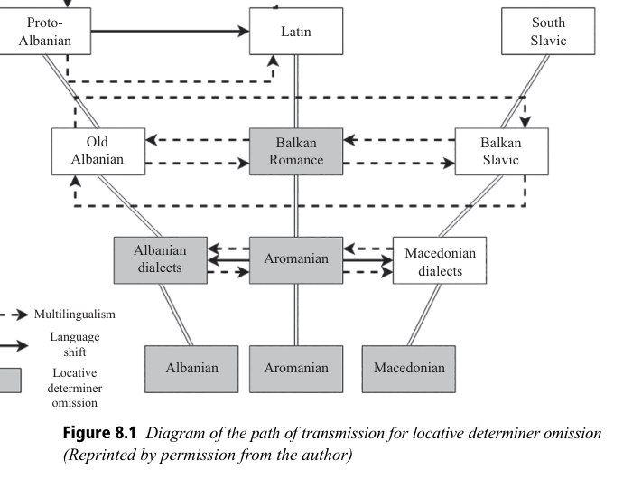

<!-- pdf-page: 1049; source-page: 1009 -->
# 8 Conclusion: Summation, Causation, and the Future

## 8.0 Introduction

Chapters 4 through 7 establish the existence of language contact in the Balkans, and they establish effects of language contact, namely, for the most part, convergence on a massive scale.1 Thus, the Balkans represent a classic case of contact-induced convergence of the sort referred to as a sprachbund. This construct is given a critical appraisal in Chapter 3, and in particular in §3.4, and as the discussion there indicates, the notion of sprachbund, although a well-established concept in the contact linguistics and historical linguistics literature, is not without problems. It is thus worthwhile reiterating here the questions addressed there in the course of problematizing the notion of sprachbund and offering some definitive answers. In particular, these questions pertain to the nature of the languages involved and of the features involved, and are thus language based, as in (8.1), and feature based, as in (8.2).

(8.1)
Language-based issues
a. Is there a minimum number of languages needed before one can identify
a sprachbund?
b. Must the languages be unrelated to one another? If relatedness is allowed, how
closely related can they be?

(8.2) Feature-based issues a. Is there a minimum number of features needed before one can identify a sprachbund? b. How should the features be distributed across the languages? Must all features be found in all the languages in question? Do some features characterize some languages as forming the “core” of the sprachbund? If so, how does one assess the contribution of the noncore – peripheral or marginal – features or languages?

These questions are all addressed in Chapter 3, more specifically in §3.4, where, to briefly summarize the answers to (8.1a) and (8.1b), it is argued that the only minimum for languages is what the very idea of contact requires, i.e., two, and that allowing for relatedness among the languages involved is not a conceptual issue, only a methodological one, in that it can make it harder to determine whether contact is responsible for an observed convergent feature. The answer to (8.2a) is that it is best to be vague; one unassailable feature might be more compelling and more valuable than ten more ambiguous ones. Still, the more convergent features

1 We say “for the most part” since in some instances contact leads to divergence, as with the differentiating role that phonology plays with Romani vis-à-vis the other languages; see §5.3 on this.

<!-- pdf-page: 1050; source-page: 1010 -->
one is able to identify, the stronger and more compelling the case becomes for
recognizing the languages and the area covered by those features as a sprachbund.
To some extent, this is built into the notion of “convergence,” since the implication
is that if two languages are similar on only one feature, they diverge on all other
features and thus are actually not very convergent overall. Finally, the answers to
the complex of questions in (8.2b) start with the recognition that each feature has its
own distribution across the geography of the language space involved and they lead
to the view that the sprachbund is defined by clusters of smaller zones of conver-
gence, so that, in the characterization of Hamp 1989a, it is “a spectrum of
differential bindings, a spectrum that extends in different densities across” larger
regions.
Clusters arise out of the recognition, born of observation of known sprachbunds,
that not every convergent feature in an area is found in all the languages involved.
Given such an observation, it could well be the case that one feature might link
A and B, another might link B, C, D, another might link A and D, and so on.
Ultimately, then, a sprachbund emerges from intersecting and overlapping local
zones of convergence – from these clusters – and is the result of highly localized
convergence in numerous multi-laterally multilingual interactive settings, rather
than the result of a single process of convergence over a large geographic area.
A parallel diachronic companion to this cluster perspective on the sprachbund –
together with a concomitant geographic dimension – is the “layer approach”
advocated by Prendergast 2017. As observed in §7.9.2, Prendergast sees the
development of the possibility for the omission of definiteness marking in locative
expressions (his locative determiner omission) as resulting from various “dia-
chronic and geographical layers of contact that yield remarkable outcomes of
convergence among languages across familial lines.” He offers this insightful
diagram of how these various layers interacted and unfolded over time
(Prendergast 2017: 150); see Figure 8.1.
Applied to other features, such layers add up to localized clusters of convergence
zones.
Also in Chapter 3, and in the subsequent chapters covering the convergent
features found in the Balkans, one additional domain for questions is covered,
namely issues pertaining to causality:

(8.3) Causation-based issues a. What are the causal mechanisms responsible for the convergence? b. To the extent that contact is indeed the basis for the convergence at issue in the Balkans, is there a type of contact that is needed in order for a sprachbund to arise?

(8.3a) is answered by reference to bilingualism, codeswitching, calquing, and accommodation, while the response to (8.3b) recognizes the importance of sustained and regular face-to-face, i.e., conversational, interactions of a sort referred to as both sprachbund-consistent and sprachbund-conducive, a characterization that formed the basis for the recognition of ERIC loans in Chapter 4, and the extension of that notion into aspects of phonology in Chapter 5 and especially of morphosyntax

<!-- pdf-page: 1051; source-page: 1011 -->

and the nuanced pragmatics of modality and evidentiality, as well as ethical datives, in Chapter 6, and of syntax in Chapter 7, e.g., regarding Object Reduplication.2

Going somewhat further, we can say that the relevant contact is not casual or “object oriented” (as with “needs” in trade and commerce and the like) but rather is an intense contact that is more “human oriented,” as noted in §§3.1 and 3.4.2.2. Moreover, that human orientation within the extended ERIC model offers an explanatory basis for many of the Balkan convergences. Further, recognizing such an orientation is consistent with what has been called by Kantarovich & Grenoble 2017: 2 a “socially-anchored approach to historical linguistics and language reconstruction,” in which the goal “is to reconstruct not only the set of linguistic features that existed in a language – or dialect – when it was robustly spoken, but ideally also which subsets of the population used the

2 The involvement of various sorts of modal inferences in a number of convergences is consistent with the claim in Matras 2007 that modality (and, we can add, evidentiality) is more likely to be affected by contact than indicativity per se (and see the discussion of this notion in §6.2.1). Note too the speculations in Joseph 2003d: §3 regarding how evidentiality can spread, in contact situations. He suggests that evidentiality is such a useful and highly valued communicative tool that speakers of a language with evidentiality will want to retain it (rather than simplify it out of their language) and speakers of a language without it will want to develop a means for expressing it. This suggestion is borne out by speakers for whom English is L2 who express explicitly their feeling of a lack of evidential distinctions available in their L1, which has such distinctions (VAF/BDJ field notes). Cf. §6.2.5.2 and see also §4.3 and §6.2.5.11 for comments on these extensions of the ERIC model.

<!-- pdf-page: 1052; source-page: 1012 -->
language, whether different features were variably utilized by different groups, and the role of variable linguistic use in social interaction.” We would argue that using the facts of Balkan convergences and material like ERIC loans to reconstruct a “human-oriented” sort of contact situation is precisely practicing socially anchored historical linguistics. What remains to be addressed, then, are a few additional questions, one of which pertains to a further aspect of causation, given in the continuation of (8.3), and thus to a matter of the past as far as the Balkan sprachbund is concerned:

(8.3)
Causation-based issues (continued)
c. What conditions are needed in order for the mechanisms that lead to sprachbund
formation to be activated? In other words, what other causal factors are relevant in
the formation of the Balkan sprachbund?

Further, returning once again to the matter of core versus periphery, there are questions that get to the very definition of the sprachbund as a geographical entity, and to the present state of the Balkan sprachbund and its future, given in (8.4):

(8.4) Definitional issues a. How do we identify the boundaries of a sprachbund, if any? Are there different degrees of membership as suggested by the core/periphery question in (8.2b)? b. Is the evidence that gives a basis for identifying the Balkan sprachbund the aftermath, i.e., the results, of past sprachbund construction or is the sprachbund an on-going and still living construct?

In the sections that follow, these as-yet unanswered questions are elaborated upon and are given some answers.3

## 8.1 Addressing Causation Issues for the Balkan Sprachbund

Turning now to the questions pertaining to cause, the response for the
Balkans must start with the observation that looking for a single cause for
the recognized convergence has plagued much of the investigation over the years
into the causes of the Balkan sprachbund, even where contact was acknowledged.
Leake 1814 attributed the convergence to Slavic, whereas for Kopitar 1829
a substratum was responsible, as was the case also for Miklosich 1862. Sandfeld
1930 was the most notable proponent of a Byzantine, i.e., Greek-based, answer to
Balkan linguistic convergence, whereas Solta 1980 favored a substratum or Latin.
And, Klagstadt 1963 saw the whole set of convergences as prosodically based (see
§5.5, and footnote 6 below). Yet, as the various discussions of the details of
individual convergent features in the preceding chapters show – and see below
on the origins of the ‘have’-perfects in the Balkans – each feature presents its own
complexities, and there can be different causes for different features. Moreover, it is

3 Earlier versions of much of the material in this section and sections that follow appeared in Friedman & Joseph 2017 and Friedman 2012f.

<!-- pdf-page: 1053; source-page: 1013 -->
not necessarily the case even that each feature would have its own single cause; it is important to recognize multi-dimensional complexity in each contact situation, so that the possibility of multiple causation must always be entertained; Joseph 1983a takes precisely that line of argumentation with regard to the infinitival developments in the Balkans, and others have taken similar approaches to other features (e.g., Ilievski 1973 on object reduplication, Friedman 2007a, 2008a on a variety of features). A further key ingredient to any treatment of causality is an acknowledgment that speaker-to-speaker contact is responsible for the diffusion of features in the Balkans, as in any sprachbund, and it is therefore responsible for the convergence observed therein. But, as (8.3a) and (8.3b) ask, it must be considered whether there is a particular type of contact that is needed. Based on what is seen in the Balkans, the relevant contact is an intense, intimate, and sustained contact, specifically, in the typical case, Multi-lateral, Multi-generational, Mutual Multilingualism. This “four-M” model means that several languages are involved4 (minimally two, based on the discussion in §3.4.2, but in the Balkans and in other cases, more) and that speakers are multilingual, each (for the most part) speaking some version of the language of others, and overall it is mutually so, in that typically speakers of language X know language Y and speakers of Y know X, with the result that features can flow in either direction from one language to another.5 The qualifier “some version of” is important because it is not the case that speakers were necessarily perfect bilinguals, as emphasized in §3.2.1.1. Rather, even if some speakers had a strong command of the other language, most may have had a sufficient knowledge of the other language(s) to communicate; furthermore, their interlocutors presumably altered aspects of their own usage in the direction of these imperfect speakers. Moreover, as noted in §4.3, with regard to the question of whether certain sorts of features are significant, a particular type of loanword is highly significant in dealing with the Balkans, and by extension other sprachbunds. These are the ERIC loans, the conversationally based ones, for they give evidence of the intense and mutual, but also sustained, contact that is needed for a sprachbund.6 The ability of speakers of these different languages to interact on a regular basis in nonneed-based, human-oriented,

4 Our model is quite different from the “4-M model” of Myers-Scotton & Jake 2000 and Jake & Myers-Scotton 2021, which refers to a typology of morphemes involved in codeswitching. See Myers-Scotton & Jake 2016 for an iteration attempting to address problems with that model, and see Auer & Muhamedova 2005 for a discussion of some of the problems. 5 There are exceptions, of course; as pointed out in Chapter 3 (see §3.0 and footnote 2 therein), women in Balkan villages and even urban settings often had less access to other languages, and in general, we observe that few non-Roms learned Romani and few non-Jews learned Judezmo. 6 As noted in §5.5, Klagstadt 1963 pointed to the several prosodically weak elements involved in various Balkanisms, e.g., the subordinating markers, the future markers, the weak object pronouns, inter alia, and proposed a prosodic basis for Balkanisms. While this observation is interesting, it only goes so far. Since all nonwritten language is realized with prosody of some sort, one has to look beyond the prosodic. Moreover, with numerous Balkanisms, even if prosodically weak material is involved in the surface realization of constructions and categories, it is not clear how prosody would be causally relevant; this is the case, for instance, with the doubled ethical dative (§6.1.1.2.5), double determination in the noun phrase (§6.1.2.3), marking for evidentiality (§6.2.5), and the ‘feels-like’

<!-- pdf-page: 1054; source-page: 1014 -->
ways was fostered by a particular socio-historic milieu, and we turn to that by way of answering the new question (8.3c), regarding what else, other than contact, might figure in the development of a sprachbund.7

Based on our available documentation, processes that may have been set in
motion, or which at the very least began to be reinforced during the middle ages,
and even features that may have appeared in the written record at earlier dates,
achieved their current state during the five-century period of Ottoman Turkish rule
in the Balkans, referred to as the Pax Ottoman(ic)a (see §3.4.2.2). Ottoman rule
created a socioeconomic stability in the Balkans that allowed for the interactions
necessary for the convergence effects that have come to be called by the term
sprachbund. Some comparisons with other contact situations are especially
helpful for pinning down what it was about the Balkans that led to the massive
convergence that is observed.
Heath 1984: 378 presents an interesting view, quoted earlier (see §3.4.2.2) but
worth repeating here: “It now seems that the extent of borrowing in the Balkans is
not especially spectacular; ongoing mixing involving superimposed European
languages versus native vernaculars in (former) colonies such as Philippines and
Morocco is, overall, at least as extensive as in the Balkan case even when (as in
Morocco) the diffusion only began in earnest in the present century.” Heath’s
observations are important for several reasons. On the one hand, we know that
major linguistic changes can occur quite rapidly, so that, as noted in §3.4.2.2, it is
not unreasonable to look precisely to Ottoman times as the period in which the
Balkan sprachbund as we know it took shape.8 The examples from Morocco and
the Philippines, however, all involve lexical items or reinterpreted morphemes
rather than morphosyntactic patterns. Moreover, the relationship of the colonial
languages to the indigenous is roughly equivalent to that of Turkish to the Balkan
Indo-European languages at the time of the Ottoman conquest. While Turkish did
maintain a certain social prestige owing to unequal power relations, there is
nonetheless a significant difference between recent European colonial settings
lasting a century or so and the five centuries of Turkish settlement in the Balkans
during which the language became indigenized and members of all social classes
came to be Turkish speakers. To this we can add that the complexity of indigenous
power relations prior to conquest is another part of the picture that is easier to tease
out in the Balkans than in European colonies owing to longer histories of docu-
mentation of the languages prior to conquest. It is precisely this background of
long-term, stable language contact with significant documentary history that makes
the Balkans an interesting model for comparison and contrast with other contact
situations.
We make the case in §3.3 and §3.4.2.2 that a strictly numerological approach to
the Balkans, or any sprachbund for that matter, is fraught with problems. Further

internal disposition construction (§7.8.2.2.5.1), among others. The intimate and sustained contact in the conversationally based model argued for here gives a basis for the spread of such constructs. 7 The response that follows draws heavily on Friedman 2012f. 8 See §3.4.2.2, footnote 147, for relevant references on the possible rapidity of change.

<!-- pdf-page: 1055; source-page: 1015 -->
consideration of numbers leads to another telling comparison with the Balkans.
Hamp 1977a includes a critique of the conflation of areal and typological linguis-
tics seen in Sherzer 1976 in describing indigenous languages of North America.
Among Hamp’s 1977a: 282–283 points is that what he labels as a “gross inventor-
izing” of “a Procrustean bed of parameters” cannot capture the historical depth and
specificity that give meaning to areal developments. Such numbers games played
with a small set of features, characterized by Donohue 2012 as “cherry
picking,” can produce maps in which languages seem to mimic modern polit-
ics, e.g., Haspelmath 1998: 273, which shows a French-German-Dutch-North
Italian “nucleus” to a presumed “Standard Average European,” with the Indo-
European Balkan languages at the next level of remove, and with Turkish
entirely outside of “Europe.” A subsequent representation (Haspelmath 2001)
has only French and German at its core, with Albanian and Romanian as part
of the next closest level, Bulgarian and the former Serbo-Croatian beyond that,
and Turkish still totally outside. Van der Auwera 1998: 825–827 has dubbed
such constructs the Charlemagne Sprachbund on the undemonstrated assump-
tion that Charlemagne’s short-lived (800–814 CE) empire, or its successor, the
Holy Roman Empire (of the German Nation; a.k.a. the First Reich), was the
nucleus for a linguistically unified Europe whose influence can be detected
today in mapping out synchronic feature points. This is, in essence, an exten-
sion of Sherzer’s 1976 methodology to Europe (cf. also König 1998: v–vi, and
note §6.2.3.2.2, footnote 259, and footnote 11 below), but rather than being the
work of a lone researcher, this project – especially in the version known as
Eurotyp – has involved many people, produced many volumes, and has taken
place in a political context that is arguably motivated by a vision of what
Winston Churchill called “a kind of United States of Europe” in his 1946
speech at the University of Zurich. To be sure, as with Sherzer 1976, the
assembled data are welcome. The over-arching quasi-historical conclusion,
however, is misleading and the lack of attention to historical and dialect-
ological detail of the type called for by Hamp 1977a is problematic.
Van der Auwera’s 1998: 827 formulation that on the basis of Eurotyp’s
investigations “the Balkans do indeed get their Sprachbund status confirmed”
still gives the impression of treating the Balkan languages like the Balkan states
vis-à-vis the EU: their status on the international stage is determined in Brussels
(the new Aachen) or Strasbourg (in former Lotharingia).9 The politics of Western
Roman and Eastern Roman (Byzantine) interests, for which the Balkans were
always a peripheral but vital pawn, were very much at stake in Charlemagne’s

9 To a certain extent, this is literally true. In 2005, the European Court of Human Rights in Strasbourg fined the Greek government for violating the human rights of its ethnic Macedonian citizens in harassing the ethnic Macedonian organization Vinožito ‘Rainbow.’ In 2006, Vinožito used the money to re-publish the 1925 primer that had been published in Athens for Greece’s Macedonian minority, combined with a modern Macedonian primer (Vinožito 2006). However, that same year, on September 29, 2006, at the inauguration of Latvian collector Juris Cibuls’s exhibition of primers in Thessaloniki, the Deputy Mayor for Culture and Youth of that city ordered the organizers to take the Macedonian primer out of the showcase so that it could not be displayed (Juris Cibuls, p.c.).

<!-- pdf-page: 1056; source-page: 1016 -->
time; and the modern-day echoes are striking. But it was precisely the Pax Ottoman(ic)a of the late medieval and early modern periods – not Obolensky’s 1971 Byzantine Commonwealth – in the regions that were part of the Ottoman Empire from the fourteenth to the beginning of the twentieth century, where the linguistic realities of the Balkan sprachbund (as identified by Trubetzkoy) took their modern shape. As can be seen from the textual evidence of such innovations as future constructions and infinitive replacement (see Asenova 2002: 214; Joseph 2000b), the crucial formative period of the Balkan sprachbund is precisely the Ottoman period, when, as Olivera Jašar-Nasteva has said, with a single teskere (travel document) one could travel the whole peninsula and, we can add, when much of the Charlemagne’s former territory consisted of a variety of warring polities that only consolidated into modern nation-states as the Ottoman Empire broke up.10

To be sure, Hamp 1977a: 280 recognizes areal features that “may be crudely
labeled Post-Roman European,” but, for example, the spread of the perfect in ‘have’
into the Balkans has nothing to do with Charlemagne.11 The construction was a Late
Latin innovation, whose origins are already apparent in Cicero and Julius Caesar
(Allen 1916: 313), and it made its way into the Balkans with the Roman armies,
settlers, and Romanized indigenous populations. It became the preterit of choice –
independently – in French and Romanian (except in the south; see Zafiu 2013a: 33),
and continues to displace the aorist in other parts of both Western and Eastern
Romance. In Balkan Slavic, it was precisely those populations in most intensive
contact with the variety of Balkan Romance that became Aromanian that developed
independent ‘have’ perfect paradigms, namely those in what is today the southwest
of North Macedonia and adjacent areas in Greece and Albania (see Gołąb 1976,
1984a: 134–136 for details). Moreover, it is hardly coincidental that in Bulgarian
dialects, it is precisely those that were spoken along the route of the Via Egnatia
where similar perfect paradigms developed. As for Greek, as Joseph 2000b (and cf.
references therein) makes clear, amplifying earlier explanations, especially that of
Thumb 1912, the use of ‘have’ as a perfect auxiliary is in fact of a very different,
albeit also ultimately Roman, origin. As detailed in §6.2.3.3, in Greek, in a complex
sequence of developments, it was the use of ‘have’ with an infinitive as a future

10 Differences in territorial, economic, and social mobility are beyond our scope here, but we can note that during the centuries when Jews were locked into ghettoes in Western Europe, and Roms existed there only as peripatetic outcasts, in Southeastern Europe (i.e., Ottoman European Turkey) Roms were settled in both towns and villages (although some groups were peripatetic), and Jews lived in neighborhoods, not locked streets. The larger varieties of available modes of social (and thus linguistic) interaction implied by such differences should not be underestimated. Moreover, pace Haspelmath 2001, significant grammatical change can take place in the course of only a few centuries, as seen in the data in Asenova 2002 and Joseph 2000b; cf. also the changes in English after 1066. 11 Drinka 2017: 267–287 discusses the periphrastic perfects in the Balkans as part of a broader study of the rise of perfect periphrases in Europe more generally, with additional attention elsewhere to a few individual Balkan languages (Greek, pp. 94–111; Romanian, pp. 216–218). While she takes an admirably deep view diachronically of the Balkan situation, from ancient times up to the present, there are errors of fact and problematic interpretations that make her account of the Balkan perfect untenable. See §6.2.3 and footnote 261 for details.

<!-- pdf-page: 1057; source-page: 1017 -->
formation in the Postclassical era – itself likely a Latin-influenced innovation – that
first gave rise to an anterior future with the imperfect tense of ‘have,’ i.e.,
a conditional, that then became a pluperfect that itself provided the model for the
formation of the (present) perfect using the present tense of ‘have’ plus a petrified
infinitival form. This stands in stark contrast to the Romance perfect, which began as
‘have’ plus past passive participle – a resultative construction – in which the
participle then ceased to agree, giving exactly the construction that was calqued
into Macedonian (and some Thracian Bulgarian). On the other hand, the perfect in
the Romani dialect of Parakálamos in Epirus (Matras 2004) is clearly a calque on
Greek, as is the innovation of a verb meaning ‘have.’ Albanian also has a perfect in
‘have’ plus participle, and the participle itself is historically of the past passive type
found in Romance and Slavic. The directionality is difficult to judge. The Albanian
perfect is securely in place by the time of our first significant texts in the sixteenth
century – a time when it was still not well established in Greek – but the relationship
to Latin or Romance influence is difficult to tease out. Such perfects are not found in
the Torlak dialects of BCMS, a region where there is presumed to have been early
contact with populations whose languages are presumed to have been ancestral to
Albanian and modern Balkan Romance, and where there were significant Albanian-
speaking populations until 1878 (Vermeer 1992: 107–108). The Slavic dialects of
Kosovo and southern Montenegro – where contact with Romance lasted into the
twentieth century and contact with Albanian is on-going, albeit sometimes strained –
do not show such developments.12 This fact itself may be due to the importance of
social factors in language change. Living in daily contact does not always produce
shared linguistic structures. A certain level of co-existential communication must
also involve social acceptance.13 On a western edge of the old Roman Empire,
Breton is the only Celtic language with a ‘have’ perfect, and the directionality is
clear. Still to describe all these perfects as part of a “Charlemagne Sprachbund” is to
do violence to historical facts, although it arguably serves the interest of current
political imaginings.
The spread of ‘have’ perfects exemplifies linguistic epidemiology in the sense of
Enfield 2003, 2008. And thanks to the depth and detail of our historical records, we
can tease out the facts. In some respects, it is heartening to see that humans can
program computers to identify, to some extent, insights that humans had without
their aid a century or two ago. Thus, for example, as Donohue 2012 demonstrated,
the features in WALS 2005 for the main territorial languages of Europe, when
“decoded into binary format, then pushed through computational algorithms

12 According to Rexhep Ismajli (p.c.), when Pavle Ivić was conducting fieldwork on the old town former Serbo-Croatian dialect of Prizren (southern Kosovo) in the mid-twentieth century, he gathered a group of old women and asked them to count in the old-fashioned way (po-starinski) and they began: unã, dao, trei, patru . . . ‘one, two, three, four,’ i.e., in Aromanian. 13 Morozova & Rusakov 2018a, 2018b and Morozova 2021 stress the importance of marriage patterns in producing the kind of multilingualism that is typical of a sprachbund. Their study of the Mrkovići region of southern Montenegro, where clan exogamy promotes Albanian-Montenegrin intermarriage, which in turn promotes multilingualism and language contact-phenomena, is an important model demonstrating what was probably a much more widespread pattern in the past.

<!-- pdf-page: 1058; source-page: 1018 -->
(Splitstree) that cluster languages on the basis of “best shared similarity” – which he is careful to characterize as explicitly synchronic and not diachronic – produces groupings (moving clockwise from the north) for Germanic, Slavic, Balkan, Romance, and Celtic. The details within the groupings are interesting only because we already know the history: Icelandic and Faroese are closer to German than to Scandinavian, while Afrikaans is closer to Scandinavian than to Dutch, and Polish comes between Belarusian and Ukrainian, on the one hand, and Russian, on the other, while Portuguese is much closer to French than it is to Spanish. Moreover, the ability to differentiate areal from genealogical causality that prompted Trubetzkoy to postulate the sprachbund in the first place is missing. These results demonstrate clearly Hamp’s 1977a point: typological, areal, and genealogical linguistics are independent disciplines, the former achronic, the latter two “twin faces of diachronic linguistics” (Hamp 1977a: 279). Nonetheless, despite its many sins of omission and commission (underrepresentation of so-called nonterritorial languages [itself a problematic, bureaucratic notion], absence of crucial dialect facts, misanalyses, misleading generalizations, etc.), WALS 2005 is a blunt instrument that, if wielded with care and sensitivity, can at least spur us to consider other approaches, as Donohue 2012 has productively done in his discussion of Australia. In the context of the putative Charlemagne sprachbund, it is instructive to cite here Jakobson’s 1931b/1971 concept of the Eurasian sprachbund. Jakobson deviated significantly from Trubetzkoy 1930 – who characterized the sprachbund as “comprising languages that display a great similarity with respect to syntax, that show a similarity in the principles of morphological structure, and that offer a large number of common culture words, and often also other similarities in the structure of the sound system” (see §2.3.1 for the German original) – by positing the notion of phonological sprachbunds and specifically a Eurasian sprachbund, concentrating on consonantal timbre (basically palatalization including some correlations with front/back vowel harmony), prosody (presence versus absence of pitch accent or tone), and, in a footnote, nominal declension. He set up Eurasia as the center in terms of all these. For nominal declension, Germano-Romance Europe and South and Southeast Asia were the peripheries; in terms of phonological tone, the Baltic and Pacific areas were the peripheries (with West South Slavic – most of SerboCroatian and Slovene – as a relic island), while for palatalization the core was roughly the boundaries of the Russian Empire, with the inclusion of eastern Bulgaria (which, perhaps not coincidentally, was imagined as Russia’s potential zadunajskaja gubernaja ‘trans-Danubian province’ during the nineteenth and part of the twentieth century). He even went so far as to suggest that in Great Russian [sic] palatalization finds its most complete expression, and it is thus no coincidence that Great Russian is the basis of the Russian literary language, i.e., the language with a pan-Eurasian cultural mission (Jakobson 1931b/1962: 191). All the foregoing is not to say that linguists positing sprachbunds that match political interests intend to act as tools of foreign policy, but once their works are published they can be adopted and adapted by those with policy goals; and in any case, language ideology appears to be at work.

<!-- pdf-page: 1059; source-page: 1019 -->
It is also important to note here that, while Masica 2001: 239 warns against
confusing “recent political configurations” with “linguistic areas,” it is precisely
the legacy of political configurations such as the Ottoman Empire that created the
conditions for the emergence of the Balkan sprachbund as it was identified by
Trubetzkoy. At the same time, humans, like all other animals, are capable of
traversing whatever barriers nature or other humans might construct, and thus
sprachbunds are indeed not political configurations, with fixed boundaries. It is
here that the German Bund ‘union’ in Sprachbund (sojuz in Trubetzkoy’s original
1923 Russian formulation of jazykovoj sojuz ‘linguistic union,’ like sovetskij sojuz
‘Soviet Union’) has misled scholars such as Stolz 2006, who suggests that since
sprachbunds do not have clearly definable boundaries like language families (or
political entities) the concept should be discarded. His “all or nothing” methodology
misses Trubetzkoy’s original point that the sprachbund is fundamentally different
from a linguistic family, and it fails to take into account the basic historical fact that,
like the political boundaries and institutions that sometimes help bring sprachbunds
into being, the “boundaries” of a sprachbund are not immutable essences but rather
artifacts of on-going multilingual processes; in Hamp’s 1989a: 47 words, they are “a
spectrum of differential bindings” rather than “compact borders,” a point also alluded
to in Hamp 1977a: 282. It is also important to remember that Trubetzkoy first
proposed the term at a time when the Sprachfamilie (‘language family’) was widely
considered the only legitimate unit of historical linguistics, while resemblances that
resulted from the diffusion of contact-induced changes were described in terms such
as those used by Schleicher 1850: 143, who described Albanian, Balkan Romance,
and Balkan Slavic as “agree[ing] only in the fact that they are the most corrupt [die
verdorbensten] in their families” (see §2.2.2 for the German original). Trubetzkoy
was explicitly concerned with avoiding the kind of confusion more recently gener-
ated by conflations of areal and typological linguistics, although in his time the issues
involved areal and genealogical linguistics.
We must turn now to language ideology in the Balkans itself as another aspect of
causality, and here the difference between Greek and the rest of the languages is
striking. It is certainly the case that multilingualism itself does not guarantee the
formation of a sprachbund. As Ball 2007: 7–25 makes clear, in the multilingual
Upper Xingu, multilingualism, while necessary for dealing with outsiders, is viewed
as polluting, and monolingualism is considered requisite for high status. This
endogamous region is quite different from exogamous parts of Amazonia, where
multilingualism is an expected norm, and lexical mixing is viewed negatively, but
morphosyntactic convergence is rampant (Aikhenvald 2007b; Epps 2007). Consider
also the vertical multilingualism that Nichols 2015 has identified as characteristic of
the Caucasus, which is similar to various Balkan multilingual practices, where
specific types of multilingualism index different types of social status.14 Ideologies

14 In vertical multilingualism, people in higher villages know the languages of those down the mountain, but those in the lowlands do not bother to learn highland languages. Nonetheless, as Tuite 1999 makes clear, aside from the features of shared glottalized consonants and a few phraseological calques, when examined closely the idea of a Caucasian sprachbund vanishes like

<!-- pdf-page: 1060; source-page: 1020 -->
that consider contact-induced change as symptomatic of pollution and that equate isolation and archaism with purity were at work in the nineteenth century as well, as seen in Schleicher’s formulation quoted above. We could even suggest that the Charlemagne sprachbund is an attempt both to redress this nineteenth-century failing and to co-opt the new valorization of language contact. In the case of the Balkans, the various proverbs cited in the beginning of the introduction to this work show that Balkan peoples have long valued multilingualism, seeing it as a kind of wealth and as something that is intrinsically humanly enriching. In such an ideological milieu, along with the four-M multi-lateral multi-generational mutual multilingualism presumed for the Balkans, the exchange of linguistic features that comes of learning the languages of others around one would come naturally.

## 8.2 Answering the Definitional Issues15

We are now in a position to address the last of the issues by which the notion of “sprachbund” has been problematized. Question (8.4a) in a sense restates an issue dealt with earlier, namely that of setting the boundaries of the sprachbund and recognizing different degrees of “participation” in the sprachbund on the part of speakers of the various languages involved. It should be clear from the foregoing discussion concerning the cluster approach to the sprachbund what the answer is here: the boundaries are as elastic as the local zones of convergence that add up to the larger convergence area. There is nothing fixed, and even political boundaries, while convenient, are relevant only insofar as they correspond to socio-historical realities that might promote the sort of contact necessary for sprachbund formation. Geography is no accident as far as the Balkans are concerned, in that for most of the features recognized as important regarding structural convergence in this region, the more geographically peripheral the language or dialect, the less likely it is to demonstrate fully the feature and the more centrally located a language or dialect is in the Balkans, the more fully it shows the feature. This is seen especially clearly with the loss of the infinitive and its replacement by finite subordination. As discussed in §7.7.2.1.5, the distribution of infinitive-loss in the Balkans has a direct geographic correlate, in that in instance after instance, the more deeply embedded a language or dialect – a speech community, that is – is in the Balkans, the greater the degree of infinitive-loss that is found or the earlier that the loss occurred. This correlation is evident in a comparison of non-Balkan Romeyka Greek of eastern Turkey with mainland (Balkan) Greek, or Macedonian with Bulgarian, or Aromanian with Romanian, and so on. This holds for other features

a mirage. Hamp 1977a, too, noted that the appearance of glottalization in Armenian, on the one hand, and Ossetian, on the other, must have distinct areal diachronic explanations. Daniel et al. 2021 contribute to this view in their argument that in Daghestanian multilingualism, it is the lingua francas and not local bi- or multilingualism that are most consistently reflected in loanwords, 15 The discussion in this section draws on Friedman & Joseph 2017.

<!-- pdf-page: 1061; source-page: 1021 -->
as well. Ignoring geography and attempting to explain the relevant similarities as
“internal drift” or parallel but independent developments, in the face of obvious
evidence of language contact and speaker contact in the relevant contexts, can be
compared to the production of “alternative facts.”
And, again as shown by developments with the infinitive, peripherality is not just
a geographic notion; some languages were chronologically peripheral. Judezmo
offers a striking example here. As noted in Friedman & Joseph 2014, Judezmo
entered the Balkans rather late, only after Sephardic Jews were expelled from Spain
and Portugal in the late fifteenth century, and some of the ways in which Judezmo
appears to be non-Balkan can be attributed to this chronological dimension. For
instance, as argued in §7.7.2.1.5, Judezmo entered the Balkans during the end-stage
of the ultimate loss of the infinitive, so that the deviation of Judezmo from the
Balkan “norm” in having a fairly robust infinitive can be attributed at least in part to
chronology, i.e., to the fact of the arrival of Spanish Jews relatively late in the waves
of infinitive-replacement in the languages of the region. Temporal peripherality,
thus, could well have been a factor that allowed the Judezmo infinitive to remain.
A similar point is made with regard to the preposed definite article in Judezmo.
Judezmo speakers arrived in the Balkans with a fully functioning prenominal
definite article so the absence in the language of the enclitic Balkan definite article
can be explained by the fact that an article had already developed in Judzemo (from
a Latin starting point without an article); that is, Judzemo was in the Balkans at
a point when, in its own development, the issue of a definite article had already been
settled.
Another factor affecting the degree of participation in the convergence builds on
the observation in §8.1 above concerning the socio-historical factors. That is, there
is also a social dimension to peripherality. Once again, this can be seen with
Judezmo and the infinitive. As discussed in Friedman & Joseph 2014, and in
§7.7.2.1.4 (and see also Joseph 2021), Balkan Judezmo shows contradictory
tendencies regarding the infinitive, with both innovative finite subjunctive usage
and conservative infinitival usage, and the sociolinguistics of Jewish languages,
and in particular their general conservatism (Wexler 1981), based on their relative
social isolation, provides a basis for an explanation for these contradictions. And
some of the specifics of linguistic interactions that Jews in the Balkans had with
non-Jewish neighbors – as reflected in various Macedonian codeswitching anec-
dotes (again, see §7.7.2.1.4) – provide a further glimpse into the conditions that
could have led to Judezmo’s status regarding the infinitive. That is, given the local
and social segregation of Jewish communities, Jewish speakers would have less
exposure to linguistic innovations found in the usage of co-territorial non-Jewish
speakers. The Judeo-Greek of sixteenth-century Constantinople is another case in
point, since, as noted in §3.2.2.10 and §7.7.2.1.1.2.1, it shows archaic infinitival
usage paralleling that of New Testament Greek (and see Joseph 2000b, 2019a).
Thus peripherality can be measured spatially, temporally, and socially, though
social factors of interactions between speakers are the most important. Geography
can help or hinder such interactions, and chronology is insurmountable but also

<!-- pdf-page: 1062; source-page: 1022 -->
instrumental in that speakers can only be in a place when they have come to that
place. And, as the lesson of the Pax Ottoman(ic)a shows, political conditions,
which are a macrosocial phenomenon in any case, can also serve as a contributing
factor. In the end, then, social factors, aided by various other external conditions,
determine participation and boundaries.
The complexities of Balkan linguistic realities are thus difficult to capture. Still,
the point in §3.4.2.2 is worth repeating here: such difficulty is not to say, with
Andriotis & Kourmoulis 1968: 30, that the Balkan sprachbund is “une fiction qui
n’est perceptible que de très loin” (‘a fiction that is perceptible only from very far’)
and that the commonalities are “tout à fait inorganiques et superficielles” (‘com-
pletely inorganic and superficial’). Their view – seemingly influenced by Greek
nation-state ideology – speaks to the final question, (8.4b), that of whether the
Balkan sprachbund, or any sprachbund that might be identified, is an on-going
concern or just the result of processes buried in the past and consignable to the
dustbin of history.
Contrary to the challenge posed by Andriotis and Kourmoulis, one can argue that
Balkan linguistic diversity occurs within the context of a set of structural similarities
that constitute a framework of contact-induced change. Moreover, it is important to
distinguish between “superficial” and “surface.” As Joseph 2001a argued, the surface
is where the action is, so to speak, as far as language contact is concerned, and
explanations that appeal to typological aspects of universal grammar (including so-
called formalist “explanations,” which are, in fact, theory-bound descriptions) are not
really revealing about language contact.16 Furthermore, surface realizations are not at
all “inorganic”; they constitute convergences that bear witness to the multilingualism
that we know existed for centuries and even millennia, and which thrived and
developed into the four-M set of conditions under Ottoman rule and has survived,
at least in parts, in all of the modern Balkan nation-states.
Moreover, and this may be the real source of Andriotis and Kourmoulis’s
position, when one compares just the standard national languages of the Balkans
(as does Asenova 2002, leaving out, however, Macedonian), one can get a sense of
a language state frozen in time, fixed in a form that might reflect a structural
situation from several centuries back, scrubbed somewhat of identifiable contact-
induced change by an ideologically informed process of standardization. Or then
again, the literary language might reflect a state of affairs that never existed in the
spoken language, but has been borrowed from some prestigious language outside
the Balkans. Thus, for example, the nominative/oblique opposition in the Bulgarian
definite article is in conscious imitation of case distinctions in Russian and Church
Slavonic, not a phenomenon that occurs in any Bulgarian dialect. As far as Greek is
concerned, it is instructive to examine the state of the language as described in
Thumb 189517 for a time as recent even as the late nineteenth century and to see

16 Aikhenvald 2007a makes a similar point. 17 This work is the first (German) edition of what we have been citing herein as Thumb 1912, the English translation of the second German edition of 1910; we mention this earlier edition here as it locates the time-frame of Thumb’s object of description more clearly than the later-dated works do.

<!-- pdf-page: 1063; source-page: 1023 -->
forms given as part of regular Demotic usage that exist only in regional dialects today forced out of the emerging standard language by the onslaught of puristic pressures, overt and covert. For example, as discussed in Janse & Joseph 2014, the noun for ‘thing,’ currently πράγμα with a genitive πράγματος, forms that match Ancient Greek except for the realization of the velar as a fricative and the accent as stress not pitch, is given in Thumb 1895 as πράμα (still an accepted and possibly even dominant variant today) but with a genitive πραμάτου, a form found now in such outlying dialects as Cappadocian but not in the standard language. And the effects of lexical purism affecting ERIC loans (and others) are evident in a look through any of the dictionaries of Turkisms cited in §4.2.1, where so many of the lexemes recorded are artifacts of the nineteenth century, considered now, in the present-day languages, especially those that are standardized, to be obsolete, stylistically lowered or limited, or else serving only to offer archaic flavor to literary works (see also Kazazis 1972 and Friedman 1996c, but see Friedman 2005c on the resurgence of Turkisms in ex-communist countries as a badge of democracy).18 These examples teach two important lessons. First, there is the injunction of Bailey et al. 1989: 299 regarding vernaculars and standard languages, which is given in §3.2.2.9 but which deserves repeating here:

. . . [T]he history of . . . language is the history of vernaculars rather than standard languages. Present-day vernaculars evolved from earlier ones that differed remarkably from present-day textbook[-varieties] . . . . These earlier vernaculars, rather than the standard, clearly must be . . . the focus of research into the history of . . . [languages].

This holds true for the Balkans, and the difference between the crystallized structure of the standard languages, with Balkan convergent structure intact but not going anywhere, gives a sense of déjà vu to the sprachbund if one looks only at the standard languages in the Balkans. The standard languages of course are based on speech forms that were affected by the intense contact of the Ottoman period, so that they certainly show Balkanisms. And what are those “present-day vernaculars”? They are the regional dialects, both urban and rural, so that the second key lesson is that it is the dialects and not the standard languages that are the real locus of Balkan convergence. The example in §7.8.2.2.5.1 of the impersonal ‘feels-like’ construction occurring in Kastoria Greek but not elsewhere in the entire Greekspeaking world is a particularly telling case in point. This means also that on-going contact among speakers of regional varieties of Greek, Macedonian, Balkan Romance, Romani, Albanian, and so on, occurring in northern Greece, in North Macedonia, in parts of Albania, in cities and in rural areas, is the present-day analogue to the four-M model conditions (see Friedman 2011b). In that sense, quite to the contrary of Steinke’s 2012: 80 assertion that “Der Balkansprachbund ist tot” (‘the Balkan sprachbund is dead’), the Balkan sprachbund is very much alive and continuing to develop as contact among speakers continues, as those of us

18 Recall the point made in the preface that for the purposes of this volume, questions of modern-day obsolescence, while interesting, are beside the basic point.

<!-- pdf-page: 1064; source-page: 1024 -->
who continue to do fieldwork in the region can attest.19 Rusakov 2021: 22 states this fact quite forcefully:

We have no reason to state that the processes described in this book [Sobolev 2021c] for Golloborda, Mrkovići and Velja Gorana [Morozova 2021, Sobolev 2021b], Himara [Sobolev 2021a], the Prespa region [Makarova 2021], Carașova and Iabalcea [Konior 2021] differ principally from the spreading of the majority of “classical” grammatical Balkanisms which represent the different types of calques along with processes of grammaticalization.

For sprachbunds that have no standard languages and no literary tradition, the vitality of the convergence zone as a living and on-going entity will depend on the health of the languages involved, i.e., of the speakers’ commitment to and ability to use their languages, and the extent to which contact and mutual multilingualism continue. Here the Republic of North Macedonia presents a considerably more promising picture than the Hellenic Republic, although both countries are still home to speakers of languages in all the major Balkan linguistic groups. But in principle, a sprachbund is not a relic of the past; under the right conditions, the necessary type of contact renders the processes of convergence on-going. Thus, while rejecting the notion that the Balkan sprachbund is a fiction or a corpse, it is crucial to place the differences in the context of the similarities. That is, there are certain cleavages within the Balkans that are particularly revealing, e.g., between ‘have’-based futures and ‘want’-based futures, or between the presence of systematic marking for evidentiality and the absence of such marking, that yield a crisscross pattern over the whole of the sprachbund area. Paying attention to such features and their distribution offers a more nuanced picture of the sprachbund, one based in part on the recognition that, like all language change, degrees of convergence can take place with varying speeds. And, as with other aspects of the discussion herein, the social conditions hold sway.

## 8.3 Conclusion

The problematization and interrogation of the notion of “sprachbund” offered here come down to a single issue: Do sprachbunds exist apart from, i.e., form an entity distinct from, other instances of contact-induced change?

19 The conditions for generating a sprachbund still exist in the Balkans, and to say that the sprachbund is dead based on standard languages is both to capitulate to ideologies of purity and to overlook the on-going contact that continues to be relevant for convergences (cf. Friedman 2012b, in the same volume as Steinke 2012). We also remind readers that, as noted in §4.3.10, Sandfeld’s 1930: 205 observation about Balkan phraseology has been borne out by work as much as seventy-five years later, e.g., by Kaldieva-Zaharieva 2005, among others. And such confirmation is not restricted to on-going lexical influence. Studies such as Lavidas & Tsimpli 2019 on Modern West Thracian Greek, which “allows omission of the direct object with specific reference, in contrast to Standard Modern Greek . . . and other Modern Greek . . . dialects (spoken in Greece), but similar to Turkish” (p. 141), or Liosis 2021 on Albanian in Thrace show that when the conditions of contact are intense enough, sprachbund-like structural borrowing can occur, leading to structural convergence, and thereby demonstrating that the Balkan sprachbund is very much alive.

<!-- pdf-page: 1065; source-page: 1025 -->
Our answer is yes. That is, first of all, they do exist; there are zones of contact that reflect the effects of the four M’s, i.e., of intense multi-lateral multi-generational mutual multilingualism. Recognizing such a construct seems to be an inevitable consequence of taking linguistic geography seriously and of studying what is found in key geographic zones linguistically. The sprachbund is a well-instantiated and distinctly observable entity shaped by space and time and by social and political milieus, but at base by speaker-to-speaker contact.20

This answer, though, leads to additional questions: Are the Balkans an instance of a sprachbund? Again, the answer is yes; whether it is still a sprachbund or only was one depends on whether one focuses just on comparisons involving the standard languages or instead looks to see the forces that shaped the standard languages structurally and that are still observable in on-going contact situations. Finally, does a sprachbund represent the outcome of a different type of contact? Here the answer is “it depends.” It does reflect aspects of contact found in other contexts, e.g., multilingualism, but the type of stable, relatively egalitarian multilingualism may in fact prove diagnostic. Cf. Friedman 2021b on the difference between sprachbunds and various kinds of diaspora situations. Issues of power, prestige, stability, and mutuality are among the many factors that need to be taken into account. The sprachbund, therefore, even if it raises important questions, is a useful construct, a necessary construct even, that contact linguistics needs to recognize within the overall scope of contact-induced linguistic developments.

20 See now also Szeto & Yurayong 2022 for arguments for the existence of a previously unrecognized sprachbund, in the Lingnan region of southern China. Similarly, Dyer 2022 argues that the multilingualism and contact-based convergence in various languages in Moldova could well provide the basis for another heretofore unrecognized sprachbund, although this could also be argued to be an example of Hamp’s 1989a differential binding.
