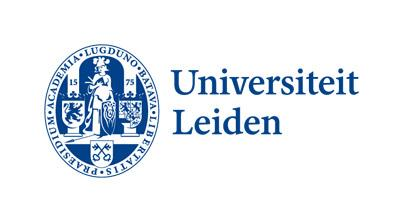

<!-- p. 1 -->

Derivational Morphology: New Perspectives on the

Italo-Celtic Hypothesis

Linguistics (Research): Structure and Variation in the Languages of the World Submitted for graduation in: 2014 Student: Tim de Goede First reader: Dr. M.A.C. de Vaan Second reader: Prof. dr. A. Lubotsky

<!-- p. 2 -->

## Table of contents

1. Introduction 3
2. Overview and general discussion of the suffixes 8
2.1 Suffixes containing a glide 11
2.1.1 (*)-i̭- 11
2.1.2 (*)-ṷ- 14
2.2 Suffixes containing a liquid 14
2.2.1 (*)-l- 14
2.2.2 (*)-r- 16
2.3 Suffixes containing a nasal 17
2.3.1 (*)-n- 17
2.3.2 (*)-m(n̥)- 18
2.4 Suffixes containing a dental stop or sibilant 19
2.4.1 (*)-t- 19
2.4.2 (*)-d(h)- 23
2.4.3 (*)-s- 24
2.5 Suffixes containing a velar stop 25
2.5.1 (*)-k- 25
2.5.2 (*)-g- 27
2.6 Suffixes containing a consonant cluster (inseparable) 28
2.7 Other suffixes 30
3. Detailed discussion of the suffixes 35
3.1 Suffixes containing a glide 36
3.1.1 (*) -i̭- 36
3.1.2 (*)-ṷ- 37
3.2 Suffixes containing a liquid 37
3.2.1 (*)-l- 37
3.2.2 (*)-r- 37
3.3 Suffixes containing a nasal 38
3.3.1 (*)-n- 38
3.3.2 (*)-m(n̥)- 39
3.4 Suffixes containing a dental stop or sibilant 39
3.4.1 (*)-t- 39
3.4.2 (*)-d(h)- 51
3.4.3 (*)-s- 52
3.5 Suffixes containing a velar stop 53
<!-- p. 3 -->

3.5.1 (*)-k- 53
3.5.2 (*)-g- 61
3.6 Suffixes containing a consonant cluster (inseparable) 61
3.7 Other suffixes 61
4. Derivational morphology in individual Italo-Celtic lexemes 63
5. Conclusion 67
Bibliography 72
Abbreviations 79
<!-- p. 4 -->

## 1. Introduction

The Italo-Celtic hypothesis was first introduced by Lottner (1861), who proposed it as an intermediate stage between the centum-branch of Proto-Indo-European (PIE) and the Celtic and Italic languages. Since its introduction, Italo-Celtic has always been a fragile theory, and it would be unwarranted to state that Italo-Celtic is a generally accepted pre-stage of the Celtic and Italic languages (nowadays). This is clearly reflected by the amount of scholars that have made contributions in favor of and against Italo-Celtic. Some refute the theory almost entirely, a few others are major supporters, but most linguists take a position in between, have not yet decided and/or refrain themselves from drawing any far-reaching conclusions from the arguments that have been adduced to the discussion. In addition, there is widespread disagreement concerning the exact nature of the Italo-Celtic (comm)unity. Bednarczuk aptly summarizes the controversial opinions that have existed among linguists as follows: “The Italics and Celts constituted a nation – their unity is a myth; mutual contacts were prolonged – they were short and early broken off; the common similarities between them are parallel – they are common innovations; [Italo-Celtic] common peculiarities originate from the PIE epoch – they are a result of later unity” (1988:176). This clearly indicates that we are dealing with a complex situation, and it would therefore be wise to approach the matter with caution. After Lottner’s proposal, the idea was gradually integrated into Indo-European linguistics. In the ‘early days’ it was supported mainly within the field of Celtic linguistics, by among others Pedersen (1909-13). The theory was most notably elaborated by Meillet, who adduced and reviewed several lexical, grammatical and phonological arguments in favor of Proto-Italo-Celtic and even assumed that the Celts and Italics once constituted a national unity (e.g. 1908; 1933). Since many of Meillet’s arguments have been topic of later discussions, he could well be viewed as the catalyst for the Italo-Celtic hypothesis. The theory was first criticized by Walde, who proposed a rather exceptional idea by reconstructing Proto-Gallo-Brittonic, Proto-Latin-Goidelic and Proto-Sabellic as the three pre-stages of Celtic (which derived from Proto-Gallo-Brittonic and Proto-Latin-Goidelic) and Italic (which derived from Proto-Sabellic and Proto-Latin-Goidelic), thus suggesting that Proto-LatinGoidelic split off into two groups which then merged with the two other groups, resulting in the Celtic and Italic branches (1917). Twelve years later, Marstrander published an article in which many of the arguments adduced by Meillet were criticized and the whole concept of a unity between the Celtic and Italic languages was rejected (1929). The discussion was eventually rekindled by Watkins (1966), who – in line with Marstrander – refuted the hypothesis entirely, criticizing most of the proposed common innovations of Celtic and Italic. According to Watkins, “the Italo-Celtic hypothesis is a myth. The only common language from which both Italic and Celtic can be derived is Indo-European itself” (1966:43-

44 ). Furthermore, he criticizes the common idea that shared innovations should be the main focus of

the linguist in discussions concerning the branching of language families. Instead, he advocates a balance between shared (positive) innovations, negative innovations (the elimination of certain

<!-- p. 5 -->

features), common retentions and divergences (1966:30-31). Watkins’ view gained support among linguists such as Vraciu (1969) and De Coene (1974), who were not alone in this. Four years after Watkins, Cowgill (1970) published an insightful, well-argued article that dealt with a couple of proposed Italo-Celtic isoglosses, predominantly focusing on the Italo-Celtic superlative in *-is-m̥mo-. The conclusions he drew from his findings were fairly moderate: “while hardly enough to establish a real sub-group, [they] do seem to require a time when Italic and Celtic were closer to each other than either was to any neighboring dialect of which significant material has survived. But this period of contact seems to have broken off very early” (143). This seems to have been the starting point for most linguists to adopt another approach to Proto-Italo-Celtic. Instead of a yes/no discussion about Italo-Celtic as a separate node within the Indo-European language family, the discussion became slightly more restrained. Since then, scholars have been gradually introducing new arguments (mostly shared innovations) and proposing different ideas about the nature of the relation between Celts and Italics (see Bednarczuk’s summary above). New – or in some cases renewed – arguments have been put forth by inter alii Hamp (1977-84) – lexicon; Kortlandt (1981; 2007) – predominantly phonology and verbal morphology; Joseph (1986) – lexicon; Bednarczuk (1988) – phonology, prepositions, conjunctions, verbal morphology and lexicon; Schrijver (1997) and De Vaan (in press) – pronouns; Jasanoff (1997) – verbal morphology and Weiss (2009; 2012) – phonology, verbal morphology and lexicon. Finally, several scholars have – in addition – addressed the issue of the nature the Italo-Celtic ‘unity’. Schmidt, who has extensively reviewed the implications of the proposed Italo-Celtic innovations on the nature, antiquity and duration of the contact between/unity of the Celts and Italics (e.g. 1992b), deserves a special mention in this respect. Some of the most prominent common innovations that have been proposed thus far and are still supported by many include inter alia the subjunctive in *-ā-, the thematic GEN.SG in *-ī, the assimilation of *p to a following *kʷ, the superlative in *-is-m̥mo- and the r-medial endings. In addition, a number of lexical correspondences are commonly recognized as Italo-Celtic. None of these similarities, whether they are ‘widely’ supported or not, are entirely undisputed. The lexical correspondences are generally prone to critique, because they are rather scarce and certainly not always irrefutable.1 Also, within the field of phonology and grammar not all correspondences are

equally striking, since some may be somewhat trivial or fairly universal in nature, such as the aforementioned assimilation of a labial stop (*p) to another labial stop (*kʷ). Also the r-medial endings, which turned out to have cognates in Tocharian, Phrygian and Anatolian, have been subject to controversy. However, due to contributions by Jasanoff (1997) and Kortlandt (2007), the medial endings are still a valid argument. Some additional possible Italo-Celtic correspondences that have been put forward include the phonetic development *CR̥HxC to CRāC in for instance Latin grānum

1 De Coene (1974) also considers them to be fairly ‘disparate’ and ‘isolated’ and sees it as a shortcoming that they are not combined around a specific semantic theme. I do not consider this to be a valid point of critique, because there is no reason to expect the lexical correspondences to belong to a specific semantic category.

<!-- p. 6 -->

vs. Old Irish grán (Kortlandt 1981; 2007), the prepositions *dē ‘from’ and *ṷr̥t ‘against’ (see Bednarczuk 1988 for a discussion), the elimination of pronominal forms in -t- (Schrijver 1997) and reduplicated – demonstrative – pronouns, a typologically rare feature shared by Celtic and Italic (De Vaan in press). There is hardly any denying that the Italo-Celtic hypothesis is fraught with difficulties. For starters, as mentioned above, many of the suggested correspondences between Celtic and Italic are disputed. In addition, there is major disagreement concerning the exact implications of the proposed correspondences for the nature, antiquity and duration of the linguistic contact/unity: many scholars who put forth arguments in favor of the theory, oppose the idea of a separate Italo-Celtic branch/national unity as proposed by Meillet. Also, the problems within the Italic branch should not be ignored: in some cases Oscan-Umbrian corresponds to Celtic, and not Latin, while elsewhere only Latin and not Oscan-Umbrian corresponds to Celtic, as Walde already pointed out (1917). Returning to the lexicon, another problem we encounter is not only the scarcity of shared lexical items2 as mentioned above, but also the borrowability of the lexicon. The lexicon is very susceptible to borrowing, which reduces the impact of lexical correspondences on discussions concerning hypothetical linguistic unities. Here the lexicon is part of a broader problem: the controversy concerning unity-or-contact. A key question in this matter is: what can be attributed to contact, and what should be ascribed to a period of actual unity? This not only concerns the lexicon, but most certainly also the grammar. This issue will be addressed in the conclusion. Despite the difficulties that surround the Italo-Celtic hypothesis, it is important not to lose track of the positive arguments and keep in mind that scholars have put forward compelling arguments – predominantly shared innovations – in favor of some kind of Italo-Celtic (comm)unity which cannot be ignored and should be explained in a satisfying way. The aforementioned necessity of a ‘balance’ between shared innovations, common retentions, negative innovations and divergences as advocated by Watkins (1966:30-31) is of minor importance in my opinion, since it does not eliminate the need to explain the convincing, non-trivial shared innovations. Furthermore, although common retentions may indeed be used as an argument, their value is simply quite hard to demonstrate. This is also pointed out by for instance Joseph, who states that “it is easier to satisfy oneself that two languages share the same change, since it could be an accident attributable to the incompleteness of our records that a particular form is retained in both but found nowhere else” (1986:119).3 The fragile Italo-Celtic hypothesis is, however, still in need of some fresh blood to strengthen its position. This may be provided by a hitherto somewhat neglected part of the grammar of Celtic and Italic: their nominal derivational morphology. I do not wish to state that derivational morphology has been entirely outside the scope of scholars. An important example would be the abovementioned superlative suffix *-is-m̥mo-, which has been reconstructed as Proto-Italo-Celtic. However, to my 2

## 3 This is in itself remarkable, considering the striking morphological correspondences between the languages.

For a more elaborate criticism of Watkins’ point of view, see also Schmidt (1992b:44-49).

<!-- p. 7 -->

knowledge no attempts have been made so far to meticulously and systematically compare the

inherited (PIE) and non-inherited (Italo-Celtic, or exclusively Celtic or Italic) aspects of their derivational morphology. This could be viewed as a shortcoming in the current discussion, considering that derivational morphology could prove to be a good source of common innovations and may therefore be a useful tool in this discussion. On the whole, derivational morphology tends to be fairly susceptible to change, which includes formal (including the creation of conglomerates), grammatical and semantic developments as well as the losing and gaining of productivity.4 This changeability could be of interest to the linguist: wherever there is change, there may be shared innovations to be discovered. It is known that among the derivational morphemes of Latin (the main representative of the Italic branch) and Celtic (represented chiefly by Old Irish and Welsh) there are a number of suffixes that cannot be traced back directly to PIE. In most cases, these suffixes consist of inherited morphemes, of which the meaning and use have changed, or which have been conflated with other morphemes. If we compare the nominal derivational morphology of the Celtic languages and Latin, Latin turns out to display a particularly large amount of non-inherited suffixes. This is confirmed by Lühr, who states: “Grundsätzlich fällt im lateinischen Lexikon die beträchtliche Anzahl von morphologischen Konglomeraten auf, die keine (genaue) Entsprechung in anderen indogermanischen Sprachen haben [...]. Sie müssen aber daher meist als Um-, Weiter- oder Neubildung ausgehend von ererbtem Material analysiert werden. Es ist wahrscheinlich, daß auch die Suffixe, deren Entstehung noch ungeklärt ist, aus ererbtem Material bestehen, z.B. -tūra, -gō, -tudo, -mōnia, -mentum, -idus, ōsus, -lentus, -ēnsis” (2008:1). This also applies to Celtic, though in general its derivational morphology tends to be more like PIE, with fewer conglomerates. Also, there are not as many suffixes of which the building blocks cannot be traced back to PIE. This is confirmed by among others Pedersen, who makes a general statement about this issue by saying that the “größte Teil der im Keltischen produktiven suffixe [...] aus dem Idg. ererbt [ist], oder durch Häufung verschiedener Idg. Suffixe entstanden [ist]” (1909-13 II:15). This thesis aims to fill the hiatus that has been left in the field of derivational morphology, by going over the nominal derivational morphemes of Celtic and Italic with a fine-toothed comb. In this way, morphemes are excluded and included as a ‘suspect’, which eventually provides us with a selection of putative shared innovations and in addition gives us a clear picture of the ways in which the language families differ with regard to their nominal derivational morphology. The following chapter (2) will be dedicated to this investigation of the derivational morphology. It serves to present an overview as well as brief but detailed discussions of the morphemes. Suffix conglomerates – i.e. complex suffixes consisting of two or more morphemes – merit extra attention because they are clearly straightforward innovations, and may therefore prove to be a fruitful source of both shared innovations and differences between the languages. Then, in chapter 3, interesting suffixes that have been

4 Such changes may sometimes be subtle and obscure, in other cases they are very straightforward.

<!-- p. 8 -->

extracted from chapter 2 will be discussed in further detail. In chapter 4, a number of selected etyma which may be interpreted as common Italo-Celtic developments will be discussed, specifically with regard to the nominal derivational morphemes that are involved. Finally, in chapter 5, conclusions will be drawn from the above. In addition, remarks will be made on the duration and nature of the contact between and/or common ancestry of the speakers of Proto-Celtic and Proto-Italic.

<!-- p. 9 -->

## 2. Overview and general discussion of the suffixes

### 2.0 Introduction

The nominal derivational suffixes in the languages involved – including reconstructed PIE forms – are almost exclusively consonantal. These consonantal elements may be preceded and/or followed by – stem – vowels and other elements. It is therefore practical to organize the suffixes in this overview on the basis of the consonant(s) around which the suffix is formed. These consonants may be either reconstructed or synchronic phonemes, depending on the reconstructability. When phonetic developments lead to a change of category (e.g. PIE *-ii̭V- > W -ydd, where the palatal glide i̭ changes into a geminated voiced dental stop), the oldest form or reliable reconstruction5 – if applicable –

determines the category. The classification of suffix conglomerates will be determined by the last identifiable derivational morpheme in the conglomerate. For instance, the reconstructed Italic conglomerate *-tiko- can be found in the category of velar suffixes. Naturally, a derivational suffix that is preceded or followed by some other apparent suffix does not necessarily need to constitute a suffix conglomerate, since this may (originally) have been a suffix added to a non-derivational root or stem vowel or consonant. This may not always be as straightforward. An example of this would be the formative -s- in Old Irish, which has many sources and is often the result of a dental, regardless of its original function, assimilating to a suffix that follows it. Many conglomerates that are beyond any doubt late Middle Irish, Middle Welsh or Latin formations are not included, since they are of little value to the current research. This also applies to (putative) suffixes that are rare, restricted to one language, clearly of PIE date, or suffixes that can hardly be analyzed as a derivational suffix (neither synchronically nor diachronically). Generally keep in mind that a part of the suffixes discussed here were not recognized as such anymore by the speakers in the attested stage of the language. If a given morpheme ceased to be productive at an early stage or in a pre-stage of the language, the derivational bases from which the suffix derived words are often hard to determine. Commonly, though, a most probable original function as a nominal or adjectival suffix (or both) can be deduced from the attested forms. It should be noted that the way in which the suffixes are organized in this overview is of secondary importance to the properties and origin of these suffixes. Putting together an insightful, practical – comparative – overview of the derivational morphology of (at least) three languages implies making difficult choices with regard to the classification of the suffixes. However, for purposes of transparency and in order to prevent confusion, cross-references will be provided when there may rise doubt with respect to the category to which a given suffix (conglomerate) should be 5 If there are several proposed reconstructions, a choice will be made for the apparently most commonly accepted reconstruction and cross-references will be provided in other categories. In case of a clearly or most probably heterogeneous origin, the synchronic shape of the suffix will determine to which category it is assigned. Also, it will serve as lemma. If there is some reason to make an exception to these criteria, a clarification will be made in a footnote.

<!-- p. 10 -->

assigned. The categories merely serve as a way to provide a clear overview in order to facilitate language comparison and I do not aim to make any strong statements about the history of a suffix simply by assigning it to a certain category. Lastly, I would like to point out that this overview only provides a brief discussion of the suffixes. A detailed discussion of a number of interesting suffixes from the Italo-Celtic point of view will follow in chapter 3, as explained in the introduction. For every suffix information will be provided on the following topics:

a) Grammatical and functional properties insofar these can be ascertained. This concerns the gender of derived nouns, their derivational bases (deadjectival, deverbal or desubstantival) and the question if the suffix derives adjectives and/or nouns. Of the adjectives only the masculine form is given. Properties that are beyond any doubt exclusively very late (Middle) Irish, (Middle) Welsh or Latin innovations are not included.

b) Semantics: at least the core semantic features are given, but in many cases more detailed semantic properties are provided. More aspects may also be adduced in chapter 3.

c) Productivity: information about the suffixes’ productivity will be provided mostly if it may be relevant for present purposes, i.e. if a suffix is exceptional in its (lack of) productivity. Old Irish will be the main representative of the Celtic languages, since this Celtic language is fairly well attested at a relatively old stage. In addition, (Middle) Welsh cognates are provided where available and relevant, and sometimes forms from other Celtic languages are given as well. Latin will represent the Italic languages. In general, it must be stated that the information about the properties and prehistory of the Latin forms is typically more extensive and less subject to doubt than the Celtic forms. There are a number of reasons for this, from which I take the following two to be the most significant. The first would be the size and age of the corpus, which are in favor of Latin. The second reason are the substantial phonetic developments in Old Irish and Welsh, which among other things blur the original morpheme boundaries and complicate reconstruction in general.

The categories in which the suffixes will be grouped together are as follows:

### 2.1 Suffixes containing a glide

#### 2.1.1 (*)-i̭-

#### 2.1.2 (*)-ṷ-

### 2.2 Suffixes containing a liquid

#### 2.2.1 (*)-l-

#### 2.2.2 (*)-r-

### 2.3 Suffixes containing a nasal

#### 2.3.1 (*)-n-

#### 2.3.2 (*)-m(n̥)-

### 2.4 Suffixes containing a dental stop or sibilant

<!-- p. 11 -->

#### 2.4.1 (*)-t-

#### 2.4.2 (*)-d(h)-

#### 2.4.3 (*)-s-

### 2.5 Suffixes containing a velar stop

#### 2.5.1 (*)-k-

#### 2.5.2 (*)-g-

### 2.6 Suffixes containing a consonant cluster (inseparable)6

### 2.7 Other suffixes7

A subdivision will be made for every category into A) suffixes that are directly reconstructable to PIE and B) suffixes that are not, or not directly, reconstructable to PIE. Within these subcategories the suffixes are ordered alphabetically. Category A) ‘reconstructable to PIE’ may be useful if there are interesting findings with regard to properties, semantics and productivity. If a suffix is reconstructable to PIE, the reconstruction will function as lemma, followed by the reflexes in the daughter languages. Also, general observations about, among other things, the function(s) and productivity of these inherited suffixes in Celtic and Latin will be provided. In most cases, subcategory A is smaller than B, since suffixes were often extended with other elements only after the PIE stage. Category B) ‘not (directly) reconstructable to PIE’ includes forms that are either nonreconstructable, reconstructable to either the language itself, Proto-Celtic, Proto-Italic or Proto-ItaloCeltic, or doubtful. Many of the (conglomerate) suffixes are descriptively analyzable and may very well contain PIE morphemes. If a suffix is formally reconstructable, but has an unexpected (additional) function, it will be given under category A with clear indication. Suffixes are categorized on the basis of their reconstructed – Proto-Celtic, Proto-Italic etc. – form (insofar this is possible). If there is a major degree of uncertainty with regard to the reconstruction, the synchronic form will serve as lemma (as stated above).

6 h

*-tlo-/-dlo-, *-nt-, etc. Clusters that are called ‘inseparable’ cannot be – readily – analyzed as a conglomerate or cons7tituted one morpheme synchronically and/or diachronically (as far as reconstruction is possible). This category includes among other things suffixes that are most probably or clearly suffixoid (in origin), borrowed suffixes that cannot be assigned to other categories and suffixes that cannot be separated, but do not contain a (reconstructed) consonant cluster either.

<!-- p. 12 -->

### 2.1 Suffixes containing a glide

#### 2.1.1 (*)-i̭-

### A. Reconstructable to PIE

*-(i)i̭o-8 In PIE: verbal adjectives (including future passive participles and gerundives), and desubstantival adjectives of appurtenance. Neuter and feminine nominalizations are often abstracts. OI -a(e) (< PC *-(i)i̭o-/-(i)i̭ā); W -ydd, -edd (< PC *-ii̭o- and *-ii̭ā). Deverbal adjectives (often of appurtenance), agent nouns, verbal nouns, nomina actionis and concrete nouns in Old Irish and Welsh. Feminine desubstantival collectives and deadjectival collectives are well attested in Old Irish (< *-(i)i̭ā). Clear meaning and function, largely comparable to PIE. Productive in all Celtic languages, exceptionally productive in Old Irish (often also in compound suffixes), less so in Welsh. Many nominalizations. In Celtic only *-ii̭o- was productive, although it in fact cannot be determined on the basis of Old Irish whether -(a)e is derived from Proto-Celtic and PIE *-i̭o- or *-ii̭o-. The same applies to Latin (see below). The case is different for Brittonic.9 L -ius: deverbal and desubstantival adjectives, deadjectival abstracts (mainly feminines), some deverbal and desubstantival abstracts, nomina actionis, collectives, nomina qualitatis, names of countries, patronyms and adjectives from prepositional governing compounds. Attested in many compound suffixes. Very productive and frequently nominalized. It cannot be determined from Latin alone whether -ius is derived from PIE *-i̭o- or *-ii̭o- (or both), but it is quite certain that most of its uses must go back to PIE *-ii̭o-. (BG 115-26; GOU 185-6; HCGL 274-6; LG 288-90; NWI 201-11; NWIG 1-3, 27-8, 62-4, 67, 96, 116-7, 119-20, 140; SWW 576; VGKS II 16-7)

*-ei̭o- L -eus: desubstantival adjectives of material and some colour adjectives, which are both inherited PIE functions. (GOU 186; HCGL 273-4; LG 286-7; NWIG 133)

8 In both Old Irish and Latin, the difference between original PIE *-i̭o- and *-ii̭o- is indistinguishable. For a few cases in which the difference may be discerned in Old Irish, see Balles (1999:79-9). For a short discussion of the prehistory of *-i̭o- and *-ii̭o- in the Indo-European languages and an in-depth study of the distribution in Brittonic, see Balles (1999).

<!-- p. 13 -->

### B. Not (directly) reconstructable to PIE

-aige10 (OI) Mostly derives agent nouns. Origins: PC *-sag-i̭o-s (< PC *sag- ‘to look for’) and *-i̭o- to ach-/ech-derivatives (mostly nominals of appurtenance). Cf. W - ai. (NWI 345-7, 370-4; SWW 287-90)

*-ai̭i̭o- (PIt.)11 L -eius derives agent nouns (rare) and gentilics. Any further connections are unclear. Rare variant: -uleius. (GOU 186; LG 289, 309; NWIG 20, 68)

*-āsii̭o- (PIt.) L -ārius derives deadjectival adjectives (without semantic distinction), desubstantival adjectives of appurtenance and agent nouns (the latter only masculine). PIt. *-āsii̭o- is not a PIE formation. It may consist of *-ii̭o- to the GEN.SG of ā-stems. Often nominalized. Nominalized -ārium (N) derives desubstantival toponyms. Nominalized -āria derives desubstantival agent nouns and toponyms. L -ārius borrowed as -(a)ire in Old Irish mainly for nomina actoris (M) and some agent nouns. Borrowing in Old Irish reinforced by Old Irish compounds in -aire ‘freeman’. The variant -m-aire may originate from nomina actoris that are derived from verbal nouns in -nm. The Old Irish suffixes -óir and -(a)tóir (masculine agent nouns) have been abstracted from younger Latin borrowings in -ārius and -ātōrem (ACC.SG of -ātōr). (GOU 186; HCGL 276-7; LG 297-300; NWI 347-50, 380-2; NWIG 40, 44-5, 53, 96-7, 120-1)

*-X-ei̭o- (pre-L) L -āneus forms deverbal and deadverbial adjectives. Possibly originally a conglomerate of *-no- and *-ei̭o- to stems in -ā. It has been somewhat productive. Does not share the basic sense of -eus, unlike -(i)neus and -āceus. L -āceus derives desubstantival adjectives of material. It consists of -eus to stems in *-āk- or *-āko-. Infrequent. L -(i)neus (an extension of -(i)nus with - eus) derives desubstantival adjectives of material. (HCGL 274; LG 287-8; NWIG 93-4, 107, 134-5, 140)

*-el-ii̭o- (pre-L) L -ilius derives desubstantival gentilics. Variants: -īlius, -iolus. It could be compared to OI -le/-la (masculine/feminine); W -lydd, both rather rare *ii̭o- extensions of *- lo- without any clear function. (NWI 227-8; NWIG 69)

*-idh-ii̭o- (PIt.) L -idius derives desubstantival gentilics. Variants: -edius, -īdius, -iedius. (GOU 190; NWIG 68)

*-i-gn-i̭o- (pre-OI) OI -éne and -íne are *i̭o-extensions of diminutives -én and -ín, with comparable properties – see section 2.7. (NWI 351-2)

1 0

## 11 Although this suffix has two different sources, it is grouped here because both reconstructions end in *-i̭o-.

When a suffix is clearly also attested in Umbrian and/or Oscan, the Proto-Italic reconstruction is given. Generally, in this chapter the Oscan and Umbrian reflexes will not be provided, unless they are of particular interest (e.g., when their function clearly deviates from Latin). They can be looked up in Buck’s A Grammar of Oscan and Umbrian (1904), abbreviated in this chapter as GOU.

<!-- p. 14 -->

*-ik-ii̭o- (PIt.) L -icius derives desubstantival adjectives (of appurtenance). Should be separated from -īcius. Probably an *ii̭o-derivative of nominalized -iko- derivatives. Late productivity. (GOU 188; HCGL 278; LG 301; NWIG 124-5)

*-īk-ii̭o- (PIt.) L -īcius forms deadjectival and desubstantival adjectives (with a minor or no semantic difference from its base). Might have spread from novīcius < PIE *noṷīk-ii̭o-. (GOU 188; HCGL 277-8; LG 301, 256; NWIG 99, 134-5)

*-ī̌n-i̭o- (PC) OI -(i)ne (mostly feminine); W -yn/-en (masculine/feminine). Averagely productive suffix for diminutives (especially singulatives) in Old Irish. Desubstantival diminutives are most frequent and oldest. Variant: -sine (various sources). The Welsh suffix is the common diminutive suffix in that language. (NWI 361-70; SWW 274, 277)

*-isiā̌ (PC) (< PIE *-es-i̭ā?). Attested in at least Gaulish. May also have been a source for Goidelic *-i̭ā > OI -ae. (NWI 457, 564; VGKS II 18)

*-it-iā (PIt.) L -ia extended with -it- with nouns derived from monosyllabic adjectival stems. Productive. Extension -itium not productive. (HCGL 301; LG 296; NWIG 28, 66)

*-mō(n)-ii̯ā (pre-L) L -mōnia/-mōnium forms abstracts (from all bases). It contains the rare PIE suffix *-mō(n) extended with *-ii̯ā. Only in old formations. (HCGL 277, 314; LG 297; NWIG 33-4)

*-nt-ii̭o- (pre-L) L -ntius consists of -ii̭o- added to -nt of the active participle. (HCGL 278)

*-od(i)i̭o- (PC) OI -(i)d(a)e; W -aidd (MW -eid). Derives desubstantival and deadjectival quality adjectives in both languages. This old suffix has been very productive in the history of Irish. It possibly consists of the adjectival do-morpheme with *i̭o-extension. (NWI 297, 357-60; SWW 467-84)

*-ti̭o- (Goid.) Section 2.4.1 (q.v.) 12

*-(a)-ti̭o- (PC) W -aid forms adjectives from various bases. May be related to the Old Irish participle suffix -the. It may also be the same suffix as W -aid deriving nouns (see section 2.4.1). (CCCG 331; GOI 440ff; SWW 465-6)

*-tōr-ii̭o- (pre-L) L -tōrius derives desubstantival adjectives from agent nouns in -tor. The neuter nominalization -tōrium is used in place names. (HCGL 275; LG 301; NWIG 25, 93)

1 2

Originally a to-formation, which went over to the *i̭o-stems at a later stage in the formation of participles and gerunds.

<!-- p. 15 -->

#### 2.1.2 (*)-ṷ-

### A. Reconstructable to PIE

*-ṷo- In PIE this suffix occurs in nouns and adjectives, but its original use and meaning are far from clear. It may have been deverbal. Its reflexes in the Celtic languages are miscellaneous labial phonemes. Unclear meaning and use in Celtic. Originally participle-like adjectives to verbal roots. In Old Irish mostly adjectives and some nouns. The Latin reflex -uus forms deverbal adjectives and colour terms. (BG 126-30; HCGL 297-8; LG 303; NWI 212-21; NWIG 90)

### B. Not (directly) reconstructable to PIE

*-(t)-īṷo- (pre-L) L -īvus derives deverbal, desubstantival and some deadjectival adjectives, of which the desubstantival function may be a later derivation from -tīvus with stems ending in -t. Rare. -tīvus is more common and derives deverbal and desubstantival adjectives. It is composed of the suffix -to- for verbal adjectives and the aforementioned *-īṷo-. (HCGL 298-9; LG 303-4; NWIG 91-2, 98, 125-6)

### 2.2. Suffixes containing a liquid

#### 2.2.1 (*)-l-

### A. Reconstructable to PIE

*-lo- This PIE suffix derived adjectives and nouns, especially instrument nouns and agent nouns. A diminutive function may also be reconstructed on the basis of at least Lithuanian, Latin and Germanic, where *-lo- was very productive in this function. OI -(V)l; W -(V)l. Oldest inherited type: adjectives from PIE verbal roots, as well as diminutives to some degree. In Goidelic there are a number of deverbal derivatives in *-lo-. Many (old) agent nouns in *-lo- have become concreta. There are also some instrument nouns in Goidelic. The feminine variant *-lā could be employed for nomina actionis (less common in Goidelic than in Brittonic). On the whole, bare *-lo- (without extensions) was not especially common in Celtic. Sometimes L -lus, mostly -ulus, with no difference in meaning. For more information see part B of this section. (BG 186-200; GOU 183-4; HCGL 279-80; LG 305-12; NWI 222-8, 455-6; NWIG 19-20, 23, 73-5, 89-90, 132; VGKS II 53-6)

<!-- p. 16 -->

### B. Not (directly) reconstructable to PIE

*-a-lo- (PC) OI -al; W -al. Resembles Proto-Celtic *-lo- in function, but contains a connecting vowel of unclear origin. The suffix mainly has appurtenance value and a (less common) diminutive function. It has not been very productive in Welsh and Old Irish. The suffix is also attested in Continental Celtic languages, where it has appurtenance value. (NWI 226, 455-6; VGKS II 53-4)

*-ā-lo- (PC) W -ol derives adjectives (although mostly combined with another suffix). Exceptionally productive. Another source is L -āle(m) and -ālis. (SWW 460, 549-50; VGKS II 54)

*-ēdō-lā? (pre-L) Latin words with -ēdula are possibly diminutives of -ēdō; acrēdula ‘a bird’. Rare. (NWIG 49)

-ēla (L) This suffix derives deverbal nomina actionis. It became productive in Latin; further analysis unclear and disputed. (HCGL 301; LG 312; NWIG 8-9)

-ell (W) Abstracted from Latin loans in -ellus/-a/-um. (SWW 355-62)

*-o-lo- < *-e-lo- (PIt.) L -ulus forms desubstantival and deadjectival diminutive nouns, verbal adjectives with agentive force and agent nouns. Rarely also desubstantival adjectives. It is derived from *-o-lo-, which goes back to *-e-lo- in most cases, a form which is attested in several Indo-European languages. Very productive (with a peak in Medieval Latin). Variant -Vllus < -lus to bases in r, l or n. Often – historically – a double diminutive *-Vlelos. The deverbal suffix -ulum is used for tool names. (BG 188; GOU 183; HCGL 279-80; LG 305-12; NWIG 73, 100, 132)

*-i̭ā-lo- (pre-OI) OI - á(i)l. See section 2.7 for all sources of OI -á(i)l.

-(t)ilis (L) L -ilis is functionally identical to -bilis, except for its ability to derive desubstantival adjectives. Where derived from -bilis it is a case of haplology, elsewhere its origin is possibly inherited *-li- (cf. also -īlis), an i-stem derivation of *-lo-. The suffix -tilis derives adjectives from perfect passive participles, which are also the source of the -t-. Some forms, however, probably originate from instrument nouns in *-tlo-. (GOU 188; HCGL 317-8; LG 347-8; NWIG 85, 87-8, 132)

-īlis (L) This suffix forms desubstantival adjectives. Originally it is *-li- to different stem types. -īlis, however, has become productive and has been extended to other stems as well. Nominalizations in neuter -īle denote animal pens. Variants: -(u)ēlis, -ūlis, -īris. (GOU 188; HCGL 319-20; LG 350; NWIG 121)

-illa (L) Desubstantival cognomina (feminines, rarely masculine). Probably borrowed from Gr. -ιλλα. Rare variants: -ella, -ulla. (LG 284; NWIG 71)

<!-- p. 17 -->

*-illo- (Gallo-Britt.) W -yll. Celtic formations include a group of animal (mostly bird) names. Possibly originally diminutives. Also attested in a number of Latin borrowings, originating from several different suffixes. (NWI 514; SWW 450- 53)

*-ko-lo-/-ke-lo- (PIt.) L -culus derives desubstantival diminutive nouns and deadjectival adjectives (including diminutives). It consists of the derivational suffixes *-ko- and *-lo-. Variant: -iculus (with stems ending in a dental). -culus is not to be confused with instrument nouns in -culus (< PIE *-tlo-). (GOU 183-4; HCGL 280-1; LG 306-8; NWIG 74, 101)

#### 2.2.2 (*)-r-

### A. Reconstructable to PIE

*-ro- This PIE suffix derived adjectives and – mostly concrete – nouns, predominantly from verbal roots. It has not remained productive in any of the daughter languages. OI -(V)r; W -(V)r derived deverbal adjectives. Nominalizations are common in both languages, there are very few original nouns. In Old Irish the words are mostly neuter, sometimes masculine and rarely feminine. The *ro- suffixes are not uncommon, but did not remain productive as an unextended suffix in Celtic. The Latin reflexes are synchronically non-derived (so non-productive) adjectival -er and -rus. Many nominalizations. (BG 169-70; GOU 188; HCGL 284-6, 315; LG 314-5; NWI 228-40; NWIG 81-2)

### B. Not (directly) reconstructable to PIE

*-a-ri- (pre-OI) OI -air. Deverbal, agentive? (NWI 454)

*-Xro- (PC) OI -ar/-er forms neuter collective nouns and is probably derived from *ro- suffixes. Cf. W -or (MW -awr), deriving desubstantival collectives, agent nouns and place names. Derived from Brit. *-ōro- and/or -āro- and L -ārius. The Welsh adjectival suffix -ar goes back to *-a-ro-, *-e-ro- and *-H-ro-. (NWI 316-21; SWW 421-26, 485-7)

<!-- p. 18 -->

### 2.3. Suffixes containing a nasal

#### 2.3.1 (*)-n-

### A. Reconstructable to PIE

*-no- This PIE suffix mainly derived deverbal adjectives and some nouns (which may partially have been nominalizations). Many adjectives have appurtenance value. OI -(V)n; W -(V)n mainly forms deverbal adjectives. In Old Irish it derives deverbal adjectives, some desubstantival adjectives and some colour adjectives. Not productive. The Latin reflex -nus mainly derives deverbal and desubstantival adjectives of material and appurtenance. Not productive. Allomorphs are - Vrnus (probably a misanalysis of r-stems), -turnus and -ternus (containing contrastive *-ter(o)-). (BG 130-53; GOU 185, 187; HCGL 287-8, 290-1; LG 320-1; NWI 249-59; NWIG 14-5, 131, 136, 138; VGKS II 56-7)

*-ti-no- L -tinus derives deadverbial temporal adjectives. Not frequent. Cf. Lith. dabartìnas ‘of the present’. (HCGL 288; NWIG 138-9)

### B. Not (directly) reconstructable to PIE

-iānus (L) This suffix forms desubstantival cognomina derived from gentilics (indicating family of origin). (HCGL 290; LG 325-6)

*-ī̌no- (PC) OI -en; W -in derive adjectives and nouns, most frequently adjectives from nouns denoting materials. It is possible that, originally, *-īno- (or rather the feminine *-īnā/-īniā, most frequently) was used for desubstantival nouns and *-ı̌no (*-no- to adjectival i-stems) for deadjectival adjectives. -īno- could go back to PIE -ih₁no-, an instrumental form. -īno- was a fairly productive and moderately frequent suffix in the Celtic languages. (NWI 459-60; SWW 516- 23; VGKS II 59)

-inus (L) This suffix derives desubstantival adjectives of material. Probably borrowed from Greek -ινος. Not productive. Variant: -ginus (to stems in -gō). (HCGL

287 ; LG 287; NWIG 97, 132, 135-6)

*-V̅no- (L) L -ānus derives desubstantival and deadverbial adjectives (among other things place names) and nouns (ethnics). -īnus forms desubstantival, deadjectival and also some deverbal adjectives (of appurtenance, of material), ethnics and animal names. Also, there are some adjectives derived from prepositional

<!-- p. 19 -->

phrases with this suffix. Both -ānus and -īnus were productive. Borrowed in Old Irish as -ín for diminutives. Variants: -tīnus and -cīnus. Feminine nominalizations in -īna are used for place names, as collectives, and denote female persons, work places (or practices) and meat names. -ūnus forms several desubstantival nouns and is derived from *-no- to u-stems (possibly deinstrumental). L -ōno-/-ā, particularly and most remarkably used to derive names of divinities, has a possible cognate in Proto-Celtic *-ǒnā̌ (especially frequent in Gaulish) for names of goddesses. See also chapter 3. (GOU 187; HCGL 289-90; LG 324-9; NWI 312-2, 452-3; NWIG 53-4, 58-9, 61, 69-71, 97, 129-30, 136, 139, 141)

-ō(n) (L) This suffix is used for (deverbal, desubstantival, deadjectival) personal (nick)names and characteristics. Synchronically it is one single suffix. According to Weiss (2009) -ō(n) diachronically goes back to two suffixes: the PIE thematic adjectival n-stem suffix *-e-/-on (in cases such as Catō ‘sharpy’ < catus ‘sharp’) and the individualizing “Hoffmann suffix” *-Hon-, which was added to nominal bases (e.g. āleō ‘gambler’ < ālea ‘game of chance’). (NWIG 16, 36, 40, 42; HCGL 309-10)

#### 2.3.2 (*)-m(n̥)-

### A. Reconstructable to PIE

*-mn̥- This PIE suffix mainly derived nomina actionis.13 OI -m, Gaul. -man, W -fa(n)14. This suffix derives nomina actionis in the Celtic languages. L -men derives nomina actionis and nomina rei actae, although it also occurs in some desubstantival formations. A (non-PIE) variant: -āmen. (GOU 183; HCGL 313; LG 370-1; NWI 241-3; NWIG 10, 35, 47; SWW 370-89)

*-m(h₁)no- In PIE this suffix derived middle-passive participles. OI -(a)main. Very rare as a participle suffix in Old Irish. However, there are many nomina actionis in Old Irish derived from old participles. In Latin (reflexes: masculine -mnus, feminine -mnia/-mina) the suffix did not partake in the formation of participles either. There are, however, some traces in Latin of deverbal formations. (BG 154-6; HCGL 291; NWI 436-8)

1 3

There has been discussion about the exact semantics of this suffix. See footnote 1 in De Bernardo Stempel (1999:241) for references to the literature.14 Also see section 2.7 for -fa < *magos.

<!-- p. 20 -->

*-(t)(m̥)mo- In PIE this suffix was engaged in several deverbal formations. *-mo- is particularly known as a suffix deriving participles and quasi-participial adjectives. Its feminine counterpart *-meh₂ derived agent nouns. *-(t)m̥mo-/- mo- probably derived ordinals and superlatives from adverbial bases. OI -(V)m formed deverbal adjectives. Feminine nominalizations function as nomina actionis. The suffix is present in all Celtic languages, but is not particularly frequent and mostly occurs in old formations. For *-m̥mo- see *-is-m̥mo- in chapter 2.7. In Latin, the suffix (with reflexes -mus, -ma) occurs exclusively in old forms. Nouns constitute the largest part of the examples. In addition, there is a group of adjectives. Insofar they can be identified, the formations seem to have been deverbal. For *-m̥mo- see *-is-m̥mo- in chapter 2.7. (BG 156-64; GOU 185; HCGL 286; LG 319-20; NWI 246-7; NWIG 14; VGKS II 60-1)

### B. Not (directly) reconstructable to PIE

*-mn-ā (pre-OI) OI -mon, which derives nomina actionis, is a relatively young formation. (NWI 248)

-em (OI) Rare Old Irish suffix deriving agent nouns. Generally reconstructed as the PIE deverbal suffix *-mō(n). However, in Old Irish the oldest formations are desubstantival o-stems. Also, Ogam *-iamo- is problematic as an intermediate stage. The origin may be *-i-sm̥Ho-s, originally used in comparative-like compounds. (NWI 391-3; VGKS II 61-2)

*-īmā (Proto-Britt.) W -i (OW -im) derives masculine verbal nouns and deadjectival abstracts. (SWW 390-3)

### 2.4. Suffixes containing a dental stop or sibilant

#### 2.4.1. Suffixes with (*)-t-

### A. Reconstructable to PIE

*-ti-15 This PIE suffix derived feminine nomina actionis and verbal abstracts. In Old Irish₁6, this suffix formed masculine verbal abstracts, nomina actionis and sometimes nomina agentis (a relatively young function). Originally the suffix was feminine, but the gender shifted to masculine in Old

1 5

The reflexes of the dental suffix in Old Irish and Welsh are too numerous to mention. In almost all cases it is a dental element (stop o16r sibilant), which may or may not be preceded by a vocalic element. The outcomes of the dental suffixes *-ti-, *-to- and *-tu- have various – dental – outcomes in the Celtic languages.

<!-- p. 21 -->

Irish. Deverbal adjectives occur, but are rare and often actually go back to *to-. Nomina rei actae are even less frequent. On the whole, there are significantly fewer occurrences of *-ti- than *-tu- in Celtic. Eventually, *-tiwas replaced by *-tā (feminine of *-to-) and *-tiō(n) in Insular Celtic. Latin -ti- derived feminine verbal abstracts. It was only marginally productive, at an early stage. (BG 276-90; HCGL 316; NWI 283-95; NWIG 14)

*-to- This PIE suffix derived participles and participial adjectives. Its feminine counterpart *-teh₂ was engaged in the derivation of desubstantival and deadjectival abstracts. This PIE suffix survived in Celtic to some extent, but is almost absent from Old Irish, since most of the original participle suffixes (including *-to-) were discarded in favour of the new Goidelic suffix *-ti̭o-/-ti̭ā (> OI -the) and *towei (> OI -(th)i). The latter specifically formed participles of necessity and was derived from the DAT.SG of *tu-verbal nouns. The Latin reflex -tus was regularly employed in the derivation of verbal nouns and perfect passive participles. In addition it derived desubstantival possessive adjectives and ordinals. L -tā was not common and used to function as a suffix deriving desubstantival and/or deadjectival abstracts. (BG 205-28; GOU 189; HCGL 292; LG 333-5; NWI 431-46; SWW 345, 488).

*-tu- In PIE this suffix derived masculine verbal abstracts and nomina actionis. In the Celtic languages, the suffix formed masculine (rarely neuter) verbal abstracts and nomina actionis. It was fairly productive. The Latin reflex is -tus. It has the same functions as in Celtic (though in addition it could derive desubstantival adjectives). The suffix was fairly productive. (BG 304-12; GOU 185; HCGL 322-3; LG 353-5; NWI 287-95; NWIG 6)

### B. Not (directly) reconstructable to PIE

-adwy (W) This suffix forms deverbal adjectives (gerunds). It is an expanded tu-formation with generalized -a- (SWW 461-4).17

1 7

Balles reconstructs the suffix as *-atoṷi̭o- on the basis of Cornish and Welsh (1999).

<!-- p. 22 -->

*-(i̭)ak-tā (PC) OI -acht/-echt (mostly feminine); W -(i)aeth. Originally a conglomerate of *- tā to suffixes in *-ak(V)- (> OI -ach) or a derivation of the verbal root *ag- ‘to drive’. This Proto-Celtic suffix derives desubstantival abstracts and collectives. (HWV 208-9; NWI 334-6; SWW 553, 576; VGKS II 32)

*-(i̭)a-ti- (Insular Celt.) OI -(th)id; W -iad is a productive Insular Celtic suffix that derives masculine agent nouns. Also, there are some desubstantival formations. It goes back to agentive *-ti- with connecting vowels. Not unproblematic: is i̭ part of the base? It is possibly connected with Continental Celtic -atis/-ates, which among other things derives ethnics (and may be connected to L *-āti-). W -iad is derived from both *-i̭a-tu- (forming abstracts) and *-i̭a-ti- (forming agent nouns). See chapter 3 for a discussion. (NWI 294, 375-80; SWW 551)

*-āti- (PIt.) This suffix derives masculine and feminine desubstantival ethnics and the words cuiās ‘of what country?’ and nostrās ‘of our country’ from pronominal stems. Its origin is disputed: borrowing from Etruscan (NWIG 72); Italo-Celtic because of the connection with Continental Celtic ethnics in -atis/-ates (HCGL 316-7) or borrowed by Latin from Continental Celtic (NWI 378)? See chapter 3 for a discussion. (GOU 189-90; HCGL 316-7; NWI 378; NWIG 72)

*-a-ti-on (Proto-Britt.) W -aid (MW -eid/-eit)18 derives desubstantival nouns of the type ‘a X-ful, a full X’. A Brittonic conglomerate *-a-ti-on (*-ti- with a thematic vowel, inflected as a neuter) is a possibility (SWW 291-4). Another possibility is *- ati̭os/-ati̭ā, cf. the suffix -aid for adjectives above (WG 143), see also HWV 89, 110. It is possibly related to OI -tiu/-siu, see below (cf. HWV 89).

-(h)ed/-(h)et (W) W -ed (MW -et) should be distinguished from W -(h)ed (MW -(h)ed). The former derives deverbal and desubstantival feminine abstracts and includes some old participles from Proto-Celtic *-Vto-. The latter derives regular equatives, possibly going back to PC *-is-e-ti/-tu- containing the comparative formative *-is-. The equative formation requires a prefix cyn-. (GOI 237-8; SWW 345-54, 455, 488-96)

-iet- and -et-/-it- (L) Desubstantival formations (masculine and feminine). Rare. (LG 373; NWIG 48-9)

-ithir/-idir (OI) This suffix derives equatives. The connection with the W equative -(h)et/- (h)ed is problematic. Both may have been derived from PC *-is-et-. The r is hard to explain. (GOI 237-8; VGKS II18-9)

*-V/V̅-t-V/V̅- (PC) W -id forms abstract nouns and adjectives (rare). It goes back to PC *-ī-to/ā/u. W -od (MW -awd) for deverbal abstracts and collectives is derived from PC *-

1 8

To be separated from W -aid forming adjectives, see section 2.1.1.

<!-- p. 23 -->

āto- (old participles) and *-ātu- (verbal nouns). Also abstracted from Latin loans containing -ātus, -ātu(m) or -ātio. The suffix -yd forms deverbal and desubstantival abstracts and is derived from PC *-itV-. For W -ed < *-Vto- see above. (SWW 412-20, 434-9, 443)

*-X-tā- (pre-OI) OI -V̅s forms adjectives and is derived from *-tā added to roots in a dental. Also, there are some cases of verbal abstracts that go back to *-s-tā. A final source are verbal adjectives ending in a dental + *-to-. The suffix was productive. (NWI 336-7)

*-Vtā (PC) OI -ad forms desubstantival (and some deadjectival) abstracts. It originates from PIE *-tā preceded by connecting vowels. (NWI 333-4)

*-tāt- (PIt.)19 L -tāt- derives feminine deadjectival and deadverbial nomina qualitatis and abstracts, as well as desubstantival names of offices and social rank. It is the most productive suffix for nomina qualitatis in Latin whatsoever. Welsh probably abstracted -dod/-tod (MW -dawt) from Latin loans (< ACC.SG -tātem) at an early stage. It derived deverbal and desubstantival abstracts in older Welsh (and was used in genuinely Celtic formations as well). Later occurrences are restricted to Latin borrowings, however. (GOU 185; HCGL 304; LG 373-5; NWIG 26-7; SWW 321-4)

*-(V)-ti-(H)ō̌n (PIt./PC) OI -t(i)u forms feminine verbal nouns and is derived from PC *-tiōn, which may be a conglomerate of PIE *-ti- (verbal abstracts) and some other element, possibly the individualizing stem formant *-on- or the “Hoffmann suffix” *- Hon-. The function of the suffix corresponds to PIE *-ti-. The suffix replaced older *-ti- in Old Irish. W *-tīnV- for verbal nouns may be related, as a weak stem of *-ti-Hon-. This could then be compared with O/U *-tiHn-. L -tiō(n) derives feminine deverbal abstracts and may also be related to OI -t(i)u. As in Old Irish, it replaced older *ti-formations. The variant - ātiō(n) derives feminine deverbal and desubstantival abstracts, nomina actionis and collectives. This subtype of -tiō(n) originates from ā-verbs. Productive, not frequent. (GOU 182; HCGL 311-2; HWV 218; LG 366-7; NWI 393-5; NWIG 5, 60) 20

*-V/V̅-to- (pre-L) The suffix -ūtus forms deadjectival adjectives (without semantic difference) and is rare. The nominalized neuter -tum is employed for desubstantival collectives and is not productive. A variant of this suffix is -(c)ētum (rarely with -c-), predominantly denoting plants and trees (possibly originating from participles to second conjugation ē-statives). Other to-variants: -itus (with ē-

1 9

## 20 For a discussion of the PIE connections (together with *-tūt-) see chapter 3.

For a more detailed discussion see chapter 3.

<!-- p. 24 -->

verbs), -ātus (from ā-verbs) and -ītus, -ōtus, -ūtus (with plausible deinstrumental origin). (HCGL 292-4, 442-3; LG 333-5; NWIG 65, 91, 97, 112)

*-X-tu- (PIt.) A subtype of -tus (< *-tu-) is -ātus, originating from ā-verbs. It specifically denominates offices and forms possessive adjectives and pronominals. Other variants: -itus (after roots with structure CERH) and -ultus (from verbs in - ulāre). (GOU 185; LG 353-5; NWIG 6, 59-60)

*-X-tu-(X)- (pre-OI) OI -(i)us/-es derives deadjectival abstracts. Originally a conglomerate. Possibly *-es-tu- (GOI 166), but there is little motivation for this. A conglomerate of the feminine adjectival suffix for monosyllabic thematic adjectives -as with *-tu- is also an option (NWI 389-90). In later forms -(u)s serves as an extension of tu-abstracts. OI -as/-es derives masculine nomina essendi. Its history is problematic. The most plausible reconstruction would be < *-assu < *-ad-tu, i.e. the collective suffix *-ad- with *-tu- for verbal abstracts. Younger forms are confused with -us, another u-stem suffix (employed for the derivation of adjectives). In Brittonic the suffix -as/-es (masculine in Breton, feminine in Welsh) is also present and has roughly the same use and meaning. Specifically Old Irish are the – rarer – deadjectival and deverbal derivations. (NWI 401-22)

*-(V)tūt(V)-21 (L, PC) OI -etu, -atu mainly forms masculine deadjectival nouns. The first part of the

suffix may be derived from PIE *-tu- (for verbal abstracts) preceded by some vocalic element. The second part is problematic. It could be *-ō̌t-s of the dental stems (NWI 396-9). SWW reconstructs the related weakly productive Welsh suffix -did/-tid as PC *-tūto- or *-tūti- (319-20). The suffix is also attested in Latin and Gothic. NWI states that is could have arisen in IC and was taken over by Germanic afterwards (which, in view of other isoglosses, would not be uncommon) (396). L -tūt- formed feminine desubstantival (and maybe deadjectival) abstracts. It had nearly the same function as -tāt- and was not productive. (HCGL 304; LG 375; NWI 396-9; NWIG 66; SWW 319-20)

#### 2.4.2 (*)-d(h)-

### A. Reconstructable to PIE

*-d(h)- OI -d. Unclear origins and properties. The same applies to Latin reflexes of *- d(h)-. (BG 382-4; HCGL 304-5; NWI 295-6).

2 1

For a more detailed discussion (together with *-tāt-) see chapter 3.

<!-- p. 25 -->

*-do- Possibly inherited. Cf. L crūdus ‘harsh’, OI cruaid ‘hard’. Also see section

#### 2.1.1 for *-od-(i)i̭o-, a *i̭o-extension of this suffix, and section 3 for a more

detailed discussion of the *(V)d(h)(o)-suffixes. (BG 382-4; NWI 296-8).

### B. Not (directly) reconstructable to PIE

*-id(h)o- (PIt.) L -idus derives deverbal, deadjectival and desubstantival adjectives. It is not attested in other PIE languages. Old formations, synchronically mostly non- derived. (HCGL 291-2; LG 329-30; NWIG 82-3, 127)

*-X-dō(n)- (pre-L)22 The suffix -ēdō occurs in feminine deverbal and deadjectival formations and

denotes conditions of physical or mental discomfort. Derived from verbal stems in -ed. Not productive. -īdō (n-stem to original verbal stem) forms feminine verbal abstracts. Not productive. -tūdō forms feminine deadjectival abstracts. Origin unclear, possibly an extension of -tūt-. Productive in older Latin. The suffix -ūdō has an unclear function and origin. (HCGL 312-3; LG 367-8; NWIG 14, 30-1, 32, 38-9).

#### 2.4.3. Suffixes with (*)-s-

### A. Reconstructable to PIE

*-is, -i̭ōs Inherited comparative. OI -iu; L -ior. *-is originally an allomorph in monosyllables and yields OI -a. OI -a for polysyllables developed within OI. The inherited comparative is productive in both languages. (BG 399-410; HCGL 355-8; LG 495-9; NWI 423-4; NWIG 102)

### B. Not (directly) reconstructable to PIE

*-ās(i)a (Proto-Britt.) W -os forms collectives and diminutives. It may be a genuine Brittonic formation, or a borrowing from Latin -āsia (see section 2.1.1). (SWW 444-5)

*-assā (PC) W -as derives abstract nouns. Early loss of productivity. (SWW 302-3)

-ēs (L) This suffix derives feminine verbal abstracts. Origin unclear, diachronically several origins. (NWIG 12).

*-issā (Cont. Celt.?) OI -es derives feminines from masculine nouns. Not productive. W -es (with equal function, but very productive) may have been the source of OI -es. It can be traced back to Proto-Britt. *-issā. The same suffix seems to occur in Gaul. - issa (feminine of -issus), used in personal names. OI -es and/or W -es may both be borrowings from Continental Celtic. Can Gaul. (*)-issa only be traced

2 2

Complex n-stems.

<!-- p. 26 -->

back to *-issā, feminine of *-isso, or further back to *-istā, feminine of *-isto (superlative)? The suffix may also be of Latin origin, which in turn borrowed it from Gr. -ισσα. (NWI 337-41; NWIG 59; SWW 363-9)

-nes (L) An s-stem of the suffix *-no-. Mainly employed for nouns involving exchange and commerce. (HCGL 307)

*-ōs (PIE) L -or/ōr/ōs forms masculine verbal abstracts, nomina actionis and deadjectival nomina qualitatis. Processes of shortening and analogy yield the given variants. (HCGL 307-8; LG 377-81; NWIG 7, 34-5)

*-so- (PC) Rare suffix, occurring in a few Proto-Celtic formations (with some PIE connections). It seems to have been active as an adjectival suffix in Old Irish at some point. In many cases s is the result of assimilations, however. The suffix is probably not of PIE origin (cf. BG, where such a suffix is not mentioned) (NWI 260-2).

-us (W) This suffix forms adjectives and is derived from L -ōsus23 and -usus. No Proto-Celtic etymology is known. (SWW 534-49)

### 2.5. Suffixes with a velar stop or fricative

#### 2.5.1 (*)-k-

### A. Reconstructable to PIE

*-ko- This PIE suffix was engaged in the derivation of deadjectival and desubstantival adjectives (sometimes with appurtenance value, or adding a meaning ‘something like the referent’) and probably also in the formation of deverbal adjectives. The velar suffixes are common in the Indo-European dialects, but differ greatly in their productivity.24 OI -c < *-ko- is attested in deverbal adjectives (including nominalizations thereof) and some deadjectival adjectives, although the derivational bases are not always clear. Bare *-ko- was not productive in the stage of Proto-Celtic. The Latin reflex -cus forms desubstantival and deadjectival adjectives, as well as ethnics. The formations without extensions were not productive. (BG 236-60; CWF 8; HCGL 294-5; LG 336-41; NWI 311-3; NWIG 107, 119)

2 3

## 24 For L -ōsus see section 2.7.

See Russell (1990:8).

<!-- p. 27 -->

### B. Not (directly) reconstructable to PIE

-ach (W) This suffix has four different origins and several functions: it forms diminutives and pejorative nouns and adjectives (< PC *-akko-), desubstantival abstracts (< PC *-akso-) and comparatives (< PC *-a-k-is-o-) and has been abstracted from loans from Old Irish ending in -ach (for its origins see below). (NWI 520-1; SWW 274-5, 460)

*-k(u) (OI, L?) OI -c; L -cu. Occurs in words such as OI losc ‘lame’, trosc ‘leprosy’ and L raucus ‘hoarse’, plancus ‘flat-footed’ and mancus ‘having a maimed hand’. Its origin is unclear.25 (HCGL 295)

*-(tr)-īk- (pre-L) L -trīx is the feminine variant of the agent noun suffix -tor. It consists of -tr- and the PIE devī́-suffix *-ih₂ with *k-extension (so *-trih₂-k-s). -īx (with an extended form -īceus) is basically an allomorph of -trīx, though is also found in some loanwords. For -tor see section 2.7. (HCGL 305-6; LG 375-6; NWIG 15, 45, 50-1 58).

*-V/V̅-k-26 (PC, PIt.) In Celtic, *-ik- was not infrequent and derived nouns. *-āk- is attested in Celtic as well, but was not as common. L *-āk- mainly derives deverbal (agentive) adjectives and some desubstantival adjectives. It has an extended form in -āceus (cf. -īx and -īceus) < *-āk-ei̭o-. The suffix -ācus occurs in several deadjectival adjectives and is possibly a thematization of *-āk- (i.e. *-āko-). Not productive. *-ek- mainly forms pejorative nouns. It is hardly possible to determine what the pre- weakened vowels of this suffix were due to analogical remodeling on the basis of nouns of the artifex, artificis type. (GOU 188; HCGL 274, 295, 305-7; LG 376; NWIG 88-9, 107, 112-3; VGKS II 98-100).

*-V/V̅-ko- (PC, PIt.) OI -ach, -ech < PC *-ā̌ko-, *-ī̌ko-27 originally and mainly derived desubstantival possessional adjectives and adjectives of appurtenance, as well as some nouns from various bases. W -og (< *-āko-), -ig28 (< *-īko-) and the rare suffix -yg (< PC *-iko- and L -icus/-icius) correspond functionally to the Old Irish suffix. Welsh also has a feminine suffix -eg (< PC *-ikā and/or L *- icā) which mostly forms nouns (and may be nominalizations of original 25

## 26 See chapter 3 for a discussion.

## 27 Here, the non-thematic suffix *-k- with extensions is discussed. For L *-ōk- see section 2.7.

The history of OI -ach/-ech is blurred: the variant -ech may originate from *-ī̌ko- or even *-i̭ā̌ko- and in addition, many or even all occurrences of -ech must be ascribed to the general spread of palatalized stem variants in Old and Middle Irish. Also, *-ach and – indirectly – -ech may go back to other suffixes, such as *-ū̌ko- and theoretically *-ō̌ko-, since the quality of unstressed vowels did not remain consistent in Old Irish. The Welsh suffixes present a clearer situation and are therefore more helpful in discovering the prehistory of the Celtic suffix28 system (Russell 1990:29-30). There is also a diminutive function of W -ig. This function is not attested for Old Irish. Another source for W ig is L -īc(i)us/-īc(i)a/-īc(i)um (Zimmer 2000:506, 514-5).

<!-- p. 28 -->

adjectives). The *V/V̅ko-formations are very productive in Celtic as a whole. Celtib. -aiko- is derived from PC *-ak(o)-i̭o-. The Old Irish diminutive and hypocoristic feminine suffix -óc is borrowed from Britt. *-ōg(o-/-ā) < PC *āko-/-ākā. Later it came in use for deriving appellatives, probably under the influence of the homophonous Old Irish word óëc ‘young’. OI -uc is a rarer diminutive (and appellative) suffix, mostly – not always – combined with -án to -ucán. It could very well be a loan29. For a separate suffix -ac and -ic there is hardly any evidence. There are several correspondences in Latin. The Latin suffix -īcus and -ūcus (neither of which were particularly productive) form deverbal adjectives (for -ācus s.v. *-V/V̅-k-) -īcus may be deinstrumental in origin in some desubstantival forms (HCGL 296).30 -ūcus appears to have been agentive in origin (NWIG 96). -icus31 forms desubstantival (genitival) adjectives, especially pertaining to the socio-political sphere. It also derives adjectives of appurtenance. According to NWIG many forms are analogical after Greek, which has a suffix -ικος (123). (CWF 98; HCGL 294-6; LG 336-41; NWI 327-33, 457, 463-4; NWIG 57, 96, 123; SWW 448-9, 497-505, 506-15; VGKS II 29-31; WG 231-3, 256-7)

*-ti-ko-? (pre-L)32 L -ticus derives desubstantival and deverbal adjectives. It may originate from

*-ti-ko- (or *-t-iko-?) and could be an allomorph of -icus. It is often preceded by -ā- (generalized from ā-stems), yielding -āticus. It is most probably not formed analogically after Greek -τικος (NWIG 124). See also chapter 3. The neuter nominalization -āticum is used to denote fees and charges. (HCGL 295; LG 336-42; NWIG 66, 92, 124)

*-(V)t-īk(ii̭)o- (?) OI -thach/-thech; W -etic/-edig. Cf. L -(t)īcius.33

#### 2.5.2 (*)-g-

### A. Reconstructable to PIE

(none)34

29 Theoretically, it could be derived directly from PC *-ū̌ko-, but the consistent quality of the vowel points to a non30-inherited origin, possibly Brittonic (De Bernardo Stempel 1999:332; Russell 1990:116).

## 31 This may also be the case for some of the long vowels in the Celtic suffix, but cannot be readily determined.

The -i- in this *ko-suffix may originate from misanalyzed i-stems, as Weiss (2009:294) proposes. This would then have happened already in PIE. Cf. also the Celtic formations.32 Although it may theoretically have existed, it is not possible to reconstruct a suffix *-tiko- for Proto-Celtic, see Russell 1990 (10333-8). See chapter 3 for a discussion. The arguments and considerations are too numerous to include in this overview.

<!-- p. 29 -->

### B. Not (directly) reconstructable to PIE

*-gā (pre-OI) Very few examples, hardly reconstructable. There are no inherited suffixes with original *-gw which it may be traced back to. (NWI 314)

-gō/āgō/ūgō/īgō (L) Feminine deverbal, desubstantival and deadjectival nouns. Origin unknown. Denotes plants, diseases, growths or deposits on surfaces and forms nomina qualitatis, depending on the variant used (also, some are rather deverbal than desubstantival or vice versa). (HCGL 313; LG 368; NWIG 13, 32, 39, 55)

### 2.6. Suffixes containing a consonant cluster (inseparable): *-tlo-/-dhlo-, *-nt- etc.

### A. Reconstructable to PIE

*-isko- This PIE suffix probably derived nominals of appurtenance and is probably connected to *-sk(o)- (see below). OI -sc; W -wch. Not particularly productive in Old Irish. An Old Irish example would be óisc ‘young ewe’ < oí ‘sheep’. W -wch is a regular suffix deriving deadjectival masculine nouns. There is no conclusive evidence for this suffix in Latin. (BG 258-60; NWI 278; SWW 427-33; VGKS II 19)

*-nt- This is a PIE suffix that derived present participles. It is represented in Old Irish by -Vt, though only in archaic formations and rarely as an actual participle suffix. W -iant (*-nt- to stems in *-i̭-) is a productive suffix that derives verbal abstracts and nomina actionis. In Latin, -nt- is the regular present participle suffix. (BG 370-9; HCGL 436, 534; NWI 259, 431-46; SWW 394-404)

*-tlo-/-dhlo- This PIE suffix derived instrument nouns. OI -Vl or -Cl (sometimes feminine, otherwise neuter); W -dr < *-tro-. In Old Irish *-tro- is probably mostly thematicized *-tor-/-tér-, but some others are indeed allomorphs35 of *-tlo-. There are a number of Latin reflexes. L -trom/-strom (neuter, rarely feminine and masculine), deriving deverbal instrument nouns, goes back to *- tlo(m)-, of which -strom is an allomorph (with s-extended bases or final dentals). It only survives in old forms. -c(u)lum/-crum derives neuter deverbal

3 4

See Brugmann (w1892:260h-1) for an overview of some forms in Indo-European languages that may be traced back to *-g-, *-g- or *-ǵ-. If the suffix had existed, it was probably an allomorph of suffixes containing *k. See also Olsen (2003:194).35 The Old Irish and Latin allomorphs with -r- instead of -l- are the result of dissimilation.

<!-- p. 30 -->

instrument nouns and place names and also goes back to PIE *-tlo-. Productive. -bulum, -brum < *-dhlo(m)- has the same function as -culum, but may also occur in desubstantival formations. Infrequent. The feminine -(bu)la is rare. Finally, the suffix -bilis, -bile (engaging in deverbal formations) may be derived from *-blo- (< *-dhlo-). Uncertain though. (BG 200-3; HCGL 281-4, 318; NWI 298-31; NWIG 21-3, 51-2, 84-5; SWW 441)

*-sk(o)- This PIE verbal suffix (deriving iteratives) also occurs in some nominal formations. It is respresented in Old Irish -sc. It is also used for the derivation of (predominantly deverbal) adjectives (often pejoratives), which is an innovation. The Latin reflex -scus is rare. (BG 258-60; NWI 275-8)

### B. Not (directly) reconstructable to PIE

-ēnsis (L) This suffix derives desubstantival adjectives (mostly from place names). No plausible PIE or Proto-Italic source. Productive. Variant: -iēnsis. (HCGL 320- 1; LG 352-3; NWIG 128-9)

*-X-nd-V- (L) L -ndus mostly derives gerundives (originally < *-dno-). Variant: -cundus, where the -c- is synchronically an epenthetic linking consonant (originally < se-cundus?). Other variants: -undus, -endus. L -bundus derived imperfective deverbal adjectives It is probably a gerundive added to the b of the imperfect or future. It is very improbable that the cluster -nd- in OI cruind ‘round’ is related to L -nd- in rotundus ‘round’. (HCGL 299; LG 330-3; NWI 258; NWIG 83-4)

*-nt- (PIE)36 OI -(n/th)at/et forms diminutives (-that only with inanimate referents, -nat in

plant names), originating from inherited *nt-participles that went over into āstems. OI -et (-at, -it) is also a rare archaic suffix for neuter adjectival abstracts. L -ānt forms deadjectival (without semantic difference) and desubstantival adjectives. (LG 583; NWI 341-3; 399-400; NWIG 97, 117)

-(ā)ster/-stri- (L) The suffixes -(ā)ster, deriving desubstantival pejorative nouns, and -ster/-stri-, forming deadjectival and desubstantival adjectives (for places) synchronically

3 6

Included here are the non-PIE formations and uses.

<!-- p. 31 -->

partially overlap. -ster/-stri- is possibly a misanalysis of -tris added to bases ending in -s or a dental. Originally both may be related to the contrastive suffix *-t(e)ro-. The two forms -(ā)ster and -stri- may also not be connected. (HCGL 286, 320; LG 318-9, 351-2; NWIG 76-7, 107, 126-7)

### 2.7. Other suffixes

### A. Reconstructable to PIE

*-(t)m̥mo- This suffix occurs in PIE formations with elative meaning. Originally there was possibly an opposition between contrastive *-tero- vs. superlative *-m̥mo- (which explains the respective allomorphs *-ero- and *-tm̥mo-). Then, *- (t)m̥mo- may have been a part of the Proto-Celtic and Proto-Italic superlative *-is-m̥mo- (see the discussion below, and in chapter 3). In both Italic and Celtic there are several older formations with *-tm̥mo- or *-m̥mo. (BG 156-9, 166-9; NWI 429-30)

*-(t)ero- This PIE suffix had contrastive value. OI -tar, -ter; W -der. In Celtic often still a contrastive suffix. Generally derives deadjectival abstracts in Welsh. In Old Irish it has more specific functions, e.g., denoting place or position. In Old Irish there are some attestations of *-is-tero- > OI -ser/sar. There are also some Celtic desubstantival formations in *-tero- (which are supposedly of PIE date), e.g. muinter ‘household’, cf. L mātertera ‘maternal aunt’. The rare Latin desubstantival suffix -ter-, -tera is probably derived from *-ter(o)-. (BG 177-86; NWI 304-10, 425-6; NWIG 49; SWW 304-18).

*h₃okw- Some original Old Irish compounds contain *-kw < *(h₃)okw- ‘eye’, sometimes

suffixoid. L *-ōk- has the same origin and derives deadjectival adjectives (e.g. ātrōx ‘fierce’ < āter ‘black’). L -inquus occurs in two Latin adjectives derived from locational adverbs. It continues PIE *-(e)nkwo-. (HCGL 296, 306; LG 340; NWI 314-5; NWIG 107)

*-o-ṷent-o- L -(u)lentus forms desubstantival adjectives. Most probably derived from the PIE possessional adjectival suffix *-ṷent- with dissimilation after a stem

<!-- p. 32 -->

containing a rounded segment, resulting in the l. (HCGL 297; LG 336; NWIG 111)

*-tor-/-tér- This PIE suffix derived agent nouns. In Celtic there are only few attestations of this suffix. However, a thematicized form *-tr-o- did exist in at least Welsh and Old Irish. L -tor/sor derives masculine agent nouns. Secondarily, some desubstantival formations occur. For the feminine -trīx see section 2.5.1. (BG 353-65; HCGL 305; NWI 129, 304-10; NWIG 15, 45, 58).

*-ṷō̌s/t- A PIE participle suffix, scarcely attested in Old Irish and Welsh. (NWI 438-9)

### B. Not (directly) reconstructable to PIE

-aeus (L) This suffix derives desubstantival adjectives. It is a Greek loan (< -αῖος). (NWIG 130-1)

-ain(t) (W) This suffix forms desubstantival abstract nouns. Origins: PC *-an-ī (feminine of n-stems), *-ant-ī, *-ant(i)i̭o- and possibly *-enios. (SWW 295-301)

-á(i)l (OI) This suffix derived nomina actionis. It was particularly productive in Middle Irish. Several sources: PC *g(h)ab(h)-ag(h)lā (which is comprised of the root ‘to

take, hold’ twice, but the second part is derived from the corresponding verbal noun), which replaced original *g(h)ab(h)-lo-. Other sources: OI dál (< PIE *dheh₁- ‘to put’ or *deh₂- ‘to separate’), PC *-i̭ā-lo- and L -ālis. (NWI 383-6)

-ālis (L) This suffix derives deverbal and desubstantival adjectives. It also forms adjectives from prepositional phrases. Borrowed from the Etruscan genitive - āl according to HCGL, although this entails separation of this suffix from other suffixes in -li- (318-9). Productive in some uses. Variant: -āris. Neuter plurals in -ālia are employed for names of festivals derived from divine names. (HCGL 318-9; LG 350-1; NWIG 96, 122, 141)

-awdwr/-adur (W) This suffix is borrowed from L -ātor (NOM.SG) and -atōrem (ACC.SG) respectively. (SWW 282-6)

-b(e) (OI) Probably derived possessive adjectives and is possibly derived from *-bhe2-o- < PIE *bhe2- ‘to shine, seem’. OI -be (-b(a)(e)) is derived from PIE *-bh-i̭o- Meaning unclear. Other origin: verbal root ben- ‘to be’. (NWI 280-2)

-bad (OI) Forms feminine abstracts and collectives and is connected to the verb ‘to be’ (PIE *bhHu-), reflected in e.g. the Old Irish verbal noun both. Also in W -fod? (NWI 475-6)

-caill (OI) This suffix occurs in plant names, derived from caill ‘forest’. (NWI 474)

<!-- p. 33 -->

-cinium (L) Derives nouns denoting an activity or profession. Originates from the verbal root *kan- ‘to sing’. (HCGL 269)

-denmaid (OI) Calqued after L -fex and -ficus, derived from the verbal noun dénum to do-gní ‘to do, make’. (NWI 476-7)

-dwr (W) Forms abstracts. Rare. Borrowed from L -tūra? (HWV 215; SWW 442)

-eb (W) Forms abstract nouns, only used in conglomerates with other suffixes (e.g. -d- eb). Possibly < IE -h₃kw (see above). There is also a fossilized compound member -eb < PC *sekw- ‘to speak’. (SWW 325-44; WG 230)

-erna (L) Derives feminine desubstantival place names. Possibly borrowed from Etruscan. Many bases are, however, Latin. Not productive. (HCGL 302; LG 322; NWIG 54)

-ēus (L) Derives desubstantival adjectives. Greek loan (< -ειος). (HCGL 274; NWIG 131)

-fa (W) There are many abstracts and various local terms with this suffix. Possible origins: PC *magos ‘field’ and Proto-Britt. *-man- < PIE *-mn̥-. Some parallels in Gaulish and Old Irish. (SWW 370-89)

-fedach, -fadach (OI) Adds a sense of ‘making a noise’ to the base and is derived from the verb fedid ‘bring, lead’. (NWI 468-9)

-fer, -ger (L) These suffixes form desubstantival adjectives and are derived from fero- ‘to carry, bring’ and gero- ‘to carry’ respectively. Created after Greek model. Productive in poetry and jargon. (NWIG 113-4)

-fex (L) Derives masculine desubstantival agentives. Based on PIt. *fak- ‘to do, make’. (NWIG 46)

-ficus (L) Derives deverbal, deadjectival and desubstantival (agentive) adjectives. Originates from verbs in -ficere/facere. Functionally identical to -ficus is the hardly productive suffix -ficābilis, mainly common in Old Latin. (HCGL 272; NWIG 86, 108-9, 118-9, 137)

-gar (OI) Derived from OI ga(i)r- ‘call’ (< PC *geh₂r-), meaning bleached. (NWI 472- 3)

-genus (L) Forms desubstantival adjectives. Derived from PIE *-ǵenh₁-o- ‘create, bring forth’. Not productive, poetic. (LG 280; NWIG 136)

*-gnīmu (PC) ‘Act of doing’, attested in Welsh as -ni, deriving deadjectival masculine abstracts. (SWW 408-11)

-iēs (L) Derives feminine deverbal nomina actionis, deadjectival abstracts, and occurs in some desubstantival formations (the extension -itiēs for deadjectival nomina qualitatis is very rare). Derived from pre-Proto-Italic *-i(i̯)ēh₂s? Not a PIE formation. (HCGL 323; NWIG 3, 39, 36, 67)

<!-- p. 34 -->

*-V/V̅-gno- (Goid.) OI -én, -án, -ón37 (= -V̅n) mostly form diminutives. -én < *-i-gno-s (< PIE

verbal root *ǵenh₁- ‘to create, bring forth’). Later it acquired hypocoristic meaning and came in use for deriving appellatives. -án < *-a-gno- forms patronymics. In addition, it derived desubstantival nouns (of appurtenance), deadjectival (individualizing) nouns and deadjectival and desubstantival diminutives. Brittonic has -an (for nominals of appurtenance and diminutives), but this suffix is not derived from PC *-a-gno-. Probably is is a borrowing from L -ānus. OI -ón < *-u-gno- is very rare. (NWI 321-6; VGKS II 27)

-iō(n) (L)38 This suffix mainly derives feminine deverbal abstracts and nomina actionis, as well as some deadjectival and desubstantival abstracts. It may be derived from PIE *-iHon, an n-stem derivative of instrumental *-ih₁ (HCGL 311)?39 Possibly it cannot be traced back to PIE. Not productive. (HCGL 311; LG 365-7; NWIG 4, 35).

-iō(n) (L) This suffix derives masculine deadjectival personal names and appellatives and occurs in some desubstantival formations. Probably borrowed from Gr. - ίων, or originating from a combination of individualizing -n to stems in -io? (LG 364-5; NWIG 37, 41, 43)

*-is-m̥mo- (PIt., PC)40 OI -em; W -af; L -(s)imus (the latter with a couple of allomorphs) are superlative formations. They can be safely derived from both Proto-Celtic and Proto-Italic *-is-m̥mo-. (HCGL 357-9; LG 497-9; NWI 429-30; NWIG 102-3; SWW 457-9)

-ismus (L) Masculine desubstantival suffix. Borrowing from Greek -ισμος. (NWIG 67)

*-karo- (PC) OI -car originally derived desubstantival (later also deadjectival) adjectives. It is also attested in Continental Celtic (Gaul. -caro, -carus) and Welsh (-gar). In Welsh the suffix derived adjectives. All formations go back to PC *-karo- ‘loving’. (NWI 469-70; SWW 206-7)

*-lito- (Proto-Britt.) W -l(l)yd forms desubstantival and sometimes deverbal adjectives. This Brittonic suffix is of unidentified origin. (SWW 524-33, 575)

-mar (OI) This suffix forms adjectives and is an old formation. In Old Irish it also occurs in compounds, adding a notion of ‘a lot of X’ to the noun. Related to -māros, an element occurring in Continental Celtic personal names. Also present in Brittonic (cf. W -fawr). (NWI 464-5)

-óit (OI) Rare form. Only in borrowed nouns, < L -atio. (NWI 386)

3 7

## 38 Partially functionally overlaps with -ín < L -īnus.

## 39 A more thorough discussion is provided in chapter 3, along with the Latin suffix -tiō.

## 40 For a more thorough discussion see chapter 3.

See also chapter 3.

<!-- p. 35 -->

-ōsus (L) Derives deadjectival and desubstantival adjectives. Possibly from PIt. *-ōdso-, an externally suffixed second member of a compound derived from the PIE s- stem noun *h₃edos ‘odor’. (HCGL 296-7; LG 341-2; NWIG 101-2, 110)

*-rēdo- (PC) OI -rad forms feminine collectives. Cf. W -r(h)wydd, which forms masculine nomina actionis. These suffixoids are derived from PC *rēdo- ‘act of riding’. (GOI 104; NWI 473-4; SWW 266, 556)

*-reto- (PC) OI -rad/-red (N); W -red (F) < PC *-reto- ‘to run’ or possibly < PC *-(V)r- eto-m (if it goes back to a ‘real’ suffix). In Old Irish, it originally derived (deadjectival or desubstantival) abstracts, later also collectives. In Welsh the suffix derived abstracts. There are only a few occurrences of this suffix in Welsh. In Old Irish the suffix was very common and productive. (NWI 470-2; SWW 446)

*-samali/i̭o- (PC) This suffix adds a meaning “-like” to a referent. The oldest formations are based on nouns. It occurs in at least Goidelic (e.g. OI -(s)amail) and Brittonic (e.g. OBret. -hamal). Directly related to L similis. Cognate with o-stem: Gr. ὁμαλός ‘same’. (NWI 466-8; VGKS II 14)

*-tino-/-tīno- (PC) OI -t(h)en/-t(h)an is used in plant names, e.g. rostan ‘rose garden’, which is semantically identical to L rosētum. Cognates are found in Gaul. -tinus and OBret. -din/-thin. The original length of the vowel cannot be determined for Old Irish, but Old Breton points to a long vowel. Further etymology disputed. Something related to PIE *steh₂- ‘to stand, put’? VGKS II assumes it is suffixoid (14). (NWI 326-7, 474-5; VGKS II 14)

-tūra/sūra/ūra (L) Derives feminine deverbal nomina actionis and secondarily deadjectival abstracts. Unclear origin, several theories (which can be found in the referenced literature). -sūra/-ūra are allomorphs. (HCGL 301-2; LG 315; NWIG 9-10)

<!-- p. 36 -->

## 3. Detailed discussion of the suffixes

### 3.0 Introduction

In chapter 2, an overview has been laid out of the nominal derivational suffixes in the Celtic and Italic languages from a comparative point of view, which served to make the derivational morphology of the Celtic and Italic languages insightful and more easily comparable. In this way, the relevance of certain derivational morphemes and aspects of the languages’ derivational morphology could be evaluated and the suffixes could be subsequently excluded from or included in the present discussion. In order to facilitate the search for Italo-Celtic correspondences, the suffixes have been divided into categories based on the consonants around which the suffixes had been formed historically. In a number of instances there turned out to be no satisfying reconstructions available, so that the synchronic form determined the category the suffix was placed in. Also, a division was made between suffixes that can be readily reconstructed to Proto-Indo-European and suffixes that have a more doubtful history, or that are only reconstructable within one or two branches of the Indo-European language family or were not reconstructable at all. Now I shall turn to a discussion of selected suffixes from this overview that require a more thorough investigation.41 Apart from my own findings, this discussion will include derivational suffixes that have been previously discussed or briefly addressed by one or more scholars (as a possible Italo-Celtic innovation). The focus of the discussion naturally lies on suffixes that have not been attested in other Indo-European languages than Celtic and/or Italic, although some suffixes that are clearly Indo-European may still be relevant to a certain degree, for instance due to specifically Italo-Celtic changes in function/semantics or productivity. They also need to be considered in case attested suffix(es) (conglomerates) can be traced back to inherited suffixes. Estimating what should be focused on, i.e. what suffixes are relevant and what aspects of the languages’ nominal derivational morphology need to be considered, is not a simple task. Therefore, in order to narrow our search field, it is imperative to review all suffixes and observations that may theoretically be of importance. Some aspects will certainly prove to be trivial or irrelevant, but in any case we will get a clear overview of the ways in which derivational morphology may or may not be interesting for the discussion surrounding the Italo-Celtic hypothesis. The aspects and types of change that will be considered are specifically: formal change, the formation of conglomerates, the rise and loss of productivity, semantic/functional change, the age of the suffixes and the borrowing of suffixes. The latter is a problem we will encounter in the discussion of several suffixes. Its probability and implications will be discussed for every instance. The possibility of borrowing complicates the discussion, but is not always an issue, since most borrowings are transparent (for instance, when a

4 1

The discussion will be organized in roughly the same way as the overview in chapter 2, with one minor exception: the discussion here is organized in a slightly more practical way than in chapter 2. The main reason for this is that chapter 2 is supposed to provide an unbiased overview of the suffixes, while chapter 3 is a summary of my own findings, which gives me the opportunity to make the overview slightly more practical.

<!-- p. 37 -->

given suffix is only used in calques) and clearly recent. However, Latin has exerted major influence on both Welsh and (Old) Irish in historical times and some of this influence appears to have been quite old. The issue of borrowings will be further addressed in the conclusion.

### 3.1 Suffixes containing a glide

#### 3.1.1 (*) -i̭-

*(i)i̭o-derivations have been extremely frequent in both Celtic and Italic. In addition, *-(i)i̭o- has been used as an extension in several suffix conglomerates in both language groups. The suffix was very common already in PIE and remained – very – productive in all daughter languages, so Celtic and Italic are not exceptional in this regard. Also, the functions of this suffix in the Celtic and Italic languages are far from special from an Indo-European point of view. Comparing the productivity and function of this suffix in the Celtic and Italic languages in order to contrast these aspects with other Indo-European languages would therefore certainly prove to be unfruitful. However, some of the conglomerates in which *-(i)i̭o- occurs may be of interest, because of the elements that precede *- (i)i̭o- in these constructions. For practical reasons, these will be discussed together with their unextended form – if these exist – or in the category in which they would belong had they not been extended with *-(i)i̭o-. Nonetheless, when sifting through the suffix overview the productivity of *-(i)i̭o- in suffix conglomerates remains somewhat striking. One could, however, wonder how unique the status of *- (i)i̭o- as a common extension of suffixes in Celtic and Italic is. In fact, it can hardly be anything more than an indication of the general productivity of this suffix. Also, from a comparative point of view, the productivity in compound suffixes turns out to be matched by several other Indo-European languages. For Proto-Baltic (and Proto-Balto-Slavic), for instance, a number of conglomerates with *- (i)i̭o-, such as *-īt-i̭o-, *-tā-i̭o-, *-ē-i̭o- and *-īn-i̭o-, have been reconstructed (Ambrazas 1991). The same applies to Proto-Germanic *-in-i̭o-/-iā, -it-iā etc. (Casaretto 2004). A last example could be the Classical Armenian adjectival suffixes -ani, -eni, -ali/-eli, -acʿi/-ecʿi, in which the i is derived from *- (i)i̭o- (Olsen 1991:vii). Thus, apart from the fact that general statements about the productivity of *- (i)i̭o- in conglomerate suffixes are irrelevant, the Italic and Celtic conglomerates also turn out not be unique in comparison with other Indo-European languages. Furthermore, it is not at all unlikely that many of these suffixes have been added much later (long after PIE, Proto-Italo-Celtic, Proto-Italic or Proto-Celtic), partially in order to derive regular adjectives from words with ‘petrified’ suffixes. The only way in which the conglomerate suffixes in *-(i)i̭o- (or even conglomerate suffixes in general) may be of interest, is if they appear to be cognate in word correspondences.

<!-- p. 38 -->

#### 3.1.2 (*)-ṷ-

The original meaning and use of the suffix *-ṷo- are unclear. The same applies to Celtic, where it is not frequently attested and not productive. The Latin reflex -uus is a fairly common suffix in that language, deriving verbal adjectives (and occurring in some color terms). In addition, there is a conglomerate adjectival suffix -(t)īvus. Nothing particularly interesting can be said about this suffix from the Italo-Celtic point of view. Because of the meager evidence in the Indo-European languages an original function is hard to extract. For the same reason it is almost impossible to determine to what degree the languages differ or agree in the use of this suffix.

### 3.2 Suffixes containing a liquid

#### 3.2.1 (*)-l-

The *lo-suffixes were common in PIE and derived adjectives and nouns (mostly instrument and agent nouns). The diminutive function that is attested in a number of daughter languages is probably also of PIE origin. The suffix is well attested Italic and to a lesser degree in Celtic. There are no exceptional Italo-Celtic properties or developments to be mentioned: the languages either go their separate ways or simply do not deviate significantly from other Indo-European languages (and thus PIE). It should be noted that extended forms have been much more productive than unextended *-lo-. This especially applies to the extremely productive suffixes L -ulo- (< *-o-lo- < *-e-lo-) and W -ol (< PC *-ā-lo- and borrowed from L -ālis/-āle(m)), a suffix which has remained productive in Welsh until the present day. Another Proto-Celtic suffix is *-a-lo- (with functions similar to *-lo-), attested in all Celtic languages with varying degrees of (rather limited) productivity. In Old Irish and Welsh, this suffix was not very productive.

#### 3.2.2 (*)-r-

The suffix *-ro-, which did not retain its PIE productivity in any of the Indo-European daughter languages, has been equally unproductive in Celtic and Latin. However, extended forms are well attested in Celtic (which is not the case for Italic): OI -ar/-er (for neuter collective nouns) and W -or (collectives, agent nouns, place names) and -ar (adjectives) – all productive suffixes. These suffixes may have originally been derived from PIE *-ro- preceded by long vowels (W -or < *-ōro- and/or *āro-), short vowels and laryngeals (W -ar < *-a-ro-, *-e-ro- and *-H-ro-). OI -ar/-er may go back to several short or long vowels + *-ro-. In Latin, such extensions do not occur.

<!-- p. 39 -->

### 3.3 Suffixes containing a nasal

#### 3.3.1 (*)-n-

The function of the suffix *-no- in Celtic and Italic does not deviate from other Indo-European languages. The productivity of this suffix has not been particularly noteworthy, and it ceased to be productive in both language groups at an early stage. This is not the case for several extended forms. For instance, the suffix *-īno- is attested in both groups and has a very similar function and (moderate) frequency and productivity. This suffix is clearly of PIE origin and is also well attested in e.g. Greek and Sanskrit. The suffix *-āno- (= -ānus), very common in Latin with a function quite comparable to

*-īno- (= -īnus), has not been attested in Celtic with the exception of borrowings from Latin. Some attention should also be paid to n-suffixes in names of divinities, to which Meid devoted the first in-depth discussion (1957). Meid argues that especially in the western Indo-European languages Latin, Continental (but to a degree also Insular) Celtic and Germanic, n-suffixes have been employed in the derivation of names of divinities, for instance Latin Silvānus ‘god of the woods and fields’ to silva ‘forest’, Gaulish Epona ‘goddess of horses’ to Gaul. *epos ‘horse’, Old Saxon Wōdan ‘[something like] god of ecstasy’ to PGm. *wōda ‘passionate, ecstatic, possessed’ (1957:72). In addition, there are some examples from Baltic, e.g. Lithuanian Lazdōna ‘goddess of hazels’ < Lith. lazdà ‘hazel’ (Meid 1957:72-4). Meid analyzed these divine names as stem + PIE suffix *-no-/-nā. Since Meid, however, the more common opinion has been to analyze at least a large part of these names as (mostly thematic) stem + the individualizing suffix *-on- (added to adjectives) or the possessive ‘Hoffmann-suffix’42 *-Hon- (added to nouns), which then also includes Greek (e.g. Κρονίων, a description of Zeus, derived from the adjective Κρόνιος ‘belonging to Kronos’ with individualizing *-on- (Stüber 2004:3)). Dunkel (1990) and Stüber (1998:90-120; 2004) have delivered the most significant contributions regarding these suffixes in names of divinities. Since both suffixes are inherited from PIE, with reflexes in most Indo-European languages, they are clearly not restricted to Italo-Celtic. At first glance, however, there appears to be an interesting correspondence between Gaulish feminine divinities in -ǒnā̌ (Damona, Ritona, Epona, Nemetona) – in which the short *ǒ is ascertained by Roman authors (cf. Stüber 2004:8) – and Latin goddesses in -ōna (Bellōna, Pomōna), which all have a feminine suffix *-eh₂ added to originally gender indifferent suffixes (Stüber 2004:5- 6). Greek seemingly has a similar formation in Διώνη, originally with a suffix *-on-eh₂43, but as Stüber shows, on semantic grounds the Gaulish and Latin derivations must be reconstructed as *-Hon-eh₂

4 2

The existence of such a suffix was first proposed by Hoffmann (1955). Afterwards, this idea became generally accepted.43 This name is related to the Gaulish divine name Dēuonā. Both forms are derived from PIE *dei̭ṷó- ‘heavenly’ with the individualizing *-on- added to the stem (Stüber 2004:11). Greek probably generalized the forms with a long vowel *ō at an early stage, before the addition of *-ā, after analogy with formations in *-Hon- which yielded a long vowel in all cases, as opposed to individualizing *-on-, which originally only had an *ō in the nominative singular (Stüber 2004:9-10). Weiss proposes that *-on- in many cases got its long *ō because of merger with the thematic vowel (2009:309).

<!-- p. 40 -->

since they are derived from nouns (2004:11-2). This makes a direct connection of Greek with the Latin and Gaulish suffixes impossible. Unfortunately, this possibly Italo-Celtic correspondence must be insignificant, since the feminine suffixes have most probably been added in the individual languages, after reflexes of one of the original suffixes had been generalized, yielding -ōn in Latin/Proto-Italic (<

*-Hon-), but -ǒn- in Gaulish/Proto-Celtic44 (< *-ǒn-, since PIE *-ōn- would have yielded Gaul. -ān- (Pedersen 1909-13 I:47-8)) (Stüber 1998:92; 2004:12; Weiss 2009:309-10). Only after that, the Gaulish/Latin suffix *-ō̌nā̌ became independent, after which it became productive. That *-Hon- apparently was a productive suffix in Proto-Italic and Proto-Celtic is not particularly surprising – the suffix is well attested in several Indo-European languages and must therefore already have been productive in PIE – and is a requirement for the reconstruction of the possibly Proto-Italo-Celtic abstract suffix *-ti-Hon- (see below) to be valid. 45

#### 3.3.2 (*)-m(n̥)-

The suffix *-m(n̥)- for nomina actionis was productive in both Celtic and Italic. The PIE participle suffix *-m(h₁)no- lost productivity in both language groups, but this is not exceptional among the Indo-European languages. The PIE suffix *-mo-, which seems to have had a deverbal function (but is otherwise quite vague), was not productive in Celtic and Italic and occurs mainly in old forms. An extended form is attested in Proto-Brittonic *-īmā and possibly in OI -em (with doubtful origin). No extensions are attested for Italic.

### 3.4 Suffixes containing a dental stop or sibilant

#### 3.4.1 (*)-t-

The t-suffixes constitute a large group of both primary and secondary derivations in the Indo-European languages.46 The t-suffixes are phonetically susceptible to assimilation, which sometimes complicates the retrieval of original t-suffixes. Another aspect of the t-suffixes is that they are not rarely engaged in the formation of conglomerates (in the individual languages). There are several different inherited PIE variants of the t-suffixes. They all differ in the quality of their final (stem) vowel. The variants that have come down from PIE to the individual languages are

*-to- (with feminine *-teh₂), *-tu- and *-ti-.47 In the Italic and Celtic languages, all the aforementioned

4 4

## 45 Possibly after analogy with the old inherited word Dēuonā (see footnote 43).

Since there is probably no Italo-Celtic innovation to be found here, a further discussion about the origin, semantics etc. of the suffixes *-Hon- and *-on- is of no value here. For a very extensive discussion of both suffixes, but in particular 46*-Hon-, I refer the reader to Olsen (2010:87-190)

## 47 For an overview of the primary t-stems see Vijūnas (2009).

Olsen and Rasmussen (1999) have convincingly explained these three suffixes as allomorphs of one and the same suffix *-tV- of which the distribution was entirely based on the accent. In the individual languages, this regular system was broken down, resulting in the specialization of each of the suffixes.

<!-- p. 41 -->

suffixes have been attested. In Celtic, *-to-48 was used in the formation of participles/verbal adjectives,

as in Latin. Also, in Insular Celtic it was used in finite verb forms (not attested for Continental Celtic or Latin). It was extremely productive in Latin and fairly productive in Celtic. The attested functions for both languages seem very PIE. The suffix *-tu-49 was frequent and productive in Latin and mainly derived masculine verbal abstracts and nomina actionis. The same applies to Celtic. Also these functions appear very PIE. On the basis of a number of Indo-European languages, PIE *-ti-50 can be reconstructed as a suffix deriving (feminine) verbal abstracts. This very function is attested for Latin, although the suffix is rare in this language, being confined to only a handful of words (such as sitis). It was replaced by -tiō(n), which can be reconstructed as *-ti-Hon- (see below). In Celtic, the suffix is not as rare as in Latin, but nonetheless the amount of attestations is far below those in *-tu-. Furthermore, an extended form has been attested in OI -tiu/-siu for verbal nouns, which like L -tiō(n) is reconstructable as *-ti-Hon- (see below for a discussion). The suffix *-teh₂51 has less straightforward outcomes in the Indo-European languages. It seems to have been quite rare in most of the languages. Also, many apparent *teh₂-formations can be explained language-internally. On the whole, verbal abstracts appear to be the best represented group. In both Latin and Celtic, the suffix was not frequent in older stages of the languages.52 Presuffixal vowels are common for all t-suffixes in both languages, but only one seems to be of potential interest (*-āti-, see below). Others are clearly language internal developments or of PIE origin. Another conglomerate containing consonantal extensions that may be potentially relevant – apart from *-ti-Hon- (see below) – may be found in Latin -tūt-.53 This suffix derives feminine

desubstantival abstracts and thus has nearly the same function as -tāt-. However, the number of occurrences of -tūt- is much lower than -tāt-. While -tāt- has been very productive, -tūt- has only been attested four times in words that were in common use: iuventūs ‘youth, young people’, senectūs ‘old

48 See Irslinger (2002:235-319) for a comparative, in-depth discussion of this suffix, with a focus on the Celtic attestations.49

## 50 See Irslinger (2002:69-182).

## 51 See Irslinger (2002:183-234).

## 52 See Irslinger (2002:321-86).

The suffix did gain some productivity in both language groups in extensions. In Latin there is a very productive desubstantival and deadjectival abstract suffix -tāt-, which is presumably an extension of *-tā with at least some dental element. A similar suffix is attested in Greek (abstract suffix -ο-τᾱτ-/-υ-τᾱτ-) and Indo-Iranian (cf. Sanskrit -tāt(i)- for desubstantival and deadjectival abstracts) (Brugmann 1892:290-2). Brugmann explains the suffix as an original conglomerate of *-tā- and *-ti- (1892:290). For Latin, Weiss proposes to reconstruct PIE

*-teh₂-h₁-t, a t-stem derivative of an instrumental form of *-teh₂- (2009:304). Olsen explains it as a contamination of *-teh₂ and -tūt- (< *-tuh₂-t-) (2009:192). The suffix occurs in Oscan and must therefore be of Proto-Italic origin (Buck 1904:185). In Celtic this suffix is not attested. There are, however, other extensions of

*-teh₂: the Old Irish adjectival suffix -V̅s is derived from *-teh₂ to roots in a dental and the abstract suffix -acht (Welsh -(i)aeth, Breton -(i)ezh) may go back to Proto-Celtic *-ak-tā (De Bernardo Stempel 1999:336-7; Irslinger

201 4:85-6). Even though the reconstruction of the first part of this suffix (*-ak-) is not entirely certain, the

second part *-tā is beyond doubt (Irslinger 2014:85-6). The apparent lack of productivity of bare *-tā in ProtoCeltic seems to be contradicted by the occurrence of *-tā in conglomerate suffixes, indicating that the suffix must have been productive to at least some degree during the Proto53-Celtic period. Not attested in Oscan or Umbrian (Buck 1904:185).

<!-- p. 42 -->

age’54, virtūs ‘manliness’ and servitūs ‘servitude’, all nouns relating to (social) status and role in society (Weiss 2009:304).55 According to Brugmann, this suffix (reconstructed by him as PIE *-tūt(i)-) has cognates only in Celtic and Germanic56, an observation which can still be regarded as the communis opinio (1892:290-3). The Germanic examples are confined to Gothic, which possessed a non-productive abstract suffix -dūþi- (< pre-Proto-Germanic *-tūti-). Also in Gothic there are only four instances, with no direct correspondences in Latin: ajukduþs ‘eternity’, gamainduþs ‘community’, managduþs ‘abundance’ and mikilduþs ‘greatness, multitude’, all feminine i-stem nouns with abstract meaning derived from adjectives (Casaretto 2004:539-40; Krahe/Meid 1967:162). For Proto-Celtic, a suffix *-tūto-/-tūti- can be reconstructed on the basis of Old Irish -(e/a)tu, Welsh -did/-tid and MiddleCornish -sys, all deriving masculine deadjectival abstract nouns (cf. e.g., Irslinger 2014:89). Examples from Old Irish, where the suffix was fairly productive, include óetiu/oítiu ‘youth’, bethu ‘living things, livelihood, life’, bréntu ‘rottenness’, tanaidetu ‘thinness, flatness’, ferdatu ‘manhood’ and mórdatu ‘pride, haughtiness’ (De Bernardo Stempel 1999:396-7). “Ongoing weak productiveness” is reported for Welsh -did/-tid, attested in for instance ieuenctid ‘youth, youthful vigour’, gwendid ‘weakness, infirmity’, glendid ‘cleanness, purity, beauty holiness’ and rhyddid ‘freedom’ (Zimmer 2000:319-20). For our current discussion, it would be interesting to see if it is possible to isolate Celtic and Italic from Germanic. A comparison between the attested suffixes in the three groups lays bare a couple of difficulties and potentially relevant differences. For starters, we could take a look at the number of attestations and productivity. As stated above, there are only four occurrences in Latin57 and Gothic, as opposed to the Celtic languages, where the suffix58 is more frequently attested and remained, or

became, slightly productive in (Old) Irish and Welsh. Nevertheless, it could theoretically have been as

54 Iuventūs ‘youth, young people’ and senectūs ‘old age’ have doublets with *-teh₂: iuventa and senecta (Ernout 1946:231). This is rather curious, since both suffixes are rarely attested in Latin. The formations are old and frequent and originally there seems to have been a difference in meaning. In Virgil, the pattern is still transparent: iuventa means ‘youth’ and iuventūs ‘young people’ (Olsen 2003b:316). An originally similar distribution for 55senectūs is probable.

## 56 For a somewhat more detailed discussion of the Latin attestations see Ernout (1946).

How to reconstruct the suffix is a problem for all three languages together. Weiss reconstructs the Latin suffix as *-tu-h₁-t- (a t-stem derivation of an instrumental form of *-tu-), the same type of formation as Latin -tāt- < *teh₂-h₁-t (2009:304). Analyzing this suffix as some kind of t-stem derivation is common, and has been proposed as a solution for all three languages (cf. e.g. De Bernardo Stempel 1999:164-5, 396-9 for Old Irish -etu/-atu and e.g. Krahe/Meid 1967:162; Casaretto 2004:539 for Gothic -dūþi-). Although it is tempting, it is not without objections. Simple *-t- has almost exclusively been in use as a suffix for primary derivations in PIE and – insofar it remained productive – in the individual languages (cf. Vijūnas 2009), yet that would not have been its function here. The suffix is basically deverbal in origin, while (*)-tūt- derives abstracts from nouns and adjectives and never from verbal stems. An alternative solution is advocated by Olsen, who argues that (*)-tūt- should be reconstructed as a root noun *-tuh₂- ‘strength, force’ – attested with thematicized form *-tuh₂-ó- in e.g. Skt. mahitvá- ‘greatness’ – (2003a:192; 2003b:315-9) extended with an epenthetic *-t- (2003a:192, 196-7). The paucity of examples and the specific semantic categories of the attestations do seem to speak for such an analysis of (*)57-tūt- as an original suffixoid. For an earlier analysis of (*)-tūt- as a nominal element see Hirt (1927:215). The Latin suffix -tūdō, which quite comparably to -tūt- derives feminine abstracts (though mostly from adjectives instead of nouns), looks like an extension of -tūt- with a second (n-stem) element of unclear origin (Weiss 2009:312-3). It was productive in Older Latin, so it is not to be regarded as a young formation. This (h) suffix will be furth58er discussed in section 3.4.2 for *d-suffixes below. For argument’s sake assuming that all three suffixes indeed go back to one and the same – PIE? – suffix.

<!-- p. 43 -->

(un)productive in pre-Proto-Celtic as in Gothic and Latin. The late attestation of Old Irish and (in particular) Welsh complicates the comparison with Gothic and Latin, especially concerning the question of productivity. If we would, however, assume that all languages reflect an old situation, we must conclude that the situation in Latin is more alike Gothic(/Germanic59) than Celtic. We should also compare the suffixes with regard to their derivational bases, grammatical properties and the semantics of the derivations. The Gothic suffix -dūþi- derives feminine, deadjectival abstract nouns, Latin -tūt- occurs in feminine, desubstantival abstract nouns and the Celtic forms derive masculine, deadjectival abstract nouns. The presence of abstract words related to (aspects and qualities of) persons (and social status) is a somewhat striking feature of all Latin forms60, although Gothic gamainduþs, mikilduþs and to a degree maybe ajukduþs also belong to this category. In Celtic the semantics are less transparent and more diverse, but Old Irish forms such as óetiu/oítiu, ferdatu and mórdatu also belong to this semantic field. A difference between Latin and Gothic + Celtic is seen in the derivational bases from which the abstracts are derived: nouns in Latin, adjectives in Gothic (adjectives in Celtic). This is however a rather trivial difference, since suffixes are often both deadjectival and desubstantival and are not always very loyal to one of the two functions (cf. e.g., W calondid ‘courage, readiness, gentleness’ < calon ‘heart’ (Zimmer 2000:319). It would have been more significant if the bases had been verbal as opposed to nominal. Furthermore, the low number of attestations makes it hard to make meaningful statements about the (original) bases from which the forms are derived. More striking is maybe the fact that the Celtic formations are masculine, while the Gothic and Latin forms are feminine.61 A change of grammatical gender is however not entirely

uncommon or in this case inconceivable and could have occurred by analogy with other (comparable) suffixes, for instance feminine -tūdō and -tāt- in Latin. That suffixes may switch gender is also seen in, e.g., the Welsh suffix -as/-es for nomina essendi. This suffix was formerly masculine, but switched gender to feminine in a number of uses (in addition, some words are attested with both genders) (De Bernardo Stempel 1999:403; Zimmer 2000:302-3). In sum, the suffixes in Gothic, Latin and Celtic do not appear to deviate from one another to a significant degree with respect to the aspects discussed. Especially relevant is that there don’t seem to be any arguments to separate Latin and Celtic from Gothic that are more convincing than arguments in favor of isolating Gothic and Latin from Celtic. However, there are also some other points to consider. It is noteworthy that there is merely one lexical cognate with this suffix, and it is shared by Celtic and Italic: oítiu ‘youth’ vs. iuventūs ‘youth, young people’. Also, it remains problematic that Gothic is the only Germanic language with

5 9

A problem with the Gothic examples is that it is not entirely clear to what extent Gothic reflects a ProtoGermanic situation, considering the fact that the suffix has not been attested in other Germanic languages. The same could be said of the Italic situation, since no suffix *-tūt- can be demonstrated for Oscan or Umbrian either. However, the Sabellic languages are poorly attested, and if the suffix would have been rare in Proto-Italic (which the Latin evidence seems to point to), it is not surprising that we don’t find any traces in Sabellic.60

## 61 See Ernout (1946:225-6).

Watkins’ (only) criticism against tracing the Latin and Celtic reflexes back to one proto-suffix is the difference in grammatical gender (1966:36).

<!-- p. 44 -->

reflexes of *-tūt-. Possibly we could then explain the sparse Gothic attestations of the suffix as borrowings from Latin (not a rarity in Gothic, cf. e.g., the suffix *-ā̌rja- < L -ārius (Casaretto 2004:422-7)). The possibility of a Latin loan is, however, fairly unattractive because of the consonantism of the Gothic suffix (an initial t instead of d in -dūþi- would have been the expected outcome in case of a Latin loan), and I cannot think of a satisfying explanation to deal with the consonantism. Also, whenever a language borrows a suffix this usually happens by means of extraction from borrowed words which contain this suffix (cf. the abundance of Welsh examples of Latin borrowings, as laid out in Zimmer 1990). No such examples are attested for Gothic, though. An option presented by, e.g., De Bernardo Stempel is to assume that the suffix has arisen in an era when the Italics and Celts were still in close contact with one another, but had also come into contact with Germanic tribes (1999:396). Also Watkins assumes that linguistic contact is responsible for the attestation of *-tūt- in Italic, Germanic and Celtic (1966:36). The question remains, however, whether the suffix had arisen in one of these languages and was then borrowed by the other two languages in an era of intense contact, or that it came to life in Proto-Italo-Celtic first and was borrowed by (eastern) Germanic tribes afterwards. I would like to conclude with a final thought on the productivity: if we would assume that the old Latin suffix -tūdō for feminine deadjectival abstracts is a conglomerate suffix based on *-tūt-62, a higher original productivity for *-tūt- in Latin may be assumed. The newly emerged suffix -tūdō may have subsequently ousted -tūt- – potentially with the help of the inherited (?) suffix -tāt- < *-teh₂t (which had a similar function, deriving abstract nouns from adjectives and/or nouns). Or, rather, -tāt- (which was also gaining productivity at the cost of inherited -tā < *-teh₂) is responsible for the decline of both suffixes.63 This suffix eventually became the most productive for desubstantival and deadjectival abstract nouns in Latin altogether (cf. Lühr 2008:26-7), with 1100 attestations in the period from the first texts to 636 CE (Weiss 2009:324), so in view of the similar function of the suffixes involved the process described here is not to be regarded as unlikely. Taking this into consideration, Latin -tūt- may thus once have been more productive, possibly à la Celtic. In Gothic there is no evidence of a ‘recycled’ *-tūt- as part of a conglomerate, so the four attestations of -dūþiare all we can work with. Perhaps these were then borrowed from either Celtic, Italic or Proto-ItaloCeltic at a very early stage. Together with the fact that the only example of a shared lexical item is Old Irish oítiu (= Welsh ieuenctid), Latin iuventūs, we may theoretically have a meager piece of evidence for a Proto-Italo-Celtic innovation. All this is naturally rather speculative and does not really solve the problem of -tūt-, although I do think these arguments should be taken into consideration. In sum,

6 2

Hirt derives the suffix from *-tūt-, with weakening of the second *t (1927:215, footnote 1). The second part is apparently the 63synchronic suffix -ō(n).

-tūt- eventually became restricted to the four archaic formations that ‘survived’ until the era of the first written texts, while -tūdō remained productive for a longer period of time, which explains why as many as 180 words with -tūdō have been attested (Weiss 2009:324).

<!-- p. 45 -->

however, no entirely convincing Italo-Celtic innovation can be abstracted from the above. I would therefore like to propose to consider the matter of *-tūt- undecided. Another suffix for which a potentially Proto-Italo-Celtic origin should be taken in consideration is Gaulish -ǎti- or -āti-64, Latin -āti-. It is not commonly used as an argument in favour of Proto-Italo-Celtic, although the correspondences between the two suffixes have been noticed by several scholars. The most prominent would be Ernout, who was the first to publish a relatively detailed study dedicated to Latin -ās, -ātis (1965:29-54).65 The Latin suffix is attested in a number of forms and has a quite specific function: it derived ethnic adjectives (not rarely nominalized). It is fairly frequent in derivations from place names, but in other types of formations it is rare. A long list of ethnic adjectives from place names may be found in Ernout (1965:35-45). One example would be Arpīnās ‘of Arpinum’ < Arpīnātis (as attested in Cato) < Arpīnum (Ernout 1965:36; Weiss 2009:317). Derived from pronominal stems are cuiās/quoiās ‘of what country?’ < quoiātis (as attested in Plautus) < cūius/quoius ‘whose?’ and nostrās ‘of our country’ < nostrātis (as attested in Cassius Hemina) < noster ‘our’ (Ernout 1965:31; Weiss 2009:317). Semantically closely related forms derived from adjectives include optimās ‘of the best class’ < optimus ‘best’ and prīmās ‘of the first rank’ < prīmus ‘first’66 (Ernout 1965:32; Weiss 2009:317). It is matched in Sabellic by ethnic adjectives in *-ā̌ti-67 derived from names of towns, take for instance Oscan Saipinaz ‘of Saepinum’ and Lúvkanateís ‘Lucanian’ (GEN.SG.), as well as Umbrian Tařinate ‘of Tadinum’ (Buck 1904:189-90). The Italic examples seem to be matched exactly by Continental Celtic (Gaulish) ethnics in sg. -ā̌s, -ā̌tis, pl. -ā̌tes, for example Ναμαυσατις ‘of Namausos’ (Morris-Jones 1913:233; Weiss 2009:317) or Nantuates ‘people from the valley’ < nanto ‘valley’ (Ernout 1965:49). For a more or less complete list see Ernout (1965:49-53). In view of the antiquity and diversity of the attestations in Latin, the suffix is likely to be old. Also the fact that it is attested in forms derived from pronouns speaks for its antiquity. At first glance, on the basis of Gaulish and Italic, it would certainly be possible to reconstruct the suffix as Proto-Italo-Celtic *-ā̌ti- for ethnic denominations. This reconstruction could then theoretically be reinforced by cognate suffixes in other Celtic languages. However, most scholars connect the Gaulish suffix with (Middle) Welsh (-iat)/-iad, Old Breton -iat (even though Welsh and Breton must have been derived from a form with initial i̭, *-i̭ati-, which may have been a later development68) and Old Irish -

(th)(a)id (which may go back to many vowels or vowel clusters, including *-a- or *-i̭a-), which all derive masculine agent nouns and not ethnical adjectives (Fleuriot 1964:345-6; Irslinger 2002:212; 64 The length of the vowel a cannot be determined, because vowel length was not indicated in any way in the scripts that were used for Gaulish (i.e. the Roman and Greek script). Weiss (2009:317) and Ernout (1965 throughout) apparently assume a long vowel, others (see below) assume a short vowel.65

## 66 See Ernout (1965) for references to earlier literature on the subject.

Leumann states that the suffix denotes persons that are “[...] Angehörige einer politischen oder sozialen Gemeinschaft [...]”, which seems to be an adequate description of its semantics (1977:345).67

## 68 The vowel length is not indicated in the Sabellic examples (Buck 1904:28).

In any case the vowel *-a- must have been originally short, since long *-ā- yields aw/o in Welsh, except when we would assume that the *-a- of the suffix should be traced back to Proto-Celtic verbal stems in *-ā-, which was shortened to *-a- in the Celtic languages (Pedersen 1909-13 II:35).

<!-- p. 46 -->

Morris-Jones 1913:233, etc.). This presents us with difficulties concerning the reconstruction: how can the functions of the Continental and Insular suffixes be related? Ethnic adjectives cannot be easily – if at all – linked to agent nouns. De Bernardo Stempel proposes a step-by-step development to deal with this problem: the Gaulish suffix -as (which she adduces to the discussion) was a primary agentive suffix in origin (being a pure dental stem), which occasionally came to derive secondary agent nouns also from nominal bases. Then, the *ti-suffixes (which derived action nouns) underwent a semantic shift and came into use as agent noun-suffixes. These suffixes then acquired connecting vowels as a result of a reanalysis of stems of abstracts in *-(i)a (e.g. Touta-tis), resulting in a new productive suffix Gaulish -atis, (PL) -ates (with generalized (*)-a-) and pre-Insular Celtic *-i̭ati- (with generalized *-i̭a). Meanwhile, the desubstantival agentive -as was still in use. Both of these desubstantival agentive formations were eventually interpreted as an expression of appurtenance to a certain object or process/action. In Continental Celtic, then, this expression of appurtenance became semantically specialized to designations of origin. The suffixes -as and -átis (with regular Gaulish penultimate accent) were at that point borrowed by Latin, where they acquired a long vowel ā from -átis according to the Latin rules regarding pronunciation and the distribution of (long) vowels (1999:377-80).69 A different theory, presented by Schumacher, implies to seek the origin of the Gaulish suffix -ati- (thus also with a short vowel) in Greek Γαλάτης ‘Galatian’ – most likely an adaptation of the Gaulish word *galatis – which he etymologizes as Proto-Celtic *gelH-ti-s, an agent noun in *-ti- derived from a root *gelH- ‘to obtain power over’. The suffix would then have functioned as an example for later derivations in -ati- (2000:42). Problematic, however, is that primary derivations with *-ti- are very rare in Celtic. In addition, especially as a suffix for tribal names this formation with *-ti- would have been very exceptional (a point made by Irslinger (2002:212)). Furthermore, it seems unlikely that one single tribal name could be responsible for the rise of such a suffix. Finally, no attempt is made by Schumacher to explain the apparent correlation between Latin and Celtic forms. Lühr regards the Latin suffix to be an Etruscan borrowing (< Etruscan -te/-ϑe) (2008:72). However, as Ernout convincingly argues, names with the suffix are attested in the whole of Italy and the Gaulish territories and are thus not confined to the Alpine region, where the Etruscan influence was most prominent (1965:50, 53-4). All this leaves us with a few likely options to consider in order to explain the correlation between the Latin and Gaulish suffixes. For starters, it could very well have been a case of borrowing from Gaulish into Latin. The suffix (*)-ati- (to be analyzed as *-ti- preceded by an unkown element?) would then have arisen within Gaulish, where it had received a remarkable specialization as a suffix for ethnic adjectives, whereas it originally derived action and agent nouns. The Insular Celtic cognate suffixes maintained the original agentive function and did not partake in the specialization the Gaulish suffix underwent (De Bernardo Stempel’s theory). A problem with this theory, is that it is complicated. Several steps need to be assumed to make both the Gaulish developments (in relation to

6 9

De Bernardo Stempel also assumes a short vowel a for Gaulish -ati- (1999:377-8).

<!-- p. 47 -->

Insular Celtic) and the borrowing into Latin conceivable. Another problem is that De Bernardo Stempel assumes that there had been two Gaulish suffixes at play (-as and -átis), which got borrowed simultaneously into Latin, yielding -ās, -ātis (with a long ā in -ās analogically after regular -ā- < -átis). However, the oldest Latin examples all show a suffix -āti-, and for that reason it should probably be regarded as the most archaic construction (Weiss 2009:317). Taking this into consideration, Latin -ās is likely to have been a secondary formation after analogy with dental stems such as bonitās, bonitātis. Also in Sabellic there appears to have been only *-ā̌ti-. If Latin had indeed borrowed the suffix, then, it probably only borrowed -ā̌ti- and not -as. Another thing that should be taken into consideration is that it is possible that the suffix in Gaulish is not related to the Insular Celtic suffixes. This should, especially in view of its semantics, be considered an option. Also phonologically the suffixes need not be related: as stated earlier, the Gaulish orthography may reflect either ǎ or ā. We could assume that the suffix must have had a short a in Gaulish because it is related to the Insular Celtic suffix *-(i̭)ati-.70 On the other hand, if we would simply not assume such a connection, the vowel in Gaulish may have been either short or long. This would then remove the need to link these two semantically entirely different suffixes, and provides us with the opportunity to link the Gaulish suffix directly to Latin. We are then left with two possible scenarios: either the suffix arose within Gaulish/Continental Celtic71 and was borrowed by Latin (and Oscan, Umbrian), which is possible, or the suffix must be regarded as a Proto-Italo-Celtic innovation. Still, we would have to explain how it could have arisen in either Gaulish/Continental Celtic or Proto-Italo-Celtic, but at least we are relieved of the need to force a connection between the Insular Celtic and Continental Celtic suffixes. The key questions then become: how can we explain the origin of the suffix in Gaulish/Continental Celtic (without being ‘biased’ by the very doubtful Insular Celtic connections), and what could speak for a Proto-Italo-Celtic innovation as opposed to a separate development in Gaulish/Continental Celtic and a subsequent borrowing? The answer to the first question could be disappointing: the suffix (if we would reconstruct it as *-ā̌ti-) is apparently quite uncomplicated. I cannot think of any other plausible segmentation than *-ā̌- + *-ti-, where *-ā̌- is probably the PIE collective/feminine marker *-eh₂ (in which case the Gaulish vowel had probably been long), which in this case could have been used to denote a ‘group’, ‘country’ or something comparable. A separation

*-ā̌-t-i- (collective marker + pure dental stem + (subsequently added) adjectival or nominal suffix) is quite improbable, because pure dentals normally only occur in primary formations. A dental stem derived from a collective in *-eh₂ is not attested (cf. Weiss 2009:303; Vijūnas 2009 throughout). If we then assume the analysis of the suffix as *-ā̌-ti- to be correct, we are still left to deal with the valid

7 0

Even though we should bear in mind that the quality and origin of the vowel(s) preceding *-ti- in this suffix in Insular Celtic are of unclear origin: Proto-Celtic *-ā- from the verbal stems (see footnote 68), Proto-InsularCeltic or Proto-Brittonic *-i̭a-, or maybe even *H (Zimmer 2000:291; cf. also Schumacher’s theory above)? The origin of the ‘binding’ vowels that precede suffixes in particularly Brittonic is a general problem.71 Or in Proto-Celtic, but only became or remained productive in Gaulish/Continental Celtic.

<!-- p. 48 -->

objection that *-ti- is a deverbal and not a desubstantival suffix.72 Apparently there are no different

explanations, and therefore De Bernardo Stempel’s very complicated proposal can not be refuted. However, we could speculate on developments that preceded the emergence of *-ā̌-ti- which would render this suffix somewhat less enigmatic. For instance, *-ā̌ti- could theoretically be a derivation of an earlier form *-ā̌tu- by means of the adjectival/nominal suffix *-i- (cf. Weiss 2009:314-5, 322-3), but this is not likely, since *-tu- was originally added only to verbal bases in both Italic and Celtic. Another possibility would be to derive *-ā̌ti- from earlier *-ā̌to- (again with *-i-). Even though *-towas essentially used in participles and verbal nouns, a (clearly old) secondary function of this suffix was to derive (possessive) desubstantival adjectives, reflected in Latin by, e.g., barbātus ‘bearded’ < barba ‘beard’ (Weiss 2009:292-3). Then, *-ā̌to- could have been subsequently nominalized with *-ito denote ‘someone belonging to a group’, which could also be used as an adjective ‘belonging to a group’, as is quite common in ethnic names. Nominalizations in *-i- of *o-stems are not unheard of, cf. L ravis ‘hoarseness’ < ravus ‘hoarse’ (Weiss 2009:314-5). We could then wonder what the answer to the second question might be: are there any valid arguments to postulate a Proto-Italo-Celtic origin rather than a borrowing? In theory, the abovementioned developments could have occurred independently in Gaulish/Continental Celtic, after which the new suffix was borrowed into Latin. The fact that the suffix is well attested in old Latin

texts (and in Sabellic) in several types of constructions, including derivations from pronominal stems, may however point to a higher degree of antiquity than a loan-suffix would imply. Also the fact that the suffix is attested in places spread all over the territory of the Italic peoples (while at the same time there were a couple of other Italic suffixes (such as *-āno-) in use with a similar use and meaning) raises questions about the probability that the suffix was borrowed. It could be compared in some degree to the suffix *-āko- (see below), which was used in Continental Celtic personal names, ethnics and place names. This suffix is frequently attested in Venetic, but its occurrence should clearly be ascribed to the well-known Celtic influence in that region, since it is not attested elsewhere (Russell 1988:92). Finally, the probability that the suffix arose within Proto-Celtic (as suggested by De Bernardo Stempel) and was specialized to ethnic adjectives in Gaulish/Continental Celtic is fairly low, at least if we would assume – in line with De Bernardo Stempel – that the agent nouns in Insular Celtic are related. If we would not accept this point of view, as I would propose, the developments may in fact still have taken place in Gaulish/Continental Celtic after which the suffix was borrowed into Latin. However, since the arguments that favor this idea (brought forth by De Bernardo Stempel and Schumacher) are flawed, a common Italo-Celtic development would be just as likely, or – in view of the abovementioned arguments against a borrowing – even slightly more probable. In sum, the theories that have been presented to deal with the presumed Gaulish, Insular Celtic (assuming there was a connection with Gaulish) and Italic attestions of *-ā̌ti- are all flawed in a

7 2

Also in view of the semantics, we would rather expect an element that gives the derivation appurtenance value: ‘one of a group’, ‘belonging to a group’.

<!-- p. 49 -->

number of respects. However, the indications that the curious suffix *-ā̌ti- is rather a shared innovation of Proto-Italo-Celtic are fairly meager as well, although it should not be excluded, especially in view of the specific function of this suffix (which renders it less likely to have developed independently). Finally, even though the borrowing of such a suffix into Latin does not seem particularly likely, it still cannot be completely excluded as an explanation either. The factors that are at play are simply too diverse and problematic to come to one satisfying explanation of the Italo-Celtic correlation. The final suffix that will be discussed in this section is the Latin suffix -tiō(n) (feminine verbal abstracts, e.g. āctiō ‘action’ < āgō ‘I do’ and mōtiō ‘motion’ < mōveō ‘I move’ (Weiss 2009:311), in relation to Old Irish -t(i)u/-s(i)u, GEN.SG -ten (feminine verbal (action) nouns, e.g. tíchtu ‘coming’ < to-icc ‘comes’ and air-mitiu ‘honour’ < ar-muinethar ‘honours’ (Olsen 2010:146). The strongest and clearest connection is between the Old Irish and Latin suffixes, which have a similar function and may both be reconstructed as Proto-Italo-Celtic *-tiōn-. Since the introduction of the ‘Hoffmann-suffix’ *Hon-73 (Hoffmann 1955), however, many scholars have adopted the view that the Old Irish and Latin suffixes are rather to be reconstructed as *-ti-Hon-. In Sabellic there is a suffix *-tīn- (also feminine verbal abstracts, e.g. Umbrian ABL.SG. natine = Latin natiōne ‘nation’, Oscan medicatinom ‘judging, judgement’ (Buck 1904:182)) which may be indirectly related, and could derive from *-tiHn-. Neither in Welsh nor Continental Celtic the existence of a similar suffix has been demonstrated: the evidence in Continental Celtic is simply too scanty (Stüber 1998:121) and in Welsh, the contenders -aid (MW eit) and -t(h)in are likely to have a different origin.74 The Latin suffix -iō(n) (*-īn- in Sabellic) derives

abstracts from agent nouns and abstracts from compound verbs (Weiss 2009:311) and is clearly related to the much more productive suffix -tiō(n). It may consequently be reconstructed as *-iHon-. In Old Irish there is no suffix that may derive from *-iHon-. The suffix *-ti-Hon- was especially pervasive in Latin, where it replaced the inherited suffix *-ti- for the derivation of verbal abstracts (Leumann 1977:366). The Old Irish suffix is also fairly well attested and occurs predominantly in archaic constructions. Furthermore, as well as in Latin, the suffix replaced earlier *-ti- (without any change in function) (Olsen 2010:146). It was, however, probably not productive anymore in the (earliest) attested texts. The antiquity of the construction is beyond doubt in either of the languages. The analysis of the suffix is not undisputed. It is certain that the PIE verbal abstract suffix *-tiis the first element. The origin of the second element is more doubtful. In earlier publications the 73 I will consistently give the reconstruction *-Hon-, since the nature of the laryngeal is not entirely certain. Most scholars assume a *74h₃. The verbal noun suffix -t(h)in has an unclear origin. It could be derived from *-tīnV-, which might be a weak stem variant of original *-tiHon-, cf. Sabellic (Schumacher 2000:217-8). However, such a weak stem has not been attested in Old Irish. Also, other explanations are possible and more probable and it is generally recognized that this rare Welsh suffix is not related to OI -t(i)u/-s(i)u. The suffix -aid (MW -eit) has several functions (verbal nouns, adjectives from verbs and nouns, desubstantival nouns denoting ‘a X-ful’) and may go back to more than one suffix. The most commonly accepted reconstruction is *-ati̭o-, although *-a-tiHon- is a theoretical possibility (Schumacher 2000:89). It may also derive from both (cf. Zimmer 2000:291, 465). Stüber assumes that

*-tiHon- was lost in Brittonic (1998:121). It is clear that the Welsh material is too uncertain to draw any meaningful conclusions from, and therefore should be left out of the discussion regarding the suffixes in Italic and Old Irish.

<!-- p. 50 -->

suffix was reconstructed as *-tiōn-, which was analyzed as *-ti- + *-(e)/on-, the inherited individualizing suffix (cf. Leumann 1977:309; Pedersen 1909-13 II:46). This analysis was probably incorrect, since this suffix occurred in individualizing constructions based on adjectives (cf. also section 3.3.1), a function that is quite different from the function of *-ti- and *-tiōn-/*-tiHon-. The ‘Hoffmann-suffix’ *-Hon- turned out to be a more likely candidate. For one, we can explain the differences between Latin -tiō(n) and Sabellic *-tīn- as an alternation between *-ti-Hon- and *-ti-Hn- (weak stem) respectively. Also, it is functionally somewhat more attractive, since it derived forms from nominal bases. The abstracts in *-ti- would then have functioned as the nominal base that was required for *-Hon-, so it rightfully took the place of individualizing *-(e)/on- as the more probable reconstruction. This does not imply that reconstructing *-ti-Hon- is entirely without objections. *Hon75 was used to derive possessive adjectives and therefore had a very distinctive role. It seems unlikely that such a suffix is added to *-ti- to form a conglomerate76 that derives verbal abstracts.77 It seems fair not to take this curious formation entirely for granted,78 but the mere fact that we do not entirely grasp the exact details of a given development does not exclude that it still may have happened. In fact, unexpected innovations that are shared by two languages may serve as a compelling argument that they are a shared innovation, since it would be less likely that the forms developed independently. In any case, *-ti-Hon- (or, following Olsen, *-ti-h₃ónh₂-) remains the most common reconstruction.79 One could wonder if it would be relevant for the discussion of the possible ItaloCeltic origins of the suffix(oid?) that the reconstruction is not entirely clarified. I would say the exact (pre-Proto-Italo-Celtic) reconstruction of the suffix is fairly unimportant, unless two different origins may be demonstrated for Old Irish and Italic. Since that is not the case, the vague prehistory of a possible Proto-Italo-Celtic *-ti-Hon- (?) is not problematic. Comparing the situation in Latin and Old Irish, it is a very striking correspondence that the newly formed suffix seems to have (partially) replaced the otherwise rare suffix *-ti- in both languages (see Leumann 1977:366). However, the connection between Latin and Old Irish has been criticized by several scholars. Watkins, for instance, states that the productivity of the suffix has been much lower

75 For an analysis of the Hoffmann-suffix as an original root noun *h₃ónh₂- ‘load, charge’ (cf. Latin onus) see Olsen (2009:191-2; 2010:87-190). Such an analysis makes the alternation between *-Hon- (Latin, Old Irish) and

*-Hn- (Sabellic) a case of two different ablaut grades that were generalized in the individual languages. The root noun eventually turned into a suffixoid.76

*-ti- + *-Hon- > *-ti-Hon- should actually be typified as an enlargement, since the original function of *-ti- was retained.77 Another option is to postulate a different suffix *-Hon- altogether, not related to the Hoffmann-suffix. This option is favored by Stüber (1998:122). 78 An alternative proposed by Weiss is to view the Latin suffixes -iō(n) and -tiō(n) as n-stem derivations of original instrumentals of neuter forms of deverbal nouns ending in thematic *-(t)ii̭o-, e.g. contāgiō ‘contact’ < contāgium and exitiō ‘escape’ < exitium ‘death’ (2009:311-2). Latin -iō(n) in addition derived abstract nouns from adjectives and nouns. This function could be explained by a development such as *dupl(h₁)o- ‘double’ > *dupl(h₁)ih₁ ‘double’ > *dupl(h₁)ih₁-on- ‘doubling’ > dupliō (2009:311). However, some nouns are rather derived from ti-stem verbal abstracts, since the Oscan/Umbrian forms in (*)-īn cannot derive from thematic bases, cf. the abovementioned 79natine (2009:312). In Weiss’ view, there are thus several possible origins. Cf. e.g. De Bernardo Stempel (1999:393); Irslinger (2002:190) and Stüber (1998:120ff).

<!-- p. 51 -->

in Celtic than in Latin (1966:31). This is a valid point, but nevertheless we have a significant group of (often archaic) formations in Old Irish which cannot be ignored. It could very well have become more productive in Proto-Italic (and later on in Latin) than in Proto-Celtic, after the languages had split up. Another criticism by Watkins is that Latin had -tiō(n) besides -iō(n), while in Old Irish there is no equivalent of -iō(n) (1966:31). However, as De Coene rightly argues, Old Irish may have also had an opposition between these two suffixes, which had disappeared before the first texts were written down (1974:368). Since Latin is attested much earlier than Old Irish, such a development is not unthinkable. In fact, it happened also in Latin: of the coexisting -iō(n) and -tiō(n) in older Latin only the latter eventually survived. A final point by Watkins I would like to mention is more significant: the connection with Armenian. According to Watkins, the suffix has a cognate in Armenian (1966:31), something which has been noted before by among others Meillet (1933:29-30). The suffix implied here is Armenian -owtʿiwn, a very productive abstract suffix that could be added to all bases: adjectives, nouns and verbal stems. An original derivational base cannot be deduced from the material (Olsen 2010:147-8). It may also have partially replaced the otherwise barely attested PIE suffix *-ti- in Armenian (see Irslinger 2002:188), although the original function of the suffix remains unclear. The suffix -owtʿiwn, GEN.SG owtʿean, is to be reconstructed as *-eṷ-ti-Hon-, which, according to Olsen, goes back to *-e-h₁u-ti-h₃onh₂- (cf. footnote 75 for the last element), an extended form of older *-tih₃onh₂-, which has only been attested once, namely in the word ardiwnkʿ, GEN.SG -eancʿ ‘(agricultural) products, fruit; deed, demonstration’ (2010:147-8). This suffix may well be connected with the Italo-Celtic suffix, although the connection is not unproblematic. Apart from the mentioned example there are no retained archaisms of the unextended form, which is curious. In general, when an innovation takes place in a language’s derivational morphology, the older suffix (or an older function of a suffix) is retained in at least a couple of archaic and primary forms. Irslinger criticizes the Armenian correspondence because of the lack of primary forms, and proposes to see the Armenian form as the suffix *-eṷti- which went over to the n-stems – a fairly common development for Armenian nouns (2002:13). Also, we cannot deduce a probable original function from the material, which makes a comparison with the Italo-Celtic suffixes more difficult. Possibly, however, there may also be a corresponding suffix in Germanic. As Leumann pointed out, Latin -iō(n) functionally and formally relates to Gothic feminine n-stems in -ei-, e.g. gamainei- ‘community’, and -tiō(n) to -þei- in baúrþei- ‘burden’ (1977:366-7). Indeed, Latin -iō(n) is probably related to the Gothic n-stems in -ei-, which are derived from PGm. *-īn- (< zero grade *-iHn-, comparable to Sabellic). However, the second correlation is unlikely. Baúrþei- would be the only example of a separate suffix -þei- (< *-tīn- < *-tiHn-) in Gothic. Casaretto rightly refutes the existence of such a suffix (2004:296). Finally, the Gothic word raþjō ‘reckoning’ at first glance seems to be a primary derivation from the PIE root *Hreh₁- by means of a suffix *-tiōn-/-tiHon-, exactly matched by Latin ratiō ‘account’ (cf. Weiss

200 9:312). Some scholars consider raþjō to be a loanword from Latin ratiō, although a Germanic

formation cannot be excluded. Casaretto considers a Proto-Germanic origin a possibility (2004:262-3),

<!-- p. 52 -->

as does Krahe/Meid (1967:150). Weiss however states that the Gothic word is ‘possibly or probably’ a loanword from Latin (2009:312, footnote 48), a view shared also by e.g. Leumann (1977:366). Olsen remarks that a non-attested Germanic cognate noun may have been influenced by its Latin counterpart (Goth. *raþei- > raþjō-), but if raþjō continues a PIE form, she argues, “it remains unexplained why the generalized stem form with full grade in the suffix differs from that of baúrþei” (2010:147, footnote 223). It thus remains very uncertain that there are suffixes in other Indo-European languages that are directly related to Old Irish -t(i)u/-s(i)u and Latin -tiō(n). The Germanic correspondence is very weak (except for Latin -iō(n) vs. Gothic -ei-); the Armenian connection is better, but remains doubtful. As laid out above, the functions of the suffixes in Old Irish and Latin are quite alike, replacing earlier *tiformations. Such a straightforward development is not demonstrated for other languages. Also, in both language groups the suffixes are well attested (though with varying productivity), with a considerable amount of archaic forms, which can hardly be traced to PIE.80 To this I would like to add an interesting statement made by Olsen: “The striking similarity between Italic and Celtic in this type involves not only the lexical correspondences mentiō: -mtiu, sentīna: -stiu, but also the syntactic usage in so far as the frequent use of the Old Irish nouns as infinitives recalls the verbal rection of stems in -tiōn- in archaic Latin” (2010:146). Especially her first point can be seen as an indication that the relation between the Old Irish and Latin forms with this suffix is quite profound: if languages not only share a given suffix, but also lexical items which carry this suffix, the connection between these languages becomes more meaningful. The question remains if the findings presented here are enough reason to postulate an innovation which took place somewhere during the possible Proto-Italo-Celtic stage. I would say this is certainly a possibility. However, I am not as confident as for instance De Bernardo Stempel, who considers it to be certain that the innovation took place during a period of “italische und keltische Nachbarschaft” (1999:393). Another opinion is brought forth by Stüber, who considers the Celtic suffix *-tiHon- to be inherited from PIE (1998:143). However, for this point of view I see no evidence. The broader implications of the discussion of this suffix will be addressed in the conclusion, together with the other suffixes which have been presented in this overview of potentially relevant suffixes.

#### 3.4.2 (*)-d(h)-

Among the Indo-European languages there are hardly any suffixes to be found that are based on a reconstructed *-d- or *-dh-. Moreover, the meager evidence for these suffixes is very diverse in nature and points to several different origins (Brugmann 1892:382-4; Hirt 1927:220-2). It is seemingly impossible to define a separate category of *d(h)-suffixes. It is therefore striking that both the Celtic

8 0

Irslinger states that particular morphological peculiarities of the Old Irish forms in -t(i)u/-s(i)u complicate their reconstruction to PIE (2002:233).

<!-- p. 53 -->

and Italic languages, as opposed to almost all other Indo-European languages, possess a frequently attested suffix with a clear function of which the consonantal element can be traced back to PIE *-dor *-dh-. The suffixes concerned are Old Irish -(i)d(a)e, Welsh -aidd (MW -eid), Gaulish -odius (in Carant-odius = OI cairdide ‘friendly’ (Zimmer 2000:467) < Proto-Celtic *-a/od(i)i̭o- and Latin -idus < Proto-Italic *-id(h)o-.81 The Celtic suffixes have a fairly straightforward function: they derive (quality) adjectives from nouns and adjectives in all languages. The Welsh and Old Irish suffixes have both been very productive and are therefore extremely frequently attested. The Latin suffix -idus, which derived particularly deverbal, some deadjectival and (mostly from the classical period) desubstantival adjectives, is fairly well attested. Most of the attested forms are however (synchronically non-derived) old formations (Lühr 2008:82). The suffixes in Latin and Celtic seem to share their adjectival function and are both clearly old formations. Also, both suffixes mainly derive nouns denoting some kind of quality. In other respects, however, the suffixes are quite different. The derivational bases are mostly different, although there is some overlap (Celtic: desubstantival and deadjectival, Latin: predominantly deverbal, to some extent also deadjectival and desubstantival). Also, the initial vowels of the suffixes cannot be derived from one single (Proto-Italo-Celtic) protovowel (*e or *i for Proto-Italic, *a or *o for Proto-Celtic) and the uncertain origin of the *-d- in the Proto-Celtic suffix (< *d or dh?) further complicates a direct phonological link between the suffixes. Furthermore, the distribution of the suffixes is quite different: whereas the Celtic suffixes don’t have a particularly exceptional distribution, the majority of the Latin forms occur in a set beside abstract nouns in -or and verbs in -ēre and -ēscere (Weiss 2009:291). This distribution is clearly reminiscent of an old system, of which the details are still topic of discussion.82 For the aforementioned reasons combined, the Latin and Celtic suffixes can simply not be connected: the only aspect that is beyond doubt shared by the suffixes in both language(s) (groups) is the adjectival function. All other aspects are subject of discussion.83

#### 3.4.3 (*)-s-

In the individual languages, a couple of suffixes which contain a consonant -s(s)- are attested, e.g. Latin -āsia, -ōsus, Gaulish -issa and -isia, Welsh -as (< PC *-assā?), Old Irish -as/-es, as shown in the suffix overview. Also in other languages, suffixes with -s(s)- may be present, cf. Greek -ισσα (Schwyzer 1938:475) and Gothic -(in)assu (Casaretto 2004:533-8). There are no good reasons to connect any of the suffixes in Celtic and Italic. On the contrary, there are better reasons not to connect these suffixes. For one, the phoneme -s- (especially its geminate -ss-) is often a product of

## 81 h

On the basis of evidence from Sabellic, the correct reconstruction would probably be *h-ido- (Weiss

200 9:292). The *d in the Proto-Celtic form *-a/od(i)i̭o- may originally derive from either *d or *d. The element

*82-i̭o- may be ascribed to the general spread of *-i̭o- in Celtic (e.g., De Bernardo Stempel 1999:358).

## 83 Important contributions include Nussbaum (1999), Balles (2003) and Olsen (2003a).

Nussbaum also noticed the similarity between the Latin and Celtic suffixes, but concludes that the suffixes in Celtic “[cannot] be fruitfully compared with L. -idus without a good deal of further ado” (1999:383).

<!-- p. 54 -->

assimilations. Therefore, suffixes containing -s(s)- can mostly be explained as language-internal developments resulting from a clash between dentals (proposed for e.g. OI -as/-es < *-assu < *-ad-tu-, see suffix overview) or other elements (Greek -ισσα < *-ik-i̭a (Bornemann/Risch 1978:308). We should also be extremely cautious of linking geminates (in one language) to simple consonants (in another), without any proper motivation. All this is apart from the fact that the prehistory of most *ssuffixes is quite unclear, which makes comparing them even more challenging. To keep it short, the suffix *-s- is probably of no use to the current discussion.

### 3.5 Suffixes containing a velar stop

#### 3.5.1 (*)-k-

The suffix *-ko- provides us with a complicated situation diachronically and synchronically in Celtic, Italic and to a certain degree also in the other Indo-European languages. It is attested in all IndoEuropean languages, but the ways in which this suffix developed and the degree to which it became productive differ greatly among the daughter languages (the same applies to the extended forms and – extended or non-extended – athematic variants).84 Two comprehensive studies have been dedicated specifically to the velar suffixes: one for Celtic (Russell 1990) and one for Latin (Fruyt 1986) – aside from a number of articles, such as Leumann (1918), Ernout (1941) and Russell (1988) – which in itself is an indication of the complexity of the situation. First of all, there are in fact two functionally distinct relevant groups of suffixes: thematic *-ko- and athematic *-k- (with their respective extensions), which may become functionally or formally conflated, thematicized or athematicized in the individual languages (Russell 1990:8-15; Fruyt 1986). Non-extended thematic formations in *-ko-. This thematic suffix is the common variant of *-k- . It derived adjectives (from all derivational bases) with appurtenance value or added a meaning ‘something like the referent’. The suffix *-ko- has not been particularly productive in Celtic and Italic, but it is used in some very productive extended forms, which include *-iko-, *-āko-, *-īko-, *-uko-, *ūko- (all – probably – in Celtic and Latin) *-(i̭)ako/-(i̭)āko- (Celtic) *-akko-, *-akso-, *-akiso- (Brittonic), *-ākei̭o- (Latin), (Brittonic) and possibly *-ak(o)i̭o (Celtic) and conglomerates such as *-

tiko- (Latin) and *-(t)īkii̭o- (Italic, Celtic?). A part of these extensions is clearly PIE in origin, others are clearly not, being restricted to one language (family) or being subject to discussion. Unextended *ko- derived desubstantival and deadjectival adjectives in Latin and deverbal and deadjectival ajectives in Old Irish and is often attested in inherited PIE formations in both languages. An interesting exception are formations in *-ko- (L -cus) in adjectives denoting physical properties and defects. These adjectives constitute a large, homogeneous group of adjectives in Latin, which has apparently been fairly productive. A few examples are raucus ‘hoarse’ < ravis ‘hoarseness’ or ravus ‘hoarse’,

8 4

A plausible reason for this is given by Hamp, who states that the velar suffixes arose from very slender bases and became productive mostly after the disintegration of PIE, and not in all languages (1969).

<!-- p. 55 -->

plancus ‘flat-footed’ < plānus ‘flat’ and mancus ‘having a maimed hand’ < manus, but there are many more (Fruyt 1986:155-91; Weiss 2009:295). These forms seem to correspond to Old Irish physical properties and defects, and more generally pejoratives in -sc (< *-sko-/-skā), e.g. losc ‘lame’ and trosc ‘leprous’ (Fruyt 1986:189-90; De Bernardo Stempel 1999:276-9). There are, however, no direct cognates between the two languages and some forms have a doubtful reconstruction or even lack a reconstruction85 (e.g. trosc (Matasović 2009)). The shape of the suffixes is fairly different as well. Therefore, there seems to be no good reason to postulate an Italo-Celtic suffix *-(s)ko- deriving adjectives of physical defect, or more generally pejoratives. Athematic formations. Athematic *-Vk- is a fairly widespread suffix in Celtic, Greek and to an even higher degree, in Latin. From an Indo-European point of view, the athematic *k-suffixes are only a relevant category in these three languages (Brugmann 1892:384-5). The suffixes involved that are each attested in one, two or all three of these languages or language families are *-ěk- (Latin86), *-ēk- (Greek, Latin), *-ǎk- (Greek), *-āk- (Greek, Italic87, Celtic), *-ǐk- (Greek, Latin, Celtic), *-īk- (Greek, Latin), *-uk- (Greek, scarcely in Latin) and *-ūk- (Greek) (Ernout 1941:101ff; Buck 1904:88)88. In the languages involved, there are a number of reconstructable89 and non-reconstructable formations. The origin and semantics of these suffixes are fraught with difficulties. An example of a PIE formation with this suffix that is often cited is L senex ‘an old individual’ < PIt. *senaks < PIE *séneh₂s90, cf. Skt. sanaká ‘id.’ (Olsen 2009:194). The main question that concerns us here is: can Celtic and Italic be separated from Greek? As can be inferred from the above, there is no suffix that is shared by Celtic and Latin alone. Also the semantics of this whole group of suffixes do not expose any Celtic-Latin correspondences: the athematic velar suffixes occur mostly in words denoting animals, plants and trees, minerals, body parts, places and persons – in all three languages! – and in a number of pejorative constructions (predominantly in Latin91) (Ernout 1941:101ff; Russell 1990:9). This mostly concerns parallel patterns of the *k-suffixes, since most of the words themselves do not directly correspond to one another or are attested in only one of the languages. Examples are L cīmex ‘bed-bug’, Gr. σκύλαξ ‘young dog’ and OI eó ‘salmon’. It is commonly known that these types of words are prone to borrowing, so a non-PIE origin is therefore very probable. This also explains why the reconstruction of many of these words is troublesome. Although it may be interesting that the athematic velar 85

## 86 In view of the semantics, a non-PIE origin would be plausible for these words.

## 87 L *-ěk- corresponds to Gr. *-ǎk- in a number of formations (Ernout 1941:101).

## 88 This suffix is also attested in Oscan and Umbrian (Buck 1904:188). w

L *-ō̌k- is rather difficult. Many forms with *-ō- may originate from PIE *(h₃)ok- ‘eye’. Forms with -ǒ- are uncertain. For a brief discussion of Gr. and L *-ō̌k-, see Ernout (1941:118-9).

## 89 The ‘reconstructable formations’ that are meant here are rarely formations that can be traced back to words

with athematic *k-suffixes in PIE. Most of the ‘reconstructable’ forms go back to a PIE root or stem, but only have an athematic velar suffix in Greek, Latin and/or Celtic. Especially the suffixes *-āk-, and to a lesser degree (and only in Latin and Greek) *-īk-, are attested in words that can be traced back to PIE (with the exception of their suffix). This also applies to forms in *-ǎk- in Greek - which include many clearly late athematizations of *ako- (e.g. Homeric Gr. φυλακός > Gr. φύλαξ) and *-ek- in Latin, which to a large degree corresponds directly to Gr. 90*-ǎk- (Russell 1990:8-9).

## 91 A case of laryngeal hardening, an idea first proposed by Martinet (1955). Also see Olsen (2009:194).

Fruyt assumes the suffix *-k- to be pejorative in origin (1986:190).

<!-- p. 56 -->

suffixes are this prominent in Celtic, Italic and Greek and not in the other Indo-European languages, the facts do not lay bare any specifically Italo-Celtic properties or developments. The suffix *-iko-92 (L -icus, OI -ach/-ech, W -yg) has been productive as a suffix deriving desubstantival adjectives in Sanskrit, Italic, Celtic and Greek. It has also been a (predominantly) primary suffix in Balto-Slavic, Germanic, but also in Sanskrit and Latin, a function which may have been derived from the desubstantival formations (Brugmann 1892:245-7). Since the suffix is apparently traceable to PIE, basically only its productivity and semantics in Celtic and Italic may be of interest. It is widely attested in Latin93 and derives desubstantival adjectives, especially pertaining to the socio-political sphere, and adjectives of appurtenance (Weiss 2009:294). There are many inherited formations with this suffix, although its productivity in Latin has clearly been amplified under the influence of the Greek adjectival suffix -ικός, which has the same origin (Fruyt 1986:29). Also, due to vowel weakening in Latin, -icus could represent original *-ě/ǒ/ǎ/ǔ- aside from *-ǐ-, which contributes to the amount of attestations of this suffix (Russell 1990:10). Nevertheless, the formations in -icus that go back to *-iko- constitute the majority. In Celtic, the situation is complicated. For one, the Old Irish suffix -ach/-ech may go back to several suffixes, including *-iko- (see chapter 2), so that the productivity and original semantics cannot be determined. Welsh -yg (no clear function), which partially goes back to PC *-iko- and L -icus and -icius, is very rare (Zimmer 2000:448-9). The feminine suffix -eg < *-ikā, however, has been a very common suffix throughout the history of Welsh. Only in language names an original adjectival function for this suffix may be reported, but in all other formations the suffix is clearly nominal (Zimmer 2000:497). Russell, however, is convinced that this suffix has never been adjectival, but nominal instead (1990:66-8). The relations between -ig < *-īko-, yg < *-iko- and -eg < *-ikā are complicated; for a discussion see Russell 1990 (61-76).94 The function of *-iko- in Italic as a desubstantival adjectival suffix is mirrored by at least Sanskrit and Greek and is therefore not unique. The original function in Celtic can hardly be extracted because of the rarity of W

-yg and the unclear, diverse origin of OI -ach/-ech. Continental Celtic onomastic evidence points to a

productive (possibly adjectival) *-iko- (Russell 1990:13-5). On the basis of Welsh, an original or synchronic adjectival function for *-iko- (or rather the feminine *-ikā) can hardly be deduced. It is therefore unfeasible in the first place to make a clear connection between Italic and Celtic regarding the semantics of this suffix, let alone discover Italo-Celtic innovations. If we would then like to use the productivity of the suffix as an argument, we should determine if it would be possible that *-iko- has become significantly more productive in Celtic and Italic than in other languages. In Greek, the productivity of the suffix -ικός, which on the surface seems to have had (more or less) the same meaning and frequency as L -icus, is demonstrably late, considering there are only five attestations of - ικός in Homer (Fränkel 1913:205). Other languages such as Sanskrit, however, also seem to have had

9 2

For the PIE origin of the *-i- in this suffix, see for instance Olsen (2009), who reconstructs the *-i- as an unstressed thematic vowel (19493-6).

## 94 It is also attested in Oscan, cf. túvtíks: toutā (Buck 1904:179).

The problem of long or short vowels in these suffixes will be addressed in some detail under *-īko- below.

<!-- p. 57 -->

a substantial productivity, including a number of older forms (Brugmann 1892:245). This is already aside from the fact that it is almost impossible to figure out the exact productivity of inherited *-iko- in Celtic itself, due to the diverse origin of OI -ach/-ech and the rarity of W -yg (as opposed to the common feminine suffix -eg), as well as the original productivity in Latin95, which makes any form of comparison flawed. In a section devoted to the Old Irish suffix -ech (-ach is not included there) Brugmann states that “altirisch -ico- durchgedrungen [ist] wie im Lateinischen” (1892:246). This may well have been true if OI -ech could have been straightforwardly traced back to (Proto-Celtic, ProtoItalo-Celtic or PIE) *-iko- in the majority of cases (as Brugmann apparently assumes), which in view of the abovementioned arguments is highly uncertain. Considering these factors, combined with the lack of indications that there is anything worthwhile to be found here, a more extensive investigation of this suffix is unwarranted. A suffix that resembles *-iko- is *-īko-. As well as *-iko-, *-īko- appears to be of PIE origin, but its properties and development are less straightforward than *-iko-. The suffix has been extremely common in Balto-Slavic, where it derives nouns primarily from adjectives (attested also in number of older forms) and occurs in suffix conglomerates such as Lith. -inykas (Russell 1990:11-2). Apart from Balto-Slavic, the suffix is present in Germanic (deriving desubstantival and rarely deadjectival adjectives, also occurring in some primary formations – barely attested in old forms)96, Sanskrit (mostly in primary formations and in some desubstantival adjectives) and finally in Celtic (only demonstrable in Welsh -ig for desubstantival adjectives of appurtenance and diminutives and Breton and Cornish diminutives in -ig) 97 and Latin98 (mostly deriving adjectives from – nominalized? – verbs,

and some desubstantival – often feminine – nouns). It was very rare in Greek (Brugmann 1892:255-6; Zimmer 2000:506-15). Concerning the Celtic attestations, it is possible that OI -ach/-ech partially goes back to *-īko-, but as we have already established, the Old Irish suffix is problematic because of the reduction of unaccented vowels to /ə/ in Old Irish during the archaic period (Russell 1990:70, 97-8). Welsh -ig, however, can only be lautgesetzlich reconstructed as PC *-īko- in at least a considerable amount of the formations, although a share of its original productivity must be ascribed to borrowings from Latin ending in -īc(i)us (Russell 1990:60-65; Zimmer 2000:506-15). The suffix is not attested in Continental Celtic (as opposed to the very regular *-iko-) (Russell 1990:13-5). Concerning the 95

## 96 Because of the earlier mentioned multiple origins of the *-i- in L -icus and the influence from Greek.

## 97 See also Casaretto 2004 (571-2).

Russell also posits an altogether different view on the prehistory of the suffixes in Brittonic. He states that it is a possibility that only the diminutive function in Brittonic can be traced back to a suffix *-īko- in Common Celtic/Early Brittonic, while all other functions must originate from a suffix *-ǐko-. Then, in the Late Brittonic period, *-ǐko- – which was exceptional in having a short vowel – became *-īko- after analogy with other common suffixes such as *98-ālo-, *-īno- and *-āko- (1990:68-76). The long vowel in Latin is assumed by Weiss to be of deinstrumental origin (< PIE instrumental suffix *-h₁ which lengthened the preceding vowel) in at least a part of the occurrences (2009:296). There is some agreement about the original function of the pre-suffixal long vowel in the Indo-European languages, also attested in e.g. *īno-. Since it is striking that this vowel primarily occurs in exocentric, desubstantival derivatives in a number of Indo-European languages, that may well have been its original function (see Meid 1955-7:7). A deinstrumental origin of this suffix would then be very plausible. The existence of *-īko- in Oscan and Umbrian has not been demonstrated (Buck 1904:187-8). Meid’s idea is at the basis of Russell’s theory, laid out in footnote 97.

<!-- p. 58 -->

semantics, the suffix appears to have been primarily adjectival in both Latin and Welsh. The derivational bases are, however, less certain (verbal or nominal, or both?). It has been only slightly productive in Latin, but acquired a more substantial productivity in Welsh (partially old, partially under the influence of Latin). Although the facts are not entirely clear and certain, Latin and Welsh do seem to be fairly alike in their use of this suffix. However, when comparing these basic facts with the other Indo-European languages, especially Sanskrit and Germanic, there appear to be no shared unique Italo-Celtic properties. Therefore, a more critical and detailed study of this suffix does not seem to be required. The suffix *-āko-99 has been very productive in Celtic, and is one of the most common of the velar suffixes in especially the Continental Celtic material. Gaul. -aco- is attested in adjectives, personal names, local names and rarely in ethnics, while Celtib. -aco- is particularly frequent in ethnics, but also occurs in local and personal names (Russell 1990:13-5). Outside Continental Celtic, we find a reflex in the old and very productive Welsh adjectival suffix -og and most probably in OI ach/-ech as well, which also mainly derived adjectives. In both languages, the types of adjectives (possessional, of appurtenance etc.) are diverse and the suffixes could also derive nouns from various bases100 (Pedersen 1909-13 II:30; Russell 1990:36, 97). Unlike *-iko- it is in many cases recognizably Celtic in the Continental Celtic inscriptions, since the suffix has not been productive in either Latin or Greek (Russell 1988:133). In Latin, the infrequent, unproductive suffix -ācus for deadjectival adjectives could represent inherited *-āko-, but is quite commonly viewed as a thematization of *-ākwithin Latin rather than an inherited *-āko- (Weiss 2009:295-6). The connection between *-āk- and *āko- in Latin is often unclear, and some adjectives occur with both suffixes. Fruyt gives only three adjectival forms which have no corresponding athematic form in -āx: merācus, ebriācus and sobriācus (1986:124-6). Combined with the fact that *-āko- can hardly be demonstrated for Sabellic (Buck 1904:188), it is nearly impossible to reliably reconstruct a separate suffix *-āko- for Proto-Italic, although Fruyt does seem to attempt this, connecting the suffix with reflexes of *-āko- in Lithuanian and Gaulish (1986:11, 263). In Greek, thematic *-āko- (as opposed to athematic *-āk-) is not attested, although the athematic formations may continue some older thematic formations (Brugmann 1892:257). It is very frequent in Balto-Slavic in both old and younger formations, which renders an Indo-European origin somewhat more likely (Fruyt 1986 124-5; Russell 1990:11-2).101 In the

remaining Indo-European languages *-āko- is not attested or cannot be demonstrated. The aforementioned facts do not seem to lay bare any Italo-Celtic connections: neither in the semantics (which in the first place can hardly be established for Latin due to the paucity of examples), nor in the productivity (high in Celtic, virtually non-existent in Latin), nor as a common innovation (in view of the Baltic attestations).

9 9

## 100 If the suffix is of PIE origin, the vowel *ā probably goes back to the feminine (collective) *eh₂.

Russell postulates that its function was originally merely adjectival. Attested nouns are therefore nominalizations (1988:170).101 For more details on both *-āko- and *-īko- see Leskien (1891) and Meillet (1905).

<!-- p. 59 -->

The Latin conglomerate suffix -icius102 goes back to *-ik-ii̭o- and derives desubstantival

adjectives of appurtenance. Purely theoretically, it could be reflected by OI -aige, which is an *(i)i̥oderivation of the heterogeneous suffix -ach/-ech. However, the heterogeneous origin of OI -ach/-ech, the fairly late and specifically Goidelic productivity of the *(i)i̭o-stems (Pedersen 1909-13 II:17; Russell 1990:30), the absence of a comparable suffix in Welsh and the late productivity of L -icius are all arguments against postulating a connection. The Latin conglomerate suffix -īcius103 is engaged in the derivation of desubstantival adjectives of material and derives verbal adjectives (extensions) predominantly from to-participles (PPP), in the latter case often in juridical terms for persons and goods and in trading terminology. It has been quite productive (Lühr 2008:99, 134-5). According to Leumann, -īcius was extracted from the form novīcius104 used to denote newly bought slaves, which then became productive already in Old Latin in the derivation of verbal adjectives (1918:140-2), hereby disagreeing with Brugmann who without further explanation connects -īcius with -icius, although -īcius clearly has no appurtenance value and for that reason alone should be separated from -icius in my view (1892:255). The use for adjectives of material could have originated from the verbal adjectives (Lühr 2008:134). Forms in īcius are on the whole less frequent than those in -tīcius, which have a -t from the stem of the participles. Theoretically, the forms in -īcius could have been derived from a suffix -tīcius added to the verbal base, but this seems unlikely, since -tīcius exclusively occurs in verbal adjectives (derived from to-participles) or in adjectives of material that are derived from nouns with a stem in -t. Therefore it is rather an allomorph of -īcius. In any case, the discussion of the Latin origin is in fact only relevant when a connection can be made with a Celtic suffix. Such a thing has been suggested by D’Arbois de Jubainville, who connects the Welsh suffix -etic/-edic and Breton -idik for PPP with L -tīcius, but also with Gr. -ε/ητικός for verbal adjectives (1881; 1907; Bornemann/Risch 1978:309). Others, most notably Pedersen, make a connection between OI -thach/-thech, W -etic/-edig and L -tīcius105 (so not with Greek), all used in the formation of participles/verbal adjectives (1909-13 II:40). This supposition has been criticized by Russell, who considers all four suffixes to be the result of independent developments (1990:8-10, 103-8). I agree with Russell that Gr. -ε/ητικός is to be viewed as an independent development, since the productivity of all formations in -ικός is demonstrably late (see Fränkel 1913 throughout, though especially p. 205). Also L -tīcius, which despite the fact that many forms are attested already in Old Latin, has most probably arisen within Latin itself and should be regarded as an allomorph of -īcius or rather simply as -īcius to stems in -t (although its origin remains somewhat vague). Even the connection between the Celtic suffixes is disputed by Russell. He

10 2

## 103 See Leumann (1918) for a discussion.

This suffix is probably also attested in Oscan and could therefore be of Proto-Italic origin, although its function and derivational bas104es are unknown for Oscan (Buck 1904:188). w The etymology of this form is unclear. Possibly the second part consists of the suffixoid *-h₃ko, or it could be a case of haplology (< *105novi-vīcius) (Leumann 1918:163-4; Lühr 2008:99). Since the i in the Welsh suffix can only go back to a long vowel a connection with L -tǐcus for verbal and desubstantival adjectives is not possible.

<!-- p. 60 -->

considers a common origin of W -etic/-edig (a clearly Brittonic suffix, cf. Breton -idik) and OI -thach/thech < PC *-V-tī̌ko- or *-Vt-ī̌ko-106, reflected in e.g. W caredig ‘loving, beloved’ and OI carthach ‘loving’ to be unjustified or, rather, hard to demonstrate because there are several difficulties with the reconstruction and more than one possible source.107 If there had been a connection, he states, it could also have been between OI -thach/-thech and W -adog, Bret. -adek/-adeg (< PC *-(V)-t-āko-), cf. OI carthach, W Caradog and Bret. Caradek (1990:107). This connection unfortunately entails other difficulties: -adog was unproductive in Welsh, and even though it was productive in Breton, the Breton origin is rather *-atikā108 because Bret. -adek/-adeg derives feminine action nouns (Russell 1990:107).109 Despite Russell’s efforts to explain the Old Irish suffix -thach/-thech and Welsh -etic/edig as separate developments, he does admit that there may have been a Proto-Celtic suffix *-V-tiko-

## 110 from which both suffixes have been derived (1990:107-8). An argument in favour of this point of

view is the fact that Welsh derivatives with the adjectival suffix -ig are relatively rare, and where they occur the derivatives can frequently be shown to be archaic (Russell 1990:107; see also Zimmer 2000:507-15). In addition, the formal parallelism of the two suffixes remains striking. These are arguments that cannot be ignored, even though Russell rightly argues that it would seem strange that an inherited suffix ends up being passive in one language (Welsh) but active in the other (Old Irish) (1990:108). If we would indeed assume that *-V-tiko- is a Proto-Celtic suffix, it would be interesting to compare it to Latin -ticus (< *-tiko-).111 Latin -ticus seems to have been engaged in the derivation of

desubstantival (mainly names for places) and deverbal adjectives. Fruyt has demonstrated that -ticus is an ancient Latin suffix (unrelated to late Gr. -τικός112) even though not all formations with these

suffixes are of Latin origin (1986:89). There are two possible origins according to Fruyt: after verbal

106 As is the communis opinio, a long vowel should be reconstructed here (see also footnote 105). However, following Russell, there are also sound arguments for reconstructing short *ǐ instead of *ī for PC *-ī̌ko- (1990:68107-74). See footnote 97. According to Russell, the two plausible sources are verbal nouns in *-V-tu- (> OI -ad/-ud, W -(i)ad) and participles in *-V-ti̭o- (> OI -th(a)e, W -aid, the latter with generalized -a-). A problem concerning the semantics is the fact that the Welsh derivatives are originally passive, whereas the Old Irish derivatives are active. For his complete and extensive argumentation see 1990 (103-8). According to Schumacher, W -edig must originally have been a derivative in *-īko- to verbal nouns ending in -V-tu- and not to participles in *-V-ti̭o- in view of the archaic form 108eredic ‘to plough’, in which -edic should be reconstructed as *-tu-īko- (2000:209). Note that (probably heterogeneous) -a- was generalized as a presuffixal element in Brittonic (Pedersen 1909-

## 13 II:40; Zimmer 2000 461109-4).

This is opposed by Irslinger, who takes it into consideration that there is no trace of a suffix -adek/-adeg in Old or Middle Breton. In addition, there are no related forms in Cornish or Gaulish. Rather, Vulgar Latin -ātĭcā and -ātĭcum, which have reflexes in the Romance languages, e.g. in (Old) French -age, are at the basis of this suffix, which is clearly true for at least a part of the attestations. Irslinger assumes forms in -age were borrowed into Breton and the suffix was ‘translated’ into -adeg. Examples are Bret. marradeg ‘swailing’: Fr. marrage (Vendôme), foennadeg ‘haying’: Fr. fenage, fanage and Bret. tilhadeg ‘separating hemp fibres from the stalk’: Fr. 110t(e)illage (2014:97).

## 111 With a short vowel, following Russell’s point of view (see footnotes 97 and 106).

## 112 This is not attempted by Russell, who assumes that -ticus arose within Latin itself (1990:10).

Words with this suffix have been borrowed frequently in Latin, but ancient Latin formations such as rūsticus, silvāticus, vīneāticus, multāticus etc. clearly indicate that it was not borrowed from Greek at a later stage (Fruyt

198 6:89). The Greek suffix -τικός arose as a misanalysis of -ικός (which had gained productivity) to verbal

adjectives in -τός or agent nouns in -τὴς (Fränkel 1913 throughout; Fruyt 1986:104-6).

<!-- p. 61 -->

bases in ā (e.g. dōnāticus), it is originally a misanalysis of a to-adjective + -icus (for -icus, see above)113, and after other bases (e.g. aquāticus, rūsticus), it could have originally been an epenthetic consonant (1986:90, 104-6). Formations that can only be explained as a derivation directly from a verbal base and not from to-adjectives are very rare: included here are only errāticus and volāticus (1986:106). Because of the complicated prehistory of OI -thach/-thech and W -edig, it should be noted that meaningful statements about the connection between Latin and Celtic languages are hard to make. In fact, only Welsh -edig (together with Breton -idik) can be somewhat meaningfully compared to Latin. As mentioned above, Latin -ticus has been engaged in the derivation of desubstantival and deverbal adjectives (Fruyt 1986:88-9; Weiss 2009:295). The nominal bases end in -ā (largest group) or

-s and are often words denoting a place. Welsh -edig derives participles and adjectives almost exclusively from verbs. Very often it functions as a past passive participle. There is also a group of active derivatives (mostly hapax legomena), a much smaller and less productive group than the passive derivatives (Russell 1990:76-80). At first glance, both suffixes seem to derive verbal adjectives, which would theoretically make a shared origin possible. But if we look more closely, there seems to be little reason to propose an inherited *-tiko- suffix with a separate function for Latin. It may well be old, as stated earlier, but that is not the only thing to consider. First of all, the question is how to analyze *-tiko-. In Latin, the desubstantival derivatives (such as silvāticus, domesticus) can easily be explained as base + epenthetic -t- + -icus, the common, inherited suffix deriving mostly desubstantival adjectives. This is reinforced by the observation that -icus is hardly ever added to bases in -ā (Fruyt 1986: 88). The possibly epenthetic -t- in Latin could then be compared with Sanskrit -t- in e.g. śaúvastika- instead of *śaúvas-ika- (Fruyt 1986: 106). The verbal adjectives have been explained as to-adjective + icus-extension. How about Welsh -edig then? If the suffix is indeed to be reconstructed as PC (!) *-V-tiko-, which is not at all certain, an analysis as *-V-ti-ko- seems to be a possibility. An origin as epenthetic consonant + *-iko- cannot be demonstrated, since -edig may be added to all bases. The function of the inherited suffix *-ti-, which almost exclusively occurs in deverbal formations (mostly nouns) in the Indo-European languages (Irslinger 2002:183-233), makes it likely that it is added to verbal bases also in Celtic.114 Consequently, however, this also makes it unlikely that it is at the base of Latin -ticus, which has a prominent and old desubstantival function. In conclusion, there is apparently no convincing way to link Latin with Celtic.

11 3

This is a plausible and not uncommon explanation, cf. e.g. Weiss (2009:295). The suffix -āticus, a second reanalysis (e.g. dōnātus > dōnāt-icus > dōnā-ticus > dōn-āticus), became productive in Vulgar Latin. See also footnote 109.114 The ‘all-round’ suffix *-ko-, which derived adjectives from all derivational bases (see above), appears to be a logical choice as the second part of such a conglomerate. It would then have to be a very old conglomerate, since

*-ko- without any presuffixal vowel was not productive anymore in Celtic.

<!-- p. 62 -->

#### 3.5.2 (*)-g-

Suffixes with (*)-g- are extremely rare in Celtic. In Latin there are a number of suffixes in -(V̅)gō, but their history is unclear. No meaningful statements can be made about possible Italo-Celtic relations here.

### 3.6 Suffixes containing a consonant cluster (inseparable)

There are no suffixes in this part of the overview that may be relevant for the discussion.

### 3.7 Other suffixes

The Latin superlative suffix -(s)imus, the fairly frequently attested predecessor of the superlative suffix

-issimus115 that became productive in later times, can be reconstructed as Proto-Italic *-is-m̥mo-.116 It is most probably cognate with the superlatives in the Celtic languages: Old Irish -em and Welsh -af, which can also be reconstructed as *-is-m̥mo-. For the related superlative forms in Old Breton, Gaulish and Celtiberian see Fleuriot (1964:250-1), Thurneysen (1946:236) and Jordán Cólera (1998:86-7) respectively. In both Italic and Celtic, the newly formed *-is-m̥mo- replaced the inherited superlative formation *-is-to-, which is attested in several other Indo-European languages and in relics in Continental Celtic. It consists of the inherited comparative suffix *-is- combined with the inherited suffix *-m̥mo-, which originally derived superlatives mainly from adverbials, cf. e.g. PIE *up-m̥mo- ‘highest’ > Vedic upamá, Old English ufem-est (Weiss 2009:357). This Italo-Celtic correspondence has been noticed and acknowledged by most scholars and the discussions concerning this suffix basically only revolve around the question if this shared innovation is significant enough to serve as an argument for Proto-Italo-Celtic.117 A study published by Cowgill has played an important role in this respect. In his article, Cowgill among other things explicitly proved that all forms in Italic and Celtic can be derived from this morpheme, which leaves us no doubt as to how the suffix should be reconstructed in either language family. The suffix *-is-m̥mo- may well be the most convincing argument from the languages’ derivational morphology so far. There is not much more I can add to the discussion than to sum up the arguments: there are no phonological objections against the reconstruction; it is beyond any doubt attested only in Italo-Celtic; also, it is attested in all relevant (Italo-Celtic) languages; all the attested occurrences have been accounted for as allomorphs of the same suffix; it has been very well demonstrated for both language groups that the suffix must be an old formation; and finally, the nature

11 5

## 116 A form that possibly arose as a result of expressive gemination, see Leumann (1977:497).

*-is-m̥mo- may be related to the Sabellic superlatives, but this is not entirely certain. Cowgill assumes a connection (1970:130117-1), cf. however Van der Staaij (1995:106-7). A selection of scholars by whom the connection is noticed (and acknowledged as an exclusively Italo-Celtic isogloss): Pedersen (1909-13 II:122-3), Thurneysen (1946:236), Cowgill (1970:113-43), De Coene (1974:362-

3 ), Leumann (1977:497-9), Bednarczuk (1988:181), Jordán Cólera (1998:86-7), Weiss (2009:357-9) and De

Vaan (2008:5). For other contributions related to the topic, I refer to the referenced literature in these sources.

<!-- p. 63 -->

of the construction is somewhat curious,118 which makes it less likely that this new conglomerate

suffix was formed in both language families independently. These points together form a strong argument in favor of postulating that *-is-m̥mo- is a shared innovation that took place during a period of Italo-Celtic unity.119

11 8

It is not particularly obvious that the suffix *-to- was replaced by *-m̥mo- (an otherwise not especially productive suffix, originally only in use to derive superlatives predominantly from adverbial bases and – most notably 119– not from adjectives). The option of an ancient borrowing must be excluded, since there is nothing that would favor such an interpretation of the material.

<!-- p. 64 -->

## 4. Derivational morphology in individual Italo-Celtic lexemes

The main purpose of this thesis was to unravel the nominal derivational morphology of the Italic and Celtic languages and subject these to a thorough comparative investigation. Chapters 2 and 3 are dedicated to this objective. Chapter 4 digresses slightly: this chapter discusses a small number of etyma which have come to light over the course of the research that may be explained as possible Italo-Celtic lexical innovations. Correlations in the derivational morphology of the relevant lexemes are of particular interest. The discussion of these etyma is complementary and does not constitute the core part of this thesis. Therefore, the discussions will be brief and need to be viewed particularly as an addition to and motivation for future research.

The following Italic and Celtic etyma with correlating nominal derivational morphology will be considered:

L -cerda ‘faeces’ (in mūscerdae ‘mouse droppings’, sucerdae ‘pig’s dung’ and ovicerda ‘sheep’s droppings’) may be related to OI scerdaid ‘to scratch off’. Both can be reconstructed as PIE

*(s)ker-d- (for Old Irish *-dh- is also possible), a derivation of the PIE verbal root (s)ker- ‘to cut, tear, separate’. Possibly, the element *-d- in this etymon is exclusively Italo-Celtic. However, a direct cognate seems to be attested also in Lith. skerdžiù ‘I cut’. Furthermore, the Latin form could have been formed analogically after L merda ‘dung’ (< PIE *smerd-h₂- ‘stench’). For both of these reasons postulating a specifically Italo-Celtic innovation seems unwarranted. (EDL 109, 374; EDPC 341-2; EM 114; IEW 947-8; LEIA S-39; WH II:133-4, 621) L corrigia ‘shoe-lace’ derives from PIt. *kom-rig-i̭o- ‘tying together’. It is straightforwardly cognate with the Old Irish prefixed verb con·rig ‘to tie together’ (cf. also cuimrech ‘binding’) < PC *kom-rig-o-. Compound verbs containing the PIE root *Hriǵ- ‘stretching’ are attested only in Italo-Celtic, cf. also OI do·rig* ‘to lay bare’, W gwarae, chwarae ‘to play’ (< *ṷo-rig-) and MBret. aeren ‘to bind’(< *ad-rig). The general use of *kom- in compound verbs with the meaning ‘together’ is an exclusively Italo-Celtic feature as well. Corrigia appears to be the sole survivor in Latin of this probably Proto-Italo-Celtic group of compound verbs based on *Hriǵ-. (EDL 138; EDPC 311-2; EM 144; IEW 861-2; WH I:278-9) L crūdus ‘raw, bloody, cruel’ may be compared to MI cruaid ‘hardy, harsh, stern’, both desubstantival adjectives derived from the PIE root *kr(e)uh₂- ‘blood’, extended with some kind of suffixal element. A reconstruction that accounts for both forms is *kreuh₂-odh-o/i-, in which the second element should possibly be compared with the Latin/Germanic reconstruction *ne/ogwodho- (L nūdus, Goth. naqaþs ‘naked’) (EDL 146). Other accounts for the second element are

<!-- p. 65 -->

rather unlikely, as shown by De Vaan (2008). Then, in view of both the comparable semantics and the apparently shared *dh-like suffix in Italic and Celtic this derivation may very well be of Proto-Italo-Celtic date. Because of the rarity and unclear function of the suffix (?) *-odh-, however, the etymology remains doubtful, so the connection between the Middle-Irish and Latin forms should not be taken as a given. (EDL 146, 417-8; EDPC 227; EM 152, IEW 621-2, LEIA C-250-1; WH I: 294) L cūlus ‘anus, arse’ can be reconstructed as PIE *kuH-lo-. An equivalent derivation is seen in the masculine Old Irish word cúl ‘back’ (< *kuH-lo-) and feminine cúl, cúil ‘corner, recess’, which may need to be reconstructed as *kuH-lā- (EDPC 229). The first part is identified by Pokorny (1959-69) as the PIE verbal root *(s)keu- ‘to cover’ (widespread among the IndoEuropean languages), extended with *-lo-. This view is accepted by e.g. Matasović (2009). De Vaan (2008), however, rightly argues that a *lo-extension of a verbal root is rather unlikely. Instead, he reconstructs the PIE root as *kHu- (with later laryngeal metathesis > *kuH-), which he connects with *keh₂u- ‘to cleave’. Departing from either reconstruction, the derivation with *-lo- is in any case exclusive to Italo-Celtic. Also semantically the connection between OI cúl and L cūlus is flawless. The exact semantic developments in Proto-Italo-Celtic and the individual languages are not entirely clear, but it is probable that the ‘original’ meaning was ‘back, rear’, which became ‘anus, arse’ in Latin, while it remained ‘back, rear’ in Celtic. (EDL 151; EDPC 229; EM 156; IEW 951ff; LEIA C-268-9; WH I: 305) L puter ‘rotten’ can be reconstructed as PIE *puH/pHu-tro/i- ‘rotten’. The same applies to OI othar ‘sick(ness), sick man’. The PIE root *puH- occurs in several Indo-European languages in words meaning ‘pus’ or ‘rotten’, with several different derivational suffixes (e.g. Skt. puvas- ‘pus’ < *puH-os, Latv. puvesis ‘pus’ < *puH-es-i̭o- and Gr. πύθομαι ‘to rot, decay’). Only in Italic and Celtic derivations with the PIE instrument suffix are attested. The short vowel that is seen in both languages is surprising, in view of the reconstructed laryngeal that should have lengthened the vowel (EDL 501). The fact that this curiosity remains unexplained does, however, not weaken the correspondence between the Italic and Celtic etyma, but rather reinforces it, since it may possibly be interpreted as a kind of shared innovation. (EDL 501; EDPC 143; EM 547; IEW 848-9; LEIA O-36; WH II:391-2) L sērus ‘belated, slow’ and OI sír ‘eternal, lasting’ derive from PIE *seh₁-ro- ‘long-lasting, late’. L sērius ‘important, serious’ is probably an *(i)i̭o-derivation of *seh₁-ro-. Only in Italo-Celtic the PIE root *seh₁- has been extended with the adjectival suffix *-ro- (another Latin derivation of this root is sētius ‘later, to a lesser degree’, an *(i)i̭o-derivation of *seh₁-to- ‘late, slow’, attested also in e.g. OI sith- ‘continuous’, W hyd ‘length’ (< PC *situ/i- ‘length’), with extraItalo-Celtic connections in Germanic, cf. OE sīd ‘long’, OHG sīto ‘lax’ etc. < *s(e)h₁-i-to-). There are clearly no objections on phonological or semantic grounds against linking the Italic

<!-- p. 66 -->

and Celtic reflexes of *seh₁-ro-. In addition it is equally clear that there are no reflexes of a PIE form *seh₁-ro- in any other Indo-European language. (EDL 556, 558-9; EDPC 337; EM 620; IEW 889-891; LEIA S-116; WH II 526-7) L sollus ‘unbroken, complete’ could be directly cognate with OBret. holl, Co. hol, oll, MW holl, oll ‘all’, all of which may derive from PIE *sol(H)-no-. The possibly residual *h- (< *s-) in Brittonic would favor such a reconstruction, although it should also be considered that initial h- is often not consistently written in the individual Brittonic languages (cf. Matasović 2009). However, in Old Breton the only attested form is holl, which may be evidence that the forms with initial h- are older. Another possible reconstruction for the Brittonic forms is *sol-i̭o-, which could then also include OI uile ‘all, whole, every’, an io-stem. Alternatively, the Celtic forms may derive from *h₃ol-i̭o- ‘all’, to be compared with e.g. Goth. alls ‘all, whole’. OI slán ‘whole, sound’ is most probably to be reconstructed as *slH-no-, which would be a zero grade of *solH-no- (EDL 572; EDPC 345). L sollus may also be reconstructed as *s(o)lh₂-ṷo-, but this entails that L salvus ‘safe, secure’ and sollus ‘unbroken, complete’ would have had the same pre-form (related to Skt. sárva- ‘whole, all’, Gr. ὅλος ‘whole, complete’ etc.) (EDL 537, 572). Reconstructing Proto-Italo-Celtic *s(o)lH-no- for Latin sollus, the Brittonic forms and Old Irish slán seems to be the most favorable option, since it would 1) account for the residual *h- in Brittonic and 2) dissimilate the reconstructions of L sollus and salvus, which is quite desirable. Also in view of the semantics there are no objections. (EDL 537, 571-2; EDPC 298, 345; EM 633-4; IEW 979-80; LEIA S-126-7; WH II:555-7) L stēlla ‘star’ derives from the PIE form *h₂stēr-s, *h₂ster- ‘star’, which is widely attested among the Indo-European languages. It is beyond doubt that *h₂stēr-(s) was extended with *-lā in Italic. There is no straightforward justification for this extension with *-lo-/-lā. The only way to make sense out of it is to interpret it as an original diminutive ‘little star’ (see IEW 1027). The Latin word could be connected to OI sell ‘iris’, which may derive from Proto-Italo-Celtic *h₂stēr-lo- via PC *stīrlo-.120 Such a phonological development is regarded possible by Matasović (2009) and De Vaan (2008), in line with Schrijver’s earlier treatment (1995:421-3). A semantic development from ‘star’ to ‘iris’ seems very plausible to me, and I do not agree with Matasović (2009), who regards this development to be “far-fetched”. Finally, the use of a diminutive suffix in the word for ‘star’ is not as expected and straightforward that this

120 The common word for ‘star’ (rétlu) in Old Irish is not derived from PIE *h₂stēr- and a reflex of *h₂stēr- is only found in the Old Irish hapax ser ‘star’. However, in Brittonic it is well attested, cf. MW ser, syr, MBret.

sterenn (singulative) and Co. ste(y)r ‘star’. Possibly, then, the two forms *h₂stēr- and *h₂stēr-lo- (still) coexisted in Proto-Celtic. The meaning of the latter then became specialized to ‘iris’ in Goidelic/Old Irish, while the former remained in use as the common word for ‘star’ (before it was ousted by rétlu). In Brittonic, however, only *h₂stēr- survived. One could speculate that *h₂stēr-lo- survived in an early stage of Proto-Brittonic as well, where it also could have meant ‘iris’. It is not unusual for ‘peripheral’ words such as ‘iris’ to disappear from the lexicon, and to be replaced by other forms, so such a development would not have been unlikely.

<!-- p. 67 -->

correlation could be ascribed to mere coincidence. For these reasons, the addition of a diminutive suffix to the PIE word for ‘star’ may well be labeled a Proto-Italo-Celtic innovation. (EDL 585; EDPC 336; EM 646; IEW 1027-8; LEIA S-82; WH II:587-8)

The suffixes involved in the possibly Italo-Celtic formations that have been discussed above are (in no particular order) *-d(h)-, *-odh-, *-lo- (x 2), *-ro- (x 2) and *-no-. There is no suffix in particular that immediately jumps out as a ‘typically’ Italo-Celtic morpheme, or as a morpheme that behaves in a given way only in Italo-Celtic. Since the amount of forms discussed here is fairly minor, such findings were, however, not to be expected. Although not exclusive to Italo-Celtic (cf. Lithuanian and Germanic, see chapter 2) the use of *-lo- as a diminutive suffix is quite striking and difficult to explain in the word for ‘star’ in Italic and Celtic (reconstructable as Proto-Italo-Celtic *h₂stēr-lo-/-lā). This might point to an old and high productivity of the suffix, which could then date back to the supposed (ancient) period of unity. The correlations with *-(o)d(h)- (here in -cerda and crūdus) remain interesting, but in view of the unclear semantics, the possibly heterogeneous origin, as well as the uncertainty of the reconstructions and the connection between the Celtic and Italic forms (cf. also chapters 2 and 3), nothing can be said about the value of this ‘suffix’ for the Italo-Celtic hypothesis. To my view, the most certain Italo-Celtic innovations can be found in corrigia, sērus and stēlla. Also promising, though to a lesser degree, are crūdus, cūlus and puter. Explaining sollus as Proto-ItaloCeltic *solH-no- is convenient and attractive, but entails a couple of difficulties (predominantly concerning the alternative reconstructions for both the Celtic and Italic forms) and is therefore too problematic. The least likely form is probably -cerda, which can hardly be explained as an Italo-Celtic innovation.

<!-- p. 68 -->

## 5. Conclusion

As stated in the introduction, the aim of this thesis has been to compose a thorough comparative overview of the nominal derivational morphology in Italic and Celtic with the objective of discovering correlations – in particular potential innovations – that are exclusive to Italic and Celtic and may therefore provide support for the Italo-Celtic hypothesis. This overview has been laid out in chapter 2. In chapter 3, a detailed discussion of potentially relevant suffixes has been given. Then, finally, in chapter 4 a number of possible Italo-Celtic lexical innovations has been discussed, specifically with regard to derivational morphemes. The main arguments against recognizing Proto-Italo-Celtic as an intermediate stage of development dating back to a period somewhere between Proto-Indo-European and the reconstructed languages Proto-Italic and Proto-Celtic can be summarized as follows: the proposed shared innovations are not numerous enough to speak of such a unity; the innovations have not been properly demonstrated; they can be explained as individual, separate developments; they have correspondences in a non-Italo-Celtic language; they can be explained as borrowings instead of shared innovations and, finally, the amount of divergences exceeds the number of shared innovations by far. Some counterarguments are certainly valid and should be taken into account, while others are less significant. In addition, there is widespread disagreement concerning the nature of the relationship between the Italics and Celts: did they constitute a (ethnic and linguistic) unity and should we thus speak of ‘Italo-Celts’, or did this unity never exist and should all Italo-Celtic correspondences therefore be attributed to (intense) language contact? Before turning to a discussion of these topics, let us first review to what degree derivational morphology has contributed to the hypothesis. From the discussions in chapter 3, where I have reviewed for each of the potentially relevant suffixes how likely it would be that they are of Proto-Italo-Celtic origin, I have selected the suffixes that have received the most attention and which – at least at first glance – appear to be the most promising. The summary of the ‘candidates’ will be in the order in which they have been presented in chapter 3. 1) *-ō̌nā̌- (female divinities) is at first glance a striking correspondence, but the likelihood that this suffix reflects a Proto-Italo-Celtic innovation is low. Instead, the feminine suffix *-ā̌- has probably been added in the individual languages. Status: uncertain, but improbable. 2) *-tūt- (desubstantival abstracts) is complicated by the existence of Goth. -dūþi- and the low productivity of the suffix in Latin. I have made the Italo-Celtic connection more probable by arguing that, among other things, *-tūt- may have had a higher productivity in Latin and that the Gothic suffix may have been borrowed from Proto-Italo-Celtic or an Italo-Celtic language. Status: fairly probable, but the evidence is not entirely conclusive.

3 ) *-ā̌ti- (mostly ethnic adjectives) is a striking correspondence between Gaulish/Continental Celtic

and Latin. I have argued that the suffix may reflect a Proto-Italo-Celtic innovation and that a

<!-- p. 69 -->

borrowing from Gaulish into Latin is somewhat less likely than a common development. Also I have tried to separate the agentive suffixes in Insular Celtic from the Gaulish suffix for ethnic adjectives. Status: fairly probable, although a borrowing cannot be completely excluded. 4) *-ti-Hon- (verbal abstracts) has apparent cognate suffixes in Armenian and Gothic. However, the presumed Gothic cognate is very rare and its status is quite doubtful. Also, the antiquity of the Armenian suffix is disputed, aside from the fact that there are difficulties linking it directly to the Italo-Celtic suffixes in form and function. The Italo-Celtic suffixes, however, do not only share their properties and antiquity, but also systematically (partially) replaced older *-ti- in both language families. Status: probable, although the Armenian connection cannot be entirely refuted. 5) *-Vd(h)-(i̭)o- (hypothetical reconstruction), reflected by L -idus, PC *-odi̭o- cannot be linked

convincingly in view of their function, phonology and unclear prehistory. The only shared property is that they both derive adjectives, and that the dental stop may derive from *-dh- in both forms. Status: very uncertain. 6) *-āko- (adjectives) is present in both language groups, but the Latin suffix -ācus is most probably a later development (thematization of *-āk-). Also the suffixes greatly differ in their productivity. Status: improbable. 7) *-tiko- (Celtic: participles, deverbal adjectives. Latin: deverbal and desubstantival adjectives) is most probably to be analyzed as *-t-iko- in Latin and *-ti-ko- in Celtic. A connection can be almost certainly excluded. Status: improbable. 8) *-is-m̥mo- (superlatives) has been and remains a very probable Proto-Italo-Celtic innovation. Status: almost certain. In sum, it appears that some correspondences are (more) likely, while others are/remain doubtful or are even to be considered straightforwardly improbable. It can be safely stated that there are no suffixes that are beyond doubt Proto-Italo-Celtic innovations. In addition, no ‘general notions’ about other suffixes with regard to, for instance, an exceptional degree of productivity can be deduced from the comparative studies in chapters 2 and 3. The lexical correspondences in chapter 4 lay bare a couple of possible innovations, a few promising cases and more doubtful connections. An overview (only the Latin forms are mentioned): corrigia, sērus and stēlla (convincing Proto-Italo-Celtic innovations); crūdus, cūlus and puter (promising but less significant or more doubtful), sollus (possibly a Proto-Italo-Celtic innovation, but there are also different explanations that are just as likely) and -cerda (improbable). The relevance of the individual etyma is lower than the derivational morphology and has a lesser impact on the status of the hypothesis. They may, however, be useful as an addition to the list of Italo-Celtic correspondences and can be used for future research on the ItaloCeltic hypothesis. Finally, as concluded in chapter 4, it is clear that there is no suffix in particular among these lexical correspondences that reveals specifically Italo-Celtic traits or functions. A non-exhaustive list of problems that were encountered during the investigation of the suffixes includes, for instance, non-transparent orthography (e.g. no indication of vowel length in

<!-- p. 70 -->

Gaulish); differences in the function of phonologically linkable suffixes; difficulties in interpreting strongly varying degrees of productivity; extra-Italo-Celtic correspondences (specifically with Germanic (cf. *-tūt- and *-ti-Hon-)); non-transparent innovations (e.g., why *-ti- + *-Hon-?); the fact that some languages (here: Latin) are attested earlier and/or more abundantly than others (here: the Celtic languages and Sabellic); uncertainties concerning the age of certain developments and, finally, the possibility of borrowings (cf. Zimmer 2002 for the numerous Latin borrowings in Welsh). The problem of correspondences with Germanic – reminiscent of the Italo-Celtic-Germanic (lexical) correlations (cf. e.g., Porzig 1954:123-7) – deserves a special mention, as they are possibly seen in both *-ti-Hon- and *-tūt-. However, these correlations do not seem very convincing in either of the cases. In general, the Germanic (lexical and morphological) correspondences are rarely profound, nor are they particularly numerous (cf. Bednarczuk 1988:187). Clearly, there is little to be inferred from the derivational morphology that undoubtedly reflects Proto-Italo-Celtic innovations. For every potential shared innovation there are substantial difficulties that are not easily solved. The question arises how we should interpret these findings with regard to the Italo-Celtic hypothesis. In view of the – considerable amount of – non-trivial arguments that have been brought forth so far, particularly from the fields of inflectional (verbal and nominal) morphology, pronouns and phonology,121 one would theoretically expect there to have been more (certain!) shared innovations in the derivational morphology of Celtic and Italic (apart from the superlative *-is-m̥mo-) than I have been able to dig up during my research. However, this does not imply that the Italo-Celtic hypothesis has been weakened, since the current set of convincing arguments still points to a period of common development even without the support of arguments from the derivational morphology. Also, there is no strict rule in linguistics that predicts the amount of innovations that is to be expected within the derivational morphology in relation to, for instance, innovations within the inflectional morphology. This brings us to a discussion of the interpretations that have been given to the Italo-Celtic hypothesis and the role of derivational morphology in this respect. A key question in the Italo-Celtic controversy has been: what scenario would best fit the (more generally accepted) Italo-Celtic

correspondences (particularly the innovations)? And to this I would add: how can we fit the findings concerning the derivational morphology into this scenario? The ‘original’ Italo-Celtic hypothesis (as advocated by among others Meillet) assumed the existence of an Italo-Celtic unity/period of common development. This idea has received support from a number of scholars ‘back in the day’ and also nowadays some linguists still believe this theory to be correct.122 However, many other scholars have refuted the idea and rather ascribe the attested correspondences to nothing more than (intense) contact. A selection of the theories that circulate among linguists: “[The] Italo-Celtic hypothesis is a myth. The only common language from which both Italic and Celtic can be derived is Indo-European itself”

12 1

## 122 See the introduction for references to the discussions.

Also see the introduction for more details and references.

<!-- p. 71 -->

(Watkins 1966:43-4); “While hardly enough to establish a real sub-group, [the shared innovations] do seem to require a time when Italic and Celtic were closer to each other than either was to any neighboring dialect of which significant material has survived. But this period of contact seems to have broken off very early” (Cowgill 1970:143); “Das [the amount of Italo-Celtic innovations – TdG] ist viel zu wenig für eine längere gemeinsame Entwicklung, aber es beweist, dass das idg. Erbe des Keltischen und der Italischen Sprachen aus derselben Gegend des ursprünglichen Sprachgebiets stammt” (Porzig 1954:104-5); “There was a relatively short period of common development, followed by a long period of divergence prior to our oldest documents. The point is that the divergences are more recent than the shared innovations” (Kortlandt 1981:1); “Die drei stärksten Argumente für gemeinsame Neuerungen (1. *p...*kw > *kw...*kw; 2) Superlativsuffix *-ism̥mo-; 3) ā-Konjunktiv)

lassen sich auch durch sprachgeographische Übernahme erklären. [...] Keltisch und Italisch haben durch frühe nachbarschaftliche Kontakte eine Reihe von Gemeinsamkeiten in Lexikon und Grammatik entwickelt bzw. übernommen” (Schmidt 1992b:50). Theories advocated by other linguists are mostly in line with one or more of these statements. In my opinion, the (most probable) shared innovations that have been introduced thus far most likely speak for a period of Italo-Celtic unity/common development, rather than a period of (intense) contact. The main reason for my point of view lies in the nature of these innovations. Much of the evidence can be found in the field of inflectional (verbal and to some degree nominal) morphology, pronouns and phonology. It is not very likely that these types of innovations can be attributed merely to intense contact (unlike for instance a part of the lexical innovations or certain phonological traits). This especially applies to inflectional morphemes, which are well represented among the proposed Italo-Celtic innovations (see for instance the list provided by De Vaan 2008:5). Borrowing is even almost entirely excluded as an option if the suffixes are engaged in the marking of subject-verb agreement (see Matras 2014 for a thorough discussion). It would therefore be a lot more difficult to explain the attested innovations as a result of language contact than as ‘plain’ common development. Derivational morphology is, however, more commonly borrowed (again, cf. Matras 2014), although naturally one cannot simply attribute all possible shared innovations from this type of morphology to borrowing: a proper motivation is required. Derivational morphemes are often extracted from loanwords and may eventually become independent. However, they usually coexist with native morphemes. Systematic changes are less likely to be the result of borrowing.123 Finally, even though derivational morphology seems to be somewhat less valuable for this discussion, many other (types of) shared innovations are still most likely to be explained as ItaloCeltic common developments, which is a fact that cannot be ignored. I take it to be quite likely that this period of unity existed very early, judging by the obvious antiquity of most of the shared innovations. These innovations could therefore very well date back to the Proto-Italo-Celtic period. The amount of innovations indeed appears to be relatively low (cf.

12 3

Take for instance the case of *-ti-Hon-: this suffix clearly replaced older *-ti- in many cases (a systematic development).

<!-- p. 72 -->

Porzig’s objection above), although many new arguments have been, and are still being, introduced (cf. Schrijver 1997, Jasanoff 1997, Kortlandt 2007, Weiss 2012, De Vaan in press, etc.). In view of the significance of these innovations, this cannot be seen as a valid argument against the hypothesis. Rather, it most likely implies that the period of unity has been fairly short. Also, this period was probably quite early broken off, after which the languages diverged from one another. This would then also account for the considerable number of attested grammatical and lexical divergences between the Italic and Celtic languages (cf. Watkins 1966, who considers this to be a counterargument). The scenario that I consider most probable neatly fits the (nature of the) proposed innovations. My opinion apparently seems to be in line with Kortlandt’s view (cf. his statement above). One could speculate that some of the uncertainties that have been encountered when examining potential common developments in the derivational morphology of Italo-Celtic may be a logical outcome of this scenario. With the scenario in mind we can therefore account for, for instance, remarkable discrepancies in the productivity of a given morpheme. We could take the conglomerate suffix *-tūt- (assuming that we would accept this as a Proto-Italo-Celtic innovation) as an example: if this suffix indeed developed during a Proto-Italo-Celtic stage, it may have been the case that the suffix remained fairly unproductive within that language, before the language split up. After Italic and Celtic went their own way, however, the suffix may have become more productive in one language (in this case ProtoCeltic) than in another (Proto-Italic). Also, the suffix may have been replaced by yet another suffix in one of the languages already at an early stage, which kept the suffix from becoming more productive. Some linguists have tried to refute most instances of possible Italo-Celtic innovations, while others are less rigid, but do assume a Proto-Italo-Celtic pre-stage to be doubtful and attribute the correspondences to contact. To my view, the scenario that I have laid out above is the most probable, but this does not exclude that the languages may have been in contact in several instances after the divergence (in fact, this is very likely). Both during and after the period of unity the Italics and Celts must have been in contact also with other peoples (for instance with Germanic speaking tribes), which may explain some of the features that are shared by Germanic, Italic and Celtic languages. This realistic view is by no means detrimental to the current discussion, since it does not diminish the fact that most of the shared innovations are not found outside Italo-Celtic (cf. Weiss: “Whether one recognizes an Italo-Celtic node or not, the fact remains that Italic shares more innovative features with Celtic than with any other branch” (2009:466)). Also, the majority of these innovations is best explained as a result of common development – as stated above – rather than language contact. Derivational morphology has unfortunately not contributed much to the Italo-Celtic theory. Many of the potentially relevant suffixes leave (a lot of) room for interpretation and therefore cannot be labeled (near-to) certain Proto-Italo-Celtic innovations. It should be accepted that, even though arguments based on other types of shared innovations are still valid, they do not receive substantial support from the field of derivational morphology.
