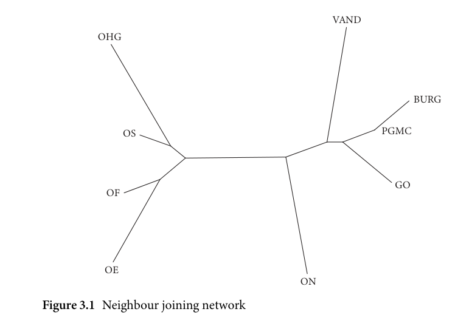
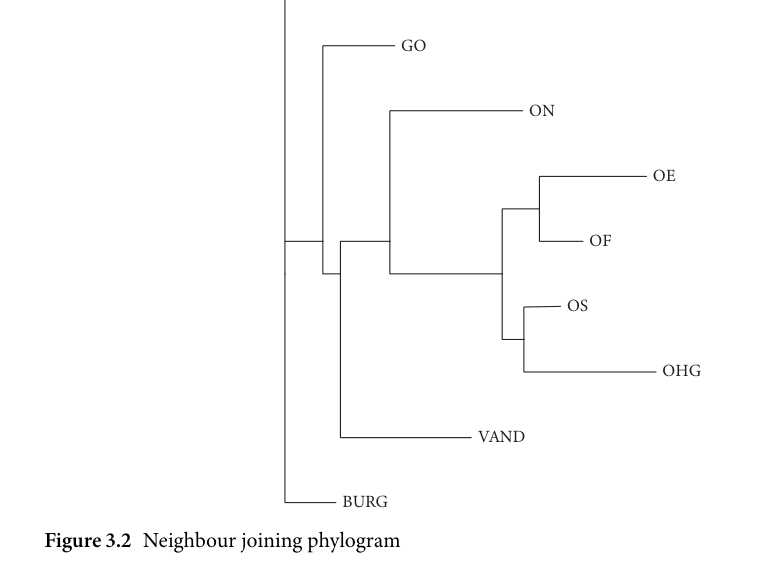
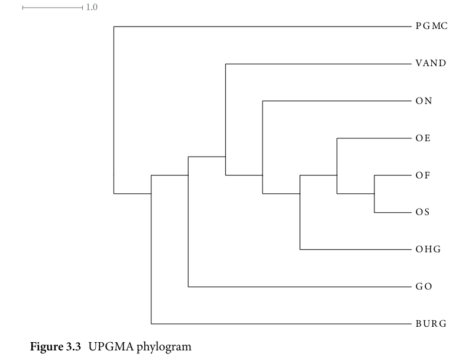
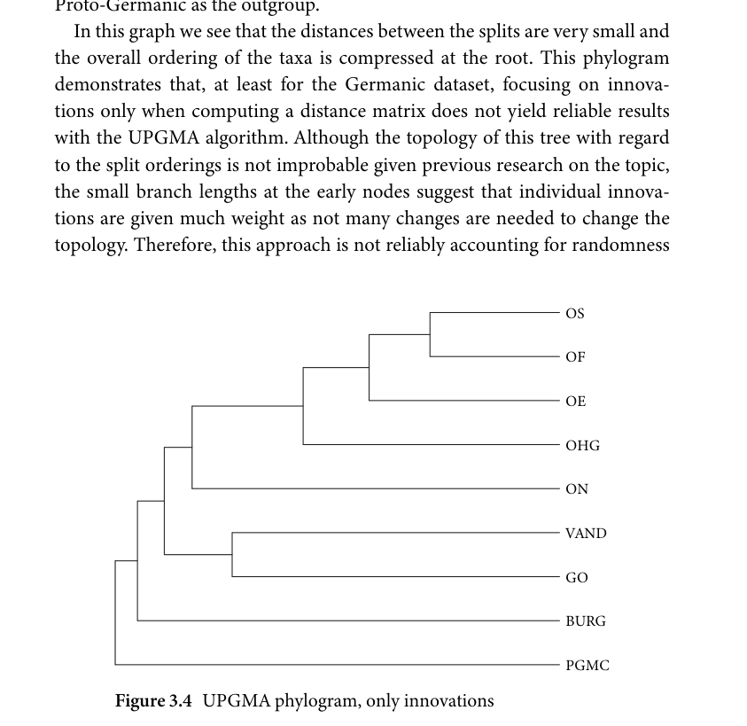
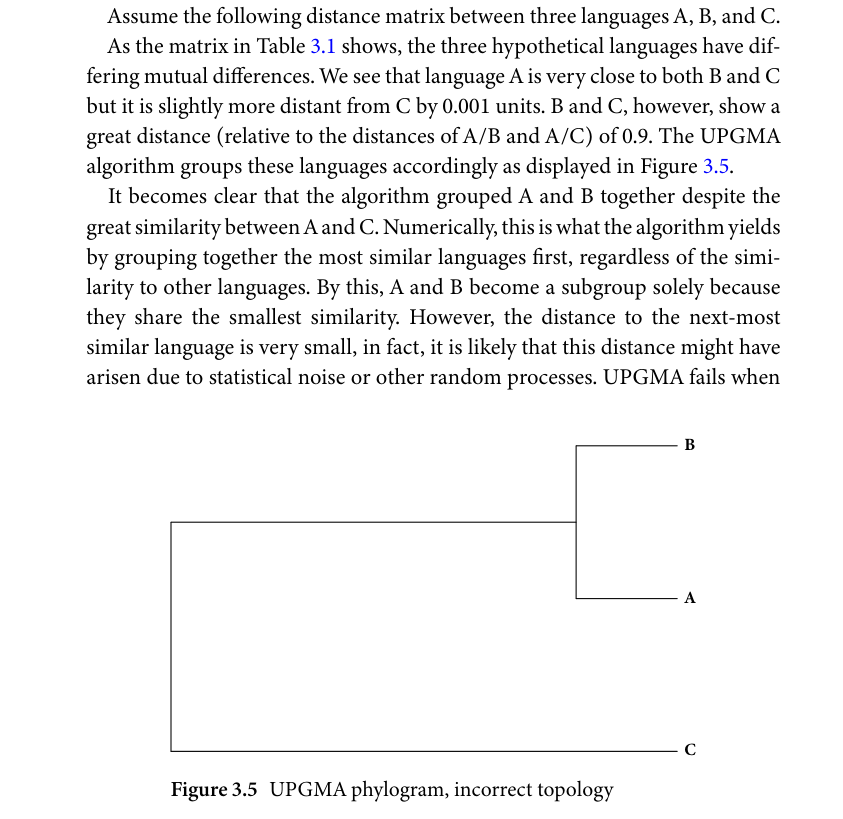
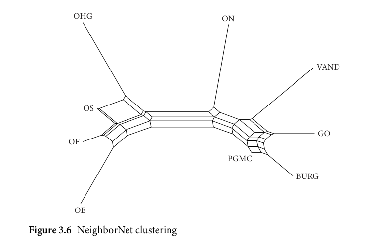
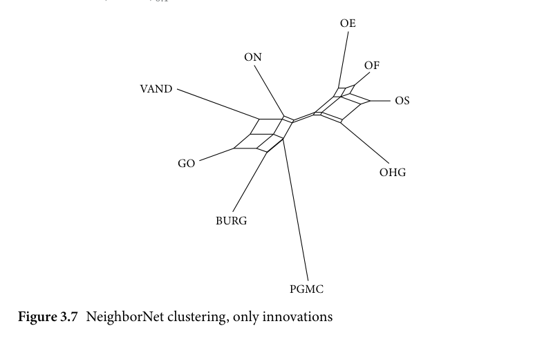
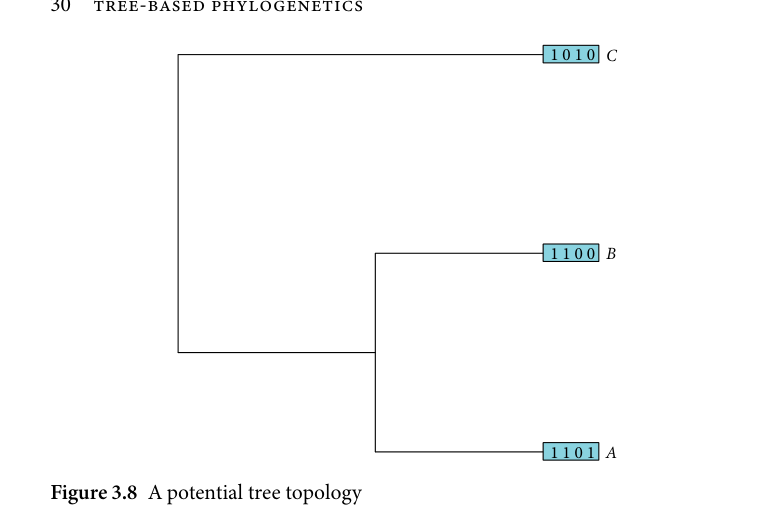
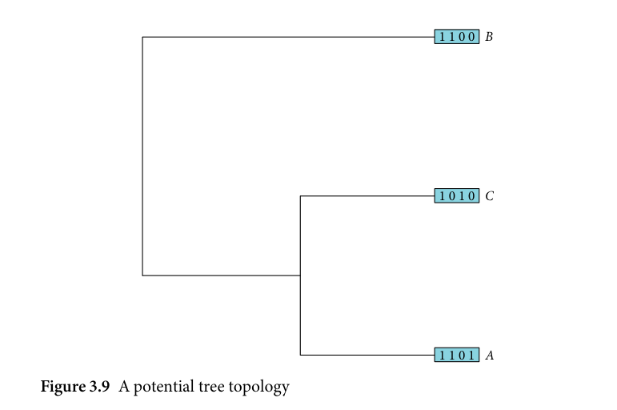
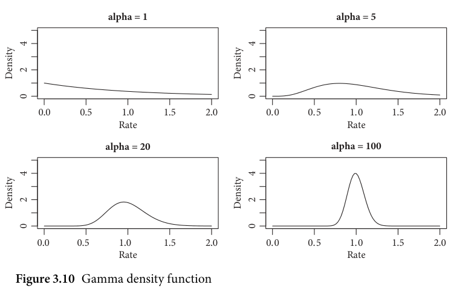

# 3.1 Phylogenetic algorithms

<!-- source-page: 15; pdf-page: 34 -->
3
        Tree-based phylogenetics

                  3.1 Phylogenetic algorithms

A large part of computational methods for cladistical analysis are centred
around inferring family relationships from data with a family tree structure
as the aim. Such methods opt for finding the best tree representation of lan-
guage relatedness from patterns given in the data. The various computational
methods differ not only in the methods with which trees are built but also in
how the trees are created from the input data.
  Computational phylogenetic tree models ask the questions of how languages
are related with regard to their subgrouping, their time of origin, the splitting
times of these subgroups, and their coherence as subgroups (Bowern 2018).
Further, some methods, chief among those Bayesian inference, aim to esti-
mate the reliability of certain family trees and subgroupings within these trees.
In general, the idea of computational phylogenetics is to derive quantitative
solutions to these questions from linguistic data.
  Two types of data are prevalent in phylogenetic linguistic analyses: state and
numeric data. State data are data that encode different states of a feature or
pattern in the languages in question. This can be cognate data where differ-
ent types of cognates are encoded in the data as different states. For example,
in a lexical approach akin to the dataset used in Ringe, Warnow, and Taylor
(2002), one would assemble words for a specific concept in different lan-
guages. This dataset would contain information of, for instance, the concept
of ‘sea’ in English (sea < PGmc *saiwiz), Dutch (zee < PGmc *saiwiz), Ger-
man (Meer < PGmc *mari), and Swedish (hav < PGmc *habą). The English
and Dutch words descend from a common PGmc form whereas the German
and Swedish correspondences have no common origins with any of the other
three languages. In a lexical dataset, we could assume three possible cognates
of which English and Dutch share type A (i.e. the *saiwiz-type), German shows
type B (i.e. the *mari-type), and Swedish type C (i.e. the *habą-type). This is of
course a simplification to outline the properties of a lexical dataset (for a more
in-depth discussion, see Heggarty (2021)). The challenges of this are not triv-
ial as the notion of concepts must be reasonably defined, especially since what

<!-- source-page: 16; pdf-page: 35 -->
counts as lexical correspondences is not always clear. In the above example,
both Swedish and German have reflexes of the *saiwiz-type which assumes
the meaning of ‘lake’ or ‘small body of water’ which, if included, would also be
cognate to the English and Dutch forms. It may therefore not be uncontrover-
sial to assume a specific scope for including or excluding wider meanings into
the dataset as semantic change may interfere with cognacy judgements.
  Other than lexical or cognate data, there can be innovation-based data that
encodes the presence or absence of a linguistic pattern or feature in different
languages. The other datatype that is used chiefly in distance-based analyses
is numeric data which usually are counts of certain sounds or other linguis-
tic measures with numeric outcomes. From these data, alignments are created
which means that across different features, the states or counts are collected
and aligned for all languages in the analysis in such a way that, for every fea-
ture, is recorded how it behaves in different languages (i.e. which states it has;
if it is present or absent).
   Intuitively, one would assume that the goal of phylogenetic algorithms
should be to detect these patterns and to find similarities between patterns
from which a family relationship can be derived. Further,  it seems intu-
itive to assign a closer family relationship to languages which share the most
similarities.
  This is the idea behind distance-based algorithms and, although not without
merit, it exhibits significant shortcomings:¹
  In distance measures, differences between two languages regarding their
features in the data are collapsed into one single number which oversimplifies
the relationship between two languages to a degree that might be inadequate
for certain linguistic problems.
  Moreover, grouping languages by similarity disregards the strength of the
connection and excludes significant patterns in the process. If, for example,
language A shares eleven features with language B and another set of ten fea-
tures with language C, the algorithm decides the grouping of A and B based
on the majority of shared features and rejects subgrouping with language C.
This can yield groupings where two languages that are estimated to be dis-
tantly related share strong similarities which were then overridden by stronger
patterns in other subgroups.
  Further, we want to ensure that the similarities we see are compatible
with certain tree structures while keeping in mind that there is uncertainty
regarding which specific structure has led to the data. Only going by the

    ¹ For an extensive review of both Bayesian inference and distance-based methods see Nichols and
Warnow (2008).

<!-- source-page: 17; pdf-page: 36 -->
3.1 PHYLOGENETIC ALGORITHMS  17

majority of shared patterns introduces false attributions into the analysis. That
is, there are several processes which can obscure the true relationship by intro-
ducing parallel innovations due to homoplastic events, convergent develop-
ments of either larger linguistic patterns such as morphological restructuring
of case systems which has an effect on several different individual linguistic
features or changes of a smaller scale such as parallel monophthongization of
certain diphthongs. Moreover, problems arise with shared retentions in meth-
ods relying on distance measures since, if not weighted, shared innovations
and retentions are treated as equal in those models.
   Lastly, datasets can only capture a limited sample of linguistic feature space,
meaning that all datasets are solely an approximation of the developments that
take place over the course of linguistic change. Although this statement is a
trivial fact common to all qualitative and quantitative analyses in linguistics, in
this situation it is an important reminder to take this issue into account when
applying phylogenetic algorithms. Uncertainty that arises due to data being
less than perfectly representative of linguistic systems needs to influence the
interpretation and results of the models.

                    3.1.1 Distance-based methods

Before we examine the Bayesian phylogenetic inference models in more detail,
we first need to start with inspecting the distance-based methods that can be
seen as the structural predecessor of phylogenetic models. This is not to say,
however, that distance-based models are not still used in linguistics and other
fields such as biology. Due to the limitations of their scientific value for cladis-
tical analysis, distance-based methods have become less frequent specifically
for family tree building and analysis. Nevertheless these methods have merit
for approaches and problems outside investigations into linguistic relatedness.
Therefore the discussion below needs to be seen purely as a review of these
methods in the domain of cladistical analysis.
  The figures and calculations in this section, with the exception of Figure 3.4,
were created with the phylogenetic software SplitsTree (Huson and Bryant
2006). The UPGMA algorithm in Figure 3.4 wasrun in the R package phangorn
(Schliep 2011) before being visualized in SplitsTree.

Theneighbourjoiningalgorithm
The neighbour joining algorithm, introduced by Saitou and Nei (1987), is a
method of clustering languages by means of their respective distances in the
form of a network. The process operates iteratively on a transformed version

<!-- source-page: 18; pdf-page: 37 -->
0.01

                                          VAND

         OHG

                                                       BURG

              OS                                 PGMC

                                               GO
           OF

           OE
                                  ON
  Figure 3.1 Neighbour joining network

of the distance matrix (called Q-matrix) by joining together the pair of closest
languages (i.e. the two languages for where the paired distance is lowest in the
Q-matrix). After updating the initial distance matrix by the new node created
by the earlier joining of two languages, this process is repeated for all remain-
ing languages and nodes. This results in a network of languages in which the
edge lengths between nodes correspond to the amount of estimated change
between them.
  When applied to the Germanic dataset, we are able to display the neighbour
joining network for these data as can be seen in Figure 3.1.
  What we can observe here is that PGmc is clustered in the close vicinity of
Burgundian, Gothic, and Vandalic whereas the West Germanic languages are
clustered on the far left end of the graph. Old Norse is relatively closer to PGmc
than to West Germanic.
  In a second step, this originally unrooted graph can be rooted and trans-
formed into a phylogram. Since the taxon PGMC represents the actual root
of the family, we can root the phylogram on PGmc. The result of this is the
phylogram shown in Figure 3.2.
  The most salient feature of this phylogram is that the now rooted tree shows
very short branch lengths between the early splits between the ancestral nodes

<!-- source-page: 19; pdf-page: 38 -->
3.1 PHYLOGENETIC ALGORITHMS  19

                                0.1

                     PGMC

                             GO

                                       ON

                                                       OE

                                                   OF

                                                   OS

                                                 OHG

                                       VAND

                            BURG
  Figure 3.2 Neighbour joining phylogram

of Burgundian, Gothic, and Vandalic. This can be interpreted as a sign of low
support for subgrouping in those languages.

UPGMA
The UPGMA (Unweighted Pair Group Method with Arithmetic mean) algo-
rithm was introduced by Sokal and Michener (1958) and produces a rooted
tree of the pairwise distances between the taxa. It is important to note that
the UPGMA algorithm is ultrametric, meaning that the underlying assump-
tion is that the distances from the root to each tip node are equal. Applied
to biological or linguistic problems, this requires the assumption of a strict
molecular clock, that is, the assumption that the rates of change along the
branches that lead to the distances in the distance matrix occur at the exact
same rate. This results in a tree in which branch length translates to the amount
of changes occurring between splits. As the Germanic languages in the dataset
were attested at different times with Gothic being significantly older than, for
example, the West Germanic languages, the ultrametricity and strict molecular

<!-- source-page: 20; pdf-page: 39 -->
1.0

                                                PGMC

                                                   VAND

                                               ON

                                                    OE

                                                      OF

                                                        OS

                                              OHG

                                               GO

                                                     BUR G
Figure 3.3 UPGMA phylogram

clock assumption cannot give reliable results.² The following application of
UPGMA to the Germanic linguistic data is therefore incorrect on theoretical
grounds and is discussed only for illustrative purposes to highlight and discuss
the problems of distance-based methods when applied to cladistical problems
such as the issue at hand. In Figure 3.3 we see the application of an UPGMA
algorithm to the Germanic dataset in which Proto-Germanic was declared the
outgroup to have a reference outgroup equal to the root state.³
  Here we see that, similar to the neighbour joining algorithm, many lan-
guages split independently from the phylum with short initial branch lengths.
Another decisive disadvantage of UPGMA, that it has in common with other
distance-based methods, is the disregard for the cladistic distinction of shared
innovations and shared retentions. The distances are computed on both
shared innovations and shared retentions with both being weighted equally.
This issue can be resolved when the distance matrix is computed by solely
incorporating shared innovations. Therefore I compiled a distance matrix on

   ² See section 3.1.3 for a detailed discussion of the molecular clock.
   ³ Since the UPGMA algorithm is ultrametric, Proto-Germanic is treated as an extant outgroup, yet
since this analysis is for illustrative purposes due to the reasons explained above, the results cannot be
interpreted in any case.

<!-- source-page: 21; pdf-page: 40 -->
3.1 PHYLOGENETIC ALGORITHMS  21

the basis of shared innovations. The pairwise distances were computed with
the following formula:

                                                                         Iij
                                      δ(i, j) = 1 –                                 (3.1)
                                                ninnov

  Therefore, the distance (δ) between languages  i and  j is computed by
dividing the number of shared innovations between the two languages by
the total number of innovations (i.e. number of innovations undergone in
either language). In the equation,  Iij is the number of shared innovations
                                                                      Iijbetween languages i and j.        is thus defined as the ratio of shared inno-                                             ninnov
vations to all innovations either language has undergone. Figure 3.4 shows
the UPGMA algorithm applied to this innovation-only distance matrix with
Proto-Germanic as the outgroup.
  In this graph we see that the distances between the splits are very small and
the overall ordering of the taxa is compressed at the root. This phylogram
demonstrates that, at least for the Germanic dataset, focusing on innova-
tions only when computing a distance matrix does not yield reliable results
with the UPGMA algorithm. Although the topology of this tree with regard
to the split orderings is not improbable given previous research on the topic,
the small branch lengths at the early nodes suggest that individual innova-
tions are given much weight as not many changes are needed to change the
topology. Therefore, this approach is not reliably accounting for randomness

                                                      OS

                                                    OF

                                                  OE

                                             OHG

                                            ON

                                                 VAND

                                             GO

                                                  BURG

                                               PGMC
       Figure 3.4 UPGMA phylogram, only innovations

<!-- source-page: 22; pdf-page: 41 -->
Table 3.1 Distance matrix of the
                     hypothetical languages A, B, and C

                           A             B

                B                0.1
              C               0.101                0.9

in the process, noise in the data, or statistical association strengths between
taxa.
 UPGMA exhibits issues regarding the weighting of individual distances as a
result of disregarding association strengths, common to several distance-based
tree models and briefly discussed before (see section 3.1.1). This is exemplified
by the following example:
  Assume the following distance matrix between three languages A, B, and C.
  As the matrix in Table 3.1 shows, the three hypothetical languages have dif-
fering mutual differences. We see that language A is very close to both B and C
but it is slightly more distant from C by 0.001 units. B and C, however, show a
great distance (relative to the distances of A/B and A/C) of 0.9. The UPGMA
algorithm groups these languages accordingly as displayed in Figure 3.5.
   It becomes clear that the algorithm grouped A and B together despite the
great similarity between A and C. Numerically, this is what the algorithm yields
by grouping together the most similar languages first, regardless of the simi-
larity to other languages. By this, A and B become a subgroup solely because
they share the smallest similarity. However, the distance to the next-most
similar language is very small, in fact, it is likely that this distance might have
arisen due to statistical noise or other random processes. UPGMA fails when

                                                      B

                                                         A

                                                  C
         Figure 3.5 UPGMA phylogram, incorrect topology

<!-- source-page: 23; pdf-page: 42 -->
3.1 PHYLOGENETIC ALGORITHMS  23

it assumes triangle inequality (i.e. symmetric relationships between taxa) and
instead of representing the groups A and B under the exclusion of C, and A
and C under the exclusion of B as equally likely, it opts for the numerically
optimal solution, regardless of how slim the margin to the next best grouping
is. This means that if, for some reason, the dataset has asymmetric distance
relationships between taxa, the model performs badly. This is not to say that
this is necessarily commonplace in linguistic datasets but that this is a con-
straint that has to be taken into account by ensuring that the dataset fulfils the
conditions necessary for UPGMA.

NeighborNets
An algorithm that bridges the gap between tree-based linguistic approaches
and alternative structures is NeighborNet, first introduced by Bryant and
Moulton (2002).⁴ The NeighborNet algorithm builds upon the mathemat-
ical framework of the neighbour joining clustering method but instead of
creating a rooted or unrooted tree, it projects the results as a web of con-
nections that define subgroups by clustering languages more closely to one
another (A. McMahon and R. McMahon 2008: 281–284). When applied to the
Germanic languages dataset, we observe the following clustering in Figure 3.6:

        0.01

         OHG                    ON

                                                     VAND

             OS

                                                 GO
          OF

                                   PGMC

                                                  BURG

           OE
   Figure 3.6 NeighborNet clustering

   ⁴ For an extensive introduction see Levy and Pachter (2011) who also explore the application of this
algorithm to problems of linguistic relatedness.

<!-- source-page: 24; pdf-page: 43 -->
In this figure, we see two general sides of the net: the left hand side encom-
passes the West Germanic languages and the right hand side shows Old Norse
together with Vandalic, Burgundian, Gothic, and Proto-Germanic. The first
observation to make is that if it were not for the external knowledge that the
node ‘PGMC’ encodes the ancestor of all other languages in the network, we
would not be able to gather any information about diachronic relatedness
from this method. In other words, the network does not show any hierarchi-
cal structure based on diachrony. This is, to some degree, by design as the
method is such that this model does not seek to emulate tree-like properties.
However, due to the lack of hierarchical properties, we are not able to dis-
cern innovative from non-innovative groups, a fact pointed out by François
(2015: 180). In other words, whether a language dissimilated from its sister
languages or vice versa cannot be determined from this net structure. After all,
a distance-based approach only displays pairwise distances which lack direc-
tion or chronology. From Figure 3.6, we can therefore only deduce that, for
example, Old High German has a higher overall distance from the other lan-
guages, but not whether it displays more innovative features than the other
West Germanic languages or whether Old Saxon, Old Frisian, and Old English
have undergone more innovations and have therefore dissimilated from Old
High German as a group. Scholars have outlined the advantages of Neighbor-
Nets that precisely lie in the absence of defined, hierarchical splits, replacing
those tree-like properties with a web-like structure that maps more neatly onto
the gradual diversification of languages (cf. François 2015: 173). However,
at the same time, the disadvantages we have observed in the analysis above
bring to light structural problems that are typical to non-tree projections of
phylogeny.
  Moreover, as we have seen above, it also inherits certain problems from the
general domain of distance-based methods such as the site-independence of
distances and the disregard of the different cladistical importance of shared
innovations and shared retentions. Despite these issues, at least the latter two
points can be overcome by improving upon the data type or the distance-
computing algorithm and are therefore not necessarily criticisms of Neigh-
borNet itself. The researcher must merely select and compile the data and the
distance calculations carefully to avoid these issues. François (2015: 179), for
example, builds his NeighborNet of the northern Vanuatu languages solely on
shared innovation data to control for data-related issues. In a similar attempt,
the NeighborNet algorithm was applied to the same innovation-only dataset
which was used above to create the UPGMA tree in Figure 3.4, the result of
which we can observe in Figure 3.7 below.

<!-- source-page: 25; pdf-page: 44 -->
3.1 PHYLOGENETIC ALGORITHMS  25

                              0.1

                                         OE

                         ON
                                             OF

               VAND
                                                   OS

                  GO
                                        OHG

                         BURG

                                PGMC
Figure 3.7 NeighborNet clustering, only innovations

  This figure demonstrates the application of NeighborNet to an innovation-
only dataset. Here we can make the same observations that were made in
Figure 3.4, namely that the cluster distances are lower and the overall discrim-
inability of clusters is more ambiguous. For example, the distances between
Northwest Germanic and the rest is lower and Old Norse is shifted further to
Vandalic, Gothic, and Burgundian than in Figure 3.6. An innovation-weighted
approach is therefore less promising for distance matrices when the distances
are computed as they are here.
  But nevertheless scholars see this method as a promising alternative to tree-
based cladistic models. For example Heggarty, Maguire, and A. McMahon
(2010) review and discuss NeighborNets for cladistic research in detail. More-
over, many scholars combine phylogenetic inference models with distance-
based approaches to explore a problem from different viewpoints (e.g. Bowern
2012).
                 3.1.2 Bayesian phylogenetic models

Bayesian phylogenetic inference has its roots in bioinformatics and more
specifically in the study of the genetic relationship between different organism
species. Although a variety of methods is used in this domain,⁵ Bayesian

   ⁵ See Garamszegi (2014); Ronquist, Mark, and Huelsenbeck (2009) for extensive overviews of
different methods and algorithms currently in use in bioinformatics.

<!-- source-page: 26; pdf-page: 45 -->
inference is often viewed as one of the most powerful tools (cf. Nichols and
Warnow 2008; Bowern 2012).
  The origins of Bayesian phylogenetics lie in the task of measuring species
diversification on the level of molecular genetics. The input data in bioinfor-
matic applications are thus genetic sequence alignments and morphological
data (i.e. data that encode observable physiological properties of species as
opposed to data obtained from sequencing genomes of organisms). The spe-
cific research interest is to estimate the time and sequence of speciation by
taking into account molecular evolution speeds and change rates.
  The biological goal is similar to that of cladistic questions in linguistics. The
linguistic problems are similarly concerned with the time of linguistic diver-
sification, the speed of language change/innovation and the origin times of
protolanguages.
  The transferability of these biological concepts has been evaluated in vari-
ous previous studies and theoretical investigations. The general application of
biological analogies to linguistic change by no means stand on shaky ground.
At least regarding the patterns of transmission and acquisition, the properties
of communities with frequent exchanges of linguistic properties are closely
related to the analogous processes in evolutionary biology (cf. Labov 2001:
6–14; Walkden 2012). This assumption holds for the abstract scope of linguis-
tic diversification, which is the needed requirement for applying phylogenetic
models or, for that matter, other computational methods that involve abstrac-
tions to the linguistic change processes. In fact, it has been proposed that
phylogenetic models can be used for a variety of cultural evolution problems
beyond linguistic aspects alone (Mesoudi, Whiten, and Laland 2004, 2006;
Boyd and Richerson 2005; Gray, Bryant, and Greenhill 2010; Gray, Atkinson,
et al. 2013).
  Atkinson and Gray (2005) find multiple parallels between the evolutionary
processes in biology and in linguistics that affect multiple domains of change
and pertain to different processes of different scopes. These parallels allow
biological methods to be applied to linguistic problems, especially regarding
macro-level investigation of linguistic diversification. Not because linguistic
change is a biological process, but because both linguistics and genetics evolve
under certain conditions that are similar enough for the methods to be shared
(see e.g. the extensive discussions of this issue in Croft 2000; Andersen 2006).
  Further, we have to bear in mind that in order to use these methods, linguis-
tic change and diversification do not necessarily need to operate exactly in the
same ways as their biological counterparts. It is sufficient if the method can
serve as a good approximation to the linguistic processes.

<!-- source-page: 27; pdf-page: 46 -->
3.1 PHYLOGENETIC ALGORITHMS  27

  Criticisms of phylogenetic models have been voiced criticizing the data
sources and applicability to linguistic problems (see e.g. Pereltsvaig and Lewis
2015). In-depth examinations of the criticisms and defenzes of these methods
(such as Bowern 2018) have shown that when using problem-appropriate data
and specifications, they can yield beneficial insights into language relatedness
and ancestral stage dating.
  Phylogenetic inference shares several advantages with computational meth-
ods in general such as repeatability, interpretability, transparency. This means
that it employs statistical and computational tools which operate on all data
in the same way. Moreover, it can be applied to a variety of problems (Gray,
Greenhill, and Ross 2007). This means that the results obtained from the mod-
els can be scrutinized with regard to their set-up and parameters. Errors and
issues can be traced back to misspecifications and erroneous basic assump-
tions. Further, phylogenetic trees are easily communicated and interpreted
with little effort since the resulting consensus trees contain the most basic
information summary of the model results and the underlying parameters are
mathematically defined. The models previously tested for their accuracy are
congruent in many aspects with results from the manual comparative method
(Greenhill andGray 2012). As an additionaladvantage, the modelsand param-
eters can be analysed themselves according to stringent procedures to evaluate
their fit to the dataset. It is thus possible to explore different parameter settings
and model types and determine at the end which models—and in turn which
parameters—fit the data best. This method serves as a model-external check
that enables the selection of better models and, as a result the interpretation of
the parameters in light of these findings. As such analyses can provide a good
foundation for model sanity checks, they are frequently used in contemporary
studies (e.g. Verkerk 2019).
  Several previous studies have employed phylogenetic modelling to estimate
the phylogeny and split dates in several language families.
  Among the first studies using Bayesian phylogenetic methods in linguistics,
Gray and Atkinson (2003) analysed a dataset of Indo-European languages to
estimate the age of Proto-Indo-European (PIE). In this investigation, they sug-
gest an older age of the break-up of PIE thus favouring the Anatolian hypothe-
sis. However, their results have drawn criticism from multiple directions. Most
prominently, Chang et al. (2015) have employed Bayesian phylogenetics meth-
ods in which they find support for the steppe hypothesis by including ancestry
constraints on the tree topologies (see section 1.3).
  Other scholars have used Bayesian phylogenetics in the past to test previous
assumptions about the relatedness of languages in a family, as, for example,

<!-- source-page: 28; pdf-page: 47 -->
Bowern (2012) has demonstrated for the Tasmanian languages. Further, Bow-
ern and Atkinson (2012) analyse the Pama-Nyungan languages to investigate
the major subgroups of this family.
  A great number of phylogenetic inference studies focus on lexical data (see
discussion in Dunn et al. 2008: 714–718), chief among them studies by Dunn
et al. (2008); Greenhill, Gray, et al. (2009); Greenhill, Drummond, and Gray
(2010).
  The advantages of using Bayesian phylogenetic models for inferring lin-
guistic relations is that they are centred around finding the most probable
trees for given data while taking into account the most likely development
of each character site instead of applying tree-building tools to single-valued
linguistic distance measures. Moreover, the focus of the algorithm is to oper-
ate on the data directly and infer the tree structure from the probabilities of
every site occurring along the tree. This means that these models reconstruct
and infer the possible developments of individual character sites rather than
using a global distance metric. This is advantageous insofar as the relation-
ship between the included languages is modelled as a development affecting
all features instead of collapsing these features into a single distance value that
averages out more intricate character-level developments.
  Further, as they take into account change rates and diversification speeds,
often branch-specific, which are not uniform (Greenhill, Drummond, and
Gray 2010), they are not only more fine-grained and versatile but they also
represent an important tool for dating of splits and taxon ages.
   It is important to note that during this section, I will predominantly use
examples from linguistic phylogenetics, but it needs to be kept in mind that
all concepts mentioned here have their original applications in biological
phylogenetics.

                         3.1.3 Core concepts

Bayesianinference
The core element of Bayesian inference in general is the estimation of the
probability of a model or model parameters given the data at hand. In gen-
eral, Bayesian methods model the question ‘given the data derived from a
real-world process, which parameter values in a certain model are most likely
to have produced the data?’. In Bayesian linear regression, for example, the
model estimates the probability of a certain regression line given the data, or,
more commonly, the probability distribution over all regression lines given
the data. In essence this means that Bayesian regression finds those most likely

<!-- source-page: 29; pdf-page: 48 -->
3.1 PHYLOGENETIC ALGORITHMS  29

regression lines out of all regression lines that could possibly exist. The results
of a Bayesian model are therefore a distribution of those most likely parameters
(e.g. slope and intercept of a regression line), and each individual parameter
value is a sample draw, usually from a sampling algorithm (see below). This
distribution is called a posterior distribution or just posterior. Another crucial
element of Bayesian modelling is the existence of priors: parameters that are
inferred during model fitting are given prior distributions that are multiplied
with the likelihood of the data given the parameter according to Bayes’ for-
mula. Those determine the a-priori likelihood of certain parameters and let
the researcher discourage the model from making absurd parameter choices.⁶
In Bayesian phylogenetics, however, the distributions from which the poste-
rior samples are drawn is not a distribution of parameter values alone but
also a distribution over trees. A thorough introduction to Bayesian statistics
in the light of Bayesian phylogenetics is presented in Ronquist, Mark, and
Huelsenbeck (2009). Before examining the intricate details of Bayesian infer-
ence models, it is necessary to outline the notion of probability in the context
of linguistic family trees: assume there are three taxa (languages) in the dataset
that have undergone different numbers of innovations. Further assume there
are four possible innovations in the dataset and language A has undergone
innovations in positions 1, 2, and 4, yielding an innovation vector (1, 1, 0, 1).
Language B shows innovations 1 and 2 while innovations 1 and 3 are observed
in language C.
  Figures 3.8 and 3.9 show two potential trees that might be inferred from the
data to explain the phylogenetic relationship between languages A, B, and C.
  What can be seen here is that the tree topology in Figure 3.8 fits the data bet-
ter and, in a Bayesian modelling context, this means that the tree in Figure 3.8
is more likely given the data.⁷ The tree topologies are generated in a stochastic
model which takes as an input all parameters such as root age, branch lengths,
and speciation rates and outputs a tree topology based on a specific setting
of all parameters. A posterior probability can then be calculated for this tree
given the data and by taking into account the model priors: since this analy-
sis is Bayesian, all parameters and topologies have priors which are taken into
account for calculating the posterior probability of each tree. The goal of the
analysis is thus to find those tree topologies and parameter settings that explain

   ⁶ There is much more in the way of theoretical underpinnings to the role of priors in Bayesian mod-
elling, a detailed discussion of which, however, would be beyond the scope of this book. For a detailed
introduction, see McElreath (2020: ch. 2).
   ⁷ In both examples, edge lengths can be ignored as these toy examples are illustrative representations
of two different topologies, thus lengths are equal for all edges.

<!-- source-page: 30; pdf-page: 49 -->
1 0 1 0 C

                                                            1 1 0 0 B

                                                            1 1 0 1 A
Figure 3.8 A potential tree topology

                                                            1 1 0 0 B

                                                            1 0 1 0 C

                                                            1 1 0 1 A
Figure 3.9 A potential tree topology

the data best, or, more accurately, yield the highest posterior probability given
the data.
  Note that this description of the probability estimation simplifies the mat-
ter significantly and must therefore be taken as a coarse outline of the core
ideas of tree probabilities. A more detailed presentation of likelihood and

<!-- source-page: 31; pdf-page: 50 -->
3.1 PHYLOGENETIC ALGORITHMS  31

probability in the context of tree topologies is provided in Greenhill, Gray, et al.
(2009: 5–10).
  The main computational issue with this approach is that the parameter com-
binations are very large, meaning that even a small number of parameters
can lead to a massive inflation of potential trees. Assume we are analysing a
dataset using four phylogenetic parameters, each with 100 intervals (e.g. in
a parameter between 0 and 1, we are using all parameter settings in steps of
0.01). This would result in 100 million potential trees to be evaluated and with
every additional parameter, this number would be multiplied by the number
of intervals. It is not uncommon for phylogenetic analyses to have more than
forty parameters to be inferred by the model, with most of them having much
larger parameter spaces than the four parameters in the example above.
  Therefore, it becomes clear that not all possible trees can be evaluated, as
doing so would inevitably exceed the computing power even of modern com-
puting architectures. As a result, strategies have been devised to approximate
the high-probability tree topologies despite the high-dimensional parameter
space.
  Fortunately, not all trees that result from these parameter combinations
are good fits to the data. In fact, only a small fraction of trees is in the
high-probability region.  It would therefore suffice to estimate this high-
probability region directly without having to evaluate all possible parameter
combinations. To achieve this, Bayesian phylogenetic models use Markov-
Chain-Monte-Carlo (MCMC) simulations to find and traverse the high-
probability regions of the posterior distribution of trees.⁸
  In essence, an MCMC simulation traverses the posterior distribution in a
guided manner, by a proposal system that uses the posterior probability. In
simple terms, the MCMC analysis starts at one point in the parameter space
and then moves away from this position by proposing a new location near
the starting point. Then, the probability at this new location is evaluated and
compared with the probability of the parameter setting at the current loca-
tion. If the new location has a higher probability, this location is set as the
starting point for the next step. If the new location has a smaller probability,
then the chain makes the switch to this location with a probability that is pro-
portional to the probability difference between current and new location. This
process is repeated multiple times and after a certain number of iterations, the
chain arrives at the high-probability space and stays fluctuating in this region.

   ⁸ See Ronquist, Mark, and Huelsenbeck (2009) for a concise introduction of MCMC estimation in
phylogenetic models.

<!-- source-page: 32; pdf-page: 51 -->
Afterwards, the samples drawn from this region can be taken as the posterior
distribution. This process is akin to a mountaineer ascending to the peak of
a mountain by predominantly climbing in directions that are located uphill
from their position. The danger of obtaining false results due to the algorithm
converging in a local maximum parameter area is mitigated by running more
than one chain. If the chains converge in a similar parameter area, the run is
regarded as successful and the results can be used. If one chain would remain
in a local maximum, the two chains do not converge as they finish their runs
in different parameter regions.
  This general algorithm that is used in most Bayesian analyses can also be
used in phylogenetic models to evaluate posterior trees instead of regression
parameters of the type used in Bayesian regression analyses. In essence, it asks
the question: ‘which tree structures could have yielded the data we see in the
daughter languages?’
  There are several different types of MCMC algorithms with different effi-
ciencies and applications: the algorithm used in RevBayes is called Metropolis-
Hastings.

Substitutionmodels
The substitution model is the part of a phylogenetic model that computes
the transitions between the different character states of the phylogenetic
data. It essentially models how different observed traits in a language (i.e.
the characters in the data) evolve. The substitution processes in phyloge-
netic inference are modelled as a continuous time Markov model (CTMC), a
transition-based stochastic model of state changes. In molecular genetics, these
character states correspond to different nucleotide states in a given nucleotide
sequence. The substitution model aims at modelling the state change between
any one nucleotide to any other nucleotide. In DNA data, these nucleotide
states are C, G, A, and T. The basis of any such substitution model is the
instantaneous-rate matrix which describes the rate of change between the dif-
ferent possible states. This rate matrix applied to a dataset with three character
states A, B, and C would yield the following rate matrix Q:⁹

                           –μA   μAB   μAC
               Q =  μBA  –μB  μBC                         (3.2)                     [ μCA  μCB  –μC ]

   ⁹ Note that the states here are labelled more universally as A, B, and C instead of the nucleotide
names, which is due to the fact that in such substitution matrices, the states can be any discrete labels
and not only nucleotide states.

<!-- source-page: 33; pdf-page: 52 -->
3.1 PHYLOGENETIC ALGORITHMS  33

The transition rate between the states, conventionally indicated by μ, thus the
transition from state A to state B would be indicated by μAB in the matrix. In
other words, the rate μAB represents the rate of state A in the data changing
to B. This is phylogenetically important to model the state transition rates as
different since the branch length estimates and splits can differ under varying
transition rates. Concretely this means that when we assume that character
state A changes to B twice as often as A changes to C, the resulting tree infer-
ences will be different insofar as they will account for that imbalance in the
change pathways of A. For mathematical reasons which can be set aside at
this point, the negative diagonal represents the negative sum of all rates in
the respective row.
  When the substitution models were first proposed in Jukes, Cantor, et al.
(1969), these transition rates were held constant and equal such that all
nucleotides have the identical global rate of transition to all other nucleotides.
What this assumes is that the nucleotides are in fact identical in their proba-
bility of changing into any other nucleotide. Applied to linguistics, this means
that the transition rates between different character states are set here. In
an innovation dataset, this would correspond to the change rate from a 0
(‘no innovation’) to a 1 (‘innovation’) and vice versa. The substitution model
building on this rate equality is the so-called Jukes-Cantor model which the
following matrix visualizes.

                          –2μ   μ    μ
               Q =   μ   –2μ   μ                          (3.3)                     [ μ    μ   –2μ ]

  However,  later  investigations  revealed  variation  between  different
nucleotides which prompted researchers to propose modifications of the
Jukes-Cantor model in which the transition rates can differ. The resulting
models, of which GTR (General time-reversible) models are the most promi-
nent, can therefore account for different transition rates and even infer those
rates from the data.
  A modification of the original GTR, which builds on unique concepts
of genetics (e.g. transitions and transversions), allows for further flexibility
regarding transition rates: in the classical GTR model, rates are bidirectional,
meaning that the rate of transition from A to B is the same as the rate of
transition from B to A. The free transition rate model relaxes this assumption
further, giving every transition rate its own value. This allows for asymmetric
transitions where directional change is possible.

<!-- source-page: 34; pdf-page: 53 -->
From a linguistic perspective, these models are difficult to apply insofar
as some of them (e.g. GTR (Tavaré et al. 1986) and Hasegawa-Kishino-Yano
(HKY) (Hasegawa, Kishino, and Yano 1985)) have strong molecular genetic
underpinnings. However, linguistic data  still has transitions of states, for
example transitions between sounds, cognates, or, in the case of the study at
hand, loss and acquisition of innovations. Ultimately, the linguistic problem
and the dataset have to be examined to determine which substitution model
can apply in the respective context. The Jukes-Cantor model may function as a
phylogenetic null model which assumes there to be no differences in the transi-
tion rates between all pairs of linguistic states, but there are datasets where this
identity of rates is violated. The implications of different substitution models
for modelling the Germanic languages are discussed in detail in section 3.2.2.
  Characters in linguistics can represent linguistic innovations (such as in this
study), or they can represent states of linguistic features (see section 3.1 and the
discussion of character states in Ringe, Warnow, and Taylor (2002: 71–78)).
Depending on what linguistic data are the basis of a phylogenetic analysis,
different transition rates may be needed. Especially for small datasets, inferring
the transition rates from the data accurately might not always be possible.

Modellingamong-siteratevariation
A related concept to substitution models is the among-site rate variation
(sometimes called ‘cross-character rate heterogeneity’) which operates on top
of the substitution rates intended to account for different rates of change
between different characters in the dataset. In other words, different linguis-
tic features expressed as characters in the dataset may change at different
speedsbut the substitutionmodel alone estimates one single, albeit directional,
change rate for all characters. To account for this problem, the gamma among-
site rate variation draws random rate multipliers for each site from a gamma
distribution with parameters α and β where α = β. This yields a distribution
that is flat for values of α approaching 1 and increasingly resembles a normal
distribution for higher values. Moreover, with increasing values, the standard
deviation narrows. Figure 3.10 shows density plots of the gamma distribution
at different values of α.
  When random variables are drawn from these gamma distributions, the
differences between the rate multipliers will be determined by how flat the
distribution is. If rate multipliers are drawn from a gamma distribution with
α = 1, the variations between the rates will differ considerably and will range
from close to zero to 6 and beyond. In turn the rates for different sites will be
heterogeneous as the base rates are multiplied by a value close to zero for some

<!-- source-page: 35; pdf-page: 54 -->
3.1 PHYLOGENETIC ALGORITHMS  35

                     alpha = 1                                       alpha = 5

 4                     4

 2                     2Density                                                                                                                                                   Density

 0                     0

        0.0       0.5       1.0       1.5       2.0           0.0       0.5       1.0       1.5       2.0
                         Rate                                             Rate

                     alpha = 20                                      alpha = 100

 4                     4

 2                     2Density                                                                                                                                                   Density

 0                     0

        0.0       0.5       1.0        1.5       2.0           0.0       0.5       1.0       1.5       2.0
                         Rate                                             Rate
  Figure 3.10 Gamma density function

  sites and six times higher than the base rate for other sites. If α is very high, the
  variation between the sites will not differ much as they are multiplied by values
  close to 1, which de-facto does not change the base rate by much. It is impor-
  tant to note that not every character is assigned its own value of α. Rather, it is
  drawn randomly for each character anew. This means that the model gauges
 how much variability in the character states is most compatible with the data.
  In terms of the Bayesian approach, we could say that the model infers what
  level of variance in the states we need to explain the data well. If the values for
  α are small, it means that the sampled tree topologies possess a large variability
  in their character site rates.
    Since α is being estimated during the analysis, the model can, in conjunc-
  tion with the priors, estimate the value of this variable from the data directly.
  The implementation of this gamma-rate model in RevBayes uses a discretized
 gamma version (Z. Yang 1994) where the model computes an average of dif-
  ferent discretized versions of the gamma distribution (see the discussion in
  Yanovich 2020: appendix).

  Branchratesandthemolecularclock
 One main element of all tree models is the branch lengths as they determine
  key findings about phylogenetic relationships. This is different from tradi-
  tional tree-model depictions as there, branch lengths in most cases do not
  correspond to any quantitative scale. As we have seen in section 3.1.1, branch

<!-- source-page: 36; pdf-page: 55 -->
lengths were taken as a measure of similarity between clades in distance-based
methods. There, the length of the branch represents the distance between two
nodes that is computed from the data. In Bayesian phylogenetic inference,
branch lengths of clades in a given tree are to be inferred from the data. How-
ever in Bayesian phylogenetics, the definition of branch length differs from the
interpretation in distance-based methods insofar as the method rests on differ-
ent base assumptions between the relationship of different taxa. As described
above, Bayesian phylogenetics inference does not operate on the premise of
distance between taxa expressed by a number computed from an aggregate of
the overall distance between two datasets behind these taxa. Instead, it com-
putes the most probable ways in which a tree-like split of taxa can account
for the data and therefore the minimal unit of computation is characters in
one site. In other words, whereas distance methods often express the distance
between two datasets as one number, Bayesian inference aims at the differ-
ences between these datasets with regard to individual observations (i.e. sites).
From this, follows a different interpretation of branch length as a function of
site changes between two nodes. Longer branch lengths therefore correspond
to more changes in individual sites between two nodes. At the same time,
branch lengths and transition rates are connected insofar as change rates along
branches are assumed to be even faster if they run along the lines of transition
rates. That is, if the difference between an ancestor node and a descendant
node is mostly in the characters A (ancestor node) > B (descendant node) and
if it so happens that the change A > B is overall much more common than vice
versa, the branch rates will be assumed to be much higher for this particular
edge. These change frequencies between nodes are linked to abstract units of
time in which the branch length is equal to the number of changes per one site
and therefore the time it takes for these changes to occur. If a branch length
is, for example, 1, this branch length denotes that 1 change per one site has
occurred along the branch in question and the time this length corresponds to
is equal to the time it takes for 1 change per site to occur. This also means that
the time does not correspond to absolute or actual time but to the unknown
unit of time corresponding to the changes along the branch. This approach
therefore is initially not calibrated to actual time, modelling not the actual
time but the number of changes per site which correspond to an unknown
time frame.
  However for some analyses, it may be required to use absolute time as a unit
during the analysis. Doing this is important in two scenarios (among others):
  (1) The goal of the analysis is to date the age of certain taxa or ancestral
states. In this scenario, the actual age of, for example, a protolanguage is to

<!-- source-page: 37; pdf-page: 56 -->
3.1 PHYLOGENETIC ALGORITHMS  37

be inferred. Then, it is necessary to calibrate the model to absolute time in
order for the branch lengths, branching times, and ancestral node ages to cor-
respond to years instead of the abstract concept of change rate times. This is
the approach used in studies by Chang et al. (2015) and Gray and Atkinson
(2003) where one of the research goals is to infer the root age of Proto-Indo-
European. A time calibration is usually done by setting observation dates or
priors for the tips and the root. This way, the abstract units of time are con-
verted by the model into actual time estimates. For example, if we know that
a certain split occurs halfway between node A and node C, and that A and C
are approximately 1,000 years apart, we can date the split to 500 years before
C occurs.
  (2) There are temporal differences between the taxa in the analyses. In cases
where not all languages in the dataset are contemporaneous (‘extant’), one
might want to account for the fact that the innovations and changes present
in these languages correspond to different time periods. For example, if one
analyses a dataset which contains both modern Swedish and Middle English,
the actual time that has passed since their most recent common ancestor is
longer for modern Swedish than it is for Middle English. This temporal differ-
ence needs to be incorporated in the model because otherwise, the inference
might come to incorrect conclusions of the respective phylogeny since it treats
both modern Swedish and Middle English as extant. Calibrating this model to
absolute time, and giving different attestation ages for both languages, prevents
this problem from occurring. Both issues are important for the study at hand
as the different occurrence times of the Germanic daughter languages need to
be accounted for as well as providing a broad age range for Proto-Germanic.
  Up to this point, we have only discussed the importance of absolute-time
calibration for different applications of phylogenetic inference. It is there-
fore important to discuss the mechanisms behind dating and time calibration
further in more detail.
  The baseline assumption is that over time, changes occur at certain rates
which, in a time-calibrated model, correspond to units of absolute time. This
results in inferences where it can be estimated that over the course of n years,
y number of changes occurred which corresponds to a change rate of n.y The
notion of a change rate is expressed in the concept of a molecular clock which
states that changes occur at a certain rate over the course of time. Conversely,
this notion suggests that if the change rate is known or approximated, we
can date the divergence times and ages of ancestral nodes. Therefore, time-
calibrated models operate under the molecular clock assumption that changes
correspond to strict or varying units of absolute time.

<!-- source-page: 38; pdf-page: 57 -->
This assumption, however, leads to further issues regarding the definition
and implementation of the molecular clock into phylogenetic models. The
definition of a correspondence between time, and a certain amount of changes,
raises the question of how to connect absolute time and change. There are,
in general, three major types of modelling the molecular clock: strict clock,
relaxed clock, and random local clock models.
  Some of the distance-based methods such as the aforementioned UPGMA
algorithm as well as certain phylogenetic models operate under the assump-
tion of a strict clock. A strict clock assumes that the change rates of individual
sites are constant across the time period in question. This means a global clock
with one rate pertaining to all branches of the tree governs the changes. While
this approach has the benefit of simplicity, it is often not the tool of choice for
many current phylogenetic models. That is, the global uniformity of linguistic
change rate is perceived as a problematic assumption (see Bergsland and Vogt
1962; Walkden 2019, for discussion).
  The second clock model is the relaxed clock model which, in reality, is an
umbrella term for several clock models that, at their core, do not assume a
constant global rate of change but instead assign an individual rate to each
branch. This results in every branch leading up to a taxon or subclade hav-
ing their own change rate and allows for clade-specific innovation speeds
accounting for more conservative or innovative languages. These rates are not
pre-determined but inferred during simulation. A result of rate-specific change
estimation is that we are able to gauge the innovation speed of different clades
and distinguish between slow-changing and fast-changing languages.
  The third type of model is random local clock models which can be seen
as a middle ground between strict and relaxed clock models: they modify the
strict clock approach insofar as the clock rate is allowed to vary across the
investigated time period but the rate is still global, that is, it affects all clades
and taxa but varies over time.
  As we have seen in this section, Bayesian phylogenetic models can be cali-
brated to absolute time and, depending on the chosen clock model, infer the
rate at which individual languages and subclades undergo innovations.

Speciationandextinction
Two other important parameters in a phylogenetic model are speciation and
extinction rates. In essence, both parameters reflect the number of speciation
or extinction events per time unit and lineage.
  Speciation describes the process under which new lineages are created.
A speciation event is thus the phenomenon of one lineage splitting into more

<!-- source-page: 39; pdf-page: 58 -->
3.1 PHYLOGENETIC ALGORITHMS  39

than one daughter lineage.¹⁰ For example, North Germanic splitting into Old
East Norse and Old West Norse. Essentially, this parameter governs the rate at
which new lineages are created.
  Extinction is harder to define from a linguistic standpoint. In biological
contexts, an extinction event is an event in which a lineage dies out without
producing subsequent lineages. Such a lineage extinction may result in a fossil
but it might also occur unnoticed since we are only presented with those taxa
that either survived or entered the fossil record. Applied to linguistics, this
means that an extinction event may either result in a language going extinct of
which we have written accounts or of languages we do not know about. In prac-
tice, the extinction rate accounts for the possibility that an unknown number
of Germanic languages existed without being attested in written form which
went extinct due to an unknown cause. Gothic, for example, went extinct
insofar as it does not have any present-day descendants. If Gothic had never
been recorded, we would be ignorant of its existence. The probability of either
known or unknown extinction is modelled by the extinction rate parameter.
  Similar to the implementation of branch rates, speciation and extinction
rates can be globally constant (cf. Nee, May, and Harvey 1994), episodic or
branch-specific. Episodic rates assume that the rate change is due to exter-
nal, episodic events. In biological applications this can mean mass extinction
events or increased speciation due to ecological factors. Branch-specific rates
assume that the number of occurring speciation and extinction events is
dependent on the branch (cf. Höhna 2014). The biological motivation for this
might be that due to factors unique to each branch, speciation and extinc-
tion increases or decreases. Examples for this might be increased or decreased
reproductive success occurring along a branch or the rate change being asso-
ciated with environmental factors that apply only to the habitat of the species
associated with the lineage in question (see Condamine, Rolland, and Morlon
(2013) for environmental factors in biological evolution).
  While these different rate models are linked to reasonable real-world phe-
nomena in biology, it is more difficult to determine whether all three models
can be used for linguistics. The episodic model might be still applicable as the
episodic changes could represent major historical disruptions of the preced-
ing order which leads to an increased likelihood of extinction or the creation
of new languages. This is in some regards similar to the notion of ‘punc-
tuated equilibrium’ proposed by Dixon (1997) in a linguistic context. This
concept describes linguistic changes as cumulating in sporadic events that are

   ¹⁰ As most phylogenetic models assume bifurcating trees, a speciation event is one lineage splitting
into two descendant lineages.
