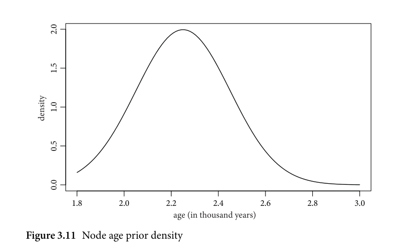
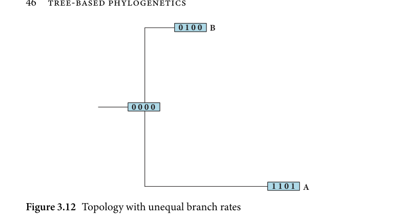
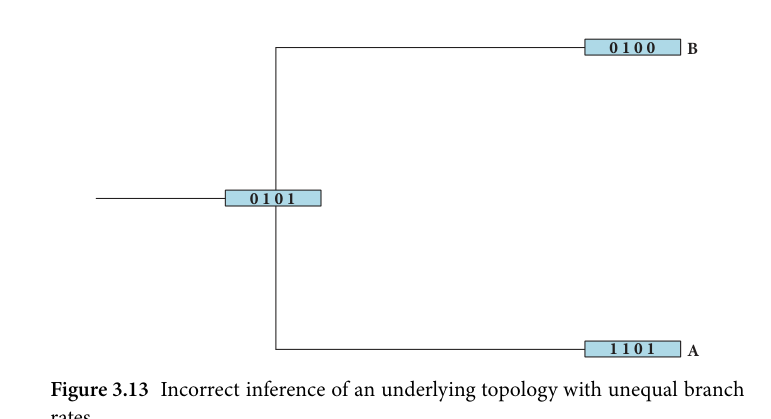

# 3.2.1 Model specifications

<!-- source-page: 40; pdf-page: 59 -->
preceded and followed by long periods of linguistic constancy (see Bowern
2006; Walkden 2019: for discussion).
  However, branch-specific rates would require a change in likelihood that
is at least somewhat causally linked to the preceding branching event. We
would thus find that the rate of diversification in, for example, West Germanic
increases as soon as it has diverged from North Germanic and decreases
again once it breaks up into multiple languages itself. It is difficult to find
theoretical backing for this process and unless there is demonstrable evidence
for branch-dependent speciation, at least across a short time period, I will
assume a global speciation and extinction rate for this analysis which assumes
that lineages split and go extinct at approximately a constant rate. This is
further supported by the fact that Germanic is a spatially and temporally
small language family where no major disruptions take place locally and only
apply to a subset of the lineages.

            3.2 The Germanic diversification model

                      3.2.1 Model specifications

To analyse the Germanic linguistic phylogeny with this Bayesian phyloge-
netic model, I set up six differently parametrized models to see how different
assumptions influence the phylogeny inferences. These six models differ in
both the fossil dating and substitution models, the differences of which will be
outlined below.
   Firstly, the core elements of all models need to be described to determine
and motivate what aspects are chosen to be common across all models. The
following sections will examine those elements divided into inferred and fixed
parameters. The theoretical underpinnings of the concepts mentioned here are
explained in detail in section 3.1.3.

Inferredparameters
The inferred parameters are those parameters in the model that are variable
and only assigned priors such that they are inferred by the model during
sampling. In contrast to fixed parameters, this leaves the opportunity for the
model to come up with the best parameter values directly without them being
hard-coded into the model.
  The branch rates model chosen for these analyses is a relaxed clock with
branch-specific substitution rates. This gives the models freedom to let the
branch rates vary across clades. Moreover, by doing so, the rates can later

<!-- source-page: 41; pdf-page: 60 -->
3.2 THE GERMANIC DIVERSIFICATION MODEL  41

be extracted and interpreted. The prior distribution for each branch is drawn
according to this hierarchical model:¹¹
                                       1
                              ratej ~ exponential                                       ( m)
               m ~ lognorm(μ, σ)
                       μ ~ norm(–7, 10)
                         σ ~ exponential(1)

Where 1…j are the number of branches to be inferred.
  This places a prior distribution over each branch rate that is largely uninfor-
mative with a wide range from 0 to ∞with a mean close to zero.¹² The definition
of the rate as a function of   1  results in the outcome of the parameter to bea rate multiplier and thus the( m)rate to be interpreted as substitutions per site
per time unit. This means that through this setup, m becomes a rate multiplier
which can be interpreted more easily.
  In conjunction with the rate model operating on the substitution rates, I
implemented a gamma rate among-site variation model which estimates the
variations of rates among different sites. The gamma rate model, including its
priors implemented, follows the distribution below.

                      siterates ~ DiscretizedGamma(α, α)
                    α ~ lognorm(ln(5.0), 0.587405)

  Note that the implementation of the gamma rates in RevBayes is done via
a discretized gamma distribution with k categories. For this model, I chose a
standard k = 4 as the number of categories. This choice is a reasonable balance
between a good approximation to the gamma distribution and computational
efficiency. The hyperprior (i.e. second-order priors, priors inside of priors)
parameters for the lognormal distributions are standard choices for this distri-
bution (see e.g. Höhna, Landis, et al. 2017: 123) and result in an uninformative
prior with most of its probability mass under 10. Therefore, this prior a
priori favours a low α which is identical with a large among-site variation.
Nevertheless the prior is uninformative enough to be overridden by the data.

    ¹¹ The discussion of the exact prior settings in this and subsequent models is given in section 3.3.
   ¹² Informativity is often used in Bayesian contexts to describe the strength of the prior assumptions.
An uninformative prior allows for a large range of parameter values, some of which may be unrealistic
or impossible. Informative priors on the other hand encode stronger assumptions about the parameter
distribution; they are, however, often better at discouraging unrealistic parameter values and reducing
the influence of outliers.

<!-- source-page: 42; pdf-page: 61 -->
The models also contain parameters for speciation (i.e. emergence of a
new lineage through a split) and extinction (i.e. discontinuation of a lineage).
These parameters are set to be global, meaning that they are constant within
the time period of each individual tree. This modelling strategy is motivated
by the circumstances of the Germanic languages. Linguistically, we cannot
demonstrate that in this case, we see a branch-specific speciation or extinc-
tion rate. This would entail demonstrating that certain branches possess innate
(linguistic or extralinguistic) qualities that make them more likely to produce
daughter lineages. The other model is the episodic speciation model which
assumes that the rates of speciation and extinction change in episodes due
to external factors such as mass extinction and mass speciation events. Over
a large time horizon there might be less environmental influence on spread-
out language families: one can assume events that could trigger these episodic
bursts of speciation or extinction are more localized. Applied to the case of
Germanic, however, we do not have the option of assuming that speciation
and extinction are not episodic. Rather, Germanic spans roughly 1,500 years
from the approximate break-up, in the late Iron Age, of central and north-
ern Europe to the early middle ages where most Germanic daughter languages
had become mostly independent. Furthermore we are aware that the migra-
tions and contact situations changed over the course of these 1,500 years.
Towards the end of the first half of the first millennium, we find increased
linguistic contact situations with Latin speakers and changes to the political
landscape due to the weakening of Roman administrative structures in the
vicinity of Germanic-speaking communities. This change is exemplified by
the migrations of these communities into territories in Europe and northern
Africa with predominantly Latin-speaking populations such as the Vandals
and Goths. These are changes whose impact on linguistic diversity we cannot
determine easily. Moreover, whether or not these circumstances influenced
linguistic change and speciation more than in previous periods is unclear.
For this reason, we cannot rule out that speciation and extinction rates were
episodic. To account for this uncertainty, I re-ran the best performing of
the six models at hand after the analysis with episodically determined spe-
ciation and extinction rates to estimate the impact of these factors on the
outcome. Refer to section 3.2.4 for an analysis of this situation. I did not
include the episodic birth–death model into the original model runs as this
would have resulted in a doubling in models to compare, and certain models
with inherently more variable parameters (e.g. the varying rates and inferred
bounds models) would be run with an even greater number of variable
parameters.

<!-- source-page: 43; pdf-page: 62 -->
3.2 THE GERMANIC DIVERSIFICATION MODEL  43

   Table 3.2 Estimates of the existence time of Proto-Germanic

   Date                                 References

   Not before 500 BC                    Ringe (2017: 241)
   Before 500 BC                    Lehmann (1961: 73)
   500 BC                             Grønvik (1998: 145); Mallory (1989: 87)
   2,250 BP                         Chang et al. (2015: 226)
    last centuries BC to first centuries AD    Penzl (1985: 149)
   400 BC–50 AD                         Voyles (1992: 34)

  The model was further calibrated to absolute time by means of tip dating
and root age priors. The tip dating mechanics are explained later on as they
are part of the differences between the individual models. An integral part of
absolute time calibration is also a node age prior. This prior sets the time period
in which the age of the node is sampled and simultaneously limits the range
of hypotheses about the root age considered. Moreover, setting the node age
gives the model a calibration point to absolute time. In case of the Germanic
node age prior, there are issues to consider regarding dating of the root.
 We know that the root node in this phylogenetic model represents the time
of divergence of the first clades from the protolanguage, hence the root age
for a Germanic dataset represents the time of the first split of a language or
clade from Proto-Germanic. The current estimates for the approximate age of
Proto-Germanic are summarized in Table 3.2.
  This, however, raises the additional question of dating, as the root age esti-
mate of a phylogenetic model is not concerned with the earliest date by which
certain defining changes have been completed but the latest date at which
the protolanguage split into daughter clades. This poses a problem insofar as
the range between the estimates of the inception of a Proto-Germanic lan-
guage or dialectal area and the time of the break-up might differ considerably.
Between the earliest possible date for the late stage of Proto-Germanic and the
break-up into a family may lie a time ranging from a few decades to several
hundred years. The phylogenetic model, estimating only the date of the Ger-
manic break-up, therefore needs to be calibrated using a sensible prior on the
possible age of the root node. I therefore used a weakly informative prior con-
sisting of a truncated normal distribution with a mean of 2.25 and a standard
deviation of 0.2, truncated between 1.8 and 3. Figure 3.11 shows this distribu-
tion as a density plot. These figures denote the time before present¹³ in units

    ¹³ Throughout the analysis, the present was taken to mean the year 2000 for reasons of convenience.

<!-- source-page: 44; pdf-page: 63 -->
of 1,000 years. Hence, the distribution could also be described as a normal
distribution between the year 1000 BC and 200 AD with a mean at 250 BC
and a standard deviation of 200 years. The ‘time before present’ will hence-
forth be referred to as the age of a tree node. This prior was chosen as most
scholars agree on a date around or later than 500 BC and the prior encom-
passes this temporal space while making dates much earlier than 500 BC more
unlikely. It should be noted that the prior impact is small relative to the data
observed in the model. In other words, if the data suggested a much earlier
date for Proto-Germanic, they would overpower the prior with ease (for age
values between 200 AD and 1,000 BC due to the truncated prior). The reason
for this is that since the prior is only weakly informative and can thus be easily
overpowered by the amount of available data.
  As we can see in Figure 3.11, the main centre of the probability mass is
between 2.0 and 2.5 with only little mass being allocated towards the outer
rims. The goal of this distribution is to encourage root ages between 2.0 and
2.5 but with increasingly discouraging of values younger than 2.0 and older
than 2.5. A distribution of this setup accounts for the estimates of the begin-
ning of Proto-Germanic after 500 BC (an age of 2.5) and the earliest textual
evidence of Germanic with first individual features of post-Proto-Germanic
changes. Setting this prior reasonably is important but the prior choice can
easily be overridden by the model as we will see in the later results.

        2.0

        1.5

        1.0         density

        0.5

        0.0

             1.8           2.0           2.2           2.4           2.6           2.8           3.0
                                      age (in thousand years)
Figure 3.11 Node age prior density

<!-- source-page: 45; pdf-page: 64 -->
3.2 THE GERMANIC DIVERSIFICATION MODEL  45

Fixedparameters
The only fixed (i.e. not inferred) parameters used in the models are the tree
prior and the root frequencies.
  The root frequencies are a parameter which governs the state frequencies
at the root of the tree. In many applications, the frequency distribution of the
individual states in the data is unknown and inferred at the root node. If, for
example, a dataset contains three possible character states per site, we could
be interested in inferring the frequency at which each character state is repre-
sented at the reconstructed root stage. Even if this is not of interest, it might
be beneficial to at least model the frequencies to get better estimates of the
divergence times and node ages. In the case of this study, the type of dataset
demands a fixed setting of root frequencies: the binary innovation data require
that the root stage has 0 (the character denoting no innovation at this site) in all
sites. Therefore the ratio between character state 0 and character state 1 at the
root must be fixed to 1:0. Otherwise, we see an issue called jogging that is com-
mon to phylogenetic problems where the ancestor state is unknown. Jogging to
the root means that between two tip nodes, their most recent common ances-
tor will likely form an intermediate state between the two tips. This presents an
issue in cases where an averaging effect in the ancestor node leads to changes
before the ancestor node being attributed to the daughter languages, rather
than to the ancestor clade itself. Figures 3.12 and 3.13 show this phenomenon
visually.
  Suppose there is a clade with three nodes, the tips A and B, and the root
node. Suppose further that A has undergone more changes from the root than
B—either because it was observed at a later time or has a higher branch rate
than B. Figure 3.12 shows this situation of two tip nodes with four sites of the
binary character states 0 and 1. The root stage is [0, 0, 0, 0] with B having
undergone one change and A shows changes in 3 sites.¹⁴
  In the default case without any tip dating or branch rate specifications, the
unequal change rates will likely remain undetected and the inference will often
resemble the pattern we see in Figure 3.13.
  Here, the root stage shows the pattern with state 1 at site positions 2 and 4.
The inference here is that the root state is of the type [0, 1, 0, 1] with a change
to taxon B of 1 > 0 in position 4 and a change of 0 > 1 in position 1. That is, the
changes were partitioned into equal rates along the branches by inferring an
intermediate root state. Now, both times there is exactly one change along each

   ¹⁴ Note that in this example, changes 1 > 0 are possible, as innovation deletions cannot always be
ruled out as a matter of principle (see discussion in section 3.2.2).

<!-- source-page: 46; pdf-page: 65 -->
0 1 0 0 B

                        0 0 0 0

                                                       1 1 0 1  A

Figure 3.12 Topology with unequal branch rates

                                                                0 1 0 0   B

                       0 1 0 1

                                                                1 1 0 1   A

Figure 3.13 Incorrect inference of an underlying topology with unequal branch

rates

branch. Yet this situation is less than ideal as the inferences for the times and
locations of certain changes is crucial to establishing the correct phylogeny.
This problem can be resolved if tip dates and root stages are known.
  The concept of jogging was also considered in the ancestry constraints on
PIE ancestral states as modelled in Chang et al. (2015). There, it arose due
to the incorporation of both ancestral states and daughter languages of the IE
family without constraining the ancestral states to be directly preceding the
daughter languages. This issue can be addressed by either defining the root
stage directly via dummy taxa or, in case of innovation-based datasets, setting
the character frequencies, or using known ancestral stages as roots.
