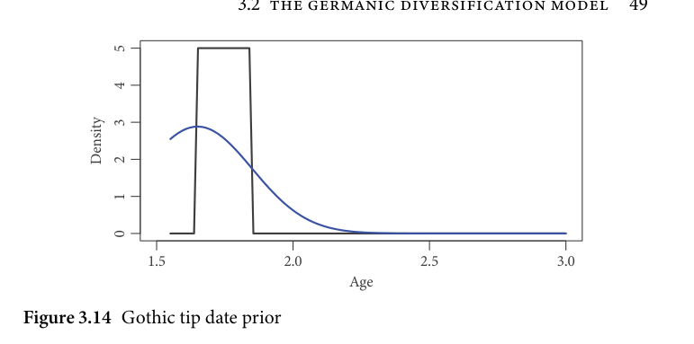
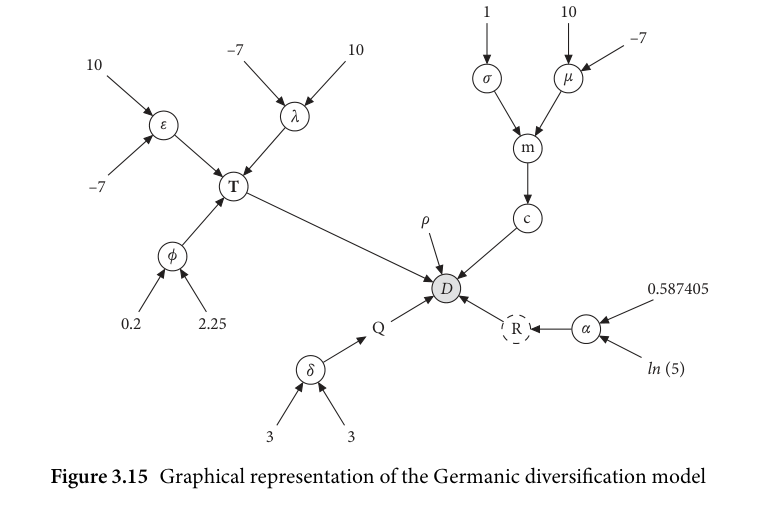

# 3.2.2 Model differences

<!-- source-page: 47; pdf-page: 66 -->
3.2 THE GERMANIC DIVERSIFICATION MODEL  47

  In the case of the analysis at hand, this issue was addressed by setting tip
dates (see section 3.2.2) and root frequencies. The latter parameter sets the
frequency of each character state at the root. For example, a root frequency of
[0.3, 0.7] in a binary character dataset represents a situation in which the state 0
occurs in 30 per cent of all sites at the root. The benefit of an innovation-based
dataset is that, because this dataset records deviations from the root state, the
character state at the root is known. In this case it means that if the root consists
exclusively of sites of the character 0 ‘no innovation’, the root frequency can be
set to a fixed parameter of [1, 0] as the character state 0 occurs in 100 per cent
of the cases. Thereafter, the issue of misattribution of character states to the
root is mitigated.
  The last fixed parameter common to all models is the tree prior (i.e. the
model governing the tree topology). The tree prior was selected to be a birth–
death¹⁵ prior with fossil taxa similar to the Fossilized-Birth-Death model
described in Heath, Huelsenbeck, and Stadler (2014).
  As can be seen from the core elements explored above, all aspects of the
models are either inferred and therefore not predetermined or task-specific
as the fixed parameters are: the root frequencies need to be fixed in order to
account for the type of data we are presented with and the birth–death tree
prior is a standard choice for models with non-extant lineages and no ances-
try constraints (i.e. exclusively historic data which do not include sampled
ancestors of certain clades). This means that the core aspects are rather flexible
and can be determined mostly from the data rather than from the modelling
choices.
  Nevertheless, there are certain elements of analysis which need to be
predetermined but impact the inferred phylogeny considerably. In this case,
this is true for the fossil date priors and the choice of substitution model. For
this reason, I chose to split the analysis into six models consisting of combina-
tions of two types of fossil dating priors and three types of substitution models.
These six phylogenetic models can later be examined and evaluated for their
fit to the data.

                       3.2.2 Model differences

As mentioned above, the models were run with several different settings con-
cerning the tip dating priors and the site rates. The reason for running different
models is that other than the parameters described above, there are several

    ¹⁵ See Höhna (2015) for discussion.

<!-- source-page: 48; pdf-page: 67 -->
possibilities for setting tip date and site rate priors. In addition, these set-
tings are both crucial to the model outcomes and do not have clear theoretical
preferences.
   Firstly, the tip dating¹⁶ mechanism can be set in two different ways: hard-
bounded and inferred.
  The hard-bounded solution is to set a uniform prior on a specific age range
for each tip where, as it is implemented in RevBayes, all values within this
range have a likelihood of 1 (see Barido-Sottani et al. 2020). This assigns equal
probability to ages within a certain range, and zero probability to ages outside
of it.
 On the other hand, the inferred tip dates set a more informative but less
restrictive prior on the age (e.g. a truncated normal distribution). Here, the
model infers the age of tip from the data, given that the phylogenetic signal is
strong enough to allow for this.
  Explaining the advantages and disadvantages of both methods first of all
requires a discussion of the meaning of dating in a phylogenetic framework.¹⁷
As it was partially outlined in the discussion of the root age priors, the tip ages
in the tree represents the terminus ante quem for the occurrence of the respec-
tive tip (i.e. the last possible time at which the tip has occurred). This is difficult
to apply to languages that are constantly in flux and cannot be easily dated to a
single year. Thus, the terminus ante quem for each language (each tip) marks
the point in time at which the data that are provided to the model have devel-
oped. For this analysis it represents the date at which all included innovations
have occurred. Moreover, this ‘completion’ of the innovations does not nec-
essarily correspond to the date of attestation as, by that time, the innovations
might have already been completed for a few decades or even centuries.
  In this light, hard-bounded and inferred tip date mechanisms have different
implications both theoretically and computationally. Hard-bounded priors
have the advantage of setting a narrow range of possible occurrence times
that can be set according to expert judgement. They imply that there is a
plausibility range for the occurrence age of each language which is fixed for
each language. The inferred date mechanism gives the model the freedom
to determine the tip ages itself. The advantage is that the boundaries of the
occurrence times are not fixed but flexible and allow for values outside of a
fixed and pre-determined range. However, there are also disadvantages that

   ¹⁶ See Heled and Drummond (2012); Pyron (2011); Ronquist, Klopfstein, et al. (2012); and
Warnock et al. (2015) for a discussion of the advantages of fossil calibrations in divergence-time models.
    ¹⁷ Ho and Phillips (2009) discusses different approaches with regard to their advantages and
disadvantages from the modelling perspective.

<!-- source-page: 49; pdf-page: 68 -->
3.2 THE GERMANIC DIVERSIFICATION MODEL  49

      5

      4

                              Density 32

      1

      0

                     1.5                    2.0                    2.5                    3.0
                                          Age
Figure 3.14 Gothic tip date prior

impact the outcome of the analysis both computationally and theoretically.
To illustrate one of these issues, Figure 3.14 shows a plot of two prior dis-
tributions for the Gothic taxon: one is hard-bounded (Uniform(1.65, 1.85),
the step function peaking at a density of 5) while the other is soft-bounded
(TruncatedNormal(1.65, 0.2, 1.55, root age), density curve). The uniform prior
assumes that at some time between 150 and 350 AD, Gothic reached the point
where all innovations had occurred, whereas the normal prior determines
the most likely time of this date to be between 150 and 450 with decreasing
likelihood towards dates between the root age (up to 1000 BC) and 150 AD.
   It becomes clear that the range of values the inferred approach allows
increases by more than seven times adding more variability and uncertainty
into the system. This is especially a problem for smaller datasets such as the
one at hand where the estimates become less accurate. This can lead to an
increase in credible intervals of the posterior distribution and even reduce the
goodness of fit to the dataset. Moreover, this distribution allocates some prob-
ability mass to values greater than 2 (dates older than the year 1 AD) which
become increasingly unlikely.
  Due to the advantages and disadvantages of each approach, we cannot
determine which settings are more adequate for the data. This means that
model evaluation techniques need to establish whether adding softer bounds
on the tip dates yields a better fit than the hard-bounded model does (see
section 3.2.4). In this case, it is not possible to default on the simpler model (i.e.
the hard-bounded model) since there is no a priori way to assess whether the
bounds we set for the hard-bounded model are adequate. By leaving the model
more freedom in determining the tip dates, we leave room for the possibility
for softer bounds to be better for this analysis. In this case, the better fit would

<!-- source-page: 50; pdf-page: 69 -->
overpower the increased uncertainty inserted by the flexible bounds. In turn,
all models need to be run once with a hard-bounded tip dating mechanism
and once with inferred tip dates.
  The second parameter that varies across the models is the substitution
model which governs the site rates. Recall that the site rates represent the
rates at which the character states, that make up the dataset, change to a dif-
ferent state. In this particular case, the rate at which 0 changes to 1 and vice
versa. There are multiple options to set up the substitution model as outlined
above, yet not all of those models and settings are theoretically reasonable.
The theoretical basis for setting up sensible substitution models comes from
considerations concerning the dataset type. With innovation-based binary
character data, there are several possible methods of site rate modelling, three
of which were considered for the task at hand.
  The first site rate set-up is a Jukes-Cantor model which, as described above,
sets equal rates across all characters. Under this assumption, innovations and
events which delete innovations are equally likely and therefore occur equally
often. This presupposes an equilibrium among the innovations which can
serve as a model agnostic to the frequency of the character states 0 and 1. The
advantage is here that we give all linguistic changes equal weight with regard
to their occurrence in the dataset.
  While the Jukes-Cantor model seems  fairly neutral, there are major
issues that are introduced when assuming an equal rate of innovation and
non-innovation.¹⁸
   Firstly, the dataset is inherently biased in that it records innovations when
they occur and neglects linguistic phenomena where all Germanic daughter
languages agree. In other words, while it is intuitive in non-innovation-based
binary datasets encoding two exclusive states (e.g. datasets recording the pres-
ence or absence of a predetermined list of cognates or exclusive typological
properties in certain languages) to assume an equal variation between states,
due to the fact that innovation datasets only record a site when one of the lan-
guages undergoes an innovation, the states 0 and 1 are no longer independent.
Moreover, this leads to a more serious issue of shared retentions versus shared
innovations. Since shared innovations have more weight in the establishment
of a linguistic subgroup (cf. Campbell 2013: 174–184; and Crowley and Bow-
ern 2010: 108–124). The state 1 should thus have more weight than state 0 in
the phylogenetic signal.

    ¹⁸ See section 3.1.3 for discussion of uniformity of rate.

<!-- source-page: 51; pdf-page: 70 -->
3.2 THE GERMANIC DIVERSIFICATION MODEL  51

  One of the consequences of this model would be to assign a higher rate to
state 1, for example to restrict the model from assuming the path 1 > 0 in the
data. The corresponding substitution model would place maximum weight on
innovations and would therefore represent an innovation-only model. Yet this
approach itself is not without downsides since it entirely neglects the occur-
rence of innovation-deleting events. Say, an innovation was jointly acquired
in a subgroup but then lost by one of its members. In this case, the innovation-
only model would see this as strong evidence against subgrouping. Further, it
operates under the strong assumption that every single innovation is equally
important for subgrouping and therefore it might underestimate the influence
of homoplasies. Therefore, it is important to keep in mind that the innovation-
only model as implemented here is not the computational equivalent of the
traditional cladistical method that strongly prioritizes shared innovations over
shared retentions.
  The relaxation of the rate change here is intended to reflect the process
of innovation obscuring. For example, in a given language with one possi-
ble innovation, a 0 in the data can arise in more than one way: either it is a
genuine retention or another process has obscured the innovation to such a
degree that we cannot observe a 1 in this place anymore. In some instances,
intermediate innovations remain unobserved in favour of another innova-
tion. Assume, for example, there are two hypothetical languages that have the
reflexes au and a for earlier *o. If the histories of these languages are not clear,
we might assume that the first language exhibits diphthongization/breaking of
*o whereas the second shows lowering. The coding for the first language would
be (1,0) (= breaking yes, lowering no) and (0,1) (= breaking no, lowering yes)
for the second language. If there were, however, an unobserved intermedi-
ate stage of language 2 which shows nucleus simplification with a full history
*o > *au > a, we would need to code this as (1,1) (= breaking yes, coda sim-
plification yes). This demonstrates that it cannot be guaranteed that 0 always
changes to 1 and never to 0. This does not mean an innovation reversal in the
literal sense but an artefact of historical datasets where observing a 0 in one site
can mean different things. Another way this can occur is through borrowing
from neighbouring variants or languages in places where an innovation would
be observed. Specifically, if another variant of a linguistic feature is borrowed
which obscures the innovation, we also observe 0 instead of 1 in this position.
We thus need a mechanism in the model that can account for this issue.
  In conclusion, we want to use a substitution model that regards innova-
tions as more important than retentions but can also account for events that
delete an innovation. As a consequence, I used a third substitution model that

<!-- source-page: 52; pdf-page: 71 -->
infers the substitution rates from the data which gives the inference a stable
basis to determine the site rates without assuming either an equilibrium or an
innovation-only process. Whether or not this inference is successful needs to
be tested through model comparison.

Model summary
The following discussion will show a summary of the models run for the phy-
logenetic inference analysis including the model specifications and a prior
summary. Figure 3.15 displays the model graphically whereas Table 3.3 shows
a summary table of the priors where the column ‘Node’ corresponds to the
nodes displayed in the graphical model.
  Figure 3.15 shows that the inference model consists of four sub-models and
a root state setting ρ. The tree model is a time-tree supplied with the root age
prior ϕ, a speciation rate λ and an extinction rate ε. Further, the inference
model is a relaxed-clock assumption model c. The site rates R are modelled
via a gamma distribution and the substitution model Q is, depending on the
type of model, as a Jukes-Cantor, an innovation-only or a variable rates model.

                                                    1        10

                                                                   –7
                    –7             10
    10
                                                     σ        μ

                             λ                ε
                                  m

    –7           T

                                             ρ             c

            ϕ

                                D                         0.587405

           0.2        2.25           Q            R       α

                                 δ                                                  ln (5)

                          3         3
Figure 3.15 Graphical representation of the Germanic diversification model

   ¹⁹ The substitution model displayed here represents the setting for the inferred substitution rates
model. The Jukes-Cantor setting is a matrix where the rates are equal while in the innovation-only
model, the rate setting is δ0→1 = 1.

<!-- source-page: 53; pdf-page: 72 -->
3.2 THE GERMANIC DIVERSIFICATION MODEL  53

Table 3.3 Summary of priors

                  Node   Prior                               Specification

Tree model         ϕ       TruncatedNormal(2.25, 0.2, 1.8, 3)   root age
                         ε       LogNormal(-7, 10)                  extinction rate
                     λ       LogNormal(-7, 10)                  speciation rate

                                          δ0→1Substitution model¹⁹  Q                                       Q-matrix                                   δ1→0   –δ1                            [–δ0      ]
                                δ0,1      Dirichlet(3, 3)                        substitution rate

Root frequencies      ρ         (1, 0)

Clock model              cbranch   Exponential( m)1                    branch rates
            m      LogNormal(μ, σ)                  branch rates prior
                   μ       Normal(-7, 10)
                     σ       Exponential(1)

Site rate model      R       DiscretizedGamma(α, α, 4)            site rates
                   α       LogNormal(ln(5), 0.587405)           site rates prior

  The prior settings for the substitution, tree, and clock models are explained
in the previous section. The priors for the site rate model are standard priors
recommended in Höhna, Landis, et al. (2017: 76–78) favouring smaller values
of α. Moreover, the extinction and speciation priors are rather flat with a dis-
tinct spike at small values between 0 and 0.01. This ensures that the full range
of rates up to infinity is possible but very small values are strongly favoured.
  The tip dating priors were set according to the estimates of attestation time
in previous research. Table 3.4 shows the dates for each language along with
sample estimates from previous literature.
   It  is evident that for  all languages, the estimates show relatively long
intervals—some spanning several hundred years. This is due to the fact that
there is no single attestation point for these languages; rather, the earliest attes-
tations often come from scarce sources such as a small number of inscriptions.
This is the case for Old Norse and Old Frisian, for example. In these languages,
the first scant attestations predate the larger text corpora by several hundred
years.
  For the modelling aspect, where dating is important, we are mostly focused
on the terminus ante quem (see discussion above). In other words, the time
period set for the tip dates of the models must coincide with the time period
for which we can reasonably well assume all linguistic features to be present. It
means that although Old Frisian is attested as early as 800 AD, a great part of

<!-- source-page: 54; pdf-page: 73 -->
Table 3.4 Attestation time estimates of the Germanic languages

Language            Date                References

Gothic               350                 Voyles (1992: 1)
                     350–380          Nedoma (2017: 87)
                       4th cent.           Robinson (1993: 48)
                             Ulfilas’ lifetime       Miller (2019: 7–8)
                        (4th cent.)

Old English           mid-5th cent.       Smith (2009: 6)
                     700                 Lass (1994: 15)
                     750/900             Voyles (1992: 2)
                       8th cent.           Van Gelderen (2014)

Old Frisian           800–1275          Bussmann (2004: 1) (‘Pre-OFris’)
                     1200             Bremmer (2009: 6)
                     1250                Voyles (1992: 2); Versloot (2004: 257)
                      13th cent.           Harbert (2007: 18); Robinson (1993: 181)

Old Saxon            700                 Lass (1994: 15)
                       8th cent.                      J. Salmons (2018: 108)
                     830                 Voyles (1992: 2); Robinson (1993: 110)
                       9th cent.            Harbert (2007: 15)

Old High German     600–830             Voyles (1992: 2); Nedoma (2017: 882–883)
                     750               Braune and Eggers (1987: 1)
                     765               Robinson (1993: 226)
                       8th cent.                      J. Salmons (2018: 107); Harbert (2007: 15);
                                          Sonderegger (2012: 1),

Old Norse            800–1050          Noreen (1923)
                     1100                Voyles (1992: 2)
                     1150             Haugen (1982: 5)

Burgundian (majority   400–500          Hartmann and Riegger (2022)
of records)

Vandalic (majority of   400–500          Hartmann (2020: 13); Francovich Onesti
records)                                    (2002: 133–134)

the linguistic innovations we can determine for Old Frisian are attested later.
It is therefore important to set a time window for the analysis which is closer
to the earliest larger textual attestations but reaches far enough into the earlier
times to capture the possibility of innovations being completed earlier.
  Concretely this means that while in Old Norse, for example, we find sev-
eral runic inscriptions showing many features of Old Norse (which would be
considered Proto-Norse) from the 9th century on, most information about the
language comes from Old Icelandic, and specifically Old Icelandicprose, about
