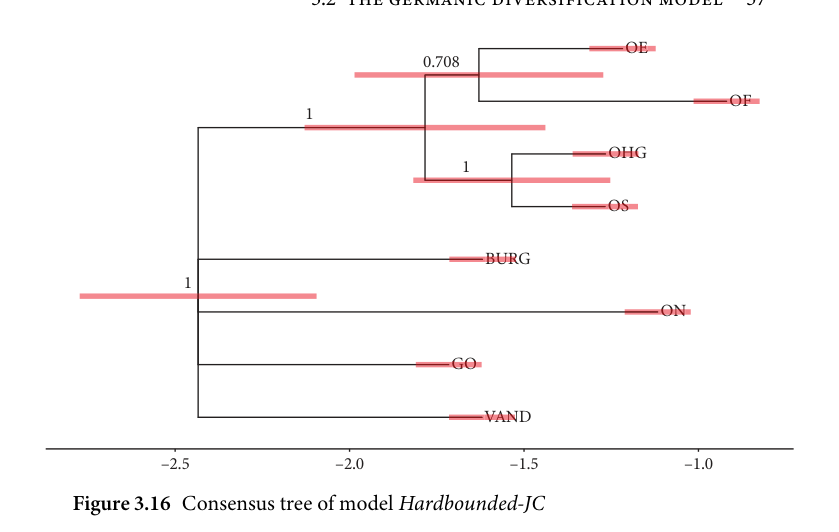
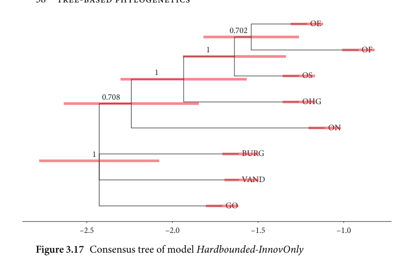
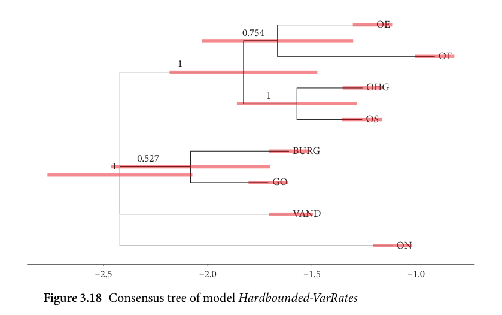
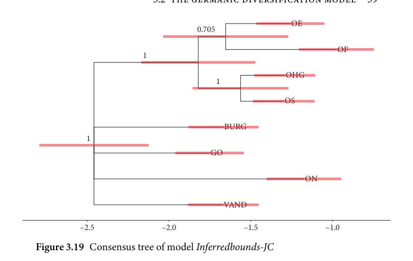
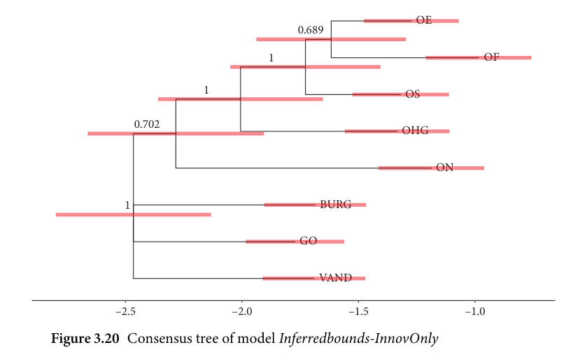
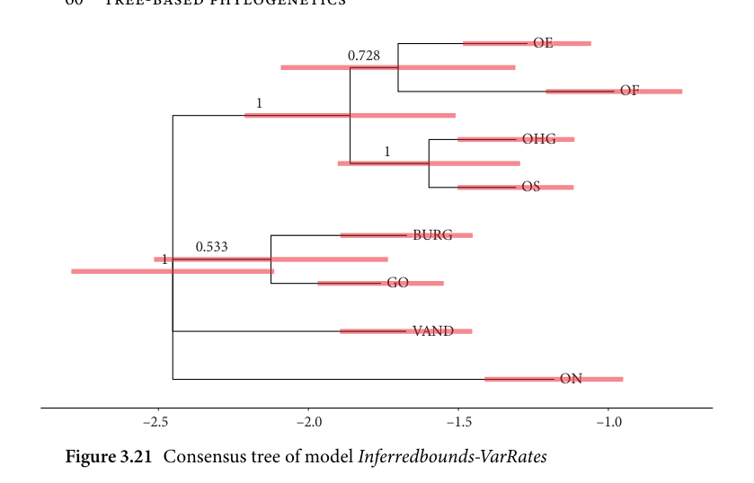

# 3.2.3 Results

<!-- source-page: 55; pdf-page: 74 -->
3.2 THE GERMANIC DIVERSIFICATION MODEL  55

          Table 3.5 Hard-bounded tip date priors

           Tip            Prior                    Corresponding
                                                  time frame

       GO           Uniform(1.6, 1.8)          200–400 AD
       ON           Uniform(1.0, 1.2)          800–1000 AD
        OE            Uniform(1.1, 1.3)          700–900 AD
        OF            Uniform(0.8, 1.0)          1000–1200 AD
        OS            Uniform(1.15, 1.35)        650–850 AD
       OHG          Uniform(1.15, 1.35)        650–850 AD
        VAND         Uniform(1.5, 1.7)          300–500 AD
        BURG         Uniform(1.5,1.7)          300–500 AD

Table 3.6 Inferred-tip model tip date priors

Tip        Prior                                      Corresp.       Corresp.
                                          mean date       latest date

GO        TruncatedNormal(1.7, 0.2, 1.6, root age)       300 AD        400 AD
ON        TruncatedNormal(1.1, 0.2, 1.0, root age)       900 AD        1000 AD
OE        TruncatedNormal(1.2, 0.2, 1.1, root age)       800 AD        900 AD
OF        TruncatedNormal(0.9, 0.2, 0.8, root age)       1100 AD       1200 AD
OS        TruncatedNormal(1.25, 0.2, 1.15, root age)     750 AD        850 AD
OHG      TruncatedNormal(1.25, 0.2, 1.15, root age)     750 AD        850 AD
VAND     TruncatedNormal(1.6, 0.2, 1.5, root age)       400 AD        500 AD
BURG     TruncatedNormal(1.6, 0.2, 1.5, root age)       400 AD        500 AD

300 years later. For each individual innovation it is difficult to ascertain when
exactly it was acquired; thus, in order to capture this uncertainty, we need
to set an interval which covers a range of dates leading up to the approximate
time of the earliest extensive attestations. For this, I chose uncertainty intervals
which span 200 years and end at, or shortly before, the estimated attestations.
Table 3.5 shows the tip priors that were set for the hard-bounded models and
Table 3.6 shows the priors in the more relaxed tip-inferring model.

                             3.2.3 Results

This section addresses the results of the phylogenetic inference models. Firstly,
I will discuss the consensus trees obtained from the models before analysing
the individual parameter estimates and the split frequencies of clades in the
posterior distribution. The primary aim of this section will be to outline the
results of each model and to discuss how, and with regard to which aspects,

<!-- source-page: 56; pdf-page: 75 -->
the models differ. Afterwards, in section 3.2.4, we will use statistical measures
to determine the model with the best fit which will then be discussed in further
detail.
  All models were run with two chains of 500,000 iterations with a thinning
interval of 100. In Bayesian modelling, running two to four chains is the norm.
In Bayesian phylogenetics, running two chains is sufficient as convergence can
be accurately ascertained. As a result, the posterior distribution contains 2,500
samples per chain after the first 50 per cent of iterations were removed as a
burn-in.
  The convergence of the models was checked using the Gelman-Rubin con-
vergence diagnostic as implemented in the R-package coda (Plummer et al.
2006).

Consensustrees
Among the central tools in phylogenetic posterior analysis is the graphical dis-
play of the consensus trees. Consensus trees are a type of summary tree from
all trees in the posterior distribution which depicts the most common struc-
ture in the posterior distribution. It shows those clades that exhibit a support
of greater than 0.5. In phylogenetic inference, support denotes the frequency of
the occurrence of a given clade relative to the total number of posterior sam-
ples. Thus, a support of 0.7 indicates that 70 per cent of all posterior samples
show this clade. In this study, I will take a support value of greater than 0.9 is
as the cutoff point to safely assume a clade is supported by the data. All splits
with support of lower than 0.9 are taken to be insufficiently supported by the
data and therefore need to be discussed with caution if not discarded entirely.
This value is essentially a credible interval cutoff point that in Bayesian con-
texts can vary between 0.89 and 0.95 (McElreath 2020: 56). A credible interval
is the value range which contains the unobserved (‘true’) parameter with a
probability of 89 or 95 per cent, depending on the interval size.
  The following plots show the consensus trees for all six models, the first
of which to be investigated is the Hardbounded-JC model with uniform tip
date priors and a Jukes-Cantor substitution model. The tree in Figure 3.16
shows this consensus tree. All consensus trees discussed in this section show
the following properties:

   1. Greytransparentbars on splits denote the posterior split/node age 0.95-
      credible intervals.
   2. Numbers on branches denote the posterior support of the respective
      clade. As consensus trees only depict clades with a support of > 0.5, the
     numbers only range from 0.5 to 1.

<!-- source-page: 57; pdf-page: 76 -->
3.2 THE GERMANIC DIVERSIFICATION MODEL  57

                                                OEOE
                                                0.708

                                                           OFOF
                            1

                                         OHGOHG
                                               1

                                                  OSOS

                                    BURGBUR
             1

                                             ONON

                              GOGO

                                   VANDVAN

            –2.5                    –2.0                    –1.5                    –1.0
Figure 3.16 Consensus tree of model Hardbounded-JC

   3. Multifurcating clades are shown in the consensus tree when its member
      taxa do not belong to any clade with support > 0.5. It needs to be kept in
    mind that the phylogenetic model always assumes bifurcating splits in
      individually sampled trees and the multifurcating consensus thus repre-
      sents a graphical display of insufficient clade support even though each
      individual posterior tree is strictly bifurcating.
   4. The scale shown on the bottom of each tree gives the absolute time the
     model was calibrated to in thousands of years. The negative values on
     the scale indicate that the values represent years before present with the
     present being 0 on the scale.

  In this tree we can observe that Burgundian, Gothic, Old Norse, and Van-
dalic are not represented in any clade whereas West Germanic surfaces with
full support. Further, Old High German and Old Saxon are grouped together
in a clade with full support whereas Old English and Old Frisian, although
they are represented in a clade, do not exhibit support beyond 0.9.
  The consensus tree of the Hardbounded-InnovOnly model (Figure 3.17)
is considerably different from the previous tree in Figure 3.16. Here we see
that, although clades containing Burgundian, Gothic, and Vandalic are still
not represented by a majority of posterior samples, we see full support for
West Germanic and Ingvaeonic. Moreover, Northwest Germanic has become
a clade, even if the grouping is not supported above the 0.9 threshold.

<!-- source-page: 58; pdf-page: 77 -->
OEOE
                                                      0.702

                                          1                            OFOF

                             1                                                   OSOS

                  0.708
                                         OHOHG

                                              ONON

              1                          BURGBUR

                                    VANDVAN

                              GOGO

            –2.5                    –2.0                    –1.5                    –1.0
Figure 3.17 Consensus tree of model Hardbounded-InnovOnly

                                                 OEOE
                                             0.754

                                                           OFOF
                           1

                                          OHGOH
                                             1

                                                   OSOS

                                    BURGBUR
                     0.527
              1

                              GOGO

                                     VANVAND

                                              ONON

            –2.5                    –2.0                    –1.5                    –1.0
Figure 3.18 Consensus tree of model Hardbounded-VarRates

  The results in Figure 3.18 are close to those of the corresponding Jukes-
Cantor model with one exception: here, Burgundian and Gothic form a clade
that is barely above the consensus tree support threshold but far from being
well-supported.

<!-- source-page: 59; pdf-page: 78 -->
3.2 THE GERMANIC DIVERSIFICATION MODEL  59

                                             OEOE
                                             0.705

                                                       OFOF
                          1

                                       OHGOHG
                                            1

                                               OSOS

                                 BURGBURG
            1

                            GOGO

                                          ONON

                                 VANDVAND

            –2.5                   –2.0                   –1.5                   –1.0
Figure 3.19 Consensus tree of model Inferredbounds-JC

                                              OEOE
                                                0.689

                                      1                           OFOF

                          1                                                OSOS

                0.702
                                       OHGOHG

                                          ONON

             1                        BURGBURG

                            GOGO

                                 VANDVAND

             –2.5                   –2.0                   –1.5                   –1.0
Figure 3.20 Consensus tree of model Inferredbounds-InnovOnly

  In comparison with Figure 3.16, the inferred-bounds model in Figure 3.19
does not show any notable differences in its results except the larger intervals
of the tip and node ages.
  The same is true for Figure 3.20 which now additionally shows an unsup-
ported Gotho-Burgundian clade in contrast to the model in Figure 3.19.

<!-- source-page: 60; pdf-page: 79 -->
OEOE
                                           0.728

                                                        OFOF
                          1

                                        OHGOHG
                                           1

                                                OSOS

                                  BURGBURG
                    0.533
             1

                             GOGO

                                  VANDVAND

                                           ONON

            –2.5                    –2.0                   –1.5                   –1.0
Figure 3.21 Consensus tree of model Inferredbounds-VarRates

  The model in Figure 3.21 changes notably from the model in Figure 3.18
when the tip dates are added since the Old Saxon–Old High German
clade is unsupported in this model. Moreover, Northwest Germanic and
Gotho-Burgundian pass the threshold by a slim margin.

Parameterestimates
This section investigates and compares the posterior estimates of the model
parameters across the six different models (see Table 3.7 for a summary of the
posterior estimates).
  The α parameter governing the among-site variation is estimated between
12 and 48 across all models with a relatively coherent mean between 28 and
31. The fact that the models do not differ notably regarding this parame-
ter shows that the among-site variation is not significantly affected by either
the substitution model or the tip date inference. The divergences we do see
among the models are likely to be due to random noise. This does also imply
that between the different types of innovations (phonological, morphologi-
cal, syntactic, and lexical), there were no detectable differences in the rate of
change. In other words, with regard to this dataset and analysis, changes in, for
example, the domain of syntax and phonology behave similarly in their change
rates—an observation that parallels the research in, for example, Longobardi
and Guardiano (2009) which finds that the informativity of syntactic changes
regarding the phylogenetic signal is comparable to changes in other domains.

<!-- source-page: 61; pdf-page: 80 -->
3.2 THE GERMANIC DIVERSIFICATION MODEL  61

Table 3.7 Posterior estimates of model parameters

Parameter       Model               Mean   Point.    Lower-   Higher-
                                                       estimate  89CI    89CI

                Hardbounded-JC           29.02   26.44      12.11     44.05
                 Hardbounded-InnovOnly   30.52   27.74      13.38     47.58
                 Hardbounded-VarRates     30.11   27.59      13.37     46.70alpha                    Inferred-JC                28.72   26.31      13.24     43.99
                   Inferred-InnovOnly        30.13   27.80      14.16     46.33
                    Inferred-VarRates           29.98   27.42      13.29     45.12

                Hardbounded-JC            0.01    0.00       0.00      0.01
                 Hardbounded-InnovOnly    0.01    0.00       0.00      0.01
                 Hardbounded-VarRates      0.01    0.00       0.00      0.01extinction-rate                    Inferred-JC                  0.01    0.00       0.00      0.01
                   Inferred-InnovOnly          0.01    0.00       0.00      0.01
                    Inferred-VarRates            0.01    0.00       0.00      0.01

                Hardbounded-JC            2.42    2.42       2.15      2.71
                 Hardbounded-InnovOnly    2.42    2.41       2.11      2.70
                 Hardbounded-VarRates      2.42    2.41       2.12      2.69origin-time                    Inferred-JC                  2.46    2.46       2.18      2.73
                   Inferred-InnovOnly          2.46    2.46       2.19      2.75
                    Inferred-VarRates            2.45    2.45       2.17      2.73

                Hardbounded-JC            0.37    0.34       0.12      0.58
                 Hardbounded-InnovOnly    0.36    0.34       0.12      0.57
                 Hardbounded-VarRates      0.37    0.34       0.13      0.58speciation-rate                    Inferred-JC                  0.36    0.34       0.12      0.58
                   Inferred-InnovOnly          0.35    0.33       0.12      0.56
                    Inferred-VarRates            0.36    0.33       0.12      0.56

change rate 0 →1  Hardbounded-VarRates      0.69    0.69       0.63      0.75
                    Inferred-VarRates            0.69    0.69       0.62      0.75

change rate 1 →0  Hardbounded-VarRates      0.31    0.31       0.25      0.37
                    Inferred-VarRates            0.31    0.31       0.25      0.38

  Speciation and extinction rate are equally uniformly coherent across the
models. The speciation rate implies that on average 0.3 speciation events occur
per lineage and per 1,000 years. The low extinction rate across the models
suggests that extinction events are a negligible factor turning the phylogenetic
inference models into nearly pure Yule (birth-only) models.
  The root age parameter is centred around 2.45 and essentially equal across
the models. This is especially surprising given that the models inferring the tip
dates operated under considerably more relaxed time calibrations. As a result,
we are given a relatively secure estimate for the termini ante quem and post

<!-- source-page: 62; pdf-page: 81 -->
quem for the break-up of the Germanic languages. According to the phyloge-
netic models, the break-up occurred in the time frame between 750 and 100
BC with an approximate most likely (maximum likelihood) date of 450 BC.
While the issue of dating is analysed in-depth in section 3.2.2, it is important
to note that the phylogenetic evidence projects Proto-Germanic unity to be
older than 150 BC.
  For the rate matrix parameters used in the variable rates models, we find that
the change 0 →1 is always notably higher than the change from 1 →0 in both
models. The inferred-age model, however, shows a change rate for 0 →1 that
is approximately equally high as its hard-bounded counterpart. The values for
the change rates call for comment: the rates indicate a change 1 →0 occurs in
30 per cent of the cases which suggests that 1 in 3 changes is obscured or not
recoverable. Recall that innovation deletion can arise through different mech-
anisms and does not indicate, in this case, an actual innovation reversal. Since
the Dirichlet(3,3) prior on the rate matrix is weakly informative and centred,
it could be the case that this figure of 30 per cent deletions is too high. This
issue is investigated in section 3.2.4.
  The posterior estimates (see summary in Table 3.8) for the tip dates between
the hard-bounded and the inferred tip models are not considerably differ-
ent. We see that most estimates of the inferred models are very close to their
hard-bounded counterparts. This could be indicative of the fact that the more
flexibly calibrated models arrive at a similar posterior distribution to that of the
hard-bounded models because the flexibility does not add notable information
to the model. Whether this flexibility yields a better fit to the data, however,
needs to be explored (see section 3.2.4).

Splitfrequencies
Split frequencies in a phylogenetic model denote the proportion of samples in
which a certain split or, in this case, clade occurs in the posterior distribution.
Important clades (i.e. support > 0.5) are represented in consensus trees which
can be observed in Figures 3.16 to 3.21. Further, one can extract split frequen-
cies and node ages of specific clades that are not represented in a consensus
tree and analyse those across the models.
  Table 3.9 shows the summary of eight potential clades and their sup-
port and age across different models. Some clades are subgroups that were
established or hypothesized to exist in previous research and some, such as
NWGmc-Vandalic, are previously never suggested clades that were included
for purposes of reference.

<!-- source-page: 63; pdf-page: 82 -->
3.2 THE GERMANIC DIVERSIFICATION MODEL  63

  As the summary contains splits of clades, the ages given in these tables refer
to the break-up times of these clades. Therefore, an age of 1.5 would represent
a clade splitting into two daughter clades 1,500 years before present.
  From the tables, we can gather that the only clade with full support in all
models is West Germanic with an estimated break-up time between 300 BC
and 500 AD. These large credible intervals indicate great uncertainty in the
data about the actual time of the split.
  The innovation-only models differ considerably in their split support
strengths from the other models. There we see that Northwest Germanic and
Ingvaeonic are supported with high support values, while in other models
this is not the case. This raises the question of what this implies about the
dichotomy of the innovation-only models and the variable rates models. On

Table 3.8 Posterior estimates of tip ages

Parameter   Model                Mean    Point.     Lower-    Higher-
                                                    estimate   89CI      89CI

            Hardbounded-JC            1.60      1.60        1.50        1.68
            Hardbounded-InnovOnly    1.60      1.60        1.52        1.70
             Hardbounded-VarRates      1.60      1.60        1.52        1.69BURG-age               Inferred-JC                  1.69      1.67        1.50        1.86
              Inferred-InnovOnly          1.69      1.68        1.50        1.87
               Inferred-VarRates            1.69      1.67        1.50        1.87

            Hardbounded-JC            1.70      1.70        1.60        1.78
            Hardbounded-InnovOnly    1.70      1.70        1.60        1.78
             Hardbounded-VarRates      1.70      1.70        1.61        1.79GO-age               Inferred-JC                  1.78      1.76        1.60        1.95
              Inferred-InnovOnly          1.78      1.76        1.60        1.95
               Inferred-VarRates            1.78      1.76        1.60        1.95

            Hardbounded-JC            1.20      1.20        1.10        1.28
            Hardbounded-InnovOnly    1.20      1.20        1.11        1.29
             Hardbounded-VarRates      1.20      1.20        1.11        1.29OE-age               Inferred-JC                  1.28      1.26        1.10        1.45
              Inferred-InnovOnly          1.28      1.26        1.10        1.44
               Inferred-VarRates            1.29      1.27        1.10        1.46

            Hardbounded-JC            0.90      0.90        0.82        1.00
            Hardbounded-InnovOnly    0.90      0.90        0.82        1.00
             Hardbounded-VarRates      0.90      0.90        0.82        1.00OF-age               Inferred-JC                  1.00      0.98        0.80        1.18
              Inferred-InnovOnly          1.00      0.98        0.80        1.18
               Inferred-VarRates            1.00      0.98        0.80        1.18

<!-- source-page: 64; pdf-page: 83 -->
Table 3.8 (cont.)

Parameter   Model                Mean    Point.     Lower-    Higher-
                                                    estimate   89CI      89CI

            Hardbounded-JC            1.25      1.25        1.16        1.34
            Hardbounded-InnovOnly    1.25      1.25        1.17        1.34
             Hardbounded-VarRates      1.25      1.25        1.15        1.33OHG-age              Inferred-JC                  1.31      1.30        1.15        1.46
              Inferred-InnovOnly          1.35      1.32        1.15        1.53
               Inferred-VarRates            1.32      1.31        1.15        1.47

            Hardbounded-JC            1.10      1.10        1.00        1.18
            Hardbounded-InnovOnly    1.10      1.10        1.01        1.19
             Hardbounded-VarRates      1.10      1.10        1.02        1.19ON-age              Inferred-JC                  1.20      1.18        1.00        1.38
              Inferred-InnovOnly          1.20      1.18        1.00        1.38
               Inferred-VarRates            1.20      1.18        1.00        1.39

            Hardbounded-JC            1.25      1.25        1.15        1.33
            Hardbounded-InnovOnly    1.25      1.25        1.15        1.33
             Hardbounded-VarRates      1.25      1.25        1.15        1.33OS-age              Inferred-JC                  1.32      1.30        1.15        1.47
              Inferred-InnovOnly          1.33      1.31        1.15        1.50
               Inferred-VarRates            1.33      1.31        1.15        1.48

            Hardbounded-JC            1.60      1.60        1.52        1.70
            Hardbounded-InnovOnly    1.60      1.60        1.50        1.68
             Hardbounded-VarRates      1.60      1.60        1.51        1.69VAND-age              Inferred-JC                  1.69      1.67        1.50        1.87
              Inferred-InnovOnly          1.70      1.68        1.50        1.87
               Inferred-VarRates            1.69      1.67        1.50        1.87

the one hand, we might expect to see a lower level of innovation deletions than
inferred in the variable rates models; however, on the other hand, variable
rates models are more robust as they account for variance in the observation
of the individual characters. The innovation-only models mainly assume that
every innovation is observed with full accuracy without errors and without
missing any intermediate steps.
  Here the shared innovations are more strongly represented which means
that those proposed clades such as Ingvaeonic and Northwest Germanic that
exhibit strong support in innovation-only models but little support in others
tend to be established on grounds of only a few innovations. In other words,
Ingvaeonic is only a reliably inferred subgroup on the basis of a small number
of innovations in innovation-only models. In the other models, this does not
suffice to establish a reliable subgroup.

<!-- source-page: 65; pdf-page: 84 -->
1.931.761.971.981.892.02   2.552.592.572.612.632.60   2.402.362.402.462.462.45   2.542.452.532.532.512.56                   upper-89CI
      Age

              1.341.291.371.351.371.38   1.931.961.942.002.011.99   1.781.731.771.791.781.78   1.841.861.901.881.951.90                   lower-89CI
      Age
models            median   1.611.531.651.661.611.70   2.242.282.272.302.342.31   2.052.062.072.112.132.12   2.172.142.132.172.242.21
      Agedifferent
across   mean              1.621.551.671.661.621.71   2.242.292.272.302.342.31   2.072.082.092.122.142.13   2.172.162.162.182.222.23
clades  Age
specific          0.710.700.750.700.690.73   0.230.300.210.210.290.20   0.470.470.530.490.490.53   0.040.010.030.040.020.04             Support
of
age
of
estimates
posterior          Model         Hardbounded-JCHardbounded-InnovOnlyHardbounded-VarRatesInferred-JCInferred-InnovOnlyInferred-VarRates         Hardbounded-JCHardbounded-InnovOnlyHardbounded-VarRatesInferred-JCInferred-InnovOnlyInferred-VarRates         Hardbounded-JCHardbounded-InnovOnlyHardbounded-VarRatesInferred-JCInferred-InnovOnlyInferred-VarRates         Hardbounded-JCHardbounded-InnovOnlyHardbounded-VarRatesInferred-JCInferred-InnovOnlyInferred-VarRates
and
Support
3.9                                                                                              GermanicTable    Clade                                     Anglo-Frisian                    East                                                                                 Gotho-Burgundian                                                            Gotho-Nordic

<!-- source-page: 66; pdf-page: 85 -->
– –– –                  1.89       2.00      2.532.532.562.572.612.58   2.572.632.612.642.662.65   2.062.212.122.122.292.15                   upper-89CI
      Age

    – –– –                  1.39       1.47      1.861.881.911.911.991.94   1.992.022.012.052.092.07   1.491.611.541.541.711.56                   lower-89CI
      Agemodels
different  – –– –            median      1.63       1.72      2.202.232.232.252.272.27   2.292.322.312.342.362.34   1.771.921.821.832.001.86
across  Age
clades   mean – –– –                  1.64       1.73      2.212.222.232.252.282.26   2.292.322.312.342.372.35   1.781.931.831.832.001.87
specific  Age
of
age          0.001.000.000.001.000.00   0.340.710.370.340.700.37   0.260.190.280.270.210.28  1.001.001.001.001.001.00             Supportof
estimates
posteriorand    Model         Hardbounded-JCHardbounded-InnovOnlyHardbounded-VarRatesInferred-JCInferred-InnovOnlyInferred-VarRates         Hardbounded-JCHardbounded-InnovOnlyHardbounded-VarRatesInferred-JCInferred-InnovOnlyInferred-VarRates         Hardbounded-JCHardbounded-InnovOnlyHardbounded-VarRatesInferred-JCInferred-InnovOnlyInferred-VarRates         Hardbounded-JCHardbounded-InnovOnlyHardbounded-VarRatesInferred-JCInferred-InnovOnlyInferred-VarRates
Support
                                                                                              Germanic(cont.)
3.9                                                                                                                                                                                               GermanicTable    Clade                            Ingvaeonic                                             Northwest                                                                       NWGmc-Vandalic                    West
